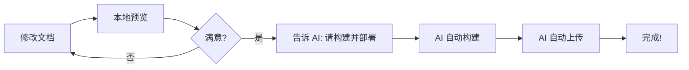

# CloudBase MCP 部署指南

本指南专门针对已安装 CloudBase MCP（Model Context Protocol）的用户。

---

## 🎯 什么是 CloudBase MCP？

CloudBase MCP 是腾讯云开发提供的 Model Context Protocol 集成，允许您通过 AI 助手直接操作云开发服务，无需手动安装 CLI 工具。

**优势：**
- ✅ 无需安装 CloudBase CLI
- ✅ 无需手动登录
- ✅ 通过对话即可完成所有操作
- ✅ AI 助手自动处理复杂配置

---

## 📋 前置准备

### 1. 确认 MCP 已安装

您应该能看到以下 MCP 工具可用：
- `mcp_cloudbase_login` - 登录云开发
- `mcp_cloudbase_uploadFiles` - 上传文件到静态托管
- `mcp_cloudbase_envQuery` - 查询环境信息
- 等等...

### 2. 准备腾讯云账号

确保您已经：
- ✅ 注册腾讯云账号
- ✅ 完成实名认证
- ✅ 创建了云开发环境（如果还没有，MCP 可以帮您创建）

---

## 🚀 快速部署步骤

### 步骤 1：登录 CloudBase

直接告诉 AI 助手：

```
请帮我登录 CloudBase
```

AI 助手会调用 `mcp_cloudbase_login` 工具，引导您完成登录。

### 步骤 2：查询或创建环境

**如果您还没有环境：**

```
请帮我创建一个 CloudBase 环境，名称为 ufbook-prod
```

**如果已有环境：**

```
请列出我的 CloudBase 环境
```

记录您的环境 ID（格式如：`ufbook-xxxxx`）。

### 步骤 3：更新项目配置

编辑 `cloudbaserc.json`，将环境 ID 替换：

```json
{
  "envId": "your-env-id-xxxxx",  // ← 替换为您的实际环境 ID
  "region": "ap-shanghai"         // ← 根据环境地域调整
}
```

或者直接告诉 AI：

```
请帮我更新 cloudbaserc.json，将 envId 改为 [您的环境ID]
```

### 步骤 4：构建网站

运行构建命令：

```bash
mkdocs build --clean
```

或者告诉 AI：

```
请帮我构建 MkDocs 网站
```

### 步骤 5：部署到静态托管

直接告诉 AI：

```
请帮我将 site 目录上传到 CloudBase 静态托管
```

AI 会自动调用 `mcp_cloudbase_uploadFiles` 工具完成部署。

### 步骤 6：查看部署结果

告诉 AI：

```
请查询我的 CloudBase 静态网站托管配置
```

AI 会返回您的访问地址，类似：
```
https://your-env-id.tcloudbaseapp.com/
```

---

## 🎨 配置广告和评论

### 启用腾讯广告

**步骤 1：申请广告账号**

1. 访问 [腾讯广告平台](https://e.qq.com/)
2. 注册并提交网站审核
3. 创建广告位，获取广告位 ID

**步骤 2：更新配置**

编辑 `mkdocs.yml`：

```yaml
extra:
  ads_enabled: true
  tencent_ads_enabled: true
  tencent_ad_banner_id: "您的横幅广告位ID"
  tencent_ad_sidebar_id: "您的侧边栏广告位ID"
  tencent_ad_article_id: "您的文章底部广告位ID"
```

或者告诉 AI：

```
请帮我在 mkdocs.yml 中启用腾讯广告，广告位ID分别是：
- 横幅：1234567890
- 侧边栏：1234567891
- 文章底部：1234567892
```

### 启用 Giscus 评论

**步骤 1：配置 GitHub**

1. 在 GitHub 仓库启用 Discussions
2. 安装 [Giscus App](https://github.com/apps/giscus)
3. 访问 [giscus.app](https://giscus.app/zh-CN) 生成配置

**步骤 2：更新配置**

编辑 `mkdocs.yml`：

```yaml
extra:
  comments_enabled: true
  giscus_enabled: true
  giscus:
    repo: "yourusername/ufbook"
    repo_id: "R_kgDOxxxxxxx"
    category: "Announcements"
    category_id: "DIC_kwDOxxxxxxx"
```

或者告诉 AI：

```
请帮我配置 Giscus 评论系统，配置信息如下：
- repo: yourusername/ufbook
- repo_id: R_kgDOxxxxxxx
- category: Announcements
- category_id: DIC_kwDOxxxxxxx
```

### 启用访问统计

**百度统计：**

```
请帮我在 mkdocs.yml 中配置百度统计，ID 是：a1b2c3d4e5f6g7h8
```

**Google Analytics：**

```
请帮我在 mkdocs.yml 中配置 Google Analytics，ID 是：G-XXXXXXXXXX
```

---

## 🔧 使用 MCP 的常用命令示例

### 环境管理

```
# 列出所有环境
请列出我的 CloudBase 环境

# 查询当前环境信息
请查询 CloudBase 环境 [环境ID] 的详细信息

# 查询静态托管配置
请查询静态网站托管配置
```

### 文件上传

```
# 上传整个 site 目录
请将 site 目录上传到 CloudBase 静态托管

# 上传单个文件
请将 site/index.html 上传到 CloudBase 静态托管的根目录

# 上传并指定云端路径
请将 site 目录的内容上传到 CloudBase，云端路径为 /
```

### 静态托管管理

```
# 查看静态托管文件列表
请列出 CloudBase 静态托管中的文件

# 删除文件
请删除 CloudBase 静态托管中的 [文件路径]

# 查询文件信息
请查询 CloudBase 静态托管中 index.html 的信息
```

### 域名管理

```
# 查询已绑定的域名
请列出 CloudBase 的已绑定域名

# 绑定自定义域名
请帮我绑定域名 docs.yourdomain.com 到 CloudBase

# 配置 HTTPS 证书
请为域名 docs.yourdomain.com 配置 HTTPS 证书
```

---

## 📝 完整部署流程示例

以下是一个完整的对话示例：

**您：** 请帮我登录 CloudBase

**AI：** ✓ 已调用登录工具，请在浏览器中完成授权...

**您：** 请列出我的 CloudBase 环境

**AI：** 找到以下环境：
- ufbook-prod (环境ID: ufbook-xxxxx)
- 地域：上海

**您：** 请帮我更新 cloudbaserc.json，将 envId 改为 ufbook-xxxxx

**AI：** ✓ 已更新配置文件

**您：** 请帮我构建 MkDocs 网站

**AI：** ✓ 构建完成，生成文件位于 site/ 目录

**您：** 请将 site 目录上传到 CloudBase 静态托管

**AI：** ✓ 上传完成！
您的网站地址：https://ufbook-xxxxx.tcloudbaseapp.com/

---

## 💡 MCP 的高级用法

### 1. 批量操作

```
请帮我完成以下操作：
1. 构建 MkDocs 网站
2. 上传到 CloudBase 静态托管
3. 清理本地构建缓存
```

### 2. 条件操作

```
如果 CloudBase 中没有 ufbook-prod 环境，请创建一个；
如果已存在，请列出其配置信息
```

### 3. 配置多个功能

```
请帮我配置：
1. 启用腾讯广告（广告位ID：...）
2. 启用 Giscus 评论（配置：...）
3. 启用百度统计（ID：...）
然后重新部署网站
```

---

## 🎯 与传统 CLI 的对比

| 操作 | 传统 CLI 方式 | MCP 方式 |
|------|--------------|----------|
| 安装工具 | `npm install -g @cloudbase/cli` | 无需安装 |
| 登录 | `tcb login` | 对话：请帮我登录 |
| 查询环境 | `tcb env:list` | 对话：请列出环境 |
| 部署 | `tcb hosting:deploy site` | 对话：请上传 site |
| 配置域名 | 手动在控制台配置 | 对话：请绑定域名 |

**MCP 的优势：**
- 🚀 更快：无需记忆命令
- 🎯 更准：AI 自动处理参数
- 💡 更智能：可以组合多个操作
- 📚 更友好：自然语言交互

---

## ⚠️ 注意事项

### 1. 环境选择

MCP 会根据 `cloudbaserc.json` 中的 `envId` 选择操作环境。请确保：
- ✅ `envId` 配置正确
- ✅ 环境已存在且有权限
- ✅ 已开通静态托管服务

### 2. 文件路径

上传文件时，MCP 使用：
- **本地路径**：相对于项目根目录（如 `site/`）
- **云端路径**：相对于静态托管根目录（如 `/` 或 `/docs/`）

### 3. 权限问题

如果遇到权限错误：
1. 确认已登录：`请确认 CloudBase 登录状态`
2. 检查环境权限：`请查询环境 [ID] 的权限配置`
3. 重新登录：`请重新登录 CloudBase`

### 4. 部署验证

部署后建议验证：
```
请帮我验证以下内容：
1. 网站是否可以访问
2. 静态资源是否正常加载
3. 配置是否生效
```

---

## 🔄 更新部署工作流

使用 MCP 后，您的部署流程变为：



**传统方式需要 5 步，MCP 只需 1 句话！**

---

## 📞 获取帮助

### 常用 AI 提示词

```
# 诊断问题
请帮我检查 CloudBase 配置是否正确

# 查看日志
请显示最近的 CloudBase 操作日志

# 回滚部署
请帮我恢复到上一个版本

# 清理缓存
请清理 CloudBase CDN 缓存
```

### 遇到问题时

1. **先问 AI：** "CloudBase 部署失败了，错误信息是..."
2. **查看文档：** 参考 `CLOUDBASE_DEPLOYMENT.md`
3. **检查配置：** 确认 `cloudbaserc.json` 和 `mkdocs.yml`
4. **社区求助：** GitHub Issues 或 UE5 技术交流群

---

## 🎉 快速开始检查清单

使用 MCP 部署 ufbook，请确认：

- [ ] CloudBase MCP 已安装并可用
- [ ] 腾讯云账号已注册并实名认证
- [ ] 已通过 MCP 登录 CloudBase
- [ ] 已查询到环境 ID
- [ ] 已更新 `cloudbaserc.json` 配置
- [ ] （可选）已配置广告、评论、统计
- [ ] 已本地构建成功（`mkdocs build`）
- [ ] 准备好告诉 AI："请上传 site 到 CloudBase"

---

## 💬 推荐的部署对话模板

**首次部署：**

```
你好！我想将 ufbook 项目部署到 CloudBase。
我已经安装了 CloudBase MCP，请帮我完成以下步骤：
1. 登录 CloudBase
2. 查询我的环境列表
3. 如果没有 ufbook 环境，帮我创建一个
4. 构建 MkDocs 网站
5. 上传到静态托管
6. 告诉我访问地址
```

**日常更新：**

```
我更新了文档内容，请帮我：
1. 重新构建网站
2. 上传到 CloudBase
3. 清理 CDN 缓存
```

**配置变更：**

```
我需要调整广告配置，请帮我：
1. 在 mkdocs.yml 中启用广告
2. 设置广告位 ID 为 [...]
3. 重新构建并部署
```

---

## 📚 相关文档

- **完整部署指南**：`CLOUDBASE_DEPLOYMENT.md`
- **快速开始**：`README_CLOUDBASE.md`
- **实施总结**：`IMPLEMENTATION_SUMMARY.md`
- **CloudBase 官方文档**：https://docs.cloudbase.net/

---

**使用 MCP 让部署更简单！开始对话吧！** 🚀

