# Marvelous Designer 布料动画解算工作流：从建模到虚幻引擎的完整实践

---

## 加入 UE5 技术交流群

如果您对虚幻引擎5的图形渲染技术感兴趣，欢迎加入我们的 **UE5 技术交流群**！

扫描上方二维码添加个人微信 **wlxklyh**，备注"UE5技术交流"，我会拉您进群。

在技术交流群中，您可以：
- 与其他UE开发者交流渲染技术经验
- 获取最新的GDC技术分享和解读
- 讨论图形编程、性能优化、构建工具流、动画系统等话题
- 分享引擎架构、基建工具等项目经验和技术难题

---

> **本文基于 UFSH2025 技术分享视频整理**
> 
> - 原视频：[UFSH2025]高效布料动画解算流程解析 | Sherry Yao 姚夏清 Marvelous Designer 资深3D设计师
> - 视频链接：https://www.bilibili.com/video/BV1Zo1aBYENG
> - 时长：25分40秒
> - 本文由 AI 辅助生成，结合视频内容与技术实践经验整理

---

## 导读

> **核心观点**：
> 1. Marvelous Designer 提供了两种主流布料工作流：**静态模型流程**（适合游戏开发，配合引擎实时解算）和**动画缓存流程**（适合影视渲染，预烘焙高精度动画）
> 2. LiveSync 2.0 插件实现了 MD 与虚幻引擎的**无缝对接**，支持物理属性、材质、骨骼动画的一键导入，大幅提升生产效率
> 3. GPU 模拟技术让 15 万面数的服装也能**实时录制动画**，多层布料解算稳定且快速

**前置知识**：
- 熟悉虚幻引擎基础操作
- 了解布料物理解算基本概念
- 掌握 3D 建模软件基础（如 Maya、Blender）

---

## 背景与痛点

在游戏和影视制作中，角色服装的制作一直是技术难点：

**传统手工雕刻的痛点**：
- 手工雕刻褶皱费时费力，且难以保证物理真实性
- 不同姿势下的服装变形需要逐帧调整
- 多层服装的碰撞处理复杂，容易穿模

**引擎实时解算的局限**：
- Chaos Cloth 等实时解算器精度有限，细节表现不足
- 性能开销大，移动端难以承受
- 参数调试复杂，需要反复迭代

**Marvelous Designer 的解决方案**：
- 基于真实物理引擎，模拟重力和面料属性
- 支持版片式设计，符合服装设计师的工作习惯
- 提供两种工作流，灵活适配不同项目需求

---

## 核心原理解析

### 一、Marvelous Designer 核心技术

Marvelous Designer 的核心是**物理引擎驱动的布料模拟**，通过模拟真实世界中的重力和面料属性，将平面版片搭建为立体服装。

**三大特点**：
1. **易于上手**：版片式设计，服装设计师可快速迁移工作流
2. **效果真实**：逐帧物理解算，精确体现面料物理现象
3. **兼容性高**：支持 FBX、USD 等主流格式，无缝对接各大 DCC 工具

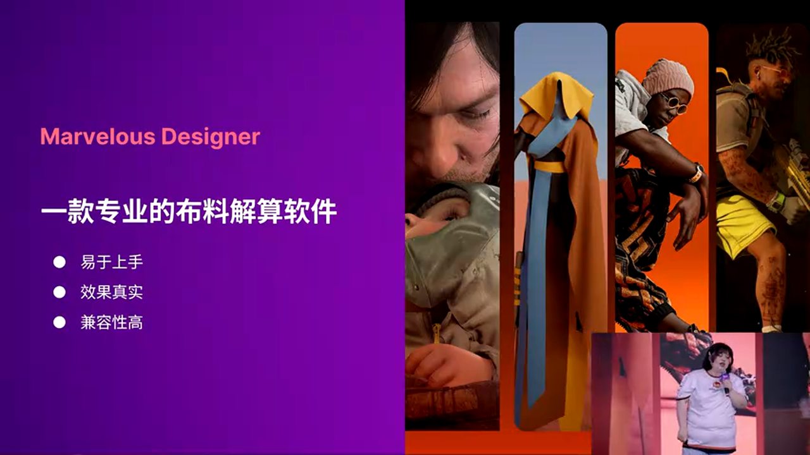

**工作原理**：
- 在 2D 窗口绘制版片结构
- 通过缝合线将版片连接
- 模拟时，物理引擎计算每个顶点的受力
- 生成符合物理规律的褶皱和变形

---

### 二、两种工作流程对比

Marvelous Designer 提供两种主流工作流，适配不同的生产需求：

> **工作流 A：静态模型流程**
> - 🟢 **优势**：资源占用少，适合游戏开发；支持引擎实时解算（如 Chaos Cloth）
> - 🔴 **劣势**：需要在引擎中二次调试物理参数；精度受引擎解算器限制
> - 🎯 **适用场景**：移动游戏、实时互动应用、需要动态换装的项目
>
> **工作流 B：动画缓存流程**
> - 🟢 **优势**：预烘焙高精度动画，细节丰富；引擎端零性能开销
> - 🔴 **劣势**：缓存文件体积大；无法实时交互
> - 🎯 **适用场景**：影视动画、过场动画、高精度展示项目

**技术决策建议**：
- 如果项目需要**动态换装**或**实时交互**，选择静态模型流程
- 如果追求**极致画质**或**复杂布料动画**（如裙摆飘动），选择动画缓存流程
- 混合方案：主角使用动画缓存，NPC 使用静态模型

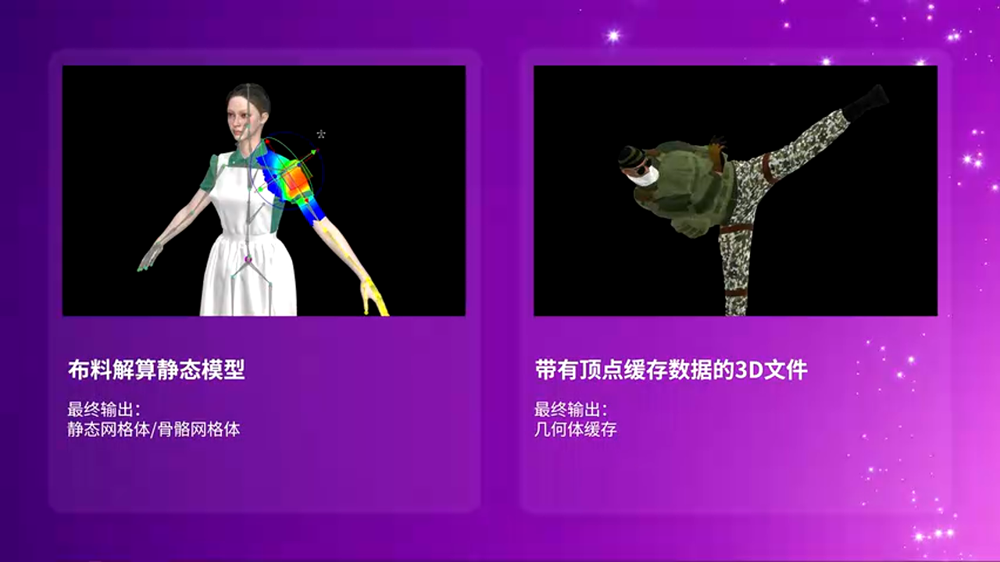

---

## 深度进阶：项目制作要点

### 三、静态模型预处理流程

在导出静态模型到虚幻引擎之前，需要进行网格优化和材质处理。

#### 3.1 网格优化

**自动四边面化**：

新版本优化了四边面化算法，生成更干净的网格拓扑结构。

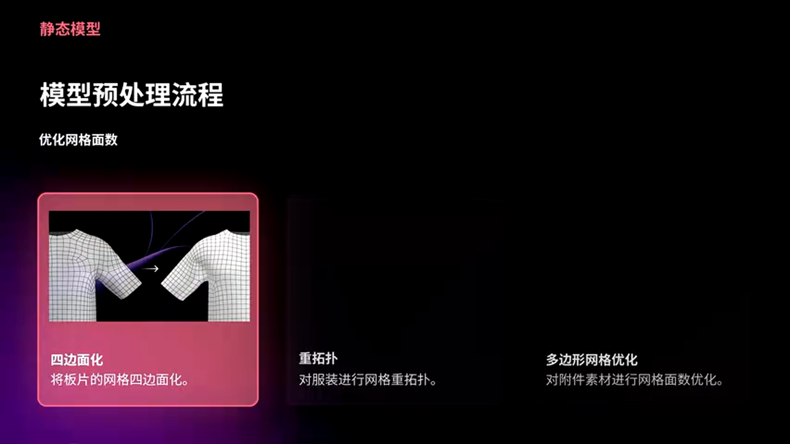

**手动重拓扑**：

对于复杂服装，可以手动调整拓扑，进一步优化网格排列。

**智能拓扑类型**：

软件提供两种拓扑风格，可根据需要选择：
- **均匀拓扑**：适合需要细分的区域
- **自适应拓扑**：根据曲率自动调整密度

**配件优化**：

对于纽扣、拉链等配件，可以一键降低多边形面数。

通过输入目标面数，软件会自动优化这些素材，从而降低整体网格复杂度。

---

#### 3.2 材质处理

**PBR 材质生成器**：

当面料应用一个纹理图时，可以通过 PBR 材质生成器自动生成其他贴图（如法线贴图、金属度贴图、透明度贴图）。

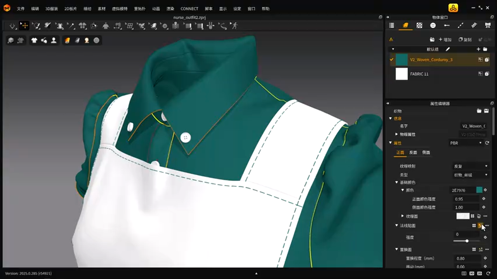

生成后还可以控制法线贴图的强度，达到需要的效果。

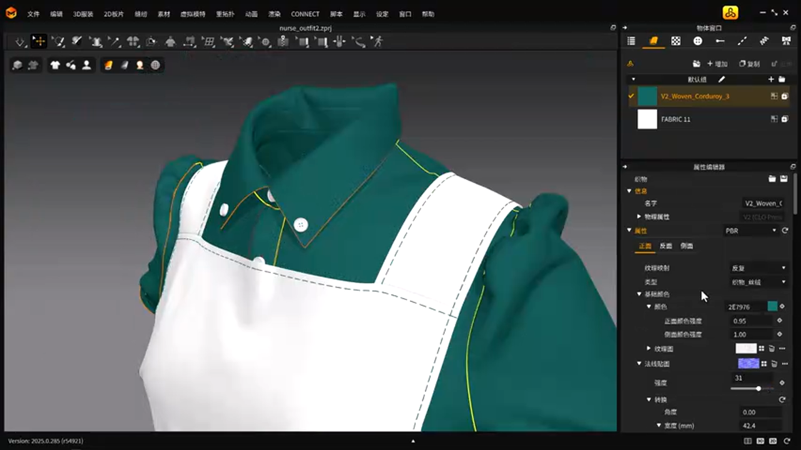

**UV 填充工具**：

使用自动 UV 填充工具，可以对服装版片的 UV 进行自动排布，支持正面、侧面和背面的 UV 展开。

**动态 UV 更新**：

当调整面料属性（如背面颜色、侧边厚度）后，UV 填充会自动更新，无需手动重新展开。

---

#### 3.3 骨骼绑定流程

对于需要骨骼绑定的服装，Marvelous Designer 提供了 **AvatarMode** 工具，可以自动绑定服装网格。

**绑定前准备**：
1. 一键四边面化服装版片，获取规整的网格排列
2. 优化配件的多边形面数

**AvatarMode 功能**：
- 自动优化文件为更低面数
- 自动封闭袖口、脚口等看不见的位置
- 支持输入目标网格数值，自动控制整体面数

**权重调整**：

绑定完成后，可以调整每个位置的版片权重，选择增加、减少或平滑关节点上的绑定权重。

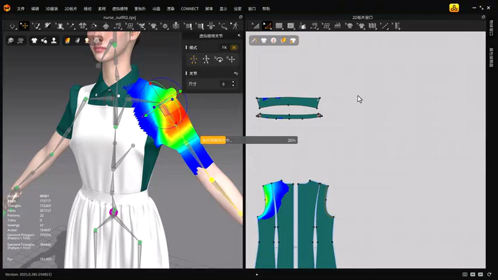

**姿势测试**：

更改虚拟模特的姿势，查看服装是否有穿模问题。

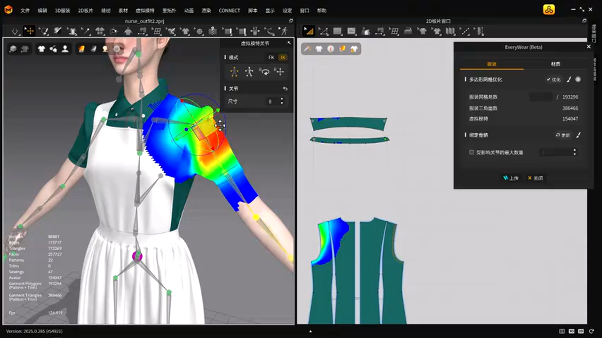

**雕刻修复**：

如果发现穿模，可以使用雕刻笔刷调整折叠位置，或用修复笔刷一键修复穿模。

**材质烘焙**：

在 AvatarMode 中可以继续调整 UV 填充或处理纹理烘焙，如烘焙细节法线贴图和环境光遮蔽贴图。

---

### 四、布料动画缓存流程

对于需要制作逼真布料动画的项目，可以在 Marvelous Designer 中录制服装的布料解算动画，然后将整个动画以几何体缓存数据的形式导入到虚幻引擎中使用。

#### 4.1 动画模型准备

**三种模型类型**：

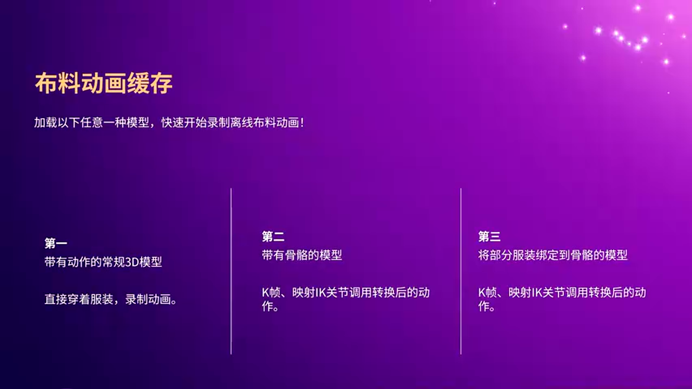

1. **带有动作的常规 3D 模型**：直接导入即可录制布料动画
2. **带有骨骼关节的静态模型**：可以在 MD 中对关节点 K 帧，或使用 IC 关节调用转换好的动作
3. **骨骼绑定的服装网格**：部分服装网格进行骨骼绑定，刷到骨骼上

**IC 关节系统**：

Marvelous Designer 支持 IC 关节（Inverse Kinematics），可以快速调整模型姿势或调用动作文件。

硬设 IC 关节后，可以：
- 手动调整模型姿势
- 调用预设动作
- 导入 FBX 动画文件并自动转换为 IC 关节动作

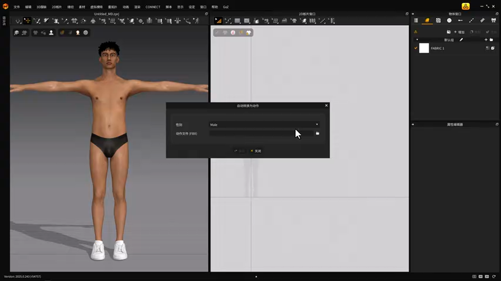

---

#### 4.2 录制前的参数设置

在录制动画之前，需要检查和调整一些关键参数，确保模拟稳定。

**固定针设置**：

为了防止服装滑落和抖动，在紧身位置添加固定针，将布料固定在模型上。

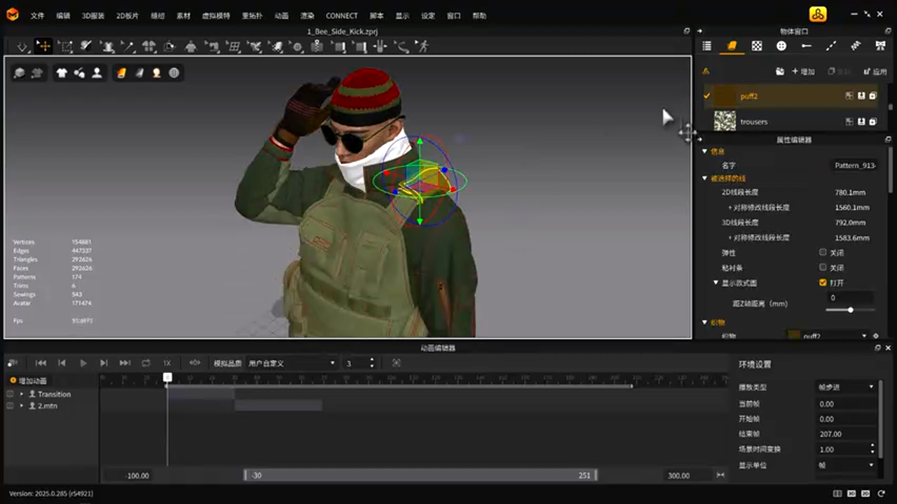

**摩擦力调整**：

提高服装的摩擦力，防止滑动。

**模拟品质**：

提高模拟品质，让模拟更加精密和稳定。

**场景时间变换**：

如果角色动作帧间变化较大，需要提高场景时间变换，让角色每一帧之间的动作间隔更小，模拟会更稳定。

---

#### 4.3 GPU 模拟与实时录制

新版本支持 **GPU 模拟**，可以完成非常稳定的布料解算，即使是 15 万面数的服装，也能实时录制动画。

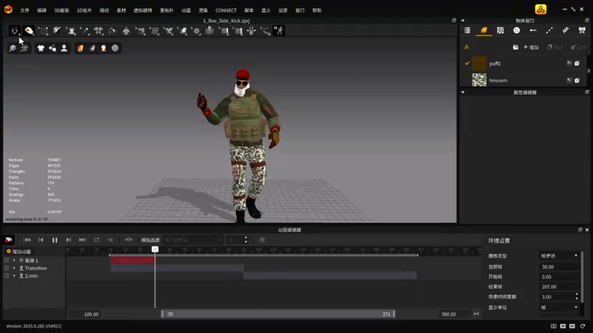

**GPU 模拟的优势**：
- 速度快，实时录制
- 多层布料处理稳定
- 支持高面数服装

---

#### 4.4 关键帧动画增强

除了稳定的布料解算，还可以通过关键帧动画增加趣味性和表现力。

**支持的关键帧类型**：

1. **模型关节点 K 帧**：组成一系列连贯的动作

2. **面料物理属性 K 帧**：改变面料的弹性、阻尼等属性，录制出特殊的膨胀效果

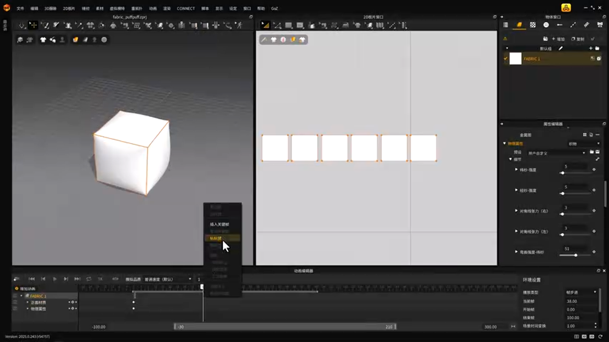

在相同压力下，面料经纬纱强度越低，受力膨胀效果越明显。通过对面料物理属性 K 帧，可以录制出非常奇特的膨胀效果。

3. **风场 K 帧**：对吹风方向、位置、风力等属性进行 K 帧，以及激活状态的 K 帧

4. **固定针激活状态 K 帧**：先激活固定针，之后反激活，录制动画时会有布料掉下来、受吹风影响的效果

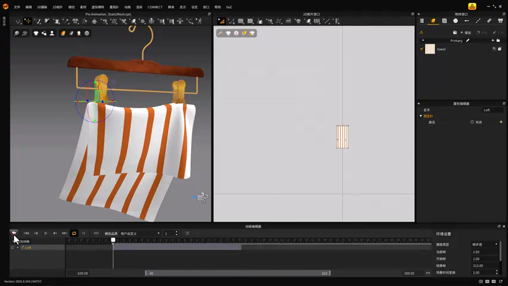

5. **重力 K 帧**：制作出特殊的锐落或反重力效果

例如，一开始环境中没有重力，后续有了重力后，服装就会自动掉落下来。

---

### 五、虚幻引擎对接流程

完成布料静态模型或解算好布料动画后，就可以进入到虚幻引擎中了。

#### 5.1 LiveSync 2.0 插件

Marvelous Designer 提供了两种导入流程：

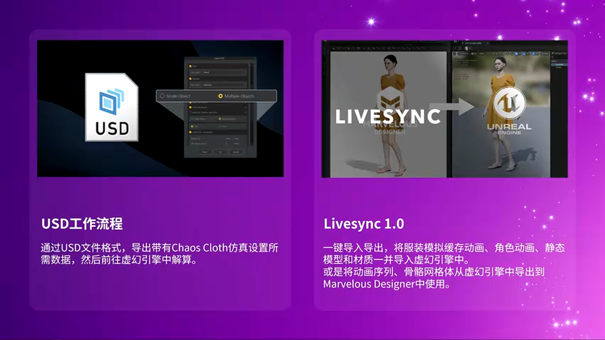

> **方案 A：USD 工作流程**
> - 🟢 **优势**：导出带有 Chaos Cloth 所需的物理属性数据，可在引擎中实时解算
> - 🔴 **劣势**：需要在引擎中调试物理参数
> - 🎯 **适用场景**：需要通过引擎解算器完成布料解算的用户
>
> **方案 B：LiveSync 工作流程**
> - 🟢 **优势**：一键导入服装、模特、材质、动画缓存；支持双向同步
> - 🔴 **劣势**：缓存文件体积较大
> - 🎯 **适用场景**：需要使用虚幻引擎渲染动画、创建可视化视频和游戏影片的用户

**LiveSync 2.0 的新特性**：
- 集成了 USD 工作流程
- 支持一键导入服装模拟缓存动画、角色动画、静态模型和材质
- 可以将带动画的骨骼网格从虚幻引擎导回 MD 完成后续解算

---

#### 5.2 LiveSync 插件安装与使用

**安装方式**：

可以直接在 FAB（虚幻商城）上搜索 Marvelous Designer LiveSync 插件，免费下载并安装。

**使用流程**：

1. **确认 MD 状态**：在 Marvelous Designer 中确认没有开启模拟或正在录制动画

2. **打开 LiveSync 窗口**：在 MD 中找到 File > Export > Cloth MD LiveSync

3. **配置导出选项**：

- **USD 文件格式选项**：Primal Loop（网格和材质）
- **加载服装选项**：选择所有服装作为一个物体或多个物体
- **版片厚度**：是否带有厚度
- **UV 贴图材质**：选择使用 UV 贴图或面料贴图
- **Include Garment Simulation Data**：将服装的模拟数据（物理属性）通过 USD 文件格式导入到虚幻引擎中

4. **等待连接**：当 LiveSync 连接指示器变为绿色时，点击同步按钮

5. **确认导入**：会有提示确认没有开启模拟或其他可能影响导入的功能

6. **查看导入结果**：服装和虚拟模特会一并导入到虚幻引擎中

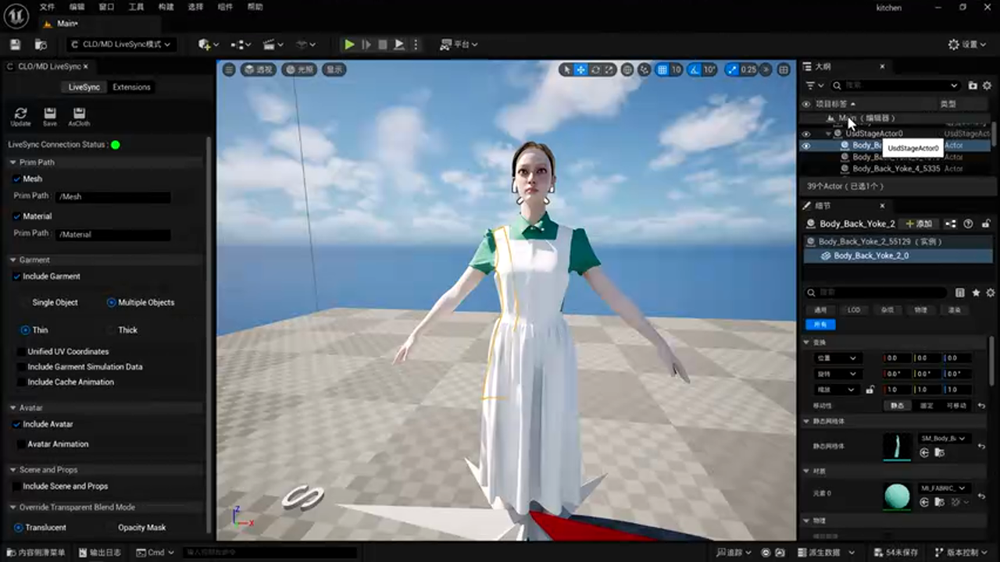

在大纲里面可以看到加载进来的模型，在 USD Stage Actor 下可以看到服装和角色模型。

---

#### 5.3 材质与物理属性

**材质导入**：

选用默认设置时，服装的材质球将会以软件内的面料贴图组成。

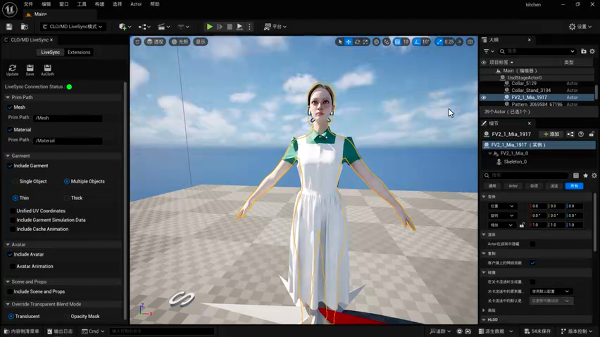

如果需要使用 UV 贴图作为材质，可以勾选 UV 贴图选项，点击刷新重新加载。

**物理属性导入**：

LiveSync 2.0 的重要特性是可以一键将 Marvelous Designer 的物理属性通过后台折算，自动加载到 Chaos Cloth 的物理属性节点中。

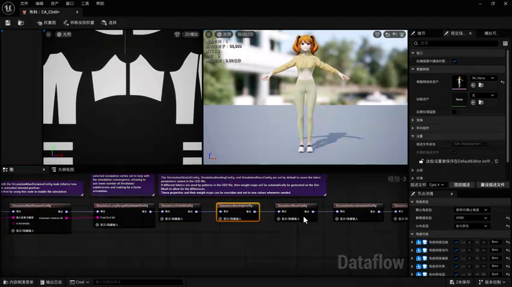

碰撞厚度（布料厚度）也可以直接使用 Marvelous Designer 导出的数值。

---

#### 5.4 Chaos Cloth 节点设置

导入到虚幻引擎后，可以在 Chaos Cloth 节点中完成后续设置：

1. **加载角色模型**：加载同样通过 USD 和插件一键导入的角色模型（如 Hana）
2. **绘制权重**：在节点中绘制权重，平滑权重
3. **应用物理属性**：使用 MD 导出的物理属性数据
4. **调整碰撞厚度**：使用 MD 的布料厚度数值
5. **完成其他节点设置**：根据项目需求完成其他节点配置

---

### 六、MetaHuman 集成

Marvelous Designer 还提供了 **MetaHuman 导入器**，可以直接在 MD 中导入 MetaHuman 的网格、骨骼关节和纹理。

#### 6.1 MetaHuman 导入流程

**从虚幻引擎导出**：

1. 在虚幻引擎中创建好 MetaHuman 角色
2. 选择 DCC Export 选项，选择 FBX 格式
3. 下载导出的文件

**导入到 Marvelous Designer**：

1. 在 MD 中直接导入 DNA 文件
2. 可以将 MetaHuman 的头和身体分别导入
3. 根据需要创建测量点和尺寸表

---

#### 6.2 资产复用与自动适配

由于导入的 MetaHuman 已经有了尺寸表，可以直接调用其他带有尺寸表信息的素材（资产商店或软件预设）。

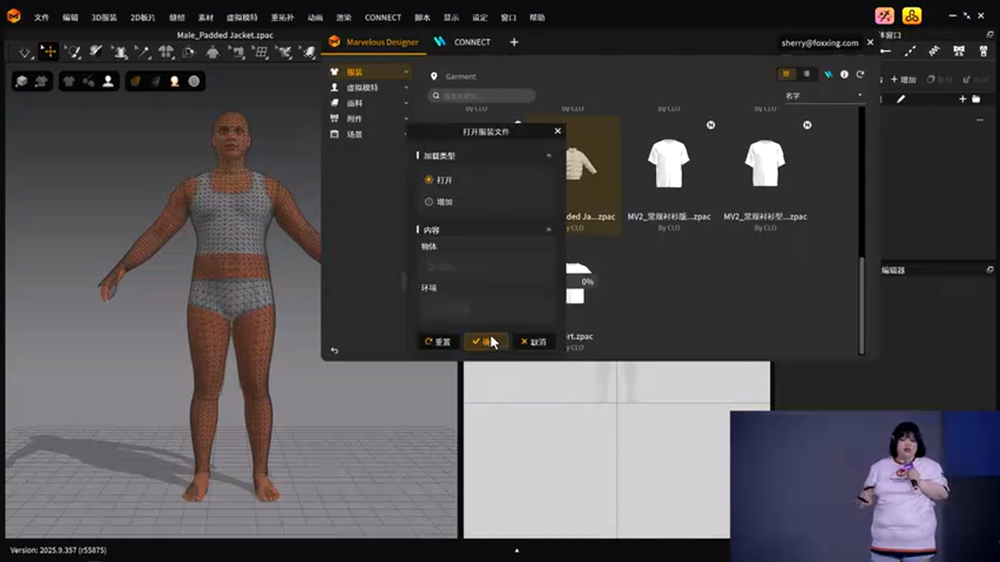

使用 **自动调整版片工具**，让服装自动适配到 MetaHuman 身上。

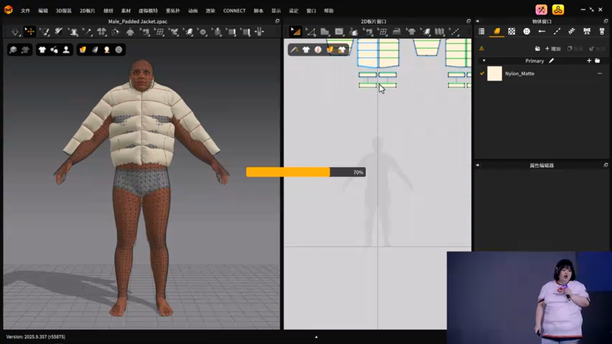

软件会自动对比尺寸表信息，自动适配到 MetaHuman 各部位的尺寸，穿着在它的身上，帮助您重复利用资产文件，开发更多自动化的可能。

---

## 实战总结与建议

### 避坑指南

**1. 网格优化相关**
- ❌ **避免**：直接导出高面数服装到引擎，会导致性能问题
- ✅ **建议**：使用四边面化和多边形优化工具，将面数控制在合理范围（游戏角色建议 5-10 万面）

**2. 材质处理相关**
- ❌ **避免**：忘记烘焙法线贴图，导致细节丢失
- ✅ **建议**：使用 PBR 材质生成器自动生成法线、金属度等贴图，并调整强度

**3. 骨骼绑定相关**
- ❌ **避免**：绑定前不优化网格，导致权重绘制困难
- ✅ **建议**：先四边面化，再使用 AvatarMode 自动绑定，最后手动调整权重

**4. 动画录制相关**
- ❌ **避免**：直接在高动作幅度下录制，容易出现抖动和穿模
- ✅ **建议**：添加固定针，提高模拟品质和场景时间变换，使用 GPU 模拟

**5. LiveSync 使用相关**
- ❌ **避免**：在 MD 模拟状态下同步，会导致导入失败
- ✅ **建议**：确认 MD 没有开启模拟或录制动画，等待连接指示器变绿后再同步

**6. 物理属性相关**
- ❌ **避免**：忽略 MD 导出的物理属性，在引擎中重新调试
- ✅ **建议**：勾选 "Include Garment Simulation Data"，直接使用 MD 的高精度物理属性

---

### 最佳实践

**工作流选择**：
- **移动游戏**：静态模型 + Chaos Cloth 实时解算
- **PC/主机游戏**：主角使用动画缓存，NPC 使用静态模型
- **影视动画**：全部使用动画缓存，追求极致画质

**性能优化**：
- 使用 LOD 系统，远距离角色使用低面数模型
- 合理使用固定针，减少不必要的布料解算区域
- 对于不可见部分（如袖口内侧），使用自动封闭功能

**团队协作**：
- 建立统一的命名规范（版片、材质、骨骼）
- 使用资产商店和模块库，提高资产复用率
- 定期更新 LiveSync 插件，获取最新功能

**未来发展方向**：
- **动画转换器**：自动补充从 A-Pose 到动画第一帧的过渡
- **鞋子制作工具**：为 MetaHuman 等角色创建鞋子的专用工具
- **更深度的引擎集成**：进一步简化两个软件之间的互通操作

---

## 总结

Marvelous Designer 作为专业的布料解算软件,通过其强大的物理引擎和灵活的工作流,为游戏和影视制作提供了高效的服装制作解决方案。LiveSync 2.0 插件的推出,更是实现了与虚幻引擎的无缝对接,大幅提升了生产效率。

**关键要点回顾**：
1. 根据项目需求选择合适的工作流（静态模型 vs 动画缓存）
2. 重视预处理环节（网格优化、材质处理、骨骼绑定）
3. 善用 GPU 模拟和关键帧动画,提升动画表现力
4. 充分利用 LiveSync 2.0 的物理属性导入功能
5. 通过 MetaHuman 集成,实现资产复用和自动化

随着技术的不断发展,Marvelous Designer 与虚幻引擎的集成将越来越深入,为创作者提供更强大的工具链。掌握这套完整的工作流,将极大提升您的生产效率和作品质量。

---

**参考资源**：
- Marvelous Designer 官方文档：https://marvelousdesigner.com/
- LiveSync 2.0 插件下载：FAB（虚幻商城）搜索 "Marvelous Designer LiveSync"
- UFSH2025 技术分享视频：https://www.bilibili.com/video/BV1Zo1aBYENG

**感谢阅读！如果您对布料解算和虚幻引擎技术感兴趣，欢迎加入 UE5 技术交流群，与更多开发者交流经验！**

