# 虚幻引擎 5 PanelCloth 布料系统深度解析：从原理到生产实践

---


## 加入 UE5 技术交流群

如果您对虚幻引擎5的图形渲染技术感兴趣，欢迎加入我们的 **UE5 技术交流群**！

扫描上方二维码添加个人微信 **wlxklyh**，备注"UE5技术交流"，我会拉您进群。

在技术交流群中，您可以：
- 与其他UE开发者交流渲染技术经验
- 获取最新的GDC技术分享和解读
- 讨论图形编程、性能优化、构建工具流、动画系统等话题
- 分享引擎架构、基建工具等项目经验和技术难题

---

**源视频信息：**
- 标题：[UFSH2025]虚幻引擎布料模拟现状 PanelCloth新功能和使用技巧 | 肖月Epic Games 开发者关系 TA
- 时长：38分14秒
- 视频链接：https://www.bilibili.com/video/BV1Gs1nBdEED

**AI 生成说明：** 本文由 AI 基于视频内容生成，部分代码示例为 AI 根据上下文补充，仅供参考。

---

## 导读

> **核心观点：**
> 1. UE5.3+ 引入的 **PanelCloth（面板布料）** 系统是 Chaos 物理引擎下的新一代布料解决方案，通过独立资产管理和 DataFlow 节点图实现了更强的可控性和灵活性。
> 2. 新布料系统解决了传统 Skeletal Mesh 布料按材质分区、权重绘制不便、缺乏自碰撞等核心痛点，尤其适合需要高质量动态表现的游戏和影视项目。
> 3. 在生产实践中，布料稳定性（防穿插、碰撞优化）和性能预算的平衡是关键，需要通过子步优化、碰撞简化、LayerConstraint 等手段综合调控。

> **前置知识：**
> - 熟悉 UE5 的 Skeletal Mesh 和动画蓝图
> - 了解基本的物理模拟概念（约束、碰撞检测、子步）
> - 对 DataFlow 节点图有初步认识（类似蓝图或材质编辑器）

---

## 一、背景与痛点：为什么需要 PanelCloth？

### 1.1 传统布料系统的局限性

在 UE5.3 之前，虚幻引擎的布料系统主要依赖于 **Skeletal Mesh Editor** 中的 Chaos Cloth 功能。这套系统虽然可用，但在实际生产中暴露出以下核心问题：

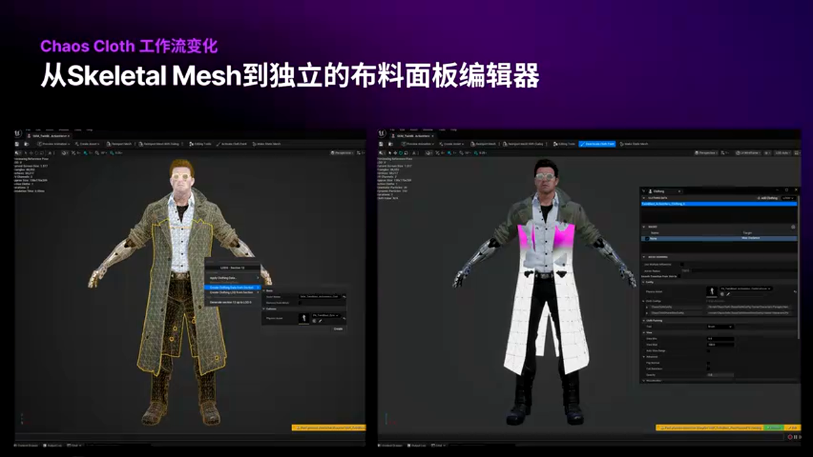
*图：Skeletal Mesh Editor 中的传统布料编辑界面*

**问题一：按材质分区的设计缺陷**

传统布料系统按 **Material Section** 创建布料数据，这意味着：
- 角色服装上材质不同的区域会被拆分成独立的模拟数据
- 不同材质的布料区域之间 **无法交互**，也 **无法发生自碰撞**
- 这导致多层服装（如内衬+外套）无法实现真实的层级碰撞效果

**问题二：权重绘制体验不佳**

尽管 Chaos Cloth 支持通过权重图（Weight Map）精细控制物理属性（如刚度、阻尼），但在 3D Viewport 中绘制权重并不直观：
- 缺乏类似 DCC 软件（Maya/Blender）的权重绘制工具
- 调整反馈周期长，美术迭代效率低

**问题三：与骨骼网格体强耦合**

布料数据嵌入在 Skeletal Mesh Asset 中，导致：
- 无法独立管理布料配置
- 多角色共享布料资产困难
- 版本迭代和协同工作流受限

### 1.2 PanelCloth 的设计目标

为了解决上述痛点，Epic Games 在 UE5.3 引入了 **PanelCloth（面板布料）** 系统，核心设计理念包括：

1. **独立资产管理**：布料配置从 Skeletal Mesh 中解耦，作为独立的 `.uasset` 存在。
2. **DataFlow 节点图编辑**：提供可视化、结构化的编辑方式，类似材质编辑器。
3. **统一模拟域**：支持跨材质区域的布料交互和自碰撞。
4. **更强的美术控制**：通过权重图、Vertex Color、Attribute Map 等多种方式实现精细控制。

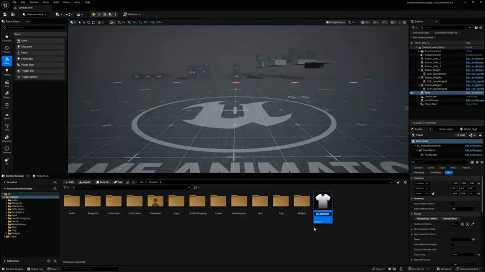
*图：PanelCloth 独立资产创建界面*

---

## 二、核心原理解析：PanelCloth 的技术架构

### 2.1 资产结构与 DataFlow 工作流

PanelCloth 的核心是 **Chaos Cloth Asset**，它是一个独立的布料配置资产。与传统布料不同，PanelCloth 使用 **DataFlow Graph** 来定义布料的物理行为。


*图：DataFlow 节点图编辑界面*

**DataFlow 节点图的优势：**

- **模块化设计**：每个节点代表一个物理特性（如弯曲约束、碰撞设置、空气阻力）。
- **可复用性**：节点图可以保存为模板，在不同角色间共享。
- **实时预览**：修改节点参数后，可以在编辑器中实时看到效果。

**初始模板节点：**

创建新的 Chaos Cloth Asset 时，引擎会自动生成一套默认模板节点，包括：
- **Simulation Config**：模拟配置（时间步、迭代次数）
- **Material Properties**：材质属性（弹性、阻尼、质量）
- **Collision Settings**：碰撞设置（简单碰撞、复杂碰撞）
- **Constraints**：约束类型（距离约束、弯曲约束、体积约束）


*图：默认模板节点结构*

### 2.2 布料物理模型：从 PBD 到 XPBD

PanelCloth 基于 **XPBD（Extended Position Based Dynamics）** 算法，这是 PBD 的改进版本。

**PBD vs XPBD：**

> **PBD（Position Based Dynamics）：**
> - 优势：计算效率高，易于实现。
> - 劣势：结果依赖迭代次数，难以保证物理准确性。
> - 适用场景：对物理精度要求不高的游戏场景。

> **XPBD（Extended Position Based Dynamics）：**
> - 优势：引入刚度系数（Stiffness）和时间步修正，物理行为更稳定。
> - 劣势：计算成本略高于 PBD。
> - 适用场景：需要精确控制布料刚度和阻尼的高质量项目。

**核心约束类型：**

PanelCloth 支持多种约束（Constraint），每种约束控制布料的不同物理属性：

1. **Distance Constraint（距离约束）：**
   - 控制布料的拉伸和压缩行为。
   - 参数：`Stiffness`（刚度）、`Damping`（阻尼）。

2. **Bending Constraint（弯曲约束）：**
   - 控制布料的抗弯刚度。
   - 参数：`Bending Stiffness`（弯曲刚度）。

3. **Volume Constraint（体积约束）：**
   - 保持布料的体积不变（如充气的气球）。
   - 参数：`Volume Stiffness`（体积刚度）。

4. **Animation Capture Constraint（动画捕捉约束）：**
   - 让布料部分跟随动画运动，部分自由模拟。
   - 参数：`Animation Drive Stiffness`（动画驱动刚度）。

### 2.3 权重传递与蒙皮绑定

PanelCloth 提供了强大的 **权重传递工具**（Weight Transfer），可以将角色骨骼的 SkinWeight 自动传递到布料模型上。

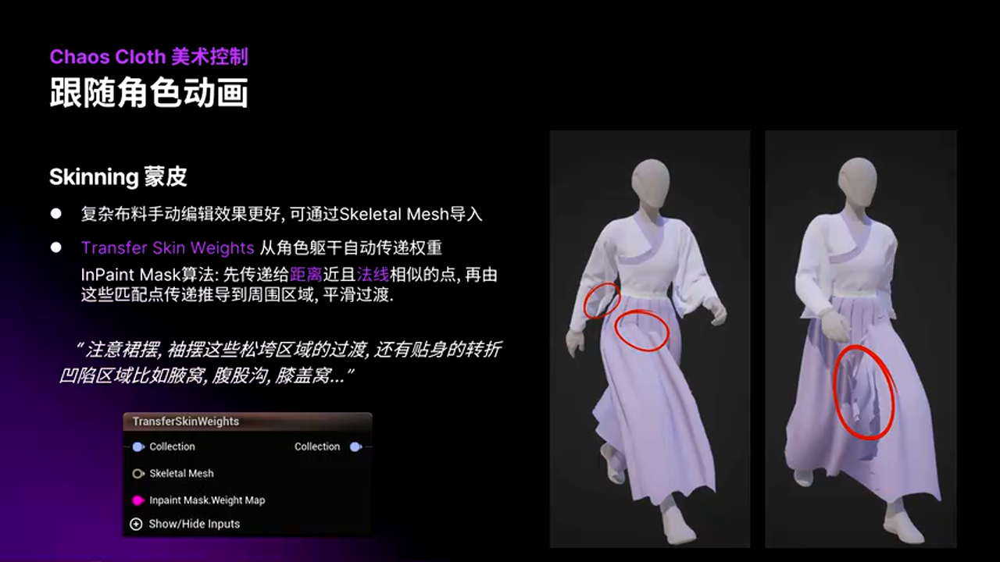
*图：权重传递节点界面*

**权重传递算法：**

UE5 的权重传递算法不同于传统 DCC 软件的"按位置传递"：
1. 首先将身体权重传递到 **法线接近且距离最近** 的布料顶点。
2. 然后通过 **平滑扩散** 算法，从已匹配的点向周围未匹配的点传递权重。

这种算法的优势是：
- 权重过渡更平滑、自然。
- 对复杂拓扑结构（如褶皱、折叠）的适应性更强。

**避坑指南：复杂区域的权重处理**

在实际应用中，以下区域的权重传递容易出现问题：
- **松垮区域**：裙摆、袖口等。
- **转折区域**：腋窝、膝盖窝、肘关节。

**解决方案：使用 Mask Map 引导权重传递**

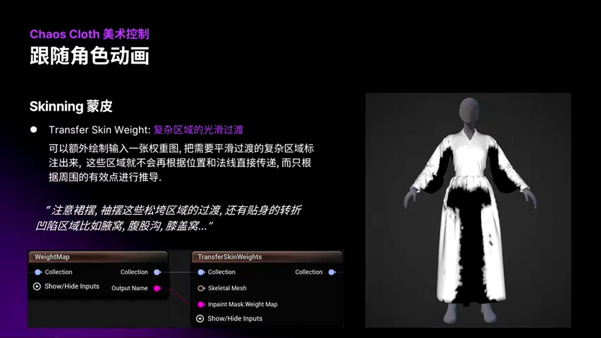
*图：通过 Mask Map 标记复杂区域*

可以绘制一张黑白 Mask Map，标记复杂区域（黑色），然后输入到权重传递节点：
- 黑色区域会被强制 **不直接从身体模型传递权重**。
- 而是根据周围已匹配的点进行 **平滑推导**。

对比效果如下：

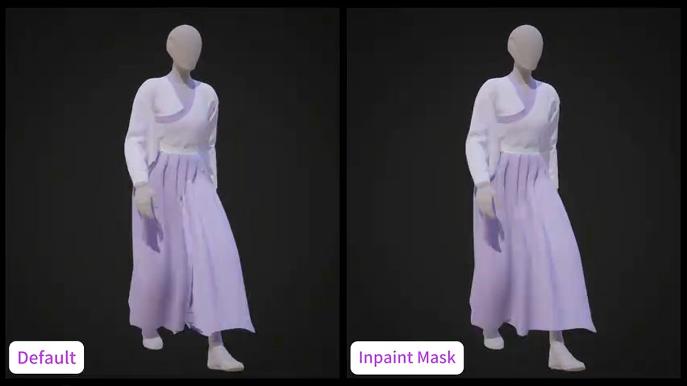
*图：左侧为未使用 Mask 的效果（权重不平滑）*


*图：右侧为使用 Mask 引导后的效果（权重过渡自然）*

### 2.4 动画捕捉约束：过渡区域的艺术控制

**Animation Capture Constraint** 是 PanelCloth 的核心功能之一，它允许布料的某些区域 **部分跟随动画、部分自由模拟**。

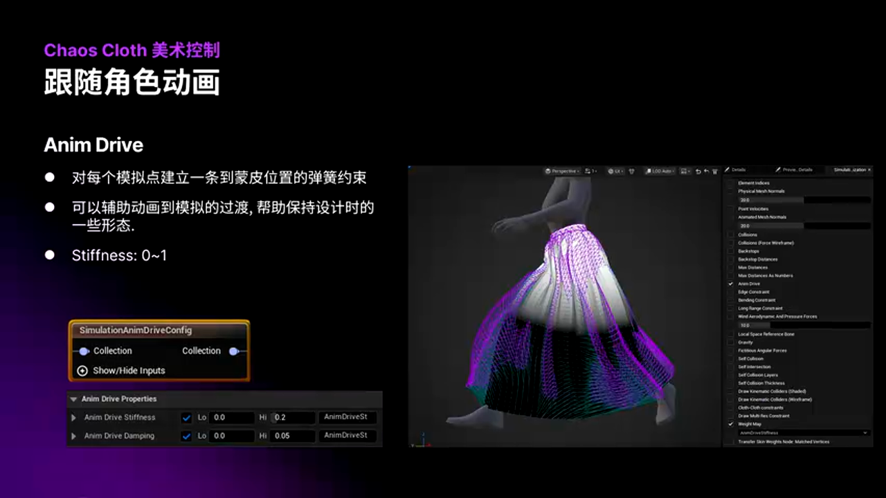
*图：动画捕捉约束节点配置*

**工作原理：**

对每个布料顶点建立一条指向 **蒙皮位置** 的弹簧约束：
- 约束强度由 **Vertex Color** 或 **Weight Map** 控制。
- 在模拟过程中，将模拟点向动画位置"拉"，拉力大小取决于权重。

**实战案例：裙子腰部固定 + 裙摆自由模拟**


*图：裙子腰部固定，裙摆自由模拟的权重分布*

通过渐变的 Weight Map：
- **腰部区域**：权重 = 1.0，完全固定在动画位置。
- **裙摆区域**：权重 = 0.0，完全自由模拟。
- **过渡区域**：权重 = 0.5，部分跟随动画、部分模拟。

这样的好处是：
- 裙子腰部的褶皱设计可以得到保持。
- 裙摆可以自然地随角色运动飘动。

**高级用法：特殊动作的纠正**

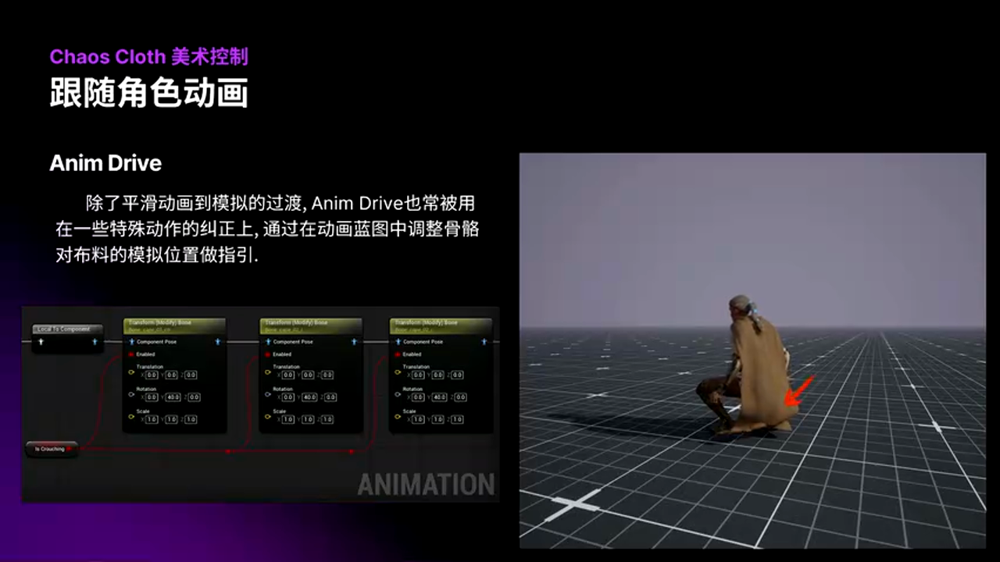
*图：角色下蹲时的布料纠正示例*

当角色下蹲时，长袍可能会穿插堆叠在脚跟处。可以在 **AnimBP（动画蓝图）** 中：
1. 检测角色的 Crouch 状态。
2. 动态修改布料的 **Animation Drive Stiffness** 参数（通过 `ClothOutfitInteractor` 接口）。
3. 将裙摆的动画位置稍微抬高，让布料自然铺在角色身后。

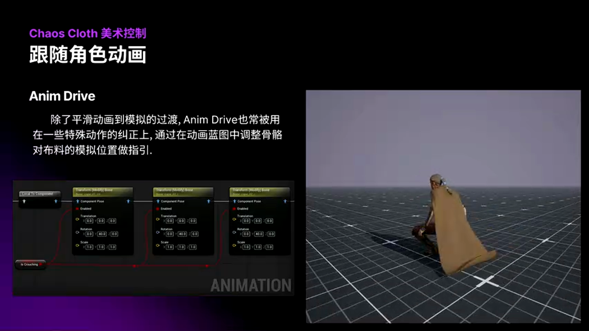
*图：动画蓝图中动态调整布料参数的示例*

以下是在动画蓝图中运行时修改布料参数的代码示例（由 AI 根据视频内容补充，仅供参考）：

```cpp
// [AI补充] 在动画蓝图中运行时修改布料参数的 C++ 示例
void UMyAnimInstance::UpdateClothParameters(bool bIsCrouching)
{
    // 获取角色的 Skeletal Mesh Component
    USkeletalMeshComponent* MeshComp = GetSkelMeshComponent();
    if (!MeshComp)
    {
        return;
    }

    // 获取 Cloth Outfit Interactor 接口
    UClothOutfitInteractor* ClothInteractor = Cast<UClothOutfitInteractor>(
        MeshComp->GetClothingSimulationInteractor()
    );

    if (!ClothInteractor)
    {
        return;
    }

    // 根据下蹲状态动态调整 Animation Drive Stiffness
    if (bIsCrouching)
    {
        // 下蹲时增强动画捕捉，让裙摆抬高
        ClothInteractor->SetFloatParameter(
            TEXT("AnimationDriveStiffness"), // 参数名（从 DataFlow 节点右键复制）
            0.8f // 增强动画驱动强度
        );
    }
    else
    {
        // 站立时恢复正常模拟
        ClothInteractor->SetFloatParameter(
            TEXT("AnimationDriveStiffness"),
            0.2f // 降低动画驱动强度
        );
    }
}
```

**关键点：**
- UE5.5+ 支持 **运行时调整布料参数**（之前的版本不支持）。
- 使用 `ClothOutfitInteractor` 接口代替旧的 `ClothingSimulationInteractor`。
- 参数名可以从 DataFlow 节点上 **右键复制 Interactor Parameter Name**。

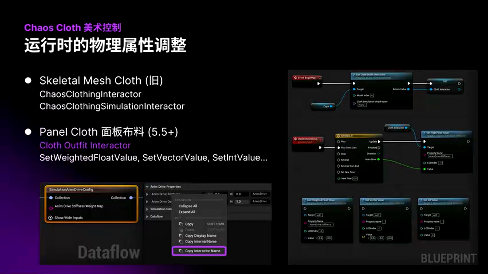
*图：从 DataFlow 节点复制 Interactor 参数名*

---

## 三、深度进阶：布料模拟的稳定性与性能优化

### 3.1 运行时穿插问题：原因与解决方案

**穿插问题的本质：**

布料穿插（Penetration）是物理模拟中最常见的问题，尤其在角色快速运动时：
- 碰撞体在一帧内移动距离过大。
- 离散碰撞检测（Discrete Collision Detection）无法捕捉到中间状态。
- 导致布料顶点"跳过"碰撞体，直接穿插到内部。


*图：角色快速运动时的布料穿插示例*

**根本解决方案：增加子步（Substep）**

最彻底的解决方案是设置更高的 **Substep（子步）** 数量：
- 子步的作用是将一帧拆分成多个小的时间步进行模拟。
- 例如，帧率 60fps、子步 4，则每秒计算 240 次物理模拟。
- 碰撞检测更精确，穿插问题显著减少。


*图：Substep 配置节点*

**但是……增加子步意味着性能开销成倍增长！**

对于移动端或大世界游戏，高子步数是无法承受的。因此，实际生产中需要在 **较低性能预算** 下尽量避免穿插。

### 3.2 低性能预算下的防穿插策略

**策略一：简化碰撞体**

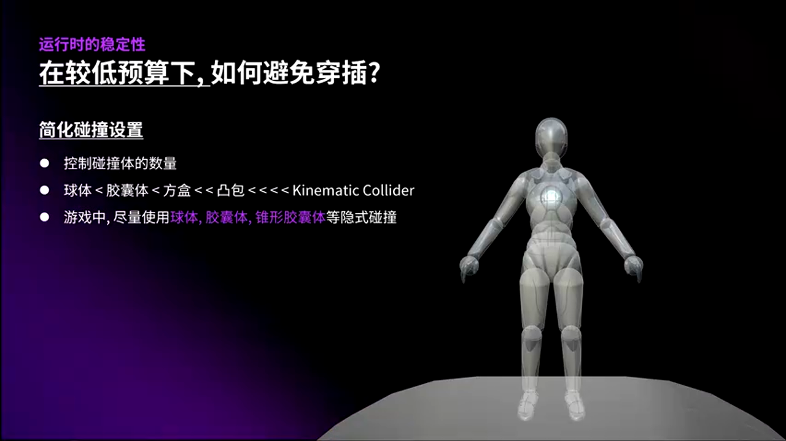
*图：简化碰撞体的层级结构*

碰撞体的复杂度直接影响穿插发生的概率：
- **球体（Sphere）：** 最易处理，穿插概率最低。
- **胶囊体（Capsule）：** 次优选择，适合手臂、腿部。
- **方盒（Box）：** 适合躯干，计算成本中等。
- **凸包（Convex Hull）：** 计算成本高，慎用。
- **三角面网格（Triangle Mesh）：** 最复杂，后面会专门讨论。

**最佳实践：**

> **方案：基于球体和胶囊体的简化物理资产**
> - 🟢 优势：计算成本低，穿插概率最小，适合绝大多数游戏场景。
> - 🔴 劣势：对复杂体型（如肌肉突起）的拟合精度不足。
> - 🎯 适用场景：移动端、大世界游戏、多角色场景。
>
> **方案：基于凸包或三角面的复杂碰撞**
> - 🟢 优势：拟合精度高，适合特写镜头或影视级渲染。
> - 🔴 劣势：计算成本高，穿插风险增加，需要更高子步。
> - 🎯 适用场景：影视项目、过场动画、单角色特写。

**策略二：利用空气动力学参数减少穿插**

PanelCloth 提供了 **Aerodynamics（空气动力学）** 节点，可以通过风力模拟减少穿插。

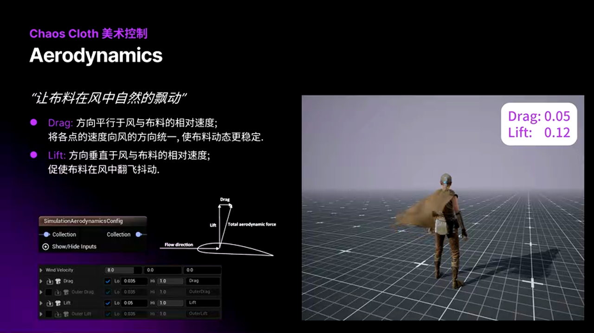
*图：空气动力学节点配置*

**Lift（升力）与 Drag（阻力）：**

- **Drag（阻力）：** 平行于风和布料的相对速度，将布料速度向风的方向"拉齐"，**增强稳定性**。
- **Lift（升力）：** 垂直于风的相对速度，促使布料在风中翻滚、抖动，**增强动态效果**。

**AutoDrag 和 AutoLift：**

这两个参数用于分别控制：
- **从外侧吹向布料的风**（AutoDrag）。
- **从内侧吹起布料的风**（AutoLift）。

**实战技巧：降低 AutoLift 减少穿插**

如果角色服装容易被风吹向身体导致穿插，可以适当降低 `AutoLift` 参数：
- 减小从内侧吹起布料的风力。
- 从一定程度上减少布料向身体运动的趋势。

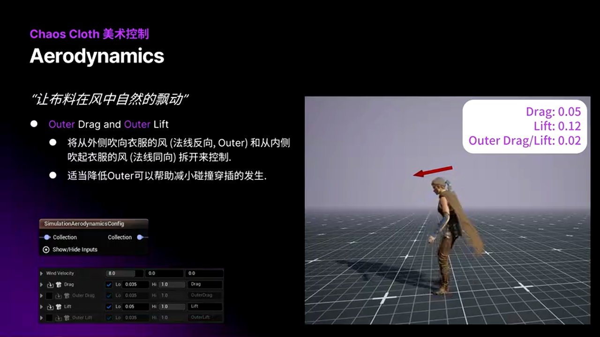
*图：AutoDrag 和 AutoLift 参数配置*

### 3.3 性能优化：子步与碰撞检测的平衡

**关键问题：如何在有限的性能预算下最大化布料质量？**

**优化手段一：动态 LOD 控制**

根据角色距离相机的远近，动态调整：
- **子步数量**：近处角色使用高子步，远处角色使用低子步。
- **碰撞复杂度**：近处开启复杂碰撞，远处使用简单碰撞。

以下是动态 LOD 控制的蓝图示例（由 AI 根据视频内容补充，仅供参考）：

```cpp
// [AI补充] 根据距离动态调整布料 LOD 的 C++ 示例
void AMyCharacter::UpdateClothLOD()
{
    // 获取相机位置
    APlayerController* PC = GetWorld()->GetFirstPlayerController();
    if (!PC || !PC->PlayerCameraManager)
    {
        return;
    }

    FVector CameraLocation = PC->PlayerCameraManager->GetCameraLocation();
    float DistanceToCamera = FVector::Dist(GetActorLocation(), CameraLocation);

    // 获取布料组件
    USkeletalMeshComponent* MeshComp = GetMesh();
    UClothOutfitInteractor* ClothInteractor = Cast<UClothOutfitInteractor>(
        MeshComp->GetClothingSimulationInteractor()
    );

    if (!ClothInteractor)
    {
        return;
    }

    // 根据距离调整子步数量和碰撞复杂度
    if (DistanceToCamera < 500.0f) // 近距离（5米内）
    {
        // 高质量：子步 = 6，开启复杂碰撞
        ClothInteractor->SetIntParameter(TEXT("NumSubsteps"), 6);
        ClothInteractor->SetBoolParameter(TEXT("EnableComplexCollision"), true);
    }
    else if (DistanceToCamera < 1500.0f) // 中距离（5-15米）
    {
        // 中等质量：子步 = 3，关闭复杂碰撞
        ClothInteractor->SetIntParameter(TEXT("NumSubsteps"), 3);
        ClothInteractor->SetBoolParameter(TEXT("EnableComplexCollision"), false);
    }
    else // 远距离（15米外）
    {
        // 低质量：子步 = 1，关闭复杂碰撞
        ClothInteractor->SetIntParameter(TEXT("NumSubsteps"), 1);
        ClothInteractor->SetBoolParameter(TEXT("EnableComplexCollision"), false);
    }
}
```

**优化手段二：自碰撞子步独立设置**

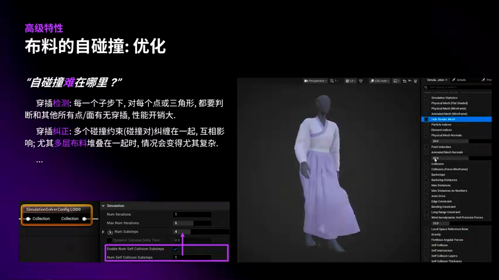
*图：自碰撞子步独立配置*

自碰撞（Self-Collision）的计算成本远高于布料本身的模拟：
- 每个子步需要检测所有顶点之间的穿插。
- 计算复杂度为 O(n²)（n 为顶点数量）。

因此，可以将 **自碰撞子步** 设置得比 **布料模拟子步** 更小：
- 例如，布料模拟子步 = 6，自碰撞子步 = 2。
- 在保证布料动态平滑的前提下，减少自碰撞检测次数。

---

## 四、高级特性：复杂碰撞与自碰撞优化

### 4.1 复杂碰撞（Complex Collision）：三角面网格碰撞

对于需要高精度拟合的角色（如肌肉线条明显的健美角色），简单碰撞体（球体、胶囊体）无法提供足够的精度。此时需要使用 **复杂碰撞（Complex Collision）**。

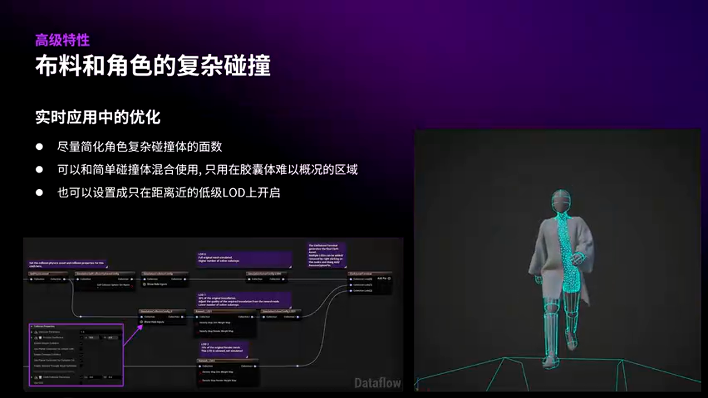
*图：复杂碰撞配置节点*

**复杂碰撞的工作原理：**

- 直接使用角色的 **三角面网格** 作为碰撞体。
- 布料顶点与三角面进行精确的碰撞检测。
- 计算成本远高于简单碰撞，但拟合精度最高。

**性能优化建议：**

1. **简化网格：** 使用 DCC 软件（Maya/Blender）或 UE5 的 Skeletal Mesh Editor 中的简面工具，减少三角面数量。
2. **混合使用：** 只在关键部位（如躯干）使用复杂碰撞，四肢仍使用简单碰撞。
3. **LOD 控制：** 只在离相机较近的角色上开启复杂碰撞。


*图：混合使用简单碰撞和复杂碰撞的物理资产*

### 4.2 自碰撞（Self-Collision）：点对点 vs 点对面

PanelCloth 提供了两种自碰撞算法：

**方案一：点对点（Vertex-to-Vertex）自碰撞**


*图：点对点自碰撞示意图（左侧）*

- 在每个布料顶点上放置一个小球。
- 检测这些小球之间的穿插。
- **优势：** 计算效率高，适合游戏场景。
- **劣势：** 精度较低，薄布料容易穿插。

**方案二：点对面（Vertex-to-Triangle）自碰撞**


*图：点对面自碰撞示意图（右侧）*

- 检测每个顶点与所有三角面之间的穿插。
- **优势：** 精度最高，适合影视级渲染。
- **劣势：** 计算成本极高，不适合移动端。

**方案对比：**

> **点对点自碰撞：**
> - 🟢 优势：计算效率高，适合移动端和大世界游戏。
> - 🔴 劣势：对薄布料（如丝绸）的精度不足，容易穿插。
> - 🎯 适用场景：游戏实时模拟，多角色场景。
>
> **点对面自碰撞：**
> - 🟢 优势：精度最高，适合特写镜头和多层服装。
> - 🔴 劣势：计算成本极高，需要高性能硬件。
> - 🎯 适用场景：影视项目，过场动画，单角色特写。

### 4.3 多层服装优化：Self-Collision Layer

**多层服装的核心问题：**

当角色同时穿着多层服装（如内衬+衬衫+外套）时：
- 自碰撞检测需要处理所有层之间的交互。
- 如果没有明确的层级关系，布料容易纠缠、穿插。

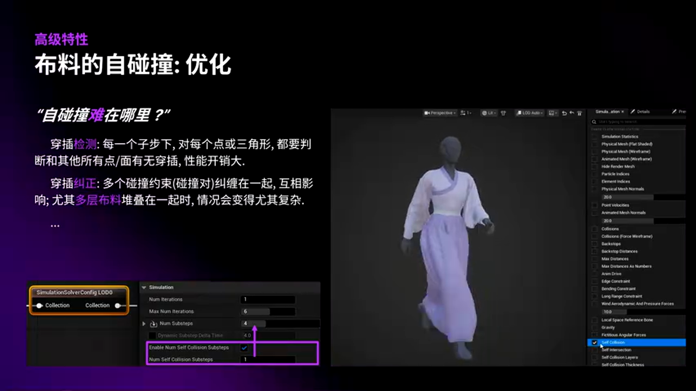
*图：多层布料互相堆叠纠缠的问题*

**解决方案：Self-Collision Layer（自碰撞层级）**

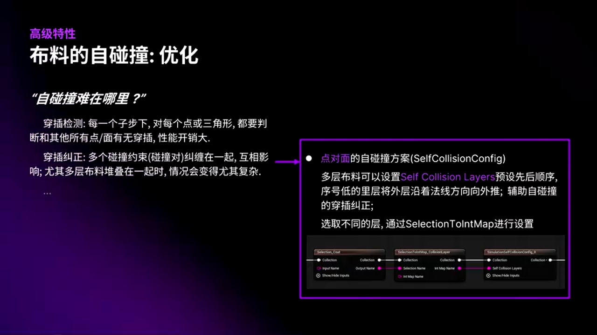
*图：Self-Collision Layer 配置节点*

通过为每层布料分配一个 **层级编号（Layer Index）**：
- **低序号层** 会将 **高序号层** 沿着法线方向向外推。
- 例如，内衬 = Layer 0，外套 = Layer 1，则外套会被内衬向外推开。

**实战示例：裙子 + 外套的层级设置**


*图：通过 Int Map 设置自碰撞层级*

1. 使用 `Self-Collision to Int-Map` 节点。
2. 选择内层裙子，设置 Layer Index = 0。
3. 选择外层外套，设置 Layer Index = 1。
4. 输入到 Self-Collision 节点的 `Layer` 参数。


*图：设置层级后，多层布料稳定模拟*

### 4.4 Chaos-Chaos 约束：辅助自碰撞的新方案

**Chaos-Chaos Constraint** 是 UE5.6 新增的功能，专门用于辅助自碰撞。

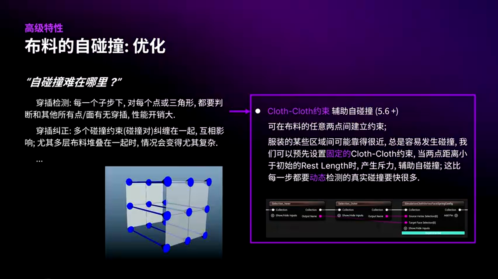
*图：Chaos-Chaos 约束配置节点*

**工作原理：**

在布料的任意两点之间预先建立 **弹簧约束**：
- 约束被 **压缩** 时，产生排斥力（Repulsion）。
- 约束被 **拉伸** 时，产生吸引力（Attraction）。
- 两种力可以 **分开控制**。

**与动态自碰撞的区别：**

- **动态自碰撞：** 每帧动态生成约束，计算成本高。
- **Chaos-Chaos 约束：** 预先生成固定的点对点约束，性能开销小。

**适用场景：**

用于 **总是靠得比较近** 的布料区域，如：
- 多层服装的内外层。
- 衣领和上衣之间。
- 裙摆的前后层。


*图：Chaos-Chaos 约束的排斥力和吸引力分开控制*

**实战建议：**

1. 在 DCC 软件中预先标记需要添加约束的点对。
2. 导入 UE5 后，使用 Chaos-Chaos 约束节点建立连接。
3. 设置 **压缩刚度**（Compression Stiffness）较高，**拉伸刚度**（Tension Stiffness）较低。
4. 这样可以防止布料挤压穿插，同时保留自然的拉伸效果。

---

## 五、实战总结与建议

### 5.1 布料制作的工作流总结

**完整工作流：**

1. **在 DCC 中准备模型：**
   - 创建角色身体和服装模型（布料拓扑要合理）。
   - 绘制关键权重图（Max Distance、Animation Drive Weight）。

2. **导入 UE5 并创建 Chaos Cloth Asset：**
   - 使用默认模板初始化 DataFlow 节点图。
   - 配置碰撞设置（简单碰撞 + 复杂碰撞混合）。

3. **调整物理属性：**
   - 根据布料材质（丝绸、棉质、皮革）调整刚度和阻尼。
   - 设置动画捕捉约束，控制固定区域和模拟区域的过渡。

4. **优化性能与稳定性：**
   - 调整子步数量，平衡质量和性能。
   - 设置 LOD 规则，根据距离动态调整子步和碰撞复杂度。

5. **运行时参数控制：**
   - 在动画蓝图中监听角色状态（下蹲、跳跃、奔跑）。
   - 通过 `ClothOutfitInteractor` 接口动态调整布料参数。

### 5.2 避坑指南

**坑点一：忽略权重传递的复杂区域**
- **现象：** 腋窝、膝盖窝等区域的权重传递效果不佳，布料抖动或穿插。
- **解决方案：** 使用 Mask Map 引导权重传递，强制这些区域根据周围点平滑推导。

**坑点二：盲目增加子步导致性能崩溃**
- **现象：** 为了解决穿插问题，将子步设置得过高（如 10+），导致帧率暴跌。
- **解决方案：** 优先简化碰撞体，使用 LOD 控制，而不是一味增加子步。

**坑点三：自碰撞参数设置不当**
- **现象：** 多层服装模拟时布料纠缠、抖动剧烈。
- **解决方案：** 设置 Self-Collision Layer，明确层级关系，或使用 Chaos-Chaos 约束辅助。

**坑点四：运行时参数接口使用错误**
- **现象：** UE5.4 及更早版本使用 `ClothingSimulationInteractor` 接口无法生效。
- **解决方案：** UE5.5+ 必须使用 `ClothOutfitInteractor` 接口。

### 5.3 最佳实践建议

**游戏场景推荐配置：**

- **子步：** 2-4（根据设备性能调整）。
- **碰撞：** 简单碰撞为主（球体 + 胶囊体），仅躯干使用复杂碰撞。
- **自碰撞：** 使用点对点自碰撞 + Chaos-Chaos 约束辅助。
- **LOD：** 根据距离动态调整子步和碰撞复杂度。

**影视场景推荐配置：**

- **子步：** 6-10（追求精度）。
- **碰撞：** 复杂碰撞为主（三角面网格）。
- **自碰撞：** 使用点对面自碰撞 + Self-Collision Layer。
- **缓存：** 使用布料缓存（Cloth Cache）预先烘焙模拟结果。

### 5.4 学习资源推荐

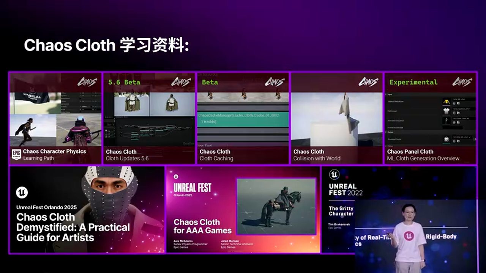
*图：官方学习路径和教程资源*

Epic Games 提供了丰富的官方学习资源：

1. **角色物理学习路径（Character Physics Learning Path）：**
   - 包含每个版本的 PanelCloth 更新内容。
   - 涵盖布料缓存、场景碰撞、机器学习布料等高级主题。

2. **虚幻商城教程（Unreal Marketplace Tutorials）：**
   - 提供多个布料制作的完整案例。

3. **社区论坛和 Discord：**
   - 与其他开发者交流实战经验。
   - Epic 官方 TA 会定期解答疑问。

---

## 六、总结与展望

PanelCloth 是 UE5 在物理模拟领域的重要进化，它通过独立资产管理、DataFlow 节点图、XPBD 算法等技术手段，为游戏和影视项目提供了高质量的布料解决方案。

**核心要点回顾：**

1. **架构优势：** 独立资产、可视化编辑、跨材质模拟、精细权重控制。
2. **稳定性关键：** 子步优化、碰撞简化、LOD 控制、动画捕捉约束。
3. **高级特性：** 复杂碰撞、自碰撞层级、Chaos-Chaos 约束。

**未来展望：**

- **机器学习布料（ML Cloth）：** 通过训练模型预测布料动态，进一步降低计算成本。
- **GPU 加速：** 未来版本可能支持更高效的 GPU 计算管线。
- **实时编辑：** 在运行时通过 UI 动态调整布料参数，实现更强的艺术控制。

**最后的建议：**

> 在实际项目中，布料系统的配置需要根据 **目标平台**（PC、主机、移动端）、**项目类型**（游戏、影视、VR）和 **美术需求** 综合考量。没有"万金油"的配置，只有最适合你项目的方案。

希望本文能帮助你更深入地理解 PanelCloth 的技术原理，并在实战中灵活运用这些工具和技巧。如果你有任何疑问或想要交流更多 UE5 技术细节，欢迎加入我们的 **UE5 技术交流群**！

---

**相关链接：**
- 官方文档：https://docs.unrealengine.com/5.6/en-US/chaos-cloth-in-unreal-engine/
- 角色物理学习路径：https://dev.epicgames.com/community/learning/paths/
- Chaos-Chaos 约束教程：https://dev.epicgames.com/documentation/

---

**声明：** 本文部分代码示例由 AI 根据视频内容补充，旨在辅助理解技术原理，实际应用时请参考官方文档进行调整。
