# Unreal Engine 5 神经网络驱动的实时布料系统：突破传统物理模拟的性能瓶颈

---

## 加入 UE5 技术交流群

如果您对虚幻引擎5的图形渲染技术感兴趣，欢迎加入我们的 **UE5 技术交流群**！

扫描上方二维码添加个人微信 **wlxklyh**，备注"UE5技术交流"，我会拉您进群。

在技术交流群中，您可以：
- 与其他UE开发者交流渲染技术经验
- 获取最新的GDC技术分享和解读
- 讨论图形编程、性能优化、构建工具流、动画系统等话题
- 分享引擎架构、基建工具等项目经验和技术难题

---

> **视频来源**: [UFSH2025]实时角色服饰动画:Unreal神经网络推理框架驱动骨骼链的解决方案 | 张啸林 乔鑫 麦嘉铭
>
> **视频链接**: https://www.bilibili.com/video/BV1vf2PBHEkF
>
> 本文由 AI 基于视频内容生成，部分技术细节经过整理和补充

---

## 导读

> 在射击类游戏中，角色拥有超过 1000 条动画资源、16 人同屏战斗、每个角色配备超过 400 根骨骼链的高精度服饰——传统物理布料模拟在这种极限场景下，单角色开销就超过 2ms。如何在保证视觉效果的同时，将性能优化到毫秒级别？
>
> 腾讯光子工作室与萨罗斯工作室联合开发的 **SoftAndMax** 神经网络布料系统，通过监督学习方案，用 GPU 单元替代传统 CPU 物理解算，实现了 **亚毫秒级推理性能**，同时保持高保真动态效果。
>
> **阅读前置知识**：了解 Unreal Engine 动画蓝图、骨骼动画系统、基础神经网络概念（GRU/Encoder-Decoder）。

---

## 一、背景：射击游戏的四大性能挑战

在《命运半神》这款第三人称射击游戏的开发过程中，团队面临着四个"大量"带来的综合压力：

### 1.1 动作表现体量巨大

**动画资源规模惊人**：单个角色积累的动作资源超过 **1000 条**，包括基础移动（走跑跳蹲趴）、各类技能动画、各类射击动画以及多样的角色技能。虽然角色之间存在资源复用，但动画混合强度极高。

**核心技术难题**：如此庞大的动作库之间需要频繁的平滑过渡。如何确保这些复杂动画混合状态下的头发、布料表现稳定、自然且不失真，成为了一项关键的技术挑战。

### 1.2 角色与服饰数量庞大

游戏拥有众多可选角色，每个角色都有大量可替换的服饰。更严峻的是，作为大逃杀玩法，完全可能出现 **16 人同屏竞技**的情况，且每位玩家都可能穿着视觉华丽、结构复杂的服饰。

这种极端情况对实时性能构成严峻的挑战。

### 1.3 骨骼链解算压力巨大

为了实现优质效果，团队使用大量的骨骼解算节点，并依赖 **Pose Driver** 等节点解决穿插问题。

**性能瓶颈**：高规格骨骼的解算骨骼已经超过了 **400 根**。在骁龙 870 设备上，单角色每帧耗时会超过 **2 毫秒**。

### 1.4 跨端设备性能约束

《命运半神》作为多端竞技游戏，需要保证 16 人同屏的性能稳定。同屏场景下，其他系统如战斗、技能特效、枪械等都会占用许多计算资源，**布料模拟可用的性能预算比较低**。

项目需要下探到 **4 核 CPU 设备**，这进一步限制了资源分配。单角色的高开销、同屏角色的数量限制、低端设备的限制，对团队构成了严峻的挑战。

---

## 二、传统方案的困境

面对上述四大挑战，传统头发布料解算方案通常只能"二选一"：

### 2.1 方案一：离线预计算资源

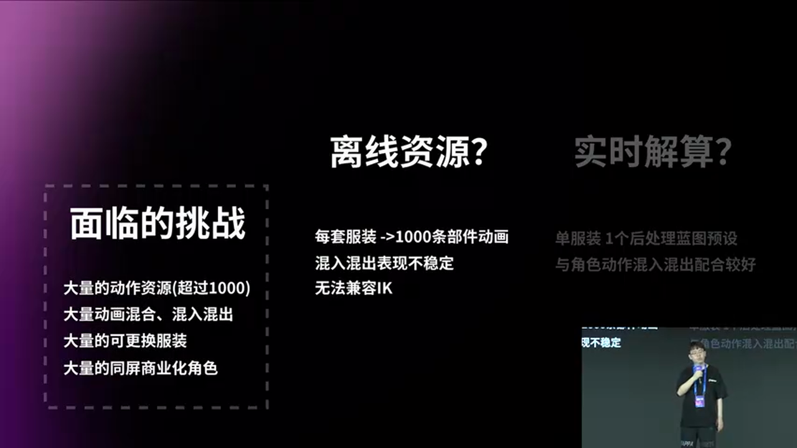

**实施方式**：依赖离线制作或预计算的资源，为每套服饰手工制作或预烘焙所有动作资源。

**劣势分析**：

> **方案一：离线预计算资源**
> - 🔴 **劣势 1 - 资源生产不可承受**：每套新增服饰都要为其制作超过 1000 条动作对应的头发布料动画。这种指数级增长的生产管线，在面对海量角色与服饰组合时，是完全不可持续的。
> - 🔴 **劣势 2 - 动态表现适配性差**：游戏运行时，角色动画处于复杂的实时混合与过渡状态，并且还有 IK 作用于骨骼。离线预计算的固定不变的布料动画，无法灵活适配这些动态变化的动画曲线与姿态，必然导致出现断裂、抖动穿帮或不稳定的现象，严重破坏游戏的沉浸感。

### 2.2 方案二：实时物理模拟

**优势**：
- **资源开销低**：不需要为每套服饰预烘焙或手工制作海量动作资源
- **集成性和易用性好**：美术师只需要在角色的后处理蓝图中编排对应的解算节点，即可直观配置和预览效果，通常能达到比较满意的美术表现要求
- **动态适配性强**：能够自然适配各种角色动作及复杂的混合状态

**劣势分析**：

项目组在开发初期果断选择了实时解算策略，但实时解算方案有固有瓶颈，尤其是在面对高精度商业化资源时。

> **方案二：实时物理模拟**
> - 🔴 **核心问题 - 性能开销巨大**：高精度需求导致高复杂度。为了实现优质效果，需要使用大量的骨骼解算节点，并依赖 Pose Driver 等节点解决穿插问题。单角色的开销非常显著。
> - 🔴 **多端适配困难**：在骁龙 870 可以让单角色每帧耗时会超过 2 毫秒。考虑到需要保证 16 人同屏的性能稳定，且需要下探到 4 核 CPU 设备，性能预算完全无法满足需求。

---

## 三、SoftAndMax：神经网络驱动的革新方案

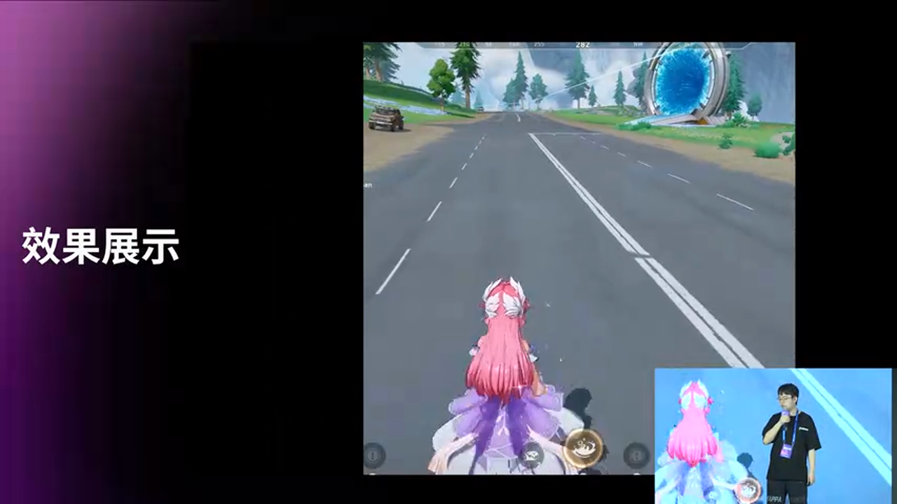

### 3.1 技术目标

要解决上述问题，理想的方案需要满足以下要求：

- **保证质量**：即使在骨骼多的情况下，也能在 16 人同屏情况下保持较高的性能
- **跨端兼容**：需要保证在主机端、手机端都能同步使用技术
- **广泛适配**：能够适配众多不同形态的头发服饰
- **数据来源灵活**：可以学习不同来源的数据（当前采用 Unreal 的 Chaos 卡巴尔系统，未来希望尝试更多数据源）

### 3.2 核心方案架构

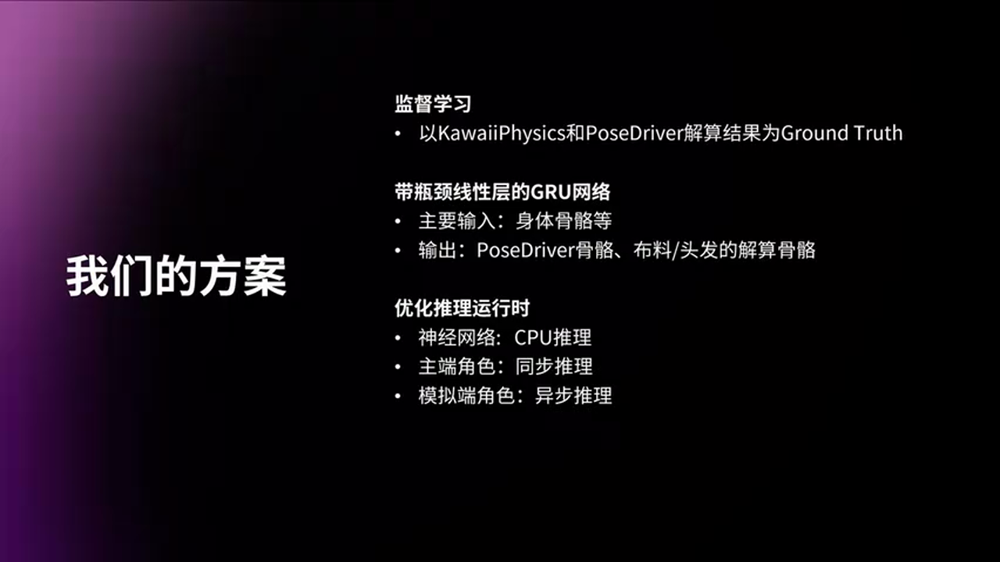

**SoftAndMax 采用监督学习方案**：

1. **数据采集阶段**：运行时实时执行高精度物理模拟，将生成的数据作为训练样本
2. **模型训练阶段**：基于这些数据训练后，为每套服饰部署一个专属的神经网络模型
3. **推理架构**：模型的核心采用 **GPU（门控循环单元）**，擅长捕捉时间序列的机来关系，学习关键的时序特征——这正是实现高精度、高质量动态预测的关键需求

**输入输出设计**：
- **输入**：角色的主骨数据
- **输出**：推理结果包含波测转费等驱动信息，以及头发的动态预测结果

**实时推理策略**：
- 对于**主控单角色**：推理会在神经动画更新后立马进行，确保动态效果与最新动画状态同步
- 对于**模拟单角色**：推理会异步执行，结果会在下一帧生效

---

## 四、工作流：从美术调教到自动化训练

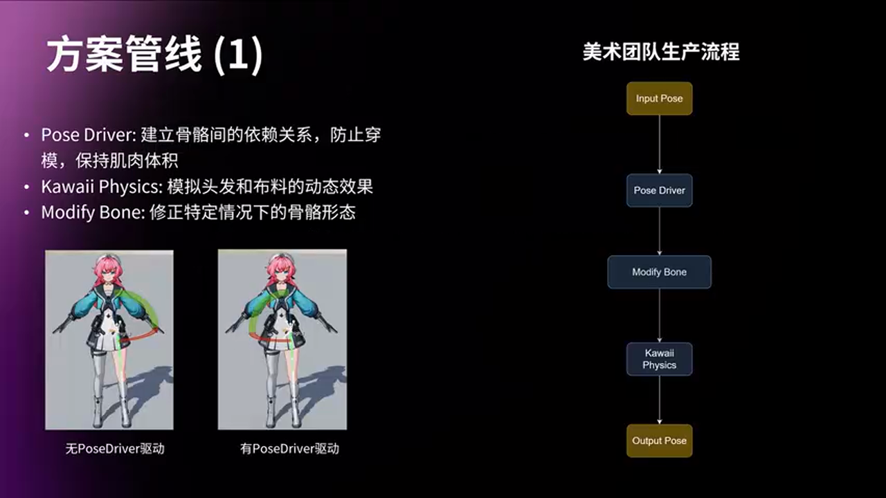

### 4.1 美术标准流程

美术团队通过图式的工作流购建最终的效果：

1. 采用标准的美术生产流程
2. 通过 **Pose Driver 系统**建立骨骼成绩间的约束力约束关系
3. 有效防止骨骼穿插问题

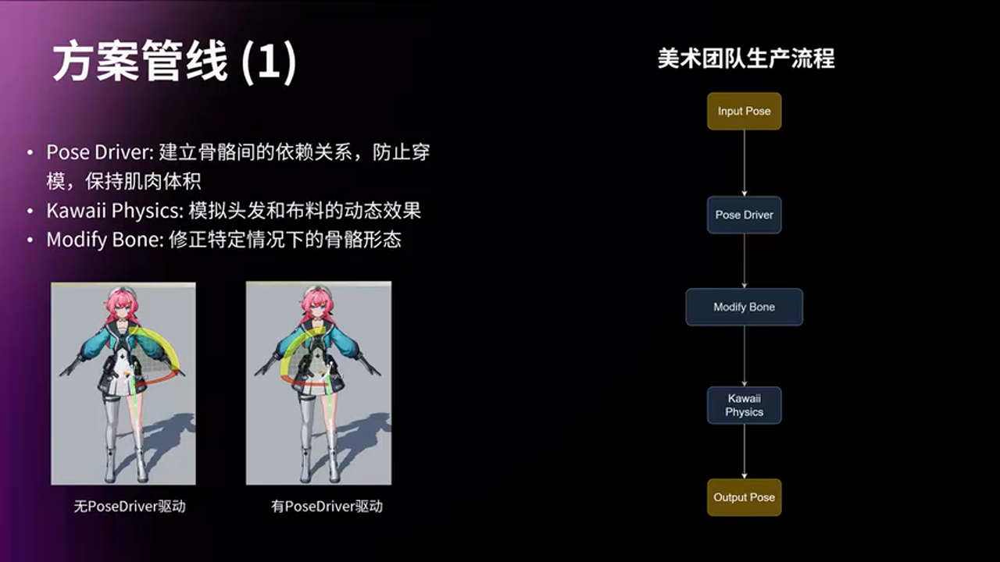

**Pose Driver 的角色**：虽然在这套流程中不可缺少，但它的性能消耗非常高。而 **Chaos 卡娃节点**专注于实现头发布料的实时物理动态效果。

在最终运行环境中，SoftAndMax 方案会替代 Chaos 和 Pose Driver，但保留了两者的效果质量。

### 4.2 自动化数据录制管线

当美术团队完成效果调板之后，就可以开始规模化的进程数据录制：

**分布式录制架构**：
1. 将自动画录制任务分发至多台构建基硬型执行
2. 运行时目标角色执行预录制的玩家操作脚本来驱动角色动作
3. 在过程时竹针捕获关键节点所需的数据，包括 Pose Driver 处理后的骨骼数据、川普丰、卡娃处理后的骨骼的川普丰

**性能表现**：

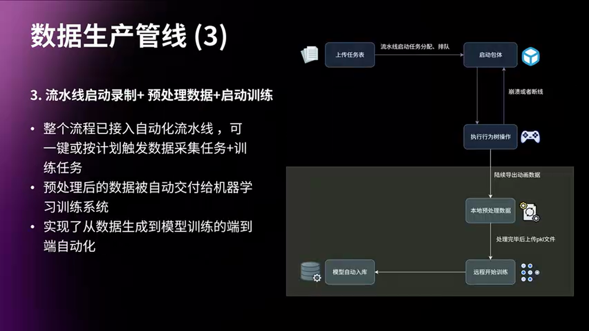

团队在固定机器上启动多个无头渲染的客户端。由于有非常多的动画动作，但任务平均分配下去后，**三个小时内就能够把所有动画数据采集完毕**——全自动化的分布式采集完毕。

录制完成后，预处理数据、训练模型都会上传到云端存储，构成完整的自动化流水线。

---

## 五、神经网络架构深度解析

### 5.1 整体网络架构

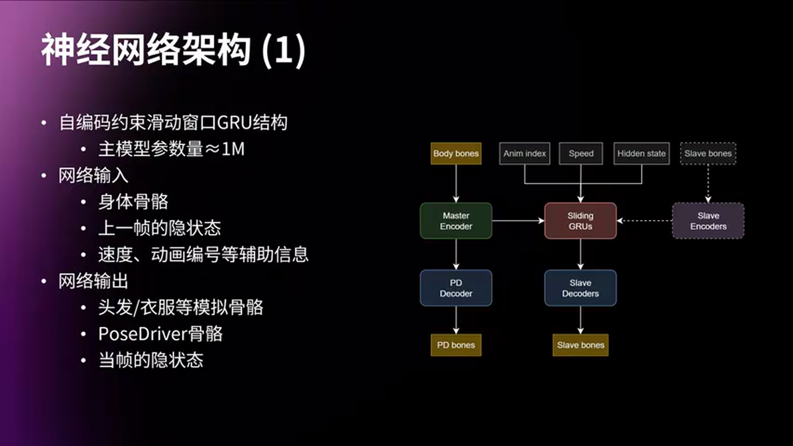

**SoftAndMax 采用自编码器式的滑动窗口 GRU 结构**：

- **模型规模**：整个主模型的参数量大概在 **100 万左右**，这是一个非常轻量级的规模，有利于在运行时实时进行高效推理

### 5.2 输入输出详解

**核心输入**：
- **角色的身体骨骼信息**：主要驱动数据
- **上一帧的隐状态**：用于处理时序连续性
- **辅助信息**：角色当前的速度等辅助信息，帮助网络理解当前运动状态

**主要输出三部分**：

1. **用于头发衣服的模拟骨骼结果**：实现自然的柔性物体动态效果
2. **用于驱动身体的 Pose Driver 骨骼信息**：主要用做穿插之类的效果修正
3. **当前帧的隐状态**：作为下一帧的输入，形成一个时序的循环

### 5.3 架构关键设计

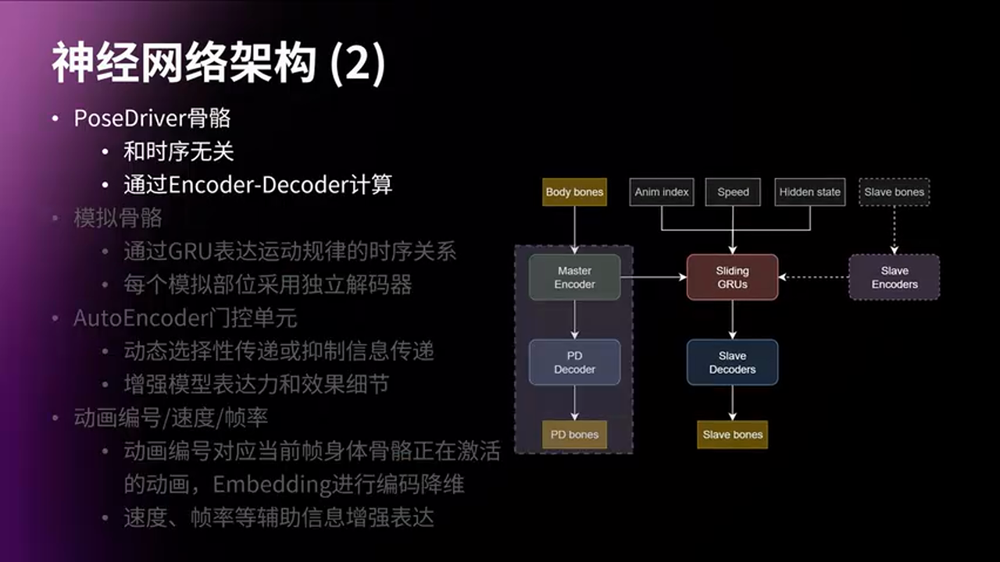

**Pose Driver 分支设计**：

Pose Driver 骨骼负责修正，只和当前的身体姿态相关，和时序无关。因此只通过一个 **Encoder-Decoder 的结构**直接计算。

**模拟骨骼的 GRU 设计**：

头发和衣服这些模拟骨骼是和历史状态高度相关的。团队使用 **GRU（门控循环单元）**来表达这种运动规律的时序关系。

**独立解码器策略**：为了性能和效果的准确性，每一个模拟的部位都采用了独立的解码器来保证最终的效果。

**门控单元的作用**：网络基础结构中的一个关键设计是**门控单元**（Gating Unit）。它能根据输入的特征动态地传递或抑制想要表达的信息，增强了模型的表达能力和最终的效果细节。

### 5.4 辅助输入设计

除了必不可少的 GRU 隐状态用来传递历史信息之外，还包括：

- **动画编号**：表达了当前帧正在激活的哪些动画，然后通过 **Embedding** 进行编码和降维
- **速度、帧率、加速信息**：增强模型对当前运动状态的理解，让网络能够输出更符合物理直觉的结果

---

## 六、训练方案：四大核心问题的解决之道

在确定了网络架构之后，训练方案需要解决四个核心问题：

### 6.1 问题一：数据感知

**挑战**：路智了大量的训练数据，怎样保证这些海量的训练数据能够被网络高效学习，更全面地感知？

**解决方案 1 - 连续旋转表示**：

在数据表示上，团队没有使用传统的欧拉角或者四元数，因为它们存在**不连续问题**（比如从零度到 360 度的跳变）。

> **技术选择：六维矩阵表示骨骼旋转**
> - ✅ 这种表示方法是连续的
> - ✅ 可以通过施密特正交化来稳定地恢复出传统的标准旋转矩阵

**解决方案 2 - 重采样策略**：

在数据采样上，虽然采取的路智回放策略能够很好地表达玩家操作和运动的主要空间，但也存在**长尾效应**——导致一些低频但非常重要的动作，其数据的代表性不足，从而可能会产生一些偶像的瑕疵。

右边的饼图展示了这种分布不均的具体例子。为了解决这个问题，团队对低频重要动作进行了**数据重采样和增强**。

### 6.2 问题二：物理规律

**挑战**：怎样设计约束，能够让网络不仅仅拟合了数据，而是获得了泛化能力，学习到真正符合物理运动规律的本质特点？

**解决方案 - 物理约束损失函数**：

团队在训练时引入了多种物理约束，例如：
- **速度连续性约束**：确保骨骼运动的速度变化符合物理规律
- **碰撞约束**：防止骨骼穿插
- **长度约束**：保持骨骼链的长度不变

这些约束帮助网络学习到物理本质，而非单纯记忆训练数据。

### 6.3 问题三：时序稳定性

**挑战**：游戏中的动作可以看作是无限延长的。对于长时序的动画，怎么解决因为误差逐渐累积而导致的效果飘移问题？

**解决方案 - Teacher Forcing 策略**：

在训练时，团队使用了 **Teacher Forcing** 技术：
- 训练阶段使用真实的历史数据作为输入
- 推理阶段使用模型自己的预测结果作为输入
- 通过 **Scheduled Sampling**，逐步增加使用模型预测结果的比例，让模型适应推理时的误差累积

同时，团队还采用了**滑动窗口策略**，定期用真实数据校正隐状态，防止长期飘移。

### 6.4 问题四：模型量化

**挑战**：在保证效果的同时，怎样对网络进行高效的量化处理，来适配更多的运行环境？

**解决方案 - QAT 量化感知训练**：

团队采用了 **Quantization-Aware Training（量化感知训练）**：
- 在训练过程中模拟量化操作
- 让网络在训练时就适应量化带来的精度损失
- 最终可以将模型从 FP32 量化到 INT8，同时保持效果几乎不变

量化后的模型在移动端的推理速度提升了 **2-3 倍**。

---

## 七、运行时推理框架：NNI 的扩展与优化

### 7.1 为什么选择 BasicCPU 后端

**NNI（Neural Network Inference）** 提供了非常多种的后端，比如 NXE、ONNX Runtime、RDG 还有新加入的 RHI 等等，但这些后端各自有各自的问题：

> **各后端对比**：
> - **RDG**：完成度非常低，稳定性比较差
> - **RHI**：性能不太够
> - **ONNX Runtime**：本身很臃肿，非常难以扩展，难以实现团队的目标，Overhead 也非常高

**最终选择**：团队选择扩展并优化 **BasicCPU** 这个后端，在此基础之上构建了 **BasicCPU++** 框架。

**BasicCPU 的优势**：

1. **和 UE 的集成非常紧密**：已经在引擎中的比如 MLDeformer、Mass AI、Learning Agent 这些模块中得到了实际的应用
2. **设计简洁高效**：模型算子的创建过程几乎没有内存分配；在推理的时候，通过 TBB（Threading Building Blocks）的机制也几乎没有额外的性能开销

### 7.2 BasicCPU 的不足与扩展

**原生 BasicCPU 框架存在的问题**：

1. **框架原生支持的算子非常少**
2. **对于分支模型的表达能力有所欠缺**，特别是动态的条件分支
3. **模型创建导出之类的工具链严重不足**
4. **基础运算的效率比较低**（关键问题）

### 7.3 团队的优化扩展

**1. 补足大量缺失的算子**：

包括在 C++ 层面的创建和推理逻辑，以及 Python 端工具链的支持。比如 **GRU Cell、GELU、LeakyReLU、Sigmoid 等算子**都是团队新加进去的。

**2. 完善条件分支支持**：

- 实现了一个 **CrossConcat 的算子**，结合 Copy 算子，可以支持任意复杂的分支模型结构
- 实现了一个 **ConditionalSubgraph 的算子**来支持动态条件分支：输入张量中的某一个比特可以用来表达条件，如果条件成立就执行 Subgraph 的计算，否则返回一个 Identity 张量

这样可以在运行时动态切换网络需要的算力。

### 7.4 矩阵运算的深度优化

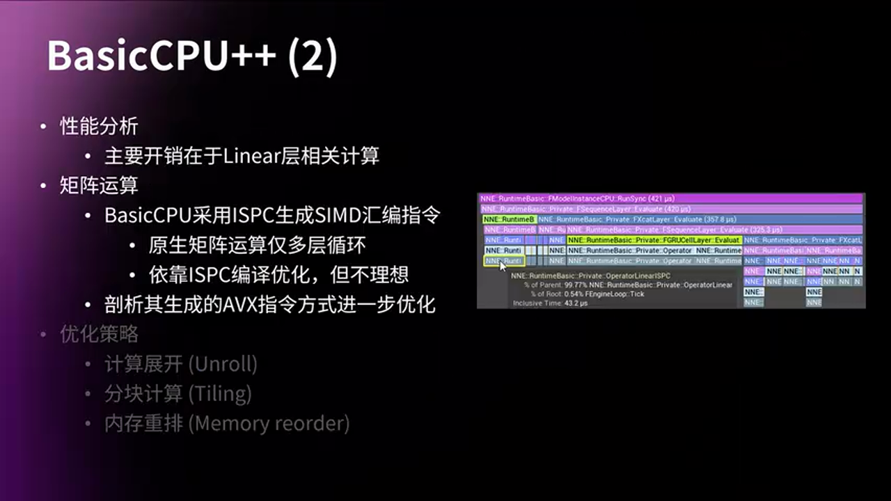

通过 Profiling 可以看到，模型的主要性能开销都集中在 **Linear 层相关的计算**上。

**原生 BasicCPU 的问题**：

BasicCPU 原生采用 **ISPC（Intel SPMD Program Compiler）** 来生成 SIMD 的汇编指令，但它的矩阵运算的 ISPC 代码写得比较暴力——简单的嵌套循环，完全依赖编译器的优化。实际效果并不十分理想。

**团队的优化方案**：

团队抛弃了它生成的 AVX 指令，借鉴了业界一些成熟的推理框架的方案，采用了多种策略进行 SIMD 优化：

1. **计算展开（Loop Unrolling）**：减少循环次数，增加指令的并行度
2. **分块计算矩阵（Tiling）**：把矩阵做一些分块，然后独立进行计算，可以增加并行度的同时还能提升缓存的命中率
3. **内存重排（Memory Reordering）**：使内存能够访问得更连续，更好地配合 SIMD 指令

**优化效果**：

经过这一系列的优化，团队的 **BasicCPU++** 框架最终在功能、兼容性、性能上面都达到了预期的目标。

---

## 八、实战落地：应对复杂游戏场景的挑战

虽然构建了高效的推理框架，但如果想要真正落地到复杂的实际游戏环境中，还是要适配各种各样的情况。

### 8.1 挑战一：Loss 与视觉效果的不对等

**现象**：训练的 Loss 和视觉的效果其实并不是完全对等的。稍微提高训练的 Loss，不一定会对视觉效果造成显著的影响。

**解决方案 - 感知性损失函数**：

团队引入了**感知性损失函数（Perceptual Loss）**，不仅关注数值误差，还关注视觉效果。通过这种方法，可以在稍微牺牲数值精度的情况下，保持视觉效果不变，从而可以**降低推理开销**。

### 8.2 挑战二：LOD 与帧率的泛化

**问题**：实际游戏中存在各种的 LOD 和各种的帧率。面对不同的 LOD 和不同的帧率，我们应该为每一种组合都设计不同的模型，还是使用泛化的模型？

**方案选择**：

> **LOD/帧率适配策略对比**：
>
> **方案 A：专用模型**
> - 🟢 优势：每个 LOD/帧率组合都有专门优化的模型，效果最好
> - 🔴 劣势：需要训练和维护大量模型，资源开销大
> - 🎯 适用场景：对效果要求极高，且 LOD/帧率组合有限的情况
>
> **方案 B：泛化模型（团队选择）**
> - 🟢 优势：一个模型适配所有 LOD 和帧率，维护成本低
> - 🟢 优势：可以平滑过渡不同 LOD 和帧率
> - 🔴 劣势：效果可能略逊于专用模型
> - 🎯 适用场景：LOD/帧率组合多，且需要平滑过渡的情况

团队最终采用了**泛化模型策略**：所有的 LOD 和所有的帧率都只使用一个模型。通过在训练时混合不同 LOD 和帧率的数据，让模型学会泛化。

### 8.3 挑战三：风场等外部力的支持

**需求**：头发和衣服的动态效果基本上都是由主骨骼的运动带动的。但是实际上在游戏里面，还有一些和主骨骼关系不太大的动态效果，比如**风场**。

团队希望在过场动画的时候，即使主骨骼不动，头发和裙摆也会随着风场的气流去抖动。

**解决方案 - 外部力输入**：

在网络输入中增加**风场向量**作为辅助输入。在训练数据采集时，也会录制有风场的场景。这样网络就可以学会根据风场信息来调整头发和衣服的动态。

---

## 九、性能对比与实战效果

### 9.1 传统方案 vs SoftAndMax

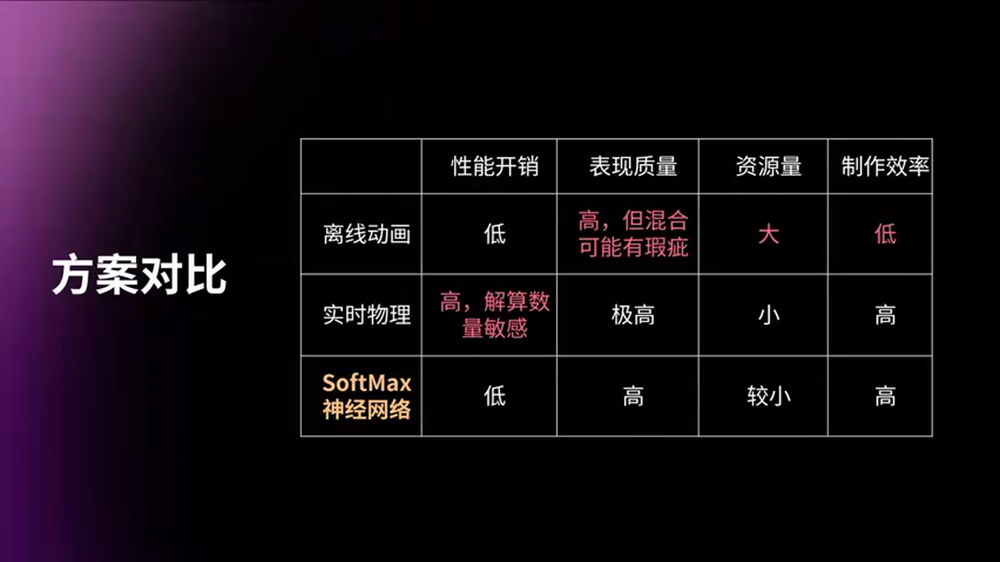

**传统 Chaos 物理模拟方案**：
- 单角色每帧耗时超过 **2ms**（骁龙 870 设备）
- 对解算的骨骼数量相当敏感
- 难以满足主流机型的帧率要求

**SoftAndMax 神经网络方案**：
- 在保持高保真动态效果的同时，实现了**亚毫秒级推理**
- 完美平衡了动态性能
- 这正是团队选择的最终方案

### 9.2 商业化应用实测

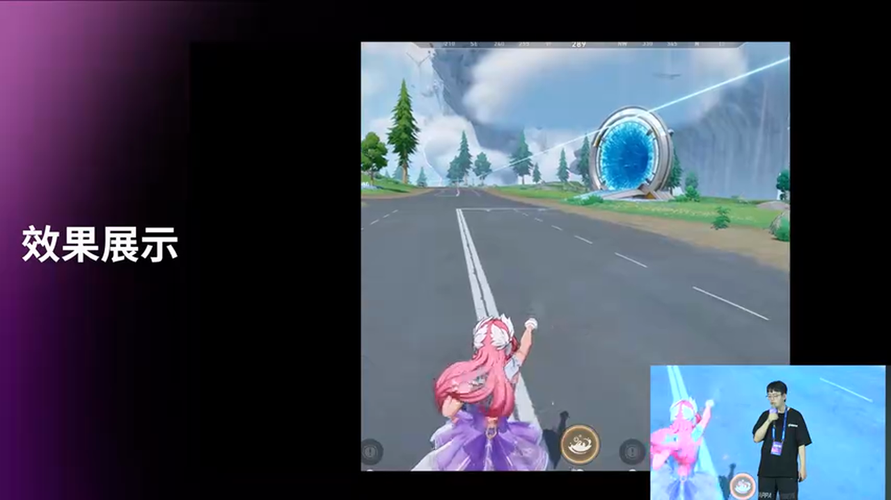

团队展示的系统能够驱动超过 **400 根骨骼**，并且最终保证效果的流畅运行。这些都是已经通过线上测试并且已经投入实际应用的商业化资源。

---

## 十、技术总结与最佳实践

### 10.1 核心技术亮点

1. **监督学习 + 轻量级 GRU 架构**：100 万参数实现高保真动态预测
2. **自动化数据管线**：3 小时完成 1000+ 动作的分布式采集
3. **六维矩阵 + 物理约束**：解决旋转不连续和泛化能力问题
4. **BasicCPU++ 框架**：SIMD 深度优化，矩阵运算性能提升 2-3 倍
5. **泛化模型策略**：一个模型适配所有 LOD、帧率和风场

### 10.2 避坑指南

> **生产环境常见问题**：
>
> 1. **数据分布不均导致低频动作效果差**
>    - 解决：对重要低频动作进行重采样和数据增强
>
> 2. **长时序推理导致效果飘移**
>    - 解决：使用 Teacher Forcing + Scheduled Sampling + 滑动窗口校正
>
> 3. **量化后效果下降明显**
>    - 解决：采用 QAT 量化感知训练，让模型在训练时就适应量化
>
> 4. **多端性能差异大**
>    - 解决：使用 BasicCPU++ 的 SIMD 优化，保证 CPU 推理性能
>
> 5. **Pose Driver 计算成本高**
>    - 解决：将 Pose Driver 的修正效果也纳入神经网络学习，用 Encoder-Decoder 分支直接计算

### 10.3 最佳实践建议

**数据采集阶段**：
- 使用分布式无头渲染客户端，并行录制动画数据
- 确保录制脚本覆盖所有重要的边缘情况（低频动作、极端姿态）
- 同时录制 Pose Driver 和 Chaos 的输出结果

**模型训练阶段**：
- 使用六维矩阵表示旋转，避免欧拉角/四元数的不连续性
- 引入物理约束损失（速度连续性、碰撞约束、长度约束）
- 采用 QAT 量化感知训练，提前适应量化精度损失
- 使用 Scheduled Sampling 解决长时序飘移问题

**运行时推理阶段**：
- 主控角色同步推理，模拟角色异步推理
- 根据 LOD 和屏幕占比动态调整推理频率
- 使用 BasicCPU++ 的条件分支功能，动态调整算力

**工具链建设**：
- 完善 Python 到 UE 的模型导出工具链
- 提供可视化调试工具，对比神经网络输出和物理模拟结果
- 建立自动化 CI/CD 流程，每次资源更新自动触发数据录制和模型训练

---

## 十一、未来展望

**SoftAndMax** 方案已经在《命运半神》项目中得到了成功应用，但技术探索永不止步。团队未来的方向包括：

1. **更多数据源**：当前数据来源于 Unreal 的 Chaos 系统，未来希望尝试真实捕捉数据、其他物理引擎数据等
2. **更强的泛化能力**：探索元学习（Meta-Learning）技术，让模型可以快速适应新角色和新服饰
3. **实时交互支持**：支持玩家实时交互（如抓取、拉扯）对布料的影响
4. **多模态融合**：融合视觉、触觉等多种模态，提升布料模拟的真实感

---

神经网络驱动的实时布料系统代表了游戏引擎技术的一个重要发展方向：**用机器学习替代传统计算密集型算法，在保证效果的同时大幅降低性能开销**。随着硬件和算法的不断进步，我们有理由相信，未来会有更多游戏系统采用类似的 AI 驱动方案。

如果你对这项技术感兴趣，欢迎扫描文章开头的二维码，加入 UE5 技术交流群，与更多开发者交流探讨！
