# 虚幻引擎赋能影视教育：北京电影学院美术学院的沉浸式创作实践深度解析

---


## 加入 UE5 技术交流群

如果您对虚幻引擎5的图形渲染技术感兴趣,欢迎加入我们的 **UE5 技术交流群**!

扫描上方二维码添加个人微信 **wlxklyh**,备注"UE5技术交流",我会拉您进群。

在技术交流群中,您可以:
- 与其他UE开发者交流渲染技术经验
- 获取最新的GDC技术分享和解读
- 讨论图形编程、性能优化、构建工具流、动画系统等话题
- 分享引擎架构、基建工具等项目经验和技术难题

---

**源视频信息**: [UFSH2025]虚幻浸润现实——北京电影学院美术学院的教学创新与跨界实践 | 周戴 北京电影学院美术学院副院长  
**视频链接**: https://www.bilibili.com/video/BV1avmzBUEdj  
**说明**: 本文由AI辅助生成,基于视频内容整理

---

> **核心观点**
> - 虚拟制作技术正在重塑影视教育的流程与思维模式,从"后期修改"转向"前期验证"
> - 影视美术不再只是视觉设计,而是需要协调现场灯光、虚实结合的综合能力
> - 技术赋能与美学重构并重,通过虚幻引擎等实时技术探索新的视觉表达语言
>
> **前置知识**: 虚幻引擎基础、虚拟制片(VP)技术、实时渲染原理、影视美术设计基础

---

## 一、背景与痛点:影视教育面临的技术变革

### 1.1 游戏引擎对传统影视流程的冲击

我们正处在一个技术融合的时代。游戏引擎的介入正在悄然改变传统影视制作流程的每一个环节。对于影视教育而言,这不仅仅是技术工具的更新,更是**创作思维方式的根本性转变**。


北京电影学院美术学院副院长周戴教授指出,传统影视制作流程中,很多技术环节因为游戏引擎的隐形介入已经在发生改变。但这种改变不仅仅是技术本身的问题,还涉及到**艺术表达和艺术思维**的重构。

### 1.2 "沉浸"概念的核心地位

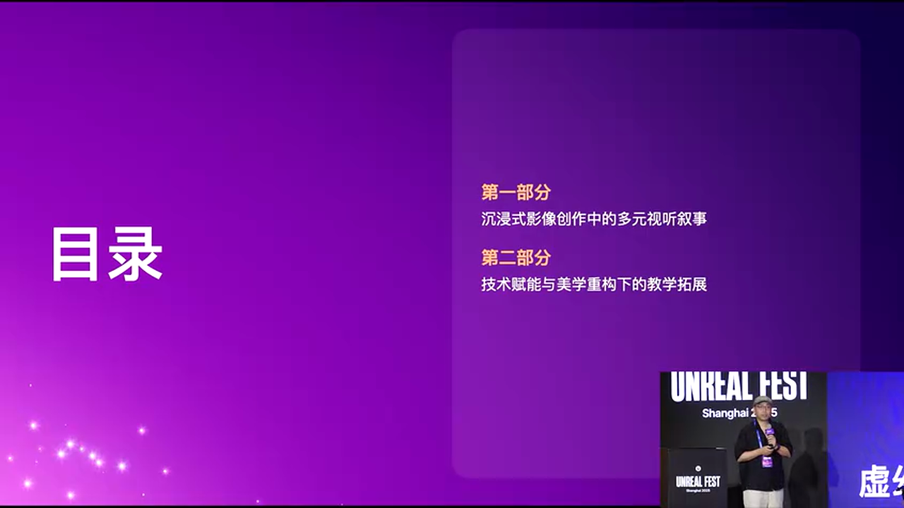

本次分享的核心主题是"沉浸"。这个概念贯穿整个教学实践,体现在两个维度:

**维度一:沉浸式创作的多元叙事**  
通过虚拟制作技术,创作者可以在拍摄现场实时看到最终效果,这种"所见即所得"的体验让创作过程本身变得沉浸。

**维度二:技术赋能与美学重构**  
虚幻引擎等实时技术不仅提供了新的制作手段,更重要的是为影视美学探索提供了新的可能性空间。

### 1.3 教育痛点:从理论到实践的鸿沟

传统影视教育面临的核心挑战:

**挑战1:周期过长,难以快速验证**  
在传统流程中,学生从气氛图到预演,往往需要很长周期才能看到最终效果。这导致学生很难在课程期间完成一个完整的、高质量的作品。

**挑战2:后期修改成本高**  
传统影视制作中,很多问题要到后期才能发现,但此时修改成本极高,甚至无法修改。

**挑战3:现场经验缺失**  
学生毕业后进入剧组,往往需要很长的适应期,因为在学校期间缺乏真实的现场制作经验。

虚拟制作技术的引入,恰好可以解决这些痛点。

---

## 二、技术基础设施:怀柔校区的虚拟制作生态

### 2.1 硬件设施布局


北京电影学院美术学院从2021年开始筹备怀柔校区搬迁,在2022-2023年期间搭建了完整的虚拟制作技术设施。核心设施包括:

**核心设施清单**:
- **LED虚拟拍摄棚(VP棚)**: 用于实时合成虚拟背景与真实演员
- **摩扇(Motion Control)摄影机械臂**: 实现精确的摄影机运动控制
- **摄影机跟踪系统**: 实时追踪摄影机位置和姿态
- **实时预演绿幕系统**: 支持传统绿幕与实时预览结合
- **动作捕捉系统(Mocap)**: 捕捉演员表演数据


这些设施的配套使用,形成了一个完整的**实时虚拟制作生态系统**。

### 2.2 VP棚的技术特点与设计考量

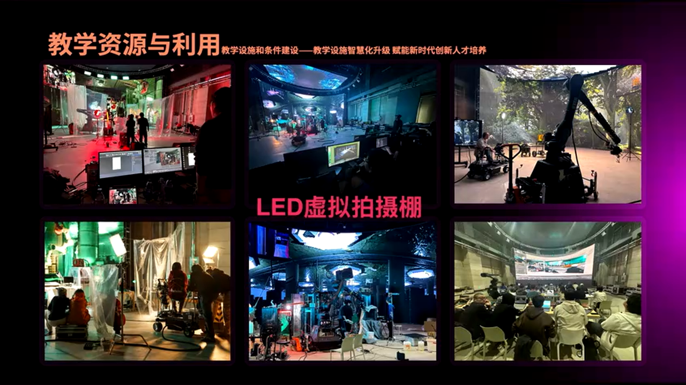

北影美院的VP棚设计有其独特之处:

**设计特点1:天幕而非地幕**  
与XR(扩展现实)棚不同,北影的VP棚选择了天幕设计。原因是:
- 前景需要搭建实景,地面空间被占用
- 天幕主要用于**环境反射**和**模拟灯光运动**
- 这种设计更适合影视拍摄中真人演员+实景搭建的需求

**设计特点2:虚实结合的灯光系统**  
LED屏幕本身可以作为光源,但需要与现场实体灯光精确匹配。这对美术指导的综合能力提出了更高要求。

**技术约束与创作机遇**:
- VP棚宽度约13米,对镜头调度有一定限制
- 但这种限制反而激发了创作者的空间想象力
- 学生需要学会在技术约束下寻找创意解决方案

### 2.3 展演空间K5:超越传统银幕的可能性

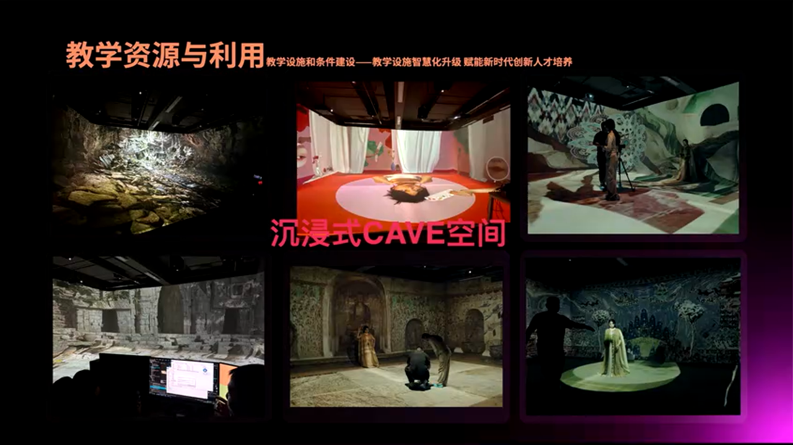

除了服务于传统银幕的VP棚,美院还建设了K5展演空间,用于探索**超越银幕的影像形态**:

**K5的应用场景**:
- 大型展示活动
- 沉浸式戏剧
- 多媒体舞台剧
- 现场互动装置

在K5空间中,**视觉逼真度不再是最重要的**,更关键的是:
- 如何调动现场的时间和空间
- 如何让虚拟空间与现实空间产生互动
- 观看方式不再依赖剪辑,而是依靠**观众的视角调度**和**空间中的剪辑思维**

这种探索对应着当下影像消费形态的变化:从传统影院到流媒体,再到短视频、竖屏短剧,影像的空间形态正在发生根本性改变。

---

## 三、教学实践案例一:《格子间》——纵向空间的视觉隐喻

### 3.1 项目背景与创作动机


《格子间》是2024年4月完成的一个虚拟拍摄项目,制作周期约一周时间。这个项目配合48小时虚拟拍摄大赛,最终获得全国第一名。

**创作起点**:学生的真实困境  
学生们观察到当代职场的一个现象:996工作制下,每个人被固定在一个工位上,工作时间大于生活时间。这种"格子间"的空间形态,成为了视觉表达的核心隐喻。


### 3.2 空间设计:从横向到纵向的转换

**核心设计思路**:  
将传统的横向格子间空间,转化为**纵向的电梯空间**。这个转换不仅仅是形式上的,更蕴含深层的叙事意图。


**为什么选择纵向空间?**

**原因1:适配VP棚的物理限制**  
VP棚宽度只有13米,如果做横向调度会非常困难。纵向空间可以充分利用LED屏幕的高度,创造出更大的视觉空间感。

**原因2:视觉错觉的营造**  
纵向运动的电梯空间可以让观众产生强烈的视觉错觉,形成相对封闭的室内空间与运动的室外空间的对比。

**原因3:叙事隐喻**  
电梯的每一次升降,代表着一个新的任务、一个新的工作循环。这种重复性恰好隐喻了当代职场的机械性和循环性。

### 3.3 视觉参考与美学体系

学生团队进行了大量的视觉研究,参考了多部经典电影:


**参考作品1:《玩乐时光》(法国,1960年代)**  
雅克·塔蒂的这部电影以空间构成的重复性著称,格子间的视觉形态在这部电影中得到了充分展现。

**参考作品2:《人生切割术》(美剧)**  
这部剧探讨了工作与生活的分离,其视觉风格对《格子间》的色彩和氛围设计产生了重要影响。

**美学原则**:  
不是凭空创造新视觉,而是从**美学系统中寻找前身**,然后结合当代语境进行重构和创新。这是影视美术教育的重要原则。

### 3.4 双重世界的视觉对比

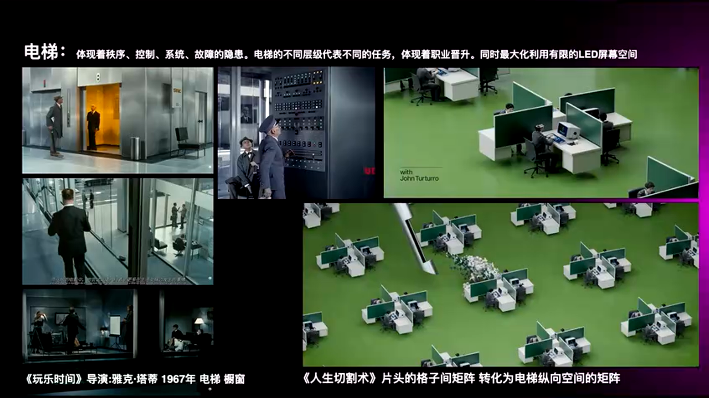

《格子间》构建了两个对比鲜明的世界:

**室外世界(虚拟世界)**:  
- 由虚幻引擎实时渲染
- 视觉风格类似《动物庄园》的隐喻性
- 代表着现实世界的冷酷和机械

**室内世界(工作环境)**:  
- 格子间的重复性空间
- 代表着被控制的、参数化的生活
- 所有的"温馨"都是人工智能营造的假象

**视觉参考:爱德华·霍普的绘画**  
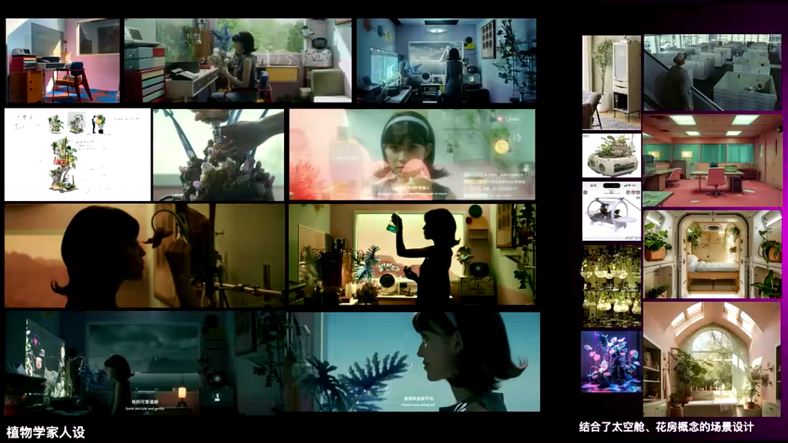

室内场景的光影设计参考了美国画家爱德华·霍普的作品,那种孤独感、疏离感与当代职场的精神状态高度契合。

### 3.5 隐藏角色:无形的大反派


这个故事中有一个隐形的角色——**大反派**,即无形的资本控制和AI监控系统。

**视觉呈现方式**:
- 没有具体的人物形象
- 通过UI界面、工作指标、监控画面来暗示
- 主角的所有行为都在被量化、被考核


这些UI元素都需要提前在虚幻引擎中制作好,作为虚拟资产的一部分。

### 3.6 光与时间的隐喻


**光的双重角色**:

**角色1:黑客的引导**  
远处的灯塔光线闯入了这个封闭空间,用光来吸引主角,引导他逃离。这个"黑客"在影片最后才以真人形态出现。

**角色2:时间的暗示**  
整个室内空间刻意没有设置时钟,所有时间的暗示都通过**光影的变化**来实现。每当电梯升降一次,窗外的光影就会变化,暗示时间的流逝。

**技术实现**:  
虚拟屏幕上的灯塔光线需要与现场实体灯光配合,让虚拟的光能够"穿透"到前景的玻璃上,产生真实的反射效果。


### 3.7 蝴蝶的象征意义

影片中蝴蝶出现了两次:

**第一次:屏幕外的虚拟蝴蝶**  
主角只能看到,但摸不到,这是虚拟世界的一部分。

**第二次:现实中的真实蝴蝶**  
当主角逃出格子间,摸到真实的蝴蝶时,他突然意识到:外面的世界并没有AI告诉他的那么可怕。连蝴蝶都能活下来,我为什么不能出去?

这个细节的设计体现了**视觉叙事的力量**:不需要台词,仅通过视觉元素就能传达深刻的主题。

---

## 四、教学实践案例二:《洛神赋》——传统美学的数字重构

### 4.1 项目定位:技术赋能与美学重构


如果说《格子间》是电影化的叙事,那么《洛神赋》系列作品则是**舞台化的影像**。这个项目由大三学生完成,探索的是如何将传统中国美学通过虚幻引擎进行数字化重构。

**核心理念**:  
不是简单地把绘画动画化,而是通过**镜头语言侵入传统绘画空间**,重新解构和讲述故事。

### 4.2 视觉来源:魏晋时期的《洛神赋图》

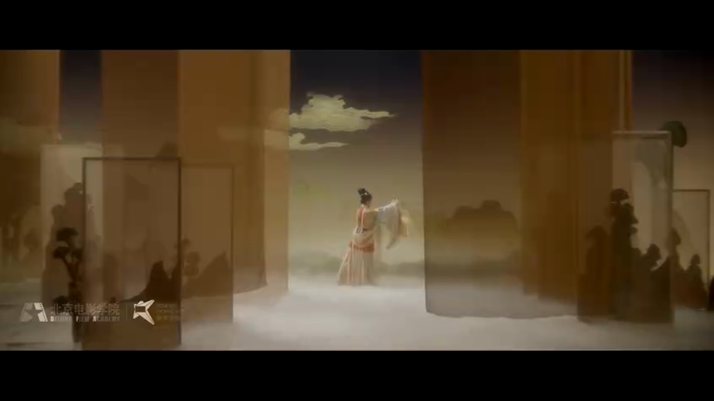

学生团队选择了魏晋时期的《洛神赋图》作为视觉来源。这个选择非常巧妙:

**为什么选择魏晋时期?**

**原因1:尚未形成固定的山水画程式**  
魏晋时期是中国绘画史上的一个特殊阶段,山水画还没有形成后来那种固定的皴法和构图模式。这给了创作者更大的自由度。

**原因2:最早的人物画传统**  
《洛神赋图》是最早的人物画代表作之一,其对人物与环境关系的处理,与影视的空间叙事有天然的契合点。

**原因3:卷轴叙事的时空结构**  
《洛神赋图》是通过卷轴展开叙事的,其中包含了**时空分割、场景切换、留白**等元素,这些都可以转化为影像的蒙太奇语言。


### 4.3 从绘画到影像:空间重构的挑战

**核心挑战**:  
如何用电影镜头"侵入"一幅平面绘画,并在三维空间中重新讲述故事?

**解决方案**:

**步骤1:空间重建**  
在虚幻引擎中,将《洛神赋图》中的元素重建为三维场景。但不是简单的3D化,而是保留原画的**视觉风格和笔触质感**。

**步骤2:镜头设计**  
设计镜头如何在这个空间中移动,如何通过景别变化和运动来讲述故事。

**步骤3:时间重构**  
原画是静态的,但影像需要时间维度。如何在保持原画美学的同时,赋予其时间的流动性?

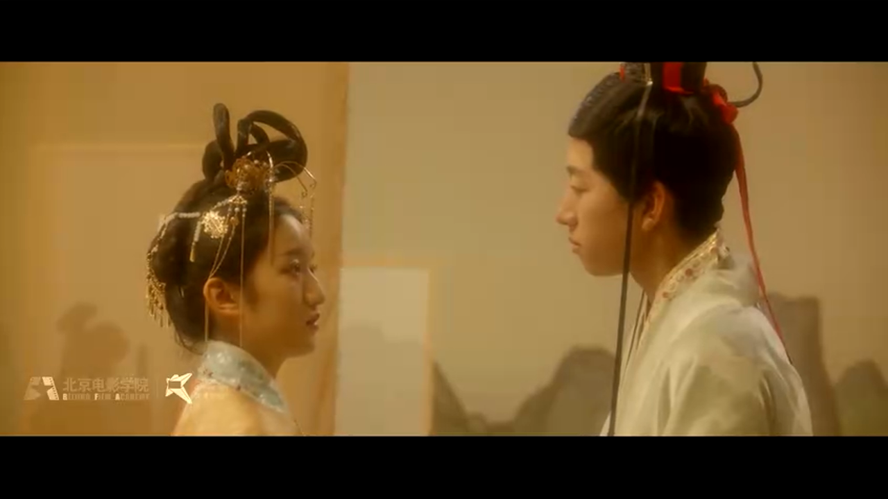

**教学意义**:  
这个项目对大三学生来说挑战很大,因为他们需要同时掌握:
- 传统美学的理解和消化
- 虚幻引擎的技术操作
- 影像叙事的镜头语言

但正是这种挑战,让学生真正理解了**技术与艺术的关系**。

### 4.4 武侠题材:横版游戏的影像化


第二组学生选择了武侠题材,他们的创作灵感来自于**16位到32位时代的横版游戏**。

**创作思路**:

**参考1:土星时代的横版游戏**  
那个时代的游戏还没有真正的3D,采用的是横版卷轴的形式。这种视觉形态本身就具有很强的电影感。

**参考2:游戏的层级调度**  
横版游戏中,背景、中景、前景的层级关系非常清晰。这种**分层合成**的思维,恰好是VP棚制作的核心原理。


**技术实现**:

**特点1:一镜到底**  
整个片子从左端推进到右端,用了大约5分钟,中间通过视效来接镜头。

**特点2:层级合成**  
虚拟拍摄棚的本质就是把**后期合成的概念前置到拍摄现场**。需要做好层级之间的衔接,才能产生真实的空间深度。

**视觉参考**:
- 《杀死比尔》的光影风格
- 张艺谋电影的色彩运用
- 某款热门横版游戏的场景设计

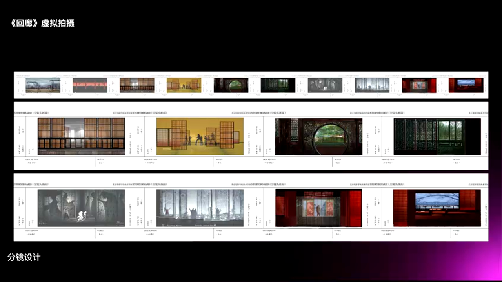

---

## 五、核心技术解析:虚实结合的制作流程

### 5.1 虚拟制作的本质:合成前置

传统影视制作流程:
```
拍摄 → 后期合成 → 最终成片
```

虚拟制作流程:
```
前期资产准备 → 实时合成拍摄 → 轻量后期 → 最终成片
```

**核心差异**:

**差异1:所见即所得**  
在VP棚拍摄时,导演和摄影师在监视器上看到的,就是最终成片的效果。这极大地提升了创作的确定性。

**差异2:无法后期修改**  
因为虚拟背景是实时渲染并直接拍摄到摄影机中的,没有绿幕抠像,所以**几乎无法做后期修改**。这要求前期准备必须非常充分。

**差异3:美术的角色转变**  
美术不再只是做视觉设计,而是需要作为**综合协调者**,协调现场灯光、摄影、虚拟资产等所有与视觉相关的部分。

### 5.2 资产制作流程


**阶段1:概念设计**  
基于剧本和策划案,使用传统绘画或AI工具生成概念图。

**阶段2:3D建模**  
在Blender、Maya或其他DCC软件中建模。对于学生作品,可以使用Quixel Megascans等资产库。

**阶段3:材质与贴图**  
在Substance Painter或虚幻引擎内完成材质制作。需要特别注意**PBR(基于物理的渲染)**材质的正确性。

**阶段4:导入虚幻引擎**  
使用官方插件(如Datasmith)可以自动配置材质和光照。

**阶段5:场景搭建与优化**  
在虚幻引擎中搭建完整场景,并进行性能优化,确保能够达到实时渲染的帧率要求(通常至少60fps)。

### 5.3 灯光匹配:虚实结合的关键

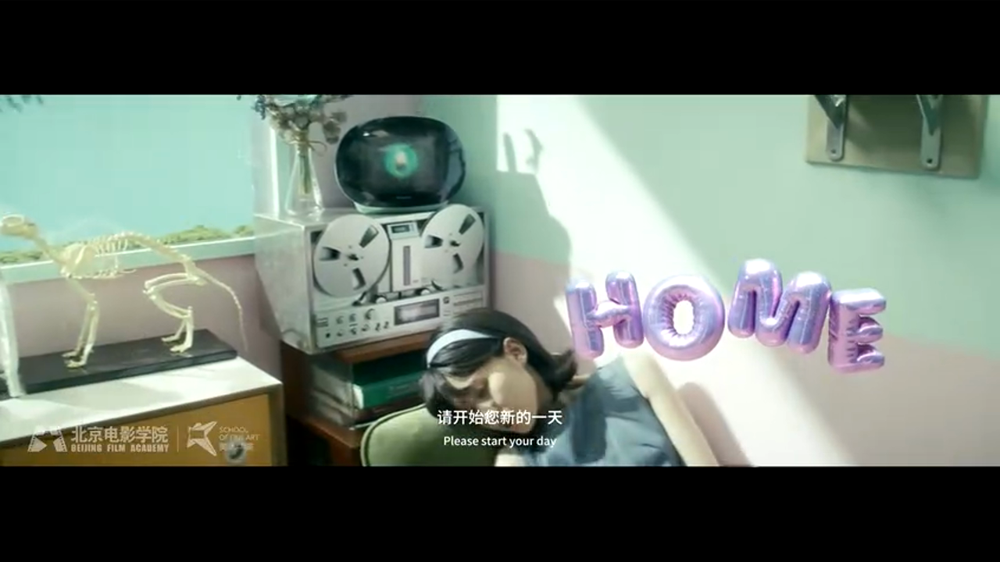

虚拟制作最大的技术挑战之一,就是**虚拟灯光与现实灯光的匹配**。

**匹配维度**:

**维度1:色温匹配**  
LED屏幕的色温需要与现场灯光的色温一致,否则会出现明显的色彩断层。

**维度2:亮度匹配**  
虚拟环境的亮度需要与现场灯光的亮度相匹配,这需要精确的测光和调整。

**维度3:方向匹配**  
虚拟环境中的主光源方向,需要与现场的主光源方向一致,这样演员身上的光影才会自然。

**维度4:动态匹配**  
如果虚拟环境中有动态光源(如灯塔、火焰),现场也需要配合相应的动态灯光。

**实践案例:《格子间》的灯塔光**


虚拟屏幕上的灯塔光需要与现场的实体灯光配合:
- 屏幕上显示灯塔的视觉
- 现场用聚光灯模拟灯塔光线的照射
- 两者的旋转速度、亮度变化需要精确同步

### 5.4 摄影机跟踪系统


摄影机跟踪系统是虚拟制作的核心技术之一。它的作用是:

**功能1:实时追踪摄影机位置**  
通过光学或机械传感器,实时获取摄影机的6自由度位置信息(X, Y, Z, Pitch, Yaw, Roll)。

**功能2:同步虚拟摄影机**  
将位置信息传递给虚幻引擎,让虚拟摄影机与真实摄影机保持同步。

**功能3:实时渲染匹配视角**  
虚幻引擎根据摄影机位置,实时渲染出对应视角的虚拟场景,显示在LED屏幕上。

**技术参数要求**:
- **延迟**: 需要控制在1-2帧以内(约16-33ms)
- **精度**: 位置精度需要达到毫米级,角度精度需要达到0.1度级
- **稳定性**: 系统需要能够长时间稳定运行,不能出现漂移

### 5.5 动作捕捉在教学中的应用


动作捕捉(Mocap)系统在教学中的应用:

**应用1:角色动画制作**  
学生可以通过动作捕捉快速获取角色动画数据,而不需要手工制作每一帧动画。

**应用2:虚拟角色表演**  
在虚拟制作中,可以让演员穿戴动捕设备,实时驱动虚拟角色,与真实演员同台表演。

**教学周期**:  
厂家提供4天的动捕培训,然后学生在1-2周内就能完成包含动作捕捉的角色设计项目。这种快速迭代的能力,在传统流程中是不可想象的。

---

## 六、教学方法论:从执行者到决策者

### 6.1 综合能力培养:打破专业壁垒

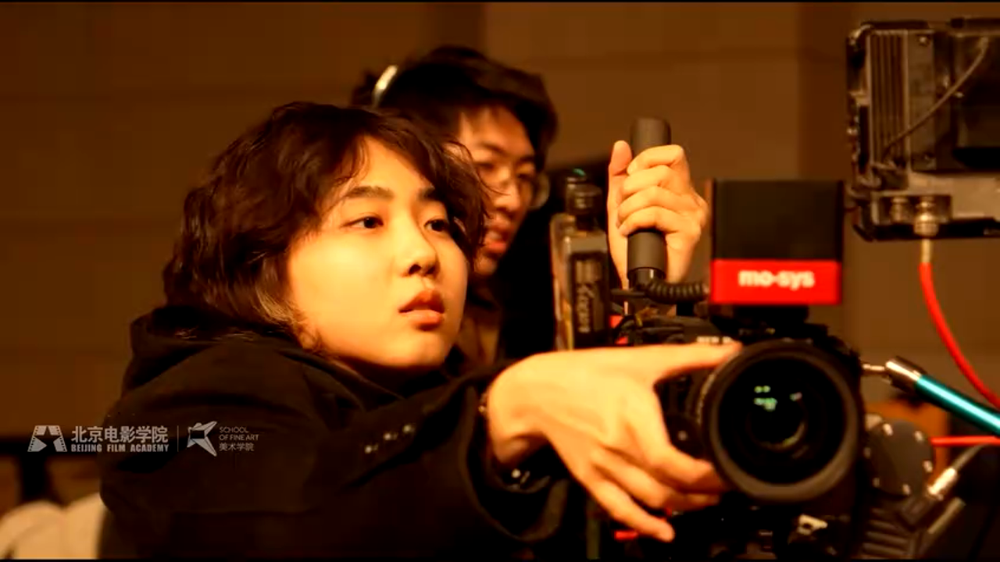

北影美院的教学理念强调**综合能力**,而不是单一的技术技能。

**与游戏专业的区别**:  
电影拍摄都需要真人演出。当有了真人和实景搭建之后,虚拟部分对逼真度的考验就更大了。这要求学生必须掌握:
- 虚拟环境制作
- 实景搭建
- 灯光设计
- 摄影技术
- 导演思维

**专业交叉**:  
虽然美院内部专业分得很细(电影美术、电影特技、虚拟空间、跨媒体艺术等),但实际上**专业之间的课程是交叉的**。学生需要从电影到影像,再到空间,进行全方位的拓展。

### 6.2 双师型教师团队


美院的教师都是**双师型教师**,既有教学经验,也有丰富的项目经验。

**教学模式**:  
老师和学生一起作为创作团队参与项目,而不是传统的"老师讲、学生听"的模式。这种**项目制教学**让学生能够在真实的创作环境中学习。

**产学研结合**:  
学生可以参与老师的商业项目,比如校长郝强的电视剧项目。学生全程参与,从前期视觉设计到视效制作,再到片头包装,获得完整的流程经验。


### 6.3 快速迭代:从想法到成片

**传统流程的问题**:  
在传统影视流程中,从创意到最终成片,往往需要几个月甚至几年的时间。学生很难在一个学期内看到自己作品的最终效果。

**虚拟制作的优势**:  
虚拟制作将后期前置,大大压缩了制作周期。学生可以在**一周到两周**内完成一个完整的短片。

**48小时虚拟拍摄大赛**:  
这个比赛的周期设计非常有意思:
- 前2天:出方案
- 中间3-4天:资产制作和场景搭建
- 最后1-2天:拍摄和剪辑

这种高强度的创作过程,让学生能够快速验证自己的想法,并在失败中快速学习。

### 6.4 从气氛图到可拍摄场景

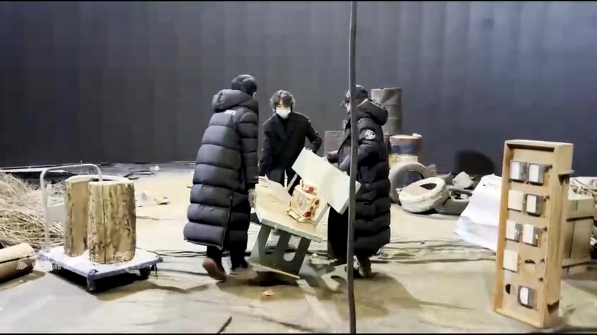

传统美术教育的重点是**气氛图和预演**,展示美术的设计价值。但在虚拟制作流程中,美术的角色发生了根本性变化:

**角色转变**:  
美术不再只是做视觉设计,而是需要:
- 协调现场灯光
- 配合摄影调度
- 管理虚拟资产
- 确保虚实匹配

这种综合协调能力,才是虚拟制作时代美术指导的核心竞争力。

---

## 七、技术赋能与美学重构:超越工具层面的思考

### 7.1 技术不是目的,讲故事才是

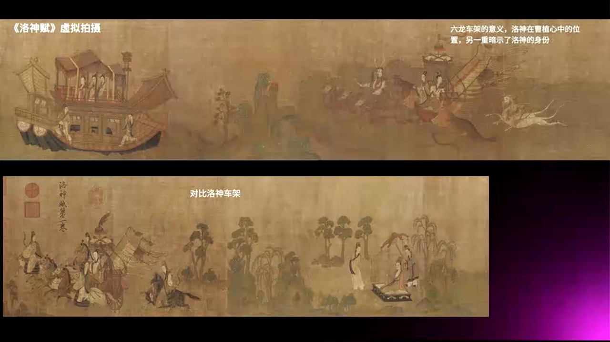

周戴教授反复强调:美院并不把虚拟空间、跨媒体、特技当做特别分割的专业,而是相互配合的整体。也没有把某一个技术课程强调得特别多。

**核心理念**:  
更强调的是如何**用今天的技术去讲好故事**,以及如何**讲好今天形态的故事**。

今天的观众与过去的观众不一样:
- 他们习惯了短视频的节奏
- 他们习惯了竖屏的观看方式
- 他们习惯了互动和参与

影视创作者需要理解这些变化,并用新的技术手段去适应新的观众。

### 7.2 美学系统的传承与创新


一个重要的教学原则:**不是凭空创造新视觉,而是从美学系统中寻找前身**。

**实践方法**:

**步骤1:拉片研究**  
让学生观看大量经典电影,分析其视觉风格、镜头语言、空间构成。

**步骤2:视觉调研**  
研究当代生活的困境和矛盾,寻找视觉化表达的可能性。

**步骤3:风格提炼**  
从经典作品中提炼出适合当前项目的视觉元素和美学原则。

**步骤4:当代重构**  
将这些元素与当代技术和当代语境结合,产生新的表达。

这种方法论确保了学生的创作既有**文化深度**,又有**当代性**。

### 7.3 高校作为行业实验田


一个有趣的现象:在虚拟制作领域,**高校可能走在了行业前面**。

**原因分析**:

**原因1:试错成本低**  
高校的项目主要是教学项目,试错成本相对较低,可以大胆尝试新技术和新方法。

**原因2:创新动力强**  
学生和老师都有创新的动力,不会被商业项目的各种约束所限制。

**原因3:设备更新快**  
高校的设备更新周期相对较快,能够及时跟上技术发展的步伐。

**行业影响**:  
现在陆续有很多高校(中戏、中传等)都建设了VP棚。这些高校培养出来的学生,将成为推动行业变革的重要力量。

### 7.4 AI技术的初步应用


在最新的项目中,学生开始尝试使用AI技术:

**应用场景1:真人转AI角色**  
使用AI技术将真人演员转换成具有特定视觉风格的AI角色,比如波斯绘画风格的角色。

**应用场景2:风格迁移**  
使用AI进行风格迁移,将现代场景转换为古代绘画风格。

**应用场景3:内容生成**  
使用AI生成一些背景元素或装饰性内容。

**教学态度**:  
对AI技术保持开放态度,但强调AI只是工具,**艺术判断和创作意图**仍然是人的核心价值。

---

## 八、实战总结与最佳实践

### 8.1 虚拟制作的核心要点

基于北影美院的教学实践,我们可以总结出虚拟制作的几个核心要点:

**要点1:前期准备必须充分**  
因为无法后期修改,所以前期的资产制作、场景搭建、灯光预设必须非常充分。建议制作详细的**技术预演(Techvis)**。

**要点2:虚实匹配是关键**  
灯光、色彩、质感的虚实匹配,决定了最终画面的真实感。需要在现场反复调试,直到达到最佳效果。

**要点3:团队协作至关重要**  
虚拟制作涉及多个专业领域,需要美术、灯光、摄影、技术等多个部门紧密配合。建立清晰的沟通机制非常重要。

**要点4:技术约束激发创意**  
不要把技术限制看作障碍,而要把它看作创意的激发点。《格子间》的纵向空间设计就是一个很好的例子。

### 8.2 常见问题与解决方案

**问题1:LED屏幕的摩尔纹**

**现象**: 摄影机拍摄LED屏幕时,可能出现摩尔纹或闪烁。

**解决方案**:
- 调整摄影机快门速度,使其与LED屏幕刷新率匹配
- 使用更高像素密度的LED屏幕
- 在后期使用去摩尔纹滤镜(但这违背了虚拟制作的初衷)

**问题2:虚拟资产的性能优化**

**现象**: 场景过于复杂,导致实时渲染帧率下降。

**解决方案**:
- 使用LOD(Level of Detail)技术
- 合理使用Nanite虚拟几何体系统(UE5)
- 优化材质复杂度,减少不必要的计算
- 使用遮挡剔除(Occlusion Culling)

**问题3:演员与虚拟环境的互动**

**现象**: 演员看不到虚拟环境,难以准确表演。

**解决方案**:
- 在现场设置监视器,让演员能够看到合成后的效果
- 使用AR眼镜让演员直接看到虚拟元素
- 在排练阶段使用VR设备让演员熟悉虚拟环境

### 8.3 教学建议

对于希望开展虚拟制作教学的院校,北影美院的经验提供了以下建议:

**建议1:循序渐进**  
不要一开始就上全套设备。可以先从绿幕+实时预览开始,逐步过渡到LED VP棚。

**建议2:项目制教学**  
让学生在真实项目中学习,而不是单纯的技术培训。每个项目都应该有完整的创作流程。

**建议3:产学研结合**  
与设备厂商、制作公司合作,让学生接触到最新的技术和真实的行业需求。

**建议4:强调综合能力**  
不要把虚拟制作当作一个独立的专业,而要把它作为影视制作的一个新方法,融入到整个课程体系中。

**建议5:保持开放心态**  
技术在快速发展,教学内容也需要不断更新。保持对新技术的敏感性和开放心态。

### 8.4 未来展望

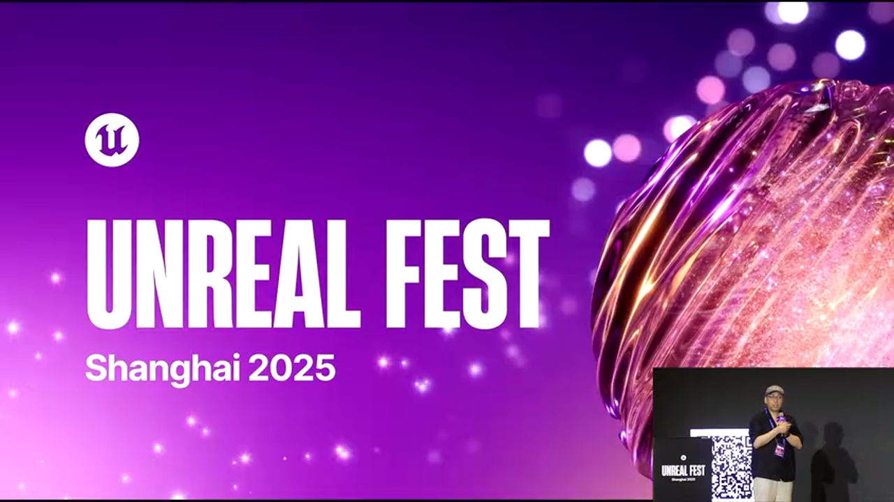

周戴教授在演讲最后提到:今天的学生很幸福,因为他们的视野非常开阔。老师的职责就是给他们创造环境,引导他们找到真正能够挖掘出自己潜力的部分。

**技术发展趋势**:

**趋势1:实时渲染质量持续提升**  
随着GPU性能的提升和渲染算法的优化,实时渲染的质量将越来越接近离线渲染。

**趋势2:AI技术的深度融合**  
AI将在资产生成、动画制作、后期处理等各个环节发挥更大作用。

**趋势3:虚实边界的进一步模糊**  
随着技术的发展,虚拟与现实的边界将越来越模糊,创作者将有更大的自由度。

**趋势4:新的影像形态**  
VR、AR、MR等新技术将催生新的影像形态,影视教育需要为此做好准备。

---

## 九、技术深度:虚幻引擎在教学中的应用

### 9.1 虚幻引擎的核心优势

虚幻引擎(Unreal Engine)成为影视教育首选的原因:

**优势1:高质量实时渲染**  
虚幻引擎的实时渲染质量已经达到了影视级别,特别是UE5的Lumen全局光照和Nanite虚拟几何体技术。

**优势2:完整的工具链**  
从建模、材质、动画到后期,虚幻引擎提供了完整的工具链,减少了软件之间的切换成本。

**优势3:强大的生态系统**  
Quixel Megascans、Marketplace等资产库,为教学提供了丰富的资源。

**优势4:免费的教育授权**  
虚幻引擎对教育机构免费,大大降低了教学成本。

### 9.2 关键技术特性

**特性1:nDisplay多机同步**  
nDisplay系统可以将多台计算机的渲染结果同步到多块LED屏幕上,实现大型VP棚的驱动。

**配置示例**:
```ini
[Cluster]
MasterNode=Node_0
Nodes=Node_0,Node_1,Node_2

[Node_0]
Window=0,0,1920,1080
Viewport=VP_Center

[Node_1]
Window=1920,0,1920,1080
Viewport=VP_Left

[Node_2]
Window=3840,0,1920,1080
Viewport=VP_Right
```

**特性2:DMX灯光控制**  
虚幻引擎支持DMX协议,可以控制现场的实体灯光,实现虚实联动。

**特性3:远程控制**  
通过Remote Control API,可以从外部设备(如iPad)实时调整场景参数,方便现场调试。

### 9.3 性能优化策略

在教学项目中,性能优化是一个重要课题:

**策略1:合理使用Lumen**  
Lumen全局光照虽然效果好,但性能开销大。对于静态场景,可以使用烘焙光照。

**策略2:材质复杂度控制**  
避免过度复杂的材质节点,特别是在大量实例化对象上。

**策略3:Draw Call优化**  
使用Instancing和Hierarchical Instanced Static Mesh减少Draw Call。

**策略4:分辨率动态调整**  
使用动态分辨率缩放,在性能不足时自动降低渲染分辨率。

**性能监控**:
```cpp
// 在蓝图中可以使用以下命令监控性能
stat fps          // 显示帧率
stat unit         // 显示各部分耗时
stat gpu          // 显示GPU性能
profilegpu        // 详细的GPU性能分析
```

---

## 十、总结:虚拟制作时代的影视教育变革

### 10.1 核心价值观的转变

虚拟制作技术带来的不仅仅是工具的更新,更是**价值观的转变**:

**从"执行"到"决策"**  
传统流程中,学生主要是执行者,按照既定流程完成任务。虚拟制作流程中,学生需要在现场做出大量决策,因为无法后期修改。

**从"分工"到"协作"**  
虚拟制作打破了传统的专业分工,要求各个环节紧密协作。学生需要理解整个流程,而不仅仅是自己的专业领域。

**从"模仿"到"创新"**  
虚拟制作提供了更大的创作自由度,鼓励学生探索新的视觉表达方式,而不是简单模仿现有作品。

### 10.2 关键能力培养

虚拟制作时代,影视从业者需要具备的核心能力:

**能力1:技术理解力**  
不需要成为程序员,但需要理解技术的原理和限制,能够与技术团队有效沟通。

**能力2:综合协调力**  
能够协调美术、灯光、摄影、技术等多个部门,确保虚实结合的效果。

**能力3:快速迭代力**  
能够在短时间内完成从创意到成片的全流程,并在过程中不断调整优化。

**能力4:美学判断力**  
在技术的辅助下,最终决定作品质量的仍然是创作者的美学判断和艺术品味。

### 10.3 教育模式的创新

北影美院的实践为影视教育提供了一个创新模式:

**模式特点**:
- **项目制教学**: 以真实项目为载体,而不是单纯的技术培训
- **双师型团队**: 教师既有教学能力,又有项目经验
- **产学研结合**: 与行业紧密合作,让学生接触最新技术
- **快速迭代**: 压缩制作周期,让学生能够快速验证想法
- **综合培养**: 打破专业壁垒,培养综合能力

### 10.4 对行业的启示

高校的虚拟制作实践,对整个影视行业也有重要启示:

**启示1:技术门槛正在降低**  
虚幻引擎等工具的普及,让更多人能够参与到高质量影像的创作中。

**启示2:创作流程正在重构**  
虚拟制作不是对传统流程的简单替代,而是一种全新的创作范式。

**启示3:人才需求正在变化**  
行业需要的不再是单一技能的专才,而是具有综合能力的复合型人才。

**启示4:美学探索空间扩大**  
新技术为影视美学提供了新的探索空间,创作者应该勇于尝试新的表达方式。

### 10.5 最后的思考

正如周戴教授所说,面对今天的学生,老师的职责是**创造环境,引导他们找到真正能够挖掘出自己潜力的部分**。

虚拟制作技术为影视教育提供了前所未有的可能性,但技术永远只是手段,**讲好故事、表达思想、触动人心**,才是影视创作的永恒主题。

在这个技术快速变革的时代,保持对新技术的开放心态,同时坚守艺术创作的核心价值,或许就是影视教育应该追求的平衡。

---

**参考资源**:
- 虚幻引擎官方文档: https://docs.unrealengine.com/
- 虚拟制作现场指南: https://www.unrealengine.com/en-US/virtual-production
- Quixel Megascans资产库: https://quixel.com/megascans
- nDisplay配置指南: https://docs.unrealengine.com/en-US/WorkingWithMedia/IntegratingMedia/nDisplay/

**致谢**:  
感谢北京电影学院美术学院周戴教授及团队分享的宝贵经验,感谢所有参与项目的学生和老师。

---

*本文基于UFSH2025演讲内容整理,旨在为影视教育和虚拟制作从业者提供参考。*


