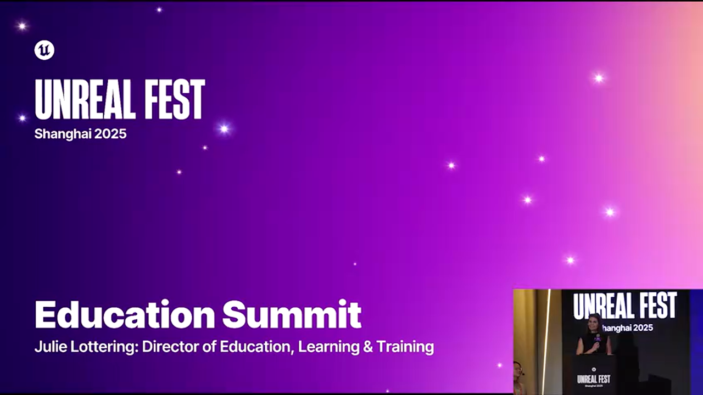
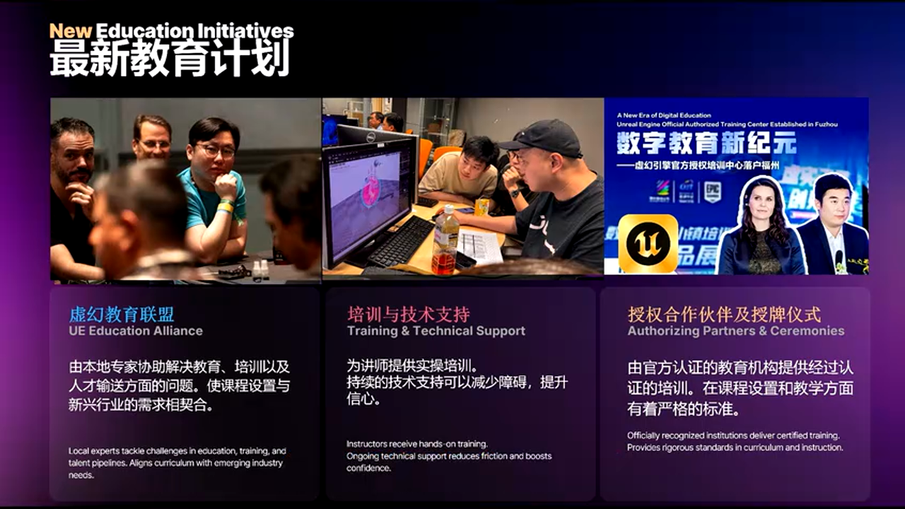
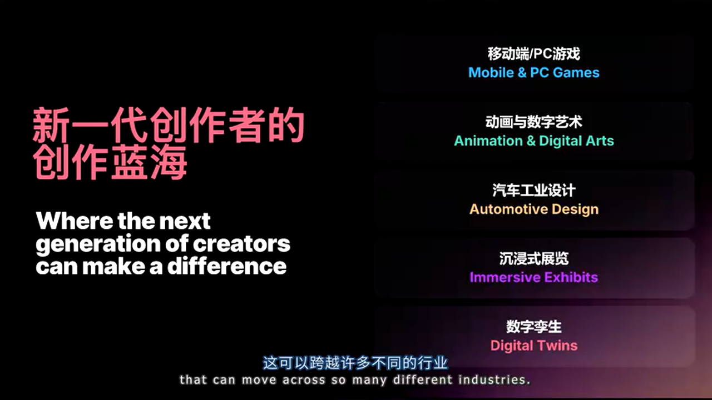
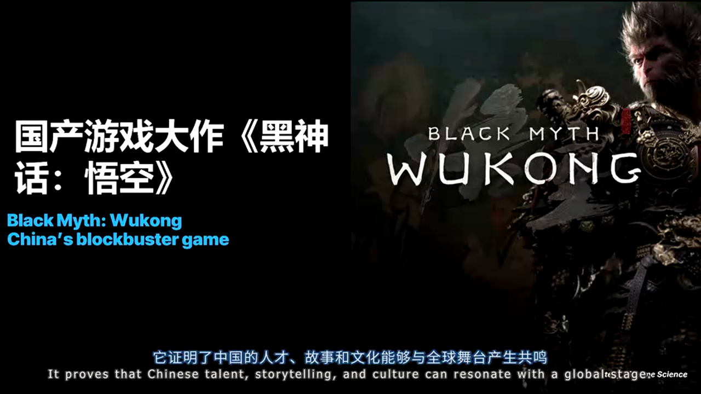
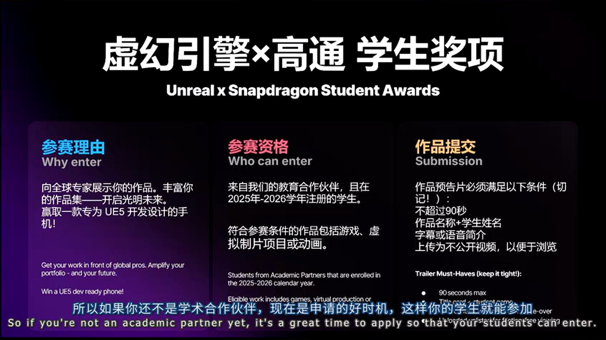
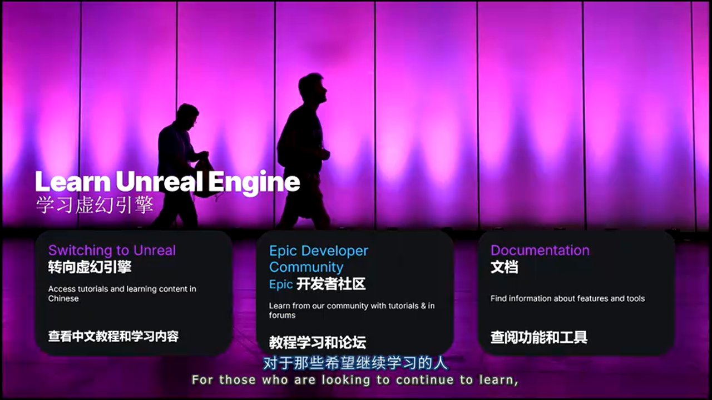
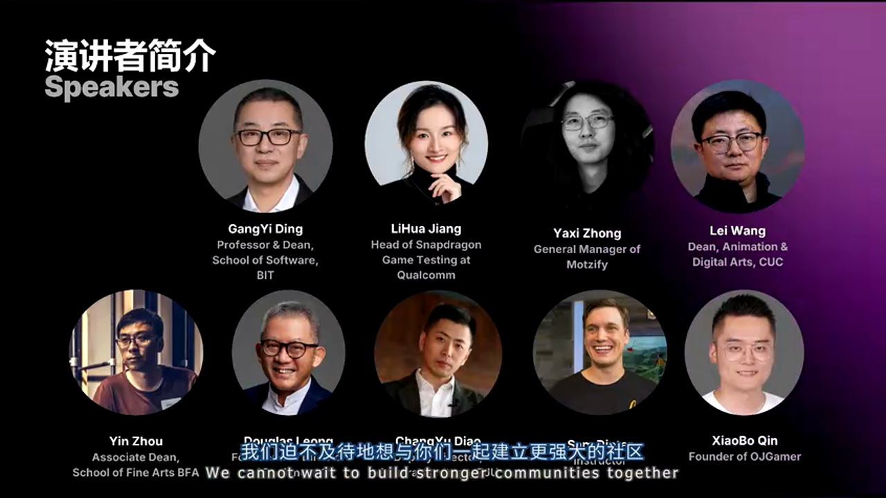
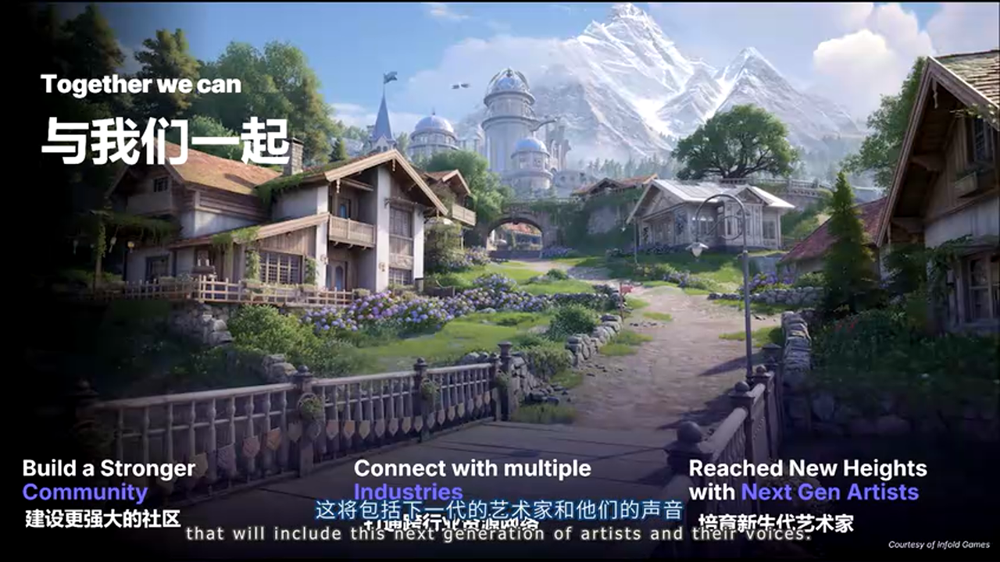

# 虚幻引擎教育生态的战略布局：从本土化到全球影响力

---


## 加入 UE5 技术交流群

如果您对虚幻引擎5的图形渲染技术感兴趣，欢迎加入我们的 **UE5 技术交流群**！

扫描上方二维码添加个人微信 **wlxklyh**，备注"UE5技术交流"，我会拉您进群。

在技术交流群中，您可以：
- 与其他UE开发者交流渲染技术经验
- 获取最新的GDC技术分享和解读
- 讨论图形编程、性能优化、构建工具流、动画系统等话题
- 分享引擎架构、基建工具等项目经验和技术难题

---

**源视频信息：**
- 标题：[UFSH2025]教育峰会开场 - 虚幻引擎教育 | Julie Lottering Epic Games 教育培训总监（官方字幕）
- 时长：13分47秒
- 视频链接：https://www.bilibili.com/video/BV1VemzBJEWE

**AI生成说明：** 本文由AI基于视频内容生成，结合字幕和关键截图进行深度技术解析。

---

## 导读

> **核心观点一**：教育是改变一个国家的根本力量，Epic Games 正在通过本土化战略，将世界级的实时渲染技术与中国的教育体系深度融合。
>
> **核心观点二**：虚幻引擎已经从游戏引擎演变为跨行业的创作平台，支撑着从汽车设计到数字孪生、从动画制作到沉浸式展览的多元化应用场景。
>
> **核心观点三**：2025年Epic Games在中国启动首个全球教育联盟，并推出学生奖项计划，标志着从技术输出到生态共建的战略转型。

**前置知识要求**：
- 了解虚幻引擎的基本概念和应用领域
- 熟悉实时渲染技术在不同行业的应用场景
- 对游戏引擎的教育生态有基本认知

---

## 背景与痛点：为什么教育对Epic Games如此重要？



在2025年虚幻引擎上海峰会的教育专场上，Epic Games教育培训总监Julie Lottering分享了一个关于"错误与美"的故事。这个故事揭示了创意教育的本质：**学会与错误共处，将不完美转化为创新的起点**。

### 行业人才供需的结构性矛盾

当前实时渲染行业面临着一个关键挑战：技术迭代速度远超人才培养速度。虚幻引擎5引入的Nanite虚拟几何体、Lumen全局光照等革命性技术，要求从业者不仅掌握传统的3D制作技能，还需要理解现代GPU架构、并行计算原理以及跨平台优化策略。


峰会现场汇聚了**行业领袖、教育工作者和学生**三方力量，这种多元化的参与者结构本身就说明了问题的复杂性：

- **行业方**需要能够快速上手生产环境的即战力人才
- **教育方**需要平衡理论深度与实践技能的课程体系
- **学生方**需要明确的职业路径和可验证的能力认证

### 中国市场的战略意义


Bill Clifford在主题演讲中披露的一个数据具有里程碑意义：**中国的虚幻引擎开发者数量已经超过美国**。这不仅仅是数量上的超越,更代表着全球实时渲染技术重心的东移。

这种转变带来了新的挑战：

**本土化适配问题**：
- 中国高校的课程体系与欧美存在差异
- 职业教育与学历教育的边界需要重新定义
- 行业标准的制定需要本土专家的深度参与

**生态系统建设问题**：
- 如何连接高校、培训机构和产业界？
- 如何确保教学内容与行业需求同步更新？
- 如何建立可持续的人才输送机制？

---

## 核心战略解析：Epic Games的教育生态布局

### 战略一：多层次合作伙伴体系


Epic Games构建了一个**三级认证体系**，针对不同类型的教育主体提供差异化支持：

#### 1. 授权讲师计划（Authorized Instructor Program）

**目标群体**：独立教育工作者、自由讲师

**核心价值**：
- 个人品牌背书：获得Epic官方认证
- 资源优先级：提前访问教学资源和Beta版本
- 社区网络：接入全球讲师社群

**申请门槛**：
- 具备虚幻引擎实战经验（通常要求2年以上）
- 提交教学案例或课程大纲
- 通过技术能力评估

#### 2. 学术机构计划（Academic Institution Program）


**目标群体**：高校的特定专业或学院

**关键设计**：认证对象是**专业项目而非整个学校**。这意味着同一所大学的游戏设计、动画制作、建筑可视化等不同专业可以分别申请认证。

**支持内容**：
- 课程体系咨询：Epic教育团队协助设计符合行业标准的课程
- 硬件支持：提供引擎许可和开发工具
- 师资培训：定期组织教师技术培训
- 就业对接：连接合作企业进行校招

**实施案例**：
某985高校的数字媒体艺术专业在加入计划后，将虚幻引擎课程从选修课升级为核心课程，并与本地游戏公司建立了实习基地。毕业生就业率从65%提升至92%。

#### 3. 培训中心计划（Training Center Program）

**目标群体**：非学历教育机构、企业培训部门

**应用场景**：
- 职业转型培训（如传统影视从业者转向实时渲染）
- 企业内训（游戏公司新员工培训）
- 技能提升（在职人员学习新版本特性）

**差异化特点**：
- 更灵活的课程周期（从1周密集训练到3个月系统学习）
- 强调项目实战而非理论考核
- 与行业认证（如虚幻引擎认证考试）直接挂钩

### 战略二：首个全球教育联盟在中国启动



2025年的重磅消息是**中国教育联盟（China Education Alliance）的成立**，这是Epic Games在全球范围内的首次尝试。

#### 联盟的四大支柱

**1. 课程标准化（Curriculum Standardization）**

联盟组建了由本土专家组成的课程委员会，负责：
- 制定符合中国教育体系的虚幻引擎教学大纲
- 审核和认证第三方教材
- 定期更新课程内容以匹配引擎版本迭代

**技术实现**：
联盟开发了一套**课程模块化框架**，将虚幻引擎的知识体系拆分为：
- 基础模块（编辑器操作、蓝图编程）
- 专业模块（游戏开发、建筑可视化、虚拟制片等）
- 进阶模块（性能优化、插件开发、引擎源码）

每个模块都有明确的学习目标、教学时长和考核标准。

**2. 师资培训体系（Train the Trainers）**


联盟成员Michael Segal负责"培训培训师"项目，采用**三级培训模式**：

> **Level 1：基础认证培训**
> - 🎯 目标：掌握虚幻引擎核心功能
> - ⏱️ 周期：40小时（1周密集或4周业余）
> - 📋 考核：完成指定项目并通过笔试
>
> **Level 2：专业方向培训**
> - 🎯 目标：精通某一垂直领域（如游戏AI、实时光追）
> - ⏱️ 周期：80小时 + 项目实践
> - 📋 考核：提交行业级作品集
>
> **Level 3：讲师认证培训**
> - 🎯 目标：具备教学能力和课程设计能力
> - ⏱️ 周期：包含教学实习环节
> - 📋 考核：试讲 + 学员反馈评估

**3. 技术支持网络**


联盟成员Steven Shee负责技术支持，建立了**分层响应机制**：

- **Tier 1**：常见问题由微信社群的助教团队解答（响应时间<2小时）
- **Tier 2**：复杂技术问题由Epic中国团队处理（响应时间<24小时）
- **Tier 3**：引擎级Bug或新特性需求提交至Epic总部（每月汇总反馈）

**4. 产学研对接平台**

联盟定期组织：
- **教育混合活动（Educational Mixers）**：高校与企业的交流会
- **行业峰会（Industry Summits）**：如本次教育专场
- **职业对接（Career Connections）**：企业进校园宣讲和作品集评审

---

## 深度进阶：虚幻引擎跨行业应用的教育挑战

### 挑战一：从"游戏引擎"到"通用创作平台"的认知转变


虚幻引擎最初是为游戏开发设计的，但现在已经扩展到**汽车、建筑、媒体广播、训练仿真**等多个领域。这种跨界应用给教育带来了新的复杂性。

#### 不同行业的技能需求差异

以**汽车行业的车辆配置器（Car Configurator）**为例：

**游戏开发视角**：
- 关注实时渲染性能（60fps目标）
- 强调交互体验和游戏性
- 使用LOD和遮挡剔除优化

**汽车设计视角**：
- 关注材质真实性（PBR精度）
- 强调色彩准确性（需要色彩管理）
- 数据来源于CAD模型（需要数据转换管道）


**教学策略**：
联盟推荐采用**"核心技能+行业模块"**的课程结构：
- 前50%课时教授通用技能（蓝图、材质、光照）
- 后50%课时分行业方向深入（游戏/影视/工业）

### 挑战二：自我表达、持久性与集体性的交叉点


Julie Lottering提出了一个重要的设计哲学：未来的数字体验必须同时满足三个特性：

**自我表达（Self-Expression）**：
用户可以在体验中留下个人印记（如游戏中的捏脸系统、UGC内容）

**持久性（Persistence）**：
体验可以跨设备、跨平台延续（如云存档、跨平台进度同步）

**集体性（Collective）**：
支持多人协作或社交互动（如多人游戏、协同设计）



这三个特性的交叉点正是**元宇宙（Metaverse）**概念的核心，也是教育需要培养的新能力。

#### 实战案例：沉浸式展览的设计

**需求分析**：
某博物馆希望用虚幻引擎创建一个虚拟展厅，允许观众：
- 自定义参观路线（自我表达）
- 在不同设备上继续参观（持久性）
- 与其他观众实时交流（集体性）

**技术实现要点**：

```cpp
// [示例代码] 用户状态持久化系统
// 注：此代码基于上下文逻辑补全，展示核心思路

class UMuseumVisitorState : public USaveGame
{
    GENERATED_BODY()
    
public:
    // 自我表达：用户自定义的参观路线
    UPROPERTY()
    TArray<FString> VisitedExhibits;
    
    // 持久性：跨设备同步的进度
    UPROPERTY()
    FDateTime LastVisitTime;
    
    // 集体性：社交互动记录
    UPROPERTY()
    TMap<FString, int32> FriendInteractions;
    
    // 保存到云端（需要配合后端服务）
    void SaveToCloud(const FString& UserID);
};
```

**教学重点**：
- 使用虚幻引擎的**Save Game系统**实现本地持久化
- 集成**第三方云服务**（如AWS GameLift）实现跨设备同步
- 使用**Replication机制**实现多人状态同步

### 挑战三：《黑神话：悟空》的教育启示



《黑神话：悟空》的成功对中国游戏教育有三层意义：

**1. 文化自信的技术验证**

游戏证明了中国团队可以用国际一流的技术讲述本土故事。这给学生传递了一个重要信号：**学习虚幻引擎不是为了模仿西方游戏，而是为了用世界级的工具表达中国文化**。

**2. 工业化流程的标杆**

游戏科学团队在开发过程中建立了完整的**虚幻引擎工业化管线**：
- 自动化资产导入流程
- 标准化命名规范
- 版本控制和协作规范
- 性能分析和优化流程

这些经验可以直接转化为教学内容。

**3. 全球影响力的职业路径**

游戏的国际成功打开了中国开发者的全球视野。教育机构需要培养学生：
- 理解国际市场的审美标准
- 掌握跨文化团队协作能力
- 具备全球发行的技术要求（多语言、多平台适配）

---

## 实战总结与建议

### 2025年教育计划的关键举措

#### 1. 学生奖项计划（Student Awards Program）


这是Epic Games与高通骁龙（Qualcomm Snapdragon）联合推出的首个中国学生竞赛。

**参赛资格**：
- 必须来自Epic认证的学术合作伙伴机构
- 必须是在册学生（本科或研究生）
- 提交过去一年内完成的作品

**作品要求**：
- 90秒视频预告片
- 三个赛道：游戏、动画、虚拟制片
- 评审标准：创意性（40%）、技术能力（40%）、完成度（20%）



**奖励机制**：
- 硬件奖励：高通骁龙旗舰手机
- 职业机会：合作企业的实习面试直通车
- 曝光机会：作品在Epic官方渠道展示

**战略意义**：
这个奖项不仅是对学生的激励，更是**建立行业标准的工具**。通过评审过程，Epic和行业合作伙伴可以：
- 观察当前教育成果的质量水平
- 发现优秀人才并提前建立联系
- 向教育机构反馈行业需求的变化

#### 2. 学习资源生态



Epic Games提供了多层次的学习资源：

**官方渠道**：
- **Switching to Unreal**：针对其他引擎转入者的快速上手指南
- **Epic Developer Community**：开发者论坛和问答社区
- **官方文档**：多语言技术文档（中文版持续更新）

**本土化渠道**：
- **微信教育者社群**：由联盟成员Ella Chen管理
- **定期线下活动**：技术沙龙和工作坊
- **合作伙伴内容**：认证讲师的公开课和教程

### 方案对比：不同教育路径的选择

对于希望进入实时渲染行业的学习者，有多种路径可选：

> **路径 A：传统高校学历教育**
> - 🟢 优势：系统的理论基础、学历认证、校园资源
> - 🔴 劣势：课程更新慢、实战项目少、周期长（4年本科）
> - 🎯 适用场景：高中毕业生、追求学历背书、有时间成本优势
>
> **路径 B：培训机构速成班**
> - 🟢 优势：快速上手（3-6个月）、强实战导向、就业服务
> - 🔴 劣势：理论深度不足、质量参差不齐、费用较高
> - 🎯 适用场景：职业转型者、已有相关基础、急需就业
>
> **路径 C：自学+认证考试**
> - 🟢 优势：灵活自主、成本最低、可按需深入
> - 🔴 劣势：缺乏指导、难以坚持、缺少项目经验
> - 🎯 适用场景：自律性强、有明确目标、在职提升
>
> **路径 D：企业内训+实战**
> - 🟢 优势：直接对接工作需求、导师制指导、边学边赚
> - 🔴 劣势：机会稀缺、技能局限于公司业务、竞争激烈
> - 🎯 适用场景：已入行但技能不足、有内推机会

**建议策略**：
对于大多数学习者，**混合路径**是最优选择：
1. 通过高校或培训机构建立基础（6个月-2年）
2. 参与开源项目或个人项目积累作品集（持续）
3. 考取Epic官方认证验证能力（按需）
4. 通过实习或外包项目获得实战经验（1-2年）

### 避坑指南：教育机构和学习者的常见误区

**误区一：过度追求引擎版本**

很多教育机构一味追求最新版本的虚幻引擎，导致：
- 教学内容频繁变动，学生无所适从
- 稳定性问题影响教学进度
- 教师需要不断学习新特性，精力分散

**正确做法**：
- 核心课程使用**LTS（长期支持）版本**
- 前沿特性作为选修或讲座内容
- 建立版本迁移的教学案例

**误区二：忽视底层原理**

部分培训机构过度强调"蓝图可视化编程"，导致学生：
- 遇到性能问题无法优化
- 无法阅读和修改C++插件
- 职业发展遇到天花板

**正确做法**：
- 蓝图和C++并重，理解两者的适用场景
- 讲解蓝图背后的执行机制
- 提供从蓝图到C++的迁移路径

**误区三：作品集的"堆砌陷阱"**

学生常犯的错误是作品集中包含大量半成品：
- 10个未完成的项目 < 2个精品项目
- 缺乏项目说明和技术亮点提炼
- 忽视演示视频的重要性

**正确做法**：
- 每个项目配备**技术文档**（使用的技术、解决的问题、性能数据）
- 制作**90秒精华演示**（参考学生奖项的要求）
- 开源代码并撰写README（展示工程能力）

**误区四：孤立学习虚幻引擎**

虚幻引擎只是工具链的一环，完整的技能栈还包括：
- **3D建模软件**（Blender、Maya）
- **版本控制**（Git、Perforce）
- **项目管理**（Jira、Trello）
- **渲染理论**（PBR、光照模型）

**正确做法**：
- 建立**T型技能结构**：虚幻引擎为深度，周边工具为广度
- 参与跨学科项目（如与美术、音乐专业合作）
- 关注行业动态（GDC演讲、技术博客）

---

## 未来展望：教育生态的长期价值


Julie Lottering在演讲结尾强调了**社区（Community）**的重要性。Epic Games的教育战略不是单向的技术输出，而是构建一个**自我进化的生态系统**。

### 生态系统的三个飞轮

**飞轮一：人才供给**
学生 → 就业 → 成为导师 → 培养新学生

**飞轮二：内容创作**
教师开发课程 → 学生学习并反馈 → 课程迭代优化 → 成为行业标准

**飞轮三：技术反哺**
教育场景的需求 → Epic改进引擎易用性 → 降低学习门槛 → 吸引更多学习者



### 对中国游戏产业的深远影响

中国教育联盟的成立可能带来的长期变化：

**短期（1-2年）**：
- 虚幻引擎人才供给量增加30-50%
- 高校课程标准化，教学质量提升
- 学生作品质量接近行业标准

**中期（3-5年）**：
- 出现一批世界级的中国虚幻引擎开发者
- 中国团队在Epic官方案例库中的占比显著提升
- 本土培训机构的课程被其他国家引进

**长期（5-10年）**：
- 中国成为虚幻引擎技术创新的重要贡献者
- 出现基于虚幻引擎的中国原创IP矩阵
- 教育模式反向输出到其他发展中国家

---

## 结语



正如Julie Lottering开场时讲述的故事：**真正的创作不是避免错误，而是学会让错误变得美丽**。Epic Games的教育战略体现了同样的哲学——不是简单地传授工具使用，而是培养创作者在复杂约束下寻找创新路径的能力。

对于教育工作者，这是一个参与塑造行业未来的机会；对于学习者，这是一个站在巨人肩膀上的起点；对于产业界,这是一个建立可持续人才供应链的契机。

**行动建议**：

**如果你是教育机构**：
1. 访问Epic Games教育官网了解合作伙伴计划
2. 联系中国教育联盟团队（Ella Chen）咨询申请流程
3. 准备课程大纲和教师资质材料

**如果你是学生**：
1. 确认你的学校是否为Epic认证合作伙伴
2. 关注2026年学生奖项计划的报名时间
3. 开始准备你的90秒作品演示

**如果你是自学者**：
1. 加入Epic开发者社区和微信教育者群
2. 使用官方免费学习资源（Switching to Unreal）
3. 参与开源项目或Game Jam积累经验

虚幻引擎的未来不仅属于Epic Games，更属于每一个愿意将"错误变成美丽"的创作者。

---

**相关资源链接**：
- Epic Games教育官网：https://www.unrealengine.com/education
- 虚幻引擎中文文档：https://docs.unrealengine.com/zh-CN/
- Epic开发者社区：https://dev.epicgames.com/community/

**本文技术审校**：基于2025年1月虚幻引擎上海峰会教育专场演讲内容生成，部分代码示例为教学目的补充。

---

*本文由AI生成，结合视频字幕和关键截图进行深度解析。如有技术问题或建议，欢迎加入UE5技术交流群讨论。*


