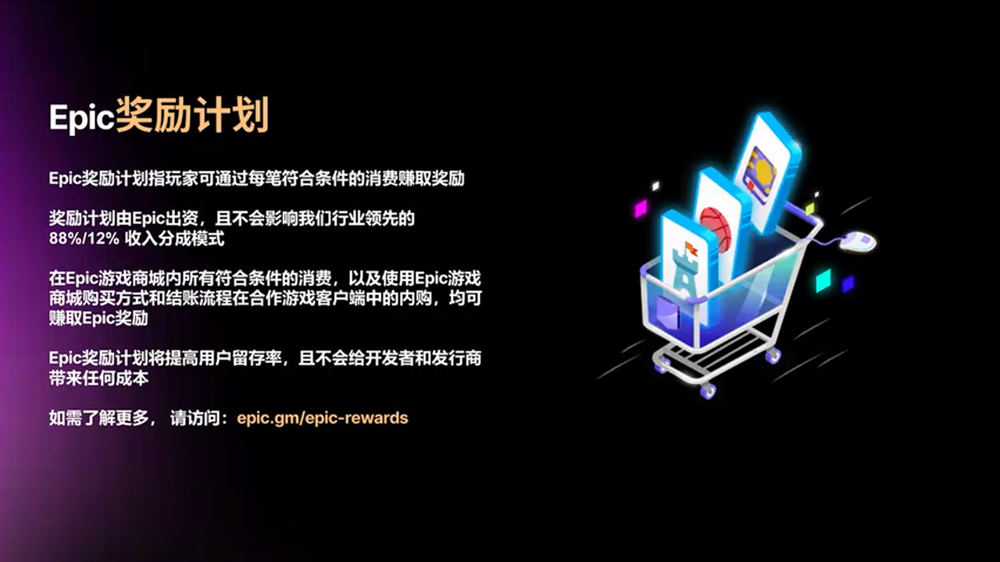
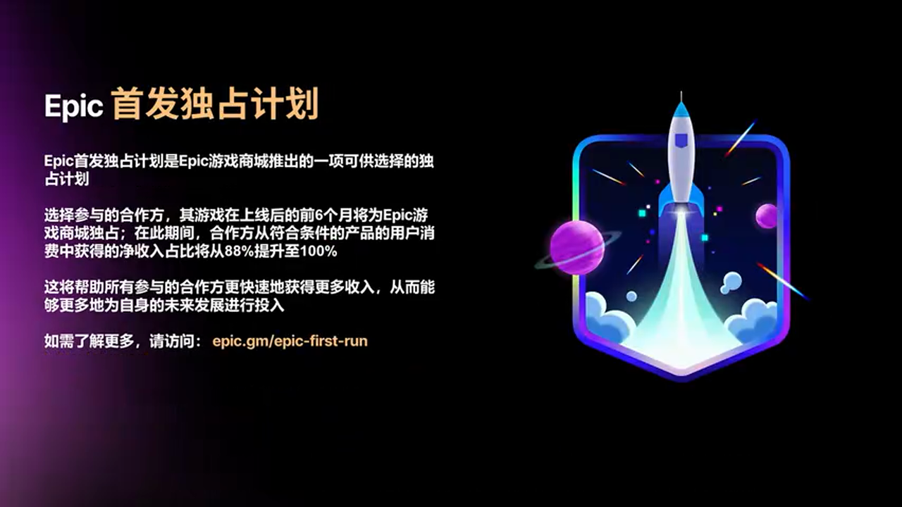
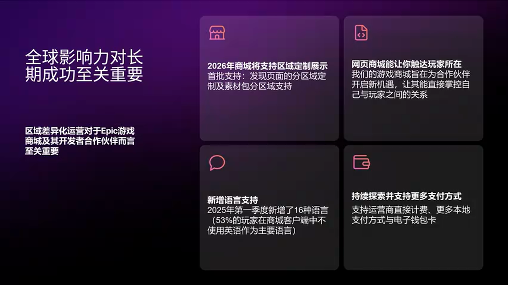
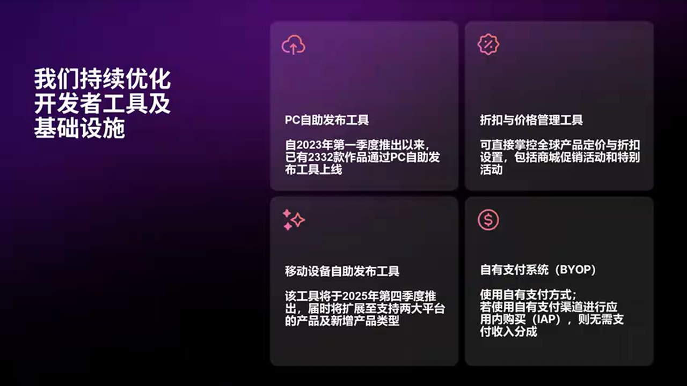
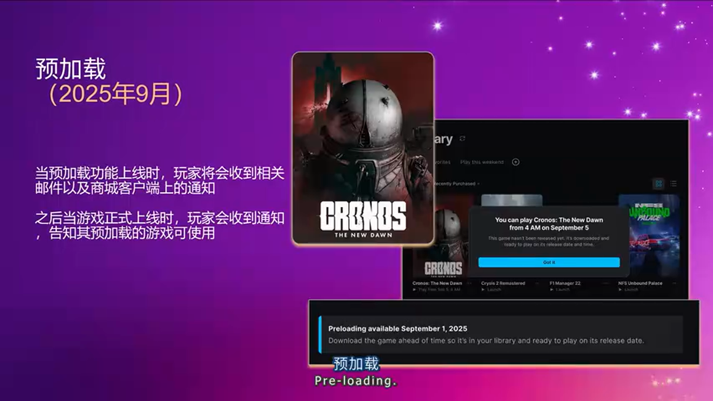
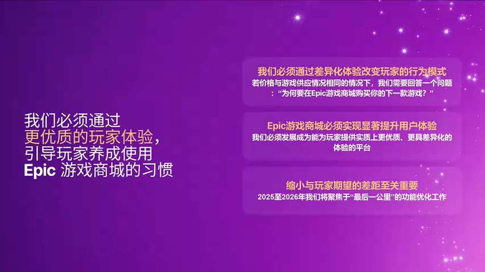
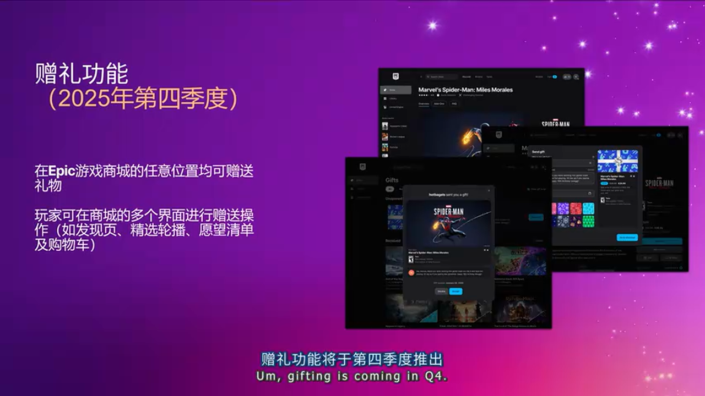
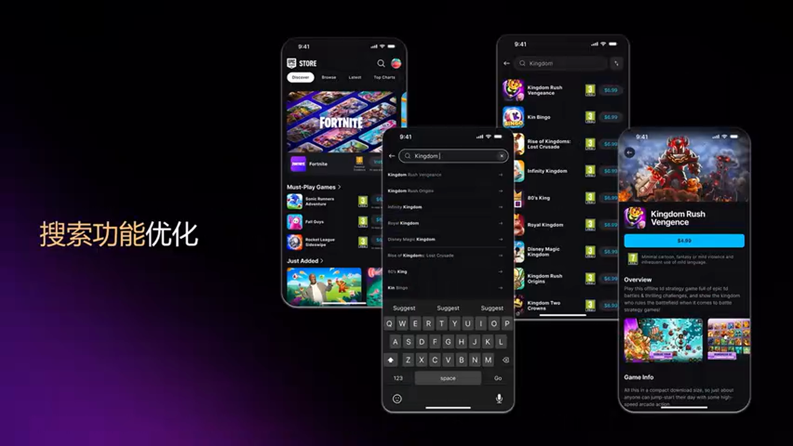
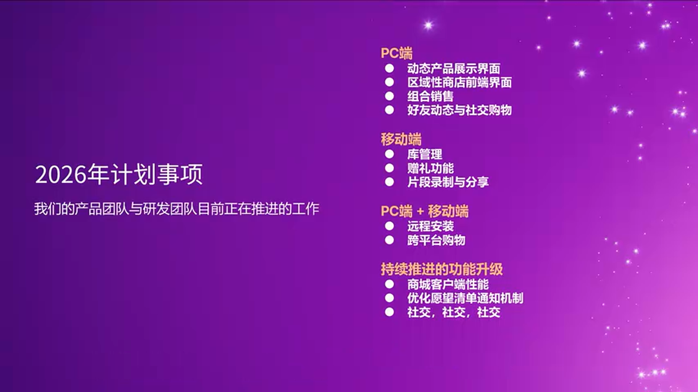

# Epic Games Store 2025：开发者优先战略的全面进化

---

## 加入 UE5 技术交流群
如果您对虚幻引擎5的图形渲染技术感兴趣，欢迎加入我们的 **UE5 技术交流群**！

扫描上方二维码添加个人微信 **wlxklyh**，备注"UE5技术交流"，我会拉您进群。

在技术交流群中，您可以：
- 与其他UE开发者交流渲染技术经验
- 获取最新的GDC技术分享和解读
- 讨论图形编程、性能优化、构建工具流、动画系统等话题
- 分享引擎架构、基建工具等项目经验和技术难题
---

**源视频信息**：[UFSH2025]Epic游戏商店: 2025年度商店与产品更新 | Kyle Billings Epic Games 投资组合策略与业务运营总监  
**视频链接**：https://www.bilibili.com/video/BV1i2sNzXEPe  
**时长**：26分27秒  
**说明**：本文由AI基于视频内容生成，结合字幕与关键截图进行深度技术解析

---

> **导读核心观点**
> 
> - Epic Games Store 正在从"Fortnite启动器"转型为真正的第三方生态系统，67%的玩家活跃于第三方内容
> - 通过 12% 分成（首个百万收入 0 分成）、Epic First Run（前6个月100%净收入）等政策，重新定义行业收入分享标准
> - 2025-2026 路线图聚焦玩家体验：社交购物、跨平台库管理、动态商品推荐等功能将彻底改变数字游戏分发生态

**前置知识**：了解数字游戏分发平台运营模式、PC/移动游戏市场格局、平台分成机制

---

## 一、背景与痛点：游戏分发行业的结构性困境

### 1.1 行业现状的三大矛盾

在 2025 年的游戏行业中，开发者面临着三个核心挑战：

**开发成本持续攀升**：现代游戏开发的复杂度呈指数级增长，从引擎技术到内容制作，每个环节都需要更高的投入。Kyle Billings 在演讲中直言："Making games is expensive, it's not going to get cheaper"（制作游戏成本高昂，而且不会变便宜）。

**内容发现永恒难题**：Kyle 分享了一个行业洞察："我们一直在谈论内容发现是个挑战，每次我们解决了发现问题，所有人都涌向那个解决方案，然后我们又有了新的发现问题。"这揭示了一个残酷的事实——**内容发现不是一个可以"一劳永逸"解决的问题，而是需要持续演进的系统性挑战**。


_开发成本与内容发现的双重挑战_

**传统平台分成模式的不合理性**：30% 的平台分成已成为行业"默认标准"，但 Kyle 提出了一个尖锐的问题："如果有个缺席的房东拿走你应得收入的 30%，他们并没有把你放在首位，他们没有为你着想。"

### 1.2 Epic 的战略定位

面对这些痛点，Epic Games Store 提出了清晰的价值主张：

> **成为最以玩家为先、对开发者最友好、文化上最具共鸣的数字游戏商店**

这不是空洞的口号，而是通过具体的技术架构和商业模式来实现：

- **多平台统一**：PC、Mac、Android、iOS 四端一体（One Store for Platforms）
- **游戏专注**：不会出现银行应用等无关内容，保持游戏生态纯粹性
- **社交驱动**：2025-2026 的核心方向，游戏本质上正在变得更加社交化
- **全球化布局**：覆盖 190 个国家，支持 32 种语言，集成 64 种支付方式


_Epic Games Store 的战略定位_

---

## 二、第三方生态系统：从"Fortnite 启动器"到独立平台

### 2.1 生态健康度的关键指标

Kyle 分享了一个重要的认知转变数据：

> **67% 的玩家活跃于第三方内容，而非 Fortnite**

这个数字打破了外界对 Epic Games Store 的刻板印象。更深层的数据揭示了生态系统的真实活力：

- **Epic Rewards 积累**：2600 万玩家持有共计 4900 万美元的未使用消费能力
- **跨游戏消费行为**：玩家正在将 Epic Rewards 用于第三方游戏，形成正向循环
- **目录规模**：4000+ 游戏，代表 2000+ 商店合作伙伴


_第三方生态系统的核心数据_

### 2.2 与 Steam 的差异化策略

Kyle 提出了一个有趣的对比：

> "Steam 有 10 万款游戏，但你根本找不到任何东西"

这不是简单的竞争对手攻击，而是揭示了两种不同的平台哲学：

**方案 A：Steam 的海量目录模式**
- 🟢 优势：覆盖长尾内容，满足小众需求
- 🔴 劣势：信噪比极低，发现成本高昂，新游戏淹没在海量内容中
- 🎯 适用场景：已有明确目标的玩家搜索特定游戏

**方案 B：Epic 的精选目录模式**
- 🟢 优势：更高的内容质量密度，更有效的推荐算法，新游戏获得更多曝光
- 🔴 劣势：可能错过长尾内容，对小型独立游戏的准入门槛更高
- 🎯 适用场景：探索式发现，玩家不确定想玩什么时的浏览体验

### 2.3 玩家生命周期管理

Kyle 描绘了一个典型的玩家成长路径：

> "对许多 PC 玩家来说，Epic Games Store 是他们进入 PC 游戏生命周期的前门——他们发现 Fortnite、Fall Guys 或 Rocket League，这是他们玩的第一款游戏，然后他们开始成熟并进入其他游戏，这就是他们开始玩你们制作的游戏的方式。"

这揭示了 Epic 的**漏斗式获客策略**：

1. **吸引层**：通过 Fortnite 等第一方大作吸引新玩家（免费游戏降低门槛）
2. **培育层**：玩家在生态系统中积累 Epic Rewards、建立好友关系
3. **转化层**：成熟玩家开始探索第三方付费游戏


_玩家生命周期的演进路径_

### 2.4 生态健康度的增长数据

2024 年的关键指标验证了这一策略的有效性：

- **游戏时长增长**：第三方游戏的总游戏时长同比增长 11%
- **活跃用户增长**：第三方游戏的峰值和平均日活用户同比增长
- **新用户获取**：每月新增约 280 万用户，其中 64% 来自第三方游戏

最后一个数据尤为关键——**超过一半的新用户是通过第三方游戏进入生态系统的**，而非 Fortnite。这标志着 Epic Games Store 已经实现了从"Fortnite 附属品"到"独立平台"的质变。


_第三方游戏驱动的生态增长_

---

## 三、开发者优先：重新定义平台分成模型

### 3.1 收入分成的演进历史

Epic 在 2018 年推出 Epic Games Store 时，就以 **12% 的平台分成**挑战了行业的 30% 标准。Kyle 回顾了这一决策的底层逻辑：

> "我们是第一个站出来说的——看，你可以大规模运营一个平台，可以处理支付处理、CDN、玩家支持以及所有资本支出和运营成本，同时只收取 12%。"

这不仅是商业策略，更是对行业成本结构的透明化挑战。Microsoft 随后在 PC 平台上跟进了这一分成比例，验证了 Epic 模型的可行性。


_行业领先的 12% 分成模式_

### 3.2 首个百万零分成计划

2024 年，Epic 进一步激进化其开发者政策：

> **每个产品每年的前 100 万美元收入，Epic 不收取任何分成**

这一政策的设计哲学是：

```
收入分层模型：
├─ 0 - 100万美元：0% 分成
└─ 100万美元以上：12% 分成
```

**设计意图分析**：

1. **降低创业风险**：对于独立工作室和小团队，前 100 万美元往往是生死线，零分成意味着更高的生存率
2. **鼓励再投资**：Kyle 明确指出："这应该允许你们投资回你们的工作室、你们的项目、你们的游戏，确保你们投资于公司的健康，而不是我们的健康。"
3. **规模化激励**：只有在产品成功后才开始分成，形成"共同成长"的伙伴关系


_首个百万零分成的政策细节_

### 3.3 Epic Rewards：20% 返现机制

Epic Rewards 是一个独特的玩家激励系统，其运作机制为：

**基础规则**：
- 使用 Epic 支付渠道的玩家获得 5% 返现（基础比例）
- 2024 年，Epic 将第一方游戏的返现提升至 20%
- 作为副产品，所有第三方游戏也自动享受 20% 返现（至 2024 年底）

**经济学分析**：

这实际上是一个**三方共赢的飞轮模型**：

1. **玩家视角**：每次消费获得 20% 的"平台货币"，降低下次购买的心理门槛
2. **开发者视角**：玩家手中的 Epic Rewards 成为"待激活的购买力"，提高转化率
3. **平台视角**：锁定玩家在生态系统内的消费，提高用户粘性

Kyle 特别强调："我们发现这在第三方目录中极其强大，因为玩家在投资游戏，我们实时看到这个飞轮在运转。"


_Epic Rewards 的 20% 返现机制_

### 3.4 Launch Everywhere 与虚幻引擎协同

对于使用虚幻引擎的开发者，Epic 提供了额外的激励：

> **如果在 Epic Games Store 和 Steam 同步发布，虚幻引擎的授权费从 5% 降至 3.5%**

这是一个巧妙的**生态系统绑定策略**：

- **不强制独占**：开发者可以同时在多个平台发布，保持分发自由度
- **经济激励**：通过降低引擎授权费（而非提高平台分成）来激励同步发布
- **风险分散**：开发者不会因为选择 Epic 而失去 Steam 的市场份额

**成本对比示例**（假设游戏收入 500 万美元）：

```
方案 A：仅 Steam 发布（使用 UE）
├─ Steam 分成（30%）：150 万美元
├─ UE 授权费（5%）：25 万美元
└─ 开发者净收入：325 万美元

方案 B：Steam + Epic 同步发布（使用 UE）
├─ Steam 分成（30% of 250万）：75 万美元
├─ Epic 分成（12% of 250万）：30 万美元
├─ UE 授权费（3.5%）：17.5 万美元
└─ 开发者净收入：377.5 万美元（+16%）
```


_Launch Everywhere 计划的协同效应_

### 3.5 Epic First Run：100% 净收入的独占协议

对于愿意提供短期独占的开发者，Epic 提供了最激进的政策：

> **前 6 个月 100% 净收入归开发者所有**

Kyle 的建议是："尽可能榨取前 6 个月的价值，投资于 UA（用户获取）和其他方面。"

**适用场景分析**：

- 🟢 **适合**：新 IP、需要初期资金回笼的独立工作室、计划大规模 UA 投放的项目
- 🔴 **不适合**：已有强大社区基础的续作、依赖 Steam 社区功能的多人游戏

**局限性**：独占期结束后，游戏在其他平台的"新鲜度"会降低，可能影响后续销售。开发者需要权衡短期现金流和长期市场覆盖。


_Epic First Run 的 100% 净收入政策_

---

## 四、全球化基础设施：支撑开发者的技术底座

### 4.1 本地化的深度覆盖

Epic 在 2024 年新增了 16 种语言支持，总计达到 32 种语言。Kyle 分享了一个关键数据：

> "超过一半的玩家不使用英语作为启动器语言"

这揭示了一个常被忽视的事实——**全球游戏市场的重心正在向非英语地区转移**。

**语言覆盖策略**：

- **95% 覆盖率**：32 种语言覆盖了约 95% 的 PC 游戏受众
- **长尾取舍**：剩余语言仅占"基点级别"的玩家，投入产出比不合理
- **开发者福利**：Epic 免费为开发者的商店页面提供本地化服务


_32 种语言的全球化覆盖_

### 4.2 支付方式的多样性

64 种支付方式的支持不仅仅是技术集成，更是对不同地区支付习惯的深度理解：

- **中国**：支付宝、微信支付
- **东南亚**：GrabPay、GCash
- **拉丁美洲**：Boleto、OXXO
- **中东**：本地银行转账

**为什么支付方式如此重要？**

在许多新兴市场，信用卡渗透率极低。如果平台不支持本地支付方式，就等于放弃了这些市场的绝大部分用户。

### 4.3 区域化商店前端（2025 新功能）

Kyle 预告了一个即将推出的重要功能：

> "明年我们将推出区域化商店前端，你可以根据玩家所在地区使用不同的资产包——商店前端本身会根据你是在中国大陆、韩国还是西欧而呈现不同的样子。"

**技术实现推测**：

```
区域化商店架构（推测）：
├─ CDN 边缘节点：根据 IP 地理位置分发不同资产
├─ 本地化资产包：
│   ├─ 视觉风格（色彩、排版）
│   ├─ 推荐算法权重（不同地区的游戏偏好）
│   └─ 合规性内容过滤
└─ A/B 测试框架：持续优化各地区转化率
```

这种区域化不仅仅是语言翻译，而是**文化适配**——理解不同地区玩家的审美偏好、游戏类型偏好、社交习惯。


_区域化商店前端的战略意义_

### 4.4 自带支付渠道（BYOP）

Epic 允许开发者使用自己的支付渠道，且不收取任何分成。这在行业中是极为罕见的开放政策。

**BYOP 的应用场景**：

1. **大型发行商**：已有成熟的支付基础设施，希望保持对用户数据的完全控制
2. **跨平台游戏**：希望统一所有平台的支付体验和用户账户系统
3. **特殊合规需求**：某些地区的监管要求游戏公司直接处理支付

Kyle 强调："我们最大的一些游戏选择了这样做……解锁开发者自由，允许合作伙伴决定如何维护与玩家的关系。"

---

## 五、开发者工具链：从 CLI 到现代化 UI

### 5.1 自助发布系统的演进

**PC 自助发布**（2023 Q1 上线）：
- 已有 2500 款游戏通过该系统发布
- Epic 正在将所有开发者迁移到自助发布工具
- 设计哲学："让你们拥有和控制项目的整个工作流，我们只是退到后台"

**移动自助发布**（2024 Q4 推出）：
- 复用 PC 工具链，扩展支持 iOS 和 Android
- 统一的发布流程，降低多平台发布的学习成本


_自助发布系统的全平台覆盖_

### 5.2 Build Patch Tool UI：告别命令行时代

Kyle 特别提到了一个开发者社区长期抱怨的痛点：

> "过去五年，你只能通过命令行与 BPT（Build Patch Tool）交互，这一直是个令人沮丧的问题。"

**Build Patch Tool 1.8 的重大更新**：

- **图形化界面**：不再需要记忆复杂的 CLI 参数
- **可视化构建管理**：直观查看构建历史、版本差异
- **错误诊断**：更友好的错误提示和日志查看

这看似是个小功能，但对于独立开发者和小团队来说，**降低工具使用门槛就是降低发布成本**。


_Build Patch Tool 的 UI 界面_

### 5.3 预加载系统：减少玩家流失窗口

**当前功能**（已上线）：
- 支持基础游戏的预加载
- 玩家可以在发售前下载游戏，发售时立即解锁

**即将推出的补丁预加载**：

> "如果你运营一款在线游戏，有一个 6GB 的补丁，这会造成一段时间玩家无法玩游戏——现在他们可以预加载补丁，补丁保持加密状态，当你准备好向玩家发布时，就可以发布了。"

**技术实现推测**：

```
补丁预加载流程：
1. 开发者上传加密补丁包到 CDN
2. 玩家客户端在后台下载（低优先级，不影响当前游戏）
3. 补丁存储在本地，保持加密状态
4. 开发者触发"补丁激活"开关
5. 客户端解密并应用补丁（秒级完成）
```

**对在线游戏的意义**：

- **减少维护窗口**：传统模式下，补丁发布意味着数小时的停机时间
- **提高玩家留存**：减少"等待补丁下载"导致的玩家流失
- **灵活的发布时间**：可以选择全球同步发布，而不受各地区网络速度限制


_补丁预加载的技术架构_

### 5.4 折扣价格管理工具（DPMT）

DPMT（Discount Price Management Tool）的核心价值在于**合规性自动化**：

- **全球定价规则**：自动处理不同地区的定价策略
- **法规遵从**：内置欧盟、中国等地区的价格监管规则
- **防止违规**：避免开发者因不了解某个地区的法规而受到处罚

**实际案例**：欧盟要求折扣价格必须基于过去 30 天的最低价，违反者可能面临巨额罚款。DPMT 会自动检查并阻止违规的折扣设置。


_DPMT 工具的合规性保障_

---

## 六、玩家体验革命：2025-2026 路线图深度解析

### 6.1 战略转折点：从开发者工具到玩家功能

Kyle 坦诚地指出了 Epic Games Store 当前的核心矛盾：

> "每年我们调查约 25000 名玩家，问他们：如果一款游戏在 Steam 和 Epic Games Store 上价格和可用性完全相同,你会在哪里购买？……当我们与开发者交流时，他们说'哦，我们喜欢你们的工具，喜欢你们的项目'，但当我们与玩家交流时，他们说'哦，我们需要一些功能'。"

这段话揭示了一个关键洞察：**平台的长期成功必须建立在玩家体验的基础上**。


_玩家调研揭示的体验差距_

### 6.2 玩家参与度的三层漏斗模型

Kyle 分享了一个经典的游戏设计理论在平台运营中的应用：

> **目录和玩家功能驱动玩家 → 玩家驱动游戏时长 → 参与度驱动消费**

这个模型的关键洞察是：**不能跳过中间环节直接优化消费**。

```
错误的优化路径：
目录 → [跳过] → 消费优化 ❌ 导致生态崩溃

正确的优化路径：
目录 → 玩家功能 → 游戏时长 → 参与度 → 消费 ✅ 可持续增长
```

Kyle 警告："如果你试图优化消费而不是优化参与度，一切都会崩溃。"


_玩家参与度的三层漏斗模型_

### 6.3 下载管理器：从草图到产品

Kyle 分享了一个有趣的产品开发故事：

> "去年我站在舞台上说'下载管理器两周后推出'，然后两周变成了六个月，但下载管理器现在上线了。它是我最喜欢的功能之一，最初只是我在餐巾纸上画的草图，交给我们的一位 UX 设计师。"

**下载管理器的核心功能**：

- **队列管理**：自定义下载优先级
- **调度下载**：设置在特定时间段下载（避开高峰期）
- **更新控制**：选择性禁用某些游戏的自动更新

**为什么这个功能如此重要？**

对于拥有大型游戏库的玩家（尤其是在线游戏玩家），无法控制更新队列会导致：
- 带宽被意外占用，影响当前游戏体验
- 存储空间被不需要的更新占用
- 无法优先下载想要立即玩的游戏

Kyle 自己就是重度用户："我的 PC 上有大约 27 个不同的 Fortnite 构建版本，我经常需要关闭所有更新，所以这个功能自私地拯救了我的生活。"


_下载管理器的界面设计_

### 6.4 礼物系统：社交织物的关键节点

礼物功能将在 2024 Q4 推出，Kyle 用一个个人故事解释了它的重要性：

> "我永远不会去买《盗贼之海》，但有人把它送给了我，我最终和他一起玩了数百小时。礼物是真正将社交织物联系在一起的东西之一。"

**礼物系统的社交经济学**：

1. **降低社交摩擦**：想和朋友一起玩游戏，但朋友不愿意购买 → 礼物解决了这个问题
2. **病毒式传播**：每一个礼物都是一次游戏推荐，且比广告更有说服力
3. **情感价值**：礼物不仅是商品，更是社交关系的表达

**技术细节**：

- 支持"精美包装纸"（视觉呈现的仪式感）
- 可能支持附带消息（推测）
- 礼物接收者可以选择退款或换成商店积分（推测，避免不喜欢的礼物造成尴尬）


_礼物系统的社交价值_

### 6.5 Web Shop：绕过平台税的合规方案

Web Shop 是 Epic 对抗移动平台"苹果税"和"谷歌税"的创新解决方案：

**运作机制**：

1. 玩家在移动应用中获取自己的玩家 ID
2. 访问 Epic 的 Web Shop 网站
3. 粘贴玩家 ID，完成购买
4. 购买内容自动同步到游戏账户

**与其他 Web Shop 方案的对比**：

> **方案 A：第三方支付网关（Xsolla、Coda、Stash）**
> - 🟢 优势：技术成熟，支持多种支付方式
> - 🔴 劣势：没有内置用户基础，玩家可能不信任陌生网站
> - 🎯 适用场景：已有强大品牌的大型游戏
>
> **方案 B：Epic Web Shop**
> - 🟢 优势：7500 万月活用户的信任基础，可使用 Epic Rewards
> - 🔴 劣势：依赖 Epic 生态系统，需要玩家有 Epic 账户
> - 🎯 适用场景：希望触达 Epic 用户群的移动游戏

Kyle 强调："他们（第三方网关）没有 7500 万人的内置受众……玩家可能不会真正信任他们购买的东西，但对我们来说，他们知道，因为他们已经在我们的生态系统中玩游戏。"


_Web Shop 的生态系统优势_

---

## 七、移动端战略：走向真正的 1.0 版本

### 7.1 当前状态：0.5 版本的定位

Epic 将移动商店的首次发布命名为"0.5 版本"，这是一个诚实且战略性的命名：

- **承认不完整**：避免过度承诺，管理用户期望
- **快速迭代**：以 MVP（最小可行产品）方式进入市场，快速收集反馈
- **明确路线图**：1.0 版本的定义清晰，给用户明确的改进预期

### 7.2 1.0 版本的四大支柱

**支柱 1：社交功能**

- 跨平台文字聊天（异步）
- 语音聊天
- 推送通知（PC 和移动端同步）
- 组队功能

**支柱 2：跨平台商店切换**

> "你在移动设备上看到一款 PC 游戏，你想说'我想买那款游戏并立即下载到我的 PC 上'……或者你在 PC 上看到一款移动游戏，想推送到你的手机上，这样当你离开家时它就在那里了。"

这是一个**设备无关的游戏库管理**愿景——你的游戏库不再绑定到特定设备，而是跟随你的账户。


_跨平台商店切换的使用场景_

**支柱 3：Web Shop 集成**

- 移动端内购（In-App Purchase）
- 移动端外购（通过 Web Shop，绕过平台分成）
- 消耗品购买的完整支持

**支柱 4：搜索和浏览改进**

Kyle 透露："我们正在全面改革搜索，你会看到搜索改进同时在 PC 和移动端推出。"

**搜索改进的可能方向**（基于行业最佳实践推测）：

- **语义搜索**：理解"类似《黑暗之魂》的游戏"这类自然语言查询
- **多模态搜索**：支持通过截图搜索游戏
- **个性化排序**：根据玩家历史偏好调整搜索结果权重
- **实时建议**：输入时的智能补全和纠错


_搜索功能的全面改革_

### 7.3 移动端独特功能

**认证器（Authenticator）**：

- 在移动应用中内置两步验证
- 通过 QR 码快速登录 PC 端（类似微信扫码登录）

**Fortnite 礼品卡的生态扩展**：

> "Fortnite 礼品卡的酷之处在于，你在 Epic Games Store 启动器中兑换它，然后你实际上不必用它购买 Fortnite 的东西，你可以用它购买生态系统中的任何东西。"

这是一个巧妙的**品牌借力策略**——利用 Fortnite 的品牌影响力推广整个 Epic 生态系统。


_Fortnite 礼品卡的生态扩展_

---

## 八、2026 前瞻：下一代商店体验

### 8.1 动态商品推荐

Kyle 提出了一个简单但深刻的原则：

> "不要向我展示我已经拥有的东西"

**当前问题**：传统商店前端对所有用户展示相同的推荐内容，导致：
- 已购买游戏占据宝贵的首屏位置
- 推荐内容与用户兴趣不匹配
- 商品展示位的浪费

**动态商品推荐的技术实现**（推测）：

```
推荐算法架构：
├─ 用户画像层
│   ├─ 已拥有游戏库
│   ├─ 游戏时长分布
│   ├─ 游戏类型偏好
│   └─ 购买价格敏感度
├─ 内容过滤层
│   ├─ 排除已拥有内容
│   ├─ 排除已浏览但未购买的内容（一定时间后）
│   └─ 优先展示新发布/即将发布的内容
└─ 个性化排序层
    ├─ 协同过滤（相似用户喜欢的游戏）
    ├─ 内容相似度（与已玩游戏相似的新游戏）
    └─ 商业目标平衡（开发者付费推广 vs 用户体验）
```


_动态商品推荐的战略意义_

### 8.2 区域化商店前端

在全球化基础设施部分已有提及，这里补充其在 2026 路线图中的实施计划：

- **2024 年 11 月**：Fortnite 内容的区域化测试
- **2025 年**：逐步向所有合作伙伴开放
- **核心能力**：不同地区的玩家看到完全不同的商店首页

### 8.3 智能捆绑包（Smart Bundling）

**使用场景示例**：

假设一个系列游戏有 7 部作品，玩家已拥有第 1-5 部：

- **传统捆绑包**：只能购买完整的 1-7 部合集，或单独购买第 6、7 部
- **智能捆绑包**：系统自动生成"完成你的收藏"捆绑包，仅包含第 6、7 部，并给予折扣

**技术挑战**：

- **定价算法**：如何计算"公平"的折扣比例？
- **开发者控制**：开发者需要能够设置捆绑规则和折扣上限
- **边缘情况处理**：如果玩家拥有第 1、3、5 部（非连续），如何生成捆绑包？


_智能捆绑包的动态生成_

### 8.4 社交购物（Social Shopping）

Kyle 对这个功能的热情溢于言表：

> "购物是我三年来一直在强调的事情之一，我非常高兴看到它终于成为现实……你想和你的朋友在一起，你想成为这个环境生态系统的一部分。"

**社交购物的核心机制**（推测）：

1. **好友游戏库可见性**：看到好友拥有和正在玩的游戏
2. **协同购买**：多人一起购买游戏时获得额外折扣
3. **游戏推荐社交化**："5 个好友推荐了这款游戏"
4. **愿望单社交功能**：好友生日时，系统提示其愿望单中的游戏

**社交购物的心理学基础**：

- **社会认同**：人们倾向于购买朋友也在玩的游戏
- **FOMO（错失恐惧）**：看到朋友在玩某款游戏会产生"我也想玩"的冲动
- **礼物经济**：游戏礼物是维系社交关系的重要方式


_社交购物的生态系统效应_

### 8.5 剪辑捕获与分享

这是一个跨 PC 和移动端的功能：

- **自动捕获**：游戏中的精彩时刻自动录制（类似 NVIDIA ShadowPlay）
- **手动捕获**：玩家主动触发录制
- **社交分享**：直接分享到 Epic 好友或外部社交平台

**技术实现挑战**：

- **性能开销**：后台录制不能影响游戏性能
- **存储管理**：自动捕获会产生大量视频文件，需要智能清理策略
- **隐私保护**：确保玩家聊天内容不会被意外录制和分享

### 8.6 远程安装与多平台购物

**远程安装的使用场景**：

- 在办公室用手机浏览 Epic 商店，看到一款游戏
- 点击"安装到我的 PC"
- 回家后，游戏已经下载完成，可以立即开始玩

**技术架构**（推测）：

```
远程安装流程：
1. 移动端发送安装指令到 Epic 云端
2. 云端推送通知到目标设备（PC）
3. PC 端 Epic 启动器接收指令
4. 后台下载游戏（可设置带宽限制）
5. 完成后推送通知到移动端
```

这实际上是**云游戏基础设施的前置步骤**——如果 Epic 能够实现设备间的无缝游戏管理,下一步自然是云游戏。


_远程安装的跨设备体验_

---

## 九、行业变革的哲学思考

### 9.1 改变行业需要集体行动

Kyle 在演讲的最后部分变得"有点辛辣"（his words）：

> "如果我们一直以同样的方式做同样的事情，这个行业永远不会改变……如果我们一直以同样的方式发布游戏，什么都不会改变，行业规范将永远是行业规范。"

这是对整个游戏行业的呼吁——**不要因为"一直都是这样"就接受不合理的现状**。

### 9.2 从独立工作室到 3A 大厂的共同利益

Kyle 强调了一个关键洞察：

> "要真正实现游戏分发的民主化，让我们的行业对这些陈旧的收入分成模式进行全面改革，我们必须一起合作……这是从我在 G-Fusion 遇到的小型独立工作室到我花时间拜访的大型 3A 工作室，每个人都能找到成功的唯一方式。"

这打破了一个常见的误解——平台分成的降低只对小工作室有利。实际上：

- **小工作室**：更高的收入比例意味着更高的生存率
- **大工作室**：即使是 1% 的分成差异，在数千万美元的收入规模上也是巨额资金

### 9.3 持续的法律斗争

Kyle 坦诚地提到：

> "我们不断地与某人进行某种形式的法律斗争，试图让每个人的情况变得更好。"

这指的是 Epic 与苹果、谷歌的反垄断诉讼。这些法律斗争不仅是商业竞争,更是**为整个行业争取更公平的规则**。

### 9.4 开发者的责任

最后，Kyle 将责任也放到了开发者身上：

> "但你们也有责任确保你们参与的是那些把你们放在首位的生态系统。"

这是一个微妙但重要的观点——**开发者的选择会塑造行业的未来**。如果所有开发者都因为"Steam 用户基数大"而接受 30% 分成，那么这个标准就永远不会改变。


_行业变革需要集体行动_

---

## 十、实战总结与建议

### 10.1 不同规模开发者的策略选择

**独立工作室/小团队**：

> **推荐策略：Epic First Run + Launch Everywhere**
> - 🟢 优势：前 6 个月 100% 净收入,快速回笼资金；独占期结束后扩展到 Steam
> - 🔴 风险：错过 Steam 的首发窗口期，可能影响长期销售
> - 🎯 适用场景：资金压力大、需要初期收入支持后续开发的项目

**中型工作室**：

> **推荐策略：多平台同步发布 + BYOP（如适用）**
> - 🟢 优势：最大化市场覆盖，利用 Launch Everywhere 降低 UE 授权费
> - 🔴 风险：需要同时管理多个平台的运营和社区
> - 🎯 适用场景：已有一定品牌认知度的续作或新 IP

**大型发行商**：

> **推荐策略：自定义合作模式 + BYOP**
> - 🟢 优势：完全控制用户数据和支付流程，利用 Epic 的全球化基础设施
> - 🔴 风险：需要投入资源开发和维护支付系统
> - 🎯 适用场景：跨平台大作、在线游戏

### 10.2 避坑指南

**坑 1：过度依赖 Epic Rewards 驱动销售**

- **问题**：Epic Rewards 的 20% 返现政策可能不会永久持续（目前确认到 2024 年底）
- **建议**：将其视为额外福利而非核心销售策略

**坑 2：忽视 Steam 社区功能**

- **问题**：Epic Games Store 的社区功能仍在建设中，某些依赖 Steam 工坊、社区讨论的游戏可能体验受损
- **建议**：评估游戏对社区功能的依赖程度，必要时采用多平台策略

**坑 3：低估本地化的重要性**

- **问题**：虽然 Epic 提供商店页面本地化，但游戏内容的本地化仍需开发者负责
- **建议**：利用 Epic 的 32 语言覆盖优势，优先本地化高潜力市场

**坑 4：不了解区域定价法规**

- **问题**：不同地区的定价和折扣法规差异巨大，违规可能导致罚款
- **建议**：充分利用 DPMT 工具的合规性检查功能

### 10.3 最佳实践

**实践 1：利用预加载系统优化在线游戏体验**

- 对于有大型季度更新的游戏，提前 1-2 周开放补丁预加载
- 在玩家活跃度低谷期（如工作日白天）推送预加载

**实践 2：结合 Epic Rewards 设计促销活动**

- 在 Epic Rewards 返现期间推出游戏内货币促销
- 设计"Epic Rewards 专属"内容，鼓励玩家使用返现

**实践 3：跨平台数据互通**

- 如果游戏同时在 PC 和移动端发布，确保账户数据互通
- 利用 Epic 的跨平台基础设施,降低开发成本

**实践 4：参与 Epic 的区域化测试**

- 当区域化商店前端推出时，积极提供本地化资产
- 与 Epic 合作测试不同地区的转化率

---

## 结语：工作才刚刚开始

Kyle 在演讲结尾用一句话总结了 Epic 的长期愿景：

> "工作才刚刚开始"

这不是客套话，而是对行业变革长期性的清醒认识。从 2018 年 Epic Games Store 推出至今，行业的 30% 分成标准仍然是主流，但裂缝已经出现：

- Microsoft 在 PC 端跟进了 12% 分成
- Apple 在某些情况下降低了分成比例（虽然是被迫的）
- 更多开发者开始质疑传统平台的价值

**Epic Games Store 的 2025-2026 路线图不仅是一个产品计划，更是一个行业实验**——证明一个对开发者更友好、对玩家体验更重视的平台能否在商业上成功。

对于开发者而言，这是一个选择的时代——你可以继续接受"一直以来的方式"，也可以参与到这场行业变革中。正如 Kyle 所说：

> "我们必须一起做这件事"

---

**参考资料**：
- Epic Games Store 官方开发者文档
- Build Patch Tool 技术文档
- Epic Online Services (EOS) SDK

**延伸阅读**：
- 《数字游戏分发平台的经济学分析》
- 《平台分成模式对独立游戏生态的影响研究》
- Epic vs. Apple 反垄断案判决文书

---

*本文基于 2025 年 Unreal Fest Shanghai 的演讲内容整理，部分技术实现细节为基于行业最佳实践的推测，实际实现可能有所不同。*


