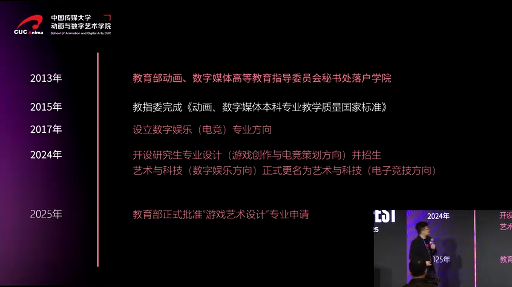
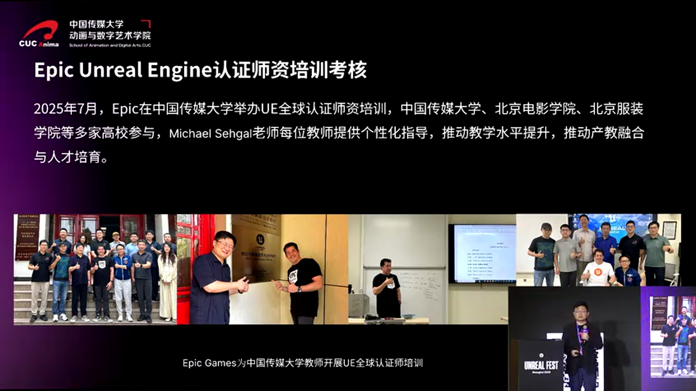
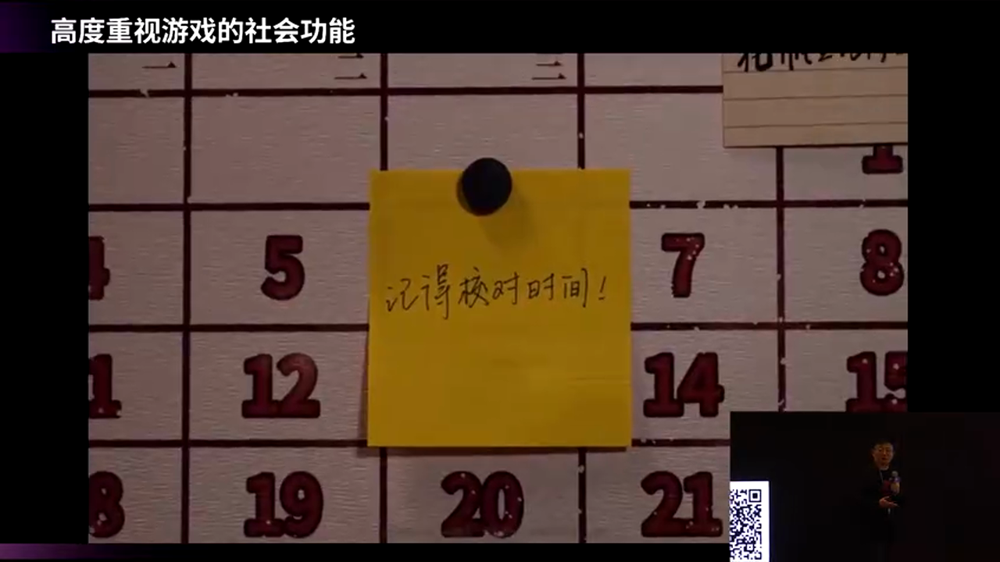
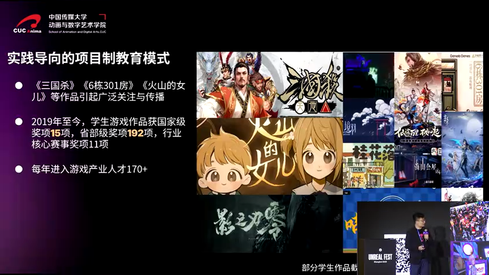
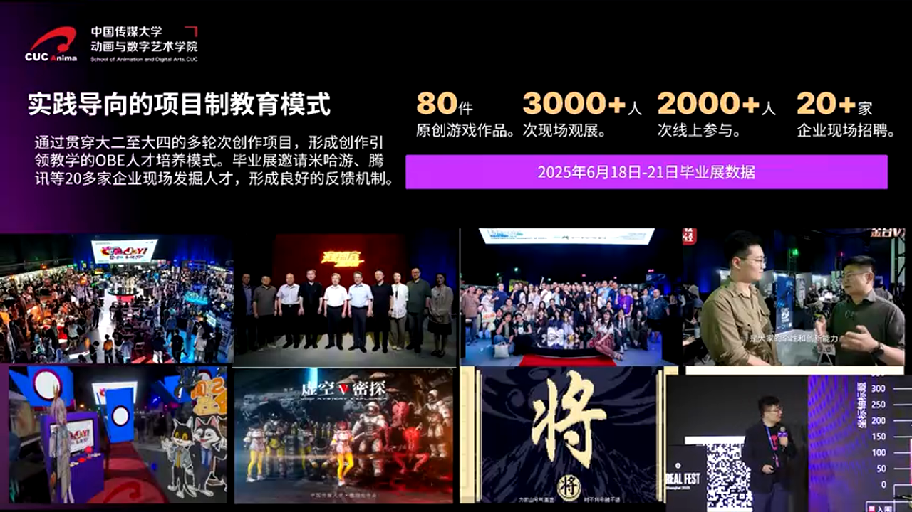
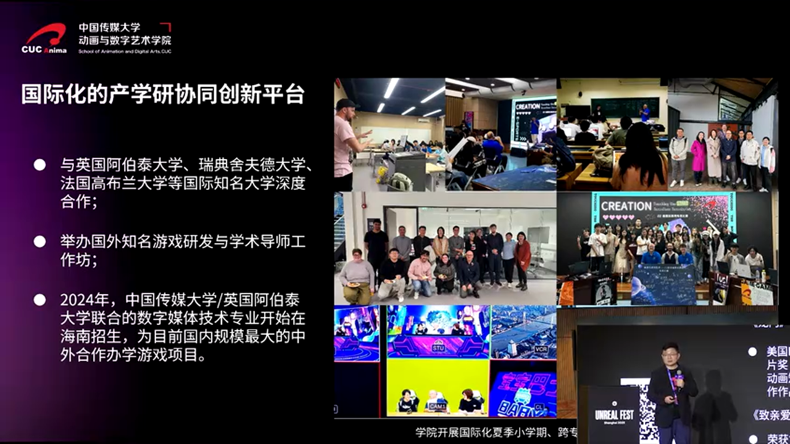

# 中国游戏教育二十年：从边缘到主流的破冰之路

---


## 加入 UE5 技术交流群

如果您对虚幻引擎5的图形渲染技术感兴趣，欢迎加入我们的 **UE5 技术交流群**！

扫描上方二维码添加个人微信 **wlxklyh**，备注"UE5技术交流"，我会拉您进群。

在技术交流群中，您可以：
- 与其他UE开发者交流渲染技术经验
- 获取最新的GDC技术分享和解读
- 讨论图形编程、性能优化、构建工具流、动画系统等话题
- 分享引擎架构、基建工具等项目经验和技术难题

---

**源视频信息：** [UFSH2025]游戏教育二十年——中国首个游戏本科专业的诞生 | 王雷 中国传媒大学动画与数字艺术学院院长、教授

**视频链接：** https://www.bilibili.com/video/BV1aqmzB7EpG

**说明：** 本文由AI根据视频内容生成，结合字幕与关键截图进行深度解析。

---

## 导读

> **核心观点一：** 中国游戏教育历经21年探索，从2004年首个"游戏艺术"专业方向到2025年正式设立"游戏艺术设计"本科专业，见证了社会对游戏从质疑到认可的巨大转变。
>
> **核心观点二：** 跨学科融合是游戏教育的核心竞争力——艺术、技术、人文三位一体的培养模式，让学生具备完整的游戏开发能力和跨媒介迁移能力。
>
> **核心观点三：** 虚幻引擎等技术平台正在成为游戏、动画、影视等多领域内容生产的统一基础设施，掌握这类工具是未来创作者的必备技能。

**前置知识要求：** 了解中国高等教育专业设置体系、游戏产业基础知识。

---

## 背景：游戏教育的"原罪"时代

在讨论中国游戏教育的发展之前，我们需要理解一个特殊的历史背景：在21世纪初的中国，"游戏"这个词几乎等同于"电子海洛因"。当时的社会舆论、教育界对游戏持强烈的负面态度，认为游戏是导致青少年沉迷、影响学业的罪魁祸首。

在这样的环境下，2004年中国传媒大学动画与数字艺术学院开设"游戏艺术"专业方向，可以说是一次大胆的尝试。


_中国传媒大学在2004年开始招收游戏艺术专业方向的学生_

### 痛点分析

**社会认知困境：** 即使在以传媒教育著称的中国传媒大学内部，游戏教育也面临巨大的质疑。王雷院长回忆道，当时做新闻传播、电视的老师听说学院在教游戏，反应是"这样的东西也可以在大学里面教吗？"这种质疑不仅来自外部，更来自高校内部的同行。

**专业身份缺失：** 在很长一段时间里，中国的游戏教育没有独立的专业代码，只能依附于"数字媒体艺术"或"动画"等专业下作为一个方向存在。这意味着：
- 无法独立招生
- 课程体系不完整
- 师资力量难以配置
- 学生毕业证书上没有"游戏"相关字样

**产业需求与教育供给脱节：** 中国游戏产业在2000年代快速发展，但高校培养的人才与产业需求存在巨大鸿沟。企业需要的是能够直接上手开发的工程师和设计师,而传统教育体系培养的学生往往理论有余、实践不足。

---

## 破冰之旅：从方向到专业的21年

### 第一阶段：试探性起步（2004-2008）

2004年，中国传媒大学在"数字媒体艺术"和"动画"专业下设立"游戏艺术"方向，开始招收本科生。当时学院的老师们"心里面是忐忑的"——这个新方向能否被学生和社会接受？能否培养出合格的人才？

但第一届学生给了学院一个巨大的惊喜。


_2004级游戏艺术专业学生在2008年毕业时创作了《三国杀》_

2008年，04级的两位同学将毕业创作命名为《三国杀》——这款桌游在很长一段时间里成为中国桌游的代表作品，至今仍有大量玩家。这个成功案例极大地鼓舞了学院继续探索游戏教育的信心。

### 第二阶段：短暂的独立与挫折（2011-2013）


_2011年教育部批准设立"数字游戏设计"特设专业_

带着《三国杀》的成功经验，学院在2011年向教育部申请设立独立的游戏专业。教育部批准了一个"特设专业"——**数字游戏设计**，这是中国第一个正式的游戏本科专业。

然而，这个专业只存在了短短两年就停止了独立招生。


_数字游戏设计专业在2013年停止独立招生_

**为什么会失败？** 王雷院长坦率地指出，2011-2012年的中国社会和教育领域对游戏专业的理解"和今天非常不一样"。当时的社会舆论环境、教育政策导向都不支持游戏教育的独立发展。在这样的背景下，一个新设的游戏专业很难获得足够的资源和支持。

### 第三阶段：韬光养晦与多元发展（2013-2024）

虽然独立专业被叫停，但游戏教育并没有中止。学院采取了更灵活的策略：



_游戏教育以专业方向形式持续发展_

**策略调整：**
- 将游戏教育从一个方向分化为**艺术**和**技术**两个方向
- 2017年在"艺术与科技"专业下招收**数字娱乐（电子竞技）**方向学生
- 2022年开始招收**游戏创作与电竞策划**方向研究生
- 持续申请独立专业设置

这种"曲线救国"的策略让游戏教育在没有独立专业身份的情况下，依然保持了完整的培养体系和持续的招生规模。

### 第四阶段：正名与爆发（2025-）


_2025年教育部批准设立"游戏艺术设计"本科专业_

2025年，在连续三年申请后，教育部终于批准中国传媒大学设立**游戏艺术设计**本科专业。这标志着中国游戏教育进入了一个全新的阶段。

**历史性突破的标志：**

> **数据一：** 2025年全国有13所大学向教育部申请设立游戏艺术设计专业，包括中国美术学院、广州美术学院等顶尖艺术院校。
>
> **数据二：** 在教育部2025年新设专业排行榜前20名中，游戏艺术设计是**唯一的艺术类专业**。
>
> **数据三：** 在艺术专业整体收缩的大背景下（很多大学不再设立新的艺术专业），游戏专业逆势增长，显示出强大的生命力。

这些数据说明，游戏教育已经从边缘走向主流，从被质疑到被认可。

---

## 核心原理：艺术、技术、人文三位一体

中国传媒大学游戏教育的核心经验是：**将艺术、技术和人文放在同一个框架内考虑**。


_艺术、技术、人文三位一体的培养模式_

### 三个专业方向的协同

**游戏美术方向：**
- 专注于角色设计、场景设计、UI/UX设计
- 培养学生的艺术审美和视觉表达能力
- 使用Photoshop、Blender、Substance等工具

**游戏技术方向：**
- 专注于游戏引擎开发、图形编程、网络同步
- 培养学生的编程能力和系统架构思维
- 使用C++、虚幻引擎、Unity等技术栈

**策划与电竞方向：**
- 专注于游戏设计、关卡设计、数值平衡
- 培养学生的系统设计能力和人文思考
- 研究游戏心理学、叙事理论、电竞产业

### 跨学科协作的实战模式


_不同方向的学生可以相互协作完成完整的游戏作品_

这种三方向并行的设置，让学生在校期间就能组建完整的开发团队：
- 美术学生负责视觉呈现
- 技术学生负责引擎实现
- 策划学生负责玩法设计

**实战案例：** 学院每年举办游戏展，2025年有80多个可玩的游戏作品参展，20多家企业到现场招聘。这些作品都是学生跨专业协作的成果。


_学院每年举办游戏展，展示学生作品_

### 完整的学术梯队


_本科、硕士、博士完整的学术梯队_

学院目前拥有：
- **本科层次：** 游戏艺术设计、数字媒体艺术（游戏方向）、艺术与科技（电竞方向）
- **硕士层次：** 游戏创作与电竞策划方向
- **博士层次：** 数字艺术理论与游戏研究

这种完整的学术梯队让有志于深造的学生可以持续在游戏领域深耕，培养高层次的研究型人才。

---

## 深度进阶：技术平台的战略意义

### 虚幻引擎：跨媒介内容生产的基础设施


_虚幻引擎正在成为各个方向学生的核心技术平台_

王雷院长特别强调了虚幻引擎在游戏教育中的战略地位。为什么虚幻引擎如此重要？

**技术层面的原因：**

> **原因一：实时渲染能力** 
> - 虚幻引擎的Nanite、Lumen等技术让实时渲染达到影视级别
> - 学生可以在引擎内直接看到最终效果，大幅提升迭代效率
> - 相比传统的离线渲染流程（如Maya+Arnold），实时渲染节省了大量时间成本

> **原因二：跨平台部署**
> - 一套代码可以部署到PC、主机、移动端、VR/AR设备
> - 学生不需要为不同平台重复开发，降低了学习成本
> - 符合产业界"一次开发，多端发布"的趋势

> **原因三：完整的工具链**
> - 从建模（Modeling Tools）到动画（Control Rig）到特效（Niagara）到音频（MetaSounds）
> - 学生可以在一个统一的环境中完成所有工作
> - 减少了工具切换的摩擦成本

**产业层面的原因：**

传媒产业正在经历快速的变革：
- 电视的风头被流媒体盖过
- 流媒体的风头被短视频盖过
- 短视频的风头被微短剧盖过


_传媒产业的快速变革让领域之间的界限不再重要_

在这种快速变化的环境下，**领域之间的界限不再重要**。不管你是做电视的、做电影的、做游戏的、做动画的，最终都是一个**故事的讲述者**，都是通过作品与观众做情感沟通。

虚幻引擎是**几乎唯一的能够跨媒介生产内容的技术平台**：
- 游戏开发者用它做游戏
- 影视制作者用它做虚拟制片（Virtual Production）
- 动画工作室用它做实时动画
- 建筑设计师用它做可视化
- 汽车厂商用它做数字孪生

这种跨媒介的能力让学生具备了**在不同领域之间迁移的能力**，这是未来创作者的核心竞争力。

### Epic Games学术合作的深层价值



_2025年Epic Games在中传组织了首次虚幻引擎认证讲师考试_

2025年，中国传媒大学与Epic Games建立了学术合作伙伴关系。这不仅仅是一个商业合作，更是一个战略性的教育布局。

**合作的具体成果：**
- 2025年7月，Epic在中传组织了**中国首次虚幻引擎认证讲师考试**
- 中传有7位老师获得认证，占学院全体教师的近10%
- 学生可以接触到最新的引擎版本和官方教学资源
- Epic的工程师定期到学院做技术分享

**认证讲师的意义：**

虚幻引擎认证讲师（Unreal Authorized Instructor）不是一个简单的证书，而是代表了：
- **技术深度：** 需要掌握引擎的核心系统（渲染、动画、物理、网络等）
- **教学能力：** 需要能够将复杂的技术概念转化为易懂的教学内容
- **产业连接：** 可以直接获得Epic的技术支持和产业资源

拥有7位认证讲师，意味着中传的游戏教育已经达到了国际一流水平。

---

## 实战总结：游戏教育的三个关键要素

### 要素一：技术能力 vs 人文关怀

游戏教育不能只教技术，更要教**用技术表达什么**。


_学生作品《6-3-1房》：用游戏表达对阿尔茨海默症患者的关怀_

**案例：《6-3-1房》**

这是一个学生的毕业作品，技术和艺术上并不复杂，但它是一个**很特别的作品**：
- 学生的奶奶患了阿尔茨海默症
- 学生从奶奶的体验出发，做了一个让大家了解阿尔茨海默症老人感受的独立游戏
- 游戏在国内外获得多个奖项
- 在Steam上获得"好评如潮"的评价



_《6-3-1房》在Steam上获得好评如潮_

这个案例说明：**游戏不仅仅是娱乐，不仅仅是商业模式，它可以成为个人表达的手段，可以成为传达情感的重要载体和媒介。**

正是这样的作品，让社会和教育界看到了游戏的正面价值，推动了游戏教育从边缘走向主流。

### 要素二：产学研结合 vs 闭门造车

游戏教育不能脱离产业，必须与企业保持紧密合作。

**中传的产学研模式：**
- **企业招聘进校园：** 每年游戏展有20多家企业到现场招聘
- **企业导师制：** 邀请腾讯、网易、米哈游等公司的资深开发者担任兼职导师
- **实习基地：** 与多家游戏公司建立实习合作关系
- **技术平台合作：** 与Epic Games、Unity等引擎厂商建立学术合作



_Epic的朱利老师等业界人士参加学院毕业展_

这种产学研结合的模式确保了：
- 学生学到的技术是产业界正在使用的
- 学生的作品可以得到业界的直接反馈
- 学生毕业后可以快速融入产业

### 要素三：国际视野 vs 本土实践

游戏是一个全球化的产业，游戏教育必须具备国际视野。


_学院与多所国际知名大学建立合作关系_

**国际合作网络：**
- 瑞典舍夫德大学（University of Skövde）：欧洲顶尖的游戏教育机构
- 英国安格利亚鲁斯金大学（Anglia Ruskin University）：游戏设计专业排名英国前列
- 法国高布兰学院（Gobelins）：世界顶级的动画与游戏学院

**国际化的具体措施：**
- 学生交换项目：每年选派学生到海外合作院校学习
- 联合培养项目：与海外院校联合培养硕士、博士
- 国际竞赛：鼓励学生参加IGF、GDC等国际比赛



_学院作品在国际上获得大量奖项_

但国际化不等于全盘西化。中传的游戏教育始终强调**本土文化的表达**：
- 《三国杀》是基于中国历史的桌游
- 许多学生作品取材于中国传统文化
- 强调用游戏讲述中国故事

---

## 避坑指南：游戏教育的常见误区

### 误区一：游戏教育 = 教人玩游戏

**真相：** 游戏教育是教人**做游戏**，而不是玩游戏。这需要：
- 编程能力（C++、C#、蓝图）
- 美术能力（建模、贴图、动画）
- 设计能力（系统设计、关卡设计、叙事设计）
- 项目管理能力（团队协作、版本管理、进度控制）

### 误区二：学游戏就是为了进大厂

**真相：** 游戏教育培养的是**创作者**，而不仅仅是打工人。学生毕业后的选择包括：
- 进入大厂（腾讯、网易、米哈游等）
- 加入独立游戏工作室
- 自己创业做独立游戏
- 转向影视、动画、虚拟制片等相关领域
- 继续深造做游戏研究

### 误区三：游戏专业只需要技术

**真相：** 游戏是**艺术、技术、人文的综合体**。一个优秀的游戏开发者需要：
- **技术能力：** 能够实现想法
- **艺术素养：** 能够创造美的体验
- **人文关怀：** 能够理解玩家的情感需求
- **商业意识：** 能够理解市场和用户

### 误区四：游戏教育是新兴领域，没有积累

**真相：** 中国的游戏教育已经有21年的历史，形成了完整的培养体系：
- 700多名在校学生
- 34位专任教师 + 80多位兼职教师
- 本硕博完整的学术梯队
- 大量的国际获奖作品
- 成熟的产学研合作模式


_中传游戏教育拥有700多名在校生和完整的师资队伍_

---

## 最佳实践：给未来游戏创作者的建议

### 建议一：尽早确定专业方向，但保持跨界能力

游戏开发有很多细分方向（程序、美术、策划、音频等），建议：
- **大一大二：** 广泛尝试，了解各个方向的基础知识
- **大三：** 确定主攻方向，深入学习专业技能
- **大四：** 完成完整的毕业作品，展示综合能力

但即使专精一个方向，也要保持跨界能力：
- 程序员要懂一些美术和设计
- 美术要懂一些技术和设计
- 策划要懂一些技术和美术

### 建议二：掌握主流引擎，但不要被工具束缚

虚幻引擎和Unity是当前的主流选择，建议：
- **至少精通一个引擎：** 深入理解其架构和核心系统
- **了解另一个引擎：** 知道它们的优劣势和适用场景
- **不要被工具束缚：** 引擎只是工具，重要的是设计思维和问题解决能力

**配置建议：**
```
学习虚幻引擎的推荐配置：
- CPU: Intel i7/AMD Ryzen 7 或更高
- GPU: NVIDIA RTX 3060 或更高（支持光追）
- RAM: 32GB 或更高
- SSD: 500GB 或更高（引擎和项目文件）
```

### 建议三：参与开源项目和游戏Jam

理论学习很重要，但实践更重要。建议：
- **参加Game Jam：** Global Game Jam、Ludum Dare等
- **贡献开源项目：** Godot、Unreal Engine（部分开源）
- **发布独立游戏：** 即使是小游戏，也是完整的开发经验
- **参加竞赛：** IGF、IGDA、CiGA等

### 建议四：建立作品集，而不仅仅是简历

游戏行业是**作品说话**的行业。一个好的作品集应该包括：
- **完整的游戏项目：** 展示你的综合能力
- **技术Demo：** 展示你的专项技能（如渲染、物理、AI）
- **源代码：** 放在GitHub上，展示你的代码质量
- **开发日志：** 记录开发过程，展示你的思考能力

**作品集展示平台：**
- **代码：** GitHub
- **游戏：** itch.io、Steam
- **视频：** YouTube、Bilibili
- **文档：** 个人博客、知乎

---

## 未来展望：游戏教育的下一个十年

### 趋势一：AI辅助创作成为标配



_学院重视AI等新技术在游戏领域的应用_

AI正在深刻改变游戏开发的各个环节：
- **美术：** Stable Diffusion、Midjourney生成概念图和贴图
- **程序：** GitHub Copilot、ChatGPT辅助编程
- **策划：** AI生成对话、剧情、任务
- **测试：** AI自动化测试和平衡性调优

未来的游戏教育必须将AI工具纳入课程体系，培养学生**与AI协作**的能力。

### 趋势二：跨媒介创作成为常态

游戏、影视、动画、虚拟制片的界限正在消失。未来的创作者需要：
- **掌握统一的技术平台：** 虚幻引擎、Unity等
- **理解不同媒介的特点：** 交互性、叙事性、沉浸感
- **具备跨领域迁移的能力：** 今天做游戏，明天可以做虚拟制片

### 趋势三：独立游戏与3A游戏并行发展

中国游戏产业正在从"大厂主导"向"多元化"转变：
- **3A游戏：** 《黑神话：悟空》证明了中国可以做世界级的3A游戏
- **独立游戏：** 《6-3-1房》等作品展示了独立游戏的情感价值
- **功能游戏：** 教育、医疗、文化传承等领域的应用

游戏教育需要为这三个方向都培养人才。

### 趋势四：全球化与本土化的平衡

中国游戏正在走向世界：
- 米哈游的《原神》在全球大获成功
- 腾讯、网易在海外大量收购工作室
- 中国的游戏开发者在国际竞赛中频频获奖

但全球化不等于去本土化。未来的游戏教育需要培养学生：
- **国际视野：** 了解全球游戏产业的趋势和标准
- **本土根基：** 理解中国文化，讲好中国故事
- **文化自信：** 不盲目崇洋，也不固步自封

---

## 结语：从边缘到主流的启示

中国游戏教育的21年历程，是一个从边缘走向主流、从质疑走向认可的过程。这个过程给我们的启示是：

**启示一：坚持的力量**
> 从2004年的"游戏艺术"方向，到2011年的"数字游戏设计"专业，再到2013年的停办，再到2025年的"游戏艺术设计"专业正式设立——这21年的坚持，最终换来了正名。

**启示二：作品的力量**
> 从《三国杀》到《6-3-1房》，是优秀的作品让社会看到了游戏的正面价值，改变了人们对游戏的认知。

**启示三：技术的力量**
> 虚幻引擎等技术平台的成熟，让游戏开发的门槛降低，让更多人可以参与创作，也让游戏教育有了统一的技术基础。

**启示四：开放的力量**
> 与Epic Games等国际企业的合作，与海外院校的交流,让中国的游戏教育站在了全球的视野上。


_期待与Epic Games的学术合作结出更多硕果_

游戏教育的下一个十年，将是更加精彩的十年。随着"游戏艺术设计"专业在全国13所高校的设立，随着社会对游戏认知的进一步改善，随着技术的持续进步，中国的游戏教育必将培养出更多优秀的创作者，创作出更多优秀的作品。

**我们期待，游戏不仅仅是娱乐，更是艺术、是文化、是情感的载体。我们期待,游戏教育培养的不仅仅是开发者，更是创作者、思考者、梦想家。**

---

**致谢：** 感谢王雷院长的精彩分享，感谢中国传媒大学动画与数字艺术学院21年来对游戏教育的坚持和探索。

**参考资源：**
- 中国传媒大学动画与数字艺术学院官网
- Epic Games学术合作伙伴计划
- 教育部2025年新设专业公示
- 《6-3-1房》Steam页面

---

*本文由AI根据视频内容生成，如有错误或遗漏，欢迎指正。*


