# Horde 技术框架深度解析：Epic Games 的 CICD 实战之道

---


## 加入 UE5 技术交流群

如果您对虚幻引擎5的图形渲染技术感兴趣，欢迎加入我们的 **UE5 技术交流群**！

扫描上方二维码添加个人微信 **wlxklyh**，备注"UE5技术交流"，我会拉您进群。

在技术交流群中，您可以：
- 与其他UE开发者交流渲染技术经验
- 获取最新的GDC技术分享和解读
- 讨论图形编程、性能优化、构建工具流、动画系统等话题
- 分享引擎架构、基建工具等项目经验和技术难题

---

**源视频信息**：[UFSH2025]Horde技术框架入门 | Jack Condon Epic Games 开发者关系资深工程师  
**视频链接**：https://www.bilibili.com/video/BV1F3UEBBETR  
**视频时长**：43分45秒  
**内容说明**：本文由 AI 基于视频内容生成，结合截图与字幕进行深度技术解析

---

## 导读

> **核心观点一**：Horde 不仅仅是一个 CICD 系统，它是 Epic Games 为 Unreal Engine 生态量身打造的模块化开发基础设施平台。
> 
> **核心观点二**：与传统 CICD 工具（Jenkins、TeamCity）不同，Horde 深度集成 BuildGraph 和 Perforce，将构建逻辑与调度系统解耦，实现更灵活的分布式编译与测试。
> 
> **核心观点三**：通过 Horde + UGS + Gauntlet 的组合拳，可以构建从代码提交到多平台自动化测试的完整 DevOps 闭环。

**前置知识要求**：
- 熟悉 Unreal Engine 项目结构
- 了解基本的 CICD 概念
- 有 Perforce 或 Git 版本控制经验
- 理解 BuildGraph 脚本系统（推荐但非必需）

---

## 第一部分：背景与痛点 - 为什么需要 Horde？

### 游戏开发中的构建困境

在大型 Unreal Engine 项目开发中，团队常常面临以下痛点：


**测试不足导致的设备兼容性问题**：开发阶段缺乏对目标平台的充分测试，导致打包后才发现性能或兼容性问题。这在移动端和主机平台尤为突出。

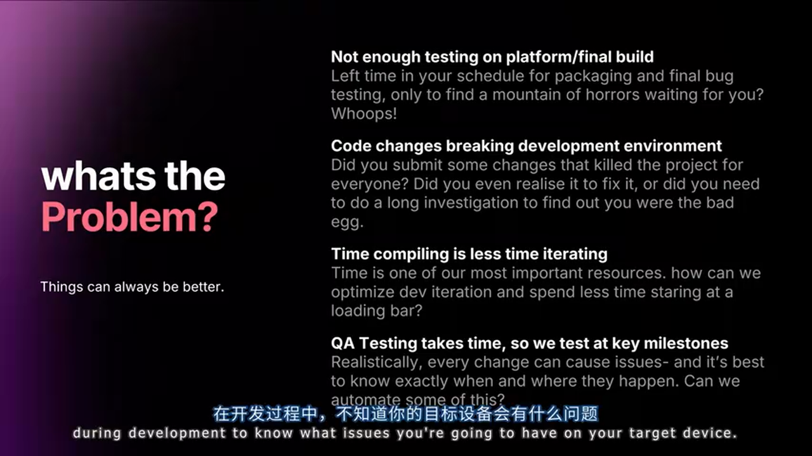

**代码冲突与构建破坏**：当多人协作时，未经验证的代码提交可能破坏主干构建，影响整个团队的开发进度。传统的"在我机器上能跑"问题在这里尤为常见。

**引擎编译的时间黑洞**：团队成员各自编译引擎源码，不仅浪费大量 CPU 资源，还导致环境不一致。一个中型团队每天可能浪费数十小时在重复编译上。


**QA 测试周期过长**：手动测试流程繁琐，覆盖率低，无法在每次提交后快速验证功能完整性。

### CICD 的核心价值


**持续集成（Continuous Integration）** 的本质是：每次代码推送时，自动触发构建和测试流程，及早发现问题。


**持续交付/部署（Continuous Delivery/Deployment）** 则进一步将构建产物自动部署到 QA 环境、预发布环境甚至生产环境。


这种自动化流程的核心优势在于：
- **快速反馈**：从提交到发现问题的时间从数小时缩短到数分钟
- **环境一致性**：所有构建在标准化的 Agent 机器上执行
- **资源优化**：集中式编译避免重复劳动
- **质量保障**：强制执行测试门禁，提升代码质量

---

## 第二部分：Horde 核心架构解析

### Horde 的定位与特性


Horde 是 Epic Games 内部用于支持 Fortnite、Unreal Engine 等项目的服务集合。它的核心特点是：

**为 Unreal Engine 深度优化**：

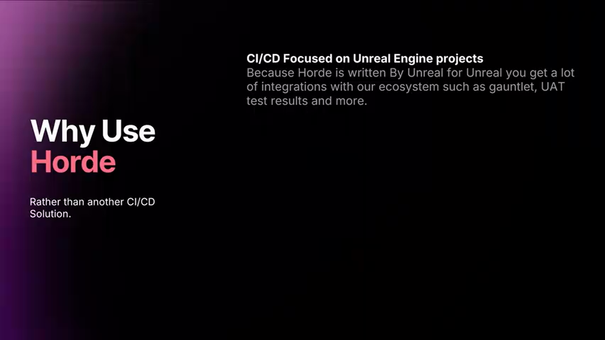

- 工作空间结构与 Epic 的项目组织方式一致
- 原生集成 UAT（Unreal Automation Tool）、Gauntlet 测试框架、UGS（Unreal Game Sync）
- 提供开箱即用的构建模板，大幅降低配置成本

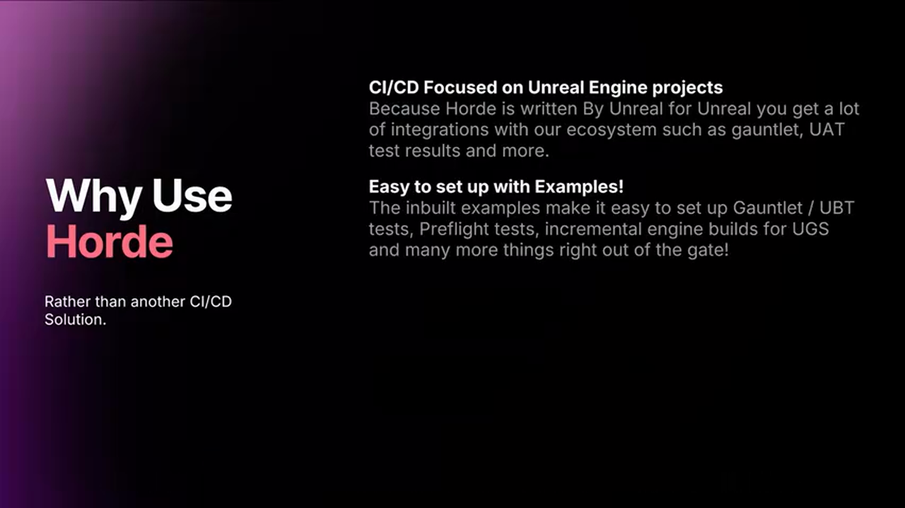

**模块化设计**：Horde 的功能是可插拔的，你可以只使用其中的某些模块，例如：
- 仅作为 UBA（Unreal Build Accelerator）的远程编译协调器
- 仅用于管理预编译二进制文件（Precompiled Binaries）
- 作为完整的 CICD 平台


**经过实战检验**：Horde 不仅服务于 Fortnite 这样的超大规模项目，还支持 Unreal Engine 本身的开发，甚至 Epic Games Store（Fab）也依赖它。这意味着它在高并发、大规模团队场景下的稳定性已得到充分验证。


**深度绑定 Perforce 和 BuildGraph**：这是 Horde 的双刃剑。如果你的团队已经在使用这两个工具，Horde 的集成会非常顺滑；但如果你使用 Git 或其他构建系统，则需要额外的适配工作。

### 架构层级：从 Global 到 Stream


Horde 的配置采用分层设计，这与典型的企业项目组织结构高度契合：

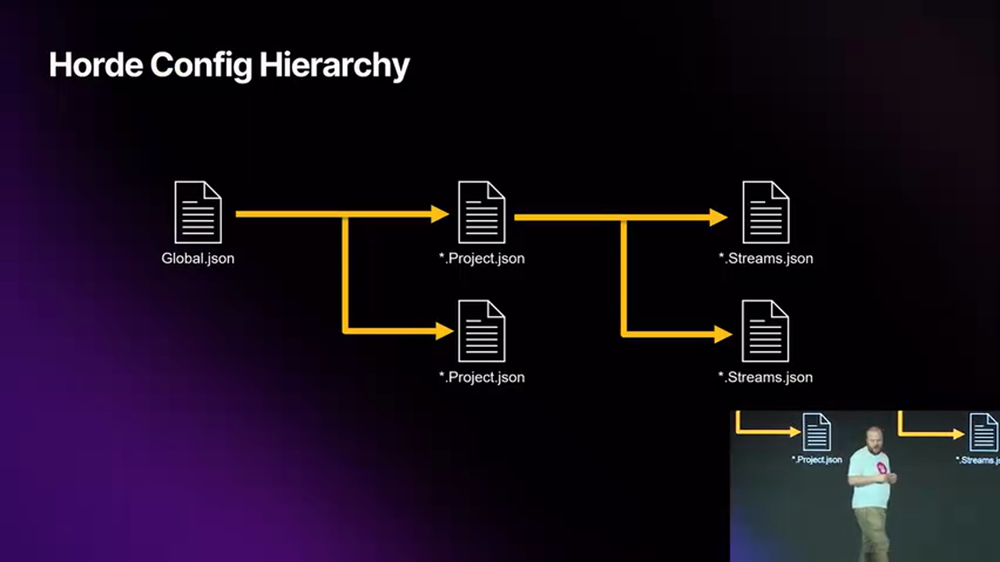

**配置文件层级关系**：

```
Global.json (全局配置)
    ├── Project.json (项目配置)
    │       ├── Stream.json (流配置)
    │       │       ├── Job Templates (作业模板)
    │       │       └── Parameters (参数定义)
    │       └── Stream.json (另一个流)
    └── Project.json (另一个项目)
```

这种设计的优势在于：
- **权限分离**：全局配置由 DevOps 团队管理，Stream 配置可以授权给各开发分支的负责人
- **配置复用**：通用设置在上层定义，下层继承并覆盖
- **版本控制**：配置文件可以存储在 Perforce 中，与代码同步演进


**组织结构映射**：
- **公司级别**：一个 Perforce 服务器，对应一个 Global 配置
- **项目级别**：多个游戏项目（如 ProjectA、ProjectB），每个对应一个 Project 配置
- **分支级别**：每个项目的 Main、Dev、Release 分支，对应不同的 Stream 配置

---

## 第三部分：快速上手 - 从零搭建 Horde 环境

### 安装 Horde Server


**Windows 平台快速部署**：


最简单的方式是从 GitHub Releases 下载 MSI 安装包：

```
https://github.com/EpicGames/UnrealEngine/releases
```


选择与你的 Unreal Engine 版本匹配的 Horde 版本（例如 5.5.4），下载 `Horde-Server-{version}.msi`。


安装完成后，Horde 会自动启动一个本地 Web 服务（默认端口 13340），你可以通过浏览器访问 `http://localhost:13340`。

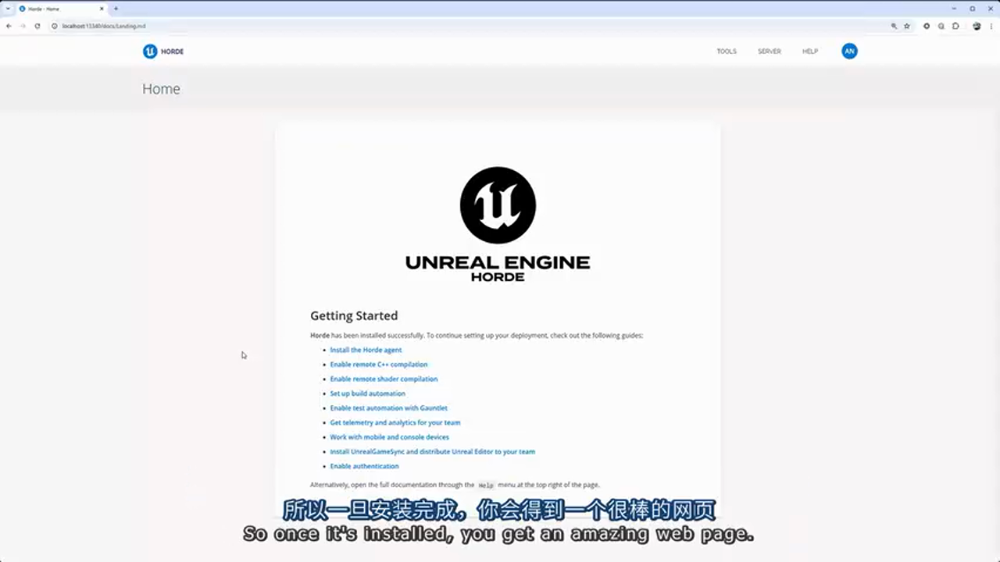

**首次启动的欢迎页面**：

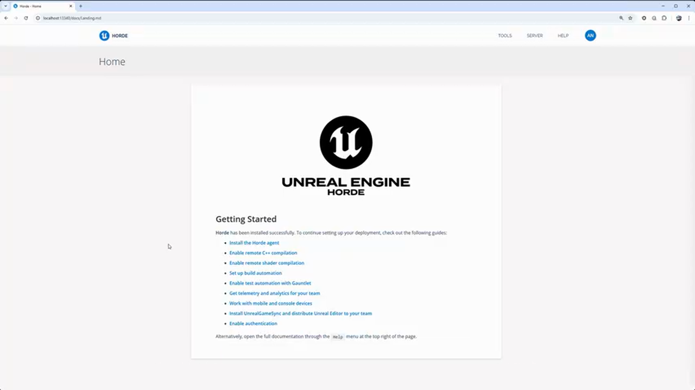

安装后的欢迎页面提供了详细的文档链接，包括配置指南、API 文档等。这些文档会随着 Horde 版本更新而同步，确保你看到的是最新的信息。


**版本信息查询**：在 Horde Dashboard 的设置页面可以查看当前安装的确切版本号，这对于后续排查问题非常重要。

### 配置第一个项目：以 Lyra 为例

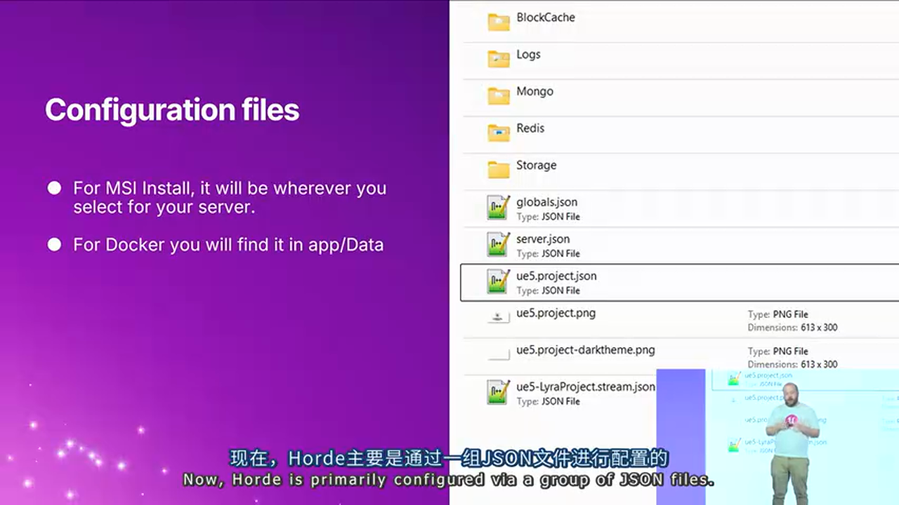

Horde 的配置主要通过 JSON 文件完成。虽然文件数量较多，但逻辑清晰。

**步骤 1：在 Global 配置中注册项目**

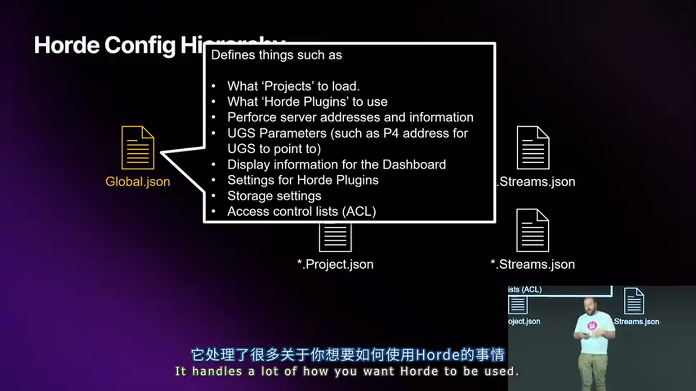

编辑 `Global.json`，在 `BuildPlugin` 部分添加项目引用：

```json
{
  "plugins": {
    "build": {
      "projects": [
        {
          "id": "lyra",
          "name": "Lyra Sample Game",
          "path": "projects/lyra.project.json"
        }
      ]
    }
  }
}
```

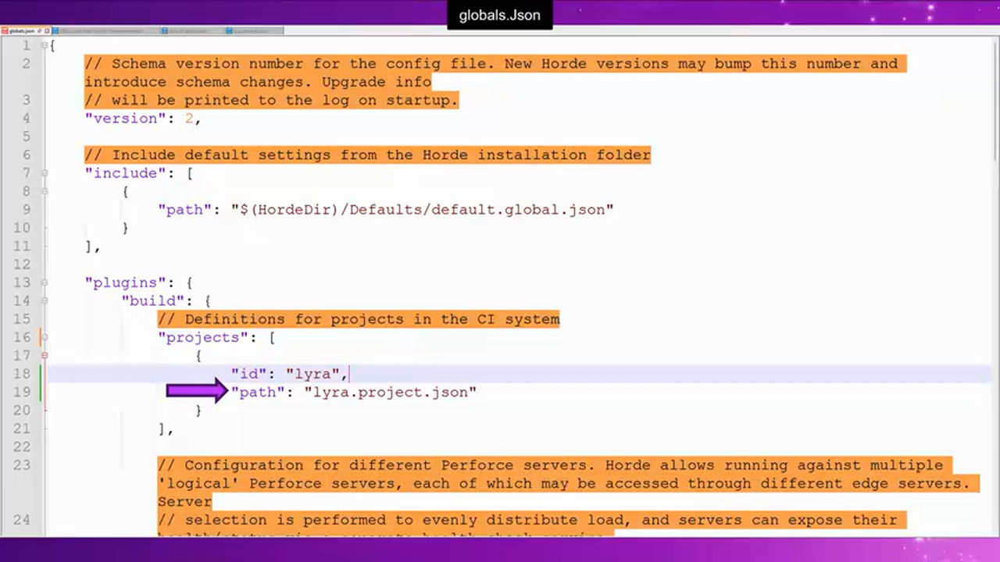

这里的 `path` 是相对于 `Global.json` 的路径。Horde 提供了大量示例配置，你可以直接复制 `ue.project.json` 并重命名为 `lyra.project.json`。

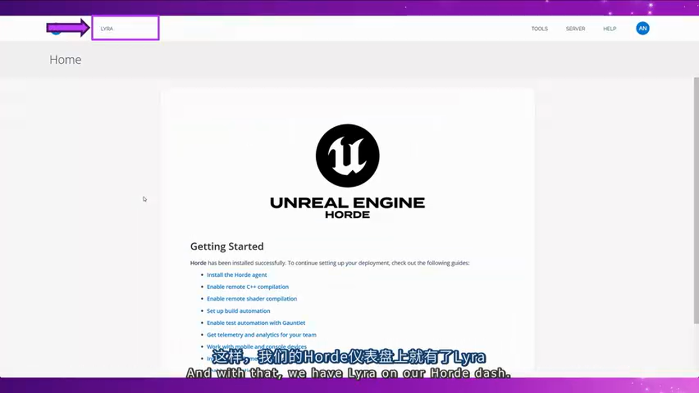

**步骤 2：定义 Project 配置**

`lyra.project.json` 的主要职责是声明该项目包含哪些 Stream（分支）：

```json
{
  "id": "lyra",
  "name": "Lyra",
  "streams": [
    {
      "id": "lyra-main",
      "name": "Main",
      "path": "streams/lyra-main.stream.json"
    }
  ],
  "logo": "/images/lyra-logo.png"
}
```


**步骤 3：配置 Stream 和 Job Templates**

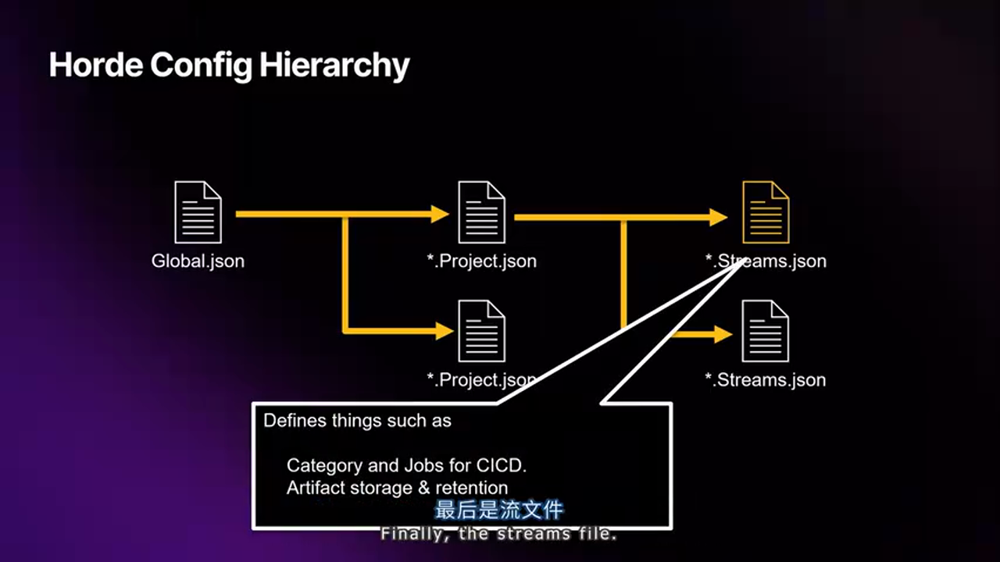

`lyra-main.stream.json` 是最核心的配置文件，它定义了该分支可以执行哪些构建任务（Job）。


Horde 预置了丰富的 Job 模板，涵盖常见场景：

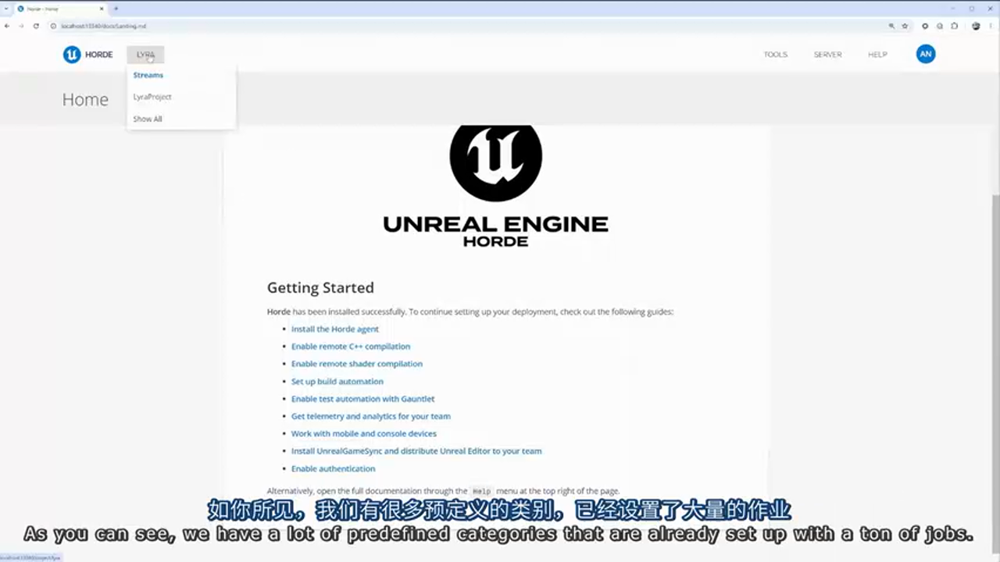

**预置的 Job 类别**：

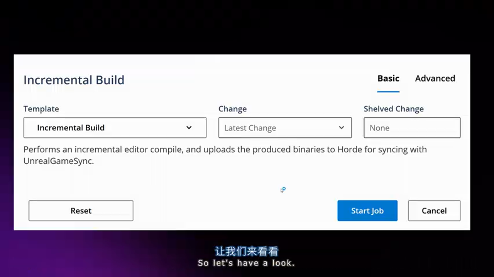

- **增量构建（Incremental Builds）**：为 UGS 用户生成预编译二进制文件
- **打包与测试（Package & Test）**：支持多平台打包并自动运行测试


- **预提交测试（Pre-submit Tests）**：在代码合入前运行验证，通过后自动提交


- **独立引擎构建（Standalone Engine Builds）**：为不使用 UGS 的团队提供完整引擎编译


- **实用工具示例（Utility Demos）**：展示如何自定义 UI 和参数

---

## 第四部分：Agent 管理 - 分布式构建的基石

### Agent 的角色与工作机制


当你在 Horde Dashboard 中触发一个 Job 时，可能会看到"等待 Agent"的状态。


**Agent 是什么？**

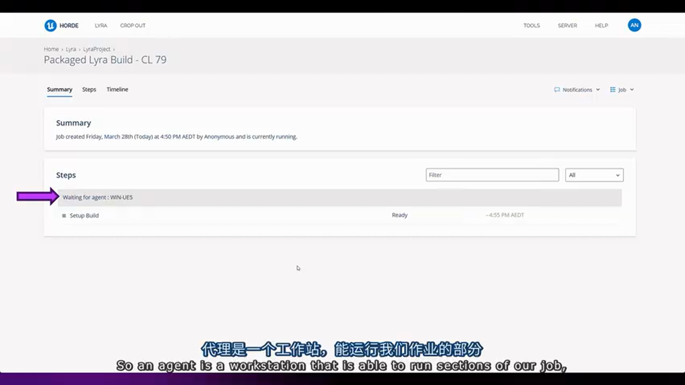

Agent 是运行在物理机或虚拟机上的工作进程，负责执行 Horde 分配的构建任务。它的核心特性包括：


- **主动连接**：Agent 主动连接 Horde Server，而非 Server 推送任务
- **状态监控**：Horde 实时监控 Agent 的 CPU、内存、磁盘使用情况

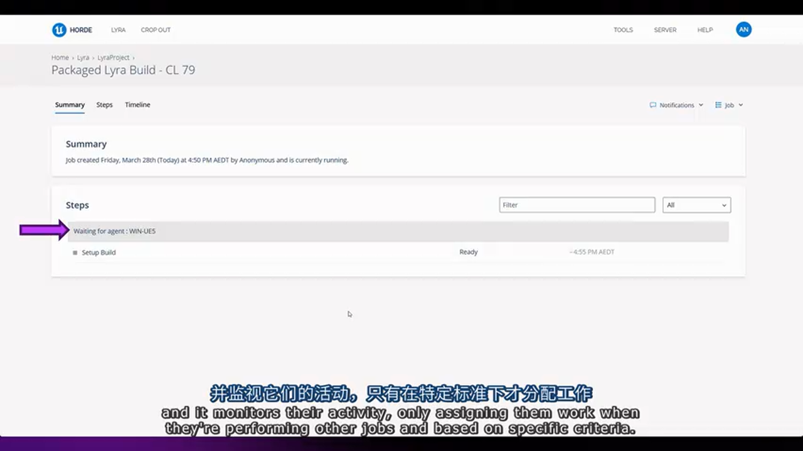

- **任务分配**：基于 Pool（资源池）和 Agent 属性进行智能调度


例如，一个需要 Windows + UE5 环境的任务，只会分配给标记为 `Win-UE5` Pool 的 Agent。

### 安装和注册 Agent


**下载 Agent 安装包**：


在 Horde Dashboard 的 Downloads 页面，可以找到针对不同平台的 Agent 安装包。


对于 Windows，直接下载 MSI 安装包并运行。


**Agent 注册流程（Enrollment）**：

安装完成后，Agent 会自动弹出注册请求窗口。这是一个安全机制，确保只有经过授权的机器才能加入 Horde 集群。

在 Horde Dashboard 的 **Agent Enrollment** 页面，你会看到待批准的 Agent 请求，点击批准即可完成握手。


**Agent 信息面板**：

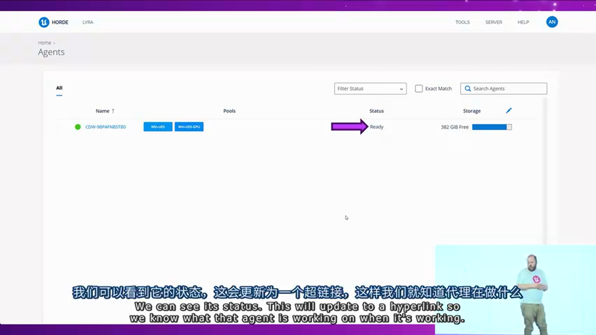

注册成功后，你可以在 Agent 列表中看到：
- **状态（Status）**：Idle（空闲）、Working（工作中）、Offline（离线）
- **当前任务**：如果正在执行任务，会显示 Job 链接


- **磁盘空间**：防止因磁盘满导致构建失败


- **所属 Pool**：决定该 Agent 可以接收哪些类型的任务


### Pool 机制：任务与资源的匹配

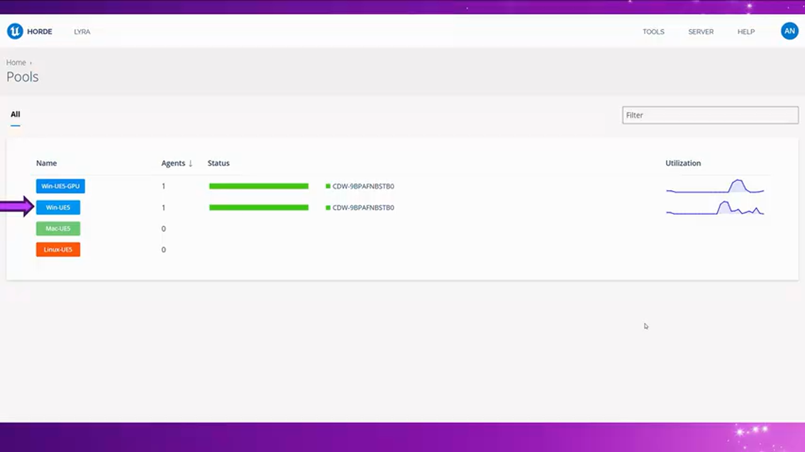

**Pool 的设计哲学**：

Pool 本质上是一种标签系统，用于描述 Agent 的能力。例如：


- `Win-UE5`：Windows 平台，安装了 UE5 开发环境
- `Mac-UE5`：macOS 平台，可用于 iOS/Mac 构建


- `Win-UE5-GPU`：Windows + 独立显卡，用于运行图形测试

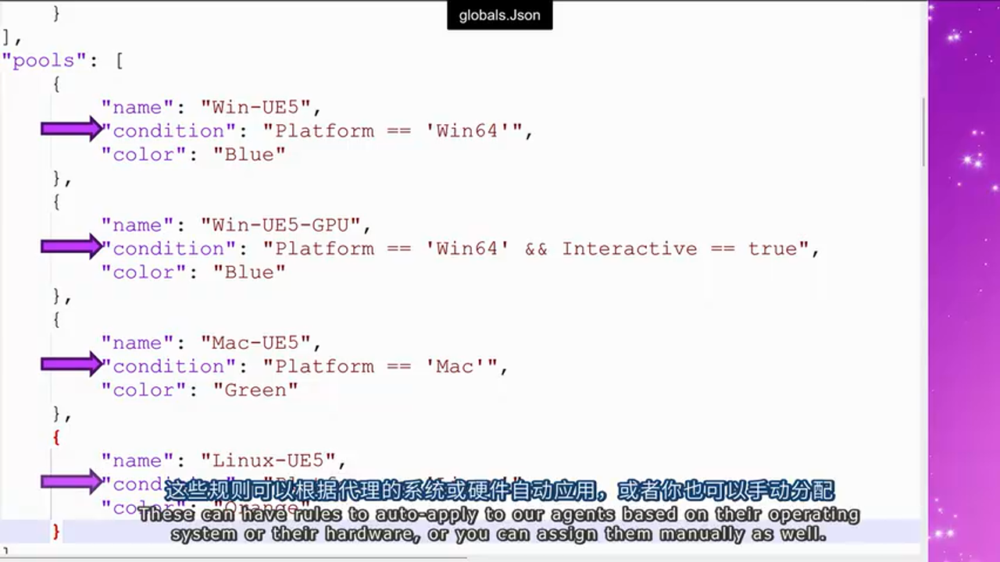

**自动分配规则**：


在 `Global.json` 中可以定义 Pool 的自动分配条件：

```json
{
  "compute": {
    "pools": [
      {
        "id": "win-ue5",
        "condition": "OSFamily == 'Windows' && HasUE5 == true"
      }
    ]
  }
}
```

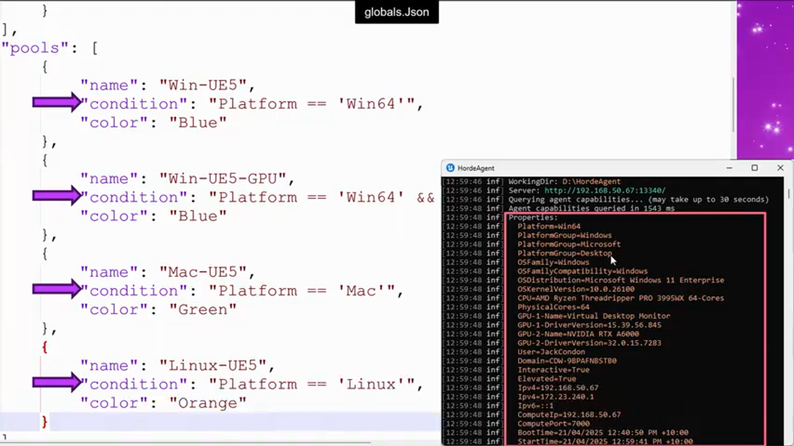

**实用技巧**：运行 `HordeAgent.exe --ListProperties` 可以查看当前机器的所有可用属性，这对于编写 Pool 规则非常有帮助。

### 第一次成功的构建


当 Agent 准备就绪后，重新触发之前等待的 Job：

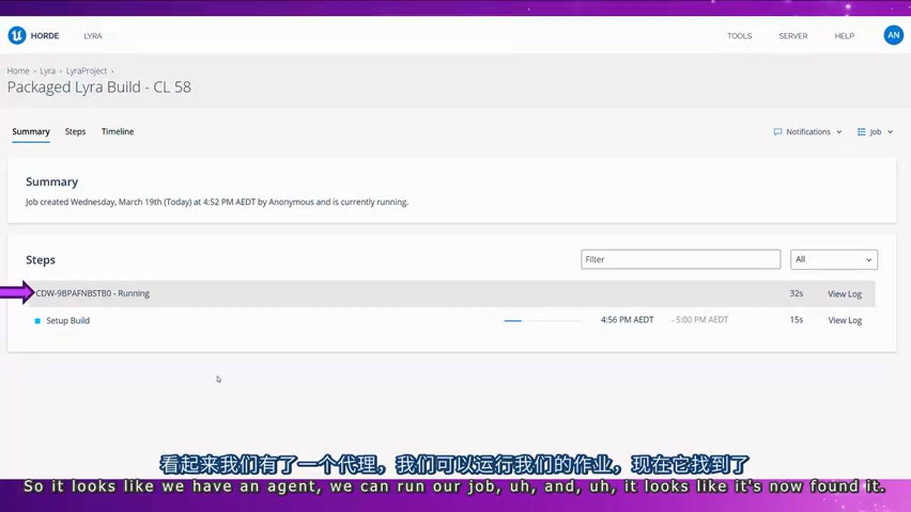

Horde 会自动找到匹配的 Agent 并开始执行。


**任务分配逻辑**：

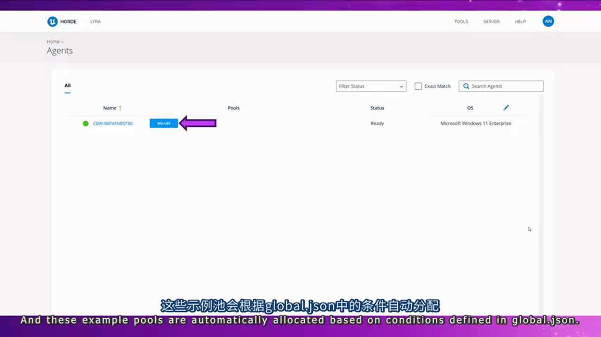

Job 模板中定义的 `pool` 参数（如 `Win-UE5`）与 Agent 的 Pool 标签匹配，Horde 会优先选择空闲且符合条件的 Agent。


**构建成功的标志**：


构建完成后，你可以在 Job 详情页看到：

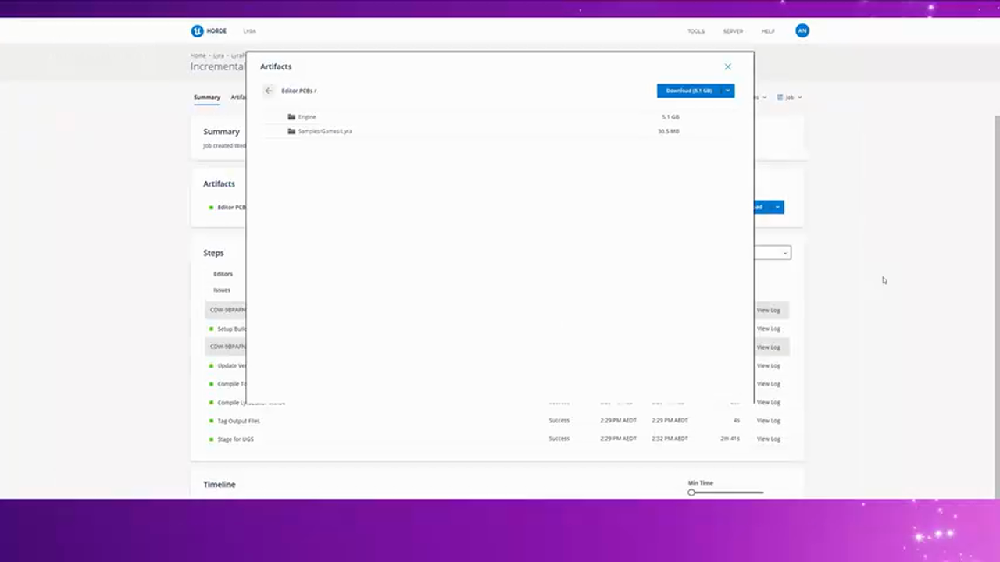

- **生成的 Artifacts**：可下载的构建产物（如 .zip 包）

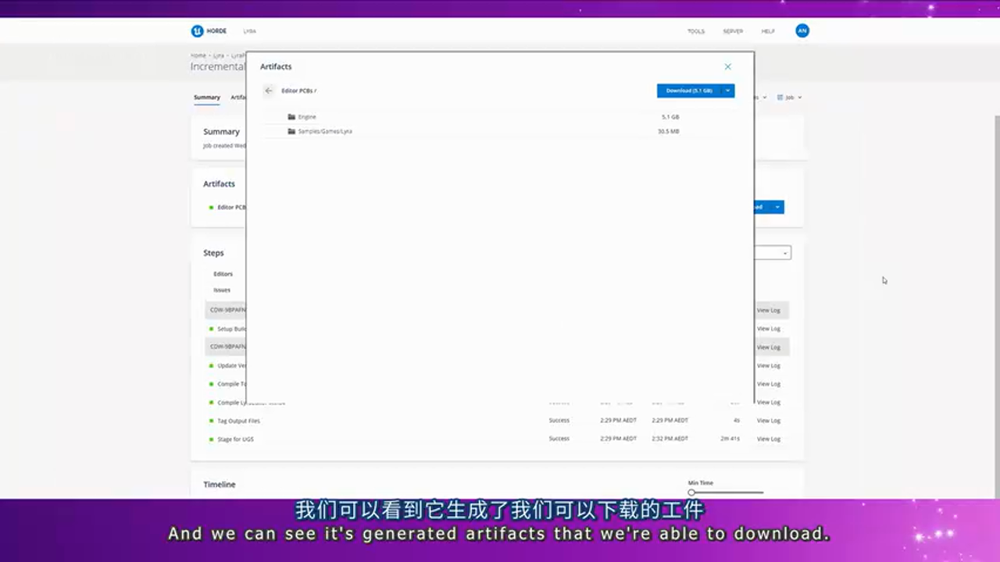

- **日志输出**：详细的编译和打包日志
- **执行时间**：每个步骤的耗时统计

---

## 第五部分：深入 BuildGraph - Horde 的任务引擎

### BuildGraph 与 Horde 的关系

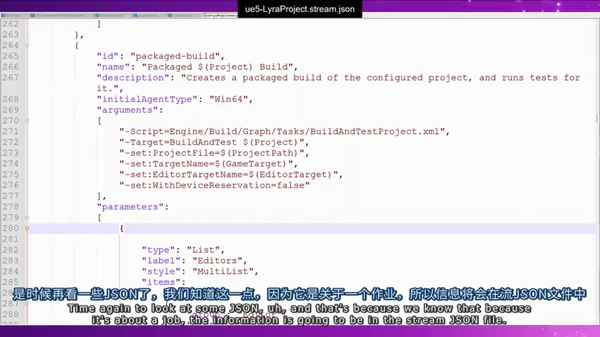

**关键认知**：Horde 本身并不执行构建逻辑，它只是调度器。真正的构建工作由 **BuildGraph** 完成。

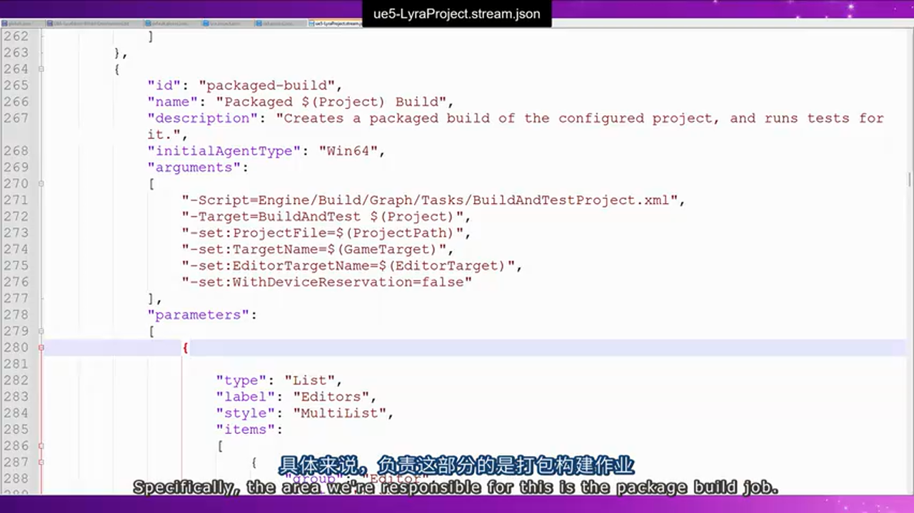

**Job 的本质**：

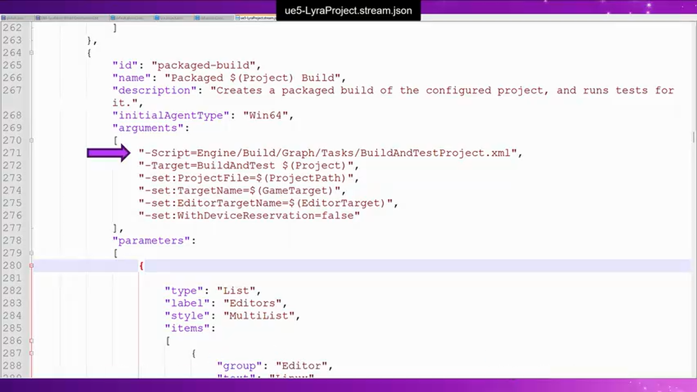

一个 Horde Job 实际上是对 BuildGraph 的一次调用，包含：

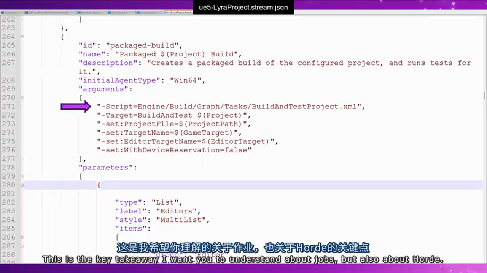

- **Script 路径**：指向 `.xml` 格式的 BuildGraph 脚本
- **Target 名称**：要执行的具体 Node（节点）


- **参数传递**：从 Horde UI 收集的用户输入，转化为 BuildGraph 的命令行参数


**引擎自带的强大脚本**：

UE5 在 `Engine/Build/Graph/` 目录下提供了 `BuildAndTestProject.xml`，这是一个功能完备的构建脚本，支持：
- 多平台编译（Windows、Mac、Linux、Android、iOS、Console）
- 自动化测试（Editor Tests、Packaged Tests、Gauntlet）
- 增量构建优化
- DDC（Derived Data Cache）管理

大多数团队可以直接使用这个脚本，无需从零编写 BuildGraph。

### Job 参数的 UI 映射

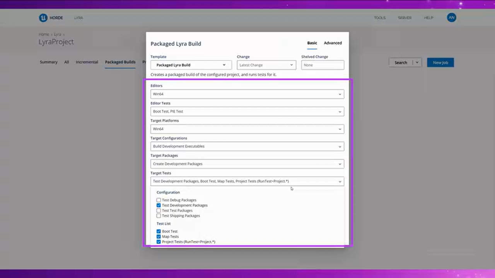

**用户看到的界面**：

当你在 Horde Dashboard 中启动一个 Job 时，会看到一系列可配置的选项（如平台、配置、是否运行测试等）。

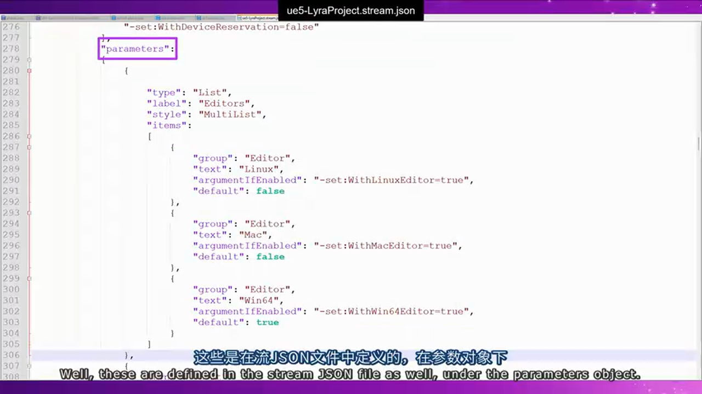

**背后的配置**：

这些选项在 `Stream.json` 的 `parameters` 字段中定义：

```json
{
  "templates": [
    {
      "id": "package-build",
      "name": "Package Build",
      "parameters": [
        {
          "name": "Platform",
          "type": "List",
          "options": ["Win64", "Android", "iOS"],
          "default": "Win64"
        },
        {
          "name": "Configuration",
          "type": "List",
          "options": ["Development", "Shipping"],
          "default": "Development"
        }
      ]
    }
  ]
}
```


**参数类型支持**：

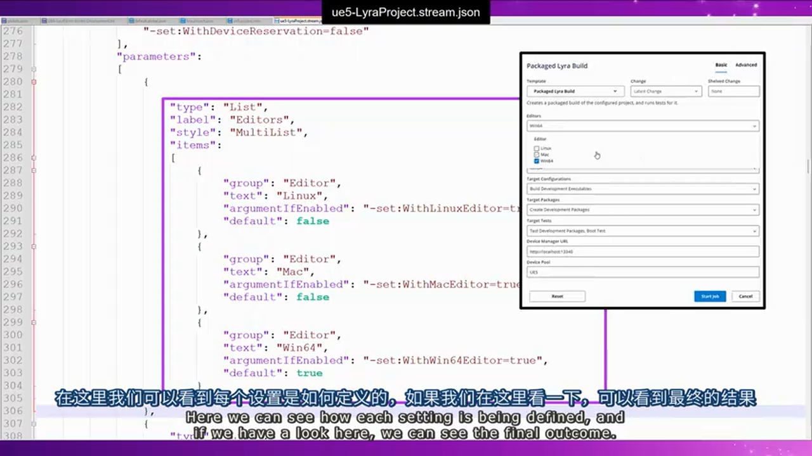

- **List**：下拉选择框


- **Bool**：复选框
- **Text**：文本输入框
- **Tag**：用于 BuildGraph 的 `-set` 参数


这些参数最终会转化为 BuildGraph 的命令行参数，例如：

```bash
RunUAT.bat BuildGraph 
  -Script=BuildAndTestProject.xml 
  -Target=PackageAndTest 
  -set:Platform=Android 
  -set:Configuration=Shipping
```

### 实用工具：Template Editor


**可视化编辑器**：

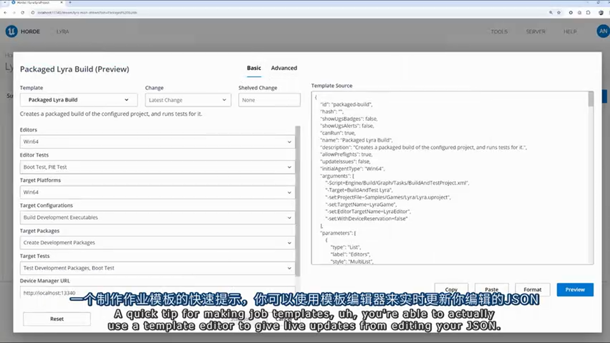

Horde 提供了一个在线的 Template Editor，可以实时预览 JSON 配置对应的 UI 效果。


使用流程：
1. 在 Horde Dashboard 的 Utilities 页面找到 Template Editor
2. 粘贴你的 Job 模板 JSON


3. 实时查看 UI 渲染结果
4. 调整满意后，复制回 `Stream.json`

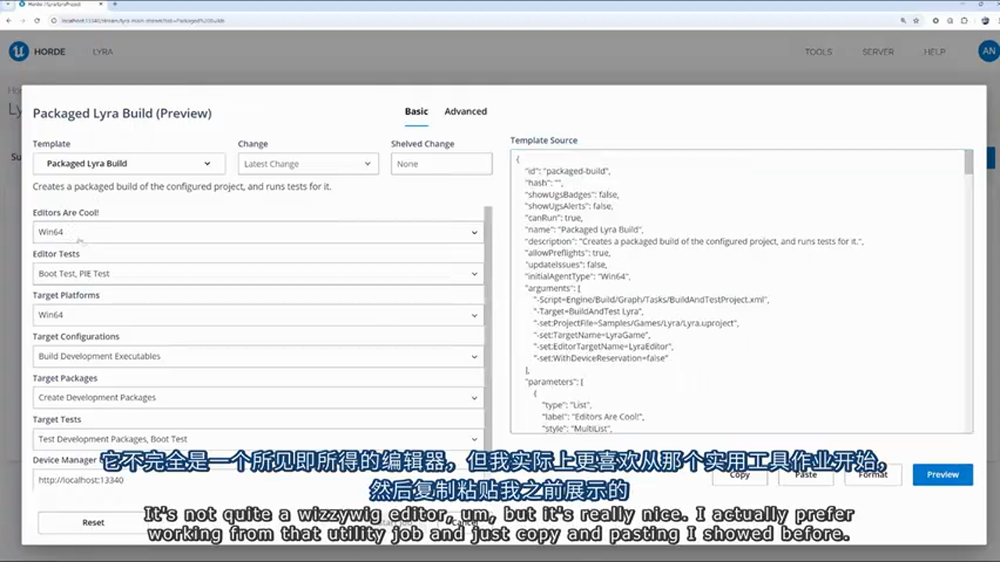

虽然不是完全的所见即所得编辑器，但对于快速迭代 UI 布局非常有用。

---

## 第六部分：自动化测试 - 从编译到设备验证

### 打包与测试的完整流程


**触发一个完整的测试 Job**：


选择 "Package and Test" 模板，配置目标平台后启动。你会看到 Job 被拆分为多个 Step：
1. **Compile Editor**：编译编辑器版本
2. **Cook Content**：烘焙资源
3. **Package Build**：打包目标平台
4. **Run Editor Tests**：在编辑器中运行测试
5. **Run Packaged Tests**：在打包后的 Build 中运行测试

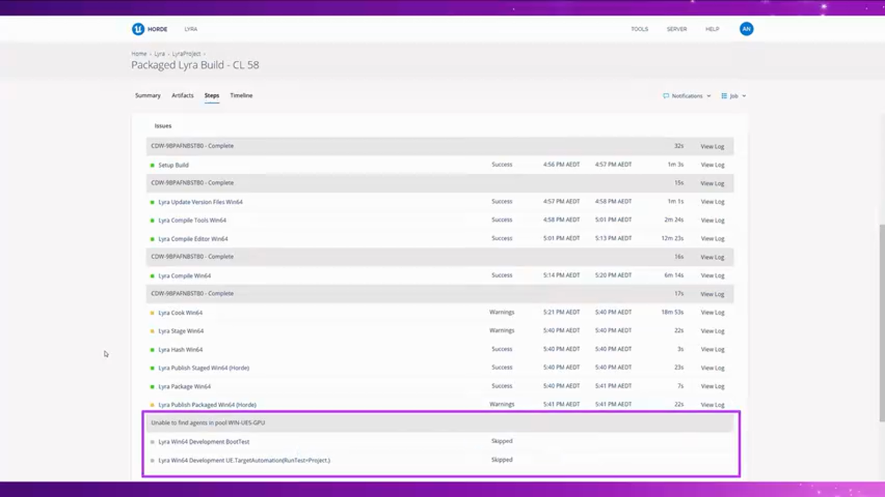

**Agent Pool 的分层使用**：

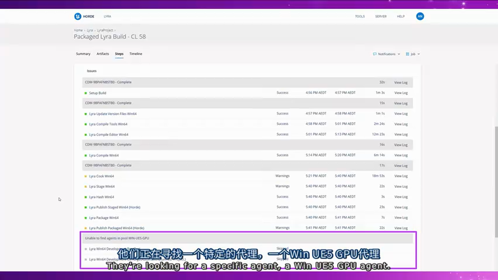

注意到测试步骤需要 `Win-UE5-GPU` Pool。这是因为运行图形测试需要独立显卡，而编译步骤只需要 `Win-UE5` Pool。


### Windows Service vs User Mode

**Agent 的两种运行模式**：


- **Windows Service 模式**：后台运行，开机自启，但无法启动 GUI 应用（如 UE Editor）
- **User Mode**：在用户登录后运行，可以启动 Editor 和打包后的游戏

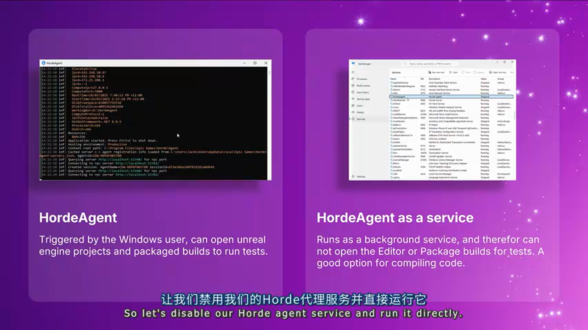

**切换到 User Mode**：

如果你需要运行 Editor Tests 或 Packaged Tests，必须：
1. 停止 Horde Agent Service
2. 以当前用户身份运行 `HordeAgent.exe`


**Editor Tests vs Packaged Tests**：

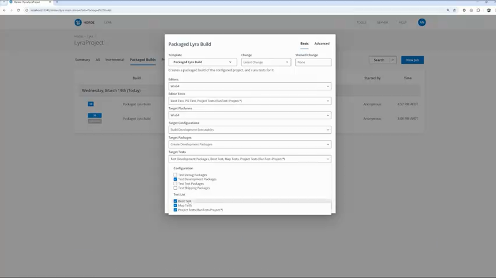

- **Editor Tests**：在 UnrealEditor.exe 中运行，速度快，适合快速验证逻辑


- **Packaged Tests**：在打包后的 .exe 中运行，更接近真实环境，能发现 Shipping 配置特有的问题


**自动化测试的实际运行**：

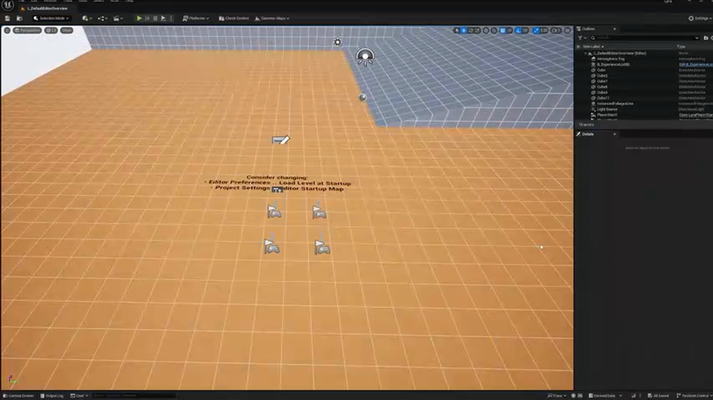

当测试开始时，你会看到 Editor 或游戏自动启动，执行预定义的测试用例，然后自动关闭。整个过程无需人工干预。


测试完成后，Horde 会收集测试报告，并在 Dashboard 中展示通过/失败的用例。

---

## 第七部分：Pre-flight 机制 - 代码合入前的最后防线

### "在我机器上能跑"问题的终结者


**经典场景**：开发者在本地测试通过后提交代码，结果破坏了主干构建，导致整个团队无法工作。


**Pre-flight 的核心思想**：在代码真正合入主干之前，先在 Horde 上运行一遍完整的构建和测试流程。只有通过后，才允许提交。


### 配置 P4V 扩展

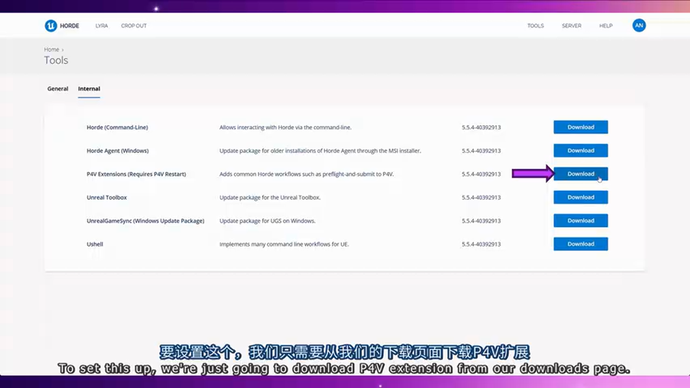

**下载 P4V Extension**：

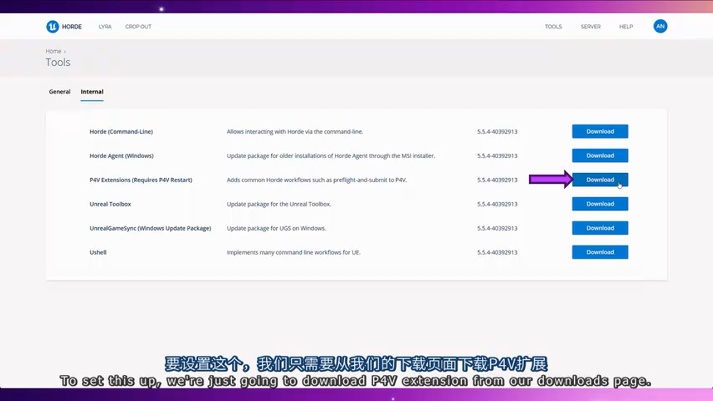

在 Horde Dashboard 的 Downloads 页面，找到 "Perforce Extensions" 下载包。


**安装步骤**：

1. 解压下载的 .zip 文件
2. 运行 `Install.bat`，这会向 P4V 注册自定义菜单


3. 编辑 `HordeExtension.ini`，填入 Horde Server 的 URL：

```ini
[Horde]
ServerUrl=http://your-horde-server:13340
```

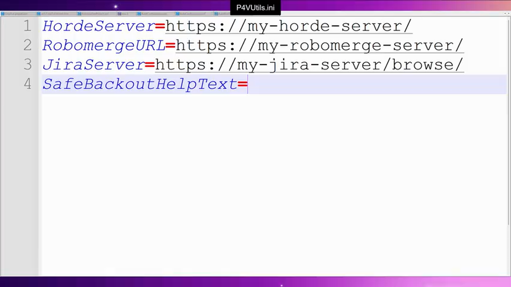

这个扩展不仅支持 Pre-flight，还提供了很多便捷功能（如快速查看 Job 状态、同步到特定 CL 等）。

### 使用 Pre-flight 提交代码

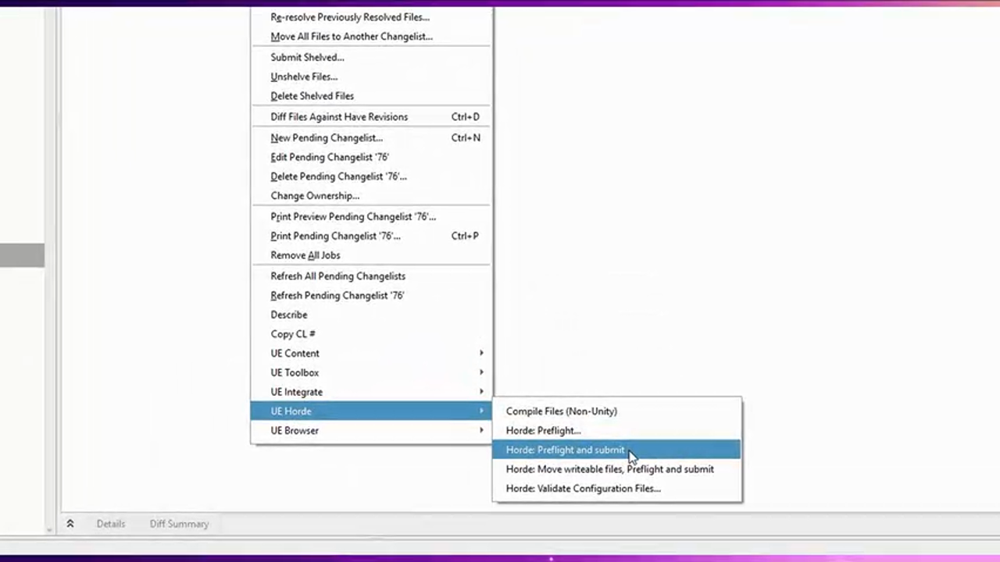

**在 P4V 中触发 Pre-flight**：


1. 右键点击你的 Pending Changelist


2. 选择 "Horde -> Pre-flight and Submit"


3. P4V 会自动打开 Horde Dashboard，并预填好 Shelved CL 编号


4. 勾选 "Auto-submit if successful"，然后启动 Job


**工作流程**：


- Horde 会从 Perforce 拉取你的 Shelved 变更
- 在干净的 Agent 环境中应用这些变更
- 运行预定义的测试（编译、单元测试、打包等）
- 如果全部通过，自动执行 `p4 submit`
- 如果失败，保留 Shelved CL，你可以修复后重试

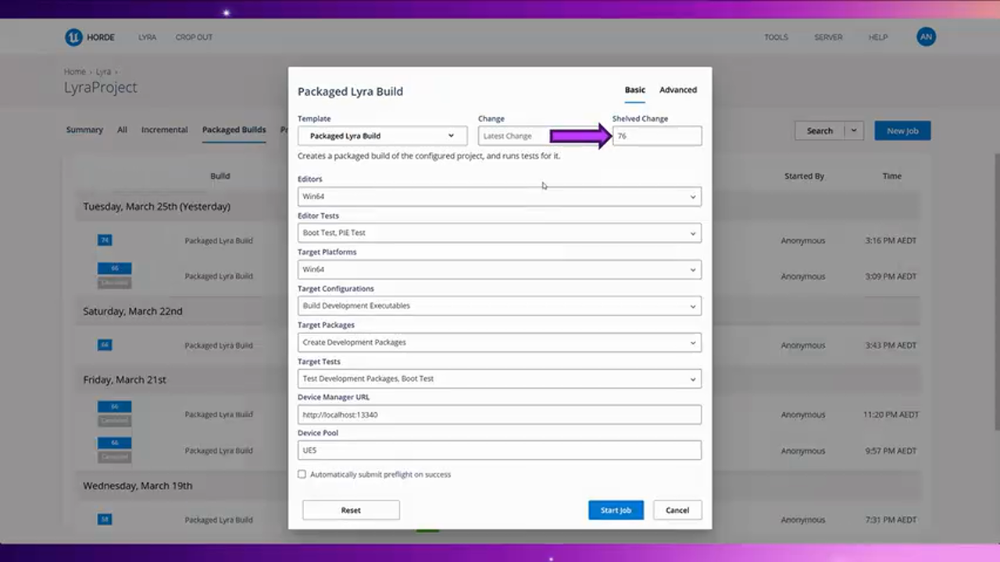

**适用于任何 Job**：


实际上，Horde 的每个 Job 模板都支持 "Shelved CL" 和 "Auto-submit" 选项。你甚至可以在 Pre-flight 中运行完整的打包和设备测试，确保代码在所有目标平台上都能正常工作。

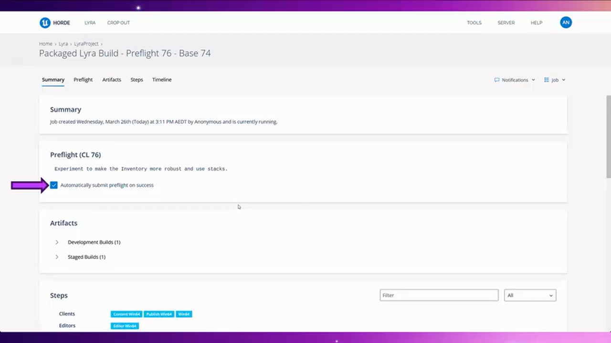

**P4V Extension 的本质**：


这个扩展只是一个便捷的启动器，它的作用是自动填充 Horde Web 页面的表单。即使不安装扩展，你也可以手动在 Horde Dashboard 中输入 Shelved CL 编号来触发 Pre-flight。

---

## 第八部分：调度策略 - 自动化触发与 Nightly Builds

### Schedule 配置详解


**问题场景**：每次提交代码后都要手动触发 Job 吗？能否在每晚自动运行完整的测试套件？


**答案是 Schedule 机制**：


在 `Stream.json` 的 Job 模板中，可以配置 `schedule` 字段，定义自动触发条件。

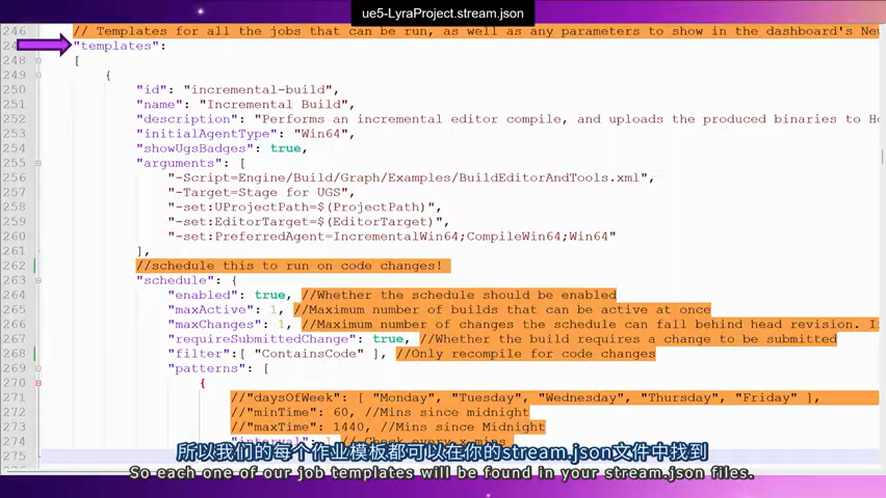

**Schedule 配置示例**：

```json
{
  "templates": [
    {
      "id": "incremental-build",
      "name": "Incremental Build",
      "schedule": {
        "enabled": true,
        "maxActive": 2,
        "maxChanges": 10,
        "requireSubmittedChange": true,
        "filter": ["*.cpp", "*.h", "*.cs"],
        "patterns": [
          {
            "interval": 5,
            "minTime": "09:00",
            "maxTime": "18:00"
          }
        ]
      }
    }
  ]
}
```


**参数解析**：


- **enabled**：总开关，方便调试时临时禁用


- **maxActive**：同时运行的 Job 数量上限（防止资源耗尽）


- **maxChanges**：允许 Schedule 落后主干的最大 CL 数量（避免积压过多）


- **requireSubmittedChange**：只有在有新提交时才触发（避免空跑）


- **filter**：文件过滤规则


例如 `["*.cpp", "*.h"]` 表示只有 C++ 代码变更时才触发，美术资源变更不触发编译。

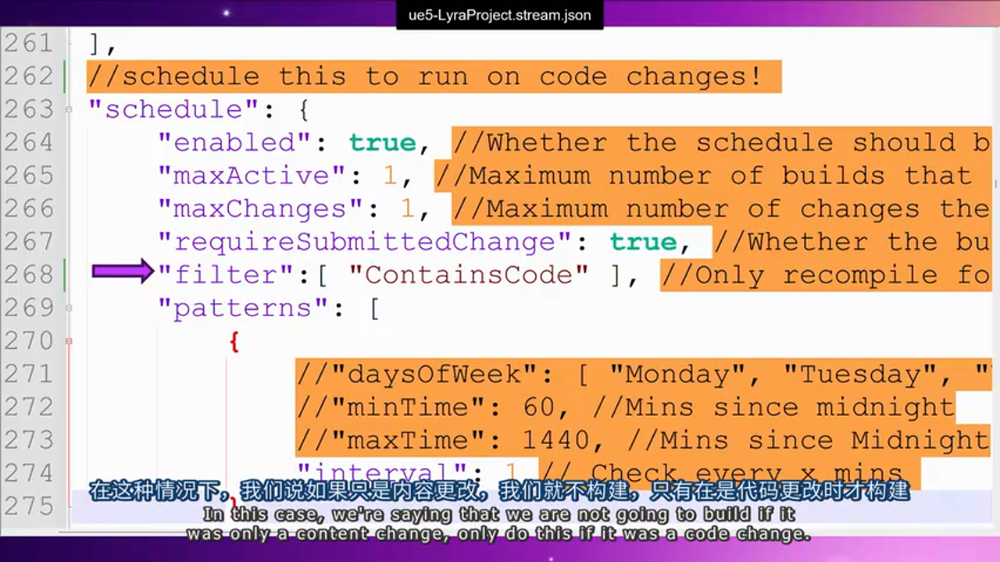

- **patterns**：轮询策略


`interval: 5` 表示每 5 分钟检查一次 Perforce，`minTime/maxTime` 限制触发时间窗口（如工作时间）。

### 监控 Schedule 状态

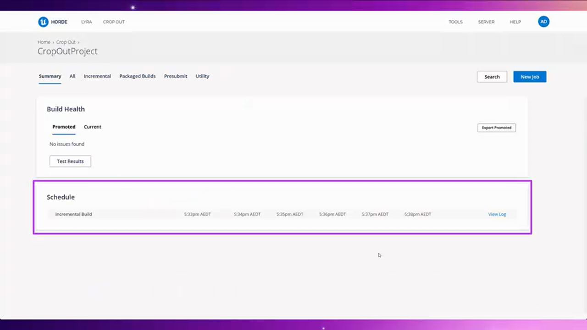

**Dashboard 视图**：

在 Stream 的 Summary 页面，可以看到所有启用的 Schedule，包括上次触发时间、下次预计触发时间等。


**日志查看**：

Horde Server 的日志中会记录每次轮询的详细信息，包括：
- 检测到的新 CL
- 是否满足 Filter 条件
- 为什么触发或跳过


这对于调试 Schedule 规则非常有用。更多高级配置（如 Cron 表达式、依赖触发等）可以参考官方文档。

---

## 第九部分：UGS 集成 - 为团队提供统一的代码同步体验

### UGS 的价值主张


**什么是 Unreal Game Sync（UGS）？**

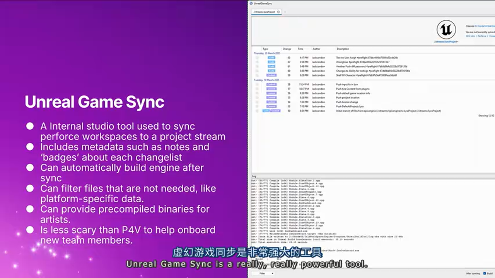

UGS 是 Epic 开发的 Perforce 前端工具，专为 Unreal Engine 项目优化。它的核心优势包括：

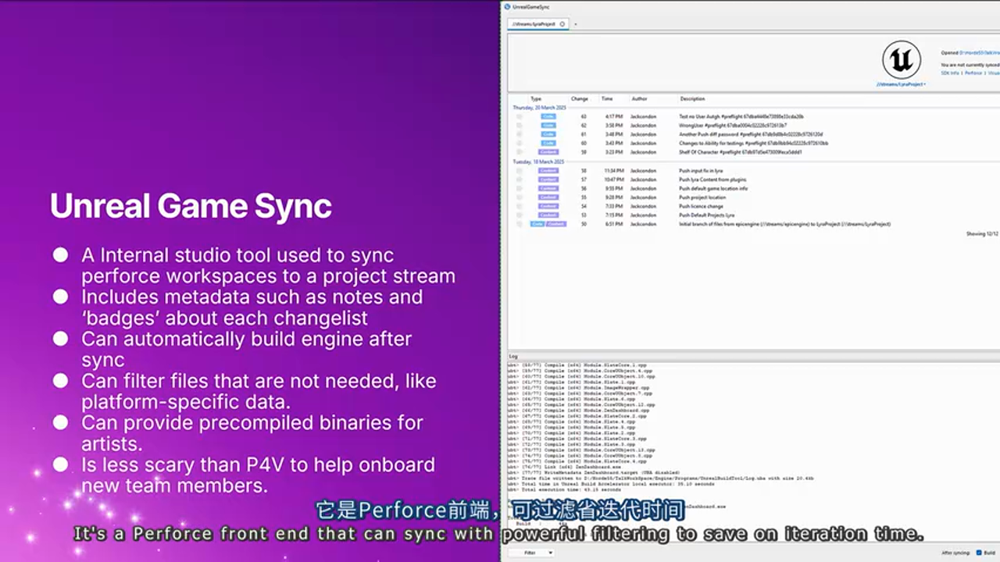

- **智能过滤同步**：只同步当前平台需要的文件（如 Windows 开发者不同步 Mac 二进制）
- **自动引擎编译**：检测到引擎代码变更时，自动触发本地编译


- **引擎与项目锁步**：确保引擎版本与项目代码始终匹配
- **元数据展示**：在 CL 列表中显示构建状态、测试结果等信息

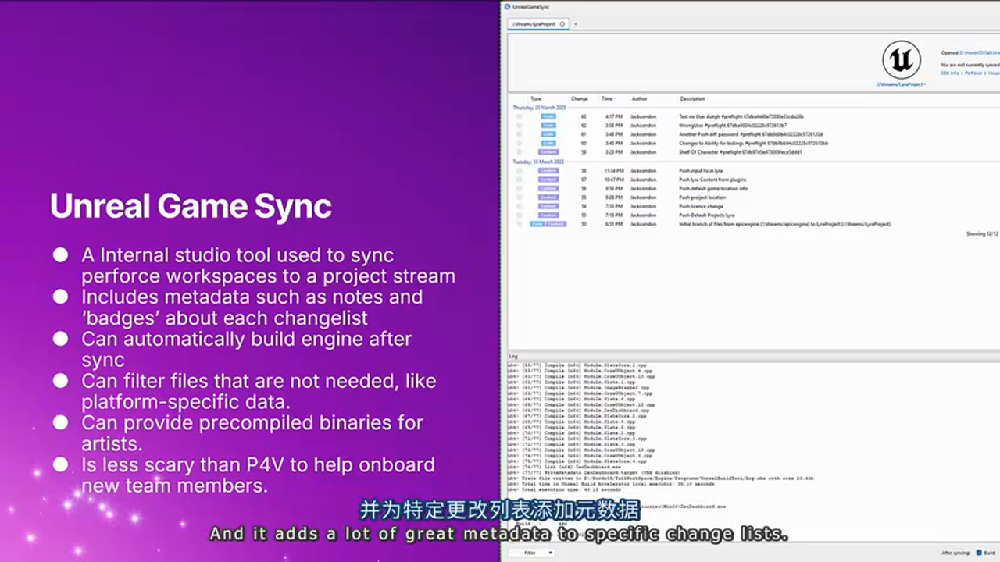

- **预编译二进制下载**：无需本地编译引擎，直接下载 Horde 构建的二进制文件

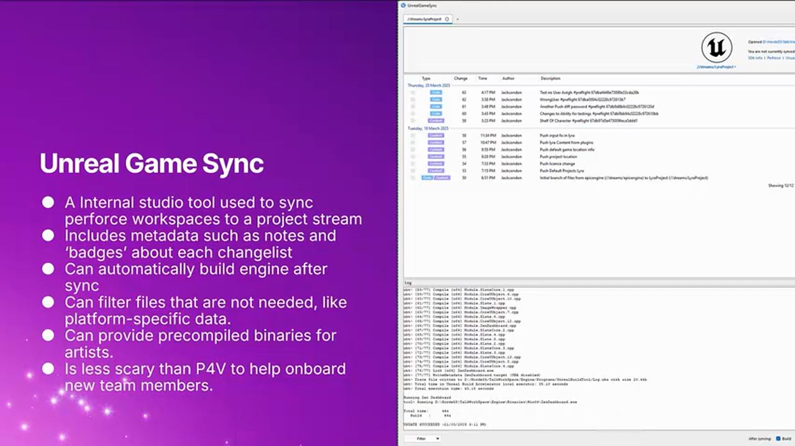

**历史痛点**：

过去，UGS 需要单独搭建 Metadata Server（通常是 SQL Server），配置复杂。现在，Horde 原生支持 UGS Metadata，一行配置即可搞定。

### 快速部署 UGS


**步骤 1：配置 Perforce 地址**

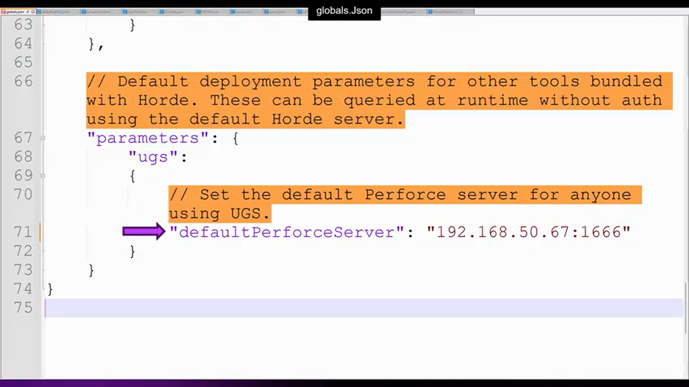

在 `Global.json` 中添加 Perforce 服务器信息：

```json
{
  "perforce": {
    "servers": [
      {
        "serverAndPort": "perforce.company.com:1666",
        "userName": "build-user"
      }
    ]
  }
}
```

这样，团队成员安装 UGS 时，服务器地址会自动填充。


**步骤 2：下载并安装 UGS**


在 Horde Dashboard 的 Downloads 页面，下载 `UnrealGameSync-{version}.msi`。


安装时，只需输入 Horde Server 的 URL，其他配置会自动从服务器拉取。

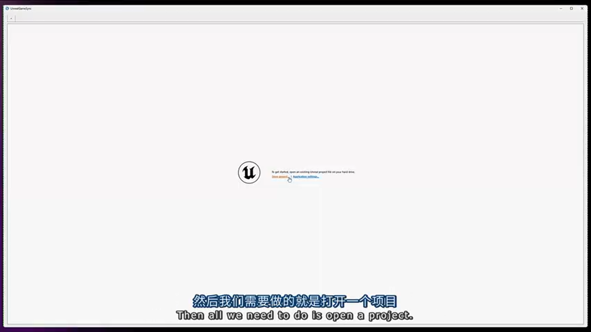

**步骤 3：打开项目**


UGS 的"项目"概念是 **Stream + UProject 文件** 的组合。

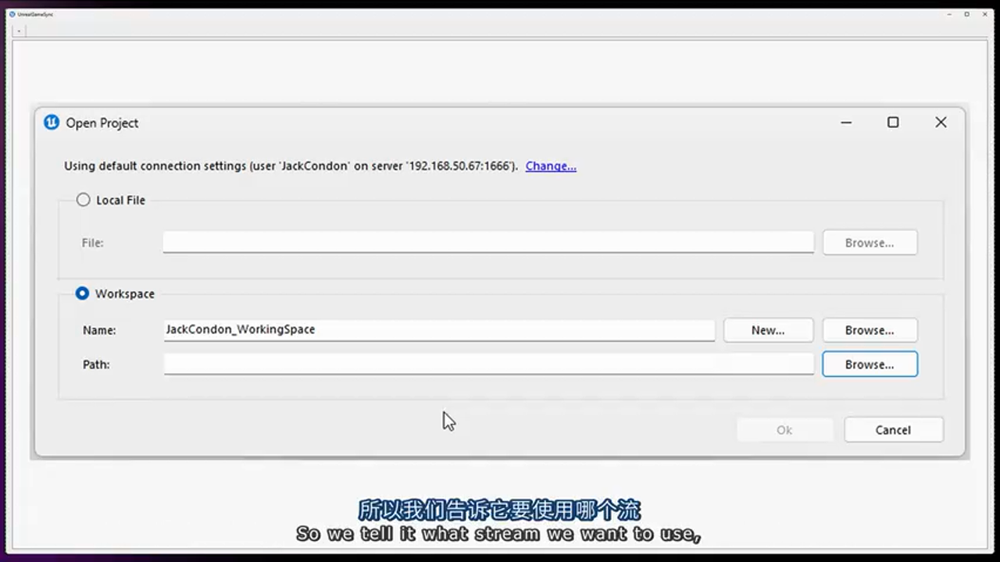

选择你的 Perforce Stream（如 `//Lyra/Main`），然后选择 `LyraStarterGame.uproject`。


UGS 会自动同步代码，并根据需要编译引擎。

### 配置 UGS Metadata

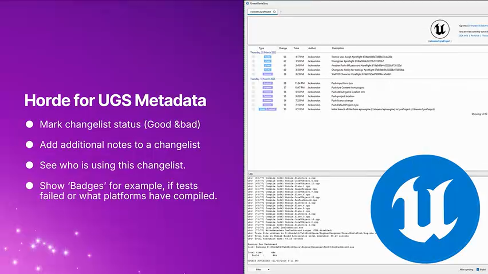

**Metadata 的作用**：

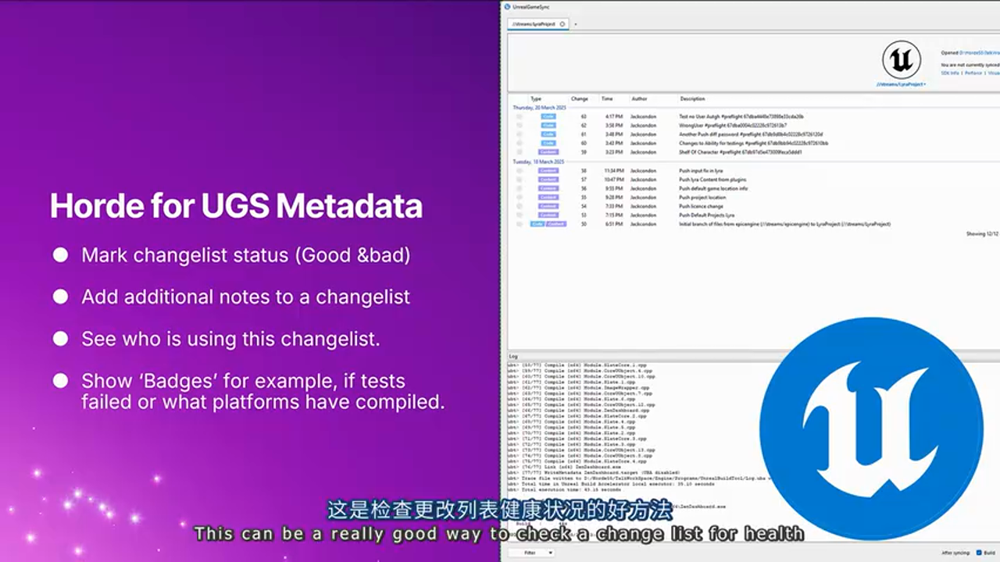

UGS 可以在每个 CL 旁边显示额外信息，例如：
- 该 CL 的构建状态（成功/失败）
- 测试覆盖率
- 性能基准测试结果
- 开发者备注

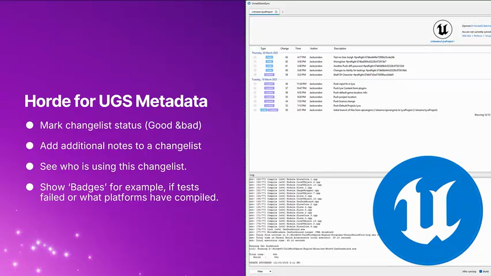

**启用 Horde Metadata 服务**：


编辑引擎目录下的 `Engine/Programs/UnrealGameSync/UnrealGameSync.ini`：

```ini
[Default]
MetadataServer=http://your-horde-server:13340
```

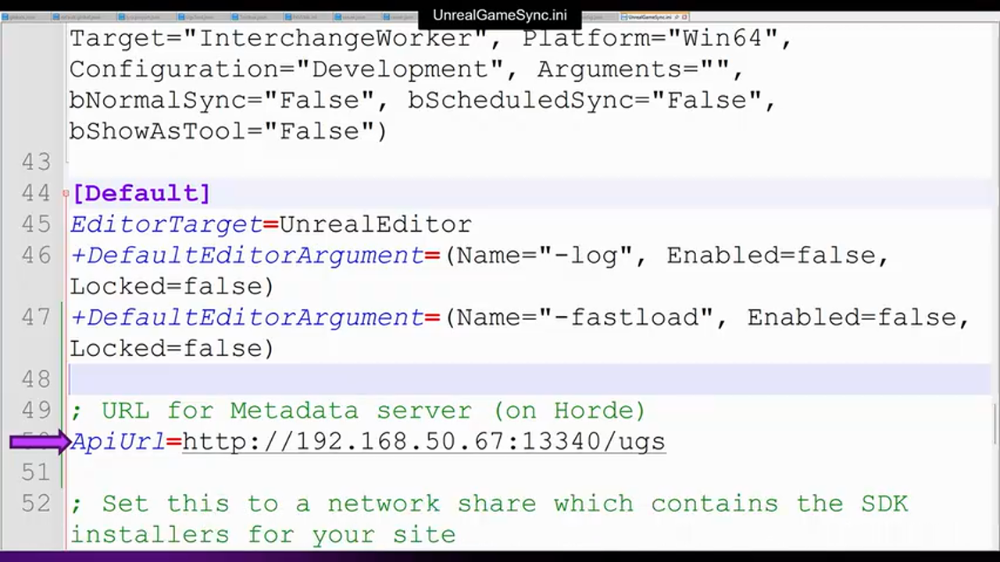

注意：这个文件应该提交到引擎的 Perforce Stream 中，而不是项目 Stream。这样所有使用该引擎的项目都能共享配置。

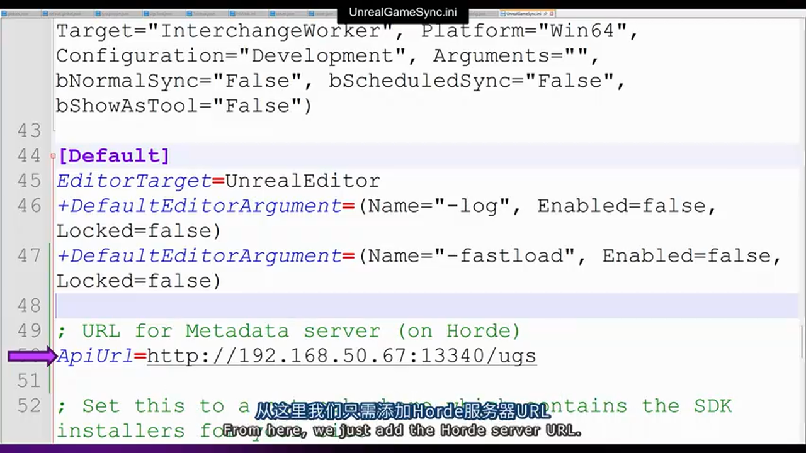

配置完成后，重启 UGS，你会看到 CL 列表中出现构建状态图标。


**对比传统方案**：


以前需要搭建独立的 SQL Server、配置数据库权限、编写同步脚本。现在只需一行配置，Horde 内置的 MongoDB 会自动处理所有数据存储。

### 全局消息通知


**场景需求**：


当项目进入 Feature Lock 阶段，或者主干构建被破坏时，需要通知所有开发者停止提交代码。


**UGS 消息窗口**：


可以在 `UnrealGameSync.ini` 中配置全局消息：

```ini
[Default]
MetadataServer=http://horde-server:13340

[Notifications]
Message=Feature Lock in effect! Please do not submit code until further notice.
MessageColor=Red
MessageLink=https://wiki.company.com/feature-lock-policy
```

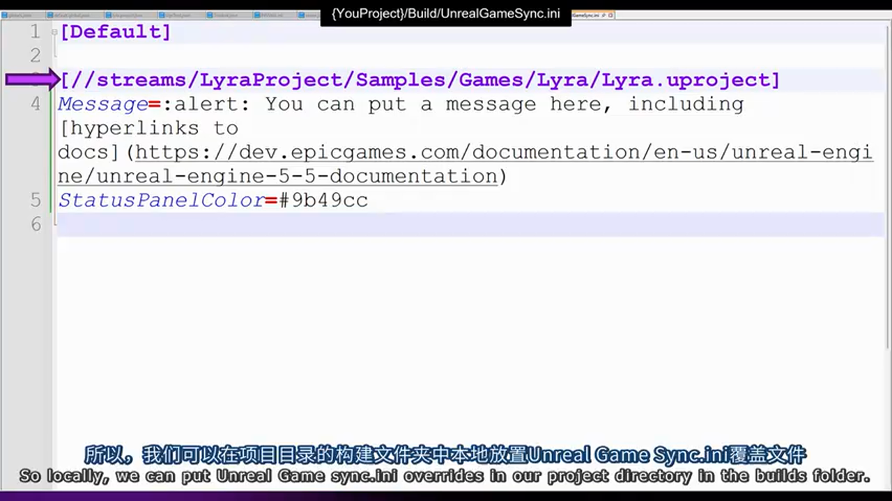

也可以针对特定 Stream 配置消息。在项目的 `Build/UnrealGameSync.ini` 中：

```ini
[//Lyra/Main]
Message=Main branch is currently broken. Use Dev branch instead.
MessageColor=Yellow
```


消息会在 UGS 顶部以醒目的横幅显示，支持超链接。

---

## 第十部分：预编译二进制 - 让美术和策划告别编译

### 问题背景

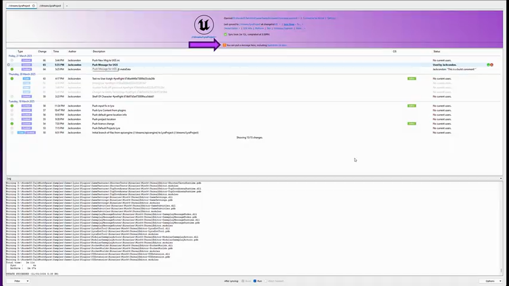

**典型矛盾**：


- **程序员**：需要引擎源码，方便调试和定制
- **美术/策划**：只想用编辑器，不关心源码，更不想等待 30 分钟的编译


**UGS 的解决方案**：

UGS 可以自动检测引擎代码变更，并在同步后触发本地编译。但这仍然需要每个人的机器都有完整的编译环境。


**更优雅的方案**：


让 Horde 在服务器上编译引擎，生成预编译二进制（Precompiled Binaries），然后团队成员直接下载。


这样，非程序员无需安装 Visual Studio，也无需等待编译。

### 启用预编译二进制下载


**在 UGS 中切换模式**：


打开 UGS 的 Options 页面，选择 "Use Precompiled Binaries"。


切换后，你会发现很多 CL 变成灰色，这表示这些 CL 没有可用的预编译二进制。


**生成预编译二进制**：


在 Horde Dashboard 中运行 "Incremental Build" Job。这个 Job 会：
1. 编译引擎的所有模块
2. 将二进制文件打包成 .zip
3. 上传到 Horde 的 Artifact 存储

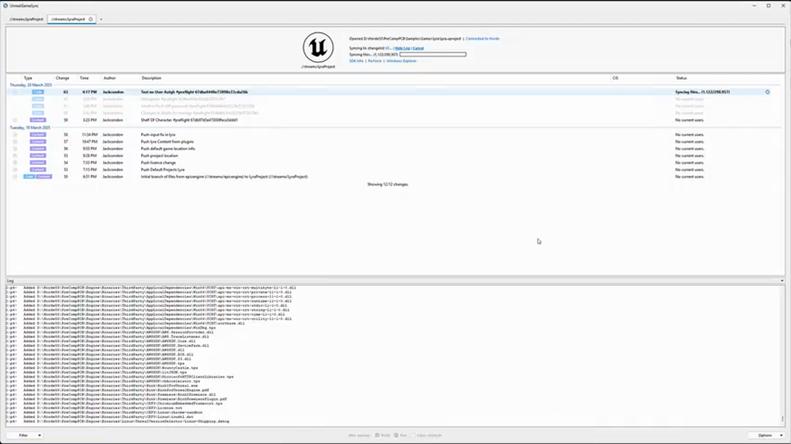

**自动化策略**：

建议为 "Incremental Build" Job 配置 Schedule，在每次引擎代码提交后自动触发。这样，团队成员在 UGS 中始终能找到最新的预编译二进制。

---

## 第十一部分：跨平台测试 - 从 PC 到移动设备的自动化

### 设备管理：Device Dashboard


**挑战场景**：


- 团队只有一台 iPhone 13，多个开发者需要轮流测试
- 每次测试都要手动打包、手动部署、手动运行


**Horde + Gauntlet 的解决方案**：


Gauntlet 是 UE 自带的设备测试框架，Horde 提供了设备管理和调度功能。


### 配置 Android 设备测试


**步骤 1：在 Horde 中注册设备**

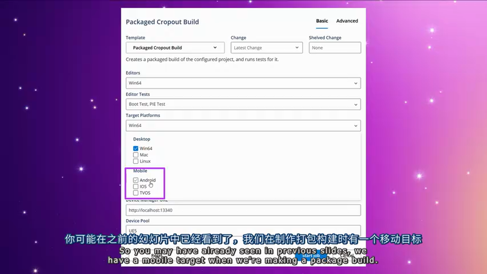

在 Horde Dashboard 的 Devices 页面，点击 "Add Device"：


```json
{
  "name": "Samsung Galaxy S21",
  "platform": "Android",
  "address": "192.168.1.100:5555"  // ADB 连接地址
}
```

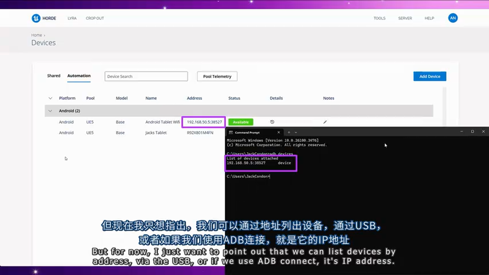

**步骤 2：指定负责的 Agent**

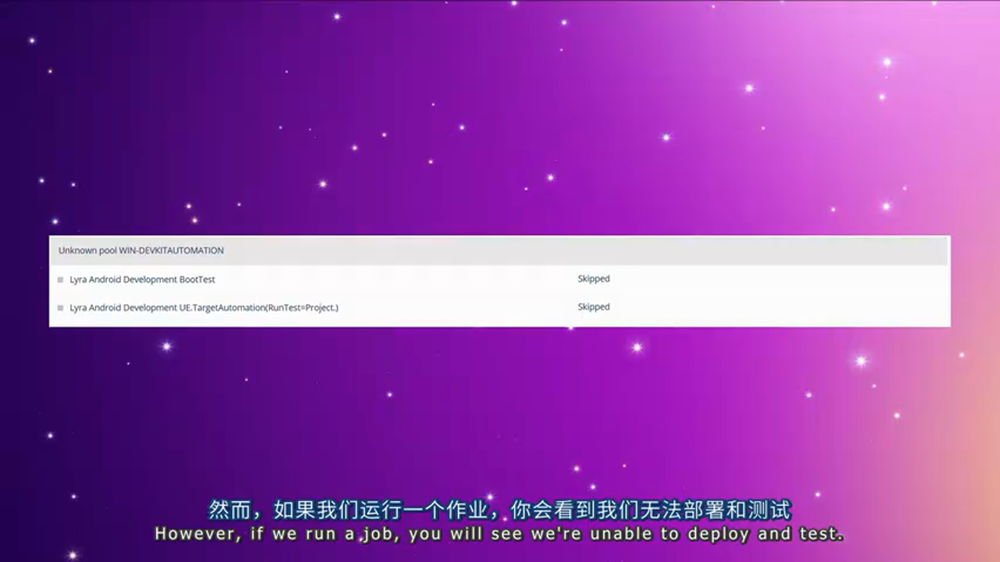

设备必须连接到某台 Agent 机器（通过 USB 或 ADB over Wi-Fi）。


**步骤 3：创建 DevKit Pool**

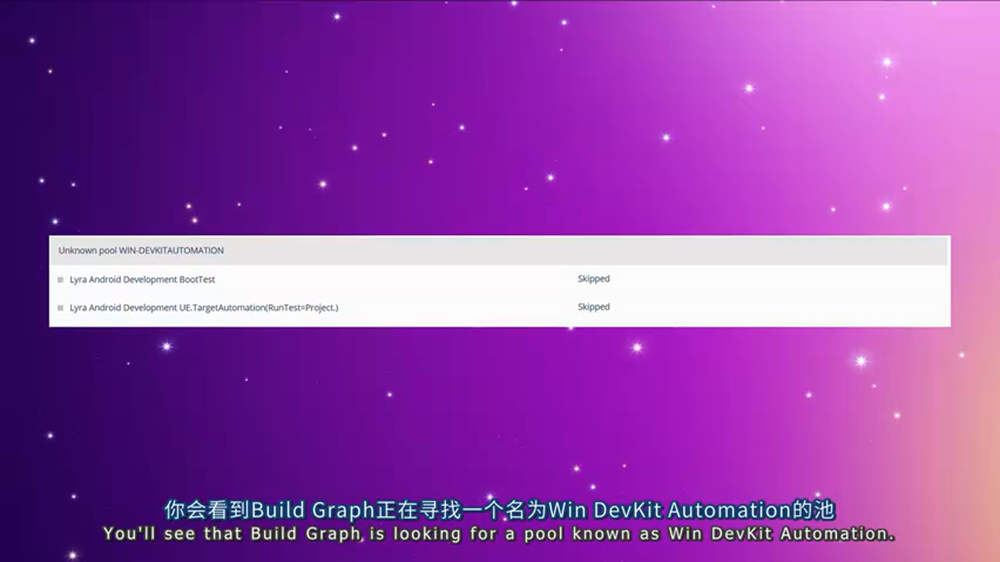

在 `Global.json` 中定义一个新的 Pool：

```json
{
  "compute": {
    "pools": [
      {
        "id": "win-devkit-automation",
        "name": "Windows DevKit Automation"
      }
    ]
  }
}
```


然后手动将负责设备的 Agent 加入这个 Pool。

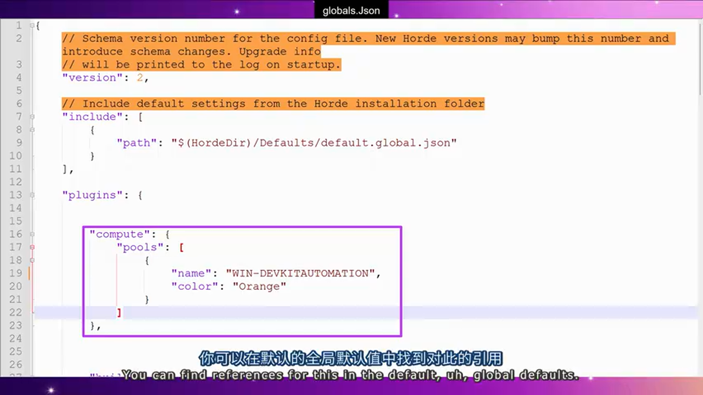


**步骤 4：运行测试 Job**


触发 "Package and Test" Job，选择 Android 平台。Horde 会：
1. 在编译 Agent 上打包 APK
2. 将 APK 传输到 DevKit Agent
3. 通过 ADB 安装到设备
4. 运行 Gauntlet 测试脚本
5. 收集测试结果并上传


**实际运行效果**：

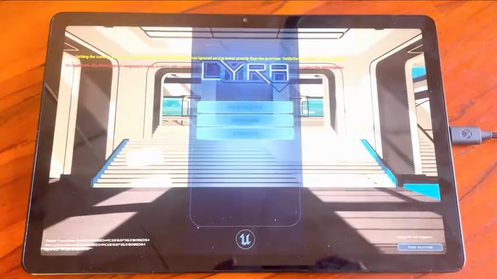

你会看到设备自动启动游戏，执行预定义的操作（如进入关卡、触发特定事件），然后自动退出。

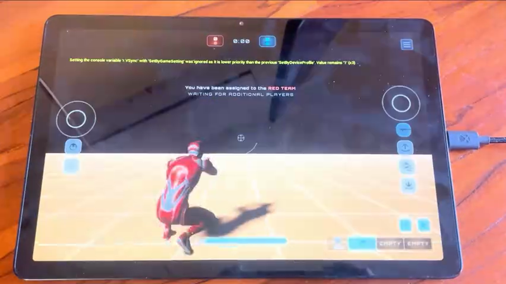

整个过程无需人工干预，测试报告会自动出现在 Horde Dashboard 中。

---

## 第十二部分：Blueprint 测试 - 让 TA 也能写自动化测试

### Functional Test 插件


**设计哲学**：


传统的自动化测试需要 C++ 代码，这对非程序员是个门槛。UE 的 Functional Test 插件允许用 Blueprint 编写测试用例。


**创建测试**：


1. 启用 "Functional Testing Editor" 插件
2. 创建一个继承自 `FunctionalTest` 的 Blueprint 类

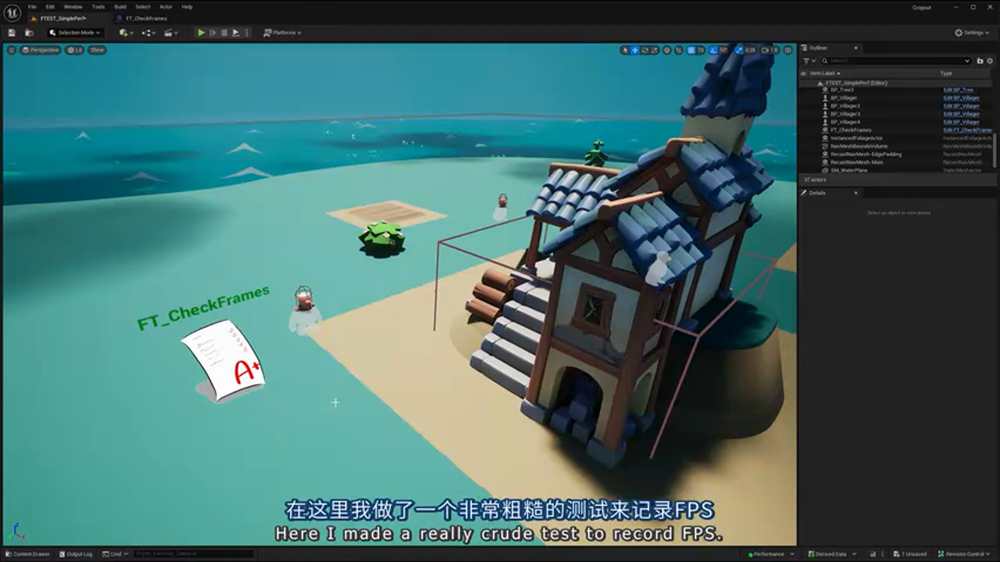

3. **命名规则**：必须以 `FTest_` 开头（如 `FTest_PerformanceCheck`），这样 Gauntlet 才能自动发现

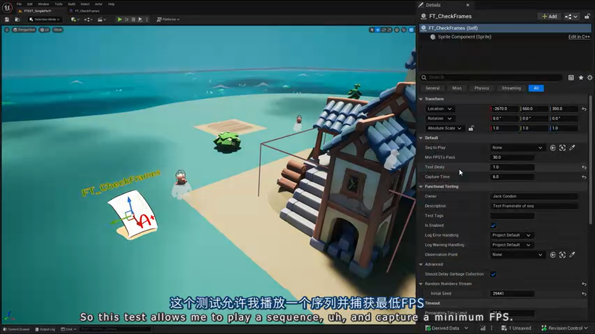

**示例：FPS 性能测试**


以下是一个简单的性能测试 Blueprint：
- 播放一个 Level Sequence
- 每帧记录 FPS
- 测试结束时，检查最低 FPS 是否达标
- 使用 `Finish Test` 节点报告成功/失败


**重要提示**：这只是演示概念，真正的性能测试应该使用 Unreal Insights 和 Gauntlet 的专用性能分析工具。

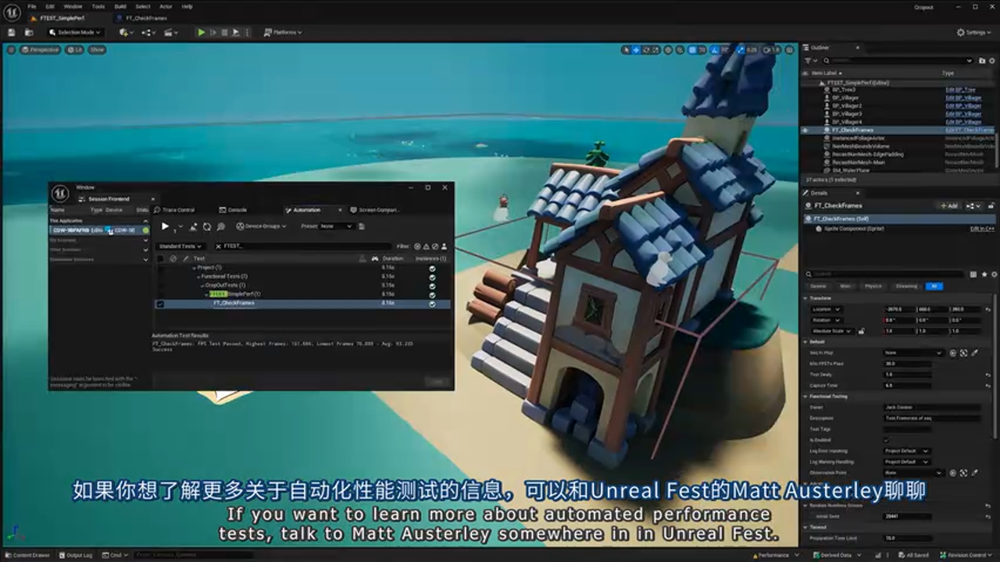

**本地验证**：


在编辑器中打开 Session Frontend，可以看到所有 `FTest_` 开头的测试。点击运行，立即查看结果。

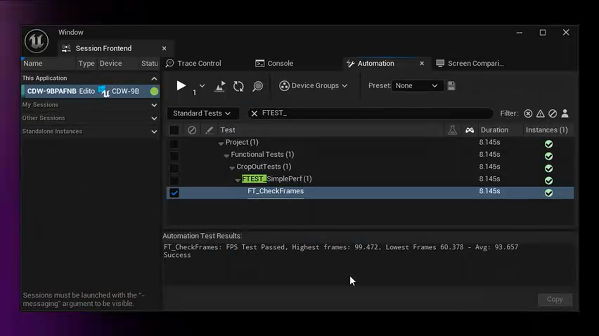

测试日志会输出到 Output Log，包括自定义的性能数据（如最高/最低/平均 FPS）。

### 在 Horde 中查看测试结果


**Automation Hub**：


Horde 的 Automation Hub 页面聚合了所有项目的测试结果。你可以快速看到哪些 CL 引入了测试失败。


**失败详情**：


点击失败的测试，可以看到完整的日志输出，包括 Blueprint 中打印的自定义消息。


例如，性能测试失败时，日志会显示：
```
[FTest_PerformanceCheck] Minimum FPS: 28 (Expected: 30)
[FTest_PerformanceCheck] Test FAILED
```

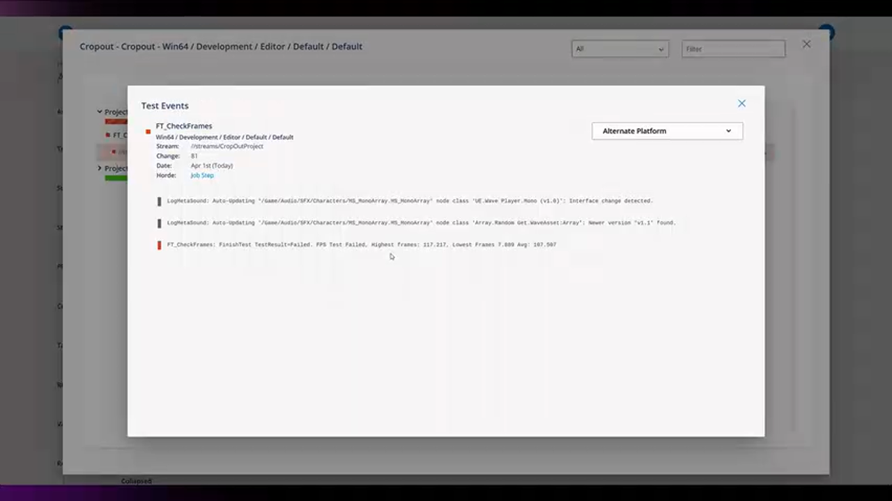

**趋势分析**：

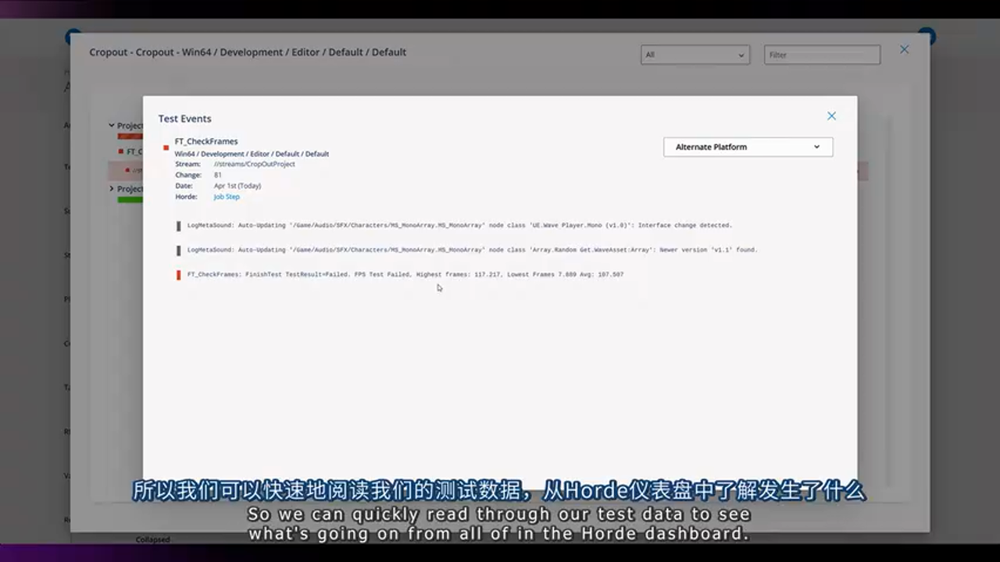

Horde 会保留历史测试数据，你可以生成趋势图，观察性能是否随版本迭代而下降。

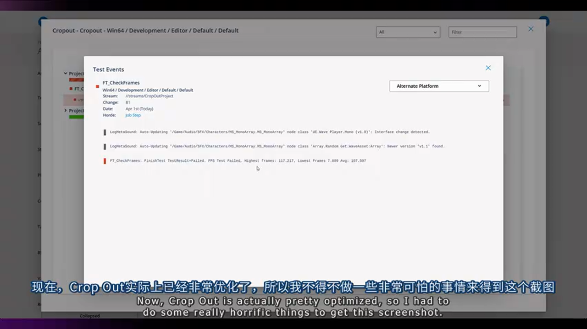

（注：为了演示失败场景，示例中故意在场景中放置了大量高多边形模型以降低 FPS）

---

## 第十三部分：高级主题 - Docker 部署与配置管理

### 为什么选择 Docker？

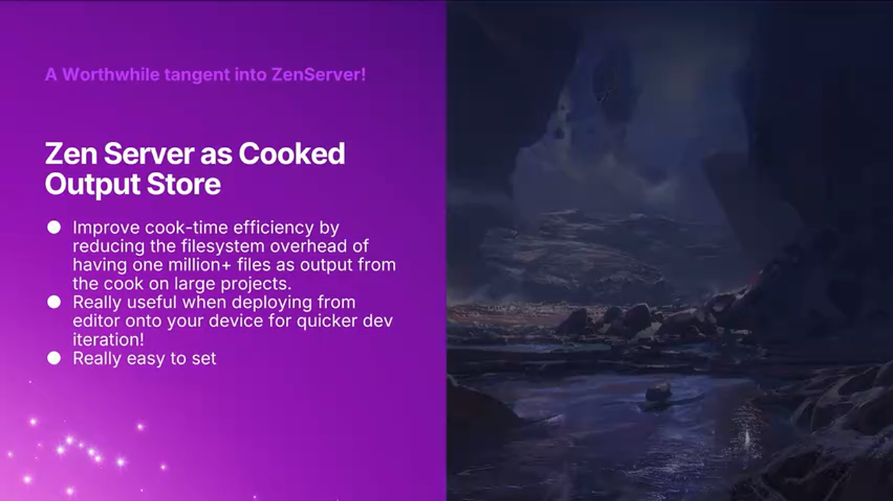

**跨平台需求**：


虽然 Windows MSI 安装简单，但很多团队需要在 Linux 服务器上部署 Horde（尤其是云环境）。

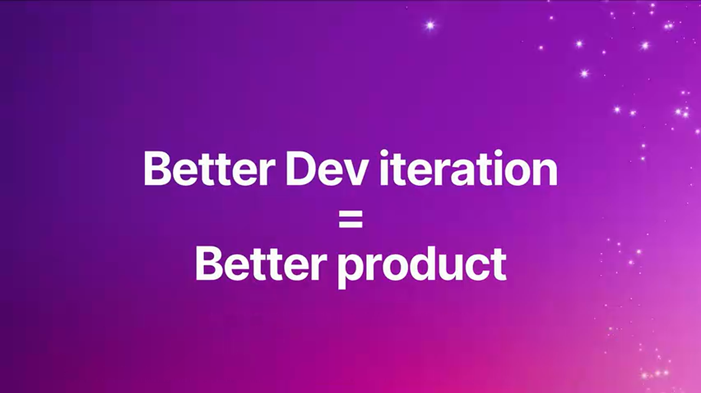

**一致性保证**：


Docker 容器确保 Horde Server、MongoDB、Redis 等依赖的版本完全一致，避免环境差异导致的问题。

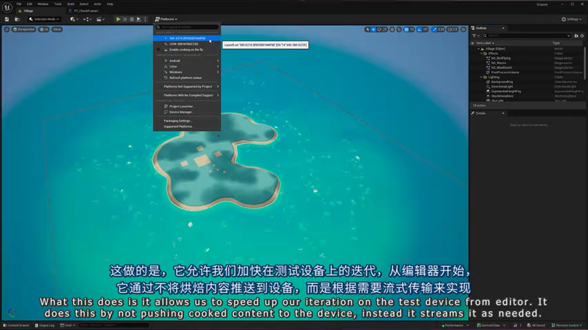

### 构建 Horde Docker 镜像

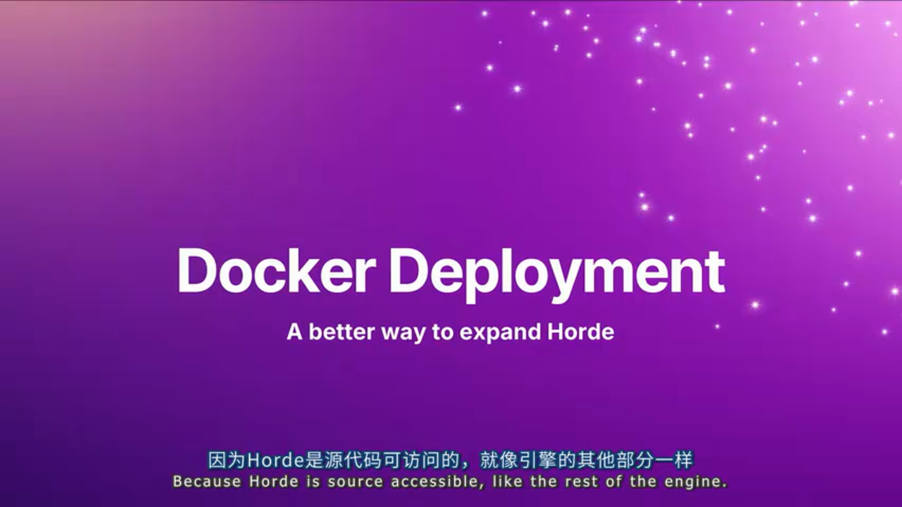

**使用 BuildGraph 脚本**：


UE 源码中包含 `Engine/Source/Programs/Horde/BuildHorde.xml`，这是一个专门用于构建 Horde 的 BuildGraph 脚本。


**关键节点**：


- `Build Horde Server`：编译 Horde 后端（.NET 应用）
- `Build Horde Dashboard`：编译前端（React 应用）
- `Build Horde Agent`：编译 Agent 程序
- `Build UGS`：编译 Unreal Game Sync


- `Build Bundled Docker Image`：将所有组件打包成一个 Docker 镜像


**执行构建**：

```bash
RunUAT.bat BuildGraph 
  -Script=Engine/Source/Programs/Horde/BuildHorde.xml 
  -Target="Build Bundled Docker Image" 
  -set:OutputDir=D:/HordeBuild
```

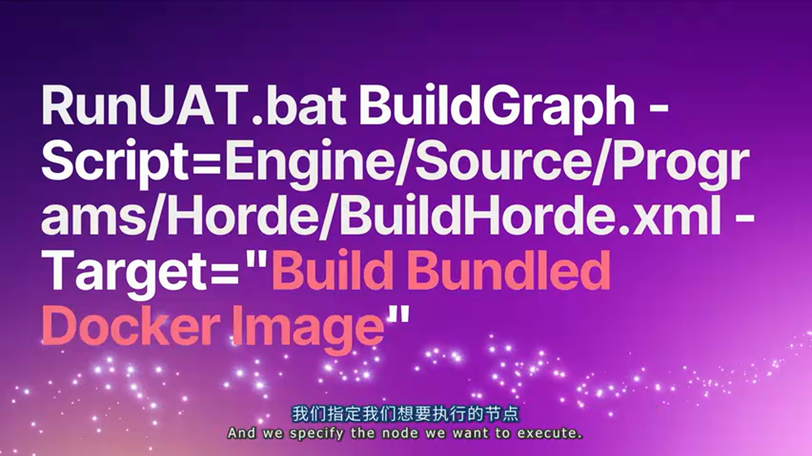

构建完成后，你会得到一个 Docker 镜像文件，可以部署到任何支持 Docker 的环境。

### 使用 Docker Compose 部署

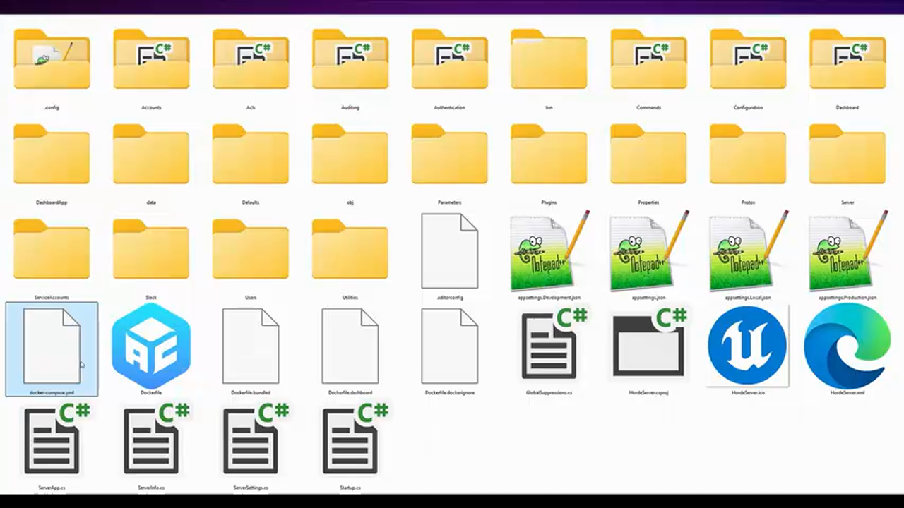

**依赖管理**：


Horde 依赖 MongoDB（存储配置和元数据）和 Redis（缓存和任务队列）。


**示例 docker-compose.yml**：

```yaml
version: '3.8'
services:
  horde-server:
    image: horde-server:latest
    ports:
      - "13340:13340"
    volumes:
      - ./data:/app/data
    depends_on:
      - mongo
      - redis
  
  mongo:
    image: mongo:6.0
    volumes:
      - mongo-data:/data/db
  
  redis:
    image: redis:7.0
    volumes:
      - redis-data:/data

volumes:
  mongo-data:
  redis-data:
```

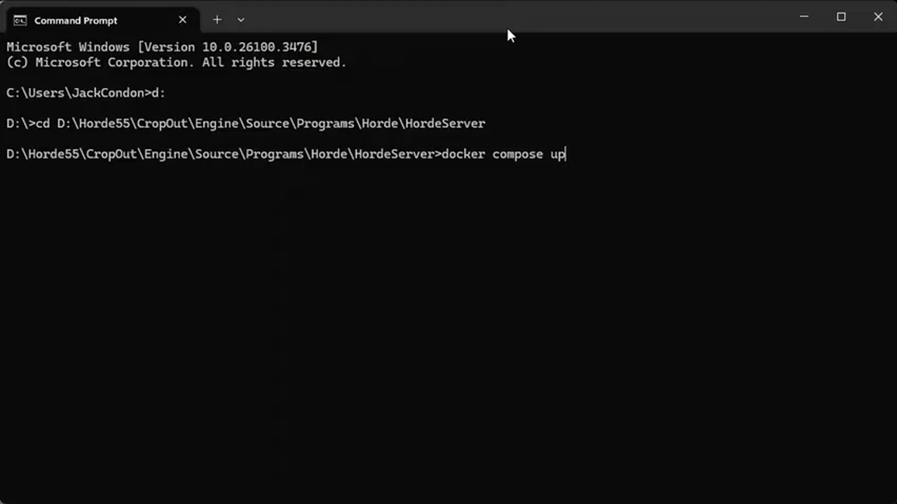

**启动服务**：

```bash
docker-compose up -d
```


**配置文件挂载**：


注意 `volumes` 部分将 `./data` 目录挂载到容器内。这样，你可以在宿主机上编辑 `Global.json` 等配置文件，Horde 会自动重新加载。


但在生产环境中，这种方式不够灵活。更好的做法是将配置存储在 Perforce 中。

### 配置文件的版本控制


**问题**：

如果 Horde Server 部署在云端，如何方便地更新配置？每次都要 SSH 登录服务器修改文件吗?


**解决方案：Perforce 托管配置**

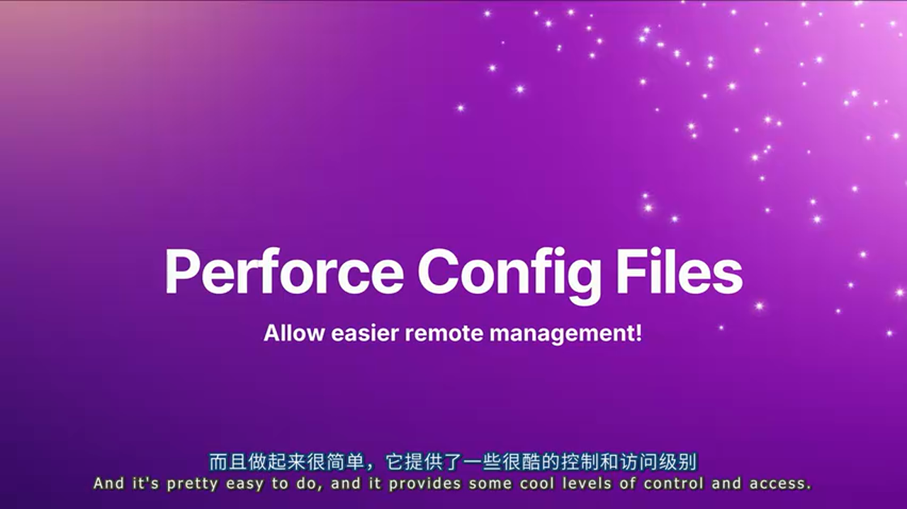

Horde 支持直接从 Perforce 读取配置文件。在 `Server.json` 中：

```json
{
  "globalConfig": "//HordeConfig/Main/Global.json",
  "perforce": {
    "userName": "horde-service",
    "password": "your-password"
  }
}
```

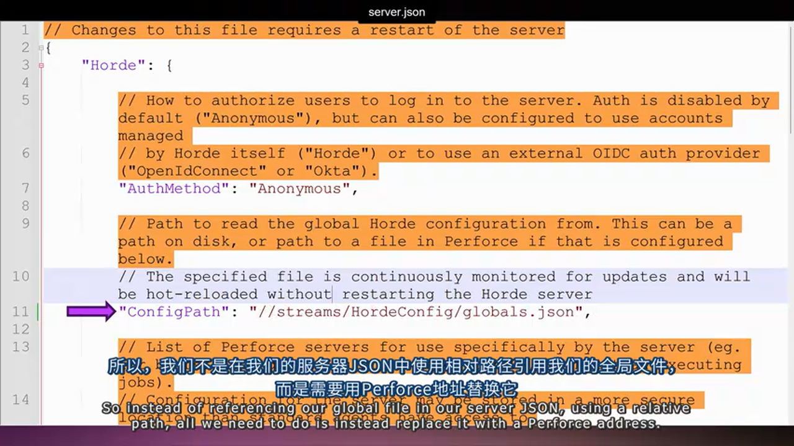

**优势**：


- **版本历史**：所有配置变更都有 Perforce 历史记录
- **Code Review**：配置修改可以走 Shelved CL + Pre-flight 流程


- **权限控制**：利用 Perforce 的 ACL 管理谁能修改哪些配置

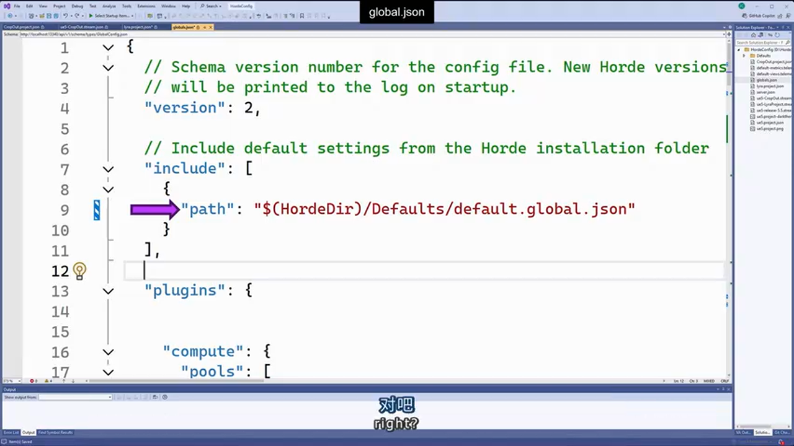

**路径解析规则**：


当配置文件从 Perforce 加载时，其中的相对路径会基于 Perforce 的工作空间解析。

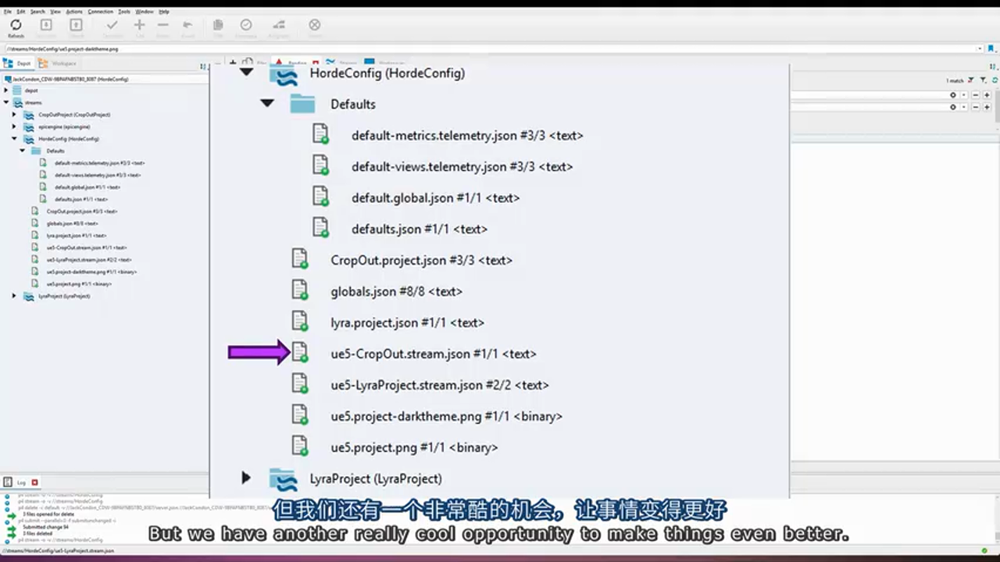

**最佳实践**：


- 将 `Global.json` 和 `Project.json` 存储在独立的 Perforce Stream（如 `//HordeConfig/Main`）

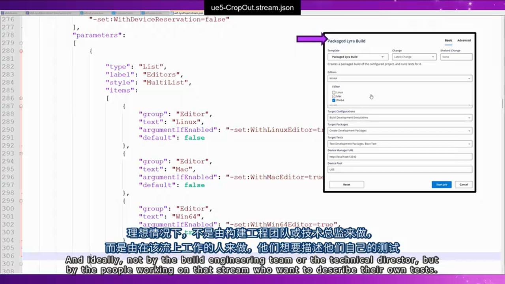

- 将 `Stream.json` 存储在各项目的代码库中（如 `//Lyra/Main/Build/Horde/Stream.json`）

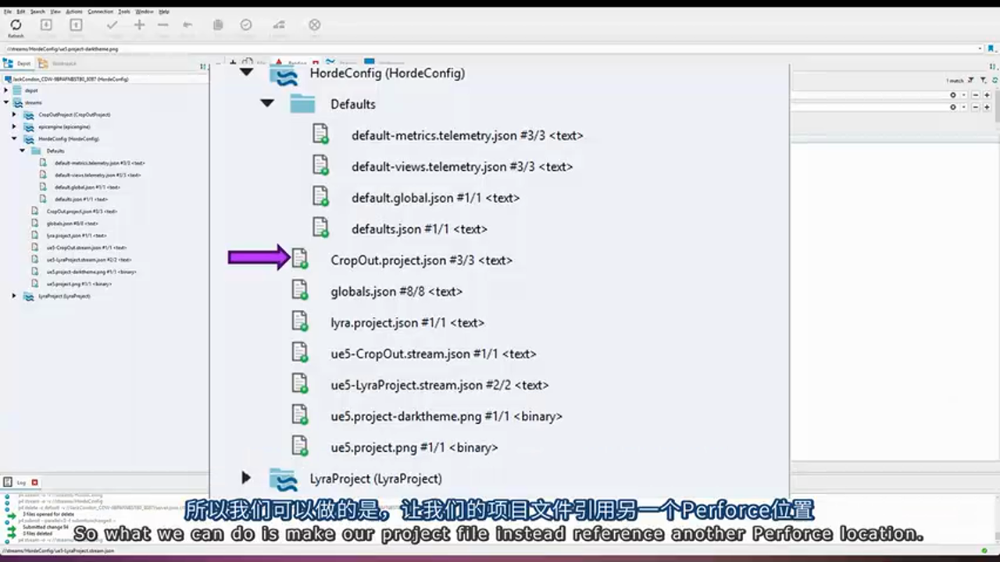

这样，项目团队可以自主管理自己的 Job 定义，而全局配置由 DevOps 团队集中管理。


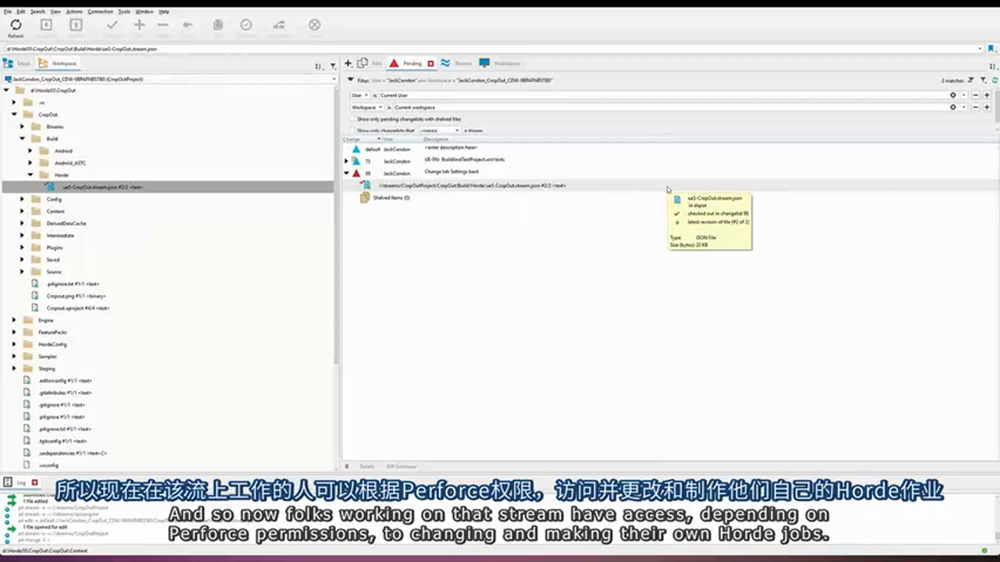

---

## 第十四部分：开发者体验优化

### JSON Schema 智能提示

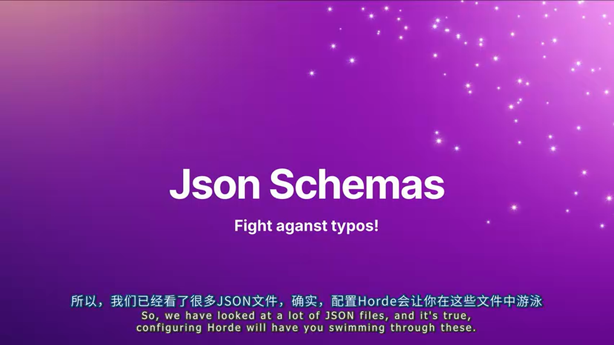

**痛点**：


Horde 的配置文件字段众多，手写 JSON 容易出错。


**解决方案：JSON Schema**


Horde Server 提供了完整的 JSON Schema 定义，可以在 Visual Studio Code 或 Visual Studio 中启用智能提示。


**配置方法（Visual Studio）**：


1. 打开 `工具 -> 选项 -> 文本编辑器 -> JSON -> Schema`
2. 添加 Schema Catalog URL：

```
http://your-horde-server:13340/api/v1/schema
```

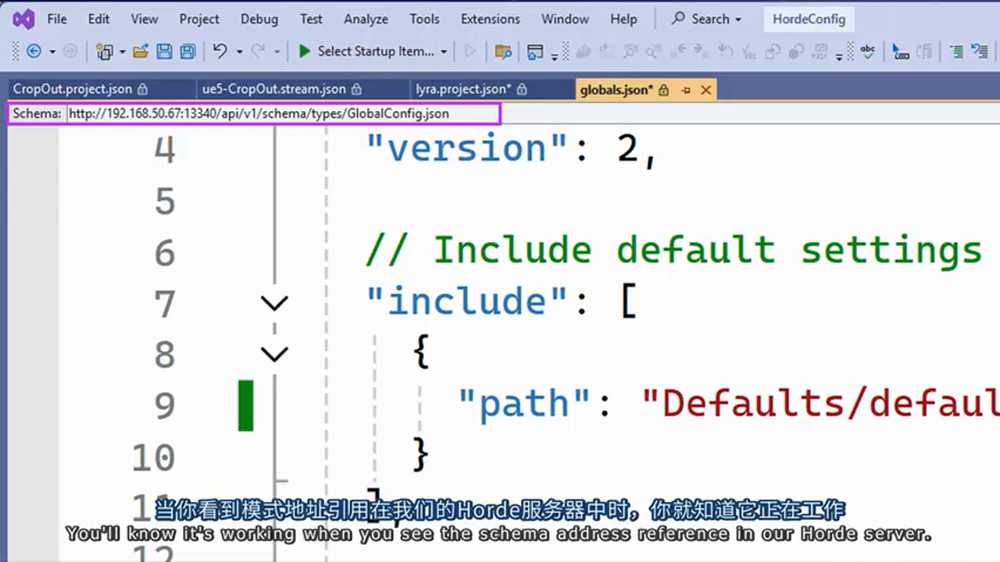

**效果**：

编辑 `Global.json` 时，输入 `"` 会自动弹出可用字段列表，鼠标悬停会显示字段说明。这极大降低了配置错误率。

### 用户权限与认证


**默认行为**：


Horde 初始安装时没有启用认证，任何人都可以访问和操作。这在本地测试时很方便，但生产环境必须启用权限控制。


**认证方式选择**：


Horde 支持两种认证方式：
- **OIDC（OpenID Connect）**：对接企业的 SSO 系统（如 Okta、Azure AD）
- **Horde 内置认证**：简单的用户名/密码系统


**启用内置认证**：

编辑 `Server.json`：

```json
{
  "authMethod": "Horde"
}
```


重启 Horde Server 后，首次访问会要求设置管理员密码。


**用户管理**：


在 Dashboard 的 User Accounts 页面，可以创建用户并分配到不同的组：


- **Admins**：完全控制权限
- **Developers**：可以启动 Job、查看日志
- **Viewers**：只读权限，适合 QA 和管理层


**权限粒度**：

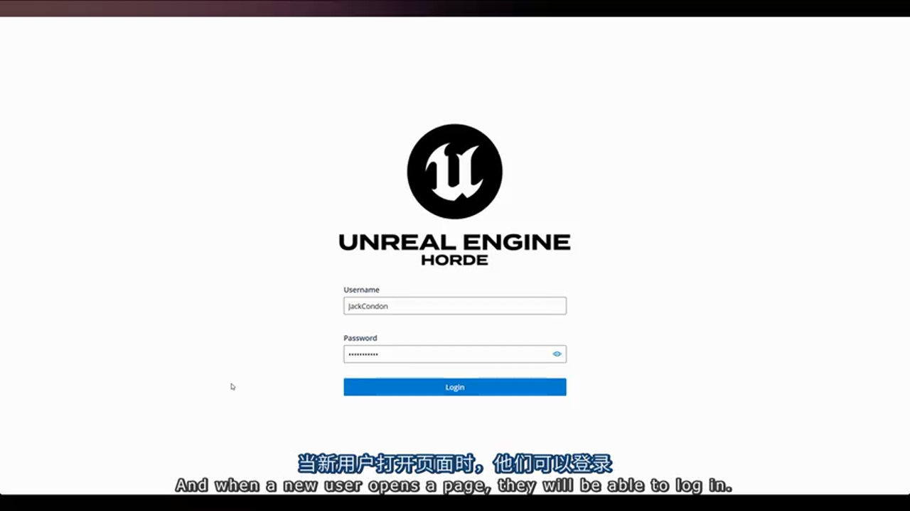

权限可以细化到 Project 和 Stream 级别。例如，ProjectA 的开发者无法启动 ProjectB 的 Job。


用户可以在 User Preferences 页面查看自己的权限列表，方便排查权限问题。

---

## 第十五部分：扩展与集成

### HTTP API：自动化的无限可能

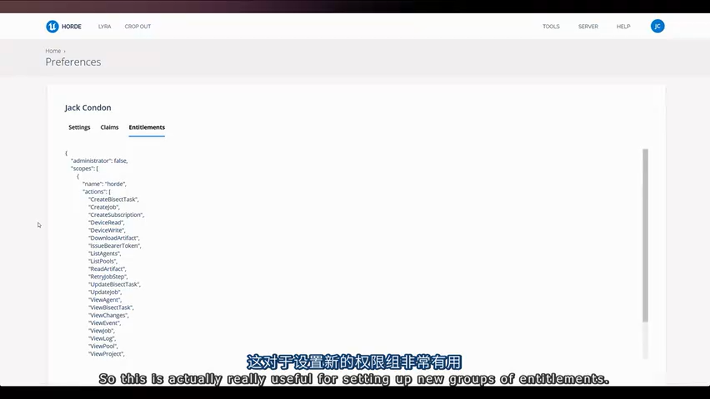

**Swagger 文档**：


Horde 提供了完整的 RESTful API，所有 Dashboard 的功能都可以通过 API 调用。


访问 `http://your-horde-server:13340/swagger` 可以查看完整的 API 文档，并在线测试。

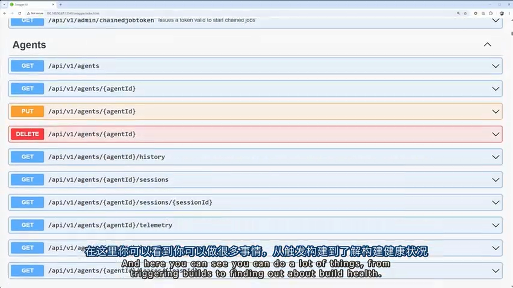

**示例：创建全局通知**

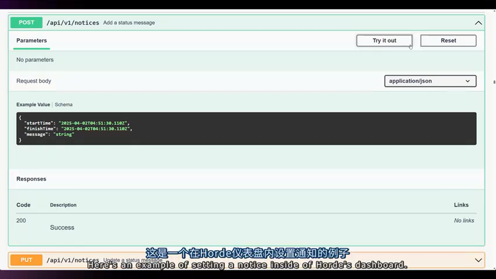

API Endpoint: `POST /api/v1/notices`

请求体：
```json
{
  "message": "Server maintenance scheduled at 2PM",
  "startTime": "2024-01-15T14:00:00Z",
  "finishTime": "2024-01-15T16:00:00Z"
}
```

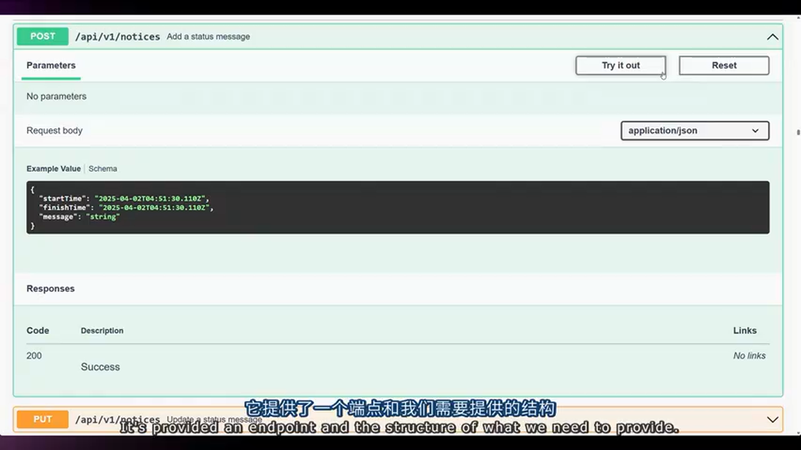

Swagger UI 允许你直接在浏览器中测试 API，无需编写代码。

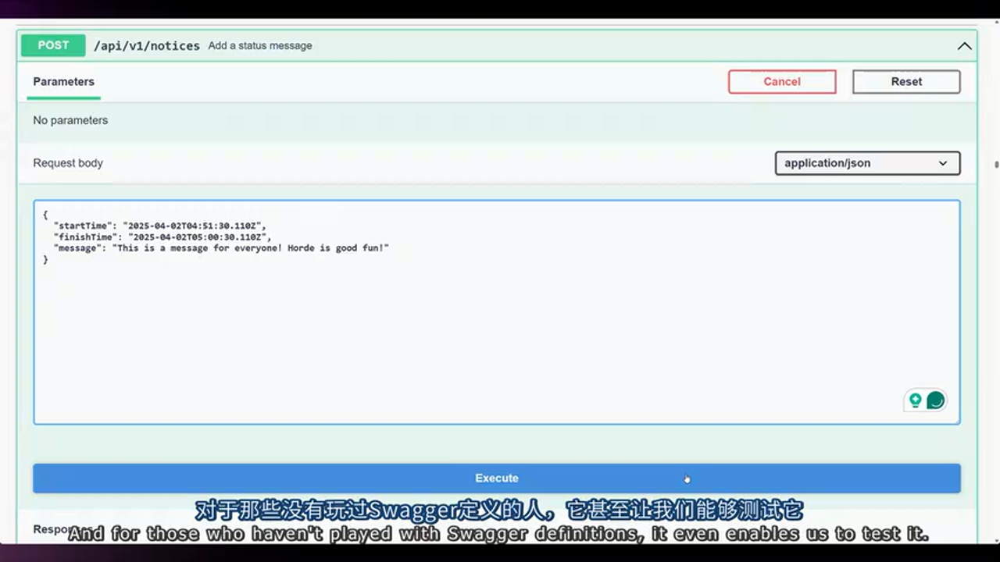

**实际应用场景**：


- **CI/CD 集成**：在 GitLab Pipeline 中调用 Horde API 触发构建
- **监控告警**：当 Horde Job 失败时，通过 API 查询详情并发送到 Slack
- **自定义 Dashboard**：为非技术人员制作简化版的构建状态页面


**在 UE Editor 中集成 Horde**：


示例：创建一个 Editor Utility Widget，显示当前项目的构建状态。开发者无需离开编辑器，就能知道主干是否健康。

### Slack 集成

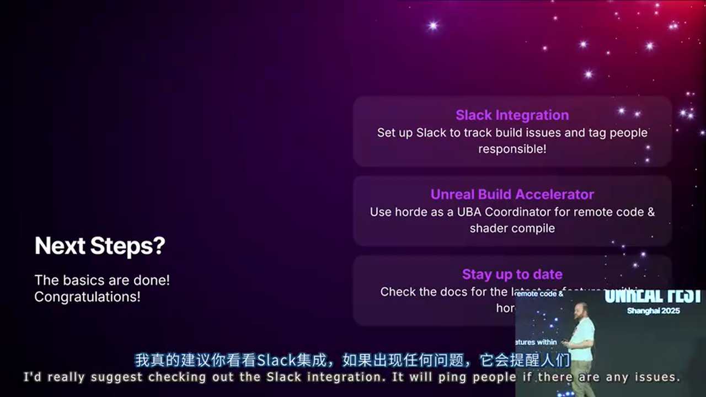

**通知机制**：

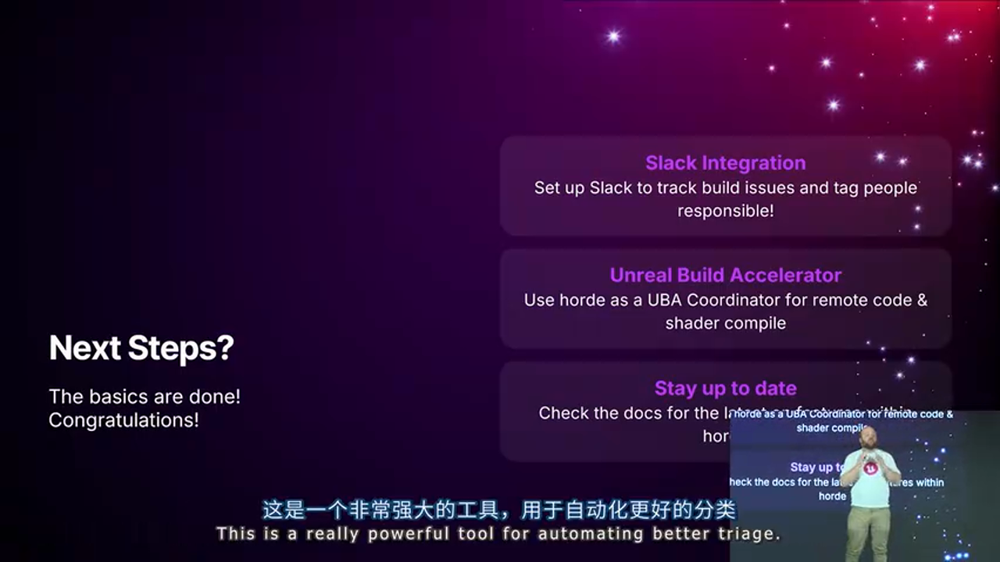

Horde 内置 Slack 集成，可以在构建失败时自动 @ 相关开发者。

配置方法：
1. 在 Slack 中创建 Incoming Webhook
2. 在 `Global.json` 中配置：

```json
{
  "notifications": {
    "slack": {
      "webhookUrl": "https://hooks.slack.com/services/YOUR/WEBHOOK/URL",
      "channel": "#build-alerts"
    }
  }
}
```

3. 在 Job 模板中启用通知：

```json
{
  "templates": [
    {
      "id": "main-build",
      "notifications": {
        "onFailure": ["slack"]
      }
    }
  ]
}
```

当构建失败时，Slack 会收到包含 Job 链接、失败原因、责任人（基于 Perforce 提交记录）的消息。

### UBA 与 Zen Server：编译加速的未来


**UBA（Unreal Build Accelerator）**：


Horde 可以作为 UBA 的协调器，将本地编译任务分发到远程 Agent，实现分布式编译。这类似于 IncrediBuild，但完全免费且深度集成 UE。


**Zen Server 作为 Cooked Output Store**：


在移动端开发时，每次迭代都要重新 Cook 和部署几 GB 的资源。启用 Zen Server 后：


- 设备上只部署一个小的配置文件（指向 Zen Server 的 IP）
- 游戏运行时按需从 Zen Server 流式加载资源


这将部署时间从 5 分钟缩短到 10 秒，极大提升移动端迭代速度。

---

## 第十六部分：Studio Telemetry - 数据驱动的 DevOps 决策

### 为什么需要遥测数据？


**盲目优化的问题**：


很多团队在投入 DevOps 工具时，不知道应该优先解决哪个痛点。是编译慢？还是 DDC 命中率低？还是编辑器启动慢？


**Studio Telemetry 插件**：

这是 UE 内置的遥测系统，可以自动收集开发者的工作数据，例如：
- 编辑器启动时间
- 编译耗时
- DDC 命中率
- 崩溃频率
- 资源加载时间


数据会上传到 Horde，并在 Dashboard 中生成可视化报表。

### 配置 Telemetry


**步骤 1：启用插件**

在项目的 `DefaultEngine.ini` 中：

```ini
[StudioTelemetry]
Enabled=true
ServerUrl=http://your-horde-server:13340
```


**步骤 2：配置 Dashboard 视图**

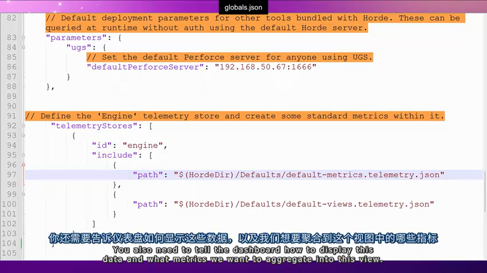

在 `Global.json` 中定义要展示的指标：

```json
{
  "telemetry": {
    "stores": [
      {
        "id": "editor-startup",
        "metrics": [
          {
            "name": "EditorStartupTime",
            "aggregation": "Average"
          }
        ]
      }
    ],
    "views": [
      {
        "id": "dev-experience",
        "name": "Developer Experience",
        "charts": [
          {
            "title": "Editor Startup Time (7 Days)",
            "metric": "EditorStartupTime"
          }
        ]
      }
    ]
  }
}
```


Horde 提供了丰富的示例配置，涵盖常见的性能指标。

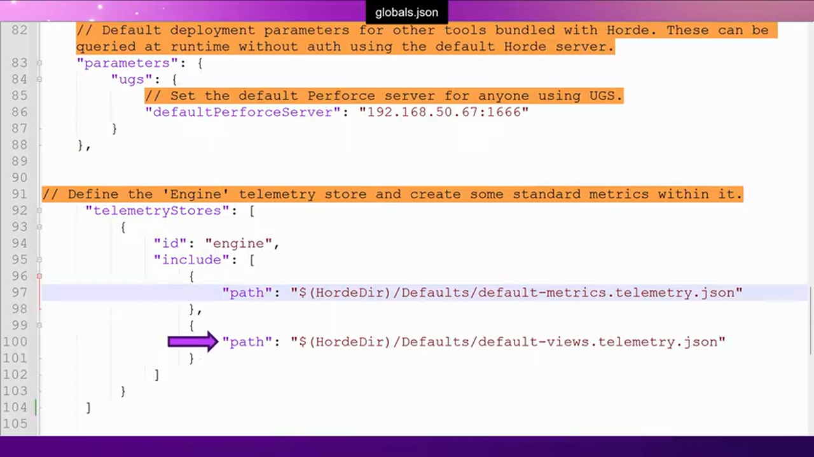

**步骤 3：查看报表**

在 Dashboard 的 Telemetry 页面，你可以看到：
- 团队平均编辑器启动时间的趋势
- DDC 命中率是否因为服务器问题下降
- 哪些开发者的机器配置明显低于团队平均水平

这些数据可以指导你优先投入资源解决最影响效率的问题。

---

## 第十七部分：实战总结与最佳实践

### 方案对比：Horde vs 传统 CICD

> **方案 A：Horde**
> - 🟢 **优势**：
>   - 开箱即用的 UE 集成（UAT、Gauntlet、UGS）
>   - 深度绑定 BuildGraph，任务定义与调度解耦
>   - 预编译二进制、设备管理等游戏开发特有功能
>   - Epic 内部实战验证，稳定性有保障
> - 🔴 **劣势**：
>   - 强依赖 Perforce（Git 支持需要额外工作）
>   - 社区生态不如 Jenkins/GitLab CI 成熟
>   - 学习曲线较陡（需理解 BuildGraph）
> - 🎯 **适用场景**：
>   - 使用 Perforce 的 UE 项目
>   - 需要多平台自动化测试
>   - 团队规模 > 10 人
>
> **方案 B：Jenkins + 自定义脚本**
> - 🟢 **优势**：
>   - 灵活性极高，可以集成任何工具
>   - 丰富的插件生态
>   - 社区支持强大
> - 🔴 **劣势**：
>   - 需要从零配置 UE 相关的所有流程
>   - 缺少 UGS、预编译二进制等开箱即用功能
>   - 维护成本高（需要专人负责）
> - 🎯 **适用场景**：
>   - 使用 Git 且不打算切换到 Perforce
>   - 团队有专职 DevOps 工程师
>   - 需要集成非 UE 的构建流程（如后端服务）

### 避坑指南

**坑 1：Agent 的 Service 模式无法运行 GUI 测试**

- **现象**：Job 卡在"等待 Agent"，或者测试步骤被跳过
- **原因**：Windows Service 无法启动 UE Editor 或打包后的游戏
- **解决**：将测试 Agent 切换到 User Mode，并确保用户保持登录状态

**坑 2：BuildGraph 脚本路径错误**

- **现象**：Job 启动失败，提示找不到 `.xml` 文件
- **原因**：Horde 配置中的路径是相对于 Perforce Workspace 的，不是相对于本地磁盘
- **解决**：使用 Perforce 路径格式（如 `//UE5/Main/Engine/Build/Graph/BuildAndTestProject.xml`）

**坑 3：预编译二进制版本不匹配**

- **现象**：UGS 下载了预编译二进制，但编辑器启动失败
- **原因**：Incremental Build Job 使用的引擎版本与当前 Stream 不一致
- **解决**：确保 Incremental Build 的 Schedule 配置了正确的 Stream 过滤规则

**坑 4：设备测试失败但日志不清晰**

- **现象**：Gauntlet 测试报告显示失败，但看不到具体错误
- **原因**：设备日志没有正确上传到 Horde
- **解决**：在 BuildGraph 脚本中添加 `<Property Name="GauntletLogDir" Value="$(RootDir)/Logs" />`，确保日志被标记为 Artifact

**坑 5：配置修改不生效**

- **现象**：修改了 `Global.json`，但 Dashboard 没有变化
- **原因**：Horde 有配置缓存机制
- **解决**：在 Dashboard 的 Settings 页面点击 "Reload Configuration"，或重启 Horde Server

### 最佳实践清单

✅ **配置管理**
- 将 `Global.json` 和 `Project.json` 存储在独立的 Perforce Stream
- 将 `Stream.json` 存储在各项目的代码库中
- 使用 JSON Schema 启用智能提示
- 定期备份 MongoDB 数据（包含 Job 历史和 Telemetry 数据）

✅ **Agent 规划**
- 编译 Agent：高 CPU 核心数（16+），大内存（64GB+），SSD
- 测试 Agent：独立显卡，保持用户登录状态
- DevKit Agent：物理连接测试设备，稳定的网络
- 使用 Pool 标签精细控制任务分配

✅ **Job 设计**
- 优先使用引擎自带的 `BuildAndTestProject.xml`，避免重复造轮子
- 为不同场景创建多个 Job 模板（快速验证 vs 完整测试）
- 配置合理的 Schedule，避免资源浪费
- 使用 Pre-flight 作为代码合入的强制门禁

✅ **团队协作**
- 为非程序员启用预编译二进制下载
- 使用 UGS 的消息通知功能同步团队状态
- 配置 Slack 集成，及时通知构建失败
- 定期查看 Telemetry 数据，识别效率瓶颈

✅ **安全与权限**
- 生产环境必须启用认证
- 使用 Perforce ACL 控制配置文件的修改权限
- 为不同角色创建专用账号（如 `horde-service`、`build-agent`）
- 定期审计 Admin 权限的使用

---

## 结语

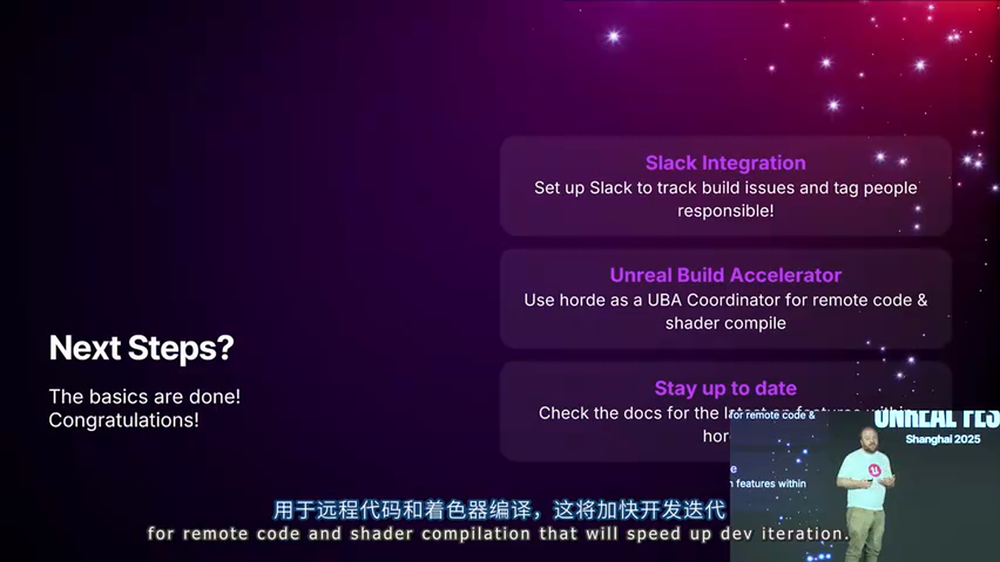

**Horde 的核心价值**：

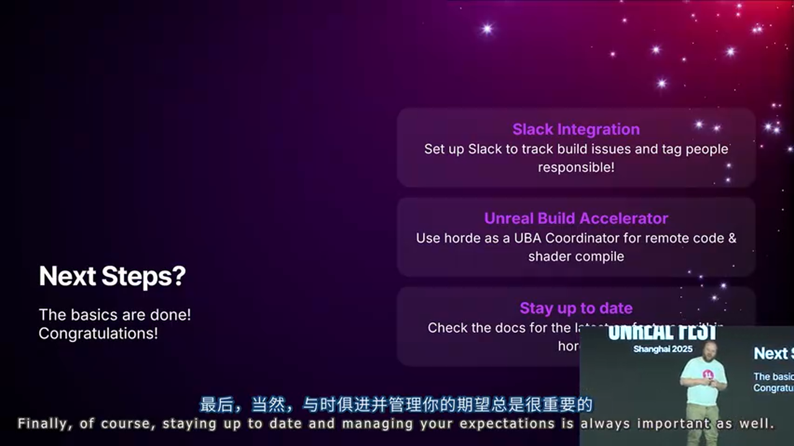

Horde 不仅仅是一个构建工具，它代表了 Epic Games 在大规模游戏开发中积累的 DevOps 最佳实践。通过将 CICD、版本控制、测试自动化、遥测分析整合到一个平台，Horde 帮助团队：
- **缩短反馈周期**：从提交到发现问题，从数小时降到数分钟
- **提升代码质量**：Pre-flight 机制强制执行测试门禁
- **优化资源利用**：预编译二进制、分布式编译避免重复劳动
- **数据驱动决策**：Telemetry 数据指导 DevOps 投入方向

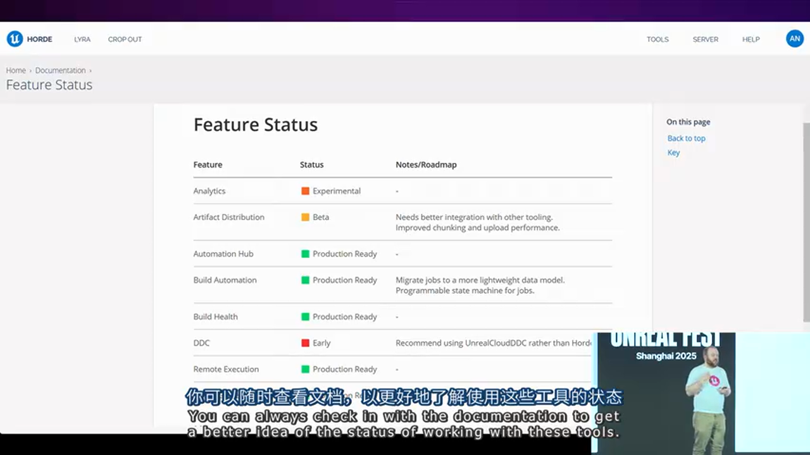

**持续学习资源**：


- **官方文档**：Horde Dashboard 内置的文档会随版本更新
- **GitHub Issues**：https://github.com/EpicGames/UnrealEngine （需要 Epic 账号）
- **Unreal Slackers 社区**：Discord 服务器中有 #horde 频道
- **GDC Talks**：搜索 "Epic Games Build Infrastructure" 可以找到相关演讲


**下一步行动**：

如果你的团队正在考虑引入 Horde，建议按以下步骤推进：
1. **概念验证（1 周）**：在本地安装 Horde，配置一个简单的编译 Job
2. **小规模试点（2-4 周）**：选择一个非关键项目，配置完整的 CICD 流程
3. **团队培训（1 周）**：为开发者讲解 UGS、Pre-flight 等工具的使用
4. **全面推广（1-2 月）**：逐步将所有项目迁移到 Horde，优化 Agent 配置
5. **持续优化**：基于 Telemetry 数据，不断调整 Schedule 和测试策略


感谢阅读这篇长文！希望它能帮助你理解 Horde 的设计哲学，并在实际项目中发挥价值。如果有任何问题，欢迎在 UE5 技术交流群中讨论。

---

**关于作者**：本文基于 Jack Condon（Epic Games 开发者关系资深工程师）在 UFSH2025 上的演讲整理而成。Jack 在 Epic 负责 Horde 的推广和技术支持，拥有丰富的大规模项目 DevOps 经验。

**版权声明**：本文内容来源于公开技术分享，截图版权归 Epic Games 所有。文章仅供学习交流使用，不得用于商业用途。


