# [UFSH2025]主旨演讲(官方字幕)
**Video Duration:** 59分17秒
**Subtitles:** 1162
**Subtitle Source:** Whisper Transcription
**Generated:** 2026-01-08 02:12:26
---
## Overview
This article is generated from a video presentation with embedded screenshots taken at key moments. Each section includes relevant visual content to illustrate the points discussed.
---
## Section 1 (00:00:00)
**Transcript:**
> 大家好
**Visual Reference:**

_Screenshot from 00:00:00_
---
## Section 2 (00:00:00)
**Transcript:**
> 大家好
**Visual Reference:**
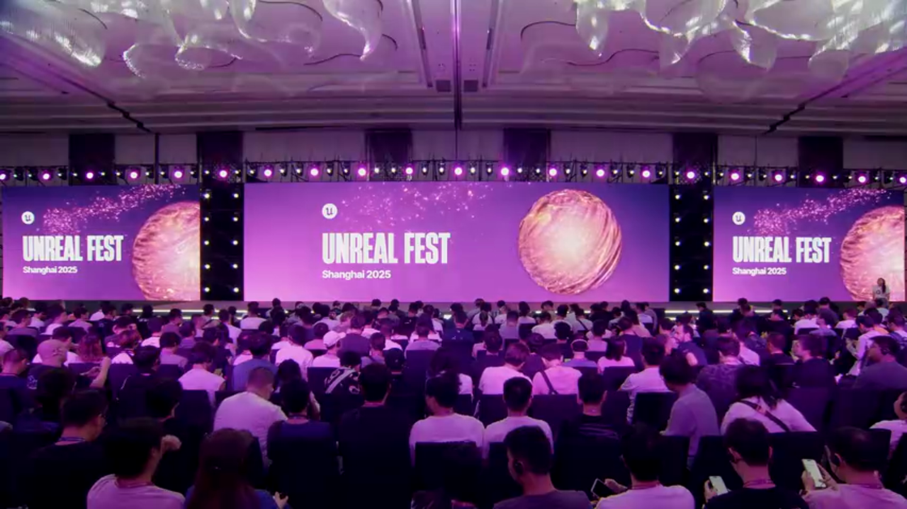
_Screenshot from 00:00:00_
---
## Section 3 (00:00:01)
**Transcript:**
> 现场的朋友们
**Visual Reference:**
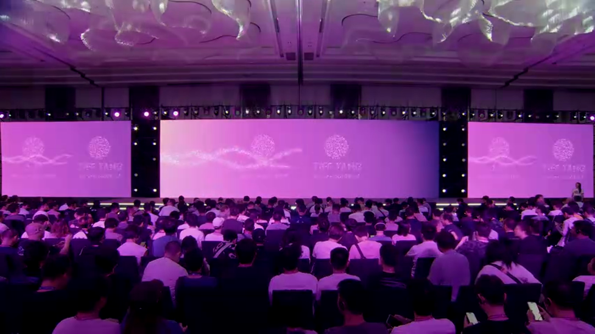
_Screenshot from 00:00:01_
---
## Section 4 (00:00:03)
**Transcript:**
> 以及直播间前的观众朋友们
**Visual Reference:**
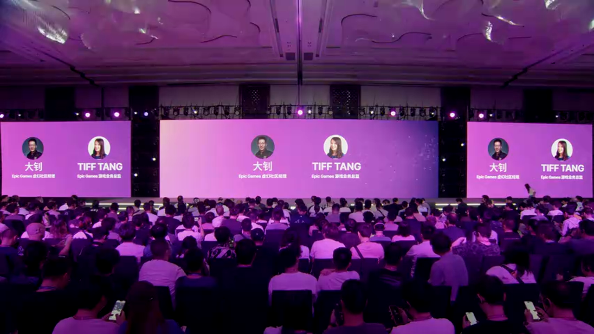
_Screenshot from 00:00:03_
---
## Section 5 (00:00:05)
**Transcript:**
> 欢迎大家来到
**Visual Reference:**

_Screenshot from 00:00:05_
---
## Section 6 (00:00:07)
**Transcript:**
> Rio Fass上海2025
**Visual Reference:**

_Screenshot from 00:00:07_
---
## Section 7 (00:00:08)
**Transcript:**
> 欢迎大家
**Visual Reference:**

_Screenshot from 00:00:08_
---
## Section 8 (00:00:11)
**Transcript:**
> 我是大招
**Visual Reference:**

_Screenshot from 00:00:11_
---
## Section 9 (00:00:12)
**Transcript:**
> 负责希望已经在这边
**Visual Reference:**

_Screenshot from 00:00:12_
---
## Section 10 (00:00:14)
**Transcript:**
> 在这边
**Visual Reference:**

_Screenshot from 00:00:14_
---
## Section 11 (00:00:15)
**Transcript:**
> 在这边
**Visual Reference:**
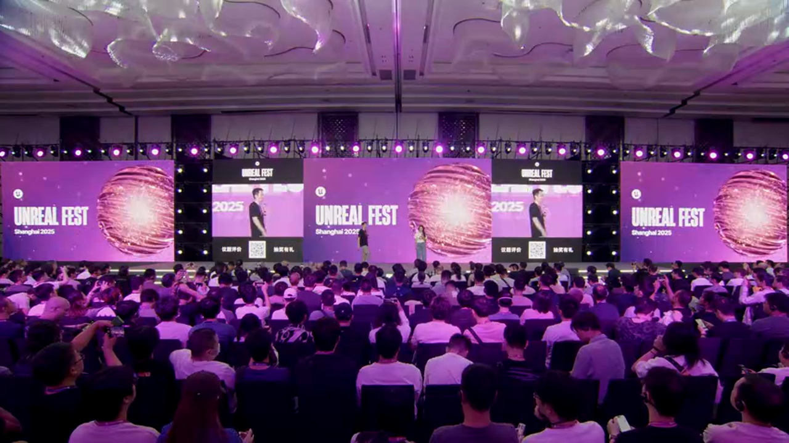
_Screenshot from 00:00:15_
---
## Section 12 (00:00:16)
**Transcript:**
> 在这边
**Visual Reference:**

_Screenshot from 00:00:16_
---
## Section 13 (00:00:17)
**Transcript:**
> 在这边
**Visual Reference:**
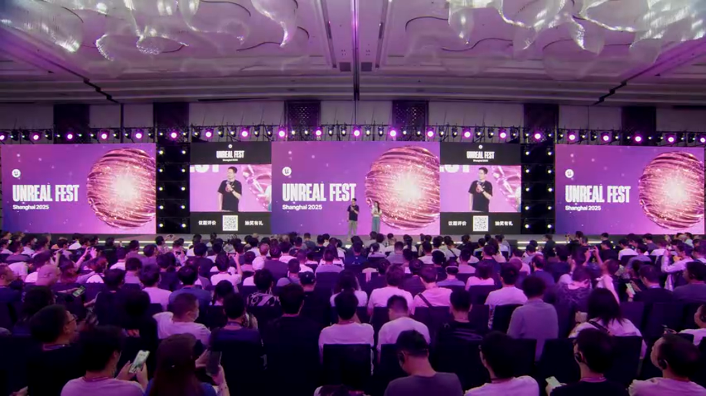
_Screenshot from 00:00:17_
---
## Section 14 (00:00:18)
**Transcript:**
> 在这边
**Visual Reference:**

_Screenshot from 00:00:18_
---
## Section 15 (00:00:19)
**Transcript:**
> 在这边
**Visual Reference:**

_Screenshot from 00:00:19_
---
## Section 16 (00:00:19)
**Transcript:**
> 在这边
**Visual Reference:**

_Screenshot from 00:00:19_
---
## Section 17 (00:00:20)
**Transcript:**
> 在这边
**Visual Reference:**

_Screenshot from 00:00:20_
---
## Section 18 (00:00:21)
**Transcript:**
> 在这边
**Visual Reference:**

_Screenshot from 00:00:21_
---
## Section 19 (00:00:22)
**Transcript:**
> 在这边
**Visual Reference:**

_Screenshot from 00:00:22_
---
## Section 20 (00:00:22)
**Transcript:**
> 在这边
**Visual Reference:**

_Screenshot from 00:00:22_
---
## Section 21 (00:00:23)
**Transcript:**
> 在这边
**Visual Reference:**

_Screenshot from 00:00:23_
---
## Section 22 (00:00:24)
**Transcript:**
> 在这边
**Visual Reference:**

_Screenshot from 00:00:24_
---
## Section 23 (00:00:24)
**Transcript:**
> 在这边
**Visual Reference:**

_Screenshot from 00:00:24_
---
## Section 24 (00:00:24)
**Transcript:**
> 在这边
**Visual Reference:**

_Screenshot from 00:00:24_
---
## Section 25 (00:00:25)
**Transcript:**
> 在这边
**Visual Reference:**

_Screenshot from 00:00:25_
---
## Section 26 (00:00:25)
**Transcript:**
> 在这边
**Visual Reference:**

_Screenshot from 00:00:25_
---
## Section 27 (00:00:26)
**Transcript:**
> 在这边
**Visual Reference:**

_Screenshot from 00:00:26_
---
## Section 28 (00:00:27)
**Transcript:**
> 在这边
**Visual Reference:**

_Screenshot from 00:00:27_
---
## Section 29 (00:00:28)
**Transcript:**
> 在这边
**Visual Reference:**

_Screenshot from 00:00:28_
---
## Section 30 (00:00:28)
**Transcript:**
> 在这边
**Visual Reference:**

_Screenshot from 00:00:28_
---
## Section 31 (00:00:29)
**Transcript:**
> 在这边
**Visual Reference:**

_Screenshot from 00:00:29_
---
## Section 32 (00:00:29)
**Transcript:**
> 在中国的市场和社区
**Visual Reference:**

_Screenshot from 00:00:29_
---
## Section 33 (00:00:31)
**Transcript:**
> 对于大家来说
**Visual Reference:**

_Screenshot from 00:00:31_
---
## Section 34 (00:00:32)
**Transcript:**
> 以及是老面孔了
**Visual Reference:**

_Screenshot from 00:00:32_
---
## Section 35 (00:00:34)
**Transcript:**
> 但今天戒指机会
**Visual Reference:**

_Screenshot from 00:00:34_
---
## Section 36 (00:00:35)
**Transcript:**
> 我要给大家介绍一位
**Visual Reference:**

_Screenshot from 00:00:35_
---
## Section 37 (00:00:36)
**Transcript:**
> 我们新同事
**Visual Reference:**

_Screenshot from 00:00:36_
---
## Section 38 (00:00:37)
**Transcript:**
> 就是站在我身边的地
**Visual Reference:**

_Screenshot from 00:00:37_
---
## Section 39 (00:00:39)
**Transcript:**
> 谢谢大家
**Visual Reference:**

_Screenshot from 00:00:39_
---
## Section 40 (00:00:40)
**Transcript:**
> 大家好
**Visual Reference:**

_Screenshot from 00:00:40_
---
## Section 41 (00:00:41)
**Transcript:**
> 我是Tiff
**Visual Reference:**

_Screenshot from 00:00:41_
---
## Section 42 (00:00:41)
**Transcript:**
> 最近刚刚加入Apic
**Visual Reference:**

_Screenshot from 00:00:41_
---
## Section 43 (00:00:43)
**Transcript:**
> 负责大中华地区的有谢舞
**Visual Reference:**

_Screenshot from 00:00:43_
---
## Section 44 (00:00:45)
**Transcript:**
> 今天也很激动看到
**Visual Reference:**

_Screenshot from 00:00:45_
---
## Section 45 (00:00:47)
**Transcript:**
> 这么多日期的Kawajuro
**Visual Reference:**

_Screenshot from 00:00:47_
---
## Section 46 (00:00:48)
**Transcript:**
> 集居一堂
**Visual Reference:**

_Screenshot from 00:00:48_
---
## Section 47 (00:00:49)
**Transcript:**
> 希望在这里
**Visual Reference:**

_Screenshot from 00:00:49_
---
## Section 48 (00:00:49)
**Transcript:**
> 可以认识到更多的朋友和伙伴们
**Visual Reference:**

_Screenshot from 00:00:49_
---
## Section 49 (00:00:52)
**Transcript:**
> 没错
**Visual Reference:**

_Screenshot from 00:00:52_
---
## Section 50 (00:00:53)
**Transcript:**
> 那么在正式内容开始之前
**Visual Reference:**

_Screenshot from 00:00:53_
---
## Section 51 (00:00:55)
**Transcript:**
> 我想花两分钟
**Visual Reference:**

_Screenshot from 00:00:55_
---
## Section 52 (00:00:56)
**Transcript:**
> 给大家简单的介绍一下
**Visual Reference:**

_Screenshot from 00:00:56_
---
## Section 53 (00:00:57)
**Transcript:**
> 本次大会的
**Visual Reference:**

_Screenshot from 00:00:57_
---
## Section 54 (00:00:58)
**Transcript:**
> 特别烂点
**Visual Reference:**

_Screenshot from 00:00:58_
---
## Section 55 (00:01:00)
**Transcript:**
> 首先
**Visual Reference:**

_Screenshot from 00:01:00_
---
## Section 56 (00:01:01)
**Transcript:**
> 感谢各位演讲嘉宾的支持
**Visual Reference:**

_Screenshot from 00:01:01_
---
## Section 57 (00:01:03)
**Transcript:**
> 为我们准备了
**Visual Reference:**

_Screenshot from 00:01:03_
---
## Section 58 (00:01:04)
**Transcript:**
> 干活慢慢的两天一程
**Visual Reference:**

_Screenshot from 00:01:04_
---
## Section 59 (00:01:06)
**Transcript:**
> 大家可以在公众号
**Visual Reference:**

_Screenshot from 00:01:06_
---
## Section 60 (00:01:07)
**Transcript:**
> 或者在外面的一程盘上面查看
**Visual Reference:**

_Screenshot from 00:01:07_
---
## Section 61 (00:01:10)
**Transcript:**
> 都往年一样
**Visual Reference:**

_Screenshot from 00:01:10_
---
## Section 62 (00:01:11)
**Transcript:**
> 大部分演讲的录播
**Visual Reference:**

_Screenshot from 00:01:11_
---
## Section 63 (00:01:12)
**Transcript:**
> 将会在活动结束之后
**Visual Reference:**

_Screenshot from 00:01:12_
---
## Section 64 (00:01:14)
**Transcript:**
> 大概是11架期之后
**Visual Reference:**

_Screenshot from 00:01:14_
---
## Section 65 (00:01:16)
**Transcript:**
> 为陆续的上场到
**Visual Reference:**

_Screenshot from 00:01:16_
---
## Section 66 (00:01:17)
**Transcript:**
> 陛下的虚荣疫情官方账户
**Visual Reference:**

_Screenshot from 00:01:17_
---
## Section 67 (00:01:19)
**Transcript:**
> 跟大家继续学习
**Visual Reference:**

_Screenshot from 00:01:19_
---
## Section 68 (00:01:21)
**Transcript:**
> 是的
**Visual Reference:**

_Screenshot from 00:01:21_
---
## Section 69 (00:01:22)
**Transcript:**
> 对于现场伙伴来说
**Visual Reference:**

_Screenshot from 00:01:22_
---
## Section 70 (00:01:23)
**Transcript:**
> 我们不仅希望大家可以听到
**Visual Reference:**

_Screenshot from 00:01:23_
---
## Section 71 (00:01:25)
**Transcript:**
> 最前一年的技术
**Visual Reference:**

_Screenshot from 00:01:25_
---
## Section 72 (00:01:26)
**Transcript:**
> 也可以亲身体验
**Visual Reference:**

_Screenshot from 00:01:26_
---
## Section 73 (00:01:27)
**Transcript:**
> 各个现场的活动环节
**Visual Reference:**

_Screenshot from 00:01:27_
---
## Section 74 (00:01:29)
**Transcript:**
> 价趣
**Visual Reference:**

_Screenshot from 00:01:29_
---
## Section 75 (00:01:30)
**Transcript:**
> 我们也想给大家
**Visual Reference:**

_Screenshot from 00:01:30_
---
## Section 76 (00:01:31)
**Transcript:**
> 很快流暖一下
**Visual Reference:**

_Screenshot from 00:01:31_
---
## Section 77 (00:01:32)
**Transcript:**
> 本次会场的活动亮脸
**Visual Reference:**

_Screenshot from 00:01:32_
---
## Section 78 (00:01:34)
**Transcript:**
> 首先是Deb Hub
**Visual Reference:**

_Screenshot from 00:01:34_
---
## Section 79 (00:01:36)
**Transcript:**
> 就在我们APP的展财的隔壁
**Visual Reference:**

_Screenshot from 00:01:36_
---
## Section 80 (00:01:38)
**Transcript:**
> 在这里你可以直接干
**Visual Reference:**

_Screenshot from 00:01:38_
---
## Section 81 (00:01:39)
**Transcript:**
> 我们APP的技术同事
**Visual Reference:**

_Screenshot from 00:01:39_
---
## Section 82 (00:01:41)
**Transcript:**
> 在我们面对面的交流
**Visual Reference:**

_Screenshot from 00:01:41_
---
## Section 83 (00:01:42)
**Transcript:**
> 讨论你们关心的技术问题
**Visual Reference:**

_Screenshot from 00:01:42_
---
## Section 84 (00:01:44)
**Transcript:**
> 是的
**Visual Reference:**

_Screenshot from 00:01:44_
---
## Section 85 (00:01:45)
**Transcript:**
> 这一次机会呢
**Visual Reference:**

_Screenshot from 00:01:45_
---
## Section 86 (00:01:45)
**Transcript:**
> 非常难得
**Visual Reference:**

_Screenshot from 00:01:45_
---
## Section 87 (00:01:46)
**Transcript:**
> 我们又来自全世界各地的APP的同事
**Visual Reference:**

_Screenshot from 00:01:46_
---
## Section 88 (00:01:49)
**Transcript:**
> 可以跟大家一起交流
**Visual Reference:**

_Screenshot from 00:01:49_
---
## Section 89 (00:01:51)
**Transcript:**
> 无论是工具
**Visual Reference:**

_Screenshot from 00:01:51_
---
## Section 90 (00:01:52)
**Transcript:**
> 工能还是你们对未来
**Visual Reference:**

_Screenshot from 00:01:52_
---
## Section 91 (00:01:53)
**Transcript:**
> 工能的那些想法
**Visual Reference:**

_Screenshot from 00:01:53_
---
## Section 92 (00:01:54)
**Transcript:**
> 欢迎大家来聊
**Visual Reference:**

_Screenshot from 00:01:54_
---
## Section 93 (00:01:58)
**Transcript:**
> 要个是希望世纪
**Visual Reference:**

_Screenshot from 00:01:58_
---
## Section 94 (00:01:59)
**Transcript:**
> 大家在签到了时候
**Visual Reference:**

_Screenshot from 00:01:59_
---
## Section 95 (00:02:00)
**Transcript:**
> 拿到的那个虚幻点
**Visual Reference:**

_Screenshot from 00:02:00_
---
## Section 96 (00:02:02)
**Transcript:**
> 可以在那边自己的对话
**Visual Reference:**

_Screenshot from 00:02:02_
---
## Section 97 (00:02:04)
**Transcript:**
> 周边离品
**Visual Reference:**

_Screenshot from 00:02:04_
---
## Section 98 (00:02:05)
**Transcript:**
> 要注意点数只有在这两天有效
**Visual Reference:**

_Screenshot from 00:02:05_
---
## Section 99 (00:02:07)
**Transcript:**
> 过期作费哦
**Visual Reference:**

_Screenshot from 00:02:07_
---
## Section 100 (00:02:09)
**Transcript:**
> 是的
**Visual Reference:**

_Screenshot from 00:02:09_
---
## Section 101 (00:02:09)
**Transcript:**
> 我们准备的非常多很有趣的周边
**Visual Reference:**

_Screenshot from 00:02:09_
---
## Section 102 (00:02:11)
**Transcript:**
> 比如大家喜欢的材质球
**Visual Reference:**

_Screenshot from 00:02:11_
---
## Section 103 (00:02:13)
**Transcript:**
> 或者是2025年线定背包
**Visual Reference:**

_Screenshot from 00:02:13_
---
## Section 104 (00:02:15)
**Transcript:**
> 大家记得去看看
**Visual Reference:**

_Screenshot from 00:02:15_
---
## Section 105 (00:02:17)
**Transcript:**
> 是不是有你特别喜欢的东西
**Visual Reference:**

_Screenshot from 00:02:17_
---
## Section 106 (00:02:18)
**Transcript:**
> 在那里哦
**Visual Reference:**

_Screenshot from 00:02:18_
---
## Section 107 (00:02:20)
**Transcript:**
> 第三个亮脸是互动的展贪
**Visual Reference:**
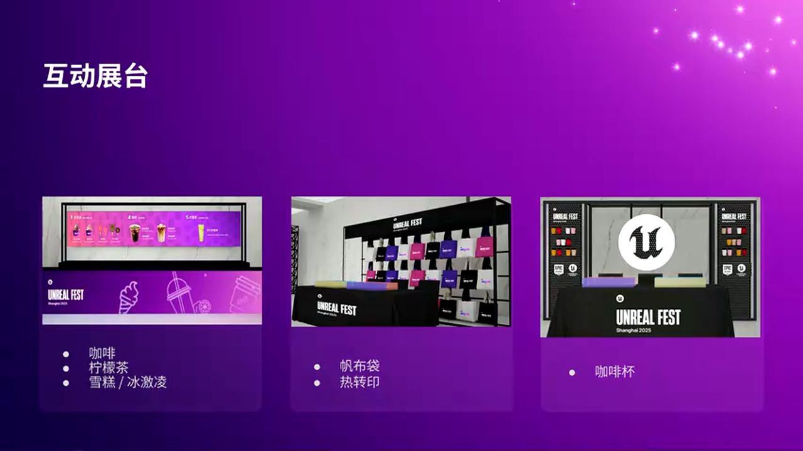
_Screenshot from 00:02:20_
---
## Section 108 (00:02:21)
**Transcript:**
> 没有希望的也没有关系
**Visual Reference:**

_Screenshot from 00:02:21_
---
## Section 109 (00:02:23)
**Transcript:**
> 大家可以免费在那边
**Visual Reference:**

_Screenshot from 00:02:23_
---
## Section 110 (00:02:24)
**Transcript:**
> 体验一些亲生的活动
**Visual Reference:**

_Screenshot from 00:02:24_
---
## Section 111 (00:02:26)
**Transcript:**
> 我们也给大家准备了
**Visual Reference:**

_Screenshot from 00:02:26_
---
## Section 112 (00:02:27)
**Transcript:**
> 咖啡你们查
**Visual Reference:**

_Screenshot from 00:02:27_
---
## Section 113 (00:02:28)
**Transcript:**
> 雪糕
**Visual Reference:**

_Screenshot from 00:02:28_
---
## Section 114 (00:02:29)
**Transcript:**
> 虚幻风格的雪糕
**Visual Reference:**

_Screenshot from 00:02:29_
---
## Section 115 (00:02:30)
**Transcript:**
> 都是免费的
**Visual Reference:**

_Screenshot from 00:02:30_
---
## Section 116 (00:02:31)
**Transcript:**
> 还有可以自己DIY一些
**Visual Reference:**

_Screenshot from 00:02:31_
---
## Section 117 (00:02:33)
**Transcript:**
> 方向部带乐传意
**Visual Reference:**

_Screenshot from 00:02:33_
---
## Section 118 (00:02:35)
**Transcript:**
> 以及定制的咖啡杯
**Visual Reference:**

_Screenshot from 00:02:35_
---
## Section 119 (00:02:38)
**Transcript:**
> 今年呢
**Visual Reference:**
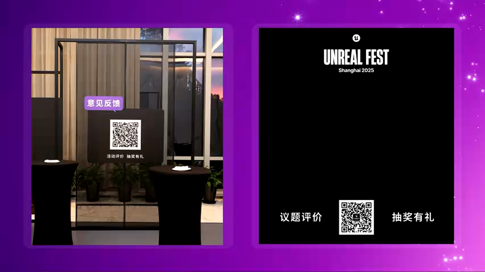
_Screenshot from 00:02:38_
---
## Section 120 (00:02:38)
**Transcript:**
> 我们也新增了一个
**Visual Reference:**

_Screenshot from 00:02:38_
---
## Section 121 (00:02:39)
**Transcript:**
> 特别的反馈通道
**Visual Reference:**

_Screenshot from 00:02:39_
---
## Section 122 (00:02:41)
**Transcript:**
> 希望大家可以多多给我们留下
**Visual Reference:**

_Screenshot from 00:02:41_
---
## Section 123 (00:02:43)
**Transcript:**
> 保固的意见
**Visual Reference:**

_Screenshot from 00:02:43_
---
## Section 124 (00:02:44)
**Transcript:**
> 特别是针对我们本次活动的一体
**Visual Reference:**

_Screenshot from 00:02:44_
---
## Section 125 (00:02:46)
**Transcript:**
> 整体体验啊
**Visual Reference:**

_Screenshot from 00:02:46_
---
## Section 126 (00:02:46)
**Transcript:**
> 还有设计方面
**Visual Reference:**

_Screenshot from 00:02:46_
---
## Section 127 (00:02:47)
**Transcript:**
> 觉得我们未来的
**Visual Reference:**

_Screenshot from 00:02:47_
---
## Section 128 (00:02:48)
**Transcript:**
> AutoFast又很大的帮助
**Visual Reference:**

_Screenshot from 00:02:48_
---
## Section 129 (00:02:51)
**Transcript:**
> 最后
**Visual Reference:**

_Screenshot from 00:02:51_
---
## Section 130 (00:02:52)
**Transcript:**
> 请大家千万不要错过
**Visual Reference:**

_Screenshot from 00:02:52_
---
## Section 131 (00:02:54)
**Transcript:**
> 我们首见AutoFast Parti
**Visual Reference:**

_Screenshot from 00:02:54_
---
## Section 132 (00:02:56)
**Transcript:**
> 地点呢
**Visual Reference:**

_Screenshot from 00:02:56_
---
## Section 133 (00:02:56)
**Transcript:**
> 就在会场A
**Visual Reference:**

_Screenshot from 00:02:56_
---
## Section 134 (00:02:57)
**Transcript:**
> 就在这里
**Visual Reference:**

_Screenshot from 00:02:57_
---
## Section 135 (00:02:58)
**Transcript:**
> 时间是今天晚上的7点到10点
**Visual Reference:**

_Screenshot from 00:02:58_
---
## Section 136 (00:03:01)
**Transcript:**
> 我们准备了丰富的查蝎小时
**Visual Reference:**

_Screenshot from 00:03:01_
---
## Section 137 (00:03:03)
**Transcript:**
> 还有畅饮的酒水
**Visual Reference:**

_Screenshot from 00:03:03_
---
## Section 138 (00:03:05)
**Transcript:**
> 当然还有乐队表演
**Visual Reference:**

_Screenshot from 00:03:05_
---
## Section 139 (00:03:07)
**Transcript:**
> 我们希望和大家进一步
**Visual Reference:**

_Screenshot from 00:03:07_
---
## Section 140 (00:03:08)
**Transcript:**
> 在Party中交流
**Visual Reference:**

_Screenshot from 00:03:08_
---
## Section 141 (00:03:09)
**Transcript:**
> 也希望呢
**Visual Reference:**

_Screenshot from 00:03:09_
---
## Section 142 (00:03:10)
**Transcript:**
> 大家可以交到更多的朋友
**Visual Reference:**

_Screenshot from 00:03:10_
---
## Section 143 (00:03:12)
**Transcript:**
> 一起度过一个南望夜晚
**Visual Reference:**

_Screenshot from 00:03:12_
---
## Section 144 (00:03:15)
**Transcript:**
> 相信大家看到我们
**Visual Reference:**

_Screenshot from 00:03:15_
---
## Section 145 (00:03:16)
**Transcript:**
> 今年活动的机性安排
**Visual Reference:**

_Screenshot from 00:03:16_
---
## Section 146 (00:03:17)
**Transcript:**
> 也能看出我们APP的
**Visual Reference:**

_Screenshot from 00:03:17_
---
## Section 147 (00:03:18)
**Transcript:**
> 针对中国的大力投入
**Visual Reference:**

_Screenshot from 00:03:18_
---
## Section 148 (00:03:21)
**Transcript:**
> 对这个机会呢
**Visual Reference:**

_Screenshot from 00:03:21_
---
## Section 149 (00:03:22)
**Transcript:**
> 我也想跟大家分享一下
**Visual Reference:**

_Screenshot from 00:03:22_
---
## Section 150 (00:03:23)
**Transcript:**
> 我们的使命
**Visual Reference:**

_Screenshot from 00:03:23_
---
## Section 151 (00:03:24)
**Transcript:**
> 我们希望可以和中国
**Visual Reference:**

_Screenshot from 00:03:24_
---
## Section 152 (00:03:25)
**Transcript:**
> 开发者同行
**Visual Reference:**

_Screenshot from 00:03:25_
---
## Section 153 (00:03:27)
**Transcript:**
> 用技术成就无限的创意可能
**Visual Reference:**

_Screenshot from 00:03:27_
---
## Section 154 (00:03:30)
**Transcript:**
> 我也想在这里
**Visual Reference:**

_Screenshot from 00:03:30_
---
## Section 155 (00:03:31)
**Transcript:**
> 跟大家分享我们
**Visual Reference:**

_Screenshot from 00:03:31_
---
## Section 156 (00:03:32)
**Transcript:**
> 中国整体的承诺
**Visual Reference:**

_Screenshot from 00:03:32_
---
## Section 157 (00:03:33)
**Transcript:**
> 我们希望可以持续
**Visual Reference:**

_Screenshot from 00:03:33_
---
## Section 158 (00:03:35)
**Transcript:**
> 坚定长期的投入
**Visual Reference:**

_Screenshot from 00:03:35_
---
## Section 159 (00:03:37)
**Transcript:**
> 首先
**Visual Reference:**

_Screenshot from 00:03:37_
---
## Section 160 (00:03:37)
**Transcript:**
> 我们会不断的升级
**Visual Reference:**

_Screenshot from 00:03:37_
---
## Section 161 (00:03:39)
**Transcript:**
> 我们的技术支持
**Visual Reference:**

_Screenshot from 00:03:39_
---
## Section 162 (00:03:40)
**Transcript:**
> 让大家的开发更加高效流畅
**Visual Reference:**

_Screenshot from 00:03:40_
---
## Section 163 (00:03:43)
**Transcript:**
> 其次我们会提供
**Visual Reference:**

_Screenshot from 00:03:43_
---
## Section 164 (00:03:44)
**Transcript:**
> 更晚上的本地化的培训
**Visual Reference:**

_Screenshot from 00:03:44_
---
## Section 165 (00:03:46)
**Transcript:**
> 和资源的分享
**Visual Reference:**

_Screenshot from 00:03:46_
---
## Section 166 (00:03:47)
**Transcript:**
> 帮大家更加快速成长
**Visual Reference:**

_Screenshot from 00:03:47_
---
## Section 167 (00:03:50)
**Transcript:**
> 第三
**Visual Reference:**

_Screenshot from 00:03:50_
---
## Section 168 (00:03:50)
**Transcript:**
> 我们不断会拖着我们的生态领域
**Visual Reference:**

_Screenshot from 00:03:50_
---
## Section 169 (00:03:53)
**Transcript:**
> 让我们的叙换引擎
**Visual Reference:**

_Screenshot from 00:03:53_
---
## Section 170 (00:03:54)
**Transcript:**
> 走向各行各业
**Visual Reference:**

_Screenshot from 00:03:54_
---
## Section 171 (00:03:56)
**Transcript:**
> 最后也是最重要的一点
**Visual Reference:**

_Screenshot from 00:03:56_
---
## Section 172 (00:03:58)
**Transcript:**
> 是我们希望
**Visual Reference:**

_Screenshot from 00:03:58_
---
## Section 173 (00:03:58)
**Transcript:**
> 我们把中国的创意
**Visual Reference:**

_Screenshot from 00:03:58_
---
## Section 174 (00:03:59)
**Transcript:**
> 带向全球
**Visual Reference:**

_Screenshot from 00:03:59_
---
## Section 175 (00:04:00)
**Transcript:**
> 让全世界看到大家力量
**Visual Reference:**

_Screenshot from 00:04:00_
---
## Section 176 (00:04:04)
**Transcript:**
> 感谢美味开发者的支持培访
**Visual Reference:**

_Screenshot from 00:04:04_
---
## Section 177 (00:04:07)
**Transcript:**
> 正是由你们
**Visual Reference:**

_Screenshot from 00:04:07_
---
## Section 178 (00:04:08)
**Transcript:**
> 我们的希望社区
**Visual Reference:**

_Screenshot from 00:04:08_
---
## Section 179 (00:04:09)
**Transcript:**
> 采录制的法朵
**Visual Reference:**

_Screenshot from 00:04:09_
---
## Section 180 (00:04:10)
**Transcript:**
> 录制的充满活力
**Visual Reference:**

_Screenshot from 00:04:10_
---
## Section 181 (00:04:12)
**Transcript:**
> 希望大家可以精情享受
**Visual Reference:**

_Screenshot from 00:04:12_
---
## Section 182 (00:04:14)
**Transcript:**
> 这一次N-real fast
**Visual Reference:**

_Screenshot from 00:04:14_
---
## Section 183 (00:04:15)
**Transcript:**
> 让我们一起探索
**Visual Reference:**

_Screenshot from 00:04:15_
---
## Section 184 (00:04:16)
**Transcript:**
> 无限的可能
**Visual Reference:**

_Screenshot from 00:04:16_
---
## Section 185 (00:04:17)
**Transcript:**
> 那我们赶紧进入今天的精采一层
**Visual Reference:**

_Screenshot from 00:04:17_
---
## Section 186 (00:04:20)
**Transcript:**
> 有请APP的电视机
**Visual Reference:**

_Screenshot from 00:04:20_
---
## Section 187 (00:04:22)
**Transcript:**
> 听说给你
**Visual Reference:**

_Screenshot from 00:04:22_
---
## Section 188 (00:04:23)
**Transcript:**
> 好听
**Visual Reference:**

_Screenshot from 00:04:23_
---
## Section 189 (00:04:36)
**Transcript:**
> hello
**Visual Reference:**

_Screenshot from 00:04:36_
---
## Section 190 (00:04:37)
**Transcript:**
> and thank you for coming to Unreal Fast
**Visual Reference:**

_Screenshot from 00:04:37_
---
## Section 191 (00:04:39)
**Transcript:**
> it is great to be back in Shanghai
**Visual Reference:**
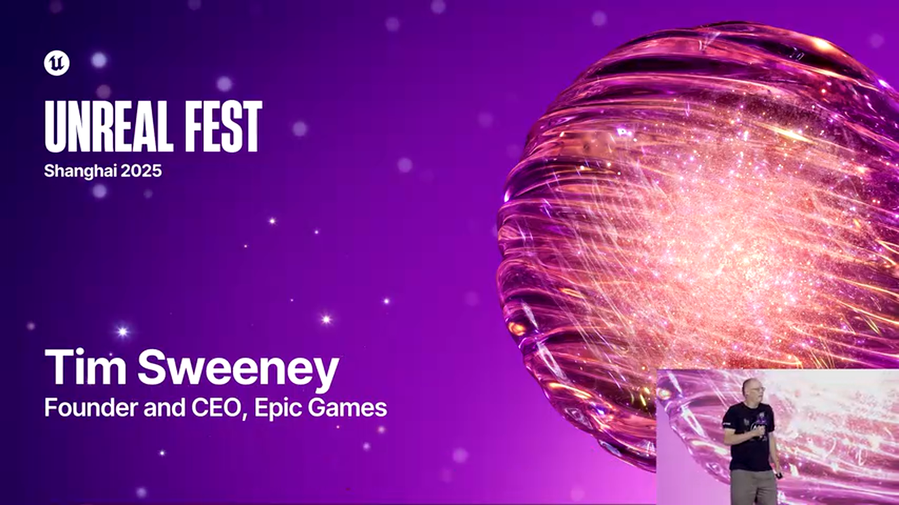
_Screenshot from 00:04:39_
---
## Section 192 (00:04:42)
**Transcript:**
> This is the place to meet people
**Visual Reference:**

_Screenshot from 00:04:42_
---
## Section 193 (00:04:43)
**Transcript:**
> to share knowledge
**Visual Reference:**
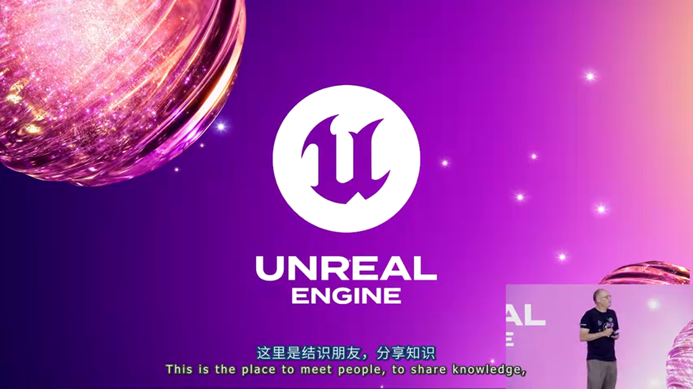
_Screenshot from 00:04:43_
---
## Section 194 (00:04:45)
**Transcript:**
> and to explore ideas about
**Visual Reference:**

_Screenshot from 00:04:45_
---
## Section 195 (00:04:46)
**Transcript:**
> game development and all creative fields
**Visual Reference:**

_Screenshot from 00:04:46_
---
## Section 196 (00:04:50)
**Transcript:**
> and this is a very exciting time for China
**Visual Reference:**

_Screenshot from 00:04:50_
---
## Section 197 (00:04:52)
**Transcript:**
> 10年 Core螃蟻已經開始進入率遊戲大力
**Visual Reference:**

_Screenshot from 00:04:52_
---
## Section 198 (00:04:57)
**Transcript:**
> ?
**Visual Reference:**

_Screenshot from 00:04:57_
---
## Section 199 (00:04:58)
**Transcript:**
> 應將於有細菌時期的進入
**Visual Reference:**

_Screenshot from 00:04:58_
---
## Section 200 (00:05:01)
**Transcript:**
> 鏂膜足夠許 happened
**Visual Reference:**

_Screenshot from 00:05:01_
---
## Section 201 (00:05:02)
**Transcript:**
> 將在中資金 diary頭像AI
**Visual Reference:**

_Screenshot from 00:05:02_
---
## Section 202 (00:05:04)
**Transcript:**
> 成員組成
**Visual Reference:**

_Screenshot from 00:05:04_
---
## Section 203 (00:05:05)
**Transcript:**
> 會有大職品樣於
**Visual Reference:**

_Screenshot from 00:05:05_
---
## Section 204 (00:05:06)
**Transcript:**
> 新年及專業硬技
**Visual Reference:**

_Screenshot from 00:05:06_
---
## Section 205 (00:05:08)
**Transcript:**
> 、��切禮
**Visual Reference:**

_Screenshot from 00:05:08_
---
## Section 206 (00:05:09)
**Transcript:**
> 合 投大看法
**Visual Reference:**

_Screenshot from 00:05:09_
---
## Section 207 (00:05:10)
**Transcript:**
> 經濟膜
**Visual Reference:**

_Screenshot from 00:05:10_
---
## Section 208 (00:05:11)
**Transcript:**
> 從前入酸措
**Visual Reference:**

_Screenshot from 00:05:11_
---
## Section 209 (00:05:12)
**Transcript:**
> 在量局
**Visual Reference:**

_Screenshot from 00:05:12_
---
## Section 210 (00:05:13)
**Transcript:**
> 這麼必須
**Visual Reference:**

_Screenshot from 00:05:13_
---
## Section 211 (00:05:15)
**Transcript:**
> 若此
**Visual Reference:**

_Screenshot from 00:05:15_
---
## Section 212 (00:05:16)
**Transcript:**
> 用噬償
**Visual Reference:**

_Screenshot from 00:05:16_
---
## Section 213 (00:05:17)
**Transcript:**
> 和為破維
**Visual Reference:**

_Screenshot from 00:05:17_
---
## Section 214 (00:05:18)
**Transcript:**
> 取消療等等
**Visual Reference:**

_Screenshot from 00:05:18_
---
## Section 215 (00:05:20)
**Transcript:**
> 所以
**Visual Reference:**

_Screenshot from 00:05:20_
---
## Section 216 (00:05:22)
**Transcript:**
> 仍邵 言語
**Visual Reference:**

_Screenshot from 00:05:22_
---
## Section 217 (00:05:30)
**Transcript:**
> 了解
**Visual Reference:**
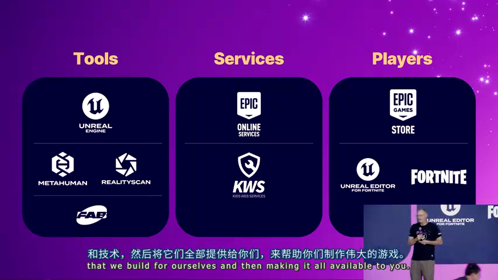
_Screenshot from 00:05:30_
---
## Section 218 (00:05:34)
**Transcript:**
> 也在
**Visual Reference:**

_Screenshot from 00:05:34_
---
## Section 219 (00:05:42)
**Transcript:**
> 而适重其有动物
**Visual Reference:**

_Screenshot from 00:05:42_
---
## Section 220 (00:05:45)
**Transcript:**
> 十二群众伞
**Visual Reference:**

_Screenshot from 00:05:45_
---
## Section 221 (00:05:47)
**Transcript:**
> 人经习的
**Visual Reference:**

_Screenshot from 00:05:47_
---
## Section 222 (00:05:56)
**Transcript:**
> 和大家的每一位手崙
**Visual Reference:**

_Screenshot from 00:05:56_
---
## Section 223 (00:05:58)
**Transcript:**
> 我们怕部队阴
**Visual Reference:**

_Screenshot from 00:05:58_
---
## Section 224 (00:06:02)
**Transcript:**
> Whora 有这种
**Visual Reference:**

_Screenshot from 00:06:02_
---
## Section 225 (00:06:05)
**Transcript:**
> 物各有极力
**Visual Reference:**

_Screenshot from 00:06:05_
---
## Section 226 (00:06:10)
**Transcript:**
> 在這次我們有了很多的產品
**Visual Reference:**
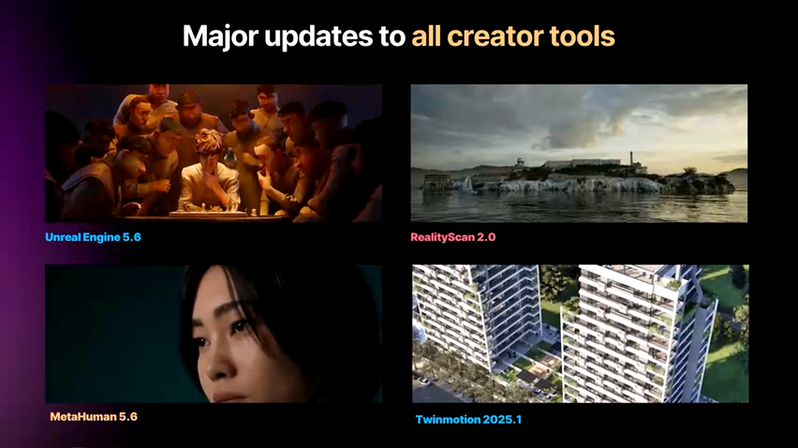
_Screenshot from 00:06:10_
---
## Section 227 (00:06:14)
**Transcript:**
> 讓人們建議
**Visual Reference:**
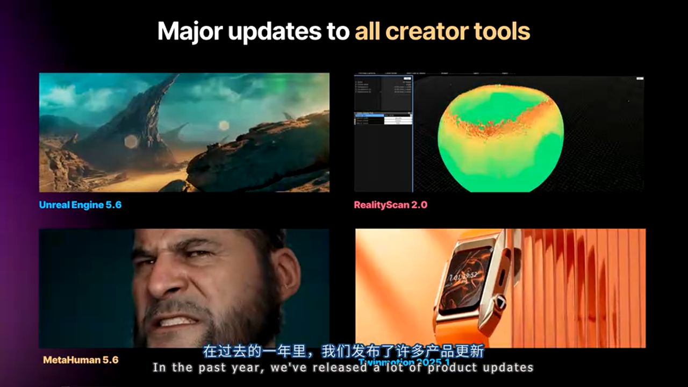
_Screenshot from 00:06:14_
---
## Section 228 (00:06:15)
**Transcript:**
> 使用了一種
**Visual Reference:**

_Screenshot from 00:06:15_
---
## Section 229 (00:06:16)
**Transcript:**
> 人們的技術
**Visual Reference:**

_Screenshot from 00:06:16_
---
## Section 230 (00:06:18)
**Transcript:**
> 使用了
**Visual Reference:**

_Screenshot from 00:06:18_
---
## Section 231 (00:06:20)
**Transcript:**
> 三級技術
**Visual Reference:**

_Screenshot from 00:06:20_
---
## Section 232 (00:06:22)
**Transcript:**
> 使用了
**Visual Reference:**
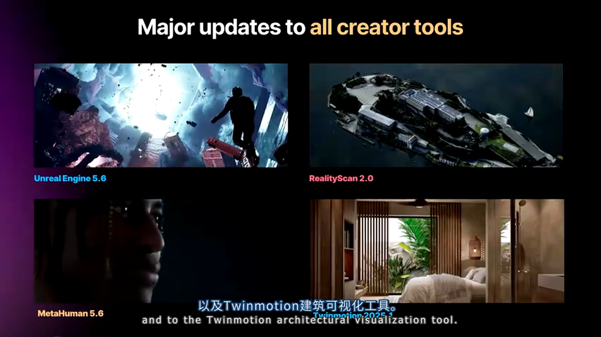
_Screenshot from 00:06:22_
---
## Section 233 (00:06:24)
**Transcript:**
> 技術
**Visual Reference:**
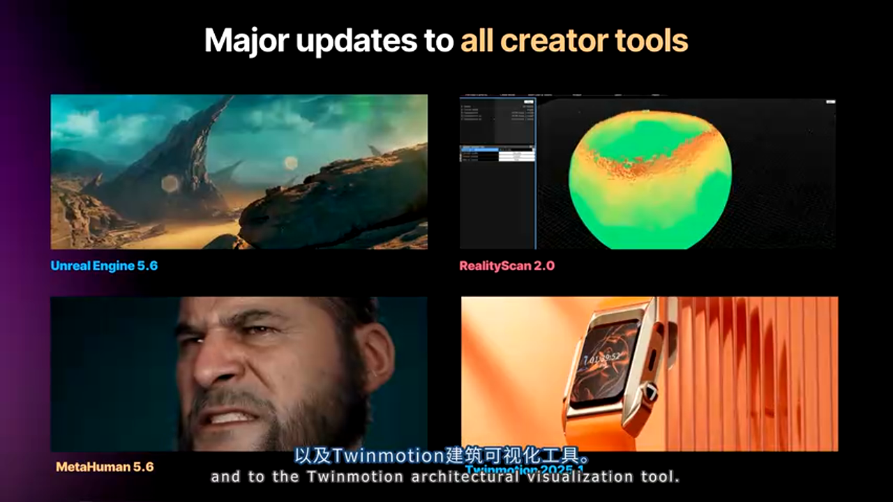
_Screenshot from 00:06:24_
---
## Section 234 (00:06:26)
**Transcript:**
> 使用了
**Visual Reference:**
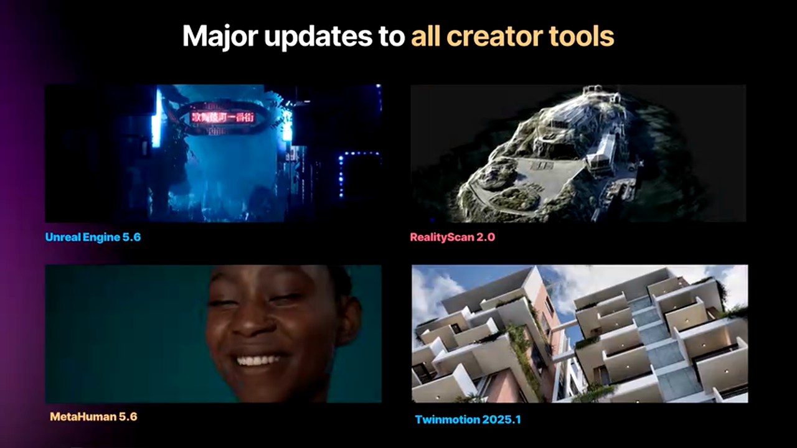
_Screenshot from 00:06:26_
---
## Section 235 (00:06:28)
**Transcript:**
> 技術
**Visual Reference:**

_Screenshot from 00:06:28_
---
## Section 236 (00:06:29)
**Transcript:**
> 使用了
**Visual Reference:**

_Screenshot from 00:06:29_
---
## Section 237 (00:06:30)
**Transcript:**
> 技術
**Visual Reference:**
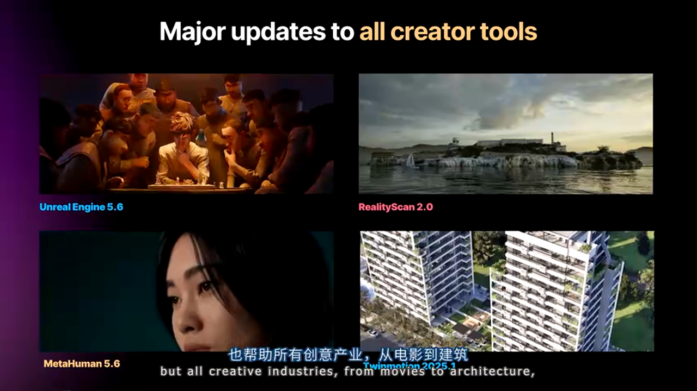
_Screenshot from 00:06:30_
---
## Section 238 (00:06:31)
**Transcript:**
> 使用了
**Visual Reference:**

_Screenshot from 00:06:31_
---
## Section 239 (00:06:32)
**Transcript:**
> 技術
**Visual Reference:**

_Screenshot from 00:06:32_
---
## Section 240 (00:06:33)
**Transcript:**
> 使用了
**Visual Reference:**
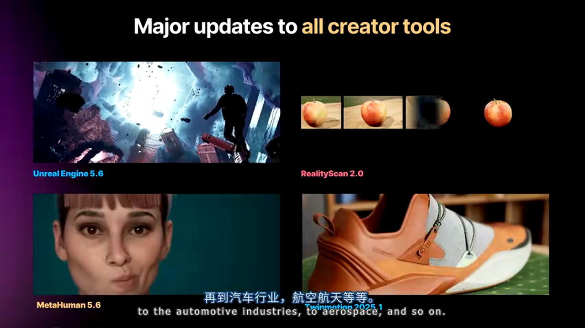
_Screenshot from 00:06:33_
---
## Section 241 (00:06:34)
**Transcript:**
> 技術
**Visual Reference:**

_Screenshot from 00:06:34_
---
## Section 242 (00:06:35)
**Transcript:**
> 使用了
**Visual Reference:**
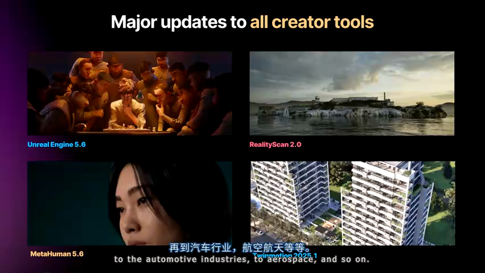
_Screenshot from 00:06:35_
---
## Section 243 (00:06:36)
**Transcript:**
> 技術
**Visual Reference:**
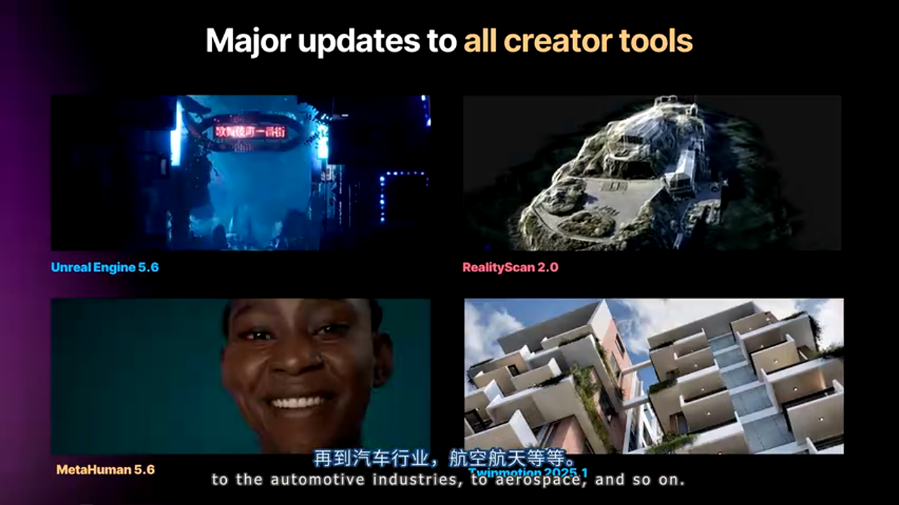
_Screenshot from 00:06:36_
---
## Section 244 (00:06:37)
**Transcript:**
> 使用了
**Visual Reference:**

_Screenshot from 00:06:37_
---
## Section 245 (00:06:38)
**Transcript:**
> 技術
**Visual Reference:**

_Screenshot from 00:06:38_
---
## Section 246 (00:06:39)
**Transcript:**
> 使用了
**Visual Reference:**

_Screenshot from 00:06:39_
---
## Section 247 (00:06:40)
**Transcript:**
> 這次我們有了
**Visual Reference:**

_Screenshot from 00:06:40_
---
## Section 248 (00:06:41)
**Transcript:**
> 藍藏周 board
**Visual Reference:**

_Screenshot from 00:06:41_
---
## Section 249 (00:06:42)
**Transcript:**
> visionary
**Visual Reference:**

_Screenshot from 00:06:42_
---
## Section 250 (00:06:44)
**Transcript:**
> ylon
**Visual Reference:**

_Screenshot from 00:06:44_
---
## Section 251 (00:06:45)
**Transcript:**
> 71
**Visual Reference:**

_Screenshot from 00:06:45_
---
## Section 252 (00:06:46)
**Transcript:**
> éner
**Visual Reference:**

_Screenshot from 00:06:46_
---
## Section 253 (00:06:46)
**Transcript:**
> אבל
**Visual Reference:**

_Screenshot from 00:06:46_
---
## Section 254 (00:06:46)
**Transcript:**
> 仅intend
**Visual Reference:**

_Screenshot from 00:06:46_
---
## Section 255 (00:06:47)
**Transcript:**
> 仅
**Visual Reference:**

_Screenshot from 00:06:47_
---
## Section 256 (00:06:47)
**Transcript:**
> 只是
**Visual Reference:**

_Screenshot from 00:06:47_
---
## Section 257 (00:06:48)
**Transcript:**
> 仅
**Visual Reference:**

_Screenshot from 00:06:48_
---
## Section 258 (00:06:48)
**Transcript:**
> 只是
**Visual Reference:**

_Screenshot from 00:06:48_
---
## Section 259 (00:06:49)
**Transcript:**
> 無小 pill
**Visual Reference:**

_Screenshot from 00:06:49_
---
## Section 260 (00:06:50)
**Transcript:**
> 僅
**Visual Reference:**

_Screenshot from 00:06:50_
---
## Section 261 (00:06:50)
**Transcript:**
> 每一個
**Visual Reference:**

_Screenshot from 00:06:50_
---
## Section 262 (00:06:52)
**Transcript:**
> 元素
**Visual Reference:**

_Screenshot from 00:06:52_
---
## Section 263 (00:06:53)
**Transcript:**
> 建制
**Visual Reference:**

_Screenshot from 00:06:53_
---
## Section 264 (00:06:53)
**Transcript:**
> 每一Part
**Visual Reference:**

_Screenshot from 00:06:53_
---
## Section 265 (00:06:55)
**Transcript:**
> 都關於
**Visual Reference:**

_Screenshot from 00:06:55_
---
## Section 266 (00:06:56)
**Transcript:**
> 生物
**Visual Reference:**

_Screenshot from 00:06:56_
---
## Section 267 (00:06:57)
**Transcript:**
> 所謂的
**Visual Reference:**

_Screenshot from 00:06:57_
---
## Section 268 (00:06:58)
**Transcript:**
> 基本的
**Visual Reference:**

_Screenshot from 00:06:58_
---
## Section 269 (00:07:00)
**Transcript:**
> 效率
**Visual Reference:**

_Screenshot from 00:07:00_
---
## Section 270 (00:07:00)
**Transcript:**
> 用
**Visual Reference:**

_Screenshot from 00:07:00_
---
## Section 271 (00:07:01)
**Transcript:**
> 代料
**Visual Reference:**

_Screenshot from 00:07:01_
---
## Section 272 (00:07:01)
**Transcript:**
> children
**Visual Reference:**

_Screenshot from 00:07:01_
---
## Section 273 (00:07:02)
**Transcript:**
> 共同
**Visual Reference:**

_Screenshot from 00:07:02_
---
## Section 274 (00:07:03)
**Transcript:**
> 新片
**Visual Reference:**

_Screenshot from 00:07:03_
---
## Section 275 (00:07:05)
**Transcript:**
> 事業
**Visual Reference:**

_Screenshot from 00:07:05_
---
## Section 276 (00:07:05)
**Transcript:**
> 自動
**Visual Reference:**

_Screenshot from 00:07:05_
---
## Section 277 (00:07:06)
**Transcript:**
> 仗業
**Visual Reference:**

_Screenshot from 00:07:06_
---
## Section 278 (00:07:07)
**Transcript:**
> 議業
**Visual Reference:**

_Screenshot from 00:07:07_
---
## Section 279 (00:07:08)
**Transcript:**
> 產業
**Visual Reference:**

_Screenshot from 00:07:08_
---
## Section 280 (00:07:08)
**Transcript:**
> 撲
**Visual Reference:**

_Screenshot from 00:07:08_
---
## Section 281 (00:07:10)
**Transcript:**
> さよう г festive
**Visual Reference:**

_Screenshot from 00:07:10_
---
## Section 282 (00:07:12)
**Transcript:**
> US 透露
**Visual Reference:**

_Screenshot from 00:07:12_
---
## Section 283 (00:07:13)
**Transcript:**
> 亚洲
**Visual Reference:**

_Screenshot from 00:07:13_
---
## Section 284 (00:07:15)
**Transcript:**
> fazendo
**Visual Reference:**

_Screenshot from 00:07:15_
---
## Section 285 (00:07:17)
**Transcript:**
> 中國
**Visual Reference:**

_Screenshot from 00:07:17_
---
## Section 286 (00:07:18)
**Transcript:**
> 公司
**Visual Reference:**

_Screenshot from 00:07:18_
---
## Section 287 (00:07:20)
**Transcript:**
> 還是
**Visual Reference:**

_Screenshot from 00:07:20_
---
## Section 288 (00:07:20)
**Transcript:**
> 準備
**Visual Reference:**

_Screenshot from 00:07:20_
---
## Section 289 (00:07:22)
**Transcript:**
> 新長
**Visual Reference:**

_Screenshot from 00:07:22_
---
## Section 290 (00:07:23)
**Transcript:**
> 嗯
**Visual Reference:**

_Screenshot from 00:07:23_
---
## Section 291 (00:07:24)
**Transcript:**
> 對你看
**Visual Reference:**

_Screenshot from 00:07:24_
---
## Section 292 (00:07:26)
**Transcript:**
> 中國
**Visual Reference:**

_Screenshot from 00:07:26_
---
## Section 293 (00:07:26)
**Transcript:**
> 穿著
**Visual Reference:**

_Screenshot from 00:07:26_
---
## Section 294 (00:07:28)
**Transcript:**
> girls
**Visual Reference:**

_Screenshot from 00:07:28_
---
## Section 295 (00:07:29)
**Transcript:**
> 緊揹
**Visual Reference:**

_Screenshot from 00:07:29_
---
## Section 296 (00:07:31)
**Transcript:**
> 神奇
**Visual Reference:**

_Screenshot from 00:07:31_
---
## Section 297 (00:07:33)
**Transcript:**
> 已經從
**Visual Reference:**

_Screenshot from 00:07:33_
---
## Section 298 (00:07:34)
**Transcript:**
> 開始
**Visual Reference:**

_Screenshot from 00:07:34_
---
## Section 299 (00:07:37)
**Transcript:**
> 會獨立
**Visual Reference:**

_Screenshot from 00:07:37_
---
## Section 300 (00:07:39)
**Transcript:**
> 我們基本上画的是
**Visual Reference:**

_Screenshot from 00:07:39_
---
## Section 301 (00:08:08)
**Transcript:**
> 打開地監察書的一鍵
**Visual Reference:**

_Screenshot from 00:08:08_
---
## Section 302 (00:08:12)
**Transcript:**
> 這個詩語
**Visual Reference:**

_Screenshot from 00:08:12_
---
## Section 303 (00:08:14)
**Transcript:**
> 大家看
**Visual Reference:**

_Screenshot from 00:08:14_
---
## Section 304 (00:08:15)
**Transcript:**
> J Dark
**Visual Reference:**

_Screenshot from 00:08:15_
---
## Section 305 (00:08:20)
**Transcript:**
> 52
**Visual Reference:**

_Screenshot from 00:08:20_
---
## Section 306 (00:08:23)
**Transcript:**
> 非常特別的有一輪
**Visual Reference:**

_Screenshot from 00:08:23_
---
## Section 307 (00:08:26)
**Transcript:**
> 時間
**Visual Reference:**

_Screenshot from 00:08:26_
---
## Section 308 (00:08:28)
**Transcript:**
> 不是否決許計劃
**Visual Reference:**

_Screenshot from 00:08:28_
---
## Section 309 (00:08:33)
**Transcript:**
> 我們按照
**Visual Reference:**

_Screenshot from 00:08:33_
---
## Section 310 (00:08:35)
**Transcript:**
> 公urb unas技術
**Visual Reference:**

_Screenshot from 00:08:35_
---
## Section 311 (00:08:36)
**Transcript:**
> 花腳鋒在其他計畫中
**Visual Reference:**

_Screenshot from 00:08:36_
---
## Section 312 (00:08:39)
**Transcript:**
> 現在游問那個禮物
**Visual Reference:**

_Screenshot from 00:08:39_
---
## Section 313 (00:08:40)
**Transcript:**
> 還有11個
**Visual Reference:**

_Screenshot from 00:08:40_
---
## Section 314 (00:08:41)
**Transcript:**
> 新比聯媒
**Visual Reference:**

_Screenshot from 00:08:41_
---
## Section 315 (00:08:42)
**Transcript:**
> 為什麼會這樣
**Visual Reference:**

_Screenshot from 00:08:42_
---
## Section 316 (00:08:44)
**Transcript:**
> 兩位因議群
**Visual Reference:**

_Screenshot from 00:08:44_
---
## Section 317 (00:08:46)
**Transcript:**
> ?
**Visual Reference:**

_Screenshot from 00:08:46_
---
## Section 318 (00:08:46)
**Transcript:**
> 那的數到大臀
**Visual Reference:**

_Screenshot from 00:08:46_
---
## Section 319 (00:08:50)
**Transcript:**
> 充滿電視
**Visual Reference:**

_Screenshot from 00:08:50_
---
## Section 320 (00:08:52)
**Transcript:**
> 除了所有擁有的機器
**Visual Reference:**

_Screenshot from 00:08:52_
---
## Section 321 (00:08:55)
**Transcript:**
> 派對新涌別主
**Visual Reference:**

_Screenshot from 00:08:55_
---
## Section 322 (00:08:57)
**Transcript:**
> 有這個兩個 在
**Visual Reference:**

_Screenshot from 00:08:57_
---
## Section 323 (00:08:59)
**Transcript:**
> 之後
**Visual Reference:**

_Screenshot from 00:08:59_
---
## Section 324 (00:09:01)
**Transcript:**
> 這些電視
**Visual Reference:**

_Screenshot from 00:09:01_
---
## Section 325 (00:09:02)
**Transcript:**
> 水上
**Visual Reference:**

_Screenshot from 00:09:02_
---
## Section 326 (00:09:02)
**Transcript:**
> 還有半個電視
**Visual Reference:**

_Screenshot from 00:09:02_
---
## Section 327 (00:09:04)
**Transcript:**
> 连这种谜 giờ以法迅更加高
**Visual Reference:**

_Screenshot from 00:09:04_
---
## Section 328 (00:09:08)
**Transcript:**
> 所有人都不命上
**Visual Reference:**

_Screenshot from 00:09:08_
---
## Section 329 (00:09:26)
**Transcript:**
> 不许推荐
**Visual Reference:**

_Screenshot from 00:09:26_
---
## Section 330 (00:09:28)
**Transcript:**
> 相信牙兩邊一直和之前
**Visual Reference:**

_Screenshot from 00:09:28_
---
## Section 331 (00:09:30)
**Transcript:**
> 顯示而生硬囪
**Visual Reference:**

_Screenshot from 00:09:30_
---
## Section 332 (00:09:31)
**Transcript:**
> 相當地的監督
**Visual Reference:**

_Screenshot from 00:09:31_
---
## Section 333 (00:09:32)
**Transcript:**
> 即使有更多人紅色的
**Visual Reference:**

_Screenshot from 00:09:32_
---
## Section 334 (00:09:44)
**Transcript:**
> 目標很強
**Visual Reference:**

_Screenshot from 00:09:44_
---
## Section 335 (00:09:45)
**Transcript:**
> 我們許法院不平
**Visual Reference:**

_Screenshot from 00:09:45_
---
## Section 336 (00:09:47)
**Transcript:**
> 一些角度
**Visual Reference:**

_Screenshot from 00:09:47_
---
## Section 337 (00:09:49)
**Transcript:**
> 並完全會有
**Visual Reference:**

_Screenshot from 00:09:49_
---
## Section 338 (00:09:50)
**Transcript:**
> 非常平好的
**Visual Reference:**

_Screenshot from 00:09:50_
---
## Section 339 (00:09:51)
**Transcript:**
> 各圈
**Visual Reference:**

_Screenshot from 00:09:51_
---
## Section 340 (00:09:52)
**Transcript:**
> 未來是會正在
**Visual Reference:**

_Screenshot from 00:09:52_
---
## Section 341 (00:09:54)
**Transcript:**
> 也會限定
**Visual Reference:**

_Screenshot from 00:09:54_
---
## Section 342 (00:09:57)
**Transcript:**
> 脾氣
**Visual Reference:**

_Screenshot from 00:09:57_
---
## Section 343 (00:09:57)
**Transcript:**
> 而她的人士也是密尼斯人
**Visual Reference:**

_Screenshot from 00:09:57_
---
## Section 344 (00:10:00)
**Transcript:**
> 這間生運遺圈
**Visual Reference:**

_Screenshot from 00:10:00_
---
## Section 345 (00:10:09)
**Transcript:**
> 五桶業者
**Visual Reference:**

_Screenshot from 00:10:09_
---
## Section 346 (00:10:11)
**Transcript:**
> 這間戰車死 Another
**Visual Reference:**

_Screenshot from 00:10:11_
---
## Section 347 (00:10:14)
**Transcript:**
> 初電《例如賀兰極離奇的皮蘭
**Visual Reference:**

_Screenshot from 00:10:14_
---
## Section 348 (00:10:18)
**Transcript:**
> 提案》傳染軍中遊戲
**Visual Reference:**

_Screenshot from 00:10:18_
---
## Section 349 (00:10:20)
**Transcript:**
> 發言季crier
**Visual Reference:**

_Screenshot from 00:10:20_
---
## Section 350 (00:10:21)
**Transcript:**
> 銀行其兩支
**Visual Reference:**

_Screenshot from 00:10:21_
---
## Section 351 (00:10:23)
**Transcript:**
> 條角
**Visual Reference:**

_Screenshot from 00:10:23_
---
## Section 352 (00:10:27)
**Transcript:**
> 由土人電媒圖全部共潔
**Visual Reference:**

_Screenshot from 00:10:27_
---
## Section 353 (00:10:31)
**Transcript:**
> 以 marshy 相損
**Visual Reference:**

_Screenshot from 00:10:31_
---
## Section 354 (00:10:33)
**Transcript:**
> 圖司的相關酸作業
**Visual Reference:**

_Screenshot from 00:10:33_
---
## Section 355 (00:10:35)
**Transcript:**
> 並懸詠的大節止
**Visual Reference:**

_Screenshot from 00:10:35_
---
## Section 356 (00:10:37)
**Transcript:**
> 主題是
**Visual Reference:**

_Screenshot from 00:10:37_
---
## Section 357 (00:10:39)
**Transcript:**
> 参加高級的
**Visual Reference:**

_Screenshot from 00:10:39_
---
## Section 358 (00:10:41)
**Transcript:**
> 將濾局
**Visual Reference:**

_Screenshot from 00:10:41_
---
## Section 359 (00:10:45)
**Transcript:**
> 我要發展了那麼多
**Visual Reference:**

_Screenshot from 00:10:45_
---
## Section 360 (00:10:48)
**Transcript:**
> 推薦商ached
**Visual Reference:**

_Screenshot from 00:10:48_
---
## Section 361 (00:10:50)
**Transcript:**
> 的技術
**Visual Reference:**

_Screenshot from 00:10:50_
---
## Section 362 (00:10:52)
**Transcript:**
> 作業會亡も
**Visual Reference:**

_Screenshot from 00:10:52_
---
## Section 363 (00:10:53)
**Transcript:**
> 但
**Visual Reference:**

_Screenshot from 00:10:53_
---
## Section 364 (00:10:54)
**Transcript:**
> 更明顯呢 健康意別
**Visual Reference:**

_Screenshot from 00:10:54_
---
## Section 365 (00:10:58)
**Transcript:**
> 有好人在這麼招mata
**Visual Reference:**

_Screenshot from 00:10:58_
---
## Section 366 (00:11:03)
**Transcript:**
> 限制巃圖
**Visual Reference:**

_Screenshot from 00:11:03_
---
## Section 367 (00:11:05)
**Transcript:**
> 工士本現的確分成
**Visual Reference:**

_Screenshot from 00:11:05_
---
## Section 368 (00:11:07)
**Transcript:**
> 成立時間
**Visual Reference:**

_Screenshot from 00:11:07_
---
## Section 369 (00:11:10)
**Transcript:**
> 這個工夫可以
**Visual Reference:**

_Screenshot from 00:11:10_
---
## Section 370 (00:11:15)
**Transcript:**
> 在世界大長程人數
**Visual Reference:**

_Screenshot from 00:11:15_
---
## Section 371 (00:11:20)
**Transcript:**
> 將將將多餐
**Visual Reference:**

_Screenshot from 00:11:20_
---
## Section 372 (00:11:24)
**Transcript:**
> 但對於遊戲中的件事
**Visual Reference:**

_Screenshot from 00:11:24_
---
## Section 373 (00:11:27)
**Transcript:**
> 台灣,一 much USD的一處
**Visual Reference:**

_Screenshot from 00:11:27_
---
## Section 374 (00:11:35)
**Transcript:**
> Oak foriye 肥有一串新度,
**Visual Reference:**

_Screenshot from 00:11:35_
---
## Section 375 (00:11:36)
**Transcript:**
> 這までは如果有標籌一個
**Visual Reference:**
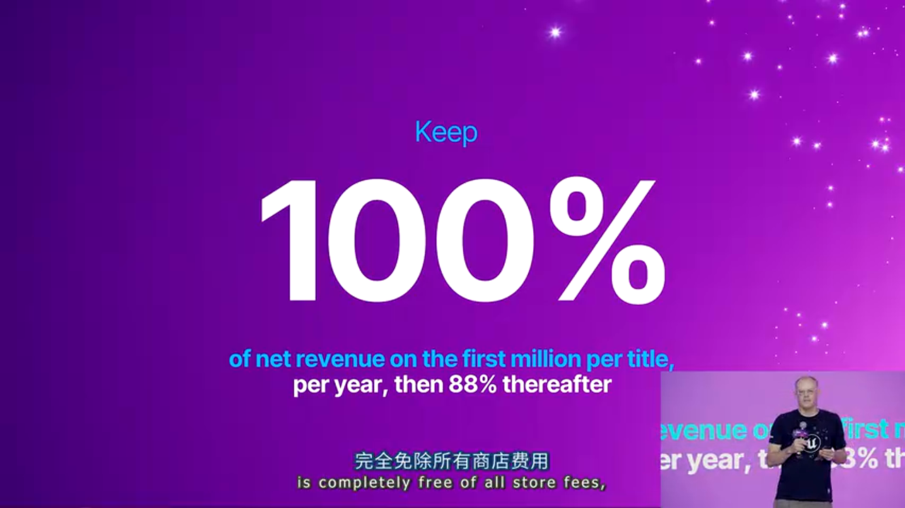
_Screenshot from 00:11:36_
---
## Section 376 (00:11:40)
**Transcript:**
> ,那可以罷了植物
**Visual Reference:**

_Screenshot from 00:11:40_
---
## Section 377 (00:11:46)
**Transcript:**
> 剛剛已經整年津,
**Visual Reference:**

_Screenshot from 00:11:46_
---
## Section 378 (00:11:48)
**Transcript:**
> 已經倒上人橋
**Visual Reference:**

_Screenshot from 00:11:48_
---
## Section 379 (00:11:50)
**Transcript:**
> 時代 NOTRATURES
**Visual Reference:**

_Screenshot from 00:11:50_
---
## Section 380 (00:11:51)
**Transcript:**
> 亦都變成一二三年
**Visual Reference:**

_Screenshot from 00:11:51_
---
## Section 381 (00:11:52)
**Transcript:**
> 然後或者只有幾個年
**Visual Reference:**

_Screenshot from 00:11:52_
---
## Section 382 (00:11:53)
**Transcript:**
> 而當牌後其實為什麼找了待全棚裝的金錢
**Visual Reference:**

_Screenshot from 00:11:53_
---
## Section 383 (00:11:57)
**Transcript:**
> 六方藍範圍
**Visual Reference:**

_Screenshot from 00:11:57_
---
## Section 384 (00:12:07)
**Transcript:**
> 四名藍篷の?
**Visual Reference:**
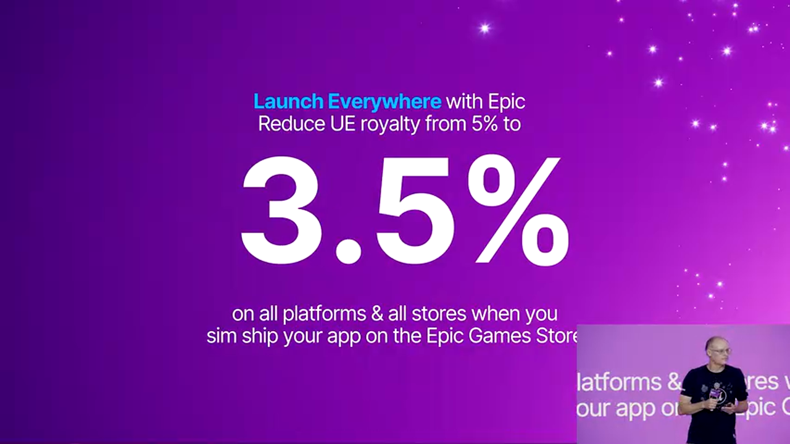
_Screenshot from 00:12:07_
---
## Section 385 (00:12:10)
**Transcript:**
> 他們一把在 wonderland games 運動On unpacking good
**Visual Reference:**

_Screenshot from 00:12:10_
---
## Section 386 (00:12:12)
**Transcript:**
> 與其他地方無
**Visual Reference:**

_Screenshot from 00:12:12_
---
## Section 387 (00:12:17)
**Transcript:**
> 給他們的磁等兵 對連用的遊戲
**Visual Reference:**

_Screenshot from 00:12:17_
---
## Section 388 (00:12:19)
**Transcript:**
> 融化完額的思語
**Visual Reference:**

_Screenshot from 00:12:19_
---
## Section 389 (00:12:21)
**Transcript:**
> Congratulations to your official pod
**Visual Reference:**

_Screenshot from 00:12:21_
---
## Section 390 (00:12:23)
**Transcript:**
> 是這樣副準備
**Visual Reference:**

_Screenshot from 00:12:23_
---
## Section 391 (00:12:25)
**Transcript:**
> 兵進後不可動
**Visual Reference:**

_Screenshot from 00:12:25_
---
## Section 392 (00:12:26)
**Transcript:**
> 以下的器具
**Visual Reference:**

_Screenshot from 00:12:26_
---
## Section 393 (00:12:28)
**Transcript:**
> Spoiled Ayoon 技術
**Visual Reference:**

_Screenshot from 00:12:28_
---
## Section 394 (00:12:30)
**Transcript:**
> 兩半就那麼多
**Visual Reference:**

_Screenshot from 00:12:30_
---
## Section 395 (00:12:32)
**Transcript:**
> To incentivize you
**Visual Reference:**

_Screenshot from 00:12:32_
---
## Section 396 (00:12:34)
**Transcript:**
> To launch all games On unpacking game
**Visual Reference:**

_Screenshot from 00:12:34_
---
## Section 397 (00:12:36)
**Transcript:**
> 各位的做法terminal game machine
**Visual Reference:**

_Screenshot from 00:12:36_
---
## Section 398 (00:12:39)
**Transcript:**
> Street Мorning
**Visual Reference:**

_Screenshot from 00:12:39_
---
## Section 399 (00:12:41)
**Transcript:**
> 贱路者
**Visual Reference:**

_Screenshot from 00:12:41_
---
## Section 400 (00:12:42)
**Transcript:**
> 第一接觸
**Visual Reference:**

_Screenshot from 00:12:42_
---
## Section 401 (00:12:43)
**Transcript:**
> 我都未知
**Visual Reference:**

_Screenshot from 00:12:43_
---
## Section 402 (00:12:44)
**Transcript:**
> 同之
**Visual Reference:**

_Screenshot from 00:12:44_
---
## Section 403 (00:12:44)
**Transcript:**
> 不知
**Visual Reference:**

_Screenshot from 00:12:44_
---
## Section 404 (00:12:45)
**Transcript:**
> 不是
**Visual Reference:**

_Screenshot from 00:12:45_
---
## Section 405 (00:12:46)
**Transcript:**
> 今天
**Visual Reference:**

_Screenshot from 00:12:46_
---
## Section 406 (00:12:47)
**Transcript:**
> 方驟
**Visual Reference:**

_Screenshot from 00:12:47_
---
## Section 407 (00:12:53)
**Transcript:**
> 部他
**Visual Reference:**

_Screenshot from 00:12:53_
---
## Section 408 (00:12:55)
**Transcript:**
> moves
**Visual Reference:**
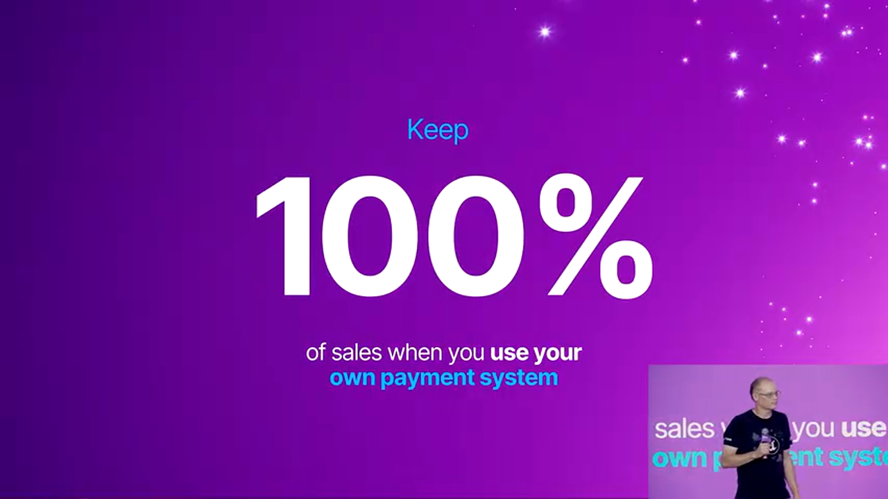
_Screenshot from 00:12:55_
---
## Section 409 (00:12:56)
**Transcript:**
> b
**Visual Reference:**
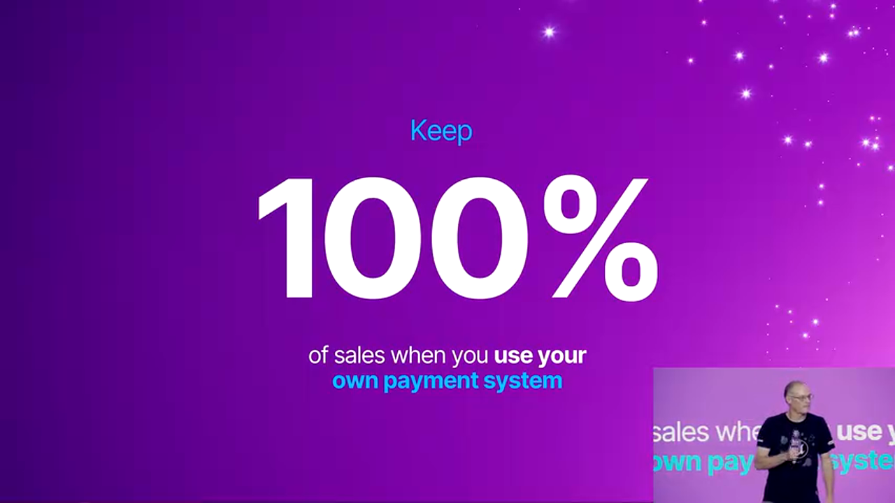
_Screenshot from 00:12:56_
---
## Section 410 (00:12:58)
**Transcript:**
> Halso
**Visual Reference:**

_Screenshot from 00:12:58_
---
## Section 411 (00:12:59)
**Transcript:**
> 去到
**Visual Reference:**

_Screenshot from 00:12:59_
---
## Section 412 (00:13:00)
**Transcript:**
> 過系動物
**Visual Reference:**

_Screenshot from 00:13:00_
---
## Section 413 (00:13:02)
**Transcript:**
> K passt
**Visual Reference:**

_Screenshot from 00:13:02_
---
## Section 414 (00:13:04)
**Transcript:**
> Qin
**Visual Reference:**

_Screenshot from 00:13:04_
---
## Section 415 (00:13:04)
**Transcript:**
> 福科
**Visual Reference:**

_Screenshot from 00:13:04_
---
## Section 416 (00:13:05)
**Transcript:**
> 直 kilometres 끝因為或者單目就擁有
**Visual Reference:**

_Screenshot from 00:13:05_
---
## Section 417 (00:13:08)
**Transcript:**
> 主uma的例子
**Visual Reference:**

_Screenshot from 00:13:08_
---
## Section 418 (00:13:10)
**Transcript:**
> 來考取更多原理事件
**Visual Reference:**

_Screenshot from 00:13:10_
---
## Section 419 (00:13:12)
**Transcript:**
> 讓資料眾集合
**Visual Reference:**

_Screenshot from 00:13:12_
---
## Section 420 (00:13:14)
**Transcript:**
> 市場升溪大使
**Visual Reference:**

_Screenshot from 00:13:14_
---
## Section 421 (00:13:17)
**Transcript:**
> McDonald's 基於 in
**Visual Reference:**

_Screenshot from 00:13:17_
---
## Section 422 (00:13:19)
**Transcript:**
> 我會你信財
**Visual Reference:**

_Screenshot from 00:13:19_
---
## Section 423 (00:13:22)
**Transcript:**
> 紀錄
**Visual Reference:**

_Screenshot from 00:13:22_
---
## Section 424 (00:13:23)
**Transcript:**
> 快bo
**Visual Reference:**

_Screenshot from 00:13:23_
---
## Section 425 (00:13:26)
**Transcript:**
> M pillars
**Visual Reference:**

_Screenshot from 00:13:26_
---
## Section 426 (00:13:27)
**Transcript:**
> 徴妾
**Visual Reference:**

_Screenshot from 00:13:27_
---
## Section 427 (00:13:30)
**Transcript:**
> 心向妳學校
**Visual Reference:**

_Screenshot from 00:13:30_
---
## Section 428 (00:13:32)
**Transcript:**
> 這個創造創作
**Visual Reference:**

_Screenshot from 00:13:32_
---
## Section 429 (00:13:35)
**Transcript:**
> 因為
**Visual Reference:**

_Screenshot from 00:13:35_
---
## Section 430 (00:13:36)
**Transcript:**
> 因為
**Visual Reference:**

_Screenshot from 00:13:36_
---
## Section 431 (00:13:37)
**Transcript:**
> 你會用遊戲在 any platform
**Visual Reference:**

_Screenshot from 00:13:37_
---
## Section 432 (00:13:39)
**Transcript:**
> 在 any store 中
**Visual Reference:**

_Screenshot from 00:13:39_
---
## Section 433 (00:13:40)
**Transcript:**
> including consoles
**Visual Reference:**

_Screenshot from 00:13:40_
---
## Section 434 (00:13:41)
**Transcript:**
> 在 iOS App Store
**Visual Reference:**

_Screenshot from 00:13:41_
---
## Section 435 (00:13:42)
**Transcript:**
> 在 Google Play Store
**Visual Reference:**

_Screenshot from 00:13:42_
---
## Section 436 (00:13:44)
**Transcript:**
> 你會
**Visual Reference:**

_Screenshot from 00:13:44_
---
## Section 437 (00:13:45)
**Transcript:**
> 會用遊戲
**Visual Reference:**

_Screenshot from 00:13:45_
---
## Section 438 (00:13:46)
**Transcript:**
> 去移植
**Visual Reference:**

_Screenshot from 00:13:46_
---
## Section 439 (00:13:47)
**Transcript:**
> 在遊戲
**Visual Reference:**

_Screenshot from 00:13:47_
---
## Section 440 (00:13:48)
**Transcript:**
> 在遊戲
**Visual Reference:**

_Screenshot from 00:13:48_
---
## Section 441 (00:13:49)
**Transcript:**
> 在遊戲
**Visual Reference:**

_Screenshot from 00:13:49_
---
## Section 442 (00:13:50)
**Transcript:**
> 在遊戲
**Visual Reference:**

_Screenshot from 00:13:50_
---
## Section 443 (00:13:51)
**Transcript:**
> 在遊戲
**Visual Reference:**

_Screenshot from 00:13:51_
---
## Section 444 (00:13:52)
**Transcript:**
> 在遊戲
**Visual Reference:**

_Screenshot from 00:13:52_
---
## Section 445 (00:13:53)
**Transcript:**
> 在遊戲
**Visual Reference:**

_Screenshot from 00:13:53_
---
## Section 446 (00:13:54)
**Transcript:**
> 在遊戲
**Visual Reference:**

_Screenshot from 00:13:54_
---
## Section 447 (00:13:55)
**Transcript:**
> 在遊戲
**Visual Reference:**

_Screenshot from 00:13:55_
---
## Section 448 (00:13:56)
**Transcript:**
> 在遊戲
**Visual Reference:**

_Screenshot from 00:13:56_
---
## Section 449 (00:13:57)
**Transcript:**
> 在遊戲
**Visual Reference:**

_Screenshot from 00:13:57_
---
## Section 450 (00:13:58)
**Transcript:**
> 在遊戲
**Visual Reference:**

_Screenshot from 00:13:58_
---
## Section 451 (00:13:59)
**Transcript:**
> 在遊戲
**Visual Reference:**

_Screenshot from 00:13:59_
---
## Section 452 (00:14:00)
**Transcript:**
> 在遊戲
**Visual Reference:**

_Screenshot from 00:14:00_
---
## Section 453 (00:14:01)
**Transcript:**
> 在遊戲
**Visual Reference:**

_Screenshot from 00:14:01_
---
## Section 454 (00:14:02)
**Transcript:**
> 在遊戲
**Visual Reference:**

_Screenshot from 00:14:02_
---
## Section 455 (00:14:03)
**Transcript:**
> 在遊戲
**Visual Reference:**

_Screenshot from 00:14:03_
---
## Section 456 (00:14:34)
**Transcript:**
> 在遊戲
**Visual Reference:**

_Screenshot from 00:14:34_
---
## Section 457 (00:14:35)
**Transcript:**
> 在遊戲
**Visual Reference:**

_Screenshot from 00:14:35_
---
## Section 458 (00:14:36)
**Transcript:**
> 在遊戲
**Visual Reference:**

_Screenshot from 00:14:36_
---
## Section 459 (00:14:37)
**Transcript:**
> 在遊戲
**Visual Reference:**

_Screenshot from 00:14:37_
---
## Section 460 (00:14:38)
**Transcript:**
> 在遊戲
**Visual Reference:**

_Screenshot from 00:14:38_
---
## Section 461 (00:14:39)
**Transcript:**
> 在遊戲
**Visual Reference:**

_Screenshot from 00:14:39_
---
## Section 462 (00:14:40)
**Transcript:**
> 在遊戲
**Visual Reference:**

_Screenshot from 00:14:40_
---
## Section 463 (00:14:41)
**Transcript:**
> 在遊戲
**Visual Reference:**

_Screenshot from 00:14:41_
---
## Section 464 (00:14:42)
**Transcript:**
> 有約2.1
**Visual Reference:**

_Screenshot from 00:14:42_
---
## Section 465 (00:14:43)
**Transcript:**
> 1
**Visual Reference:**

_Screenshot from 00:14:43_
---
## Section 466 (00:14:44)
**Transcript:**
> 2.1
**Visual Reference:**

_Screenshot from 00:14:44_
---
## Section 467 (00:14:45)
**Transcript:**
> 1
**Visual Reference:**

_Screenshot from 00:14:45_
---
## Section 468 (00:14:45)
**Transcript:**
> 1
**Visual Reference:**

_Screenshot from 00:14:45_
---
## Section 469 (00:14:46)
**Transcript:**
> 1
**Visual Reference:**

_Screenshot from 00:14:46_
---
## Section 470 (00:14:47)
**Transcript:**
> 1
**Visual Reference:**

_Screenshot from 00:14:47_
---
## Section 471 (00:14:47)
**Transcript:**
> 1
**Visual Reference:**

_Screenshot from 00:14:47_
---
## Section 472 (00:14:49)
**Transcript:**
> 1
**Visual Reference:**

_Screenshot from 00:14:49_
---
## Section 473 (00:14:50)
**Transcript:**
> 1
**Visual Reference:**

_Screenshot from 00:14:50_
---
## Section 474 (00:14:51)
**Transcript:**
> 1
**Visual Reference:**

_Screenshot from 00:14:51_
---
## Section 475 (00:14:52)
**Transcript:**
> 1
**Visual Reference:**

_Screenshot from 00:14:52_
---
## Section 476 (00:14:53)
**Transcript:**
> 1
**Visual Reference:**

_Screenshot from 00:14:53_
---
## Section 477 (00:14:53)
**Transcript:**
> 1
**Visual Reference:**

_Screenshot from 00:14:53_
---
## Section 478 (00:14:54)
**Transcript:**
> 1
**Visual Reference:**

_Screenshot from 00:14:54_
---
## Section 479 (00:14:55)
**Transcript:**
> 1
**Visual Reference:**

_Screenshot from 00:14:55_
---
## Section 480 (00:14:56)
**Transcript:**
> 1
**Visual Reference:**

_Screenshot from 00:14:56_
---
## Section 481 (00:14:57)
**Transcript:**
> 1
**Visual Reference:**

_Screenshot from 00:14:57_
---
## Section 482 (00:14:58)
**Transcript:**
> 2
**Visual Reference:**

_Screenshot from 00:14:58_
---
## Section 483 (00:14:59)
**Transcript:**
> 1
**Visual Reference:**
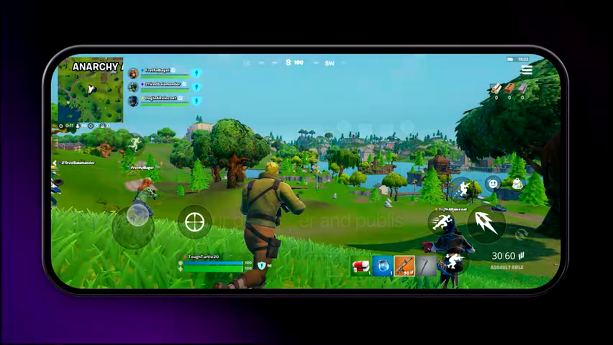
_Screenshot from 00:14:59_
---
## Section 484 (00:15:00)
**Transcript:**
> 2
**Visual Reference:**

_Screenshot from 00:15:00_
---
## Section 485 (00:15:01)
**Transcript:**
> 1
**Visual Reference:**

_Screenshot from 00:15:01_
---
## Section 486 (00:15:02)
**Transcript:**
> 1
**Visual Reference:**

_Screenshot from 00:15:02_
---
## Section 487 (00:15:03)
**Transcript:**
> 1
**Visual Reference:**

_Screenshot from 00:15:03_
---
## Section 488 (00:15:04)
**Transcript:**
> Mortnite began as a Battle Royale game, built by Appet Games.
**Visual Reference:**

_Screenshot from 00:15:04_
---
## Section 489 (00:15:08)
**Transcript:**
> But since we have opened up into an entire ecosystem,
**Visual Reference:**

_Screenshot from 00:15:08_
---
## Section 490 (00:15:12)
**Transcript:**
> that hosts games built by independent developers,
**Visual Reference:**

_Screenshot from 00:15:12_
---
## Section 491 (00:15:15)
**Transcript:**
> some are small teams, and some are large teams.
**Visual Reference:**

_Screenshot from 00:15:15_
---
## Section 492 (00:15:18)
**Transcript:**
> But it's a growing and successful economy for everybody participating.
**Visual Reference:**

_Screenshot from 00:15:18_
---
## Section 493 (00:15:23)
**Transcript:**
> And it's a better alternative to robots, with better revenue sharing
**Visual Reference:**

_Screenshot from 00:15:23_
---
## Section 494 (00:15:27)
**Transcript:**
> than in the robot tech system.
**Visual Reference:**
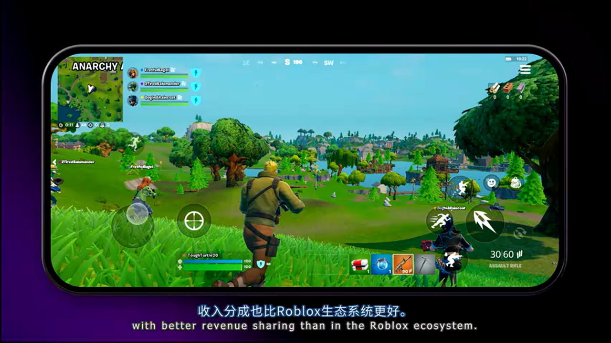
_Screenshot from 00:15:27_
---
## Section 495 (00:15:31)
**Transcript:**
> And the idea in Fortnite is you use the new Unreal Editor for Fortnite
**Visual Reference:**

_Screenshot from 00:15:31_
---
## Section 496 (00:15:35)
**Transcript:**
> to develop experiences and then deploy them into Fortnite Live.
**Visual Reference:**

_Screenshot from 00:15:35_
---
## Section 497 (00:15:41)
**Transcript:**
> And so you can make a game and then release it with only an hour or two wait
**Visual Reference:**

_Screenshot from 00:15:41_
---
## Section 498 (00:15:47)
**Transcript:**
> to make the game go live into Fortnite.
**Visual Reference:**

_Screenshot from 00:15:47_
---
## Section 499 (00:15:50)
**Transcript:**
> Developers doing this are earning hundreds of millions of dollars per year.
**Visual Reference:**

_Screenshot from 00:15:50_
---
## Section 500 (00:15:54)
**Transcript:**
> And Fortnite is now open to developers in mainland China
**Visual Reference:**

_Screenshot from 00:15:54_
---
## Section 501 (00:15:59)
**Transcript:**
> to publish games into the Fortnite ecosystem directly.
**Visual Reference:**

_Screenshot from 00:15:59_
---
## Section 502 (00:16:02)
**Transcript:**
> This is a new program that's opening up,
**Visual Reference:**

_Screenshot from 00:16:02_
---
## Section 503 (00:16:04)
**Transcript:**
> and we welcome all of you to come and develop in Fortnite
**Visual Reference:**

_Screenshot from 00:16:04_
---
## Section 504 (00:16:08)
**Transcript:**
> to reach a worldwide audience with your games.
**Visual Reference:**

_Screenshot from 00:16:08_
---
## Section 505 (00:16:19)
**Transcript:**
> And we see this as an opportunity for all developers,
**Visual Reference:**

_Screenshot from 00:16:19_
---
## Section 506 (00:16:22)
**Transcript:**
> including AAA developers, building high-end games,
**Visual Reference:**

_Screenshot from 00:16:22_
---
## Section 507 (00:16:26)
**Transcript:**
> their standalone games for PC or console or mobile.
**Visual Reference:**

_Screenshot from 00:16:26_
---
## Section 508 (00:16:30)
**Transcript:**
> One thing many developers are doing is they're building a standalone game,
**Visual Reference:**

_Screenshot from 00:16:30_
---
## Section 509 (00:16:34)
**Transcript:**
> but then they're also marketing the game by launching a smaller experience
**Visual Reference:**

_Screenshot from 00:16:34_
---
## Section 510 (00:16:38)
**Transcript:**
> similar to the game into Fortnite, reaching the entire Fortnite audience
**Visual Reference:**

_Screenshot from 00:16:38_
---
## Section 511 (00:16:43)
**Transcript:**
> and encouraging them to go out to the Epic Games Store or other stores
**Visual Reference:**

_Screenshot from 00:16:43_
---
## Section 512 (00:16:47)
**Transcript:**
> and to buy the game there.
**Visual Reference:**

_Screenshot from 00:16:47_
---
## Section 513 (00:16:49)
**Transcript:**
> And in this way, you can think of Fortnite as a marketing outlet
**Visual Reference:**

_Screenshot from 00:16:49_
---
## Section 514 (00:16:52)
**Transcript:**
> reaching up to 100 million monthly active users in Fortnite
**Visual Reference:**

_Screenshot from 00:16:52_
---
## Section 515 (00:16:57)
**Transcript:**
> and encourage them to learn about your game and then come in and buy your game elsewhere.
**Visual Reference:**

_Screenshot from 00:16:57_
---
## Section 516 (00:17:05)
**Transcript:**
> Fortnite is a huge game with a huge audience.
**Visual Reference:**

_Screenshot from 00:17:05_
---
## Section 517 (00:17:09)
**Transcript:**
> Here's some of the statistics on it.
**Visual Reference:**

_Screenshot from 00:17:09_
---
## Section 518 (00:17:12)
**Transcript:**
> But the far majority of Fortnite players now play content built by creators other than Epic.
**Visual Reference:**

_Screenshot from 00:17:12_
---
## Section 519 (00:17:20)
**Transcript:**
> And there's a huge opportunity to reach them and reach huge audience scales.
**Visual Reference:**

_Screenshot from 00:17:20_
---
## Section 520 (00:17:26)
**Transcript:**
> And the other interesting thing about Fortnite is the entire audience is socially linked.
**Visual Reference:**

_Screenshot from 00:17:26_
---
## Section 521 (00:17:30)
**Transcript:**
> The friend system and soon the voice chat system in Fortnite is the same system
**Visual Reference:**

_Screenshot from 00:17:30_
---
## Section 522 (00:17:36)
**Transcript:**
> in the Epic Games Store and in Epic Online Services.
**Visual Reference:**

_Screenshot from 00:17:36_
---
## Section 523 (00:17:39)
**Transcript:**
> And if you use it in your own games, then all Fortnite players and all of your players
**Visual Reference:**

_Screenshot from 00:17:39_
---
## Section 524 (00:17:43)
**Transcript:**
> across all of your different games can very easily connect to each other
**Visual Reference:**

_Screenshot from 00:17:43_
---
## Section 525 (00:17:47)
**Transcript:**
> across all platforms and engage across all platforms with cross-platform
**Visual Reference:**

_Screenshot from 00:17:47_
---
## Section 526 (00:17:52)
**Transcript:**
> and cross-game parties and voice chat.
**Visual Reference:**

_Screenshot from 00:17:52_
---
## Section 527 (00:17:59)
**Transcript:**
> So far, Fortnite creators have earned over 700 million US dollars since launch
**Visual Reference:**

_Screenshot from 00:17:59_
---
## Section 528 (00:18:04)
**Transcript:**
> and we see an opportunity for this number to grow significantly
**Visual Reference:**
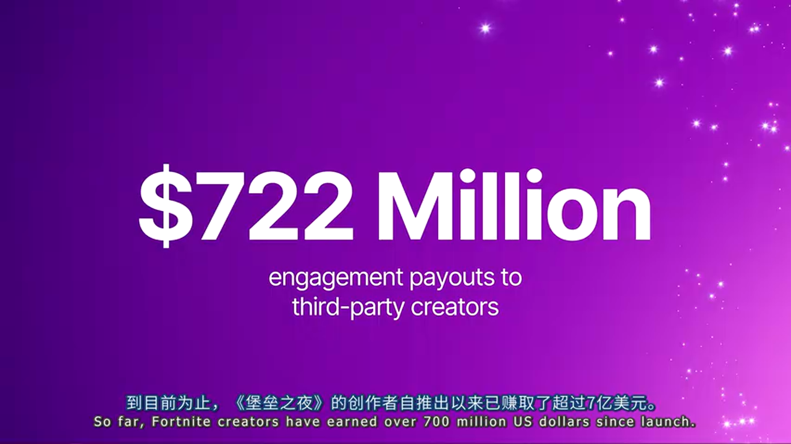
_Screenshot from 00:18:04_
---
## Section 529 (00:18:08)
**Transcript:**
> as more and more players come into the experience.
**Visual Reference:**

_Screenshot from 00:18:08_
---
## Section 530 (00:18:12)
**Transcript:**
> So the current state of Fortnite and Unreal Engine is just the current step
**Visual Reference:**

_Screenshot from 00:18:12_
---
## Section 531 (00:18:19)
**Transcript:**
> in a long journey to build the future of gaming together with all the developers
**Visual Reference:**

_Screenshot from 00:18:19_
---
## Section 532 (00:18:24)
**Transcript:**
> who are part of the Unreal Engine ecosystem.
**Visual Reference:**

_Screenshot from 00:18:24_
---
## Section 533 (00:18:28)
**Transcript:**
> And what we aspire to build together with you, some call it the future of multiplayer gaming.
**Visual Reference:**

_Screenshot from 00:18:28_
---
## Section 534 (00:18:34)
**Transcript:**
> Some people call it the Metaverse, but we believe it's a social gaming ecosystem
**Visual Reference:**

_Screenshot from 00:18:34_
---
## Section 535 (00:18:40)
**Transcript:**
> in which players and their friends can go from experience to experience seamlessly
**Visual Reference:**

_Screenshot from 00:18:40_
---
## Section 536 (00:18:45)
**Transcript:**
> and have a great time playing together.
**Visual Reference:**

_Screenshot from 00:18:45_
---
## Section 537 (00:18:47)
**Transcript:**
> And players can build up their collections of items and spend money on cosmetic items
**Visual Reference:**

_Screenshot from 00:18:47_
---
## Section 538 (00:18:53)
**Transcript:**
> across games and use them everywhere.
**Visual Reference:**

_Screenshot from 00:18:53_
---
## Section 539 (00:18:57)
**Transcript:**
> This is a future that we're building towards simultaneously with our development work
**Visual Reference:**

_Screenshot from 00:18:57_
---
## Section 540 (00:19:02)
**Transcript:**
> in Unreal Engine 5 and our development work in the Fortnite ecosystem.
**Visual Reference:**
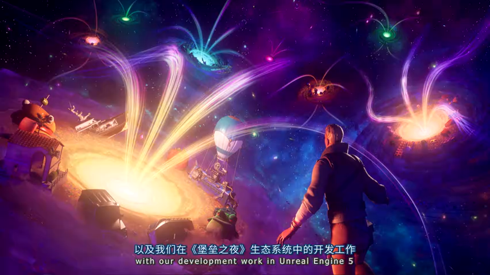
_Screenshot from 00:19:02_
---
## Section 541 (00:19:08)
**Transcript:**
> And now I'm going to talk about some of the features that are not in Unreal Engine
**Visual Reference:**

_Screenshot from 00:19:08_
---
## Section 542 (00:19:12)
**Transcript:**
> mainstream yet, but are available in Fortnite.
**Visual Reference:**

_Screenshot from 00:19:12_
---
## Section 543 (00:19:17)
**Transcript:**
> These are features that we're building within Fortnite first
**Visual Reference:**

_Screenshot from 00:19:17_
---
## Section 544 (00:19:20)
**Transcript:**
> and then when they're ready for everybody, we're going to bring them into Unreal Engine.
**Visual Reference:**

_Screenshot from 00:19:20_
---
## Section 545 (00:19:24)
**Transcript:**
> First of all, we've built the verse scripting language.
**Visual Reference:**
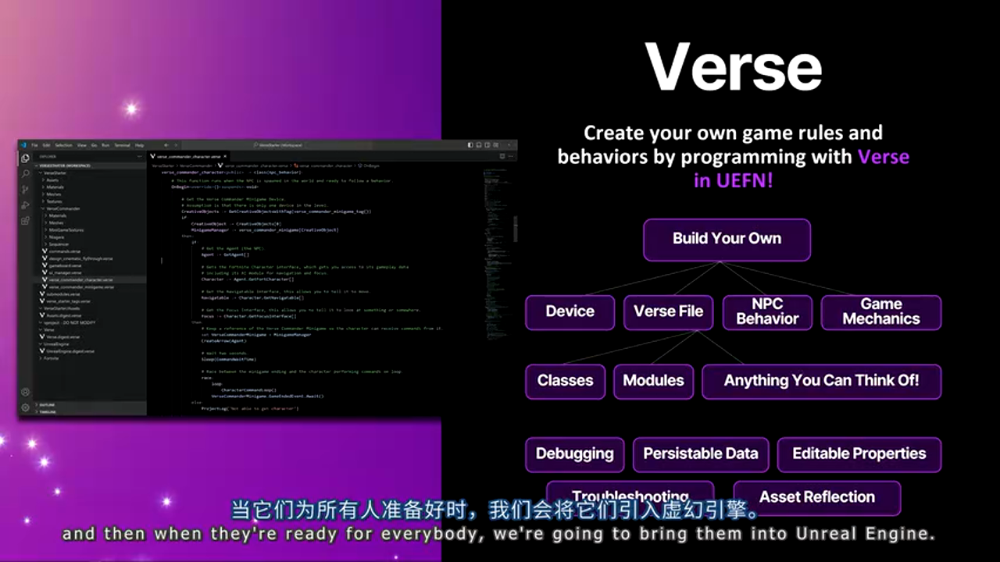
_Screenshot from 00:19:24_
---
## Section 546 (00:19:28)
**Transcript:**
> It's a next generation programming language that's aimed at powering the future of gaming.
**Visual Reference:**

_Screenshot from 00:19:28_
---
## Section 547 (00:19:34)
**Transcript:**
> It's a simple and learnable language that has a great amount of expressive power.
**Visual Reference:**

_Screenshot from 00:19:34_
---
## Section 548 (00:19:40)
**Transcript:**
> It's aimed to be the sound language that's safe and verifiable
**Visual Reference:**

_Screenshot from 00:19:40_
---
## Section 549 (00:19:45)
**Transcript:**
> and can serve as a future of a large open economy spanning potentially billions of players in the future.
**Visual Reference:**

_Screenshot from 00:19:45_
---
## Section 550 (00:19:54)
**Transcript:**
> And the technology underneath it is meant to scale up to support networking and multiplayer games
**Visual Reference:**

_Screenshot from 00:19:54_
---
## Section 551 (00:20:00)
**Transcript:**
> not with hundreds of players of concurrency, but in the future with millions of players of concurrency
**Visual Reference:**

_Screenshot from 00:20:00_
---
## Section 552 (00:20:06)
**Transcript:**
> and a shared world together using new technology called transactional memory.
**Visual Reference:**

_Screenshot from 00:20:06_
---
## Section 553 (00:20:12)
**Transcript:**
> And we're designing verse together with some of the best programming language designers in the world
**Visual Reference:**

_Screenshot from 00:20:12_
---
## Section 554 (00:20:18)
**Transcript:**
> with the aim of making verse a future open standard for game development
**Visual Reference:**

_Screenshot from 00:20:18_
---
## Section 555 (00:20:23)
**Transcript:**
> just as a JavaScript is an open standard for web development.
**Visual Reference:**

_Screenshot from 00:20:23_
---
## Section 556 (00:20:29)
**Transcript:**
> We're also building a next generation scene graph and testing it in Fortnite.
**Visual Reference:**

_Screenshot from 00:20:29_
---
## Section 557 (00:20:34)
**Transcript:**
> A scene graph is the visual and code representation of all of the objects in the world as a hierarchy of objects in a tree.
**Visual Reference:**

_Screenshot from 00:20:34_
---
## Section 558 (00:20:43)
**Transcript:**
> The aim of a scene graph is to scale to support huge game worlds.
**Visual Reference:**

_Screenshot from 00:20:43_
---
## Section 559 (00:20:47)
**Transcript:**
> Game worlds built by thousands or millions of developers all working together in partnership
**Visual Reference:**

_Screenshot from 00:20:47_
---
## Section 560 (00:20:53)
**Transcript:**
> and scaling to huge bodies of interoperable content and modules shared by many teams.
**Visual Reference:**

_Screenshot from 00:20:53_
---
## Section 561 (00:21:00)
**Transcript:**
> And so when we see content marketplaces like FAB today, right now they're selling 3D textures and models
**Visual Reference:**

_Screenshot from 00:21:00_
---
## Section 562 (00:21:07)
**Transcript:**
> but they're just basic low level content objects.
**Visual Reference:**

_Screenshot from 00:21:07_
---
## Section 563 (00:21:10)
**Transcript:**
> In the future we see all of these objects becoming smart objects including not just content but also code that powers them
**Visual Reference:**

_Screenshot from 00:21:10_
---
## Section 564 (00:21:18)
**Transcript:**
> so that a vehicle built in one by one developer in FAB or in a Fortnite experience can be ported to and work in any other experience built by anybody else.
**Visual Reference:**

_Screenshot from 00:21:18_
---
## Section 565 (00:21:30)
**Transcript:**
> And we see the future of this game development ecosystem as not just many isolated teams building separate experiences
**Visual Reference:**

_Screenshot from 00:21:30_
---
## Section 566 (00:21:39)
**Transcript:**
> but many teams building experiences that interoperate together and form a huge economy with billions of users
**Visual Reference:**

_Screenshot from 00:21:39_
---
## Section 567 (00:21:46)
**Transcript:**
> and tens or even hundreds of billions of dollars of global annual revenue in the future.
**Visual Reference:**

_Screenshot from 00:21:46_
---
## Section 568 (00:21:53)
**Transcript:**
> This is our aim and what we're trying to build.
**Visual Reference:**

_Screenshot from 00:21:53_
---
## Section 569 (00:21:56)
**Transcript:**
> And as our Fortnite efforts come together with our Unreal Engine 5 efforts and we build out the future of these systems,
**Visual Reference:**

_Screenshot from 00:21:56_
---
## Section 570 (00:22:04)
**Transcript:**
> Unreal Engine 5 will evolve into Unreal Engine 6.
**Visual Reference:**

_Screenshot from 00:22:04_
---
## Section 571 (00:22:09)
**Transcript:**
> And we will know that we are done with this and the Unreal Engine 6 is ready for everybody when we have the best of both worlds together in a single ecosystem and a single engine.
**Visual Reference:**

_Screenshot from 00:22:09_
---
## Section 572 (00:22:19)
**Transcript:**
> And the idea of Unreal Engine 6 is a complete freedom to build and deploy your games everywhere you want.
**Visual Reference:**

_Screenshot from 00:22:19_
---
## Section 573 (00:22:26)
**Transcript:**
> You can build standalone games and to deploy them to all stores on all platforms including Microsoft and Sony and Apple and Google stores including Steam
**Visual Reference:**

_Screenshot from 00:22:26_
---
## Section 574 (00:22:37)
**Transcript:**
> including the Epic Games Store as standalone products.
**Visual Reference:**

_Screenshot from 00:22:37_
---
## Section 575 (00:22:40)
**Transcript:**
> But we also want to enable you to build any experience and deploy it live into Fortnite or other Unreal Engine 6 powered games that support these new ecosystem standards.
**Visual Reference:**

_Screenshot from 00:22:40_
---
## Section 576 (00:22:52)
**Transcript:**
> And our aim is to take all the tools that we have built for Fortnite to power Fortnite growing from a game into an ecosystem and give them to all developers so that your games,
**Visual Reference:**

_Screenshot from 00:22:52_
---
## Section 577 (00:23:04)
**Transcript:**
> if you want, can evolve into ecosystem themselves.
**Visual Reference:**
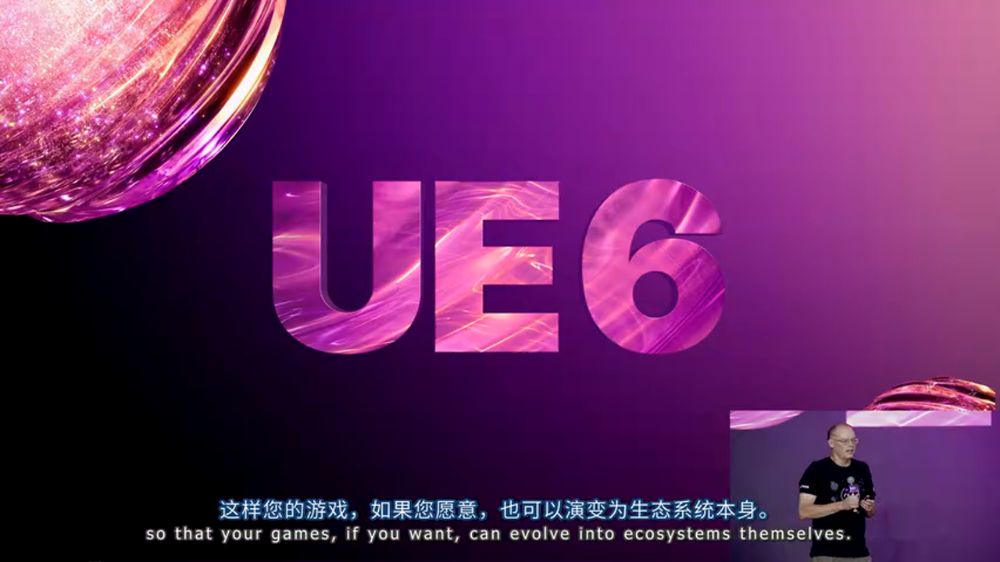
_Screenshot from 00:23:04_
---
## Section 578 (00:23:09)
**Transcript:**
> And we see this future as being not only interoperable technology and interoperable content standards but also an open economy in which all developers who choose to participate together can participate in an open game economy in which cosmetic items built in any game can work in any other game that chooses to participate
**Visual Reference:**

_Screenshot from 00:23:09_
---
## Section 579 (00:23:33)
**Transcript:**
> where they all follow common standards for quality, common standards for safety, common standards for interoperability and to build an economy together.
**Visual Reference:**

_Screenshot from 00:23:33_
---
## Section 580 (00:23:45)
**Transcript:**
> And just as the Fortnite economy today is based on revenue sharing from the Fortnite item shop where people buy items to Fortnite islands where people engage and play and have fun,
**Visual Reference:**

_Screenshot from 00:23:45_
---
## Section 581 (00:23:59)
**Transcript:**
> the open metaverse economy will be based on all participants who choose to work together, revenue sharing from their game to item shops to other games based on spending and engagement.
**Visual Reference:**

_Screenshot from 00:23:59_
---
## Section 582 (00:24:12)
**Transcript:**
> And in this future, we see the open metaverse is evolving without any overlord or any single powerful company dominating it.
**Visual Reference:**

_Screenshot from 00:24:12_
---
## Section 583 (00:24:22)
**Transcript:**
> We see a future in which Epic and developers like yourselves and other companies like Disney all act together as peers.
**Visual Reference:**

_Screenshot from 00:24:22_
---
## Section 584 (00:24:32)
**Transcript:**
> We're peers working together to build an open system and to build the future of gaming together.
**Visual Reference:**

_Screenshot from 00:24:32_
---
## Section 585 (00:24:38)
**Transcript:**
> And these are awesome long running plans that we'll be working on throughout the rest of this decade.
**Visual Reference:**

_Screenshot from 00:24:38_
---
## Section 586 (00:24:44)
**Transcript:**
> And every few months you can expect major new developments from us as we evolve from the current state of gaming to the future.
**Visual Reference:**

_Screenshot from 00:24:44_
---
## Section 587 (00:24:54)
**Transcript:**
> And Epic Games is very grateful for all of you being a part of this for entrusting us to provide you with technology and services and for working with us together to build the future of gaming.
**Visual Reference:**
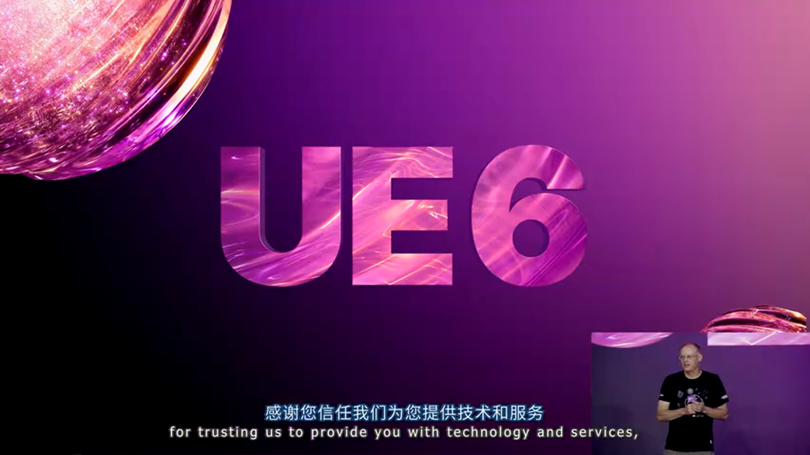
_Screenshot from 00:24:54_
---
## Section 588 (00:25:06)
**Transcript:**
> I think it's a future of gaming that is bright and lucrative for all of us and a future of gaming that is open and very exciting for game developers and game players alike.
**Visual Reference:**

_Screenshot from 00:25:06_
---
## Section 589 (00:25:17)
**Transcript:**
> Thank you very much for your time.
**Visual Reference:**

_Screenshot from 00:25:17_
---
## Section 590 (00:25:19)
**Transcript:**
> Thank you very much.
**Visual Reference:**

_Screenshot from 00:25:19_
---
## Section 591 (00:25:49)
**Transcript:**
> Thank you very much for your time.
**Visual Reference:**
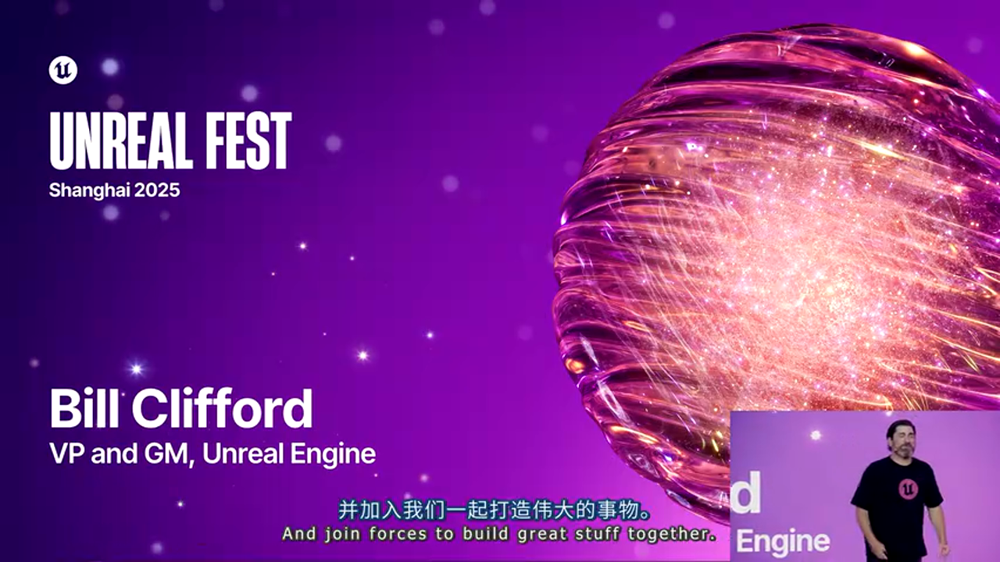
_Screenshot from 00:25:49_
---
## Section 592 (00:25:59)
**Transcript:**
> Thank you very much for your time.
**Visual Reference:**

_Screenshot from 00:25:59_
---
## Section 593 (00:26:09)
**Transcript:**
> In fact, in 2025 China has now surpassed the United States in monthly active Unreal Engine users making it the largest UE developer community in the world.
**Visual Reference:**

_Screenshot from 00:26:09_
---
## Section 594 (00:26:23)
**Transcript:**
> You guys are growing also at a faster rate than any other top 10 market globally.
**Visual Reference:**

_Screenshot from 00:26:23_
---
## Section 595 (00:26:31)
**Transcript:**
> Not only does China have the largest UE developer community but it's increasingly the most connected community.
**Visual Reference:**

_Screenshot from 00:26:31_
---
## Section 596 (00:26:37)
**Transcript:**
> We've got hundreds of thousands of people now connecting with Epic and with each other on WeChat and on Billy Billy.
**Visual Reference:**

_Screenshot from 00:26:37_
---
## Section 597 (00:26:45)
**Transcript:**
> And we're really committed to investing in this community here in China.
**Visual Reference:**

_Screenshot from 00:26:45_
---
## Section 598 (00:26:51)
**Transcript:**
> We can do a lot better and we're committed to launching more localized learning content, better localized documentation.
**Visual Reference:**
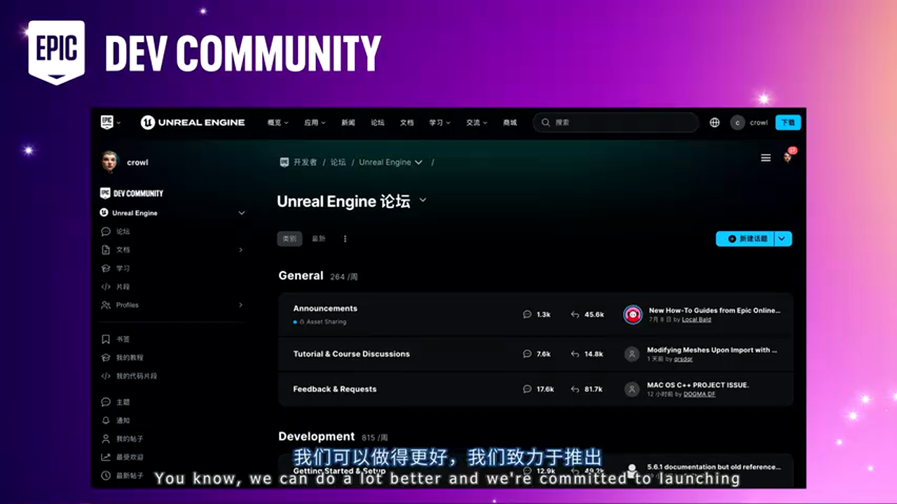
_Screenshot from 00:26:51_
---
## Section 599 (00:26:58)
**Transcript:**
> And we've been working on AI driven support tools like the Epic developer assistant which will be launching later this year on the Epic developer community website.
**Visual Reference:**

_Screenshot from 00:26:58_
---
## Section 600 (00:27:08)
**Transcript:**
> If you haven't checked out the Epic dev community please visit, please engage.
**Visual Reference:**

_Screenshot from 00:27:08_
---
## Section 601 (00:27:13)
**Transcript:**
> And we're going to be investing more there and we want that to be a great place for you to go and get all the support you need from Epic and from your peers.
**Visual Reference:**

_Screenshot from 00:27:13_
---
## Section 602 (00:27:22)
**Transcript:**
> We're also committed to investing in talent development.
**Visual Reference:**
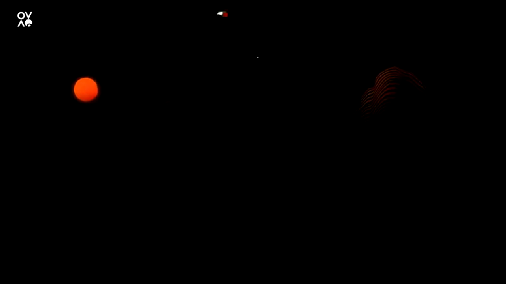
_Screenshot from 00:27:22_
---
## Section 603 (00:27:27)
**Transcript:**
> Primarily we're doing this by enabling and supporting authorized training partners in China.
**Visual Reference:**
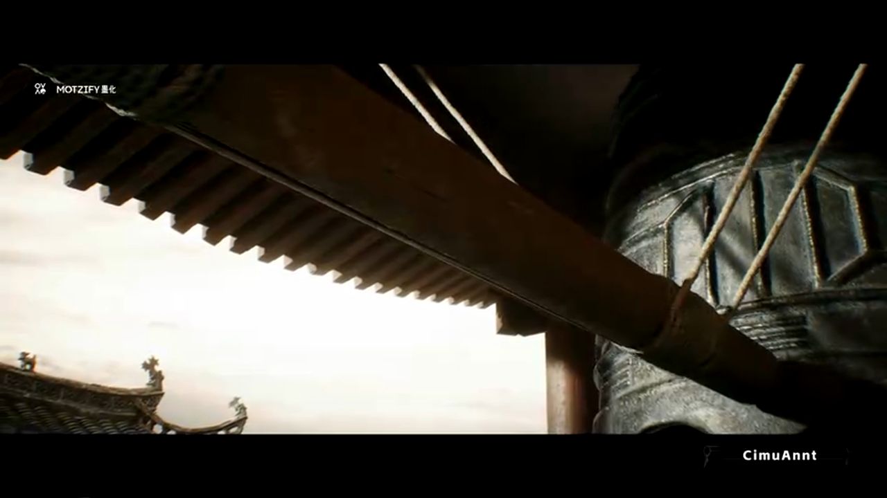
_Screenshot from 00:27:27_
---
## Section 604 (00:27:33)
**Transcript:**
> What you're seeing here is a sample of student projects from Massify which is one of our leading local authorized training partners who've trained thousands of UE learners from hundreds of different companies representing all industries in China.
**Visual Reference:**
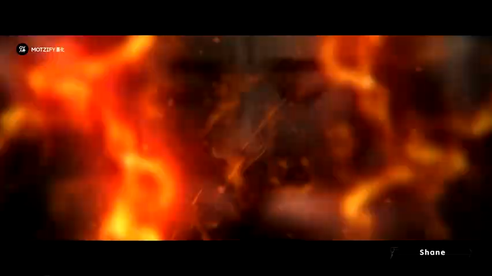
_Screenshot from 00:27:33_
---
## Section 605 (00:27:50)
**Transcript:**
> We're also focused on bringing UE curriculum to academic institutions here in China.
**Visual Reference:**
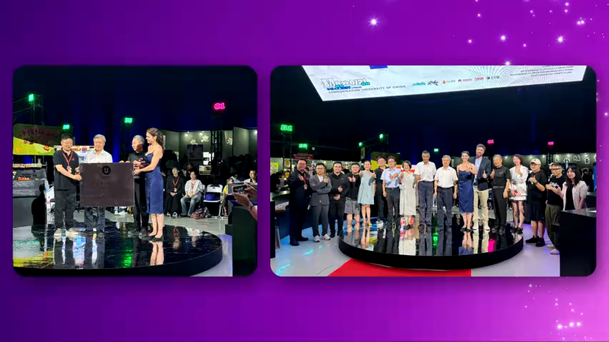
_Screenshot from 00:27:50_
---
## Section 606 (00:27:56)
**Transcript:**
> One example of this is our new partnership with the Communications College of China who we worked with to nationalize their game design curriculum.
**Visual Reference:**

_Screenshot from 00:27:56_
---
## Section 607 (00:28:07)
**Transcript:**
> And the demand for Unreal Engine talent here in China has never been greater.
**Visual Reference:**

_Screenshot from 00:28:07_
---
## Section 608 (00:28:12)
**Transcript:**
> As more and more studios like the ones you see here on screen are making the leap to Unreal Engine 5.
**Visual Reference:**

_Screenshot from 00:28:12_
---
## Section 609 (00:28:21)
**Transcript:**
> And many of these teams who've made that switch to UE 5 were inspired by the incredible success of Black Myth, Wukong.
**Visual Reference:**

_Screenshot from 00:28:21_
---
## Section 610 (00:28:27)
**Transcript:**
> Game science has now sold tens of millions of copies worldwide.
**Visual Reference:**

_Screenshot from 00:28:27_
---
## Section 611 (00:28:31)
**Transcript:**
> They put Chinese cultural heritage on the global stage and they've really demonstrated to the world what a small but mighty team can do with Unreal Engine.
**Visual Reference:**

_Screenshot from 00:28:31_
---
## Section 612 (00:28:40)
**Transcript:**
> This week I was excited to hear Game Science announced that they're working on a sequel, Black Myth, Zeng Qui.
**Visual Reference:**

_Screenshot from 00:28:40_
---
## Section 613 (00:28:49)
**Transcript:**
> The success of Black Myth, Wukong also represents the rise of the AAA indie here in China and really around the world which brings us to S-game who are getting ready to launch Phantom Blade Zero, one of the most highly anticipated UE 5 projects in the world.
**Visual Reference:**
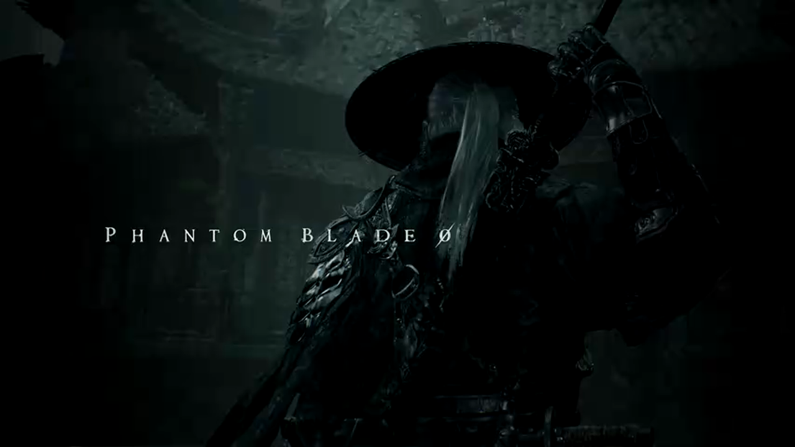
_Screenshot from 00:28:49_
---
## Section 614 (00:29:05)
**Transcript:**
> The game's looking phenomenal and its stylish mix of truly authentic martial arts, steampunk in folklore are creating buzz with players around the world.
**Visual Reference:**

_Screenshot from 00:29:05_
---
## Section 615 (00:29:17)
**Transcript:**
> Let's take a look at some boss battle gameplay.
**Visual Reference:**
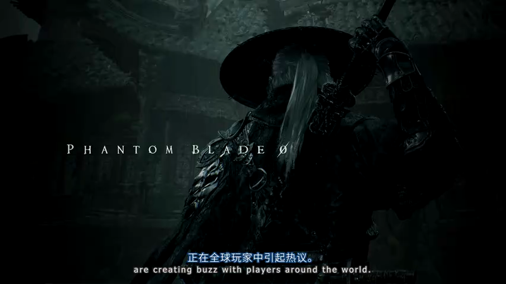
_Screenshot from 00:29:17_
---
## Section 616 (00:29:48)
**Transcript:**
> Yeah
**Visual Reference:**

_Screenshot from 00:29:48_
---
## Section 617 (00:30:07)
**Transcript:**
> 思统 123aw
**Visual Reference:**

_Screenshot from 00:30:07_
---
## Section 618 (00:30:11)
**Transcript:**
> 我的人是很重要
**Visual Reference:**
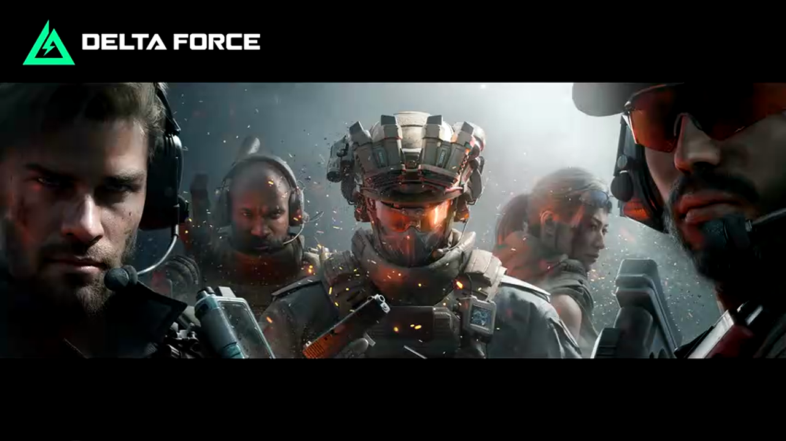
_Screenshot from 00:30:11_
---
## Section 619 (00:30:15)
**Transcript:**
> 罗文翁订o的单独
**Visual Reference:**

_Screenshot from 00:30:15_
---
## Section 620 (00:30:18)
**Transcript:**
> 了比骞高加票
**Visual Reference:**

_Screenshot from 00:30:18_
---
## Section 621 (00:30:20)
**Transcript:**
> Now the developers here
**Visual Reference:**

_Screenshot from 00:30:20_
---
## Section 622 (00:30:30)
**Transcript:**
> 谢谢找邨运的单运
**Visual Reference:**

_Screenshot from 00:30:30_
---
## Section 623 (00:30:34)
**Transcript:**
> 过员报处了起兵器就走motori
**Visual Reference:**

_Screenshot from 00:30:34_
---
## Section 624 (00:30:38)
**Transcript:**
> 再往丹契的 Coll Graham
**Visual Reference:**

_Screenshot from 00:30:38_
---
## Section 625 (00:30:41)
**Transcript:**
> 业组加则今日は
**Visual Reference:**

_Screenshot from 00:30:41_
---
## Section 626 (00:30:44)
**Transcript:**
> 共队的戒養
**Visual Reference:**

_Screenshot from 00:30:44_
---
## Section 627 (00:30:45)
**Transcript:**
> 因正上市
**Visual Reference:**

_Screenshot from 00:30:45_
---
## Section 628 (00:31:04)
**Transcript:**
> 大家好 我是来自利利斯游戏的沈南
**Visual Reference:**
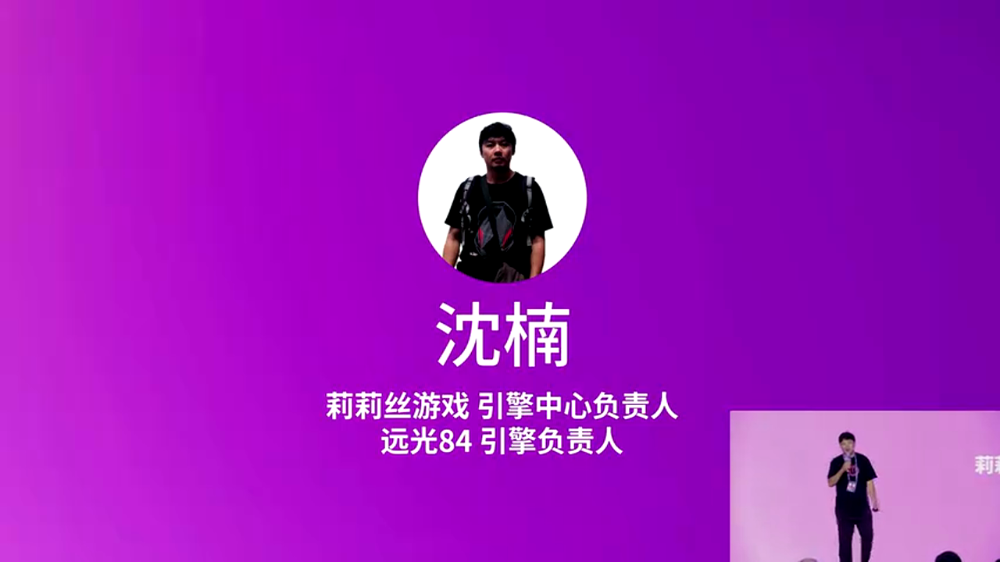
_Screenshot from 00:31:04_
---
## Section 629 (00:31:08)
**Transcript:**
> 很高兴 很荣幸站在这个
**Visual Reference:**
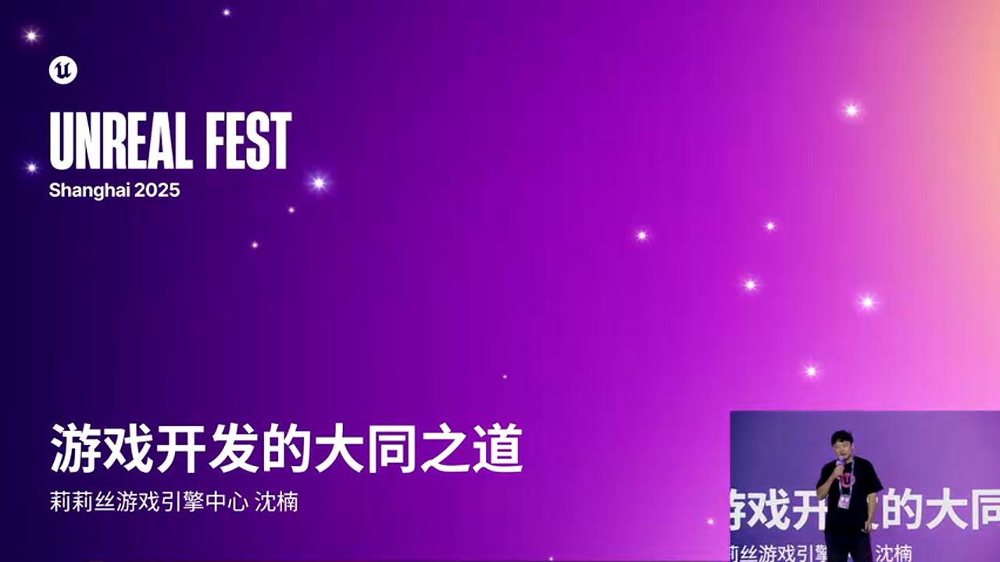
_Screenshot from 00:31:08_
---
## Section 630 (00:31:11)
**Transcript:**
> 阿瑞兰Fest的舞台
**Visual Reference:**

_Screenshot from 00:31:11_
---
## Section 631 (00:31:13)
**Transcript:**
> 第一次还是在叫欧奔队的时候
**Visual Reference:**

_Screenshot from 00:31:13_
---
## Section 632 (00:31:16)
**Transcript:**
> 作为一个好意的老兵
**Visual Reference:**

_Screenshot from 00:31:16_
---
## Section 633 (00:31:21)
**Transcript:**
> 有些参加很多阿瑞兰的项目
**Visual Reference:**
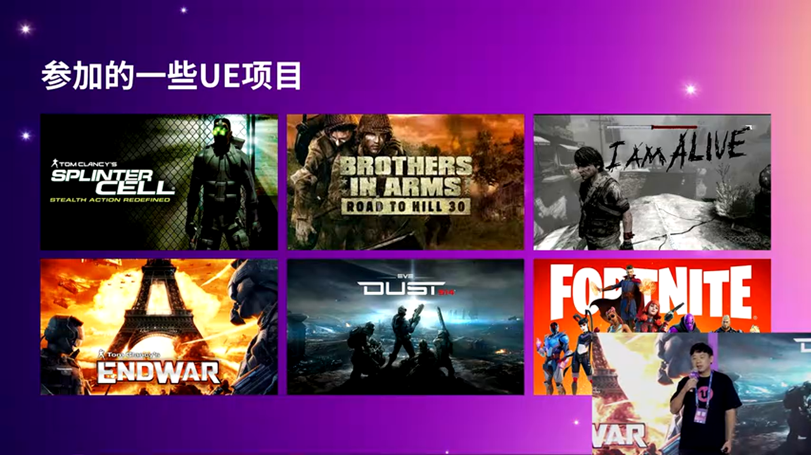
_Screenshot from 00:31:21_
---
## Section 634 (00:31:23)
**Transcript:**
> 在这里我很荣幸地跟大家介绍
**Visual Reference:**

_Screenshot from 00:31:23_
---
## Section 635 (00:31:27)
**Transcript:**
> 我们最新参加的这个
**Visual Reference:**

_Screenshot from 00:31:27_
---
## Section 636 (00:31:30)
**Transcript:**
> 阿瑞兰项目远光八四
**Visual Reference:**

_Screenshot from 00:31:30_
---
## Section 637 (00:31:33)
**Transcript:**
> 这是利利斯第一款英雄设计游戏
**Visual Reference:**
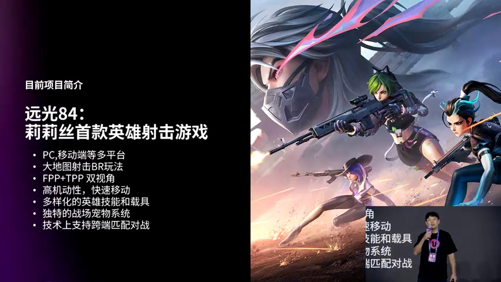
_Screenshot from 00:31:33_
---
## Section 638 (00:31:36)
**Transcript:**
> 还有很多标签全球一起手发
**Visual Reference:**

_Screenshot from 00:31:36_
---
## Section 639 (00:31:40)
**Transcript:**
> 然后PC一斗多平台大地图设计
**Visual Reference:**

_Screenshot from 00:31:40_
---
## Section 640 (00:31:43)
**Transcript:**
> 第一人称和第三人称同时支持双视角
**Visual Reference:**

_Screenshot from 00:31:43_
---
## Section 641 (00:31:47)
**Transcript:**
> 让我们开一段视频对这个游戏有一个直观的日式
**Visual Reference:**

_Screenshot from 00:31:47_
---
## Section 642 (00:33:03)
**Transcript:**
> 谢谢
**Visual Reference:**

_Screenshot from 00:33:03_
---
## Section 643 (00:33:07)
**Transcript:**
> 大家可以看到这个游戏其实跟利利斯
**Visual Reference:**

_Screenshot from 00:33:07_
---
## Section 644 (00:33:10)
**Transcript:**
> 其他游戏非常不一样
**Visual Reference:**

_Screenshot from 00:33:10_
---
## Section 645 (00:33:12)
**Transcript:**
> 对利利斯来说是一个重大的突破
**Visual Reference:**

_Screenshot from 00:33:12_
---
## Section 646 (00:33:15)
**Transcript:**
> 利斯之前都是做卡牌游戏和SL级游戏出称
**Visual Reference:**

_Screenshot from 00:33:15_
---
## Section 647 (00:33:21)
**Transcript:**
> 对于我们来说这个游戏有非常多的挑战
**Visual Reference:**

_Screenshot from 00:33:21_
---
## Section 648 (00:33:24)
**Transcript:**
> 就第一个重大的挑战其实它是一个画平台开发的游戏
**Visual Reference:**

_Screenshot from 00:33:24_
---
## Section 649 (00:33:28)
**Transcript:**
> 它不关光是在Steam上攔驰
**Visual Reference:**

_Screenshot from 00:33:28_
---
## Section 650 (00:33:32)
**Transcript:**
> 而且会同时在IOS和安卓上去拔布
**Visual Reference:**

_Screenshot from 00:33:32_
---
## Section 651 (00:33:36)
**Transcript:**
> 而且更加是一个全球发布级一个游戏
**Visual Reference:**

_Screenshot from 00:33:36_
---
## Section 652 (00:33:39)
**Transcript:**
> 我们之前也有把它一直到其他抗手平台
**Visual Reference:**

_Screenshot from 00:33:39_
---
## Section 653 (00:33:44)
**Transcript:**
> 传统的画平台游戏开发会有非常多的挑战
**Visual Reference:**

_Screenshot from 00:33:44_
---
## Section 654 (00:33:48)
**Transcript:**
> 也有非常高的技术门槛
**Visual Reference:**

_Screenshot from 00:33:48_
---
## Section 655 (00:33:50)
**Transcript:**
> 但是所惜我们有Ariel引擎
**Visual Reference:**

_Screenshot from 00:33:50_
---
## Section 656 (00:33:53)
**Transcript:**
> 它提供了非常多的画平台开发的框架
**Visual Reference:**

_Screenshot from 00:33:53_
---
## Section 657 (00:33:57)
**Transcript:**
> 包括由来输入和确认
**Visual Reference:**
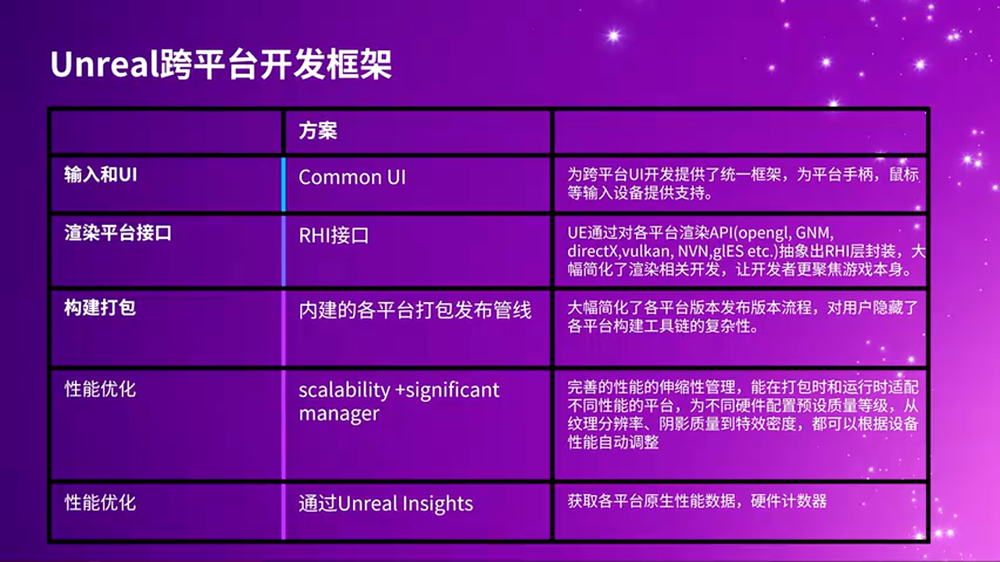
_Screenshot from 00:33:57_
---
## Section 658 (00:34:00)
**Transcript:**
> 其实这个都包括我们的隐藏了很多
**Visual Reference:**

_Screenshot from 00:34:00_
---
## Section 659 (00:34:02)
**Transcript:**
> 块平台开发的复达度
**Visual Reference:**

_Screenshot from 00:34:02_
---
## Section 660 (00:34:04)
**Transcript:**
> 让我们非常顺利地在各个平台进行开发
**Visual Reference:**

_Screenshot from 00:34:04_
---
## Section 661 (00:34:08)
**Transcript:**
> 而且为各个平台进行游画
**Visual Reference:**

_Screenshot from 00:34:08_
---
## Section 662 (00:34:10)
**Transcript:**
> 技能在一些高端平台达到很好的确认效果
**Visual Reference:**

_Screenshot from 00:34:10_
---
## Section 663 (00:34:13)
**Transcript:**
> 也能在一些低端平台得到可以顺利由来的一些针术和性能
**Visual Reference:**

_Screenshot from 00:34:13_
---
## Section 664 (00:34:21)
**Transcript:**
> 另外一个很大一个挑战
**Visual Reference:**

_Screenshot from 00:34:21_
---
## Section 665 (00:34:23)
**Transcript:**
> 就是如何生产高品质的一些资产
**Visual Reference:**

_Screenshot from 00:34:23_
---
## Section 666 (00:34:26)
**Transcript:**
> 这个对利利产生来说也是非常大的一个挑战
**Visual Reference:**

_Screenshot from 00:34:26_
---
## Section 667 (00:34:29)
**Transcript:**
> 因为之前我们游戏没有这么多高品质三敌的资产
**Visual Reference:**

_Screenshot from 00:34:29_
---
## Section 668 (00:34:36)
**Transcript:**
> 所惜Ariel也提供了非常强大的那种生产工具
**Visual Reference:**

_Screenshot from 00:34:36_
---
## Section 669 (00:34:40)
**Transcript:**
> 这可能是最强的游戏开发工具了
**Visual Reference:**

_Screenshot from 00:34:40_
---
## Section 670 (00:34:43)
**Transcript:**
> 从复杂的大地图到高品质的角色
**Visual Reference:**

_Screenshot from 00:34:43_
---
## Section 671 (00:34:47)
**Transcript:**
> 再到复杂的动画和角色技能
**Visual Reference:**

_Screenshot from 00:34:47_
---
## Section 672 (00:34:50)
**Transcript:**
> 其实都提过了非常好的工具
**Visual Reference:**

_Screenshot from 00:34:50_
---
## Section 673 (00:34:52)
**Transcript:**
> 让我们来进行快速的开发和点弹
**Visual Reference:**

_Screenshot from 00:34:52_
---
## Section 674 (00:34:58)
**Transcript:**
> 最后我想说感谢Ariel引擎的一路陪伴
**Visual Reference:**

_Screenshot from 00:34:58_
---
## Section 675 (00:35:02)
**Transcript:**
> 很多不同的开发者因为Ariel引擎走到一起
**Visual Reference:**

_Screenshot from 00:35:02_
---
## Section 676 (00:35:05)
**Transcript:**
> 然后突破自己
**Visual Reference:**

_Screenshot from 00:35:05_
---
## Section 677 (00:35:07)
**Transcript:**
> 包括利利丝游戏和很多在座的大家
**Visual Reference:**

_Screenshot from 00:35:07_
---
## Section 678 (00:35:11)
**Transcript:**
> 感谢Fornite的所有同事
**Visual Reference:**

_Screenshot from 00:35:11_
---
## Section 679 (00:35:16)
**Transcript:**
> 他们一起努力
**Visual Reference:**

_Screenshot from 00:35:16_
---
## Section 680 (00:35:17)
**Transcript:**
> 终于让这个项目成功的在暗示彼谈创然后获得了成功
**Visual Reference:**

_Screenshot from 00:35:17_
---
## Section 681 (00:35:26)
**Transcript:**
> 为所有突破自己永远走出自己舒适区的公司和人们点赞
**Visual Reference:**

_Screenshot from 00:35:26_
---
## Section 682 (00:35:37)
**Transcript:**
> 让巴骨台在重新交给
**Visual Reference:**
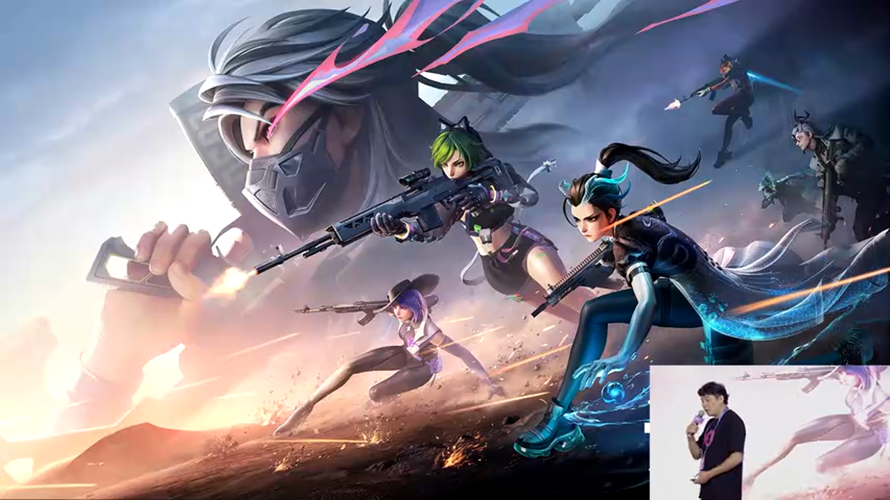
_Screenshot from 00:35:37_
---
## Section 683 (00:35:46)
**Transcript:**
> 我们我们亲爱的大朋友
**Visual Reference:**

_Screenshot from 00:35:46_
---
## Section 684 (00:35:50)
**Transcript:**
> 大戏和您的?"
**Visual Reference:**

_Screenshot from 00:35:50_
---
## Section 685 (00:35:52)
**Transcript:**
> 我继续全移达到12个系列
**Visual Reference:**

_Screenshot from 00:35:52_
---
## Section 686 (00:35:55)
**Transcript:**
> 这里不理工历史
**Visual Reference:**
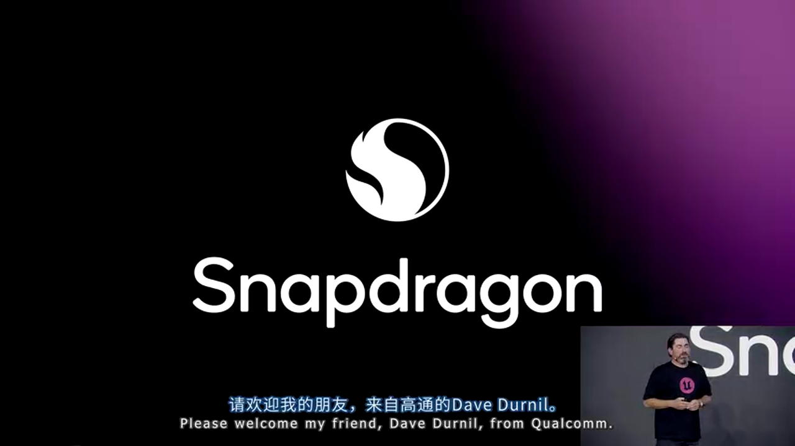
_Screenshot from 00:35:55_
---
## Section 687 (00:36:03)
**Transcript:**
> 与我们观众上来什么样的
**Visual Reference:**

_Screenshot from 00:36:03_
---
## Section 688 (00:36:05)
**Transcript:**
> 我adztok我去阅隔
**Visual Reference:**
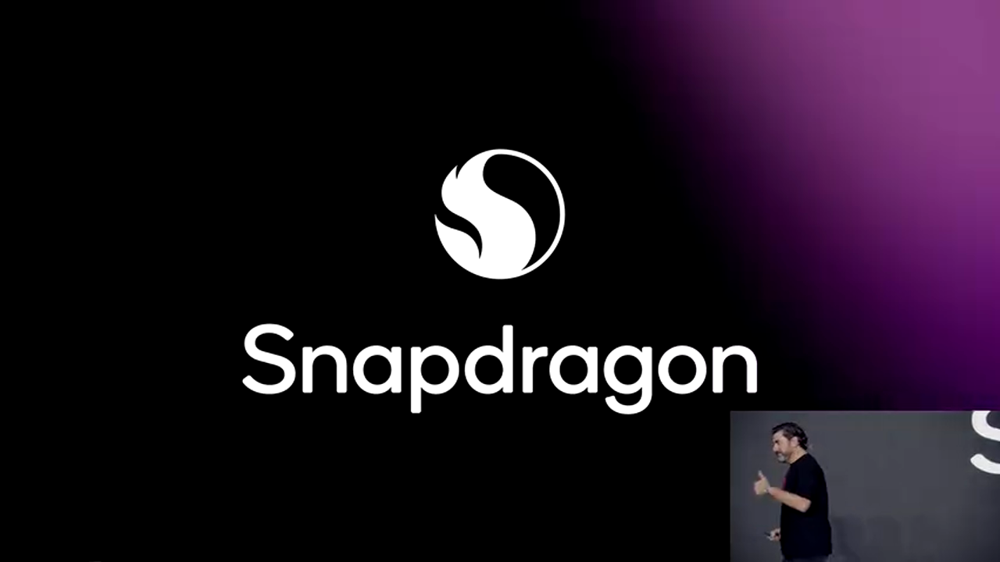
_Screenshot from 00:36:05_
---
## Section 689 (00:36:10)
**Transcript:**
> 据我的生互战
**Visual Reference:**
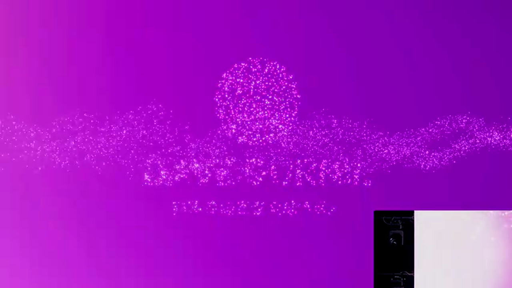
_Screenshot from 00:36:10_
---
## Section 690 (00:36:14)
**Transcript:**
> 去竡田
**Visual Reference:**

_Screenshot from 00:36:14_
---
## Section 691 (00:36:18)
**Transcript:**
> Rain
**Visual Reference:**
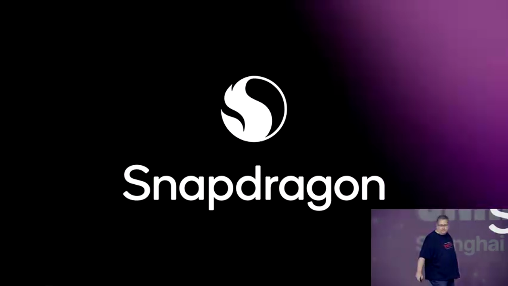
_Screenshot from 00:36:18_
---
## Section 692 (00:36:29)
**Transcript:**
> 武昇
**Visual Reference:**

_Screenshot from 00:36:29_
---
## Section 693 (00:36:39)
**Transcript:**
> 翌體
**Visual Reference:**

_Screenshot from 00:36:39_
---
## Section 694 (00:36:39)
**Transcript:**
> 第五部可以支援 understood for mobile gaming
**Visual Reference:**

_Screenshot from 00:36:39_
---
## Section 695 (00:36:42)
**Transcript:**
> 現在現在一月內的一日
**Visual Reference:**

_Screenshot from 00:36:42_
---
## Section 696 (00:36:44)
**Transcript:**
> 川普發揚本土 Nanul
**Visual Reference:**

_Screenshot from 00:36:44_
---
## Section 697 (00:36:47)
**Transcript:**
> 徐興密控制
**Visual Reference:**
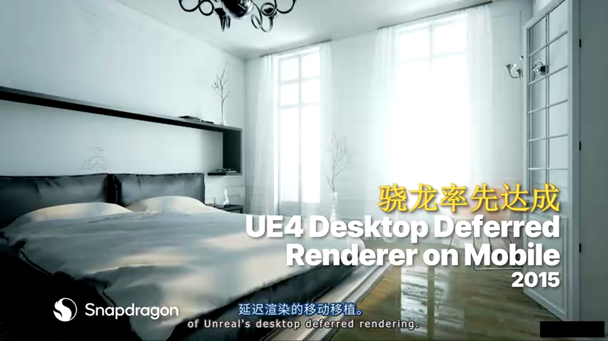
_Screenshot from 00:36:47_
---
## Section 698 (00:36:49)
**Transcript:**
> 經營
**Visual Reference:**
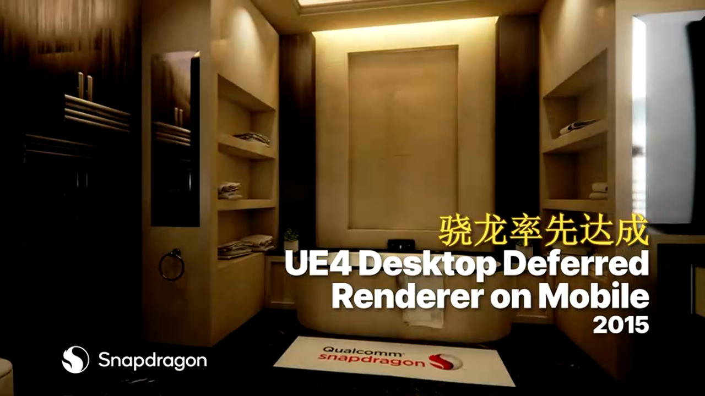
_Screenshot from 00:36:49_
---
## Section 699 (00:36:52)
**Transcript:**
> 三條警告
**Visual Reference:**
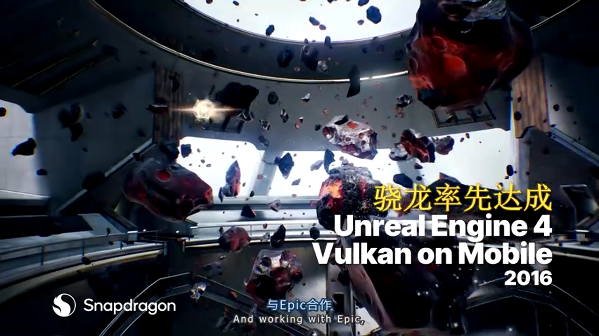
_Screenshot from 00:36:52_
---
## Section 700 (00:36:53)
**Transcript:**
> 準備進步
**Visual Reference:**
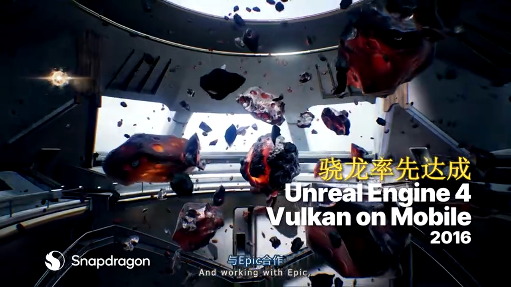
_Screenshot from 00:36:53_
---
## Section 701 (00:36:54)
**Transcript:**
> 登記
**Visual Reference:**

_Screenshot from 00:36:54_
---
## Section 702 (00:36:56)
**Transcript:**
> 三條大警告
**Visual Reference:**

_Screenshot from 00:36:56_
---
## Section 703 (00:36:57)
**Transcript:**
> 三條警告
**Visual Reference:**

_Screenshot from 00:36:57_
---
## Section 704 (00:36:58)
**Transcript:**
> 門你要墨金
**Visual Reference:**

_Screenshot from 00:36:58_
---
## Section 705 (00:37:00)
**Transcript:**
> 兩週
**Visual Reference:**

_Screenshot from 00:37:00_
---
## Section 706 (00:37:02)
**Transcript:**
> endpoint
**Visual Reference:**

_Screenshot from 00:37:02_
---
## Section 707 (00:37:03)
**Transcript:**
> ift得 build
**Visual Reference:**
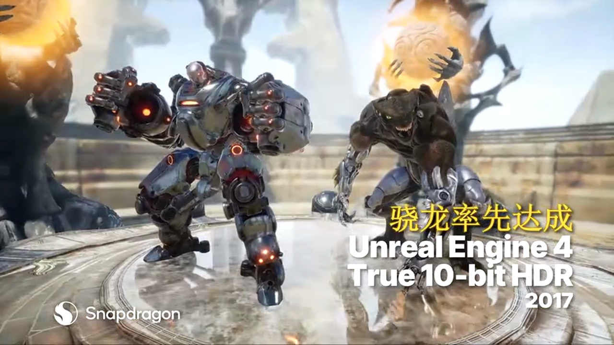
_Screenshot from 00:37:03_
---
## Section 708 (00:37:05)
**Transcript:**
> 一件事
**Visual Reference:**

_Screenshot from 00:37:05_
---
## Section 709 (00:37:07)
**Transcript:**
> 擔心
**Visual Reference:**
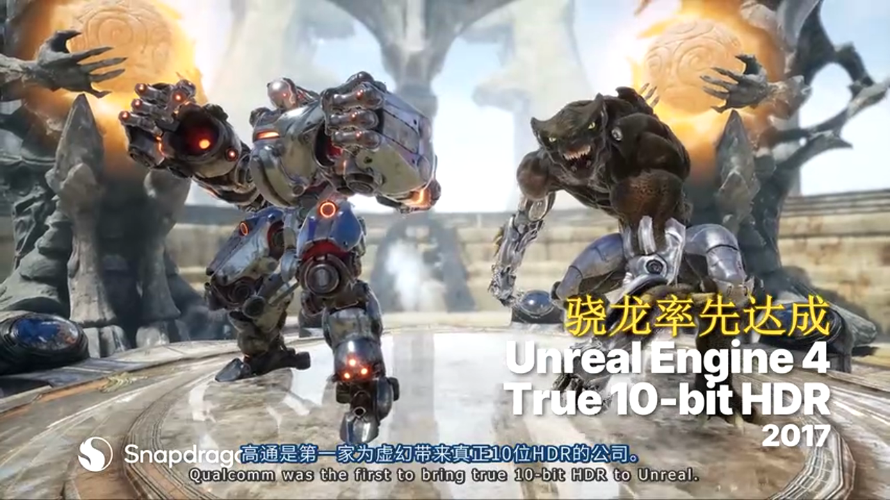
_Screenshot from 00:37:07_
---
## Section 710 (00:37:09)
**Transcript:**
> 入境懂。
**Visual Reference:**

_Screenshot from 00:37:09_
---
## Section 711 (00:37:11)
**Transcript:**
> NELDUS低車都一機。
**Visual Reference:**

_Screenshot from 00:37:11_
---
## Section 712 (00:37:14)
**Transcript:**
> 進去考慮訂貨。
**Visual Reference:**

_Screenshot from 00:37:14_
---
## Section 713 (00:37:17)
**Transcript:**
> 函日回應浪費的立行時
**Visual Reference:**

_Screenshot from 00:37:17_
---
## Section 714 (00:37:22)
**Transcript:**
> 進行了房間需主播三期
**Visual Reference:**

_Screenshot from 00:37:22_
---
## Section 715 (00:37:25)
**Transcript:**
> 找一個Oaters
**Visual Reference:**

_Screenshot from 00:37:25_
---
## Section 716 (00:37:29)
**Transcript:**
> 免得到一個關於Oside
**Visual Reference:**
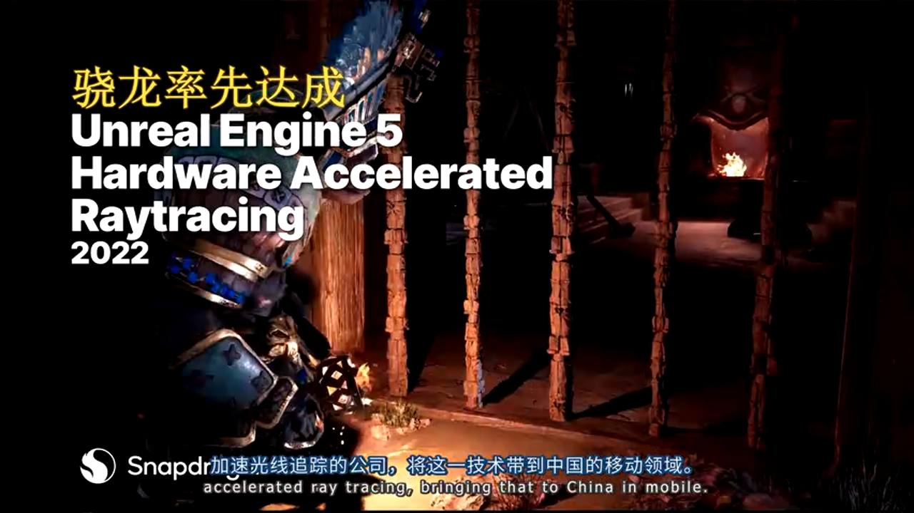
_Screenshot from 00:37:29_
---
## Section 717 (00:37:35)
**Transcript:**
> 最大級電視機機,
**Visual Reference:**
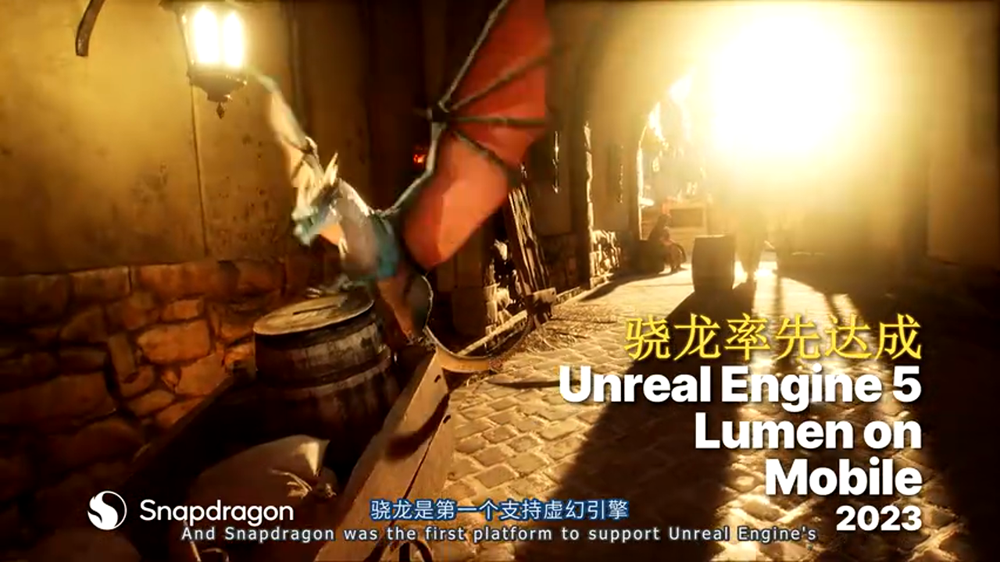
_Screenshot from 00:37:35_
---
## Section 718 (00:37:36)
**Transcript:**
> 政府能提供行事 work done
**Visual Reference:**
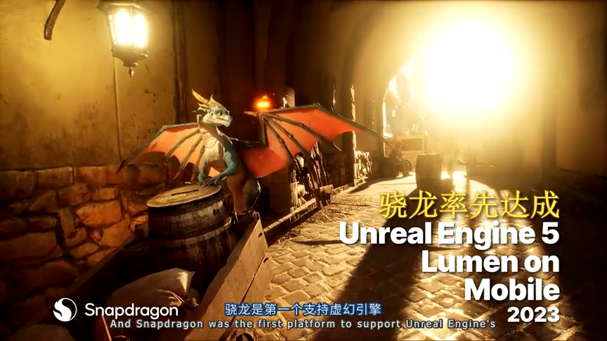
_Screenshot from 00:37:36_
---
## Section 719 (00:37:43)
**Transcript:**
> 他第二次建立新方開業
**Visual Reference:**
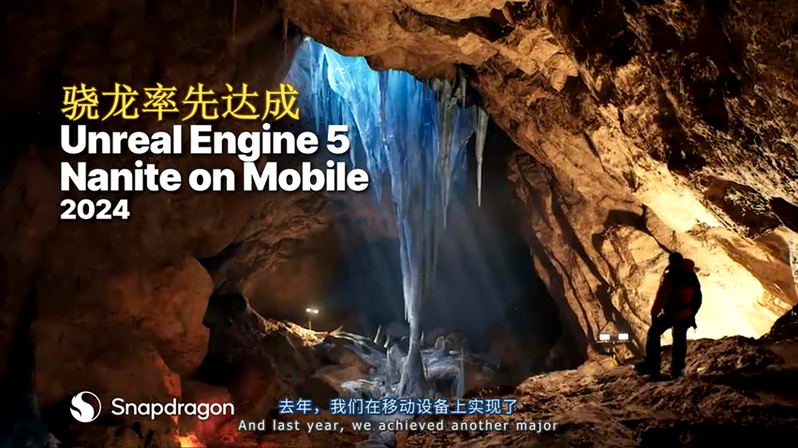
_Screenshot from 00:37:43_
---
## Section 720 (00:37:55)
**Transcript:**
> 今天這樣的公開節目
**Visual Reference:**
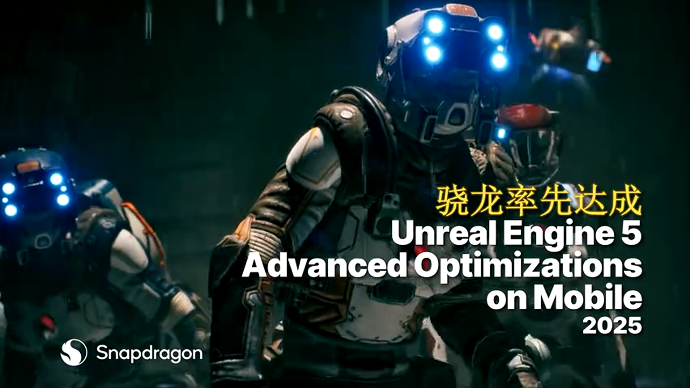
_Screenshot from 00:37:55_
---
## Section 721 (00:37:58)
**Transcript:**
> 共產國有 Change4製作
**Visual Reference:**
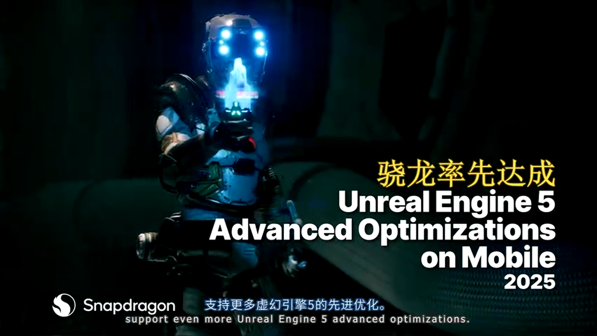
_Screenshot from 00:37:58_
---
## Section 722 (00:38:01)
**Transcript:**
> 这些字发现新薪大网有的走蓝航企业电郡
**Visual Reference:**
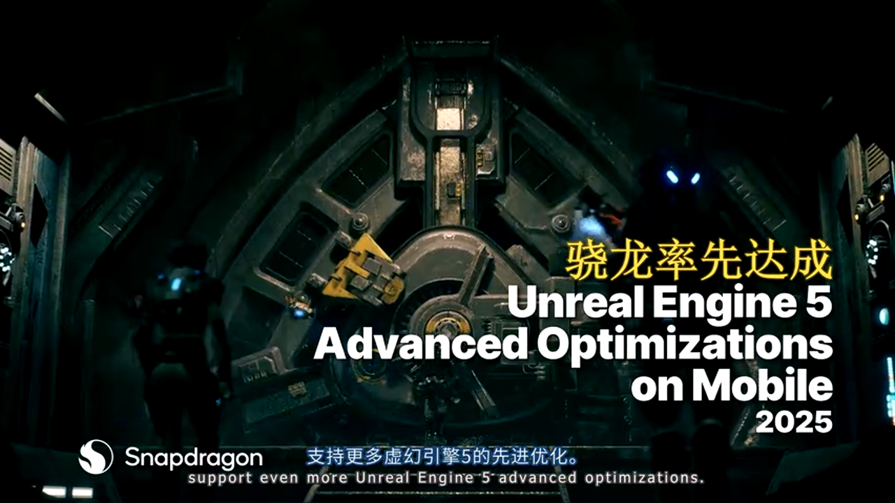
_Screenshot from 00:38:01_
---
## Section 723 (00:38:07)
**Transcript:**
> 联盟多安或宇宙甲案
**Visual Reference:**

_Screenshot from 00:38:07_
---
## Section 724 (00:38:14)
**Transcript:**
> 从新的周期时快些一个牌
**Visual Reference:**

_Screenshot from 00:38:14_
---
## Section 725 (00:38:17)
**Transcript:**
> 是每周五ше где令到今年的死掉
**Visual Reference:**

_Screenshot from 00:38:17_
---
## Section 726 (00:38:21)
**Transcript:**
> 大家看看P
**Visual Reference:**

_Screenshot from 00:38:21_
---
## Section 727 (00:38:48)
**Transcript:**
> 仍然用著R對吧
**Visual Reference:**
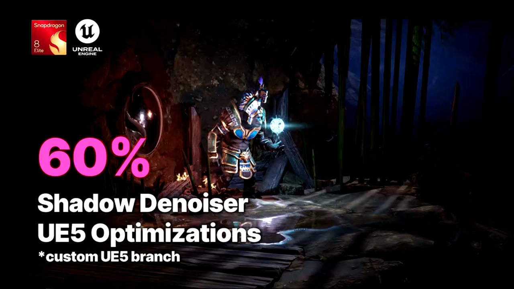
_Screenshot from 00:38:48_
---
## Section 728 (00:38:50)
**Transcript:**
> 而C nano 同行能夠加
**Visual Reference:**

_Screenshot from 00:38:50_
---
## Section 729 (00:39:16)
**Transcript:**
> 砍到進攻陸的做法
**Visual Reference:**

_Screenshot from 00:39:16_
---
## Section 730 (00:39:22)
**Transcript:**
> ري公司çi 新植劇造
**Visual Reference:**

_Screenshot from 00:39:22_
---
## Section 731 (00:39:25)
**Transcript:**
> 選擇儒鼓
**Visual Reference:**

_Screenshot from 00:39:25_
---
## Section 732 (00:39:28)
**Transcript:**
> 如果可主動試會
**Visual Reference:**

_Screenshot from 00:39:28_
---
## Section 733 (00:39:30)
**Transcript:**
> 消失 就需要失敗
**Visual Reference:**

_Screenshot from 00:39:30_
---
## Section 734 (00:40:16)
**Transcript:**
> 非常好,epics goal is to empower all developers to fully harness the power of Unreal Engine 5 on mobile,
**Visual Reference:**

_Screenshot from 00:40:16_
---
## Section 735 (00:40:31)
**Transcript:**
> while unlocking the full potential of Snapdragon technologies,
**Visual Reference:**
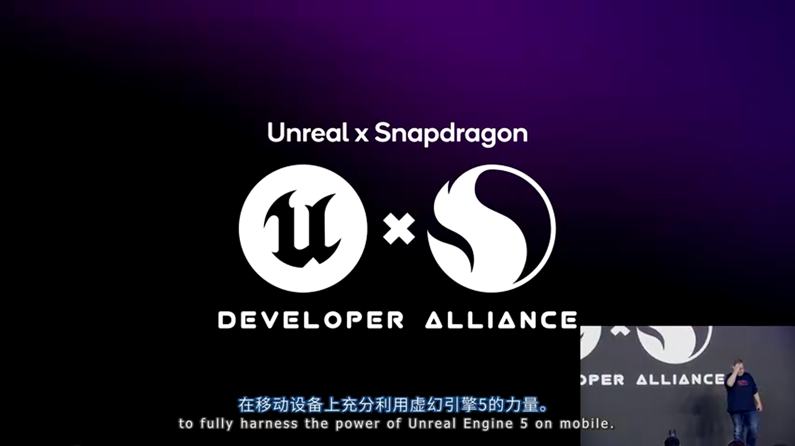
_Screenshot from 00:40:31_
---
## Section 736 (00:40:35)
**Transcript:**
> so that you can build the next generation of mobile games.
**Visual Reference:**

_Screenshot from 00:40:35_
---
## Section 737 (00:40:38)
**Transcript:**
> To achieve that, we're announcing the Unreal Snapdragon developer alliance.
**Visual Reference:**

_Screenshot from 00:40:38_
---
## Section 738 (00:40:44)
**Transcript:**
> This new program in alliance is designed to support developers
**Visual Reference:**

_Screenshot from 00:40:44_
---
## Section 739 (00:40:48)
**Transcript:**
> who are making the most ambitious UE5 mobile games.
**Visual Reference:**

_Screenshot from 00:40:48_
---
## Section 740 (00:40:52)
**Transcript:**
> We'll be offering technical support locally here by combining our support resources,
**Visual Reference:**

_Screenshot from 00:40:52_
---
## Section 741 (00:40:57)
**Transcript:**
> we'll be offering education and training services,
**Visual Reference:**

_Screenshot from 00:40:57_
---
## Section 742 (00:41:00)
**Transcript:**
> and producing training content,
**Visual Reference:**

_Screenshot from 00:41:00_
---
## Section 743 (00:41:02)
**Transcript:**
> while also offering co-marketing and promotional opportunities
**Visual Reference:**

_Screenshot from 00:41:02_
---
## Section 744 (00:41:05)
**Transcript:**
> to support the launch of UE5 mobile titles on Snapdragon.
**Visual Reference:**

_Screenshot from 00:41:05_
---
## Section 745 (00:41:13)
**Transcript:**
> Together with Epic, we're combining the best-in-class game engine technologies
**Visual Reference:**

_Screenshot from 00:41:13_
---
## Section 746 (00:41:18)
**Transcript:**
> with the most advanced mobile gaming hardware.
**Visual Reference:**

_Screenshot from 00:41:18_
---
## Section 747 (00:41:22)
**Transcript:**
> Thanks Dave, we're excited to bring Unreal powered mobile games to millions of players
**Visual Reference:**

_Screenshot from 00:41:22_
---
## Section 748 (00:41:26)
**Transcript:**
> in China and around the world powered by Snapdragon.
**Visual Reference:**

_Screenshot from 00:41:26_
---
## Section 749 (00:41:35)
**Transcript:**
> While you developers out there, please scan this,
**Visual Reference:**

_Screenshot from 00:41:35_
---
## Section 750 (00:41:38)
**Transcript:**
> check out the blog and connect with us so you can learn more as the program rolls out.
**Visual Reference:**

_Screenshot from 00:41:38_
---
## Section 751 (00:41:44)
**Transcript:**
> We're also seeing tremendous momentum here in China and around the world
**Visual Reference:**

_Screenshot from 00:41:44_
---
## Section 752 (00:41:49)
**Transcript:**
> with Unreal Engine beyond gaming across other industries like architecture,
**Visual Reference:**
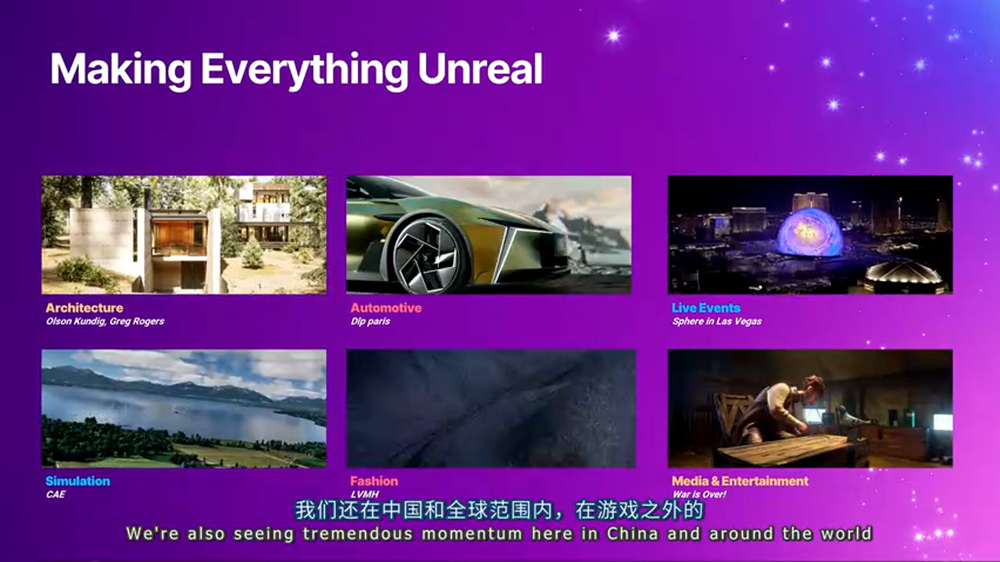
_Screenshot from 00:41:49_
---
## Section 753 (00:41:54)
**Transcript:**
> meeting our attainment, simulation, fashion, live events, and automotive.
**Visual Reference:**
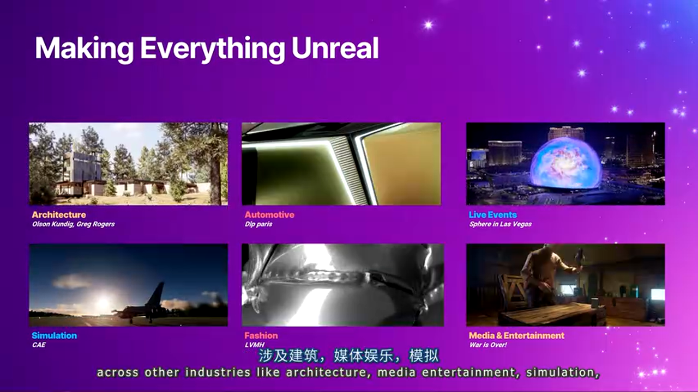
_Screenshot from 00:41:54_
---
## Section 754 (00:42:00)
**Transcript:**
> Companies across these industries are leveraging real-time 3D technology
**Visual Reference:**

_Screenshot from 00:42:00_
---
## Section 755 (00:42:05)
**Transcript:**
> to drive transformation and accelerate innovation in product design all the way through
**Visual Reference:**
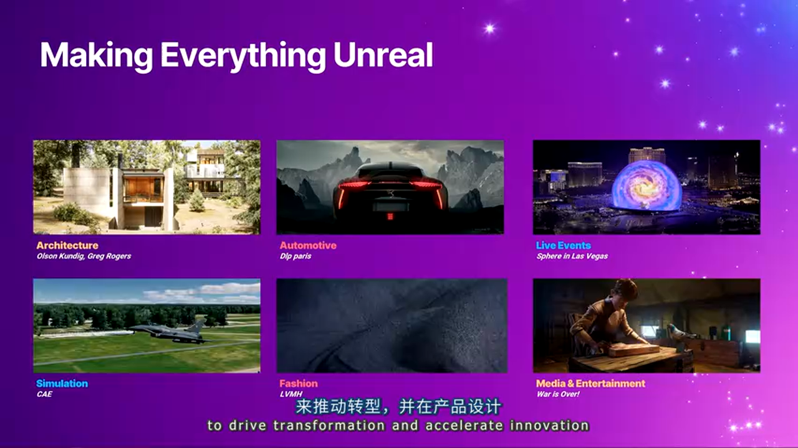
_Screenshot from 00:42:05_
---
## Section 756 (00:42:12)
**Transcript:**
> to creating immersive customer experiences.
**Visual Reference:**
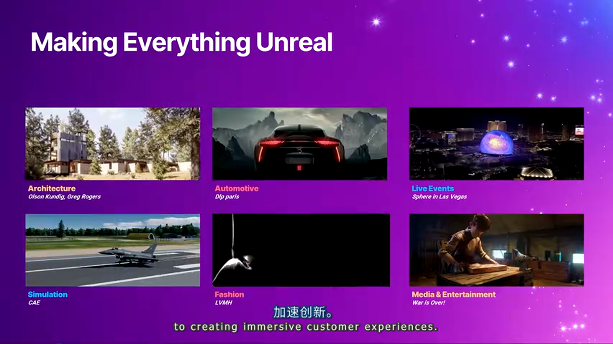
_Screenshot from 00:42:12_
---
## Section 757 (00:42:16)
**Transcript:**
> Let's take Geely, for example,
**Visual Reference:**

_Screenshot from 00:42:16_
---
## Section 758 (00:42:18)
**Transcript:**
> who've adopted Unreal for the Galaxy E8 Smart Cockpit,
**Visual Reference:**

_Screenshot from 00:42:18_
---
## Section 759 (00:42:22)
**Transcript:**
> which runs on a Qualcomm Snapdragon 8295 trip.
**Visual Reference:**

_Screenshot from 00:42:22_
---
## Section 760 (00:42:27)
**Transcript:**
> You can see here the digital twin of the vehicle,
**Visual Reference:**

_Screenshot from 00:42:27_
---
## Section 761 (00:42:29)
**Transcript:**
> along with some playful customization options,
**Visual Reference:**

_Screenshot from 00:42:29_
---
## Section 762 (00:42:31)
**Transcript:**
> but Geely is also introducing new features such as Galaxy assisted driving,
**Visual Reference:**

_Screenshot from 00:42:31_
---
## Section 763 (00:42:36)
**Transcript:**
> automatic parking, and home zone park assist.
**Visual Reference:**

_Screenshot from 00:42:36_
---
## Section 764 (00:42:40)
**Transcript:**
> In this new smart driving version,
**Visual Reference:**

_Screenshot from 00:42:40_
---
## Section 765 (00:42:42)
**Transcript:**
> Unreal Engine plays a key role in building virtual views
**Visual Reference:**
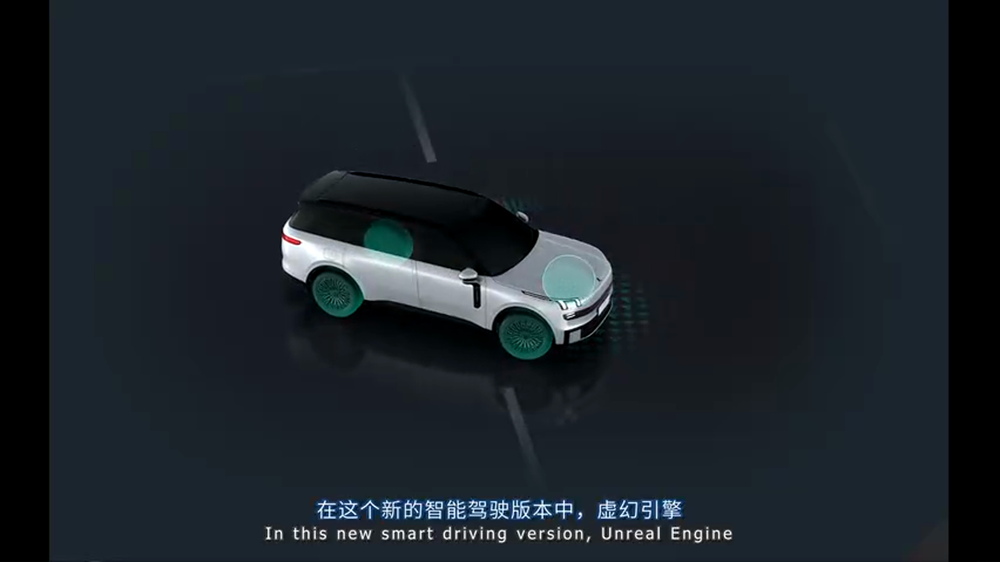
_Screenshot from 00:42:42_
---
## Section 766 (00:42:45)
**Transcript:**
> for these new advanced driving features.
**Visual Reference:**

_Screenshot from 00:42:45_
---
## Section 767 (00:42:50)
**Transcript:**
> One of our main goals with the 5.6 release was to make animating in-engine awesome.
**Visual Reference:**

_Screenshot from 00:42:50_
---
## Section 768 (00:42:56)
**Transcript:**
> So the animation studios can build amazing content faster and more efficiently.
**Visual Reference:**

_Screenshot from 00:42:56_
---
## Section 769 (00:43:03)
**Transcript:**
> One animation studio that's leading the way here in China is original force.
**Visual Reference:**

_Screenshot from 00:43:03_
---
## Section 770 (00:43:08)
**Transcript:**
> They've released over 280 episodes of their hit franchises,
**Visual Reference:**

_Screenshot from 00:43:08_
---
## Section 771 (00:43:12)
**Transcript:**
> immortal, and shrouded in the heavens,
**Visual Reference:**

_Screenshot from 00:43:12_
---
## Section 772 (00:43:15)
**Transcript:**
> and they've seen over 4 billion views on Billy-Billy.
**Visual Reference:**
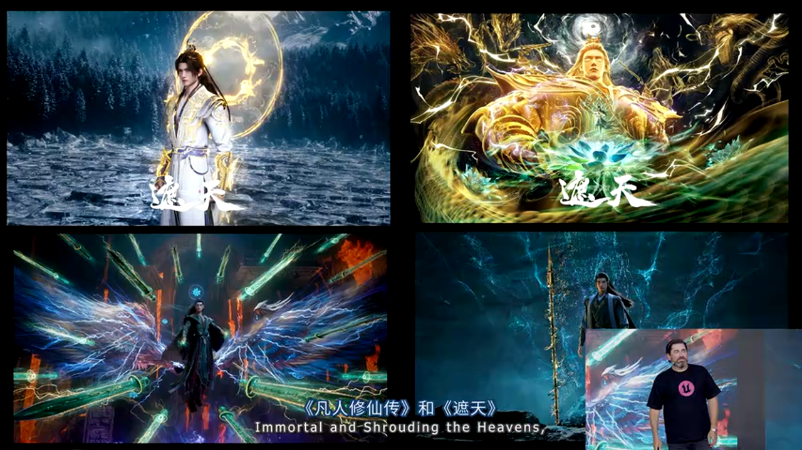
_Screenshot from 00:43:15_
---
## Section 773 (00:43:21)
**Transcript:**
> And finally, I wanted to spotlight 51 World,
**Visual Reference:**

_Screenshot from 00:43:21_
---
## Section 774 (00:43:23)
**Transcript:**
> who's built a powerful digital twin simulation platform on UE5.
**Visual Reference:**
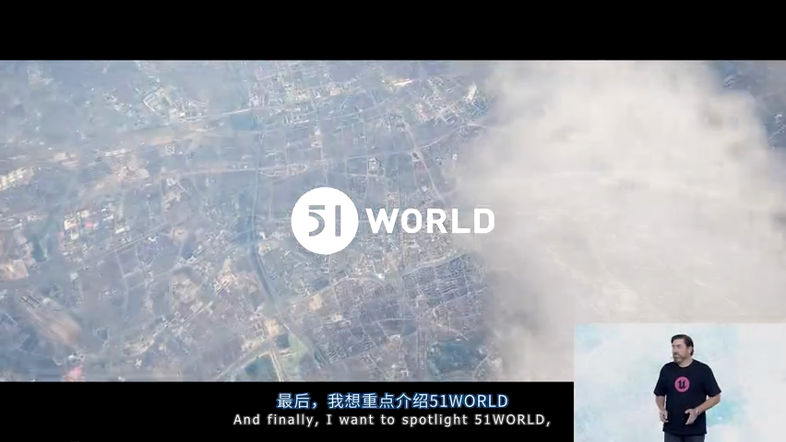
_Screenshot from 00:43:23_
---
## Section 775 (00:43:27)
**Transcript:**
> Please welcome their CEO, Archery Lee.
**Visual Reference:**
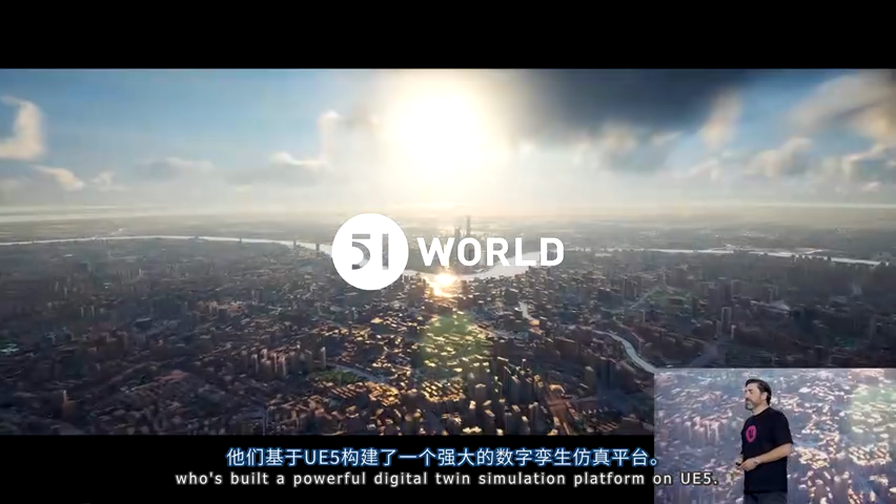
_Screenshot from 00:43:27_
---
## Section 776 (00:43:38)
**Transcript:**
> Thank you, CEO.
**Visual Reference:**

_Screenshot from 00:43:38_
---
## Section 777 (00:43:40)
**Transcript:**
> I'd like to thank the CEO,
**Visual Reference:**

_Screenshot from 00:43:40_
---
## Section 778 (00:43:42)
**Transcript:**
> who's been working on the project for 10 years.
**Visual Reference:**

_Screenshot from 00:43:42_
---
## Section 779 (00:43:45)
**Transcript:**
> Next, I'd like to share with you
**Visual Reference:**

_Screenshot from 00:43:45_
---
## Section 780 (00:43:49)
**Transcript:**
> some of the potential features of the game
**Visual Reference:**

_Screenshot from 00:43:49_
---
## Section 781 (00:43:52)
**Transcript:**
> that we're going to be able to create.
**Visual Reference:**

_Screenshot from 00:43:52_
---
## Section 782 (00:43:54)
**Transcript:**
> We'll be sharing more of the features
**Visual Reference:**

_Screenshot from 00:43:54_
---
## Section 783 (00:43:57)
**Transcript:**
> that we're going to be able to create in AI,
**Visual Reference:**

_Screenshot from 00:43:57_
---
## Section 784 (00:44:00)
**Transcript:**
> and the three-dimensional,
**Visual Reference:**

_Screenshot from 00:44:00_
---
## Section 785 (00:44:02)
**Transcript:**
> and we'll be sharing them with you today.
**Visual Reference:**

_Screenshot from 00:44:02_
---
## Section 786 (00:44:06)
**Transcript:**
> I hope you all share this video together.
**Visual Reference:**

_Screenshot from 00:44:06_
---
## Section 787 (00:44:10)
**Transcript:**
> Because our goal is to complete the digital animation
**Visual Reference:**

_Screenshot from 00:44:10_
---
## Section 788 (00:44:15)
**Transcript:**
> and the digital technology.
**Visual Reference:**

_Screenshot from 00:44:15_
---
## Section 789 (00:44:17)
**Transcript:**
> When AI comes up,
**Visual Reference:**

_Screenshot from 00:44:17_
---
## Section 790 (00:44:19)
**Transcript:**
> it will bring some possibilities.
**Visual Reference:**

_Screenshot from 00:44:19_
---
## Section 791 (00:44:35)
**Transcript:**
> Overlooking the Himalayan Cloud Seas.
**Visual Reference:**

_Screenshot from 00:44:35_
---
## Section 792 (00:44:38)
**Transcript:**
> Soaring across the steep,
**Visual Reference:**
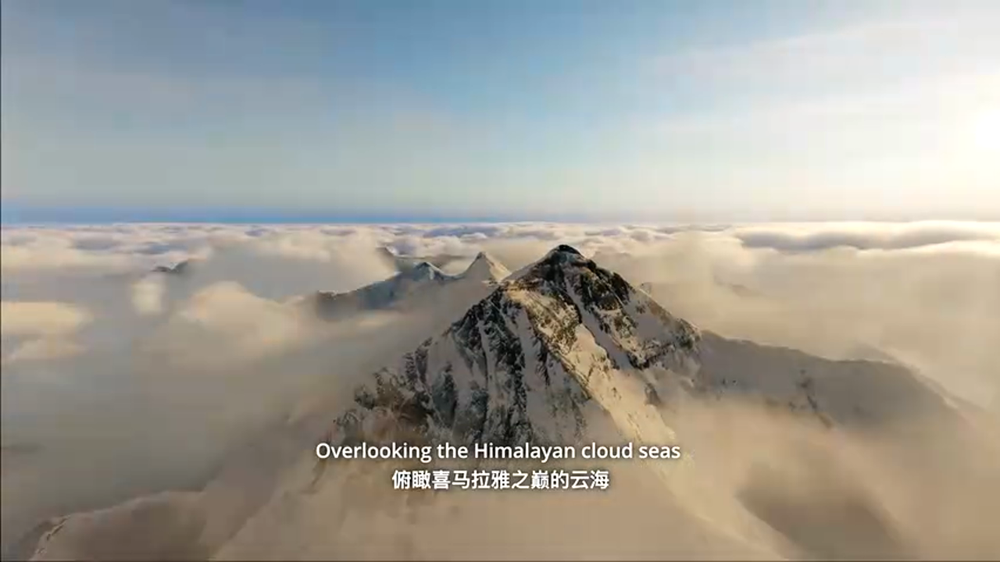
_Screenshot from 00:44:38_
---
## Section 793 (00:44:41)
**Transcript:**
> carst landforms,
**Visual Reference:**

_Screenshot from 00:44:41_
---
## Section 794 (00:44:42)
**Transcript:**
> flying over the colorful,
**Visual Reference:**

_Screenshot from 00:44:42_
---
## Section 795 (00:44:44)
**Transcript:**
> travertine terraces,
**Visual Reference:**
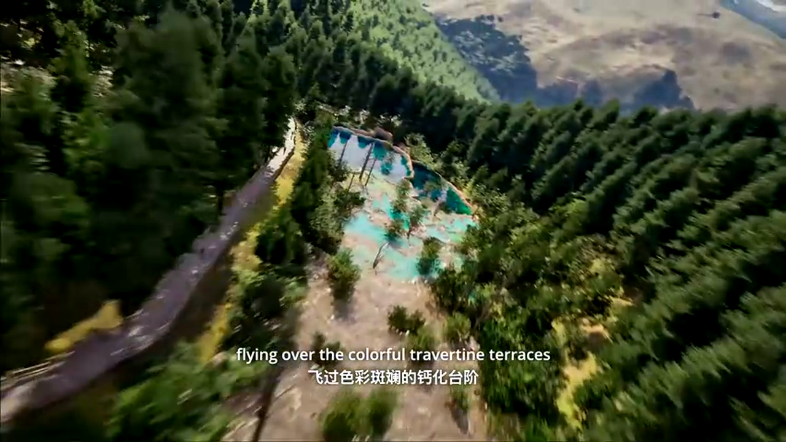
_Screenshot from 00:44:44_
---
## Section 796 (00:44:46)
**Transcript:**
> leaving through a mountain city of 8D structure,
**Visual Reference:**
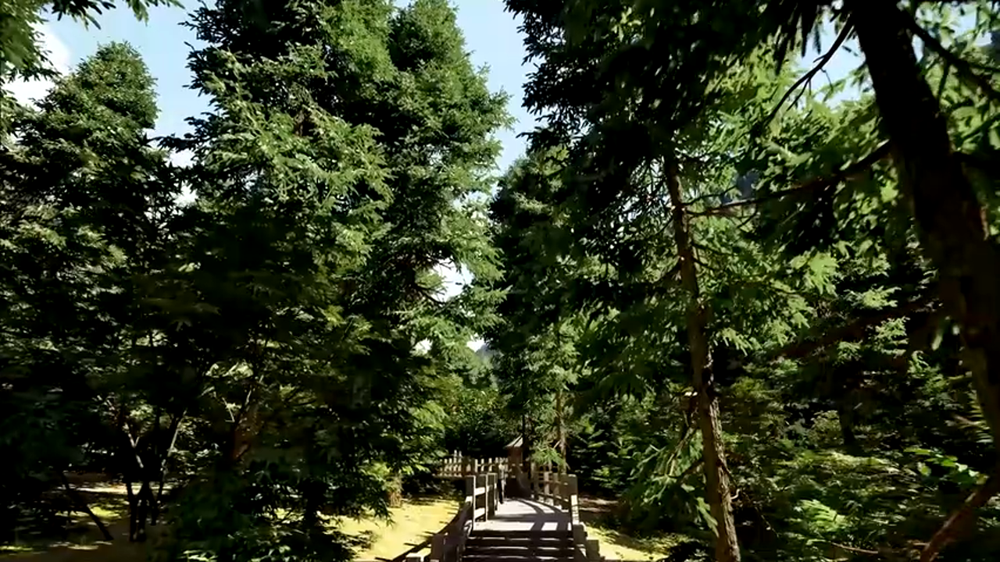
_Screenshot from 00:44:46_
---
## Section 797 (00:44:50)
**Transcript:**
> with bridges and skylines layered high.
**Visual Reference:**

_Screenshot from 00:44:50_
---
## Section 798 (00:44:53)
**Transcript:**
> Exploring ancient ruins,
**Visual Reference:**
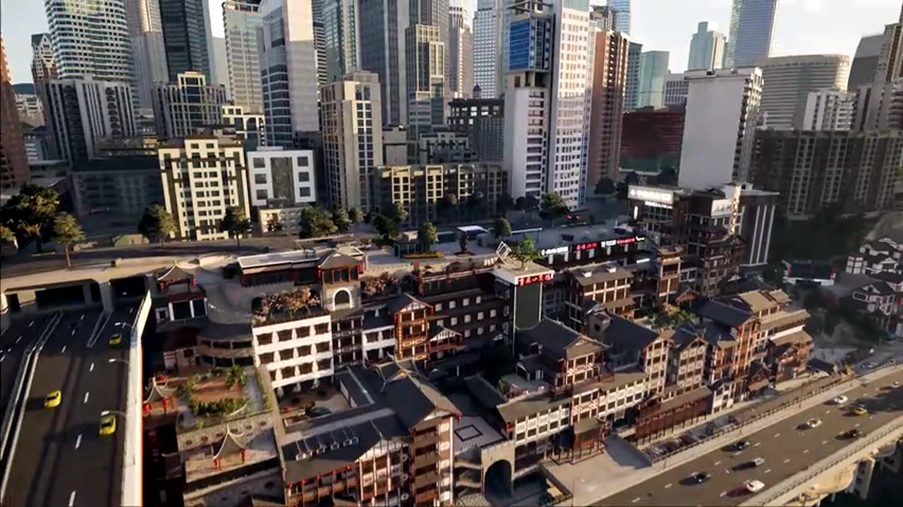
_Screenshot from 00:44:53_
---
## Section 799 (00:44:55)
**Transcript:**
> tracing footsteps of civilizations long gone.
**Visual Reference:**
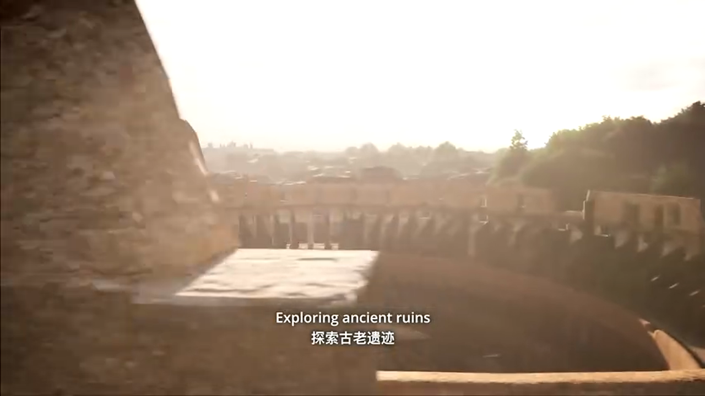
_Screenshot from 00:44:55_
---
## Section 800 (00:45:00)
**Transcript:**
> The World's End
**Visual Reference:**

_Screenshot from 00:45:00_
---
## Section 801 (00:45:05)
**Transcript:**
> Everyone's watching this video.
**Visual Reference:**
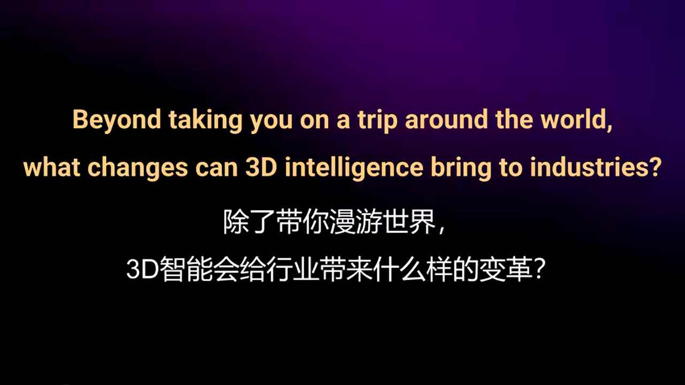
_Screenshot from 00:45:05_
---
## Section 802 (00:45:08)
**Transcript:**
> It's the product we're going to be promoting
**Visual Reference:**
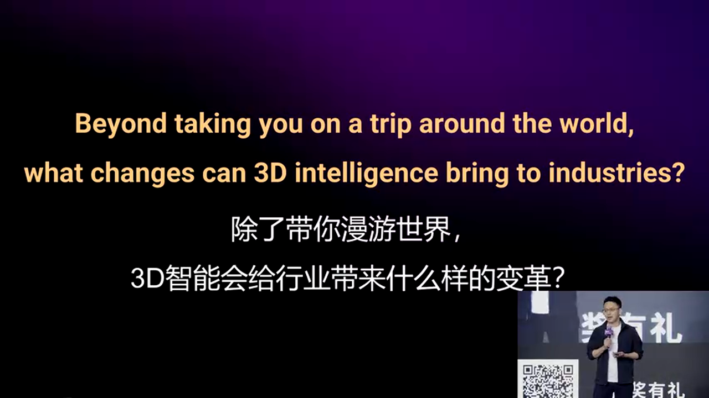
_Screenshot from 00:45:08_
---
## Section 803 (00:45:10)
**Transcript:**
> this year's AI product.
**Visual Reference:**

_Screenshot from 00:45:10_
---
## Section 804 (00:45:13)
**Transcript:**
> Each of us is hoping that
**Visual Reference:**

_Screenshot from 00:45:13_
---
## Section 805 (00:45:15)
**Transcript:**
> everyone can use natural language
**Visual Reference:**

_Screenshot from 00:45:15_
---
## Section 806 (00:45:18)
**Transcript:**
> to create a world of the environment.
**Visual Reference:**

_Screenshot from 00:45:18_
---
## Section 807 (00:45:20)
**Transcript:**
> Because the entire world of the Earth
**Visual Reference:**

_Screenshot from 00:45:20_
---
## Section 808 (00:45:21)
**Transcript:**
> is going to be able to create a world of the Earth
**Visual Reference:**

_Screenshot from 00:45:21_
---
## Section 809 (00:45:23)
**Transcript:**
> with the entire world of the Earth.
**Visual Reference:**

_Screenshot from 00:45:23_
---
## Section 810 (00:45:25)
**Transcript:**
> We'll be able to create a world of the Earth
**Visual Reference:**

_Screenshot from 00:45:25_
---
## Section 811 (00:45:27)
**Transcript:**
> if we want to experience and experience
**Visual Reference:**

_Screenshot from 00:45:27_
---
## Section 812 (00:45:30)
**Transcript:**
> the complex of the Earth,
**Visual Reference:**

_Screenshot from 00:45:30_
---
## Section 813 (00:45:32)
**Transcript:**
> we don't need to use the digital animation.
**Visual Reference:**

_Screenshot from 00:45:32_
---
## Section 814 (00:45:34)
**Transcript:**
> We don't need to use some of our phones.
**Visual Reference:**

_Screenshot from 00:45:34_
---
## Section 815 (00:45:36)
**Transcript:**
> In fact, it's not good for more users.
**Visual Reference:**

_Screenshot from 00:45:36_
---
## Section 816 (00:45:38)
**Transcript:**
> Other players are not good at it.
**Visual Reference:**

_Screenshot from 00:45:38_
---
## Section 817 (00:45:40)
**Transcript:**
> Today's AI development
**Visual Reference:**

_Screenshot from 00:45:40_
---
## Section 818 (00:45:43)
**Transcript:**
> is actually able to create a world of the Earth
**Visual Reference:**

_Screenshot from 00:45:43_
---
## Section 819 (00:45:46)
**Transcript:**
> with the entire world of the Earth
**Visual Reference:**

_Screenshot from 00:45:46_
---
## Section 820 (00:45:48)
**Transcript:**
> with the entire world of the Earth.
**Visual Reference:**

_Screenshot from 00:45:48_
---
## Section 821 (00:45:50)
**Transcript:**
> It's the most meaningful material
**Visual Reference:**

_Screenshot from 00:45:50_
---
## Section 822 (00:45:52)
**Transcript:**
> and it will give it more content.
**Visual Reference:**

_Screenshot from 00:45:52_
---
## Section 823 (00:45:54)
**Transcript:**
> So, in addition to this,
**Visual Reference:**

_Screenshot from 00:45:54_
---
## Section 824 (00:45:56)
**Transcript:**
> an external matter,
**Visual Reference:**

_Screenshot from 00:45:56_
---
## Section 825 (00:45:58)
**Transcript:**
> we still have a lot of potential
**Visual Reference:**

_Screenshot from 00:45:58_
---
## Section 826 (00:46:01)
**Transcript:**
> to discuss today's AI era
**Visual Reference:**

_Screenshot from 00:46:01_
---
## Section 827 (00:46:04)
**Transcript:**
> and the environment of the Earth.
**Visual Reference:**
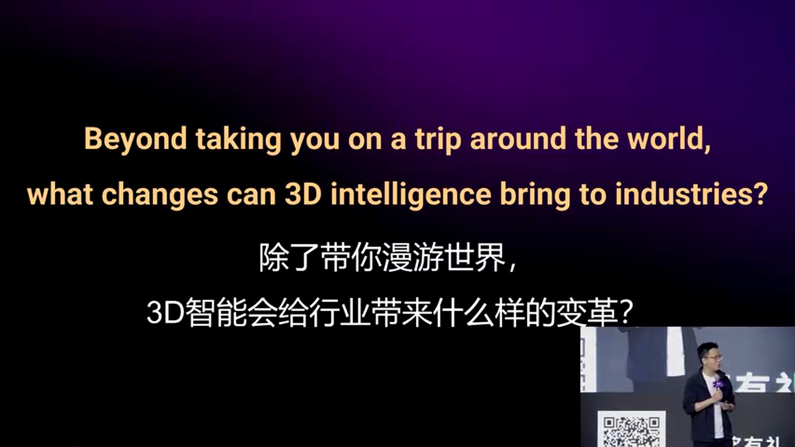
_Screenshot from 00:46:04_
---
## Section 828 (00:46:06)
**Transcript:**
> We've made some
**Visual Reference:**

_Screenshot from 00:46:06_
---
## Section 829 (00:46:09)
**Transcript:**
> of the shared ideas
**Visual Reference:**

_Screenshot from 00:46:09_
---
## Section 830 (00:46:11)
**Transcript:**
> to show you how to feel.
**Visual Reference:**

_Screenshot from 00:46:11_
---
## Section 831 (00:46:13)
**Transcript:**
> The first thing we think
**Visual Reference:**
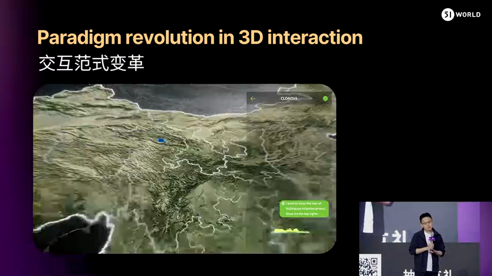
_Screenshot from 00:46:13_
---
## Section 832 (00:46:15)
**Transcript:**
> is that the AI will bring
**Visual Reference:**

_Screenshot from 00:46:15_
---
## Section 833 (00:46:17)
**Transcript:**
> the environment of the Earth
**Visual Reference:**

_Screenshot from 00:46:17_
---
## Section 834 (00:46:19)
**Transcript:**
> with all the information
**Visual Reference:**
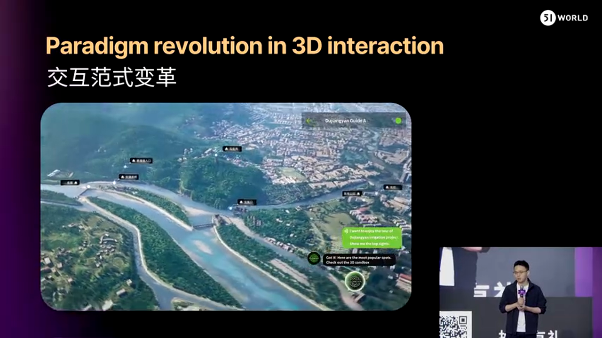
_Screenshot from 00:46:19_
---
## Section 835 (00:46:21)
**Transcript:**
> that we can use to create
**Visual Reference:**

_Screenshot from 00:46:21_
---
## Section 836 (00:46:23)
**Transcript:**
> a shared environment.
**Visual Reference:**
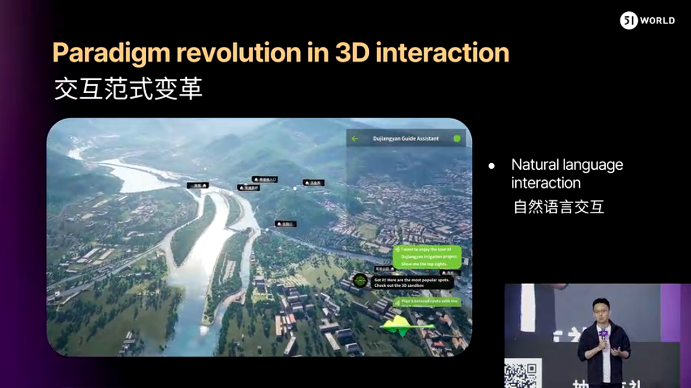
_Screenshot from 00:46:23_
---
## Section 837 (00:46:25)
**Transcript:**
> In fact, I am a player
**Visual Reference:**
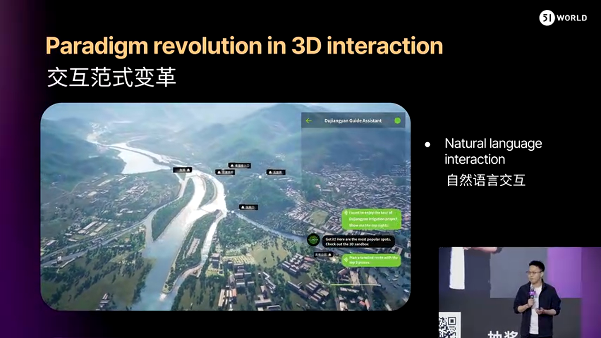
_Screenshot from 00:46:25_
---
## Section 838 (00:46:28)
**Transcript:**
> of the Earth.
**Visual Reference:**

_Screenshot from 00:46:28_
---
## Section 839 (00:46:29)
**Transcript:**
> When I started playing
**Visual Reference:**

_Screenshot from 00:46:29_
---
## Section 840 (00:46:32)
**Transcript:**
> the game in the past 24 years,
**Visual Reference:**

_Screenshot from 00:46:32_
---
## Section 841 (00:46:34)
**Transcript:**
> I found that
**Visual Reference:**

_Screenshot from 00:46:34_
---
## Section 842 (00:46:36)
**Transcript:**
> more than a month of the Earth
**Visual Reference:**
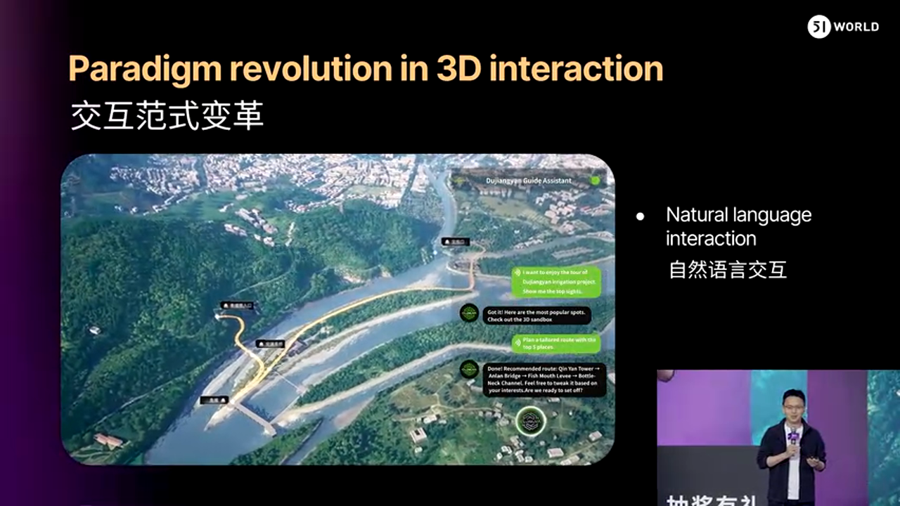
_Screenshot from 00:46:36_
---
## Section 843 (00:46:37)
**Transcript:**
> will be released in the first month.
**Visual Reference:**

_Screenshot from 00:46:37_
---
## Section 844 (00:46:39)
**Transcript:**
> Because you have to remember
**Visual Reference:**

_Screenshot from 00:46:39_
---
## Section 845 (00:46:41)
**Transcript:**
> all the quick-sleeved things
**Visual Reference:**

_Screenshot from 00:46:41_
---
## Section 846 (00:46:43)
**Transcript:**
> and you have to find
**Visual Reference:**
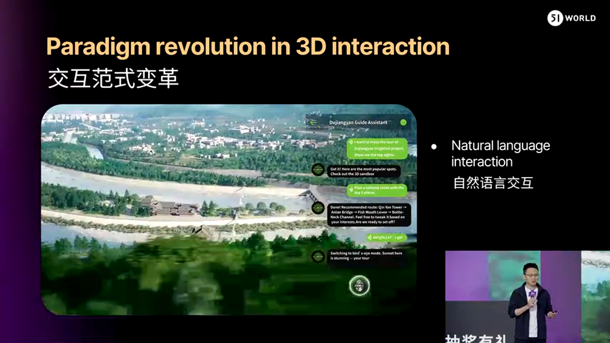
_Screenshot from 00:46:43_
---
## Section 847 (00:46:45)
**Transcript:**
> a point in every minute
**Visual Reference:**

_Screenshot from 00:46:45_
---
## Section 848 (00:46:47)
**Transcript:**
> that you have been able to create.
**Visual Reference:**

_Screenshot from 00:46:47_
---
## Section 849 (00:46:49)
**Transcript:**
> So, the players in the Earth
**Visual Reference:**
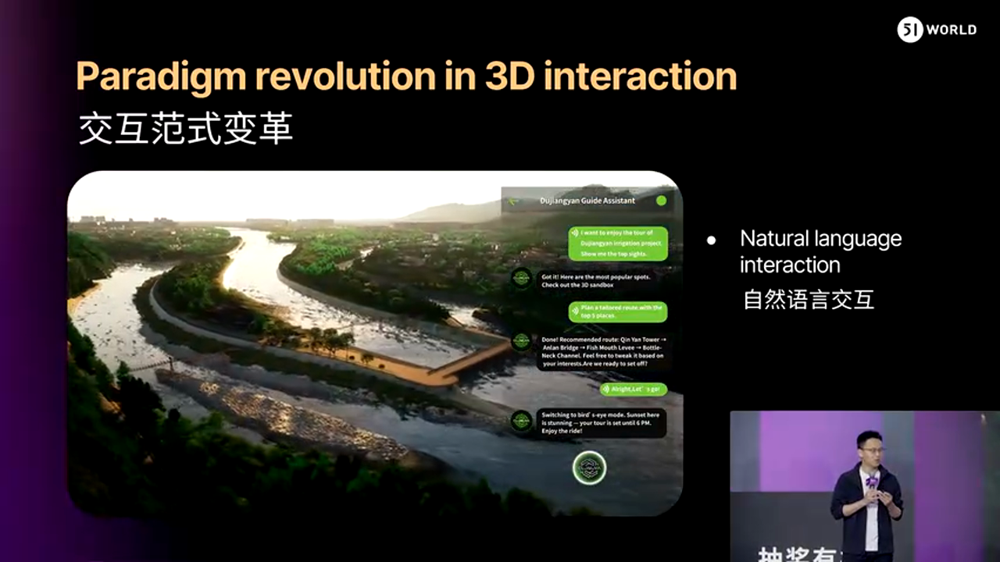
_Screenshot from 00:46:49_
---
## Section 850 (00:46:51)
**Transcript:**
> are very common in the game.
**Visual Reference:**

_Screenshot from 00:46:51_
---
## Section 851 (00:46:54)
**Transcript:**
> Even the players
**Visual Reference:**

_Screenshot from 00:46:54_
---
## Section 852 (00:46:56)
**Transcript:**
> in the Earth
**Visual Reference:**

_Screenshot from 00:46:56_
---
## Section 853 (00:46:57)
**Transcript:**
> will not be very good.
**Visual Reference:**
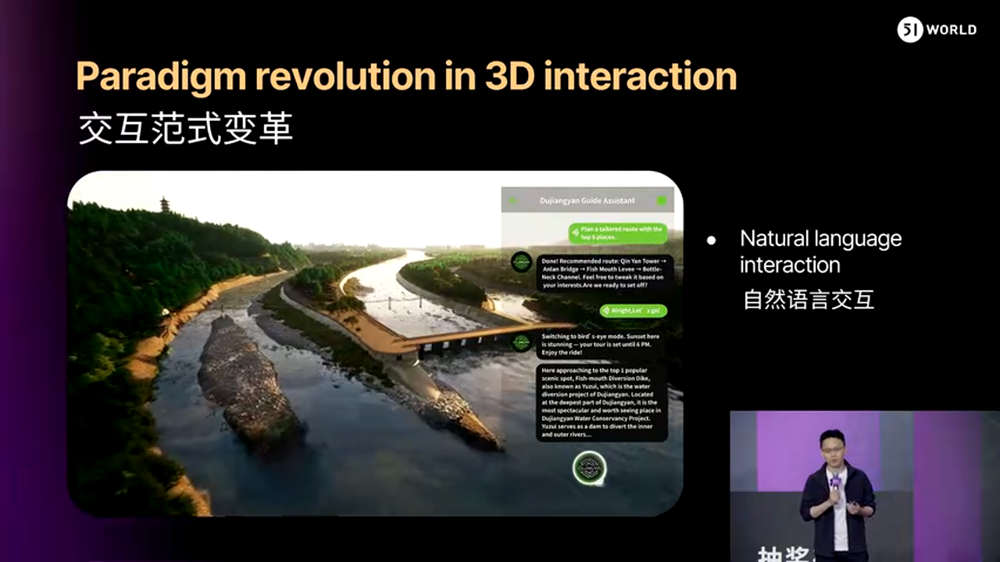
_Screenshot from 00:46:57_
---
## Section 854 (00:46:58)
**Transcript:**
> So, this time,
**Visual Reference:**

_Screenshot from 00:46:58_
---
## Section 855 (00:46:59)
**Transcript:**
> the Earth is a very good record.
**Visual Reference:**

_Screenshot from 00:46:59_
---
## Section 856 (00:47:01)
**Transcript:**
> The second thing
**Visual Reference:**
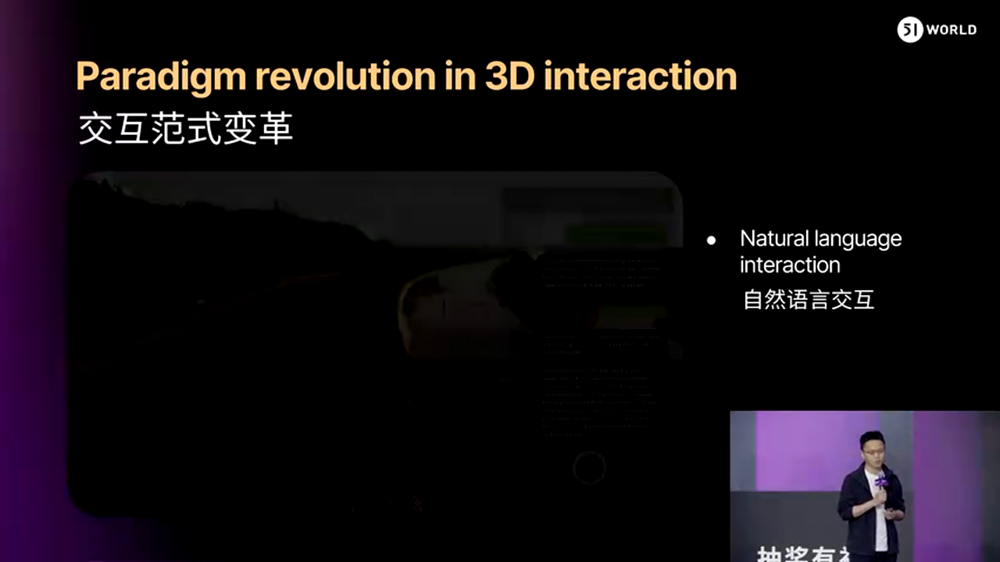
_Screenshot from 00:47:01_
---
## Section 857 (00:47:02)
**Transcript:**
> is that it can be used
**Visual Reference:**
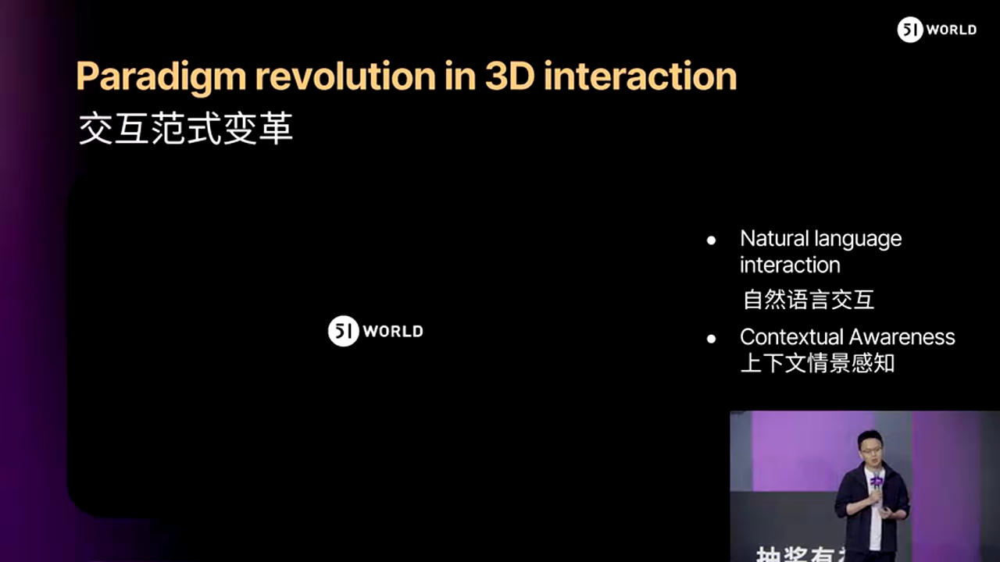
_Screenshot from 00:47:02_
---
## Section 858 (00:47:04)
**Transcript:**
> to create a very good
**Visual Reference:**

_Screenshot from 00:47:04_
---
## Section 859 (00:47:05)
**Transcript:**
> practice.
**Visual Reference:**

_Screenshot from 00:47:05_
---
## Section 860 (00:47:06)
**Transcript:**
> The practice we just saw
**Visual Reference:**

_Screenshot from 00:47:06_
---
## Section 861 (00:47:08)
**Transcript:**
> is actually
**Visual Reference:**

_Screenshot from 00:47:08_
---
## Section 862 (00:47:10)
**Transcript:**
> when we were talking about
**Visual Reference:**

_Screenshot from 00:47:10_
---
## Section 863 (00:47:12)
**Transcript:**
> the culture of the Earth,
**Visual Reference:**

_Screenshot from 00:47:12_
---
## Section 864 (00:47:13)
**Transcript:**
> I can't be able to
**Visual Reference:**

_Screenshot from 00:47:13_
---
## Section 865 (00:47:15)
**Transcript:**
> create a practice
**Visual Reference:**

_Screenshot from 00:47:15_
---
## Section 866 (00:47:16)
**Transcript:**
> and the next time
**Visual Reference:**

_Screenshot from 00:47:16_
---
## Section 867 (00:47:18)
**Transcript:**
> we learn about the Earth,
**Visual Reference:**

_Screenshot from 00:47:18_
---
## Section 868 (00:47:20)
**Transcript:**
> the current data
**Visual Reference:**

_Screenshot from 00:47:20_
---
## Section 869 (00:47:22)
**Transcript:**
> that we use every time
**Visual Reference:**

_Screenshot from 00:47:22_
---
## Section 870 (00:47:24)
**Transcript:**
> is a personal picture.
**Visual Reference:**

_Screenshot from 00:47:24_
---
## Section 871 (00:47:25)
**Transcript:**
> A person is a person.
**Visual Reference:**

_Screenshot from 00:47:25_
---
## Section 872 (00:47:26)
**Transcript:**
> This is a kind of
**Visual Reference:**

_Screenshot from 00:47:26_
---
## Section 873 (00:47:28)
**Transcript:**
> a person
**Visual Reference:**

_Screenshot from 00:47:28_
---
## Section 874 (00:47:30)
**Transcript:**
> or a person in the Earth.
**Visual Reference:**

_Screenshot from 00:47:30_
---
## Section 875 (00:47:31)
**Transcript:**
> I want to combine
**Visual Reference:**

_Screenshot from 00:47:31_
---
## Section 876 (00:47:33)
**Transcript:**
> a very interesting
**Visual Reference:**

_Screenshot from 00:47:33_
---
## Section 877 (00:47:34)
**Transcript:**
> and interesting premise.
**Visual Reference:**

_Screenshot from 00:47:34_
---
## Section 878 (00:47:35)
**Transcript:**
> It may happen
**Visual Reference:**

_Screenshot from 00:47:35_
---
## Section 879 (00:47:36)
**Transcript:**
> in the game field
**Visual Reference:**

_Screenshot from 00:47:36_
---
## Section 880 (00:47:37)
**Transcript:**
> or in the game field.
**Visual Reference:**

_Screenshot from 00:47:37_
---
## Section 881 (00:47:38)
**Transcript:**
> This is the first.
**Visual Reference:**

_Screenshot from 00:47:38_
---
## Section 882 (00:47:40)
**Transcript:**
> The second thing
**Visual Reference:**

_Screenshot from 00:47:40_
---
## Section 883 (00:47:41)
**Transcript:**
> we saw today
**Visual Reference:**

_Screenshot from 00:47:41_
---
## Section 884 (00:47:43)
**Transcript:**
> is that
**Visual Reference:**

_Screenshot from 00:47:43_
---
## Section 885 (00:47:45)
**Transcript:**
> we can create a very interesting
**Visual Reference:**
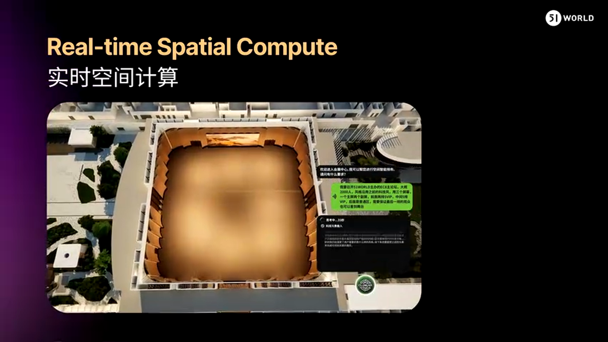
_Screenshot from 00:47:45_
---
## Section 886 (00:47:47)
**Transcript:**
> practice with the Earth
**Visual Reference:**

_Screenshot from 00:47:47_
---
## Section 887 (00:47:49)
**Transcript:**
> but we are actually
**Visual Reference:**
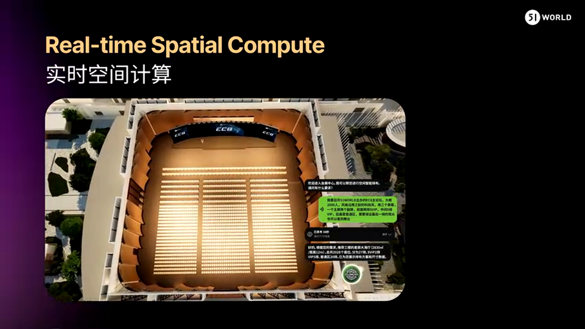
_Screenshot from 00:47:49_
---
## Section 888 (00:47:51)
**Transcript:**
> in a environment
**Visual Reference:**
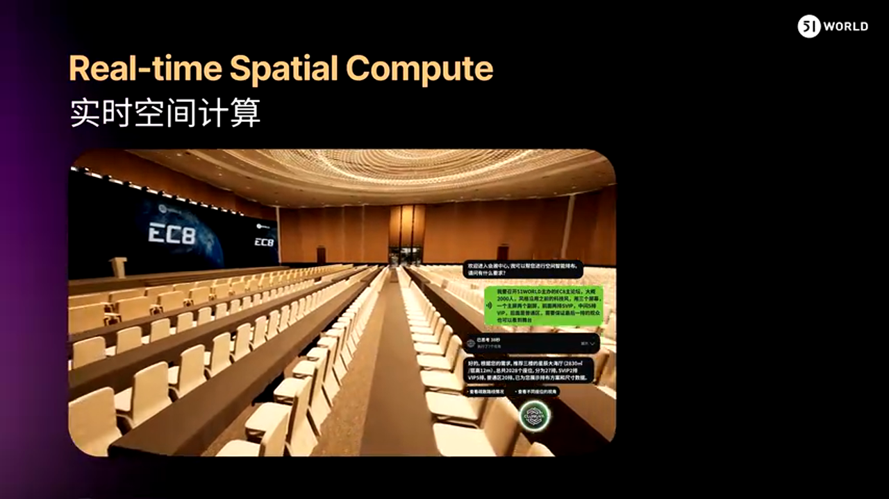
_Screenshot from 00:47:51_
---
## Section 889 (00:47:52)
**Transcript:**
> to create
**Visual Reference:**
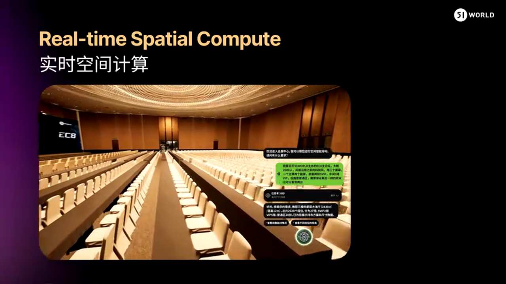
_Screenshot from 00:47:52_
---
## Section 890 (00:47:54)
**Transcript:**
> all the data
**Visual Reference:**
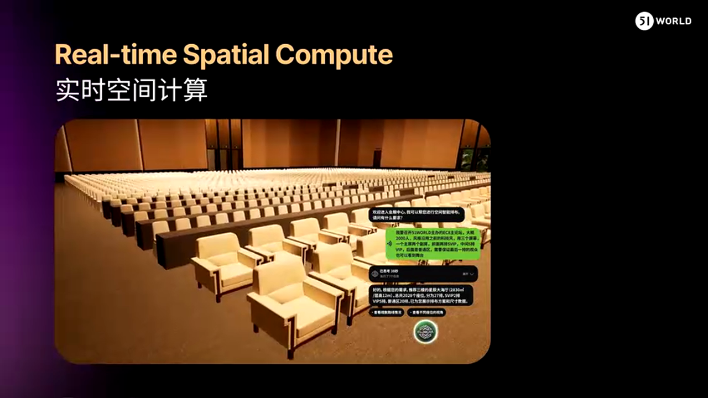
_Screenshot from 00:47:54_
---
## Section 891 (00:47:56)
**Transcript:**
> in the game field.
**Visual Reference:**

_Screenshot from 00:47:56_
---
## Section 892 (00:47:57)
**Transcript:**
> What is the
**Visual Reference:**
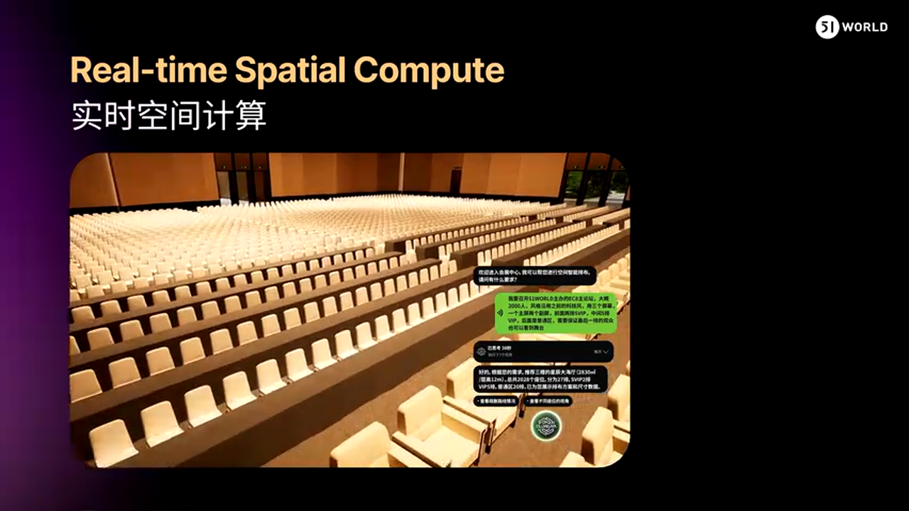
_Screenshot from 00:47:57_
---
## Section 893 (00:47:58)
**Transcript:**
> meaning of the story?
**Visual Reference:**
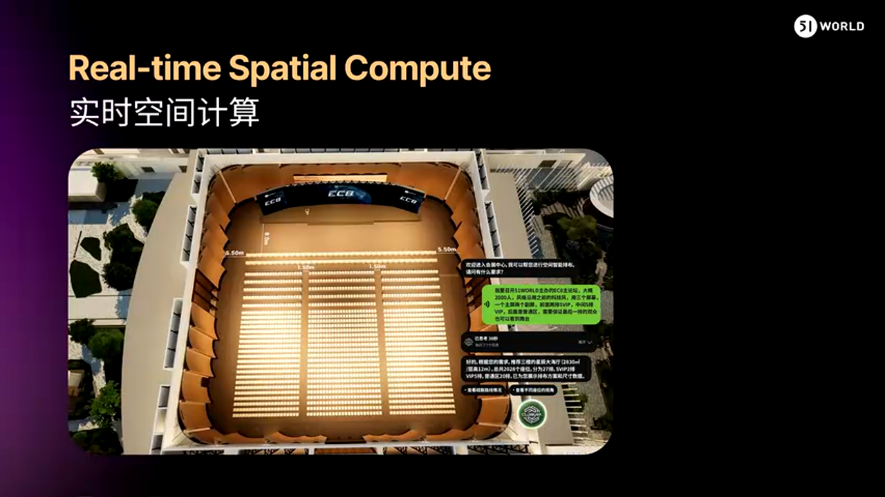
_Screenshot from 00:47:58_
---
## Section 894 (00:47:59)
**Transcript:**
> What is the purpose of the story?
**Visual Reference:**

_Screenshot from 00:47:59_
---
## Section 895 (00:48:00)
**Transcript:**
> At this time,
**Visual Reference:**

_Screenshot from 00:48:00_
---
## Section 896 (00:48:01)
**Transcript:**
> AI and the Earth
**Visual Reference:**

_Screenshot from 00:48:01_
---
## Section 897 (00:48:02)
**Transcript:**
> can actually
**Visual Reference:**

_Screenshot from 00:48:02_
---
## Section 898 (00:48:03)
**Transcript:**
> create a very good
**Visual Reference:**

_Screenshot from 00:48:03_
---
## Section 899 (00:48:05)
**Transcript:**
> practice.
**Visual Reference:**

_Screenshot from 00:48:05_
---
## Section 900 (00:48:06)
**Transcript:**
> You can still create a practice.
**Visual Reference:**

_Screenshot from 00:48:06_
---
## Section 901 (00:48:08)
**Transcript:**
> To create a practice
**Visual Reference:**

_Screenshot from 00:48:08_
---
## Section 902 (00:48:10)
**Transcript:**
> we can create
**Visual Reference:**

_Screenshot from 00:48:10_
---
## Section 903 (00:48:12)
**Transcript:**
> a very good practice
**Visual Reference:**
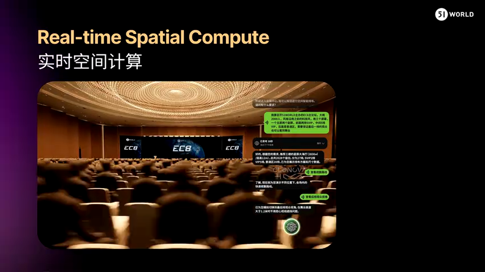
_Screenshot from 00:48:12_
---
## Section 904 (00:48:13)
**Transcript:**
> and create a very good practice.
**Visual Reference:**

_Screenshot from 00:48:13_
---
## Section 905 (00:48:14)
**Transcript:**
> We can create a very good practice
**Visual Reference:**
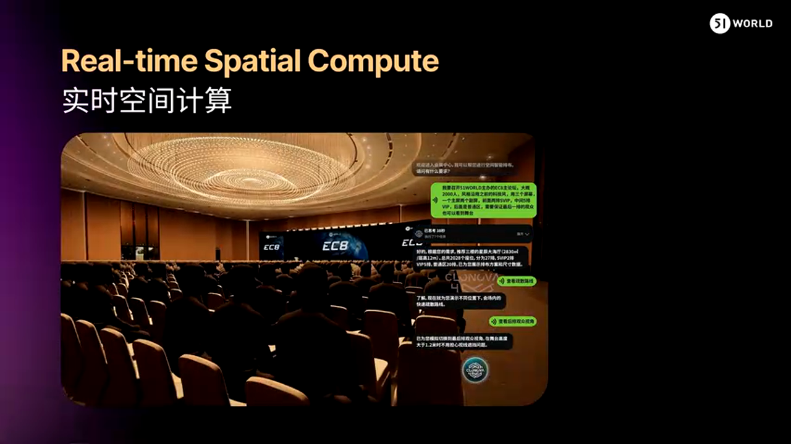
_Screenshot from 00:48:14_
---
## Section 906 (00:48:16)
**Transcript:**
> and create a very good practice.
**Visual Reference:**

_Screenshot from 00:48:16_
---
## Section 907 (00:48:17)
**Transcript:**
> This is a very important
**Visual Reference:**

_Screenshot from 00:48:17_
---
## Section 908 (00:48:19)
**Transcript:**
> practice.
**Visual Reference:**

_Screenshot from 00:48:19_
---
## Section 909 (00:48:20)
**Transcript:**
> We love complex
**Visual Reference:**

_Screenshot from 00:48:20_
---
## Section 910 (00:48:22)
**Transcript:**
> interaction.
**Visual Reference:**
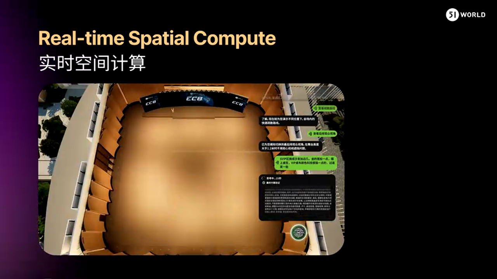
_Screenshot from 00:48:22_
---
## Section 911 (00:48:24)
**Transcript:**
> I think
**Visual Reference:**
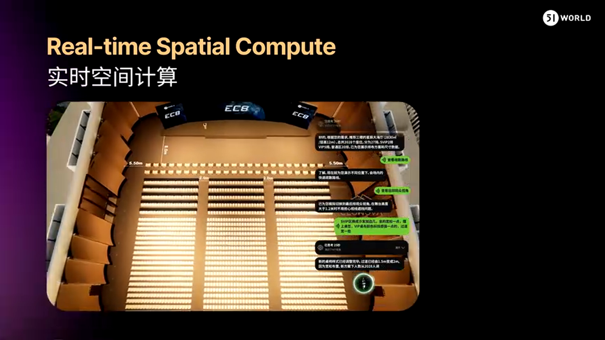
_Screenshot from 00:48:24_
---
## Section 912 (00:48:32)
**Transcript:**
> using what
**Visual Reference:**
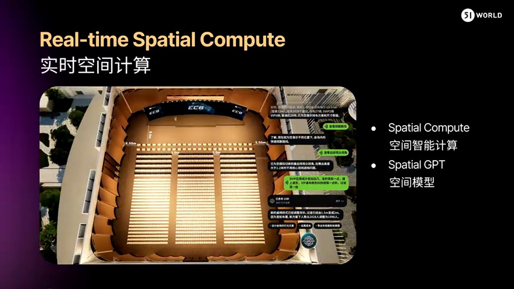
_Screenshot from 00:48:32_
---
## Section 913 (00:48:34)
**Transcript:**
> we created
**Visual Reference:**

_Screenshot from 00:48:34_
---
## Section 914 (00:48:37)
**Transcript:**
> to ensure
**Visual Reference:**

_Screenshot from 00:48:37_
---
## Section 915 (00:48:39)
**Transcript:**
> layseng
**Visual Reference:**

_Screenshot from 00:48:39_
---
## Section 916 (00:48:41)
**Transcript:**
> can create a practice
**Visual Reference:**

_Screenshot from 00:48:41_
---
## Section 917 (00:48:41)
**Transcript:**
> and create a very good practice level.
**Visual Reference:**

_Screenshot from 00:48:41_
---
## Section 918 (00:48:44)
**Transcript:**
> 看到大屏幕
**Visual Reference:**

_Screenshot from 00:48:44_
---
## Section 919 (00:48:46)
**Transcript:**
> 那按照这个距离的话
**Visual Reference:**

_Screenshot from 00:48:46_
---
## Section 920 (00:48:47)
**Transcript:**
> 我的整个舞台的高度是多少
**Visual Reference:**

_Screenshot from 00:48:47_
---
## Section 921 (00:48:50)
**Transcript:**
> 马上可以给力一个职业的答案
**Visual Reference:**

_Screenshot from 00:48:50_
---
## Section 922 (00:48:52)
**Transcript:**
> 最后一个可能是大家
**Visual Reference:**

_Screenshot from 00:48:52_
---
## Section 923 (00:48:54)
**Transcript:**
> 没有太意识到
**Visual Reference:**

_Screenshot from 00:48:54_
---
## Section 924 (00:48:56)
**Transcript:**
> 但是我们在时间中已经探索出非常重要的
**Visual Reference:**
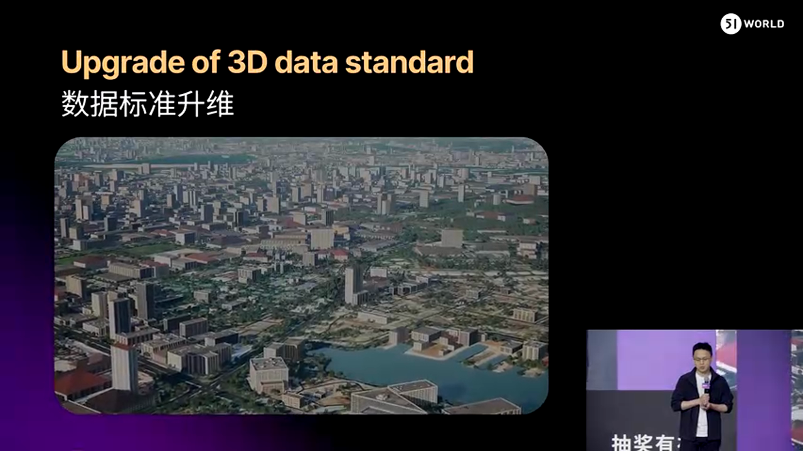
_Screenshot from 00:48:56_
---
## Section 925 (00:48:59)
**Transcript:**
> 说我们为什么能够让AI可以理解三第世界
**Visual Reference:**
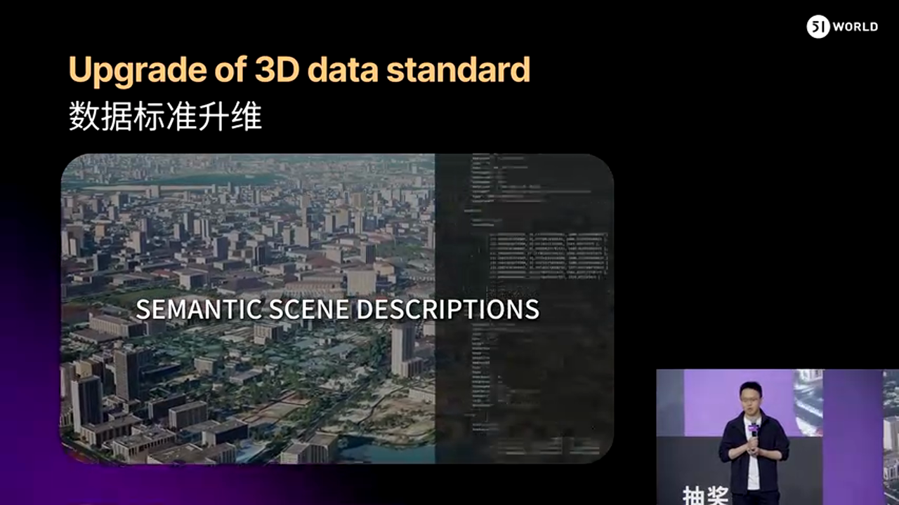
_Screenshot from 00:48:59_
---
## Section 926 (00:49:04)
**Transcript:**
> 有一种是通过四约语言大模型
**Visual Reference:**

_Screenshot from 00:49:04_
---
## Section 927 (00:49:07)
**Transcript:**
> 就好像这个自人体在结束现实世界一样
**Visual Reference:**
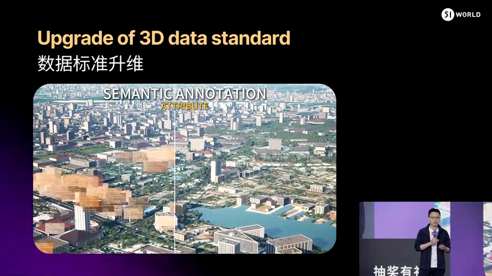
_Screenshot from 00:49:07_
---
## Section 928 (00:49:12)
**Transcript:**
> 其实它非常复杂
**Visual Reference:**
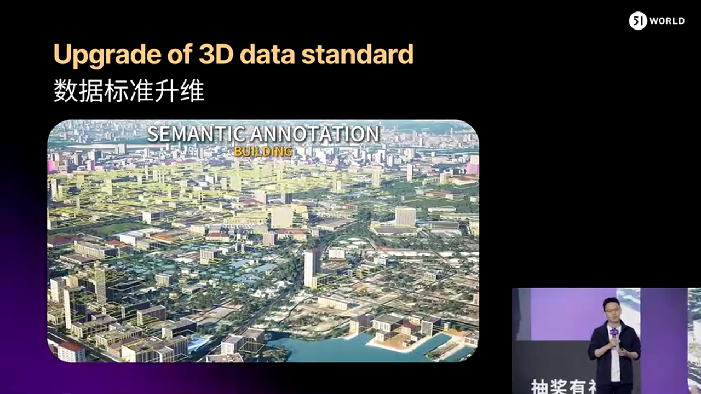
_Screenshot from 00:49:12_
---
## Section 929 (00:49:13)
**Transcript:**
> 我们在时间过程中
**Visual Reference:**

_Screenshot from 00:49:13_
---
## Section 930 (00:49:15)
**Transcript:**
> 我们在创建三第场景的第一天
**Visual Reference:**

_Screenshot from 00:49:15_
---
## Section 931 (00:49:18)
**Transcript:**
> 第一望
**Visual Reference:**
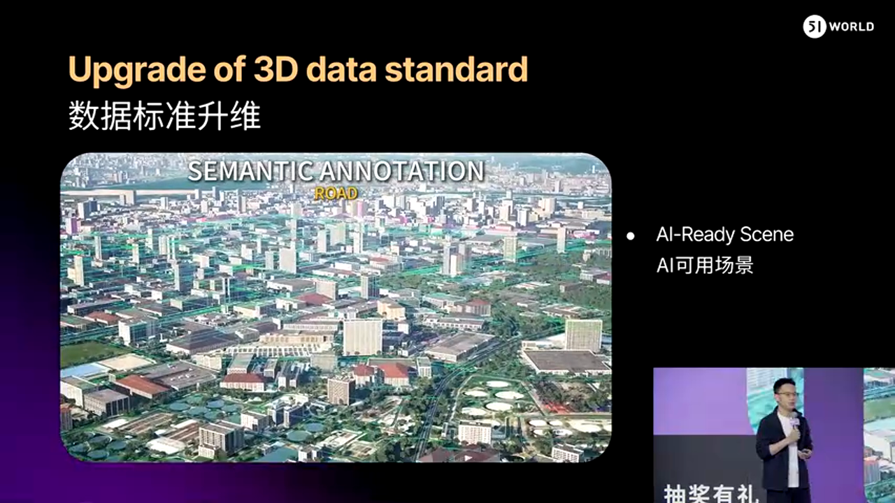
_Screenshot from 00:49:18_
---
## Section 932 (00:49:19)
**Transcript:**
> 我们就将所有的三第数据
**Visual Reference:**
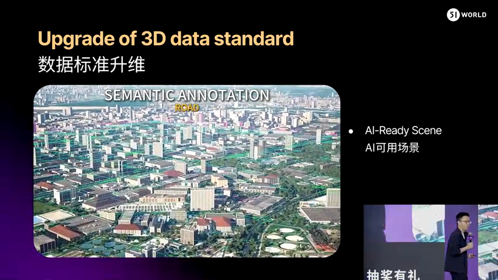
_Screenshot from 00:49:19_
---
## Section 933 (00:49:22)
**Transcript:**
> 变成一地化
**Visual Reference:**

_Screenshot from 00:49:22_
---
## Section 934 (00:49:24)
**Transcript:**
> 就变成文本
**Visual Reference:**

_Screenshot from 00:49:24_
---
## Section 935 (00:49:25)
**Transcript:**
> 所以说当我们在AI的时代
**Visual Reference:**
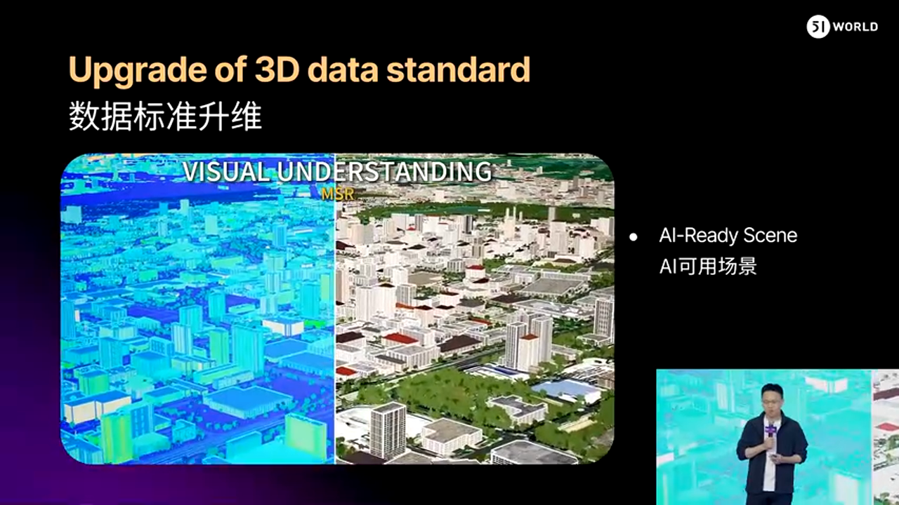
_Screenshot from 00:49:25_
---
## Section 936 (00:49:28)
**Transcript:**
> 我们需要在创建三第的资产的时候
**Visual Reference:**

_Screenshot from 00:49:28_
---
## Section 937 (00:49:32)
**Transcript:**
> 同时考虑到AI的理解
**Visual Reference:**
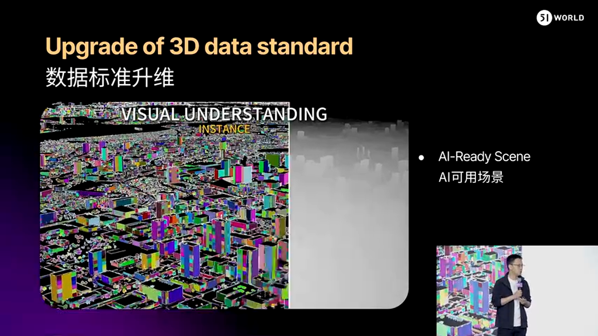
_Screenshot from 00:49:32_
---
## Section 938 (00:49:35)
**Transcript:**
> 过去我们创建三第的世界
**Visual Reference:**
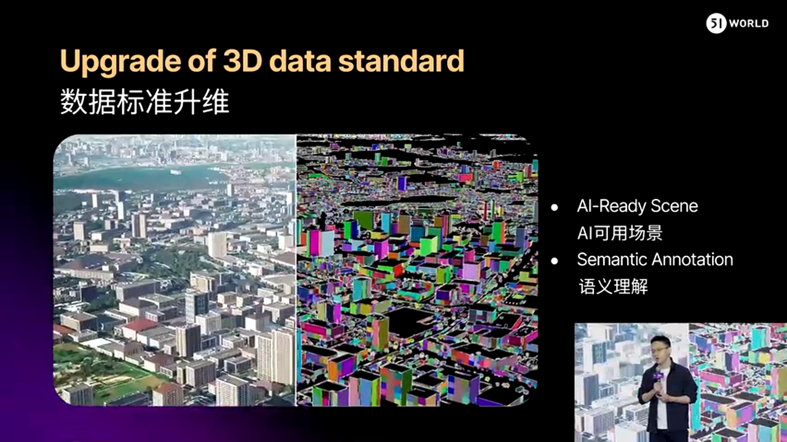
_Screenshot from 00:49:35_
---
## Section 939 (00:49:36)
**Transcript:**
> 主要是考虑选人
**Visual Reference:**

_Screenshot from 00:49:36_
---
## Section 940 (00:49:38)
**Transcript:**
> 考虑整个的一个运行
**Visual Reference:**

_Screenshot from 00:49:38_
---
## Section 941 (00:49:40)
**Transcript:**
> 那这个时候在新的AI的时代
**Visual Reference:**

_Screenshot from 00:49:40_
---
## Section 942 (00:49:42)
**Transcript:**
> 我们如果将语语理解
**Visual Reference:**

_Screenshot from 00:49:42_
---
## Section 943 (00:49:44)
**Transcript:**
> 再将视觉理解
**Visual Reference:**
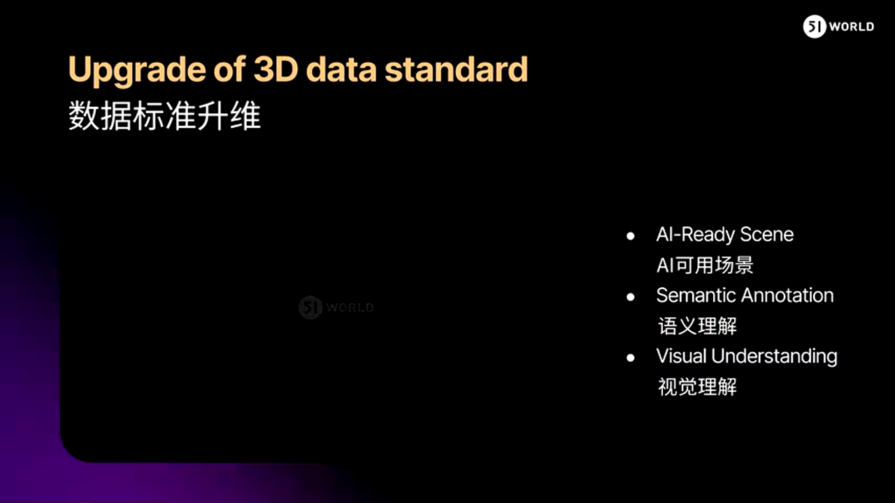
_Screenshot from 00:49:44_
---
## Section 944 (00:49:45)
**Transcript:**
> 提前考虑到前端
**Visual Reference:**

_Screenshot from 00:49:45_
---
## Section 945 (00:49:48)
**Transcript:**
> 那这个时候当这个AI一旦开始实别
**Visual Reference:**

_Screenshot from 00:49:48_
---
## Section 946 (00:49:51)
**Transcript:**
> 它的效率变得非常的高
**Visual Reference:**

_Screenshot from 00:49:51_
---
## Section 947 (00:49:53)
**Transcript:**
> 每一次的访会都是秒极的
**Visual Reference:**

_Screenshot from 00:49:53_
---
## Section 948 (00:49:55)
**Transcript:**
> 不会需要大量的计算
**Visual Reference:**

_Screenshot from 00:49:55_
---
## Section 949 (00:49:58)
**Transcript:**
> 所以这个有时候是一种反常时的
**Visual Reference:**

_Screenshot from 00:49:58_
---
## Section 950 (00:50:00)
**Transcript:**
> 说我们现在在做三第
**Visual Reference:**

_Screenshot from 00:50:00_
---
## Section 951 (00:50:02)
**Transcript:**
> 其实我们要将三第数据变成一地化
**Visual Reference:**

_Screenshot from 00:50:02_
---
## Section 952 (00:50:05)
**Transcript:**
> 就变成一个最简单的文本结合到一起
**Visual Reference:**

_Screenshot from 00:50:05_
---
## Section 953 (00:50:09)
**Transcript:**
> 那最后概括一下
**Visual Reference:**

_Screenshot from 00:50:09_
---
## Section 954 (00:50:10)
**Transcript:**
> 在今天短正的一个分享
**Visual Reference:**

_Screenshot from 00:50:10_
---
## Section 955 (00:50:13)
**Transcript:**
> 我们认为AI和三第
**Visual Reference:**

_Screenshot from 00:50:13_
---
## Section 956 (00:50:15)
**Transcript:**
> 不仅是可以对开发者提升开发效率
**Visual Reference:**

_Screenshot from 00:50:15_
---
## Section 957 (00:50:19)
**Transcript:**
> 更重要的是
**Visual Reference:**

_Screenshot from 00:50:19_
---
## Section 958 (00:50:20)
**Transcript:**
> 它带来了用户去体验三第产品
**Visual Reference:**

_Screenshot from 00:50:20_
---
## Section 959 (00:50:25)
**Transcript:**
> 带来了交互的改变
**Visual Reference:**

_Screenshot from 00:50:25_
---
## Section 960 (00:50:26)
**Transcript:**
> 体验实施反馈的改变
**Visual Reference:**

_Screenshot from 00:50:26_
---
## Section 961 (00:50:28)
**Transcript:**
> 以及我们在数据标准的改变
**Visual Reference:**

_Screenshot from 00:50:28_
---
## Section 962 (00:50:31)
**Transcript:**
> 当这些改变成为现实以后
**Visual Reference:**

_Screenshot from 00:50:31_
---
## Section 963 (00:50:34)
**Transcript:**
> 我们的使用在虚幻影形使用的用户人群
**Visual Reference:**

_Screenshot from 00:50:34_
---
## Section 964 (00:50:39)
**Transcript:**
> 可能就会远远的超过现在的游戏玩家
**Visual Reference:**

_Screenshot from 00:50:39_
---
## Section 965 (00:50:42)
**Transcript:**
> 因为它的门槛降低了
**Visual Reference:**

_Screenshot from 00:50:42_
---
## Section 966 (00:50:44)
**Transcript:**
> 它可以用一个手机
**Visual Reference:**

_Screenshot from 00:50:44_
---
## Section 967 (00:50:45)
**Transcript:**
> 用自然语言就可以体验三第的产品
**Visual Reference:**

_Screenshot from 00:50:45_
---
## Section 968 (00:50:48)
**Transcript:**
> 所以也非常希望和虚幻一直陪伴
**Visual Reference:**
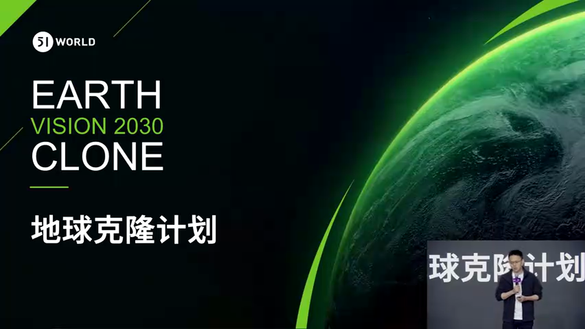
_Screenshot from 00:50:48_
---
## Section 969 (00:50:53)
**Transcript:**
> 也助理我们在整个地球克龙的目标
**Visual Reference:**

_Screenshot from 00:50:53_
---
## Section 970 (00:50:57)
**Transcript:**
> 我们希望在2030年之前可以带给
**Visual Reference:**

_Screenshot from 00:50:57_
---
## Section 971 (00:51:01)
**Transcript:**
> 整个世界一款让语音
**Visual Reference:**

_Screenshot from 00:51:01_
---
## Section 972 (00:51:04)
**Transcript:**
> 就输入可以还由世界的产品
**Visual Reference:**

_Screenshot from 00:51:04_
---
## Section 973 (00:51:06)
**Transcript:**
> 谢谢大家
**Visual Reference:**

_Screenshot from 00:51:06_
---
## Section 974 (00:51:09)
**Transcript:**
> 好好强� Secondly
**Visual Reference:**

_Screenshot from 00:51:09_
---
## Section 975 (00:51:15)
**Transcript:**
> 你好
**Visual Reference:**
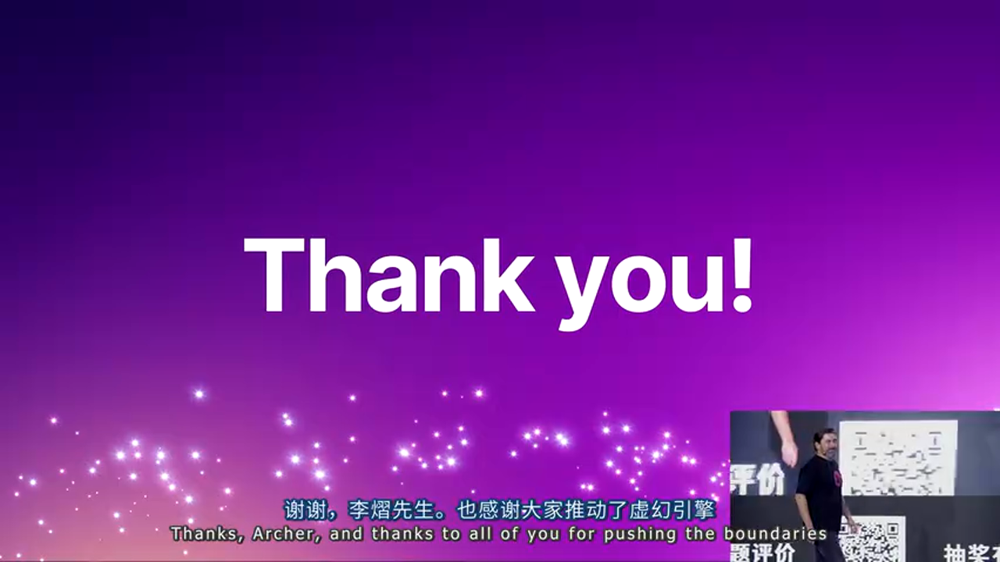
_Screenshot from 00:51:15_
---
## Section 976 (00:51:17)
**Transcript:**
> 但是了解我们整理的准备
**Visual Reference:**

_Screenshot from 00:51:17_
---
## Section 977 (00:51:19)
**Transcript:**
> 利 gin
**Visual Reference:**

_Screenshot from 00:51:19_
---
## Section 978 (00:51:30)
**Transcript:**
> 马克克文
**Visual Reference:**

_Screenshot from 00:51:30_
---
## Section 979 (00:51:31)
**Transcript:**
> 全部大家迎
**Visual Reference:**

_Screenshot from 00:51:31_
---
## Section 980 (00:51:41)
**Transcript:**
> 是我
**Visual Reference:**

_Screenshot from 00:51:41_
---
## Section 981 (00:51:47)
**Transcript:**
> 三年里
**Visual Reference:**
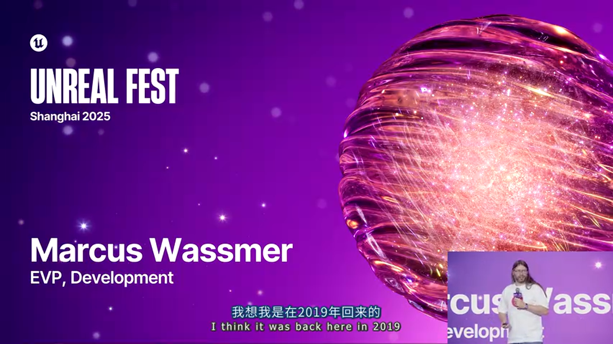
_Screenshot from 00:51:47_
---
## Section 982 (00:51:52)
**Transcript:**
> 或者是
**Visual Reference:**

_Screenshot from 00:51:52_
---
## Section 983 (00:51:54)
**Transcript:**
> 陪呢
**Visual Reference:**

_Screenshot from 00:51:54_
---
## Section 984 (00:51:57)
**Transcript:**
> 呃
**Visual Reference:**

_Screenshot from 00:51:57_
---
## Section 985 (00:51:58)
**Transcript:**
> 呃
**Visual Reference:**

_Screenshot from 00:51:58_
---
## Section 986 (00:51:58)
**Transcript:**
> 三 license ago
**Visual Reference:**

_Screenshot from 00:51:58_
---
## Section 987 (00:51:59)
**Transcript:**
> 我們還請安排五 point six
**Visual Reference:**

_Screenshot from 00:51:59_
---
## Section 988 (00:52:02)
**Transcript:**
> 這個是op Release
**Visual Reference:**

_Screenshot from 00:52:02_
---
## Section 989 (00:52:04)
**Transcript:**
> 我們本台應用上的 killme
**Visual Reference:**

_Screenshot from 00:52:04_
---
## Section 990 (00:52:07)
**Transcript:**
> 各方面
**Visual Reference:**

_Screenshot from 00:52:07_
---
## Section 991 (00:52:10)
**Transcript:**
> 生煤 tires
**Visual Reference:**

_Screenshot from 00:52:10_
---
## Section 992 (00:52:12)
**Transcript:**
> 長� residents
**Visual Reference:**

_Screenshot from 00:52:12_
---
## Section 993 (00:52:14)
**Transcript:**
> 我真的為什麼炫耀
**Visual Reference:**
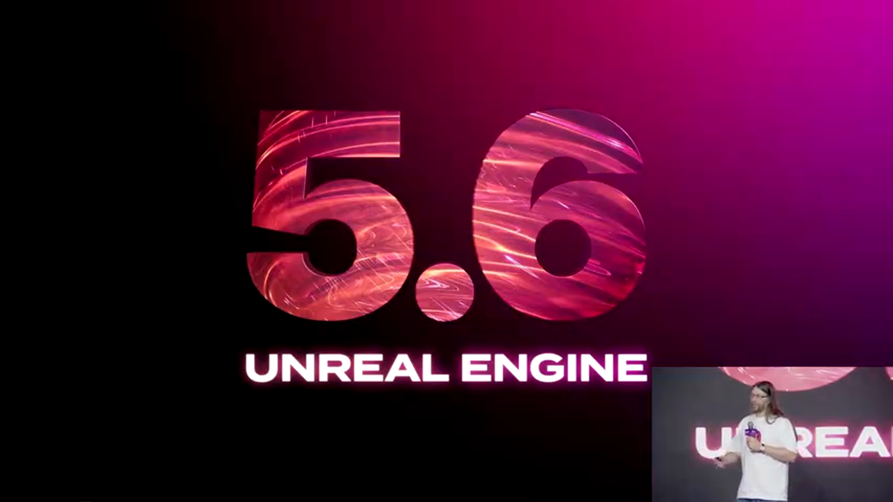
_Screenshot from 00:52:14_
---
## Section 994 (00:52:17)
**Transcript:**
> 我本台翻 maturity
**Visual Reference:**
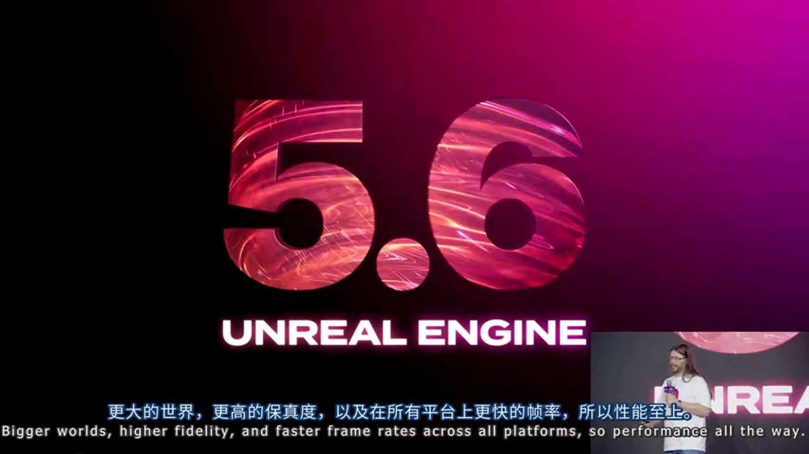
_Screenshot from 00:52:17_
---
## Section 995 (00:52:18)
**Transcript:**
> 個數為止
**Visual Reference:**

_Screenshot from 00:52:18_
---
## Section 996 (00:52:20)
**Transcript:**
> 剩也了
**Visual Reference:**

_Screenshot from 00:52:20_
---
## Section 997 (00:52:23)
**Transcript:**
> 明確確 test
**Visual Reference:**
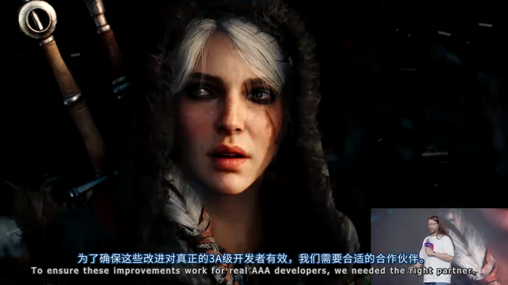
_Screenshot from 00:52:23_
---
## Section 998 (00:52:25)
**Transcript:**
> 第三期事情大 quo selected 国安 The
**Visual Reference:**

_Screenshot from 00:52:25_
---
## Section 999 (00:52:46)
**Transcript:**
> Riki we see
**Visual Reference:**

_Screenshot from 00:52:46_
---
## Section 1000 (00:52:48)
**Transcript:**
> 把它脑背又嬴 delay
**Visual Reference:**

_Screenshot from 00:52:48_
---
## Section 1001 (00:52:51)
**Transcript:**
> 進行1時進行設計
**Visual Reference:**
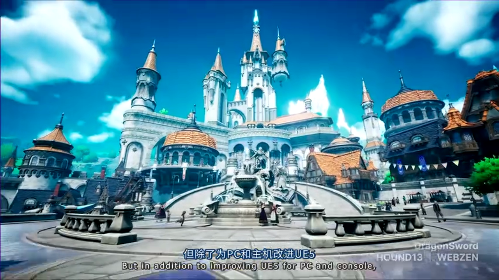
_Screenshot from 00:52:51_
---
## Section 1002 (00:52:54)
**Transcript:**
> 安裝功 migrate
**Visual Reference:**

_Screenshot from 00:52:54_
---
## Section 1003 (00:52:56)
**Transcript:**
> 按鈕個點
**Visual Reference:**

_Screenshot from 00:52:56_
---
## Section 1004 (00:53:07)
**Transcript:**
> 排列
**Visual Reference:**

_Screenshot from 00:53:07_
---
## Section 1005 (00:53:16)
**Transcript:**
> 好 那那是 enough high-level talk
**Visual Reference:**
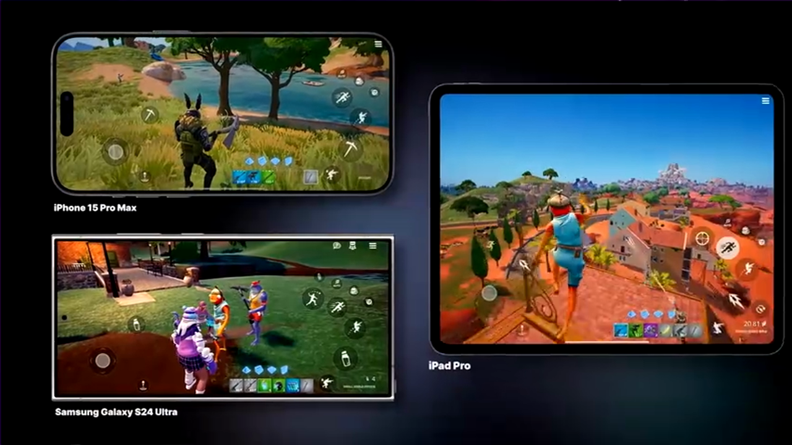
_Screenshot from 00:53:16_
---
## Section 1006 (00:53:18)
**Transcript:**
> let's look at some actual details here
**Visual Reference:**

_Screenshot from 00:53:18_
---
## Section 1007 (00:53:22)
**Transcript:**
> First we have doubled lumens ray tracing performance
**Visual Reference:**
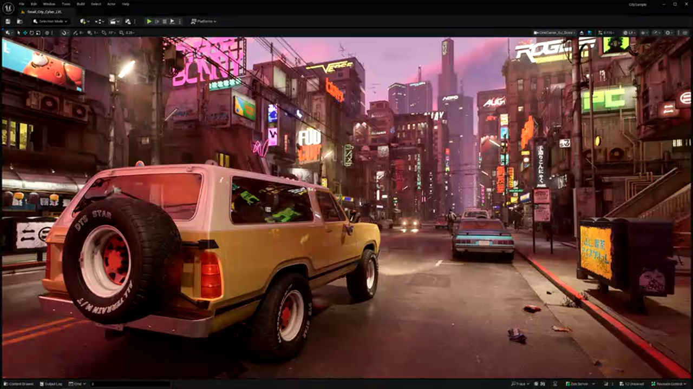
_Screenshot from 00:53:22_
---
## Section 1008 (00:53:26)
**Transcript:**
> since UE5 launch
**Visual Reference:**

_Screenshot from 00:53:26_
---
## Section 1009 (00:53:28)
**Transcript:**
> We also rewrote the entire skeletal mesh pipeline
**Visual Reference:**

_Screenshot from 00:53:28_
---
## Section 1010 (00:53:31)
**Transcript:**
> to run asynchronously on both CPU and GPU
**Visual Reference:**

_Screenshot from 00:53:31_
---
## Section 1011 (00:53:35)
**Transcript:**
> As you've seen with the Witcher 4 demo
**Visual Reference:**

_Screenshot from 00:53:35_
---
## Section 1012 (00:53:37)
**Transcript:**
> hitting 60 FPS on consoles
**Visual Reference:**

_Screenshot from 00:53:37_
---
## Section 1013 (00:53:39)
**Transcript:**
> with full nanite and lumens support
**Visual Reference:**

_Screenshot from 00:53:39_
---
## Section 1014 (00:53:41)
**Transcript:**
> is now significantly easier
**Visual Reference:**

_Screenshot from 00:53:41_
---
## Section 1015 (00:53:43)
**Transcript:**
> On the simulation side
**Visual Reference:**

_Screenshot from 00:53:43_
---
## Section 1016 (00:53:46)
**Transcript:**
> we upgraded chaos cloth with smarter cloth to cloth constraints
**Visual Reference:**
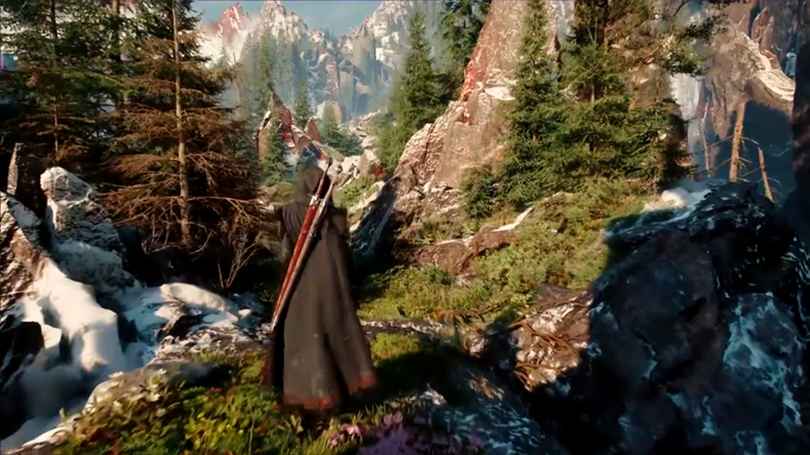
_Screenshot from 00:53:46_
---
## Section 1017 (00:53:50)
**Transcript:**
> hitting sub millisecond budgets
**Visual Reference:**
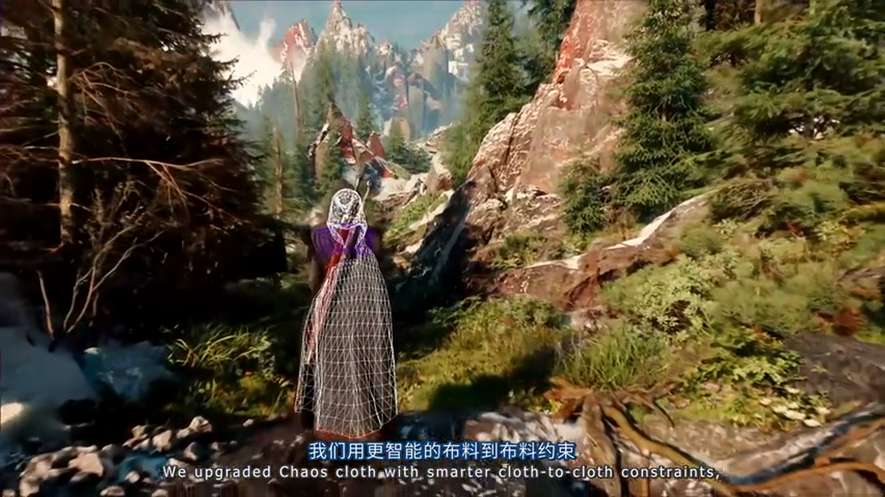
_Screenshot from 00:53:50_
---
## Section 1018 (00:53:52)
**Transcript:**
> even in complex setups
**Visual Reference:**

_Screenshot from 00:53:52_
---
## Section 1019 (00:53:56)
**Transcript:**
> We also added more natural deformation
**Visual Reference:**
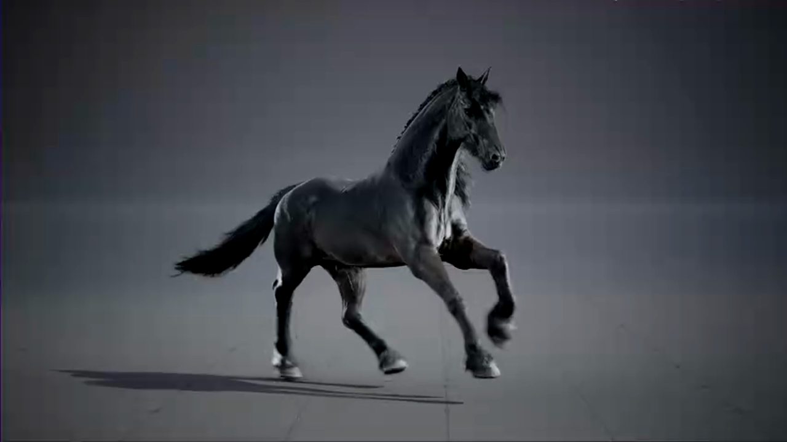
_Screenshot from 00:53:56_
---
## Section 1020 (00:53:58)
**Transcript:**
> to chaos flesh
**Visual Reference:**

_Screenshot from 00:53:58_
---
## Section 1021 (00:54:00)
**Transcript:**
> via procedural muscle simulation
**Visual Reference:**
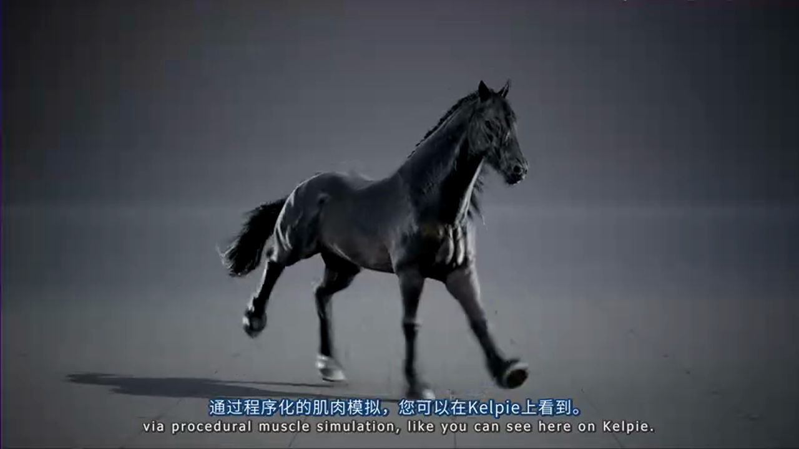
_Screenshot from 00:54:00_
---
## Section 1022 (00:54:02)
**Transcript:**
> Like you can see here on keelpeen
**Visual Reference:**

_Screenshot from 00:54:02_
---
## Section 1023 (00:54:06)
**Transcript:**
> And Niagara fluids also got a big lift
**Visual Reference:**
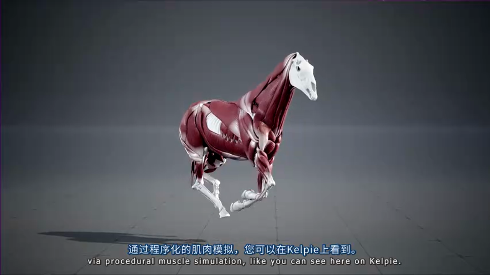
_Screenshot from 00:54:06_
---
## Section 1024 (00:54:10)
**Transcript:**
> helping you to bake high fidelity water
**Visual Reference:**

_Screenshot from 00:54:10_
---
## Section 1025 (00:54:12)
**Transcript:**
> as lightweight assets
**Visual Reference:**

_Screenshot from 00:54:12_
---
## Section 1026 (00:54:14)
**Transcript:**
> meaning realistic fluid visuals
**Visual Reference:**

_Screenshot from 00:54:14_
---
## Section 1027 (00:54:16)
**Transcript:**
> without high runtime performance costs
**Visual Reference:**
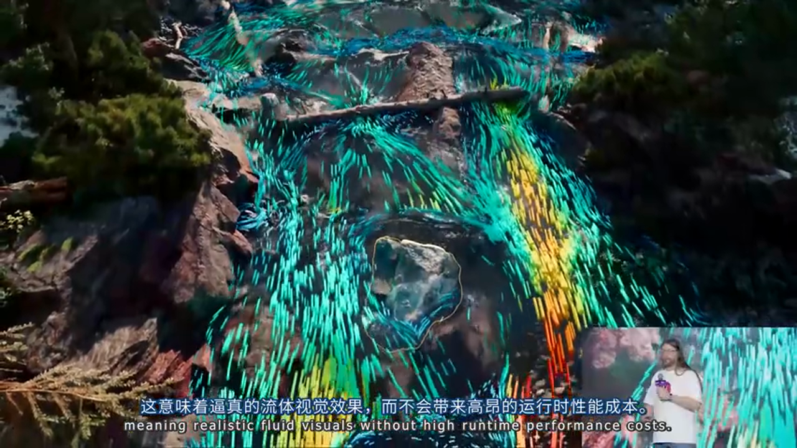
_Screenshot from 00:54:16_
---
## Section 1028 (00:54:20)
**Transcript:**
> In animation
**Visual Reference:**
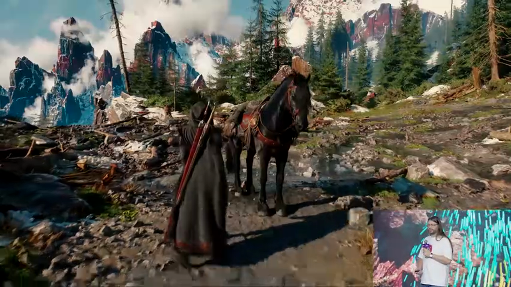
_Screenshot from 00:54:20_
---
## Section 1029 (00:54:22)
**Transcript:**
> we launched our multi-character
**Visual Reference:**

_Screenshot from 00:54:22_
---
## Section 1030 (00:54:24)
**Transcript:**
> motion matching system
**Visual Reference:**

_Screenshot from 00:54:24_
---
## Section 1031 (00:54:26)
**Transcript:**
> for seamless interactions
**Visual Reference:**
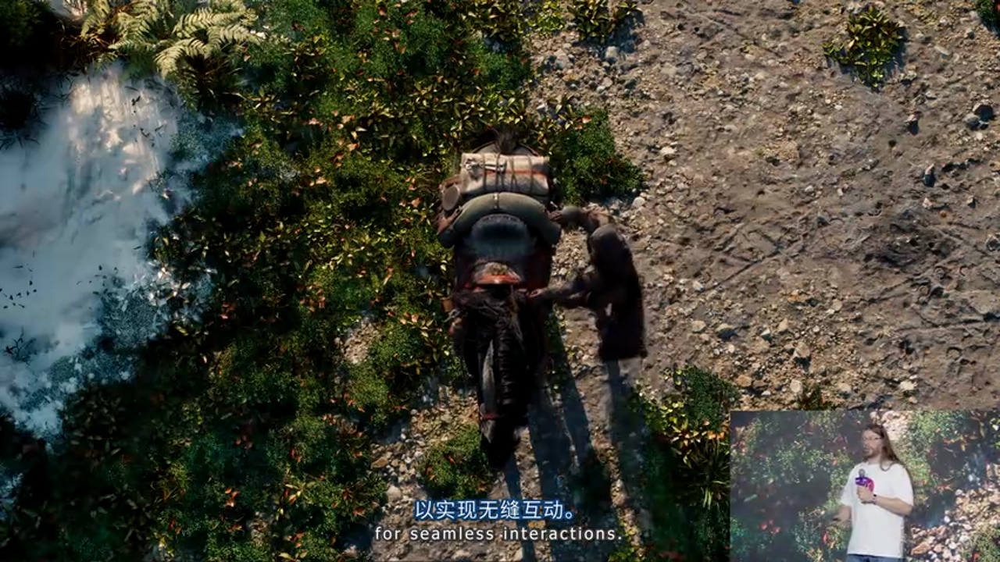
_Screenshot from 00:54:26_
---
## Section 1032 (00:54:28)
**Transcript:**
> In the technical demo
**Visual Reference:**

_Screenshot from 00:54:28_
---
## Section 1033 (00:54:30)
**Transcript:**
> you can see here keelpeen and seri
**Visual Reference:**
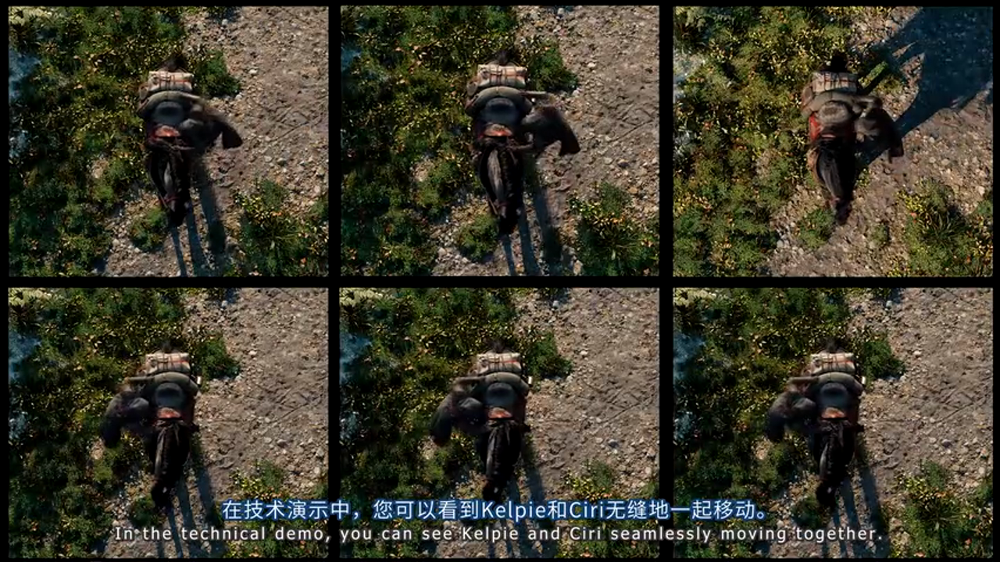
_Screenshot from 00:54:30_
---
## Section 1034 (00:54:32)
**Transcript:**
> seamlessly moving together
**Visual Reference:**
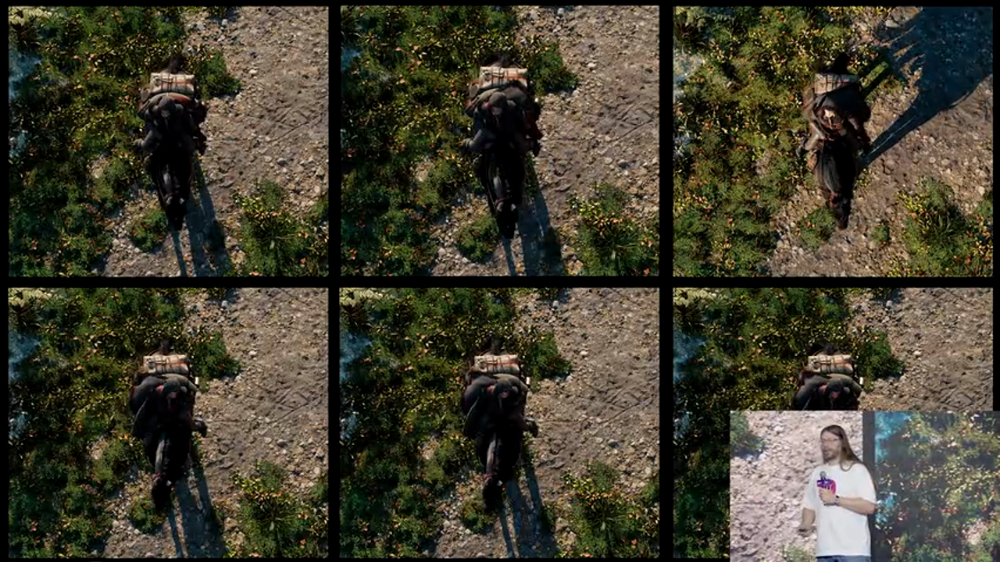
_Screenshot from 00:54:32_
---
## Section 1035 (00:54:34)
**Transcript:**
> And physics driven control rig animation
**Visual Reference:**

_Screenshot from 00:54:34_
---
## Section 1036 (00:54:36)
**Transcript:**
> can be layered on top
**Visual Reference:**

_Screenshot from 00:54:36_
---
## Section 1037 (00:54:38)
**Transcript:**
> affecting things like keelpeen's main
**Visual Reference:**

_Screenshot from 00:54:38_
---
## Section 1038 (00:54:40)
**Transcript:**
> and saddlebags
**Visual Reference:**

_Screenshot from 00:54:40_
---
## Section 1039 (00:54:44)
**Transcript:**
> We also introduced stitch tracks
**Visual Reference:**

_Screenshot from 00:54:44_
---
## Section 1040 (00:54:46)
**Transcript:**
> in sequencer
**Visual Reference:**
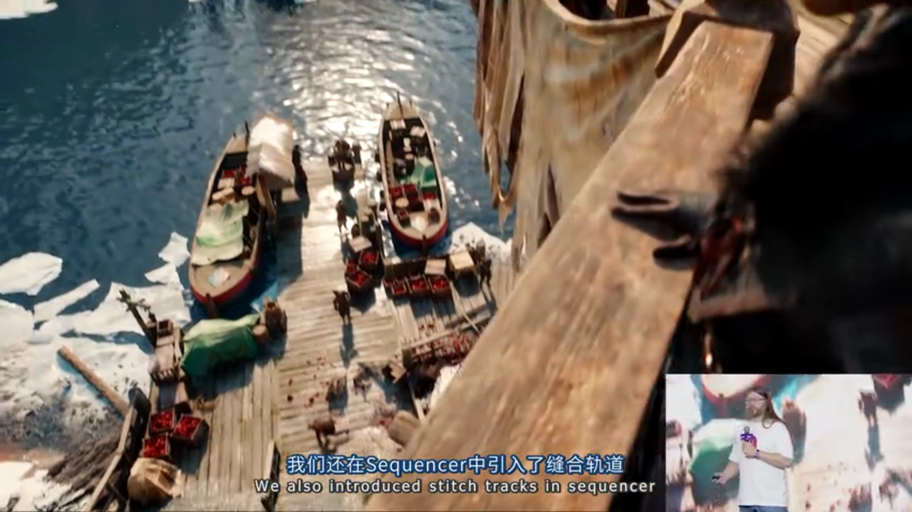
_Screenshot from 00:54:46_
---
## Section 1041 (00:54:48)
**Transcript:**
> for effortless transitions between gameplay
**Visual Reference:**

_Screenshot from 00:54:48_
---
## Section 1042 (00:54:50)
**Transcript:**
> and cinematics
**Visual Reference:**

_Screenshot from 00:54:50_
---
## Section 1043 (00:54:52)
**Transcript:**
> That all means faster
**Visual Reference:**
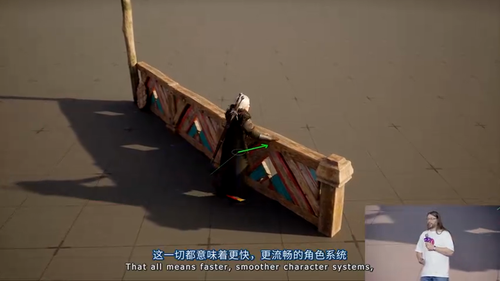
_Screenshot from 00:54:52_
---
## Section 1044 (00:54:54)
**Transcript:**
> smoother character systems
**Visual Reference:**

_Screenshot from 00:54:54_
---
## Section 1045 (00:54:56)
**Transcript:**
> even in dense crown seeds
**Visual Reference:**
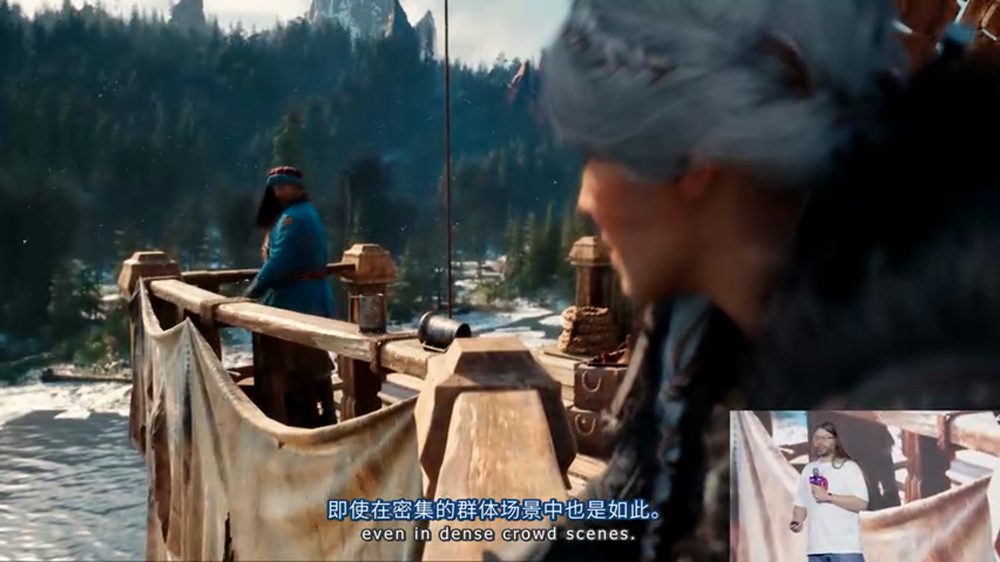
_Screenshot from 00:54:56_
---
## Section 1046 (00:54:58)
**Transcript:**
> All of this is now part of the new
**Visual Reference:**
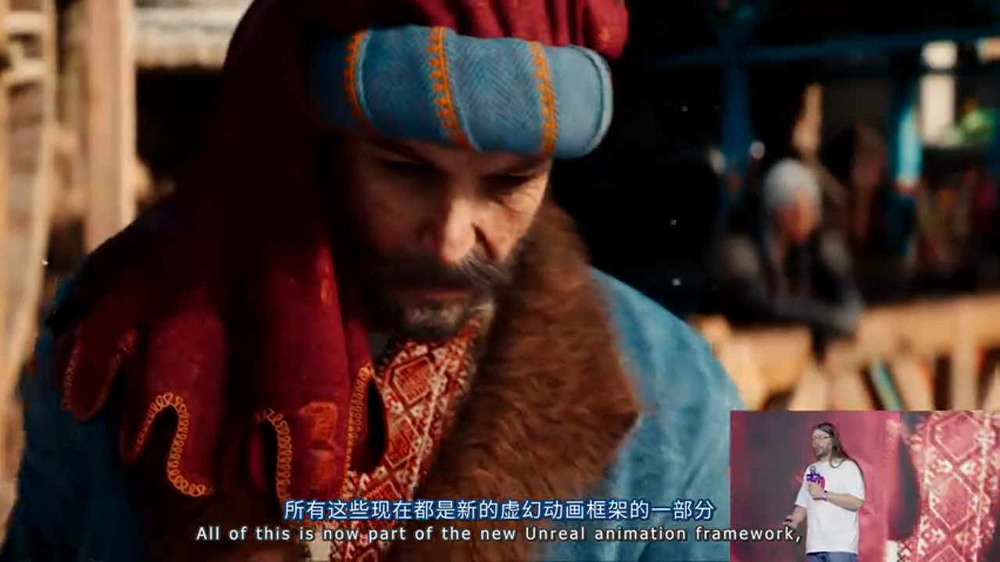
_Screenshot from 00:54:58_
---
## Section 1047 (00:55:00)
**Transcript:**
> Unreal animation framework
**Visual Reference:**

_Screenshot from 00:55:00_
---
## Section 1048 (00:55:02)
**Transcript:**
> available in 5.6
**Visual Reference:**
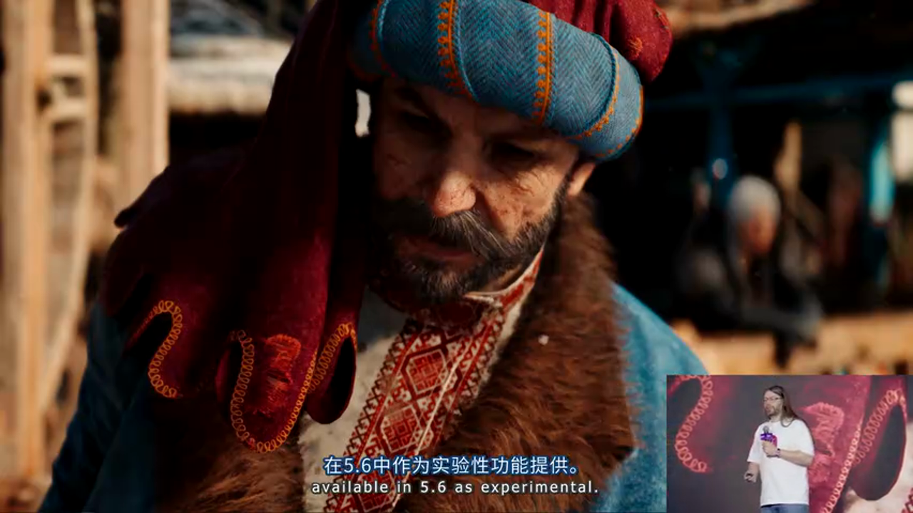
_Screenshot from 00:55:02_
---
## Section 1049 (00:55:04)
**Transcript:**
> as experimental
**Visual Reference:**

_Screenshot from 00:55:04_
---
## Section 1050 (00:55:06)
**Transcript:**
> In addition, streaming is what makes large
**Visual Reference:**
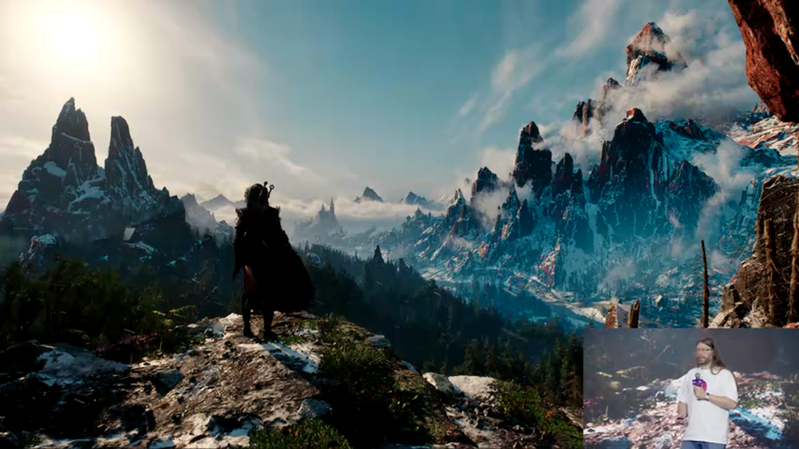
_Screenshot from 00:55:06_
---
## Section 1051 (00:55:10)
**Transcript:**
> detailed worlds feel seamless
**Visual Reference:**

_Screenshot from 00:55:10_
---
## Section 1052 (00:55:12)
**Transcript:**
> And in 5.6
**Visual Reference:**
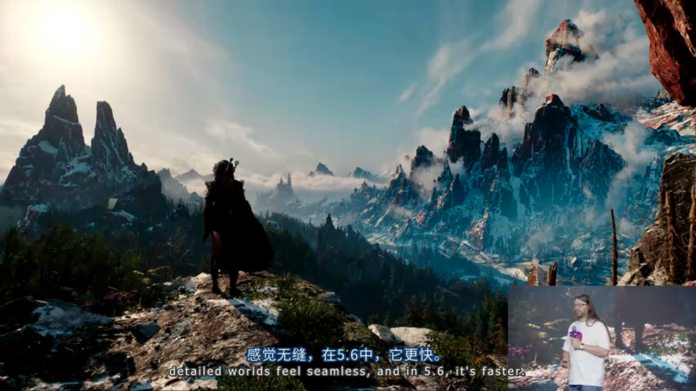
_Screenshot from 00:55:12_
---
## Section 1053 (00:55:14)
**Transcript:**
> it's faster, lighter, and more scalable
**Visual Reference:**

_Screenshot from 00:55:14_
---
## Section 1054 (00:55:18)
**Transcript:**
> Physics state creation
**Visual Reference:**

_Screenshot from 00:55:18_
---
## Section 1055 (00:55:20)
**Transcript:**
> now runs asynchronously
**Visual Reference:**

_Screenshot from 00:55:20_
---
## Section 1056 (00:55:22)
**Transcript:**
> So gameplay ready assets
**Visual Reference:**

_Screenshot from 00:55:22_
---
## Section 1057 (00:55:24)
**Transcript:**
> can stream in smoothly and efficiently
**Visual Reference:**

_Screenshot from 00:55:24_
---
## Section 1058 (00:55:26)
**Transcript:**
> Ground scatter from PCG
**Visual Reference:**

_Screenshot from 00:55:26_
---
## Section 1059 (00:55:28)
**Transcript:**
> now runs on the GPU
**Visual Reference:**

_Screenshot from 00:55:28_
---
## Section 1060 (00:55:30)
**Transcript:**
> at runtime
**Visual Reference:**

_Screenshot from 00:55:30_
---
## Section 1061 (00:55:32)
**Transcript:**
> giving you lush reactive detail
**Visual Reference:**

_Screenshot from 00:55:32_
---
## Section 1062 (00:55:34)
**Transcript:**
> like rocks, grass, or debris
**Visual Reference:**

_Screenshot from 00:55:34_
---
## Section 1063 (00:55:36)
**Transcript:**
> without taxing the CPU
**Visual Reference:**

_Screenshot from 00:55:36_
---
## Section 1064 (00:55:38)
**Transcript:**
> And our new fastgeel plugin
**Visual Reference:**

_Screenshot from 00:55:38_
---
## Section 1065 (00:55:40)
**Transcript:**
> makes streaming static geometry
**Visual Reference:**

_Screenshot from 00:55:40_
---
## Section 1066 (00:55:42)
**Transcript:**
> dramatically faster
**Visual Reference:**

_Screenshot from 00:55:42_
---
## Section 1067 (00:55:44)
**Transcript:**
> with much less memory overhead
**Visual Reference:**

_Screenshot from 00:55:44_
---
## Section 1068 (00:55:46)
**Transcript:**
> And with our city sample
**Visual Reference:**

_Screenshot from 00:55:46_
---
## Section 1069 (00:55:48)
**Transcript:**
> you can see the impact
**Visual Reference:**
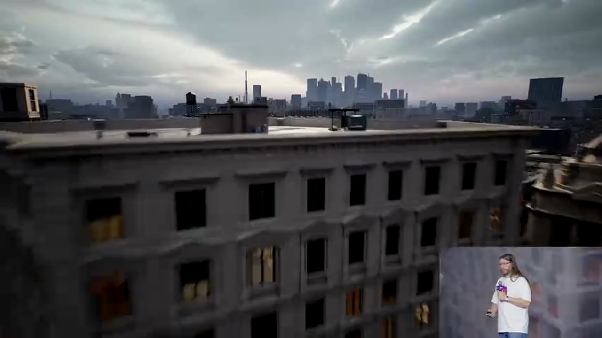
_Screenshot from 00:55:48_
---
## Section 1070 (00:55:50)
**Transcript:**
> with streaming time dropping
**Visual Reference:**

_Screenshot from 00:55:50_
---
## Section 1071 (00:55:52)
**Transcript:**
> by 90% from when we first released it
**Visual Reference:**
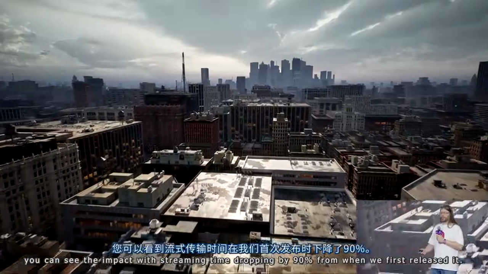
_Screenshot from 00:55:52_
---
## Section 1072 (00:55:58)
**Transcript:**
> Going back to mobile
**Visual Reference:**

_Screenshot from 00:55:58_
---
## Section 1073 (00:56:00)
**Transcript:**
> this release brought a suite of updates
**Visual Reference:**

_Screenshot from 00:56:00_
---
## Section 1074 (00:56:02)
**Transcript:**
> First, we've refined the out-of-the-box
**Visual Reference:**

_Screenshot from 00:56:02_
---
## Section 1075 (00:56:06)
**Transcript:**
> mobile experience with new default
**Visual Reference:**

_Screenshot from 00:56:06_
---
## Section 1076 (00:56:08)
**Transcript:**
> scalability settings
**Visual Reference:**

_Screenshot from 00:56:08_
---
## Section 1077 (00:56:10)
**Transcript:**
> balancing performance and visual quality
**Visual Reference:**

_Screenshot from 00:56:10_
---
## Section 1078 (00:56:12)
**Transcript:**
> across a wide range of devices
**Visual Reference:**

_Screenshot from 00:56:12_
---
## Section 1079 (00:56:14)
**Transcript:**
> With 5.6 you can also expect to save
**Visual Reference:**

_Screenshot from 00:56:14_
---
## Section 1080 (00:56:16)
**Transcript:**
> over 50 megabytes on the default package size
**Visual Reference:**

_Screenshot from 00:56:16_
---
## Section 1081 (00:56:20)
**Transcript:**
> And we've made broad improvements to runtime stability
**Visual Reference:**

_Screenshot from 00:56:20_
---
## Section 1082 (00:56:24)
**Transcript:**
> and rendering compatibility
**Visual Reference:**

_Screenshot from 00:56:24_
---
## Section 1083 (00:56:26)
**Transcript:**
> especially for Android and Vulkan
**Visual Reference:**

_Screenshot from 00:56:26_
---
## Section 1084 (00:56:28)
**Transcript:**
> 5.6 also helps accelerate your workflow
**Visual Reference:**

_Screenshot from 00:56:28_
---
## Section 1085 (00:56:32)
**Transcript:**
> with a redesigned viewport
**Visual Reference:**
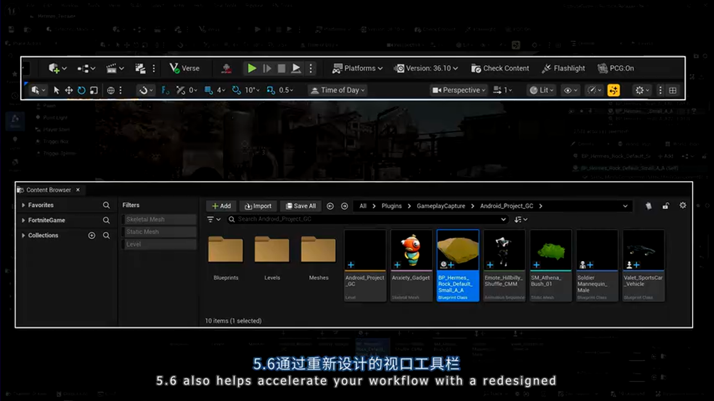
_Screenshot from 00:56:32_
---
## Section 1086 (00:56:34)
**Transcript:**
> toolbar and content browser
**Visual Reference:**

_Screenshot from 00:56:34_
---
## Section 1087 (00:56:36)
**Transcript:**
> to streamline common mobile dev tasks
**Visual Reference:**

_Screenshot from 00:56:36_
---
## Section 1088 (00:56:38)
**Transcript:**
> And we've added a new
**Visual Reference:**

_Screenshot from 00:56:38_
---
## Section 1089 (00:56:40)
**Transcript:**
> on-device iteration workflow
**Visual Reference:**

_Screenshot from 00:56:40_
---
## Section 1090 (00:56:42)
**Transcript:**
> that lets you make updates
**Visual Reference:**
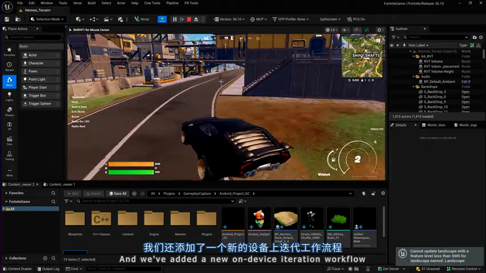
_Screenshot from 00:56:42_
---
## Section 1091 (00:56:44)
**Transcript:**
> and stream them on the hardware
**Visual Reference:**

_Screenshot from 00:56:44_
---
## Section 1092 (00:56:46)
**Transcript:**
> without needing to repackage every time
**Visual Reference:**
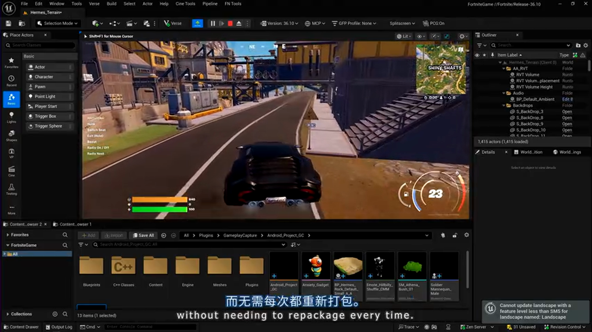
_Screenshot from 00:56:46_
---
## Section 1093 (00:56:48)
**Transcript:**
> And now what you see in editor
**Visual Reference:**

_Screenshot from 00:56:48_
---
## Section 1094 (00:56:52)
**Transcript:**
> is now much closer to what you'll get on-device
**Visual Reference:**

_Screenshot from 00:56:52_
---
## Section 1095 (00:56:56)
**Transcript:**
> Mobile Preview makes testing and tuning
**Visual Reference:**
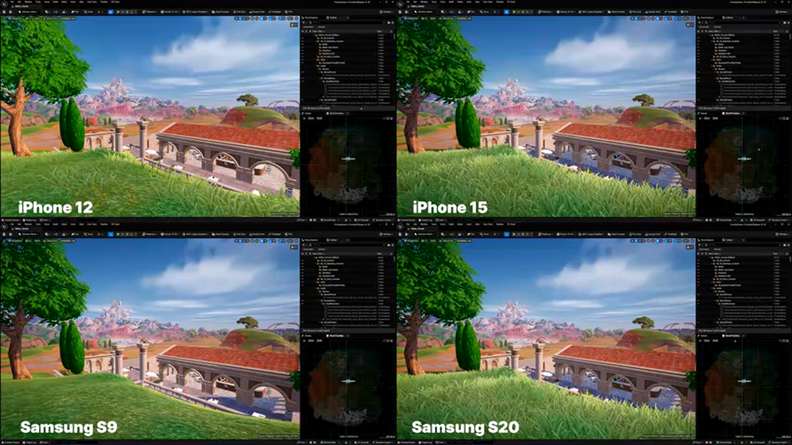
_Screenshot from 00:56:56_
---
## Section 1096 (00:56:58)
**Transcript:**
> far more efficient by using the same
**Visual Reference:**
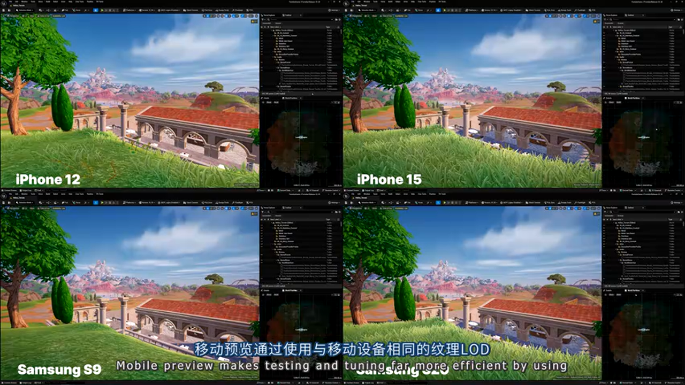
_Screenshot from 00:56:58_
---
## Section 1097 (00:57:00)
**Transcript:**
> textualities as the mobile device
**Visual Reference:**

_Screenshot from 00:57:00_
---
## Section 1098 (00:57:02)
**Transcript:**
> It can also preview aspect ratio
**Visual Reference:**

_Screenshot from 00:57:02_
---
## Section 1099 (00:57:04)
**Transcript:**
> and safe zones in Pi
**Visual Reference:**

_Screenshot from 00:57:04_
---
## Section 1100 (00:57:06)
**Transcript:**
> to better estimate your game's appearance
**Visual Reference:**

_Screenshot from 00:57:06_
---
## Section 1101 (00:57:08)
**Transcript:**
> without leaving the editor
**Visual Reference:**

_Screenshot from 00:57:08_
---
## Section 1102 (00:57:10)
**Transcript:**
> And together these upgrades make it much easier
**Visual Reference:**

_Screenshot from 00:57:10_
---
## Section 1103 (00:57:12)
**Transcript:**
> to prototype, polish, and ship mobile games
**Visual Reference:**

_Screenshot from 00:57:12_
---
## Section 1104 (00:57:14)
**Transcript:**
> So those are just a few highlights of 5.6
**Visual Reference:**

_Screenshot from 00:57:14_
---
## Section 1105 (00:57:18)
**Transcript:**
> But there's one more big item
**Visual Reference:**
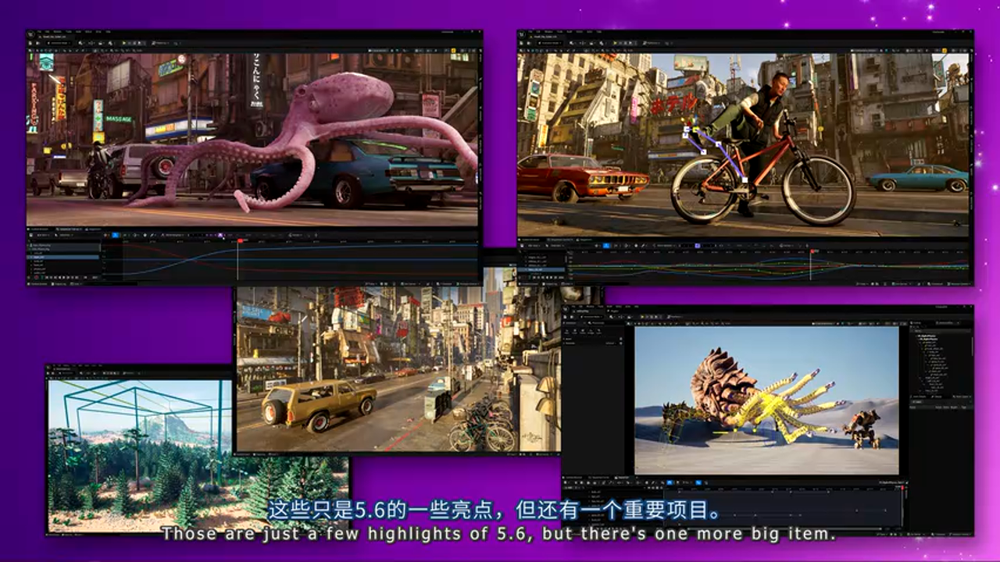
_Screenshot from 00:57:18_
---
## Section 1106 (00:57:20)
**Transcript:**
> As of 5.6, many human
**Visual Reference:**

_Screenshot from 00:57:20_
---
## Section 1107 (00:57:22)
**Transcript:**
> is integrated directly into the
**Visual Reference:**

_Screenshot from 00:57:22_
---
## Section 1108 (00:57:24)
**Transcript:**
> editor so you can author and animate
**Visual Reference:**
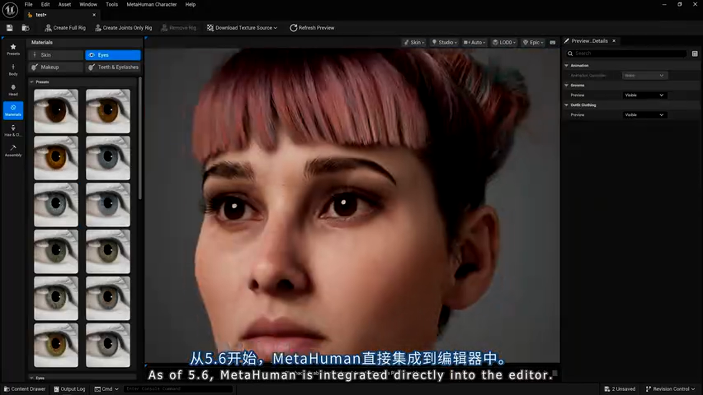
_Screenshot from 00:57:24_
---
## Section 1109 (00:57:26)
**Transcript:**
> metahumans without leaving the engine
**Visual Reference:**
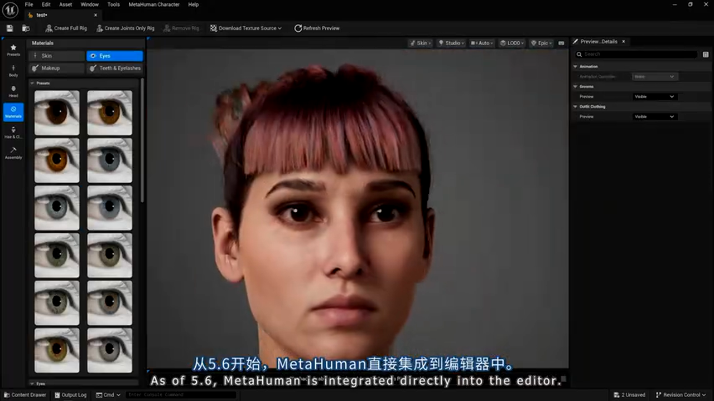
_Screenshot from 00:57:26_
---
## Section 1110 (00:57:28)
**Transcript:**
> We've also made metahumans
**Visual Reference:**

_Screenshot from 00:57:28_
---
## Section 1111 (00:57:30)
**Transcript:**
> free to use with any engine
**Visual Reference:**
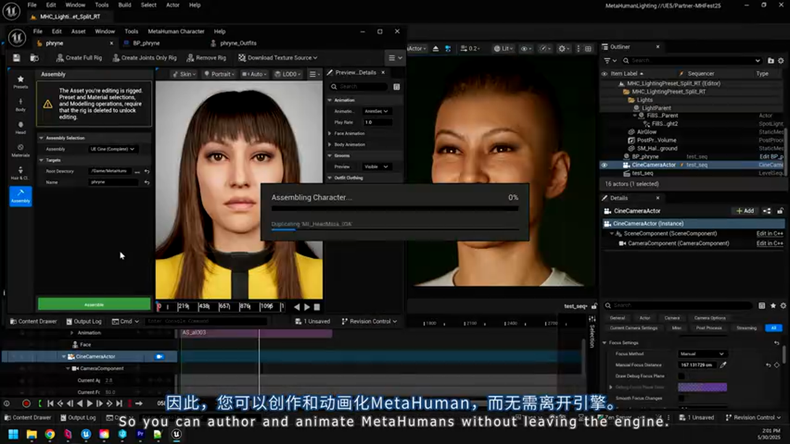
_Screenshot from 00:57:30_
---
## Section 1112 (00:57:32)
**Transcript:**
> or creative tool
**Visual Reference:**

_Screenshot from 00:57:32_
---
## Section 1113 (00:57:34)
**Transcript:**
> Metahumans are now production ready
**Visual Reference:**

_Screenshot from 00:57:34_
---
## Section 1114 (00:57:36)
**Transcript:**
> And we've added new features
**Visual Reference:**

_Screenshot from 00:57:36_
---
## Section 1115 (00:57:38)
**Transcript:**
> like parametric bodies
**Visual Reference:**

_Screenshot from 00:57:38_
---
## Section 1116 (00:57:40)
**Transcript:**
> a new outfit system
**Visual Reference:**

_Screenshot from 00:57:40_
---
## Section 1117 (00:57:42)
**Transcript:**
> and dedicated tools for Maya and Houdini
**Visual Reference:**

_Screenshot from 00:57:42_
---
## Section 1118 (00:57:44)
**Transcript:**
> If you want to learn about all the latest updates
**Visual Reference:**
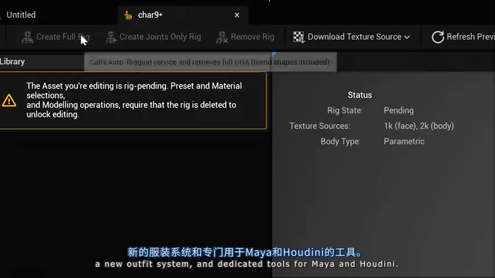
_Screenshot from 00:57:44_
---
## Section 1119 (00:57:48)
**Transcript:**
> Watch tutorials
**Visual Reference:**
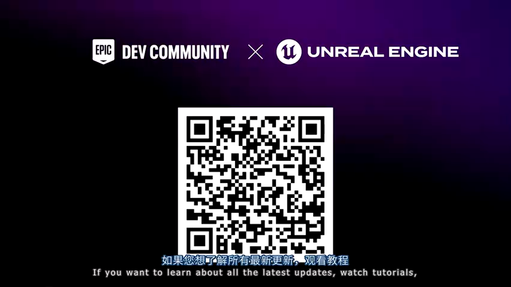
_Screenshot from 00:57:48_
---
## Section 1120 (00:57:50)
**Transcript:**
> Read docs
**Visual Reference:**

_Screenshot from 00:57:50_
---
## Section 1121 (00:57:52)
**Transcript:**
> Join discussions
**Visual Reference:**

_Screenshot from 00:57:52_
---
## Section 1122 (00:57:54)
**Transcript:**
> Please visit the Epic developer
**Visual Reference:**

_Screenshot from 00:57:54_
---
## Section 1123 (00:57:56)
**Transcript:**
> community highly recommend it
**Visual Reference:**

_Screenshot from 00:57:56_
---
## Section 1124 (00:57:58)
**Transcript:**
> And we're not slowing down there
**Visual Reference:**

_Screenshot from 00:57:58_
---
## Section 1125 (00:58:00)
**Transcript:**
> So let's take a quick look at
**Visual Reference:**

_Screenshot from 00:58:00_
---
## Section 1126 (00:58:02)
**Transcript:**
> an overview of what's coming
**Visual Reference:**

_Screenshot from 00:58:02_
---
## Section 1127 (00:58:04)
**Transcript:**
> in 5.7
**Visual Reference:**

_Screenshot from 00:58:04_
---
## Section 1128 (00:58:06)
**Transcript:**
> I'll just give a quick preview
**Visual Reference:**

_Screenshot from 00:58:06_
---
## Section 1129 (00:58:08)
**Transcript:**
> and then Maya won't come up to give
**Visual Reference:**

_Screenshot from 00:58:08_
---
## Section 1130 (00:58:10)
**Transcript:**
> a more detailed roadmap talk
**Visual Reference:**

_Screenshot from 00:58:10_
---
## Section 1131 (00:58:12)
**Transcript:**
> So hopefully you've seen
**Visual Reference:**
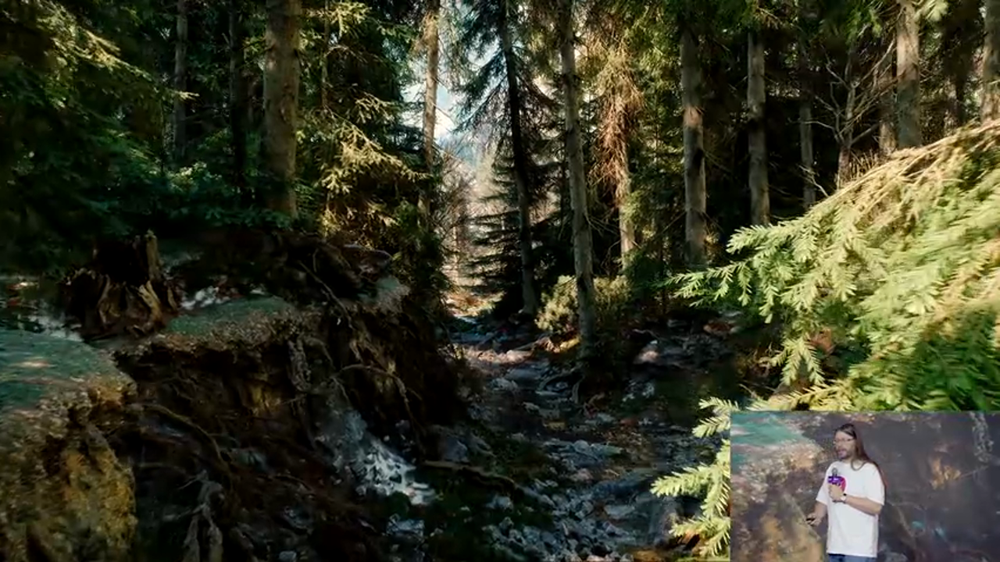
_Screenshot from 00:58:12_
---
## Section 1132 (00:58:14)
**Transcript:**
> our dense four scenes
**Visual Reference:**

_Screenshot from 00:58:14_
---
## Section 1133 (00:58:16)
**Transcript:**
> in the Witcher 4 demo
**Visual Reference:**
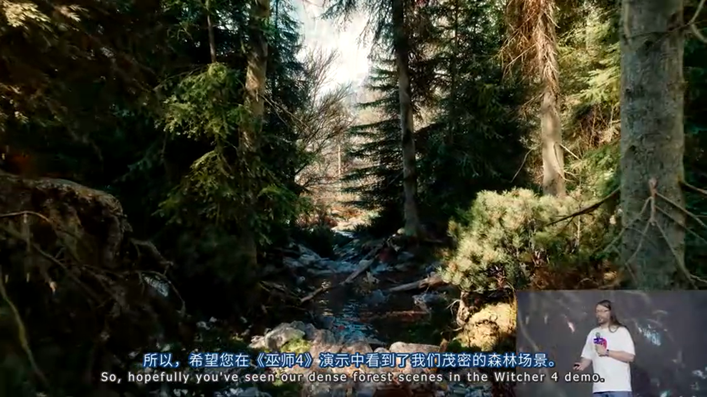
_Screenshot from 00:58:16_
---
## Section 1134 (00:58:18)
**Transcript:**
> Which means you've seen our new prototype features
**Visual Reference:**

_Screenshot from 00:58:18_
---
## Section 1135 (00:58:20)
**Transcript:**
> So let's take a quick look at the
**Visual Reference:**
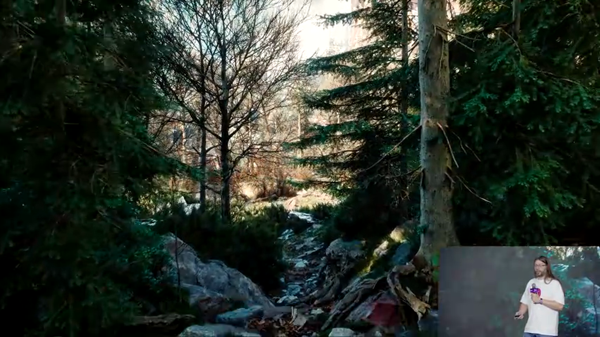
_Screenshot from 00:58:20_
---
## Section 1136 (00:58:22)
**Transcript:**
> two main features
**Visual Reference:**
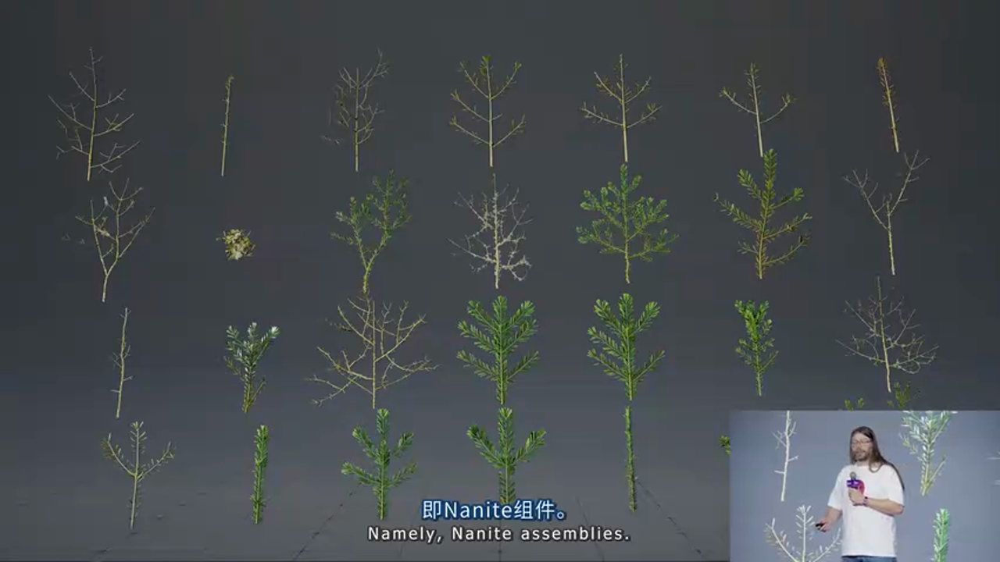
_Screenshot from 00:58:22_
---
## Section 1137 (00:58:24)
**Transcript:**
> namely
**Visual Reference:**

_Screenshot from 00:58:24_
---
## Section 1138 (00:58:26)
**Transcript:**
> Manit assemblies
**Visual Reference:**
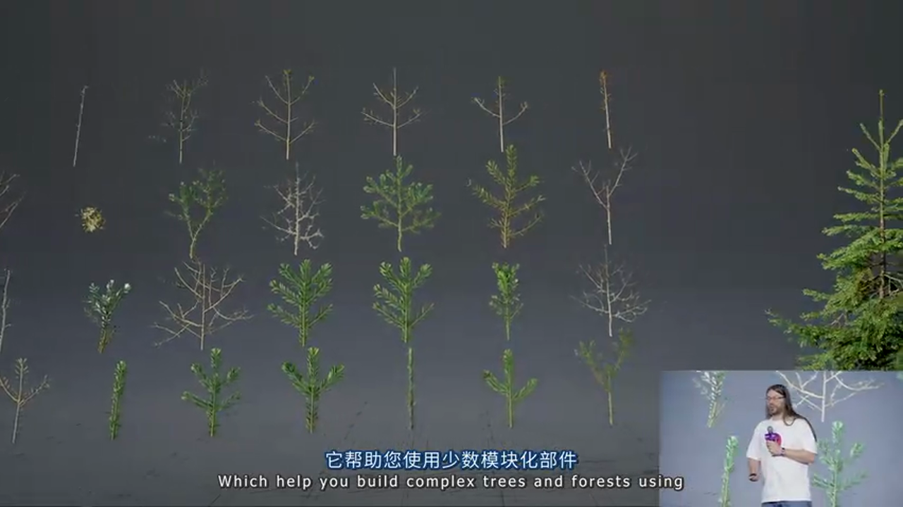
_Screenshot from 00:58:26_
---
## Section 1139 (00:58:28)
**Transcript:**
> which help you build complex trees
**Visual Reference:**
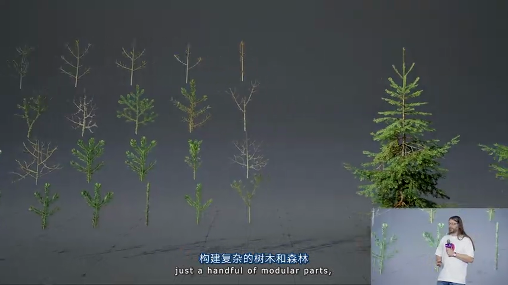
_Screenshot from 00:58:28_
---
## Section 1140 (00:58:30)
**Transcript:**
> and forests using just a handful
**Visual Reference:**

_Screenshot from 00:58:30_
---
## Section 1141 (00:58:32)
**Transcript:**
> of modular parts
**Visual Reference:**
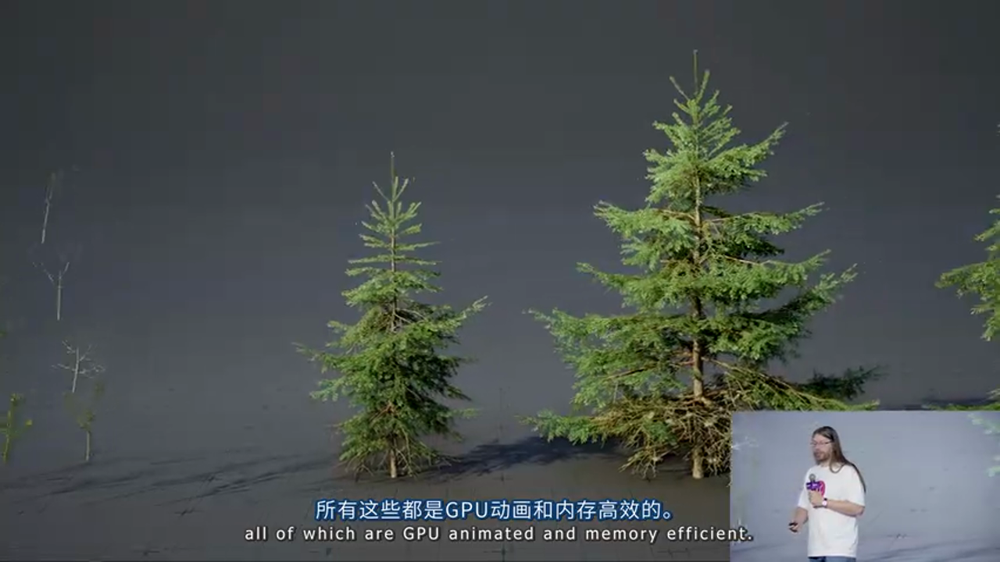
_Screenshot from 00:58:32_
---
## Section 1142 (00:58:34)
**Transcript:**
> All of which are GPU animated
**Visual Reference:**

_Screenshot from 00:58:34_
---
## Section 1143 (00:58:36)
**Transcript:**
> and memory efficient
**Visual Reference:**

_Screenshot from 00:58:36_
---
## Section 1144 (00:58:38)
**Transcript:**
> We'll also release a system for
**Visual Reference:**
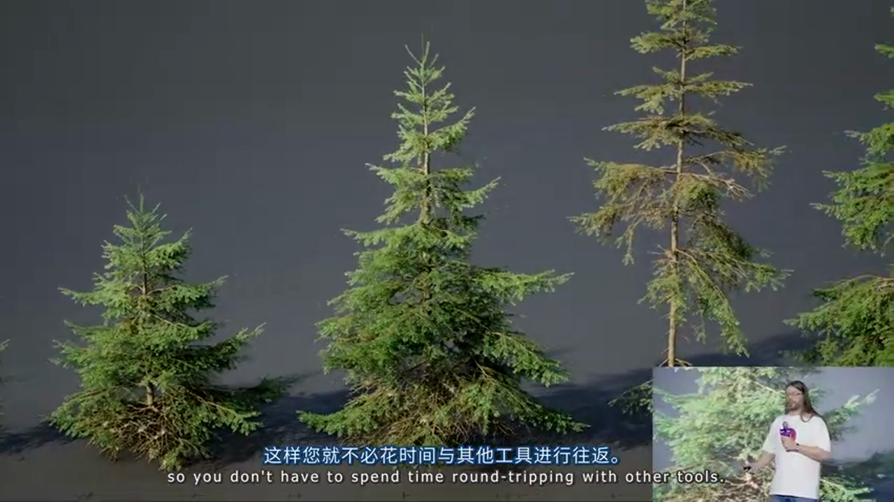
_Screenshot from 00:58:38_
---
## Section 1145 (00:58:40)
**Transcript:**
> authoring trees directly in editor
**Visual Reference:**
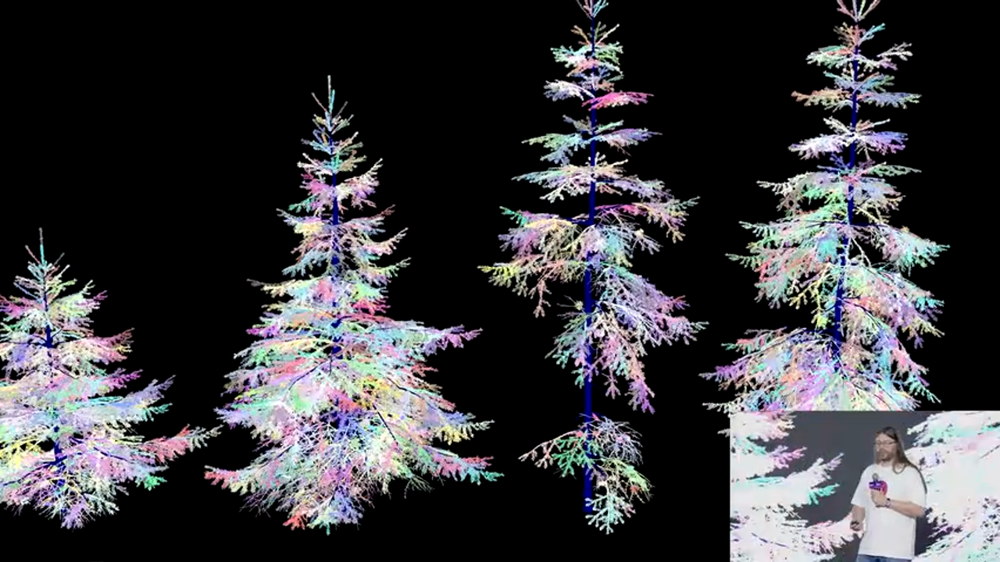
_Screenshot from 00:58:40_
---
## Section 1146 (00:58:42)
**Transcript:**
> so you don't have to spend time
**Visual Reference:**
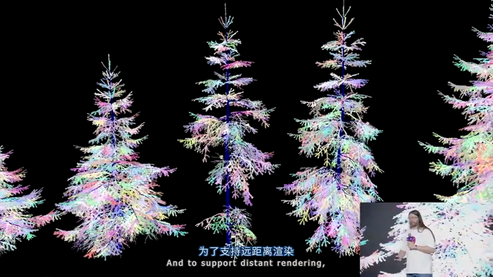
_Screenshot from 00:58:42_
---
## Section 1147 (00:58:44)
**Transcript:**
> around tripping with other tools
**Visual Reference:**
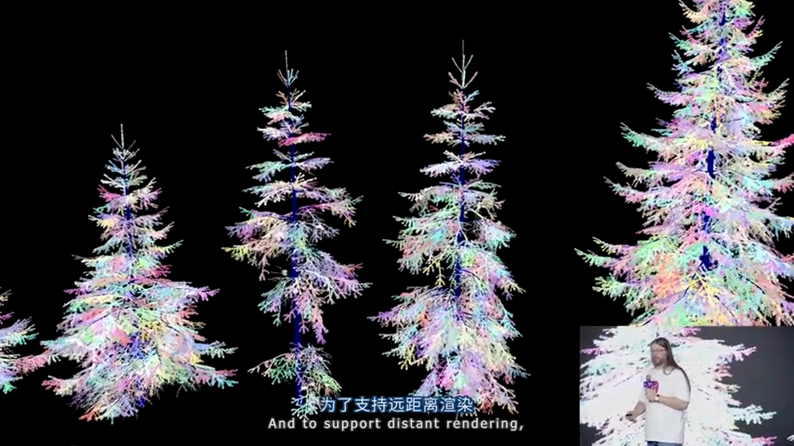
_Screenshot from 00:58:44_
---
## Section 1148 (00:58:46)
**Transcript:**
> And to support distant rendering
**Visual Reference:**

_Screenshot from 00:58:46_
---
## Section 1149 (00:58:48)
**Transcript:**
> and the development
**Visual Reference:**

_Screenshot from 00:58:48_
---
## Section 1150 (00:58:50)
**Transcript:**
> at every LED level
**Visual Reference:**

_Screenshot from 00:58:50_
---
## Section 1151 (00:58:52)
**Transcript:**
> These features will be experimental
**Visual Reference:**

_Screenshot from 00:58:52_
---
## Section 1152 (00:58:54)
**Transcript:**
> in 5.7 later this year
**Visual Reference:**
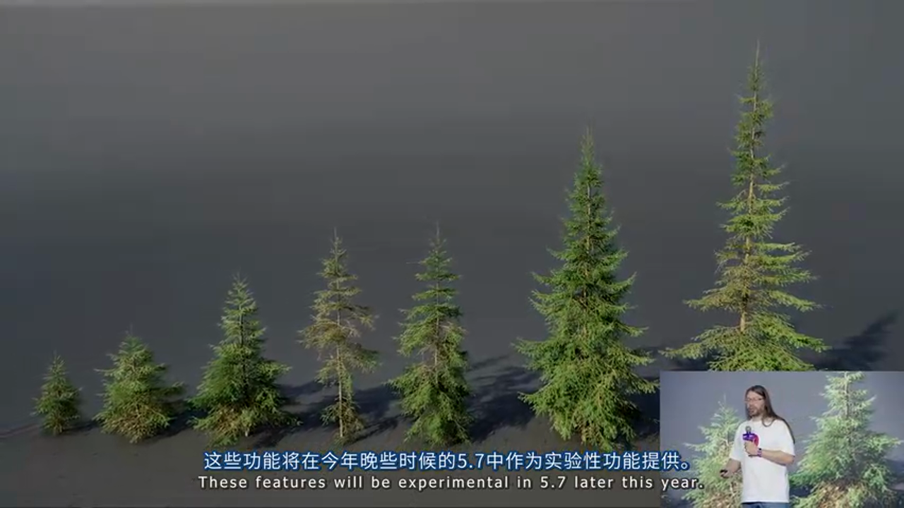
_Screenshot from 00:58:54_
---
## Section 1153 (00:58:56)
**Transcript:**
> And in addition to that
**Visual Reference:**

_Screenshot from 00:58:56_
---
## Section 1154 (00:58:58)
**Transcript:**
> 5.7 will be full of improvements
**Visual Reference:**

_Screenshot from 00:58:58_
---
## Section 1155 (00:59:00)
**Transcript:**
> to many UE systems
**Visual Reference:**

_Screenshot from 00:59:00_
---
## Section 1156 (00:59:02)
**Transcript:**
> like PCG, substrate,
**Visual Reference:**

_Screenshot from 00:59:02_
---
## Section 1157 (00:59:04)
**Transcript:**
> Niagara,
**Visual Reference:**
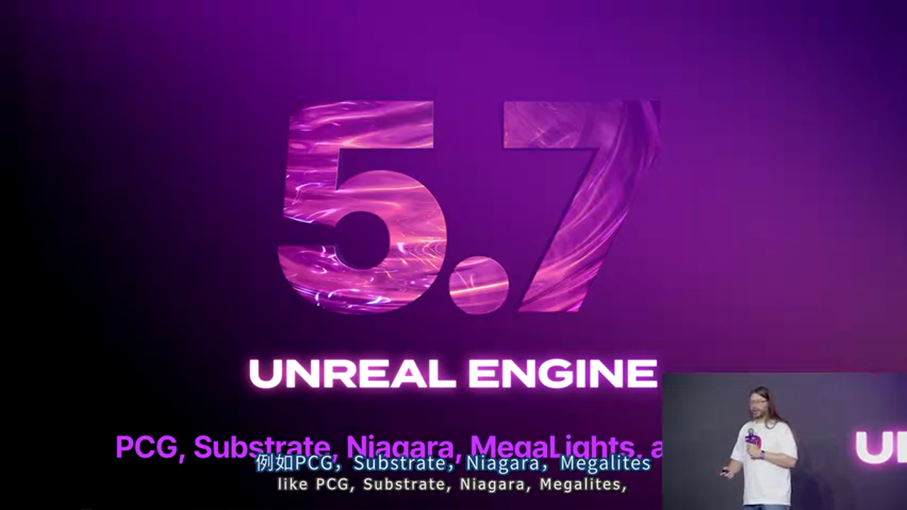
_Screenshot from 00:59:04_
---
## Section 1158 (00:59:05)
**Transcript:**
> Megalights,
**Visual Reference:**

_Screenshot from 00:59:05_
---
## Section 1159 (00:59:06)
**Transcript:**
> and more to continue our work
**Visual Reference:**

_Screenshot from 00:59:06_
---
## Section 1160 (00:59:08)
**Transcript:**
> on performance and fidelity
**Visual Reference:**

_Screenshot from 00:59:08_
---
## Section 1161 (00:59:10)
**Transcript:**
> So thank you very much
**Visual Reference:**

_Screenshot from 00:59:10_
---
## Section 1162 (00:59:12)
**Transcript:**
> and I'd like to welcome
**Visual Reference:**

_Screenshot from 00:59:12_
---
## Summary
This article contains 1162 sections of content extracted from the original video, each accompanied by visual references. The combination of transcript and screenshots provides a comprehensive reference for the video content.
---
**Note:** This is an auto-generated article. For the full video experience, refer to the original source.