# 云端游戏驱动的元宇宙平台：Xsolla Metasites 技术架构与实践

---

## 加入 UE5 技术交流群

如果您对虚幻引擎5的图形渲染技术感兴趣，欢迎加入我们的 **UE5 技术交流群**！

扫描上方二维码添加个人微信 **wlxklyh**，备注"UE5技术交流"，我会拉您进群。

在技术交流群中，您可以：
- 与其他UE开发者交流渲染技术经验
- 获取最新的GDC技术分享和解读
- 讨论图形编程、性能优化、构建工具流、动画系统等话题
- 分享引擎架构、基建工具等项目经验和技术难题

---

**源视频信息**：[UFSH2025]虚幻引擎邂逅元宇宙: 借助云端游戏畅享3D体验 | Rafael Barbosa 艾克索拉元站点产品负责人  
**视频链接**：https://www.bilibili.com/video/BV1Ck2PBAEho  
**视频时长**：27分4秒  
**内容说明**：本文由 AI 基于视频内容生成，结合截图与字幕进行深度技术解析

---

## 导读

> **核心观点一**：Metasites 通过云端游戏技术（Pixel Streaming）消除了元宇宙体验的硬件门槛，让用户可以在任意浏览器、移动设备或智能电视上直接访问基于 Unreal Engine 构建的 3D 虚拟世界，无需下载或安装。

> **核心观点二**：平台采用"创作者友好"的设计理念，开发者只需安装 MetaBrowser 插件、配置传送门，即可将现有 Unreal Engine 项目转换为可云端运行的 Metasite，整个过程仅需数小时，且开发者无需承担主机和分发成本。

> **核心观点三**：Metasites 的核心价值在于"互连性"（Interconnectivity）——通过传送门系统，用户可以无缝穿梭于不同的 3D 体验之间，形成真正意义上的元宇宙网络，而虚拟化身、背包物品等身份数据可跨站点携带。

**前置知识要求**：
- 熟悉 Unreal Engine 项目开发流程
- 了解云端游戏（Cloud Gaming）的基本概念
- 对多人游戏网络架构有基础认知
- 理解 Web 技术栈（浏览器渲染、WebSocket 等）

---

## 第一部分：背景与痛点 - 元宇宙为什么还没实现？

### 元宇宙市场的潜在与障碍

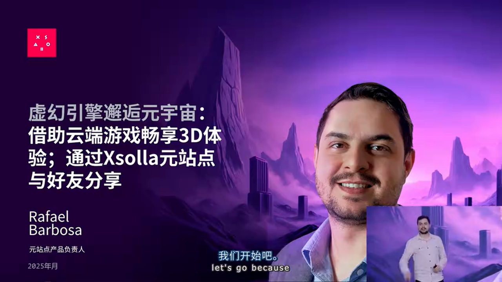

2025 年的元宇宙市场前景看起来令人兴奋，概念和技术要素都已具备，但为什么真正的元宇宙体验还没有大规模落地？答案在于过去五年间存在的三大关键障碍。

**硬件依赖的壁垒**：传统元宇宙方案要求用户购买专用硬件（如 VR 头显、高性能 PC），这极大地限制了用户规模。并非每个用户都愿意为体验元宇宙而购买额外设备，也不希望被硬件束缚使用场景。

这一障碍导致了典型的"鸡生蛋、蛋生鸡"问题：用户基数不足 → 内容创作者投入回报低 → 优质内容稀缺 → 用户更不愿意购买硬件。传统方案试图通过硬件销售来解决，但 Xsolla Metasites 选择了另一条路径：**彻底消除硬件依赖**。

### Metasites 的解决方案

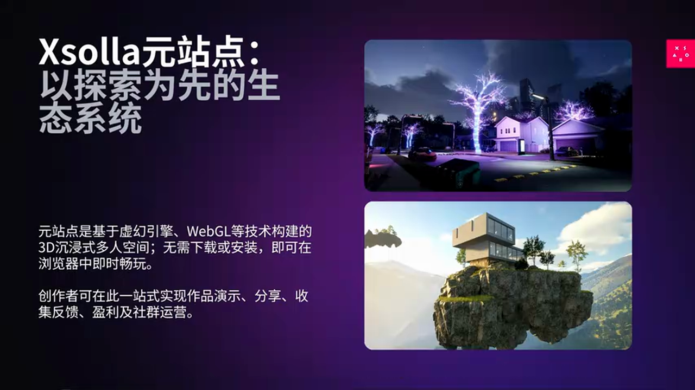

Metasites 是一个基于 Unreal Engine 构建的互连 3D 体验平台，其核心理念是**协作与分享**。简单来说，你可以将其理解为"运行在 Web 浏览器中的 Unreal Engine 构建版本"。

在技术层面，Metasites 利用 **Pixel Streaming** 等云端渲染技术，将 Unreal Engine 应用的渲染输出以视频流的形式传输到用户的浏览器中。用户无需下载任何客户端，点击链接即可立即体验，就像访问一个普通的网站一样。

目前平台的性能表现已经相当成熟：**50-60 FPS 的帧率，15 秒的加载时间**。这意味着用户体验已经接近原生应用的水平，同时保留了 Web 应用的便利性。

### 对玩家和创作者的双重价值

**对玩家而言**，Metasites 提供了"点击即玩"的即时访问能力。无论是通过广告链接、社交媒体分享，还是搜索引擎发现，用户都可以直接打开链接并立即开始体验，无需经历下载、安装、更新的繁琐流程。

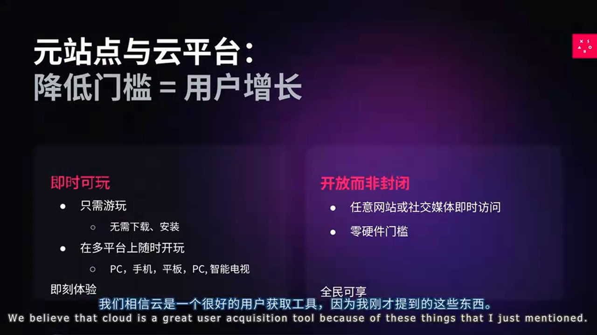

这种体验对于用户获取（User Acquisition）具有革命性意义。想象一下，如果作为独立开发者或工作室，你想要分享自己的作品，传统流程是：

1. 打包构建
2. 上传到分发平台（如 Steam、Epic Games Store）
3. 希望用户愿意下载并安装
4. 祈祷用户的硬件配置能够运行

而使用 Metasites，流程简化为：

1. 上传构建到云端
2. 分享链接
3. 用户点击即可体验

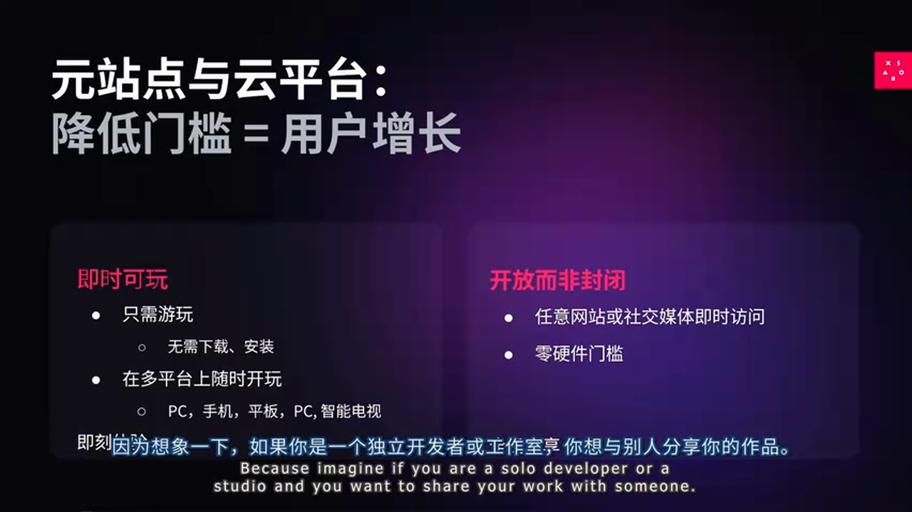

**对创作者而言**，平台承担了发布、分发、变现、多人游戏和通信等基础设施工作，让开发者能够专注于创意本身——设计机制、构建叙事、打磨美术。这就像从"全栈开发者"回归到"内容创作者"的角色。

---

## 第二部分：Metasites 核心架构解析

### 平台定位与核心特性

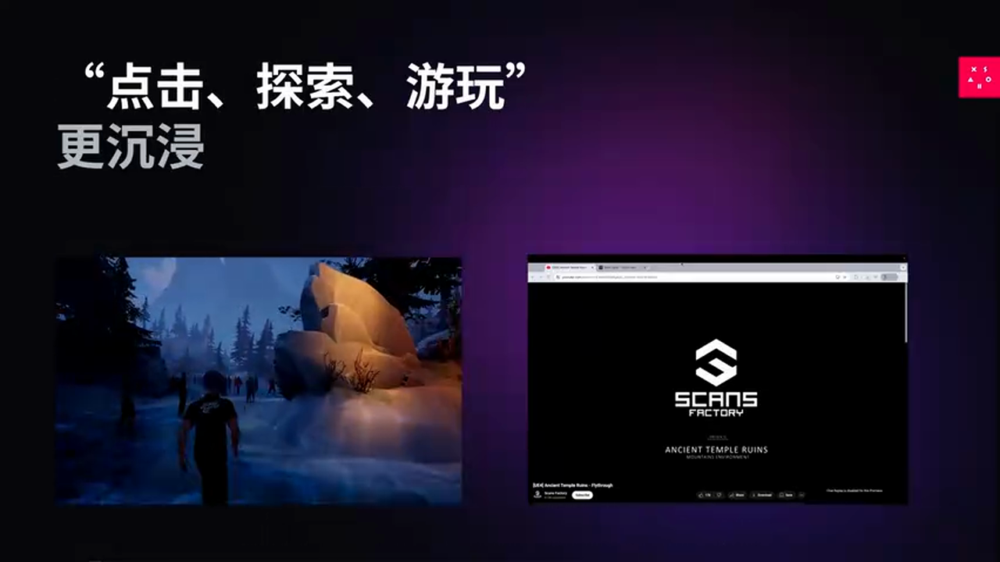

Metasites 本质上是一个**平台化的 3D Web 体验生态系统**。左侧展示了实际运行中的 Metasite 示例，可以看到多个机器人（用于演示数据复制能力）在浏览器中实时同步。

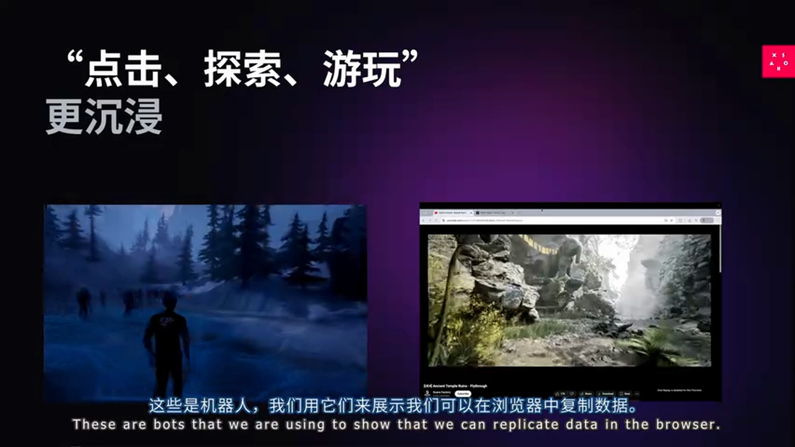

与传统视频或截图分享不同，Metasites 允许用户在 3D 环境中实时体验他人的创作。这种沉浸式体验远超静态媒体，为用户提供了探索空间、邀请朋友、分享视角的能力。

### 用户体验的核心原则

**用户交互是平台的核心原则**。平台提供了完整的多人游戏和社交功能，包括语音聊天、文字聊天、好友系统和群组功能。

将"Metasite"替换为"Website"可以帮助理解其定位：用户在网站中浏览新闻、查看照片和视频、在论坛中交流。Metasites 提供相同的功能，但以**可游玩、可行走的 3D 体验**形式呈现，这是下一代用户内容消费和沉浸式体验的演进方向。

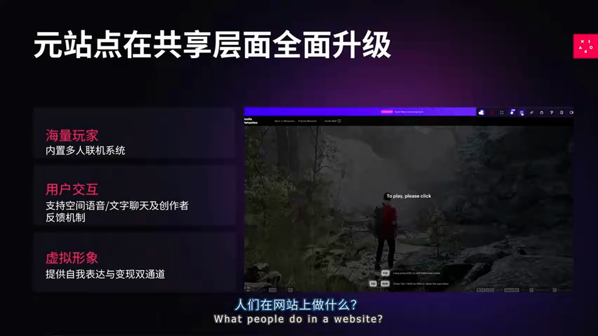

### 核心技术栈

Metasites 的核心功能包括：

**多人游戏系统**：这是除云端能力外最重要的特性。实现可靠的大规模多人游戏本身就是一个复杂的工程挑战，Metasites 提供了开箱即用的解决方案。

**社交功能**：在元宇宙中，用户需要与其他人交流。平台提供了完整的社交基础设施，让用户能够在虚拟世界中建立联系。

**虚拟化身系统**：用户需要能够在虚拟世界中表达自己。目前平台使用 ReadyPlayerMe，其自定义功能位于 Web 层，这意味着用户可以在不同的 Metasite 之间保持相同的虚拟化身，实现跨站点的身份连续性。

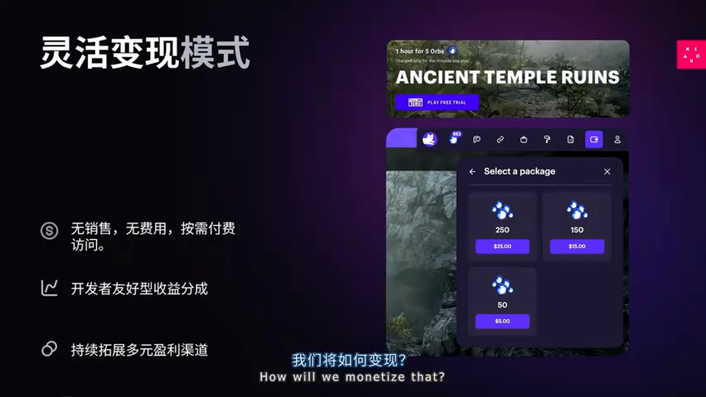

**变现机制**：平台采用"玩家付费，开发者免费"的模型。玩家使用按需付费（Pay-as-you-go）模式购买积分，用于访问不同的 Metasite，而开发者无需承担主机和分发成本。收入分配采用 80/20 分成，开发者保留 80% 收入，平台收取 20% 用于覆盖基础设施成本。

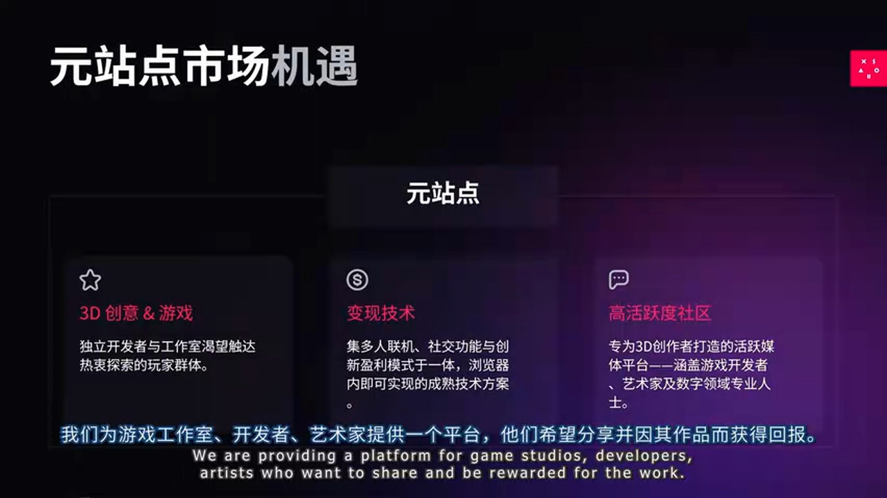

平台目前已有 150 名创作者加入，正处于从 Alpha 到 Beta 的过渡阶段。未来还将推出任务系统、背包（跨站点物品存储）、Drops 和商店等更多变现和社交功能。

---

## 第三部分：技术实现深度解析

### 虚拟化身与身份系统

虚拟化身系统是元宇宙身份的核心。目前 Metasites 使用 **ReadyPlayerMe**，这是一个成熟的虚拟化身解决方案，其优势在于自定义功能完全运行在 Web 层，不依赖 Unreal Engine 的原生实现。

这种设计带来了关键优势：**跨站点身份一致性**。用户可以在不同的 Metasite 之间切换，同时保持相同的虚拟化身外观，这是构建真正互联元宇宙的基础。

**背包系统**进一步扩展了这一概念：用户在一个 Metasite 中完成任务获得的物品，可以在另一个 Metasite 中使用，即使两个站点具有完全不同的游戏机制或艺术风格。这种**跨站点的物品互操作性**是 Metasites 区别于传统游戏平台的核心特征。

平台正在开发基于 **MetaHuman** 的自定义虚拟化身解决方案，这将为开发者提供更精细的控制能力，特别是在绑定（Rigging）和其他自定义操作方面。同时，平台与韩国公司 Altava 合作，后者在虚拟化身技术方面具有专业优势。

### 互连性：传送门系统

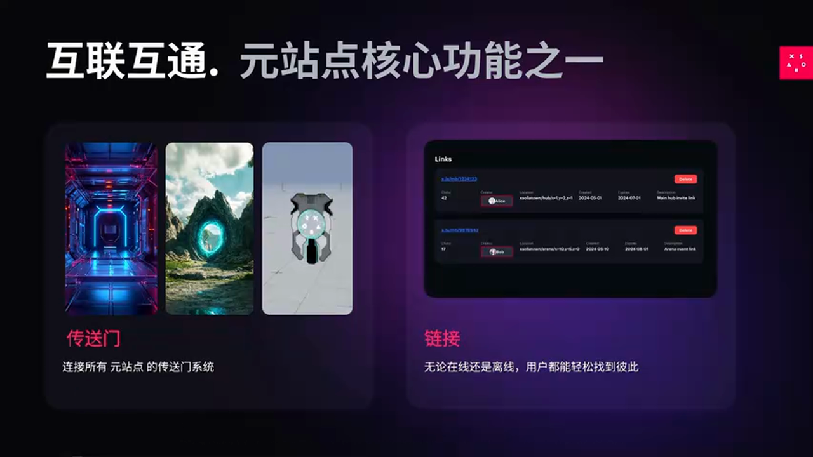

互连性是 Metasites 的核心设计原则之一。在传统 Web 中，链接（Links）是连接不同网站的基础设施。Metasites 引入了**传送门（Portals）**概念，作为 3D 世界中的"链接"。

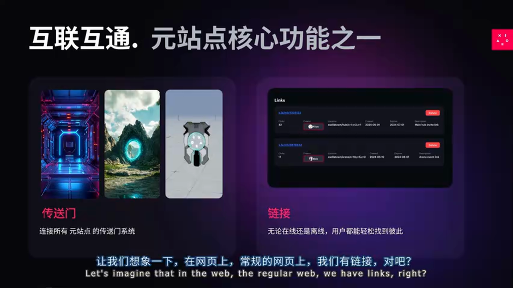

用户可以走进传送门，系统会加载另一个构建（Build），即另一个 Metasite。这种无缝切换能力使得用户可以像浏览网页一样探索不同的 3D 世界。

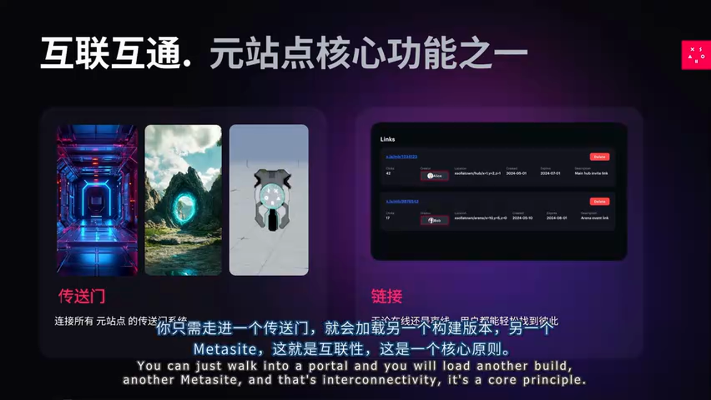

当平台上拥有数千个不同用途、不同风格、不同题材的 Metasite 时，传送门系统将构建出一个真正的 3D Web。这是元宇宙愿景的核心：不是单一的虚拟世界，而是**由无数互连的 3D 体验构成的网络**。

### 社交功能实现

社交功能对于任何元宇宙体验都至关重要。Metasites 提供了完整的社交基础设施：

**邻近语音聊天（Proximity Chat）**：用户可以通过语音与附近的其他用户交流，距离越远，音量越低，这创造了自然的空间音频体验。平台还在开发 3D 空间音频版本，以提供更强的沉浸感。

**社交中心（Social Hubs）**：平台即将推出新的网站和 Metasite，作为用户的起始中心。从这里，用户可以浏览可用的 Metasite 列表、阅读文档、发现新项目，所有这些都是以可游玩的 3D 形式呈现。

### 大规模并发技术

大规模并发是 Metasites 技术栈中最具挑战性的部分。平台与 Metagravity 合作，使用 **Quark** 技术实现数千人同时在线。

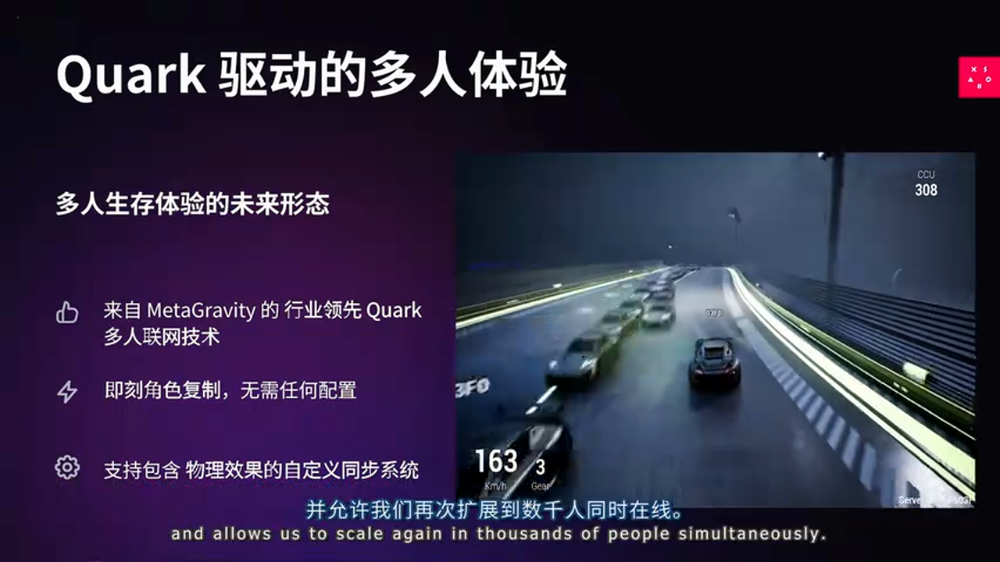

这里的关键区别是：不仅仅是支持 100 人的多人游戏会话，而是能够**实时复制数据到数千人**，所有用户都在浏览器中实时同步。测试视频展示了大量机器人在同一环境中运行，每个机器人都有独立的数据输入和 ReadyPlayerMe 虚拟化身配置。

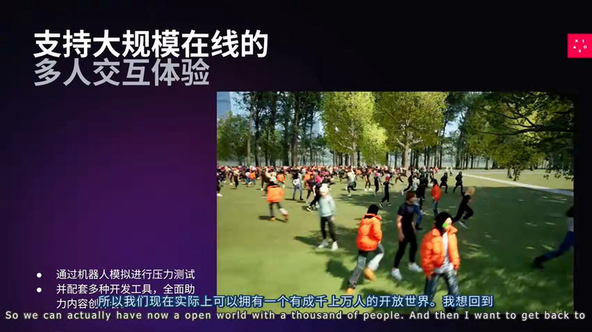

这种能力使得平台可以支持**真正的大规模开放世界体验**，数千名用户可以同时存在于同一个虚拟空间中。

### 去中心化理念

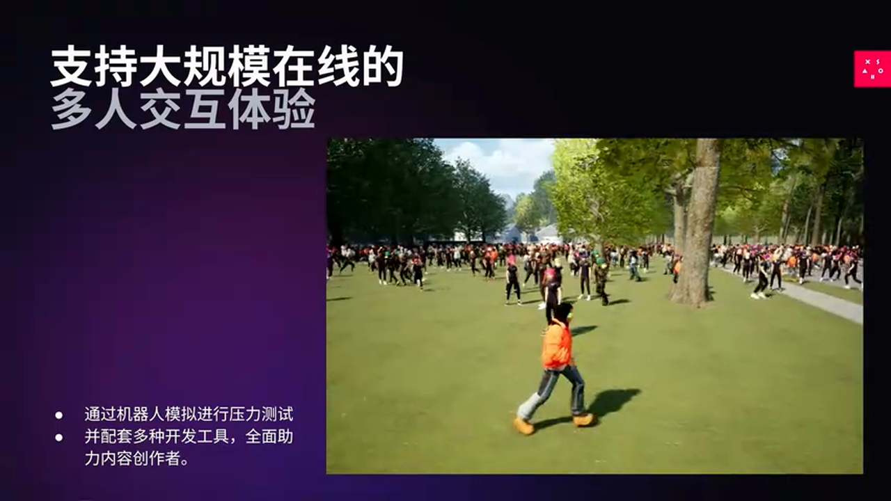

Metasites 采用去中心化的设计理念：平台不试图"拥有"元宇宙，而是提供技术基础设施。

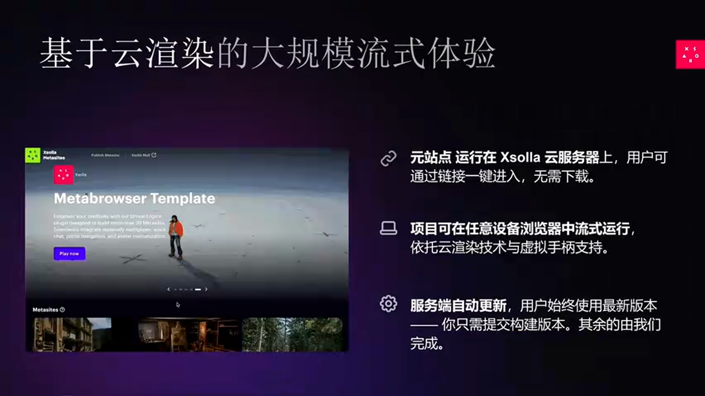

**创作者拥有完全的数据控制权**：
- 决定项目是否公开
- 设置私有访问密码
- 控制项目元数据（描述、名称等）

平台负责提供技术栈、分发渠道和变现机制，而创意和内容所有权完全属于创作者。这种模式避免了传统中心化平台可能带来的内容审查和所有权争议问题。

---

## 第四部分：技术架构与实现细节

### 云端渲染技术

大规模流媒体一直是阻碍大量玩家进入单一空间的主要障碍。随着数据中心容量增长、更多云服务提供商上线、更多 GPU 资源可用，这一挑战正在逐步缓解。

同时，平台也在开发**混合渲染方案**：允许用户使用本地计算机进行渲染，同时保留 Metasites 的所有功能和工具。对于拥有高性能机器的用户，这可以提供更好的体验，因为他们可以使用本地 GPU 的全部算力。

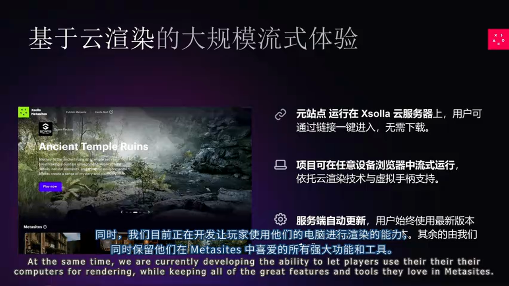

这种灵活性使得平台能够适应不同的用户场景：低端设备用户使用云端渲染，高端设备用户可以选择本地渲染以获得最佳性能。

### 开发工具与工作流

将现有 Unreal Engine 项目转换为 Metasite 的过程非常简单：

1. **下载 MetaBrowser 插件**：这是一个 Unreal Engine 插件，可以从文档中获取
2. **导入插件**：像导入任何其他插件一样，将插件文件夹复制到项目的 Plugins 目录
3. **配置设置**：禁用 Unreal Engine 的网络系统，激活插件中的一些复选框
4. **实现传送门**：在场景中添加传送门功能
5. **构建并上传**：创建 Windows 可玩构建，上传到平台

整个过程只需数小时即可完成。如果项目已经开发完成，转换为 Metasite 几乎不需要额外工作。

插件中包含了示例和蓝图，展示了如何实现 Metasite 特定功能，特别是传送门和虚拟化身系统。

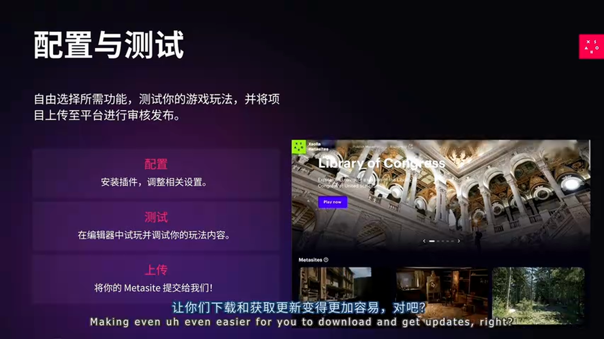

平台计划将插件发布到 Unreal Engine Marketplace（虚幻商城），这将进一步简化下载和更新流程。

### 发布与分发流程

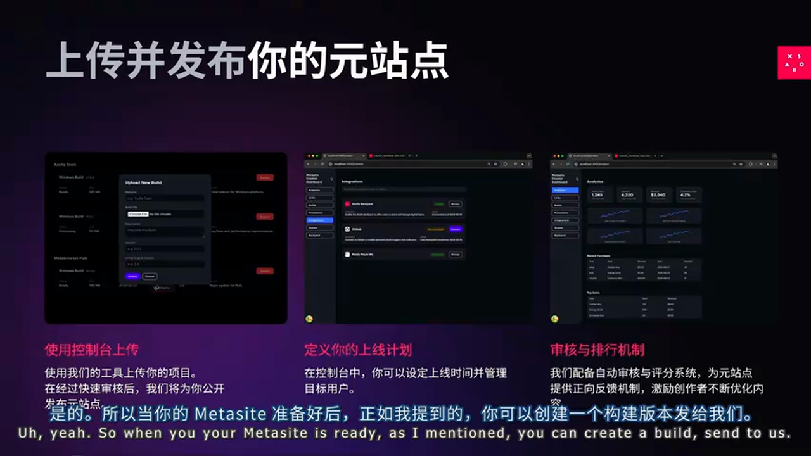

当 Metasite 准备就绪后，开发者创建构建并发送给平台。平台拥有专门的 QA 团队进行测试，确保构建在云端环境中正常运行。

即将推出的**创作者仪表板（Creator Dashboard）**将提供自助式上传流程，开发者可以：
- 上传项目
- 查看分析数据
- 编辑元数据（描述、名称等）
- 控制项目可见性（公开/私有）
- 设置私有访问密码

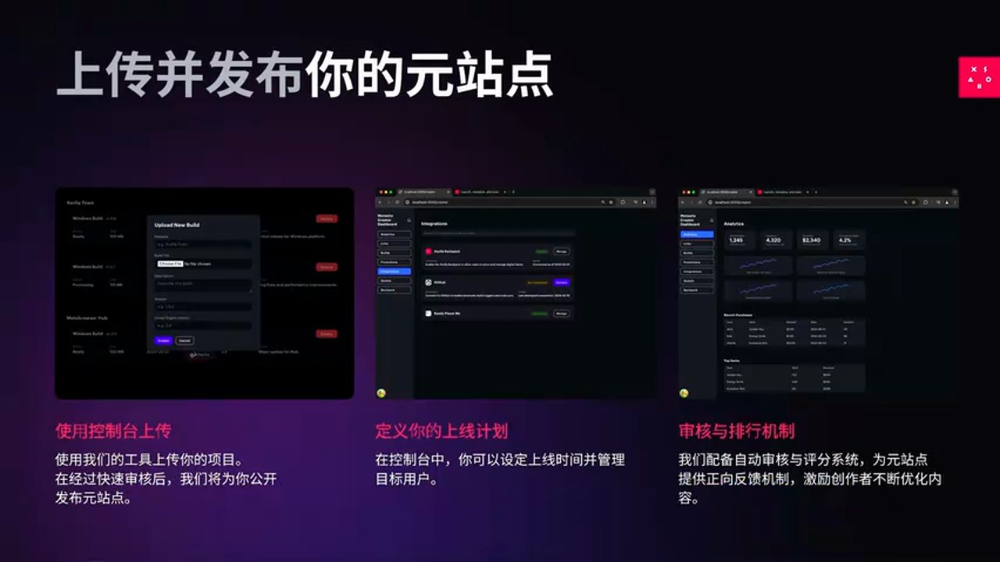

测试通过后，平台会将 Metasite 上传到云端并分享链接。开发者可以将链接分享给其他人，项目也会被列入平台目录，供所有用户发现和访问。

---

## 第五部分：生态系统与未来规划

### 社区与合作伙伴

平台与 8Laval（Xsolla 的姊妹公司，媒体公司）合作，后者提供游戏开发教程、新闻和 3D 内容相关资讯。这个社区拥有 **150 万访问者**，全部是创作者或硬核游戏玩家。

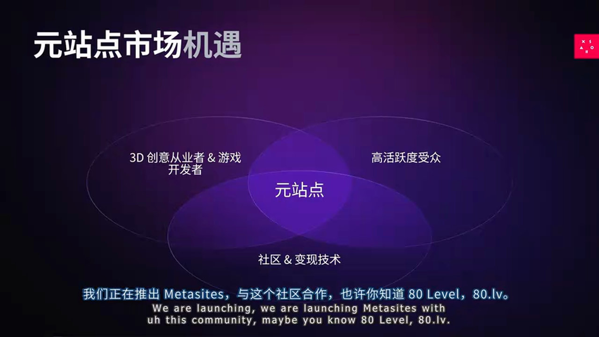

通过整合这个社区，平台希望构建一个完整的生态系统，帮助玩家发现游戏，同时为创作者提供受众和反馈渠道。这涵盖了发现、社区、参与和变现的完整链条。

### 使用案例

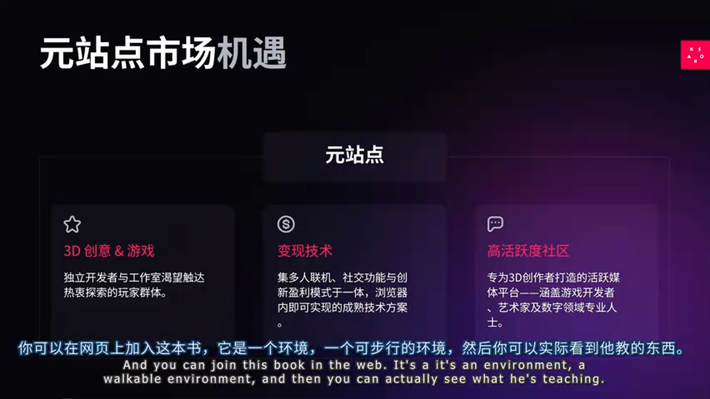

**教育内容**：Paul Martinez 发布了一本关于程序化内容生成（Procedural Content Generation）的书籍，在 Metasites 上以 3D 可探索环境的形式呈现。用户可以在虚拟世界中阅读墙壁上的内容，这是一种全新的沉浸式学习方式，远超传统的 YouTube 视频或文本阅读。

**作品集展示**：学生或独立开发者可以使用 Metasites 展示项目，类似于社交媒体，但以 3D 形式呈现。这可以帮助创作者建立受众、收集反馈、建立联系。

### 未来功能路线图

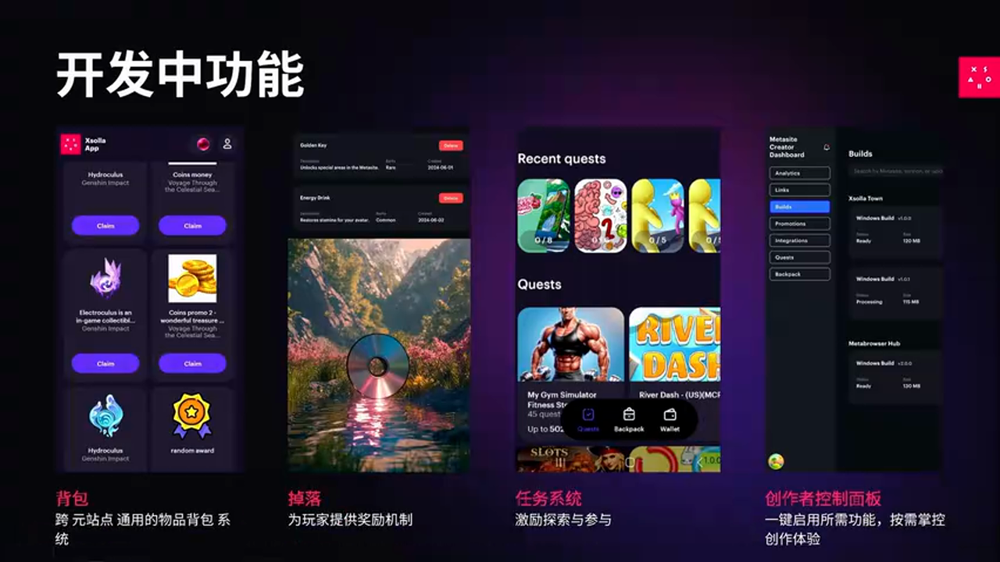

平台正在开发多个新功能：

**任务系统（Quests）**：玩家可以在不同 Metasite 中完成任务，获得奖励和物品。

**背包系统（Backpack）**：跨站点的物品存储和携带系统，用户可以在不同项目之间使用获得的物品。

**Drops 和商店**：更多变现选项，包括物品掉落和商店系统。

**Offer All**：类似 Featuring 的 Web 任务系统，玩家可以完成社交任务获得奖励，帮助项目增加曝光度。

---

## 第六部分：实战总结与技术建议

### 方案对比

> **方案 A：传统本地游戏分发**
> - 🟢 优势：充分利用用户本地硬件性能，无需云端资源成本
> - 🔴 劣势：用户需要下载和安装，硬件门槛高，分发渠道受限
> - 🎯 适用场景：高性能要求的 AAA 游戏、需要离线运行的应用

> **方案 B：Metasites 云端游戏平台**
> - 🟢 优势：零门槛访问、即时体验、跨平台兼容、内置多人游戏和社交功能
> - 🔴 劣势：依赖网络连接质量、云端渲染成本、对延迟敏感的应用可能不适合
> - 🎯 适用场景：轻量到中等性能要求的体验、需要快速用户获取的项目、教育内容、作品集展示

### 避坑指南

**网络延迟问题**：Pixel Streaming 对网络延迟敏感，用户网络质量直接影响体验。建议：
- 在项目设计时考虑网络延迟，避免需要精确时序的操作
- 提供网络质量检测，为低质量网络用户提供降级方案
- 考虑实现混合渲染，允许高性能用户使用本地渲染

**构建兼容性**：确保构建在云端环境中正常运行可能遇到各种问题：
- 测试构建时要模拟云端环境
- 注意文件路径和资源加载方式
- 确保所有依赖都已正确打包

**性能优化**：云端渲染需要优化资源使用：
- 控制纹理和模型复杂度
- 合理使用 LOD（细节层次）系统
- 优化光照和阴影计算

**用户体验设计**：考虑 Web 用户的期望：
- 提供清晰的加载进度指示
- 设计直观的控制方式（考虑移动设备）
- 确保首次体验的流畅度

### 最佳实践

**项目结构**：
- 使用 MetaBrowser 插件提供的示例作为起点
- 遵循插件文档中的配置建议
- 保持项目结构清晰，便于后续维护

**传送门设计**：
- 提供清晰的视觉指示，让用户知道可以传送
- 在传送前保存用户状态
- 考虑传送的过渡动画，提升用户体验

**虚拟化身集成**：
- 如果使用自定义虚拟化身系统，确保跨站点兼容性
- 考虑虚拟化身的加载性能
- 提供虚拟化身自定义选项

**变现策略**：
- 了解平台的 80/20 分成模式
- 考虑玩家的付费意愿和使用习惯
- 利用任务系统和社交功能增加用户粘性

---

## 总结

Metasites 代表了元宇宙实现的一条新路径：通过云端游戏技术消除硬件门槛，通过互连性构建真正的 3D Web，通过创作者友好的工具和分成模式吸引内容创作者。

> **关键洞察**：元宇宙不是单一平台，而是由无数互连的 3D 体验构成的网络。Metasites 提供了构建这个网络所需的技术基础设施，而内容和创意完全属于创作者。

对于 Unreal Engine 开发者而言，将现有项目转换为 Metasite 的过程简单直接，只需数小时即可完成。平台承担了技术复杂性、分发渠道和变现机制，让开发者能够专注于他们最擅长的事情：创造出色的 3D 体验。

随着平台从 Alpha 过渡到 Beta，更多功能和工具的推出，Metasites 有望成为连接创作者和玩家的重要桥梁，推动元宇宙从概念走向现实。

