# 虚幻引擎赋能亚洲教育：从文化传承到技术创新的实践之路

---


## 加入 UE5 技术交流群

如果您对虚幻引擎5的图形渲染技术感兴趣，欢迎加入我们的 **UE5 技术交流群**！

扫描上方二维码添加个人微信 **wlxklyh**，备注"UE5技术交流"，我会拉您进群。

在技术交流群中，您可以：
- 与其他UE开发者交流渲染技术经验
- 获取最新的GDC技术分享和解读
- 讨论图形编程、性能优化、构建工具流、动画系统等话题
- 分享引擎架构、基建工具等项目经验和技术难题

---

## 源视频信息

**视频标题**：[UFSH2025]虚幻引擎助力亚洲教育:定制内容、本地化培训以及文化相关的会议演示
**演讲者**：Douglas Leong（Radiance60 创始人兼负责人）
**视频时长**：30分7秒
**视频链接**：https://www.bilibili.com/video/BV1GvmzBUEnM

> **AI 生成说明**
> 本文由 AI 基于视频内容自动生成，旨在将演讲内容转化为结构化的技术文章。文章保留了原演讲的核心技术要点，并结合截图进行图文讲解。

---

## 导读

> **核心观点**：
> 1. 单人或小团队可以利用虚幻引擎的 Lumen、Nanite、PCG 等技术，创建 AAA 级别的教育内容
> 2. 文化本地化的教育内容能够显著提升学习者的共鸣和参与度
> 3. 程序化内容生成（PCG）技术可以将渲染时间从数小时缩短到10分钟，大幅提升工作效率

**前置知识**：建议读者具备虚幻引擎基础操作经验，了解基本的3D建模和渲染概念。

---

## 背景与痛点：为什么教育需要文化相关的内容


在全球化的技术教育背景下，我们常常忽略了一个重要事实：**每个文化都有自己独特的故事**。作为一名在亚洲地区从事虚幻引擎培训的讲师，Douglas Leong 发现了传统教育内容面临的核心问题：

- **缺乏文化共鸣**：使用西方案例难以激发亚洲学习者的兴趣
- **资源限制**：教育机构往往缺乏大团队和充足预算来制作高质量内容
- **技术门槛**：AAA级视觉效果通常需要复杂的工作流程和昂贵的渲染时间

为了解决这些问题，演讲者提出了一个创新方案：**利用虚幻引擎的最新技术，创建文化相关的本地化教育内容**。

---

## 核心技术解析：如何用 UE5 打造 AAA 级教育内容

### 第一站：菲律宾马尼拉中央邮局的数字重生

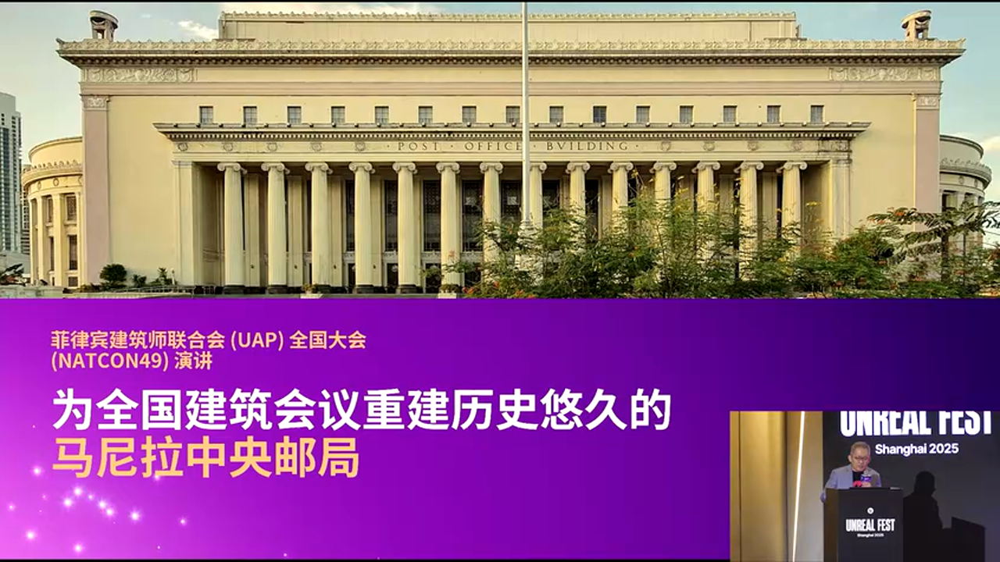

2022年，菲律宾的标志性建筑——马尼拉中央邮局遭遇火灾。这座拥有百年历史、经历过战乱和多次翻修的建筑，承载着菲律宾人的集体记忆。演讲者决定利用虚幻引擎，为菲律宾建筑师联合会（UAP）全国大会创建这座建筑的数字版本。

#### 技术亮点1：Lumen 实时全局光照


**Lumen** 是 UE5 的革命性实时全局光照系统。在这个项目中，它实现了：

- **动态光照计算**：无需烘焙光照贴图，场景光照实时响应
- **真实的间接光照**：光线在建筑内部的多次反射自然呈现
- **高效的迭代流程**：设计师可以实时调整光照参数，立即看到效果

配合 **Sky Atmosphere（天空大气系统）**，项目呈现出令人惊叹的日落场景。

#### 技术原理：瑞利散射（Rayleigh Scattering）

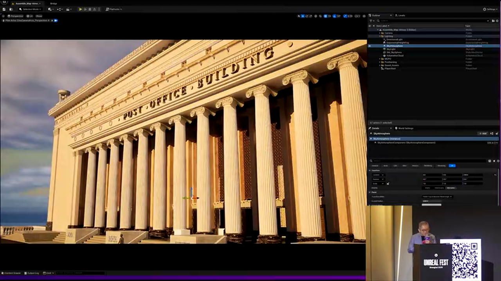

天空大气系统中的瑞利散射功能，模拟了光线在大气中的传播行为：

- **长距离传播**：光线经过长距离传播后，蓝光被大量散射
- **色彩渐变**：最终形成黄色、橙色、红色的多彩日落效果
- **体积光增强**：结合体积光（Volumetric Lighting），为建筑增添梦幻氛围


**配置示例**：
```
DirectionalLight（定向光）设置：
- 启用 Rayleigh Scattering
- 启用 Volumetric Scattering
- 调整 Light Intensity（光照强度）和 Sun Angle（太阳角度）

Sky Atmosphere 组件：
- 自动响应定向光的方向和颜色
- 无需复杂的手动调整
```

这种简洁的设置方式，让教育工作者能够快速教授高质量视觉效果的创建方法。

---

### 技术亮点2：Nanite 虚拟化几何体技术


**Nanite** 是 UE5 的虚拟化几何体系统，允许导入数百万乃至数十亿面的高精度模型，而不影响性能。

#### 工作流程优化策略

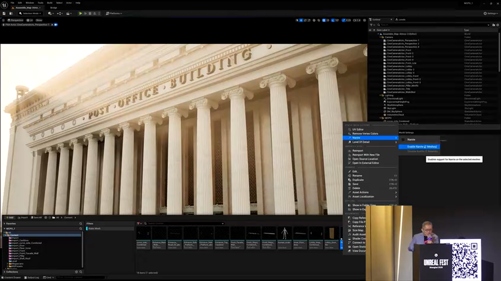

为了高效管理复杂建筑，演讲者采用了以下策略：

1. **模块化导出**：将建筑的不同部分导出为独立的静态网格
   - 柱子作为一个独立网格
   - 墙体作为另一个网格
   - 屋顶、装饰等分别导出

2. **Nanite 转换优化**：
   - 每个模块独立转换为 Nanite
   - 更新资产时只需重新导入对应模块
   - 大幅加快迭代速度

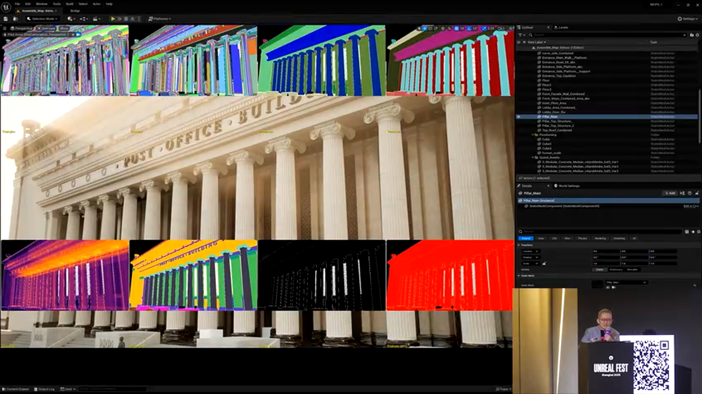

> **设计决策（Design Decision）**：
> 为什么要分模块而不是整体导入？
> - **版本控制**：可以针对特定部件进行修改和更新
> - **性能优化**：引擎可以更高效地剔除和渲染独立模块
> - **团队协作**：不同成员可以并行处理不同部件

---

### 技术亮点3：基于 Houdini 的 PBR 材质工作流

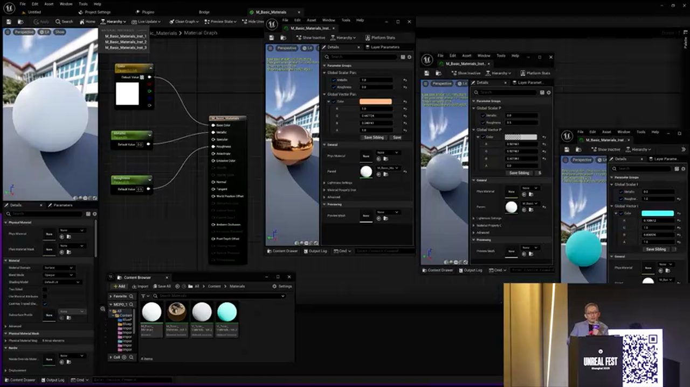

为了教授建筑师们 **PBR（基于物理的渲染）** 概念，演讲者创建了一个简化的教学场景：

**材质组成**：
- **1个主材质（Master Material）**
- **3个材质实例（Material Instances）**：金属、粗糙表面、光滑表面

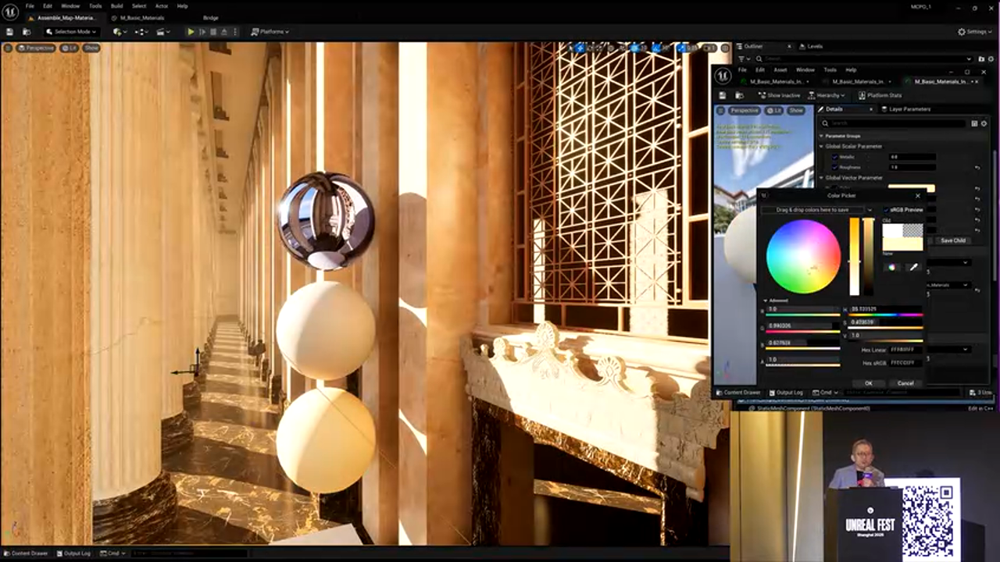

这个简单的三球体场景，在 Lumen 全局光照环境中，展现出惊人的真实感。

#### 实战体验：实时材质参数调整


> **学习体验**：
> 学员可以实时调整材质参数（Roughness、Metallic、Base Color），立即看到光照如何与材质交互。这种即时反馈的学习方式，比传统的理论讲解更加直观和有效。

**关键参数说明**：
- **Roughness（粗糙度）**：0=完全光滑镜面，1=完全粗糙漫反射
- **Metallic（金属度）**：0=非金属（绝缘体），1=金属
- **Base Color（基础颜色）**：材质的固有颜色

---

### 技术亮点4：序列器（Sequencer）动画与多场景复用


为了高效展示建筑在不同光照条件下的美感，演讲者使用了 **序列器** 创建太阳方向动画。

#### 多场景切换策略

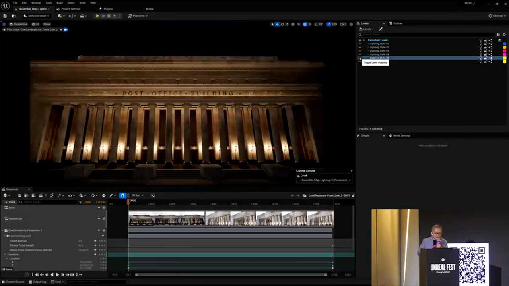

通过序列器的 **Level Visibility Tracks（关卡可见性轨道）**，可以快速切换不同的光照预设：

- **夜晚场景**：低角度定向光 + 蓝色环境光
- **白天场景**：高角度定向光 + 暖色调天空
- **黄昏场景**：中角度定向光 + 瑞利散射增强

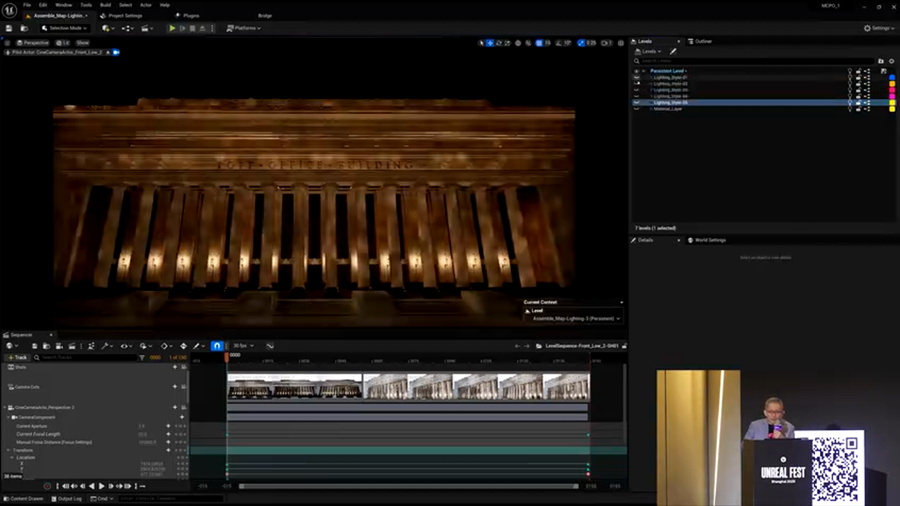

**渲染效率**：
- 每个场景渲染时间：**7分钟**（使用旧硬件）
- 无需手动调整参数，切换场景即可重新渲染

---

## 深度进阶：PCG 程序化内容生成的生产力革命

### PCG 基础：从简单示例开始

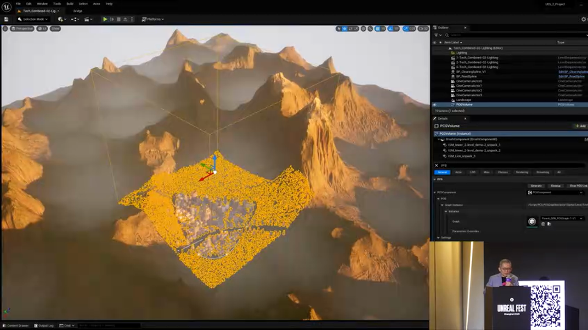

**PCG（Procedural Content Generation）** 是 UE5 的程序化内容生成框架。它的核心理念是：**用数据驱动的节点网络，自动生成大规模场景内容**。

#### 最简 PCG 示例：4个节点生成随机森林


**节点组成**：
1. **Input（输入）**：地形数据
2. **Surface Sampler（表面采样器）**：在地形表面生成采样点
3. **Randomize Transform（随机变换）**：设置缩放和旋转的随机范围
4. **Static Mesh Spawner（静态网格生成器）**：在采样点放置树木模型


**可调参数**：
- **数量**：控制采样点密度
- **最小/最大缩放**：树木大小的随机范围
- **旋转角度**：Y轴旋转的随机范围

这种极简的节点网络，让初学者能够快速理解 PCG 的基本逻辑。

---

### 实战案例：韩国奇幻村庄的程序化生成

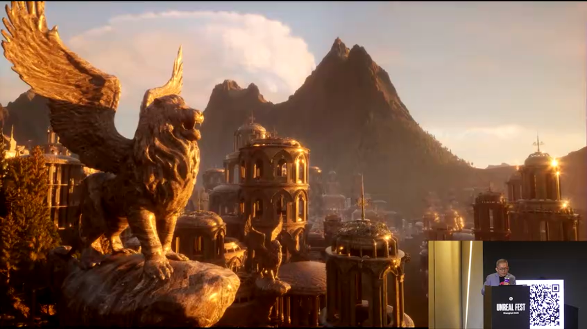

为韩国会议创建的奇幻村庄项目，展示了 PCG 的强大能力。

#### 文化相关性的设计思考

> **设计理念**：
> 韩国拥有蓬勃发展的游戏和影视产业，奇幻题材深受欢迎。通过创建韩国风格的奇幻村庄，可以与参会者产生文化共鸣，提升演示效果。

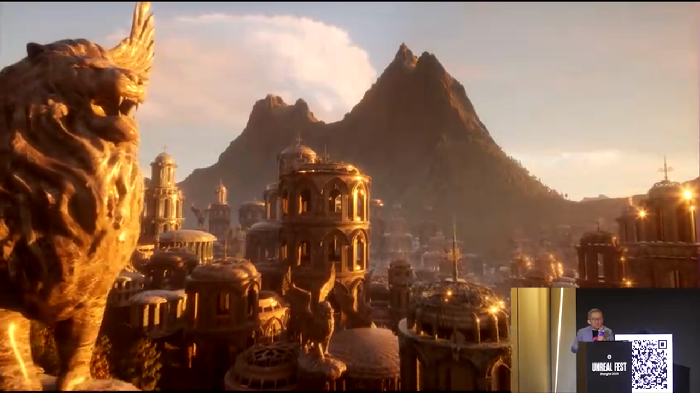

#### PCG 管道设计


**生成逻辑**：
1. **PCG Volume（PCG体积）**：定义生成区域的边界
2. **Spline（样条线）**：控制村庄的形状和道路区域
3. **静态网格输入**：建筑和树木的3D模型

**关键参数**：
- **建筑数量**：约30栋
- **树木数量**：约18,000棵
- **渲染时间**：**10分钟**（4K分辨率）

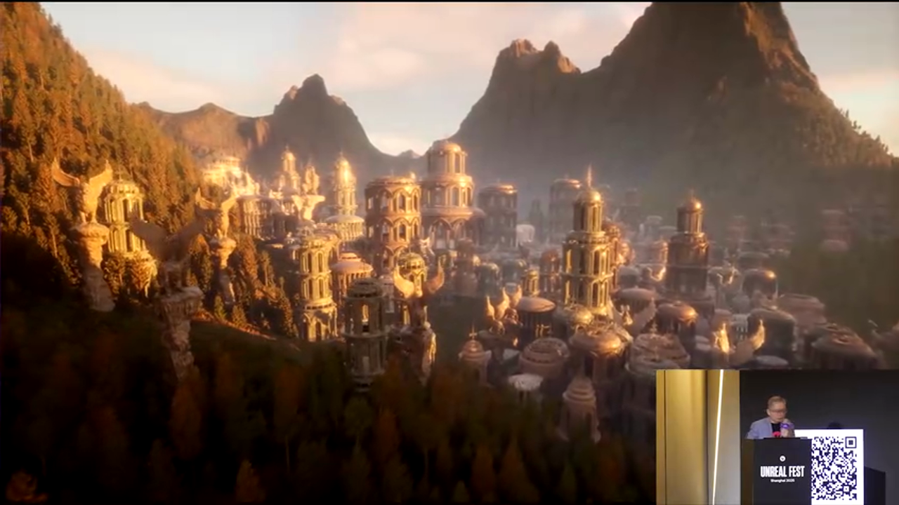

> **性能分析**：
> 传统手动放置18,000棵树和30栋建筑，可能需要数天时间。而 PCG 在几秒钟内完成布局，渲染仅需10分钟。**这是数百倍的效率提升**。

---

### PCG 进阶：模块化网络与多场景复用


演讲者强调了一个关键原则：**创建简单的、单一用途的 PCG 网络，然后组合它们**。

#### 模块化策略

**独立网络示例**：
- **道路网络**：生成道路和排除区域
- **森林网络**：在非道路区域生成植被
- **建筑网络**：在指定区域放置建筑

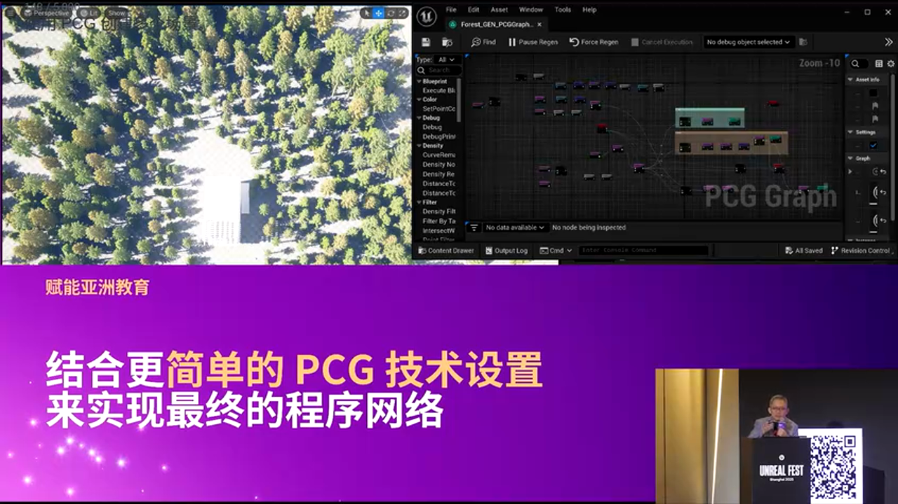

**组合优势**：
- **可维护性**：每个网络职责单一，易于调试
- **可复用性**：同一个网络可用于多个场景
- **可扩展性**：添加新功能只需创建新网络并连接

---

### 极限测试：10万棵树的大规模城镇


在复用 PCG 管道的基础上，演讲者创建了一个更大规模的场景：

**数据统计**：
- **建筑数量**：2,000+ 栋
- **树木数量**：100,000+ 棵
- **渲染时间**：依然是 **10分钟**

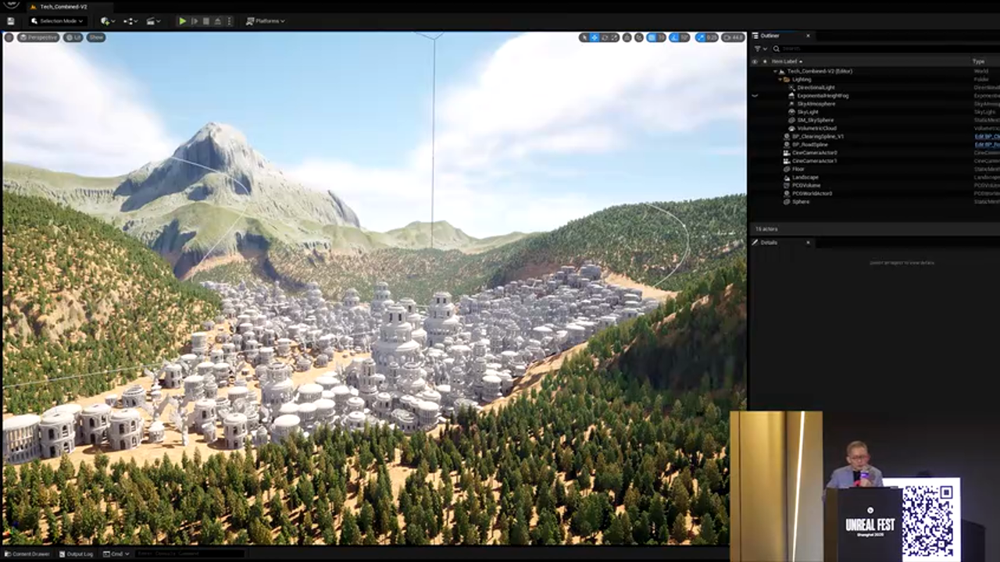

> **技术洞察**：
> 为什么10倍的内容量，渲染时间不变？
> - **Nanite 虚拟化几何体**：自动 LOD 管理，相机看不到的细节不会渲染
> - **Lumen 动态光照**：无需预计算，场景规模不影响光照性能
> - **World Partition**：大世界分块加载，内存占用可控

---

### 山顶城镇：地形适配的艺术

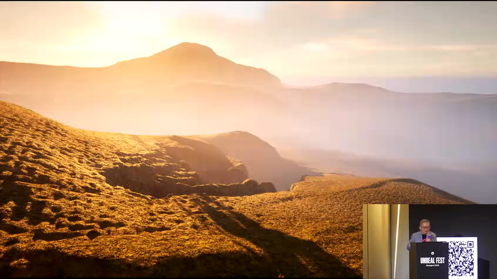

演讲者的下一个挑战是：**在山顶地形上生成城镇**。

**技术要点**：
- **地形采样**：PCG 自动检测地形坡度和高度
- **适配性放置**：建筑仅生成在平坦区域
- **样条线控制**：通过样条线精确控制城镇边界


> **最佳实践**：
> 创建一个强大的 PCG 管道后，应该在多个不同场景中测试和复用。这样可以：
> - 发现管道的适用边界和潜在问题
> - 积累可复用的资产库
> - 提高投资回报率（ROI）

---

### PCG 语法（PCG Grammar）：模块化规则系统

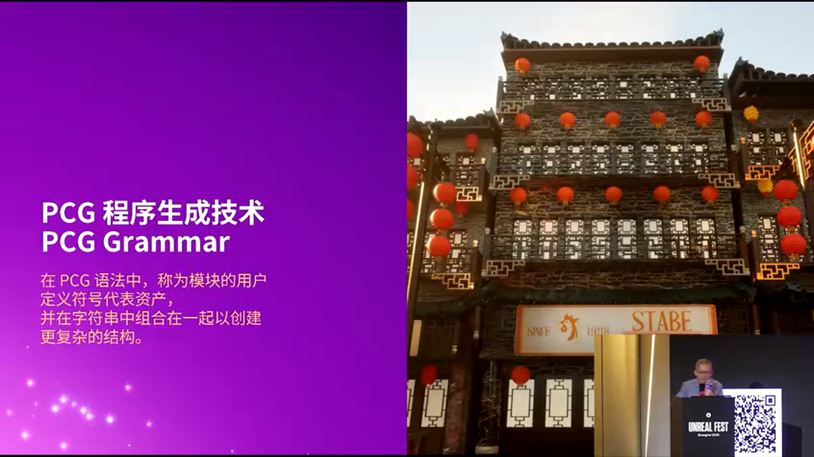

UE 5.5 引入了 **PCG Grammar**，这是一种更高级的程序化生成方法。

#### 核心概念

**符号（Symbol）**：
- 每个符号代表一种资产类型（如：墙体、屋顶、窗户）
- 符号可以嵌套和组合

**规则（Rule）**：
- 定义符号之间的组合逻辑
- 例如：`Building = Wall + Roof + Door`

**自递归（Self-Recursion）**：
- 规则可以引用自身，生成复杂的分形结构


#### 实战演示：样条线驱动的建筑生成

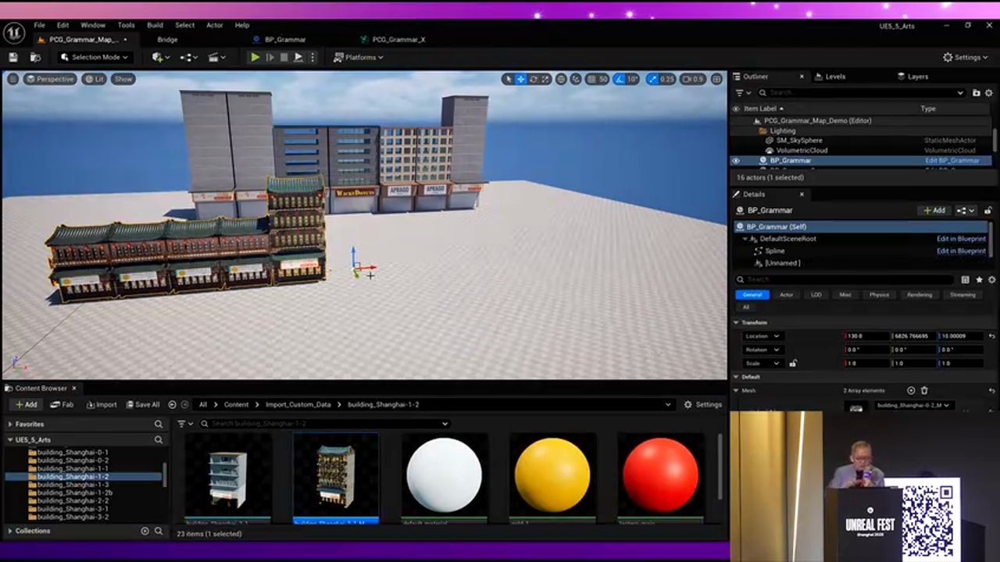

演讲者创建了一个简单的 PCG Grammar 演示：

1. **蓝图样条线（Blueprint Spline）**：定义建筑的轮廓
2. **PCG Grammar**：根据样条线生成不同类型的建筑

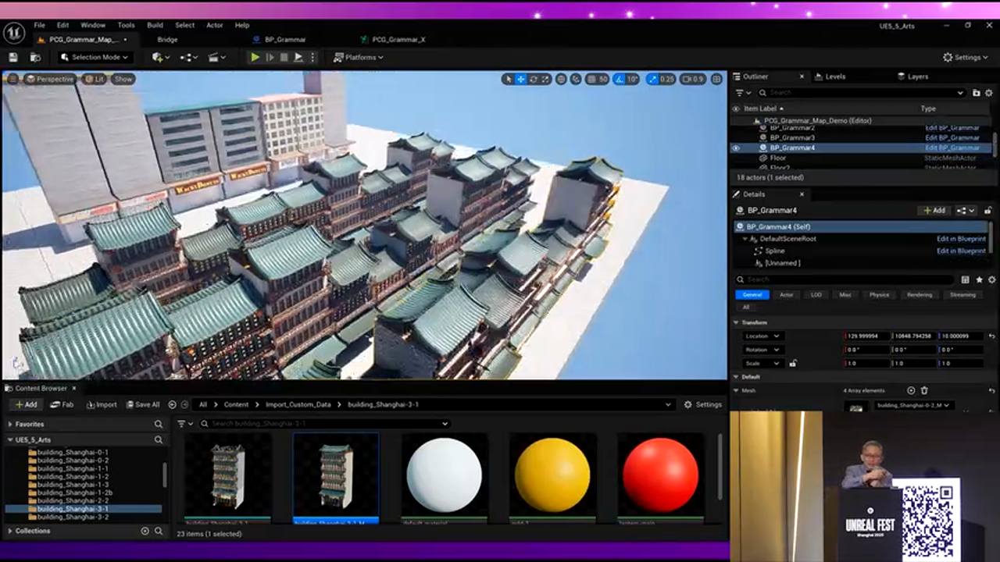

**优势**：
- **多样性**：同一个样条线可以生成多种建筑风格
- **一致性**：所有建筑遵循相同的规则系统
- **艺术控制**：美术可以通过调整样条线形状来影响生成结果

---

## 教学实践：将技术融入课堂

### 关卡分层（Level Layers）：课程模块化的最佳实践

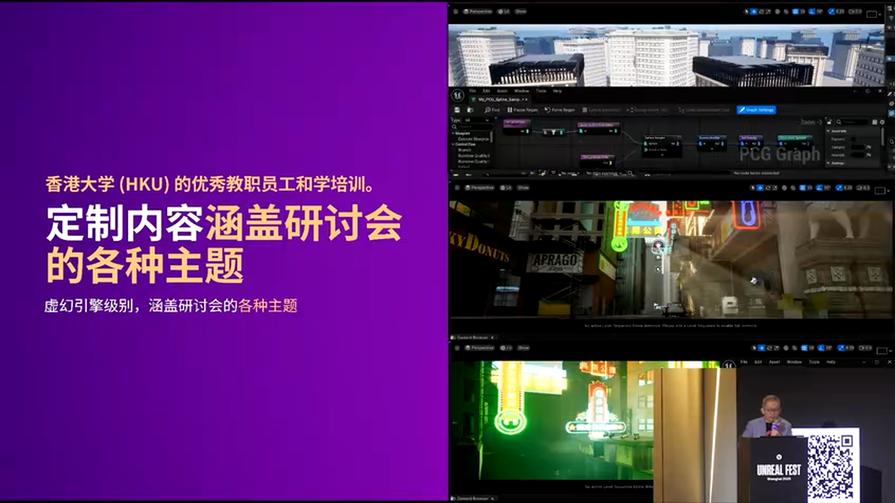

为了让学生能够系统学习复杂项目，演讲者采用了 **Level Layers** 技术：

**分层策略**：
- **Layer 1**：基础场景和地形
- **Layer 2**：建筑和静态网格
- **Layer 3**：光照设置
- **Layer 4**：镜头动画和后期处理

**教学优势**：
- **渐进式学习**：学生可以按层级逐步学习
- **独立复习**：可以单独查看某一层的内容
- **版本控制**：教师可以针对不同层级更新内容

---

### 霓虹灯材质：自发光的秘密

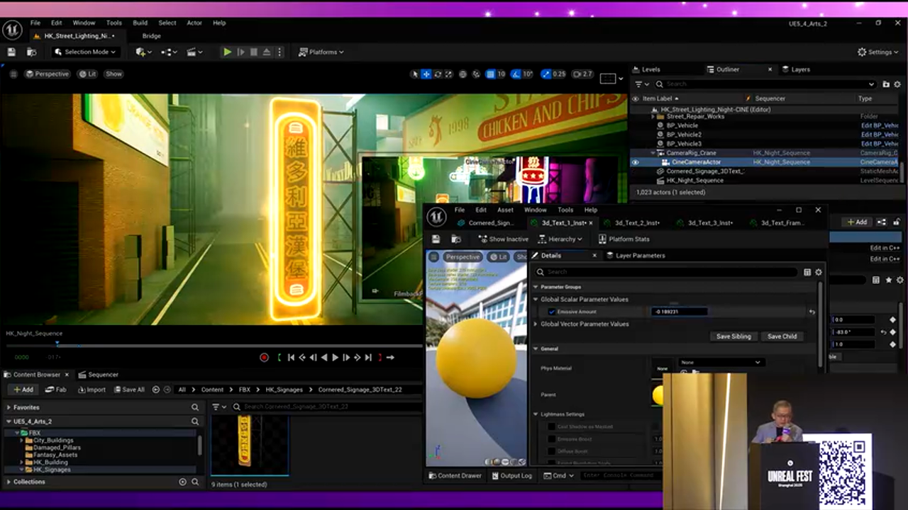

为了教授材质高级技巧，演讲者展示了霓虹灯的创建方法。

**技术要点**：
```
材质设置：
1. Material > Shading Model = Unlit（无光照）
2. Emissive Color（自发光颜色）= 霓虹颜色
3. Emissive Intensity（自发光强度）= 高数值（如10-50）

后期处理配合：
4. PostProcessVolume > Bloom（辉光）= 启用
5. Bloom Intensity = 适当提高
6. Bloom Threshold = 调低，让自发光材质产生辉光
```

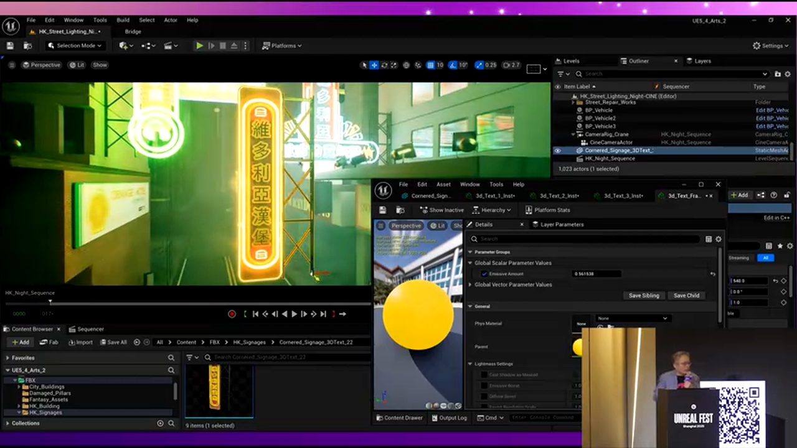

> **密技（Pro Tip）**：
> 如果想要高质量的霓虹灯效果，还需要配合 **后期处理体积（PostProcessVolume）** 的 Bloom 设置。自发光材质 + Bloom = 完美的霓虹效果。

---

## 文化本地化案例：从香港到上海

### 香港霓虹街景

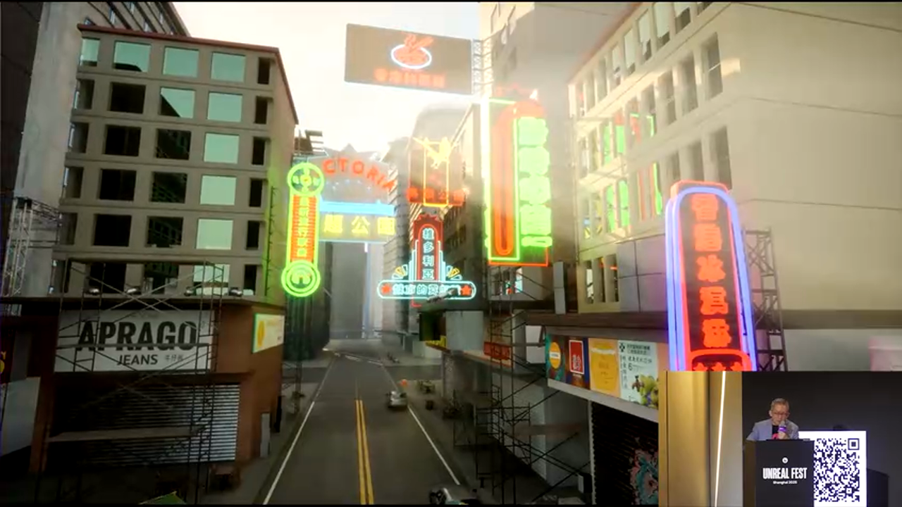

演讲者为香港大学创建了一个充满霓虹灯的街道场景。

**文化符号**：
- 招牌上的中文字体
- 霓虹灯的色彩搭配
- 街道的空间布局

这些元素让香港学生一眼就能认出自己的城市，产生强烈的文化认同感。

---

### 上海老街道：致敬明清建筑风格

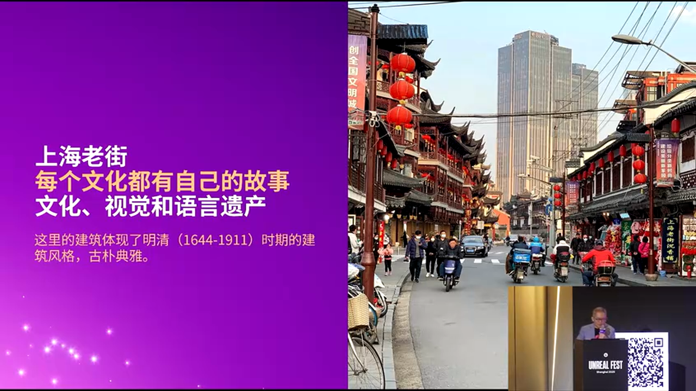

为了本次上海教育峰会，演讲者特别创建了一个老上海街道场景。

**历史背景**：
- 建筑风格：明清时期（1644-1911）
- 特点：古朴典雅的木质结构、精美的雕花装饰


> **设计初衷**：
> "既然上海拥有如此丰富美丽的文化，我就被激发了创意。我特地为参加本次会议的各位教育工作者，用虚幻引擎创建了老上海街道的数字版本。希望大家喜欢。"

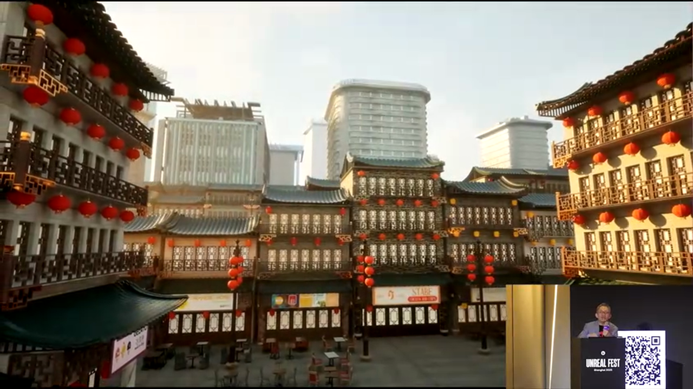

**技术挑战**：
- 复杂的木质结构建模
- 大量的装饰细节（利用 Nanite）
- 温暖的光照氛围（结合霓虹灯和传统灯笼）

---

### PCG Grammar 在老街道中的应用


老上海街道项目大量使用了 PCG Grammar 技术。

**符号定义**：
- **墙体符号**：不同类型的墙面（砖墙、木墙）
- **屋顶符号**：瓦片屋顶、飞檐结构
- **装饰符号**：窗户、门、雕花


**生成流程**：
1. 使用蓝图样条线定义街道走向
2. PCG Grammar 沿样条线生成建筑
3. 根据规则随机组合不同的建筑元素

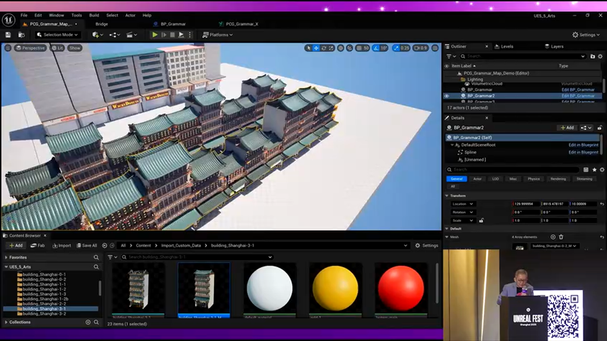

> **技术突破**：
> PCG Grammar 让单人团队能够快速生成多样化的建筑群，同时保持风格的一致性。这在传统工作流程中需要大量的手动建模和放置工作。

---

## 实战总结与避坑指南

### 技术方案对比

> **方案 A：传统手工制作**
> - 🟢 优势：完全的艺术控制，每个细节都可精雕细琢
> - 🔴 劣势：耗时极长，需要大团队和高预算，难以迭代
> - 🎯 适用场景：电影级CG短片、商业广告等预算充足的项目
>
> **方案 B：UE5 + Lumen + Nanite + PCG**
> - 🟢 优势：单人或小团队可实现AAA级视觉效果，迭代速度快，渲染时间短
> - 🔴 劣势：需要学习新技术栈，硬件要求较高（需支持DX12/Vulkan）
> - 🎯 适用场景：教育内容、快速原型、独立游戏、建筑可视化
>
> **方案 C：传统引擎 + 烘焙光照**
> - 🟢 优势：硬件要求低，技术成熟稳定
> - 🔴 劣势：光照烘焙时间长，难以实现动态光照效果
> - 🎯 适用场景：移动平台游戏、低端硬件项目

---

### 避坑指南

**坑1：Nanite 并非万能**
- **问题**：并非所有网格都适合 Nanite（如：透明材质、WorldPositionOffset 动画）
- **解决方案**：对特定资产禁用 Nanite，使用传统静态网格

**坑2：PCG 生成的内容难以精确控制**
- **问题**：完全随机的结果可能不符合艺术需求
- **解决方案**：结合手动放置和 PCG 生成，使用 PCG 的 "Exclusion Zones"（排除区域）功能

**坑3：Lumen 在室外大场景中的性能问题**
- **问题**：开阔场景中 Lumen 的性能开销较大
- **解决方案**：合理设置 Lumen Scene Detail、Final Gather Quality 等参数，关闭不必要的反射

**坑4：硬件兼容性**
- **问题**：部分学生的电脑不支持 DX12 或光追
- **解决方案**：提供降级方案（Software Lumen、禁用 Nanite），或使用云渲染服务

**坑5：文件大小管理**
- **问题**：大量高精度 Nanite 资产导致项目体积过大
- **解决方案**：使用 World Partition 的 Data Layers，按需加载资产

---

### 最佳实践清单

**项目规划**：
- ✅ 明确目标受众和文化背景
- ✅ 评估硬件条件，选择合适的技术方案
- ✅ 制定模块化的资产和场景结构

**技术选型**：
- ✅ 优先使用 Lumen（实时光照）而非烘焙光照
- ✅ 对高精度模型启用 Nanite，简化 LOD 管理
- ✅ 使用 PCG 生成重复性高的内容（树木、建筑群）

**工作流程**：
- ✅ 采用模块化建模，分部件导出和更新
- ✅ 创建可复用的 PCG 网络和材质库
- ✅ 使用 Level Layers 组织复杂场景

**性能优化**：
- ✅ 合理设置 Lumen 质量参数（平衡视觉和性能）
- ✅ 使用 Nanite 的 Fallback Mesh 确保兼容性
- ✅ 启用 World Partition 进行大世界管理

**教学应用**：
- ✅ 使用 Sequencer 预录演示动画，避免课堂上的技术故障
- ✅ 通过 Level Layers 展示不同技术层级
- ✅ 提供项目文件供学生自学和复习

---

## 结语：技术赋能下的文化传承


Douglas Leong 的演讲传递了一个核心信息：**技术不仅是工具，更是文化传承的桥梁**。

通过虚幻引擎的 Lumen、Nanite、PCG 等技术，教育工作者可以：

1. **降低门槛**：单人或小团队即可创建高质量内容
2. **提升效率**：从数天的手工工作缩短到10分钟的程序化生成
3. **增强共鸣**：通过文化相关的内容，让学习者产生情感连接

无论是菲律宾的马尼拉中央邮局、韩国的奇幻村庄，还是上海的老街道，这些项目都证明了：**技术创新与文化尊重可以完美结合**。

对于亚洲的教育工作者而言，这不仅是一次技术分享，更是一次关于如何用数字技术讲述本土故事的启发。

---

**致谢**：感谢 Epic Games 和 Douglas Leong 的精彩分享。希望本文能够帮助更多教育工作者在虚幻引擎的道路上获得成功。

---

**相关资源**：
- UE5 官方文档：https://docs.unrealengine.com/5.0/
- Lumen 技术指南：https://docs.unrealengine.com/5.0/zh-CN/lumen-global-illumination-and-reflections-in-unreal-engine/
- Nanite 虚拟化几何体：https://docs.unrealengine.com/5.0/zh-CN/nanite-virtualized-geometry-in-unreal-engine/
- PCG 框架文档：https://docs.unrealengine.com/5.0/zh-CN/procedural-content-generation-framework-in-unreal-engine/

---

*本文由 AI 基于视频内容生成，仅供技术交流学习使用。*
