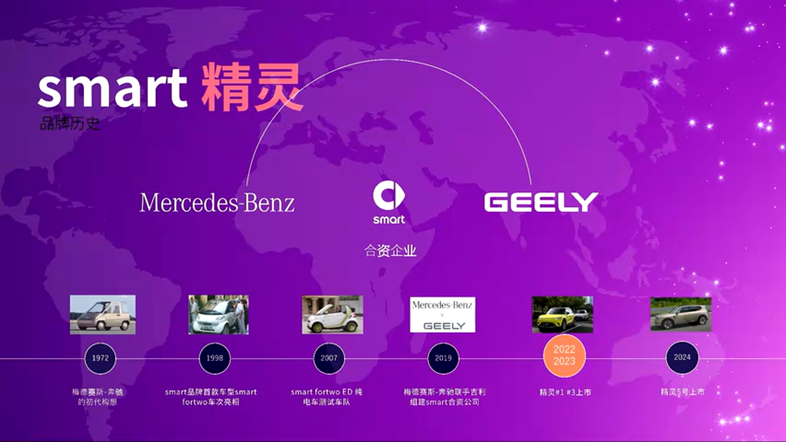
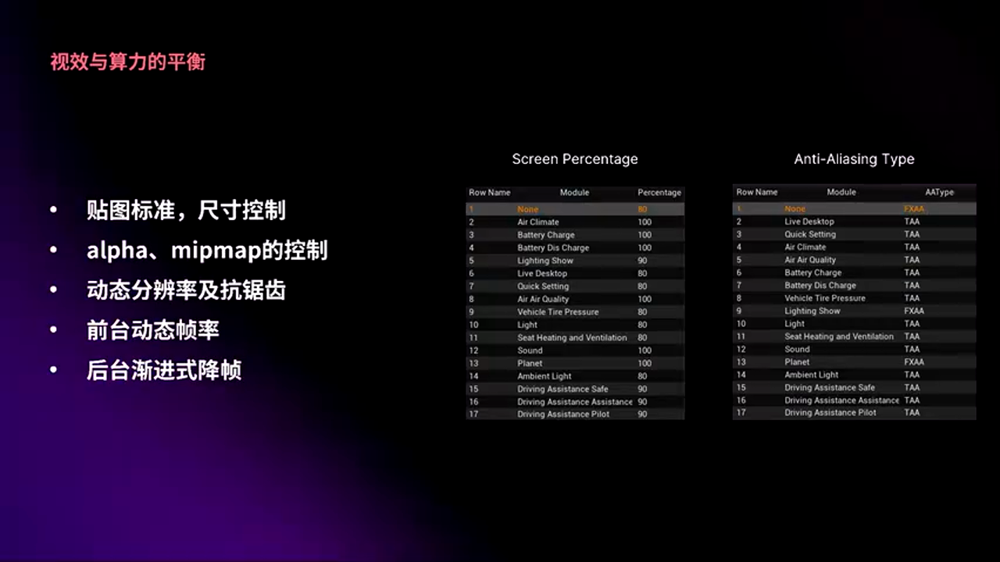
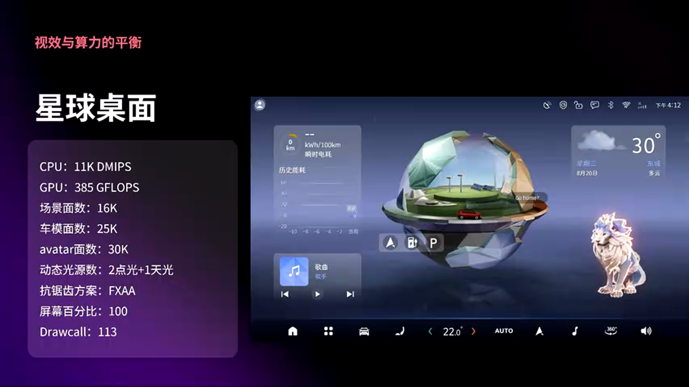
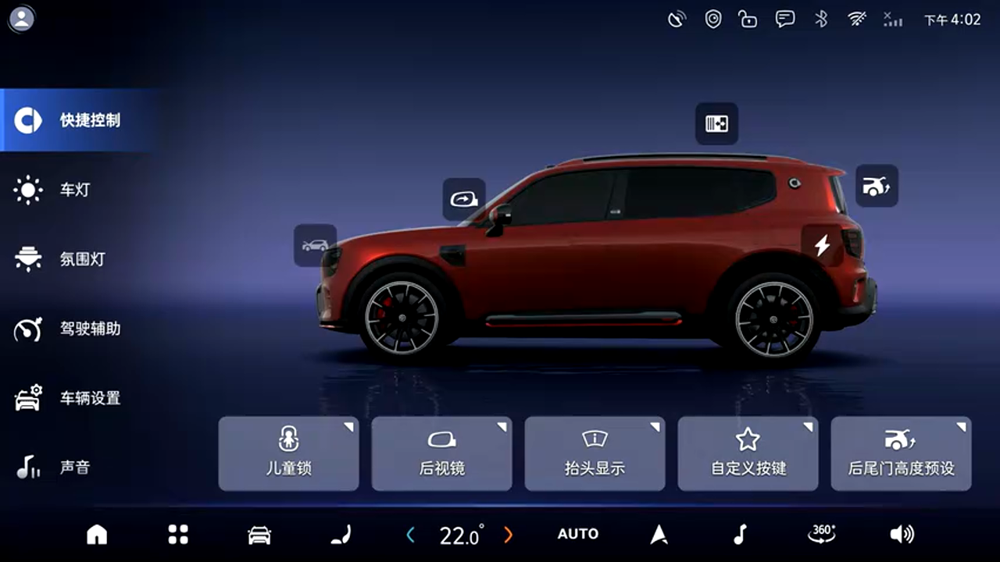
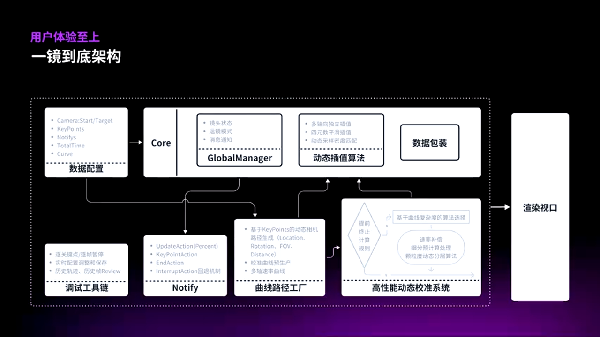
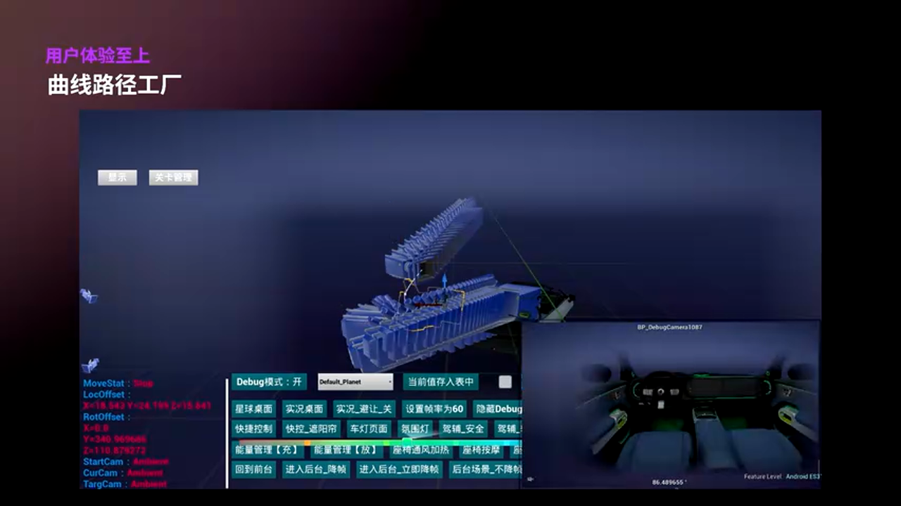
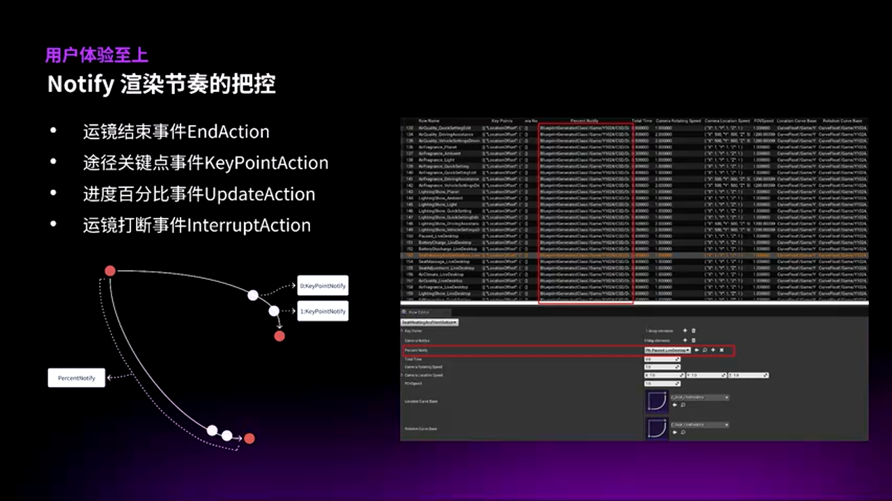
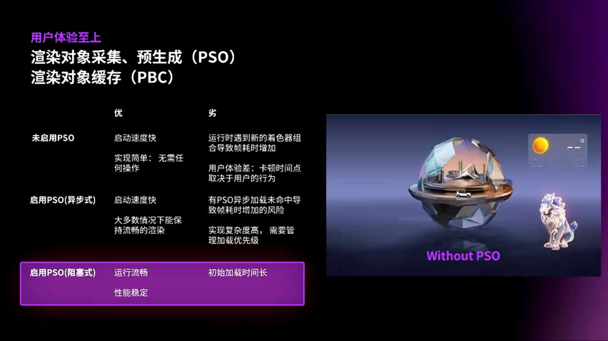
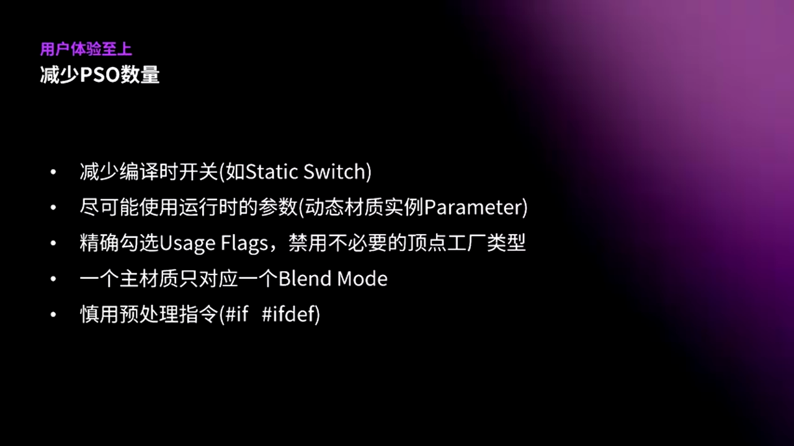
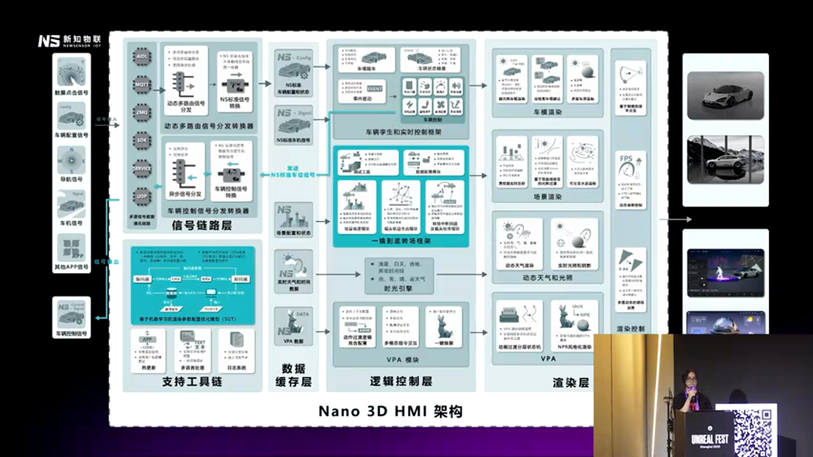

# Unreal Engine 5 在车载 HMI 的工程实践：smart 精灵5号 3D 数字座舱技术解析

---

## 加入 UE5 技术交流群

如果您对虚幻引擎5的图形渲染技术感兴趣,欢迎加入我们的 **UE5 技术交流群**!

扫描上方二维码添加个人微信 **wlxklyh**,备注"UE5技术交流",我会拉您进群。

在技术交流群中,您可以:
- 与其他UE开发者交流渲染技术经验
- 获取最新的GDC技术分享和解读
- 讨论图形编程、性能优化、构建工具流、动画系统等话题
- 分享引擎架构、基建工具等项目经验和技术难题

---

**源视频信息**
- 标题: [UFSH2025]smart精灵5号携手Unreal Engine重塑数字座舱体验
- 演讲者: 郭嵩 (智马达主任工程师) & 凯银峰 (新知物联3D HMI负责人)
- 视频链接: https://www.bilibili.com/video/BV1jDsEztEe7
- 本文由 AI 基于视频内容生成

---

> **导读**
>
> 在智能汽车时代,三维交互不再是概念性的设计点缀,而是功能性的核心体验。smart 精灵5号与新知物联团队基于 Unreal Engine 5 打造的全新 3D HMI 系统,在有限的车载算力下实现了 113 组流畅的镜头转场、多种驾驶模式场景切换和实时车辆状态同步。
>
> 本文将从性能优化、工程架构、用户体验三个维度深度解析这套量产方案的技术实现,揭示如何在 CPU 和 GPU 资源受限的嵌入式平台上平衡视觉效果与运行性能。
>
> **阅读前置知识:** Unreal Engine 基础、实时渲染管线、车载系统架构

---

## 背景与痛点：从机械产品到智能终端的转型

### smart 品牌的电动化转型历程

smart 品牌自 1972 年诞生以来,始终致力于解决城市拥堵问题。从 1998 年 smart Fortwo 量产,到 2007 年电动化转型里程碑,再到 2019 年梅赛德斯-奔驰与吉利联合打造全新合资品牌,smart 完成了从传统燃油小车到智能电动汽车的蜕变。

2024 年,smart 精灵5号作为品牌旗舰车型上市,其 HMI 系统与 Unreal Engine 5 深度合作,成为业内首批将游戏引擎级渲染能力应用于量产车机的案例之一。

### 设计理念：灵感星球与水晶美学

精灵5号延续了精灵1号的"灵感星球"概念,采用城市赛博朋克风格,基于车型算力提升对星球场景进行了全面升级。设计团队引入 **"水晶美学"** 设计理念,通过增强光影渲染和材质质感,让 HMI 设计更上一层楼。

整车设计从造型、内饰到 HMI 部分均由戴姆勒全球设计团队精心打造,拥有统一的视觉语言。HMI 部分独具特色,呈现了一个充满前沿科技感的"星球世界"。

除了星球桌面,系统还提供地图桌面、壁纸桌面以及实况车桌面(3D车模桌面),满足不同用户的定制需求,体现"千人千面"的设计理念。

### 技术挑战：复杂度与性能的博弈

丰富功能的同时也带来了更复杂的技术挑战。系统需要支持:
- **113 组一镜到底的 3D 转场动画**
- 星球到快捷设置、星球到导航、车模桌面到快捷设置等多维度转场
- **5 种驾驶模式**与 3D 场景的实时联动
- 不同驾驶模式下的场景环境颜色匹配

每个相机动画都配有专属的动画曲线,需要在有限的硬件资源下保证流畅性和视觉质感。通过与新知物联团队的不断打磨,最终完成了高标准的设计落地。

---

## 核心原理解析：性能优化与美术效果的平衡

### 硬件平台与性能指标

精灵5号 HMI 搭载的是 **高通 SA8255P 平台**,采用 QNX 8.6 架构,芯片配置如下:

**CPU 配置:**
- 6 核心架构,其中 2 个核心分配给仪表盘
- HMI 可用 **4 个核心**

**GPU 配置:**
- 车机端分配 **1.4T GPU 算力**

**显示参数:**
- 分辨率: **2.5K**
- 刷新率: **60Hz**

虽然硬件性能在市面上相对强劲,但中控屏应用众多,对 3D 渲染的性能压力依然巨大。

### 渲染优化策略

除了常规的优化手段(严格控制贴图尺寸、主动审核去除不必要的 Alpha 通道和 MipMap、尽量使用 16 位图取代 32 位图),团队还实施了一系列动态配置策略:

**1. 动态分辨率与抗锯齿方案**

根据不同场景动态调整渲染分辨率和抗锯齿方案,既保证性能,又尽量保持画面固有的质感。

**2. 动态帧率策略**

- **前台:** 当检测到用户操作时,立即提升到目标帧率
- **后台:** 采用渐进式降帧策略
  - 3D 界面退到后台前 3 秒保持原帧率,确保切换界面依旧流畅
  - 3 秒后开始逐步降帧
  - 8 秒降到最低帧率

这种策略在性能与响应之间找到了最佳平衡点。

### 性能数据与实测结果

在星球桌面和实况桌面这两个渲染复杂度极高的场景中,团队交出了令人满意的答卷:

**高复杂度场景性能:**
- CPU 占用: **~10%**
- GPU 占用: **385K - 478 GFlops**

**其他场景平均数据:**
- CPU 占用: **~7%**
- GPU 占用: **~400 GFlops**
- 常驻内存: **660MB**

其中实况桌面使用了 **平面反射 (Planar Reflection)** 技术渲染车模的平面反射效果,这是性能开销最大的场景之一。

---

## 深度进阶：车辆配置管理与工程化实践

### Avatar 云雀助手：角色骨骼绑定

Avatar 云雀助手是 smart 品牌 DA IP 的延续,配合精灵5号硬朗的外观设计特点和越野特性,团队选择了 **重灵失足王** 形象,MBTI 人格为 ISFP(冒险人格/艺术家人格)。

**角色技术实现:**
- SOP 上线版本集成 **26 个动作**
- 超过 **30 次迭代版本**
- 通过 UE 的角色骨骼绑定,动作更加自然协调

右侧天气卡片展开/缩小时,下方的云雀小形象会进行互不干扰的联动交互,这种细节处理大幅提升了用户的情感连接。未来将通过 OTA 方式升级更多动作,满足不同场景和用户的情感需求。

### 车辆配置管理系统

精灵5号为车主提供了丰富的车身配置选择,这对工程来说意味着需要处理大量复杂的信号和组合关系。

**配置管理方案包含三个层级:**

**1. 车漆系统配置**

控制车漆的基础色、金属度、粗糙度、清漆等属性。

**2. 车型配置文档**

针对轮毂、车门等差异部件,拆分模型进行独立控制。

**3. 车身细节控制**

针对车身标识、文字在不同车型和不同地区的差异,使用 **单一材质管理**:
- 通过 **UV 空间四等分**
- 配合 **遮罩材质** 控制显示

对于保险杠等部件的颜色变化,采用 **顶点色 (Vertex Color)** 进行分区控制。

**代码层面的泛化设计:**

为应对配置需求快速迭代,团队在代码层面进行了泛化设计:
- 减少代码变动
- 建立车辆配置数据与美术方案的映射体系

**实现方式总结:**
1. 定义规则并为每个组件配置规则
2. 实现各组件配置信息查询接口
3. 提供统一的车辆配置信息处理和应用配置接口

---

## 镜头转场系统：一镜到底的技术实现

### 物理驱动的星球交互

smart 团队对用户交互有一个核心理念:**与真实世界越接近,越容易引起用户在感官上的共鸣。**

设计师提出了这样一副场景:
- 星球被一个弹簧吊着
- 漂浮在有点粘稠的水里
- 你的操作不是在旋转它,而是在拉动它

**物理规则实现:**

算法遵循几条简单的物理规则:
1. **推力:** 你滑动得越快,给星球的推力就越大
2. **回弹力:** 弹簧总会把它拉回中心,你把它拽得越远,回弹的力就越强
3. **阻力:** 因为它在有粘性的水里,运动时总会有一个阻力让它慢慢减速,最后停下来

星球就是在 **推力、回弹力、液体阻力** 三者的拔河比赛中,产生了我们现在看到的灵活且自然的效果。

### 一镜到底的跨图层渲染

一镜到底的镜头效果是整个车机系统的设计点睛之笔,串联起每个独具特色的场景,从而形成一个整体。但要实现它,必须解决几个棘手的问题。

**问题 1: 跨图层同步问题**

3D 应用渲染处于图层的底层,在上层渲染了其他应用。即使是两个图层,也很难做到百分百同步刷新——毕竟就像两个人翻书,总有一个人可能会快些。

结果就是用户会看到恼人的残影或画面错位。而 **一镜到底的设计,恰好是这个问题的解药**。

**问题 2: 遮罩渲染**

在星球桌面切换到其他场景的过程中,为了突显车身始终处于画面中心,团队采用了 **后处理材质或微积分的遮罩方案**:

- 针对不同场景模型,制作了不同的 **三维 Mask 模型**
- 通过 Mask 模型实现背景遮罩

### 镜头管理框架：化繁为简的设计哲学

smart 对一镜到底的实现提出了严格的需求:
- 满足用户体验的优越性
- 支撑需求的复杂度
- 提供使用的便捷性

**核心 Feature 提取:**
1. **运镜支持高频打断而不出错**
2. **运镜路径动态生成**
3. **上手使用便捷无负担**
4. **强大的调试反馈** (数据清晰、格式化、配合定制调试工具)
5. **运行时实时修改** (得益于 Unreal 在 Runtime 中修改数据和曲线能够得到实时反馈)

**架构分层设计:**

就像玩游戏点亮技能树一样,团队需要先点亮最核心、最基础的功能,把它做到最简单最稳定,再逐步解锁不同功能,让更多的技能按需点亮。

**核心层分为三个部分:**

1. **Global Manager:** 负责管理镜头、镜头数据、以及运镜模式、消息通知
2. **核心算法:** 包括多曲线插值、动态采样密度匹配的动态插值算法
3. **外部数据依赖**

哪怕不加其他技能点,这样的框架也能跑简单路径的一镜到底,非常适合做 Tech Demo 的验证。

经过多轮迭代和重构,它已经能做到 **开箱即用,具备高鲁棒、无卡顿、高响应的状态**。

### 复杂路径生成与动态插值

在精灵5号 HMI 中,如果想要还原设计的完整效果,就需要多个技能点加持:
- 要实现更复杂的运镜,就必须有能力处理 **复杂路径的生成**
- 而且用户的快速交互会打断运镜进程,所以路径也得能 **动态生成,随时应变**

**路径工厂核心能力:**
- 动态平滑路径生成
- 较准曲线的预生成

**工作原理:**

所有路径规划都托管于这个曲线工厂,而核心层的插值算法只需要根据动态采样密度,实时计算下一帧的 Pose 数据即可。剩下的事情就交给"保姆级引擎" UE 去帮我们搞定。

### 场景过渡与事件通知系统

从任意位置朝一系列目标点生成平滑路径并不难,难的是在风格差异很大的场景里,还要做到精确控制:
- 灯光切换时机
- 配置加载时机
- 平滑过渡

几乎每一组运镜都需要定制化的场景过渡方案,这才是真正的挑战。

**NOTIFY 事件流:**

团队做了一个对美术同学十分友好的场景管理器 —— **NOTIFY**。它提供多类事件流:
- **进度百分比事件**
- **打断回滚事件**

这两者是回滚机制的核心,也是逐帧控制、精确控制渲染画面的关键。

**案例:车模到壁纸的转场**

在转场过程中:
1. 镜头推进过程中,遮罩模型出现
2. 主车隐藏
3. 壁纸的模型显示

如果这个过程中用户突然切回原场景:
1. 打断机制会立即生效
2. 已经执行的操作回退
3. 未执行的操作将不再继续

**精确控制案例:**

比如主车模型需要在 50% 时隐藏,遮罩在 40% 开始渐现,这些都是依靠 **进度百分比事件** 来实现的。

### 数值映射与路径规划算法

不难看出,精确控制渲染画面的核心其实就是 **进度百分比实现中的数据准确性**。

**问题场景:**

在运镜的过程中,如果用户突然操作跳转到别的页面,打断了当前运动,系统会立即生成一条新的运动路径。

**问题:**

如果百分比数据每次都被强制清零,或者沿用当前的灯光、车模透明度等渲染参数,这些基于插值的效果就完全不合理了。

想象一下在两个场景之间不断快速切换,无论停在哪,车模透明度都会从某个值归零再开始增加,这就完全背离了设计预期,也是用户无法接受的。

**解决方案:建立映射关系**

把 **动态生成的路径** 和 **模拟两个场景完整运动过程的基准路径** 之间建立映射关系。

通过一系列的规则和算法,低开销地完成数值校准。这里面包括几个关键点:

**1. 提前中止计算规则**

在运动过程中,根据实时状态动态调整计算逻辑,避免不必要的计算开销。

**2. 细分预级流程处理**

将复杂路径的计算分解为多个子任务,提前进行预计算,提升运行效率。

**3. 数值颗粒度分层计算**

根据场景需求,对不同精度的数值进行分层计算,确保运算的效率和精度的平衡。

---

## PSO 与 PC 优化：启动时间与用户体验的博弈

### 问题背景：转场卡顿的根源

在项目初期,团队遇到了转场卡顿的问题。经过排查发现,是有新的渲染对象生成会造成卡顿的问题,给用户带来不佳的视觉体验。

### PSO (Pipeline State Object) 机制

于是团队首先引入了 **PSO 机制**。

大家可能有类似的体验:第一次启动某款游戏时,会提示 **"正在加载着色器缓存"**。团队的思路类似:

- 在引擎初始化时,提前主动生成所有 PSO
- 把原本分散在运行时的开销,提前一次性完成

**异步加载的问题:**

其实 PSO 也是支持异步加载的,它是把生成 PSO 的时机分摊到每次 Tick 的空闲阶段。

由于需要在第一帧开始渲染后,应用就需要支持切换至任意场景,所以如果所需的渲染对象还未加载,缓存没有命中,这个时候就会导致新的渲染对象占用 Tick 的空闲阶段临时生成,造成单帧时间的拉长从而导致卡顿。

**最终方案:主动式预加载**

所以最后团队选择了 **主动式预加载**。但是这个代价就是 **启动时间会增长**。

### PC (Pipeline Cache) 机制

如果只使用 PSO,每次冷启动车机都得重新生成一遍,这是很贵的一件事情。所以后面团队又引入了 **PC 机制**:

- 把 PSO 缓存存储到本地
- 下次启动时如果缓存可用,直接加载
- 无需再生成 PSO 对象

**最终启动时间: ~12 秒**

### 避坑指南：控制 PSO 数量膨胀

当然,如果 PSO 数量太多,启动时间依然会变得难以接受。所以在 **材质编写中,需要尽量规避着色器变体数量的膨胀**。

**几点需要注意:**

**1. 避免大量可以随意组合的静态开关**

在材质中避免大量可以随意组合的编译开关,也就是 **Static Switch**。尽可能用运行时的参数去改变渲染效果。

因为有 N 个独立的静态开关,那可能会带来 **2^N 种 PSO 组合**。

**2. 精确勾选材质属性面板**

在材质的属性面板中,有很多复选框其实是编译开关,会直接影响最终的 Shader 代码,比如 **Use Distance Fields**。

我们需要做到精确勾选,禁用不必要的顶点工厂类型等等。

**3. 谨慎使用预处理指令**

在 Shader 编写中,要谨慎使用预处理指令,避免无意间增加 PSO 数量。

**4. 持续开启 PSO 采集**

在项目迭代期,可以持续开启 PSO 采集,借助回归测试覆盖更多的运行路径,避免遗漏的 PSO。

而在上线前要 **关闭 PSO 采集**,确保软件处于最佳的状态。

---

## 车控信号与数据同步

### 信号缓存与变化监听

在车机系统中,3D 应用依赖车控信号保持与实车状态同步。如果实时从车控总线拉取信号:
- 不仅会增加总线压力
- 还可能导致信号丢失和数据同步的问题
- 影响用户体验

**解决方案:基于 MVC 架构的信号缓存与变化监听**

1. **低成本启动:** 启动时获取所需的车控信号当前状态,并缓存在数据层
2. **实时监听:** 在运行过程中对车控信号进行实时监听
3. **增量更新:** 每当接收到新信号,与当前缓存值进行比对
4. **变化驱动:** 只有当检测到数据更新时,才会同步数据到业务层,触发响应的处理逻辑,最后再驱动渲染的更新

这种架构大幅降低了总线压力和无效计算,保证了数据的一致性。

---

## 启动时间优化：纹理压缩与符号化调试

### 纹理压缩格式与 GPU 硬解

团队在项目前期发现冷启动时间十分漫长。配合 **Unreal Insights** 和 **Trace 工具** 分析出来,是引擎初始化时渲染线程长时间进行 **CPU 类型的纹理解码计算**。

**根本原因:**

由于本次使用的芯片 GPU 不支持当时使用的 **ASTC 纹理压缩格式硬解码**,所以使用了 **CPU 软解码**。

与此同时,启动时多应用会抢占稀缺的 CPU 资源,所以启动时间被进一步放大。

> **避坑指南**
>
> 纹理压缩格式是否支持 GPU 硬解,是启动性能的关键信息,必须要向芯片厂商确认。

### 符号化调试与 BuildID 管理

而在 **Android Unreal 应用** 的 Crash 日志里,堆栈往往只有地址。我们可以通过 **NDK Stack 工具** 做符号化,快速定位到具体文件、具体函数、具体行号。

而这个符号化就需要当时使用的应用版本的 **BuildID** 与我们留存的带符号表的 **BuildID** 进行校验一致,才能成功地符号化。

> **最佳实践**
>
> 所以每次版本交付,留存对应的带符号 .so 是非常良好的工程习惯。

---

## 实战总结与建议

### NALO 3D HMI 架构的设计理念

smart 与新知物联团队一直有一个核心目标:**提高复用性和开发效率**。

在不断的探索和迭代中,团队总结并打造出了高复用的 **NALO 3D HMI 架构**,并且已经在多个项目中成功应用。

**这套架构的设计突出高内聚、低耦合和模块化:**

- **可复用性:** 核心组件可在多个项目间复用
- **兼容性:** 支持不同硬件平台和车型配置
- **适配性:** 快速适配不同的设计需求
- **可扩展性:** 模块化设计便于功能扩展
- **可测试性:** 分层架构便于单元测试和集成测试
- **可维护性:** 清晰的代码结构降低维护成本

**最终结果:**

应用更加稳定、更加可靠。

### 多元数据管理与信号链路标准化

在面对多元数据时,团队在 **信号链路层** 制定了统一的数据格式标准。

**优势:**
- 业务逻辑不再依赖外部信号,代码复用性更高
- 开发负担更低
- 效率随之提升

### 方案对比：传统 QT 方案 vs UE5 3D HMI

> **传统 QT 方案**
> - 🟢 优势:
>   - 轻量级,启动速度快
>   - 成熟的车载应用生态
>   - 开发工具链完善
> - 🔴 劣势:
>   - 3D 能力有限,需要大量自研渲染管线
>   - 复杂动画和光影效果实现成本高
>   - 视觉表现力受限
> - 🎯 适用场景: 功能型 HMI,对视觉效果要求不高的场景
>
> **UE5 3D HMI 方案**
> - 🟢 优势:
>   - 开箱即用的 AAA 级渲染能力
>   - 丰富的材质系统和后处理效果
>   - 完善的动画和相机系统
>   - 强大的可视化编辑工具
> - 🔴 劣势:
>   - 包体积大,启动时间长(需 PSO/PC 优化)
>   - 对硬件要求较高
>   - 学习曲线陡峭
> - 🎯 适用场景: 旗舰车型,追求极致视觉体验和沉浸感的 HMI

### 性能优化避坑指南

**1. 纹理与材质**
- 确认 GPU 支持的纹理压缩格式,优先使用硬解码格式
- 控制静态开关数量,避免 PSO 组合爆炸
- 使用 16 位纹理替代 32 位纹理
- 移除不必要的 Alpha 通道和 MipMap

**2. 启动时间**
- 使用 PSO 预生成 + PC 缓存机制
- 谨慎控制材质编译开关
- 关闭不必要的顶点工厂类型
- 预加载核心场景资源

**3. 运行时性能**
- 动态帧率策略(前台高帧率,后台渐进降帧)
- 动态分辨率调整
- 信号缓存与变化监听,避免无效计算
- 场景卸载与懒加载

**4. 调试与维护**
- 留存每个版本的带符号 .so 文件
- 使用 Unreal Insights 和 Trace 工具分析性能瓶颈
- 建立标准化的数据格式
- 持续开启 PSO 采集直到上线前

---

## 总结与展望

smart 精灵5号与新知物联团队基于 Unreal Engine 5 打造的 3D HMI 系统,不仅是一次技术探索,更是一次对 **"3D 不是宣泄,而是交互逻辑的升维"** 理念的深刻实践。

通过 3D 在汽车 HMI 中的应用,标志着汽车从机械产品转换成智能终端的重要转型。通过更直观、更沉浸、更具情感化的连接交互方式,满足用户的出行需求。

未来,希望通过设计需求方和技术解决方的密切合作,将 3D 元素从装饰性的设计彻底转换成功能性的核心,让 3D 定义智能汽车的体验,成为新的基准。

随着更多的项目实践和打磨,团队会不断迭代优化,也期待有机会以更好的成果和经验再次与大家分享。

---

**致谢**

感谢 smart 团队对新知物联的信赖,将如此具有挑战性的项目交由团队实现。同时也感谢 Unreal Engine 的技术支持以及 UFSH2025 峰会提供的分享机会。

通过设计需求方与技术解决方的密切合作,我们相信能够创造出更好的产品,为用户带来更流畅、更沉浸、更有新意的体验。
