# UE5 烟雾模拟深度解析：从 Stable Fluids 到实时体积渲染

---


## 加入 UE5 技术交流群

如果您对虚幻引擎5的图形渲染技术感兴趣，欢迎加入我们的 **UE5 技术交流群**！

扫描上方二维码添加个人微信 **wlxklyh**，备注"UE5技术交流"，我会拉您进群。

在技术交流群中，您可以：
- 与其他UE开发者交流渲染技术经验
- 获取最新的GDC技术分享和解读
- 讨论图形编程、性能优化、构建工具流、动画系统等话题
- 分享引擎架构、基建工具等项目经验和技术难题

---

**源视频信息**
- **视频标题**: [UFSH2025]在UE5中执行烟雾的可视化模拟 | Angelou.lv 腾讯生态发展部 技术美术
- **视频链接**: https://www.bilibili.com/video/BV1C5sKzeEnD
- **视频时长**: 约42分钟
- **AI生成说明**: 本文基于AI技术对视频内容进行整理和深度解析，结合截图进行图文并茂的呈现。

---

> **导读摘要**
> 
> - 本文深入解析如何在 UE5 中实现实时流体模拟，涵盖 Stable Fluids 算法原理、多种压力求解器对比以及体积渲染优化策略
> - 核心技术路线：基于 GPU 的 Euler 网格法 + 红黑 Gauss-Seidel 压力求解 + 分离式体积渲染
> - 前置知识：基础微分方程、GPU 计算着色器、UE 渲染管线基础

---

## 一、背景与技术演进

### 1.1 Single Volume 插件生态

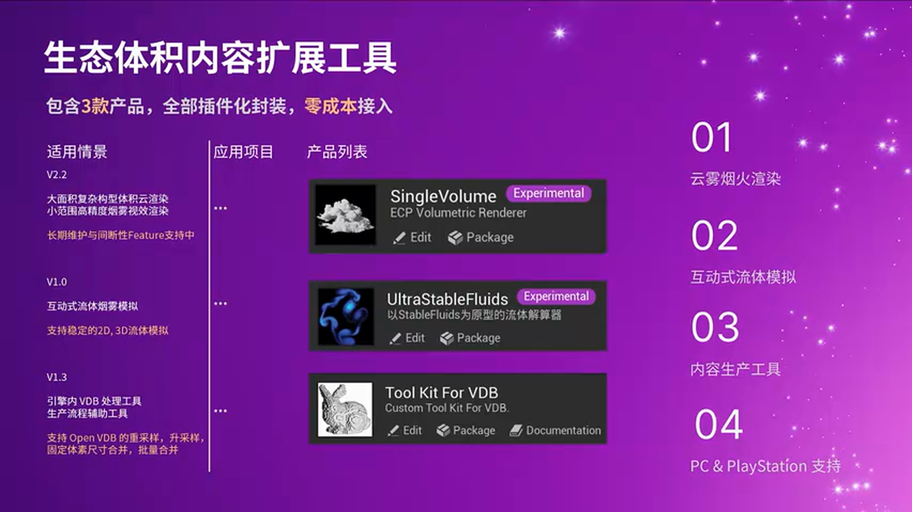

从 2023 年开始，腾讯生态发展部技术美术团队持续在 UE5 体积渲染领域深耕，形成了完整的插件矩阵：

- **Single Volume 第一代**（2023）：支持各种形状云的渲染
- **Single Volume 第二代**（2024）：采用全新的体素渲染方式，支持云雾烟火的渲染
- **Ultra Stable Fluids**：互动式流体模拟插件
- **Torch4VDB**：OpenVDB 流程工具，连接影视级数据结构与游戏引擎

这三个插件覆盖了**互动式流体模拟**、**云雾烟火渲染**以及**内容生产和跨平台支持**（PC、PlayStation），且全部免费开源。


每个插件都配有对应的蓝皮书（用户手册和技术手册），类似虚幻引擎官方的文档形式。

### 1.2 效果展示


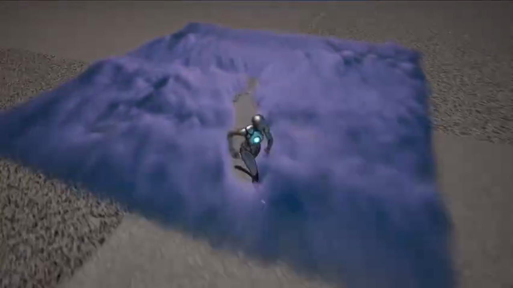

上图展示的效果是使用 **Ultra Stable Fluids** 进行流体模拟，再加上 **Single Volume** 实现的体积渲染所呈现的案例。

---

## 二、物理数学方案选型

### 2.1 Navier-Stokes 方程求解方法对比


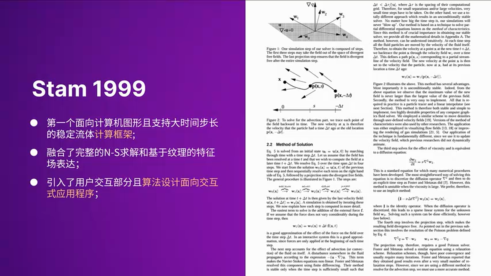

求解 Navier-Stokes 方程有三个主要角度：

**方案 A：微观角度 - SPH（光滑粒子流体动力学）**
- 优势：适合模拟液体飞溅、破碎等效果
- 劣势：粒子数量大时计算开销高，需要邻居搜索
- 适用场景：液体模拟、水花效果

**方案 B：介观角度 - LBM（格子玻尔兹曼方法）**
- 优势：易于并行化，边界处理灵活
- 劣势：内存占用大，对于气体模拟可能过于复杂
- 适用场景：复杂边界条件的流体模拟

**方案 C：宏观角度 - Stable Fluids**
- 优势：稳定性好，适合 GPU 并行，计算效率高
- 劣势：数值粘性较大，细节可能不够丰富
- 适用场景：烟雾、火焰等气体效果

由于目标明确是**烟雾模拟**，而非液体（Liquid）或 SARS 类型模拟，因此选择了 **Stable Fluids** 方案，这也是插件名称 **Ultra Stable Fluids** 的由来。

### 2.2 Stable Fluids 核心方程

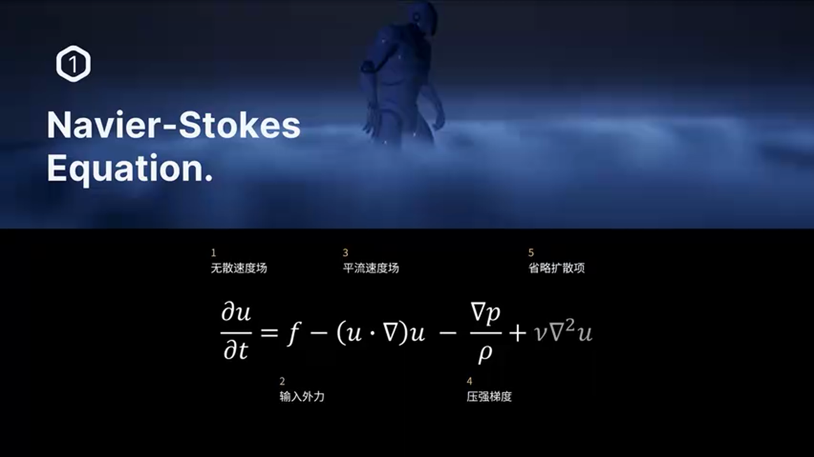

在 Stable Fluids 框架下，需要求解两个核心方程：

**第一个方程：NS 方程（速度场求解）**

这里省略了粘性项（扩散项），因为对于烟雾这种介质，省略粘度求解从效果上来讲差别不大。最终得到一个**无散速度场**。

**第二个方程：物质平流方程（密度场求解）**


用刚刚算到的速度场来平流物质场：
- 可以是**温度**（如果做火焰）
- 可以是**密度**（体积渲染）

同样省略了耗散项和扩散项，只剩下两项。

### 2.3 求解步骤分解


整个求解思路清晰：

1. **求解外力** → 得到中间速度 W1
2. **平流** → 得到 W2
3. **扩散**（已省略）
4. **投影** → 把不确定是否无散的速度场投影到确定无散的速度场上
5. **NS 方程求解完毕**
6. **计算物质平流**

---

## 三、压力投影与泊松方程

### 3.1 Helmholtz-Hodge 分解


理解投影过程需要用到 **Helmholtz-Hodge 分解**定理：

> 任何一个足够光滑的向量场都能够分解成一个**旋量向量场**（无散）和一个**保守场**（势场的梯度）的和。

数学表达：
```
W = U + ∇P
```

其中：
- W：中间速度场（可能有散度）
- U：无散速度场（我们需要的）
- P：压强场

因为 U 是无散的，对两边求散度：
```
∇·W = ∇·U + ∇²P = 0 + ∇²P
```

得到 **泊松方程**：
```
∇²P = ∇·W
```

### 3.2 泊松方程的求解


泊松方程的求解分为两个部分：

**正向（投影）**：已知压强场，减去压强场的梯度，把速度场投射到无散场上。

**逆向（求压强）**：用速度场的散度去求压力场。

这里涉及到：
- 散度求解
- 拉普拉斯算子

### 3.3 离散化与线性方程组


求解泊松方程实际上就是求解一个**线性方程组** `Ax = b` 的形式。

如果在 A4 纸的尺度上画一个 3×3 的网格，你就能够得到上图所示的数学公式。左边是一个周期性边界条件的 2D 拉普拉斯算子矩阵。

但如果是常见的纹理大小（如 256×256），计算规模会非常恐怖。如果是 3D 流体模拟，那就是 256³ 的规模。

> **核心问题：如何高效地求解泊松方程？这是任何流体模拟都要解决的关键点。**

---

## 四、压力求解器对比分析

### 4.1 Jacobi 迭代


**实现方式**：把泊松方程两边移项，得到迭代公式。代码和左边的公式一一对应。

**特点**：
- 非常简单，适合 GPU 并行
- 需要很多次迭代才能收敛
- 需要双缓冲内存（Ping-Pong 交换）

### 4.2 Red-Black Gauss-Seidel

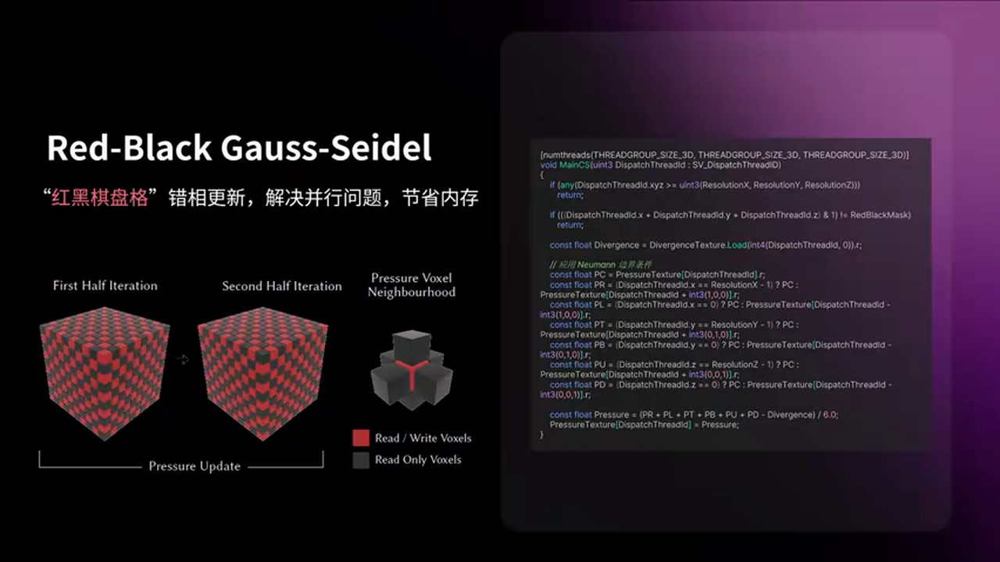

**背景**：最早的 Gauss-Seidel 是在 CPU 上实现的，存在串行问题导致并行被打断。

**Red-Black 改进**：通过棋盘式（红黑）的更新模式，交错更新，解决了并行问题。

**最典型特征**：只使用一张纹理（更省内存），意味着性能更好。

### 4.3 迭代次数对效果的影响


对比 25 次迭代到 3 次迭代的效果：

1. **随着迭代次数降低**：场会更快进入静止，更快耗散掉
2. **频率信号不同**：迭代不够时，压强无法保证整个系统无散

> **经验值**：对于游戏应用，大约 **5 次迭代** 就已经差不多了。

### 4.4 多重网格法（Multigrid）


**核心思想**：在有限次迭代的前提下，更好地处理不同频率的细节。

**七步原型（可优化为五个 Pass）**：

1. **Pre-Smoothing**：在精细网格上进行少量松弛迭代，收敛高频误差
2. **计算残差**
3. **Restriction**：把残差投射到更粗糙的网格上（低频变高频）
4. **粗网格迭代**：在粗网格上迭代修正项
5. **Prolongation（延展）**：插值回精细网格
6. **Post-Smoothing**：消除插值引入的新高频信号
7. **得到结果**

**实现优化**：红色部分是压力求解器，黄色部分是算子，可以把黄色部分合并成一个管线，最终只需要 5 个 Pass。

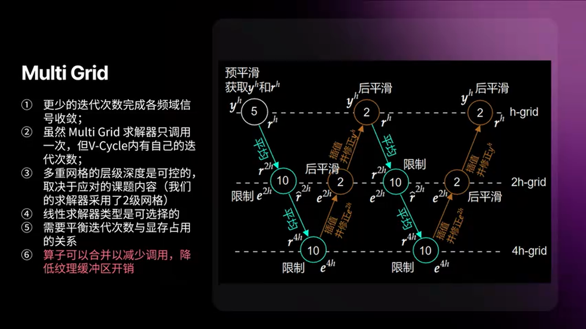

可以配置迭代深度，但实际上只做了两层（全分辨率 + 半分辨率）就足够了。

### 4.5 泊松滤波（预计算卷积核）


**核心观点**：压力求解器本质上是对散度的处理，这个过程和图像卷积类似。

**思路**：
- 把 Jacobi 的迭代过程预计算，递推展开
- 最终得到迭代结果和周围散度的权重关系（卷积核）
- 运行时只需要进行一次采样

**优势**：压力求解器的性能取决于卷积核的大小（即迭代次数），而非实际迭代。

### 4.6 性能对比

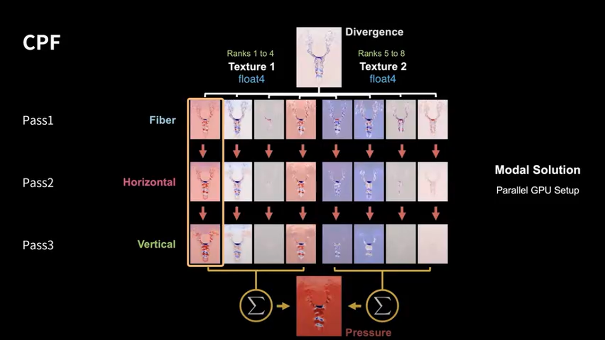


**2D 对比**：
- 5 次 Jacobi 迭代 ≈ 1 次 2D 泊松滤波（效果一致）
- 泊松滤波性能更好约 0.03ms

**3D 对比**：
- 5 次 3D Jacobi：**6ms**
- Multigrid (1-2-1)：**4.14ms**
- Multigrid (2-1-2)：**~5ms**
- Red-Black Gauss-Seidel：**3.84ms**
- 泊松滤波：**1.23ms**（等效 32 次 Jacobi 迭代）

> **性能结论**：泊松滤波在 3D 模拟中性能最优，1.23ms 实现了等效 32 次 Jacobi 迭代的效果。配合 2ms 左右的体积渲染，4ms 的总预算在游戏中是可以接受的。

---

## 五、UE5 实现架构

### 5.1 程序分层设计

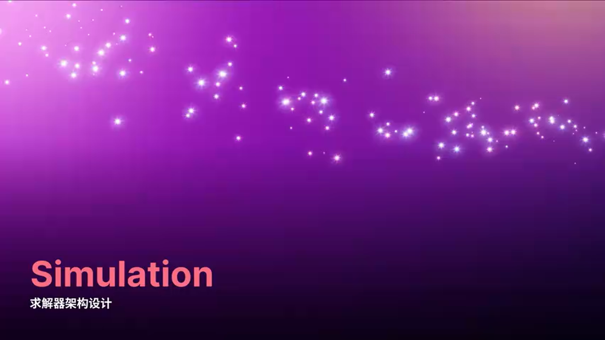


按照现行的思路，程序分为三层：

**第一层：Operator（算子）**
- 代表某种数学操作或流场结构
- 例：散度（∇·）、梯度（∇）、拉普拉斯算子（∇²）、平流

**第二层：Solver（求解器）**
- 主动求解的数值过程
- 求解线性方程组
- 复杂求解器可以由简单算子和基础求解器串联而成（如 Multigrid）

**第三层：Simulator（模拟器）**
- 所有算子、求解器、逻辑代码和辅助程序
- 最终组成 StableFluids2D 或 StableFluids3D

### 5.2 计算着色器类设计


**设计思路**：
- 给每一个算子和求解器设定一个计算着色器类
- 所有算子基于同一个公共基类派生
- 所有求解器也基于同一个公共基类派生

**基类处理的通用逻辑**：
- 线程组配置
- 边界条件
- 编译环境设置

**子类职责**：
- 设置着色器参数结构
- 每个着色器配有一个 Dispatch 方法
- 将计算着色器管线添加到执行图中

### 5.3 模拟管线流程

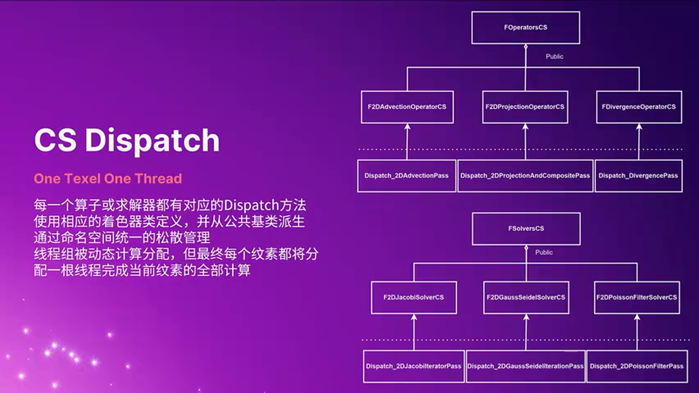

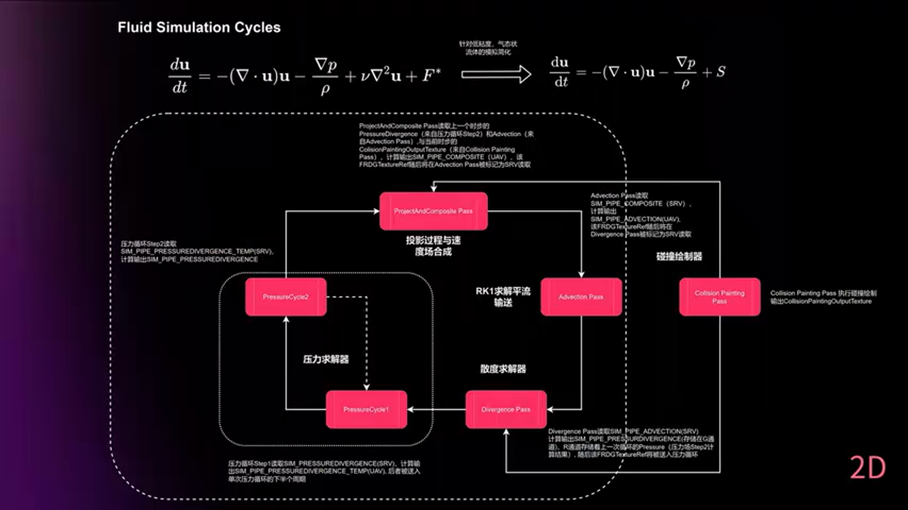


**2D 模拟流程**：
1. 涡力生成计算
2. 平流
3. 散度计算
4. 压力求解
5. 投影
6. 混入当前帧的场
7. 碰撞的绘制场
8. 完成下次循环

### 5.4 使用 EnqueueRenderCommand 的灵活实现

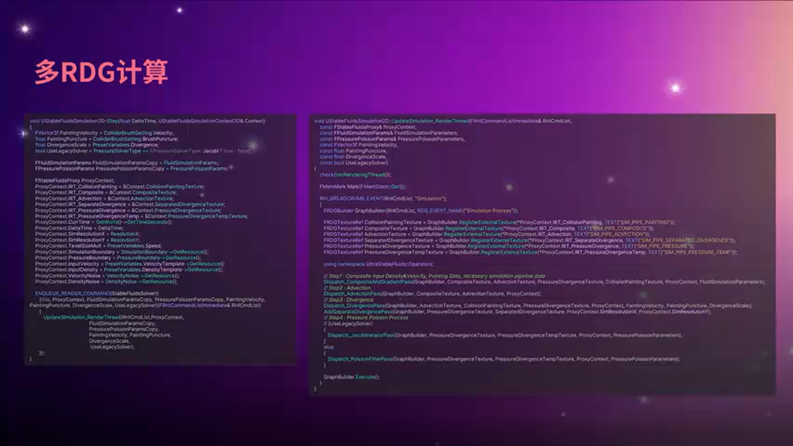

**传统方式**：Component → Scene Proxy → Scene Info → 渲染线程管线（代码量大）

**灵活实现**：直接在 Component 层通过 `EnqueueRenderCommand` 和小型 RDG Builder 完成：
- 资源注册
- 计算着色器管线添加
- Memory Barrier 转换
- 显式调用 Execute

**好处**：
- 代码全部放到 Component 层
- 只需在 Enqueue 之前显式拷贝内存
- 保证逻辑线程和渲染线程的数据独立性

**注意事项**：需要更严谨地注意内存独立性和线程间数据传递。

### 5.5 3D 模拟特殊处理：障碍物


对于 3D 烟雾模拟，如果有角色穿过，需要处理**障碍物**（Obstacle）：

1. 计算障碍物的 **Mask** 和 **Velocity**
2. 在求散、求压力、投影过程中判断邻域信息来源
3. 区分物理场数据和固态网格数据

**3D 模拟管线**：
1. 计算障碍物 Mask 和 Velocity
2. 计算外力
3. 平流
4. 求散度
5. 计算压力
6. 投影得到无散速度场
7. 平流密度

### 5.6 调试工具

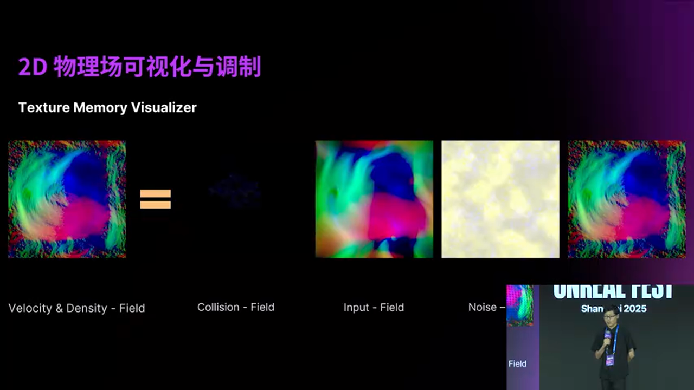


**2D 调试**：Texture Memory Visualizer，可视化各个 RT 的数据。


**3D 调试**：独立的小型渲染器，通过 Raymarching Demo 可视化 3D 物理场。

---

## 六、交互系统设计

### 6.1 2D 交互：射线检测


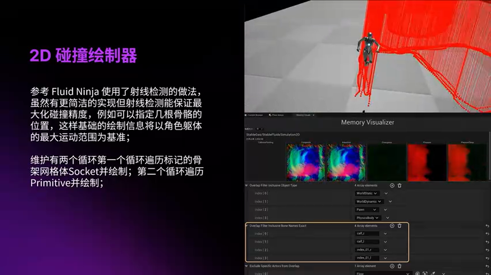

**为什么选择射线检测而非简单交囊体**：
- 射线检测可以直接定位到骨骼网格体的每一个 Socket 上
- Socket 的活动范围与美术绑定的蒙皮活动范围相关
- 能够保证较高的交互精度上限

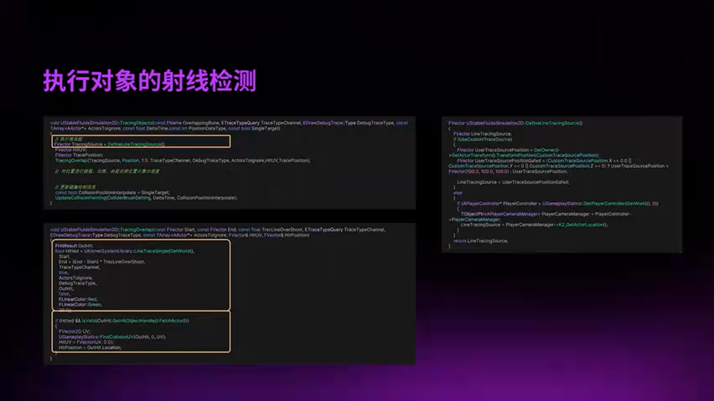

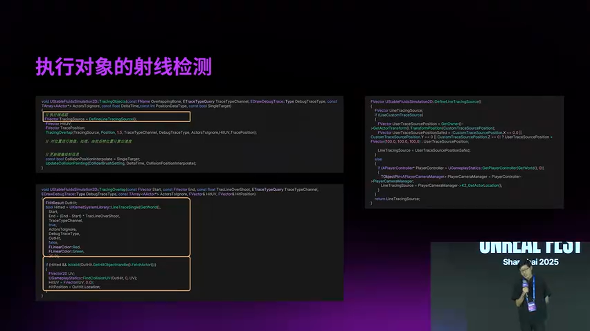

**实现细节**：
- 定义射线源（射线机视角或上帝视角）
- 调用 UE 的射线检测库
- 获取 `FHitResult` 结构
- 使用 `FindCollisionUV` 函数得到 0-1 的 2D UV 数据
- 用于 Simulation Space 的采样

**注意**：`FindCollisionUV` 只能用于三角形面（平面），不能用于 Collision。

### 6.2 3D 交互：两种方案

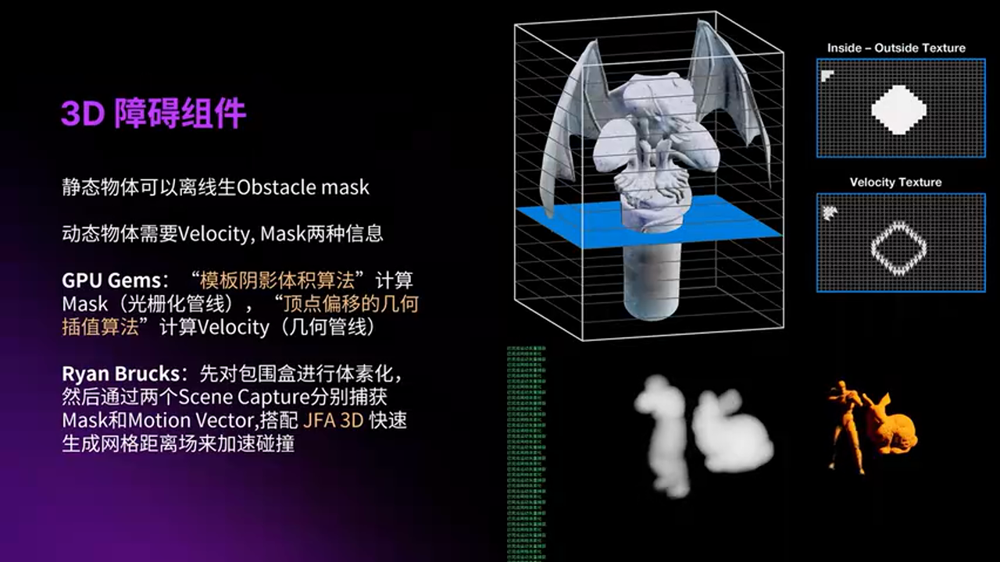

**方案 A：GPU Stance（光栅化管线）**
- 通过光栅化管线算出 Mask
- 通过 Geometry Pass 插值出速度
- 参考 2024 年 Unreal Circle 上的 `AddDynamicMeshPass` 方法
- 要求网格是**水密的**，且可能需要配置简化代理网格

**方案 B：体素化 + Scene Capture**
- 对模拟区域或角色包围盒进行体素化
- 通过两个 Scene Capture 分别捕获 Mask 和 Motion Vector
- 使用 **3D 跳洪算法** 生成网格距离场

---

## 七、体积渲染技术

### 7.1 Single Volume 第二代架构

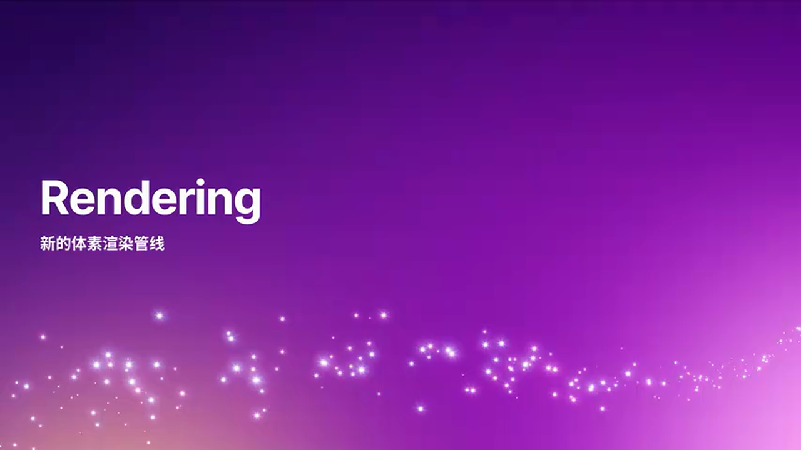


流体求解器最终输出一个**平流密度场的 RenderTarget**，渲染由 **Single Volume** 插件实现。

Single Volume 第二代统一了各个体积介质：
- 云
- 烟雾
- 火焰

允许对 Raymarching 过程进行局部定制（如黑洞等特殊用例）。

### 7.2 引擎渲染管线扩展


Single Volume 通过 Scene Volume 的 Scene Intent 扩展引擎内部的延迟渲染器。

**可复写的虚函数位置**（黄色部分）：
- Base Pass 之后、Translucent Scene 之前
- Translucent Scene 之后、Post Process 之前

通过 `FPostOPakParameters` 结构可以拿到场景的 Texture、Global Distance Field、Scene Volume Info 等数据。

### 7.3 Raymarching 设计哲学

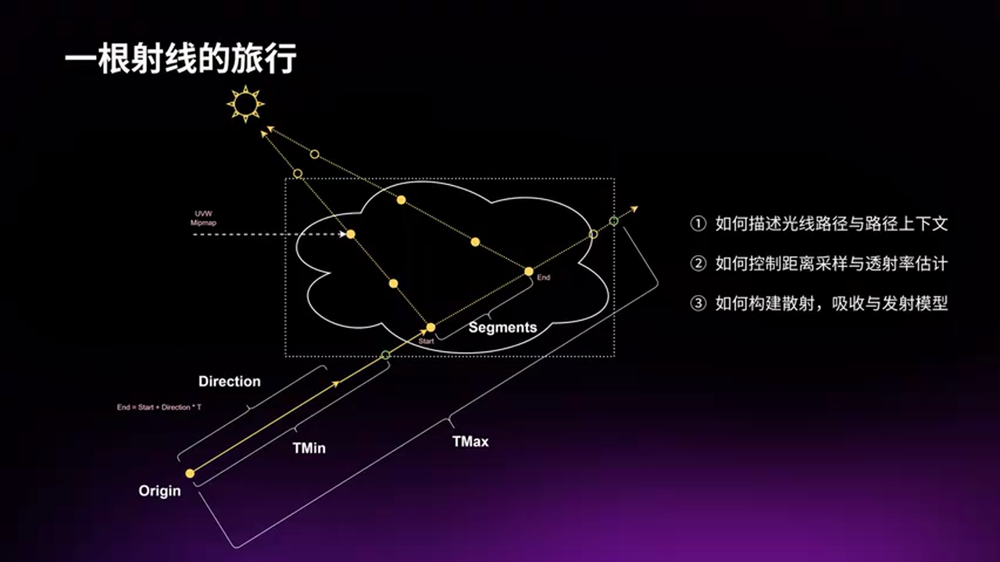

不管是 Raymarching、光线追踪还是其他方式，核心讨论三个问题：

1. **光线路径和上下文描述**
2. **距离采样和透射率估计**
3. **内散射、吸收和发射模型构建**

### 7.4 两种 Raymarching 方式对比

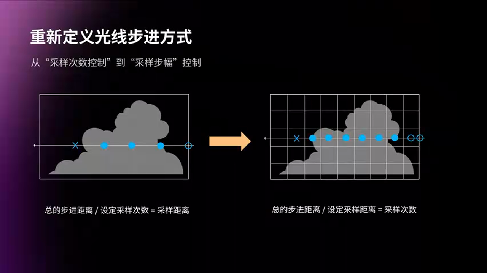

**方式 A（传统）**：已知步进距离 ÷ 循环次数 = 单次步进步幅

**方式 B（推荐）**：已知步进步幅 → 求得循环次数

**为什么方式 B 更灵活**：

涉及到 **Nyquist 采样频率** 概念——保证结构精度的频率极限。

- 如果单个 Voxel 的对角长度作为 Nyquist 频率
- 单次步进小于等于该值时，每次步进都能采样到对应 Voxel 的数据
- 可以认为密度场的构建是 **Unbias** 的

调大步幅可以牺牲细节换取性能，方式 B 提供了这种灵活性。

### 7.5 分离式渲染优化


回看体积渲染方程，可以总结四个规律：

1. 内散射计算可以从主积分中抽离
2. 内散射和透射场可以分离
3. 可以把积分过程拆开（单重积分比双重积分快）
4. 烟雾颗粒弥散到包围盒内，允许坐标系灵活设计


**优化方案**：引入低频 **Lighting Voxel Grid**

- 比原本密度的 Grid 更粗糙
- 光照频率实际上比结构更低频，可以接受
- 只需两个 Pass，每个 Pass 执行单次积分
- 比一次完成双重/三重积分快很多

### 7.6 三种渲染模式

**模式 1：分离内散射场**
- 先执行内散射估计，再执行距离采样
- 多光源性能最好
- 适合烟雾远景渲染（穿过烟雾的视角）

**模式 2：分离透射场**
- 允许使用方向散射（米氏散射、瑞利散射等）
- 保留 Silver Lighting Feature（云的边缘光效果）
- 适合地面视角看天上的云

**模式 3：直接对 RT 积分**
- 边采样边积分
- 最简单直接

### 7.7 2.5D 体积渲染

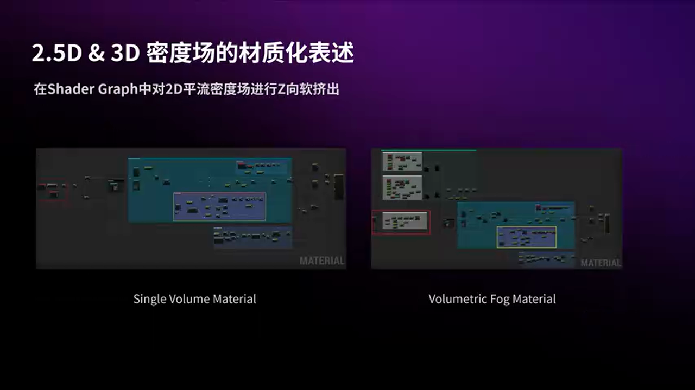

对于 2D 模拟，密度场是 2D 的，但渲染需要做挤出得到 2.5D 效果。

具体挤出算法没有标准，取决于 TA 对流体模拟的理解和视觉表达的把握。

3D 模拟则直接渲染 3D 密度场。

---

## 八、性能数据与实战对比

### 8.1 案例性能数据

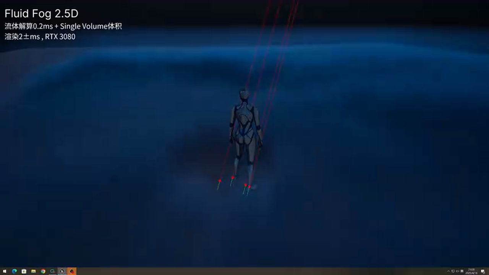

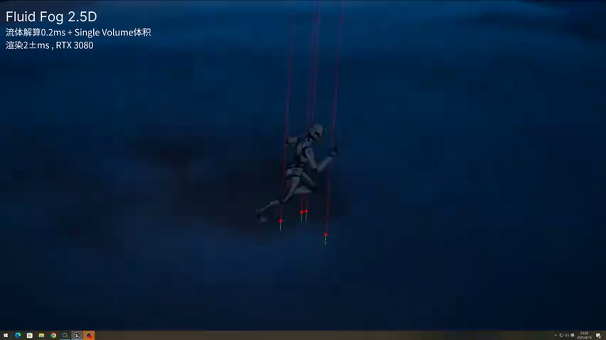


在测试案例中：
- 流体求解：**~0.2ms**（2D）或 **~1.23ms**（3D 泊松滤波）
- 体积渲染：**~2ms**
- 总计：**~4ms** 预算在游戏中可接受

### 8.2 与 Fluid Ninja 的对比


**Fluid Ninja**（另一款流体模拟插件）：
- 全部用蓝图实现
- 开发者是完美主义者，能用蓝图绝不用 C++

**Ultra Stable Fluids**：
- 全部用 C++ 和计算着色器
- 设计上更优雅
- **关键优势**：支持 3D 模拟和 3D 渲染


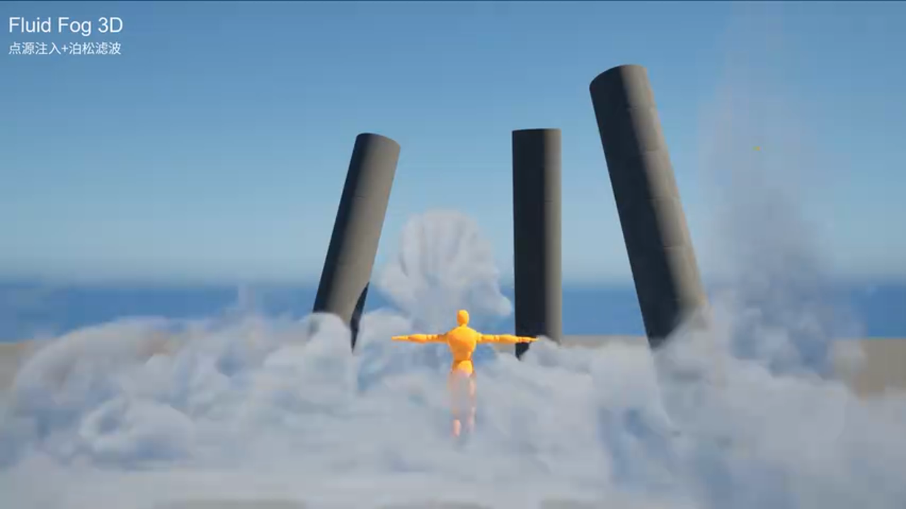

上图展示了点源注入 + 3D 泊松滤波 + 体积渲染的效果。

### 8.3 多光源支持

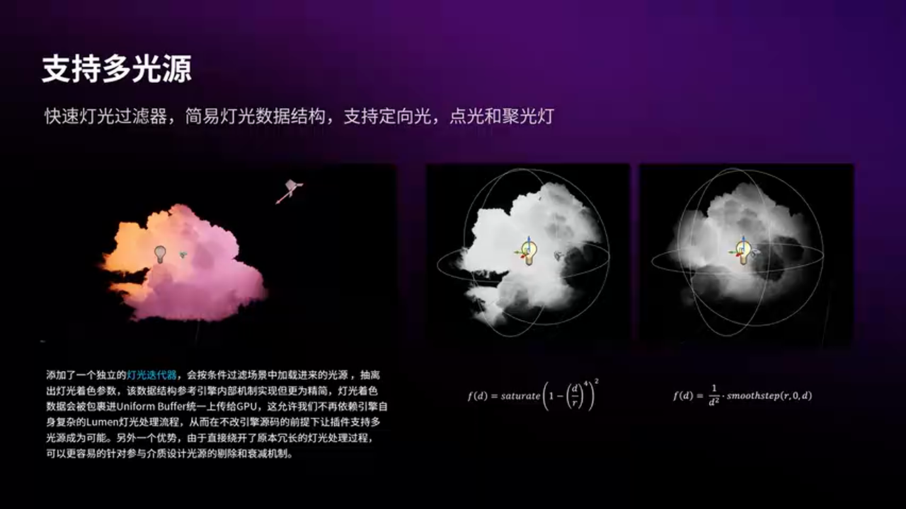

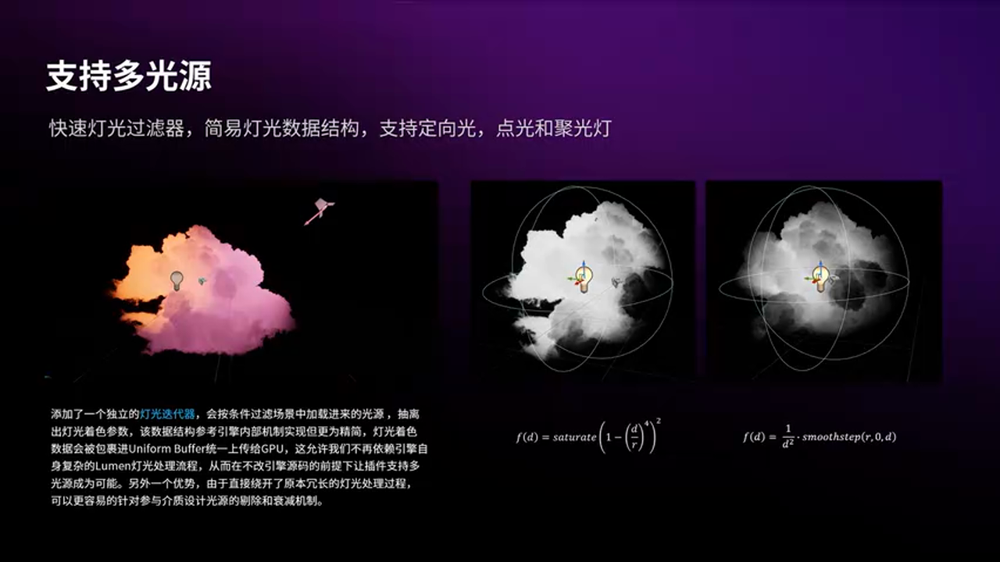

可以给插件增加小型灯光剔除器：
- 参考引擎内部机制
- 数据结构更精简
- 专门为体积介质设计剔除和衰减
- 支持定向光、点光（球形衰减）、聚光灯（内外扩散角）
- 可通过曲线控制衰减模式

---

## 九、彩蛋：神经网络多散射

### 9.1 传统多散射的挑战


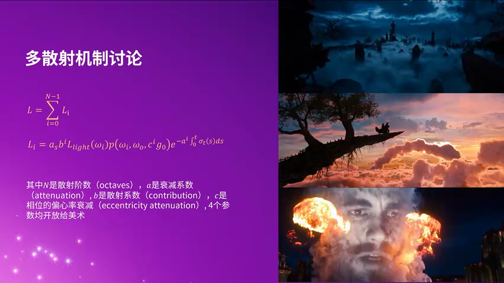

体积渲染中，**多散射**（Multiple Scattering）是实现高品质效果的关键：
- 更好的效果
- 更高频的阴影细节
- 但意味着更高的计算开销

传统方案来自迪士尼动画工作室和索尼图形图像，特点是不仅能用于云，也能用于烟雾/火焰的多散射模拟。

### 9.2 神经网络方案


**核心思路**：把原本模式化的多阶散射过程通过**深度神经网络**替换，直接对最终颜色进行拟合。


**实时效果**：512 阶散射在虚幻引擎内的实时表现，光源是动态变化的。


**性能提升**：
- 原本离线渲染：10+ 小时/帧
- 神经网络推理：**几毫秒**（消费级显卡）

### 9.3 技术路线与展望

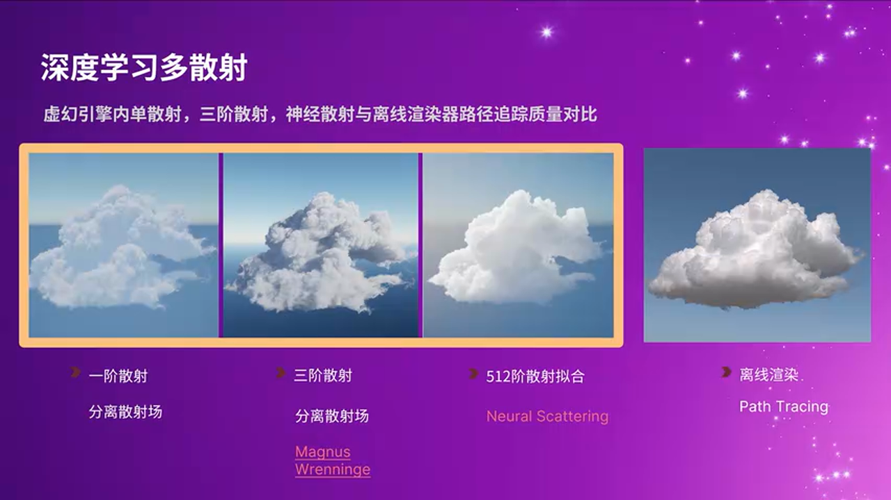

**当前差距**：
- AO（环境光遮蔽）
- 环境光

**设计目标**：
- 不受芯片限制（NVIDIA、AMD 都能跑）
- 神经推理和散射估算全部用计算着色器实现

**性能指标**：
- 1/4 分辨率渲染 + 上采样 + 时序混合
- 控制在 **4ms** 以内

> **展望**：如果进展顺利，明年可能会分享具体实现细节。

---

## 十、总结与最佳实践

### 10.1 技术选型建议

**适合使用 Ultra Stable Fluids 的场景**：
- 实时游戏中的烟雾、火焰效果
- 需要角色/物体与烟雾交互
- 对性能有严格要求（4ms 预算内）

**不适合的场景**：
- 需要精确液体模拟（飞溅、水面）
- 离线影视级渲染

### 10.2 性能优化清单

1. **压力求解器选择**：优先使用泊松滤波，其次是 Red-Black Gauss-Seidel
2. **迭代次数**：游戏应用 5 次足够，追求效果可增加
3. **体积渲染**：使用分离式渲染，根据场景选择合适模式
4. **分辨率**：考虑 1/4 分辨率 + 上采样
5. **网格大小**：根据实际需求选择 64³ ~ 256³

### 10.3 避坑指南

1. **内存管理**：注意逻辑线程和渲染线程的数据独立性
2. **边界条件**：周期边界 vs 实体边界的选择
3. **障碍物处理**：3D 模拟中确保 Mask 和 Velocity 正确计算
4. **调试工具**：善用 Texture Memory Visualizer 和 3D 物理场可视化工具
5. **交互精度**：射线检测只能用于三角形面，不能用于 Collision

---

## 参考资源

- **Single Volume 插件**：[GitHub/虚幻商城]
- **Ultra Stable Fluids 插件**：[GitHub/虚幻商城]
- **Torch4VDB**：OpenVDB 流程工具
- **技术白皮书**：各插件配套蓝皮书
- **原始视频**：https://www.bilibili.com/video/BV1C5sKzeEnD


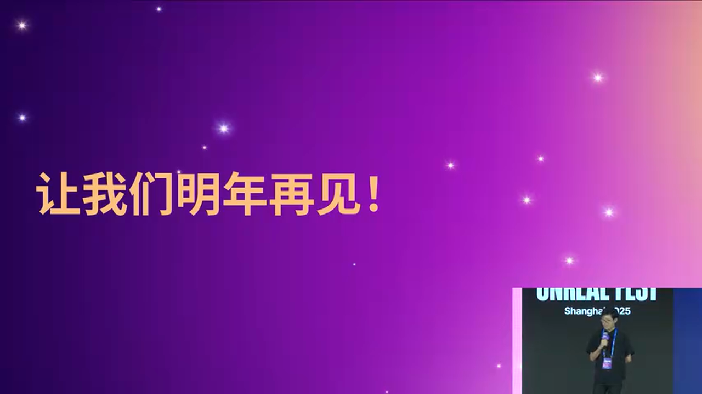


---

**谢谢大家！**

如果进展顺利，明年再见，届时将分享神经网络多散射的具体实现细节。


