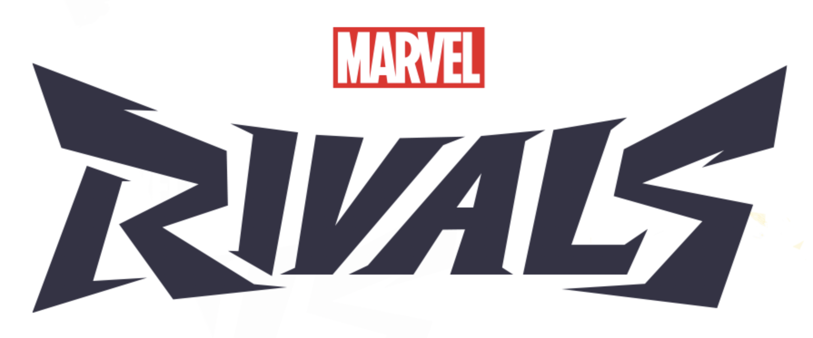
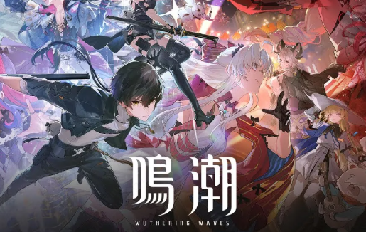
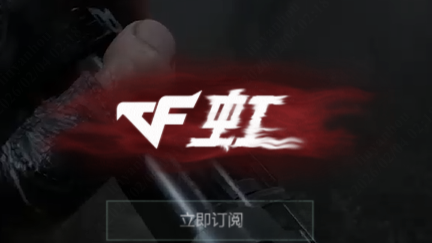
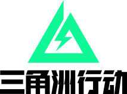
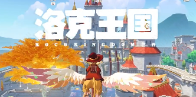

# 虚幻引擎技术文档库

!!! example "UE5 开发者必备资源"

    :material-book-open-variant: 汇集虚幻引擎各大技术峰会的演讲文字总结
    
    :material-magnify: 支持全文搜索，快速定位技术要点
    
    :material-gift-outline: **免费** · **中文** · **全面** · **持续更新**

-   :material-file-document-multiple:{ .lg } **52+**
    
    篇深度技术文章

-   :material-folder-star:{ .lg } **11**
    
    个技术领域

-   :material-image-multiple:{ .lg } **5000+**
    
    张演讲截图

-   :material-account-group:{ .lg } **AI+人工**
    
    确保内容准确

---

## :video_game: 涉及游戏项目

  <a href="uf2025-shanghai/project-cases/marvel-rivals-gas/" style="display: flex; flex-direction: column; align-items: center; padding: 1rem; background: #fff; border: 1px solid rgba(102,126,234,0.2); border-radius: 12px; text-decoration: none;">
    

      
    

    NetEase
    GAS技能系统 · 网络同步
  </a>
  <a href="uf2025-shanghai/rendering/wuthering-waves-raytracing/" style="display: flex; flex-direction: column; align-items: center; padding: 1rem; background: #fff; border: 1px solid rgba(102,126,234,0.2); border-radius: 12px; text-decoration: none;">
    

      
    

    库洛游戏
    移动端光追 · 二次元渲染
  </a>
  <a href="uf2025-shanghai/project-cases/cf-rainbow/" style="display: flex; flex-direction: column; align-items: center; padding: 1rem; background: #fff; border: 1px solid rgba(102,126,234,0.2); border-radius: 12px; text-decoration: none;">
    

      
    

    腾讯
    程序化生态 · 场景生成
  </a>
  <a href="uf2025-shanghai/rendering/delta-force-gi/" style="display: flex; flex-direction: column; align-items: center; padding: 1rem; background: #fff; border: 1px solid rgba(102,126,234,0.2); border-radius: 12px; text-decoration: none;">
    

      
    

    腾讯
    全局光照 · 跨平台GI
  </a>
  <a href="uf2025-shanghai/project-cases/one-piece-rd/" style="display: flex; flex-direction: column; align-items: center; padding: 1rem; background: #fff; border: 1px solid rgba(102,126,234,0.2); border-radius: 12px; text-decoration: none;">
    

      
    

    Bandai Namco
    ACT工业化 · 高频迭代
  </a>
  <a href="uf2025-shanghai/performance/locke-kingdom-mobile-pipeline/" style="display: flex; flex-direction: column; align-items: center; padding: 1rem; background: #fff; border: 1px solid rgba(102,126,234,0.2); border-radius: 12px; text-decoration: none;">
    

      
    

    腾讯
    移动端渲染 · 性能优化
  </a>

---

## :material-star-shooting: 精选活动

-   :material-calendar-star:{ .lg .middle } **UF2025 Shanghai**

    ---

    <b>Unreal Fest 2025 上海站</b> - 虚幻引擎嘉年华
    
    引擎功能 · 性能优化 · 渲染技术 · 移动开发 · 项目实战

    [:octicons-arrow-right-24: 立即查看](uf2025-shanghai/index.md){ .md-button .md-button--primary }

-   :material-gamepad-variant:{ .lg .middle } **GDC2025**

    ---

    <b>Game Developers Conference 2025</b>
    
    全球最大的游戏开发者会议技术分享

    [:octicons-clock-24: 即将推出](gdc2025/index.md){ .md-button }

---

## :fire: 热门推荐

| 热度 | 文章 | 标签 | 
|:---:|------|------|
| :star::star::star: | [:octicons-arrow-right-24: 漫威争锋 GAS 技能架构](uf2025-shanghai/project-cases/marvel-rivals-gas.md) | `GAS` `技能系统` `网络同步` |
| :star::star::star: | [:octicons-arrow-right-24: 鸣潮移动端光追实现](uf2025-shanghai/rendering/wuthering-waves-raytracing.md) | `光线追踪` `移动端` `二次元` |
| :star::star: | [:octicons-arrow-right-24: UE5.7 Preview 新功能](uf2025-shanghai/engine-features/ue5.7-preview.md) | `UE5.7` `新特性` |
| :star::star: | [:octicons-arrow-right-24: 跨平台性能优化](uf2025-shanghai/performance/cross-platform-optimization.md) | `性能优化` `Profiling` |
| :star: | [:octicons-arrow-right-24: PCG 程序化地牢生成](uf2025-shanghai/pcg/dungeon-generation.md) | `PCG` `程序化生成` |

---

## :material-heart: 支持项目

!!! success ""

    :star: 如果对你有帮助，请在 **[GitHub](https://github.com/wlxklyh/ufbook)** 点个 Star 支持一下！
    
    
    

---

## :fontawesome-brands-weixin: 加入技术社区

-   :material-qrcode:{ .lg .middle } **扫码入群**

    ---

    { width="180" }

    添加微信 **wlxklyh**，备注「UE5技术交流」

-   :material-account-multiple:{ .lg .middle } **社区福利**

    ---

    - :material-chat-question: 技术问题实时解答
    - :material-folder-open: 一线项目经验分享
    - :material-book-open-variant: 独家学习资源
    - :material-briefcase: 行业动态与招聘
    
    **目标：500人高质量UE5技术社区！**

---

本站内容基于各技术峰会官方公开演讲视频整理，仅供学习交流使用。

