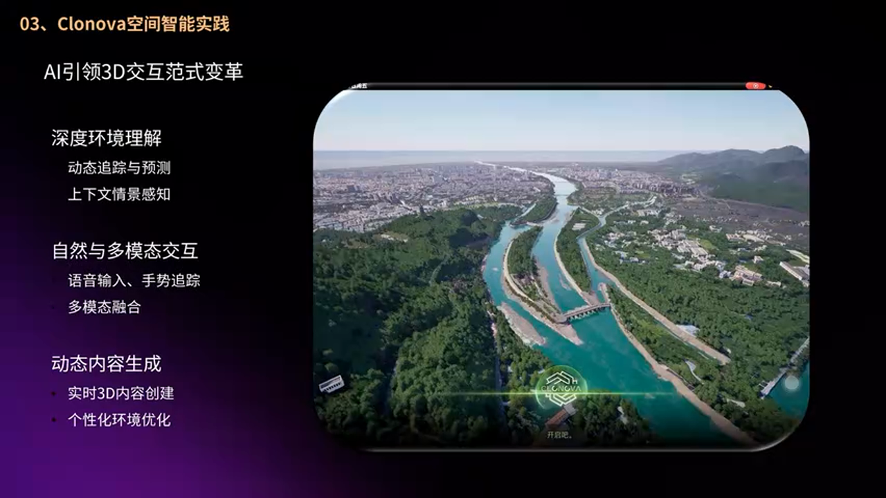
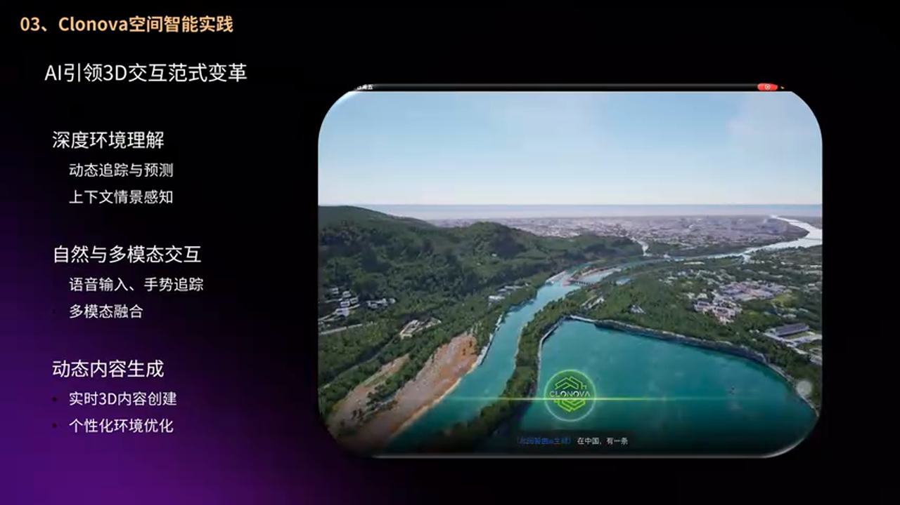
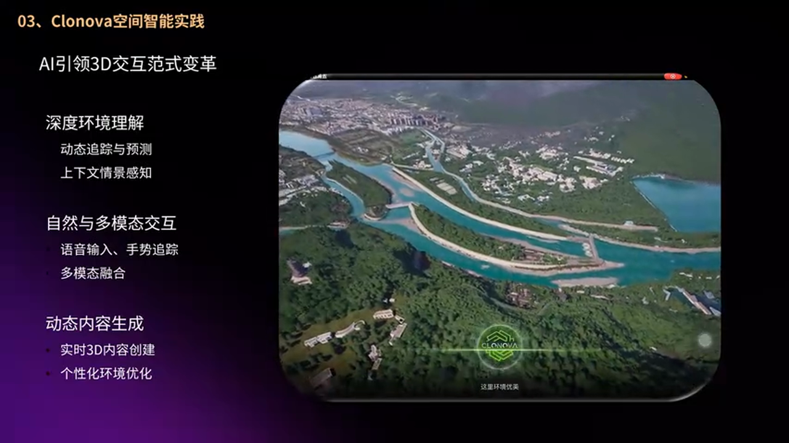
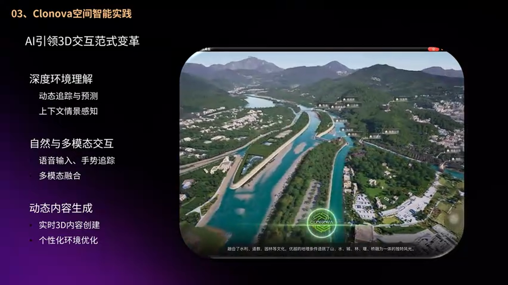
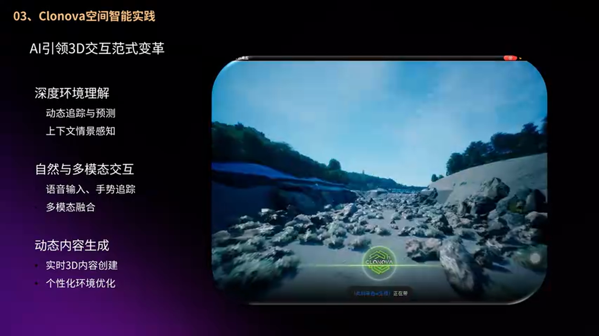
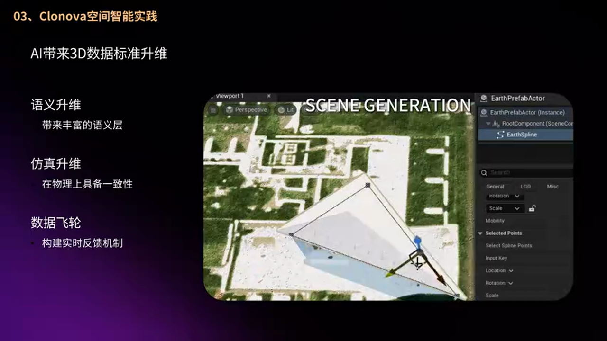
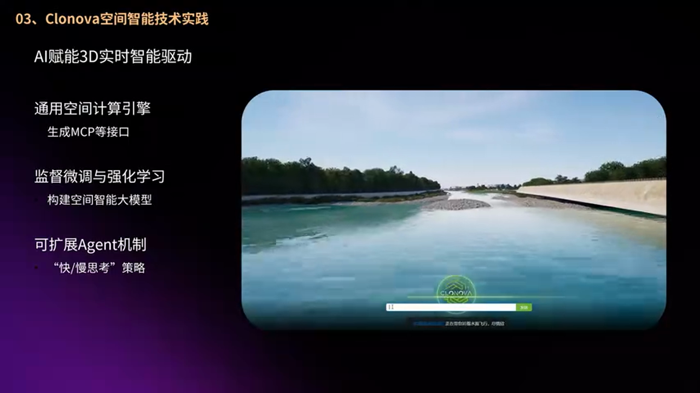
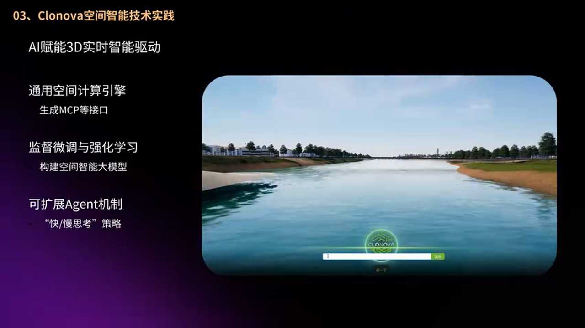
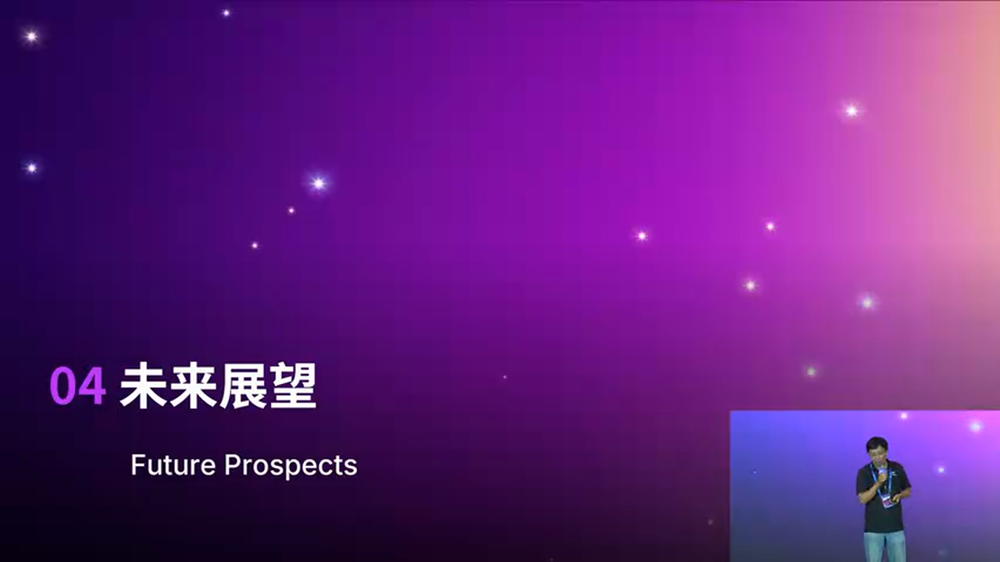

# 空间智能的技术路径与落地实践：51WORLD Clonova 平台深度解析

---


## 加入 UE5 技术交流群

如果您对虚幻引擎5的图形渲染技术感兴趣，欢迎加入我们的 **UE5 技术交流群**！

扫描上方二维码添加个人微信 **wlxklyh**，备注"UE5技术交流"，我会拉您进群。

在技术交流群中，您可以：
- 与其他UE开发者交流渲染技术经验
- 获取最新的GDC技术分享和解读
- 讨论图形编程、性能优化、构建工具流、动画系统等话题
- 分享引擎架构、基建工具等项目经验和技术难题

---

**源视频信息**
- **视频标题**: [UFSH2025]虚幻的场景有真意: 51Clonova空间智能的演进 | 侯涛 51WORLD 算法组研发经理
- **视频链接**: https://www.bilibili.com/video/BV1XdsNz2EVQ
- **视频时长**: 约30分钟
- **AI生成说明**: 本文基于AI技术对视频内容进行整理和深度解析，结合截图进行图文并茂的呈现。

---

> **导读摘要**
> 
> - 空间智能是数字世界与物理世界双向融合的关键技术，将在具身智能、自动驾驶、可穿戴设备等领域发挥重要作用
> - 虚幻引擎凭借照片级渲染、物理引擎、开源特性和海量三维资产，成为空间智能训练的理想平台
> - 51WORLD Clonova 平台通过自然语言交互、多 Agent 协作、快慢思考策略，实现了空间智能的工程化落地
> - 前置知识：虚幻引擎基础、AI Agent 概念、强化学习基本原理

---

## 一、背景：从自然语言智能到空间智能的跨越

### 1.1 当前 AI 发展的"空间缺失"


三年前，ChatGPT 引爆了自然语言大模型的革命，无论是写作、编程还是创意生成，自然语言 AI 已经深入我们的日常工作。文生图（Text-to-Image）和文生视频（Text-to-Video）技术也在这两年取得了巨大进步。

然而，对于从事游戏、娱乐、多媒体或数字孪生应用的开发者来说，一个显著的问题是：**智能在三维空间中的缺失**。


造成这一现象的核心原因在于**数据规模的差距**：

- 自然语言和图像数据具有互联网级别的海量规模
- 三维数据相比之下至少差两个数量级
- 缺乏足够的三维训练数据，导致空间智能发展受限

> **关键洞察**：空间智能的发展有待于行业共同努力，将这个市场前景巨大的智能领域推向更美好的未来。

### 1.2 空间智能的本质：虚实共生

空间智能不仅仅是在数字世界里进行创建和使用，它实际上要延伸到物理世界中来。典型的应用场景包括：

- **具身智能**：人形机器人
- **自动驾驶**：无人驾驶汽车
- **可穿戴设备**：AR/VR 设备


空间智能的核心能力包括：**感知、理解、推理、规划、生成、交互、操作**。最终目标是将在虚拟空间中训练好的智能迁移到物理世界中来，实现数字世界与物理世界的双向融合。

---

## 二、空间智能的技术路径：四阶段演进

### 2.1 阶段划分


根据51WORLD的经验，空间智能的发展可以分为四个阶段：

**阶段一：虚拟环境生成**
- 在数字空间/计算机环境中生成虚拟环境
- 包括服务端、终端和边缘设备
- 这是大家日常工作中最熟悉的部分

**阶段二：感知仿真**
- 传感器仿真（Sensor Simulation）
- 在数字世界中模拟摄像头、激光雷达、毫米波雷达等
- 为自动驾驶等应用提供训练数据

**阶段三：生成式 AI**
- 文生图、文生视频和世界模型
- 通过文字或操作实时创造场景
- 运行时生成，而非预先创建

**阶段四：虚实迁移**
- 将数字世界的智能能力迁移到现实世界
- 这是最具挑战性的阶段

### 2.2 虚实迁移的工程挑战

将数字世界的智能迁移到物理世界并非想象中那么简单。一个典型的例子是**坐标系统的对齐**：

- 数字世界的坐标系：左手/右手坐标系需要一致
- 原点位置：数字世界通常在场景中心，物理世界的原点在哪里？
- 单位制：数字世界常用厘米，物理世界用米


这些看似简单的问题，在工程落地时会带来大量的适配工作。

---

## 三、虚幻引擎在空间智能中的核心价值

### 3.1 为什么选择虚幻引擎？


虚幻引擎作为空间智能训练平台具有独特优势：

**训练场与测试场的双重角色**

游戏引擎是 AI 训练的理想场所，原因在于：
- 可以灵活设定难度等级和中间阶段
- 容易计算分数（强化学习的奖励函数）
- 两个 AI 可以互相 Battle，形成对抗训练

这种机制可以形成**技术与产品的闭环**：技术进步 → 产品推出 → 用户反馈/分数 → 训练数据 → 提升空间智能得分。

### 3.2 虚幻引擎的核心特性


从 UE 5.6 到 5.7，虚幻引擎的特性正好吻合空间智能训练的需求：

**渲染能力**
- 照片级渲染质量
- Nanite、Lumen 等先进技术
- 光影效果真实

**物理引擎**
- 流体模拟
- 柔体/刚体碰撞
- 摩擦、重力等物理规律

这些特性恰恰是当前空间智能模型所欠缺的——AI 生成的视频有时会出现"穿帮镜头"，正是因为反映客观世界物理规律的训练数据偏少。

**开放性与可扩展性**
- 蓝图系统易于扩展
- 开源特性便于定制
- 方便编写奖励函数和评分逻辑

**海量三维资产**
- 从1990年代至今积累的海量资产
- 虚幻商城实现资产共享
- 虽然比互联网级别的文本图像差两个数量级，但已是三维数据中的佼佼者

---

## 四、51WORLD Clonova 平台技术架构

### 4.1 平台定位


51WORLD 作为一家专注于数字孪生和空间智能的公司，开发了 **Clonova 空间智能平台**。该平台的核心目标是：

- 突破传统鼠标键盘的输入方式
- 实现自然语言与三维空间的交互
- 在文旅、水利、交通等行业落地应用

### 4.2 技术架构概览


Clonova 平台的技术架构包含以下核心模块：

**数据层**
- 地理空间数据
- 三维模型资产
- 语义标注数据

**模型层**
- 大语言模型（LLM）
- 视觉模型
- 空间理解模型

**应用层**
- 自然语言交互界面
- 多模态输入处理
- 场景渲染与展示

### 4.3 MCP Server 与 API 架构



Clonova 采用了基于服务的 API 连接架构：

- API 背后是大模型
- 通过 MCP（Model Context Protocol）Server 提供 API
- 支持流式传输，实现实时画面呈现
- 支持 PC、Mobile、PAD 等多端体验

```
[客户端] <--流式传输--> [MCP Server] <--API调用--> [大模型]
```

### 4.4 传统工具与 AI 的融合


Clonova 平台的一个重要设计理念是：**AI 能力与传统工具的互补**。

在多智能体（Multi-Agent）架构下，可以通过 A2A（Agent-to-Agent）协议调用传统的成熟工具，这对现有 AI 能力是很好的补充，能够增强用户体验。

---

## 五、核心技术深度解析

### 5.1 自然语言驱动的 3D 交互



Clonova 的核心创新之一是**自然语言驱动的 3D 交互**。以四川都江堰文旅场景为例：

> "你好，我是 Clonova，你也可以叫我诺娃。我可以带你探索这里。"



系统不仅能被动回答问题，还能主动与用户交流，抛出线索引导用户进行探索。

**交互特点**：
- 突破传统鼠标键盘输入
- 自然语言对话式交互
- 主动式引导与被动式响应结合

### 5.2 都江堰文旅场景实战



在都江堰文旅场景中，Clonova 展示了空间智能的实际应用：


> "在中国有一条2000年前的人工河渠..."
> "今天我们将按以下路线一探究竟，请问是否确认启程？"

系统能够：
- 规划游览路线
- 讲解历史文化背景
- 响应用户的自然语言指令


都江堰三大水利工程（鱼嘴分水堤、飞沙堰、宝瓶口）的讲解，展示了空间智能在文旅场景中的沉浸式体验能力。

### 5.3 研学场景应用



在研学场景中，Clonova 展示了更深层次的交互能力：

- 陌生地点的智能导览
- 文化知识的深度讲解
- 沉浸感与探索兴趣的提升

### 5.4 多场景支持


除了文旅场景，Clonova 还支持：

- **水利行业**：水利设施监控与管理
- **交通行业**：城市交通管理
- **城市管理**：数字孪生城市应用



---

## 六、三维空间表征与训练方法

### 6.1 VM 视觉模型架构


Clonova 的技术架构可以组成一个 **VM（Vision Model）视觉模型**：


核心问题：如何用二维的视觉模型进行三维空间智能的训练？

### 6.2 3D Gaussian Splatting 表征



答案在于 **3D Gaussian Splatting（三维高斯溅射）** 技术：


每一个高斯元记录着：
- **位置信息**
- **形状信息**
- **RGB 颜色**
- **透明度**



51WORLD 建议在此基础上增加**语义标签**，这样通过两阶段训练方法（监督微调 + 强化学习），可以在三维高斯表征的加持下，让空间智能的发展越走越好。

### 6.3 Agent 机制


在应用层面，Clonova 采用了 **Agent 机制**：

**单 Agent 到多 Agent**
- 单一任务由单 Agent 处理
- 复杂任务分解为多 Agent 协作

**快慢思考策略**
- **快思考模式**：需要立即响应的场景
- **慢思考模式**：需要深度思考的复杂问题

这种机制可以通过数据标签让大模型自动选择合适的思考模式，应对用户千变万化的问题。

---

## 七、空间智能的未来展望

### 7.1 评测标准的建立



当前空间智能领域面临的一个挑战是**缺乏统一的评测标准**：

- 自然语言有 MMLU、HellaSwag 等评测
- 数学推理有 GSM8K、MATH 等评测
- 空间智能的评测标准尚未建立


**游戏作为评测场景**的优势：
- 两个 AI 可以互相 Battle
- 难度可调节：智能弱时降低难度，智能强时提高难度
- 分数机制天然适合强化学习

### 7.2 应用模式的变革

未来的 AI 沉浸式应用模式将超越传统的电影、游戏形式：

- **实时生成**的体验内容
- **用户主导**的探索方式
- **自然交互**的沉浸感

### 7.3 开发生态的构建

在虚幻引擎的生态下，空间智能的发展需要：

- 技术交流与经验分享
- 数据交流与资产共享
- 语义（Semantic）内容的标准化
- 应用层面的最佳实践

---

## 八、实战总结与建议

### 8.1 方案对比

**方案 A：传统 3D 交互**
- 优势：技术成熟，用户习惯已形成
- 劣势：学习成本高，交互效率低
- 适用场景：专业用户、复杂建模场景

**方案 B：自然语言驱动的空间智能**
- 优势：零学习成本，交互自然
- 劣势：技术尚在发展，准确性有待提升
- 适用场景：普通用户、导览讲解、快速探索

**方案 C：混合模式**
- 优势：兼顾效率与易用性
- 劣势：系统复杂度增加
- 适用场景：专业用户+普通用户混合场景

### 8.2 避坑指南

**坐标系统对齐**
- 提前确定左手/右手坐标系
- 统一原点定义
- 明确单位制（厘米 vs 米）

**数据质量**
- 三维数据的语义标注至关重要
- 物理规律的准确性直接影响模型效果
- 注意训练数据的多样性

**性能优化**
- 流式传输降低延迟
- 快慢思考策略平衡响应速度与质量
- 多端适配（PC/Mobile/PAD）

**Agent 设计**
- 单一职责原则
- 合理的任务分解
- 完善的错误处理机制

### 8.3 最佳实践

**数据准备**
- 为三维资产添加语义标签
- 建立标准化的数据格式
- 积累领域知识库

**模型训练**
- 采用两阶段训练：监督微调 + 强化学习
- 利用游戏场景进行评测
- 持续收集用户反馈优化模型

**工程落地**
- 采用 MCP Server 架构
- 支持多端部署
- 建立 A2A 协议实现工具集成

---

## 九、结语

空间智能是 AI 发展的下一个重要方向，它将实现数字世界与物理世界的双向融合。虚幻引擎凭借其强大的渲染能力、物理引擎和开放生态，成为空间智能训练的理想平台。

51WORLD 的 Clonova 平台展示了空间智能工程化落地的可行路径：通过自然语言交互、3D Gaussian 表征、多 Agent 协作等技术，在文旅、水利、交通等行业实现了实际应用。

正如演讲者所说：**"虚幻的场景有真意"**——在虚幻引擎构建的虚拟世界中，蕴含着通往物理世界智能化的真实路径。

---

> **延伸阅读**
> - 3D Gaussian Splatting 原理与实现
> - MCP（Model Context Protocol）协议详解
> - 虚幻引擎 5.7 新特性解析
> - 强化学习在游戏 AI 中的应用

---

*本文由 AI 基于 UFSH2025 演讲视频内容生成，如有疏漏请以原视频为准。*


