# 3D Gaussian Splatting 赋能智驾仿真：从场景重建到端到端训练的技术全景

---

## 加入 UE5 技术交流群

如果您对虚幻引擎5的图形渲染技术感兴趣，欢迎加入我们的 **UE5 技术交流群**！

扫描上方二维码添加个人微信 **wlxklyh**，备注"UE5技术交流"，我会拉您进群。

在技术交流群中，您可以：

- 与其他UE开发者交流渲染技术经验
- 获取最新的GDC技术分享和解读
- 讨论图形编程、性能优化、构建工具流、动画系统等话题
- 分享引擎架构、基建工具等项目经验和技术难题

---

> **源视频信息**
> - **标题**: [UFSH2025]新一代场景扫描与重建技术赋能智能辅助驾驶仿真 | 张维维 鲍世强
> - **时长**: 42分钟
> - **视频链接**: https://www.bilibili.com/video/BV1W5mzBAEw3
> - **说明**: 本文由 AI 基于视频内容生成，结合技术深度解析进行了扩展

---

> **导读**
> - 空间智能技术正在重塑自动驾驶仿真领域，**3D Gaussian Splatting** 以其低成本、高真实感的特性成为新一代场景重建的核心技术
> - 混合仿真引擎架构将 3D Gaussian 的静态场景与 UE5 的动态资产相结合，实现了**成本与质量的最优平衡**
> - 从数据采集到算法训练的端到端 Pipeline 打通，为端到端自动驾驶模型提供了**高置信度的仿真环境**

**前置知识要求**：了解 3D 重建基础概念、熟悉 Unreal Engine 基本架构、对自动驾驶仿真有初步认知

---

## 一、背景与痛点：为什么需要新一代场景重建技术

### 1.1 空间智能的崛起

空间智能（Spatial Intelligence）正在成为 AI 领域的新热点。正如 AI 领域的专家所言：**"看见世界远远不够，有了空间智能之后，AI 可以帮助我们去更好地理解这个世界"**。

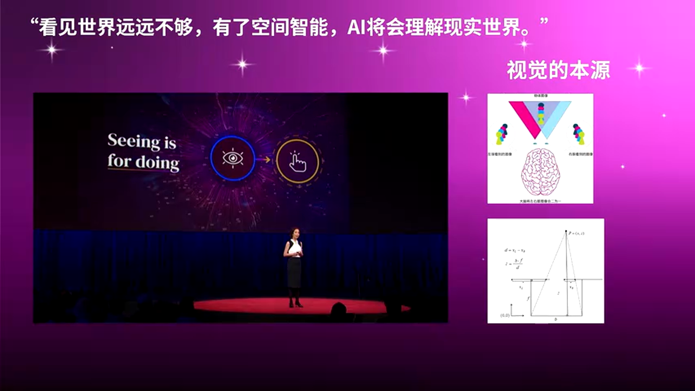
*空间智能技术让 AI 能够理解三维世界*

人类通过双眼的视差来感知深度和空间位置，这种生物视觉原理被应用到计算机视觉领域，催生了多种三维重建技术。

### 1.2 三维场景的应用场景

三维重建技术已广泛应用于多个领域：

*三维重建在多个行业的应用*

**传统测绘领域**
- 通过无人机或街景车快速扫描场景
- 生成三维场景数据用于测绘分析

**影视动画行业**
- 扫描真实场景作为虚拟背景
- 《黑悟空》等游戏大作使用此技术采集场景数据

**自动驾驶仿真**
- 构建城市道路的三维模型
- 训练和测试自动驾驶算法

**高精度地图**
- 为自动驾驶提供精确的地图数据
- 支持车道级定位和导航

### 1.3 传统方案的局限性

现有的三维模型生产方式主要依赖**人工建模**——通过美术人员在电脑上手动创建，再通过贴图实现高保真效果。

*传统的三维模型生产流程*

> **核心痛点**
> - 这是一个**劳动密集型**的领域
> - 成本高昂，周期漫长
> - 无法快速响应算法训练对海量场景的需求

虽然摄影测量技术可以自动重建场景，但也存在明显缺陷：

- **玻璃、反光材质**的重建效果极差
- 难以处理**动态物体**
- 重建质量参差不齐

---

## 二、核心原理解析：三维重建技术的演进

### 2.1 从立体视觉到激光雷达

三维重建技术从 **1980 年代**开始发展，经历了几个关键阶段：

*三维重建技术的发展历程*

**第一阶段：立体视觉（Stereo Vision）**

通过拍摄一系列照片，结合重建算法还原三维结构。这种方法模拟人眼的双目视觉原理。

**第二阶段：激光雷达（LiDAR）**

引入主动测距技术，通过激光测量获取精确的深度信息。

**第三阶段：多模态融合**

结合视觉和激光雷达的优势，实现更准确的三维重建。

### 2.2 NeRF 与 3D Gaussian Splatting

近年来，**神经辐射场（NeRF）** 和 **3D Gaussian Splatting** 成为三维重建领域的热门技术。

*3D Gaussian Splatting 重建效果*

**3D Gaussian Splatting 的核心优势**：

- **渲染速度快**：相比 NeRF 有数量级的性能提升
- **视觉效果逼真**：能够很好地还原真实场景的光照和细节
- **训练效率高**：几小时内即可完成场景训练

> **关键技术点**
> 3D Gaussian Splatting 使用大量带有颜色和透明度属性的高斯椭球来表示场景，通过光栅化（而非光线追踪）实现实时渲染。

### 2.3 多尺度重建技术

三维重建技术在不同尺度上都有应用：

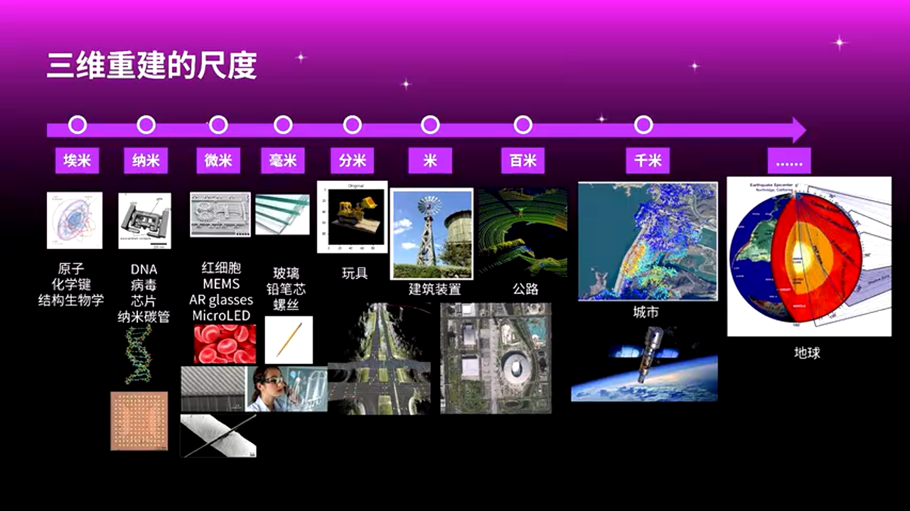
*从纳米到千米的多尺度重建应用*

**纳米级别**
- 电子显微镜成像
- 分子结构可视化

**毫米级别**
- DNA 螺旋结构呈现
- 医学影像重建

**米级别**
- 建筑和室内场景
- 人体数字化

**千米级别**
- 城市级场景重建
- 自动驾驶仿真场景

---

## 三、技术方案深度解析：从采集到仿真的完整链路

### 3.1 整体技术架构

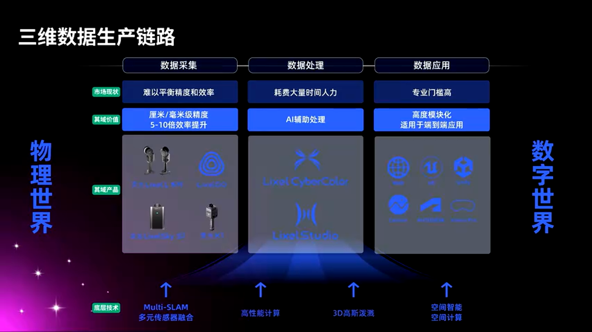
*从采集到应用的完整 Pipeline*

整个技术路径可以分为四个核心环节：

1. **数据采集**：使用专业设备采集原始数据
2. **场景重建**：在云端进行 3D Gaussian 训练
3. **引擎集成**：将重建模型导入 UE5
4. **仿真应用**：支持算法测试和训练

### 3.2 数据采集方案

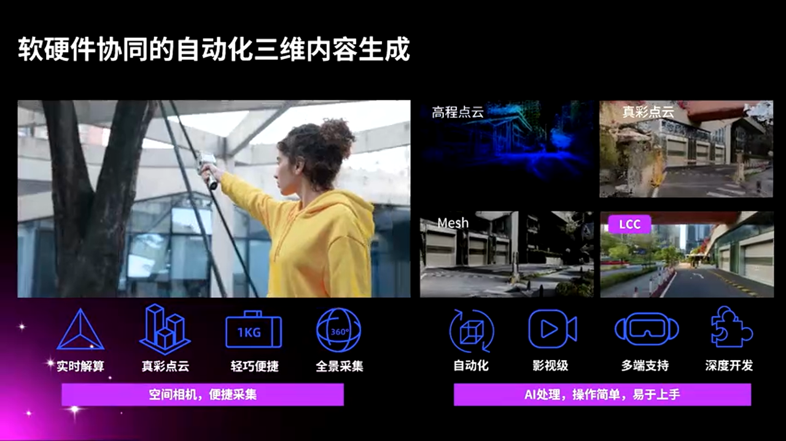
*一体化数据采集设备*

采集设备采用**硬件一体化**设计，集成了：

- **多路视觉相机**：捕获高分辨率图像
- **激光雷达**：获取精确的深度信息
- **IMU 和 GNSS**：提供精确的位姿数据

采集方式支持多种形态：

- **车载采集**：采集车搭载设备扫描道路
- **手持采集**：人员手持设备采集室内或特定区域
- **空地一体**：结合无人机和地面设备

### 3.3 3D Gaussian 训练流程

*3D Gaussian 场景构建流程*

**步骤一：数据预处理**

- 图像去畸变和颜色校正
- 位姿优化和对齐
- 动态物体过滤

**步骤二：云端训练**

- 初始化高斯点云
- 迭代优化高斯参数
- 自适应密度控制

**步骤三：模型优化**

- 去除浮点和噪声
- 场景语义分割
- 要素提取和分离

> **实际案例**
> 扫描一个停车场，采集过程约 **1-2 小时**，云端训练 **一晚上**，第二天上午即可完成整个场景重建。

### 3.4 与 UE5 的深度集成

*3D Gaussian 模型在 UE5 中的渲染效果*

通过 SDK 或插件将 3D Gaussian 模型导入 UE5：

- **实时渲染**：支持高帧率的场景渲染
- **动态元素叠加**：在 Gaussian 背景上添加车辆、行人等动态对象
- **传感器仿真**：支持相机、激光雷达等传感器模拟

---

## 四、混合仿真引擎：3D Gaussian + UE5 的最佳实践

### 4.1 为什么需要混合仿真

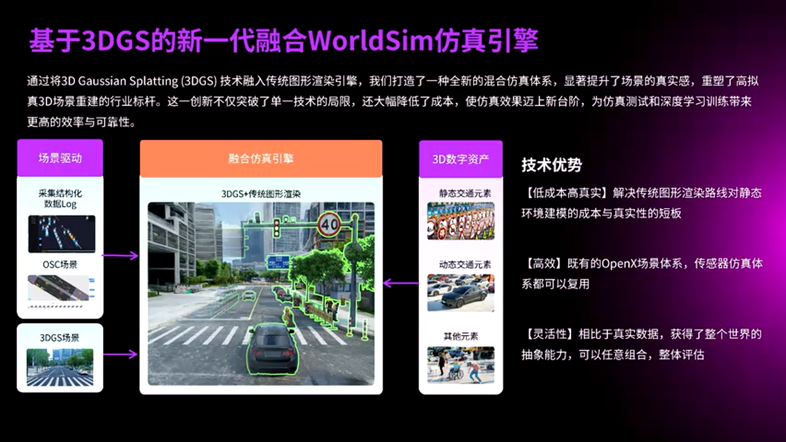
*混合仿真引擎架构示意*

纯 3D Gaussian 场景存在几个关键问题：

- **静态场景限制**：无法表示动态物体
- **功能性缺失**：交通灯等元素没有实际功能
- **编辑困难**：难以修改和调整场景

因此需要将 **3D Gaussian 的静态场景** 与 **UE5 的动态资产** 相结合。

### 4.2 混合渲染架构

**静态层（3D Gaussian）**

- 道路、建筑、植被等静态背景
- 提供高真实感的视觉效果
- 成本低、生成快

**动态层（UE5 资产）**

- 车辆、行人、交通参与者
- 交通灯、交通标志
- 天气和光照效果

> **关键优势**
> - 通过极低的成本获得更高真实感的环境
> - 保留传统仿真引擎的所有功能
> - 动态场景描述语言和传感器仿真体系完全兼容

### 4.3 仿真平台产品架构

*仿真平台整体产品架构*

平台提供多层次的解决方案：

**云端大规模并发**

- 支持数百路算法同时运行
- 用于算法训练和回归测试

**硬件在环仿真**

- 面向主机厂的控制器测试
- 支持多路传感器信号模拟

**虚拟驾驶平审**

- 用于驾驶员研究和评估
- 提供高沉浸感的驾驶体验

### 4.4 传感器仿真适配

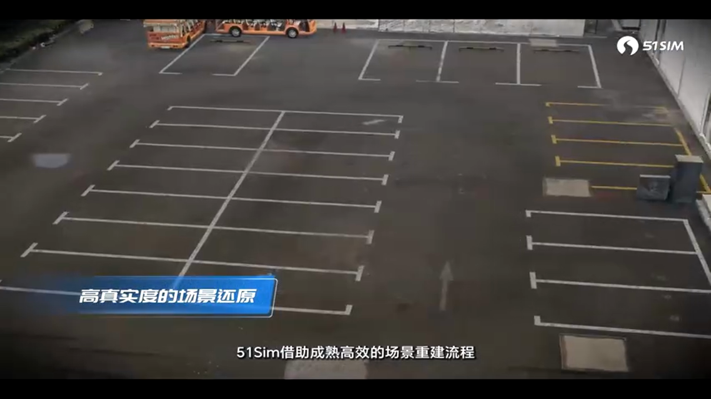
*多传感器同时仿真*

仿真系统需要适配多种传感器：

**视觉传感器**
- 模拟不同型号相机的特性
- 支持镜头畸变、噪声等效果

**激光雷达**
- 物理准确的点云仿真
- 不同材质的反射率模拟

**毫米波雷达**
- 目标检测和距离测量
- 多径反射效果

---

## 五、生产级实战：挑战与解决方案

### 5.1 分布式渲染架构

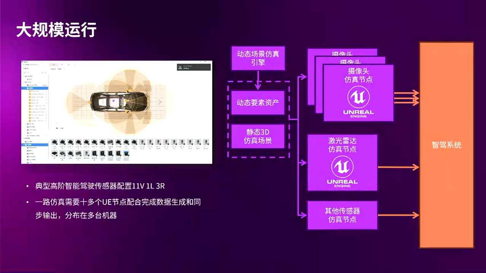
*分布式仿真渲染架构*

对于大规模仿真场景，需要分布式的渲染架构：

- 多个 UE5 节点部署在不同机器上
- 常用 **8 卡 GPU 服务器**配置
- 支持 **50+ 传感器**同时仿真

> **实际案例**
> 港口设备仿真需要 50 个传感器，使用 3 台 8 卡机完成整个仿真过程。

### 5.2 云端大规模测试

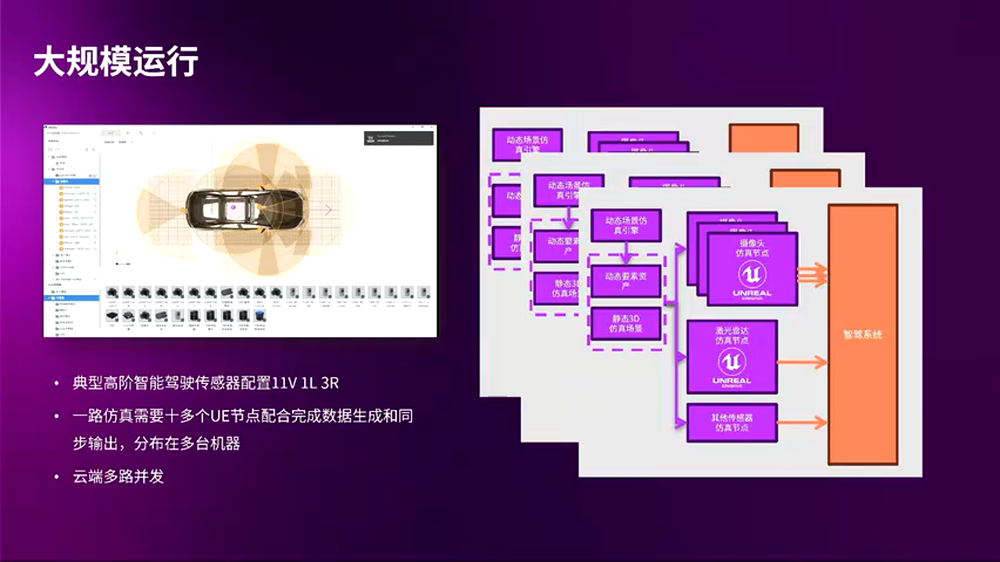
*云端大规模算法测试*

云端仿真面临几个核心挑战：

**稳定性要求**
- 长时间运行不能崩溃
- 内存管理和资源回收

**性能要求**
- 实时渲染帧率保证
- 多路并发的负载均衡

**置信度要求**
- 场景真实感足以"欺骗"算法
- 传感器信号与真实数据一致

### 5.3 面向出海的全球场景

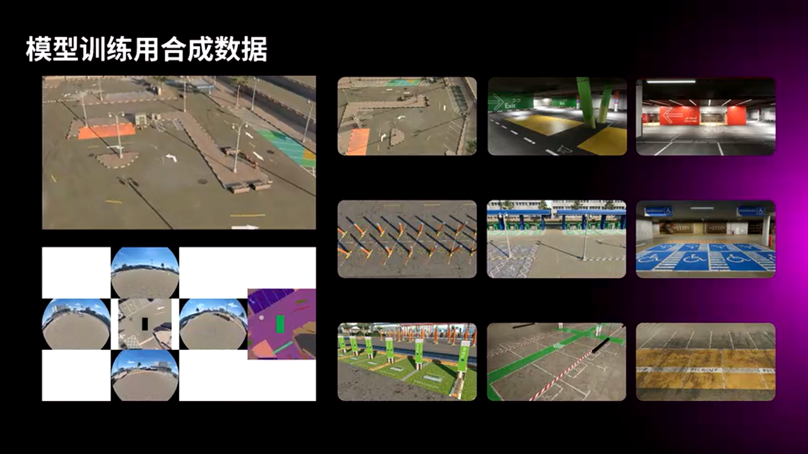
*面向不同地区的仿真场景*

自动驾驶算法需要在全球不同地区运行，这带来了场景多样性的挑战：

- **不同的交通规则**：左行/右行、交通标志差异
- **不同的道路特征**：道路宽度、路口设计
- **不同的环境条件**：气候、光照、植被

解决方案：快速采集和重建不同地区的道路场景。

### 5.4 3D Gaussian 的局限性

虽然 3D Gaussian 技术前景广阔，但仍存在一些挑战：

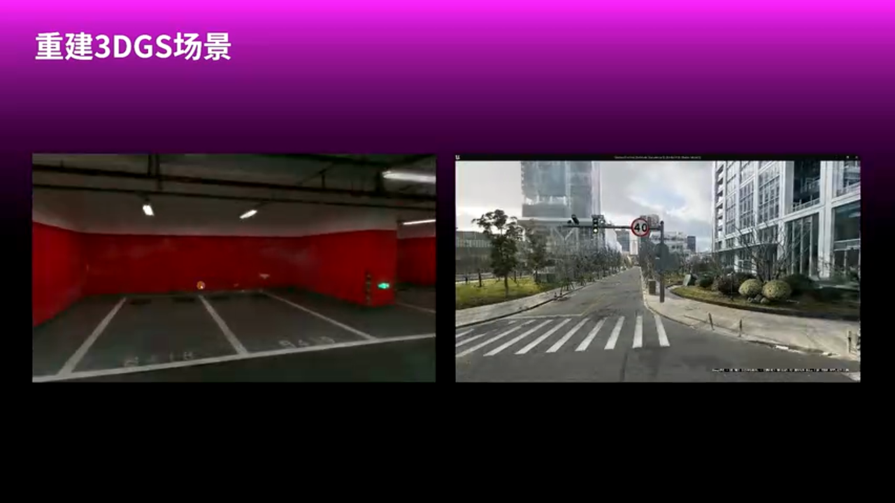
*3D Gaussian 在户外场景的效果*

**采集要求高**
- 需要重复采集覆盖所有视角
- 采集密度不足会导致模糊

**定位精度要求**
- 位姿误差会导致重建失真
- 需要高精度的定位系统

**光照和阴影处理**
- 强光照条件下效果下降
- 阴影处理仍是难点

---

## 六、数据合成与算法训练

### 6.1 端到端自动驾驶的数据需求

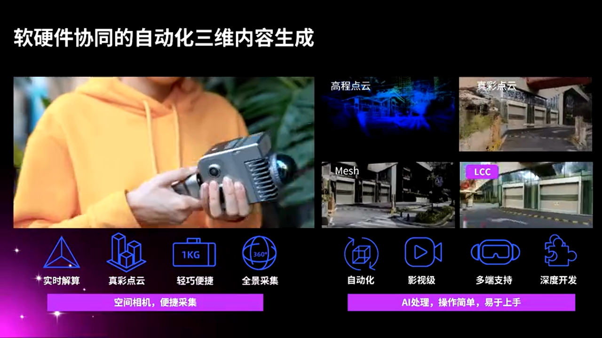
*端到端自动驾驶数据训练流程*

以 Tesla 为代表的端到端自动驾驶系统，背后是一套**神经网络大模型**，需要海量的训练数据：

- **视觉数据**：多路相机图像
- **控制标签**：方向盘、油门、刹车
- **场景标注**：车道线、障碍物、交通参与者

### 6.2 仿真数据的价值

为什么需要仿真数据？

**覆盖 Corner Case**
- 真实道路难以遇到的极端场景
- 危险场景（碰撞、紧急制动）

**数据增强**
- 天气变化（雨、雪、雾）
- 光照变化（日出、日落、夜间）

**标注自动化**
- 仿真数据天然带有标注
- 消除人工标注的成本和误差

### 6.3 训练与测试的差异

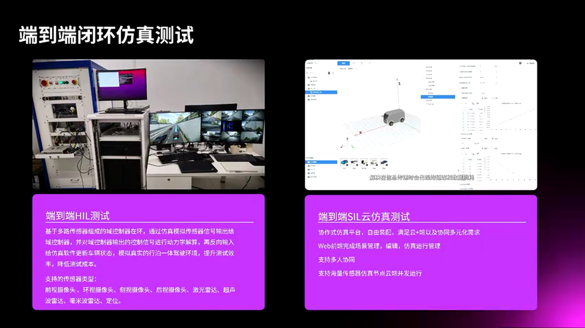
*算法测试与训练的不同需求*

**面向测试**
- 验证算法功能正确性
- 硬件在环测试
- 功能回归测试

**面向训练**
- 生成海量训练数据
- 要求高真实感
- 支持大规模并发

---

## 七、虚拟驾驶评估系统

### 7.1 驾驶模拟器架构

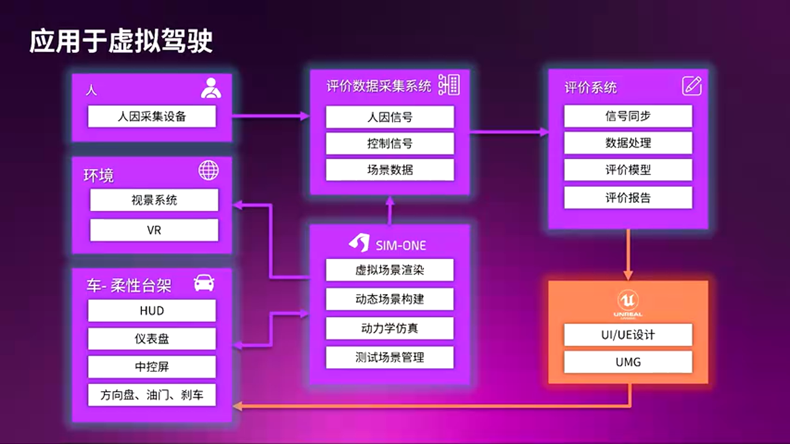
*虚拟驾驶评估系统架构*

虚拟驾驶评估系统的典型组成：

**运动平台**
- 3 自由度或 6 自由度
- 模拟车辆的加减速和转向

**视觉系统**
- 环幕显示或 VR 头显
- 提供沉浸式驾驶体验

**交互设备**
- 方向盘、踏板
- 驾驶员生理信号采集

### 7.2 3D Gaussian 在驾驶模拟器中的应用

*基于 3D Gaussian 的真实场景驾驶模拟*

传统驾驶模拟器使用美术制作的虚拟场景，成本高昂。使用 3D Gaussian 技术：

- 快速重建真实道路场景
- 在真实场景基础上添加动态交通
- 大幅降低场景制作成本

> **实际案例**
> 扫描香港道路场景，用于左驾车辆的驾驶评估。

---

## 八、方案对比与实战建议

### 8.1 三种场景生产方案对比

**方案 A：传统美术建模**
- **优势**：质量完全可控，支持任意修改
- **劣势**：成本极高，周期漫长
- **适用场景**：高质量要求的展示场景、品牌宣传

**方案 B：摄影测量重建**
- **优势**：自动化程度高，成本适中
- **劣势**：反光材质效果差，动态物体处理困难
- **适用场景**：大规模城市场景的快速重建

**方案 C：3D Gaussian Splatting**
- **优势**：真实感高，成本低，生成快
- **劣势**：视角受限，编辑困难
- **适用场景**：自动驾驶仿真、虚拟驾驶评估

### 8.2 避坑指南

**采集阶段**

1. **采集密度**：确保足够的重叠率，避免模糊
2. **光照一致性**：避免在光照剧烈变化时采集
3. **动态物体**：尽量在交通稀少时采集

**训练阶段**

1. **位姿精度**：使用高精度 SLAM 或 RTK 定位
2. **动态物体剔除**：训练前进行语义分割
3. **资源分配**：根据场景大小合理分配 GPU 资源

**集成阶段**

1. **坐标系对齐**：确保 Gaussian 场景与 UE5 坐标系一致
2. **LOD 优化**：远距离使用低精度渲染
3. **动态物体交互**：处理动态对象与静态场景的遮挡关系

### 8.3 性能优化建议

**渲染优化**
- 使用 **Frustum Culling** 剔除视锥外的 Gaussian
- 实现 **Level of Detail** 根据距离调整精度
- 考虑 **Tile-based Rendering** 优化 GPU 利用率

**内存优化**
- **流式加载**：按需加载场景区块
- **压缩存储**：使用量化和压缩减少内存占用
- **实例化**：对重复元素使用实例化渲染

---

## 九、总结与展望

### 9.1 核心技术收益

3D Gaussian Splatting + UE5 混合仿真引擎带来的核心价值：

1. **成本降低**：场景生产成本降低一个数量级
2. **效率提升**：从采集到可用的周期缩短至天级
3. **真实感提升**：基于真实数据，置信度大幅提高
4. **兼容性好**：与现有仿真体系完全兼容

### 9.2 未来发展方向

**4D Gaussian**
- 支持动态场景的重建和渲染
- 时序一致性的保证

**世界模型（World Model）**
- AI 驱动的场景生成
- 端到端的数据合成

**更高自动化**
- 全自动的采集-重建-集成流程
- 智能化的场景编辑工具

---

> **结语**
> 空间智能技术正在深刻改变自动驾驶仿真领域。3D Gaussian Splatting 以其独特的优势，成为连接真实世界与虚拟仿真的桥梁。结合 Unreal Engine 强大的实时渲染能力，我们正在迈向更高效、更真实的仿真时代。

---

*本文基于 UFSH2025 会议分享内容整理，感谢演讲者张维维和鲍世强的精彩分享。*

