# AEC项目技术攻坚实录：从帆船模拟器到数字孪生城市的工程实践

---


## 加入 UE5 技术交流群

如果您对虚幻引擎5的图形渲染技术感兴趣，欢迎加入我们的 **UE5 技术交流群**！

扫描上方二维码添加个人微信 **wlxklyh**，备注"UE5技术交流"，我会拉您进群。

在技术交流群中，您可以：
- 与其他UE开发者交流渲染技术经验
- 获取最新的GDC技术分享和解读
- 讨论图形编程、性能优化、构建工具流、动画系统等话题
- 分享引擎架构、基建工具等项目经验和技术难题

---

**源视频信息**
- **标题**: [UFSH2025]AEC项目技术攻坚实录:工程实践回顾 | Hayden Simpson Prismatic 工作室技术总监
- **时长**: 28分24秒
- **视频链接**: https://www.bilibili.com/video/BV1aRsNz7EiK
- **说明**: 本文由AI根据视频内容生成，结合专业技术分析进行深度解读

---

> **导读**
> - AEC（建筑、工程、施工）项目对真实世界数据的高度依赖，决定了其在 Unreal Engine 中面临的独特技术挑战
> - 本文将深入剖析三个真实项目案例：帆船模拟器、隧道安全工具、惠灵顿数字孪生城市
> - 从 Gerstner 波浪同步、CAD 数据处理、Nanite 大规模地形优化到 GeoJSON 数据可视化，提供可落地的工程实践方案

**前置知识要求**: Unreal Engine 基础、材质系统理解、网络复制概念、基本的图形学知识

---

## 一、背景与痛点：AEC项目的独特挑战

### 1.1 什么是AEC项目

AEC 是 **Architecture（建筑）、Engineering（工程）、Construction（施工）** 的缩写。在 Unreal Engine 语境下，AEC 项目的核心目标是 **重建真实世界**，且这种重建的精度是最高优先级。

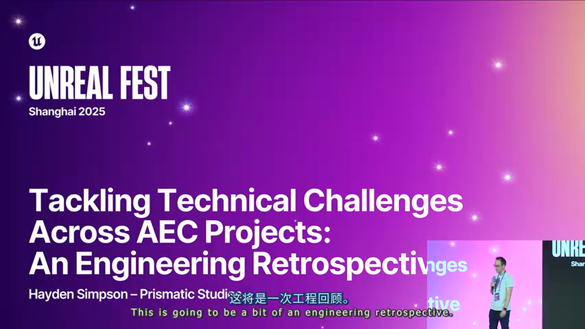

本次分享来自新西兰 **Prismatic Studios** 的 CEO Hayden Simpson，该工作室是 Epic Games 的金牌服务合作伙伴和 Pro Support 合作伙伴，专注于 Unreal Engine 技术咨询和开发。

### 1.2 核心挑战：无法"作弊"

与游戏项目不同，AEC 项目需要处理大量 **真实世界数据**：

- **工程模型与图纸**：CAD/BIM 数据，通常是百万级多边形
- **数字高程数据（DEM）**：地形高度图
- **运动数据**：实时或录制的物理模拟数据
- **任意外部数据**：需要在数字环境中可视化的各类信息


> **关键洞察**: 游戏开发中，我们可以通过各种技巧"欺骗"玩家（烘焙光照、LOD 替换、视觉假象等）。但 AEC 项目要求数据精确还原，**可以"作弊"的空间大大减少**。

这带来三个核心问题：
1. **优化更困难**：无法用常规的简化手段
2. **工作量增加**：需要处理更多真实数据
3. **体验设计受限**：难以创造引人入胜的交互体验

---

## 二、项目案例一：SailGP 帆船模拟器

### 2.1 项目概述

为 SailGP（帆船大奖赛）构建了两款产品，共享同一套核心技术栈：

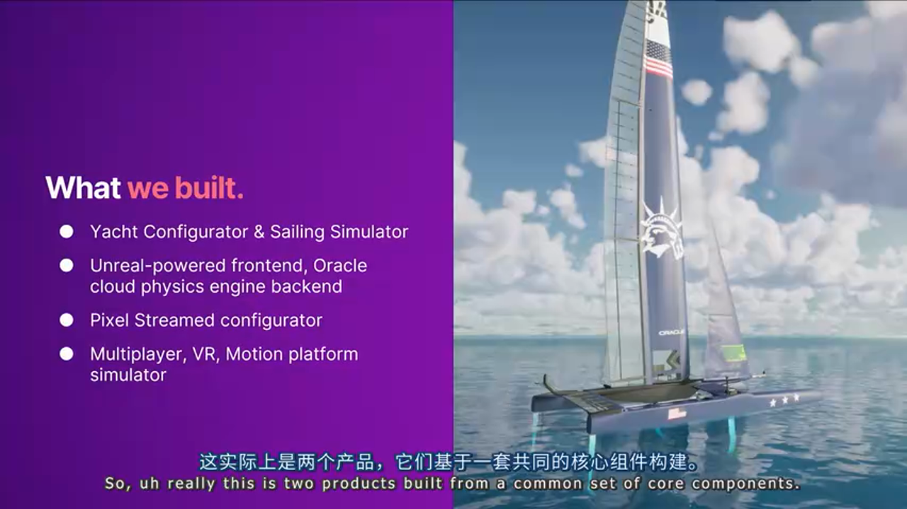

**产品一：帆船配置器（Yacht Configurator）**
- **部署方式**: Pixel Streaming，支持 iPad 访问
- **用途**: 帆船团队在赛事现场评估不同配置（机翼、前帆、水翼、舵等）在特定条件下的性能表现

**产品二：帆船模拟器（Sailing Simulator）**
- **背景**: COVID 期间，船员无法聚集训练
- **特点**: 多人 VR 训练模拟器，支持运动平台增强沉浸感

### 2.2 架构设计：分布式物理引擎


一个关键的架构决策是：**Unreal Engine 仅作为可视化前端和用户输入捕获**，真正的物理计算由托管在 Oracle Cloud 的 **VPP（Velocity Prediction Program，速度预测程序）** 完成。

数据流如下：
1. 客户端捕获用户输入 → 发送至游戏服务器
2. 游戏服务器汇总数据 → 上传至云端 VPP
3. VPP 计算物理结果 → 返回新状态
4. 游戏服务器复制状态 → 同步至所有客户端

**约束条件**：
- 每艘帆船最多 3 名玩家（不同角色：舵手、飞行控制员等）
- 每场比赛最多 10-12 艘帆船
- 多人 VR 环境，必须维持 **90 FPS**
- 网络带宽有限，需极度精简复制数据量

### 2.3 技术难点一：多人同步的海洋波浪

#### 问题定义

海洋状态必须在所有维度上完全一致：
- 波峰、波谷位置
- 振幅、周期
- 波前角度
- 时间同步

因为 **波浪会真实影响船只的物理行为**，这不是视觉效果，而是物理模拟的一部分。


#### 解决方案：Gerstner 波

选择 **Gerstner 波（Gerstner Waves）** 作为海洋模拟方案，这是计算机图形学中模拟海洋波浪的经典算法。

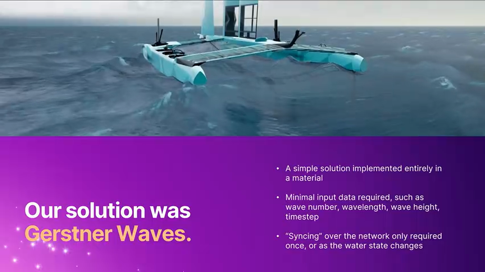

**实现方式**：整个 Gerstner 实现封装在 **材质图（Material Graph）** 中，这意味着海洋状态实际上只是一个简单平面网格 + 一个材质。

**Gerstner 波的核心优势**：

> **方案：Gerstner 波**
> - 🟢 优势：
>   - 确定性算法：给定相同参数，结果完全一致
>   - 无需持续复制海洋状态数据
>   - 只需同步初始参数（波前角度、波长、高度、周期、时间步长）
>   - 中途更新海洋状态只需一次 RPC
>   - 材质实现性能开销极低
> - 🔴 劣势：
>   - 无法模拟局部的复杂水体交互（需配合其他方案）
>   - 参数设计需要经验
> - 🎯 适用场景：需要多端精确同步的大面积海洋模拟

**网络开销分析**：
- 初始化：仅复制一组波浪参数（几十个 float）
- 运行时：零额外网络流量
- 状态更新：一次 RPC 调用

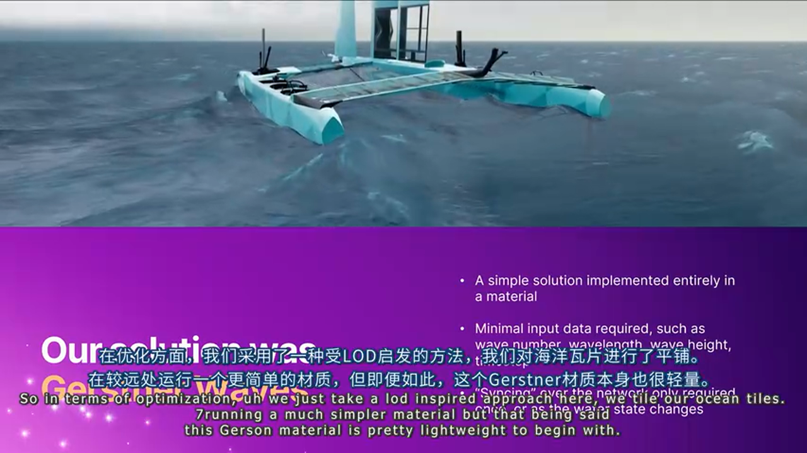

**LOD 优化策略**：采用分块（Tile）方式组织海洋网格，远处的 Tile 使用更简化的材质。但由于 Gerstner 材质本身就很轻量，这一优化效果有限但仍有价值。

**局部水体效果**：船只尾迹、海浪飞溅等复杂效果完全在 **客户端本地** 使用 Niagara 系统运行，无需网络同步。

### 2.4 技术难点二：高精度 CAD 模型处理

#### 问题定义

帆船团队提供的 CAD 模型存在典型问题：
- 单个组件动辄 **数百万多边形**
- 充斥冗余几何体（螺母、螺栓等细节）
- 项目启动时 Nanite 尚未可用

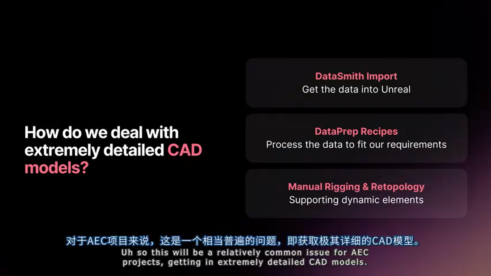

#### 解决方案：DataSmith + DataPrep 工作流

采用 **半自动化 + 手工精修** 的两阶段工作流：

**阶段一：自动化处理**

1. **DataSmith 导入**
   - 支持 Rhino 3D 及数十种 CAD 格式
   - 保留原始层级结构和材质信息

2. **DataPrep 配方（Recipe）**
   - 简化网格（Mesh Simplification）
   - 合并非动态部件
   - 移除小型几何体（螺母、螺栓）
   - 应用默认材质和 LOD 组


**阶段二：手工精修**

对于需要动态形变的部件（机翼、前帆、水翼等），仍需手工处理：


- **重拓扑（Re-topology）**：优化网格拓扑结构
- **骨骼绑定（Rigging）**：为动态部件创建骨骼
- **权重绘制（Weight Painting）**：定义形变影响范围

### 2.5 技术难点三：赛事场馆重建

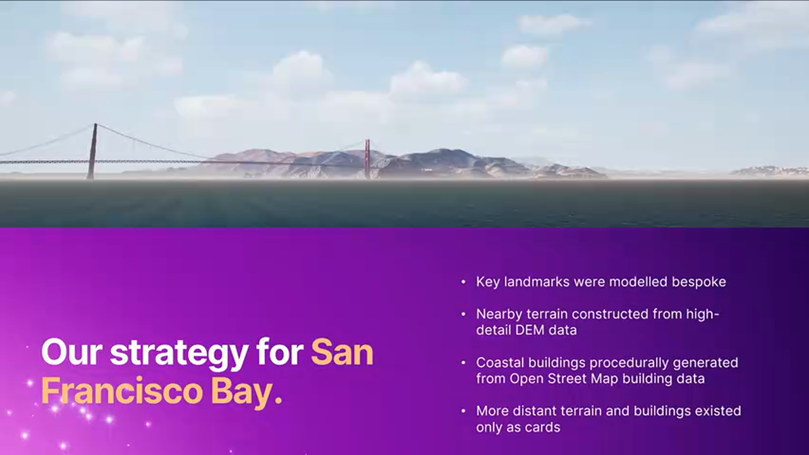

以旧金山赛事场馆为例，介绍场馆重建的技术方案：

**核心原则**：对水手导航至关重要的地标和海岸线地形是最高优先级。

**分层构建策略**：

| 层级 | 内容 | 方案 |
|------|------|------|
| 英雄地标 | 金门大桥、恶魔岛 | 定制建模 |
| 近距海岸地形 | 场馆周边数公里 | 高精度 DEM 数据 |
| 近距建筑群 | 海岸线建筑 | OSM 数据程序化生成 |
| 远景 | 远处地形和建筑 | 2D 卡片（Billboard） |

**地形纹理方案**：

放弃卫星影像和航拍照片（会烘焙光照和建筑投影），采用 **Auto-Material 自动材质** 方案：

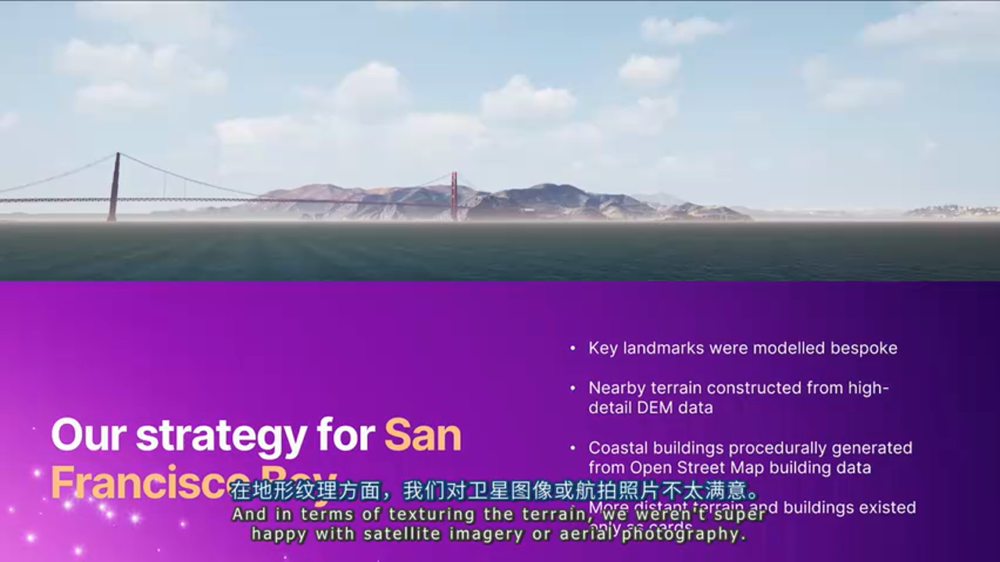

根据以下参数自动决定表面材质：
- 海拔高度
- 距海岸距离
- 地形坡度

> **优势**: 避免烘焙光照，可配合 Time of Day 系统实现动态光照变化。

**建筑程序化生成**：


从 OpenStreetMap 导出建筑轮廓数据，程序化生成沿海建筑群，同样采用 Auto-Material 方案着色。

### 2.6 技术亮点：Epic Online Services 的 AEC 应用

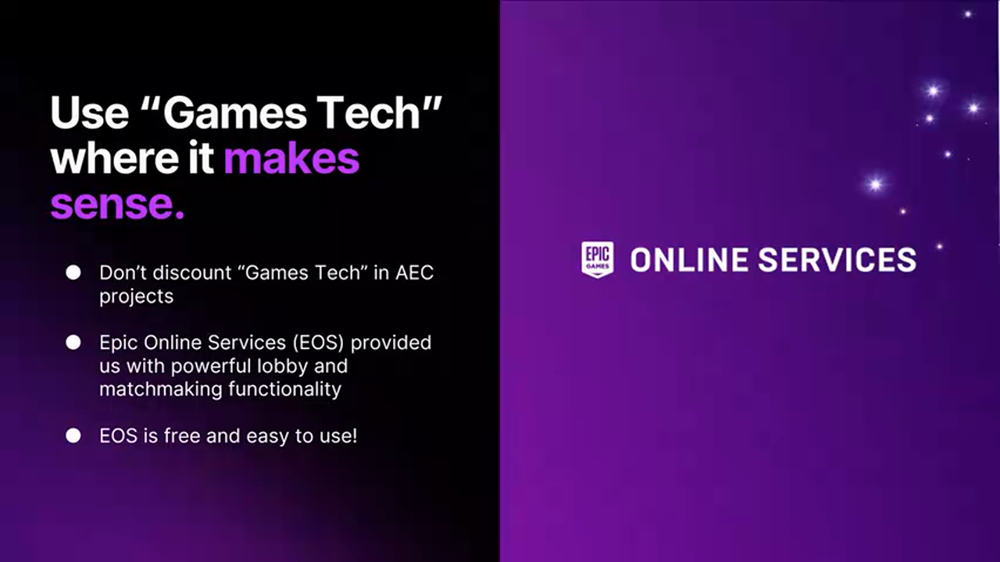

**不要忽视 EOS 在 AEC 项目中的价值**。在 SailGP 项目中，EOS 提供了：

- **大厅系统（Lobbies）**：玩家加入赛前等候区
- **匹配系统（Matchmaking）**：玩家选择帆船和角色后进入比赛

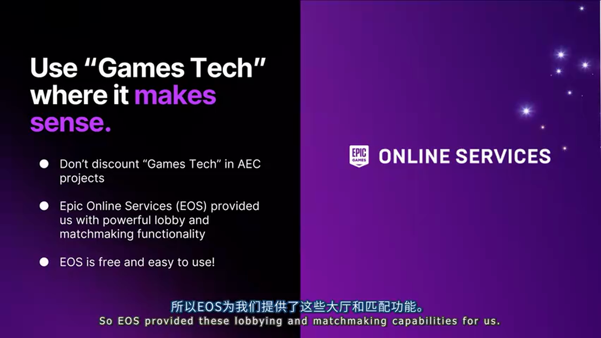

> **关键提示**: EOS 完全免费，无需使用 Unreal Engine，可集成到任何应用。按需使用，不必担心功能过多。

---

## 三、项目案例二：KiwiRail 隧道安全工具

### 3.1 项目背景

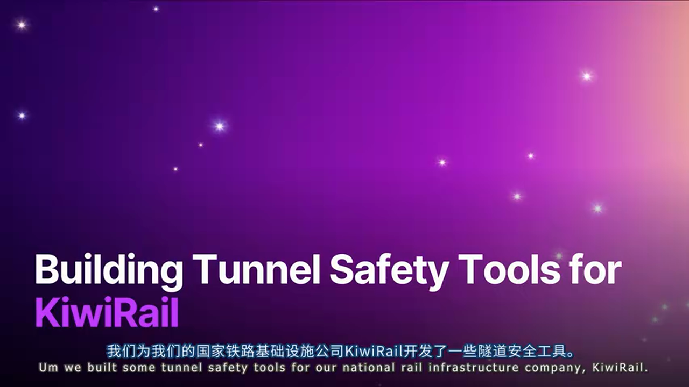

为新西兰国家铁路公司 **KiwiRail** 开发隧道安全规划工具，目标是替代过时的 2D 白板和纸质安全图表。

**项目目标**：
- **提高参与度**：让铁路承包商更积极参与安全简报
- **信息密度**：在直观的 3D 环境中传达更丰富的信息
- **覆盖范围**：新西兰全境 **140+ 条隧道**

**隧道环境的特殊性**：
- 黑暗、狭窄
- 存在坍塌风险
- 低空气流动导致有害气体积聚


### 3.2 核心技术：Data Asset 驱动的道具系统

#### 问题定义

需要快速迭代添加新道具（车辆、人员、设备等），且要：
- 数小时内交付，而非数天
- 最小化人为错误
- 支持多人并行开发

#### 解决方案：Data Asset 配方模式


使用 **Data Asset** 而非 Data Table 定义道具：

**Data Asset 结构设计**：

```cpp
// [AI补充] Data Asset 结构示例
UCLASS()
class UPropDefinitionAsset : public UPrimaryDataAsset
{
    GENERATED_BODY()
public:
    // UI 信息
    UPROPERTY(EditAnywhere, Category = "UI")
    FText Title;
    
    UPROPERTY(EditAnywhere, Category = "UI")
    FText Description;
    
    UPROPERTY(EditAnywhere, Category = "UI")
    UTexture2D* Thumbnail;
    
    // 物理表现
    UPROPERTY(EditAnywhere, Category = "Visuals")
    UStaticMesh* Mesh;
    
    UPROPERTY(EditAnywhere, Category = "Visuals")
    UNiagaraSystem* ParticleSystem;
    
    UPROPERTY(EditAnywhere, Category = "Visuals")
    USoundBase* AmbientAudio;
    
    // 元数据
    UPROPERTY(EditAnywhere, Category = "Build")
    TArray<FName> BuildConfigurations;
    
    UPROPERTY(EditAnywhere, Category = "Build")
    bool bIsInDevelopment;
};
```

**Data Asset vs Data Table 对比**：

> **方案 A：Data Table**
> - 🟢 优势：单一资产，易于管理索引
> - 🔴 劣势：大型二进制文件，版本控制时容易冲突锁定
> - 🎯 适用场景：小型团队、数据量有限
>
> **方案 B：Data Asset**
> - 🟢 优势：每个道具独立资产，无锁定冲突
> - 🔴 劣势：需要额外机制聚合所有资产
> - 🎯 适用场景：多人并行开发、频繁迭代

**聚合方案**：使用 **Asset Registry** 在运行时扫描所有 Data Asset，或在 Developer Settings 中维护列表。

**运行时使用**：创建可配置的 **Prop Actor** 类，接收 Data Asset 作为"配方"构建自身：

```cpp
// [AI补充] Prop Actor 配置示例
void APropActor::ConfigureFromAsset(UPropDefinitionAsset* Asset)
{
    if (!Asset) return;
    
    // 设置网格
    if (Asset->Mesh)
    {
        MeshComponent->SetStaticMesh(Asset->Mesh);
    }
    
    // 设置粒子效果
    if (Asset->ParticleSystem)
    {
        ParticleComponent->SetAsset(Asset->ParticleSystem);
    }
    
    // 设置音效
    if (Asset->AmbientAudio)
    {
        AudioComponent->SetSound(Asset->AmbientAudio);
    }
}
```

### 3.3 数据验证：防止人为错误


使用 Unreal 的 **Data Validation** 系统确保数据完整性：

```cpp
// [AI补充] Data Validation 示例
EDataValidationResult UPropDefinitionAsset::IsDataValid(TArray<FText>& ValidationErrors)
{
    EDataValidationResult Result = Super::IsDataValid(ValidationErrors);
    
    // 检查必填字段
    if (Title.IsEmpty())
    {
        ValidationErrors.Add(FText::FromString("Title is required"));
        Result = EDataValidationResult::Invalid;
    }
    
    // 检查资产有效性
    if (Mesh && !Mesh->IsValidLowLevel())
    {
        ValidationErrors.Add(FText::FromString("Mesh reference is invalid"));
        Result = EDataValidationResult::Invalid;
    }
    
    // 检查命名规范
    if (!GetName().StartsWith("PD_"))
    {
        ValidationErrors.Add(FText::FromString("Asset name must start with PD_"));
        Result = EDataValidationResult::Invalid;
    }
    
    return Result;
}
```

可检查的内容包括：
- 必填字段非空
- 引用的资产仍然有效
- 命名规范符合标准
- 任何可编程验证的规则

### 3.4 用户体验：为非游戏玩家设计输入

#### 问题定义

AEC 项目的用户群与游戏玩家截然不同：
- 可能不熟悉 WASD 等游戏键位
- 不适应复杂的快捷键映射
- 铁路承包商可能仅使用这一款软件

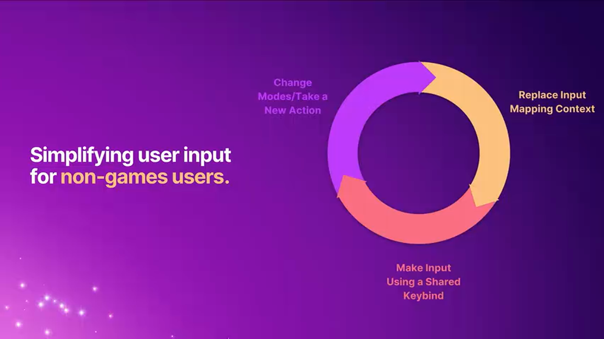

#### 解决方案：上下文感知的 Enhanced Input

**设计原则**：将 **90% 的操作映射到鼠标左键**，让应用根据上下文决定行为。

**Enhanced Input 的 Input Mapping Context（IMC）切换**：

```cpp
// [AI补充] IMC 切换示例
void AMyPlayerController::SetInputMode(EAppInputMode NewMode)
{
    UEnhancedInputLocalPlayerSubsystem* Subsystem = 
        ULocalPlayer::GetSubsystem<UEnhancedInputLocalPlayerSubsystem>(GetLocalPlayer());
    
    if (!Subsystem) return;
    
    // 移除当前上下文
    if (CurrentIMC)
    {
        Subsystem->RemoveMappingContext(CurrentIMC);
    }
    
    // 应用新上下文
    switch (NewMode)
    {
        case EAppInputMode::PropManipulation:
            CurrentIMC = PropManipulationIMC;
            break;
        case EAppInputMode::Measurement:
            CurrentIMC = MeasurementIMC;
            break;
        case EAppInputMode::Navigation:
            CurrentIMC = NavigationIMC;
            break;
    }
    
    if (CurrentIMC)
    {
        Subsystem->AddMappingContext(CurrentIMC, 0);
    }
}
```

**工作流示例**：
1. 用户点击道具 → 系统检测到道具被选中 → 移除 Navigation IMC → 应用 Prop IMC
2. 用户进入测量模式 → 移除 Prop IMC → 应用 Measurement IMC
3. 循环往复

---

## 四、项目案例三：惠灵顿数字孪生城市

### 4.1 项目概述


为 **惠灵顿市议会（Wellington City Council）** 构建首都的数字孪生城市。

**核心产品**：
- **DCM（Digital City Model）**：数字城市模型基座
- **Our Changing City**：面向公众的博物馆式互动展览


**应用场景**：
- 公众通过触摸屏体验城市数百年的变迁
- 可视化气候变化对城市的影响（海平面上升、洪水风险）
- 政府内部用于城市规划和人群模拟

### 4.2 技术架构：四大支柱


1. **地形处理（Terrain）**
2. **建筑重建（Buildings）**
3. **GeoJSON 数据叠加（Data Overlay）**
4. **性能优化（Performance）**

### 4.3 地形系统：Nanite 静态网格方案

#### 为何不用 Landscape

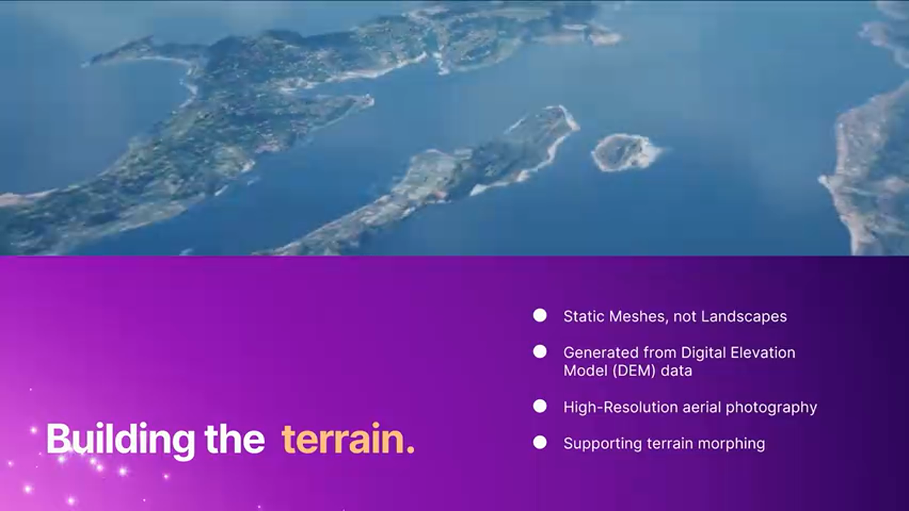

项目规模超出了 Landscape 的舒适区：
- 所需精度下，纹理尺寸会达到不可行的级别
- LOD 和纹理 Mip 流在大尺寸 Tile 上基本失效

#### 解决方案：Nanite 静态网格 Tile

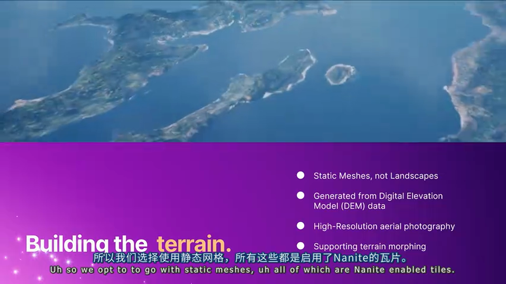

采用 **静态网格 Tile** 方案：
- 所有 Tile 均启用 **Nanite**
- 从政府提供的高精度 **DEM（数字高程模型）** 数据生成

**纹理方案**：
- 使用 **8K 航拍照片** 作为地形纹理
- 启用 **Virtual Texture Streaming** 管理显存
- 即使 8K，在如此大范围下纹素密度仍不算高

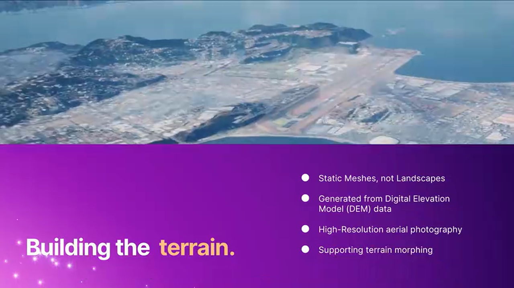

**地质变化可视化**：
- 支持演示海平面上升、地形侵蚀等变化
- 使用 **顶点动画（Vertex Animation）** 驱动地形形变

### 4.4 建筑重建：Nanite 合并网格


**大惠灵顿地区的所有建筑** 都包含在数字孪生中：
- 自动生成的低多边形占位建筑
- 按城区（Suburb）合并为单个网格

> **注意**: 这不是最佳实践，而是项目继承的工作流。正常情况下应保持建筑独立以便剔除。

**Nanite 的救赎**：
- 尽管建筑合并在同一网格中，Nanite 的簇级剔除（Cluster Culling）仍能正常工作
- 但由于合并网格中的建筑不共享拓扑，Nanite 的压缩效率受损

**英雄建筑**：
- 新西兰人熟知的地标（如政府大楼"蜂巢"）采用 **定制建模**
- 确保材质兼容 Nanite

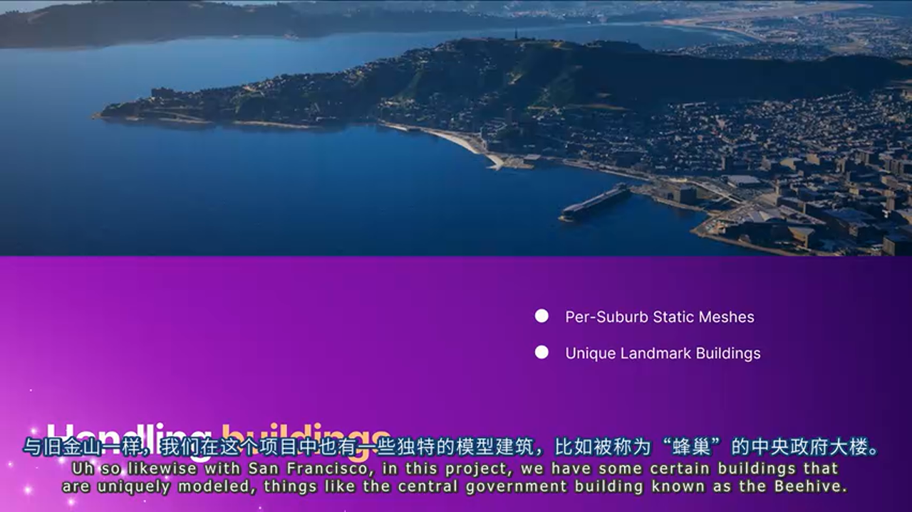

### 4.5 GeoJSON 数据可视化

#### 问题定义

需要在数字孪生中叠加各类环境数据：
- 概率性洪水数据
- 海岸侵蚀数据
- 排水管网

且要求 **运行时动态导入**，无需重新打包应用。


#### 解决方案：GeoJSON 解析 + Monotone 分解

数据以 **GeoJSON** 格式提供，这是表示地理特征的开放标准。

**技术挑战**：多边形数据包含复杂特征：
- 孔洞（Holes）
- 非凸多边形
- 其他非标准几何

**解决方案**：自研 **Monotone Decomposition（单调分解）** 算法：


- 将复杂多边形分解为单调多边形
- 对单调多边形进行三角剖分
- 鲁棒处理各类边缘情况

**道路网络的意外收获**：

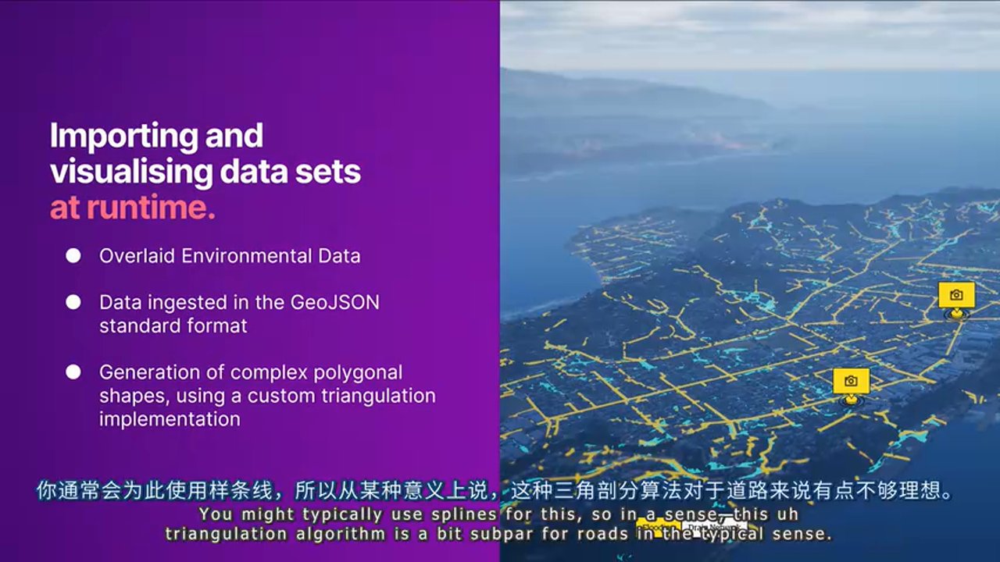

这套三角剖分代码同样适用于 **道路网络导入**：
- 传统做法是使用样条（Spline）
- 但样条难以处理复杂交叉路口和变宽路段
- 多边形三角剖分方案天然支持这些场景

### 4.6 性能优化实践


#### 问题一：LOD 失效

由于几何体在屏幕上占据极大面积，传统基于屏幕尺寸的 LOD 基本失效。

**解决方案**：依赖 **Nanite 的簇级流送（Cluster-level Streaming）**。

#### 问题二：纹理 Mip 流失效

同理，纹理 Mip 流也因屏幕尺寸问题失效。

**解决方案**：**Virtual Texture Streaming**。

#### 问题三：不必要的功能开销


使用 Epic Games Launcher 版本引擎时，很多默认功能是开启的但项目不需要：
- 碰撞检测 → 关闭
- Tick → 关闭
- 物理模拟 → 关闭

> **最佳实践**: 审视每个 Actor 和组件，禁用所有不需要的功能。

#### 问题四：地形形变的性能代价

地形形变（演示地质变化）是项目核心功能，但开销较高。

**技术方案**：

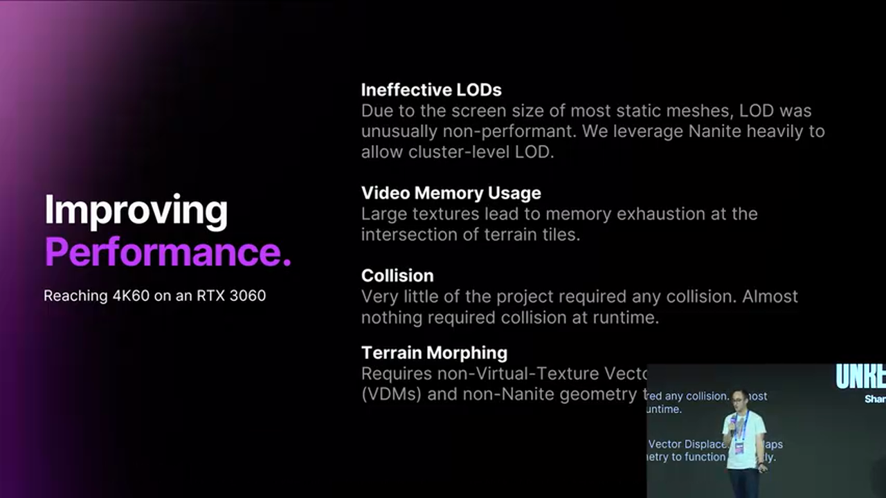

- 使用 **非 VT 的向量位移贴图（Vector Displacement Map）** 驱动形变
- **不使用 Nanite** 进行形变动画（视觉伪影问题）
- 使用 2K 非 VT 纹理（比 8K VT 的时间一致性更好）
- 形变完成后，**切换回 Nanite 地形 Tile**

**意外收获**：形变期间隐藏所有植被和建筑，既符合美学需求，又释放了渲染资源。

---

## 五、实战总结与建议

### 5.1 方案对比总览

> **海洋模拟方案**
> - **Gerstner 波 + 材质实现**：适合需要多端精确同步的场景，网络开销极低
> - **流体模拟**：适合单机高精度模拟，但同步成本高
>
> **地形方案**
> - **Landscape**：适合常规游戏项目
> - **Nanite 静态网格 Tile**：适合超大规模、需要 VT 支持的 AEC 项目
>
> **数据定义方案**
> - **Data Table**：适合小团队、数据量有限
> - **Data Asset**：适合多人协作、频繁迭代
>
> **GIS 数据可视化**
> - **Spline**：适合简单线性数据
> - **Monotone 分解 + 三角剖分**：适合复杂多边形（含孔洞、交叉路口）

### 5.2 避坑指南

1. **CAD 数据处理**
   - 不要期望一键导入完美结果
   - DataSmith + DataPrep 只是第一步，手工精修不可避免
   - 动态形变部件必须重拓扑和骨骼绑定

2. **Nanite 使用注意**
   - 合并网格会降低压缩效率（不共享拓扑）
   - 顶点动画会产生视觉伪影（新顶点位置不优化）
   - 默认锁定 UV，需手动禁用此设置
   - 向量位移贴图作为 VT 会丢失精度

3. **用户体验设计**
   - AEC 用户 ≠ 游戏玩家
   - 最小化键位映射
   - 利用 Enhanced Input 的上下文切换

4. **性能优化**
   - 超大几何体会导致 LOD 和 Mip 流失效
   - Virtual Texture 是大纹理的必选项
   - 审计并禁用所有不需要的功能

5. **网络同步**
   - 分布式物理引擎带来额外延迟
   - 确定性算法（如 Gerstner 波）可大幅减少同步数据量
   - 视觉效果（尾迹、粒子）应在客户端本地运行

### 5.3 最佳实践清单

- ✅ 使用 Gerstner 波实现可同步的海洋状态
- ✅ 采用 DataSmith + DataPrep 工作流处理 CAD 数据
- ✅ 使用 Data Asset 而非 Data Table 管理可扩展的道具库
- ✅ 实现 Data Validation 确保数据完整性
- ✅ 利用 Enhanced Input 的 IMC 切换简化用户输入
- ✅ 超大规模项目使用 Nanite 静态网格 + VT 组合
- ✅ 考虑 EOS 作为 AEC 项目的在线服务方案
- ✅ GeoJSON 数据使用 Monotone 分解进行三角剖分

---

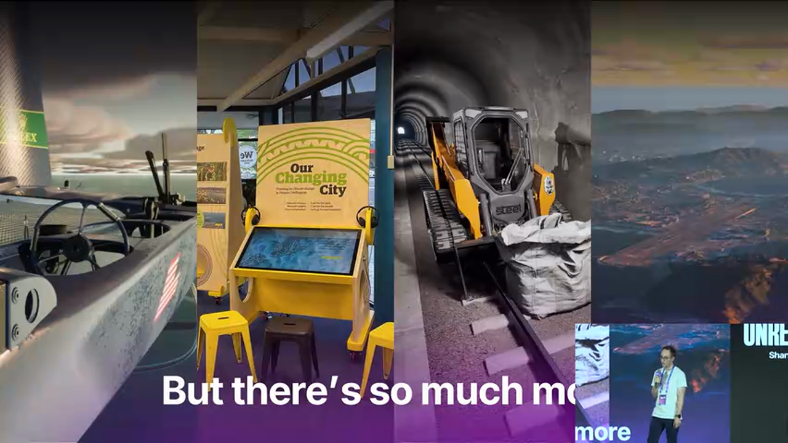

> **结语**: AEC 项目对真实世界数据的高度依赖，决定了我们必须在精度与性能之间找到平衡。本文介绍的技术方案——从 Gerstner 波同步、CAD 数据工作流、Data Asset 驱动的道具系统，到 Nanite 大规模地形和 GeoJSON 可视化——都是在真实项目中验证过的解决方案。希望这些经验能为你的 AEC 项目提供参考。

---

*本文基于 Prismatic Studios CEO Hayden Simpson 在 Unreal Fest Shanghai 2025 的演讲整理，结合 AI 技术分析生成。*


