# 汽车营销内容革命：Unreal Engine 与高斯点云、生成式 AI 的深度融合实践

---

## 加入 UE5 技术交流群
如果您对虚幻引擎5的图形渲染技术感兴趣，欢迎加入我们的 **UE5 技术交流群**！
扫描上方二维码添加个人微信 **wlxklyh**，备注"UE5技术交流"，我会拉您进群。
在技术交流群中，您可以：
- 与其他UE开发者交流渲染技术经验
- 获取最新的GDC技术分享和解读
- 讨论图形编程、性能优化、构建工具流、动画系统等话题
- 分享引擎架构、基建工具等项目经验和技术难题
---

**源视频信息**
- 原标题：[UFSH2025]驱动汽车内容创新: Unreal Engine融合高斯点云与AI的探索 | Scott Bradley Rotor Studio
- 视频链接：https://www.bilibili.com/video/BV14mq8BpEKa
- 本文由 AI 辅助生成，基于视频内容整理

---

> **导读**
> - 汽车营销正面临"内容需求爆炸式增长，预算却几乎持平"的困境，本文将揭示如何利用 **Unreal Engine + 生成式 AI + 高斯点云（Gaussian Splats）** 的组合拳破局。
> - **CG 产品 + AI 环境**的混合工作流是当前最务实的解决方案——既保证产品精准可配置，又大幅降低环境制作成本。
> - **高斯点云**技术能在一小时内将真实环境扫描转化为可用于 Unreal Engine 的照片级 3D 场景，这是传统 CG 建模难以企及的效率。
> - **前置知识**：了解 Unreal Engine 基础渲染管线、基本的 VFX 合成概念。

---

## 一、背景与痛点：汽车营销内容的现实挑战

本次演讲来自 **Roda Studios**（悉尼），一家拥有 25 年历史、约 100 人规模的 CG 内容与创意技术公司。他们专注于汽车营销领域的全链路解决方案：从 CAD 数据准备、配置管理、创意内容制作，到在线/线下配置器、XR 体验，以及新兴的 AI/ML 集成和 HMI 开发。


### 1.1 为什么选择 Unreal Engine 作为统一管线？

Roda Studios 过去使用两条独立的渲染管线：**Octane Renderer** 用于高保真静态内容，**Unreal Engine** 用于实时交互体验。现在，他们正在将所有工作流迁移到 **Unreal Engine 单一管线**，理由如下：

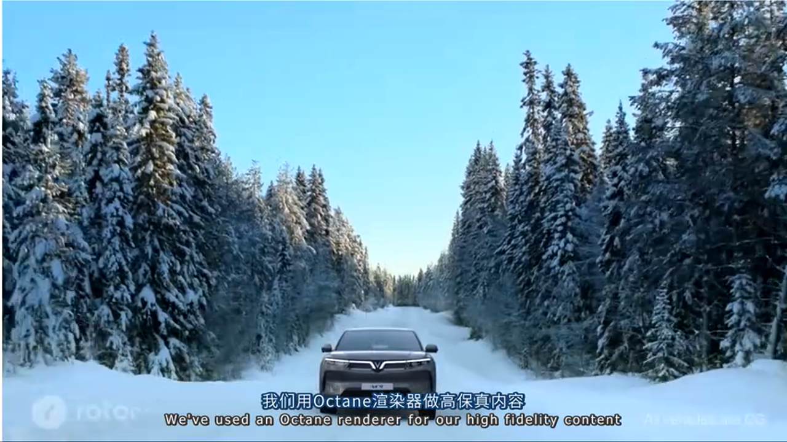

> **核心优势总结**
> - **渲染质量达标**：Unreal Engine 的 Path Tracer 在营销用途上已能匹敌任何离线渲染器。
> - **极速内容生产**：Path Tracer 的渲染速度远超传统离线渲染引擎，这在"需要更多内容、更快交付"的时代至关重要。
> - **单一数字孪生（Digital Twin）**：Unreal Engine 模型成为车辆的"唯一真实来源"，便于高效更新和维护。
> - **视觉一致性**：Path Tracer（高质量）与 Deferred Renderer（实时）产出的视觉风格一致，确保营销与销售素材的品牌统一。
> - **按需内容生成**：实时渲染器支持在线生成任意配置的车辆图像，满足个性化展示需求。
> - **源码可定制**：Unreal Engine 开放源码，支持深度定制管线。


---

## 二、AI 在汽车营销中的应用版图

在深入视觉 AI 之前，演讲者先概述了 **非视觉 AI** 在汽车营销中的几个关键应用场景：


- **AI 虚拟助手**：集成到配置器中，提供 7x24 小时的个性化推荐服务。
- **UI/UX 设计辅助**：AI 不替代设计，而是作为增强工具加速布局和创意探索。
- **质量控制与一致性检查**：海量内容产出需要 AI 辅助确保准确性和品牌一致性。
- **流程自动化**：各行业通用的效率提升手段。

---

## 三、视觉 AI 内容的核心目标与挑战

### 3.1 汽车行业的两大核心诉求


**生产价值（Production Value）**

当前汽车行业面临宏观经济压力，OEM 厂商迫切需要"用更低成本做出同等甚至更高质量的内容"。

**速度（Speed）**

从 OEM 交付 CAD 数据到车辆发布的时间窗口是固定的——厂商不会为了内容制作而延长发布周期。但与此同时，所需内容的数量却在持续增长。

> **结论**：任何新技术的引入，必须同时提升生产价值和生产速度。

### 3.2 汽车内容的两大组成要素


一张汽车营销图由两部分组成：

- **产品（Product）**：即汽车本身——一个昂贵、复杂、需要精准呈现的对象。
- **环境（Environment）**：城市街道、海滩、山路……往往是项目的成本瓶颈。

> **关键洞察**：产品的 CG 模型一旦建立，可以复用和配置；但环境的多样性需求往往导致项目成本失控。


演讲者指出，Unreal Engine 的 **PCG（Procedural Content Generation）** 虽然强大，但当需求是"快速生成大量风格迥异的环境"时，仍然存在瓶颈。这正是 AI 和高斯点云大显身手的地方。

---

## 四、产品可配置性的战略价值

这是演讲中被反复强调的一个核心理念：**即使你不做配置器，也应该让产品具备可配置性**。

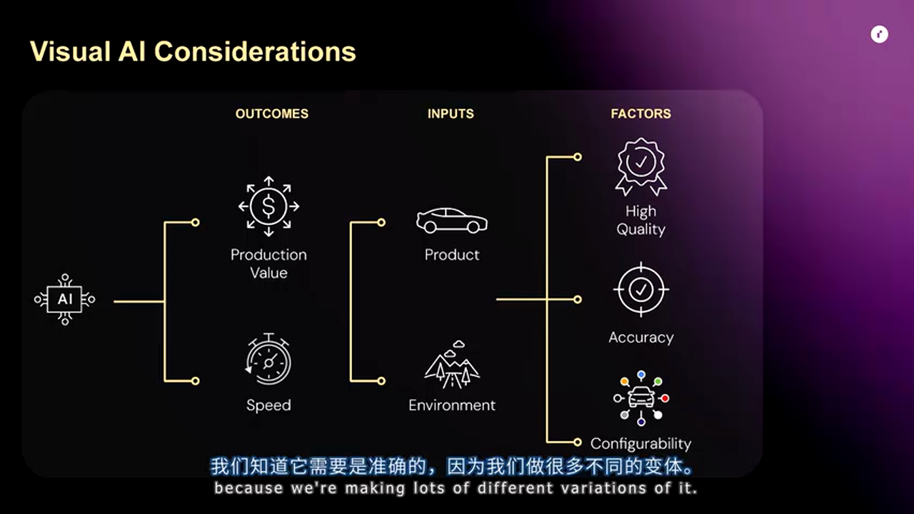

### 4.1 地理优势（Geographic）

如果 CG 模型可配置，那么为中国市场制作的内容可以快速适配到菲律宾、印尼、巴西……实现内容全球化复用，带来巨大的成本效率。


### 4.2 时间优势（Temporal）

一款车的生命周期通常是 5-10 年，期间会有多次小改款（Facelift）。如果原始内容的产品是可配置的，那么只需替换大灯、调整细节，就能以极低成本更新所有素材。


### 4.3 个性化体验的商业价值

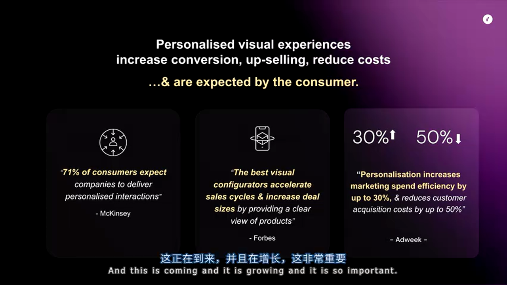

可配置性直接支撑了**个性化视觉体验**，这对销售转化和追加销售（Upselling）有显著提升。消费者已经习惯了在电商平台看到任意配置的产品渲染图，汽车作为高价商品，这种期望只会更高。

---

## 五、内容需求爆炸 vs 预算持平的残酷现实

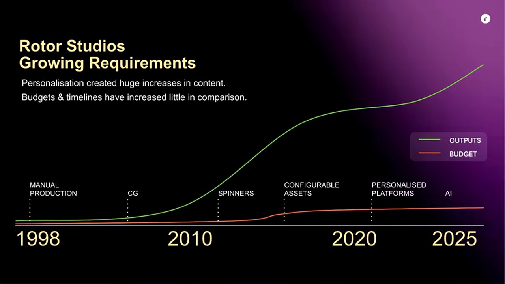

上图展示了 Roda Studios 过去 25 年的内容产出曲线（绿线）与预算曲线（红线）。从 2010 年左右开始，配置需求（颜色、配件、车型变体）和渠道需求（社交媒体、网站、经销商）爆发式增长，但预算增长远远跟不上。


> **这张图是理解本演讲所有技术方案的核心背景**：我们需要在预算几乎不变的情况下，交付数倍于以往的内容量。

---

## 六、生成式 AI 的当前应用场景

演讲者明确指出：**AI 短期内不会取代 CG 管线，但会极大增强它**。以下是当前已落地的应用场景：

### 6.1 快速创意概念与镜头预演


利用 AI 生成大量不同的视觉风格和场景概念，帮助客户在项目早期快速达成创意共识。可以在 AI 生成的环境中放入一个代理 CG 车辆模型，让客户更直观地签署创意方向。

### 6.2 场景扩展（Scene Extension）

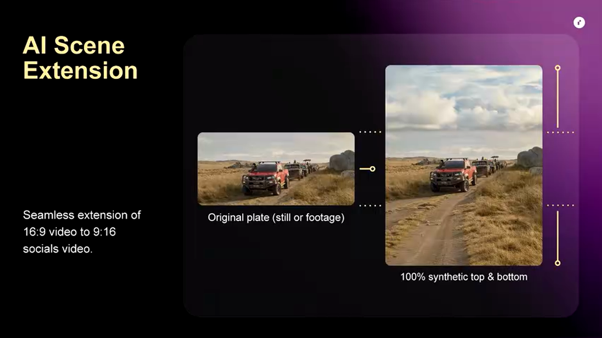

原本以 16:9 拍摄的素材，客户突然需要 9:16 的社交媒体版本？传统做法需要裁剪或重新拍摄。现在，AI 可以智能扩展画面边缘，自动补全环境。

### 6.3 AI 超分辨率（Upscaling）


AI 驱动的超分辨率技术正在飞速进步。不久的将来，甚至可以从视频中提取一帧，通过 AI 放大到可用于户外巨幅广告的精度——同时保持产品细节（车辆本身可以用 CG 重新渲染以确保精度）。

### 6.4 AI 生成物品与角色

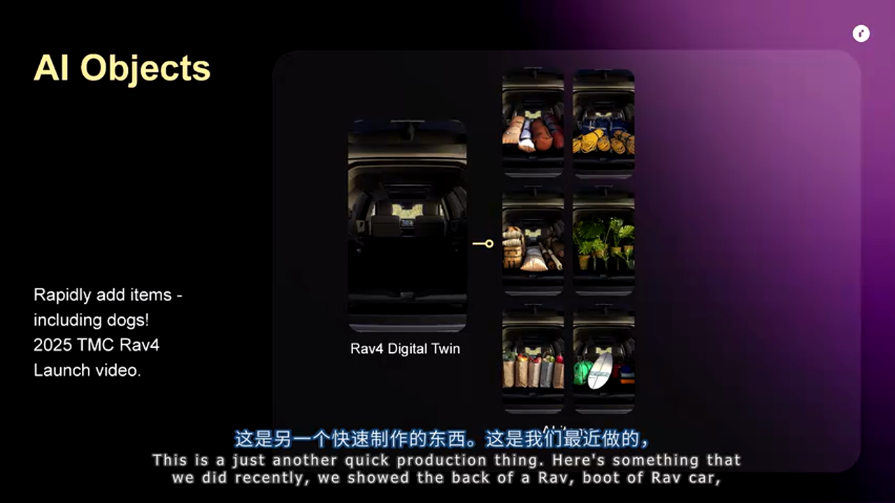

展示车辆后备箱空间时，需要放入各种行李物品。传统 CG 需要逐一建模，现在 AI 可以快速生成多种方案供客户选择。


甚至可以用 AI 在后备箱里放一只狗——省去了真实拍摄时"狗+驯狗师+拍摄许可"的复杂流程。

> **警示**：AI 生成的内容仍需人工审核。如上图所示，AI 给狗生成了一条"一英尺长的舌头"——这种幻觉（Hallucination）需要在后期修复。

### 6.5 生成式 AI 的核心局限

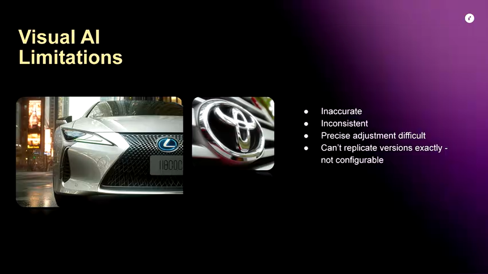

演讲者坦诚地指出当前视觉 AI 的问题：

- **不够精准**：细节经常出错（如上述狗的舌头）。
- **不够一致**：同一提示词的多次生成结果差异较大。
- **难以精确调整**：想微调某个细节往往会引发连锁变化。
- **无法复制版本**：这意味着**无法配置**——对于需要生成数百个配置变体的汽车营销来说，这是致命缺陷。

---

## 七、三种视觉 AI 落地方案的深度对比

针对上述局限，演讲者给出了三种技术路线：

### 方案 A：全 AI 生成（车辆 + 环境均由 AI 生成）

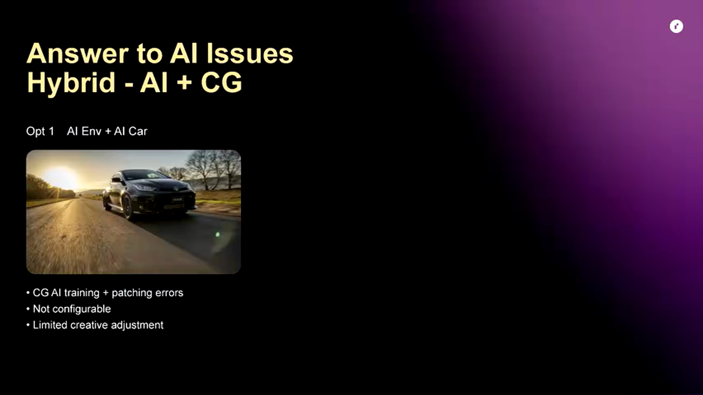

**工作流程**

1. 问题一：发布前车辆图像不存在于互联网，AI 无法从公开数据中学习。
2. 解决：用 CG 数字孪生生成大量训练图像，在本地（On-Premise）训练 AI 模型。
3. 问题二：即使训练后，AI 生成的车辆仍会有大灯、雨刮器等细节错误。
4. 解决：用 CG 模型修补这些区域。
5. 结论：**即使是"全 AI"方案，仍然离不开 CG**。

> **方案 A 评估**
> - 🟢 优势：环境生成极快，创意自由度高。
> - 🔴 劣势：车辆不可配置，细节易出错，需要 CG 修补，安全合规要求复杂（需本地训练）。
> - 🎯 适用场景：创意探索阶段，非最终交付物。

### 方案 B：AI 环境 + CG 车辆（推荐方案）


这是演讲者**最推荐**的方案：

1. 用 AI 生成包含代理车辆的完整场景（静态或视频）。
2. 移除 AI 生成的车辆，用 AI 修复背景。
3. 替换为 Unreal Engine 渲染的 CG 车辆。

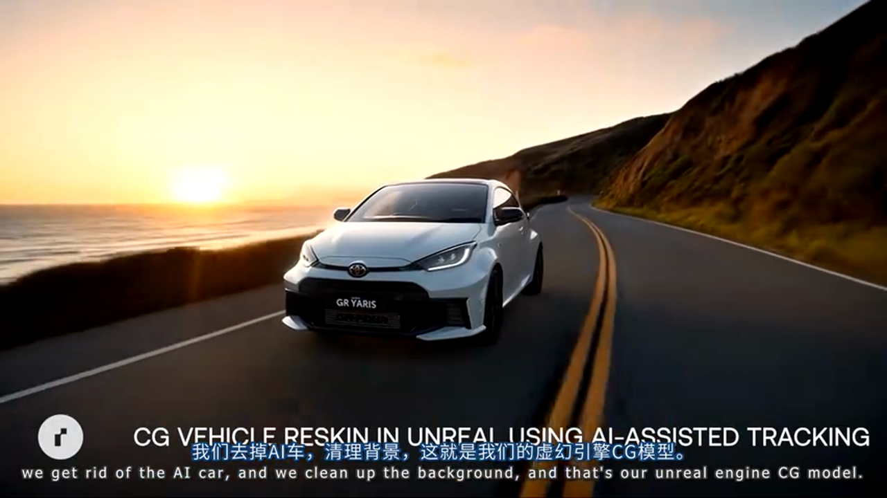

**关键优势**

- **产品绝对精准**：CG 模型来自 OEM 官方 CAD，分毫不差。
- **完全可配置**：颜色、轮毂、配件……任意切换。
- **支持个性化**：可以为每个客户生成专属配置的营销图。
- **支持全球化**：一套内容适配多个市场。
- **支持生命周期复用**：车型改款只需更新 CG 模型。

> **方案 B 评估**
> - 🟢 优势：产品精准可配置，环境制作成本大幅降低，支持全球化和生命周期复用。
> - 🔴 劣势：需要 CG 与 AI 的复合技能，合成工作流有一定复杂度。
> - 🎯 适用场景：**正式营销内容制作**，需要精准产品表现和大规模变体产出的场景。

**实际案例演示**

演讲者展示了用 AI 生成的海岸公路场景，然后替换为 CG 车辆的完整流程：

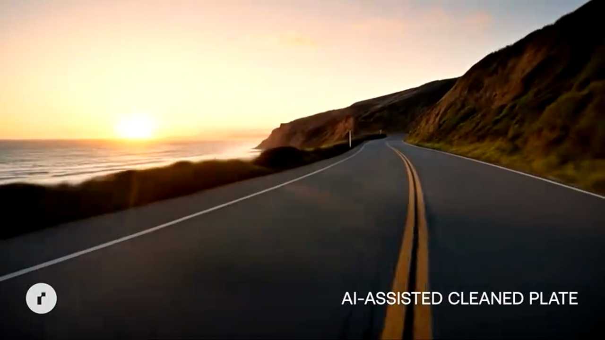

注意观察：AI 生成的车辆较为模糊，而 CG 车辆锐利清晰。CG 还能在精确控制车辆在画面中的位置（如从道路中央调整到正确车道）。

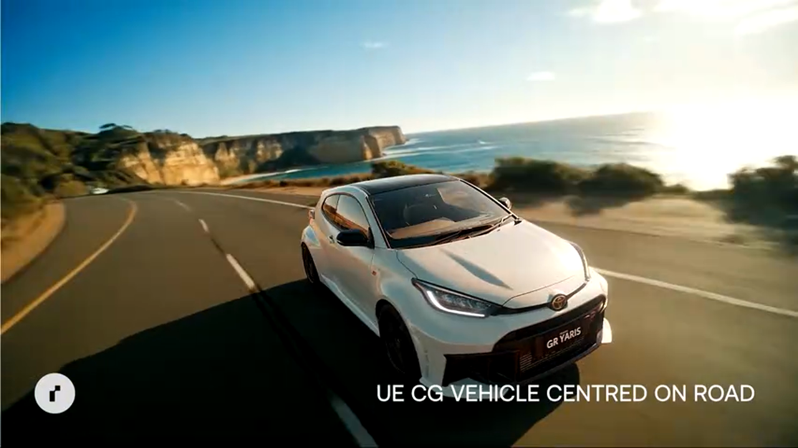

> **处理 AI 瑕疵的技巧**：AI 视频可能在某些帧出现背景扭曲（如悬崖的透视突变）。解决方法与传统实拍一样——**剪辑规避**，在扭曲发生前切到下一个镜头。

### 方案 C（传统进化）：实拍环境 + CG 车辆替换

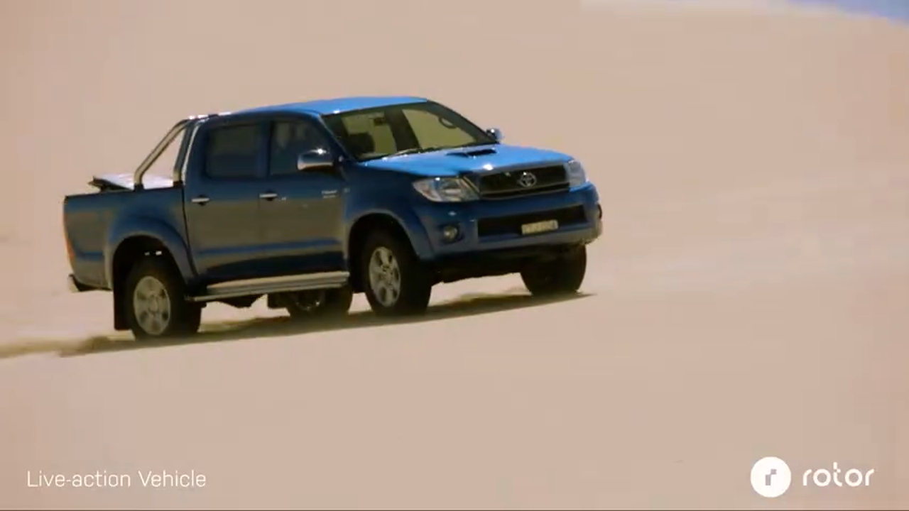

这是 Roda Studios 多年来一直使用的技术——拍摄真实环境中的真实车辆，然后用 CG 模型"换皮"：

1. 拍摄实拍素材（可使用任意车型作为代理）。
2. 跟踪真实车辆运动轨迹。
3. 在 Unreal Engine 中渲染目标 CG 车辆，叠加到实拍环境上。


**演变**：现在，AI 生成的视频可以完全取代实拍环境，省去了派遣摄制组、寻找外景、等待天气等高成本环节。

---

## 八、高斯点云（Gaussian Splats）：照片级 3D 环境的捷径

### 8.1 什么是高斯点云？

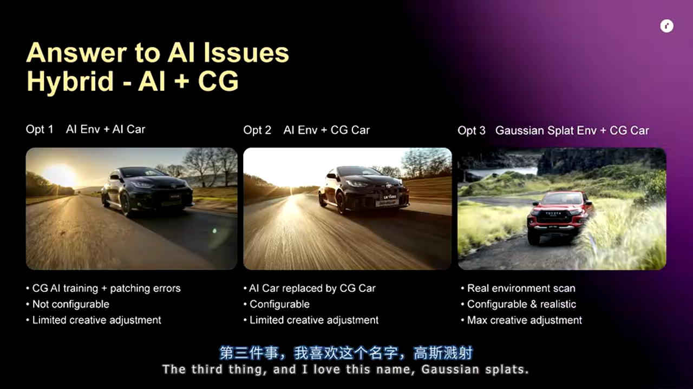

高斯点云是**辐射场（Radiance Fields）** 技术家族的一员，属于"AI 邻近"技术（AI-Adjacent），更偏向机器学习。

**核心流程**

1. 前往真实环境，用相机/手机拍摄大量照片或视频。
2. 将素材输入计算机，算法自动生成一个**照片级真实感的 3D 虚拟环境**。
3. 将该环境导入 Unreal Engine，与 CG 车辆结合。

### 8.2 实战案例：悉尼郊外有机环境扫描


演讲者展示了一个位于悉尼郊外的自然场景——草地、灌木、树木，大量有机细节。

> **关键数据**：一个人，不到一小时完成扫描（包括 HDRI 和 LiDAR 辅助）。计算机处理几小时后，得到可用的 3D 环境。


如果要用传统 CG 手工建模这种级别的有机细节，将是一项极其耗时的工作。高斯点云直接"捕获现实"，绕过了这一瓶颈。

### 8.3 与 Unreal Engine 集成


将高斯点云环境导入 Unreal Engine 后：

1. 添加虚拟驾驶路面（用于车辆物理模拟和正确遮挡）。
2. 放入 CG 车辆模型。
3. 完全控制镜头焦距、位置、运动轨迹。
4. 渲染出静态或动态内容。


**核心优势**

- **照片级真实**：环境直接来自真实世界，无需艺术家手动还原。
- **完全可控的虚拟拍摄**：在数字环境中"拍摄"，没有天气、光照、许可等变数。
- **产品可配置**：CG 车辆可以任意切换颜色、配置。

### 8.4 综合案例：大众汽车宣传片

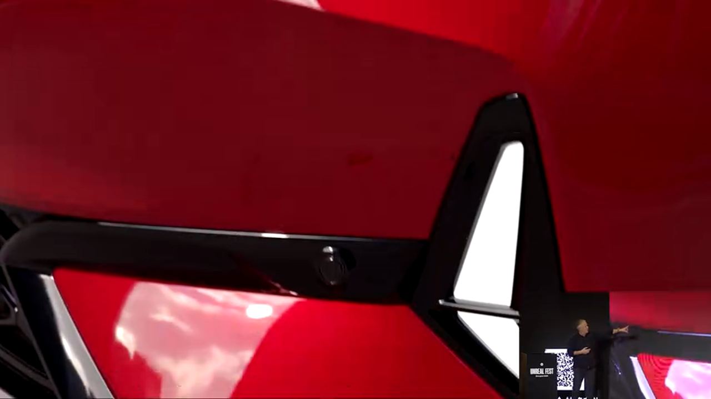

演讲者播放了一段为大众汽车制作的宣传片，展示了高斯点云与生成式 AI 的混合应用：

- 开场的精确镜头运动（推拉、环绕）使用**高斯点云环境** + CG 车辆——因为这类镜头对产品细节和镜头控制要求极高。
- 后续的驾驶场景使用**生成式 AI 环境** + CG 车辆——追求氛围和动感，对细节精度要求相对宽松。


> **关键策略**：根据每个镜头的需求，灵活选择高斯点云或 AI 生成环境。不是非此即彼，而是**组合使用**。

---

## 九、深度进阶：技术选型与决策框架

### 9.1 何时选择 AI 环境 vs 高斯点云 vs 传统 CG？

> **AI 生成环境**
> - 🟢 优势：创意自由度最高，可生成任何想象中的场景，成本最低。
> - 🔴 劣势：细节可能不够精确，难以控制特定建筑/地标的准确呈现，视频可能有时序不一致问题。
> - 🎯 适用场景：氛围镜头、驾驶场景、创意概念验证、对环境细节要求不苛刻的内容。

> **高斯点云环境**
> - 🟢 优势：照片级真实，扫描速度快，有机环境（植被、岩石）效果极佳，镜头可完全控制。
> - 🔴 劣势：需要实地扫描，动态元素（水流、人群）难以捕获，扫描范围有限。
> - 🎯 适用场景：品牌指定外景、产品静态展示、需要精确镜头控制的动态内容、有机自然环境。

> **传统 CG 环境（如 PCG）**
> - 🟢 优势：完全可控，可与产品无缝集成，支持复杂交互和物理模拟。
> - 🔴 劣势：制作周期长，成本高，有机细节难以达到照片级。
> - 🎯 适用场景：配置器背景、需要产品与环境深度交互的场景、VR/AR 体验。

### 9.2 混合工作流的最佳实践

演讲者强调，未来的内容制作不是"选择一种技术"，而是**根据每个镜头的需求动态组合**：

1. **静态产品展示**：高斯点云环境（真实感强） + CG 产品（精准可配置）。
2. **驾驶氛围镜头**：AI 生成视频（快速低成本） + CG 产品（精准可配置）。
3. **交互式配置器**：PCG 或简化 CG 环境（可实时运行） + CG 产品（精准可配置）。
4. **创意提案阶段**：纯 AI 生成（快速迭代，不追求产品精度）。

---

## 十、实战总结与避坑指南

### 10.1 关键技术决策清单

- **产品必须用 CG**：无论环境如何生成，产品（车辆）必须使用来自 OEM CAD 的 CG 数字孪生，这是精准度、可配置性和品牌合规的基础。
- **"单一数字孪生"原则**：所有渠道（网站、配置器、营销视频、社交媒体）使用同一个 Unreal Engine 车辆模型，确保视觉一致性。
- **AI 是增强而非替代**：把 AI 看作加速器和成本优化器，而非替代 CG 管线的银弹。
- **混合工作流**：高斯点云、AI 生成、传统 CG 三者并用，根据具体需求灵活选择。

### 10.2 避坑指南

- **AI 幻觉（Hallucination）**：AI 生成的内容总会有"一英尺长的狗舌头"这类问题，所有输出必须经过人工审核和修复。
- **AI 视频时序问题**：生成式 AI 视频可能在某些帧出现背景扭曲或物体消失，解决方法是在剪辑阶段规避这些帧。
- **训练数据安全**：如果需要为未发布车型训练 AI 模型，务必采用本地化（On-Premise）方案，确保 OEM 数据安全。
- **高斯点云的动态限制**：扫描过程中的动态元素（行人、车辆、风吹的树叶）会产生伪影，需要在场景选择时规避或后期清理。
- **分辨率匹配**：AI 生成的环境分辨率有限，与高分辨率 CG 产品合成时需要考虑 AI 超分辨率处理或设计上的妥协。

### 10.3 配置示例：推荐的软硬件栈

```
# Unreal Engine 配置建议
- 版本：UE5.3+ (支持 Gaussian Splatting 插件)
- 渲染器：Path Tracer (高保真静态) / Deferred Renderer (实时交互)
- 车辆准备：Datasmith 导入 CAD，标准化材质库

# 高斯点云工具链
- 扫描设备：高分辨率相机/手机 + LiDAR (iPhone Pro 或专业设备)
- 处理软件：Luma AI / Polycam / 3D Gaussian Splatting (开源实现)
- UE 集成：Gaussian Splatting 插件

# AI 生成工具 (根据需求选择)
- 图像生成：Stable Diffusion / Midjourney / DALL-E
- 视频生成：Runway Gen-2 / Pika Labs / Stable Video Diffusion
- 超分辨率：Topaz Video AI / Real-ESRGAN
- 本地训练：LoRA / DreamBooth (需本地 GPU 集群)
```

---

## 十一、结语

汽车营销内容制作正处于一个激动人心的转折点。生成式 AI 和高斯点云等新兴技术，与成熟的 Unreal Engine CG 管线相结合，正在重新定义"可能的边界"——在预算基本持平的情况下，交付数倍于以往的高质量内容。

**核心心智模型**：
- **CG 数字孪生是基石**——产品的精准度和可配置性无可替代。
- **AI 是加速器**——用于环境生成、创意探索、辅助资产，而非替代核心管线。
- **高斯点云是捷径**——将真实世界快速转化为可用的虚拟环境。
- **混合工作流是未来**——没有一种技术通吃，灵活组合才是最优解。

对于正在探索汽车（或其他高价值产品）营销内容制作的团队，本文介绍的技术路线值得深入研究和试点。关键是从一个具体项目开始，建立混合工作流的能力，逐步扩展应用范围。

---

**感谢 Scott Bradley 和 Roda Studios 的精彩分享！**

如需进一步交流，欢迎扫描文首二维码加入 UE5 技术交流群。


