# 虚幻引擎汽车行业 2025 深度解析：从可视化到 HMI 的全栈布局

---

## 加入 UE5 技术交流群

如果您对虚幻引擎5的图形渲染技术感兴趣，欢迎加入我们的 **UE5 技术交流群**！

扫描上方二维码添加个人微信 **wlxklyh**，备注"UE5技术交流"，我会拉您进群。

在技术交流群中，您可以：
- 与其他UE开发者交流渲染技术经验
- 获取最新的GDC技术分享和解读
- 讨论图形编程、性能优化、构建工具流、动画系统等话题
- 分享引擎架构、基建工具等项目经验和技术难题

---

**源视频信息**
- **标题**: [UFSH2025]汽车峰会开幕致辞 - 虚幻引擎在汽车领域的2025动态 | Francois Antoine Epic Games
- **时长**: 约17分钟
- **视频链接**: https://www.bilibili.com/video/BV1EpmzBoELP
- **说明**: 本文基于 AI 辅助生成，结合视频内容进行技术深度解读

---

> **核心观点**
> - 汽车行业已成为 Epic Games **增长最快**的垂直领域，全球 Top 20 OEM 中有 16 家使用虚幻引擎
> - Epic 正在构建从 **Twinmotion**（低门槛）到 **Unreal Engine**（高定制）的完整产品矩阵，覆盖设计、营销到量产 HMI 的全生命周期
> - UE 5.7 的 **Multi-World** 技术和 5.8 的 **HMI Template** 将显著降低车载嵌入式开发的内存占用和开发周期

**前置知识要求**：了解虚幻引擎基础概念、对汽车可视化或车载 HMI 开发有基本认知

---

## 一、背景与痛点：为什么汽车行业需要实时渲染引擎？

### 1.1 传统工作流的瓶颈

在传统汽车设计流程中，从 CAD 数据到最终营销素材，往往需要经历多次数据转换和离线渲染。这带来了几个核心痛点：

- **迭代周期长**：离线渲染动辄数小时，设计评审效率低下
- **数据孤岛**：设计、营销、HMI 各自为战，资产难以复用
- **技术门槛高**：传统 DCC 工具需要资深技术美术，人才成本高昂

### 1.2 实时渲染的破局点

虚幻引擎通过 **实时光线追踪**、**Nanite 虚拟几何体**、**Lumen 全局光照** 等技术，将"所见即所得"带入汽车设计流程。正如 Epic Games 汽车产品负责人 Francois Antoine 在演讲中提到的：

> "汽车行业实际上是 Epic 目前增长最快的领域，我们正在比以往任何时候都更加投入这个市场。"

---

## 二、市场格局：虚幻引擎在汽车行业的渗透率

### 2.1 全球市场数据

演讲中披露了几个关键数据点，揭示了虚幻引擎在汽车行业的主导地位：

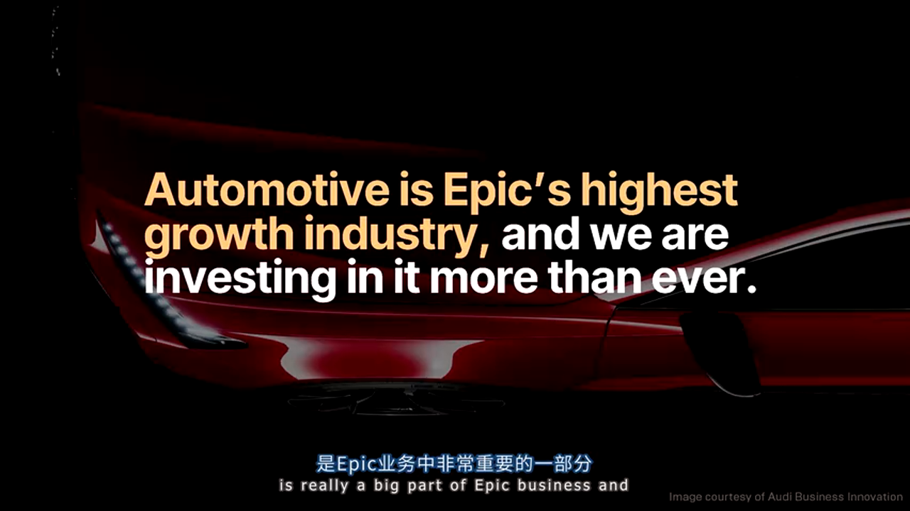

**全球 OEM 覆盖率**：
- 全球销量 Top 20 的 OEM 中，**16 家**正在使用虚幻引擎
- 这意味着超过 80% 的头部车企已将 UE 纳入其数字化工具链

### 2.2 中国市场的特殊地位

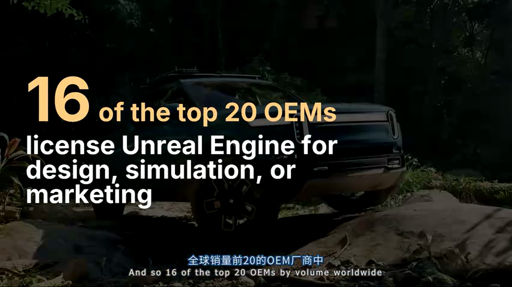

中国市场呈现出更高的集中度：

- **90% 的中国汽车可视化公司**使用虚幻引擎进行可视化工作
- 这一比例远超全球平均水平，反映出中国市场对高质量实时渲染的强烈需求

### 2.3 标杆案例：小米 SU7 Ultra

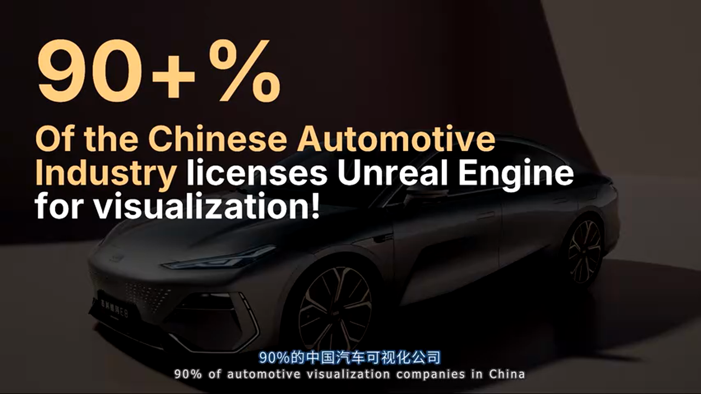

小米汽车为 SU7 Ultra 制作的宣传视频**完全使用虚幻引擎**完成。这个案例的意义在于：

- 证明了 UE 在高端汽车营销领域的画质表现力
- 展示了从概念设计到最终输出的全流程可控性
- 为国内车企提供了可复制的技术路径参考

---

## 三、产品战略：Twinmotion 与 Unreal Engine 的双轨布局

### 3.1 问题的本质：用户分层

传统上，虚幻引擎被定位为"万能工具"，覆盖设计评审、营销内容、HMI 开发等所有场景。但这种"一刀切"的策略存在明显问题：

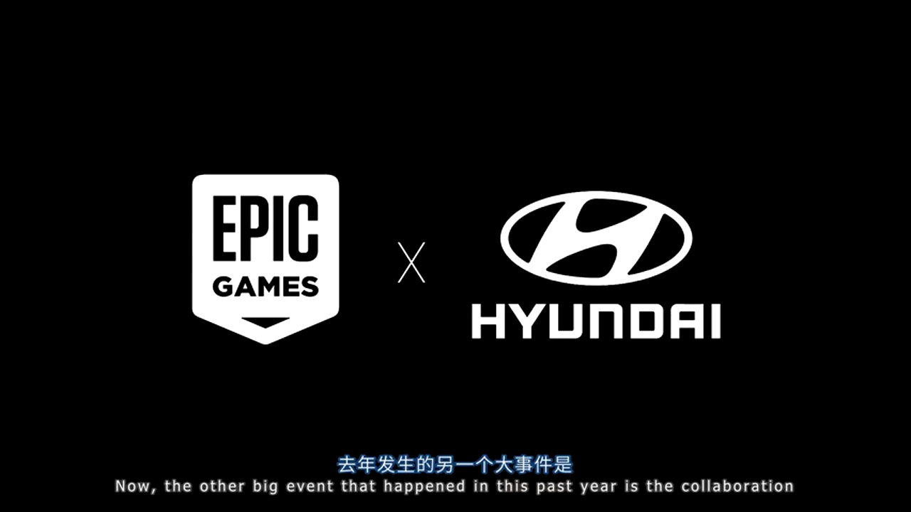

Epic 与现代汽车集团旗下的 **Genesis Design Studio** 进行了深度合作，重新审视了整个工作流。他们发现：

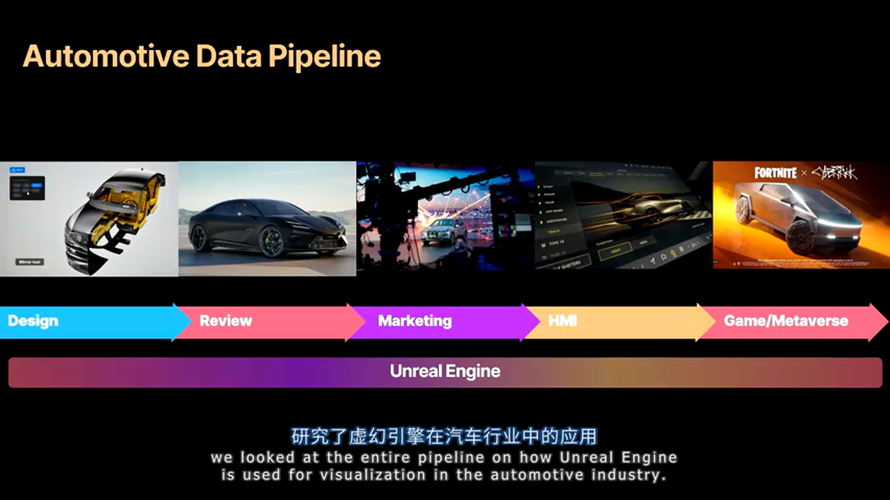

- 设计师和营销人员**不需要**虚幻引擎的全部功能
- 他们需要的是**低门槛、快速出图**的工具
- 而 HMI 和游戏开发则需要完整的引擎能力

### 3.2 解决方案：Twinmotion 汽车化

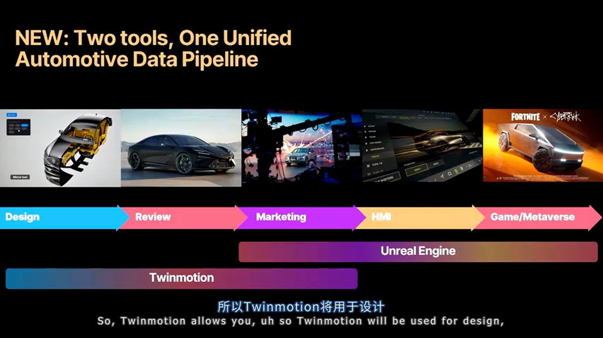

基于这一洞察，Epic 将 **Twinmotion** 引入汽车设计流程：

**Unreal Engine（左侧）**
- 🟢 优势：功能完整，高度可定制，支持复杂交互逻辑
- 🔴 劣势：学习曲线陡峭，需要技术美术支持
- 🎯 适用场景：HMI 开发、高端定制可视化、游戏化体验

**Twinmotion（右侧）**
- 🟢 优势：界面简洁直观，拖拽式操作，开箱即用
- 🔴 劣势：定制能力有限，不适合复杂交互
- 🎯 适用场景：设计评审、快速营销内容、概念展示

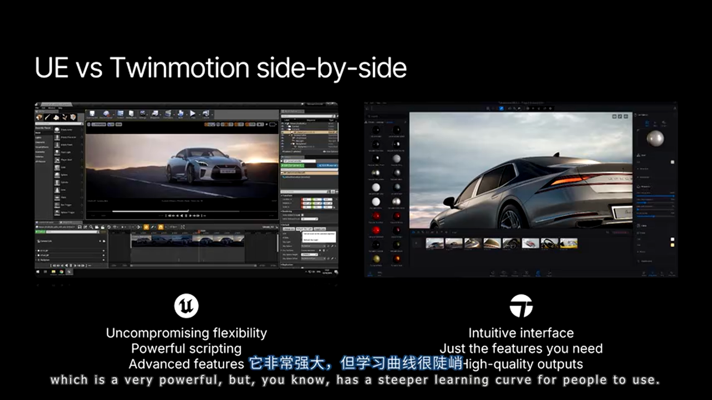

### 3.3 Twinmotion 2025.1 汽车专属功能

在与 Genesis Design Studio 的合作中，Epic 为 Twinmotion 添加了一系列汽车行业专属功能：

**核心新增功能**：
- **网格编辑能力**：支持直接翻转法线（Flip Normals），解决 CAD 导入的常见问题
- **配置器系统**：拖拽式创建车辆配置切换，无需编程
- **材质预设库**：汽车级材质开箱即用

> 这些功能已在 **Twinmotion 2025.1** 版本中发布，可立即使用。

---

## 四、技术深潜：Genesis G90 配置器的工程挑战

### 4.1 项目规格

这是一个将虚幻引擎推向极限的项目：

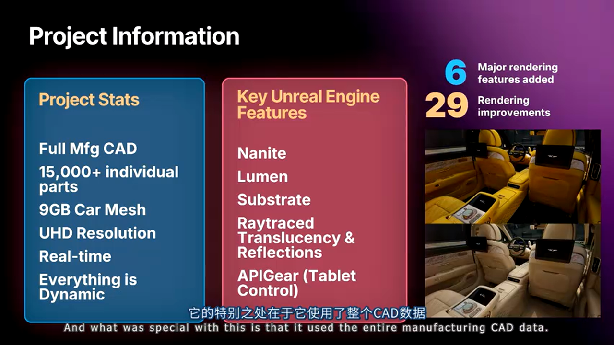

**项目参数**：
- **零件数量**：15,000+ 独立部件
- **数据来源**：完整制造级 CAD 数据（非简化模型）
- **网格数据量**：约 9GB（仅车辆模型）
- **内容范围**：包含电子元件、线束、发动机内部结构等全部细节

### 4.2 技术栈选择

**渲染管线配置**：
- **光照系统**：Lumen 全动态光照
- **材质系统**：Substrate（替代传统 Shading Model）
- **透明物体**：光线追踪透明（Ray Traced Translucency）
- **运行模式**：完全实时，无预烘焙

### 4.3 为此项目开发的引擎增强

这个项目倒逼 Epic 对渲染管线进行了大量改进：

- **6 项新渲染功能**专为汽车可视化需求开发
- **29 项渲染改进**提升现有功能的表现力

> 所有这些功能已在 **UE 5.6** 中发布，开发者可直接使用。

### 4.4 设计决策分析

**为什么使用完整 CAD 数据？**

- 传统做法是将 CAD 简化后再导入引擎，减少面数
- 但这会导致**设计-工程断裂**：可视化团队和工程团队使用不同模型
- 使用原始 CAD 数据实现了**单一数据源**（Single Source of Truth）

**无艺术干预（No Artistic Intervention）的意义**

- 证明了引擎的开箱即用能力
- 降低了对技术美术的依赖
- 为自动化管线铺平道路

---

## 五、可视化工具链升级：AXF 导入器重写

### 5.1 AXF 是什么？

**AXF（Appearance Exchange Format）** 是 X-Rite Pantone 材质扫描仪输出的标准格式。它能够捕获真实材质的：

- BRDF（双向反射分布函数）
- 微表面细节
- 各向异性反射特性

### 5.2 新版导入器的改进

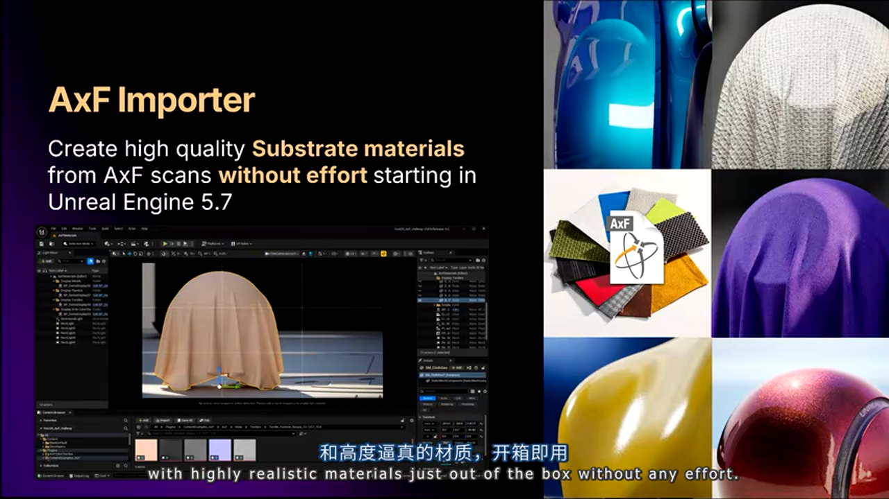

Epic 完全重写了 AXF 导入器：

**工作流改进**：
- **一键导入**：无需手动调整参数
- **自动生成 Substrate 材质网络**：充分利用新材质系统的表现力
- **高保真还原**：扫描材质与实物差异最小化

**技术实现要点**：
- 自动解析 AXF 文件中的多层材质数据
- 映射到 Substrate 的 Advanced Layer 系统
- 保留原始扫描的 HDR 色彩空间

### 5.3 可视化工具链路线图

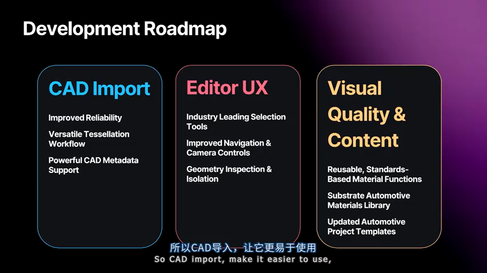

Epic 宣布首次设立**可视化专职产品经理**，后续重点方向包括：

**CAD 导入优化**：
- 更广泛的格式支持
- 更好的开箱即用效果
- 生产就绪（Production Ready）级别的稳定性

**编辑器增强**：
- 大规模 CAD 数据集管理工具
- 零件结构可视化和导航
- 降低高质量输出的技术门槛

---

## 六、HMI 领域：从 0 到 30 款量产车型

### 6.1 发展历程

Epic 的 HMI 业务始于 2020 年，短短 5 年时间：

- **全球**：30 款车型搭载基于 UE 的 HMI 系统
- **中国**：10 款车型已上市

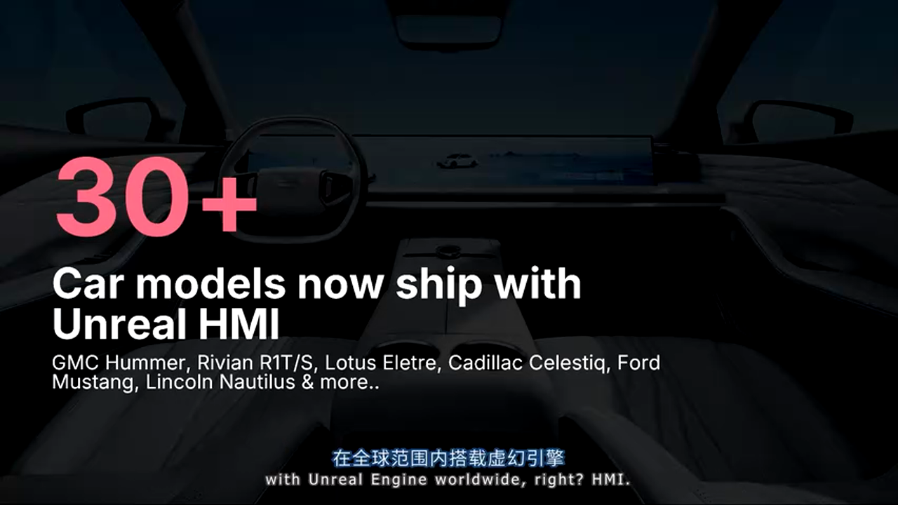

### 6.2 标杆案例展示

**吉利银河 E8**

吉利在银河 E8 上实现了极具视觉冲击力的 3D 仪表和中控界面，展示了 UE 在量产车型上的成熟应用。

**领克 900**

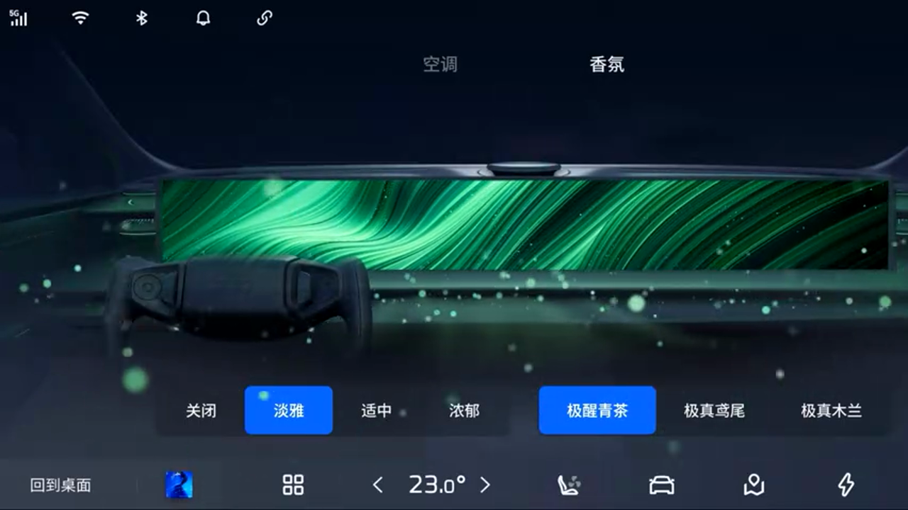

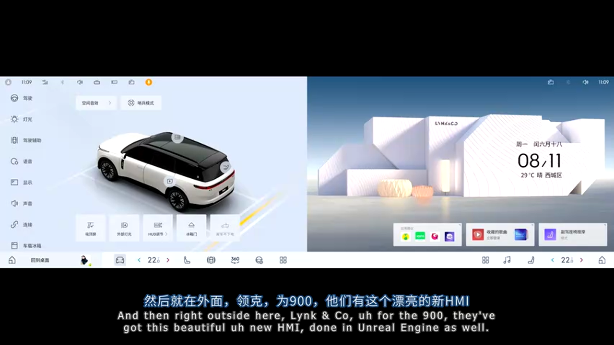

领克 900 的 HMI 系统以**响应速度快、视觉效果精致**著称，是 UE 在高端车型上的又一成功案例。

### 6.3 高通合作战略

Epic 与 Qualcomm 达成深度合作：

**合作内容**：
- 针对高通汽车平台进行**深度性能优化**
- 虚幻引擎将**预集成**到高通平台 SDK 中
- 首次展示：CES 2025 上的 Qualcomm Zinger 概念车

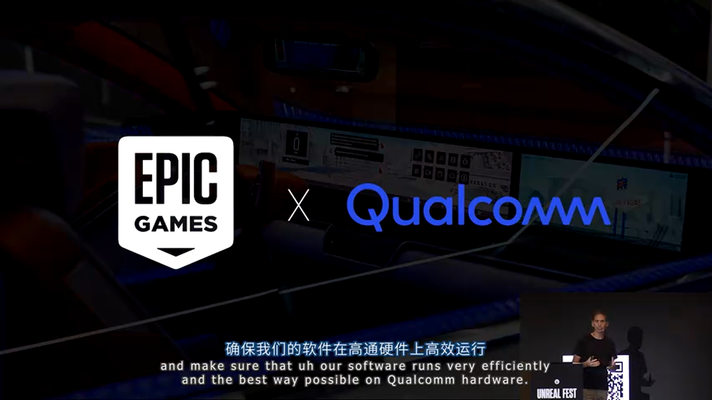

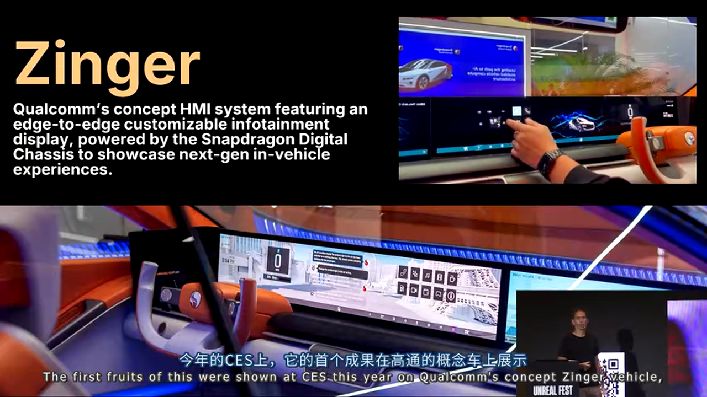

**战略意义**：
- 缩短 Tier 1 和 OEM 的集成周期
- 提供经过验证的性能基准
- 降低 HMI 项目的技术风险

---

## 七、技术路线图：UE 5.6 到 5.8 的演进

### 7.1 UE 5.6（已发布）

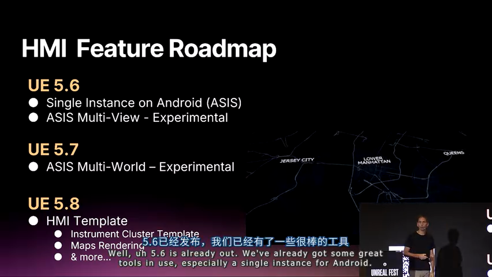

**HMI 相关特性**：
- **Single Instance for Android**：单实例运行，降低系统资源占用

### 7.2 UE 5.7（开发中）

**Multi-World 技术**是 5.7 的核心亮点：

**技术原理**：
- 单个 UE 实例可同时渲染**多个独立世界**
- 每个世界可以有独立的 Level 和内容
- 共享引擎核心，大幅节省内存

**实际应用场景**：
- 仪表盘渲染一个世界（3D 车辆模型、导航等）
- 中控屏渲染另一个世界（娱乐系统、设置界面等）
- 后排娱乐渲染第三个世界
- 所有这些**共享一个 UE 进程**

**内存优化效果**：
- 传统方案：N 个屏幕 = N 个 UE 实例 = N 倍内存
- Multi-World：N 个屏幕 = 1 个 UE 实例 + N 个轻量级世界

### 7.3 UE 5.8（规划中）

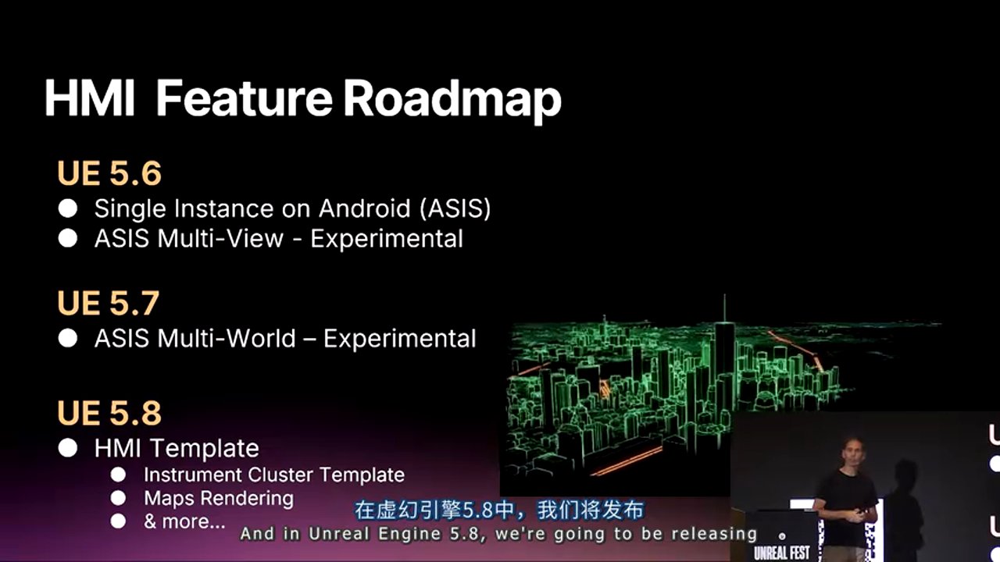

**HMI Template**将首次发布：

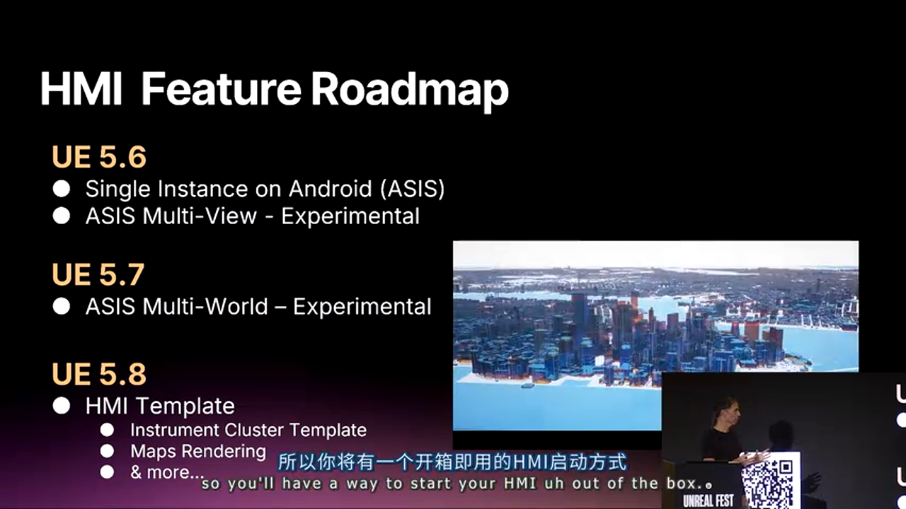

**模板包含**：
- 预配置的 HMI 项目框架
- **地图渲染技术**（Maps Rendering）首次内置
- 仪表盘模板（Instrument Cluster Template）
- 常用 HMI 组件库

> 这将显著降低 HMI 项目的启动成本，特别适合中国市场快速迭代的需求。

---

## 八、生态延展：Fortnite 跨界营销

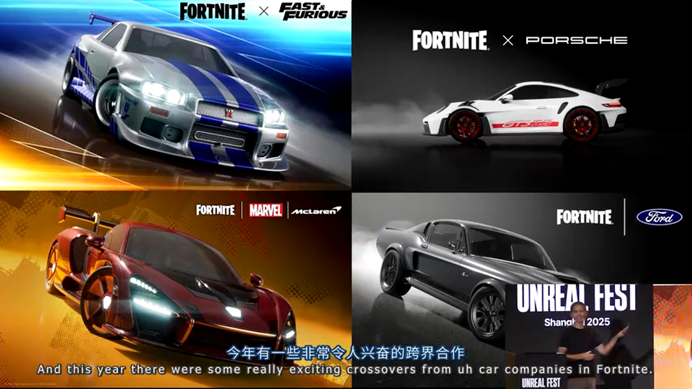

作为游戏公司，Epic 还为汽车客户提供了独特的营销渠道——**Fortnite 跨界合作**：

**合作模式**：
- 品牌车辆进入 Fortnite 游戏世界
- 虚拟试驾体验
- 年轻用户群体触达

这种"工具+平台"的商业模式是 Epic 区别于其他引擎厂商的独特优势。

---

## 九、实战总结与建议

### 9.1 工具选型指南

**Twinmotion vs Unreal Engine 选型矩阵**

**选择 Twinmotion 的情况**：
- 团队以设计师/营销人员为主
- 项目周期短，需要快速出图
- 交互需求简单（静态展示、简单配置切换）
- 预算有限，无法配置专职技术美术

**选择 Unreal Engine 的情况**：
- 需要复杂交互逻辑（游戏化体验、AR/VR）
- 项目需要长期维护和迭代
- 有专业技术团队支持
- 需要与 HMI 开发共享资产

### 9.2 避坑指南

**CAD 导入常见问题**：
- 法线方向错误导致渲染黑面 → 使用 Twinmotion 的 Flip Normals 功能
- 材质丢失或错乱 → 建立清晰的材质命名规范
- 性能不足 → 对于实时预览，考虑使用 LOD 或 Nanite

**HMI 开发注意事项**：
- 内存预算要预留 Multi-World 迁移空间
- 与高通平台集成时，使用官方参考配置
- 地图渲染功能需等待 5.8 正式版

**可视化项目建议**：
- 复杂材质优先使用 AXF 扫描数据
- 建立 Substrate 材质库，减少重复工作
- 关注 5.6 中的 29 项渲染改进，评估是否适用于当前项目

### 9.3 版本迁移建议

**当前项目使用 5.5 及以下**：
- 评估 5.6 的渲染改进是否解决现有痛点
- 如有多屏幕需求，关注 5.7 的 Multi-World

**新项目启动**：
- 可视化项目直接使用 5.6
- HMI 项目可等待 5.8 的 HMI Template

---

## 十、结语

虚幻引擎在汽车行业的布局已经从"游戏引擎跨界"演变为"全栈汽车数字化平台"。从 Twinmotion 的低门槛设计工具，到 Unreal Engine 的高性能 HMI 运行时，再到 Fortnite 的跨界营销生态，Epic 正在构建一个覆盖汽车全生命周期的解决方案。

对于国内车企和供应商而言，关键的行动点是：

- **尽早评估 Multi-World 技术**对现有 HMI 架构的影响
- **建立 Twinmotion + UE 的双轨工作流**，释放设计团队生产力
- **关注高通合作进展**，提前规划下一代平台选型

技术的演进不会等待，把握窗口期才能在这场数字化竞赛中占据先机。

---

*本文基于 Epic Games 汽车峰会演讲内容整理，如需了解更多技术细节，请参考官方文档或加入 UE5 技术交流群讨论。*

