# 虚幻引擎5.6汽车可视化技术深度解析：从照片级真实感到生产力工具链

---


## 加入 UE5 技术交流群

如果您对虚幻引擎5的图形渲染技术感兴趣,欢迎加入我们的 **UE5 技术交流群**!

扫描上方二维码添加个人微信 **wlxklyh**,备注"UE5技术交流",我会拉您进群。

在技术交流群中,您可以:
- 与其他UE开发者交流渲染技术经验
- 获取最新的GDC技术分享和解读
- 讨论图形编程、性能优化、构建工具流、动画系统等话题
- 分享引擎架构、基建工具等项目经验和技术难题

---

> **本文基于视频内容生成**
> 
> - 原视频: [UFSH2025]汽车可视化设计高阶技巧 | Marien El Alaoui Epic Games 首席技术美术师
> - 视频链接: https://www.bilibili.com/video/BV1HLmzBaE2W
> - 时长: 48分12秒
> - 本文由AI辅助生成,结合视频截图与字幕内容

---

## 导读

> **核心观点**
> 
> - UE 5.6 的 Substrate 材质系统实现了物理精确的多层材质渲染,可完美还原汽车清漆、金属漆等复杂材质
> - 通过精确的数据采集流程(光照测量、色彩校准、CAD数据导入),可实现虚拟场景与真实照片的像素级匹配
> - 虚幻引擎不仅是渲染工具,更是生产力平台——通过C++/Blueprint自定义工具可大幅提升团队效率

**前置知识**: 本文假设读者熟悉虚幻引擎基础操作、材质系统、光照原理,以及基本的图形学概念(PBR、光线追踪等)。

---

## 背景与痛点

### 汽车可视化的行业挑战

在汽车行业的数字化转型中,**照片级真实感渲染**已成为设计评审、营销宣传的核心需求。传统的离线渲染方案(如V-Ray、Arnold)虽然质量高,但存在致命缺陷:

- **迭代周期长**: 单帧渲染可能需要数小时,设计师无法实时预览效果
- **交互性差**: 无法动态调整视角、光照、材质
- **成本高昂**: 需要专业渲染农场和长时间等待

Epic Games 与现代汽车(Hyundai)的合作项目验证了一个关键假设:**实时渲染引擎可以达到离线渲染的质量标准**。

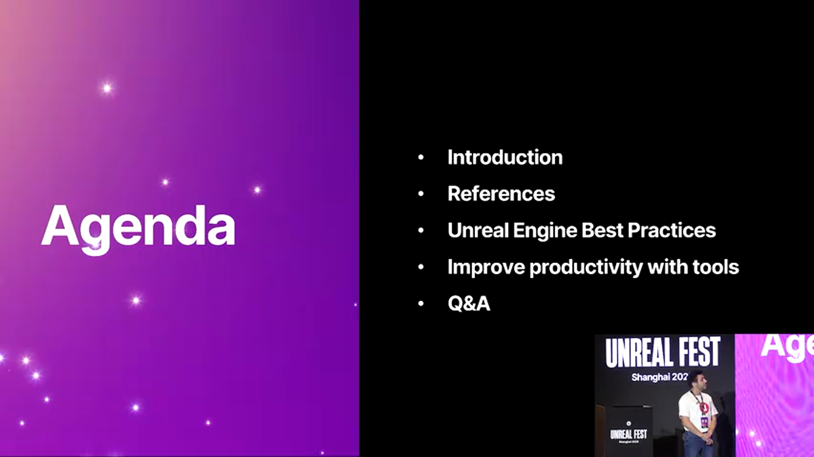
*项目目标:展示UE 5.6新特性在汽车可视化中的应用*

### 为什么选择虚幻引擎5.6?

UE 5.6 引入了三大革命性技术:

1. **Substrate 材质系统**: 物理精确的多层材质模型
2. **增强的光线追踪**: 支持透射阴影(Translucent Shadow)、多层透明反射
3. **Nanite 优化**: 针对高精度模型的质量提升选项

这些特性使得实时渲染首次能够**在不牺牲质量的前提下**实现交互式工作流。

---

## 核心原理解析

### 一、数据采集:真实世界的数字化

#### 1.1 环境光照采集

要实现照片级匹配,第一步是**精确复刻真实世界的光照条件**。


*使用照度计测量环境光照强度*

**关键步骤**:

1. **光照强度测量**
   - 使用专业照度计(Lux Meter)测量环境光
   - 记录主光源方向、强度、色温
   - 测量环境反射光(Ambient Light)的贡献

2. **物理曝光设置**
   ```
   配置示例:
   - ISO: 100
   - 快门速度: 1/125s
   - 光圈: f/5.6
   - 色温: 5600K (日光)
   ```

3. **在UE中还原**
   - 使用 Physical Sky + Directional Light
   - 启用 **Physical Camera** 模式
   - 匹配测量的曝光参数

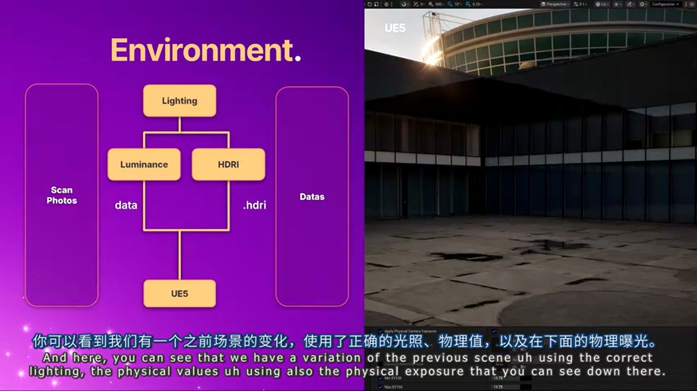
*上图:UE渲染结果;下图:真实照片参考。注意光照强度和阴影的精确匹配*

> **避坑指南**: 很多团队忽略了**环境反射光**的测量,导致阴影区域过暗。建议使用灰球(Gray Sphere)采集环境光的IBL数据。

#### 1.2 色彩校准流程

色彩空间不匹配是导致"看起来不对"的首要原因。


*使用X-Rite ColorChecker进行色彩校准*

**校准步骤**:

1. **拍摄标准色卡**
   - 在目标环境中拍摄 ColorChecker
   - 确保色卡与车辆接受相同光照

2. **相机色彩配置文件(Camera Profile)**
   - 使用 DaVinci Resolve 或 Adobe Camera Raw 生成 LUT
   - 将 LUT 应用到所有参考照片

3. **UE 中的色彩空间设置**
   ```
   项目设置:
   - Working Color Space: ACEScg
   - Output Color Space: sRGB (for display)
   - Texture Import: 启用 sRGB 转换(对于 Albedo 贴图)
   ```


*UE中的纹理导入设置:确保色彩空间正确*

#### 1.3 CAD 数据导入与清理

汽车制造商通常提供 CAD 数据(STEP/IGES 格式),但这些数据并非为实时渲染优化。


*使用 Datasmith 导入 CAD 数据*

**导入流程**:

1. **使用 Datasmith**
   - 支持多种 CAD 格式
   - 自动处理单位转换
   - 保留材质命名

2. **常见问题与解决**:
   - **缺失 UV**: 使用 Modeling Tools 自动生成 UV
   - **拓扑问题**: Nanite 可以处理大部分情况,但轮胎等高形变部件需要手动优化
   - **材质丢失**: 根据命名规则批量重新分配


*轮胎扫描数据补充 CAD 模型的细节*

> **最佳实践**: 对于轮胎、座椅等需要高频细节的部件,使用**摄影测量扫描**补充 CAD 数据。

---

### 二、Substrate 材质系统:物理精确的多层渲染

#### 2.1 什么是 Substrate?

Substrate 是 UE 5.5+ 引入的**新一代材质模型**,取代了传统的 Default Lit 着色模型。

**核心优势**:

- **能量守恒**: 自动确保反射+透射+吸收 = 100%
- **多层支持**: 可堆叠清漆(Clear Coat)、金属层、各向异性层
- **物理精确**: 基于真实的 BRDF/BTDF 模型


*Substrate 支持的复杂材质结构:清漆+各向异性金属+Glints*

#### 2.2 汽车漆面材质实战

汽车漆面是**典型的多层材质**:

1. **底层**: 金属薄片(Metal Flakes)
2. **中层**: 色漆(Base Coat)
3. **顶层**: 透明清漆(Clear Coat)


*左:物理参考样本;右:UE Substrate 还原结果*

**材质节点配置**:

```
Substrate Material Graph:
├─ Slab BSDF (Clear Coat)
│  ├─ Roughness: 0.02
│  ├─ IOR: 1.5
│  └─ Thickness: 50μm
└─ Horizontal Mix
   ├─ Slab BSDF (Metal Flakes)
   │  ├─ Anisotropy: 0.8
   │  ├─ Glints Density: 0.3 (新功能!)
   │  └─ Metallic: 1.0
   └─ Slab BSDF (Base Color)
      └─ Diffuse Albedo: [Color Texture]
```

> **5.6 新特性**: **Glints Density** 参数可控制金属薄片的密度,实现从稀疏到密集的平滑过渡。

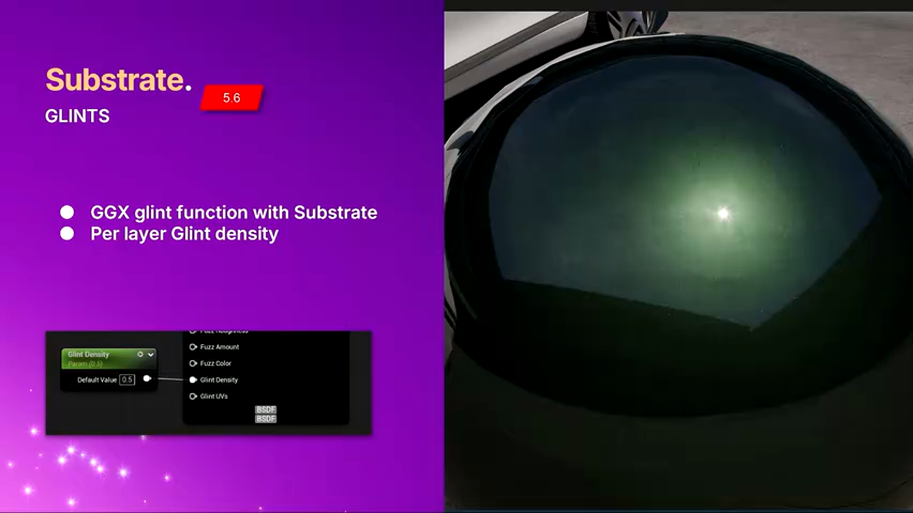
*Glints Density 从 0 到 1 的效果对比*

**关键 Console Variables**:

```
; 启用能量守恒(5.6 默认开启)
r.Substrate.EnergyConservation 1

; 增加复杂材质的字节预算
r.Substrate.BytesPerPixel 32  ; 默认16,复杂材质建议32
```

#### 2.3 玻璃材质:透射与吸收

汽车玻璃需要同时处理**反射、透射、吸收**三种光学现象。


*5.6 新增的透射阴影(Translucent Shadow)效果*

**配置要点**:

1. **Substrate Slab BSDF**
   - Base Color: 玻璃色调(如绿色)
   - Opacity: 0.1 (10%吸收)
   - Roughness: 0.01 (高光滑度)

2. **启用透射阴影**
   ```
   Directional Light 设置:
   - Cast Ray Traced Shadows: True
   - Translucent Shadow: True (5.6新增)
   ```

3. **多层玻璃处理**
   ```
   ; 启用多层透明反射(5.6新增)
   r.RayTracing.Translucency.MaxRefractionRays 3
   r.RayTracing.Translucency.EnableRefraction 1
   ```

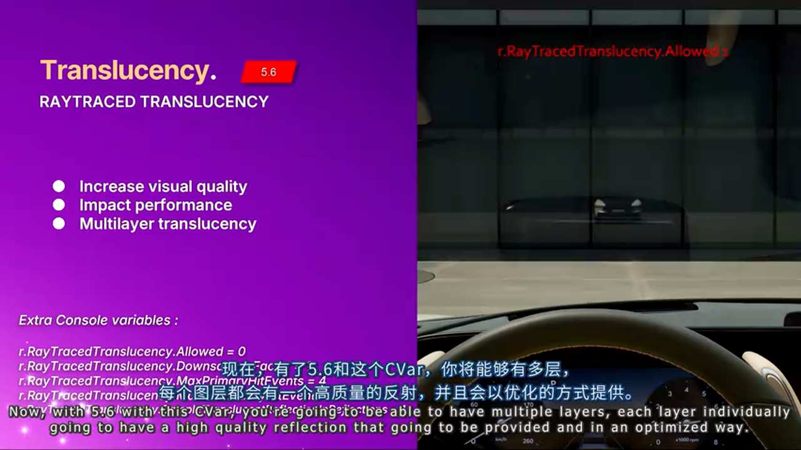
*多层玻璃的高质量反射:每层独立计算*

> **性能提示**: 多层透明反射有性能开销,建议根据场景复杂度调整 `MaxRefractionRays` (1-4)。

---

### 三、光线追踪优化技巧

#### 3.1 Nanite 与光线追踪的协同

Nanite 默认使用**低精度 Fallback Mesh** 进行光线追踪,这会导致反射中出现低模。


*左:使用 Fallback Mesh(低质量);右:使用 Nanite 全精度*

**解决方案**:

```
; 启用 Nanite 全精度光线追踪
r.RayTracing.Nanite.Mode 1  ; 0=Fallback, 1=Full Quality
```

**性能影响**:
- GPU 时间增加: 约 30-50%
- 适用场景: 静态渲染、高端硬件

> **方案对比**:
> 
> **方案 A: Fallback Mesh (默认)**
> - 🟢 优势: 性能友好,适合实时应用
> - 🔴 劣势: 反射质量下降,边缘锯齿
> - 🎯 适用场景: 游戏、VR 实时渲染
> 
> **方案 B: Nanite 全精度**
> - 🟢 优势: 照片级质量,无视觉妥协
> - 🔴 劣势: 性能开销大
> - 🎯 适用场景: 营销视频、设计评审

#### 3.2 Nanite 精度设置

Nanite 默认会**压缩顶点位置**以节省内存,但这会影响精度。


*Nanite Position Precision 设置*

**优化步骤**:

1. 打开 Static Mesh 编辑器
2. Nanite Settings → Position Precision
3. 从 `Auto` 改为 `Full` (全精度)

**影响**:
- 项目大小增加: 约 5-10%
- 视觉质量提升: 消除边缘抖动

**类似设置**:
- **Normal Precision**: 影响反射质量
- **Tangent Precision**: 影响各向异性材质

```
推荐配置(高质量):
- Position Precision: Full
- Normal Precision: High (16-bit)
- Tangent Precision: High
```

#### 3.3 光线追踪偏移(Ray Tracing Bias)

Nanite 与 Fallback Mesh 切换时可能产生**自相交伪影**。

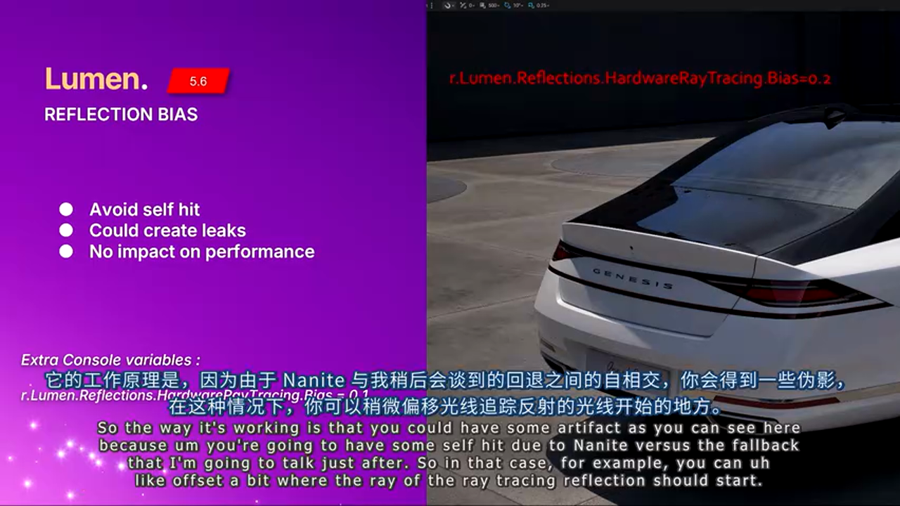
*自相交导致的黑色斑点*

**解决方案**:

```
; 调整光线起始偏移
r.RayTracing.NormalBias 0.1  ; 默认0.01,增大可减少自相交
```

> **调试技巧**: 使用 `r.RayTracing.DebugVisualizationMode 1` 可视化光线起点。

---

### 四、阴影系统选择

#### 4.1 三种阴影技术对比

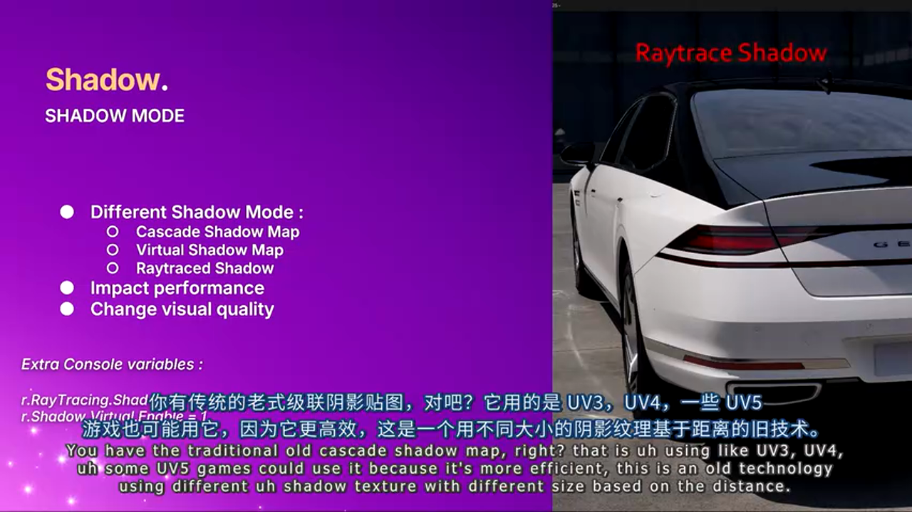
*阴影技术演进:CSM → VSM → RT Shadows*

> **方案对比**:
> 
> **方案 A: Cascade Shadow Maps (CSM)**
> - 🟢 优势: 性能最优,兼容性好
> - 🔴 劣势: 远距离质量差,需要调参
> - 🎯 适用场景: 移动端、低端PC
> 
> **方案 B: Virtual Shadow Maps (VSM)**
> - 🟢 优势: 自动LOD,无需调参
> - 🔴 劣势: 远距离仍有锯齿
> - 🎯 适用场景: 次世代游戏(默认)
> 
> **方案 C: Ray Traced Shadows**
> - 🟢 优势: 像素级精度,支持透射阴影
> - 🔴 劣势: 性能开销最大
> - 🎯 适用场景: 汽车可视化、建筑渲染

#### 4.2 启用光线追踪阴影

```
Directional Light 设置:
- Cast Ray Traced Shadows: True
- Samples Per Pixel: 4 (质量与性能平衡)
```

**Console Variables**:

```
; 禁用 VSM(避免冲突)
r.Shadow.Virtual.Enable 0

; 启用光线追踪阴影
r.RayTracing.Shadows 1
```

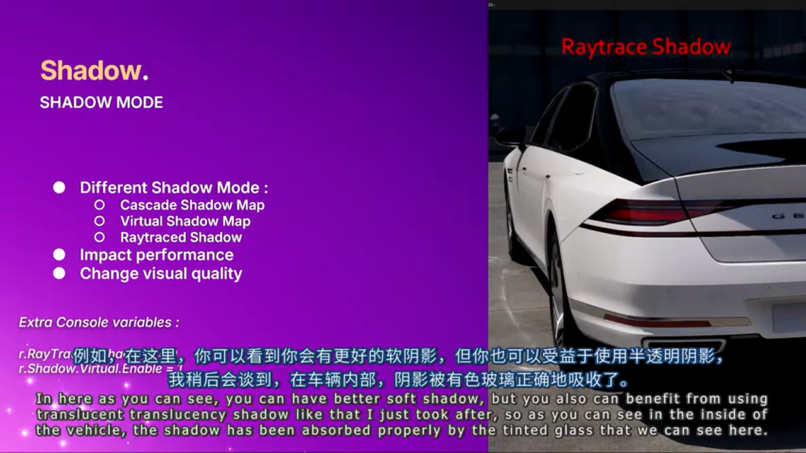
*透射阴影:玻璃吸收光线后的正确阴影*

---

## 深度进阶:生产力工具链

### 五、Variant Manager:配置管理利器

汽车项目通常需要管理**数十种配置**:颜色、轮毂、内饰等。手动切换效率极低。

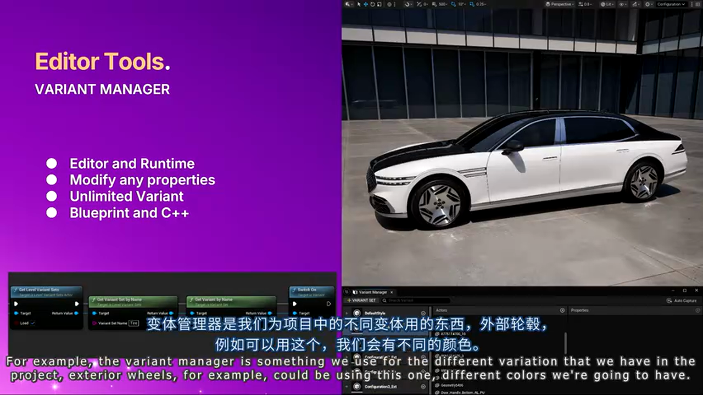
*Variant Manager 界面*

**使用流程**:

1. **创建 Variant Set**
   - Window → Variant Manager
   - 添加 Variant Set (如"车身颜色")

2. **捕获属性**
   - 选择 Actor
   - 右键 → Capture Properties
   - 自动记录材质、Transform 等

3. **切换配置**
   - 单击 Variant 名称即可切换
   - 支持 Blueprint/C++ 调用

**Blueprint 示例**:

```
Event BeginPlay
├─ Get Variant Manager
├─ Switch On String (用户选择)
│  ├─ "Red" → Apply Variant "Color_Red"
│  ├─ "Blue" → Apply Variant "Color_Blue"
│  └─ "Black" → Apply Variant "Color_Black"
```

---

### 六、Data Layers:场景管理

**痛点**: 多个环境(室内、室外、工作室)切换时,手动加载/卸载 Level 容易出错。


*Data Layers 管理多个环境*

**优势**:

- **自动流送**: 引擎自动管理加载/卸载
- **无缝切换**: 无明显卡顿
- **Blueprint 支持**:

```
; 加载"日间"环境
Load Data Layer "Environment_Day"

; 卸载"夜间"环境
Unload Data Layer "Environment_Night"
```

---

### 七、自定义编辑器工具(C++)

**核心思想**: 虚幻引擎不仅是渲染器,更是**可编程的生产力平台**。

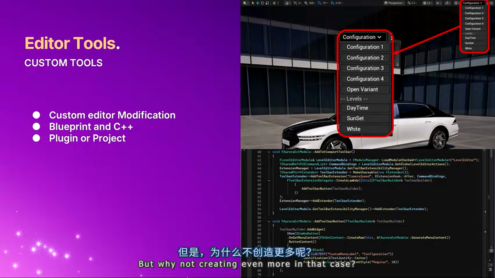
*自定义的"环境管理器"UI*

**案例:一键切换工具**

**需求**: 艺术家需要频繁切换:
- 车身颜色(Variant Manager)
- 环境(Data Layers)
- 时间(Sky Atmosphere)

**解决方案**: 创建自定义 Editor Utility Widget

```cpp
// C++ 核心逻辑
UCLASS()
class UEnvironmentManagerWidget : public UEditorUtilityWidget
{
    UFUNCTION(BlueprintCallable)
    void SwitchToPreset(FString PresetName)
    {
        // 1. 切换 Variant
        UVariantManager* VM = GetVariantManager();
        VM->SwitchToVariantByName(PresetName);
        
        // 2. 切换 Data Layer
        UDataLayerSubsystem* DLS = GetWorld()->GetSubsystem<UDataLayerSubsystem>();
        DLS->SetDataLayerRuntimeState(PresetName, EDataLayerRuntimeState::Activated);
        
        // 3. 更新时间
        ASkyAtmosphere* Sky = FindSkyAtmosphere();
        Sky->SetSunAngle(GetPresetSunAngle(PresetName));
    }
};
```

**效果**: 从"打开5个窗口,点击10次"缩减为"点击1个按钮"。

---

### 八、可视化调试工具

#### 8.1 View Modes

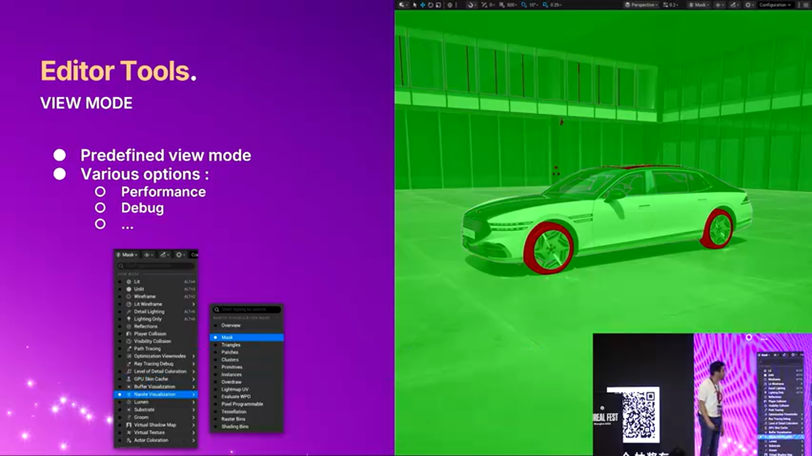
*Nanite Visualization: 红色=未启用,绿色=已启用*

**常用 View Modes**:

- **Nanite Visualization**: 检查哪些模型启用了 Nanite
- **Lumen Visualization**: 调试全局光照
- **Path Tracer Reference**: 离线质量参考

#### 8.2 Media Viewer (5.6 新增)

**功能**: 在编辑器内对比图片/视频。

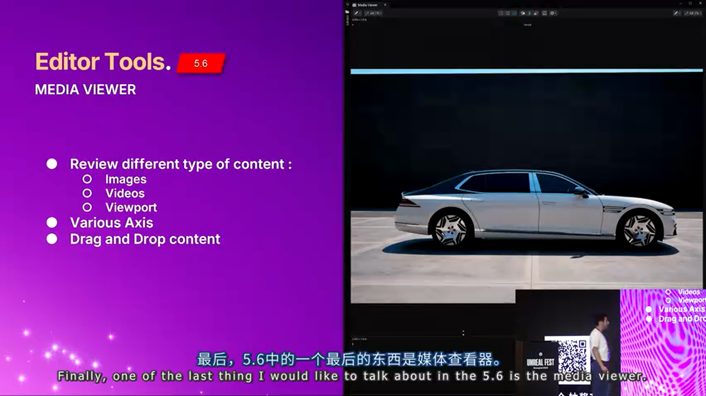
*Media Viewer 对比参考照片与实时渲染*

**用法**:

1. Window → Media Viewer
2. 加载参考图片
3. 选择 Viewport 作为第二输入
4. 实时对比调整

**价值**: 无需切换到 Photoshop,直接在引擎内验证匹配度。

---

## 实战总结与建议

### 避坑指南

1. **Substrate 材质**
   - ❌ 不要混用 Substrate 和 Default Lit
   - ✅ 全项目统一使用 Substrate
   - ⚠️ 复杂材质记得增加 `r.Substrate.BytesPerPixel`

2. **Nanite 精度**
   - ❌ 不要对所有模型启用全精度(浪费内存)
   - ✅ 仅对关键模型(车身、轮毂)启用
   - ⚠️ 轮胎等高形变部件不适合 Nanite

3. **光线追踪性能**
   - ❌ 不要在实时应用中启用 `r.RayTracing.Nanite.Mode 1`
   - ✅ 使用 Scalability 分级:实时用 Fallback,渲染用全精度
   - ⚠️ 透射阴影有约 10% 性能开销

4. **色彩管理**
   - ❌ 不要忽略色彩校准
   - ✅ 使用 ColorChecker 建立标准流程
   - ⚠️ 确保纹理导入时色彩空间正确

### 最佳实践清单

**数据准备阶段**:
- [ ] 使用照度计测量环境光
- [ ] 拍摄 ColorChecker 并生成 LUT
- [ ] 记录相机曝光参数(ISO/快门/光圈)
- [ ] 测量场景尺寸并在 UE 中验证

**材质制作阶段**:
- [ ] 统一使用 Substrate 材质
- [ ] 为复杂材质增加字节预算
- [ ] 使用物理测量的 IOR/Roughness 值
- [ ] 验证能量守恒(无过曝高光)

**渲染优化阶段**:
- [ ] 关键模型启用 Nanite 全精度
- [ ] 根据需求选择阴影技术
- [ ] 使用 View Modes 检查 Nanite 覆盖率
- [ ] Media Viewer 对比参考图

**工具链建设**:
- [ ] 使用 Variant Manager 管理配置
- [ ] 使用 Data Layers 管理场景
- [ ] 为重复操作创建自定义工具
- [ ] 建立标准化命名规范

---

## 结语

虚幻引擎 5.6 在汽车可视化领域实现了**质的飞跃**:

- **Substrate** 让物理精确的材质成为标配
- **增强的光线追踪** 消除了最后的视觉妥协
- **可编程的工具链** 将生产力提升到新高度

但技术只是工具,**真正的核心是方法论**:

1. **数据驱动**: 用测量数据而非主观调整
2. **系统思维**: 从数据采集到最终渲染的完整流程
3. **工具赋能**: 将重复劳动自动化

> **最后的建议**: 不要被技术细节淹没。从一个小场景开始,逐步验证每个环节,建立自己的标准流程。当流程稳定后,再考虑规模化和自动化。

---

**参考资源**:
- [UE 5.6 Substrate 文档](https://docs.unrealengine.com)
- [Nanite 优化指南](https://docs.unrealengine.com)
- [光线追踪最佳实践](https://docs.unrealengine.com)

**演讲者**: Marien El Alaoui (Epic Games 首席技术美术师)
**项目合作方**: 现代汽车(Hyundai)

---

*本文由 AI 辅助生成,基于 UFSH2025 技术分享视频内容整理。如需完整体验,请观看原视频。*


