# SpaceForm数字孪生平台：从BIM到城市级智能孪生的工程实践

---


## 加入 UE5 技术交流群

如果您对虚幻引擎5的图形渲染技术感兴趣，欢迎加入我们的 **UE5 技术交流群**！

扫描上方二维码添加个人微信 **wlxklyh**，备注"UE5技术交流"，我会拉您进群。

在技术交流群中，您可以：
- 与其他UE开发者交流渲染技术经验
- 获取最新的GDC技术分享和解读
- 讨论图形编程、性能优化、构建工具流、动画系统等话题
- 分享引擎架构、基建工具等项目经验和技术难题

---

**源视频信息：** [UFSH2025]从自动化到沉浸式体验: 利用AI与虚幻引擎构建城市级数字李生 | Jan Maarten Heuff SpaceForm CEO和联合创始人  
**视频链接：** https://www.bilibili.com/video/BV1eQsNzJEwx  
**本文由AI基于视频内容生成，结合截图与字幕进行深度技术解析**

---

## 导读

> **核心观点一：** 数字孪生不是可视化工具，而是物理资产在设计阶段的数字镜像，需要支持高频迭代和多方协作。
> 
> **核心观点二：** 自建BIM到UE5的自动化管线可将导入效率提升75%，二次更新效率提升90%，这是小团队服务大项目的关键。
> 
> **核心观点三：** AI赋能的"智能孪生"（Agentic Twin）将成为未来趋势——孪生体能够自主获取数据、更新自身并提供业务洞察。

**前置知识：** 本文适合熟悉虚幻引擎基础、了解BIM工作流、对数字孪生技术感兴趣的架构师和高级工程师阅读。

---

## 一、背景与痛点：为什么需要重新定义数字孪生？

### 1.1 建筑可视化行业的困境

SpaceForm的创始人Jan Maarten Heuff在演讲开头直言不讳地指出了传统建筑可视化（ArchViz）的三大痛点：

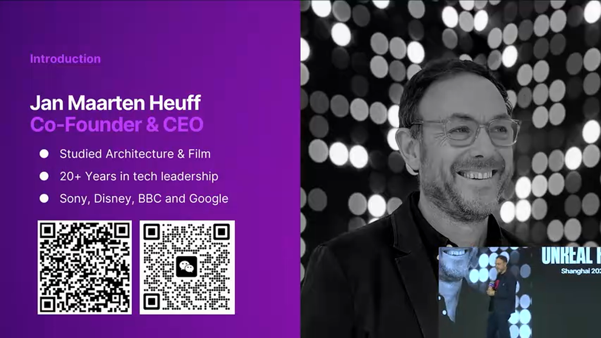

**痛点一：低保真度与更新困难**  
传统的静态渲染图虽然美观，但一旦设计变更，就需要重新渲染，周期长、成本高。客户期望的是"即时响应"——今天提出修改，明天就能看到效果。

**痛点二：BIM数据的混乱状态**  
即使在同一家设计公司内部，不同建筑师对材质命名、建模规范的理解也千差万别。这种不一致性导致BIM数据难以直接用于实时渲染引擎。

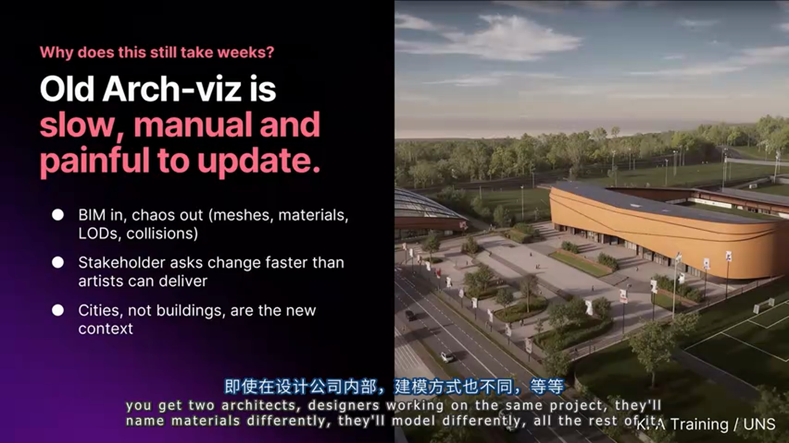

**痛点三：客户期望的指数级增长**  
现代地产客户不再满足于单体建筑的展示，他们需要**城市级上下文**（City-Scale Context）——建筑如何融入周边环境？日照如何？交通便利性如何？这些问题需要在数字孪生中实时回答。


### 1.2 数字孪生的商业价值

SpaceForm通过实际项目数据验证了数字孪生的ROI：

> **交易速度提升20%：** 通过沉浸式3D环境讲故事，客户决策周期显著缩短。  
> **三年期3:1投资回报率：** 每投入1美元在数字孪生上，三年内可获得3美元回报。


这些数字背后的逻辑是：**数字孪生让抽象的设计方案变得可感知、可互动**，从而加速了利益相关方的共识达成。

---

## 二、核心技术架构：SpacePort管线深度解析

### 2.1 为什么要自建管线？

Jan坦言，团队最初尝试了市场上所有主流方案（Omniverse、DataSmith等），但都遇到了同一个核心问题：

> **缺乏对几何体和材质的硬性定义（Hard Definition），导致无法进行深度优化。**

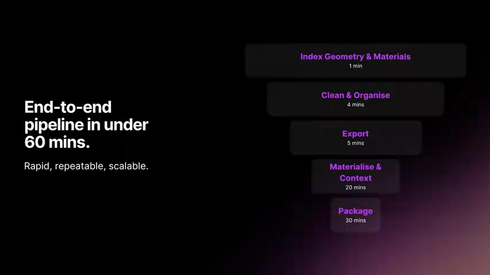

这里的"硬性定义"指的是：必须在BIM源头就明确每个几何体的实例化关系（Instancing）、材质映射规则和元数据索引，才能在UE5中实现**游戏级性能**（90 FPS）。

### 2.2 SpacePort插件：从Rhino到UE5的直通车

SpacePort是SpaceForm为Rhino开发的导出插件，其核心设计哲学是"**回归第一性原理**"——直接从设计软件中提取原始几何数据，而非依赖中间格式的转换。


#### 性能对比实验

在演示视频中，Jan展示了一个令人震撼的对比：

- **标准导入流程：** 35-40 FPS
- **SpacePort优化后：** 120 FPS

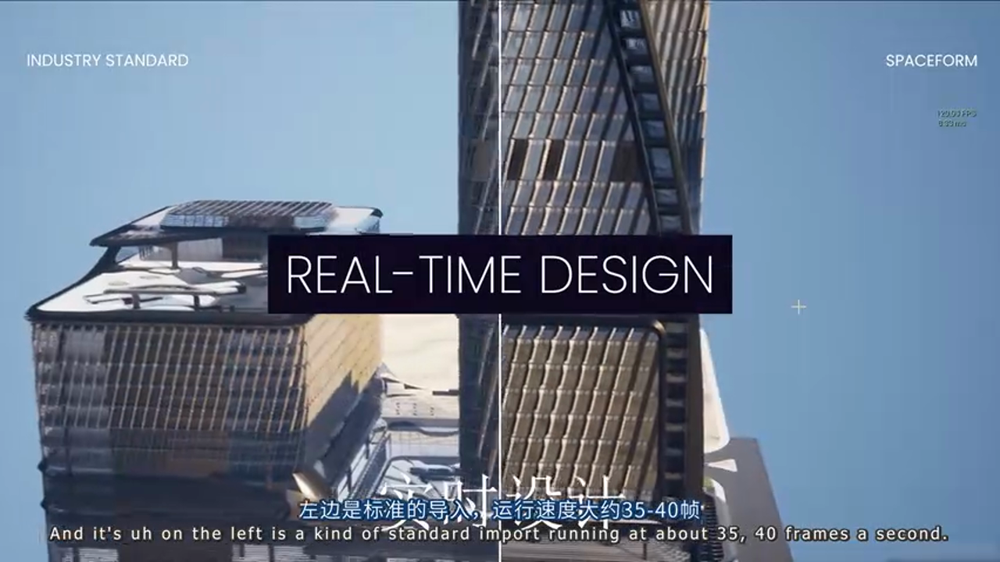

这3倍的性能提升来自于三个关键优化：

**优化1：几何体实例化识别**  
SpacePort在导出时会分析Rhino场景中的重复几何体（如窗户、柱子），并在UE5中自动转换为Instanced Static Mesh，大幅降低Draw Call。

**优化2：材质智能映射**  
通过预定义的材质库和命名规则，SpacePort能够将Rhino材质自动映射到UE5的PBR材质系统，支持MaterialX和USD两种标准格式。

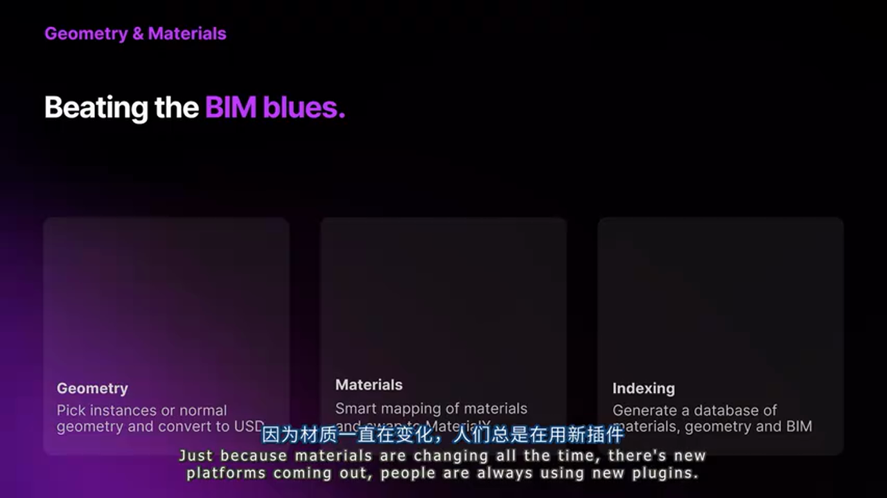

**优化3：元数据索引保留**  
这是最容易被忽视但最关键的一步。SpacePort会将BIM元数据（如墙体类型、防火等级）编码到UE5的Actor Tag或Custom Data中，确保在优化几何体后仍能追溯到原始BIM信息。

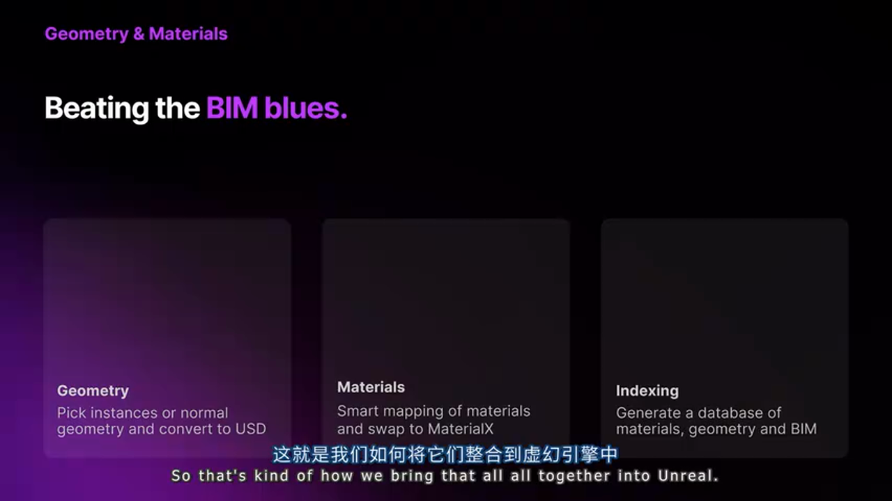

### 2.3 UE5技术栈的深度适配

#### Nanite：密集几何体的救星

SpaceForm是Nanite技术的重度用户，但Jan也指出了其局限性：

> **Nanite对半透明材质支持不佳，需要针对玻璃幕墙等场景做特殊处理。**


他们的解决方案是：
- 对不透明几何体（墙体、地板）启用Nanite
- 对透明几何体（玻璃、水体）使用传统LOD系统

#### Lumen：软硬件混合策略

SpaceForm在UE 5.6中全面拥抱了Hardware Lumen，但同时保留了Software Lumen的降级方案：

> **方案A：Hardware Lumen**
> - 🟢 优势：光照质量接近离线渲染，性能开销可控
> - 🔴 劣势：需要RTX 3060及以上显卡
> - 🎯 适用场景：高端客户展示、VR体验

> **方案B：Software Lumen**
> - 🟢 优势：兼容性好，可在云端低配GPU上运行
> - 🔴 劣势：需要手动分割大型几何体以优化Surface Cache
> - 🎯 适用场景：像素流送（Pixel Streaming）、移动端降级

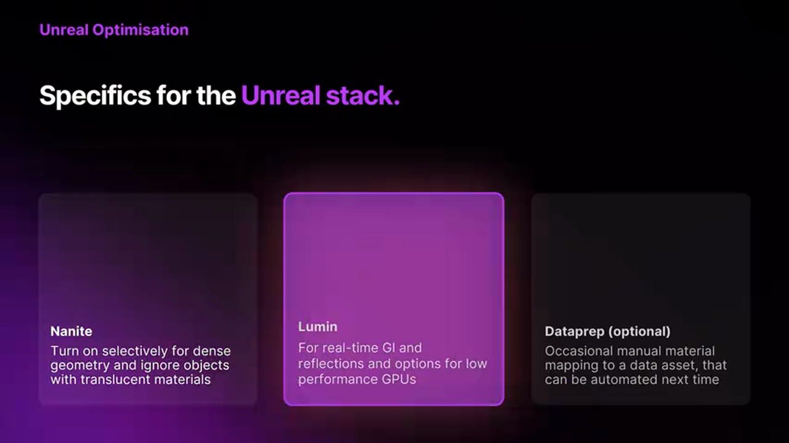

---

## 三、城市级上下文集成：从单体建筑到数字城市

### 3.1 自动化城市模型集成

SpaceForm使用Google Earth和Cesium的城市模型作为底图，并开发了一套**Cookie Cutter算法**：

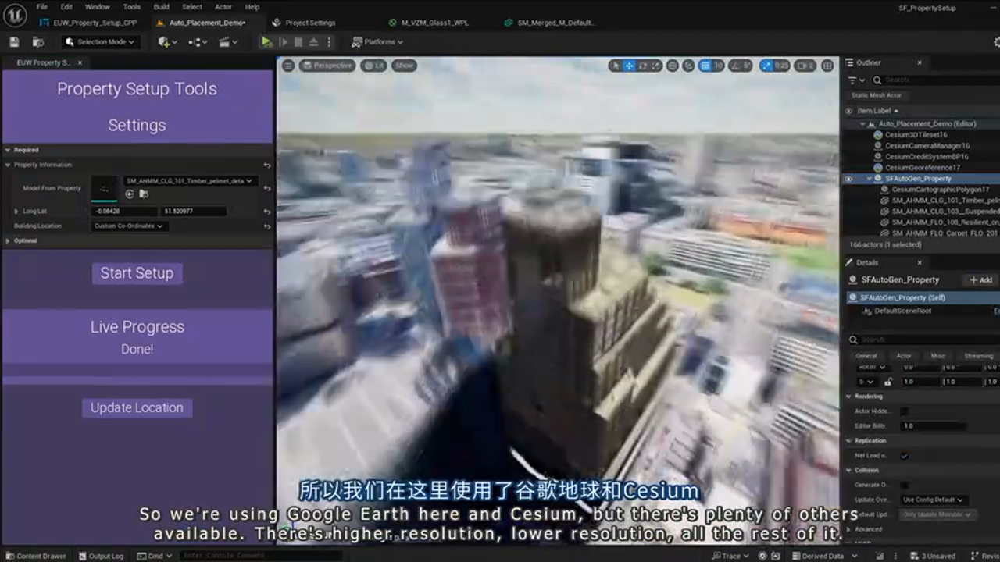

该算法的工作流程：
1. 读取建筑物的地理坐标和外轮廓
2. 在城市模型中"挖空"对应区域
3. 将高精度BIM模型无缝嵌入

唯一需要手动调整的是**地面标高**，因为很多BIM模型的零点位于地下（如地下车库层）。

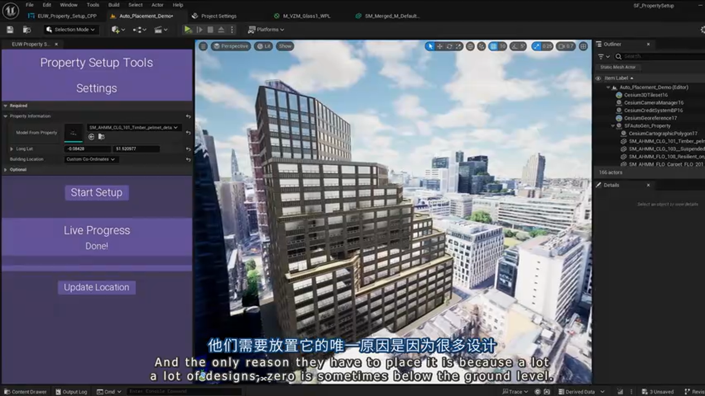

### 3.2 Eye-Level细节的参数化生成

Jan特别强调了"**人眼高度细节**"（Eye-Level Detail）的重要性：

> 人类经过数十万年进化，对视线高度的真实性极其敏感。过度自动化反而会适得其反。

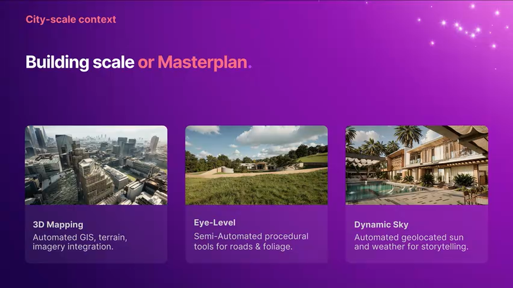

他们的解决方案是使用**PCG（Procedural Content Generation）系统**：
- 街道家具（长椅、路灯）：完全参数化生成
- 景观植被：基于真实植物数据库的随机分布
- 动态地形：通过高度图和样条线驱动

配置示例：
```ini
[PCG_StreetFurniture]
DensityPerSquareMeter=0.05
RandomSeed=12345
AssetLibrary=UrbanProps_EU
```

### 3.3 地理定位天空系统

SpaceForm集成了动态天空系统，支持：
- 基于经纬度的太阳轨迹计算
- 季节和时间变化
- 天气系统（晴天、阴天、雨天）


这对于建筑设计至关重要——客户可以实时查看冬至日下午4点的日照情况，评估采光设计是否合理。

---

## 四、模块化工作流：Mod系统的工程实践

### 4.1 为什么选择Mod架构？

在Great Western Road项目中（伦敦2000户住宅开发），SpaceForm面临一个挑战：

> **4家不同的设计公司同时设计不同地块，BIM文件每周更新，如何避免"牵一发而动全身"？**

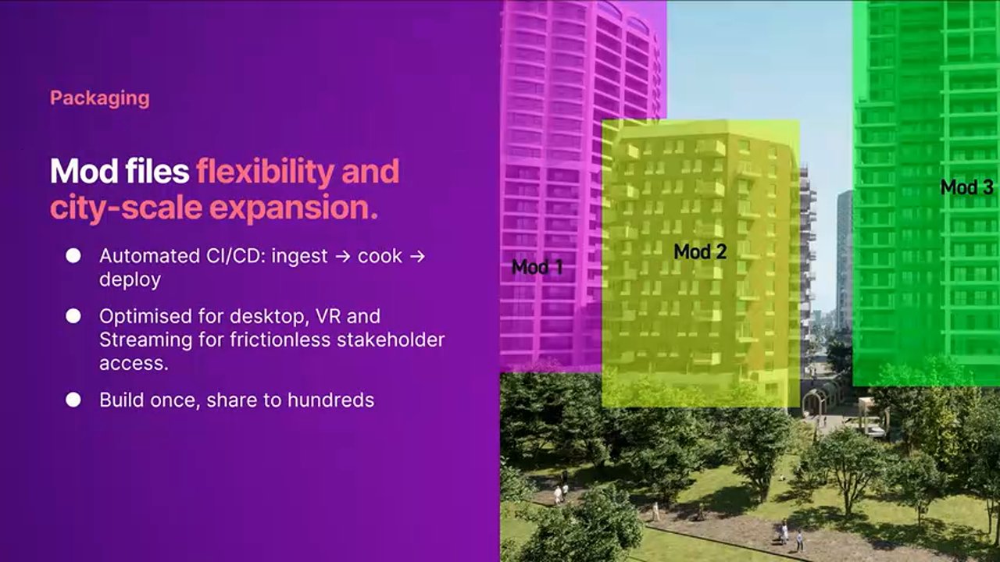

答案是将每个建筑单体打包为独立的**Mod文件**（类似游戏DLC），通过UE5的Pak系统动态加载。

### 4.2 Mod工作流详解

**步骤1：BIM文件更新**  
设计公司上传新的Revit文件到共享云盘。

**步骤2：SpacePort自动处理**  
监控脚本检测到文件变化后，自动触发SpacePort导出流程，生成新的Mod包。

**步骤3：增量发布**  
只有变更的Mod包会被推送到客户端，其他建筑保持不变。


**步骤4：自动化打包**  
使用Unreal Automation Tool（UAT）批量打包所有Mod：

命令示例：
```bash
RunUAT BuildCookRun -project=SpaceForm.uproject -platform=Win64 -cook -pak -stage -archive -archivedirectory=D:/Builds/Mods
```

### 4.3 性能与灵活性的平衡

Mod系统带来的收益：
- ✅ 支持无限扩展（理论上可加载数百个建筑）
- ✅ 降低迭代风险（单个Mod出错不影响全局）
- ✅ 支持VR和桌面端统一打包

潜在的坑：
- ⚠️ Mod之间的材质实例需要共享Material Parent，否则会导致重复加载
- ⚠️ 跨Mod的光照需要使用Lightmass Importance Volume或Lumen

---

## 五、AI赋能：从2D生成到智能孪生

### 5.1 2D AI增强：Flux Context的应用

SpaceForm使用Flux Context模型对UE5渲染图进行后处理，提升照片真实感：

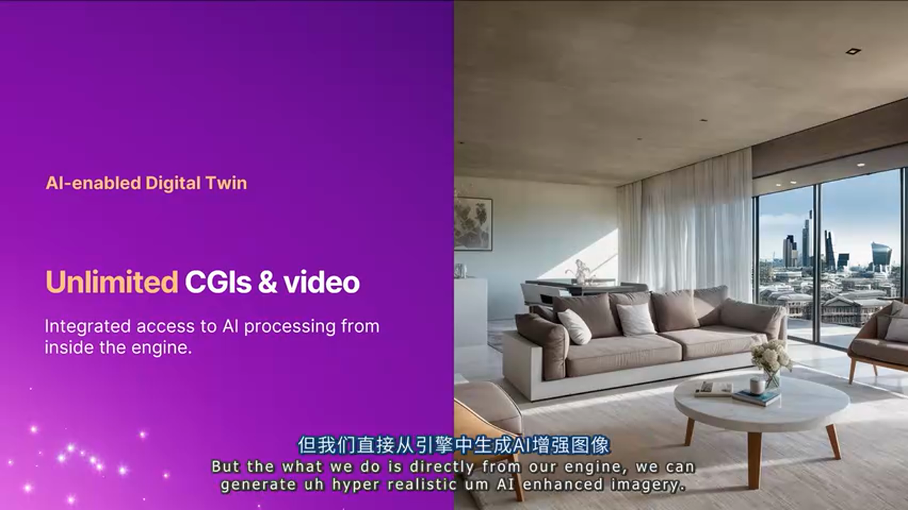

关键技术点：
- **Control Net约束：** 确保AI不会改变建筑的几何结构和材质细节
- **Prompt工程：** 使用建筑专业术语（如"curtain wall"、"cantilevered balcony"）提高生成质量

客户反馈：
> "这让我们摆脱了对传统渲染公司的依赖，可以自主生成营销素材。"

### 5.2 3D生成AI的探索与局限

SpaceForm尝试了基于平面图的家具自动布置系统：

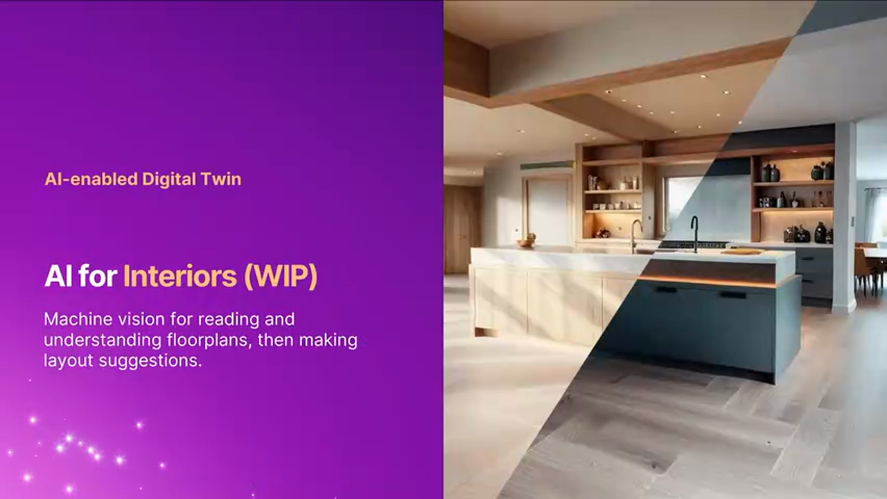

工作流程：
1. 从BIM模型中提取房间平面图
2. 使用AI识别房间类型（卧室、客厅、办公室）
3. 根据Mood Board自动选择家具并布置

**当前瓶颈：**
> 3D资产库不足，且现有的3D生成AI（如Point-E、Shap-E）质量尚未达到照片级。

Jan表示这是2026年的重点研发方向。

### 5.3 Agentic Twin：会说话的建筑

SpaceForm的最新突破是**智能孪生体**（Agentic Twin），它能够：

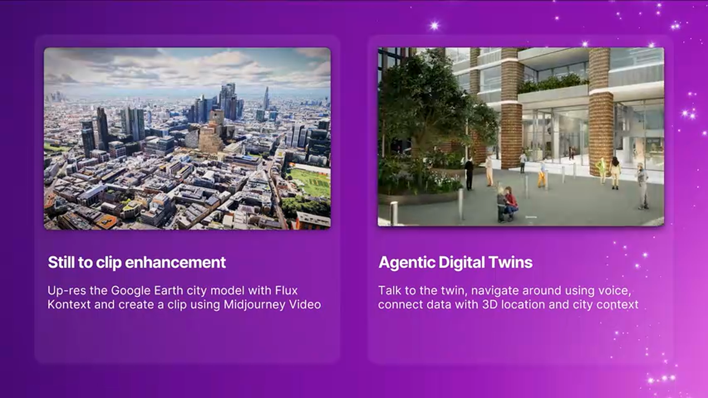

**能力1：多模态数据查询**  
用户可以语音提问："这栋楼的能效等级是多少？"孪生体会从BIM元数据、IoT传感器、外部API中聚合答案。

**能力2：空间导航**  
"带我去14楼的会议室"——孪生体会自动规划路径并控制虚拟相机移动。

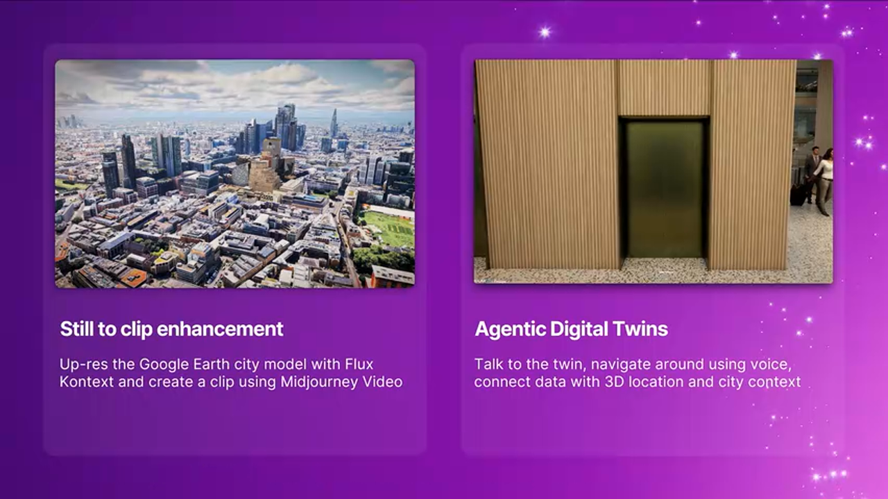

**能力3：业务洞察**  
"附近5分钟步行范围内有哪些餐厅？"——集成Google Places API实时查询。

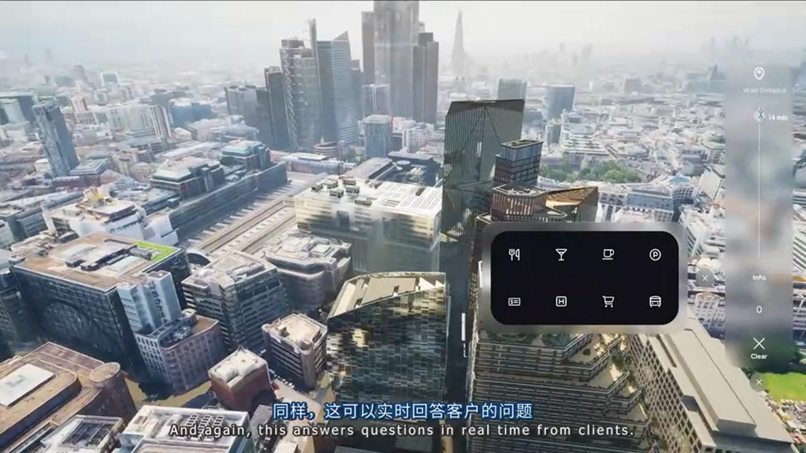

技术架构：
- **LLM后端：** 使用GPT-4或DeepSeek定制模型
- **数据接口：** RESTful API连接BIM数据库、IoT平台
- **语音交互：** Whisper（语音识别） + ElevenLabs（语音合成）

---

## 六、Gaussian Splat：从UE5到移动端的降维打击

### 6.1 为什么需要Splat？

虽然Pixel Streaming可以让任何设备访问UE5应用，但它有两个致命缺陷：
- 🔴 加载慢（需要等待云端实例启动）
- 🔴 成本高（长期运行云GPU不经济）

SpaceForm的解决方案是"**逆向Splat**"——从UE5中导出Gaussian Splat，而非从现实世界扫描生成。


### 6.2 自动化Splat生成管线

**步骤1：虚拟相机路径规划**  
在UE5中使用Sequencer创建环绕建筑的相机动画，自动捕获数百张渲染图及其位姿信息。

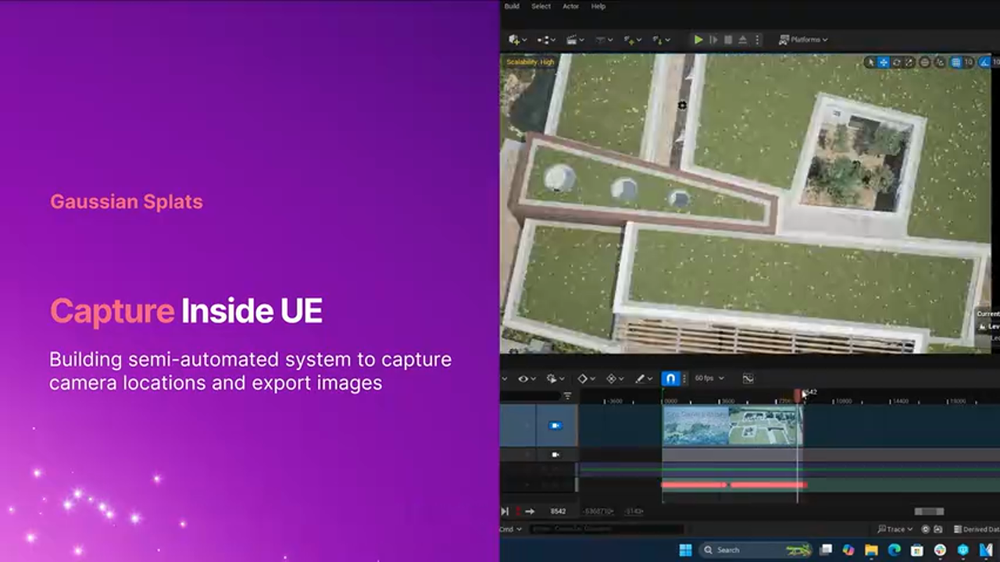

**步骤2：Reality Scan处理**  
使用Epic的Reality Scan工具将渲染图转换为Photogrammetry模型。


**步骤3：PostShot优化**  
通过PostShot将Photogrammetry模型转换为Gaussian Splat，并压缩至100MB以下（早期版本需要1GB）。


### 6.3 实际效果与局限性

优势：
- ✅ 可在移动浏览器中流畅运行
- ✅ 加载速度快（3-5秒）
- ✅ 降低了客户的技术门槛

局限性：
- ⚠️ 视觉质量低于原生UE5
- ⚠️ 不支持动态光照和交互
- ⚠️ 适合作为"预告片"，引导用户进入完整体验

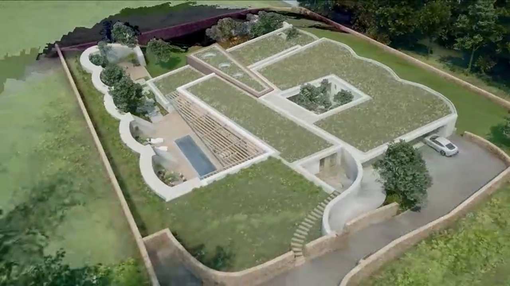

---

## 七、实战案例分析

### 7.1 案例一：Great Western Road（规划设计场景）

**项目背景：**  
伦敦西部2000户住宅开发项目，用于政府规划审批。

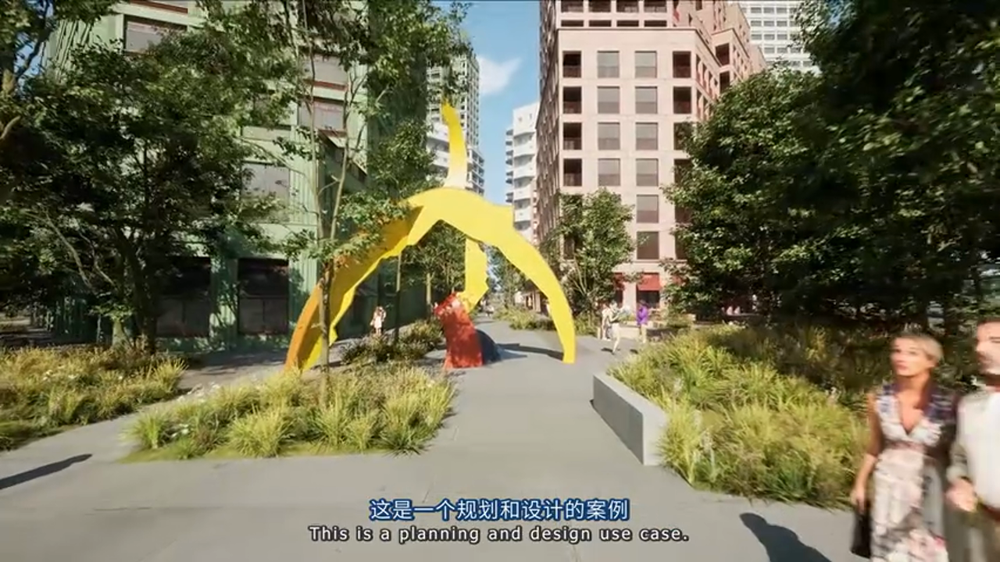

**技术挑战：**  
- 提交前1天仍在更新设计
- 部分建筑尚未完成材质设计（显示为白模）
- 需要展示社区生活场景而非单纯建筑

**解决方案：**  
- 使用Mod系统支持快速更新
- 通过PCG生成街道活动场景（行人、车辆）
- 线性动画路径确保与PPT演示同步


**商业成果：**  
成功获得规划许可，客户表示数字孪生帮助他们"讲清楚了社区愿景"。

### 7.2 案例二：Liverpool Street Tower（销售营销场景）

**项目背景：**  
伦敦利物浦街20层办公楼，用于商业租赁。


**技术亮点：**  
- 每层楼独立探索（支持客户定制化查看）
- 实时品牌切换（租户Logo、配色方案）
- 集成实时数据（周边餐厅、交通）


**工具集成：**  
- 虚拟相机系统（可调光圈、焦距）
- 测量工具（实时查询空间尺寸）
- AI图像增强（一键生成营销素材）

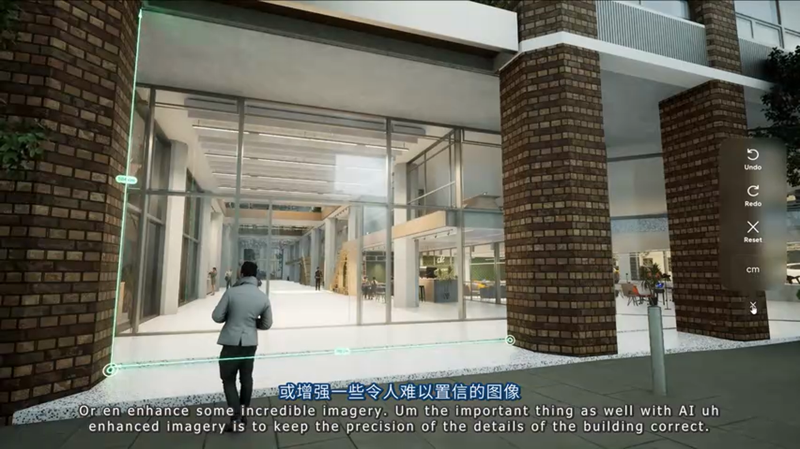

**效率提升：**  
- 初次导入：从2周缩短至2小时
- 设计更新：从2周缩短至1小时
- 无限量CGI生成（传统方式需外包）

---

## 八、避坑指南与最佳实践

### 8.1 BIM数据质量是一切的基础

> **教训：** Garbage In, Chaos Out.

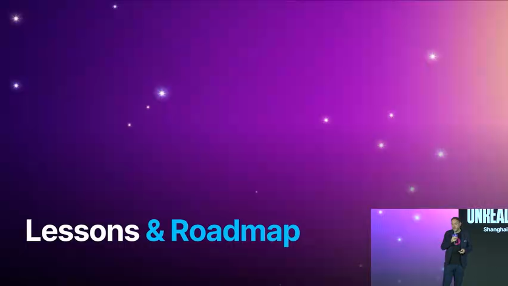

**最佳实践：**  
- 与设计团队建立BIM命名规范（材质、图层、族）
- 定期审查BIM文件的实例化率（Instance Ratio）
- 使用Revit插件在导出前自动检查常见错误

### 8.2 可访问性决定数字孪生的生命力

> **教训：** 再好的技术，如果客户用不了，就是摆设。


**推荐方案：**  
- **高端用户：** VR头显 + 本地高性能PC
- **中端用户：** Pixel Streaming + Xbox手柄
- **低端用户：** Gaussian Splat + 移动浏览器

### 8.3 理性自动化：不要为了自动化而自动化

> **教训：** 我们曾试图自动化Eye-Level细节生成，结果适得其反。

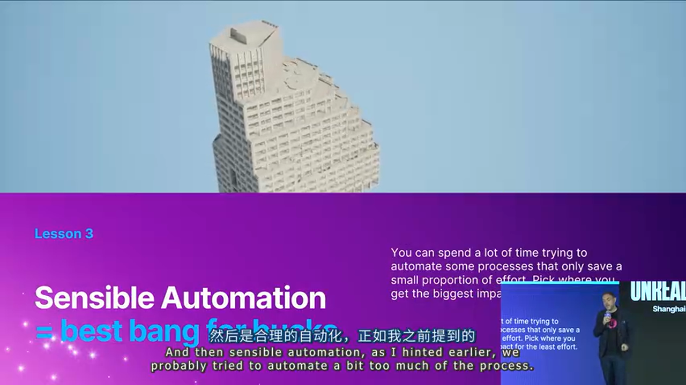

**决策框架：**  
1. 识别最耗时的手动任务（如材质映射）
2. 评估自动化的技术可行性
3. 优先处理"低垂的果实"（高收益、低难度）
4. 保留需要人类审美判断的环节

---

## 九、未来路线图：静态孪生已死，智能孪生永生

### 9.1 全自主孪生体（Fully Agentic Twin）

SpaceForm的愿景是让数字孪生具备以下能力：


**能力1：自我诊断**  
孪生体能够识别自身缺失的数据（如"我不知道电梯的维保记录"），并主动请求补充。

**能力2：自动更新**  
监控BIM文件、IoT数据流，一旦检测到变化，自动触发更新流程。

**能力3：预测性洞察**  
基于历史数据预测建筑能耗、设备故障，提前预警。

### 9.2 技术演进方向

> **方案对比：传统数字孪生 vs 智能孪生**
> 
> **传统数字孪生：**
> - 🔴 劣势：数据静态，需要人工维护
> - 🔴 劣势：无法回答超出预设范围的问题
> - 🎯 适用场景：短期营销展示
> 
> **智能孪生（Agentic Twin）：**
> - 🟢 优势：数据实时同步，自我进化
> - 🟢 优势：通过LLM理解自然语言查询
> - 🎯 适用场景：全生命周期资产管理


---

## 十、总结与思考

SpaceForm的实践给我们带来了三个关键启示：

**启示一：技术栈的选择要服务于业务目标**  
UE5 + Nanite + Lumen不是银弹，关键是理解客户的真实需求（快速迭代 > 极致画质）。

**启示二：自动化管线是小团队的生存之道**  
75%的效率提升意味着3人团队可以完成10人团队的工作量。

**启示三：AI不是替代人类，而是增强人类**  
无论是2D生成、语音交互还是智能推荐，AI的角色都是让专业人士更高效，而非取代他们。

最后，Jan的一句话值得深思：

> "静态的数字孪生终将死亡，只有能够自我进化的智能孪生才能创造持续的商业价值。"

---

**关于SpaceForm：**  
SpaceForm是一家专注于建筑与地产行业的数字孪生平台公司，总部位于欧洲，服务客户包括世界级建筑事务所和地产开发商。如果您对其技术方案感兴趣，可以访问其官网或在行业会议上与团队交流。

**技术交流：**  
本文涉及的BIM管线、UE5优化、AI集成等话题，欢迎在UE5技术交流群中深入讨论。扫描文章开头的二维码加入我们！


