# 体验思维驱动：车载 HMI 3D 交互的工程化实践

---


## 加入 UE5 技术交流群

如果您对虚幻引擎5的图形渲染技术感兴趣，欢迎加入我们的 **UE5 技术交流群**！

扫描上方二维码添加个人微信 **wlxklyh**，备注"UE5技术交流"，我会拉您进群。

在技术交流群中，您可以：
- 与其他UE开发者交流渲染技术经验
- 获取最新的GDC技术分享和解读
- 讨论图形编程、性能优化、构建工具流、动画系统等话题
- 分享引擎架构、基建工具等项目经验和技术难题

---

> **源视频信息**
> 
> 本文内容基于 FaceCar CEO 朱佳明在 UFSH2025 的演讲《体验思维驱动HMI落地》整理而成。
> 
> 视频链接：https://www.bilibili.com/video/BV1n7mzBcEQr
> 
> 本文由 AI 辅助生成，结合视频字幕与关键截图，力求还原演讲的技术要点与工程实践经验。

---

## 导读

> 在智能座舱领域，3D HMI 正在从概念验证走向量产落地。本文将深入剖析 FaceCar 团队在车载 3D 交互系统开发中的完整工程实践，涵盖从创意设计、引擎优化到芯片适配的全流程技术方案。
> 
> **核心观点**：
> - 车载 HMI 正在从平面交互向立体化、游戏化的多维空间演进
> - 基于 Unreal Engine 的延迟渲染管线可在车规芯片上实现高品质 3D 场景
> - 通过定制化着色器、独立动画线程等技术手段，可在有限算力下平衡视觉效果与性能开销
> 
> **前置知识**：了解 Unreal Engine 基础、车载芯片平台（如高通 8295/825）、实时渲染管线

---

## 背景与痛点：为什么车载 HMI 需要 3D 化？

### 行业趋势：从功能性到体验性

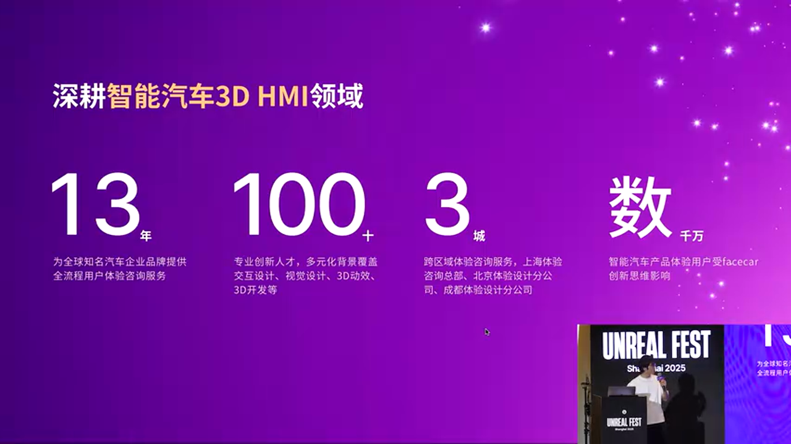

FaceCar 作为一家专注于车载 HMI 开发的公司，团队规模超过 100 人，总部位于上海。他们与多家自主品牌、新势力以及合资品牌展开合作，积累了丰富的量产项目经验。

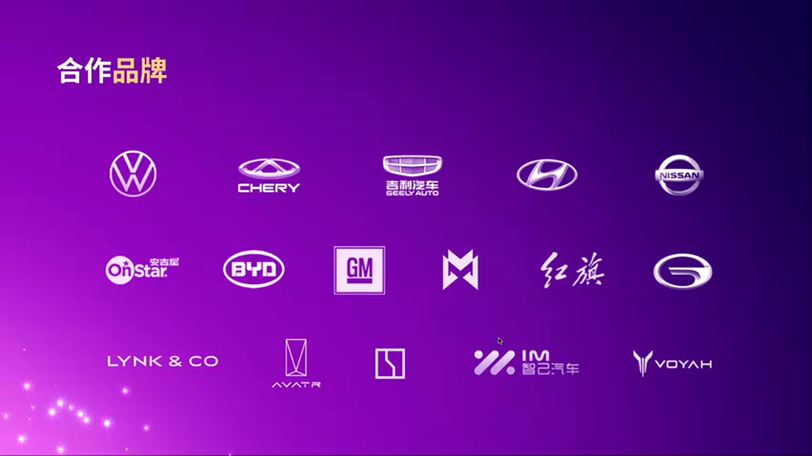

团队曾联合客户申请多项国际设计奖项，这些成果的背后是对 3D HMI 技术的深度探索。

### 传统 HMI 的局限性

传统车载人机交互界面主要以 2D 平面设计为主，功能布局相对固化。随着用户对娱乐化、多元化体验需求的提升，单纯的平面交互已无法满足"第三空间"的沉浸式需求。

**核心痛点**：
- **交互维度单一**：传统 2D 界面缺乏空间层次感，难以营造沉浸式体验
- **功能扩展受限**：平面布局限制了功能的无限拓展可能
- **情感连接不足**：缺乏游戏化、场景化的互动元素，用户粘性较弱

### 3D HMI 的价值主张

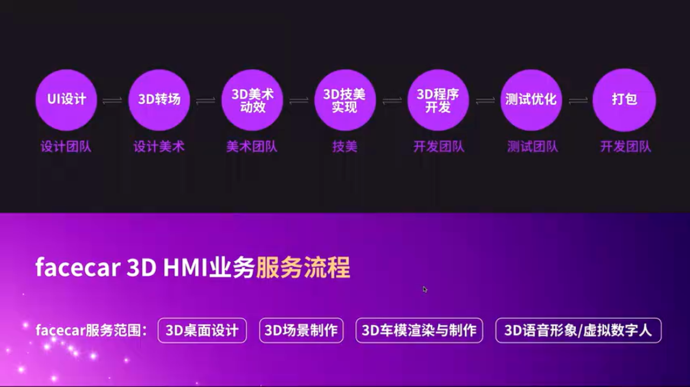

FaceCar 的 3D HMI 开发流程涵盖从前期创意设计、3D 场景制作、美术效果实现、引擎开发到测试集成打包的全链路。这种端到端的能力保证了设计意图能够高保真地还原到车机端。

**3D HMI 的核心优势**：
- **多维空间拓展**：通过 3D 世界构建，将传统功能模块转化为独立的虚拟空间（如数字影院、游戏大厅、休息空间）
- **游戏化交互**：引入虚拟形象、动态场景等元素，提升用户参与感
- **情感化设计**：通过光影、天气、昼夜联动等细节，营造真实感与陪伴感

---

## 案例一：第三空间的游戏化 3D 交互

### 设计理念：从功能到场景的转变

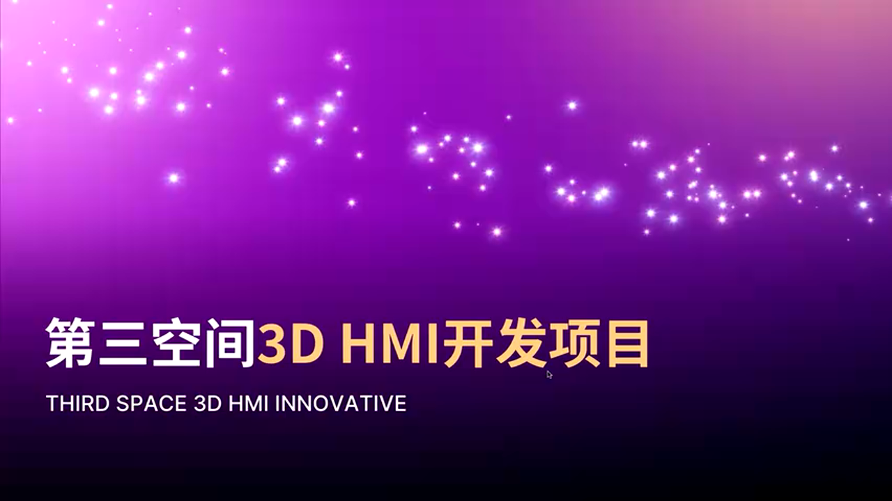

FaceCar 提出的"第三空间"概念，旨在将车内功能娱乐化、多元化。他们希望通过游戏化的创意功能，让用户感受到多维世界和立体场景的还原。

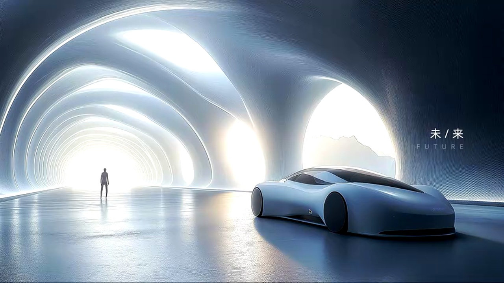

在前期创意阶段，团队进行了大量的灵感板探索，追求具有未来感和探索精神的设计语言。

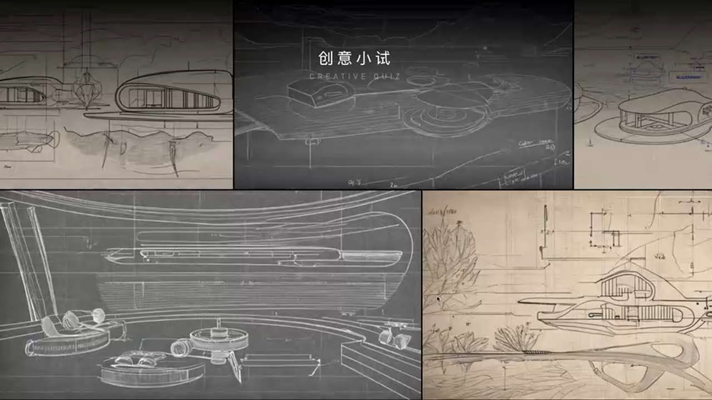

通过原画创意探索，团队为每个功能模块赋予了独特的 3D 场景设定。

### 核心功能架构


在这个方案中，每个功能被设计为一个独立的"元事空间"：
- **3D 数字影院**：用户可以进入虚拟影院，选择虚拟形象陪伴观影
- **3D 休息空间**：提供放松、冥想等场景化功能
- **3D 游戏大厅**：集成游戏化交互元素


点击中间的数字影院，用户可以从外围世界进入 3D 影院内部，完成多元化的游戏化交互。


用户可以选择虚拟形象陪伴观影，打破了传统 HMI 的单向交互方式。

### 技术实现：延迟渲染管线

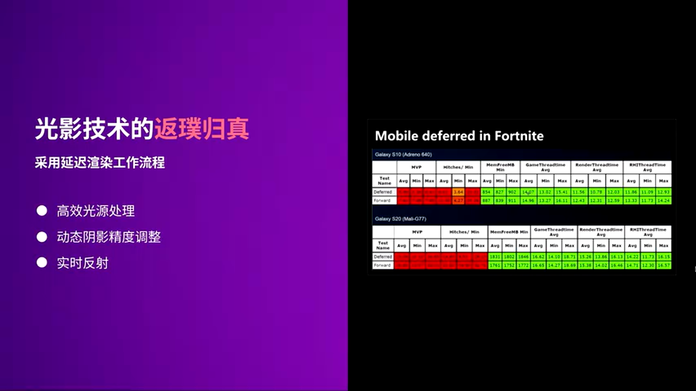

为了在车规芯片（如高通 8295/825）上实现高品质的 3D 场景，团队采用了 **Unreal Engine 的延迟渲染（Deferred Rendering）** 方案。

**延迟渲染的核心优势**：
- **高光感处理**：通过 G-Buffer 存储材质信息，可以在后处理阶段精确计算高光反射
- **动态阴影精度调整**：支持级联阴影贴图（CSM），在保证视觉质量的同时优化性能
- **自然光照反射**：基于物理的光照模型（PBR），实现真实的环境光反射效果

**关键代码逻辑**（基于 Unreal Engine）：

```cpp
// [AI补充] 延迟渲染管线的核心配置
void FDeferredShadingSceneRenderer::Render(FRHICommandListImmediate& RHICmdList)
{
    // 1. 几何通道：渲染场景几何到 G-Buffer
    RenderBasePass(RHICmdList);
    
    // 2. 光照通道：基于 G-Buffer 计算光照
    RenderLights(RHICmdList);
    
    // 3. 后处理：应用 Bloom、色调映射等效果
    RenderPostProcessing(RHICmdList);
}

// 动态阴影精度调整
FProjectedShadowInfo::SetupProjection()
{
    // 根据距离动态调整阴影贴图分辨率
    float ShadowResolutionScale = FMath::Clamp(
        1.0f / (Distance * 0.01f), 
        MinResolutionScale, 
        MaxResolutionScale
    );
}
```

### 透明度排序问题的解决


在多层半透明材质（如玻璃、UI 元素）叠加时，传统的透明度混合会出现排序错误，导致视觉混乱。

**解决方案：定制玻璃着色器**

团队开发了专用的玻璃着色器，通过 UI 渲染管线进行优化，额外的 GPU 开销仅增加 **0.3 毫秒**。

```cpp
// [AI补充] 玻璃着色器的核心逻辑
float4 GlassShader(FMaterialPixelParameters Parameters)
{
    // 1. 获取场景深度
    float SceneDepth = CalcSceneDepth(Parameters.ScreenPosition);
    
    // 2. 计算折射偏移
    float2 RefractionOffset = Parameters.WorldNormal.xy * RefractionStrength;
    float2 RefractUV = Parameters.ScreenPosition.xy + RefractionOffset;
    
    // 3. 采样场景颜色
    float3 SceneColor = SceneTextureLookup(RefractUV, SceneDepth);
    
    // 4. 混合玻璃颜色
    float3 FinalColor = lerp(SceneColor, GlassColor, GlassOpacity);
    
    return float4(FinalColor, 1.0);
}
```

### 色彩压缩与智能调色


在高品质效果下，团队发现强光下会出现色阶断层、暗光下阴影细节丢失等问题。


**解决方案：智能调色器 + 光影联动**

```cpp
// [AI补充] 智能调色器的实现逻辑
float3 AdaptiveToneMapping(float3 HDRColor, float AmbientLight)
{
    // 1. 根据环境光强度动态调整曝光
    float Exposure = lerp(MinExposure, MaxExposure, AmbientLight);
    
    // 2. 应用 ACES 色调映射
    float3 ACESColor = ACESFilm(HDRColor * Exposure);
    
    // 3. 增强暗部细节
    float3 ShadowBoost = pow(ACESColor, 1.0 / ShadowGamma);
    
    return lerp(ACESColor, ShadowBoost, ShadowBoostStrength);
}
```

团队通过车身传感器实时读取环境光数据，动态调整渲染参数，在关键指标上实现了大幅提升。

### 粒子系统热管理


复杂的天气特效（如雨雪粒子）会导致芯片温度飙升，触发降频保护。

**解决方案：粒子系统热力学模型优化**

- **动态 LOD**：根据芯片温度动态调整粒子数量
- **脚本控制**：通过 Blueprint 脚本监控温度，自动降级特效

```cpp
// [AI补充] 粒子系统热管理脚本
void UParticleThermalManager::Tick(float DeltaTime)
{
    // 1. 读取芯片温度
    float ChipTemperature = GetChipTemperature();
    
    // 2. 根据温度调整粒子数量
    if (ChipTemperature > HighTempThreshold)
    {
        ParticleSystem->SetSpawnRate(LowSpawnRate);
    }
    else if (ChipTemperature < NormalTempThreshold)
    {
        ParticleSystem->SetSpawnRate(NormalSpawnRate);
    }
}
```

### 实机演示效果


这是基于高通 825 芯片开发的实际演示效果，可以看到细腻的光照反射。

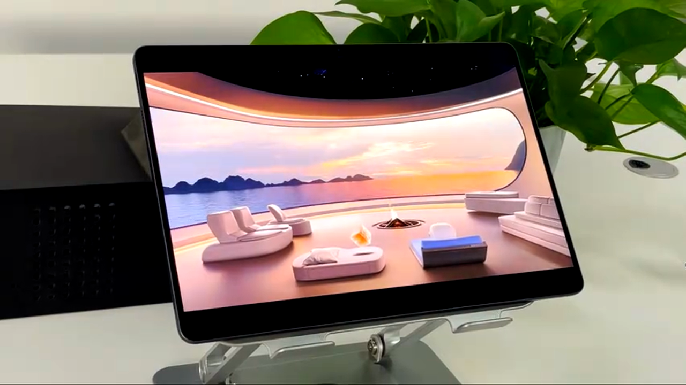

场景中的光照反射效果非常细腻，尽管视频有压缩，但实际效果更加出色。


团队实现了自然光照的实时渲染反射，根据早中晚的阳光变化以及阴晴雨雪的天气变化，呈现真实的光影效果。

---

## 案例二：高端品牌的 3D 车模交互系统

### 设计定位：神秘感与外太空美学

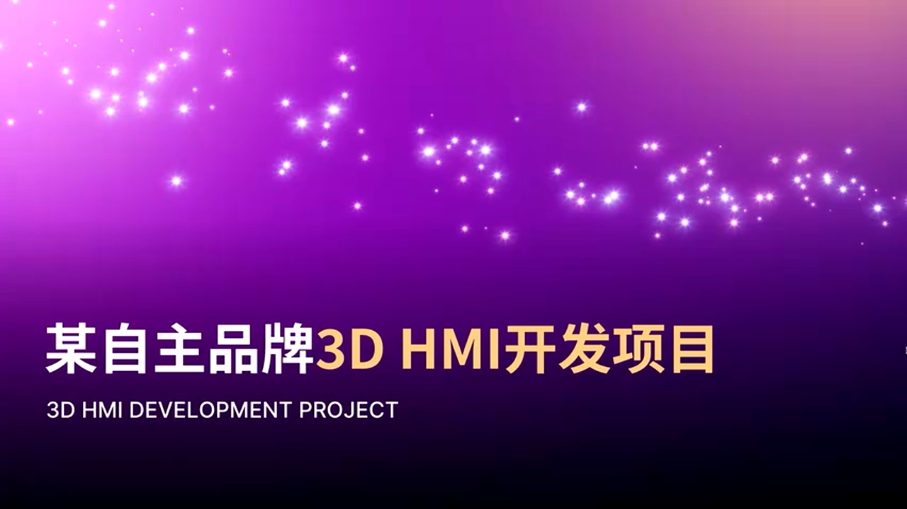

这是一个为自主品牌开发的 3D 车模交互系统，基于高通 825 芯片，是一个量产项目。


FaceCar 团队从前期创意到 3D 开发保持一致性，在前期做了大量的灵感探索。


因为这是一个高端品牌，团队希望营造神秘感和来自外太空世界的还原感。


在 3D 桌面上，设计了来自外太空的 3D 浪尺效果，围绕车模进行多种操作。


基于高精度车模，可以进行车辆相关的控制操作。

### 核心技术：高精度车模优化

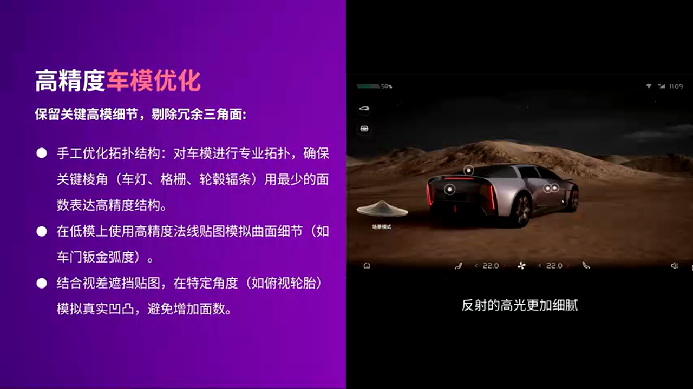

**高精度车模的优化策略**：

1. **手工拓扑优化**：对车模进行专业的拓扑重建，确保面片流向合理
2. **高质量减面**：在保持视觉质量的前提下，大幅减少多边形数量
3. **法线贴图**：在低模上使用高精度法线贴图，模拟曲面细节
4. **视差遮蔽贴图（Parallax Occlusion Mapping）**：在特定角度下模拟真实的凹凸感

**法线贴图与视差贴图的实现**：

```cpp
// [AI补充] 视差遮蔽贴图的着色器实现
float2 ParallaxOcclusionMapping(float2 UV, float3 ViewDir, sampler2D HeightMap)
{
    // 1. 设置采样层数
    const int NumLayers = 32;
    float LayerDepth = 1.0 / NumLayers;
    
    // 2. 计算每层的 UV 偏移
    float2 DeltaUV = ViewDir.xy * HeightScale / (ViewDir.z * NumLayers);
    
    // 3. 迭代查找交点
    float CurrentLayerDepth = 0.0;
    float2 CurrentUV = UV;
    float CurrentHeight = tex2D(HeightMap, CurrentUV).r;
    
    while(CurrentLayerDepth < CurrentHeight)
    {
        CurrentUV -= DeltaUV;
        CurrentHeight = tex2D(HeightMap, CurrentUV).r;
        CurrentLayerDepth += LayerDepth;
    }
    
    return CurrentUV;
}
```

### 车漆金属闪粉效果


在车模漆面上，团队实现了金属器闪粉效果。


使用法线贴图模拟金属颗粒感，结合天气变化（如雨滴）实现细腻的视觉效果。

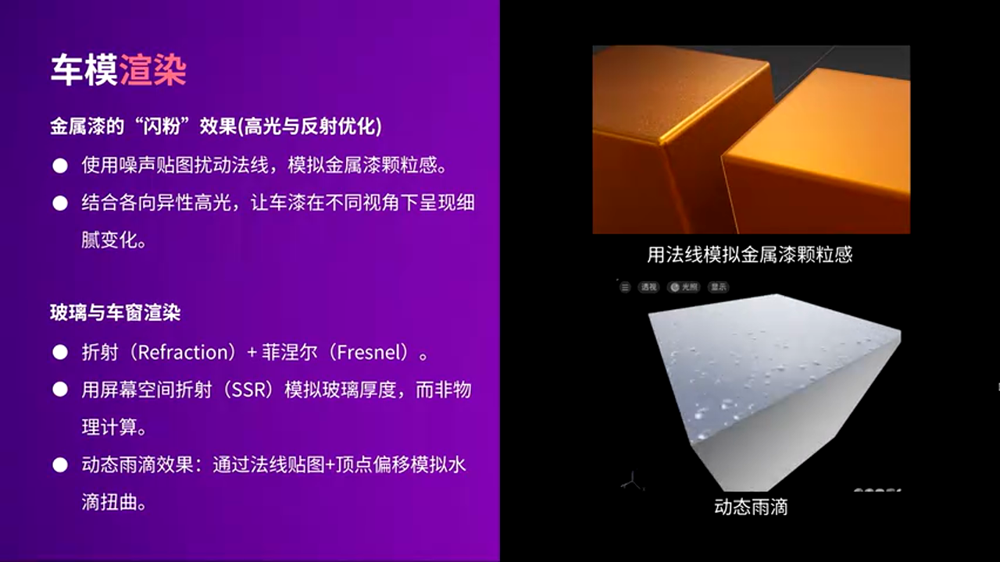

雨滴采用动态模拟的方式，更加还原细节品质。

### 地形材质优化

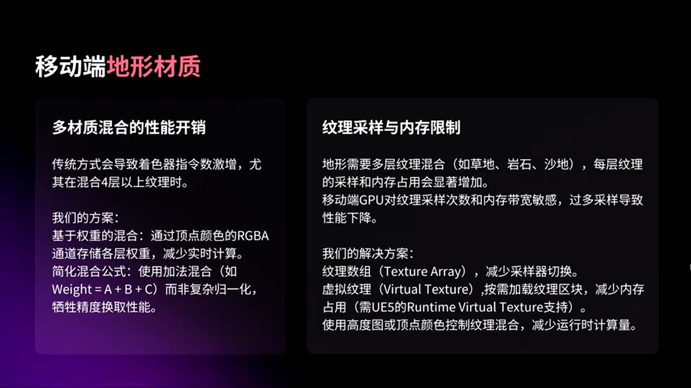

**多材质混合的性能优化**：

在移动端，多材质混合会显著增加性能开销。团队采用 **基于权重的混合方案**：

- **顶点颜色存储权重**：通过顶点颜色的 RGBA 通道存储各层材质的权重，减少实时计算
- **简化混合公式**：优化混合算法，降低 Shader 复杂度

```cpp
// [AI补充] 地形材质混合的优化实现
float3 BlendTerrainMaterials(float4 VertexColor, float2 UV)
{
    // 1. 从顶点颜色读取权重
    float WeightGrass = VertexColor.r;
    float WeightRock = VertexColor.g;
    float WeightSand = VertexColor.b;
    float WeightSnow = VertexColor.a;
    
    // 2. 采样各层材质
    float3 ColorGrass = tex2D(GrassTexture, UV).rgb;
    float3 ColorRock = tex2D(RockTexture, UV).rgb;
    float3 ColorSand = tex2D(SandTexture, UV).rgb;
    float3 ColorSnow = tex2D(SnowTexture, UV).rgb;
    
    // 3. 线性混合（优化后的公式）
    float3 FinalColor = ColorGrass * WeightGrass +
                        ColorRock * WeightRock +
                        ColorSand * WeightSand +
                        ColorSnow * WeightSnow;
    
    return FinalColor;
}
```

**纹理压缩与虚拟纹理**：

为了解决纹理采样与内存限制的问题，团队采用了 **虚拟纹理（Virtual Texture）** 技术，按需流式加载纹理数据。

### 实机演示


这是在台架上实际操作的录屏效果，展示了高精度车模的渲染质量。


项目中涉及大量与车模相关的 3D 场景，包括泊车场景、情景模式场景以及车辆智能控制相关的场景。

---

## 案例三：中国风水墨美学的 3D HMI

### 设计理念：轻量化与中国元素


这是与另一个高端品牌合作的 3D HMI 项目，同样是量产落地项目。

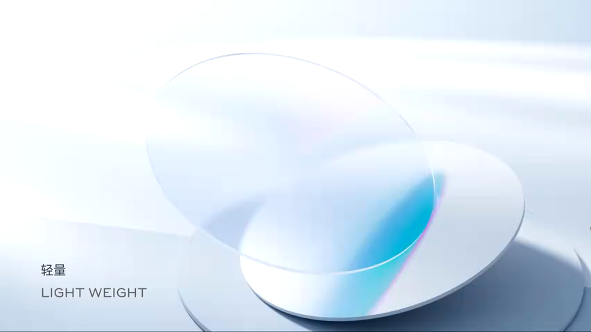

团队希望这套设计更加轻量化，同时融入中国意境的元素。


将中国山水水墨的感受与 3D 化设计语言融合，营造沉浸式的中国化体验。


在 UI 设计和 3D 场景设计中，大量使用水墨、墨迹的元素。


3D 场景的创意设计充分体现了中国风格。

### 3D 入场仪式感


团队设计了 3D 入场仪式感，通过车模进入 3D 世界。


在 3D 世界中，可以进行旋转展示等交互操作。

### 技术挑战：复杂转场动画

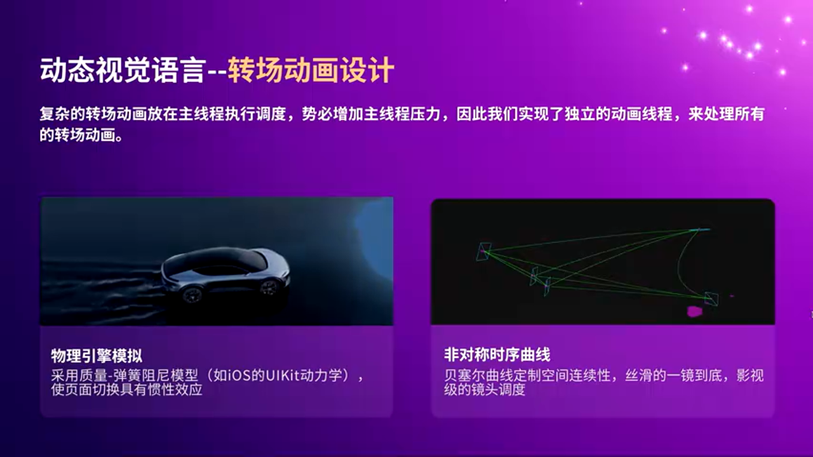

在复杂转场动画的制作中，团队遇到了主线程调度压力的问题。

**解决方案：独立动画线程**

传统方案中，动画逻辑在主线程（Game Thread）中执行,会增加主线程压力。团队实现了 **独立的动画线程**，将动画计算从主线程剥离。

```cpp
// [AI补充] 独立动画线程的实现
class FAnimationWorkerThread : public FRunnable
{
public:
    virtual uint32 Run() override
    {
        while (!bShouldStop)
        {
            // 1. 从队列获取动画任务
            FAnimationTask Task;
            if (TaskQueue.Dequeue(Task))
            {
                // 2. 在独立线程计算动画
                Task.AnimInstance->UpdateAnimation(DeltaTime);
                
                // 3. 将结果同步回主线程
                FinalPoseQueue.Enqueue(Task.AnimInstance->GetFinalPose());
            }
        }
        return 0;
    }
};
```

### 材质表现：模拟水的效果


团队采用顶点动画模拟水的波动效果。


使用 Gerstner 波（Gerstner Wave）进行顶点偏移，模拟真实的水面波动。

```cpp
// [AI补充] Gerstner 波的顶点着色器实现
float3 GerstnerWave(float3 Position, float Time)
{
    float3 Offset = float3(0, 0, 0);
    
    // 多个波的叠加
    for (int i = 0; i < NumWaves; i++)
    {
        float Frequency = Waves[i].Frequency;
        float Amplitude = Waves[i].Amplitude;
        float2 Direction = Waves[i].Direction;
        
        float Phase = dot(Direction, Position.xy) * Frequency + Time;
        
        Offset.x += Direction.x * Amplitude * cos(Phase);
        Offset.y += Direction.y * Amplitude * cos(Phase);
        Offset.z += Amplitude * sin(Phase);
    }
    
    return Position + Offset;
}
```

### 高精度反射方案

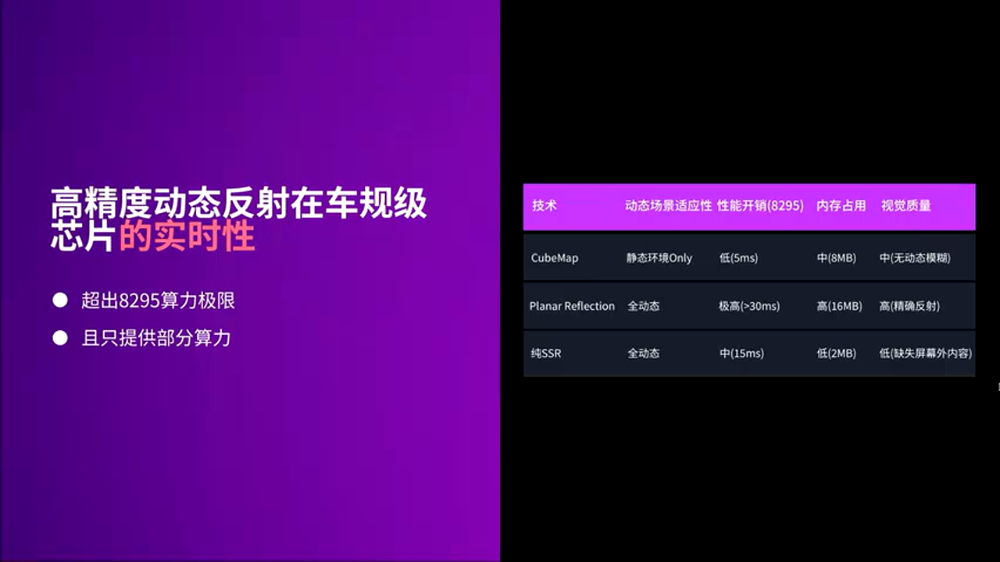

在车规芯片上实现高精度反射是一个挑战，因为 8295 芯片只能提供部分算力。


**解决方案：创新的探针混合技术**

团队采用 **反射探针（Reflection Probe）混合技术** 配合 **屏幕空间反射（SSR）** 优化。

```cpp
// [AI补充] 探针混合反射的实现
float3 BlendedReflection(float3 WorldPosition, float3 ViewDir)
{
    // 1. 查找最近的反射探针
    FReflectionProbe Probe1 = FindNearestProbe(WorldPosition);
    FReflectionProbe Probe2 = FindSecondNearestProbe(WorldPosition);
    
    // 2. 采样探针立方体贴图
    float3 Reflection1 = texCUBE(Probe1.CubemapTexture, ViewDir).rgb;
    float3 Reflection2 = texCUBE(Probe2.CubemapTexture, ViewDir).rgb;
    
    // 3. 根据距离混合
    float BlendWeight = saturate(distance(WorldPosition, Probe1.Position) / BlendRadius);
    float3 ProbeReflection = lerp(Reflection1, Reflection2, BlendWeight);
    
    // 4. 与屏幕空间反射混合
    float3 SSRReflection = ScreenSpaceReflection(WorldPosition, ViewDir);
    float SSRMask = GetSSRMask(WorldPosition);
    
    return lerp(ProbeReflection, SSRReflection, SSRMask);
}
```


高精度反射方案增强了车身与周围环境光的反射效果，实现了自然界非常真实的效果呈现。

### 开发流程

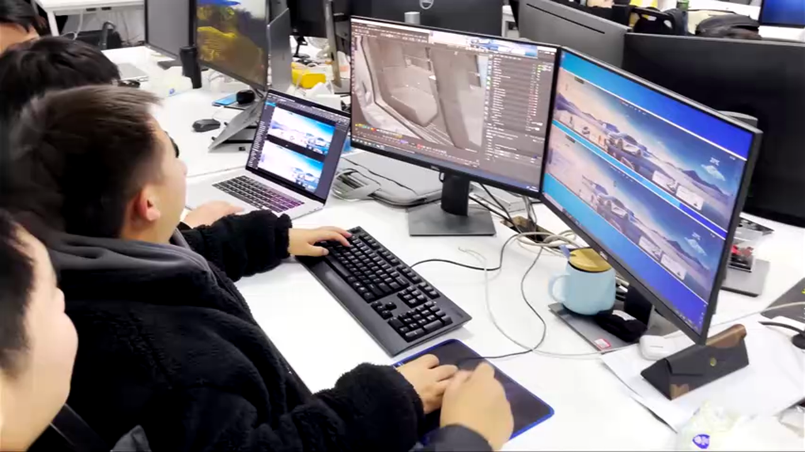

这是团队在开发过程中实际制作的流程，从设计到开发再到台架效果的完整链路。

---

## 案例四：高精地图的 3D 化探索

### 创新方向：从平面到立体的地图


FaceCar 团队进行了内部创新 Demo 的探索，研究如何将高精地图做得更加真实。


传统高精地图都是平面的，未来结合高精地图可以变成立体化的设计方式。

### 3D 组件化趋势

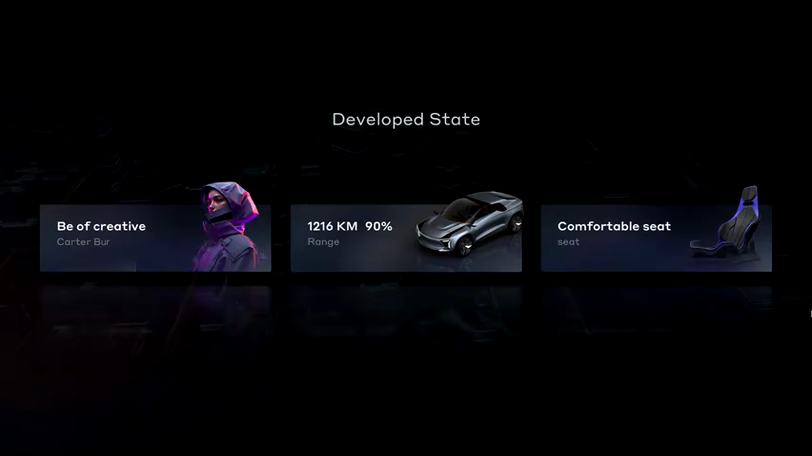

未来传统的 2D 组件会向 3D 组件发展。

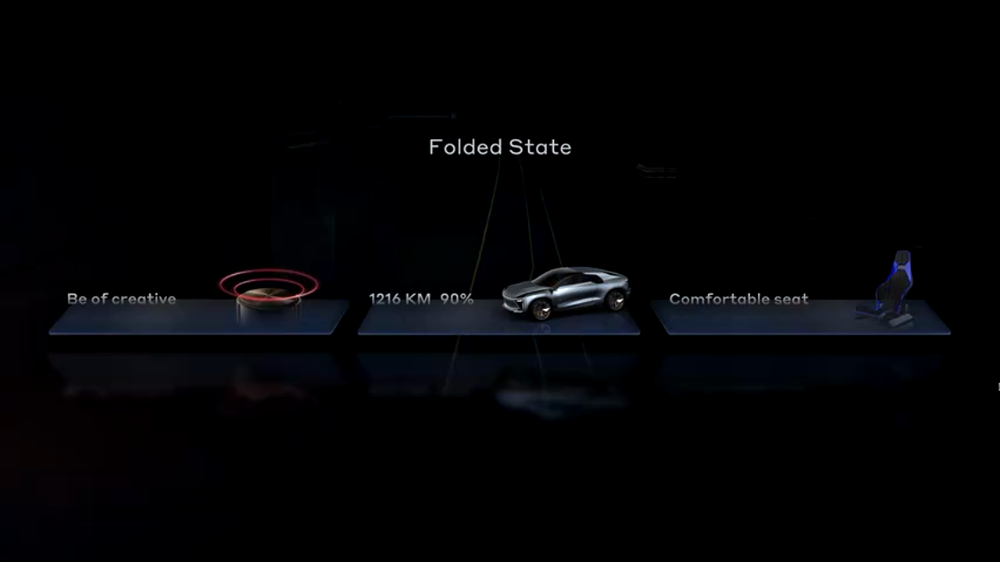

可以看到 2D 组件向 3D 组件的转场变化。

### 高精地图的立体化实现


团队将高精地图变成更加立体的形式,可以完成导航、地图以及与泊车的操作。


进入地图的局部,与泊车功能完成相关的操作和联动。

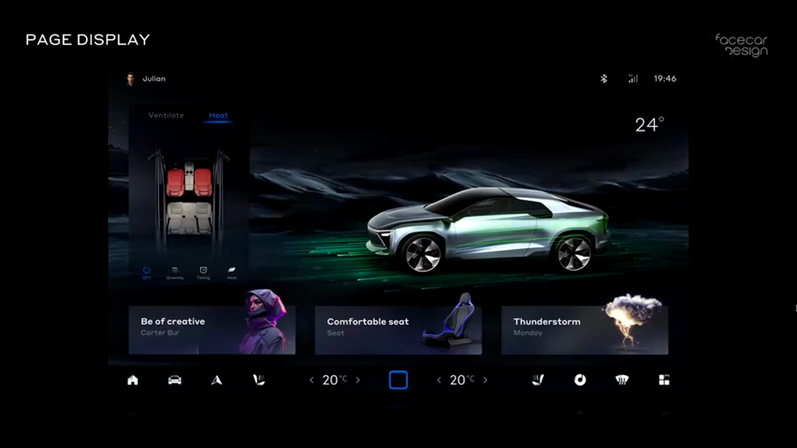

拓展出与泊车模式相关的 3D 场景创意设计。

### 技术实现：程序化道路生成


**程序化生成的核心技术**：

1. **基于地图数据实时生成道路**：读取高精地图的矢量数据
2. **样条线定义路径**：使用 Spline 定义道路的曲线路径
3. **Difference 节点清除障碍物**：通过布尔运算清除道路上的重叠物体

```cpp
// [AI补充] 程序化道路生成的实现
void UProceduralRoadGenerator::GenerateRoad(const FMapData& MapData)
{
    // 1. 从地图数据创建样条线
    USplineComponent* RoadSpline = CreateSplineFromMapData(MapData);
    
    // 2. 沿样条线生成道路网格
    for (float Distance = 0; Distance < RoadSpline->GetSplineLength(); Distance += SegmentLength)
    {
        FVector Location = RoadSpline->GetLocationAtDistanceAlongSpline(Distance, ESplineCoordinateSpace::World);
        FRotator Rotation = RoadSpline->GetRotationAtDistanceAlongSpline(Distance, ESplineCoordinateSpace::World);
        
        // 生成道路片段
        UStaticMeshComponent* RoadSegment = CreateRoadSegment(Location, Rotation);
        
        // 清除与道路重叠的物体
        RemoveOverlappingObjects(RoadSegment);
    }
    
    // 3. 随机分布路边装饰物
    DistributeRoadsideObjects(RoadSpline);
}

// 随机分布装饰物
void UProceduralRoadGenerator::DistributeRoadsideObjects(USplineComponent* Spline)
{
    for (int i = 0; i < NumObjects; i++)
    {
        float Distance = FMath::RandRange(0.0f, Spline->GetSplineLength());
        FVector Location = Spline->GetLocationAtDistanceAlongSpline(Distance, ESplineCoordinateSpace::World);
        
        // 随机偏移、旋转和缩放
        Location += FMath::VRand() * RandomOffset;
        FRotator Rotation = FRotator(0, FMath::RandRange(0.0f, 360.0f), 0);
        float Scale = FMath::RandRange(MinScale, MaxScale);
        
        SpawnDecoration(Location, Rotation, Scale);
    }
}
```


团队制作了大量局部细节，通过 3D 建模构建高精地图的细腻效果。

---

## 实战总结与建议

### 技术方案对比

> **方案 A：延迟渲染（Deferred Rendering）**
> - 🟢 优势：支持大量动态光源，高光反射效果出色，适合复杂光照场景
> - 🔴 劣势：透明物体处理复杂，带宽占用较高
> - 🎯 适用场景：车内 3D 场景、数字影院等需要高品质光照的场景
>
> **方案 B：前向渲染（Forward Rendering）**
> - 🟢 优势：透明物体处理简单，带宽占用低，适合移动平台
> - 🔴 劣势：光源数量受限，多光源场景性能下降明显
> - 🎯 适用场景：简单的 UI 元素、2D 界面
>
> **方案 C：混合渲染管线**
> - 🟢 优势：结合两者优点，灵活性高
> - 🔴 劣势：实现复杂度高，需要精细的渲染路径管理
> - 🎯 适用场景：大型项目，需要同时兼顾 3D 场景和 UI 元素

### 避坑指南

**1. 芯片算力评估不足**

在项目初期，务必在目标芯片平台上进行性能基准测试。不要依赖 PC 端的性能表现，车规芯片的 GPU 算力通常只有桌面级显卡的 1/10。

**配置建议**：
- 高通 8295：建议 3D 场景面数控制在 50 万三角形以内
- 高通 825：建议控制在 30 万三角形以内
- 动态光源数量：不超过 4 个
- 阴影贴图分辨率：1024x1024 或 2048x2048

**2. 透明度排序问题**

多层透明物体的渲染顺序问题是常见的视觉 Bug。建议：
- 为玻璃等透明材质单独开发着色器
- 使用深度剥离（Depth Peeling）或 Order-Independent Transparency（OIT）技术
- 避免在同一视角下叠加超过 3 层透明物体

**3. 热管理失控**

复杂特效（如粒子系统、后处理）会导致芯片温度飙升。建议：
- 实现动态 LOD 系统，根据温度自动降级
- 监控芯片温度，设置温度阈值触发保护机制
- 粒子系统使用 GPU Sprite 而非 Mesh Particle

**4. 内存泄漏**

车机系统需要长时间稳定运行，内存泄漏会导致系统崩溃。建议：
- 使用 Unreal Engine 的对象池（Object Pool）管理频繁创建销毁的对象
- 定期进行 Garbage Collection
- 使用智能指针（TSharedPtr、TWeakPtr）管理资源生命周期

**5. 纹理压缩格式选择**

不同平台支持的纹理压缩格式不同：
- Android 平台：优先使用 ASTC 格式（高质量、低内存）
- 如果不支持 ASTC，使用 ETC2
- 避免使用未压缩的纹理，会占用大量内存

### 最佳实践

**性能优化清单**：

1. **几何优化**
   - 使用 LOD 系统，远处物体使用低模
   - 启用遮挡剔除（Occlusion Culling）
   - 合并静态网格（Mesh Merging）

2. **材质优化**
   - 减少材质复杂度，避免过多的纹理采样
   - 使用材质实例（Material Instance）而非材质资产
   - 启用材质质量等级（Material Quality Level）

3. **光照优化**
   - 使用烘焙光照（Baked Lighting）处理静态物体
   - 动态光源使用阴影距离限制
   - 启用光照通道（Lighting Channels）精确控制光源影响范围

4. **后处理优化**
   - 降低后处理分辨率（使用 Screen Percentage）
   - 禁用不必要的后处理效果（如景深、运动模糊）
   - 使用移动端优化的后处理管线

**开发流程建议**：

1. **前期验证**：在目标平台上尽早进行技术验证，避免后期推翻重做
2. **迭代开发**：采用敏捷开发模式，每周进行一次台架测试
3. **性能监控**：集成性能分析工具（如 Unreal Insights），实时监控帧率、内存、温度
4. **自动化测试**：编写自动化测试脚本，覆盖核心功能和性能指标

---

## 未来趋势与展望


**标准化的 3D 引擎开发流程**：未来会有更加标准化的车载 3D 引擎开发流程，降低开发门槛。


**更加动态的实时渲染**：包括场景化的自适应以及更加个性化的服务延伸和生态结合。

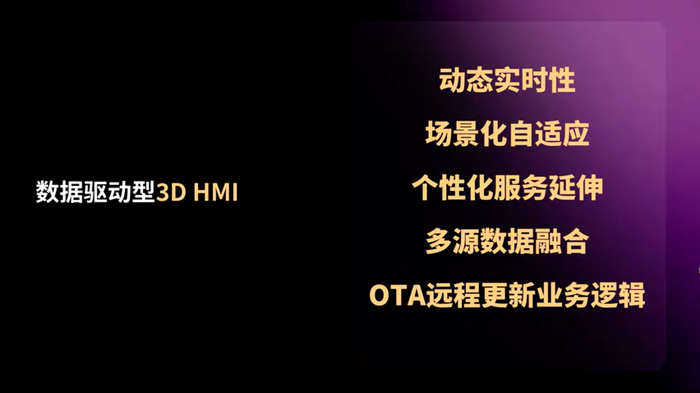

**多元化的数据融合**：高效的 OTA 升级机制，让 3D HMI 可以持续迭代。

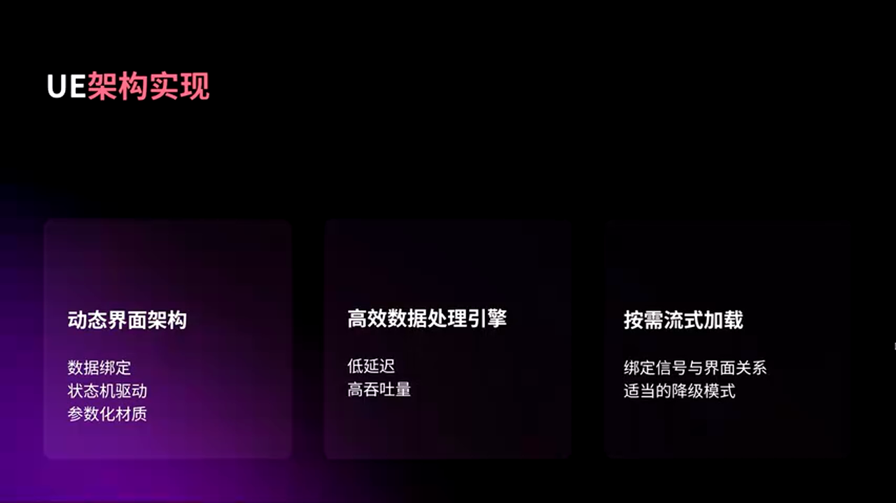

**动态界面结构**：未来的 HMI 会实现更加动态的界面结构，高性能高效的处理引擎方式，以及按需流式的加载方式，更加灵动和平台化的拓展性。

---

## 结语

FaceCar 团队在车载 3D HMI 领域的工程实践，展示了从创意设计到量产落地的完整技术链路。通过延迟渲染管线、定制化着色器、独立动画线程、程序化生成等技术手段，他们在车规芯片的有限算力下实现了高品质的 3D 交互体验。

**核心要点回顾**：
- **体验优先**：3D HMI 的核心价值在于提升用户的沉浸式体验和情感连接
- **技术平衡**：在视觉效果与性能开销之间找到最佳平衡点
- **工程化思维**：从设计到开发到测试的全流程标准化，确保量产质量
- **持续优化**：通过 OTA 升级和数据驱动，让 HMI 系统持续进化

随着车规芯片算力的提升和引擎技术的成熟，3D HMI 将从高端车型逐步普及到更多车型，成为智能座舱的标配。对于开发者而言，掌握 Unreal Engine 的移动端优化技术、理解车规芯片的特性、具备全栈的开发能力，将是未来的核心竞争力。

---

**致谢**：感谢 FaceCar 团队在 UFSH2025 上的精彩分享，为行业提供了宝贵的工程实践经验。

**参考资源**：
- Unreal Engine 官方文档：https://docs.unrealengine.com/
- 高通骁龙汽车平台：https://www.qualcomm.com/products/automotive
- Real-Time Rendering 第四版（实时渲染经典教材）

---

*本文由 AI 辅助生成，内容基于视频演讲整理。如有技术细节需要进一步探讨，欢迎加入 UE5 技术交流群交流。*


