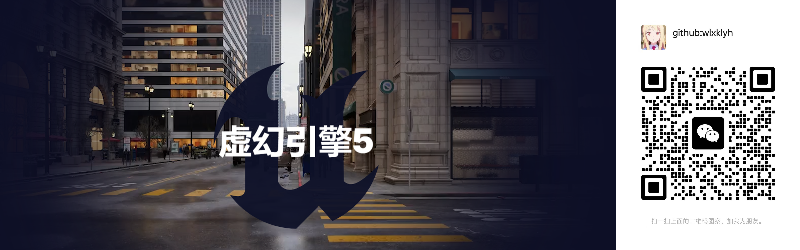
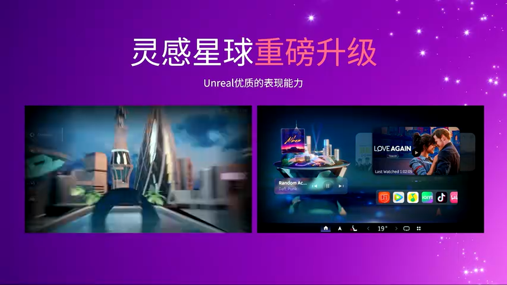
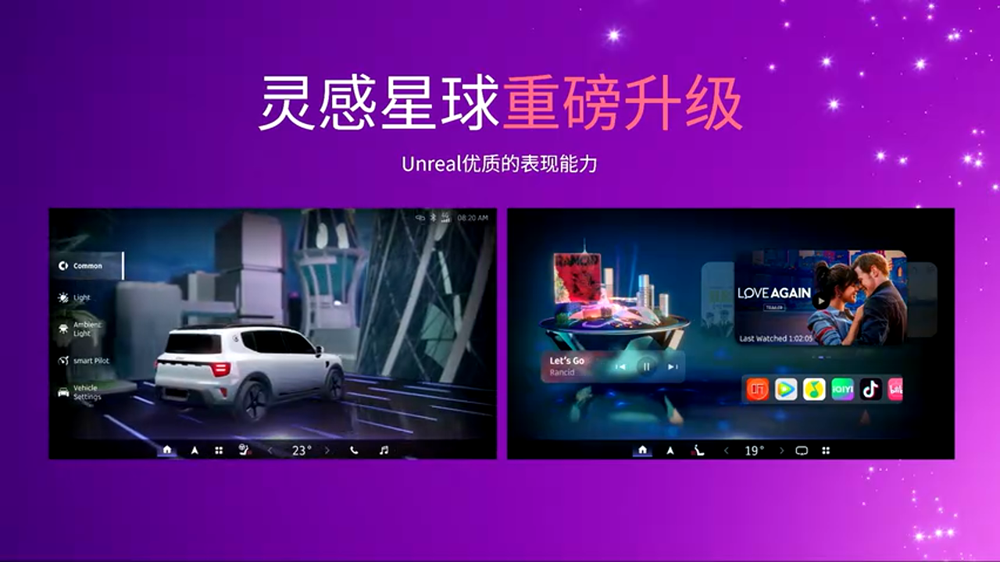
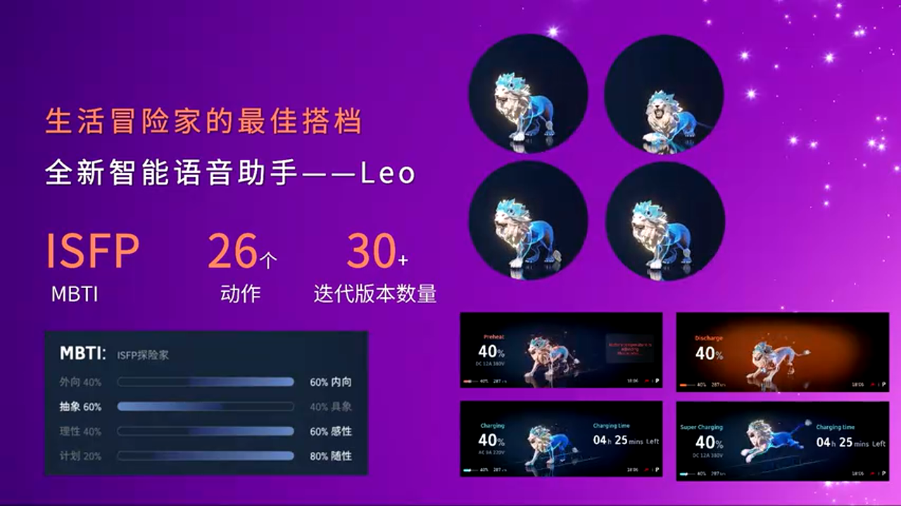
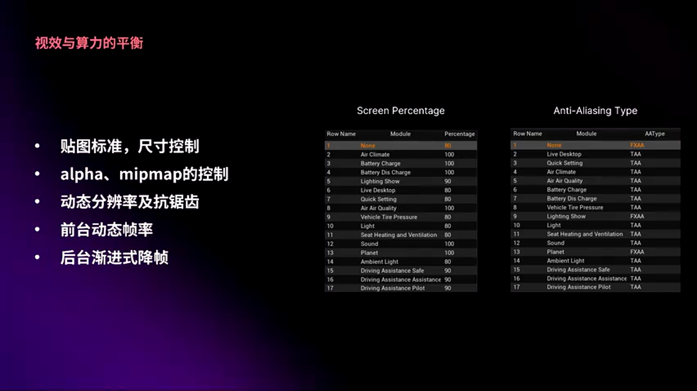
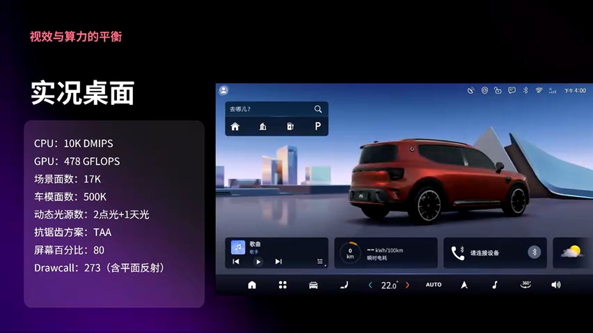
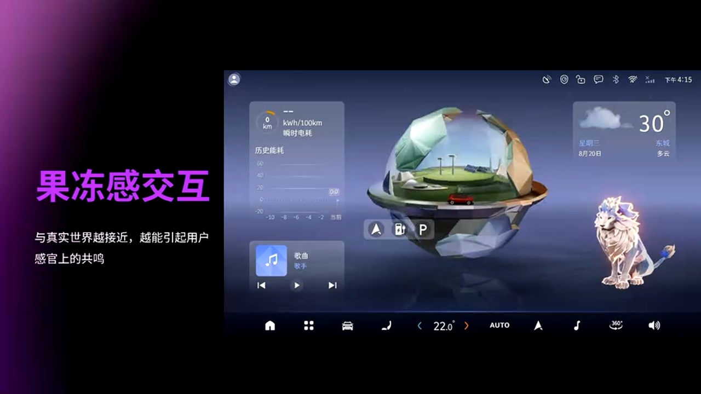
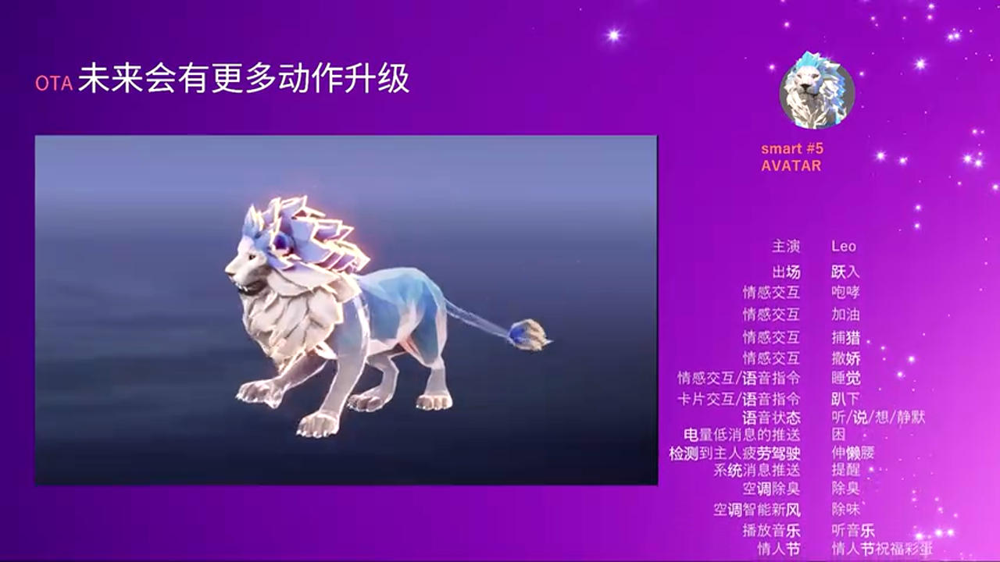

# UE5驱动的汽车HMI革命：Smart精灵5号3D座舱技术深度解析

---

## 加入 UE5 技术交流群

如果您对虚幻引擎5的图形渲染技术感兴趣,欢迎加入我们的 **UE5 技术交流群**!

扫描上方二维码添加个人微信 **wlxklyh**,备注"UE5技术交流",我会拉您进群。

在技术交流群中,您可以:
- 与其他UE开发者交流渲染技术经验
- 获取最新的GDC技术分享和解读
- 讨论图形编程、性能优化、构建工具流、动画系统等话题
- 分享引擎架构、基建工具等项目经验和技术难题

---

> **视频来源:** https://www.bilibili.com/video/BV1W5mzBAEFD
>
> **生成时间:** 2026-01-11
>
> **视频时长:** 27分45秒
>
> **本文由 AI 基于视频内容生成**

---

## 导读

> **核心观点:**
> - 3D HMI 不是装饰性设计,而是交互逻辑的升维,标志着汽车从机械产品向智能终端的转型
> - 车机端 3D 方案的核心在于效果、性能与用户体验的三方平衡,而非单纯追求参数拉满
> - 一镜到底的镜头转场系统是串联多场景的关键,需要解决跨图层同步、动态路径规划和精确控制三大技术挑战

**阅读本文需要的前置知识:**
- 虚幻引擎 (Unreal Engine) 基础概念
- 车机 HMI (Human-Machine Interface) 交互设计基础
- 实时渲染与性能优化基本原理

---

## 背景与痛点：为什么车机需要 3D HMI

传统汽车 HMI 以 2D 界面为主,交互体验扁平化,难以营造沉浸感。随着新能源汽车智能化浪潮的到来,用户对座舱体验的期待已从"功能可用"升级到"情感化连接"。Smart 品牌自 1972 年诞生以来,始终以城市交通解决方案为愿景,在 2019 年与吉利合资后,推出了全新电动化车型。精灵5号作为该系列最新车型,首次采用 **Unreal Engine 5** 打造全 3D HMI,将"灵感星球"概念从精灵1号延续并升级为"城市赛博朋克风格",结合水晶冷峻设计理念,大幅提升光影渲染和材质表现。

**核心痛点:**
1. **设计复杂度指数级增长**：精灵5号 HMI 包含星球桌面、地图桌面、壁纸桌面、实况车桌面共 4 种桌面形态,搭配 5 种驾驶模式,总计需要实现 **113 个镜头转场**,每个转场都有专属动画曲线。
2. **性能约束严苛**：车机端硬件算力有限 (高通骁龙 SA8295P 芯片,GPU 仅 1.4T,分辨率 2.5K@60Hz),需要在保证 60fps 流畅度的前提下实现高质量渲染。
3. **跨图层渲染同步难题**：3D 应用与原生 UI 分属不同渲染图层,难以做到百分百同步,用户易看到残影或画面错位。

---

## 核心原理解析：从设计理念到技术落地

### 一、视觉设计哲学：灵感星球的赛博朋克进化

Smart 精灵5号的 HMI 设计延续了"灵感星球"世界观,但在视觉表现上进行了全面升级。设计团队采用 **水晶冷峻 (Crystal Coldness)** 设计语言,强化了光影渲染和材质质感,让 HMI 不再是简单的信息展示面板,而是一个具有空间深度和物理真实感的虚拟世界。

**设计亮点:**
- **多桌面形态**：星球桌面（主场景）、地图桌面、壁纸桌面、实况车桌面（3D 车模展示）,满足千人千面的定制需求
- **Avatar 虚拟助手 "Six"**：延续 Smart Elf IP,采用"重灵失阻王"形象,MBTI 人格为 ISFP（冒险家/艺术家）,上线时集成 26 个动作,通过 UE5 的角色骨骼绑定实现自然协调的动画表现
- **驾驶模式联动**：5 种驾驶模式与 3D 场景环境色匹配,实现氛围灯、场景光照、星球状态的一体化变化

### 二、硬件平台与性能基线

精灵5号搭载 **高通骁龙 SA8295P 平台** (基于 SA8.6 架构),核心配置如下:

**硬件规格:**
- **CPU**: 6 核心 (其中 2 核分配给仪表盘,HMI 可用 4 核)
- **GPU**: 1.4T 算力 (车机端可用)
- **屏幕**: 2.5K 分辨率,60Hz 刷新率

**性能目标 (60fps 稳定运行):**
- **星球桌面/实况车桌面** (渲染负载最高):
  - CPU: ~10K 左右指标
  - GPU: 385K / 478 GFlops
- **其他场景** (平均数据):
  - CPU: 7K
  - GPU: 400 GFlops
  - 常驻内存: 660MB

> **工程启示:** 车机端 3D 方案不能单纯追求参数拉满,而是需要在美术效果、应用性能、用户体验之间反复权衡。这与游戏或影视渲染的优化思路截然不同——车机需要在严格的功耗和散热约束下,保证长时间稳定运行。

---

## 深度进阶：三大技术攻坚战

### 技术挑战 1：渲染性能与视觉质量的平衡

#### 常规优化手段

除了标准的纹理优化策略 (严格控制贴图尺寸、压缩格式去除不必要的 Alpha 通道和 MipMap、尽量使用 16 位图取代 32 位图),团队还实施了一系列 **动态配置策略**:

**动态分辨率 (Dynamic Resolution Scaling)**
- **前台模式**: 检测到用户操作时,立即提升到原生分辨率,保证交互流畅
- **后台模式**: 渐进式降帧策略
  - 前 3 秒: 保持原帧率,确保切换界面依旧流畅
  - 3-8 秒: 逐步降帧到最低值,节省 GPU 开销

**抗锯齿方案动态调整**
- 根据场景复杂度自动切换 TAA (Temporal Anti-Aliasing) 或 MSAA,在性能与画质之间取得平衡

**实况车桌面的特殊处理**
- 使用 **平面反射 (Planar Reflection)** 技术渲染车模倒影,相比传统 SSR (Screen Space Reflection) 性能开销更低,但视觉效果更真实

---

### 技术挑战 2：车辆配置的工程化管理

精灵5号为用户提供丰富的车身配置选择 (多种轮毂、车门、车身颜色、饰标/文字等),这对工程来说意味着需要处理 **大量复杂的信号和组合关系**。

#### 配置管理架构

团队通过 **泛化设计** 实现了灵活的配置系统,核心思路是"减少代码变动,建立数据驱动的映射体系":

**1. 车漆系统配置**
- 控制车漆的基础属性: 金属度 (Metallic)、粗糙度 (Roughness)、清漆 (Clear Coat) 等 PBR 材质参数

**2. 车型配置文档**
- 总结差异部件 (轮毂、车门等),拆分模型进行独立控制

**3. 车身细节控制**
- **饰标/文字**: 使用 **单一材质管理 + UV 空间四等分 + 遮罩** 的方案,通过材质参数控制显示内容,避免创建多个材质实例
- **保险杠颜色变化**: 采用 **顶点色 (Vertex Color)** 进行分区控制,在建模阶段预先绘制顶点色 Map,运行时根据配置动态调整材质

**实现方式总结:**
1. **定义规则**: 为每个组件配置映射规则
2. **查询接口**: 实现各组件选项信息查询接口
3. **统一处理**: 提供统一的车辆配置信息处理和应用接口

> **最佳实践:** 在车机 HMI 项目中,配置管理的核心是"数据与代码分离"。通过配置文件驱动材质、模型、光照的动态切换,可以大幅降低后期迭代成本,同时避免因硬编码导致的维护噩梦。

---

### 技术挑战 3：一镜到底 (One-Take Camera) 转场系统

"一镜到底"是精灵5号 HMI 的设计点睛之笔——通过连续的镜头运动串联起每个场景,形成流畅的空间叙事。但要实现它,需要解决以下三个棘手问题:

#### 问题 1：跨图层渲染同步

**背景:**
- 3D 应用渲染处于图层底层
- 上层渲染了其他原生应用 (如导航、音乐界面)
- 即使两个图层,也很难做到百分百同步刷新 (就像两个人翻书,总有一个人可能会快一拍)

**后果:**
- 用户会看到恼人的 **残影 (Ghosting)** 或 **画面错位 (Tearing)**

**解决方案:**
- 一镜到底设计恰好是这个问题的解药——在转场过程中,通过连续的相机运动和景深虚化,将用户注意力集中在主体上,弱化背景的细微不同步问题

#### 问题 2：背景遮罩与车身突显

**需求:**
- 在星球桌面切换到其他场景时,需要让车身始终处于画面中心,背景逐渐虚化或遮罩

**技术方案:**
- 使用 **后处理材质 (Post-Process Material)** 结合 **Depth Mask**
- 针对不同场景模型,制作了不同的 **3D Mask 模型**,用于精确控制背景遮罩区域

#### 问题 3：一镜到底系统的架构设计

Smart 对一镜到底系统提出了严苛的需求:

**核心需求:**
1. **高频打断不出错**: 用户快速切换界面时,转场不能卡顿或出现异常
2. **运镜路径动态生成**: 无法预设所有转场路径,需要根据当前状态实时规划
3. **上手简单无负担**: 美术同学能够轻松配置和调试
4. **强反馈调试**: 数据清晰、格式化,配合定制调试工具,支持运行时修改数据和曲线并实时反馈

#### 架构设计：化繁为简的"技能树"思路

团队借鉴游戏中"点亮技能树"的思路,将系统分为 **核心层** 和 **功能层**:

**核心层 (Core Layer):**
- **Global Manager**: 负责管理多元镜头数据、运镜模式、消息通知
- **动态差值算法**: 包括多曲线独立插值、动态采样密度匹配
- **外部数据依赖**: 必需的配置和状态数据

> 即使不加任何功能层技能点,核心层也能跑通简单路径的一镜到底,非常适合做 Tech Demo 验证。

**功能层 (Feature Layer):**

经过多轮迭代和重构,核心层已经做到"开箱即用",具备高鲁棒性、无卡顿、高响应的状态。但要还原设计的完整效果,需要点亮多个功能技能点:

**技能 1: 复杂路径规划**
- **路径工厂 (Path Factory)**: 核心能力包括动态平滑路径生成、较准插值的预生成
- 所有路径规划都托管于这个工厂,核心层的插值算法只需根据动态采样密度,获取下一帧的 Pose 数据即可,剩下的交给 UE5 的 Sequencer 去搞定

**技能 2: 场景控制 Notify**
- 提供多类事件流,包括:
  - **进度百分比事件**: 用于精确控制灯光、遮罩、模型显隐等渲染参数的插值
  - **打断回滚事件**: 是回滚机制的核心,确保转场被打断时能正确恢复状态

**技能 3: 打断与回滚机制**

举个实际案例:在从"车模桌面"切换到"导航界面"的转场中,镜头推进过程中会发生:
1. 遮罩渐显出现
2. 主车隐藏
3. 导航的主建显示

如果用户突然切回原场景,打断机制会立即生效:
- **已执行的操作回退**: 例如主车重新显示,遮罩消失
- **未执行的操作将不再继续**: 例如导航界面不再加载

**关键技术点: 进度百分比的数据准确性**

精确控制渲染画面的核心是 **进度百分比事件的数据准确性**。举个例子:
- 主车遮罩需要在转场进度 50% 时隐藏
- 遮罩在 40% 开始渐现

这些都依靠进度百分比事件来实现。但问题是:

**场景:** 在转场过程中,用户突然操作跳转到别的页面,打断了当前运动,系统会立即生成一条新的运动路径。

**问题:** 如果百分比数据每次都被强制清零,或者复用当前时的灯光、遮罩透明度等渲染参数,这些基于插值的效果就完全不合理了。

想象一下,在两个界面之间不断快速切换,镜头无论停在哪,遮罩透明度都会从零开始增加——这完全违背了设计预期,也是用户无法接受的。

**解决方案: 动态路径与标准路径的映射校准**

团队的方案是:把 **动态生成的路径** 和 **模拟两个场景完整运动过程的标准路径** 之间建立映射关系,通过一系列规则和算法,低开销地完成数值校准。

**关键点:**
1. **提前中止计算规则**: 在运动过程中根据实时状态动态调整计算逻辑,避免不必要的计算开销
2. **细分预级别任务处理**: 将复杂路径的计算分解为多个子任务,提前进行预计算

> **工程启示:** 车机端 HMI 的转场系统不同于游戏或影视的镜头动画——它需要应对高频的用户打断,且每次打断都不能出现视觉异常。这要求系统在架构设计上就必须支持"随时回滚,随时重新规划路径",而不是简单地播放预制动画。

---

## 用户体验至上：物理仿真的交互设计

Smart 团队对用户交互有这样一个理念: **与真实世界越接近,越容易引起用户在感官上的共鸣**。

### 星球的"弹簧+粘稠液体"物理仿真

在星球桌面中,用户的滑动操作不是在"选择卡片",而是在 **拉动星球**——星球就像被一个弹簧悬着,泡在有点粘稠的水里。

**物理规则:**
1. **推力**: 你滑动得越快,给星球的推力就越大
2. **弹簧回弹力**: 内部弹簧总会把它拉回中心,你把它拽得越远,回弹的力就越强
3. **粘稠液体阻力**: 因为它在有粘性的水里,运动时总会有一个阻力让它慢慢减速,最后停下来

所以星球就是在 **推力、回弹力、液体阻力** 三者的拔河比赛中,产生了我们现在看到的灵活而自然的效果。

> **设计启示:** 在车机 HMI 中引入物理仿真,不仅仅是为了"炫技",而是为了让交互更符合人类的直觉——用户无需学习,就能凭借日常生活中的经验预测界面的反馈。

---

## 实战总结与建议

### 方案对比

> **方案 A: 传统 2D HMI**
> - 🟢 **优势**: 开发成本低,性能开销小,兼容性好
> - 🔴 **劣势**: 视觉表现力弱,难以营造沉浸感,缺乏空间深度
> - 🎯 **适用场景**: 入门级车型,对视觉体验要求不高的场景

> **方案 B: 基于 UE5 的 3D HMI**
> - 🟢 **优势**: 视觉表现力强,支持复杂光影和材质,易于实现一镜到底等高级交互
> - 🔴 **劣势**: 开发成本高,性能优化难度大,需要专业的美术和引擎团队
> - 🎯 **适用场景**: 中高端车型,追求极致用户体验的场景

> **方案 C: 混合方案 (3D 桌面 + 2D 应用)**
> - 🟢 **优势**: 兼顾视觉表现和开发成本,可复用现有原生应用
> - 🔴 **劣势**: 需要解决跨图层同步问题,转场一致性难以保证
> - 🎯 **适用场景**: 精灵5号的实际选择,适合大部分量产项目

### 避坑指南

1. **不要单纯追求参数拉满**
   - 车机端 GPU 算力有限,散热和功耗约束严格,盲目拉高分辨率和特效会导致掉帧或过热
   - 建议: 建立 **动态配置策略**,根据前后台状态自动调整渲染质量

2. **配置管理务必数据驱动**
   - 硬编码的车型配置会让后期迭代成为噩梦
   - 建议: 建立 **统一的配置文件格式**,通过脚本或工具生成材质实例和模型组合

3. **一镜到底系统需支持高频打断**
   - 用户在车机上的操作往往快速且随机,转场系统必须能随时中断和重新规划路径
   - 建议: 在架构设计阶段就要考虑 **回滚机制** 和 **动态路径规划**,而不是依赖预制动画

4. **跨图层渲染同步是隐藏的大坑**
   - 3D 应用和原生 UI 分属不同渲染管线,同步刷新几乎不可能做到完美
   - 建议: 通过 **视觉设计** (如景深虚化、遮罩) 来弱化同步问题,而不是纯技术手段

5. **性能分析工具必须到位**
   - 车机端没有 PC 或移动端那么便利的 Profiler,调试性能问题极为困难
   - 建议: 提前开发 **定制化的性能监控工具**,支持实时查看 CPU/GPU/内存占用,并导出日志

---

## 未来展望

Smart 精灵5号的 3D HMI 只是一个开始。通过 **OTA 升级**,团队计划持续迭代:
- 为 Avatar 虚拟助手 "Six" 增加更多动作和表情,满足不同场景下的情感需求
- 优化转场系统的性能,支持更复杂的场景组合
- 探索 AR-HUD (增强现实抬头显示) 与 3D HMI 的联动,实现虚实融合的沉浸式体验

最后,引用 Smart 设计团队的观点作为结尾:

> **3D 不是噱头,而是交互逻辑的升维。**通过 3D 在汽车 HMI 中的应用,标志着汽车从机械产品转换成智能终端的重要转型。通过更直观、更沉浸、更具情感化的连接交互方式,满足用户的出行需求。未来希望通过设计需求方和技术解决方一起,将 3D 元素从装饰性的设计彻底转换成功能性的核心,让 3D 定义智能汽车的体验,成为新的基准。

---

## 技术要点速查

**关键技术栈:**
- **引擎**: Unreal Engine 5
- **硬件平台**: 高通骁龙 SA8295P (SA8.6 架构)
- **GPU 算力**: 1.4T (车机端可用)
- **分辨率**: 2.5K@60Hz
- **核心技术**:
  - 动态分辨率缩放 (Dynamic Resolution Scaling)
  - 动态帧率调整 (渐进式降帧)
  - 平面反射 (Planar Reflection)
  - 顶点色分区控制 (Vertex Color Masking)
  - 一镜到底转场系统 (One-Take Camera Transition)
  - 物理仿真交互 (Physics-Based Interaction)

**性能指标:**
- **高负载场景** (星球桌面/实况车桌面): CPU ~10K, GPU 385K/478GFlops
- **一般场景**: CPU ~7K, GPU ~400GFlops
- **常驻内存**: ~660MB

**开发团队:**
- **设计方**: Smart 汽车全球设计团队
- **技术方**: 杭州新知物联 (专注 3D HMI 解决方案)
- **引擎支持**: Epic Games Unreal Engine 团队

---

## 参考资料

- [Smart 官网](https://www.smart.com/)
- [Unreal Engine 5 官方文档](https://docs.unrealengine.com/)
- [高通骁龙 SA8295P 规格](https://www.qualcomm.com/products/automotive)

---

**致谢**

感谢 Smart 汽车团队和新知物联团队的技术分享,让我们有机会深入了解车机 3D HMI 的量产实践。感谢 Unreal Engine 社区的技术支持,为汽车行业数字化转型提供了强大的工具链。
