# 虚幻引擎5：打破传统CG壁垒的实时渲染革命

---

## 加入 UE5 技术交流群
如果您对虚幻引擎5的图形渲染技术感兴趣,欢迎加入我们的 **UE5 技术交流群**！
扫描上方二维码添加个人微信 **wlxklyh**,备注"UE5技术交流",我会拉您进群。
在技术交流群中,您可以:
- 与其他UE开发者交流渲染技术经验
- 获取最新的GDC技术分享和解读
- 讨论图形编程、性能优化、构建工具流、动画系统等话题
- 分享引擎架构、基建工具等项目经验和技术难点
---

> **源视频信息**
>
> 本文内容基于 B 站视频《[UFSH2025]虚幻引擎如何重塑三维产业版图 | 钟亚曦 墨化总经理》整理而成。
>
> 视频链接: https://www.bilibili.com/video/BV1aqmzB7Ex5
>
> 时长: 17分22秒
>
> **AI生成说明**: 本文由 AI 辅助生成,基于视频字幕和截图内容整理,力求准确传达演讲核心观点。

---

## 导读/摘要

> **核心观点**
>
> - 虚幻引擎5的**实时渲染技术**正在从根本上改变传统三维产业的生产模式,将"所见即所得"从理想变为现实。
> - 蓝图系统的革命性突破让**美术和创意人员**无需编程基础即可进入游戏开发领域,重塑了独立游戏开发的团队构成。
> - UE5在影视、广告、工业设计等领域的应用已经证明:它不仅能达到离线渲染级别的画质,还能实现"快好省"的生产流程优化。

**前置知识**: 本文假设读者对传统CG制作流程(Maya、C4D等)有基本了解,对实时渲染和离线渲染的概念有初步认知。

---

## 背景与痛点:传统CG流程的切肤之痛

### 高昂的渲染成本

在传统三维制作流程中,**渲染成本**一直是压在创作者头上的大山。墨化总经理钟亚曦在演讲中分享了一个真实案例:

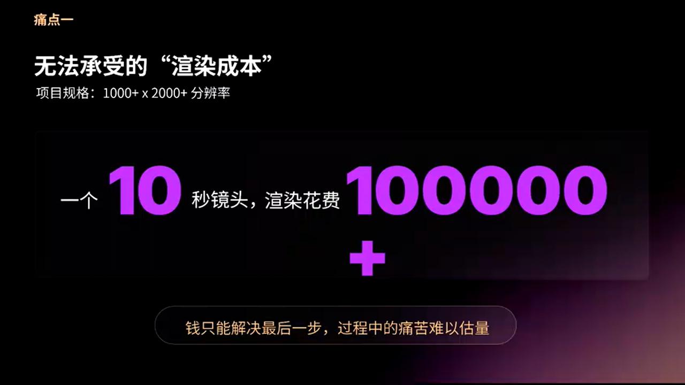

在2019年的一个城市展厅项目中,一个**10000×2000分辨率**的十多秒镜头,单次渲染费用就超过了**十万元人民币**。更致命的是,这笔费用只能解决最终渲染的时间问题,而在看不见最终效果的情况下反复修改、推倒重来所带来的**时间成本和精神内耗**根本无法用金钱衡量。

### 低效的反馈循环

传统CG流程的核心痛点在于**非实时反馈**:

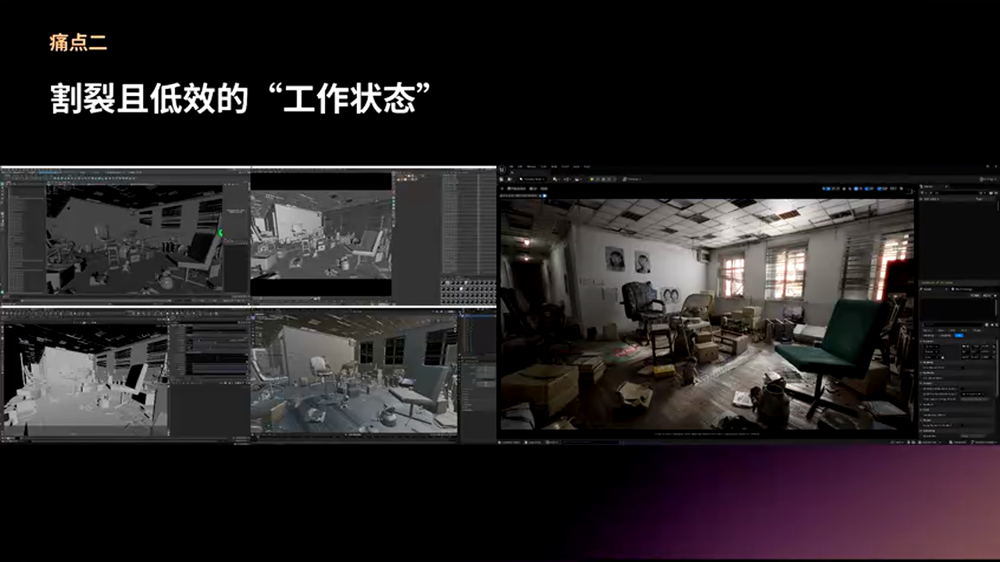

左侧是传统流程:在Maya、C4D、Blender、Houdini等DCC软件中盲操作,将结果发送给渲染器,调整参数后需要等待10秒甚至更长时间才能看到结果,整个过程就像"拉格子"。

右侧是虚幻引擎的实时流程:**所见即所得**,灯光、材质、特效、氛围的调整都是实时的。这种区别是**代差级别**的,让创作者可以把真正的时间投入到美术创作中,而不是等待渲染。

---

## 转机:UE 4.22与实时光线追踪的突破

### 技术革新的起点

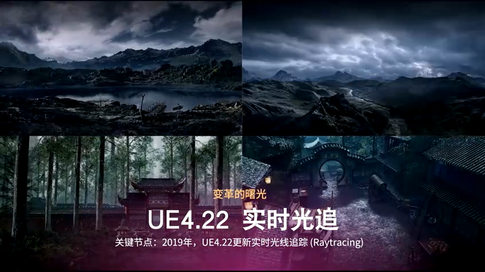

2019年是虚幻引擎发展的关键节点。UE 4.22版本首次将**实时光线追踪(Real-time Ray Tracing)**技术引入引擎,这标志着高效、直观、同时实现高品质画面的时代即将到来。

这是墨化团队在2019年使用UE 4.22进行的早期测试。正是这次技术突破,让团队看到了实时引擎的巨大潜力,也促使他们在2020年4月创立墨化,专注探索实时流程在创作领域的可能性。

---

## 墨化的业务生态:从教育到商业的全链路布局

### 四大核心业务版块

经过三年多的发展,墨化已经形成了完整的业务矩阵:

**1. 墨化教育**

致力于培养下一代实时引擎创作者。从基础课程到高级特效课程,墨化已经建立了完整的教学体系。

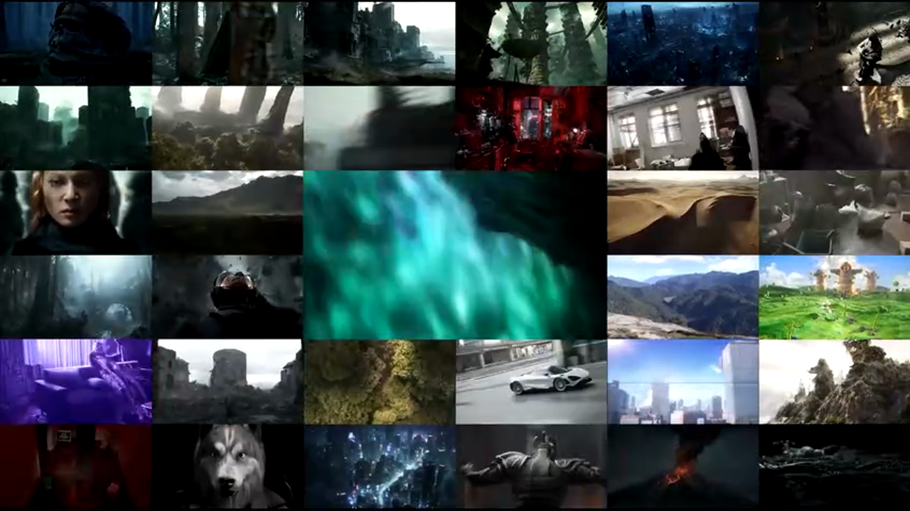

这些都是学员的实际作品,展现了从零基础到专业水平的成长轨迹。

**2. 课程研发能力**

墨化与行业顶尖公司合作,包括原力动画、盛趣游戏等,将生产环节的成功经验留存下来,进行技术沉淀和商业化。

**3. 商业项目制作**

墨化拥有内部制作团队,目前在大部分头部游戏公司的名单中,承接场景相关的研发和宣发工作。

**4. 人才录库服务**

墨化拥有国内最大的虚幻引擎创作者社群,最近正在进行腾讯级别的录库标准登记,方便企业更好地匹配预算和人员。

---

## 破除迷思一:虚幻引擎的学习门槛真的更高吗?

### 传统观念的误导

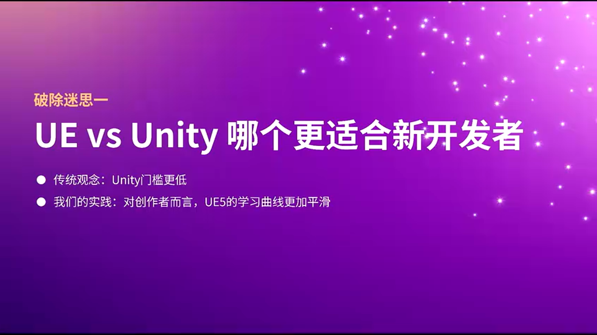

传统观念普遍认为Unity更简单、更适合初学者,但在UE5发布以后,这个结论已经不再准确,甚至可以说是一种**误导**。

墨化的实践证明:对于广大美术、设计等创意类人群来说,**UE5的学习曲线其实更加平滑**。

### 案例:从Unity转向UE的独立开发者

何俊音老师是一位资深游戏开发者,之前是Unity开发者,去年用UE5独立开发的游戏《贪婪达地》在EA阶段就取得了非常亮眼的成绩。

何老师选择从Unity转型UE的原因总结为:

- **优秀的美术管线**
- **成熟的供应链**
- **开放的代码**
- **稳定清晰的商业模式**

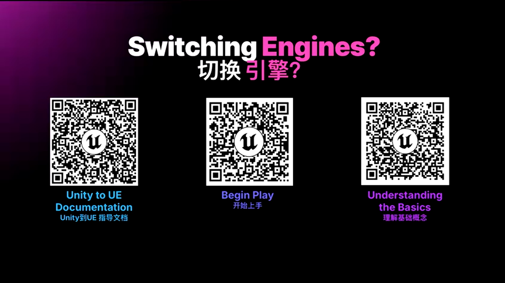

Epic官方贴心地为Unity开发者准备了引擎迁移指南,降低了转型门槛。

### 教学实践的验证

《屈杀》是墨化和何老师专门为**零基础学员**设计的全流程教学案例,**完全由蓝图开发**,没有一行C++代码。

这款游戏在Steam上线以来,录户超过**十万**,获得"特别好评"。

这些都是学生从零开始,经过**八周系统学习**做出的作品。

### 关键数据:美术背景占主导

墨化的游戏学生中:
- 程序背景只占不到**15%**
- 超过**70%**都是美术创意类背景

这说明**游戏行业的新鲜血液可能不再只是程序员了**。

---

## 蓝图系统:改变游戏开发业态的革命性工具

### 跳出C++与C#的思维陷阱

过去大家总在争论C++和C#哪个更难,但这默认了一个**程序员的视角**。对于设计师或创意工作人员来说,他们面临的第一个选择根本不是这两种复杂的代码语言,而是在**可视化蓝图**和**文本化的C#**之间做选择。

### 蓝图重塑独立游戏开发

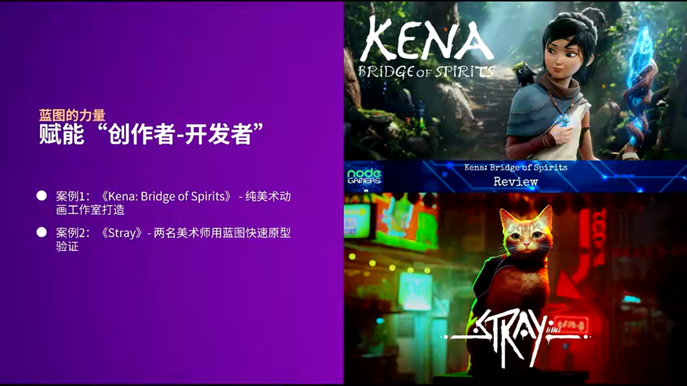

大家熟知的**Kena(柯娜)**和**Stray(迷失)**,最初的开发团队都是**美术思维主导**,甚至完全没有程序员。蓝图从根本上改变了独立游戏开发的初始团队构成和项目启动门槛。

在传统Unity工作流中,一个想法要转变成可交互的原型,团队里几乎必须要有一名程序员。这意味着许多出色的美术工作者或设计构想的创作者,会因为缺乏编程技能或找不到合适的程序员伙伴,而被阻挡在游戏开发的大门之外。

### UE5的完整工具箱

UE5的完整工具箱包括**Lumen(全局光照)**和**Nanite(虚拟几何体)**这两个革命性的技术,它们都是引擎的**默认配置**。

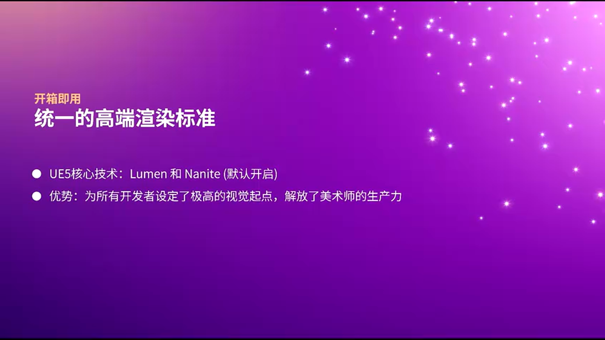

这意味着选择虚幻引擎,你不再需要选择"能不能有次时代的画面",而是选择"如何根据平台去适配这些高端性能"。它从一开始就给了你一个很高的起点,把**美术创意的潜力完全释放**出来。

游戏是创意的载体,让更多创意和美术人员能轻松进入UE5,做出心中的高品质游戏,而不用担心编程能力的缺失让自己止步候望。

> **核心观点**: 做游戏最重要的是**开始做游戏**,而不是学编程。

---

## 破除迷思二:虚幻引擎能用于影视和广告吗?

### 质量:从游戏到影视的跨越

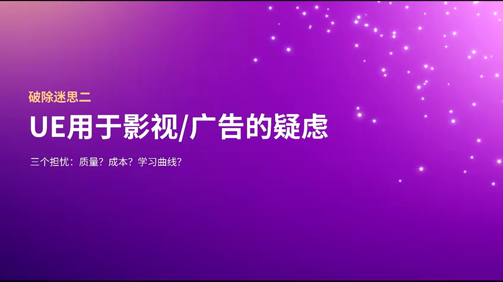

很多人会担心UE的质量、成本以及整个团队的学习曲线问题。但事实证明,UE在影视和广告领域的应用已经非常成熟。

从好莱坞的**曼达洛人**、**艾斯街**,到国内顶级番剧如**凡人修仙传**、**原神**等,都在使用虚幻引擎进行高标准的影视级制作和宣发。

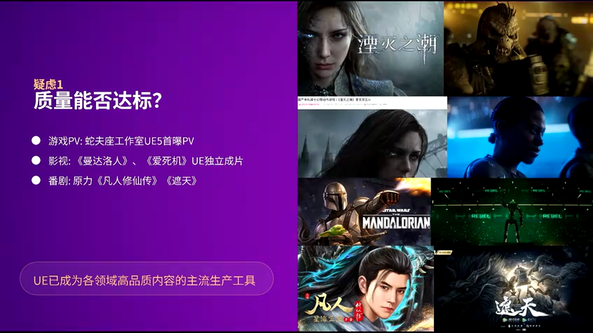

**UE5可以完全胜任任何高标准的影视级别的制作和宣发需求**。

### 技术卡点的逐步突破

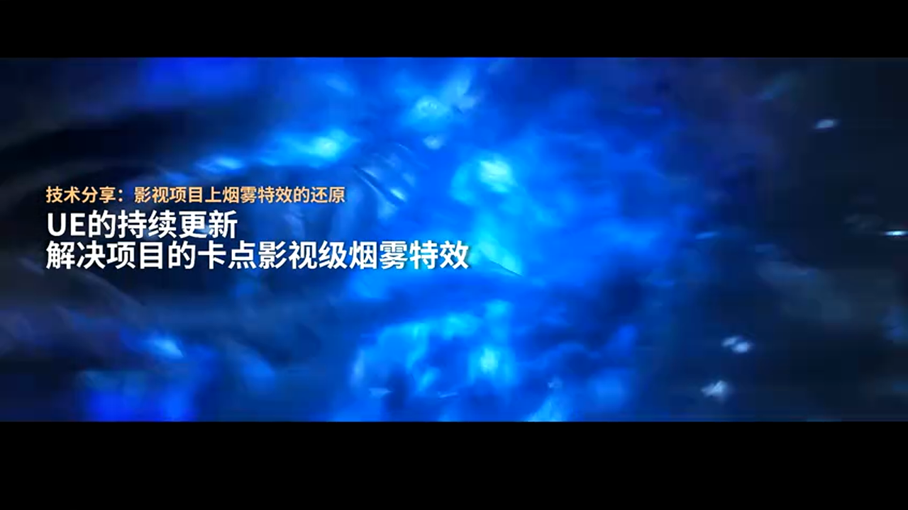

当然,在过去的项目制作中也出现过卡点。坦白说,**5.3版本之前**,团队对**烟雾特效**非常头疼,因为它的精度很难满足需求。

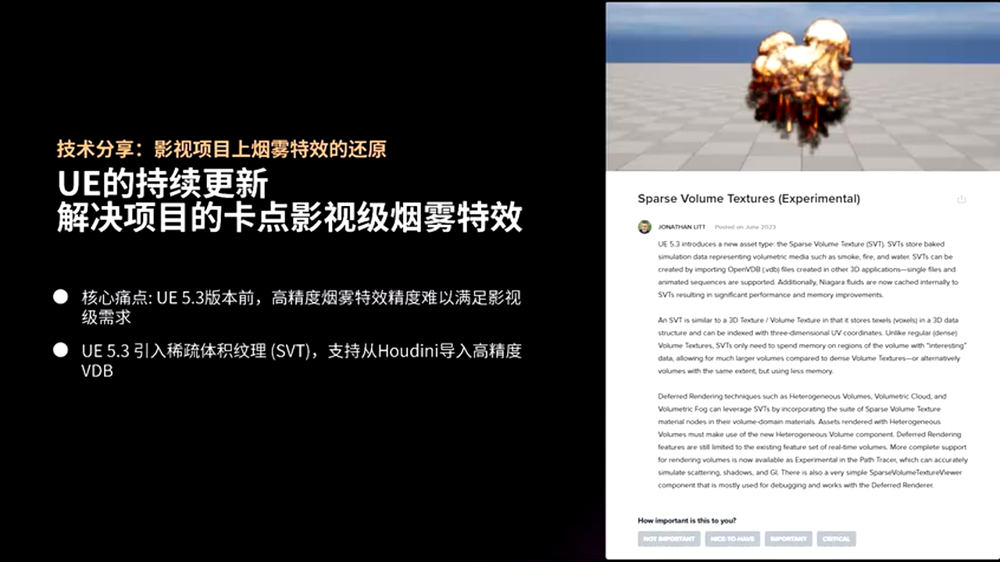

但UE的更新正在逐步抹平这些卡点。比如**5.3的SVT(Sparse Virtual Textures)更新**,让团队终于可以把Houdini里面解算的**VDB数据**高质量地导入到UE里面并且使用。

---

## 深度进阶:UE5中VDB烟雾渲染的实战技巧

### 核心思路:Houdini+UE5联合工作流

墨化团队分享了一个实战技巧:如何提升UE5里面VDB烟雾的渲染质量。

**核心思路**:在Houdini里面完成大部分的控制工作,把UE很大程度上当成合成软件来使用。

### 技术流程详解

**步骤1:分离发光与主体烟雾**

首先将**发光的烟雾**和**主体烟雾**分开处理,在Houdini里面通过控制密度来精准定义哪些区域需要发光。

**步骤2:使用PyroBackVolume节点烘焙**

最关键的步骤是在Houdini里用**PyroBackVolume节点**,将想要的颜色、发光强度、范围全部烘焙到一个独立的**Emission体积场**里面。

这样的好处是:比起直接导出颜色,在UE里面的**渲染精度和融合效果会好很多**。

**步骤3:RGB通道映射Hack**

可以进行一些小的Hack,把颜色采样上RGB三个通道,然后在UE里面还原。

**步骤4:控制Voxel密度**

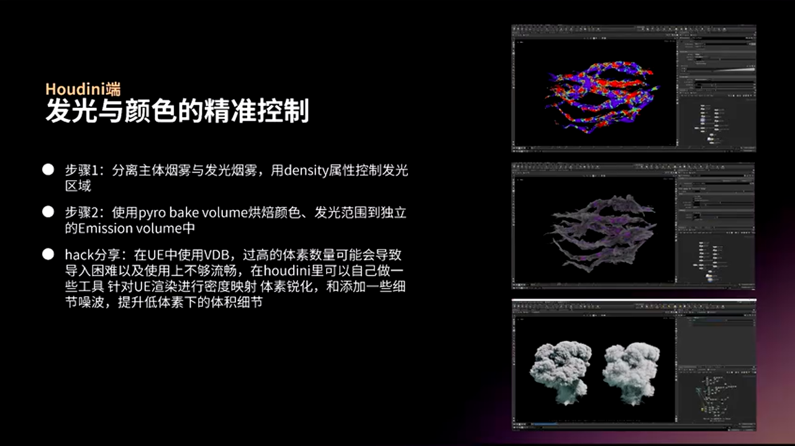

在Houdini里如果要导入UE使用,要尽量控制**Voxel的密度**。最好自己做一些工具,针对UE去做密度优化,控制体积的重采样、添加细节,这样在UE里的效果会清晰很多。

左边是处理之前,右边是处理之后,清晰度提升非常明显。

**步骤5:材质中的实时调整**

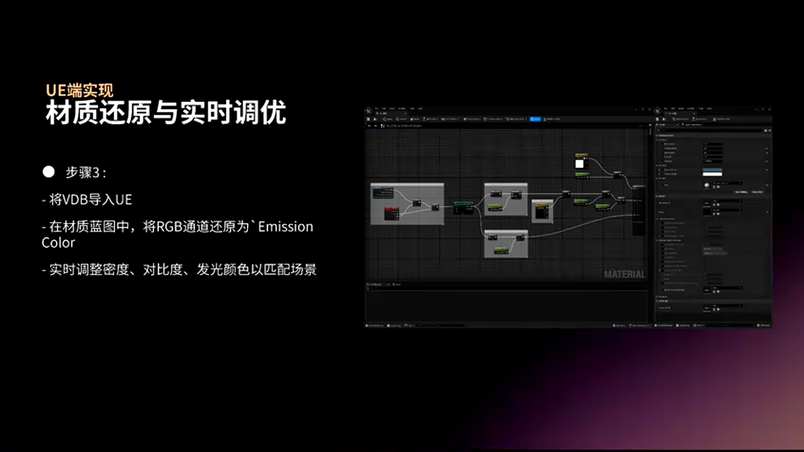

在材质里面把刚刚分离的RGB三个通道合成颜色。现在所有的调整在UE里面都是**实时的**,可以像调灯光一样实时调整烟雾的浓度、发光强度、范围,甚至赋予完全不同的颜色来匹配场景的光照。

### 流程的核心优势:无与伦比的复用性

这个流程最强大的地方是它带来了**无可比拟的复用性和迭代效率**。

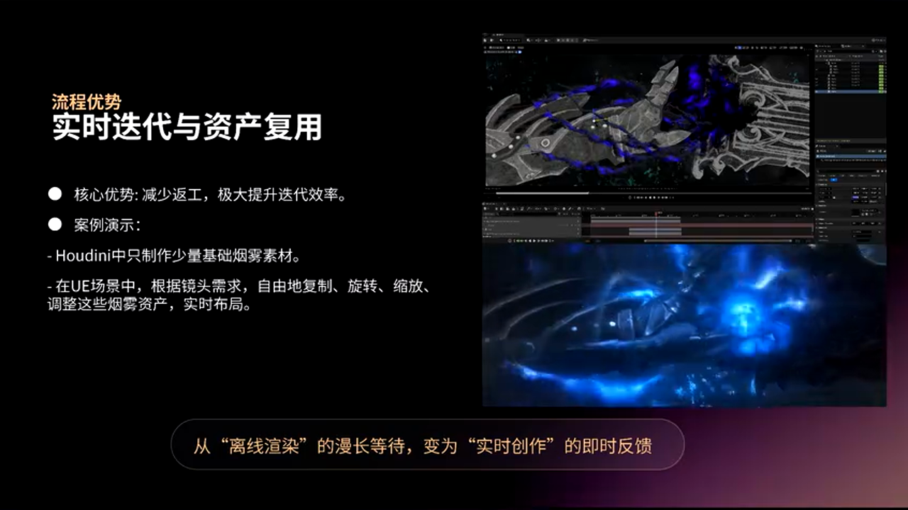

看这个镜头里手臂的烟雾路径:在Houdini里面你只需要做**一根或两根高质量的烟雾素材**,到UE里面可以根据摄像机的运动和构图,像搭积木一样旋转、复制、移动它们,实时调整烟雾形态和节奏。

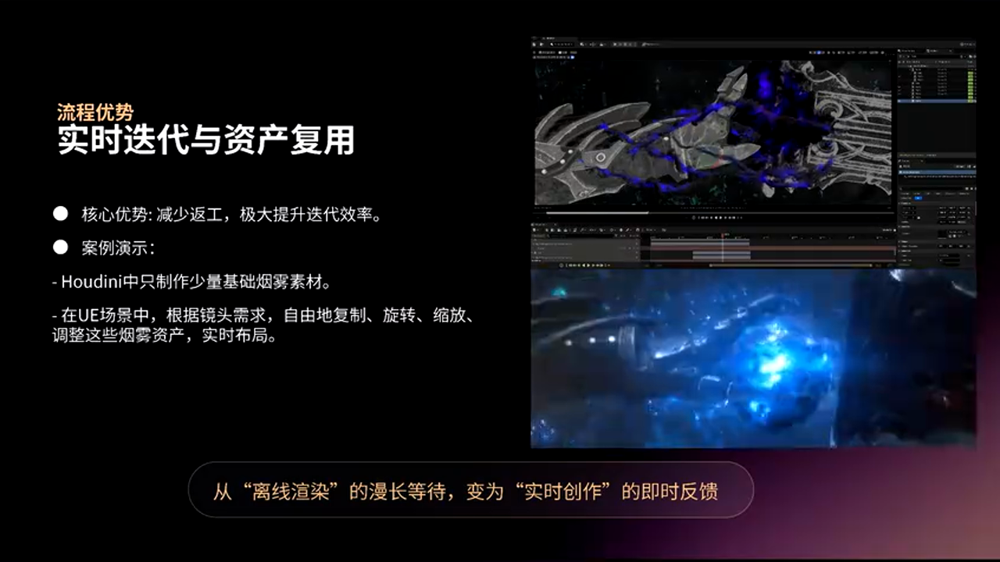

很大程度上,**合成的特效和灯光在UE里面是一体两面的**,这极大提高了迭代效率。

### 渲染性能数据

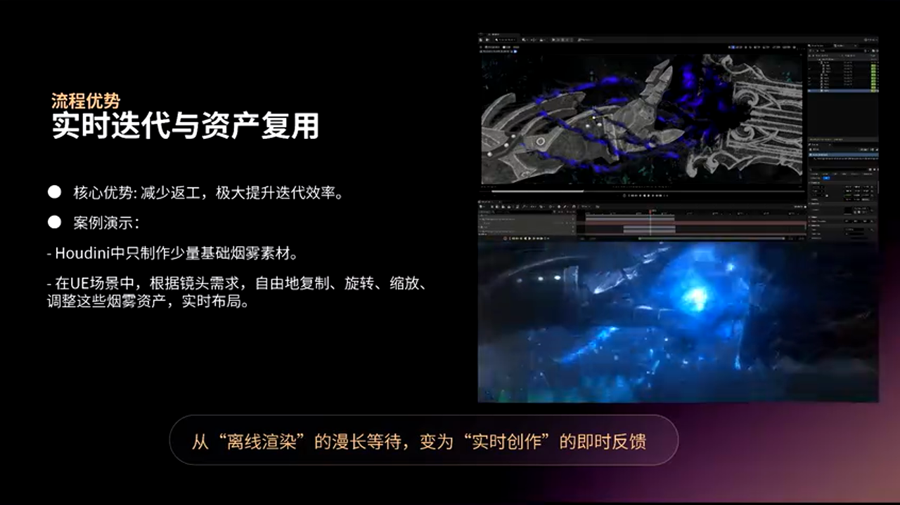

这个镜头大概是十多秒,这是在UE里面实时渲染后在MRQ(Movie Render Queue)里面输出的时间,相比传统流程效率提升显著。

---

## 成本分析:UE5的真实经济账

### 软件授权费用对比

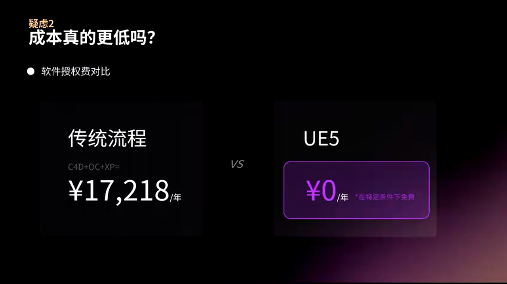

以传统CG流程举例:

**传统流程(C4D生态)**:
- C4D一年授权
- OC(Octane Render)一年授权
- X-Particles插件

这三样基本配置一年大概要**1.7万元人民币**,而且OC和X-Particles只是网络授权。

**UE5流程**:
如果是在影视或特定条件下,基本是**免费的**。

这个成本对于企业、团队和个人来说,账面上的差异是显而易见的。

### 流程成本的优化

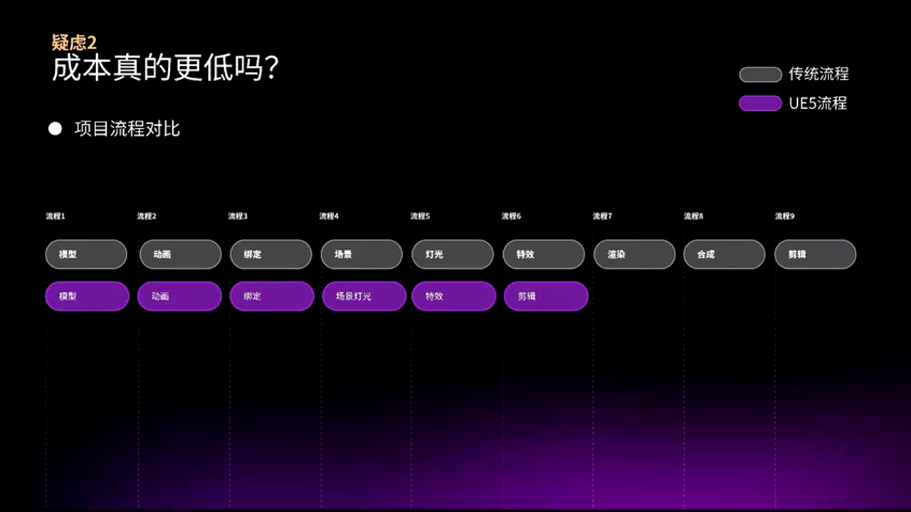

更重要的是**项目流程上的成本**:

在UE的实时流程里:

- **渲染环节**:基本可以砍掉,几乎不存在了
- **合成环节**:大部分合成不需要,因为UE很大程度上就是一个合成软件,灯光和合成一体化
- **场景与灯光**:很多时候在UE里是**一个人**完成,传统流程大概率需要**两个人**分别做场景和灯光

所以整个流程上,UE的流程**更轻、更快**,迭代速度也更快。

---

## 学习曲线:C4D团队的转型实验

### 墨化内部实验数据

墨化用自己的团队做了一个实验:

这个项目叫《悟空》,由**四位C4D背景的同事**完成,其中还包括应届生。

团队只进行了为期**一个月**,每周**两个小时**的轻度线下培训。

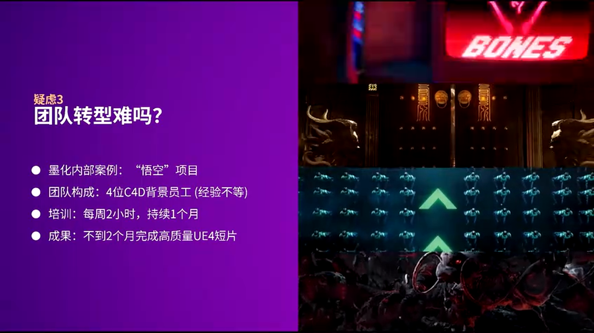

结果是他们花了**不到两个月**的时间,就做出了质量不错的UE5项目。

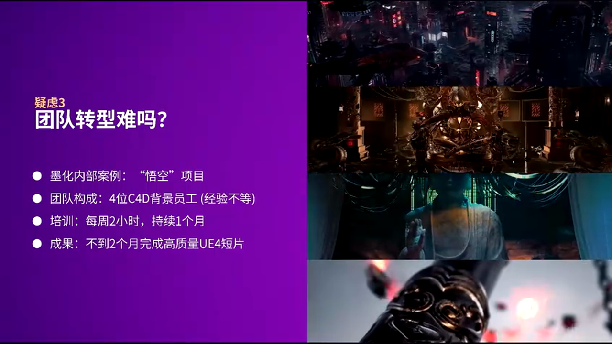

这证明:对有一定三维基础的人来说,转型UE的路径**会比想象中短得多**。

---

## 实战总结:UE5的"快好省"哲学

### 三大核心优势

UE5之所以是传统CG痛点的解药,是因为它做到了**快好省**:

> **快**:迭代和渲染的速度快
>
> **好**:能够灵活加载从实时到离线级别的画质
>
> **省**:资产的重复利用,实现一鱼多吃

这三点对于任何一个商业项目来说,都是**致命的优势**。

---

## 市场洞察:UE5用户的行业构成与趋势

### 数据来源与分析方法

在过去三年,超过**1000家企业**在墨化进行了采购或员工报销。墨化根据行业标注出了**854家不同的公司**,进行行业分析,得到了一些非常有意思的结论。

### 行业分布图谱

这张图清晰展现了UE用户的行业构成(**注:上面数据有15个重复,总加总有偏差**):

- **文化传媒**和**信息技术**是两大基石
- 更有趣的是其他正在快速增长的板块

### 发现一:核心稳固,跨界扩张

**传统创意行业构成坚实基础**:

影视、游戏、广告这些传统创意行业构成了UE的坚实基础,在这个圈层里已经构建出了一条从**内容创意→市场推广→技术实现**的成熟、高度协同的生产链。

**大规模跨界渗透**:

但同时,UE的影响力已经大规模渗透到:

- **制造业**:特别是汽车和电子消费品
- **高科技研发**:AI、航空航天
- **国防工业**:数据中甚至包含了**14家国防工业相关单位**

### 发现二:创造增量市场

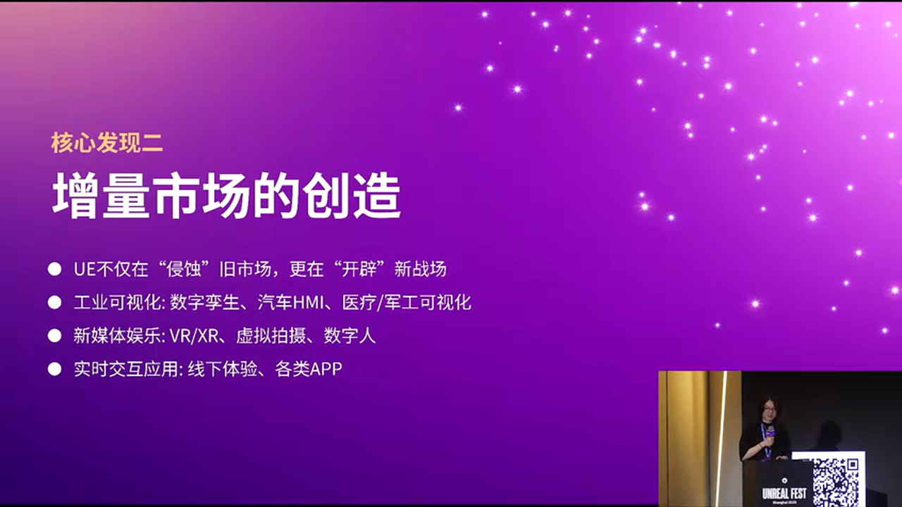

UE不仅在改造传统CG的存量市场,更重要的是**在创造全新的增量市场**。

这些是过去可能不存在或无法高效实现的商业场景:

- 工业领域的数字孪生
- 汽车的HMI设计
- 各种类型的可视化:工业建筑工程、甚至工厂
- 虚拟制片、XR、VR
- 数字人、虚美、VJ
- 各种需要实时交互体验的应用

**UE正在开辟一个全新的商业版图**。

---

## 结语:一场技术变革引发的商业模式更新

今天我们讨论虚幻引擎,早已经不是在讨论一个新的软件和技术。

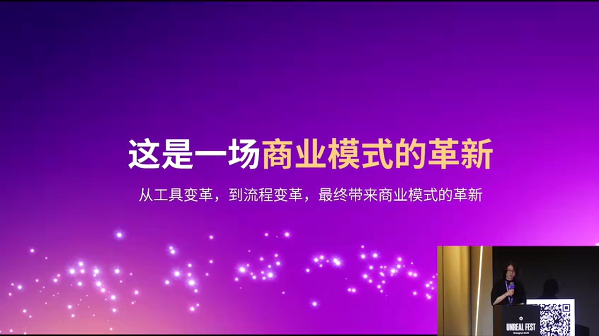

我们在讨论的是**一场由技术和流程变革所带来的商业模式的更新**。

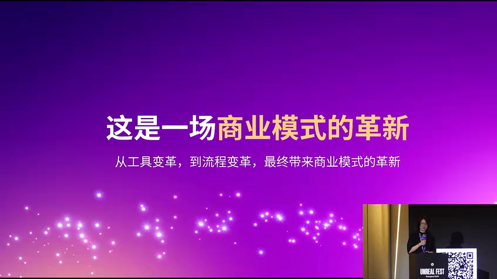

期待各位拥抱这场变化,用**同一批员工拓展出更多的商业领域**,拓展项目和体验的边界。

---

## 避坑指南

基于演讲内容和实践经验,在生产环境中使用UE5需要注意以下要点:

**VDB特效处理**:
- 5.3版本之前的烟雾特效精度有限,建议使用5.3+版本
- 务必在Houdini端控制好Voxel密度,避免导入UE后性能问题
- 发光烟雾和主体烟雾务必分离处理,否则后期调整困难

**团队转型路径**:
- 有三维基础的团队转型周期约1-2个月,需要配合系统培训
- 美术背景人员使用蓝图开发游戏的成功率很高,不要低估非程序员的潜力
- 建议从小项目入手,逐步建立实时渲染的思维方式

**成本控制**:
- 影视项目在特定条件下可以免费使用UE5,务必了解授权条款
- 渲染农场成本可以大幅降低,但需要投入GPU硬件
- 学习成本较传统流程更低,但需要改变原有工作习惯

---

## 最佳实践建议

**工作流优化**:
- 将UE视为"带实时预览的合成软件",充分利用其所见即所得的优势
- 灯光和合成一体化处理,减少流程环节
- 建立资产库,充分利用UE的资产复用能力

**技术选型**:
- 游戏项目优先考虑蓝图开发,C++仅用于性能关键模块
- 影视项目充分利用MRQ(Movie Render Queue)进行高质量输出
- 烟雾特效建议采用Houdini+UE5联合工作流

**团队建设**:
- 鼓励美术和创意人员学习蓝图,打破程序员垄断的局面
- 场景和灯光岗位可以合并,提高人效
- 建立UE技术社群,保持技术更新和经验分享

---

**分享就到这里,谢谢大家!**

