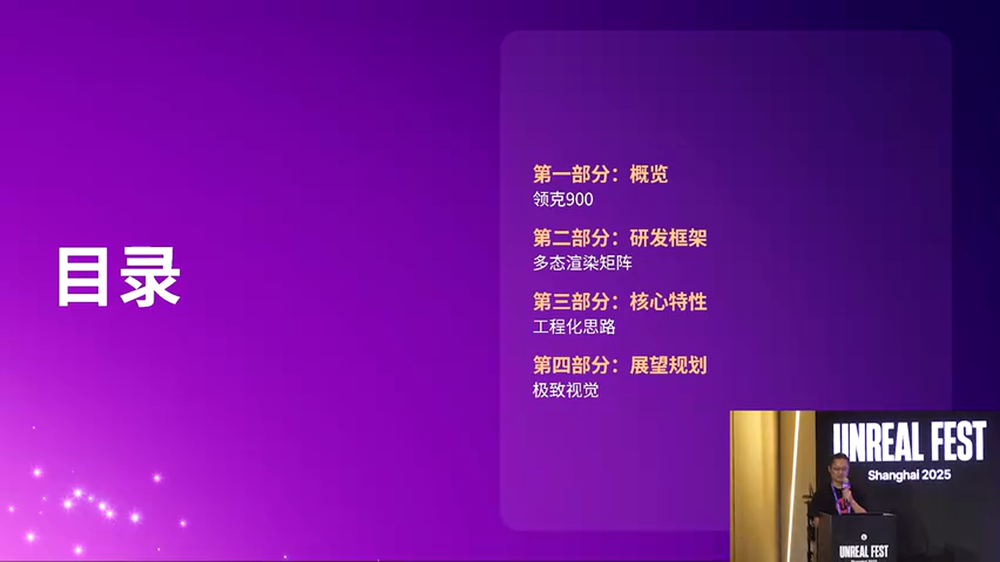
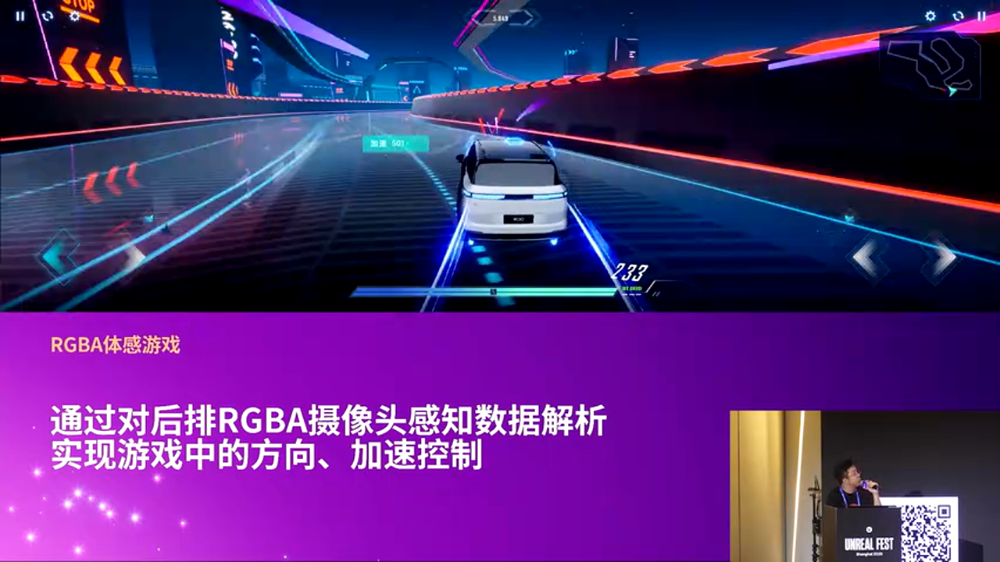

# 虚幻引擎赋能车载HMI：领克009多屏渲染架构深度解析

---


## 加入 UE5 技术交流群

如果您对虚幻引擎5的图形渲染技术感兴趣，欢迎加入我们的 **UE5 技术交流群**！

扫描上方二维码添加个人微信 **wlxklyh**，备注"UE5技术交流"，我会拉您进群。

在技术交流群中，您可以：
- 与其他UE开发者交流渲染技术经验
- 获取最新的GDC技术分享和解读
- 讨论图形编程、性能优化、构建工具流、动画系统等话题
- 分享引擎架构、基建工具等项目经验和技术难题

---

> **源视频信息**
>
> - 标题：[UFSH2025]重塑设计与交互:Unreal Engine赋能领克009 | 章世宁 楚然 吉利汽车研究院
> - 时长：46分24秒
> - 视频链接：https://www.bilibili.com/video/BV1HLmzBaEv2
> - 字幕来源：Whisper自动转录
> - 本文由AI辅助生成，内容基于视频字幕和截图整理

---

## 导读

> **核心观点**
>
> 1. **硬件限制下的架构创新**：在单芯片 8255、50% CPU 占用的严苛限制下，实现 30 英寸 6K 全屏渲染 + 主副驾分离交互
> 2. **产品形态优先的工程化思路**：从"视觉渲染优先"转向"产品形态优先"，通过模块化复用和数据驱动降低维护成本
> 3. **一套工程双实例架构**：基于 UE 构建全屏/半屏双运行实例，通过配置化系统实现灵活的产品形态切换

**前置知识**：UE 基础架构、车载 HMI 开发流程、Actor/Component 系统、GameplayTags

---

## 背景与痛点

### 车载 HMI 的新挑战

领克009 的产品定义颠覆了传统车载 HMI 开发的假设：


**硬件约束**：
- **单芯片架构**：整车仅搭载一颗高通 8255 芯片
- **CPU 预算极限**：6 核 CPU 中仅 50% 分配给 HMI 渲染
- **30 英寸 6K 超宽屏**：物理分辨率达到 6000+ 像素

**产品需求矛盾**：
- 需要支持全屏渲染 + 主副驾分离交互
- 需要在不同场景下动态切换全屏/半屏模式
- 需要保证 60fps 流畅性 + 高品质视觉效果



传统方案会遇到的问题：
- 多实例方案会超出性能预算
- 硬编码的界面逻辑难以应对频繁的需求变更
- 视觉资产无法在不同场景下复用

---

## 核心架构设计：一套工程双实例

### 架构理念

吉利团队提出的解决方案是 **"单工程多形态"** 架构：


**设计原则**：
1. **只维护一个 UE 工程**（单一代码库）
2. **车上运行两个实例**：
   - **全屏实例**：用于车载全景渲染（如主页、车模交互）
   - **半屏实例**：用于非车载场景（如音乐、导航）
3. **所有模块高度解耦**：通过配置驱动而非硬编码逻辑

### 为什么需要双实例？


**场景 1：车控主页**（全屏实例）
- 左侧屏幕显示完整车模
- 右侧屏幕显示车辆控制界面
- 车模需要跨屏渲染（需要完整的 6K 画布）

**场景 2：音乐播放**（半屏实例）
- 仅左半屏渲染车模
- 右半屏运行独立的音乐 App
- 此时无需占用全屏渲染资源

**技术实现**：
```cpp
// [示例代码] 基于上下文的实例启动逻辑
void AHMIGameMode::InitializeInstance(ERenderMode Mode) {
    if (Mode == ERenderMode::FullScreen) {
        // 启动全屏渲染管线
        RenderTargetWidth = 6000;
        EnableCrossScreenVehicle = true;
    } else {
        // 启动半屏渲染管线
        RenderTargetWidth = 3000;
        EnableCrossScreenVehicle = false;
    }

    // 根据配置加载对应模块
    LoadModulesFromConfig(Mode);
}
```

---

## 模块化复用体系

### 四层复用策略


团队将系统拆分为四个层次的复用：

#### 1. 场景复用（Scene Reuse）

**问题**：不同 App 可能需要在不同的"舞台"上展示车模

**方案**：
- 将场景抽象为可配置的 **Level** 或 **World**
- 通过配置表定义哪个 App 使用哪个场景

**示例配置**：
```json
{
  "AppID": "VehicleControl",
  "SceneType": "FullScreen",
  "LevelPath": "/Game/Levels/MainVehicleScene"
}
```

#### 2. 资产复用（Asset Reuse）


**挑战**：同一个车模在不同界面下需要不同的视觉形态

**解决方案**：
- 使用 **变体系统**（Variant Manager）管理车模的不同配置
- 通过 **Material Instance** 动态切换车漆、灯光等

```cpp
// [AI补充] 基于上下文的资产变体切换
void AVehicleActor::ApplyVariant(FName VariantName) {
    UVariantSet* VariantSet = GetVariantSet();
    if (VariantSet) {
        VariantSet->SetVariantByName(VariantName);
        // 触发材质刷新
        RefreshMaterialInstances();
    }
}
```

#### 3. App 复用（App Reuse）

**设计思路**：所有 App 共享同一个渲染实例

**优势**：
- 避免多实例带来的内存和 CPU 开销
- 统一的生命周期管理

#### 4. 窗口复用（Window Reuse）


**灵活性需求**：
- 今天某个功能是全屏 App
- 明天可能需要改成半屏悬浮窗
- 后天可能需要嵌入到车模的局部区域

**实现方式**：
```cpp
// [示例代码] 窗口配置驱动
struct FWindowConfig {
    EWindowType Type; // FullScreen / HalfScreen / Overlay
    FVector2D Position;
    FVector2D Size;
    bool bAllowDrag;
};

void UHMIWindowManager::CreateWindow(FWindowConfig Config) {
    // 根据配置动态创建 Widget
    UUserWidget* Widget = CreateWidget<UUserWidget>(GetWorld(), WidgetClass);
    Widget->SetRenderTransform(Config.Position);
    Widget->AddToViewport(Config.ZOrder);
}
```

---

## 数据驱动的工程化体系

### 配置表驱动架构


团队开发了一套 **跨平台的配置表系统**（UID Table）：

**核心思路**：
1. 在外部维护一张 **Excel 表格**，定义所有：
   - App 的运行模式（全屏/半屏）
   - 信号的映射关系
   - 场景的加载规则
2. 通过 **代码生成工具** 自动生成：
   - Java 层的业务代码（App 层）
   - C++ 层的引擎代码（UE 层）
3. 两层代码通过 **全局 UID** 保持同步

**优势**：
- **业务层不关心实现细节**：产品只需要修改表格，技术自动生成代码
- **实现层不关心业务逻辑**：UE 开发者只需要暴露接口，业务调用由生成代码完成
- **降低耦合度**：信号变更不需要手动同步多个代码库

### GameplayTags 的妙用


在 UE 中，团队使用 **GameplayTags** 作为模块间通信的核心机制：

```cpp
// [示例代码] 使用 GameplayTags 控制模块状态
void AVehicleControllerActor::OnSignalReceived(FGameplayTag SignalTag, float Value) {
    if (SignalTag.MatchesTag(FGameplayTag::RequestGameplayTag("Vehicle.Door.Open"))) {
        // 打开车门动画
        PlayDoorAnimation(Value);
    } else if (SignalTag.MatchesTag(FGameplayTag::RequestGameplayTag("Vehicle.Light.Headlight"))) {
        // 控制前灯亮度
        SetHeadlightIntensity(Value);
    }
}
```

**为什么选择 GameplayTags？**
- **层次化命名**：`Vehicle.Light.Headlight` 天然支持树状结构
- **编辑器友好**：可视化编辑，避免硬编码字符串
- **蓝图支持**：C++ 和蓝图可以共用同一套 Tag 系统

---

## 多形态渲染架构

### 全屏/半屏的技术实现


**挑战**：如何在同一套代码中支持完全不同的渲染策略？

**方案对比**：

> **方案 A：硬编码分支判断**
> - 🔴 劣势：代码充满 if-else，难以维护
> - 🔴 劣势：新增形态需要大量修改现有代码
> - 🎯 适用场景：原型阶段快速验证

> **方案 B：策略模式 + 配置驱动（采用）**
> - 🟢 优势：新增形态只需添加配置，无需修改核心逻辑
> - 🟢 优势：不同形态可以复用大部分渲染模块
> - 🟢 优势：支持运行时动态切换
> - 🎯 适用场景：产品需求频繁变化的生产环境

**实现细节**：
```cpp
// [AI补充] 策略模式的渲染管理器
class IRenderStrategy {
public:
    virtual void Setup() = 0;
    virtual void RenderFrame() = 0;
    virtual void Cleanup() = 0;
};

class UHMIRenderManager : public UObject {
    IRenderStrategy* CurrentStrategy;

    void SwitchStrategy(ERenderMode Mode) {
        if (CurrentStrategy) {
            CurrentStrategy->Cleanup();
        }

        if (Mode == ERenderMode::FullScreen) {
            CurrentStrategy = new FFullScreenStrategy();
        } else {
            CurrentStrategy = new FHalfScreenStrategy();
        }

        CurrentStrategy->Setup();
    }
};
```

### 性能优化：50% CPU 的极限挑战


**CPU 预算分配**（估算）：
- **渲染主线程**：20%
- **物理和动画**：10%
- **逻辑和信号处理**：15%
- **系统开销**：5%

**关键优化措施**：

1. **按需加载模块**
   - 音乐界面不加载车模资产
   - 导航界面不加载车内场景

2. **LOD（细节层次）策略**
   ```cpp
   // [AI补充] 动态 LOD 控制
   void AVehicleActor::UpdateLOD(float DistanceToCamera) {
       int32 LODLevel = 0;
       if (DistanceToCamera > 500.0f) {
           LODLevel = 2; // 低细节
       } else if (DistanceToCamera > 200.0f) {
           LODLevel = 1; // 中等细节
       }

       StaticMeshComponent->SetForcedLodModel(LODLevel + 1);
   }
   ```

3. **异步加载**
   - 使用 `UAssetManager` 异步加载大型资产
   - 避免卡顿

---

## 后排娱乐系统：复用前排资产

### 技术复用的实战案例


领克009 的后排娱乐系统展示了模块化架构的威力：

**需求**：
- 后排屏幕需要独立的娱乐系统
- 包含游戏、视频、车控等功能
- 需要在极短的开发周期内完成

**解决方案**：
> **100% 复用前排资产和框架**
> - 车模资产：直接使用前排的车模变体系统
> - 功能模块：直接调用前排的车控逻辑
> - UI 框架：基于 UMG 的可复用 Widget

**代码示例**：
```cpp
// [示例代码] 后排系统复用前排模块
void ARearSeatController::InitializeModules() {
    // 复用前排的车辆控制模块
    VehicleControlModule = Cast<UVehicleControlModule>(
        GetWorld()->SpawnActor(FrontSeatModuleClass)
    );

    // 复用前排的无人机模块
    DroneModule = GetFrontSeatDroneModule();
    DroneModule->SetRenderTarget(RearScreenRenderTarget);
}
```

**开发效率提升**：
- **传统方案**：需要 3-4 个月独立开发
- **模块化方案**：仅用 2 周完成集成和适配

---

## 创新交互：体感游戏

### 车载传感器的创造性应用


团队开发了一款基于 **RGB 摄像头** 的体感游戏：

**技术链路**：
1. **后排 RGB 摄像头** 捕捉乘客动作
2. **手势识别算法** 解析动作数据
3. **UE 游戏逻辑** 接收控制信号

**输入映射**：
- **左右倾斜** → 赛车方向控制
- **前后移动** → 加速/减速
- **手势点击** → 触发道具



**技术启示**：
> **车载传感器是天然的游戏输入设备**
>
> - 方向盘转角、油门踏板、座椅传感器都可以作为输入源
> - 未来车载游戏的增长点在于与整车信号的深度融合

**实现伪代码**：
```cpp
// [AI补充] 体感输入处理
void UGestureInputComponent::ProcessCameraFrame(FVideoFrame Frame) {
    // 调用手势识别算法（假设已有）
    FGestureData Gesture = GestureRecognizer->Analyze(Frame);

    if (Gesture.Type == EGestureType::TiltLeft) {
        // 发送转向信号
        SendGameplayEvent(FGameplayTag::RequestGameplayTag("Input.Steer"), -1.0f);
    } else if (Gesture.Type == EGestureType::SwipeForward) {
        // 发送加速信号
        SendGameplayEvent(FGameplayTag::RequestGameplayTag("Input.Throttle"), 1.0f);
    }
}
```

---

## 深度进阶：性能分析与底层机制

### CPU 占用的分析方法

**推荐工具**：
1. **UE Profiler**：内置的性能分析器，可以查看每帧的耗时分布
2. **Snapdragon Profiler**：高通芯片专用工具，可以查看 GPU 和 CPU 的实时占用
3. **Unreal Insights**：UE5 的新一代追踪工具

**关键指标监控**：
```cpp
// [AI补充] 性能监控代码
void UHMIPerformanceMonitor::Tick(float DeltaTime) {
    // 记录帧率
    CurrentFPS = 1.0f / DeltaTime;

    // 记录 CPU 时间
    CPUTime = FPlatformTime::Seconds() - LastFrameTime;

    // 超过预算时发出警告
    if (CPUTime > TARGET_CPU_BUDGET) {
        UE_LOG(LogHMI, Warning, TEXT("CPU budget exceeded: %.2fms"), CPUTime * 1000.0f);
    }
}
```

### 渲染合并技术


**问题**：主副驾分离交互后，如何将两个渲染结果合并到一个 6K 屏幕？

**方案**：
1. **双 RenderTarget**：主驾和副驾各渲染到独立的 Render Target
2. **后处理合成**：通过自定义 Post Process Material 将两个 RT 合并
3. **硬件加速**：利用 GPU 的 Blit 操作减少 CPU 参与

**Post Process Material 示例**：
```hlsl
// [AI补充] 合并材质的 Shader 伪代码
float4 MainPS(float2 UV : TEXCOORD0) : SV_Target {
    if (UV.x < 0.5) {
        // 左半屏：主驾渲染结果
        return Texture2DSample(DriverRenderTarget, UV * float2(2.0, 1.0));
    } else {
        // 右半屏：副驾渲染结果
        return Texture2DSample(PassengerRenderTarget, (UV - float2(0.5, 0.0)) * float2(2.0, 1.0));
    }
}
```

---

## 实战总结与建议

### 架构设计的关键经验

> **核心经验 1：产品形态驱动架构设计**
>
> 不要从引擎功能出发设计架构，而是从产品的形态需求（全屏/半屏/分屏）出发，倒推技术方案

> **核心经验 2：配置化是模块化的前提**
>
> 只有将硬编码逻辑转化为配置数据，模块才能真正做到可替换、可复用

> **核心经验 3：工具链投资回报率极高**
>
> 配置表的代码生成工具开发周期虽长（约 1-2 个月），但在后续迭代中能节省 50% 以上的联调时间

### 避坑指南

**坑 1：过早优化**
- 🔴 错误做法：项目初期就开始优化每一帧的性能
- 🟢 正确做法：先跑通核心流程，用 Profiler 找到真正的瓶颈再优化

**坑 2：忽视异步加载**
- 🔴 错误做法：在主线程同步加载所有资产
- 🟢 正确做法：使用 `UAssetManager::LoadPrimaryAsset` 异步加载大型资产

**坑 3：滥用 GameplayTags**
- 🔴 错误做法：将所有信号都通过 Tags 传递（包括高频信号）
- 🟢 正确做法：高频信号（如摄像头帧）使用专用接口，低频事件用 Tags

**坑 4：忽视内存管理**
```cpp
// [AI补充] 常见的内存泄漏场景
void AMyActor::BadExample() {
    // 🔴 错误：Lambda 捕获了 this，但没有处理 Actor 销毁
    AsyncTask(ENamedThreads::AnyBackgroundThreadNormalTask, [this]() {
        // 如果 Actor 已销毁，this 是野指针
        DoSomething();
    });
}

void AMyActor::GoodExample() {
    // 🟢 正确：使用 Weak Pointer
    TWeakObjectPtr<AMyActor> WeakThis(this);
    AsyncTask(ENamedThreads::AnyBackgroundThreadNormalTask, [WeakThis]() {
        if (WeakThis.IsValid()) {
            WeakThis->DoSomething();
        }
    });
}
```

---

## 未来规划

### 技术演进方向

**1. 云渲染支持**
- 将高质量车模渲染卸载到云端
- 车机端仅负责视频流解码和交互

**2. AI 驱动的场景生成**
- 根据用户偏好自动生成个性化的车内场景
- 基于天气、时间动态调整车模的视觉效果

**3. 跨车型资产共享平台**
- 建立吉利内部的 UE 资产库
- 不同车型可以共享车模、材质、动画等资产

---

## 总结

领克009 的 HMI 开发展示了 **虚幻引擎在车载领域的巨大潜力**。通过：
- **单工程双实例** 的架构设计
- **配置驱动** 的工程化思路
- **模块化复用** 的资产管理

团队在严苛的硬件限制下，实现了高品质的视觉效果和灵活的产品形态。这套方法论不仅适用于车载 HMI，也为其他嵌入式 UE 应用（如智能家居、工业控制）提供了宝贵的参考。

**关键技术点回顾**：
1. ✅ GameplayTags 驱动的模块通信
2. ✅ 配置表自动生成跨语言代码
3. ✅ 策略模式实现多形态渲染
4. ✅ 异步加载 + LOD 优化性能
5. ✅ 后排系统 100% 复用前排资产

**致谢**：
感谢虚幻引擎官方和吉利汽车团队在 UFSH2025 峰会上的分享，为车载 HMI 开发者提供了宝贵的实战经验。

---

**相关资源**：
- [虚幻引擎官方文档](https://docs.unrealengine.com/)
- [GameplayTags 使用指南](https://docs.unrealengine.com/5.0/en-US/gameplay-tags-in-unreal-engine/)
- [车载 HMI 性能优化最佳实践](https://dev.epicgames.com/documentation/en-us/unreal-engine/performance-and-profiling-in-unreal-engine)

---

**注**：本文基于视频内容整理，部分代码示例为辅助理解而补充，实际实现可能因项目需求有所不同。
