# 虚幻引擎移动端性能优化实战：从渲染管线到性能调试的完整指南

---


## 加入 UE5 技术交流群

如果您对虚幻引擎5的图形渲染技术感兴趣，欢迎加入我们的 **UE5 技术交流群**！

扫描上方二维码添加个人微信 **wlxklyh**，备注"UE5技术交流"，我会拉您进群。

在技术交流群中，您可以：
- 与其他UE开发者交流渲染技术经验
- 获取最新的GDC技术分享和解读
- 讨论图形编程、性能优化、构建工具流、动画系统等话题
- 分享引擎架构、基建工具等项目经验和技术难题

---

> **源视频信息**
> 
> 标题：[UFSH2025]虚幻引擎移动端性能优化实战 | Sam Deiter 资深虚幻引擎讲师
> 
> 时长：24分11秒
> 
> 视频链接：https://www.bilibili.com/video/BV1itmzBWEYJ
> 
> 本文由AI辅助生成，基于视频内容的字幕和截图整理而成

---

## 导读

> **核心观点**
> 
> - 虚幻引擎移动端提供了**前向着色**和**延迟着色**两种渲染管线，选择正确的管线是性能优化的基础
> - **AMD FSR移动版**可以实现2-4倍性能提升，是最简单易用的移动端性能优化技术
> - 通过**Mesh自动实例化**、**动画预算分配器**、**材质质量设置**等技术可以显著降低Draw Call和内存消耗
> - **设备配置（Device Profiles）**和**PSO预缓存**是确保跨设备稳定运行的关键技术

**前置知识要求**：了解虚幻引擎基础架构、熟悉移动端GPU特性（Tile-based架构）、具备基本的性能分析能力。

---

## 背景与痛点：移动端性能优化的挑战

移动端游戏开发面临的最大挑战是**硬件资源受限**和**设备碎片化严重**。与PC和主机平台不同，移动设备需要在有限的电池寿命、内存容量和GPU性能下运行游戏。


移动端GPU主要分为两类：

1. **Tile-based GPU**：现代移动GPU的主流架构，包括ARM Mali、Qualcomm Adreno、Apple GPU等。这类GPU采用分块渲染（Tile-based Rendering），延迟着色在这种架构上表现更好。

2. **Immediate-mode GPU**：较老的移动GPU架构，如Nvidia Tegra、Samsung Exynos、PowerVR等。前向着色在这些GPU上通常有更好的性能。

理解不同GPU架构的特性，是选择正确渲染管线的关键。

---

## 核心原理解析

### 移动端前向着色（Mobile Forward Shading）

**前向着色（Forward Shading）**是虚幻引擎移动端的可选渲染管线。与延迟着色不同，前向着色在单个渲染通道中完成几何体和光照计算。


**优势分析：**

> **适用场景**：前向着色最适合使用预计算光照（Pre-computed Lighting）或非光照（Unlit）的项目。

- **广泛的设备兼容性**：支持更多不同类型的移动设备
- **最快的渲染路径**：在与预计算光照和阴影配合使用时，性能最优
- **丰富的抗锯齿选项**：支持多种抗锯齿技术，包括MSAA
- **适合本地光源**：大量使用点光源或聚光灯的项目可以从中受益

**劣势与限制：**

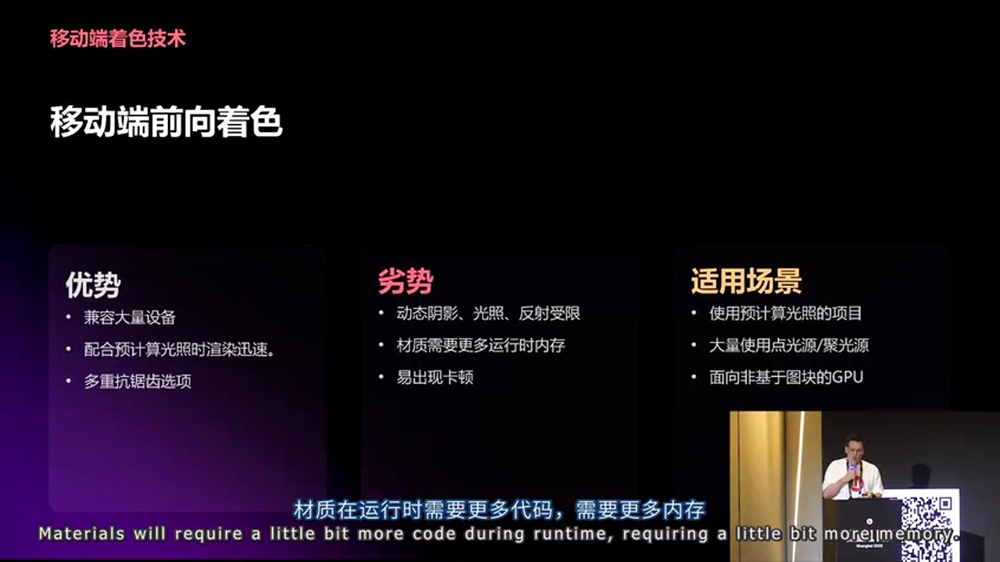

- **动态光照支持有限**：动态阴影和反射的支持较弱
- **材质复杂度影响**：材质在运行时需要更多代码处理，增加内存消耗
- **可能出现卡顿**：在复杂场景中可能出现帧率不稳定
- **内存消耗增加**：相比延迟着色，需要更多内存

**技术原理：**

前向着色采用**单通道渲染**，所有光照计算都在片段着色器中完成。这意味着：

```cpp
// [AI补充] 前向着色的核心渲染流程
// 在Fragment Shader中同时计算几何和光照
void ForwardShadingFragmentShader() {
    // 1. 采样几何属性（Normal, BaseColor等）
    float3 Normal = SampleGBuffer();
    float3 BaseColor = SampleBaseColor();
    
    // 2. 在同一着色器中计算所有光照
    float3 Lighting = CalculateAllLights(Normal, BaseColor);
    
    // 3. 直接输出最终颜色
    return BaseColor * Lighting;
}
```

这种设计的**设计意图**是减少内存带宽，因为不需要存储中间GBuffer数据。但对于复杂光照场景，计算开销会显著增加。

**实战应用建议：**

- 适用于**解谜类游戏**，不需要完整的延迟渲染管线
- 目标设备为**非Tile-based GPU**时优先考虑
- 项目大量使用**本地光源**（点光源、聚光灯）的场景
- 不使用**方向光**或**天光**的项目


从实际效果来看，前向着色虽然功能完整，但画面对比度较低，明暗区分不够明显。这是单通道渲染的代价。

### 移动端延迟着色（Mobile Deferred Shading）

**延迟着色（Deferred Shading）**是虚幻引擎移动端项目的**默认渲染管线**。它将几何渲染和光照计算分离到两个独立的通道中。

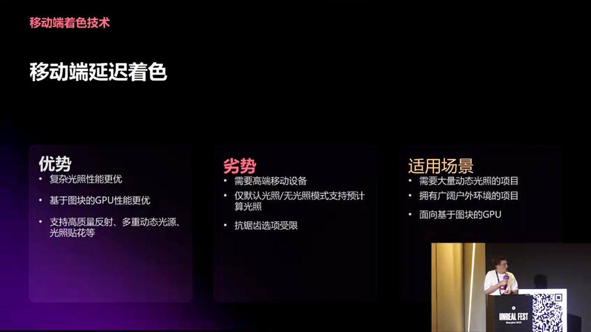

**优势分析：**

- **复杂光照性能优异**：在复杂光照设置下性能更好
- **Tile-based GPU优化**：专门为现代移动GPU架构优化
- **更好的视觉质量**：支持更复杂的动态光照和阴影

**技术原理：**

延迟着色采用**两通道渲染**：

```cpp
// [AI补充] 延迟着色的核心渲染流程
// 第一通道：G-Buffer生成
void DeferredGeometryPass() {
    // 将几何属性写入G-Buffer
    GBuffer.Normal = CalculateNormal();
    GBuffer.BaseColor = SampleBaseColor();
    GBuffer.Roughness = SampleRoughness();
    GBuffer.Metallic = SampleMetallic();
}

// 第二通道：光照计算
void DeferredLightingPass() {
    // 从G-Buffer读取几何属性
    float3 Normal = GBuffer.Normal;
    float3 BaseColor = GBuffer.BaseColor;
    
    // 在屏幕空间计算光照
    float3 Lighting = CalculateLighting(Normal, BaseColor);
    
    return BaseColor * Lighting;
}
```

**设计意图**是将几何复杂度和光照复杂度解耦。几何复杂度影响第一通道，光照复杂度影响第二通道。这样可以避免前向着色中"几何复杂 × 光照复杂"的乘积开销。

**劣势与限制：**


- **需要更高端设备**：某些低端设备可能无法运行
- **预计算光照选项受限**：只能使用默认光照（Default Lit）和非光照（Unlit）模式
- **抗锯齿限制**：无法使用MSAA，只能使用TXAA（Temporal Anti-Aliasing）

**适用场景：**


- 包含大量**动态光源和阴影**的项目
- 需要**广泛室外环境**的项目
- 使用**天光和方向光**的大型开放世界
- 目标设备为**Tile-based GPU**（ARM Mali、Qualcomm Adreno、Apple GPU等）

从视觉对比来看，延迟着色在相同场景下提供了**更高的对比度**，明暗区分更加明显。水面的反射效果也更加清晰可见。

### 渲染管线选择策略

> **方案对比**

> **方案 A：移动端前向着色**
> - 🟢 优势：设备兼容性广、支持MSAA、适合本地光源、性能开销低（预计算光照时）
> - 🔴 劣势：动态光照支持弱、内存消耗高、可能出现卡顿、视觉质量相对较低
> - 🎯 适用场景：解谜游戏、非Tile-based GPU目标、大量本地光源、不使用方向光的项目

> **方案 B：移动端延迟着色**
> - 🟢 优势：复杂光照性能好、视觉质量高、动态光照支持强、Tile-based GPU优化
> - 🔴 劣势：需要更高端设备、预计算光照选项受限、不支持MSAA、默认选项（可能不是最优选择）
> - 🎯 适用场景：大型开放世界、复杂动态光照、Tile-based GPU目标、需要方向光和天光的项目

**选择建议**：根据项目需求和目标设备特性选择。如果项目使用大量预计算光照且目标是较老的移动设备，前向着色可能是更好的选择。如果项目需要复杂的动态光照且目标现代移动设备，延迟着色是默认且推荐的选择。

---

## 移动端渲染增强技术

### AMD FSR移动版：最简单的性能提升方案

**AMD FidelityFX Super Resolution（FSR）移动版**是Sam在演讲中特别推荐的技术，因为它**极其简单易用**且效果显著。


**核心优势：**

- **2-4倍性能提升**：通过降低渲染分辨率并智能放大，可以获得2-4倍的性能提升
- **轻微画质损失**：在适当的设置下，画质损失几乎不可察觉
- **即插即用**：只需启用插件，无需重新编译引擎

**技术原理：**

FSR采用**空间上采样**技术，在低分辨率下渲染，然后通过边缘感知算法放大到目标分辨率。这种方法比传统双线性滤波保留了更多细节。


**实战应用：**

FSR可以通过控制台命令实时调整，无需重新编译或打包：

```
// 命令示例
r.Mobile.FSR.Sharpness 0.01  // 最小值，画质最好
r.Mobile.FSR.Sharpness 1.0   // 最大值，性能最好（不推荐）
```

**重要提示**：**不要将Sharpness值设置为1.0**，否则会出现明显的视觉瑕疵。建议值在0.01-0.5之间。

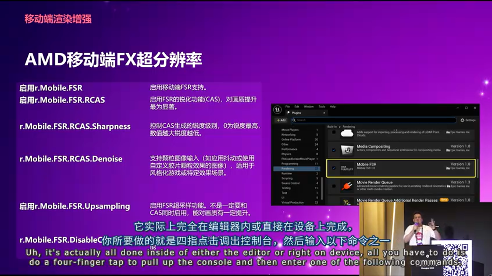

FSR的另一个优势是可以在**编辑器内直接测试**，通过四指点击调出控制台，输入命令即可实时查看效果。找到合适的值后，再在设备上验证即可。

**适用场景：**

- 需要显著性能提升的项目
- 画质要求相对灵活的项目
- 需要快速验证性能优化的场景

### 移动端帧率控制（Mobile Frame Pacing）

**移动端帧率控制**允许开发者精确控制应用程序的帧率，不仅适用于移动设备，也适用于**车载HMI设备**。

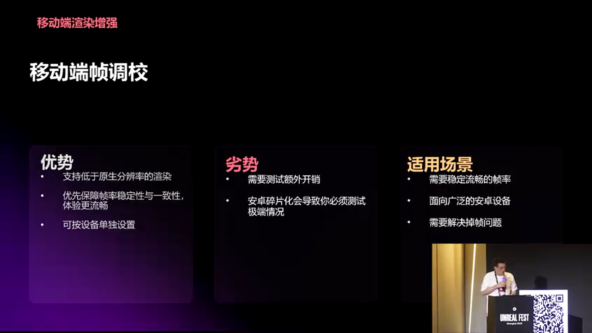

**核心功能：**

- **精确帧率控制**：可以设置为任意帧率（如3 FPS、30 FPS、60 FPS）
- **一致的用户体验**：确保UI和动画在一致的帧率下运行
- **性能预留**：通过降低帧率上限，为其他系统预留性能空间

**技术实现：**

帧率控制通过在渲染循环中插入等待时间来实现。这与传统的垂直同步（VSync）不同，VSync受限于显示器的刷新率，而帧率控制可以设置为任意值。


**使用示例：**

在设备上通过四指点击调出控制台，输入：

```
// 命令示例
r.Mobile.FrameRate 5   // 设置为5 FPS（用于测试）
r.Mobile.FrameRate 30  // 设置为30 FPS
r.Mobile.FrameRate 60  // 设置为60 FPS
```

**注意事项：**

- **Android驱动碎片化**：由于Android驱动社区的碎片化，某些设备系列可能不支持此功能
- **需要额外测试**：必须确保在所有目标设备上测试功能是否正常工作
- **输入延迟检查**：某些设备上启用帧率控制可能会影响输入响应

**适用场景：**

- 需要**一致的UI体验**的项目
- 需要通过降低帧率**回收性能**的场景
- **车载HMI应用**，需要精确控制帧率

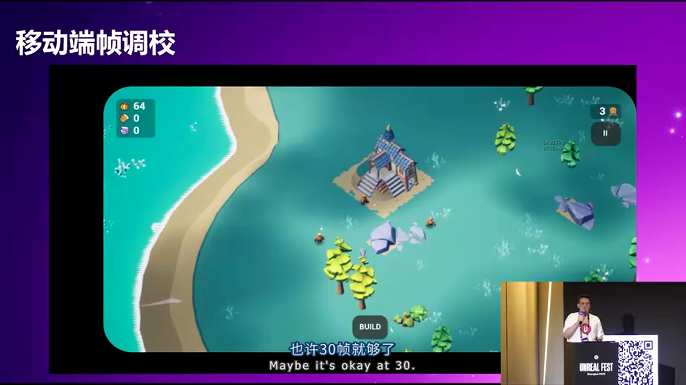

从实际演示可以看到，帧率控制可以实时调整，从5 FPS切换到60 FPS，响应非常迅速。这对于性能测试和优化非常有用。

---

## 性能优化技术

### Mesh自动实例化（Mesh Auto-instancing）

**Mesh自动实例化**是虚幻引擎移动端的默认优化技术，可以**自动合并Draw Call**，显著提升性能。


**核心原理：**

自动实例化通过将**相同材质和网格**的多个对象合并到单个Draw Call中来实现。这减少了CPU向GPU发送命令的开销。

**性能数据：**


在实际测试中：
- **关闭自动实例化**：约2000个Draw Call
- **开启自动实例化**：约1100个Draw Call
- **性能提升**：Draw Call数量减少近**50%**

**设计意图：**

Draw Call是渲染性能的关键瓶颈之一。每次Draw Call都需要CPU准备数据、发送命令到GPU，这个过程有固定开销。通过减少Draw Call数量，可以显著降低CPU开销，释放CPU资源用于其他系统（如物理、AI等）。

**控制方式：**

可以通过控制台命令实时开关：

```
// 命令示例
r.Mobile.InstancedStereo 0  // 关闭
r.Mobile.InstancedStereo 1  // 开启（默认）
```

**注意事项：**

- 自动实例化是**默认开启**的，但开发者应该了解其工作原理
- 在某些特殊情况下，可能需要关闭以支持特定的渲染需求
- 自动实例化主要影响**内存管理**和**渲染性能**两个方面

### 动画预算分配器（Animation Budget Allocator）

**动画预算分配器**是一个智能的动画性能管理系统，类似于《巫师》Demo中使用的技术概念。


**核心概念：**

与传统的手动优化不同，动画预算分配器采用**目标驱动**的方式：

1. **设定性能目标**：为所有动画指定一个总的时间预算（如1毫秒）
2. **系统自动分配**：系统自动在所有动画之间分配这个预算
3. **优先级管理**：根据距离、重要性等因素动态调整每个动画的质量

**技术原理：**

```cpp
// [AI补充] 动画预算分配器的核心逻辑
class AnimationBudgetAllocator {
    float TotalBudget = 1.0f;  // 总预算：1毫秒
    
    void AllocateBudget(Array<SkeletalMesh> Meshes) {
        // 1. 计算所有动画的基础成本
        float TotalCost = CalculateTotalCost(Meshes);
        
        // 2. 如果超过预算，按优先级降低质量
        if (TotalCost > TotalBudget) {
            // 3. 优先保证近距离、重要的角色
            SortByPriority(Meshes);  // 按距离、重要性排序
            
            // 4. 动态降低低优先级角色的动画质量
            ReduceQuality(Meshes, TotalCost - TotalBudget);
        }
    }
}
```

**设计意图**是避免手动优化中的"试错-减少-测试"循环。开发者只需设定性能目标，系统会自动处理优化细节。

**视觉效果：**

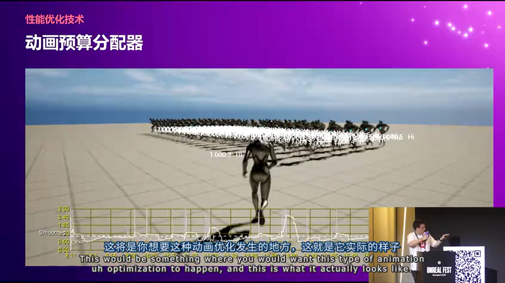

在包含大量骨骼网格的场景中，系统会根据距离等因素动态调整动画质量。靠近摄像机的角色获得更多预算，远离的角色可能使用较低质量的动画。

**适用场景：**

- 包含大量**动画骨骼网格**的场景
- **MMO游戏**中的玩家聚集区域
- 需要大量NPC的场景（如城镇、商店、银行等）

**局限性：**

- 在**低端设备**上效果有限，因为设备本身资源就很少
- 需要合理的性能预算设置，过于激进的设置可能导致视觉质量问题

### 材质质量设置（Material Quality Settings）

**材质质量设置**是虚幻引擎"一对多"（One-to-Many）哲学的重要体现，允许一个材质适配多个平台。

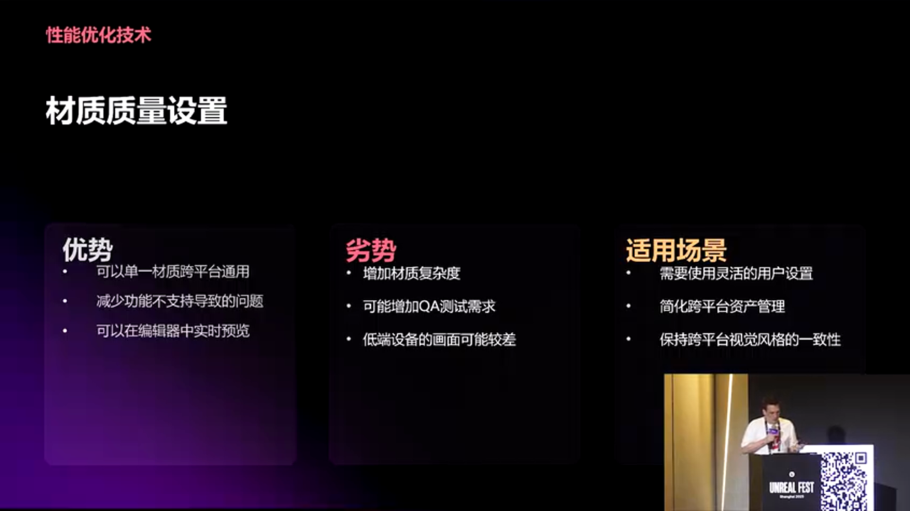

**核心概念：**

材质可以设置多个质量级别（Low、Medium、High、Epic），每个级别可以有不同的材质表达式和参数。引擎会根据目标平台自动选择合适的级别。

**质量级别配置：**

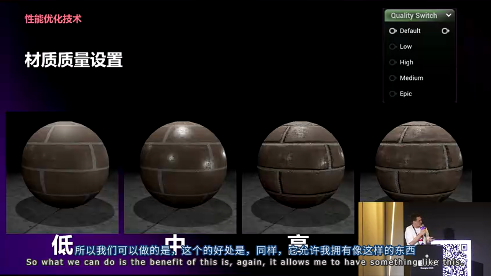

- **Low**：移动设备低端配置
- **Medium**：移动设备高端配置
- **High**：主机平台
- **Epic**：PC平台

**技术实现：**

材质编辑器中可以为每个质量级别设置不同的节点网络：

```cpp
// [AI补充] 材质质量设置的实现方式
Material MyMaterial {
    Quality Low {
        // 简单的纹理采样
        BaseColor = Texture2D.Sample(DiffuseTexture);
        Roughness = 0.5;  // 固定值
    }
    
    Quality Medium {
        // 添加细节纹理
        BaseColor = Blend(DiffuseTexture, DetailTexture);
        Roughness = Texture2D.Sample(RoughnessTexture);
    }
    
    Quality High {
        // 完整的PBR材质
        BaseColor = ComplexBlending(...);
        Roughness = AdvancedCalculation(...);
        Normal = NormalMapping(...);
    }
}
```

**优势：**

- **一次制作，多平台使用**：同一个材质可以适配所有目标平台
- **无需维护多个版本**：不需要为Xbox、PlayStation、移动设备分别创建材质
- **自动平台适配**：引擎根据设备能力自动选择合适级别

**注意事项：**

- 需要为**所有目标平台**创建质量级别
- 如果某个质量级别缺失，材质可能无法正常工作
- 材质编辑器工作量会增加，但减少了后续维护成本

**扩展应用：**

材质质量设置的概念同样适用于**静态网格**和**骨骼网格**，通过LOD系统实现：

- **静态网格LOD**：根据距离自动切换不同细节级别
- **骨骼网格LOD**：可以降低骨骼数量或动画精度

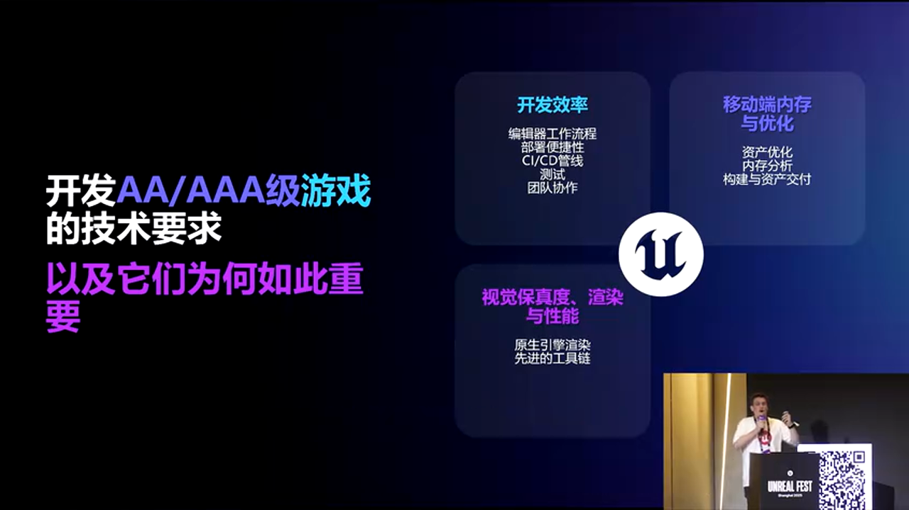

这些工具已经在**《Fortnite》**等大型项目中得到验证，说明其稳定性和有效性。

---

## 调试与性能分析工具

### Visual Studio Android游戏开发扩展

**Visual Studio Android游戏开发扩展**由微软开发，可以将Visual Studio转换为Android开发环境。


**核心功能：**

- **统一的开发环境**：在Visual Studio中直接调试Android项目
- **熟悉的工具链**：使用日常使用的Visual Studio工具进行Android开发
- **无缝集成**：可以直接附加到Android项目进行调试

**使用场景：**

- 需要在Windows环境下开发Android项目
- 希望使用Visual Studio的调试功能
- 减少IDE切换的开销

**注意事项：**

- 需要**一次性配置**，可能需要20-30分钟
- 配置较为复杂，但只需设置一次

### 设备配置（Device Profiles）

**设备配置**是Sam最喜欢的特性之一，完美体现了虚幻引擎的"一对多"哲学。

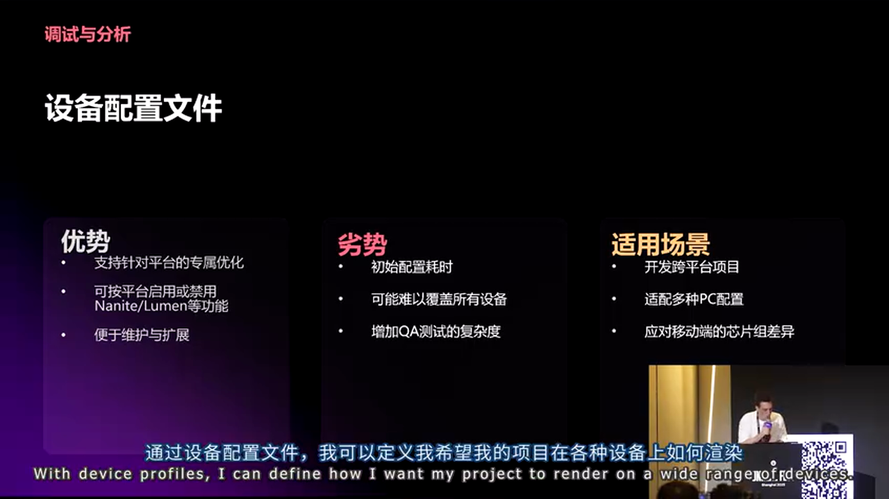

**核心概念：**

设备配置允许开发者为不同设备或设备类别定义独立的渲染设置。可以按平台（Android Low/Medium/High）或具体设备型号（如Adreno 6X、Vulkan 7等）进行配置。

**配置选项：**

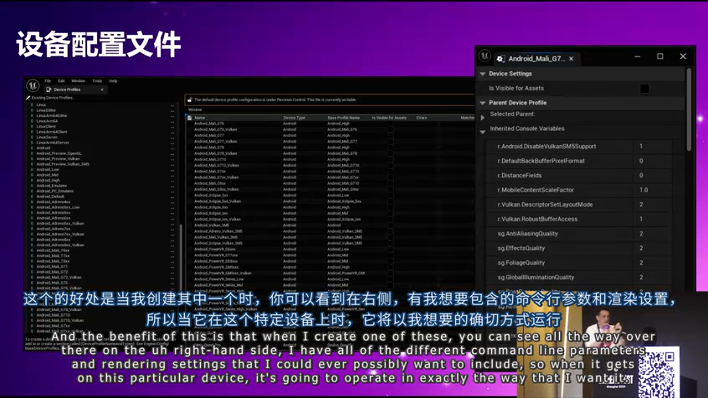

设备配置包含所有可能的命令行参数和渲染设置，可以精确控制：

- 分辨率设置
- 材质质量级别
- 阴影质量
- 后处理效果
- 各种性能开关

**灵活性：**

配置的范围可以非常广泛或非常具体：

- **广泛配置**：Android Low/Medium/High，覆盖大量设备
- **具体配置**：特定GPU型号（如Adreno 630、Mali-G78等）
- **混合策略**：针对特定处理器范围的配置（如最近5年发布的处理器）

**工作流程：**

1. 确定目标设备范围
2. 创建设备配置
3. 设置渲染参数
4. 一次配置，长期使用
5. 根据设备更新情况添加或移除命令

**实际应用：**

设备配置可以与材质质量设置、LOD系统等配合使用，实现精细的平台适配：

- 同一资源在不同设备上使用不同配置
- Nanite等新技术可以与传统渲染路径共存
- 所有配置都在同一个项目中管理


### PSO预缓存（PSO Pre-caching）

**PSO预缓存**是UE5.6及以后版本的新系统，用于解决移动端Shader编译导致的卡顿问题。


**核心问题：**

**PSO（Pipeline State Object）**是GPU渲染管线的状态对象。在移动端，首次使用某个Shader组合时，GPU需要编译PSO，这个过程会导致**明显的卡顿**，这就是"Unreal Stutter"的主要原因。

**解决方案：**

PSO预缓存系统会自动捕获项目运行时使用的所有PSO组合，并在项目启动时预编译，避免运行时卡顿。

**技术实现：**

- **自动捕获**：系统在开发过程中自动记录使用的PSO
- **持续更新**：在整个开发周期中持续捕获新的PSO组合
- **后台工作**：整个过程在后台自动完成，无需手动干预

**版本差异：**

- **UE5.6之前**：PSO缓存需要手动管理
- **UE5.6及以后**：完全自动化，开箱即用

**使用建议：**


1. 正常运行项目
2. 系统自动捕获PSO
3. 在构建中应用缓存
4. 在整个开发周期中重复此过程
5. 最终获得完整的PSO覆盖

**注意事项：**

- 如果遇到PSO相关问题，很可能是引擎问题，而不是项目问题
- 系统设计为"零配置"，如果出现问题应该报告给Epic Games

**教育意义：**

虽然PSO是**非常高级的主题**（通常只有高级图形工程师处理），但了解PSO缓存的概念对于理解"Unreal Stutter"的原因和解决方案非常重要。

---

## 实战总结与建议

### 方案对比总结

> **移动端渲染管线选择**

> **前向着色 vs 延迟着色**
> - 🟢 **前向着色优势**：设备兼容性广、支持MSAA、适合预计算光照、本地光源性能好
> - 🔴 **前向着色劣势**：动态光照弱、内存消耗高、视觉质量相对较低
> - 🟢 **延迟着色优势**：复杂光照性能好、视觉质量高、Tile-based GPU优化、默认选项
> - 🔴 **延迟着色劣势**：需要高端设备、预计算光照选项受限、不支持MSAA

**选择建议**：根据项目类型和目标设备选择。预计算光照 + 本地光源 = 前向着色；动态光照 + 大型场景 = 延迟着色。

> **性能优化技术优先级**

> **快速见效（推荐优先使用）**
> - AMD FSR移动版：2-4倍性能提升，零成本启用
> - Mesh自动实例化：默认开启，了解其工作原理
> - 移动端帧率控制：需要精确帧率控制时使用

> **深度优化（需要更多工作）**
> - 动画预算分配器：大量动画角色场景
> - 材质质量设置：跨平台项目必备
> - 设备配置：针对特定设备优化

> **基础设施（长期维护）**
> - PSO预缓存：UE5.6+自动处理
> - Visual Studio Android扩展：开发环境配置

### 避坑指南

**渲染管线选择：**

- **不要**默认使用延迟着色而不考虑项目需求
- **不要**忽略目标设备的GPU架构类型
- **要**在目标设备上测试两种管线的性能差异
- **要**考虑项目的光照复杂度选择合适管线

**FSR使用：**

- **不要**将Sharpness值设置为1.0（会出现明显瑕疵）
- **不要**在生产环境直接使用编辑器测试值
- **要**在设备上验证FSR效果
- **要**在性能和质量之间找到平衡点（建议0.01-0.5）

**帧率控制：**

- **不要**忽略Android驱动碎片化问题
- **不要**在所有设备上启用而不测试
- **要**检查输入延迟影响
- **要**考虑用户体验，不要设置过低帧率

**材质质量设置：**

- **不要**遗漏某些目标平台的质量级别
- **不要**过度复杂化低质量级别（违背优化目的）
- **要**为所有目标平台创建质量级别
- **要**利用材质质量设置实现跨平台适配

**设备配置：**

- **不要**创建过于具体的配置（维护成本高）
- **不要**忽略设备更新导致的配置失效
- **要**定期更新和清理配置
- **要**平衡配置的广泛性和精确性

**PSO预缓存：**

- **不要**在UE5.6之前手动管理PSO缓存（工作量巨大）
- **不要**忽略PSO缓存问题（很可能是引擎bug）
- **要**理解PSO缓存解决"Unreal Stutter"的原理
- **要**在整个开发周期中运行项目以积累PSO覆盖

### 最佳实践

**性能优化工作流：**

1. **基线测试**：在目标设备上建立性能基线
2. **快速优化**：优先使用FSR、自动实例化等零成本技术
3. **深度优化**：根据性能分析结果，应用动画预算、材质质量等技术
4. **平台适配**：使用设备配置针对不同设备优化
5. **持续测试**：在整个开发周期中持续测试和优化

**开发效率提升：**

- **了解引擎能力**：虚幻引擎提供了大量内置优化工具，了解这些工具可以避免重复造轮子
- **使用第三方插件**：如AMD FSR等，可以快速获得性能提升
- **统一开发环境**：使用Visual Studio Android扩展可以减少工具切换开销

**视觉质量与性能平衡：**

- **不要过度优化**：在保证视觉质量的前提下进行优化
- **利用质量设置**：通过材质质量、LOD等系统实现自动适配
- **测试驱动优化**：基于实际测试数据而非猜测进行优化

---

## 总结

移动端性能优化是一个**系统工程**，需要从渲染管线选择、性能优化技术应用、平台适配等多个维度进行考虑。虚幻引擎提供了丰富的工具和选项，但关键在于**理解原理**和**合理选择**。

**核心要点回顾：**

1. **渲染管线选择**是基础，应该根据项目需求和目标设备特性进行选择
2. **AMD FSR移动版**是最简单易用的性能提升方案，建议优先尝试
3. **Mesh自动实例化**、**动画预算分配器**等技术可以显著降低Draw Call和CPU开销
4. **材质质量设置**和**设备配置**是实现跨平台适配的关键技术
5. **PSO预缓存**在UE5.6+中自动处理，解决了移动端Shader编译卡顿问题

**下一步行动：**

- 在项目中评估渲染管线选择
- 尝试启用AMD FSR移动版并测试性能提升
- 根据项目需求配置材质质量设置和设备配置
- 在整个开发周期中持续进行性能测试和优化

移动端性能优化不是一次性的工作，而是需要在整个项目周期中持续关注和调整的过程。通过合理使用虚幻引擎提供的工具和技术，可以在保证视觉质量的前提下，实现优秀的性能表现。

---

> **参考资源**
> 
> 演讲中提到的所有技术都有官方文档链接，建议查阅Epic Games官方文档获取最新信息和详细配置说明。


