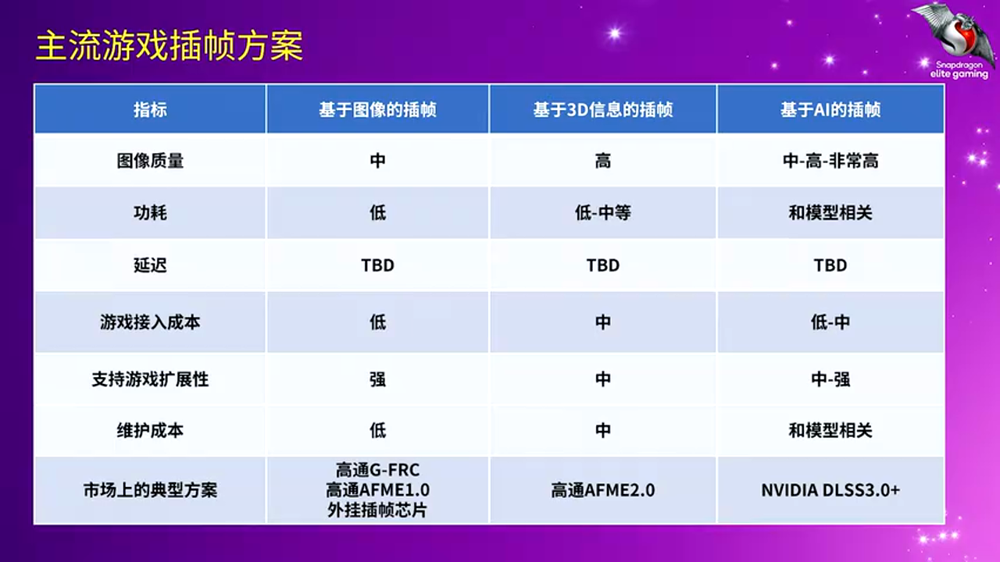
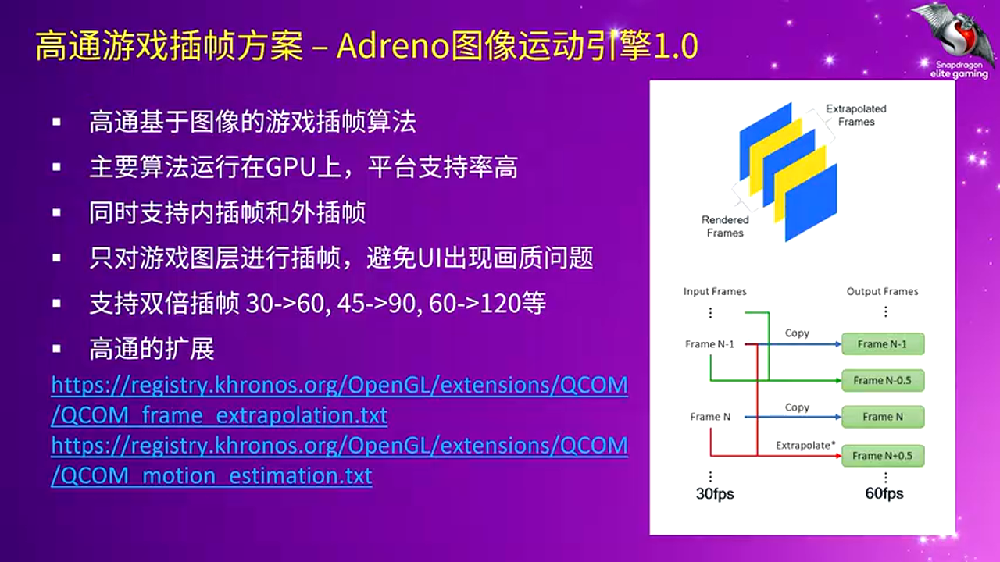
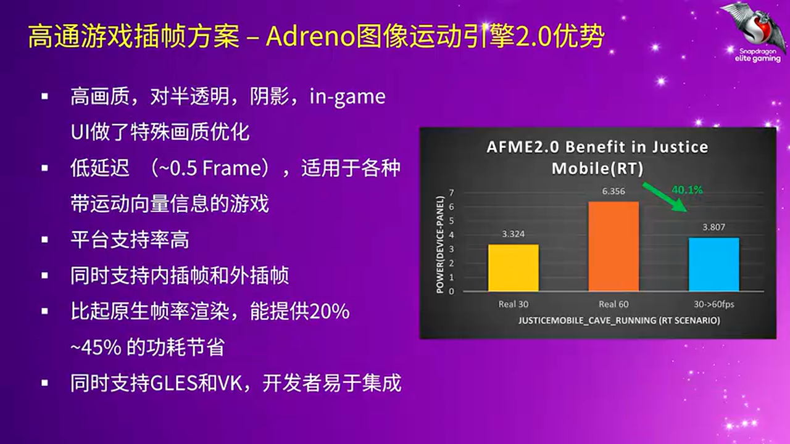
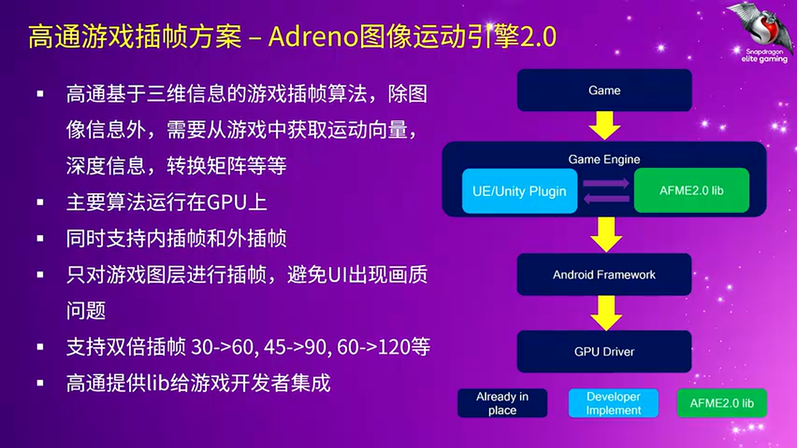
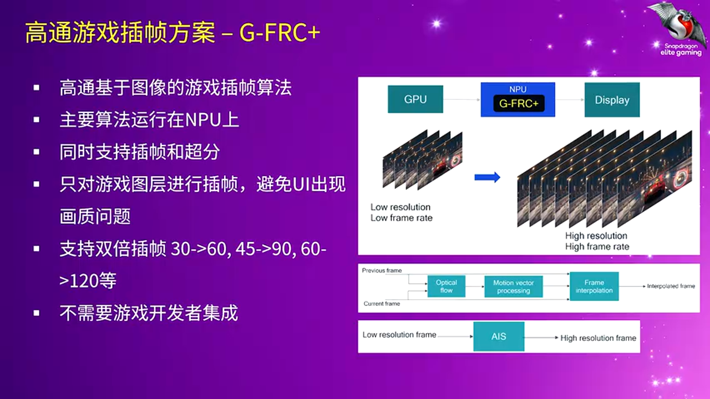

# 移动游戏性能革命：高通插帧技术深度解析与实战落地

---

## 加入 UE5 技术交流群

如果您对虚幻引擎5的图形渲染技术感兴趣,欢迎加入我们的 **UE5 技术交流群**!

扫描上方二维码添加个人微信 **wlxklyh**,备注"UE5技术交流",我会拉您进群。

在技术交流群中,您可以:
- 与其他UE开发者交流渲染技术经验
- 获取最新的GDC技术分享和解读
- 讨论图形编程、性能优化、构建工具流、动画系统等话题
- 分享引擎架构、基建工具等项目经验和技术难题

---

> **视频来源**: [UFSH2025]高通游戏插帧技术介绍 | 姚轶非 高通中国游戏产品负责人 产品市场总监(官方字幕)
>
> **视频链接**: https://www.bilibili.com/video/BV1SgWBzYEeQ
>
> **内容说明**: 本文由 AI 基于视频内容生成,涵盖高通游戏插帧技术的核心原理与实战应用

## 导读

> **核心观点**:
>
> 1. **移动游戏正面临性能与功耗的双重挑战** - 随着游戏画质和帧率要求不断提升,设备功耗预算却没有显著增长,插帧技术成为突破瓶颈的关键方案
>
> 2. **高通提供三种商用级插帧方案** - GIME 1.0 (2D图像插帧)、GIME 2.0 (3D信息插帧)、Game FRC Plus (AI驱动插帧),分别针对不同场景和需求
>
> 3. **未来趋势是 AI 与混合方案** - 单一技术无法覆盖所有场景,结合传统算法与 AI 的混合插帧方案将成为主流

**前置知识**: 需要了解基本的图形渲染管线、帧率概念、GPU/CPU 工作原理,以及移动设备的功耗管理机制。

---

## 背景与痛点:为什么移动游戏需要插帧技术?

### 完美游戏体验的构成要素

一个优质的移动游戏体验需要在多个维度达到平衡:画质、帧率、续航、触控响应、沉浸式音效和震感。然而,现实中最大的挑战来自于**设备发热导致的 CPU/GPU 降频**,这直接影响帧率稳定性,是玩家投诉最多的痛点。

以国民级手游为例,许多重度玩家每天游戏时长达到 4-6 小时,他们不希望手机发烫,也不想依赖外接充电设备。这对设备的**长时间稳定性能输出**提出了极高要求。

### 移动设备的三大性能瓶颈

**1. 游戏画质与帧率持续攀升**

现代手游的画质和帧率需求呈指数级增长,对 SoC 性能提出越来越高的要求。许多 3A 级手游已经支持光线追踪等高级渲染特性,这在几年前是难以想象的。

**2. 功耗预算停滞不前**

根据行业研究,一款手机游戏的功耗**不能超过 5 瓦**才能保证良好体验。超过这个阈值,设备会出现明显发热、续航下降、帧率不稳定等问题。而过去四五年间,手机的功耗预算几乎没有提升。

**3. 发热引发的性能衰减**

发热是移动游戏最大的敌人。当设备温度升高时,系统会触发热管理机制,强制降低 CPU 和 GPU 频率,导致帧率大幅下降。这种"越玩越卡"的体验严重影响用户满意度。

### 插帧技术的三大应用场景

插帧技术可以在以下三种典型场景中发挥作用:

**场景一:降功耗** - 设备本可以跑满 60 帧或 120 帧,通过降低一半的渲染帧率(如 30 帧或 60 帧),然后用插帧技术补齐,最终达到相同的显示帧率,但功耗显著降低。

**场景二:提稳定性** - 设备性能不足以稳定运行满帧,先以一半帧率渲染,再通过插帧达到更高帧率,实现更稳定的游戏体验。

**场景三:突破帧率上限** - 部分游戏原生只支持 60 帧,通过插帧技术可以让用户体验到 90 帧甚至 120 帧的流畅感。

---

## 核心原理解析:主流插帧技术分类与对比

### 三种技术路线的本质差异

目前市场上的插帧技术可以分为三大类:**基于图像的插帧**、**基于 3D 信息的插帧**和**基于 AI 的插帧**。它们在输入信息、画质上限、接入成本和扩展性上存在本质差异。

### 插帧技术的核心 KPI 指标

评估一个插帧方案是否优秀,需要关注以下四个关键指标:

- **图像质量** (Image Quality): 插帧后的画面是否接近原生渲染质量
- **功耗** (Power Consumption): 插帧过程本身的能耗开销
- **延迟** (Latency): 从触控输入到画面显示的端到端延迟
- **可扩展性** (Scalability): 从支持一个游戏扩展到支持数十个游戏的难度

### 方案对比:三种技术路线的权衡取舍

> **方案 A:基于图像的插帧**
>
> - 🟢 **优势**: 输入信息简单(只需前后帧 Color 信息),接入成本低,扩展性好
> - 🔴 **劣势**: 图像质量天花板较低,存在难以解决的固有问题(如半透明物体、粒子效果)
> - 🎯 **适用场景**: 需要快速覆盖大量游戏的平台级方案,对画质要求不是极致的场景

> **方案 B:基于 3D 信息的插帧**
>
> - 🟢 **优势**: 画质显著优于纯图像方案,可利用深度、运动矢量等丰富信息
> - 🔴 **劣势**: 需要游戏引擎提供额外的 Buffer(如 Motion Vector),接入成本高,维护复杂
> - 🎯 **适用场景**: 头部大作、对画质要求极高的游戏,愿意投入工程资源深度优化

> **方案 C:基于 AI 的插帧**
>
> - 🟢 **优势**: 画质潜力巨大,理论上可超越传统方案,部分模型无需针对单个游戏训练
> - 🔴 **劣势**: 高度依赖模型质量,简单模型可能不如 2D 方案,复杂模型功耗和延迟较高
> - 🎯 **适用场景**: 未来主流方向,适合有 AI 加速硬件的高端设备,需要平衡模型复杂度与性能

### 延迟的技术细节:为什么不同方案差异巨大?

插帧延迟不仅取决于算法本身,还与**运行的硬件模块**和**流水线设计**密切相关。目前市场上有以下几种实现方式:

- **GPU 方案**: 在 GPU 上执行插帧,延迟取决于 GPU 负载和调度策略
- **专用硬件方案**: 使用 SoC 内部的专有硬件模块(如 Display Processing Unit),延迟更低
- **外挂芯片方案**: 部分厂商使用独立芯片处理插帧,延迟和功耗都较高

不同硬件架构下,即使算法相同,延迟表现也可能相差数倍。

---

## 高通三大插帧方案深度拆解

### GIME 1.0:GPU 驱动的 2D 图像插帧引擎

**技术定位**: GIME (Game Image Motion Engine) 1.0 是高通推出的第一代插帧技术,完全基于 2D 图像信息,运行在 GPU 上。

**核心特性**:

- **纯图像输入**: 只需要前后两帧的 Color Buffer,无需游戏引擎提供额外数据
- **GPU 加速**: 利用 Adreno GPU 的专有指令集优化性能
- **双倍插帧**: 支持 30→60、45→90、60→120 等倍率提升
- **零接入成本**: 游戏开发者无需修改代码,平台级集成

**工作流程**:

高通提供预编译的 Library,手机厂商或游戏引擎集成后即可使用。对于游戏开发者,这是一个完全透明的底层优化。

**性能数据**:

在实测中,GIME 1.0 可实现 **20%-30% 的功耗降低**,同时保持帧率翻倍。但在处理复杂场景(如大量粒子效果、快速镜头运动)时,画质会有一定损失。

### GIME 2.0:利用 3D 信息的混合插帧方案

**技术升级**: GIME 2.0 是对 1.0 的重大升级,引入了 3D 渲染信息,画质提升明显。

**关键技术改进**:

**1. 3D 信息融合**

GIME 2.0 需要从游戏引擎获取以下数据:
- **Color Buffer**: 前后帧的颜色信息
- **Depth Buffer**: 深度信息,用于判断物体远近关系
- **Motion Vector**: 运动矢量,描述每个像素从上一帧到当前帧的移动方向和速度
- **Transformation Matrix**: 变换矩阵,用于处理相机运动

**2. 针对性画质优化**

工程团队花费大量时间优化以下常见问题:
- **半透明物体**: 如水面、玻璃、烟雾等
- **粒子效果**: 火焰、爆炸、魔法特效
- **UI 元素**: 防止 UI 与游戏场景混合导致的画质问题

通过**主 Surface 插帧**技术,GIME 2.0 可以单独处理游戏主画面,避免 UI 层干扰。

**3. 极低延迟设计**

GIME 2.0 实现了 **0.5 帧的延迟**,换算成毫秒,大多数游戏的触控延迟小于 **10ms**。这对于 FPS 等竞技类游戏至关重要。

**接入方式**:

高通提供 SDK 和参考代码(Reference Code),游戏工作室需要:
1. 集成高通提供的 Library
2. 修改渲染管线,导出所需的 Buffer 数据
3. 实现 Unity 或 Unreal Engine 的插件(Plugin)

虽然有一定开发工作量,但高通提供了 Unreal Engine 的 Reference Code,可大幅降低接入难度。

**实战性能数据**:

在《逆水寒》光追场景中,从原生 60 帧改为 30 帧渲染 + GIME 2.0 插帧至 60 帧,功耗降低 **40.1%**。在其他游戏中,功耗节省普遍在 **20%-45%** 之间。

**平台支持**:

GIME 2.0 支持高通骁龙 **800 系列**和部分 **700 系列** SoC,覆盖了市面上大量中高端设备。

**API 兼容性**:

提供 **OpenGL ES** 和 **Vulkan** 两种 API 的 Library,兼容市场上绝大多数游戏引擎。

### Game FRC Plus:基于 AI 的平台级插帧方案

**技术定位**: Game FRC Plus 是高通最新的插帧技术,运行在 **NPU (Neural Processing Unit)** 上,结合了 AI 算法和专用硬件加速。

**核心优势**:

**1. 零接入成本,平台级特性**

这是 Game FRC Plus 最大的亮点 - **游戏开发者无需做任何工作**。高通直接将技术交付给手机厂商,厂商在系统层面启用后,用户即可在设置中为任意游戏开启插帧。

**2. AI 驱动的画质提升**

相比传统图像插帧,Game FRC Plus 使用轻量级神经网络模型:
- **AI 光流估计**: 更准确地预测像素运动轨迹
- **AI 图像后处理**: 修复插帧产生的瑕疵(如重影、撕裂)
- **AI 纠错机制**: 识别并修复传统算法无法处理的画质问题

**3. 插帧 + 超分同时启用**

Game FRC Plus 支持在 NPU 上**同时运行插帧和超分辨率**,例如:
- 渲染分辨率: 720p
- 渲染帧率: 30 FPS
- 输出分辨率: 1080p (超分)
- 输出帧率: 60 FPS (插帧)

这种组合技术可以在低端设备上实现高画质 + 高帧率体验。

**4. NPU 专用硬件加速**

高通在 Snapdragon SoC 的 NPU 中集成了插帧专用硬件单元,大幅降低功耗和延迟。

**性能表现**:

在一款主流重度游戏中,从 30 帧插帧到 60 帧,相比原生 60 帧,功耗降低约 **30%**。

**扩展性分析**:

由于无需游戏接入,从支持 10 个游戏扩展到 100 个游戏,只需要:
- 测试团队验证画质和兼容性
- 手机厂商在白名单中添加游戏

这使得 Game FRC Plus 在**扩展性**上远超需要逐一接入的方案。

**API 支持**:

支持 **OpenGL ES** 和 **Vulkan** 游戏,覆盖几乎所有移动游戏。

---

## 深度进阶:未来插帧技术的演进方向

### AI 技术的全面渗透

AI 正在从多个维度改变插帧技术:

**1. AI 光流估计** (AI Optical Flow)

传统光流算法基于数学模型(如 Lucas-Kanade、Horn-Schunck),在复杂场景下容易失效。AI 光流通过深度学习,可以:
- 更准确地预测非刚体运动(如布料、水面)
- 处理遮挡关系(如角色从树后走出)
- 适应大位移场景(如快速转镜头)

**2. AI 图像后处理** (AI Post-Processing)

传统插帧算法生成的中间帧往往存在瑕疵,AI 可以:
- 去除重影和拖影
- 修复纹理模糊
- 增强边缘锐度

**3. AI 直接生成帧** (AI Frame Generation)

这是最激进的方向 - 完全放弃传统插值算法,让 AI 模型根据前后帧直接"想象"中间帧的样子。NVIDIA DLSS 3 的 Frame Generation 就是这一技术的代表。

**4. AI 纠错机制** (AI Error Correction)

结合传统算法与 AI:先用传统算法生成初步结果,再用轻量级 AI 模型识别和修复画质问题区域。这种混合方案在功耗和画质之间达到更好平衡。

### 画质-功耗-延迟的"不可能三角"

插帧技术面临类似区块链的"不可能三角"困境:**高画质**、**低功耗**、**低延迟**三者无法同时达到极致。

- **高画质**:需要复杂算法或大模型,必然带来更高功耗和延迟
- **低功耗**:需要简化算法或小模型,可能牺牲画质或增加延迟
- **低延迟**:需要快速计算,可能牺牲画质或增加功耗

未来几年的核心研究方向是**如何通过算法创新和硬件协同,尽可能扩大这个三角形的面积**。

### 混合方案(Hybrid Approach)的兴起

没有任何一种单一技术可以完美适应所有场景:

- **静态场景**: 2D 图像插帧效果已经足够好,无需复杂算法
- **快速运动场景**: 需要 Motion Vector 等 3D 信息
- **复杂特效场景**: 可能需要 AI 纠错
- **竞技类游戏**: 延迟优先,画质可以适当妥协

因此,**混合插帧方案**将成为趋势:
- 根据场景复杂度动态切换算法
- 将传统算法与 AI 模型结合
- 在不同硬件模块(GPU/NPU/专用硬件)之间智能调度

---

## 实战总结与建议

### 技术选型决策树

**如果你是游戏开发者**:

- **追求极致画质,愿意投入工程资源** → 选择 GIME 2.0 或其他 3D 信息插帧方案
- **希望快速上线,覆盖多平台** → 等待手机厂商集成 Game FRC Plus 等平台级方案
- **自研插帧技术** → 考虑混合方案,结合 2D/3D/AI 技术

**如果你是手机厂商**:

- **高端旗舰机** → 集成 GIME 2.0 + Game FRC Plus,为用户提供选择
- **中端机型** → 优先 Game FRC Plus,利用 NPU 降低功耗
- **低端机型** → 谨慎使用插帧,避免因硬件性能不足导致负面体验

### 避坑指南

**1. 不要盲目追求高倍率插帧**

从 30 帧插到 60 帧相对容易,但从 60 帧插到 120 帧难度呈指数级增长:
- 时间窗口更短,算法容错率更低
- 对延迟的要求更苛刻
- 画质瑕疵更容易被察觉

建议先验证 2x 插帧效果,再考虑更高倍率。

**2. 重视触控延迟测试**

功耗和画质可以通过工具量化,但**触控延迟的主观感受**同样重要:
- 使用高速摄像机测量端到端延迟
- 在 FPS 游戏中进行实战测试
- 收集核心玩家的反馈

**3. UI 层处理是常见陷阱**

许多插帧方案在处理 **UI 元素**时会出现问题:
- UI 与游戏场景混合,导致文字模糊
- 血条、小地图等元素出现重影
- 弹窗动画不流畅

解决方案:使用**主 Surface 插帧**,单独处理游戏渲染层,跳过 UI 层。

**4. 不同游戏场景需要不同策略**

- **MOBA 类游戏**: 团战场景功耗暴涨,可以动态调整插帧策略
- **开放世界游戏**: 快速移动时容易出现画质问题,需要特殊优化
- **卡牌/回合制游戏**: 插帧收益有限,不如投入到画质提升

**5. 版本兼容性和维护成本**

对于需要游戏接入的方案(如 GIME 2.0):
- 游戏版本更新可能导致插帧失效
- 不同引擎版本可能需要适配
- 需要建立长期维护机制

### 最佳实践建议

**配置建议**:

- **测试阶段**: 提供开关,允许用户对比插帧前后的效果
- **默认策略**: 根据设备性能自动启用插帧,避免让普通用户做选择
- **电量管理**: 低电量模式下自动禁用插帧,优先保证续航

**性能监控**:

- 实时监控 GPU/CPU/NPU 温度和频率
- 记录插帧失败场景,用于优化算法
- 建立用户反馈通道,收集画质问题报告

**逐步推广**:

- 先在部分区域灰度测试
- 收集数据并优化参数
- 逐步扩大覆盖范围

---

## 总结

高通的三大插帧方案代表了当前移动游戏性能优化的最前沿技术:

- **GIME 1.0** 适合快速覆盖大量游戏的平台级场景
- **GIME 2.0** 为追求极致画质的头部大作提供深度优化能力
- **Game FRC Plus** 通过 AI 和 NPU 硬件,实现零接入成本的高质量插帧

随着 AI 技术的发展和专用硬件的普及,插帧技术将进一步演进,最终实现**画质、功耗、延迟**三者的最佳平衡。对于游戏开发者和手机厂商而言,理解这些技术的原理和权衡,选择合适的方案,是提升用户体验的关键。

在移动设备性能持续增长的同时,插帧技术让我们能够在**功耗预算有限的现实约束下**,依然为玩家提供流畅的高帧率体验。这不仅是技术的胜利,更是对用户体验的极致追求。

---

**参考资源**:

- 高通开发者官网: https://developer.qualcomm.com/
- GIME 技术文档: 联系高通技术支持获取
- Snapdragon Elite Gaming 介绍: https://www.qualcomm.com/snapdragon/gaming

---

> **文章生成说明**: 本文由 Claude AI 基于视频内容自动生成,旨在将视频中的技术知识转化为结构化的图文文章。内容涵盖高通游戏插帧技术的核心原理、三大方案对比、实战案例和未来趋势分析。
