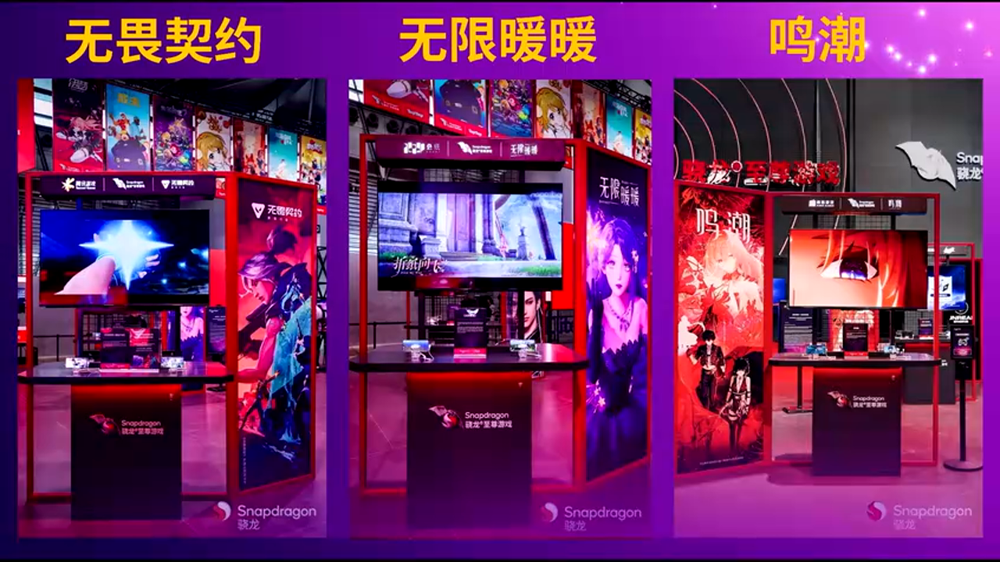
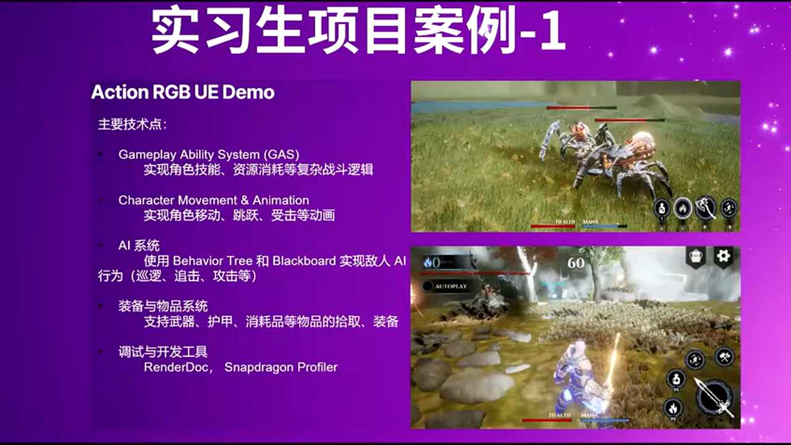
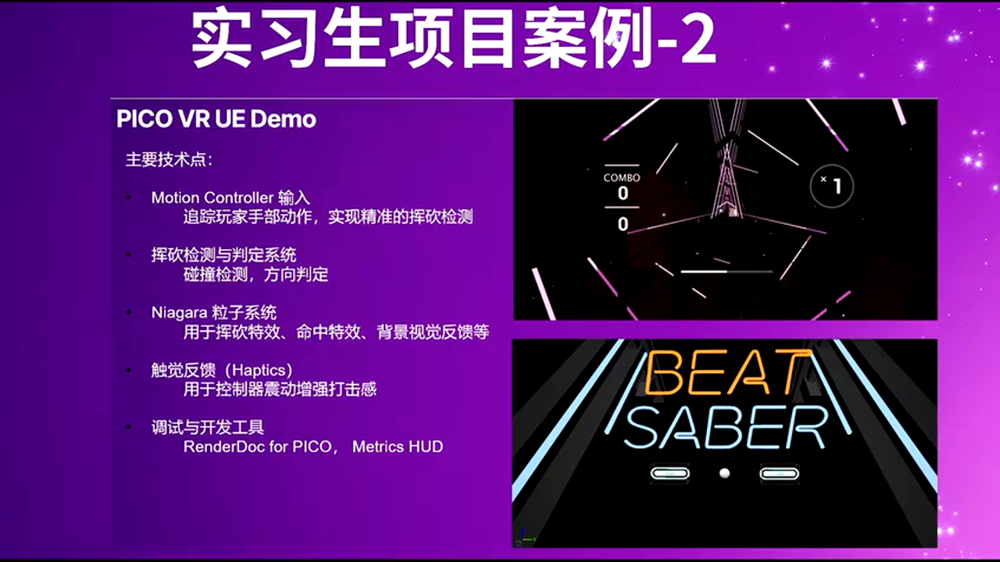

# 高通骁龙与虚幻引擎的产业协同：从校园实习到移动游戏生态

---


## 加入 UE5 技术交流群

如果您对虚幻引擎5的图形渲染技术感兴趣，欢迎加入我们的 **UE5 技术交流群**！

扫描上方二维码添加个人微信 **wlxklyh**，备注"UE5技术交流"，我会拉您进群。

在技术交流群中，您可以：
- 与其他UE开发者交流渲染技术经验
- 获取最新的GDC技术分享和解读
- 讨论图形编程、性能优化、构建工具流、动画系统等话题
- 分享引擎架构、基建工具等项目经验和技术难题

---

**源视频信息**：[UFSH2025]高通与 Unreal Engine 的深度协作!从实习项目到产业融合 | 江丽华 高通骁龙游戏测试负责人/经理

**视频链接**：https://www.bilibili.com/video/BV13qmzB7EXx

**说明**：本文由 AI 基于视频内容生成，结合演讲字幕与关键截图，力求准确还原技术要点。

---

> **核心观点**
> - 高通自 2018 年将移动游戏确立为战略重点，通过骁龙游戏套件与 UE 引擎形成深度技术绑定
> - 在中国市场，UE 引擎在高通合作的新游戏项目中占比已达 59%，成为移动端 3A 游戏的首选方案
> - 高通通过实习生项目体系，将 UE 技术培养前置到人才培养阶段，构建从芯片到游戏引擎的完整生态闭环

**前置知识**：了解移动端 GPU 架构、游戏引擎基本原理、Adreno GPU 特性

---

## 背景：从通信芯片到游戏生态的战略转型

### 高通的"低调"基因与破局时刻


这是一张 40 年前的老照片，记录了高通创始团队的初创时刻。从照片的模糊分辨率中，我们能感受到那个年代的技术氛围——这群工程师成立公司时，甚至没有明确的商业计划，只是"为了好玩"。但正是这种**探索未知问题**的工程师文化，造就了今天的高通：全球超过 50000 名员工，遍布 30 多个国家的 175 个办公地点，其中 80% 是工程师。

在中国市场，高通在北京、上海、深圳、成都、西安、无锡设有六大办公地点，员工超过 5000 人。值得注意的是，**无锡办公点是高通的制造工厂**，这意味着高通在中国不仅有研发团队，还有本土化的生产能力。

### 2018：移动游戏元年的拐点


在传统认知中，高通是"卖手机芯片"和"做通信技术"的公司。但这个定位在 **2018 年发生了根本性变革**。这一年，《王者荣耀》和《和平精英》成为现象级游戏，全球手游收入首次超过传统游戏市场的 50%。高通敏锐地捕捉到这一趋势，将 2018 年定义为**"移动游戏元年"**。

这一判断的技术支撑来自芯片需求的质变：手游对 GPU 性能、功耗控制、热管理的要求，已经从"能跑起来"升级为"媲美主机游戏体验"。于是，高通在 2018 年推出了 **Snapdragon Elite Gaming 游戏技术套件**，开始与游戏引擎、开发者建立深度合作关系。

---

## 核心原理：高通与 UE 的技术绑定逻辑

### 从 ChinaJoy 展会看产业融合深度


ChinaJoy 是亚洲最大的数字娱乐展会，每年参展人数超过 30 万，相关话题登上热搜超过 40 个。自 2019 年起，高通连续多年搭建**"骁龙主题馆"**，展示基于骁龙芯片和 UE 引擎的游戏 Demo、XR 设备、车机应用等。这个展馆不仅是品牌展示，更是**技术验证场**——每一款展出的游戏 Demo，都需要在最新的骁龙芯片上跑通 UE 引擎的前沿特性。

### 三款爆款游戏的共同基因



让我们看三个典型案例：

> **案例 A：《无畏契约》手游版**
> - 🟢 优势：腾讯出品，8 月 19 日上线即成为年度爆款，基于 UE 引擎实现主机级光影效果
> - 🎯 技术关键：利用骁龙 GPU 的 Vulkan 优化，实现 60fps 稳定帧率

> **案例 B：《无限暖暖》**
> - 🟢 优势：叠纸出品，首款将 UE 开放世界与换装玩法结合的手游
> - 🎯 技术关键：骁龙 GPU 的延迟渲染管线，支持大量服装材质的实时切换

> **案例 C：《鸣潮》**
> - 🟢 优势：库洛游戏出品，被多个评测博主列为移动端画质标杆
> - 🎯 技术关键：充分利用 UE 的 Nanite 几何体系统和 Lumen 全局光照

这三款游戏的共同点：**都是 UE-Based**（基于虚幻引擎开发），并且都在高通骁龙芯片上进行了深度优化。这种"引擎+芯片"的绑定，不是简单的兼容性测试，而是**在驱动层、渲染管线、内存调度层面的联合调优**。

### 内部数据：UE 引擎的市场占有率


从高通内部的合作数据来看（这是首次对外公开的数据）：

1. **手游领域**：在高通中国合作的 TOP 工作室中，UE 引擎占比为 **33%**
2. **端游领域**：排除自研引擎后，商业引擎中 UE 占比达到 **50%**
3. **新游戏项目**：尚未上线的游戏中，UE 引擎占比高达 **59%**

从 33% → 50% → 59% 的递增趋势可以看出：**UE 引擎在移动端的渗透率正在加速提升**。这背后的驱动力来自两方面：
- UE5 的 Nanite、Lumen 等特性降低了 3A 品质游戏的开发门槛
- 高通骁龙芯片的 GPU 性能提升（尤其是光追支持），使移动端硬件能够承载这些特性

---

## 深度进阶：实习生项目中的技术实践

### 为什么实习生能一个月做出 Demo？



这是一个三年前的实习生项目，一名实习生在**仅一个月**内，基于 UE 引擎在手机上完成了一个包含光影、物理交互的 Demo。这个案例揭示了 UE 的核心优势：**快速原型验证能力**。

对于芯片公司来说，每一代新芯片都需要验证底层硬件特性（如新的纹理压缩格式、光追单元）。传统方法是编写底层测试程序，但这种方式：
- 🔴 劣势：开发周期长，需要专业的图形 API 工程师
- 🔴 劣势：测试场景单一，无法模拟真实游戏负载

而使用 UE 引擎的优势在于：
- 🟢 优势：Blueprint 可视化脚本，降低开发门槛
- 🟢 优势：内置 Profiler 工具，直接定位性能瓶颈
- 🟢 优势：可以快速切换渲染 API（Vulkan/OpenGL ES），对比测试

**技术细节**：在高通内部，这类 Demo 通常会启用 UE 的 **Mobile Deferred Shading**（移动端延迟渲染）模式，这种模式可以更好地利用骁龙 GPU 的 Tile-Based Rendering 架构。

### VR 项目：跨平台能力的验证



另一个实习生项目是基于 VR 设备的 Demo，同样在一个月内完成。VR 开发的难点在于：
- 需要维持 90fps 的帧率（低于此值会导致晕动症）
- 需要处理双目渲染和畸变校正
- 需要优化延迟（从头部转动到画面更新不能超过 20ms）

**UE 引擎在 VR 场景的优势**：
```cpp
// [AI补充] 基于 UE VR 模板的典型配置
// 启用 Forward Shading（前向渲染）以降低延迟
r.ForwardShading 1
// 启用 Instanced Stereo Rendering（实例化立体渲染）
vr.InstancedStereo 1
// 启用 Mobile Multi-View（移动端多视图）
vr.MobileMultiView 1
```

这些配置可以将双目渲染的开销从"2 倍"降低到"1.3 倍"，这对于移动端 VR 设备至关重要。实习生能够快速完成项目，正是因为 UE 引擎已经将这些复杂的渲染策略封装为配置选项。

---

## 实战落地：高通的人才培养闭环

### 校园招聘的"非典型"路径


高通的校园招聘与其他科技公司有显著差异：**不做大规模春招/秋招，而是将资源集中在实习生项目上**。这种策略的底层逻辑是：
- 芯片行业的技术门槛高，需要长期培养
- 实习生通过实际项目，可以更快理解"芯片-引擎-游戏"的全栈技术链
- 表现优秀的实习生，可以在 9 月评估后直接转正

**理想候选人画像**（这与高通的价值观一致）：
- 有创造力，享受挑战性工作
- 善于团队合作，思想开放
- 热爱学习，积极进取

### 实习生项目的年度时间线


高通实习生项目的时间规划非常清晰：

- **2-3 月**：制定年度计划，明确技术方向（如今年重点是 AI Gaming、UE 性能工具）
- **3-4 月**：线上推广和笔试（笔试内容包括图形学基础、C++ 编程、算法）
- **4-5 月**：技术面试（通常 2-3 轮，考察项目经验和问题解决能力）
- **5 月**：发放录取通知
- **6-7 月**：灵活入职（根据学校放假时间调整）
- **6-9 月**：实习期（基本 3 个月，可延长）
- **9 月**：绩效评估
- **10 月**：转正流程

这个流程的设计体现了**高度的灵活性**，比如入职时间可以根据学生情况调整，实习期可以延长，这在外企中并不常见。

---

## 实战总结与建议

### 方案对比：为什么选择 UE 而非 Unity？

> **方案 A：Unreal Engine**
> - 🟢 优势：原生支持高保真渲染（Nanite、Lumen），更适合 3A 品质游戏
> - 🟢 优势：Blueprint 可视化编程，降低原型开发门槛
> - 🔴 劣势：包体积较大（基础包通常 200MB+），对移动端存储压力大
> - 🎯 适用场景：中重度游戏、注重画质表现的项目

> **方案 B：Unity**
> - 🟢 优势：生态成熟，Asset Store 资源丰富
> - 🟢 优势：包体积控制更灵活，适合轻量级游戏
> - 🔴 劣势：高保真渲染需要大量自定义工作（如 HDRP 的优化）
> - 🎯 适用场景：休闲游戏、超休闲游戏、对包体敏感的项目

**技术决策建议**：如果目标是"移动端主机级体验"，且团队有图形编程能力，UE 是更优选择；如果追求快速迭代和轻量化，Unity 更合适。

### 避坑指南：UE 移动端开发的常见问题

根据高通与开发者的合作经验，以下是 UE 移动端开发的高频踩坑点：

1. **过度使用动态光源**
   - 问题：移动端 GPU 带宽有限，每增加一个动态光源，Draw Call 会成倍增长
   - 解决方案：使用 Stationary Light（静态+动态混合光源），或通过 Light Map 烘焙静态光照

2. **忽略 Tile-Based Rendering 特性**
   - 问题：桌面端 GPU 是 Immediate Mode Rendering，移动端是 Tile-Based Rendering，渲染策略不同
   - 解决方案：启用 `r.Mobile.ForwardEnableClusteredReflections 0`，关闭不必要的反射效果

3. **材质复杂度失控**
   - 问题：UE 的材质编辑器很强大，但每多一个节点，Shader 指令数就会增加
   - 解决方案：使用 Material Quality Level，为移动端单独设置简化版材质

4. **内存管理不当**
   - 问题：移动端内存通常只有 6-12GB（且需要与系统共享），纹理资源很容易爆内存
   - 解决方案：使用 ASTC 纹理压缩（骁龙 GPU 原生支持），并启用 Texture Streaming

**配置示例**（针对骁龙 888 及以上芯片）：
```ini
; [AI补充] 基于高通优化建议的典型配置
[/Script/Engine.RendererSettings]
r.Mobile.ForwardEnableClusteredReflections=0
r.Mobile.UseLegacyShadingModel=0
r.Mobile.AntiAliasing=2 ; 使用 MSAA 2x（骁龙 GPU 硬件支持）
r.Mobile.FloatPrecisionMode=1 ; 使用半精度浮点数
```

### 最佳实践：性能分析工具链

高通推荐的移动端性能分析工具链：

1. **UE 内置工具**：
   - `stat fps`：查看帧率
   - `stat unit`：定位是 CPU 还是 GPU 瓶颈
   - `profilegpu`：查看 GPU 各个 Pass 的耗时

2. **骁龙专用工具**：
   - **Snapdragon Profiler**：可以查看 GPU 的 Tile 利用率、带宽占用、纹理缓存命中率
   - **Adreno GPU Profiler**：支持逐帧分析，导出每个 Draw Call 的 Shader 代码

3. **第三方工具**：
   - **RenderDoc**（Android 版）：可以捕获移动端的渲染帧，查看 Vulkan API 调用

**实战技巧**：在优化阶段，优先关注 `stat unit` 中的 `GPU` 时间。如果 GPU 时间超过 16.6ms（60fps 的阈值），再用 Snapdragon Profiler 定位是哪个渲染 Pass（如阴影、后处理）导致的瓶颈。

---

## 结语：技术生态的长期主义


正如演讲最后所说：**"虚幻引擎不仅是一款引擎，更是连接创意和技术的桥梁，而高通正是桥梁背后的加速器。"**

从 2018 年的移动游戏元年，到 2025 年 UE 引擎在新游戏中占比 59%，这 7 年间的产业变化，本质上是**芯片性能、引擎能力、开发者生态**三者的螺旋上升。高通通过实习生项目将 UE 技术培养前置，通过 ChinaJoy 等展会建立开发者社区，通过与头部工作室的深度合作验证技术方案，最终形成了一个从人才培养到产品上线的完整闭环。

对于开发者而言，这意味着：
- 掌握 UE 引擎 + 骁龙优化技术，可以获得更多的职业机会（尤其是在移动 3A 游戏领域）
- 理解"引擎-芯片"协同优化的底层逻辑，能够设计出更高效的渲染管线
- 关注高通的技术博客和开发者社区，可以第一时间获取最新的优化技巧

**最后，如果你对高通的实习或工作机会感兴趣，请关注高通中国官方招聘渠道，或通过技术社区与高通工程师建立联系。**

---

**参考资料**：
- 高通骁龙游戏套件官方文档
- Unreal Engine 移动端性能优化指南
- Snapdragon Profiler 用户手册

**作者说明**：本文由 AI 基于高通技术分享会内容生成，部分代码示例和配置参数为基于行业最佳实践的补充。如有技术细节疑问，建议参考高通和 Epic Games 的官方文档。
