# UE5.6 移动端开发革命：从编辑器预览到渲染管线的全链路优化

---

## 加入 UE5 技术交流群
如果您对虚幻引擎5的图形渲染技术感兴趣，欢迎加入我们的 **UE5 技术交流群**！
扫描上方二维码添加个人微信 **wlxklyh**，备注"UE5技术交流"，我会拉您进群。
在技术交流群中，您可以：
- 与其他UE开发者交流渲染技术经验
- 获取最新的GDC技术分享和解读
- 讨论图形编程、性能优化、构建工具流、动画系统等话题
- 分享引擎架构、基建工具等项目经验和技术难题
---

## 源视频信息
**标题**: [UFSH2025]UE5.6移动端开发最新进展 | Jack Porter Epic Games 引擎移动平台开发主管(官方字幕)
**时长**: 33分33秒
**视频链接**: https://www.bilibili.com/video/BV1YyW4z6EYu
**声明**: 本文由 AI 基于视频内容生成，结合官方字幕和关键截图，旨在为开发者提供技术参考。

---

> **核心观点**
> - **平台预览系统**：在编辑器内实时模拟移动端渲染效果，大幅缩短迭代周期
> - **Zen 流式传输**：通过网络流式加载资产，30 秒内完成内容部署
> - **移动端延迟渲染**：多通道架构解锁距离场阴影、屏幕空间反射等高级特性

---

## 一、移动端开发的核心痛点

在跨平台游戏开发中，移动端始终是最具挑战性的目标平台。开发者面临着一个根本性矛盾：**大部分开发时间聚焦于 PC 高端效果，但移动端的性能和渲染能力存在巨大鸿沟**。

传统工作流程中，美术人员在 PC 上完成资产制作后，需要将内容打包到真机设备上才能查看最终效果。这种"黑盒"流程导致：
- 单次验证周期长达数分钟甚至更久
- 纹理模糊、光照异常等问题只能在真机上发现
- 跨平台可扩展性（Scalability）难以精确控制

Epic Games 在 UE5.6 和 5.7 中针对这些痛点进行了系统性改进，覆盖了从内容迭代到渲染管线的全流程。

---

## 二、平台预览系统：在编辑器内精确模拟移动端

### 2.1 核心机制：数据驱动的平台能力描述

**平台预览（Platform Preview）** 是 UE5 移动端开发的基石功能。它的设计理念是：**在编辑器内使用与目标平台完全一致的着色器、材质特性和可扩展性设置**。

其技术架构基于三层抽象：

**1. 数据驱动的平台信息（Data-Driven Platform Info）**
引擎通过 INI 文件（如 `AndroidEngine.ini`）定义每个平台的硬件能力边界。这些配置包括：
- 支持的渲染特性（Feature Level）
- 材质着色模型的可用性
- 纹理压缩格式和 LOD 策略
- 光照和后处理的限制

**2. 特性级别映射（Feature Level）**
平台预览会根据目标平台自动切换材质的 **Feature Level**。例如，移动端材质会限制使用 `ES3_1` 特性集，禁用桌面端的高级节点。

**3. 实时设置同步**
当你在项目设置中修改移动端的渲染配置时，平台预览会立即应用这些变更，无需重启编辑器。

---

### 2.2 UE5.6 新增功能：从纹理到设备档案的全方位支持

#### 纹理 LOD 预览

在 UE5.6 之前，美术人员经常抱怨："为什么移动端的纹理这么模糊？" 实际上问题出在 **纹理 LOD 配置的不可见性**。

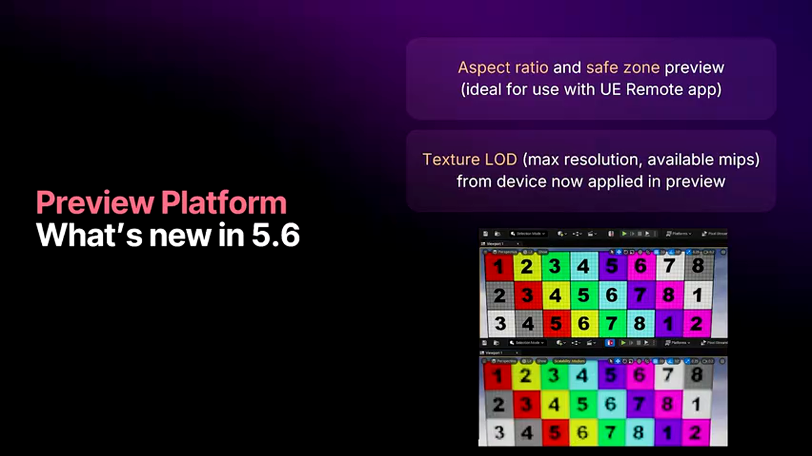

移动平台通常使用更激进的 LOD Bias 来节省内存和带宽。例如：
- 桌面端可能加载 2K 纹理
- 移动端自动降级到 1K 甚至 512×512

UE5.6 的纹理 LOD 预览功能会在编辑器内准确展示这些降级效果，让美术人员可以**在打包前就调整纹理设置或材质细节**。

---

#### Android 设备 JSON：精确复现真机环境

对于需要针对特定设备优化的项目（如针对三星 Galaxy S24 或小米 14 Pro），UE5.6 提供了 **Android 设备 JSON** 功能。

**工作流程**：
1. 通过 USB 连接目标 Android 设备
2. 引擎自动抓取设备的硬件信息、驱动版本、GPU 型号等
3. 将所有参数保存为 JSON 文件
4. 在编辑器中加载该 JSON，平台预览会运行与真机完全一致的 **Device Profile 规则**

**实战价值**：
- 团队可以将代表性设备（低端、中端、高端）的 JSON 文件提交到版本控制
- 美术人员无需拥有所有测试设备，就能验证内容在不同档位硬件上的表现
- QA 团队可以快速定位特定设备的渲染问题

---

#### 宽高比和安全区预览

移动设备的屏幕比例千差万别，从传统的 16:9 到 20:9 的超宽屏，再到折叠屏的各种奇葩比例。UE5.6 新增的 **宽高比预览** 和 **安全区（Safe Zone）提示** 可以确保 UI 不被刘海屏或圆角屏裁切。

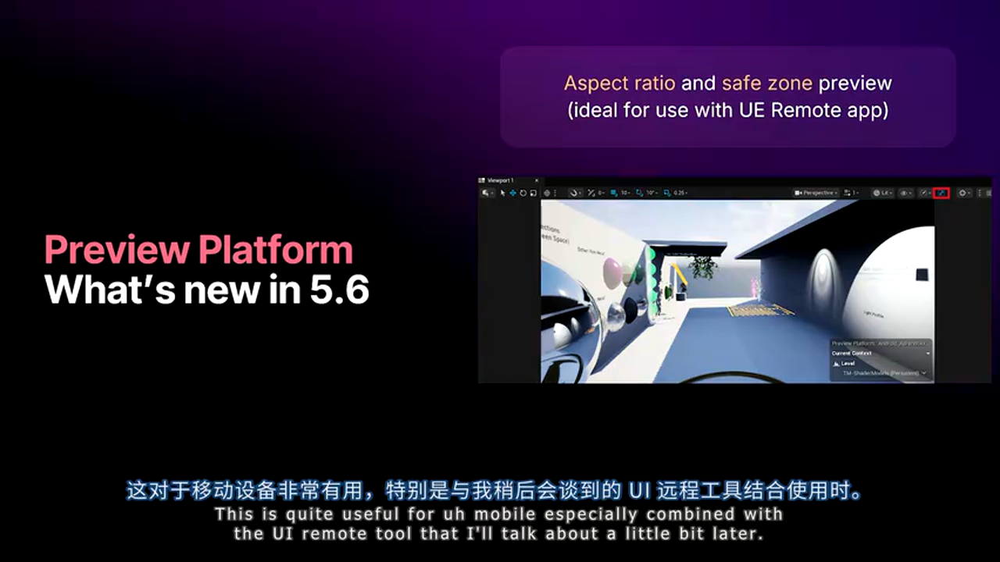

这项功能与后面将介绍的 **Remote Session App** 配合使用时威力倍增：你可以在编辑器中调整 UI 布局，同时通过真机屏幕实时查看效果。

---

### 2.3 平台预览的局限性与最佳实践

尽管平台预览非常强大，但它本质上是在 **PC 硬件上模拟移动端行为**，存在一些无法规避的限制：

**硬件差异**：
- 编辑器使用 DirectX/Vulkan（PC 版本），而非移动端的 GPU 驱动
- 浮点精度差异可能导致材质中的复杂数学运算在真机上出现瑕疵
- 部分移动端特有的渲染 bug 无法复现

**单平台限制**：
目前只能同时预览一个平台。Epic 计划在未来版本支持 **多视口同时预览**，例如同时打开：
- Android 低端设备窗口
- Nintendo Switch 窗口
- iOS 高端设备窗口

**功能不可用性**：
如果你在 macOS 上开发，无法预览 Lumen 或 Nanite（这些功能依赖 Windows 的 SM6 支持）。

**最佳实践**：
- 将平台预览作为 **第一道防线**，快速验证 80% 的问题
- 对于关键内容，仍需在真机上进行最终验证
- 定期运行自动化测试，覆盖多款代表性设备

---

## 三、Android 模拟器集成：自动化测试的理想环境

### 3.1 编辑器原生支持：一键启动虚拟设备

在 UE5.6 之前，使用 Android Studio 的模拟器需要繁琐的手动配置。现在，UE5 编辑器与 Android 模拟器实现了 **深度集成**。

**自动化设置**：
- 安装 Android SDK 时，引擎会自动创建预配置的模拟器镜像（如 `UE_Pixel_6`）
- 模拟器会自动启用必要的设置（如 Vulkan 支持、高 DPI、GPU 加速）
- 在编辑器的平台菜单中直接选择模拟器，点击 "Launch" 即可

**x86-64 优化**：
在 Windows 上，UE5.7 会自动将游戏编译为 **x86-64 架构**（而非 ARM64 模拟），这带来巨大性能提升：
- 无需通过 QEMU 翻译 ARM 指令
- 充分利用 PC CPU 的原生性能
- 启动速度和帧率接近真机水平

---

### 3.2 自动化测试场景：与 Gauntlet 无缝集成

Android 模拟器最大的价值在于 **可复现的自动化环境**。

**典型用例**：
- **Nightly Build 测试**：每晚自动启动模拟器，运行回归测试套件
- **压力测试**：模拟器可以在 CI 服务器上并行启动多个实例
- **稳定性验证**：避免 USB 连接真机时的线缆松动、设备电量耗尽等问题

**与 Gauntlet 框架集成**：
Gauntlet 是 UE 的自动化测试框架。模拟器会作为标准设备注册到设备管理器中，测试脚本无需修改即可在模拟器上运行。

---

### 3.3 模拟器的局限性与解决方案

**OpenGL ES 支持不足**：
Android Studio 模拟器的 OpenGL ES 版本过低，无法满足 UE5 的最低要求。因此，引擎会 **强制启用 Vulkan**。

**驱动性能差异**：
模拟器使用 PC 显卡驱动，而非移动端的 Mali/Adreno/PowerVR 驱动。这意味着：
- 性能数据不具备参考价值
- 某些驱动 bug（如精度问题）无法复现

**第三方库兼容性**：
如果项目使用了第三方 SDK（如支付、广告），需要准备 **x86-64 版本的 .so 库**。Epic 已确保引擎自带的所有库都支持该架构。

**建议**：
- 模拟器用于功能验证和自动化测试
- 性能 profiling 必须在真机上进行

---

## 四、iOS 开发加速：从模拟器到 "Designed for iPad" 模式

### 4.1 iOS 模拟器的困境与弃用

苹果提供的 **iOS Simulator** 长期以来饱受诟病：
- 只支持 **Apple A8** 的特性集（相当于 iPhone 6 时代）
- 需要为所有第三方库编译单独的 Simulator 版本
- 即使在 Apple Silicon Mac 上，仍需重复构建流程

基于这些原因，Epic 宣布在 **UE5.7 中弃用 iOS Simulator**。

---

### 4.2 "Designed for iPad" 模式：零修改运行 iOS 应用

Apple Silicon Mac（M 系列芯片）引入了一项革命性功能：**Designed for iPad**。这允许未经修改的 iPhone/iPad 应用直接在 macOS 上原生运行。

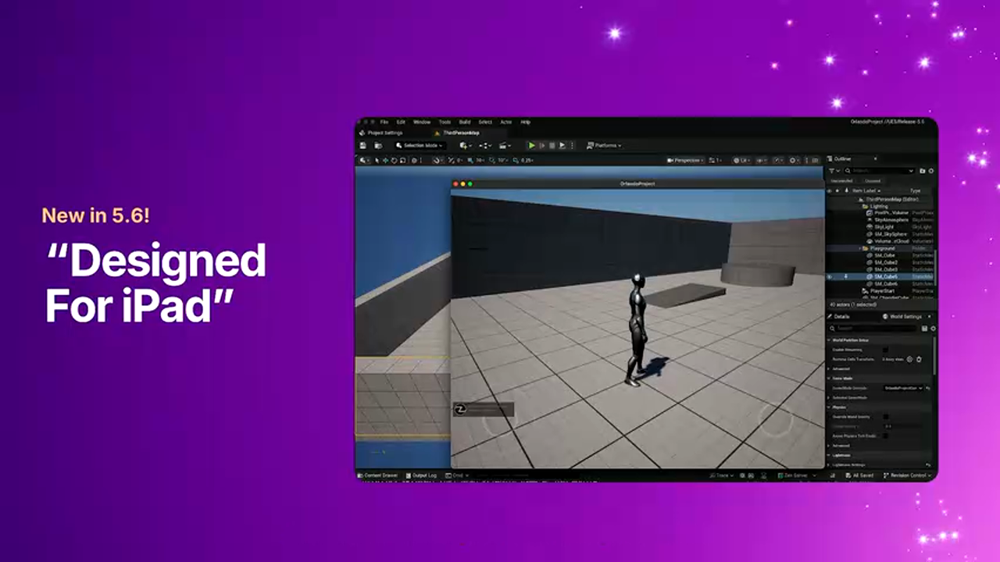

**UE5 的集成方式**：
1. 在 Xcode 中选择目标为 "My Mac (Designed for iPhone)"
2. 直接点击 Run，应用会以窗口形式在 macOS 上启动
3. 无需部署到真机，编译速度提升数倍

**实战优势**：
- **快速 C++ 迭代**：代码修改后，Xcode 只需重新编译二进制，无需打包 IPA
- **完整功能支持**：所有第三方库无需重新编译（因为使用的是 ARM64 架构）
- **调试体验优秀**：Xcode 的断点、内存分析工具可以直接使用

---

### 4.3 Metal 着色器的跨平台差异

需要注意的是，"Designed for iPad" 模式使用的是 **macOS 的 Metal 驱动**，而非 iOS 的版本。虽然两者 API 兼容，但存在细微差异：
- macOS Metal 支持更多调试功能
- iOS Metal 对某些操作有更严格的验证

因此，**性能测试和最终验证仍需在真机上进行**。

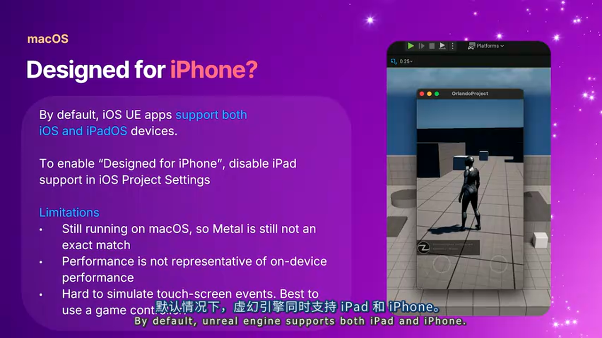

---

## 五、Remote Session App：将编辑器画面推送到真机

### 5.1 工作原理：屏幕镜像 + 触摸输入回传

**Remote Session App** 是一款运行在真实移动设备上的独立应用。它的核心功能是：
- **视频流推送**：将编辑器的 Viewport 画面实时编码并发送到移动设备
- **触摸事件回传**：在设备屏幕上的触摸操作会被捕获并发送回编辑器

**典型使用场景**：
假设你正在调整游戏的虚拟摇杆 UI。传统流程是：
1. 在编辑器中调整 UI 位置
2. 打包到真机
3. 在真机上测试触摸手感
4. 发现问题，回到步骤 1

使用 Remote Session 后：
1. 启动 Remote Session App
2. 在编辑器中启用平台预览（包括宽高比和安全区）
3. 编辑器画面实时显示在真机上
4. 直接在真机上触摸测试，UI 调整立即生效

---

### 5.2 UE5.7 升级：基于 Pixel Streaming 的低延迟方案

在 UE5.6 及之前版本中，Remote Session App 使用的是较老的视频编码方案。UE5.7 进行了重大升级，采用了 **Pixel Streaming 技术**。

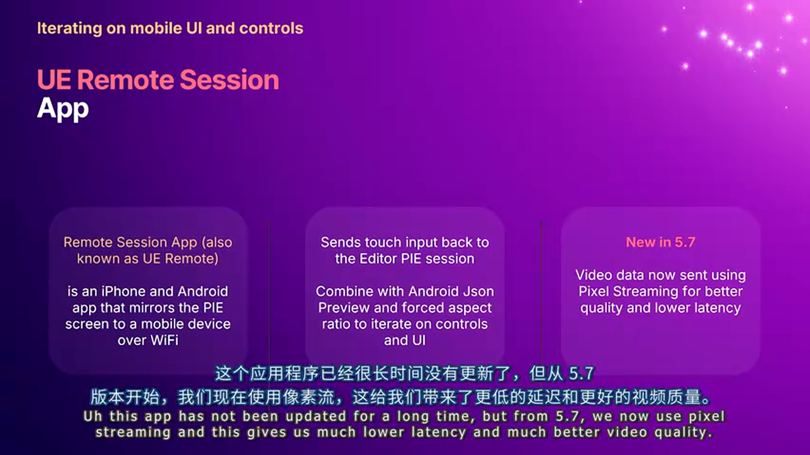

**技术优势**：
- **硬件加速编码**：利用 PC 的 GPU 编码器（NVENC/AMF）
- **自适应码率**：根据网络状况动态调整视频质量
- **延迟降至 30-50ms**：接近云游戏的体验水平

**部署方式**：
Epic 提供了预编译的 Remote Session App 包，也可以从引擎源码自行构建。

---

## 六、Zen 流式传输：彻底改变移动端迭代方式

### 6.1 Zen Server 架构：为 UE 内容优化的存储系统

**Zen Server** 是 Epic 为 UE5 开发的专用数据存储服务。它不是通用文件系统，而是针对游戏资产的 **键值存储（Key-Value Store）**。

**三大核心用途**：
1. **DDC 后端**（UE5.4+）：存储派生数据（Derived Data Cache），如编译后的着色器
2. **Cook 输出存储**（UE5.5+）：Cook 后的资产直接写入 Zen Server
3. **运行时流式传输**（UE5.6+）：游戏运行时从 Zen Server 按需加载资产

---

### 6.2 移动端流式传输工作流：30 秒部署新内容

传统的移动端部署流程：
1. 在编辑器中修改关卡
2. Cook 内容（生成 .pak 文件）
3. 将 .pak 打包到 APK/IPA
4. 通过 USB 部署到设备
5. 在设备上安装并启动游戏

这个流程可能耗时 5-10 分钟。使用 Zen 流式传输后：
1. Cook 内容并写入 Zen Server
2. 在设备上启动已安装的基础包（只包含引擎二进制）
3. 游戏启动时，通过 USB 或 Wi-Fi 从 Zen Server 流式加载所有资产

**关键优势**：
- **无需重新打包**：APK/IPA 保持不变
- **速度极快**：从 Cook 到游戏启动只需 30 秒
- **支持增量更新**：只传输变化的资产

---

### 6.3 网络传输优化：USB 3.x vs Wi-Fi 6

Zen 流式传输的性能高度依赖于网络带宽。

**iOS 设备**：
- iPhone 15 Pro / 16 Pro：USB-C 3.x（最高 10Gbps）
- 其他 iPhone 型号：USB 2.0（480Mbps）
- 建议：如果设备不支持 USB 3.x，使用 **Wi-Fi 6（最高 1200Mbps）** 反而更快

**Android 设备**：
- 大部分旗舰机支持 USB 3.x
- 需要使用 **优质 USB-C 数据线**（劣质线缆可能强制降速到 USB 2.0）

**验证工具**：
- Windows：使用 **USB TreeView** 查看连接速度
- macOS：系统信息 → USB → 查看 "Speed" 字段

---

### 6.4 实战场景：从 Xcode 调试时的快速迭代

假设你正在修复一个 iOS 上的 C++ 崩溃 bug。传统流程需要：
1. 修改代码
2. 重新 Cook 和打包
3. 部署到设备
4. 启动游戏并复现 bug

使用 Zen 流式传输 + Xcode 调试：
1. 初次 Cook 并写入 Zen Server（一次性操作）
2. 修改代码后，只需在 Xcode 中点击 Run
3. 新的可执行文件通过 Xcode 部署到设备
4. 游戏启动时自动从 Zen Server 加载所有资产
5. Xcode 的断点和调试器立即可用

---

## 七、Windows 上的 iOS 着色器编译：打破平台壁垒

### 7.1 Metal Developer Tools for Windows

长期以来，iOS 游戏的 Cook 流程必须在 macOS 上完成，因为 Metal 着色器编译依赖 Xcode 的工具链。这对于拥有大规模 Windows CI 集群的团队来说是巨大的成本浪费。

UE5.6 引入了 **Metal Developer Tools for Windows** 支持，实现了：
- 在 Windows 上编译 Metal Shader Library（.metallib 文件）
- 完整的 iOS Cook 流程可以在 PC 上完成

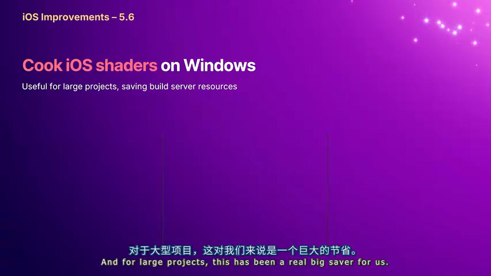

**Epic 的实战数据**：
- Fortnite iOS 版本的所有内容都在 **Windows 上 Cook**
- Mac 只用于编译 C++ 可执行文件
- 成千上万的着色器排列（Shader Permutation）需要大量 CPU 和内存
- PC 服务器的性价比远高于 Mac Pro

---

### 7.2 技术细节：DirectXShaderCompiler 到 Metal IR 的转换

UE5 的跨平台着色器编译流程：
1. 材质编译为 **HLSL 代码**
2. 使用 **DirectXShaderCompiler (DXC)** 编译为 SPIR-V 中间表示
3. 通过 Epic 的工具链转换为 Metal Shading Language（MSL）
4. 调用 Apple 的 Metal 编译器生成 .metallib

Metal Developer Tools for Windows 提供了 Windows 版本的 Metal 编译器，从而打通了整个流程。

---

## 八、Android 编译性能优化：消除冗余拷贝

### 8.1 UE5.6 改进：从 5 次拷贝降至 1 次

在 UE5.5 及之前，Android 的 `libUnreal.so` 文件在构建过程中会被 **重复拷贝 5 次**：
1. 编译输出到临时目录
2. 拷贝到 Staging 目录
3. 拷贝到 APK 内部的 lib/arm64-v8a/
4. Strip 调试符号后再拷贝
5. 最终打包时再次处理

由于该文件在 Debug 模式下通常超过 **1GB**，每次拷贝都要耗费数秒。

UE5.6 重构了构建脚本，现在只需 **拷贝 1 次**。对于 Fortnite 这样的大型项目，这节省了数十秒的构建时间。

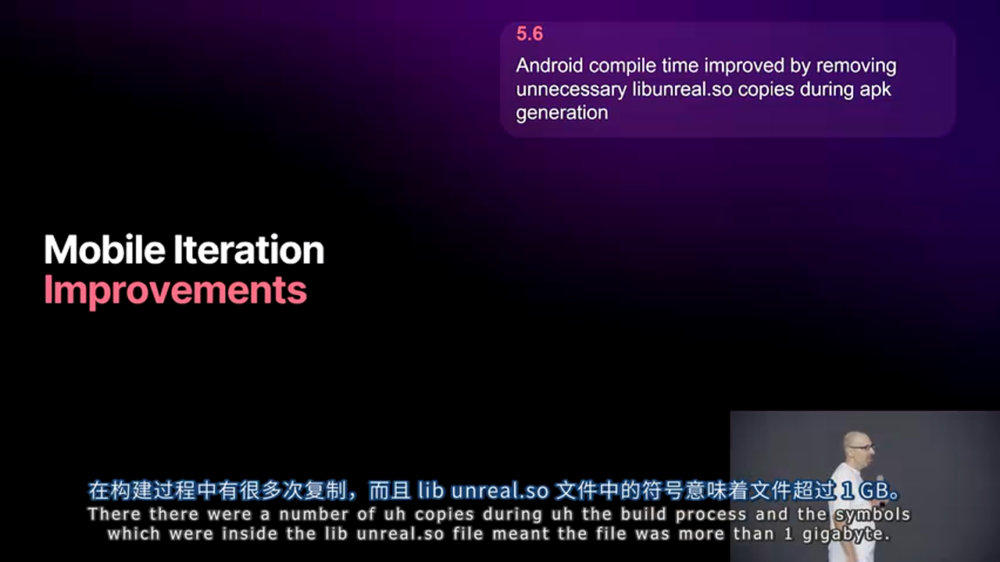

---

### 8.2 UE5.7 新特性：增量二进制部署

在迭代 C++ 代码时，每次都要重新生成和安装 APK 非常耗时。UE5.7 引入了 **热替换（Hot Swap）机制**：
- APK 在设备上保持不变
- 只将新的 `libUnreal.so` 推送到设备的临时目录
- 游戏启动时从临时目录加载新的二进制文件

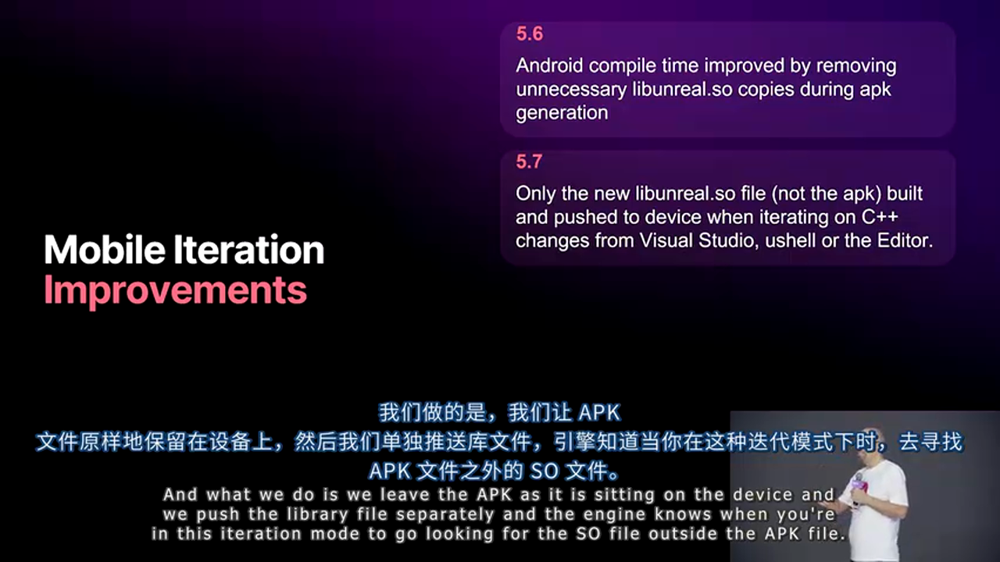

**适用场景**：
- 使用 Launch On（从编辑器启动）
- 使用 Visual Studio 的 "Deploy" 功能
- 使用 UnrealBuildTool (UBT) 的增量部署参数

---

## 九、移动端渲染技术升级：从抗锯齿到延迟渲染

### 9.1 时序超采样（Temporal Upscaling）支持

移动设备的原生分辨率越来越高（如 4K 屏幕），但 GPU 性能增长速度远低于分辨率。**时序超采样** 技术可以在较低分辨率下渲染，然后通过 AI 算法重建到原生分辨率。

**UE5.6 的集成方案**：
- 引擎提供了标准的 **Temporal Upscaling 接口**
- 硬件厂商提供插件实现：
  - **ARM FSR**（适用于 Mali GPU）
  - **Qualcomm Snapdragon Game Super Resolution**
- 插件无需修改引擎代码，直接启用即可

**性能数据**：
Epic 在 Unreal Fest Orlando 展示的案例中，使用 ARM FSR 在 1080p → 1440p 超采样时，帧率提升 **30%**，同时画质接近原生渲染。

---

### 9.2 SMAA 抗锯齿：FXAA 与 TAA 之间的折中方案

移动端的抗锯齿选项长期以来只有两种：
- **FXAA**：速度快但画面模糊
- **TAA**：画质好但需要时序信息，低端设备跑不动

UE5.7 新增了 **SMAA（Subpixel Morphological Anti-Aliasing）**，这是一种基于形态学的抗锯齿算法，**无需多帧历史信息**，性能介于 FXAA 和 TAA 之间。

**适用场景**：
- 中端设备（如骁龙 7 系列）
- 对抗锯齿有要求但无法承受 TAA 开销的项目

---

### 9.3 移动延迟渲染：从 Subpass 到多通道架构

#### 传统的 Subpass 方案

移动端的 GPU 通常采用 **Tile-Based Deferred Rendering (TBDR)** 架构，片上有高速的 **Tile Memory**。UE5 的移动延迟渲染一直使用 **Subpass** 来充分利用这一特性：

1. **Base Pass**：将 G-Buffer（法线、粗糙度、基础色）写入 Tile Memory
2. **Lighting Pass**：从 Tile Memory 读取 G-Buffer，计算光照
3. **Resolve**：将最终颜色写回系统内存

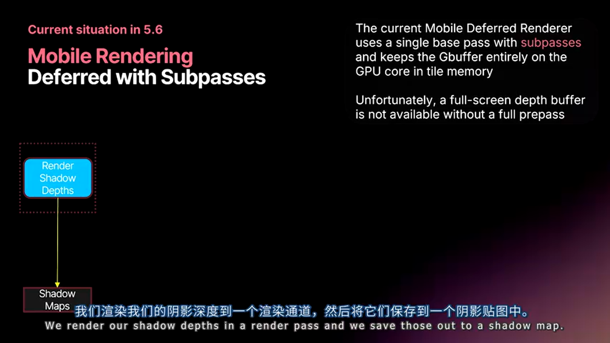

这种方案的 G-Buffer **从不写入系统内存**，大幅节省带宽。但它有一个致命局限：**Base Pass 和 Lighting Pass 之间无法插入其他操作**。

---

#### 高级特性的需求与矛盾

某些高级渲染技术需要在光照计算前访问 **场景深度缓冲**：
- **Distance Field Ambient Occlusion（DFAO）**
- **Screen Space Reflections（SSR）**
- **Inset Shadows**（内嵌阴影）

但在 Subpass 架构中，深度缓冲只有在 Base Pass 完成后才可用，此时已经无法插入额外的 Pass。

---

#### UE5.7 多通道延迟渲染方案

UE5.7 引入了 **Multi-Pass Deferred Rendering**，允许将 G-Buffer 写出到系统内存：

1. **Base Pass**：渲染几何并写出 G-Buffer + 深度到系统内存
2. **Shadow/AO Pass**：读取深度缓冲，计算 DFAO、VSM、SSR 等
3. **Lighting Pass**：读取 G-Buffer 和阴影贴图，计算最终光照

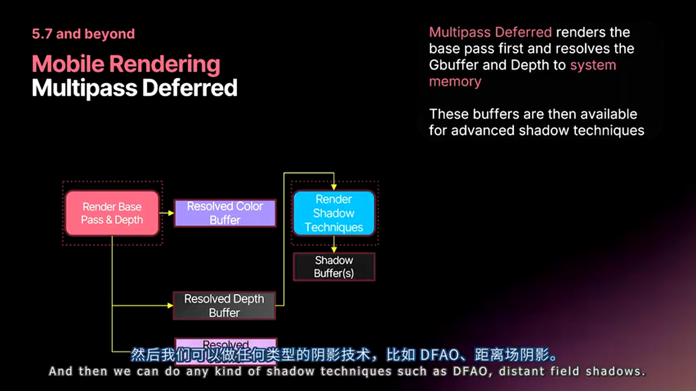

**性能影响**：
- **额外内存占用**：约 50MB（对于 1080p 分辨率）
- **带宽增加**：约 8%
- **帧率影响**：在 Epic 的测试中，帧时间与 Subpass 方案持平甚至更快

---

#### 为何多通道反而更快？

现代移动 GPU 支持 **帧缓冲压缩（Framebuffer Compression, FBC）**。当 G-Buffer 写回系统内存时，硬件会自动压缩数据，实际带宽消耗低于理论值。

此外，多通道架构让 GPU 可以更好地 **并行执行不同阶段**，提高了资源利用率。

---

### 9.4 GPU Scene：支持骨骼动画和 Niagara 粒子

**GPU Scene** 是 UE5 的核心渲染架构，它将所有场景对象的数据（变换矩阵、材质参数）存储在 GPU 端的结构化缓冲区中。

UE5.6 进一步扩展了 GPU Scene 的支持范围：
- **骨骼蒙皮（Skinned Meshes）**：骨骼变换矩阵存储在 GPU Scene 中，减少 CPU→GPU 数据传输
- **Niagara 网格粒子**：粒子实例直接由 Compute Shader 写入 GPU Scene

**性能优化：GPU 剔除**
对于 **实例静态网格（Instanced Static Mesh）**，UE5.6 新增了 GPU 端的视锥剔除。这对 LEGO Fortnite 这样的项目至关重要：
- 场景中有数万个乐高积木实例
- 其中约 50% 在视锥外
- GPU 剔除可以避免绘制不可见的实例，节省顶点着色器开销

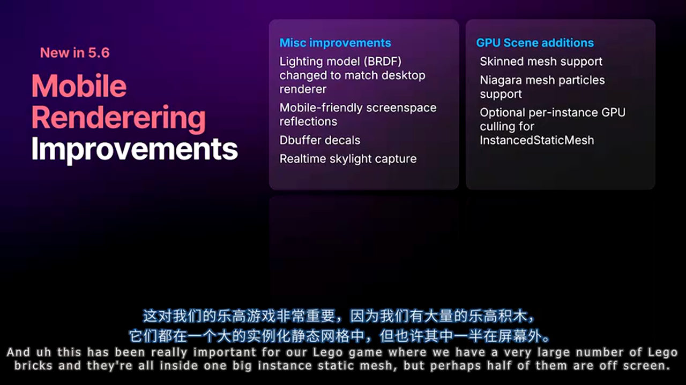

---

## 十、PSO 预缓存：消除运行时卡顿

### 10.1 为什么需要运行时着色器编译？

在桌面平台，着色器可以离线编译为特定格式（如 DirectX 的 DXBC）。但在移动端：
- **Android（OpenGL ES/Vulkan）**：必须在运行时将 SPIR-V 编译为 GPU 原生指令
- **iOS（Metal）**：虽然可以离线生成 .metallib，但 **每款 iPhone 的 GPU 微架构不同**，仍需在运行时做最后的优化

当玩家首次看到某个材质时，如果该材质的 PSO（Pipeline State Object）未缓存，驱动会触发同步编译，导致明显的 **帧率骤降（Hitch）**。

---

### 10.2 后台编译架构：多进程绕过驱动限制

#### OpenGL ES 的单线程噩梦

OpenGL ES 的 API 设计要求 **所有着色器编译必须在同一线程中完成**。即使你创建多个上下文（Context），驱动内部也会用一把大锁串行化所有操作。

UE5 的解决方案：**启动多个独立进程**。

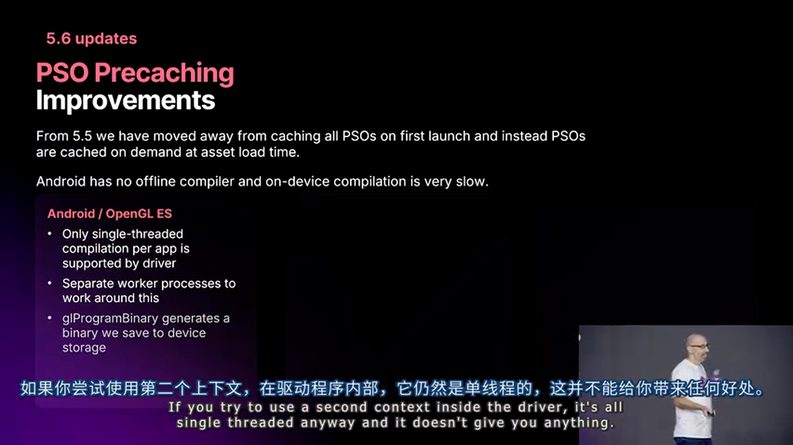

**工作流程**：
1. 游戏主进程检测到需要编译的 PSO
2. 将编译任务发送给多个 Worker 进程（每个进程独立运行）
3. Worker 进程完成编译后，将二进制结果发回主进程
4. 主进程将二进制缓存到磁盘，下次启动时直接加载

---

#### Vulkan 的驱动质量问题

虽然 Vulkan 的 API 支持多线程编译，但 Android 设备的驱动质量参差不齐：
- 某些驱动会直接崩溃
- 某些驱动内部仍有全局锁，多线程无效

因此，UE5 在 Vulkan 上也采用了 **多进程方案**，并使用 `vkMergePipelineCaches` 合并各进程的编译结果。

---

#### iOS Metal 的设备特化编译

Metal 虽然可以离线编译，但 Apple A16、A17、M1、M2 等不同 GPU 都有各自的优化版本。因此，iOS 上仍需运行时 PSO 缓存。

UE5.6 改进了 Metal 的缓存策略：
- 缓存文件使用 **内存映射（Memory Mapping）**
- 操作系统会按需分页加载，避免占用物理内存

---

## 十一、Nanite 与 Lumen 的移动端支持现状

### 11.1 桌面渲染器 on 移动端：实验性支持

**Nanite** 和 **Lumen** 是 UE5 的两大核心技术，但它们最初是为 PC/主机设计的。移动端支持情况如下：

**iOS**：
- iPhone 15 Pro / 16 Pro（Apple A17 Pro）：实验性支持 **Nanite**
- 需要在项目设置中启用 "Mobile Desktop Renderer"

**Android**：
- 多家 GPU 厂商已演示 Nanite 运行（如 Qualcomm 的 Demo）
- 但商用设备的驱动仍需完善，预计 **2026 年** 正式可用

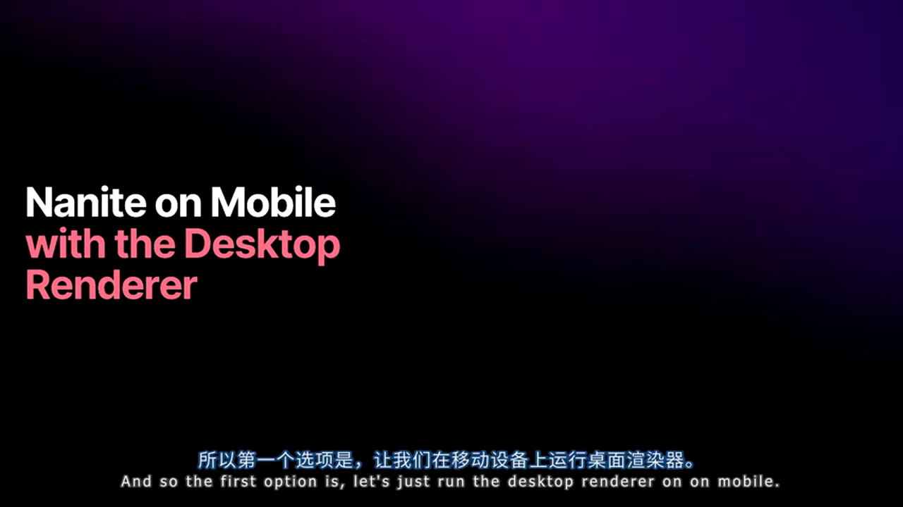

---

### 11.2 硬件光线追踪的现状

**Android**：
- Qualcomm（骁龙 8 Gen 2+）、ARM（Mali-G715）、Imagination（PowerVR Series9XTP）都已支持硬件光追
- UE5.4 起支持 Android 上的 Vulkan Ray Tracing
- Qualcomm 在 Unreal Fest 展示了基于 Lumen 的复杂场景

**iOS**：
- Metal 尚未提供硬件光追 API
- 预计苹果会在未来版本的 Metal 中添加支持

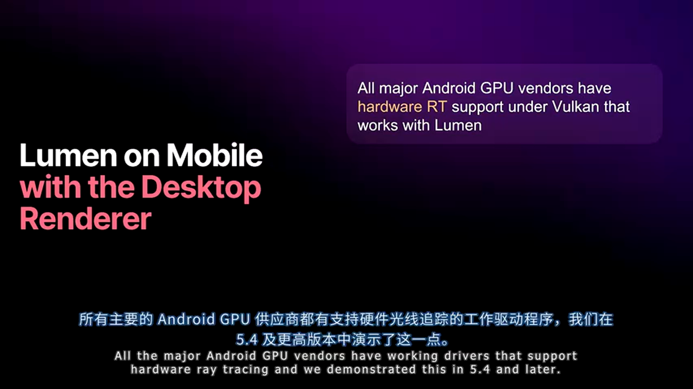

---

### 11.3 跨平台可扩展性的终极目标

Epic 的长远愿景是：**使用 Lumen 和 Nanite 构建内容，自动适配从 PC 到移动端的所有平台**。

**光照方面**：
Epic 正在开发一套工具链，允许：
- 在 PC 上使用 Lumen 光照场景
- 烘焙出 **移动端兼容的光照贴图** 或使用 **Lumen 的低端回退模式**

**几何方面**：
Nanite 的移动端优化更具挑战性。Epic 曾尝试开发 **纯硬件光栅化版本的 Nanite**（不依赖 Mesh Shader），但性能未达预期。

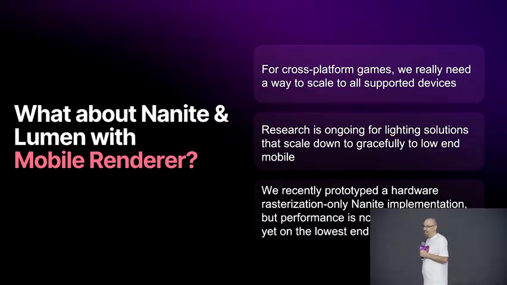

---

## 十二、实战总结与避坑指南

### 推荐工作流程

**内容制作阶段**：
1. 使用 **平台预览** 实时检查移动端效果
2. 为代表性设备生成 **Android 设备 JSON**，纳入版本控制
3. 使用 **Remote Session App** 验证 UI 和触摸交互

**代码迭代阶段**：
1. 启用 **Zen 流式传输**，初次 Cook 后内容自动同步
2. iOS：使用 "Designed for iPad" 模式在 Mac 上快速调试
3. Android：优先使用 **x86-64 模拟器** 进行功能验证

**性能优化阶段**：
1. 在真机上使用 Unreal Insights 或 RenderDoc 进行 profiling
2. 开启 **GPU Scene + 实例剔除** 优化大规模场景
3. 根据设备档位启用 **多通道延迟渲染 + DFAO/SSR**

---

### 常见陷阱

**陷阱 1：过度依赖平台预览**
平台预览无法捕获驱动 bug 和精度问题。对于复杂材质，务必在真机上验证。

**陷阱 2：忽略 USB 线材质量**
Android 设备的 USB 3.x 传输速度高度依赖线缆品质。建议使用 USB TreeView 验证连接速度。

**陷阱 3：PSO 缓存失效**
如果修改了项目的渲染设置（如启用 Nanite），旧的 PSO 缓存会失效，导致首次启动时大量卡顿。建议在发布前重新生成缓存。

---

### 性能指标参考

基于 Epic 的测试数据（设备：三星 Galaxy S23 Ultra）：

**Zen 流式传输**：
- 首次部署：约 2 分钟（取决于项目大小）
- 增量更新：< 30 秒

**多通道延迟渲染 vs Subpass**：
- 额外带宽：+8%
- 帧时间：持平或略快（得益于 FBC 压缩）

**GPU Scene 实例剔除**：
- 场景：10000 个实例，50% 在视锥外
- 性能提升：约 15-20% 的 GPU 时间

---

## 结语

UE5.6 和 5.7 的移动端更新展现了 Epic 对跨平台开发痛点的深刻理解。从 **平台预览** 到 **Zen 流式传输**，从 **多通道延迟渲染** 到 **PSO 预缓存**，每一项改进都直击开发者的核心需求。

这些技术的背后是一套系统性的工程哲学：
- **在编辑器内快速迭代**，而非依赖漫长的打包流程
- **让 PC 充当 CI 主力**，而非受限于 Mac 数量
- **渐进式启用高级特性**，而非强制要求硬件能力

对于跨平台项目来说，现在是拥抱 UE5 移动端工具链的最佳时机。当你的团队可以在编辑器内实时预览移动端效果、30 秒内完成内容部署、在 Windows 上编译 iOS 着色器时，开发效率将实现质的飞跃。

---

**延伸阅读**：
- Epic 官方文档：[Mobile Development](https://docs.unrealengine.com/5.7/en-US/mobile-development-in-unreal-engine/)
- Zen Server 深度解析：参考 UE5.6 发布说明中 Zousa 和 Josie 的专题演讲
- 移动端渲染优化：查阅 UE5 的 Device Profiles 配置指南
