# PCG 地牢生成系统：从样条线分割到模块化组装的完整实践

---


## 加入 UE5 技术交流群

如果您对虚幻引擎5的图形渲染技术感兴趣，欢迎加入我们的 **UE5 技术交流群**！

扫描上方二维码添加个人微信 **wlxklyh**，备注"UE5技术交流"，我会拉您进群。

在技术交流群中，您可以：
- 与其他UE开发者交流渲染技术经验
- 获取最新的GDC技术分享和解读
- 讨论图形编程、性能优化、构建工具流、动画系统等话题
- 分享引擎架构、基建工具等项目经验和技术难题

---

**源视频信息：**
- 标题：[UFSH2025]利用PCG构建地牢场景 | Chris Murphy Epic Games 开发者关系首席 TA
- 时长：42分钟
- 视频链接：https://www.bilibili.com/video/BV1o1sNzWE7N

**AI生成说明：** 本文由AI基于视频内容自动生成，采用深度技术解析风格，结合截图与原理讲解，力求还原演讲精髓。

---

## 导读

> **核心观点一：** PCG（程序化内容生成）不仅适用于森林等自然场景，更可用于复杂的建筑结构如地牢系统，关键在于理解数据分割与重组的设计模式。
>
> **核心观点二：** 通过样条线的智能分割、密度检测和属性传递，可以将连续的路径自动切分为独立的隧道段，为后续模块化装配奠定基础。
>
> **核心观点三：** Level Instance 转 PCG Data Asset 的工作流，结合 Subdivision 语法和 Partition 机制，能够实现高度灵活的模块化场景拼装。

**前置知识要求：**
- 熟悉 UE5 的 PCG 基础概念（节点、数据流、属性）
- 了解样条线（Spline）的基本操作
- 掌握 Level Instance 的使用方法

---

## 背景与痛点：为什么需要非森林场景的 PCG 方案？

在虚幻引擎 5 的 PCG 系统推出后，大量教程和案例都聚焦于**自然场景生成**——森林、草地、岩石散布等。这些场景的共同特点是**随机性强、规则简单、容错率高**。然而，当我们面对**建筑结构**如地牢、城市街道、室内走廊时，会遇到截然不同的挑战：


### 核心痛点

**1. 拓扑连接的严格性**

地牢系统中的隧道必须精确对接，不能出现缝隙或重叠。这要求我们不仅要生成内容，还要**理解空间关系**——哪些隧道段需要连接？在哪里需要生成 T 型或十字路口？

**2. 模块化与变化性的平衡**

为了保证视觉质量，我们希望使用精心制作的 Level Instance 作为模块。但如何在保持模块完整性的同时，实现足够的随机变化？如何让一条公里长的隧道不会显得单调重复？

**3. 弯曲路径的特殊处理**

当隧道路径发生急转弯时，传统的静态网格体会露出破绽。我们需要**动态判断弯曲程度**，并在合适的位置使用样条网格体（Spline Mesh）来平滑过渡。

本文将通过一个完整的地牢生成案例，展示如何用 PCG 系统优雅地解决这些问题。

---

## 核心原理解析：样条线分割与交叉点检测

### 第一步：从单一样条线到独立隧道段

演示项目的起点是一条贯穿整个地图的**连续样条线**。这条样条线定义了地牢的整体布局，但它本身并不能直接用于生成内容——我们需要将它切分为多个**独立的隧道段**，每个段对应一个模块化的场景单元。

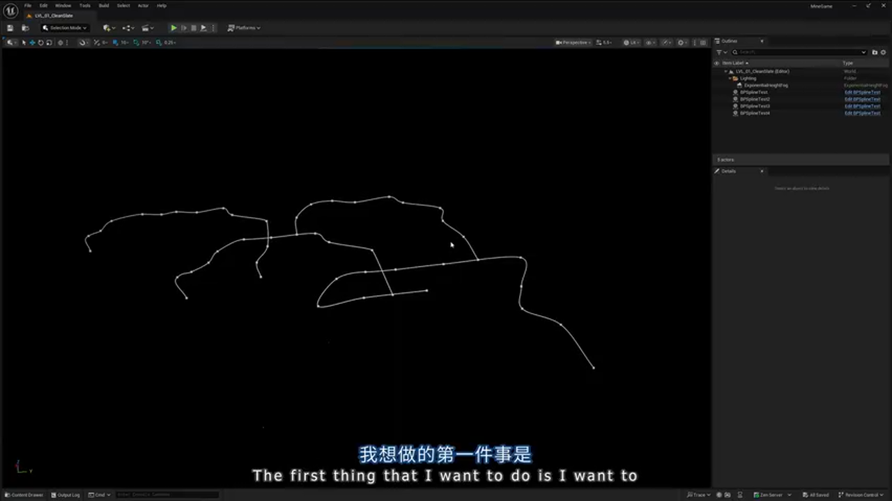

#### 技术实现：密度检测法

**设计思路：** 利用 PCG 的 **Density** 机制，通过距离计算来识别样条线上的"密集区域"——这些区域恰好对应交叉点的位置。

**关键代码逻辑（伪代码）：**

```cpp
// [AI补充] 基于演讲内容还原的核心逻辑
// 1. 沿样条线每隔 1 米采样一次，生成点云
SplineSampler(interval: 1.0) -> PointCloud

// 2. 计算每个点到其他点的距离，设置密度阈值为 250 单位
GetDistanceToTarget(maxDistance: 250, mode: FromCenter) -> DensityAttribute

// 3. 筛选出密度值 < 0.7 的点（这些点彼此靠近，说明是交叉区域）
Filter(attribute: Density, min: 0.0, max: 0.7) -> IntersectionPoints
```


**原理透视：** 为什么密度值能识别交叉点？

当样条线在某处形成交叉时，该区域会有**多条路径的采样点重叠**。通过距离检测，这些点的密度值会显著低于孤立路径上的点。通过设置阈值（如 0.7），我们可以精准筛选出交叉区域。

#### 合并与塌陷

筛选出的交叉点可能在空间上非常接近（因为采样间隔只有 1 米），我们需要将它们**塌陷为单个代表点**：

```cpp
// 将 5 米范围内的点合并为一个
CollapsePoints(distance: 5.0) -> UniqueIntersections
```


此时，我们得到了**原始交叉点集合**（Raw Intersections），每个交叉点对应一个地牢路口。

---

### 第二步：切割样条线并保持数据完整性

有了交叉点，下一步是**从原始样条线中剔除这些区域**，将连续路径切分为独立段。这里涉及一个精妙的设计模式：**Delta Index 技术**。

#### Delta Index 设计模式

**问题场景：** 当我们使用 `Difference` 节点删除交叉点后，样条线会出现"空洞"，但它在数据结构上仍然是**一条完整的样条线**——点的索引是连续的（0, 1, 2, ...）。我们需要一种方法来识别"哪些点属于同一个隧道段"。

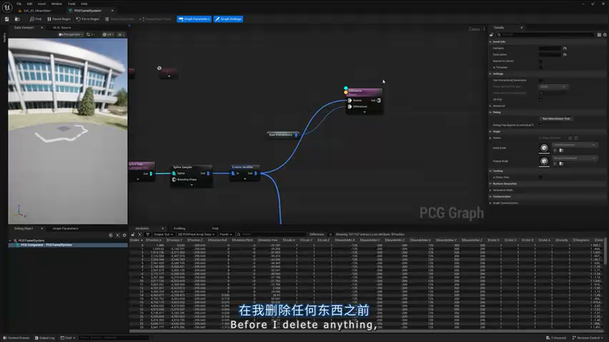

**解决方案：**

```cpp
// [关键步骤] 在删除点之前，先保存原始索引
CopyAttribute(source: Index, target: Delta)

// 删除交叉点区域
Difference(mode: Binary) -> SplineWithHoles

// 计算 Delta - Index 的差值
// 原理：删除点后，Index 会重新排列，但 Delta 保留原始值
// 差值相同的点，说明它们之间没有被删除的点，属于同一段
Subtract(Delta, Index) -> SegmentID
```

**实例说明：**

假设原始样条线有 120 个点，删除交叉点后剩余 106 个点：
- 第 1-30 点：Delta - Index = 0（没有删除点）
- 第 31-60 点：Delta - Index = 6（前面删除了 6 个点）
- 第 61-90 点：Delta - Index = 15（前面删除了 15 个点）

通过 `Partition` 节点按 SegmentID 分组，我们就得到了**独立的隧道段数据集**！

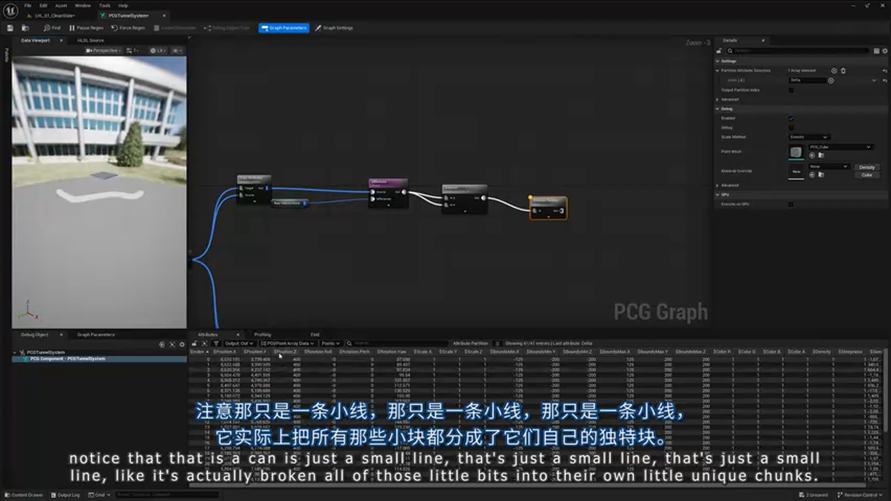

---

### 第三步：子图嵌套与模块化设计

为了保持主图的清晰性，我们将"单个隧道段的渲染逻辑"封装到**子 PCG 图**中。

#### 创建子图：PCG Tunnel Segment

```cpp
// 子图输入：单条样条线（已经是独立的隧道段）
InputType: Spline

// 核心节点流程
CreateSplineFromPoints() -> Loop(TunnelSegmentGraph)
```


**子图职责：**
1. 沿样条线每 2 米采样，生成地面网格体
2. 使用 Spline Mesh 生成铁轨（自动弯曲）
3. 在隧道两端放置"终止挡板"（通过 Index = 0 和 Index = -1 筛选）

#### 地面网格体的随机化

```cpp
// 从两个地面网格体中随机选择
StaticMeshSpawner(
    meshes: [GroundMesh_A, GroundMesh_B],
    selectionMode: Random
)
```

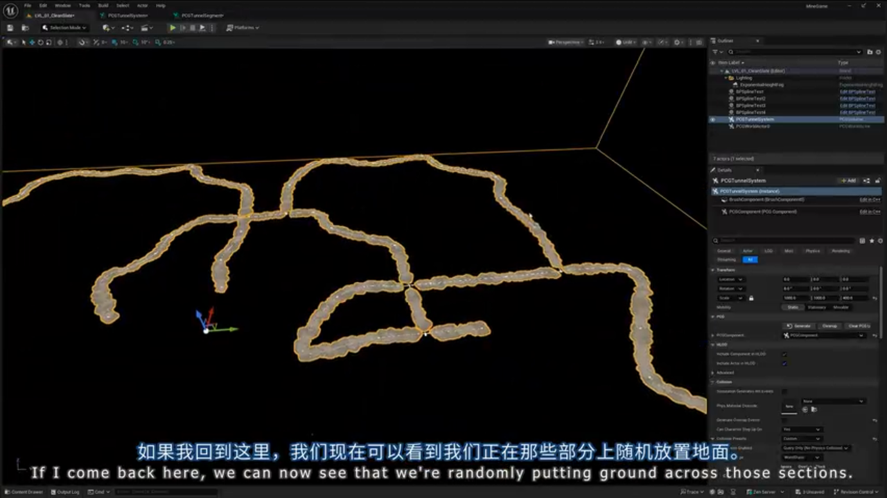

#### 铁轨的样条网格体实现

**关键节点：** `SpawnSplineMesh`

```cpp
SpawnSplineMesh(
    mesh: RailwayTrack,
    followSpline: true,
    stretchToFit: true
)
```

这个节点会自动处理弯曲路径，确保铁轨平滑过渡，不会出现断裂或重叠。

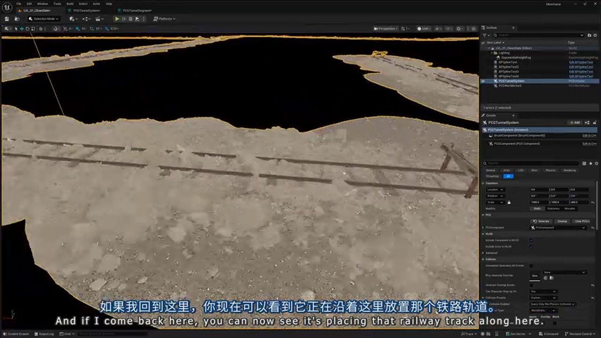

**避坑指南：** 样条网格体的 UV 拉伸问题

如果你的样条网格体在弯曲处出现纹理拉伸，检查以下设置：
- 材质的 UV Tiling 模式是否设置为 `World Aligned`
- Spline Mesh Component 的 `Forward Axis` 是否与网格体的实际朝向一致
- 是否启用了 `Smooth Interpolation` 选项

---

## 深度进阶：Level Instance 与 Subdivision 语法

### Level Instance 转 PCG Data Asset

Epic 提供了一个强大但鲜为人知的功能：**将 Level Instance 转换为 PCG Data Asset**。


**操作步骤：**
1. 在关卡中放置一个 Level Instance
2. 右键点击 → `Convert to PCG Data`
3. 生成的 Data Asset 会将 Level 中的所有静态网格体转换为**点云数据**，每个点携带网格体引用、变换信息、Actor 标签等属性

**数据结构示例：**

```cpp
// [AI补充] PCG Data Asset 的内部结构
PCGDataAsset {
    Points: [
        {
            Transform: (Location, Rotation, Scale),
            Mesh: StaticMesh'/Game/Assets/Pillar.Pillar',
            Tags: ["Structure", "Collidable"],
            CustomAttributes: { "LightIntensity": 500 }
        },
        // ... 更多点
    ]
}
```

### Subdivision 语法：智能模块拼装

**场景需求：** 我们有多个不同长度的隧道模块（Small: 100cm, Medium: 250cm, Large: 500cm），如何让 PCG 自动选择合适的模块来填充任意长度的隧道？


**Subdivision 节点的魔法：**

```cpp
// 定义模块及其长度
Modules: [
    { Name: "Small", Length: 100, DataAsset: SmallTunnel },
    { Name: "Medium", Length: 250, DataAsset: MediumTunnel },
    { Name: "Large", Length: 500, DataAsset: LargeTunnel }
]

// 语法规则：用 * 表示"尽可能多地填充"
Grammar: "Small* | Medium* | Large*"

// PCG 会自动计算最优组合
SubdivideSpline(modules, grammar) -> ModuleSequence
```

**实例计算：**

假设隧道长度为 1200cm：
- 方案 1：12 个 Small（12 × 100 = 1200）
- 方案 2：5 个 Medium - 不完美，剩余 50cm
- 方案 3：2 个 Large + 2 个 Small（2×500 + 2×100 = 1200）✓

PCG 会优先选择方案 3，因为它使用了更大的模块，减少了拼接次数。


### 复杂语法：起点、终点与中间段

```cpp
// 更真实的语法示例
Grammar: "Entrance (Small* | Medium* | Large*) Exit"

// 解释：
// - 起点固定使用 Entrance 模块
// - 中间段随机组合 Small/Medium/Large
// - 终点固定使用 Exit 模块
```

**最佳实践：** 在生产环境中，建议创建自定义 Struct 来管理模块信息，而不是直接在节点中硬编码：

```cpp
// [AI补充] 推荐的数据结构
USTRUCT(BlueprintType)
struct FPCGTunnelModule {
    UPROPERTY(EditAnywhere)
    FName ModuleName;
    
    UPROPERTY(EditAnywhere)
    float Length;
    
    UPROPERTY(EditAnywhere)
    UPCGDataAsset* DataAsset;
    
    UPROPERTY(EditAnywhere)
    TArray<FName> AllowedTags; // 用于过滤特定模块
};
```

---

### 模块内容的动态修改

**高级技巧：** 通过 Actor 标签（Tags）动态控制模块内容。

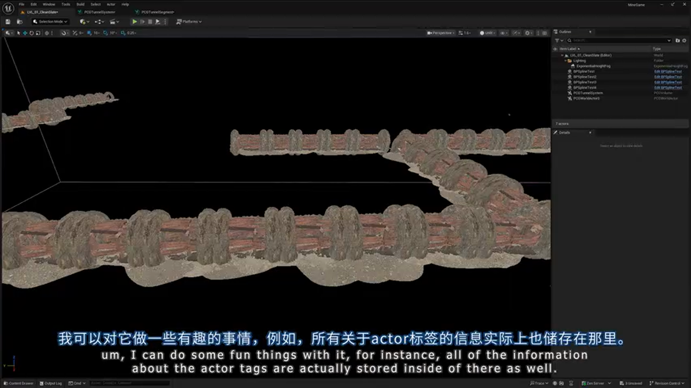

**场景示例：** 我们希望隧道中的灯光随机出现，而不是每个模块都有灯光。

```cpp
// 1. 筛选出标记为 "Light" 的点
FilterByTag(tag: "Light") -> LightPoints

// 2. 随机保留 50%
RandomFilter(ratio: 0.5) -> SelectedLights

// 3. 在这些位置生成点光源
SpawnPointLight(
    intensity: 1000,
    color: (255, 200, 150)
)
```

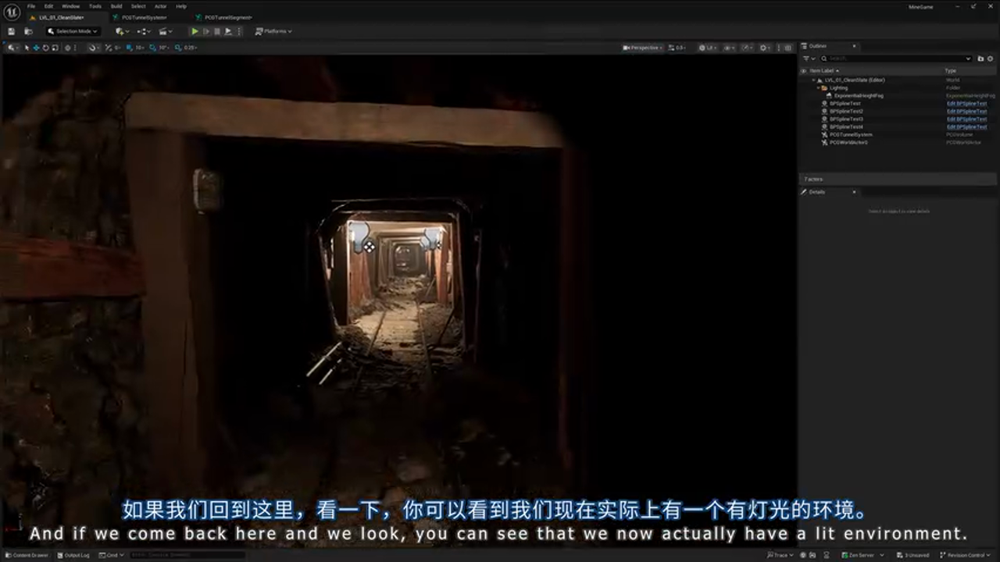

**批判性思考：** 这种方法的局限性

- **性能开销：** 每次生成都需要遍历所有点并检查标签，对于大型场景可能成为瓶颈
- **可维护性：** 标签名称是字符串，容易出现拼写错误且难以重构
- **替代方案：** 考虑使用 PCG 的 **Metadata** 系统，通过类型安全的属性来标记对象

---

## 弯曲检测与样条网格体切换

### Direction Delta：弯曲程度的量化指标

**设计目标：** 在直线段使用 Level Instance 模块，在弯曲段使用 Spline Mesh 以避免穿帮。


**Direction Delta 的定义：**

```cpp
// 伪代码实现
for each point in spline:
    currentDirection = point.Tangent.Normalized()
    previousDirection = point.Previous.Tangent.Normalized()
    
    directionDelta = Abs(Angle(currentDirection, previousDirection))
    // directionDelta 越大，说明弯曲越剧烈
```

**阈值设定：**

```cpp
// 每隔 100 单位采样一次
SplineSampler(interval: 100) -> SamplePoints

// 计算方向变化
ComputeDirectionDelta() -> DeltaAttribute

// 应用绝对值（因为左转和右转都是弯曲）
Abs(DeltaAttribute) -> AbsDelta

// 筛选弯曲段（Delta < 0.09 为直线段）
Filter(attribute: AbsDelta, max: 0.09) -> StraightSegments
Filter(attribute: AbsDelta, min: 0.09) -> CurvedSegments
```

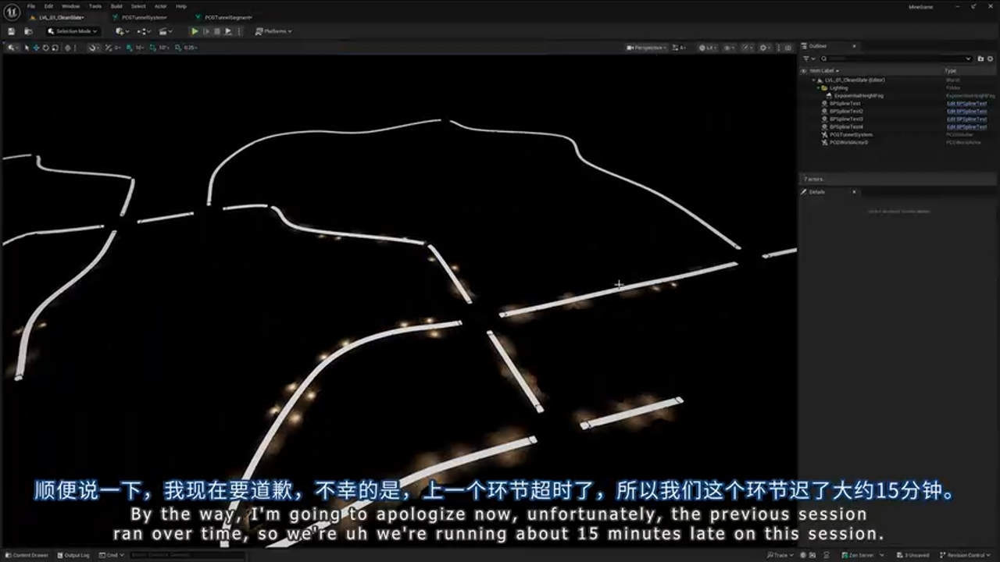

### 分支处理：直线段与弯曲段

**直线段处理流程：**

```cpp
StraightSegments 
    -> CreateSpline() 
    -> SubdivideSpline(modules) 
    -> SpawnLevelInstances()
```

**弯曲段处理流程：**

```cpp
CurvedSegments 
    -> CreateSpline() 
    -> SampleEvery(2.0) // 密集采样以保证平滑
    -> SpawnSplineMesh(CaveMesh)
    -> AddCapMeshes() // 在两端添加遮挡网格体
```

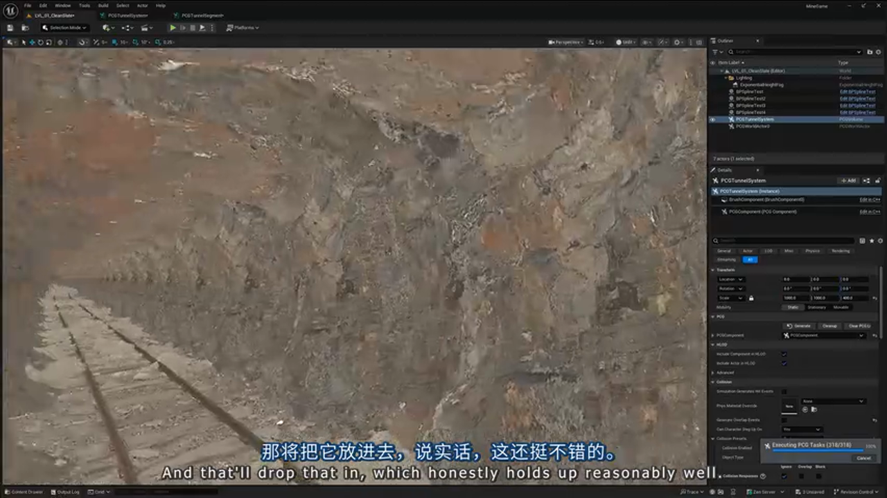

**避坑指南：** 弯曲段的首尾对接问题

如果只筛选 `Delta > 0.09` 的点，会导致弯曲段的起点和终点与直线段无法对接（因为起点本身可能是直线）。

**解决方案：**

```cpp
// 在筛选弯曲段时，额外保留首尾点
FilterByIndex(indices: [0, -1], invert: false) -> EndPoints
Merge(CurvedSegments, EndPoints) -> CompleteCurvedSegments
```

---

## 交叉路口的自动生成

### 交叉点的拓扑分析

**核心问题：** 如何判断一个交叉点是 T 型路口还是十字路口？

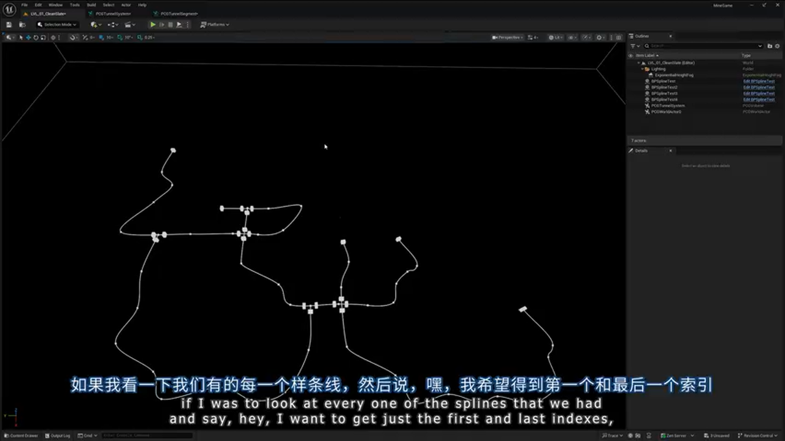

**解决思路：** 统计连接到该交叉点的隧道段数量。

```cpp
// 1. 获取所有隧道段的首尾点
FilterByIndex(indices: [0, -1]) -> AllEndPoints

// 2. 筛选出与交叉点重叠的端点
Intersection(AllEndPoints, RawIntersections) -> ConnectedPoints

// 3. 按交叉点分组
Cluster(distance: 5.0) -> ClusterID
Partition(attribute: ClusterID) -> IntersectionGroups

// 4. 统计每组的点数
GetMaxIndex() -> MaxIndex
Add(MaxIndex, 1) -> ConnectionCount
// 注意：MaxIndex 从 0 开始，所以需要 +1
```

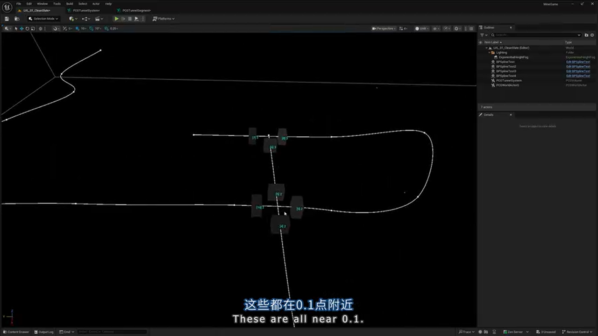

**实例分析：**

- ConnectionCount = 3 → T 型路口
- ConnectionCount = 4 → 十字路口
- ConnectionCount = 2 → 直线通道（无需生成路口）

### T 型路口的朝向计算

**挑战：** T 型路口有一个"主干"方向和一个"分支"方向，如何自动计算正确的旋转角度？

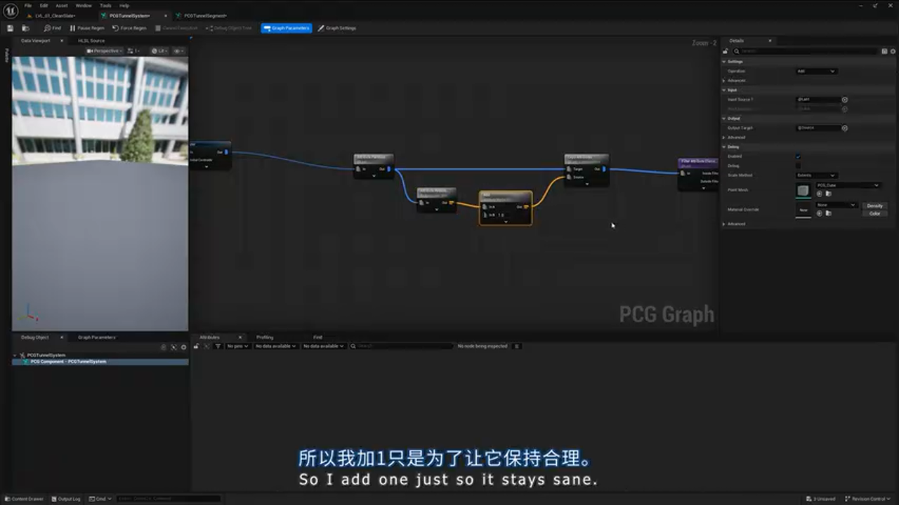

**数学技巧：向量求和抵消法**

```cpp
// 假设 T 型路口有 3 个连接点，方向分别为：
// Point1: (1, 0)   → 向右
// Point2: (-1, 0)  → 向左
// Point3: (0, 1)   → 向上

// 将所有方向向量相加
SumVector = Point1.Direction + Point2.Direction + Point3.Direction
          = (1, 0) + (-1, 0) + (0, 1)
          = (0, 1)

// 结果向量指向"分支"方向！
// 原理：主干的两个方向相反，相加后抵消，只剩下分支方向
```

**代码实现：**

```cpp
// 对每个交叉点分组
for each IntersectionGroup:
    // 获取所有连接点的方向
    directions = GetAttribute("Direction")
    
    // 向量求和
    sumDirection = Sum(directions)
    
    // 转换为旋转角度
    rotation = VectorToRotation(sumDirection)
    
    // 应用到路口模块
    SetRotation(rotation)
```

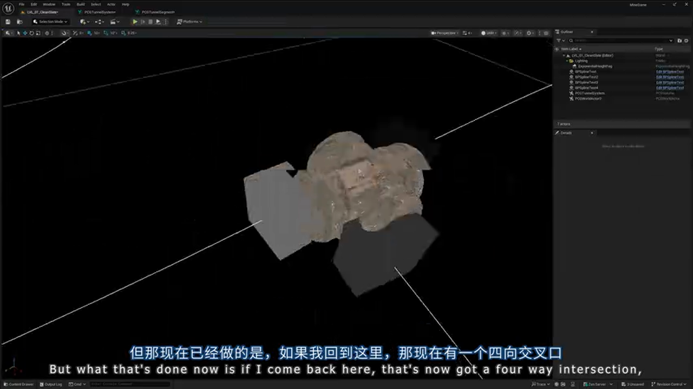

---

### Attract 节点：精准对接的秘密武器

**最后一个难题：** 即使我们正确放置了路口模块，隧道段的端点也未必能精确对接到路口的"连接点"上。


**Attract 节点的工作原理：**

```cpp
// 在路口模块中，手动放置"连接点"Actor，并标记为 "Connector"
// 这些 Actor 会被转换为 PCG 点

// 在主图中：
GetDataAsset(intersection) -> IntersectionData
FilterByTag(tag: "Connector") -> ConnectorPoints

// 将隧道段的端点"吸附"到最近的连接点
Attract(
    source: TunnelEndPoints,
    target: ConnectorPoints,
    maxDistance: 1000,
    mode: Snap // 完全吸附，而不是部分移动
)
```

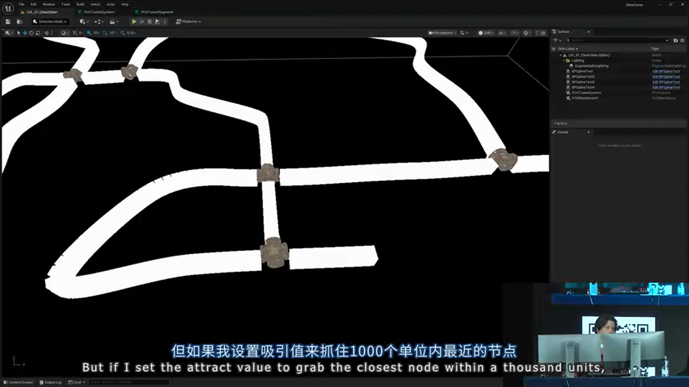

**效果验证：**

吸附前：隧道端点与路口有 50cm 的偏移
吸附后：隧道端点精确对齐到连接点，误差 < 1cm

**批判性思考：** Attract 节点的性能考量

- **优势：** 简单直观，适合快速原型开发
- **劣势：** 需要在每个路口模块中手动放置连接点，工作量大
- **生产建议：** 创建标准化的路口模块库，预先定义好连接点位置，并通过命名约定（如 `Connector_North`）来标识方向

---

## 实战总结与建议

### 方案对比

> **方案 A：纯手工摆放 Level Instance**
> - 🟢 优势：视觉质量可控，艺术家友好
> - 🔴 劣势：工作量巨大，无法快速迭代，难以适应设计变更
> - 🎯 适用场景：小规模场景，或需要极高艺术质量的关键区域
>
> **方案 B：纯程序化生成（本文方案）**
> - 🟢 优势：快速迭代，易于扩展，支持运行时生成
> - 🔴 劣势：学习曲线陡峭，调试困难，可能出现意外的视觉问题
> - 🎯 适用场景：大规模场景，Roguelike 游戏，需要动态生成的内容
>
> **方案 C：混合方案（推荐）**
> - 🟢 优势：关键区域手工打磨，重复区域程序化生成
> - 🔴 劣势：需要良好的工作流设计，团队协作要求高
> - 🎯 适用场景：大多数商业项目

### 避坑指南

**1. 数据流的可视化调试**

PCG 图的调试非常困难，因为数据在节点间流动时是"不可见的"。

**最佳实践：**
- 频繁使用 `Debug` 节点可视化属性值
- 在关键节点后添加 `Static Mesh Spawner` 来"物化"点云
- 使用 `Print Attribute` 节点输出数值到日志

**2. 性能优化：避免过度采样**

```cpp
// ❌ 错误示范：每 10cm 采样一次
SplineSampler(interval: 10) // 1km 隧道 = 10000 个点！

// ✅ 正确做法：根据用途调整采样密度
SplineSampler(interval: 200) // 用于模块放置
SplineSampler(interval: 20)  // 用于样条网格体
```

**3. Level Instance 的版本管理**

当你修改了某个 Level Instance 后，所有引用它的 PCG Data Asset 都需要**重新生成**。

**解决方案：**
- 在项目设置中启用 `Auto-Update PCG Data Assets`
- 或者使用 Python 脚本批量更新：

```python
# [AI补充] 批量更新脚本示例
import unreal

asset_registry = unreal.AssetRegistryHelpers.get_asset_registry()
pcg_assets = asset_registry.get_assets_by_class("PCGDataAsset")

for asset_data in pcg_assets:
    asset = asset_data.get_asset()
    asset.refresh_from_level_instance()
    unreal.EditorAssetLibrary.save_asset(asset.get_path_name())
```

**4. 样条线的闭合问题**

如果你的地牢是环形的，需要在 `CreateSpline` 节点中启用 `Closed Loop` 选项，否则首尾无法连接。

---

### UE 5.7 的新特性预告

演讲者提到，Epic 的 PCG 团队已经在 **UE 5.7** 中添加了大量**样条线交叉处理节点**，这将大幅简化本文中的许多手动操作。

**预期的新节点：**
- `DetectSplineIntersections`：自动检测交叉点
- `SplitSplineAtIntersections`：自动切割样条线
- `GenerateIntersectionMeshes`：根据连接数自动选择路口网格体

**对现有工作流的影响：**

本文中的 Delta Index 技术和 Cluster 分析可能会被封装为单个节点，但**核心思想仍然有效**——理解这些底层原理，能帮助你更好地使用高级节点，并在遇到问题时快速定位原因。

---

## 结语

通过本文的完整实践，我们展示了如何将 PCG 系统应用于复杂的建筑结构生成。核心要点包括：

1. **样条线分割**：通过密度检测和 Delta Index 技术，将连续路径切分为独立模块
2. **模块化拼装**：利用 Subdivision 语法和 Level Instance 转换，实现灵活的内容组合
3. **智能判断**：通过 Direction Delta 和拓扑分析，自动处理弯曲段和交叉路口
4. **精准对接**：使用 Attract 节点确保模块间的无缝连接

这套工作流不仅适用于地牢，还可以扩展到城市街道、管道系统、室内走廊等任何需要**路径引导的模块化场景**。

**下一步学习建议：**
- 研究 PCG 的 **Metadata** 系统，实现更复杂的数据传递
- 探索 **Blueprint 与 PCG 的交互**，实现运行时动态生成
- 学习 **PCG 的性能分析工具**，优化大规模场景的生成速度

---

**相关资源：**
- Epic 官方 PCG 文档：https://docs.unrealengine.com/5.3/pcg
- Chris Murphy 的其他演讲：明日的"PCG Tips and Tricks"专场
- 社区案例库：Unreal Slackers Discord #pcg 频道

感谢阅读！如果本文对您有帮助，欢迎加入文章开头的 UE5 技术交流群，与更多开发者交流 PCG 实践经验。


