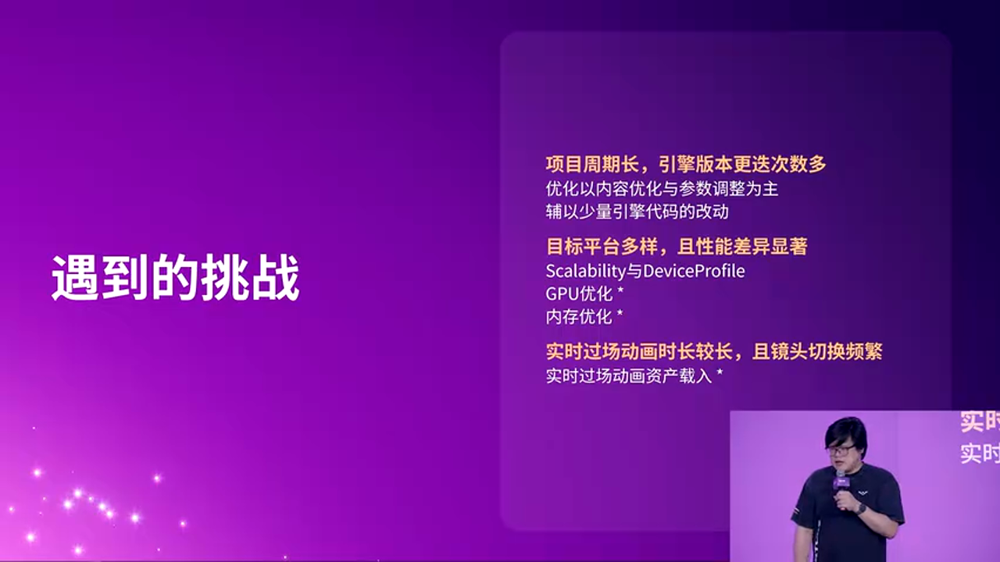
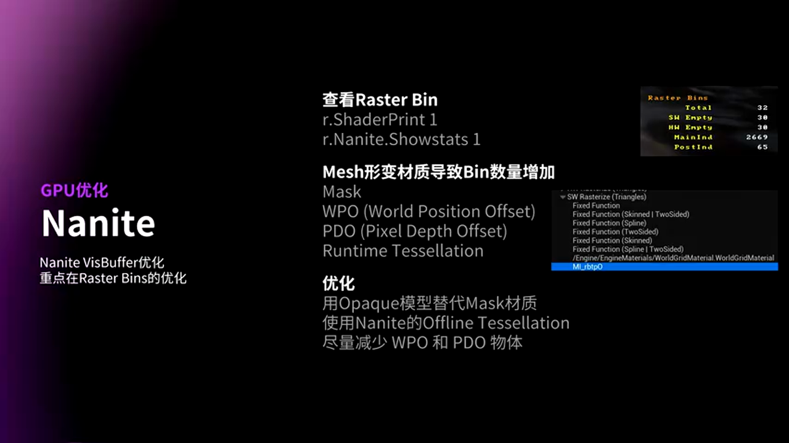
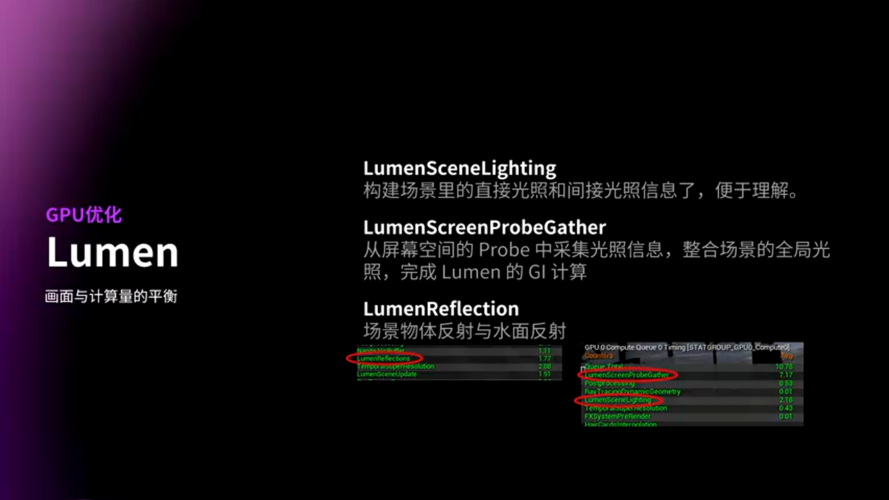
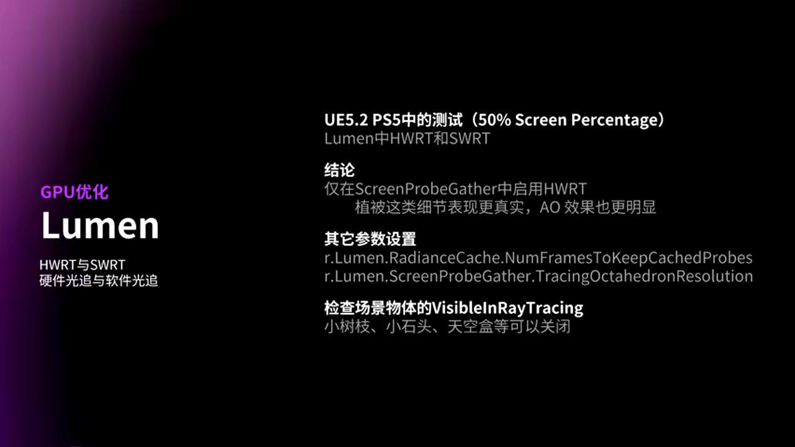
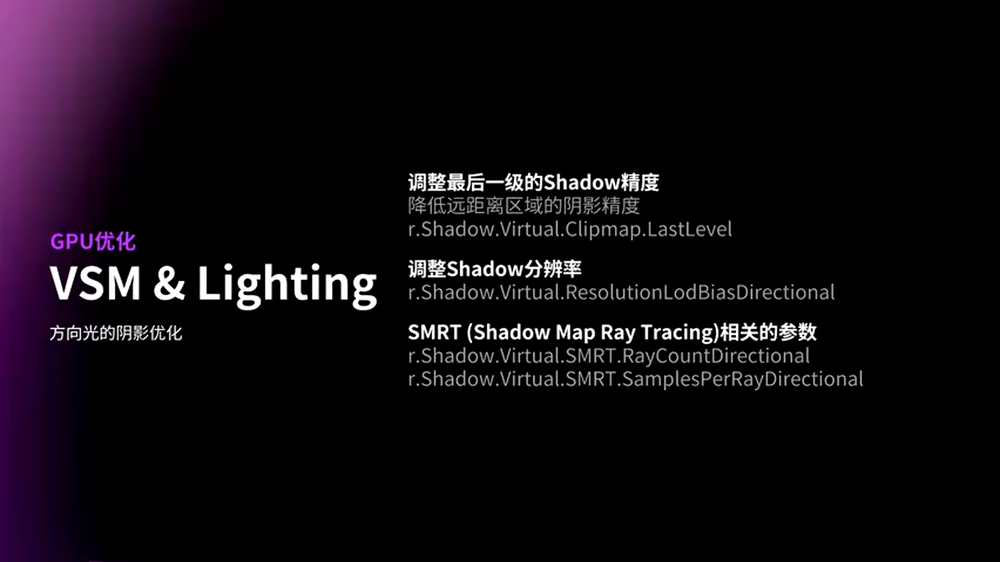
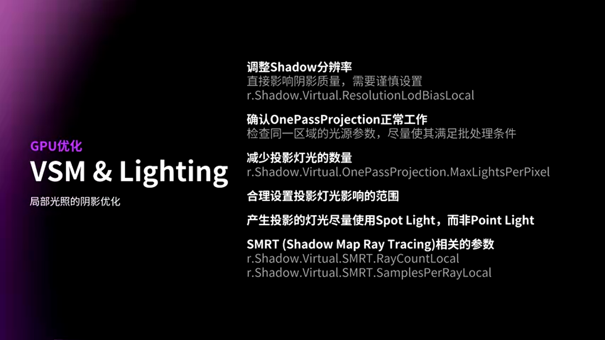
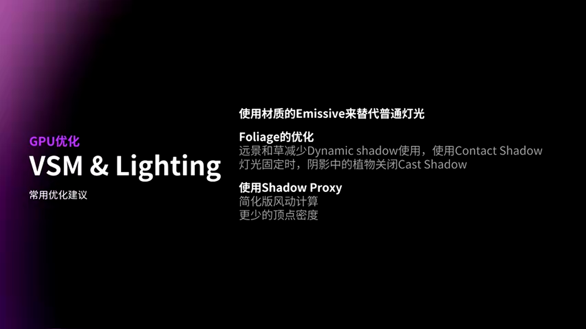
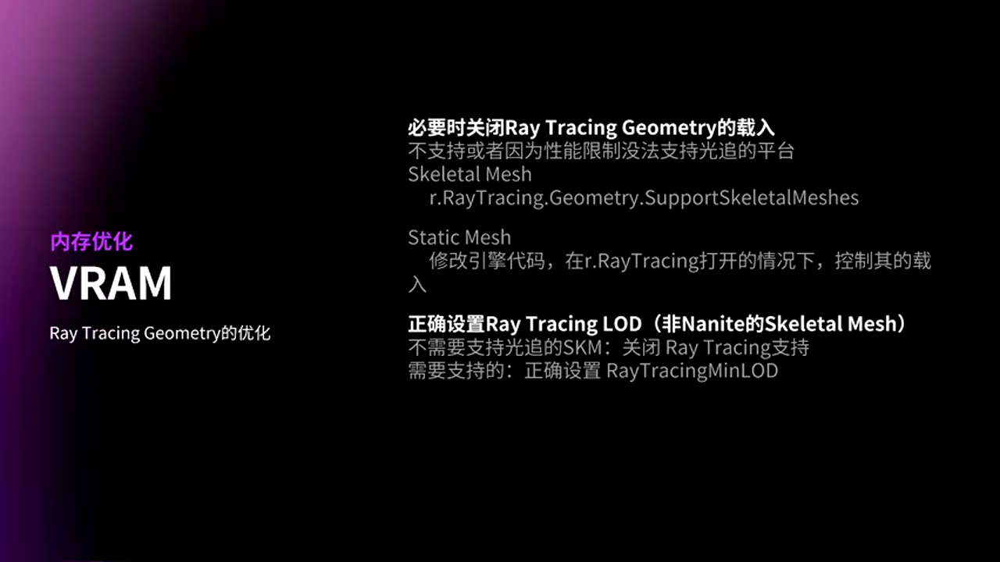

# 虚幻引擎5跨平台游戏优化实战：从Nanite到内存管理的完整解决方案

---


## 加入 UE5 技术交流群

如果您对虚幻引擎5的图形渲染技术感兴趣，欢迎加入我们的 **UE5 技术交流群**！

扫描上方二维码添加个人微信 **wlxklyh**，备注"UE5技术交流"，我会拉您进群。

在技术交流群中，您可以：
- 与其他UE开发者交流渲染技术经验
- 获取最新的GDC技术分享和解读
- 讨论图形编程、性能优化、构建工具流、动画系统等话题
- 分享引擎架构、基建工具等项目经验和技术难题

---

> **源视频信息**
> 
> 标题：[UFSH2025]虚幻引擎5跨平台游戏优化策略 | 沈慧良 维塔士上海工作室 技术总监
> 
> 时长：30分45秒
> 
> 视频链接：https://www.bilibili.com/video/BV1y62PBeEcA
> 
> 本文由AI辅助生成，基于视频内容的字幕和截图整理而成

---

## 导读

> **核心观点**
> 
> - UE5跨平台开发面临引擎版本频繁迭代、目标平台多样化、长时过场动画等三大核心挑战
> - Nanite、Lumen、VSM等新特性的优化需要在内容制作、参数调整和引擎代码改动之间找到平衡
> - 内存优化不仅要关注物理内存和显存的分配，还需要针对不同平台特性进行精细化配置

**前置知识要求**：了解虚幻引擎5基础架构、熟悉Nanite和Lumen等核心渲染特性、具备基本的性能分析能力。

---

## 背景与挑战：跨平台开发的三座大山

在大型跨平台游戏项目中，开发团队面临着前所未有的技术挑战。维塔士上海工作室在实际项目中总结出了三个核心痛点。


### 挑战一：引擎版本的频繁迭代

项目的开发周期往往长达数年，在此期间引擎版本会经历多次重大更新。维塔士的项目最早甚至始于UE4时代，随后逐步迁移到UE5。这种跨越式的版本升级带来了大量的适配工作。

以 **Nanite** 为例，在UE5.0版本中，Nanite仅支持普通的非透明Static Mesh。而在后续版本中，才逐渐支持Masked材质、WPO（World Position Offset）等特性。这意味着团队需要不断调整资产制作流程和优化策略。

再看 **TSR（Temporal Super Resolution）**，在UE5.0的PS5平台测试中，TSR的性能表现完全无法满足60fps的要求。但经过几个版本的迭代优化，TSR已经成为主机平台上的首选抗锯齿方案。

> **设计决策**：面对引擎快速迭代，团队选择以**内容优化和参数调整为主，辅以少量引擎代码改动**的策略。这样可以最大程度降低版本升级时的迁移成本。

### 挑战二：目标平台的多样性

跨平台开发不仅要考虑PC、PS5、Xbox Series等不同硬件平台，即使在同一主机平台上，也需要区分**性能模式**（Performance Mode）和**分辨率模式**（Quality Mode）。


- **PC平台**：通过Scalability系统提供多档画质选项
- **主机平台**：使用不同的DRS（Dynamic Resolution Scaling）Profile来适配性能模式和分辨率模式

每个平台的硬件特性差异巨大：
- 内存容量和带宽不同
- I/O速度差异显著（尤其是PS5的SSD优势）
- GPU架构和光追支持程度各异

这要求团队必须为每个平台和配置建立独立的优化方案。

### 挑战三：长时过场动画的资源管理

项目中包含大量长时间的实时过场动画，并且存在频繁的摄像机切换。这带来了两个关键问题：

1. **资源加载压力**：每次镜头切换都需要快速加载新的资源
2. **内存管理复杂度**：需要在有限的内存中动态管理大量资产

传统的关卡流送（Level Streaming）机制在这种场景下表现不佳，必须设计专门的预加载（Pre-streaming）策略。

---

## 优化策略总览

针对上述挑战，维塔士团队制定了系统化的优化方案：



**优化方向**：
1. **GPU优化**：聚焦Nanite、Lumen、VSM三大特性
2. **内存优化**：物理内存和显存的精细化管理
3. **资源流送**：实时过场动画的预加载机制

今天的分享将深入探讨GPU优化和内存优化的实战经验。

---

## Nanite优化：从Visibility Buffer到Base Pass的全链路优化

Nanite作为UE5的核心特性，其渲染流程主要分为两个阶段：


1. **Nanite Visibility Buffer（VS Buffer）**：遮挡剔除和光栅化
2. **Nanite Base Pass**：最终的着色计算

### Visibility Buffer优化：控制Rasterizer Bin数量

VS Buffer阶段的性能瓶颈主要在于 **Rasterizer Bin** 的数量。可以通过Console命令查看实时数据：

```
r.Nanite.ShowStats 1
r.Nanite.Visualize RasterBins
```



**关键指标解读**：
- **Total**：场景中需要处理的总Bin数量
- **MT（Empty）**：无需处理的空Bin数量
- **有效Bin数 = Total - MT**：这个差值越小，光栅化性能越好

以CitySample为例，其Rasterizer Bin数量控制得非常优秀，这也是其能保持高性能的关键因素之一。

#### 导致Rasterizer Bin数量激增的元凶

以下材质特性会强制Nanite使用逐像素光栅化路径，大幅增加Bin数量：


- **Masked材质**：使用Alpha Test的材质
- **WPO/PDO**：顶点偏移效果
- **Runtime Tessellation**：运行时细分

这些特性会导致Nanite无法使用默认的高效Fixed Function路径，必须走Pixel Shader路径进行光栅化。

> **性能对比**
> 
> - **普通材质**：走Fixed Function路径，性能开销极小
> - **特殊材质**：走Pixel Shader路径，性能开销显著增加

#### 资产优化实战

**1. 用Opacity Mask替代Masked材质**

对于场景中的树叶、树枝等植被，传统做法是使用Masked材质。但在Nanite下，更推荐直接使用 **Opacity Mask** 制作几何体。


**优势**：
- 避免触发逐像素光栅化
- 保持Nanite的高效渲染路径
- 视觉效果几乎无损

在维塔士的项目中，场景中的大部分树叶和树枝都已完全使用Opacity Mask制作，不再依赖传统的Masked材质。

**2. 使用Offline Tessellation**

对于需要细分的资产，Nanite支持 **Offline Tessellation**，可以在构建时将Tessellation数据直接烘焙到Nanite数据中，避免运行时计算。


**3. 按需使用WPO和PDO**

WPO和PDO虽然强大，但性能开销不容忽视。团队的原则是：
- 如果没有必要，坚决不使用
- 如果必须使用，严格控制影响范围

### 通过LOD Bias优化VS Buffer性能

在主机平台上，通常会启用动态分辨率，且最大渲染分辨率会低于100%。这种情况下，可以为Nanite设置全局LOD Bias，告诉系统"不需要加载最高精度的LOD"。


**配置示例**（主机平台）：
```
r.Nanite.MaxPixelsPerEdge=1.0
r.Nanite.MaxPixelsPerEdgeScaling=0.8
```

这个参数主要针对Tessellation，因此主要在主机平台使用。在一些VS Buffer消耗特别高的场景，甚至可以使用更激进的数值来换取性能。

> **注意**：这个优化需要根据实际场景测试，过于激进可能导致明显的LOD切换或细节丢失。

### Base Pass优化：材质数量决定Fast Path

Nanite的Base Pass存在两条渲染路径：


**代码逻辑**（简化）：
```cpp
// [AI补充] 基于上下文逻辑补全
if (Cluster.MaterialCount <= 3) {
    // Fast Path: 高效渲染
    RenderWithFastPath(Cluster);
} else {
    // Slow Path: 通用渲染
    RenderWithSlowPath(Cluster);
}
```

**关键发现**：当一个Nanite Cluster上的材质数量 ≤ 3 时，才会走Fast Path。

#### 使用Material Counter视图排查问题

可以通过Nanite可视化工具查看每个Cluster的材质数量：

```
r.Nanite.Visualize MaterialCount
```


CitySample的截图显示，大部分区域都是单一颜色（单一材质），这说明其在材质合并方面做得非常出色。

而在实际项目开发中，这个视图往往会呈现"五颜六色"的状态，说明存在大量材质数量超标的Cluster，需要进行资产优化。

> **优化建议**
> 
> - 在建模阶段就考虑材质合并
> - 使用Material ID合理规划UV布局
> - 对于复杂资产，考虑拆分成多个Mesh

### WPO材质的深度优化

在项目中，WPO主要用于表现植物的风动效果。虽然是必需功能，但其性能开销不容小觑。


#### WPO的性能陷阱

使用WPO后，系统会自动将物体渲染到 **Velocity Buffer**，这意味着WPO相关的Shader计算需要执行 **两次**：
1. 当前帧的位置计算
2. 上一帧的位置计算（用于Motion Vector）

从引擎代码可以看到，渲染循环中存在三次迭代：


```cpp
// [AI补充] 基于上下文逻辑补全
for (int Pass = 0; Pass < 3; Pass++) {
    // Current frame
    // Previous frame
    // Motion vector calculation
    ComputeWPO(Pass);
}
```

这意味着在一帧中，WPO物体的材质计算实际要走 **六次**。如果WPO Shader过于复杂，会严重影响GPU性能。

#### 实战优化方案

维塔士团队使用的是引擎内置的 **Pivot Painter** 材质函数，效果不错但性能有压力。经过分析，采取了以下优化措施：

**1. 移除Ambient Wind**


项目中的植物风动是微风效果，只需要轻微摆动即可，不需要Ambient Wind的复杂计算。移除后性能提升明显。

**2. 限制风动等级**

Pivot Painter最多支持4级风动层级，但实际使用中限制在3级以内：


根据不同植物类型（草、灌木、树木）设置不同的风动等级，避免过度计算。

**3. 缓存中间计算结果**

在材质图中，将重复使用的计算结果缓存起来，避免重复计算：


- **红框部分**：计算一次后存储结果
- **黄框部分**：复用缓存的结果

原本的实现中，相同的计算会执行多次，优化后显著降低了Shader复杂度。

> **性能提升**：经过上述优化，WPO相关的GPU开销降低了约30-40%（具体数值因场景而异）。

---

## Lumen优化：全局光照的精细化调控

Lumen的性能开销主要集中在三个Pass：



1. **Lumen Scene Lighting**：直接光照和间接光照
2. **Lumen Screen Probe Gather**：屏幕空间探针的光照整合
3. **Lumen Reflection**：场景物体和水面反射

**重要提示**：前两项在主机和PC上默认使用 **Software Ray Tracing**（基于SDF），这是性能优化的重点。

### Scene Lighting优化：直接光与间接光的平衡

#### 直接光照优化

直接光照默认使用 **Trace Mesh SDF**，在需要性能时可以关闭，改用Global SDF：


**配置对比**：
> **方案A：Trace Mesh SDF（默认）**
> - 🟢 优势：阴影精度高，细节丰富
> - 🔴 劣势：性能开销较大
> - 🎯 适用场景：分辨率模式，追求画质

> **方案B：Global SDF Only**
> - 🟢 优势：性能提升明显
> - 🔴 劣势：阴影精度略有下降
> - 🎯 适用场景：性能模式，帧率优先

**配置示例**：
```
r.Lumen.DirectLighting.TraceMeshSDFs=0  // 关闭Mesh SDF追踪
```

#### 间接光照探针调整

间接光照通过屏幕空间探针采样，可以调整以下参数：


**核心参数**：
- **Probe Spacing**：探针密度，值越小探针越密集
- **Probe Resolution**：每个探针发出的光线数量
- **Update Factor**：探针更新频率

**调优策略**：
```
// 性能模式配置示例
r.Lumen.ScreenProbeGather.Spacing=16.0
r.Lumen.ScreenProbeGather.Resolution=4
r.Lumen.ScreenProbeGather.UpdateFactor=2.0

// 分辨率模式配置示例
r.Lumen.ScreenProbeGather.Spacing=8.0
r.Lumen.ScreenProbeGather.Resolution=8
r.Lumen.ScreenProbeGather.UpdateFactor=1.0
```

这些参数可以在性能和表现之间做权衡，根据不同平台和模式灵活调整。

### Screen Probe Gather优化：场景特定的精细调控


除了常规参数调整，还有一些针对特定场景的优化技巧。

#### 移除Landscape的阴影影响

在维塔士的项目中，Landscape虽然存在，但大部分区域被其他Mesh覆盖，真正可见的Landscape区域很少。这种情况下，可以关闭Landscape对间接光照的贡献：

```
r.Lumen.ScreenProbeGather.Landscape=0
```

**决策依据**：
- 场景中Landscape可见度低
- 关闭后性能提升明显
- 画面质量几乎无影响

> **注意**：这个优化需要根据具体场景评估。如果Landscape是主要地表且大面积可见，则不建议关闭。

#### 减少自遮挡探针数量

通过调整以下参数，可以减少用于自遮挡计算的探针数量：

```
r.Lumen.ScreenProbeGather.DownsampleFactor=2
```

这个参数在追求性能的情况下可以适当调高，但需要注意画质的权衡。

**总结**：
- 在追求性能时，可以关闭Landscape影响、降低探针密度
- 在追求质量时，或者平台性能充足时，可以开启所有选项
- 关键是根据不同平台和配置做差异化处理

### Reflection优化：场景反射与水面反射的分离调控

Lumen Reflection包含两部分：场景物体反射和水面反射。


#### 场景物体反射优化

**1. 调整反射分辨率**

```
r.Lumen.Reflections.ScreenSpaceReconstruction.NumSamples=4  // 性能模式
r.Lumen.Reflections.ScreenSpaceReconstruction.NumSamples=8  // 质量模式
```

**2. 通过粗糙度过滤**

可以设置 **Max Roughness** 阈值，避免粗糙度过高的材质参与反射计算：

```
r.Lumen.Reflections.MaxRoughnessToTrace=0.4
```

**原理**：粗糙度高的材质反射效果本身就不明显，排除后可以减少计算量。

**3. Foliage特殊处理**

植被的反射贡献通常很小，可以针对性优化：


- **室内场景**：大理石地面等材质，反射非常重要，必须保留
- **室外场景**：粗糙的岩石、植物等材质，反射不明显，可以通过Max Roughness过滤

> **场景适配策略**
> 
> - **室内/光滑材质为主**：Max Roughness = 0.8-1.0
> - **室外/粗糙材质为主**：Max Roughness = 0.3-0.5

#### 水面反射优化

水面反射的性能瓶颈在于 **Trace Voxel** 阶段，这是一个基于Compute Shader的过程。


**性能影响因素**：
1. 屏幕上水面像素的数量（不可控）
2. 每条光线的追踪距离（可控）

**优化方案：限制追踪距离**

原引擎没有提供追踪距离限制的参数，维塔士团队通过轻微修改引擎代码增加了这个限制：

```cpp
// [AI补充] 基于上下文逻辑补全
float MaxTraceDistance = CVarLumenWaterReflectionMaxTraceDistance.GetValueOnRenderThread();
if (MaxTraceDistance > 0.0f) {
    TraceDistance = FMath::Min(TraceDistance, MaxTraceDistance);
}
```

**配置示例**：
```
r.Lumen.Reflections.Water.MaxTraceDistance=5000.0  // 限制追踪距离为50米
```

这个优化在水面较多的场景中效果显著，可以降低20-30%的水面反射开销。

**1. 关闭Trace Mesh SDF**

与直接光照类似，水面反射也可以关闭Mesh SDF追踪：

```
r.Lumen.Reflections.Water.TraceMeshSDFs=0
```

经过测试，这个选项对画质的影响不大，但性能提升明显。

### 硬件光追 vs 软件光追：UE5.2的实战测试

维塔士团队在UE5.2版本的PS5平台上进行了硬件光追测试。



**测试结论**：
- 只能在 **Screen Probe Gather** 阶段启用硬件光追
- 其他阶段启用硬件光追会导致性能无法达标

**硬件光追的优势**：
- 植物细节更加真实
- AO（Ambient Occlusion）效果更加明显
- 整体光照质量提升显著

**配置示例**：
```
r.Lumen.ScreenProbeGather.RadianceCache.HardwareRayTracing=1
```

**重要提示**：这个测试结果仅针对UE5.2版本。在UE5.6的Release Notes中提到，主机平台的硬件光追性能有了进一步优化，建议在新版本中重新测试。

#### 硬件光追相关参数

如果启用硬件光追，还可以调整以下参数来平衡性能和质量：


```
r.Lumen.HardwareRayTracing.GroupCount=4096
r.Lumen.HardwareRayTracing.LightingMode=1
```

#### 场景物体的光追贡献控制

并非所有物体都需要参与光追计算。可以针对特定类型的物体关闭光追贡献：


**建议关闭光追的物体类型**：
- 小装饰物（Small Props）
- 小石头（Small Rocks）
- 天空盒（Sky Dome）

这些物体对光照的贡献很小，关闭后可以减少BVH（Bounding Volume Hierarchy）的构建开销和光线追踪的计算量。

**配置方式**：在物体的Rendering设置中取消勾选"Visible in Ray Tracing"。

---

## VSM优化：虚拟阴影贴图的全方位调优

Virtual Shadow Maps（VSM）是UE5的新一代阴影系统，优化分为方向光和局部光两个部分。

### 方向光阴影优化



#### 常规优化手段

**1. 降低远距离阴影精度**

```
r.Shadow.Virtual.SMRT.RayCountDirectional=4  // 最后一级Cascade的采样数
```

远距离的阴影精度要求较低，可以适当降低采样数来换取性能。

**2. 调整阴影分辨率**

```
r.Shadow.Virtual.Resolution=4096  // 方向光专用分辨率
```

**注意**：这个参数仅针对方向光，不影响局部光源。

**3. SMRT相关参数**

SMRT（Shadow Map Ray Tracing）提供了软阴影效果，可以调整其质量参数：

```
r.Shadow.Virtual.SMRT.SamplesPerRayDirectional=2
r.Shadow.Virtual.SMRT.MaxRayAngleFromLight=0.03
```

这些参数在性能和质量之间提供了灵活的调节空间。

### 局部光阴影优化



#### One Pass Projection：批量处理的关键

VSM的一个重要优化是 **One Pass Projection**。如果一个区域内的光源参数一致，且不支持Light Function，这些光源会被批量处理，显著提升性能。

**优化建议**：
- 在美术制作时，尽量保证同一区域的光源参数一致
- 避免不必要的Light Function
- 使用统一的光源模板

#### 控制投影光源数量

**1. 减少投影光源的总数**

这是最直接的优化方式。在场景设计阶段就要考虑光源的合理布局。

**2. 限制单个像素受光源影响的数量**

```
r.Shadow.Virtual.MaxLightsPerPixel=4
```

当一个像素被过多光源影响时，会自动选择最重要的几个光源进行计算。

**3. 控制光源范围**

光源的Attenuation Radius直接影响性能。范围越大，影响的像素越多，性能开销越大。

> **最佳实践**
> 
> - 精确设置每个光源的有效范围
> - 避免大范围的低强度光源
> - 使用Light Channels进行分组管理

#### Spot Light vs Point Light


**强烈推荐使用Spot Light而非Point Light**。

**原因**：
- **Spot Light**：只生成1个Shadow Map View
- **Point Light**：生成6个Shadow Map View（Cube Map的6个面）

性能差距高达6倍！

> **设计建议**
> 
> - 优先使用Spot Light
> - 如果必须使用Point Light，严格控制数量和范围
> - 考虑用多个Spot Light组合替代单个Point Light

### 光照与VSM的通用优化技巧

#### 使用Emissive材质替代灯光



在启用Lumen的情况下，可以用模型的Emissive材质进行补光，替代传统的点光源或聚光灯。

**实现方式**：
1. 创建一个发光的Mesh
2. 设置为Hidden（不可见）
3. 勾选"Affect Indirect Lighting When Hidden"

**优势**：
- 不产生阴影计算开销
- 可以精确控制补光位置和形状
- Lumen会自动处理其对间接光照的贡献

这种方式特别适合用于增加光照层次感，而不增加投影光源的数量。

#### Foliage阴影优化

植被的阴影是性能杀手，需要区别对待：


**优化策略**：
- **高草**：使用Dynamic Shadow（动态阴影）
- **低草**：使用Contact Shadow（接触阴影）

这样既保证了阴影的层次感，又控制了性能开销。

**配置方式**：
```
// 在Foliage Type中设置
CastShadow = false  // 低草
bCastContactShadow = true  // 低草
```

#### Shadow Proxy：植被阴影的终极优化

对于密集的森林场景，即使使用了上述优化，阴影开销仍然可能很高。这时可以使用 **Shadow Proxy**。


**原理**：为复杂的植被模型创建简化的代理模型，仅用于阴影计算。

**优化方向**：
- 简化风动计算（减少WPO复杂度）
- 降低顶点密度
- 使用更简单的几何体

**效果**：在Shadow Pass中占用更少的时间，同时保持可接受的阴影质量。

---

## 内存优化：物理内存与显存的双重管控

内存优化涉及两个方面：物理内存（System Memory）和显存（VRAM）。


### 物理内存优化

#### 使用Map切换而非SubLevel


维塔士的项目没有使用开放世界，因此不使用World Partition，需要进行Level切换。

**问题发现**：最初使用SubLevel的Show/Hide进行切换，发现Hide后物理内存并没有被释放。

**解决方案**：改用Map切换（Load/Unload Level），确保内存正确释放。

**配置示例**：
```cpp
// [AI补充] 基于上下文逻辑补全
UGameplayStatics::OpenLevel(this, LevelName, true);  // 使用Map切换
// 而不是
Level->SetIsVisible(false);  // SubLevel隐藏（内存不释放）
```

#### 碰撞体设置优化


碰撞体是物理内存的重要占用来源，需要按需设置：

**优化原则**：
> **无交互物体**
> - 设置为No Collision
> - 节省内存和CPU开销

> **简单交互物体**
> - 使用Simple Collision（Box、Sphere、Capsule）
> - 勾选"Use Simple as Complex"
> - 性能和内存占用都很低

> **复杂交互物体**
> - 使用Complex Collision（Per-Poly）
> - 仅在必要时使用

**Nanite Mesh特殊处理**：

Nanite Mesh默认使用Fallback Mesh作为Complex Collision，有时Fallback Mesh生成得过于复杂。

**解决方案**：
1. 调整Fallback Mesh生成参数
2. 或者为其制作专门的简化Collision Mesh

```
// 在Static Mesh设置中
NaniteSettings.FallbackPercentTriangles = 0.2  // 降低Fallback精度
```

#### 物理系统功能裁剪

根据项目需求，关闭不需要的物理功能：

```
// 示例：关闭Chaos物理的某些功能
p.Chaos.Solver.Enabled=0  // 如果不需要复杂物理模拟
```

这些选项可以在不同平台的配置文件中差异化设置。

#### CPU Access优化：释放Skeletal Mesh Buffer


Skeletal Mesh默认会在显存和物理内存中各保留一份顶点数据。可以通过以下设置释放物理内存中的副本：

**全局设置**：
```
r.FreeSkeletalMeshBuffers=1
```

**效果**：Skeletal Mesh的顶点数据只保留在显存中。

**特殊情况**：如果某些Mesh需要CPU访问（如特殊效果），可以单独勾选"Allow CPU Access"。

> **内存节省**：在角色和动画较多的项目中，这个优化可以节省数百MB的物理内存。

### 显存优化

#### Ray Tracing Geometry管理



启用硬件光追后，每个Mesh会额外存储Ray Tracing Geometry数据（BVH结构），占用大量显存。

**问题场景**：
- 某个平台/配置启用了硬件光追
- 另一个平台/配置因性能原因未启用

即使未启用硬件光追，Ray Tracing Geometry数据仍会被加载到显存中！

**优化方案**：

**1. Skeletal Mesh控制**

引擎提供了现成的开关：

```
r.RayTracing.Geometry.SkeletalMeshes=0  // 不加载Skeletal Mesh的RT数据
```

**2. Static Mesh控制（引擎改动）**

Static Mesh没有类似开关，维塔士团队参考Skeletal Mesh的实现，为Nanite Mesh添加了相同的控制：

```cpp
// [AI补充] 基于上下文逻辑补全
UPROPERTY(EditAnywhere, Category = "RayTracing")
bool bSupportRayTracing = true;

if (!bSupportRayTracing && !CVarRayTracingNaniteMeshes.GetValueOnGameThread()) {
    // 不加载Ray Tracing Geometry
    return;
}
```

**配置示例**：
```
r.RayTracing.Geometry.NaniteMeshes=0  // 自定义参数
```

这样就可以根据平台配置，精确控制哪些Mesh需要加载RT数据。

#### Skeletal Mesh的Ray Tracing LOD

对于支持硬件光追的平台，Skeletal Mesh默认使用LOD0进行光追，这可能过于精细。


**优化方案**：

**不支持光追的平台**：
```
r.RayTracing.Geometry.SkeletalMeshes=0
```

**支持光追的平台**：
```
r.RayTracing.Geometry.SkeletalMeshes.LOD=1  // 使用LOD1进行光追
```

使用LOD1或LOD2进行光追，可以在保持视觉质量的同时，显著降低显存占用和光追性能开销。

#### Nanite和VSM的显存参数调优

Nanite和VSM都有一系列影响显存的参数，需要根据平台特性进行调整。


**优化经验**：

维塔士团队的实践流程是：
1. 先进行常规的内存优化（碰撞体、RT Geometry等）
2. 大部分平台达标后，针对内存紧张的平台调整Nanite/VSM参数
3. 最终所有平台都达到内存要求

**关键参数示例**：
```
// Nanite相关
r.Nanite.MaxCandidateClusters=8192
r.Nanite.MaxVisibleClusters=4096

// VSM相关
r.Shadow.Virtual.MaxPhysicalPages=4096
r.Shadow.Virtual.Cache.StaticSeparate=1
```

**重要建议**：

> **时机选择**
> 
> - 不要在项目早期就调整这些参数
> - 等资源基本固定后再进行精细调优
> - 为不同平台和配置建立独立的参数集

> **平台差异化**
> 
> - 根据每个平台的内存容量和I/O速度调整
> - PS5的SSD优势可以支持更激进的流送策略
> - PC需要考虑最低配置的兼容性

> **参数绑定**
> 
> - 某些参数在初始化阶段就固定了
> - 需要将这些参数与平台硬件/配置绑定
> - 通过DeviceProfile或自定义配置系统管理

---

## 实时过场动画优化：预加载系统的深度改造

项目中的长时过场动画面临频繁的摄像机切换，导致资源加载压力巨大。


### 问题分析：模糊的根源

摄像机切换时出现短暂模糊，分析后发现是两方面原因：


1. **Nanite模型**：高精度LOD未及时加载
2. **Virtual Texture**：贴图Mip未及时Stream

### 官方工具：Pre-streaming Record

UE5提供了 **Pre-streaming Record** 工具，可以记录每一帧需要的Nanite和Virtual Texture数据，生成预加载数据。


**使用流程**：
1. 播放过场动画，开启录制
2. 系统记录每帧的资源需求
3. 生成预加载数据文件
4. 在实际播放时应用预加载数据

### 问题：预加载数据超出引擎处理能力

应用预加载数据后，模糊问题依然存在。深入研究发现，预加载的Request数量已经超过了引擎默认的处理能力。


**根本原因**：Request的配额在被使用前就被淘汰了。

#### Nanite的LRU缓存策略

Nanite使用 **LRU（Least Recently Used）** 缓存策略。在镜头快速切换时：


1. 新镜头的Request大量涌入
2. 旧镜头的Request还未处理完
3. 旧Request被LRU策略淘汰
4. 结果：只能使用最低精度的LOD渲染

**典型场景**：两人对话的镜头来回切换，A镜头的资源还没加载完，就切到B镜头了，然后又切回A镜头，形成恶性循环。

### 优化方案一：扩大资源池


**参数调整**：
```
r.Nanite.MaxPendingPages=16384  // 增加待处理Page数量
r.Nanite.StreamingPoolSize=512  // 增加流送池大小（MB）
```

**局限性**：项目此时内存使用已经很紧张，无法继续增加内存分配。

### 优化方案二：减少Request数量


**核心思路**：预加载数据不会检查资源是否已在内存中，导致重复Request。

**实现方案**：以Camera Cut为单位进行去重。

```cpp
// [AI补充] 基于上下文逻辑补全
void PreloadForCameraCut(FCameraCut& CameraCut) {
    TSet<FNaniteCluster> LoadedClusters;
    
    for (auto& Request : CameraCut.Requests) {
        if (!LoadedClusters.Contains(Request.ClusterID)) {
            // 只有未加载的才提交Request
            SubmitStreamingRequest(Request);
            LoadedClusters.Add(Request.ClusterID);
        }
    }
}
```

**效果**：Request数量减少30-50%，显著缓解了缓存压力。

### 优化方案三：优化Static Mesh配额

某些Static Mesh因为制作时没有优化，占用了过多的Page配额。


**解决方案**：在编辑器中添加Page Info显示，让美术可以看到每个Mesh的配额占用，针对性优化。

```cpp
// [AI补充] 在编辑器中显示Page Info
UPROPERTY(VisibleAnywhere, Category = "Nanite Debug")
int32 PageCount;

UPROPERTY(VisibleAnywhere, Category = "Nanite Debug")
int32 EstimatedMemoryMB;
```

### 优化方案四：重复提交关键Request


对于关键的资源Request，在多帧中重复提交，增加其优先级，避免被LRU策略过早淘汰。

```cpp
// [AI补充] 基于上下文逻辑补全
void SubmitCriticalRequests(TArray<FStreamingRequest>& Requests) {
    for (int32 Frame = 0; Frame < 5; Frame++) {
        for (auto& Request : Requests) {
            Request.Priority = HighPriority;
            StreamingManager->SubmitRequest(Request);
        }
    }
}
```

**效果**：关键资源的加载成功率显著提升。

### 优化方案五：提前触发预加载


原本的预加载是在镜头切换时触发，改为在切换前的几帧就开始触发。

**实现**：
```cpp
// [AI补充] 基于上下文逻辑补全
float PreloadAdvanceTime = 0.2f;  // 提前0.2秒（约5帧）

if (TimeUntilCameraCut <= PreloadAdvanceTime) {
    PreloadNextCameraResources();
}
```

**效果**：给引擎更多时间处理Request，模糊现象明显减少。

### Virtual Texture优化

Virtual Texture的优化思路与Nanite类似。


#### 提高每帧处理速度

```
r.VT.MaxUploadsPerFrame=32  // 每帧最多上传32个Tile
r.VT.MaxPagesProducedPerFrame=64  // 每帧最多生成64个Page
```

**注意**：这些参数需要根据平台的I/O速度调整。调得过高会增加CPU负担。

#### 降低贴图分辨率

过场动画的画面是固定的，可以针对性降低某些贴图的分辨率。


**原则**：
- 如果镜头中某个物体距离较远，不需要4K贴图
- 降低分辨率可以减少Streaming Request数量

**配置方式**：
```
// 在Texture设置中
LODGroup = TEXTUREGROUP_World  // 使用较低的默认分辨率
MaxTextureSize = 2048  // 限制最大尺寸
```

#### 重复提交被丢弃的Request

与Nanite类似，对于被丢弃的VT Request，也进行重复提交。

```cpp
// [AI补充] 基于上下文逻辑补全
void ResubmitDroppedVTRequests() {
    for (auto& Request : DroppedRequests) {
        VirtualTextureSystem->RequestTiles(Request);
    }
}
```

---

## 总结与最佳实践

### 核心优化策略回顾

**GPU优化**：
1. **Nanite**：控制Rasterizer Bin数量，优化材质数量，精简WPO计算
2. **Lumen**：针对不同平台调整直接光、间接光和反射参数，合理使用硬件光追
3. **VSM**：区分方向光和局部光优化，使用Spot Light替代Point Light

**内存优化**：
1. **物理内存**：使用Map切换，优化碰撞体，释放Skeletal Mesh Buffer
2. **显存**：精确控制Ray Tracing Geometry加载，调整Nanite和VSM参数

**资源流送**：
1. 使用Pre-streaming Record记录资源需求
2. 去重Request，优化Mesh配额
3. 重复提交关键Request，提前触发预加载

### 通用优化原则

> **原则一：分阶段优化**
> 
> - 早期：专注内容优化和参数调整
> - 中期：进行平台差异化配置
> - 后期：针对性进行引擎代码改动

> **原则二：数据驱动决策**
> 
> - 使用Profiling工具精确定位瓶颈
> - 用数据验证优化效果
> - 建立性能监控体系

> **原则三：平台差异化**
> 
> - 为每个平台和配置建立独立参数集
> - 利用平台特性（如PS5的SSD）
> - 在性能和质量之间找到最佳平衡点

### 避坑指南

**常见陷阱**：
1. 过早优化引擎参数，导致后期资源变化时需要重新调整
2. 忽视平台差异，使用统一配置导致某些平台性能不达标
3. 只关注GPU优化，忽视内存和I/O瓶颈
4. 过度依赖硬件光追，未充分测试软件光追的质量

**调试技巧**：
```
// Nanite调试
r.Nanite.ShowStats 1
r.Nanite.Visualize RasterBins
r.Nanite.Visualize MaterialCount

// Lumen调试
r.Lumen.Visualize.Mode Overview
r.Lumen.ScreenProbeGather.DebugVisualize 1

// VSM调试
r.Shadow.Virtual.Visualize 1

// 内存调试
stat Memory
stat NamedEvents
```

### 性能优化的长期视角

UE5仍在快速迭代中，每个新版本都会带来性能改进和新特性。维塔士团队的经验表明：

1. **保持引擎更新**：新版本的优化往往能解决旧版本的痛点
2. **关注Release Notes**：Epic会在Release Notes中详细说明性能改进
3. **参与社区讨论**：很多优化技巧来自社区分享
4. **建立知识库**：记录每次优化的经验和数据

### 结语

跨平台游戏优化是一个系统工程，需要在技术、美术、设计多个层面协同工作。UE5的新特性虽然强大，但也带来了新的优化挑战。

本文分享的优化经验来自维塔士团队在实际项目中的实践，希望能为其他开发者提供参考。随着UE5的不断成熟，相信会有更多高效的优化方案出现。

**最后的建议**：优化是一个持续的过程，不要追求一步到位。从最明显的瓶颈开始，逐步迭代，用数据说话，最终一定能找到性能和质量的最佳平衡点。

---

**致谢**：感谢维塔士上海工作室技术总监沈慧良在UFSH2025上的精彩分享，本文内容基于其演讲整理而成。

---

*本文由AI辅助生成，内容基于视频字幕和截图整理。如有技术细节需要进一步讨论，欢迎加入UE5技术交流群。*


