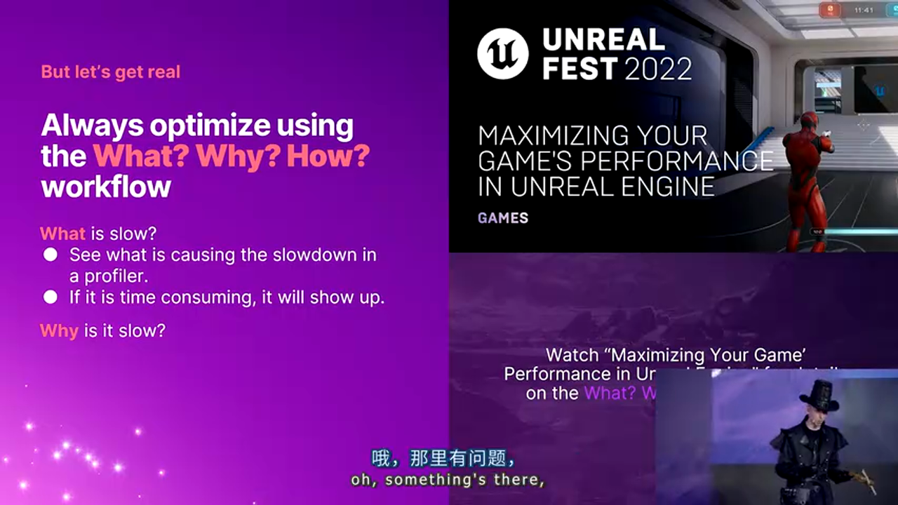
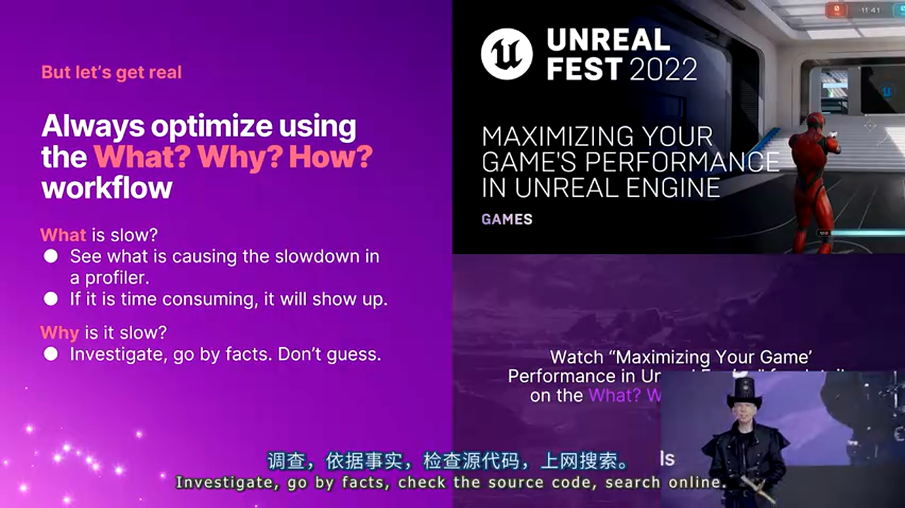

# 虚幻引擎5帧卡顿排查实战：从性能分析到问题解决的系统化方法

---


## 加入 UE5 技术交流群

如果您对虚幻引擎5的图形渲染技术感兴趣，欢迎加入我们的 **UE5 技术交流群**！

扫描上方二维码添加个人微信 **wlxklyh**，备注"UE5技术交流"，我会拉您进群。

在技术交流群中，您可以：
- 与其他UE开发者交流渲染技术经验
- 获取最新的GDC技术分享和解读
- 讨论图形编程、性能优化、构建工具流、动画系统等话题
- 分享引擎架构、基建工具等项目经验和技术难题

---

**源视频信息：** [UFSH2025]卡顿大追猎:排查逐帧瓶颈 | Ari Arnbiornsson Epic Games 开发者关系资深工程师(官方字幕)

**视频链接：** https://www.bilibili.com/video/BV1k44mzWEvq

**说明：** 本文由AI基于视频内容生成，旨在为技术社区提供便捷的文字参考资料。

---

## 引言：游戏性能的隐形杀手

帧卡顿（Frame Hitch）是游戏开发中最令人头疼的问题之一。它不仅仅是性能指标上的一个数字，更是直接影响玩家体验的关键因素。在虚幻引擎5项目中，如何系统化地识别、分析和解决帧卡顿问题，是每个性能工程师必须掌握的核心技能。


本文基于Epic Games开发者关系资深工程师Ari Arnbiornsson在UFSH2025的技术分享，深入解析帧卡顿排查的系统化方法论。从性能分析工具的使用，到问题根源的追踪，再到优化方案的制定，我们将构建一套完整的"卡顿狩猎"工作流。

> **核心观点**
> - 帧卡顿排查需要遵循"What-Why-How"的系统化方法
> - 性能分析工具是发现问题的"洞察之灯"（Lantern of Insights）
> - 源码分析是理解问题本质的"真理之源"（Source of Truth）
> - 盲目优化是最常见的错误，必须先理解问题再制定方案

## 第一部分：帧卡顿排查的系统化方法论

### 1.1 三件核心工具：洞察、真相与武器

在开始卡顿排查之前，我们需要明确三个核心工具的概念：


**第一：洞察之灯（Lantern of Insights）**

洞察之灯让我们能够"看到"卡顿的存在。这就是性能分析工具（Profiler），它能够可视化地展示性能瓶颈的位置。


> **不要盲目开火**：在没有看到目标之前就尝试优化，往往会打偏。性能分析工具能够帮助我们精确定位问题。

**第二：真理之源（Source of Truth）**

真理之源告诉我们卡顿"为什么"存在。这包括源码分析、日志查看、代码审查等手段。


通过深入理解代码的执行路径和设计意图，我们能够找到性能问题的根本原因，而不仅仅是表面现象。

**第三：选择武器（Weapon of Choice）**

当我们知道"什么"是问题（What），也知道"为什么"会出现问题（Why），最后才是选择"如何"解决问题（How）。


不同的卡顿问题需要不同的优化策略，只有在充分理解问题本质的基础上，才能选择最合适的解决方案。

### 1.2 What-Why-How工作流

在实际的性能优化工作中，我们需要遵循一个严格的顺序：


**步骤一：发现什么变慢了（What）**


在性能分析器中，耗时最长的操作会自然地显现出来。如果某个操作确实耗时，它一定会出现在profiler的top列表中。

> **关键原则**：如果操作耗时，profiler一定会显示它。如果profiler没有显示，说明这不是真正的性能瓶颈。

**步骤二：理解为什么变慢（Why）**



一旦在profiler中发现了性能热点，下一步是深入调查"为什么"会出现这个问题：

- **查看源码**：理解代码的实际执行逻辑
- **查阅文档**：了解API的设计意图和性能特性
- **搜索信息**：参考社区经验和最佳实践
- **基于事实**：不要猜测，要有数据支撑



**步骤三：制定如何修复（How）**


只有在充分理解了"什么"和"为什么"之后，才能制定有效的修复方案。这个方案应该基于前两个步骤收集的信息。

> **常见错误**：很多开发者看到性能问题后，立即开始尝试各种优化手段，如"也许这样做会有效"、"试试那个方法"。这是错误的做法。


### 1.3 盲目优化的陷阱

在性能优化中，最常见的错误就是盲目尝试：


**错误的做法**：
- 看到性能问题 → 立即尝试优化方案A
- 方案A没效果 → 尝试方案B
- 方案B没效果 → 尝试方案C
- ...

**正确的做法**：
- 使用profiler定位问题（What）
- 分析源码理解原因（Why）
- 基于理解制定方案（How）
- 量化预期收益（预期能节省多少时间）


> **黄金法则**：不要盲目修复。总是先理解问题原因，再制定解决方案。

## 第二部分：性能分析工具深度解析

### 2.1 Unreal Insights：虚幻引擎的性能分析利器

Unreal Insights是Epic Games为虚幻引擎开发的性能分析工具，它是帧卡顿排查的"洞察之灯"。


**Unreal Insights的核心功能**：

1. **时间线视图（Timeline View）**
   - 展示每一帧的执行时间
   - 可视化CPU和GPU的工作负载
   - 识别帧时间的异常峰值

2. **统计视图（Stats View）**
   - 聚合性能数据
   - 展示函数调用次数和耗时
   - 帮助定位热点函数

3. **调用栈分析（Call Stack Analysis）**
   - 深入函数调用层次
   - 追踪性能问题的源头
   - 理解代码执行路径

### 2.2 使用Stat命令进行实时性能监控

在游戏运行时，Unreal Engine提供了丰富的Stat命令用于实时性能监控：

**基础性能统计**：
- `stat unit`：显示帧时间、游戏线程、渲染线程的时间
- `stat fps`：显示帧率
- `stat rhi`：显示RHI（Render Hardware Interface）性能

**高级性能统计**：
- `stat scenerendering`：场景渲染统计
- `stat initviews`：视图初始化统计
- `stat shadows`：阴影渲染统计
- `stat lights`：光照计算统计

> **使用建议**：在性能分析过程中，结合Unreal Insights和Stat命令，能够从不同角度观察性能问题。

### 2.3 性能分析的黄金规则

在进行性能分析时，有几个关键原则需要牢记：

**规则一：关注最耗时的操作**

性能分析器会按照耗时排序显示操作。始终从最耗时的操作开始分析，而不是从最明显的操作。

**规则二：理解上下文**

一个函数在profiler中显示耗时，可能有很多原因：
- 函数本身确实慢
- 函数被频繁调用
- 函数调用的子函数慢
- 函数在等待资源（IO、网络等）

**规则三：量化预期收益**

在实施优化之前，需要能够预估优化后能节省多少时间。如果优化方案预期只能节省0.1ms，但优化成本很高，可能不值得。

> **实用技巧**：在profiler中，如果一个操作占用总帧时间的1%，优化它最多也只能提升1%的性能。如果目标是提升10%的性能，需要找到占用至少10%帧时间的操作。

## 第三部分：常见的帧卡顿原因与排查方法

### 3.1 CPU性能瓶颈

**游戏线程卡顿**：

游戏线程负责运行游戏逻辑、物理模拟、AI计算等。常见的性能瓶颈包括：

- **过多的Actor Tick**：每个Actor每帧都会执行Tick函数，如果Tick逻辑复杂，会导致严重的性能问题

```cpp
// 优化示例：减少不必要的Tick
void AMyActor::BeginPlay()
{
    Super::BeginPlay();
    // 如果不需要每帧更新，可以禁用Tick
    SetActorTickEnabled(false);
}
```

- **低效的碰撞检测**：复杂的碰撞查询会导致CPU性能下降
- **同步加载资源**：在游戏线程中进行同步IO操作会导致明显的卡顿

**渲染线程卡顿**：

渲染线程负责准备渲染命令、更新渲染状态等。常见问题包括：

- **过多的Draw Call**：每个Draw Call都有开销，过多的Draw Call会导致渲染线程瓶颈
- **动态光照计算**：每帧计算动态光源会消耗大量CPU时间
- **粒子系统更新**：大量粒子系统的CPU更新会导致性能问题

### 3.2 GPU性能瓶颈

GPU性能瓶颈通常表现为GPU时间过长，而CPU时间正常：

**常见的GPU瓶颈**：

- **像素着色器过重**：复杂的材质计算会导致像素着色器性能瓶颈
- **几何复杂度过高**：过多的三角形数量会导致顶点着色器和几何着色器瓶颈
- **纹理带宽限制**：过大的纹理或过多的纹理采样会导致带宽瓶颈
- **后处理效果**：某些后处理效果（如SSAO、Bloom）会显著增加GPU负载

### 3.3 内存分配导致的卡顿

**堆内存分配**：

在游戏运行时进行大量的堆内存分配会导致明显的卡顿：

```cpp
// 问题代码：每帧分配新内存
void UpdateParticles()
{
    for (int i = 0; i < ParticleCount; ++i)
    {
        // 每帧都会分配新内存，导致卡顿
        FVector* NewPosition = new FVector(GetRandomPosition());
        // ...
    }
}

// 优化代码：使用对象池
void UpdateParticles()
{
    for (int i = 0; i < ParticleCount; ++i)
    {
        // 重用已分配的内存
        FVector* Position = ParticlePool.GetPosition(i);
        *Position = GetRandomPosition();
    }
}
```

**碎片化问题**：

频繁的内存分配和释放会导致内存碎片化，进一步影响性能。

### 3.4 加载导致的卡顿

**同步加载**：

在游戏线程中同步加载资源会导致明显的卡顿：

```cpp
// 问题代码：同步加载
void LoadLevel()
{
    // 这会阻塞游戏线程，导致卡顿
    ULevel* Level = LoadObject<ULevel>(nullptr, TEXT("/Game/Levels/MainLevel"));
}

// 优化代码：异步加载
void LoadLevel()
{
    // 异步加载不会阻塞游戏线程
    StreamableManager.RequestAsyncLoad(
        TSoftObjectPtr<ULevel>(TEXT("/Game/Levels/MainLevel")),
        FStreamableDelegate::CreateUObject(this, &AMyGameMode::OnLevelLoaded)
    );
}
```

**流式加载**：

使用World Partition和Level Streaming可以实现无缝的流式加载，避免加载导致的卡顿。

## 第四部分：实战案例与最佳实践

### 4.1 案例一：Actor Tick性能优化

**问题描述**：

在一个开放世界项目中，游戏运行时出现明显的帧率下降。通过Unreal Insights分析，发现大量的Actor在每帧执行复杂的Tick逻辑。

**分析过程**：

1. **What（发现问题）**：Unreal Insights显示`AActor::Tick`函数占用大量CPU时间
2. **Why（理解原因）**：查看源码发现，有数千个Actor启用了Tick，每个Actor的Tick函数都在执行复杂的计算
3. **How（制定方案）**：
   - 对于不需要每帧更新的Actor，禁用Tick
   - 对于需要周期性更新的Actor，使用Timer而不是Tick
   - 将Tick逻辑从主游戏循环移到异步任务

**优化效果**：

- CPU时间减少约30%
- 帧率从45fps提升到60fps
- 内存使用略有下降（减少了定时器开销）

### 4.2 案例二：纹理流送优化

**问题描述**：

游戏中出现周期性的卡顿，每几秒发生一次。通过分析发现，卡顿与纹理流送相关。

**分析过程**：

1. **What**：Stat命令显示在卡顿时，纹理流送线程占用大量CPU时间
2. **Why**：分析发现，游戏在短时间内请求加载大量高分辨率纹理，超过了流送系统的处理能力
3. **How**：
   - 调整纹理流送池大小
   - 优化纹理Mip设置
   - 使用更激进的LOD策略

**优化效果**：

- 周期性卡顿基本消除
- 纹理内存使用更加稳定
- 加载时间略有增加，但可接受

### 4.3 性能优化的最佳实践

**实践一：建立性能基准**

在进行优化之前，需要建立性能基准：

- 记录优化前的关键性能指标
- 定义性能目标（如：稳定60fps）
- 定期测试确保性能不会回退

**实践二：使用版本控制**

所有性能优化代码都应该提交到版本控制：

- 方便回退不成功的优化
- 便于团队协作和代码审查
- 记录优化的历史

**实践三：持续监控**

性能优化不是一次性的工作：

- 在CI/CD中集成性能测试
- 定期进行性能分析
- 建立性能回归测试

**实践四：团队协作**

性能优化需要团队协作：

- 分享性能分析结果
- 建立性能优化文档
- 定期进行性能评审

## 第五部分：高级技术与工具

### 5.1 自定义性能统计

Unreal Engine允许开发者添加自定义的性能统计：

```cpp
// 添加自定义统计
DECLARE_CYCLE_STAT(TEXT("MyCustomOperation"), STAT_MyCustomOperation, STATGROUP_Game);

void MyFunction()
{
    SCOPE_CYCLE_COUNTER(STAT_MyCustomOperation);
    // 你的代码
}
```

**使用场景**：
- 监控特定系统的性能
- 对比不同实现的性能差异
- 追踪性能回归

### 5.2 GPU性能分析

除了CPU性能分析，GPU性能分析同样重要：

**工具**：
- **RenderDoc**：捕获和分析GPU渲染调用
- **NVIDIA Nsight Graphics**：NVIDIA GPU的深度性能分析
- **AMD Radeon GPU Profiler**：AMD GPU的性能分析工具

**分析方法**：
1. 捕获一帧的GPU命令
2. 分析每个Draw Call的耗时
3. 检查像素着色器和顶点着色器的性能
4. 识别GPU瓶颈

### 5.3 内存分析

内存问题也可能导致卡顿：

**工具**：
- **Unreal Insights Memory Profiler**：内存使用分析
- **Memory Report**：生成详细的内存使用报告

**关键指标**：
- 内存分配频率
- 内存峰值使用
- 内存碎片化程度
- 泄漏检测

## 第六部分：实战总结与建议

### 6.1 方案对比

> **方案A：基于Profiler的性能优化**
> - 🟢 优势：能够精确定位性能瓶颈，优化效果可量化
> - 🔴 劣势：需要深入理解代码，优化周期较长
> - 🎯 适用场景：长期项目、性能关键系统、团队有性能分析经验
>
> **方案B：基于经验规则的性能优化**
> - 🟢 优势：快速实施，适用于常见问题
> - 🔴 劣势：可能过度优化，无法解决根本问题
> - 🎯 适用场景：快速原型、明确的问题、性能要求不严格的项目

### 6.2 避坑指南

**坑一：过早优化**

在性能问题不明确的情况下就开始优化，往往导致：
- 浪费开发时间
- 代码复杂度增加
- 引入新的bug

**解决方案**：始终遵循What-Why-How工作流，先理解问题再优化。

**坑二：忽视上下文**

同样的代码在不同环境下性能表现可能完全不同：
- 硬件配置差异
- 游戏状态差异
- 数据规模差异

**解决方案**：在目标平台上测试，使用真实数据，考虑边界情况。

**坑三：优化局部而非整体**

优化单个函数可能对整个系统没有明显影响：
- 函数可能不是真正的瓶颈
- 优化可能带来副作用
- 系统其他部分可能更值得优化

**解决方案**：关注整体性能，优先优化最耗时的部分。

**坑四：忽视内存影响**

CPU和GPU优化可能影响内存使用：
- 缓存优化可能增加内存使用
- 数据结构优化可能改变内存布局
- 异步加载可能增加内存峰值

**解决方案**：同时监控CPU、GPU和内存，平衡各项指标。

### 6.3 最佳实践总结

**开发阶段**：

1. **早期建立性能基准**：在项目初期就建立性能基准，定期测试
2. **使用性能预算**：为各个系统设定性能预算，避免过度优化
3. **持续集成性能测试**：在CI/CD中集成性能测试，及时发现问题

**分析阶段**：

1. **使用正确的工具**：根据问题类型选择合适的分析工具
2. **建立性能分析流程**：标准化性能分析流程，提高效率
3. **记录分析结果**：记录性能分析结果，便于后续参考

**优化阶段**：

1. **量化优化效果**：每次优化都要量化效果，确保有价值
2. **考虑副作用**：评估优化的副作用，避免引入新问题
3. **代码审查**：性能优化代码也要经过代码审查

**维护阶段**：

1. **持续监控**：持续监控性能指标，及时发现回归
2. **定期评审**：定期进行性能评审，优化工作流
3. **知识分享**：分享性能优化经验，提升团队能力

## 结语：成为优秀的性能工程师

帧卡顿排查是一门艺术，需要系统化的方法、深入的理解和丰富的经验。通过本文介绍的方法，我们能够：

- 系统化地识别性能问题
- 深入理解问题的根本原因
- 制定有效的优化方案
- 避免常见的优化陷阱

记住，性能优化不是一次性的工作，而是一个持续的过程。只有不断学习、实践和总结，才能成为优秀的性能工程师。

> **最后提醒**：不要盲目优化。总是先理解问题（What和Why），再制定方案（How）。这是性能优化的黄金法则。

---

**延伸阅读**：
- [Unreal Engine Performance and Profiling](https://docs.unrealengine.com/5.0/en-US/performance-and-profiling-in-unreal-engine/)
- [Epic Games Developer Community](https://dev.epicgames.com/)
- [Unreal Fest Stockholm 2025](https://www.unrealengine.com/unrealfest)

**关于作者**：  
本文基于Ari Arnbiornsson在UFSH2025的技术分享整理而成，由AI辅助生成并经过技术校对。如有疑问或建议，欢迎在UE5技术交流群中讨论。


