# 移动端渲染管线优化实战：《洛克王国：世界》的技术突破之路

---

## 加入 UE5 技术交流群

如果您对虚幻引擎5的图形渲染技术感兴趣，欢迎加入我们的 **UE5 技术交流群**！

扫描上方二维码添加个人微信 **wlxklyh**，备注"UE5技术交流"，我会拉您进群。

在技术交流群中，您可以：
- 与其他UE开发者交流渲染技术经验
- 获取最新的GDC技术分享和解读
- 讨论图形编程、性能优化、构建工具流、动画系统等话题
- 分享引擎架构、基建工具等项目经验和技术难题

---

## 关于本文

**源视频信息：**
- **标题**：[UFSH2025]《洛克王国:世界》移动端管线设计与优化 | 朱谷才 腾讯游戏魔方工作室 客户端开发
- **时长**：26分25秒（1585秒）
- **视频链接**：https://www.bilibili.com/video/BV1XK1YB4EyJ
- **内容类型**：技术演讲

**说明**：本文由AI技术自动生成，基于视频字幕和关键帧截图整理而成。文章对原始内容进行了深度技术解析和扩展，旨在帮助中文开发者更好地理解移动端渲染管线优化的实战经验。

---

## 导读

> 在移动端上实现高质量渲染效果，需要在高性能和美术表现之间找到平衡点，这需要对渲染管线进行深度定制。

> RGB10A2 格式配合定点数编码技术，可以在几乎零开销的情况下实现角色与场景的像素级区分，这是移动端渲染优化的一次创新实践。

> 通过 FrameBuffer Fetch 特性，将多个后处理 Pass 合并为单个 Pass，可以显著减少显存带宽开销，这是现代移动 GPU 架构优势的充分利用。

**前置知识**：本文面向有一定 UE 渲染管线基础的开发者，需要了解 Forward Rendering、Screen Space Effects、HDR 格式等概念。建议对移动 GPU 架构（Tile-Based Rendering）有基本认识。

---

## 项目背景与技术挑战

《洛克王国：世界》是一款开放世界的经营收集养成游戏，玩家可以在大世界中收集、经营并与精灵成为伙伴，一起探索、战斗。作为一款即将在 Q4 公测的游戏，需要在移动端和 PC 端同时上线。

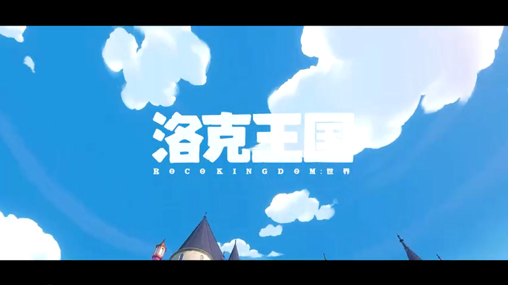

### 游戏特性带来的渲染挑战

项目基于 Unreal Engine 4.26 引擎开发，选用了移动端的前向管线（Forward Rendering）作为基础渲染管线，并进行了深度改造和优化。游戏具有以下特点：

**1. 高度风格化的美术画风**

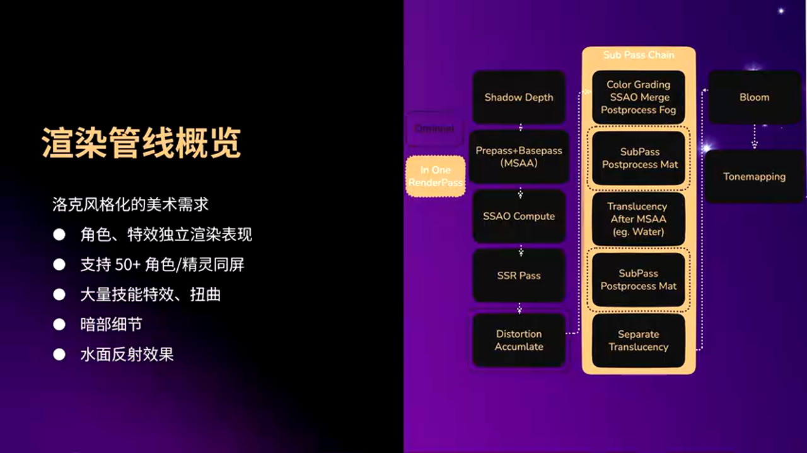

游戏采用非常风格化的美术风格，这要求在渲染管线中支持特殊的视觉效果处理。

**2. 精灵是核心要素**

精灵在游戏中非常重要，无论在大世界的精灵生态还是实际对战中，都需要将精灵表现好。这要求渲染管线能够对角色和精灵进行特殊处理。

**3. 完整的昼夜循环和天气系统**

游戏具有完整的昼夜循环以及复杂的天气系统，需要在移动端实现完整的 TOD（Time of Day）系统，包括动态实时光照和动态实时阴影变化。

**4. 多人游戏支持**

游戏支持多人同时游玩，这意味着场景中可能同时存在大量角色和精灵。

### 美术需求驱动管线改造

基于这些游戏特性，美术提出了以下核心需求：

**需求一：角色和精灵的渲染表现需要独立于场景**

为了更好服务于风格化需求，角色和特效的渲染表现需要独立于场景。例如，在播放技能时，需要压暗场景然后突出角色和精灵；在做超分锐化时，需要跳过角色，让角色不进行锐化，然后对场景做锐化。

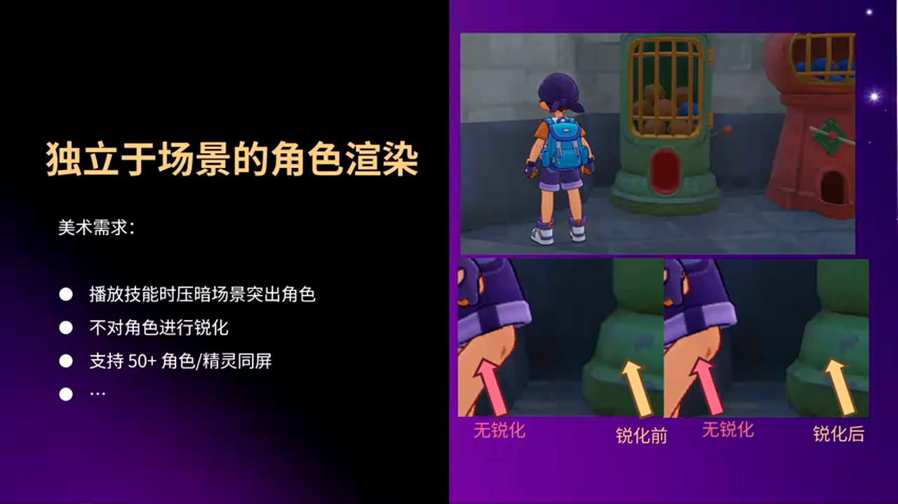

**需求二：支持50个以上的角色和精灵同屏数量**

在移动端上需要支持50个以上的角色和精灵同屏数量，这对性能提出了巨大挑战。

**需求三：丰富的技能特效需求**

游戏中有大量关于技能特效相关的需求，这要求在渲染管线中能够灵活处理特效。

**需求四：场景暗部细节和反射效果**

美术希望有更好的暗部细节，以及水面反射等表现。

### 管线改造与性能矛盾

针对这些需求，团队对原有移动端前向管线做了改造：

- 增加了屏幕空间反射（SSR）
- Color Grading 等新的渲染特性
- 在移动端实现了完整的 TOD 系统
- 实现了动态点光源
- 实现了天气系统

虽然美术需求得到了满足，整个游戏的渲染质量也提升了，但随之而来的是在移动端上带来非常大的渲染开销和压力。因此，团队面临一个巨大挑战：既要满足这些复杂、有难度、开销大的美术需求，同时也要保证移动端管线能够在现在的主流设备上流畅运行（主流设备跑到30帧，更好设备能跑到60帧）。

本次分享主要针对在开发和优化过程中遇到的一些具体问题，以及具体的优化思路。

---

## 第一部分：Stencil 方案 - 角色与场景的像素级区分

### 需求分析

如前所述，项目需要一个关键能力：在渲染管线中区分像素是属于角色还是场景。这是实现角色场景独立渲染的基础。

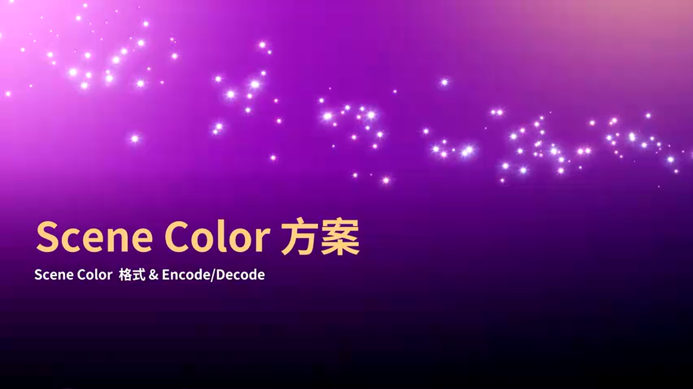

最容易想到的方案，也是最开箱即用的方案，是使用 Unreal 的 Custom Depth。通过设置角色的 Custom Stencil，然后后续 Pass 在采样 Custom Stencil 来区分像素属于角色还是场景。

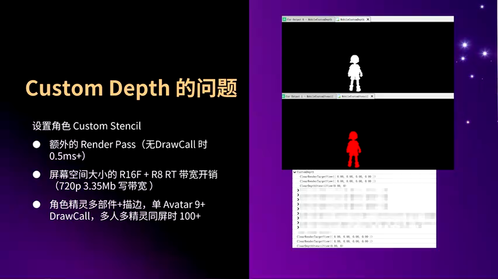

### Custom Depth 方案的性能问题

但采用这个方案在移动端上会有一些性能问题：

**问题一：Custom Depth 是一个 Extra Render Pass**

即使在没有任何 Draw Call 的情况下，Custom Depth 在移动端上也要消耗 0.5 毫秒以上的开销。

**问题二：带宽开销**

Custom Depth 需要申请两张屏幕空间大小的贴图。在 720P 分辨率下，这两张贴图的带宽开销也要 3.5MB 以上。

**问题三：Draw Call 爆炸**

这是最严重的问题。因为角色和精灵在游戏中都是一些比较精细的多部件的骨骼模型，同时他们都带有描边的效果。换句话说，他们就会有很多很多的 Draw Call 开销。

如右图的例子中，只有一个 Avatar 的情况下，也需要9个 Draw Call。那么在很多人、很多精灵同屏的情况下，这个 Draw Call 数量可能会爆炸到 100 多，甚至 200。

### RGB10A2 方案的创新思路

团队采取的解决思路是：选用 RGB10A2 来作为 Stencil 的格式，然后通过在 BasePass 的时候，角色的材质将 1 写入到 Alpha 通道中，后续 Pass 通过采样 BasePass 的 Stencil 的 Alpha 通道来从来去判断像素属于角色还是场景。

最后 BasePass 输出的 Stencil 就像右边的图示，类似于把角色给抠了出来。

使用这个格式之后，Custom Depth 带来的那些开销通通就不需要了：既不需要 Alpha 的 Render Pass，也不需要 Alpha 的带宽，也不需要 Alpha 的 Draw Call。

### HDR 显示问题与定点数编码

但是使用 RGB10A2 之后，还需要解决一些显示上的问题。因为这是一个 UNORM 的颜色格式，这个颜色格式只能表示 0 到 1 的颜色范围。

大家可以看下面的这三张图。在场景中，我们摆放了一个较亮的物体。如果这个时候采用的是 Float-RGBA 的颜色格式，那么此时高亮的颜色是可以得到正确的保护，后续 Bloom 的效果也是正确的。但改用 RGB10A2 之后，会发现高亮的亮度被 Clamp 到了 1，于是后续的 Bloom 效果以及其他的一些颜色表现都是错误的。

在这里，团队的解决思路是通过一个类似定点数的编码和解码：

通过这样子的一个简单的编码和解码之后，我们就能让这个 Stencil 格式的实际保存颜色范围可以拓展到一个 Color Range。当设置了一个合适的范围之后，不论场景中的高亮颜色能得到正确的保存，同时后续的 Bloom 以及其他的一些颜色的计算也都是正确的。

### 小数精度保护与开根号优化

需要解决的第二个问题是小数精度的问题。因为对于定点数这样子的一个颜色格式来说，同样的比特位的情况下，如果想表示更大的值的范围，那么它的小数精度便会受到损失。

不知道大家能不能看清楚，左边的低章图在红色箭头上会有一个类似色阶的表现。这就是因为我们在扩大了颜色范围之后，靠近于零的小数的精度就没有得到很好保护。

在这里，团队的解决思路是做进一步的编码和解码：进行开根号来更好的保护靠近零的小数精度。这样最后的结果就如最右边的这张图，大家可以看到，天空球上面的色阶问题就得到了很好的修复。

### 方案总结

总结一下这个章节：通过选用了 RGB10A2 这一个颜色格式，并且通过一定的编码和解码，使得在移动端的前向管线上，几乎免费地获得了区分像素是角色还是场景的能力。

---

## 第二部分：后处理 Fog 方案 - 与 SSAO 的兼容性优化

在介绍完 Stencil 的方案之后，接下来介绍的是后处理 Fog 方案。

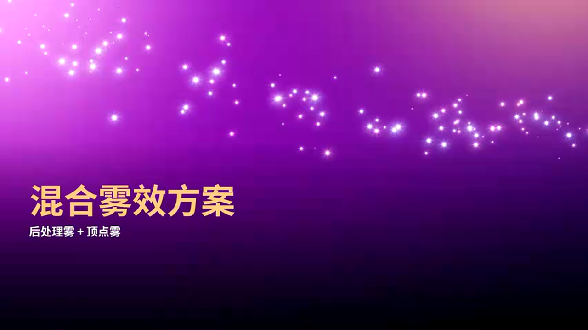

### SSAO 引入的需求

前面提到过，团队希望在场景中增加更多的暗部细节，所以决定在前向管线中引入屏幕空间 AO（SSAO）。

但是屏幕空间 AO 跟原来的前向管线的顶点 Fog 的计算是有冲突的。大家可以看右边的一个流程图，可以看到在不采用 Forward Pass 的情况下，只有在 BasePass 渲染完结束之后，我们才能拿到完整的场景的深度，从而去计算屏幕空间 AO。那么在后处理的时候，我们再把 AO 合入，就会出现最后这张图中红色箭头处指向的地方，AO 把 Fog 的颜色给压暗了，这些表现是错误的。

### 后处理 Fog 方案

为了解决这个问题，团队就需要让 Fog 的计算在屏幕空间 AO 之后。所以采用了后处理 Fog 的方案：在 BasePass 的时候不去计算顶点 Fog，然后在 SSAO 合入之后，利用场景深度去计算 Fog 的颜色，然后再进行合入。

可以看到右边这个流程图，最后的颜色输出就正确了，屏幕空间的 AO 就没有压暗 Fog 的颜色。

### 性能优势

同时采用后处理 Fog 在一些压力场景下，也会获得一个更好的性能。因为项目有很多压力比较大的顶点压力比较高的场景（有很多精灵、很多角色同屏的情况），此时采用后处理 Fog 还能优化相当于 10% 的 BasePass 顶点着色器的时间。

### 混合方案的策略

团队依旧有一部分材质和物体的渲染保持使用顶点 Fog：

**1. 天空球**

因为天空球本身自然不会受到屏幕空间 AO 的影响，同时它的顶点着色器开销通常来说会是像素着色器开销的几十分之一。所以通过天空球继续保持用顶点 Fog 的方式，来进一步节省移动端上的 GPU 耗时。

**2. 后处理 Fog 合入之后渲染的物体**

同样，在后处理 Fog 合入之后渲染的物体，这个时候也需要去采用顶点 Fog 来进行 Fog 的计算。但通常来说，这部分物体的模型都比较简单，所以开销也非常可控。

**3. 自定义顶点 Fog**

团队也拓展了材质的材质编辑器，去支持自定义的顶点 Fog，从来能让美术去定制更多的一些 Fog 效果。

比如右边的图中，团队给雷暴云定制了一个过渡的 Fog 效果，使得它的底部的 Fog 跟山体是连接的，但是顶部还是有一个更有区分的颜色。

---

## 第三部分：SubPass 优化 - 单 Pass 多任务的极致优化

这个章节的名字叫 SubPass。这个章节会给大家介绍，如何在一个 Render Pass 里面去尽可能做更多的渲染任务。

### 渲染需求分析

还是从需求出发。大家主要看右边的图，应该说这里应该是后处理的需求，应该是 BasePass 之后的一些渲染需求。右边第一张图是 BasePass 的输出，接着我们要对颜色做一个解码，然后去合入屏幕空间 AO，然后后处理 Fog 还有做 Color Grading，接着会去渲染透明物体（通常是一些水面还有一些其他的半透明），有的时候会有一些后处理材质（在这里是 Separate Translucency 队列的渲染，通常来说会是一些不想受到后处理影响的特效），在最后输出的颜色中会带上 Bloom、Distortion 还有 Tone Mapping 的结果。

### 原有实现的性能问题

在原有管线的实现中，实现前面这些复杂的需求，最大的问题就是会频繁地去切换 Render Pass。

具体大家可以看右边的图。这个图有两列，左边的这一列是完成前面的需求所需要完成的渲染工作，右边的一列就是在完成这些渲染工作的时候，需要往显存中去写入的内容。红色箭头就表示我们需要从 Tile Memory 往显存中去写入，绿色箭头就表示有渲染的工作需要去读取或者加载显存中的东西。

可以看到，团队刚开始已经做了一部分的优化，已经把 Color Grading 的着色器跟后续的半透明的渲染合并成了一个 Render Pass。但在这里依旧会需要有整整五个 Render Pass，才能完成前面的需求，并且会导致有四次中间的显存的写回。

那么大家都知道在移动端上，频繁的切换 Render Pass 和显存写回会导致大量的带宽开销以及耗时开销。在这种复杂的场景下，手机就很容易出现发热、调频然后功耗增大这些问题。

### 问题根源分析

团队分析一下前面的问题是怎么造成的，主要就是由 Distortion 以及后处理材质导致了 Pass 的打断。

**问题一：后处理材质**

团队明确一点就是美术在这里的需求是：需要在这里插入一个后处理材质，他们去影响前面场景的渲染，但是不会影响后面的特效。因为后处理材质需要去采用之前的场景颜色，并且输出自己的处理之后的结果，就会把有机会合并成一个 Render Pass 的工作给拆成了三个 Pass。

团队在发现了这个性能问题之后，和美术一起讨论分析有什么优化的方向。最后发现在项目里面，有一大部分的后处理材质，他们是不需要去采用周围领域的像素。这就意味着有一定的优化空间。

在移动端上可以通过 FrameBuffer Fetch 来获取当前像素的颜色。团队继续这一点开发了 SubPass 的后处理材质，跟美术使用，通过 FrameBuffer Fetch 来取代采样 Post Process Input 的方式，来进行后处理的计算和中间前面颜色的一些获取。

大家可以看到右边的图中，通过将后处理材质给替换成 SubPass 的后处理材质，就能让这些渲染工作都在 Tile Memory 上执行完成之后，才需要去切换 Render Pass，才需要去把自己的颜色输出给写到显存中，从而减少了显存带宽的开销。

团队搭建了一个测试场景，然后用 iPhone X 做了一个性能测试。在极限的场景下，这一部分的显存带宽得到了 23% 的优化，GPU 耗时得到了 31.6% 的优化。在实际的游戏场景中，也能优化 5.5% 的 GPU 时间，在 12.8% 的显存带宽，以及 16.5% 的读带宽。

**问题二：Distortion**

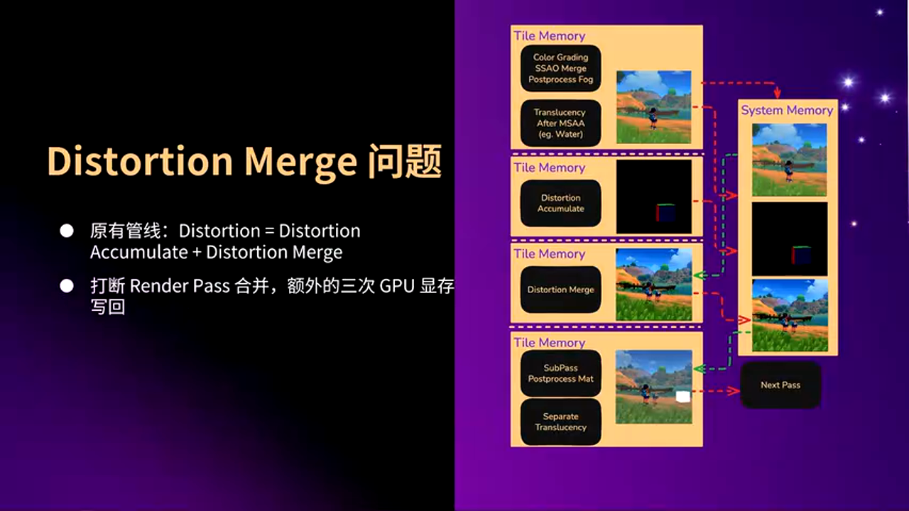

第二个导致 Render Pass 被打断的原因就是 Distortion。在原有管线实现中，Distortion 是有两个部分组成的，分别是 Distortion 的累加以及 Distortion 的合并。从大家也可以主要看右边的这个流程图，就很好地展示了为什么 Distortion 会去打断 Render Pass。

在这里，团队的优化思路是：将 Distortion 的计算放到了后续的 Bloom 以及 Tone Mapping 中。因为 Bloom 跟 Tone Mapping 他们也有需要去采样 Stencil 的一个计算，所以通过这样子的方式，就去掉了无需单独的一个 Distortion 合并 Pass，合并的计算就在 Bloom 以及 Tone Mapping 中进行。

此时就可以发现，它就不会去打断前面已经合并的 Render Pass。这个时候在整个渲染流程中，就只有 Distortion 累加的一个结果的往显存中的写回。

这样子的一个代价是特效也会被扭曲，但是在游戏中，这样子的表现是可以接受的。

同样，团队也搭了一个简单的测试场景，去测试优化结果。同样是使用 iPhone X，GPU 耗时能优化 13.8%，然后读显存带宽也能够优化约 30%。

### 优化前后对比

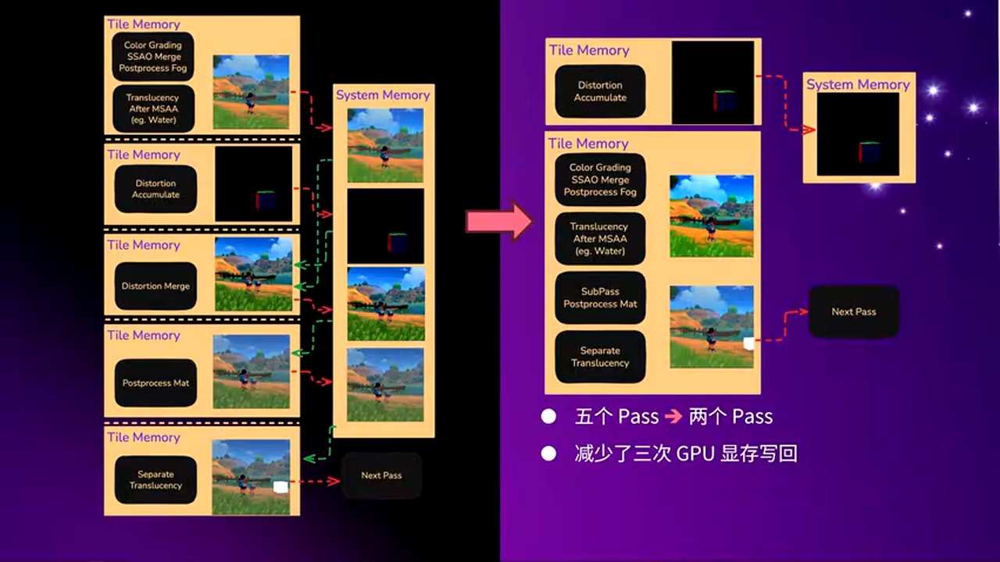

这是整个优化前后的一个对比。大家可以看到，通过将普通的后处理材质替换成 SubPass 的后处理材质之后，同时将 Distortion 的合并计算放到了后续的 Bloom 以及 Tone Mapping 中，就从最左边需要 5 个 Render Pass、造成 4 次的显存写回，优化到了右边中只需要 2 个 Render Pass、只有一次的显存写回。

就只需要相当于很少的一个 Render Pass 切换，就实现了从 Color Grading 到屏幕空间 AO、后处理 Fog、然后半透明的渲染、后处理材质以及 SubPass 的 Distortion 队列的渲染，通通都在一个 Render Pass 里面去实现了。

---

## 第四部分：Deferred HDR 管线 - 极致优化的终极方案

那么合并 Pass 这个东西来说是会让人上瘾的。既然已经做了，那么能不能做到更多？能不能在把之前前面的 PrePass 还有后面的 Tone Mapping 也放到一起？这就引出了最后想跟大家分享的内容：团队实现了一个 Deferred HDR 管线。

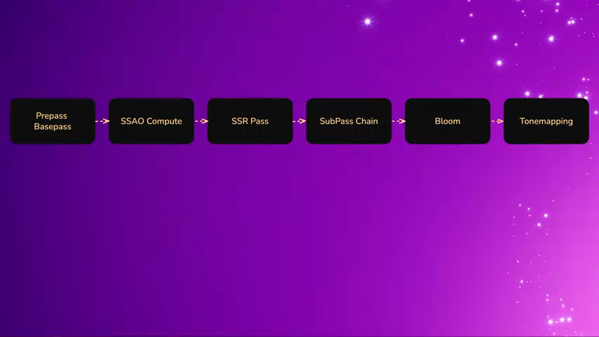

实现了一个 Render Pass 从 PrePass 到 Tone Mapping 的计算。

### 实现思路

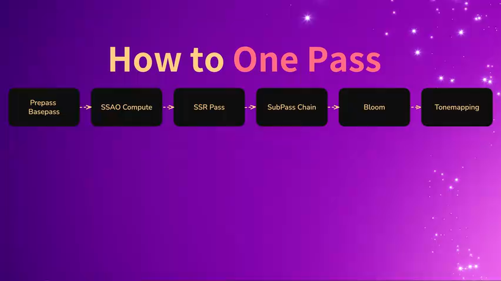

因为前面也提到过了，整个合并 Pass 的思路主要是通过利用移动端上的 FrameBuffer Fetch 的特性，来去获取之前像素的颜色值，然后去进行一些像素的计算。

那么有一些需要去采样周围领域像素的计算，无论是颜色还是深度的，就去掉了，比如屏幕空间 AO、然后屏幕空间反射以及 Bloom 等等。去到这些之后，就能通过 FrameBuffer Fetch 以及 Depth Fetch 使得所有的计算都在一个 Render Pass 里面，都在 Tile Memory 上面进行计算。

### 视觉效果保留

虽然去掉了屏幕空间 AO、屏幕空间反射以及 Bloom 这些效果，但保留了画面影响比较大的一些后处理效果，比如后处理 Fog、比如 Color Grading、比如 Tone Mapping。

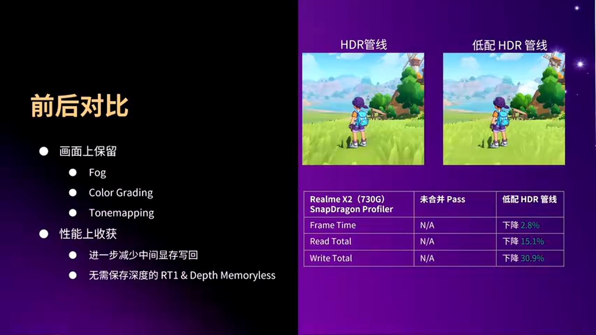

大家可以看右边的两张图的对比，在开启了 Deferred HDR 管线之后，画面的大体的表现风格跟表示的场景都是可以得到一个很好的保留的。

### 性能优化效果

开启 Deferred HDR 管线之后，可以在性能上进一步减少中间带宽的写回。同时这个时候，就无需去保存，不需要有一张用来保存深度的 Render Target。团队的 Deferred HDR 管线也可以设置成 Memoryless，从而进一步减少写带宽的开销。

通过这样子的一个进一步的优化，能使得项目在更低端的机器上也能流畅运行。

团队用 RenderDoc 做了一个性能对比。再去掉了屏幕空间 AO、屏幕空间反射以及 Bloom 之后，对比了合并 Pass 前后的一个性能数据：真实帧优化了 3%，然后读带宽优化了 15%，然后写带宽优化了最多，优化了 30%。

---

## 实战总结与建议

### 方案对比

> **方案 A：Custom Depth Stencil**
> - 🟢 优势：开箱即用，无需额外开发
> - 🔴 劣势：需要额外 Render Pass，带宽开销大（720P 约 3.5MB），Draw Call 开销巨大（同屏 50+ 角色可能达到 100-200 Draw Call）
> - 🎯 适用场景：PC 平台或角色数量较少的场景

> **方案 B：RGB10A2 Stencil（项目采用方案）**
> - 🟢 优势：几乎零开销（无额外 Pass、带宽、Draw Call），性能优秀
> - 🔴 劣势：需要定制编码/解码逻辑，需要处理 HDR 显示问题和精度问题
> - 🎯 适用场景：移动端前向渲染管线，需要大量同屏角色的项目

### 避坑指南

**1. HDR 颜色范围问题**

在使用 RGB10A2 格式时，需要注意 UNORM 格式只能表示 0-1 的颜色范围。如果场景中有高亮物体（如 Bloom 源），必须使用定点数编码来扩展颜色范围，否则会导致高亮区域被 Clamp，后续 Bloom 等效果错误。

**解决方案**：使用定点数编码（如公式：`encoded = color / range`），根据场景最大亮度设置合适的 range 值。

**2. 小数精度损失**

扩大颜色范围会导致小数精度损失，特别是在接近 0 的区域会出现色阶（Banding）现象。

**解决方案**：使用开根号编码（`sqrt(color / range)`）来更好地保护靠近零的小数精度。

**3. FrameBuffer Fetch 兼容性**

不是所有移动 GPU 都支持 FrameBuffer Fetch，需要检查设备支持情况。目前主流移动 GPU（如 Mali、Adreno 等）都支持，但仍需做好降级方案。

**4. SubPass 材质限制**

SubPass 后处理材质不能采样周围领域的像素，这限制了某些后处理效果的使用。需要和美术团队沟通，明确哪些效果可以用 SubPass 实现，哪些必须使用传统的后处理材质。

**5. Distortion 与特效扭曲**

将 Distortion 合并计算延迟到 Bloom/Tone Mapping 中会导致特效也被扭曲。需要在视觉效果和性能之间做权衡，确保扭曲效果在可接受范围内。

### 最佳实践

**1. 渐进式优化策略**

建议采用渐进式优化：先实现基础功能（如 RGB10A2 Stencil），然后逐步合并 Pass（SubPass 后处理材质、Distortion 合并），最后考虑 Deferred HDR 管线。这样可以确保每一步的优化效果，并便于调试。

**2. 性能监控指标**

重点关注以下性能指标：
- Render Pass 数量
- 显存带宽（读写）
- GPU 耗时（特别是 BasePass 和 Post Process）
- Draw Call 数量

**3. 混合方案的使用**

不要一刀切，要根据具体情况使用混合方案：
- 天空球继续使用顶点 Fog（顶点着色器开销远小于像素着色器）
- 后处理 Fog 合入后渲染的简单物体使用顶点 Fog
- 复杂场景使用后处理 Fog

**4. 美术与程序的协作**

性能优化需要美术和程序的紧密协作：
- 明确哪些效果可以用 SubPass 实现
- 理解性能优化的必要性
- 在视觉效果和性能之间找到平衡点

**5. 测试设备的选择**

在 iPhone X 等主流设备上进行性能测试，确保优化效果在实际设备上可复现。同时也要在更低端设备上测试，确保在目标设备上能流畅运行。

---

## 结语

《洛克王国：世界》的移动端渲染管线优化是一个典型的在限制条件下追求高质量渲染效果的案例。通过 RGB10A2 Stencil、后处理 Fog、SubPass 优化以及 Deferred HDR 管线等一系列技术手段，团队在满足美术需求的同时，也在性能上达到了可接受的水平。

这些优化思路不仅适用于《洛克王国：世界》项目，也可以为其他移动端游戏项目提供参考。关键是要深入理解移动 GPU 架构的特点（如 Tile-Based Rendering、FrameBuffer Fetch 等），充分利用硬件特性，在性能和视觉效果之间找到最佳平衡点。

---

**关于作者**：本文基于朱谷才在 UFSH2025 的技术分享整理而成，由 AI 辅助生成并经过技术校对。如有疑问或建议，欢迎在 UE5 技术交流群中讨论。

