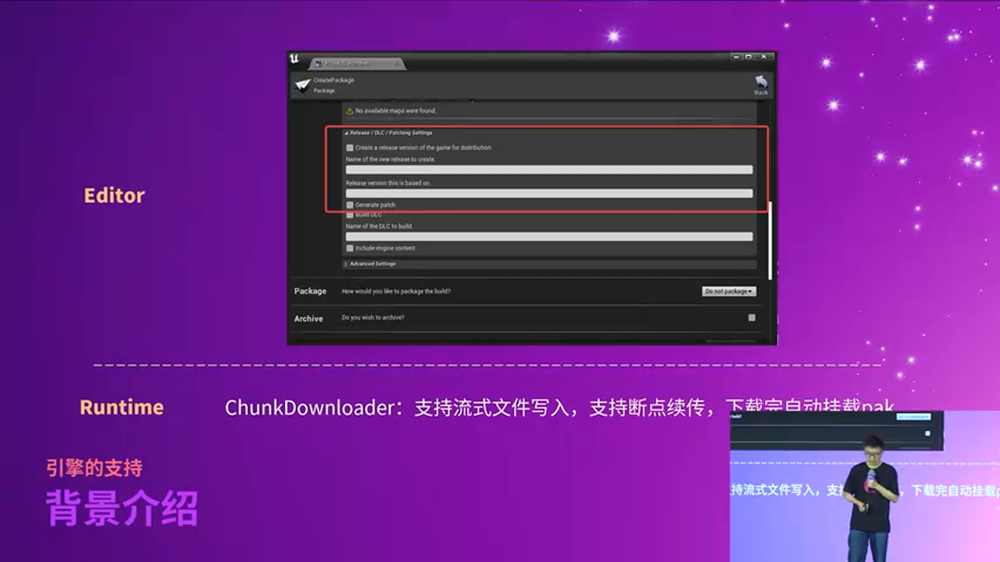
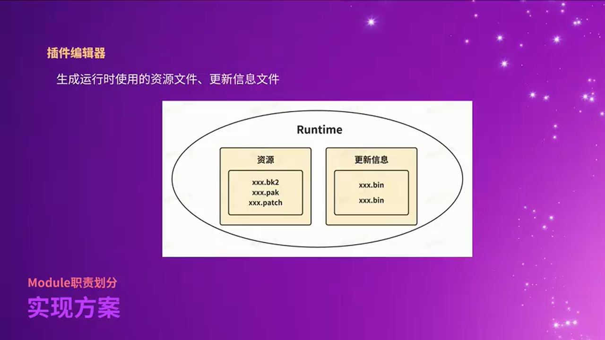
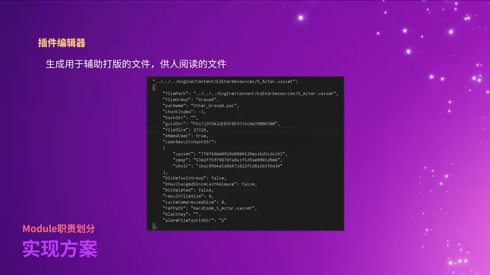
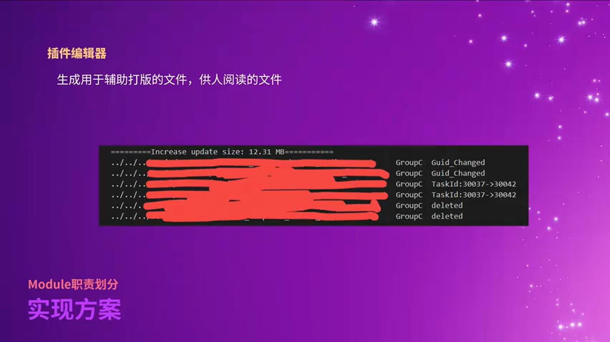
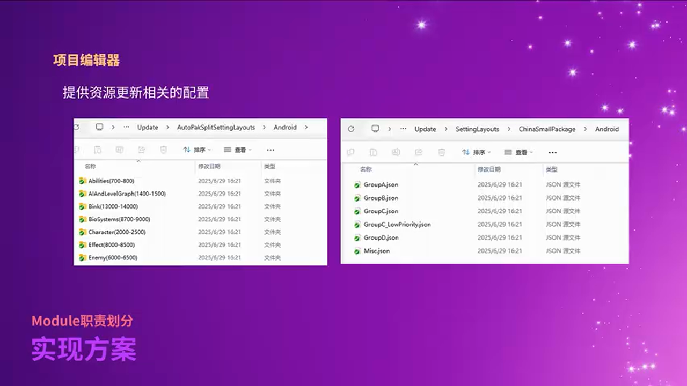
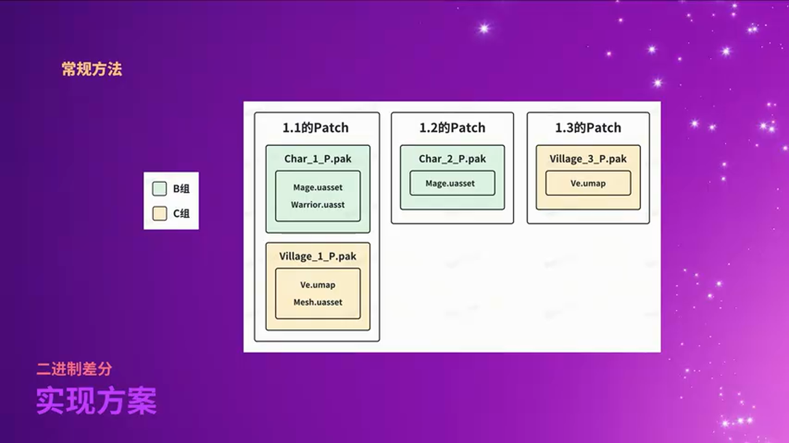
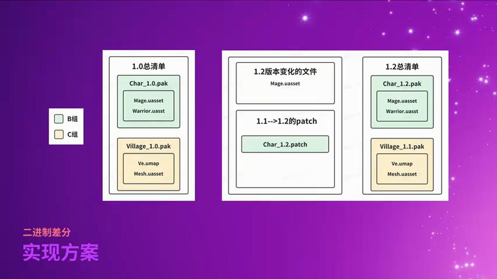
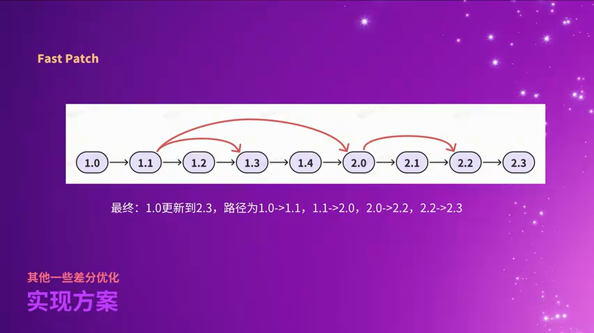
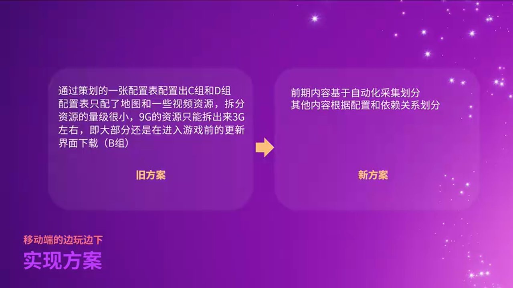
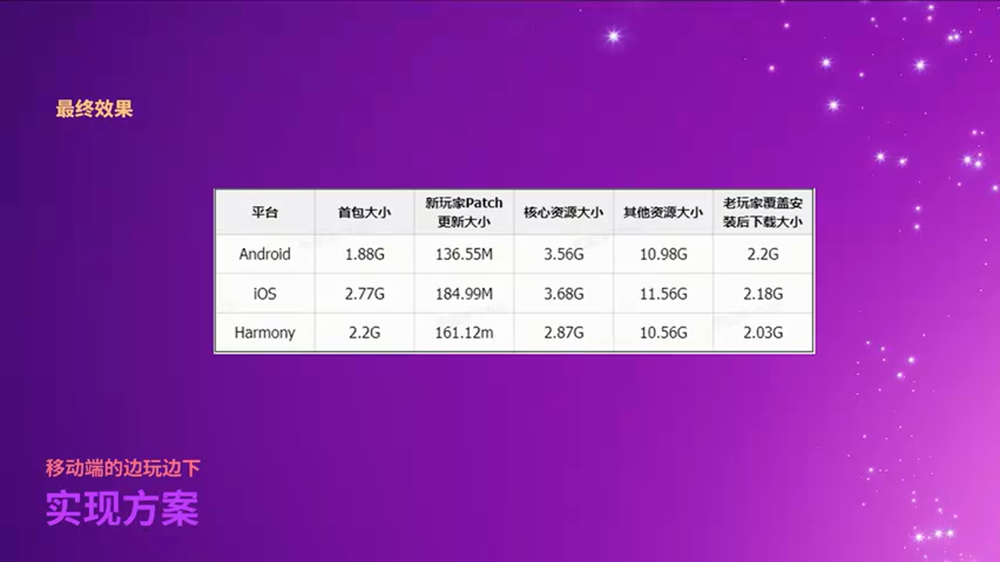

# UE引擎多平台资源热更新系统：从架构设计到生产实践

---


## 加入 UE5 技术交流群

如果您对虚幻引擎5的图形渲染技术感兴趣,欢迎加入我们的 **UE5 技术交流群**!

扫描上方二维码添加个人微信 **wlxklyh**,备注"UE5技术交流",我会拉您进群。

在技术交流群中,您可以:
- 与其他UE开发者交流渲染技术经验
- 获取最新的GDC技术分享和解读
- 讨论图形编程、性能优化、构建工具流、动画系统等话题
- 分享引擎架构、基建工具等项目经验和技术难题

---

**本文基于视频内容生成**
- 视频标题: [UFSH2025]基于UE引擎的多平台资源更新方案 | 阵雨 字节晶核 游戏客户端开发
- 视频链接: https://www.bilibili.com/video/BV14RU7BJEUc
- 本文由 AI 辅助生成,旨在为读者提供结构化的技术解析

---

## 导读

> **核心观点**:
>
> 1. 对于多平台、高频更新的 3D MMO ARPG,传统的资源更新方案会导致严重的磁盘冗余和下载体积膨胀
> 2. 二进制差分(Binary Diff)配合分组分任务的资源管理,可以将包外资源的更新体积减少 70% 以上
> 3. 通过自动化采集 + 配置驱动的边玩边下(Progressive Download)方案,可以将移动端的二次下载从 6GB 优化至 100MB 左右

**前置知识**: 本文适合熟悉 Unreal Engine PAK 文件系统、了解游戏资源打包流程的开发者阅读。需要对 UE 的 IoStore、PlatformFile 系统有基本了解。

---

## 背景与痛点:为什么需要重新设计资源更新系统?


字节跳动的《晶核》是一款使用 UE4 引擎开发的多平台(PC、移动端、主机)、多地区发行的内容向 3D MMO ARPG。这个项目特性决定了它的资源更新系统面临三大核心挑战:

**1. 多平台适配的复杂性**

不同平台对资源更新有不同的限制和要求:
- iOS 平台:代码(C++ DLL)不能热更新,必须通过整包更新
- Android 平台:包体大小有严格限制(Google Play 初始 APK 限制 150MB,扩展文件最多 2GB)
- PC 平台:Steam 等平台有自己的 Patch 分发系统
- 主机平台:索尼/微软/任天堂都有各自的审核流程和技术限制

**2. 高频更新与资源体量的矛盾**

作为内容向 MMO ARPG,《晶核》需要:
- **高频更新**:每周甚至每日都可能有新内容上线(新角色、新地图、新活动)
- **大体量资源**:高品质 3D 资源占用空间巨大,安卓版本资源总量超过 14GB

在传统的资源更新方案下,每次更新都需要下载完整的变更文件,这导致:
- 同一个文件在硬盘上存在多个版本(例如某个角色资源在 v1.1、v1.3 的 PAK 中都存在)
- 更新体积远大于实际变更内容(修改地图中一个 NavMesh,却要下载整个地图文件)

**3. 新玩家的首次体验问题**

对于新下载游戏的玩家,传统方案的痛点在于:
- 二次下载界面等待时间过长(国内玩家可能勉强接受,但海外玩家往往在下载 5-6GB 时就会流失)
- 无法快速进入游戏体验核心玩法

---

## 核心架构:分组-任务-文件的三层资源管理模型

### 为什么 UE 官方工具不够用?



Unreal Engine 官方提供了两个资源更新相关的工具:

**UnrealPak(Pak Launcher)**
- 功能:方便地打整包和打 Patch
- 局限性:
  - 不支持 IoStore 格式
  - 不支持散文件(Loose Files)管理
  - 不支持二进制差分(Binary Diff)
  - 静态配置无法满足复杂的分包规则

**ChunkDownloader(Runtime)**
- 功能:运行时 PAK 下载、流式文件写入、断点续传、下载后立即挂载
- 局限性:
  - 发布时间晚,项目已接入字节内部的下载 SDK
  - 字节 SDK 支持大文件分片下载 + 多 CDN 竞速,下载速度更有优势

因此《晶核》团队选择了自研资源更新系统。

### 三层架构设计


整个资源管理系统采用**分组(Group) → 任务(Task) → 文件(File)**的三层架构:

#### 第一层:分组(Group)——资源更新的特性抽象

分组用于描述资源的**更新时机和下载策略**。《晶核》定义了 4 个核心分组:

> **分组 A(Base Package)**
> - 特点:打包时打入安装包内
> - 下载时机:随安装包一起安装
> - 更新方式:如果后续版本修改,需要在二次下载界面更新
>
> **分组 B(Essential Download)**
> - 特点:因包体大小限制无法打入安装包,但属于必要资源
> - 下载时机:在二次下载界面与分组 A 的 Patch 一起下载
> - 典型场景:Android 平台的核心资源(受限于 Google Play 的包体限制)
>
> **分组 C(Progressive Download)**
> - 特点:非必要资源,可以边玩边下
> - 下载时机:玩家进入游戏后,在后台或特定时机下载
> - 典型场景:后期地图、高级副本资源
>
> **分组 D(On-Demand)**
> - 特点:仅在玩家主动请求时下载
> - 下载时机:玩家触发特定功能时
> - 典型场景:多语言包(玩家切换语言时才下载对应语言资源)

**关键设计原则**:


1. **分组稳定性**:文件的修改本身不会改变其所属分组,除非显式配置
2. **新增文件自动分组**:新增文件会根据既有规则自动划分到对应分组
3. **跨平台差异化**:不同平台可以有不同的分组组合(例如 PC 版没有 B、C 组,资源直接打入安装包)

#### 第二层:任务(Task)——资源更新的基本单位


任务是**资源更新的最小调度单元**,每个任务:
- 拥有独立的更新流程和状态记录(下载中、已完成、失败等)
- 包含多个 PAK 文件和散文件
- 这些文件共享任务的状态信息

**任务的作用**:
- 细粒度控制:可以精确控制某一批资源的下载优先级
- 容错处理:某个任务失败不影响其他任务
- 进度展示:可以向玩家展示"正在下载角色 XX 的资源"

#### 第三层:文件(File)——实际的资源载体

文件层包含三种类型:

> **PAK 文件**
> - UE 的标准资源打包格式
> - 支持压缩、加密、版本管理
> - 通过 PAK Order 控制文件查找优先级
>
> **散文件(Loose Files)**
> - 未打包的单独文件
> - 适合频繁更新的小文件(如配置表)
> - 读取优先级高于 PAK 内文件
>
> **Chunk 文件**
> - PAK 的分片文件
> - 用于大文件的分段下载
> - 分片大小基于**压缩后的大小**精准控制(避免因压缩率导致分片过小)


**关键优化**:散文件划分时,基于 PAK **压缩后的大小**进行切分,而不是原始大小。这样可以确保每个分片的实际下载大小都接近目标值(例如 50MB),避免因高压缩率导致某些分片过小。

---

## 模块职责划分:插件与项目的协作模式

### 架构概览


整个系统分为**插件(Plugin)**和**项目(Project)**两大部分,每部分又分为**编辑器(Editor)**和**运行时(Runtime)**:

#### 插件编辑器(Plugin Editor)

**核心职责**:生成运行时所需的文件



生成的文件分为两类:

**1. 资源文件(Runtime Assets)**
- **散文件**:配置表、Lua 脚本等
- **PAK 文件**:打包后的 UAsset
- **二进制差分文件**:用于增量更新的 Patch 文件

**2. 更新信息文件(Update Metadata)**



这类文件又分为两种用途:

**(1) 辅助后续打包的文件**

典型例子是 **Manifest 文件**,记录每个文件的:
- 文件路径
- 所属分组
- 所属任务
- Hash 值(用于版本对比)

在打下一个版本的 Patch 时,通过对比当前版本和上一版本的 Manifest,可以确定哪些文件需要打差分。

**(2) 供人阅读的文件**



例如**版本对比报告**,内容包括:
- 从 v1.0 到 v1.1 需要下载的总大小
- 哪些文件需要打 Patch
- 变更原因(文件修改、分组变更、删除等)

这类文件主要用于开发团队的版本管理和问题排查。

#### 插件运行时(Plugin Runtime)


**核心功能**:
1. **更新逻辑**:根据本地版本和远端版本,动态获取需要下载的更新信息文件
2. **文件下载**:调用下载 SDK 下载资源
3. **二进制差分合并**:将下载的 Patch 文件与本地文件合并
4. **PAK 挂载**:挂载新下载的 PAK 文件到虚拟文件系统
5. **UFS 扩展**:扩展 Unreal File System,支持散文件优先读取、IO Hook 等
6. **热重载(Hot Reload)**:支持 Lua、配置表、蓝图的热更新

#### 项目编辑器(Project Editor)



**职责**:提供资源更新相关的配置,例如:
- 分组规则配置
- 任务划分规则
- 边玩边下的资源优先级配置
- 平台差异化配置

#### 项目运行时(Project Runtime)


**职责**:
1. **发起更新任务**:整个更新流程从项目运行时发起
2. **处理更新回调**:处理下载进度、错误等事件
3. **界面展示**:二次下载界面、边玩边下的全服公告等
4. **用户交互**:处理玩家的暂停、继续、取消等操作

---

## 二进制差分:解决磁盘冗余与下载体积的核心技术

### 传统方案的问题



在**非二进制差分方案**中,每次版本更新都会将变更的文件重新打成 PAK。例如:

**v1.0 → v1.1**:
- 角色 A 资源修改 → 打成 `Character_v1.1.pak`
- 武器 B 资源修改 → 打成 `Weapon_v1.1.pak`

**v1.1 → v1.2**:
- 角色 A 资源再次修改 → 打成 `Character_v1.2.pak`

**v1.2 → v1.3**:
- 武器 B 资源修改 → 打成 `Weapon_v1.3.pak`

**问题一:磁盘冗余**


假设武器 B 的 `Weapon.uasset` 文件在 v1.1 和 v1.3 都存在修改,那么玩家硬盘上会同时存在:
- `Weapon_v1.1.pak` 中的 `Weapon.uasset`
- `Weapon_v1.3.pak` 中的 `Weapon.uasset`

对于高频更新的游戏,同一个文件可能在磁盘上有 5 份、10 份甚至更多,严重浪费存储空间(移动设备尤其敏感)。

**问题二:下载体积膨胀**


假设一张地图 `Level_City.umap` 大小为 500MB,美术只是修改了其中一个 NavMesh 区域(实际改动可能只有几 KB):
- **光照数据(Lighting Build Data)**:没有变化(占大部分体积)
- **导航网格数据(NavMesh)**:只有一小块区域改动

但在传统方案下,玩家需要下载整个 500MB 的新版本地图文件。

### 二进制差分方案


**核心思路**:不再打包完整文件,而是**打包文件的二进制差异(Binary Diff)**。

#### 工作流程示例

假设版本演进如下:

**v1.0(初始版本)**:
- `Character_v1.0.pak` 包含角色 A、B 的资源
- `Weapon_v1.0.pak` 包含武器 X、Y 的资源

**v1.1 版本更新**:
- 角色 A、B 的资源发生修改

传统方案:打出 `Character_v1.1.pak`(完整文件,例如 200MB)

**二进制差分方案**:


1. 对比 v1.0 和 v1.1 的角色资源,生成**差分文件(Patch File)**:`Character_v1.0_to_v1.1.patch`(可能只有 20MB)
2. 玩家运行时:
   - 下载 `Character_v1.0_to_v1.1.patch`(20MB)
   - 使用差分合并工具,将 `Character_v1.0.pak` + `Patch` → 合并生成 `Character_v1.1.pak`
   - 删除旧的 v1.0 PAK

**v1.2 版本更新**:
- 角色 A 再次修改

生成 `Character_v1.1_to_v1.2.patch`,玩家基于本地的 v1.1 PAK 合并生成 v1.2 PAK。

#### 核心优势

> **优势 1:磁盘无冗余**
> - 包外资源始终只保留最新版本的 PAK
> - 老版本 PAK 在合并后即可删除
>
> **优势 2:下载体积大幅减少**
> - 只下载文件的二进制差异
> - 对于只有少量修改的大文件,差分文件可能只有原文件的 5%-10%
>
> **优势 3:支持跨版本差分**
> - 可以为任意两个版本生成差分文件
> - 例如 v1.0 直接升级到 v1.5,生成 `v1.0_to_v1.5.patch`

### 包内文件的差分:跨越整包更新的障碍



二进制差分不仅适用于包外资源(分组 B、C、D),还可以应用于**安装包内的资源(分组 A)**:

#### 平台差异化实现


**1. 移动平台(Android/iOS)**
- 利用平台自带的差分更新能力(例如 Google Play 的 App Bundle、Apple 的差分下载)
- 不仅对包内文件进行二进制差分,还可以**跳过安装流程**,进一步减少用户等待时间

**2. PC 平台**
- 自行实现对安装包内文件的二进制差分
- 下载差分文件后,与安装目录的文件合并

**3. 其他平台**
- 根据平台提供的能力选择性支持

#### 实际效果

对于《晶核》的移动版本,包外资源总量约 14.5GB,在两个大版本之间的二进制差分大小通常在 **2-3GB**,节省了 **70%-80%** 的下载量。

---

## 差分路径优化:避免无限制的差分更新

### 问题场景


由于《晶核》在整包更新时也对包外文件进行差分,理论上**任意老版本的玩家都可以通过差分路径更新到最新版本**。

例如,一个两年前参加测试的玩家(v0.1),也可以通过差分链路更新到 v2.5:

```
v0.1 → v0.2 → v0.3 → ... → v2.4 → v2.5
```

但这会带来两个问题:
1. **差分链路过长**:需要下载和合并几十个甚至上百个差分文件,耗时巨大
2. **元数据开销**:获取每个版本的更新信息文件(Manifest)本身也有网络和时间开销

### 优化策略


**策略一:基于开销的动态判断**

通过公式评估差分更新的总开销:

```
总开销 = 差分文件下载大小 + (差分合并时间 × 时间权重)
```

将其与**全量下载开销**对比:

```
if (总开销 > 全量下载大小 × 阈值):
    转为全量更新
```

**关键参数**:
- **差分文件下载大小**:累加所有差分 Patch 的大小
- **差分合并时间**:根据文件大小和设备性能估算(可通过历史数据统计)
- **阈值**:通常设置为 1.2-1.5,即差分开销超过全量下载的 120%-150% 时放弃差分

**策略二:基于版本距离的硬性限制**

```
if (当前版本与目标版本的距离 > N):
    转为全量更新
```

例如设置 `N = 50`,即跨越 50 个版本就强制全量更新。

**为什么需要策略二?**


因为策略一需要先获取差分链路上所有版本的更新信息文件,这本身就有开销:
- 如果版本距离很远(例如 100 个版本),光是下载这 100 个 Manifest 文件就需要较长时间
- 最终算出来不适合差分,前面的时间就白费了

所以策略二是一个**快速预判**,避免无谓的元数据下载。

**任务级别的差异化处理**


需要注意,这两个策略都是**针对每个下载任务(Task)**的,而不是全局的。

这意味着:
- 某些频繁变更的任务可能转为全量更新
- 而大量变更较少的任务仍然可以走差分更新

例如,跨越 100 个版本时:
- 核心角色资源(高频变更)→ 全量更新
- 早期地图资源(很少变更)→ 差分更新

---

## FastPatch:减少差分链路长度的捷径

### 问题背景



即使有了前面的优化策略,长差分链路仍然是一个问题。例如从 v1.0 更新到 v2.3:

**正常差分链路**:
```
v1.0 → v1.1 → v1.2 → v1.3 → v2.0 → v2.1 → v2.2 → v2.3
```

需要下载和合并 7 个差分文件。

### FastPatch 方案


**核心思路**:在版本图中添加**跳跃边(FastPatch)**,允许跨越多个版本一次性更新。

**示例**:

如果添加了以下 FastPatch:
- v1.0 → v1.3(FastPatch)
- v1.3 → v2.0(FastPatch)
- v2.0 → v2.2(FastPatch)

那么更新链路变为:
```
v1.0 → v1.3 → v2.0 → v2.2 → v2.3
```

只需要 4 个差分文件。

### 实现细节

**1. FastPatch 的生成时机**

通常在发布**大版本**或**里程碑版本**时生成 FastPatch:
- v1.0(公测版本)→ v2.0(首个大更新)
- v2.0 → v3.0(周年版本)

**2. FastPatch 的存储**

FastPatch 本质上就是一个**大的差分文件**,例如:
- `v1.0_to_v2.0.fastpatch`(可能 500MB)

它包含了 v1.0 到 v2.0 之间所有变更的二进制差分。

**3. 路径选择算法**

打包工具在生成更新方案时,会:
1. 构建一个**版本图(Version Graph)**,节点是版本,边是差分文件
2. 使用**最短路径算法**(如 Dijkstra)找到最优更新路径
3. 边的权重 = 差分文件大小 + 合并时间估算

### 实际收益

对于《晶核》:
- 跨越 30 个版本的更新,链路长度从 30 降低至 **5-8**
- 总下载量减少约 **15%-25%**(因为跳过了中间版本的冗余差分)

---

## KV 差分:针对配置文件的深度优化

### 适用场景


某些文件以 **KV(Key-Value)** 形式存储,例如:
- **策划配置表**:`CharacterConfig.csv`、`ItemDatabase.json`
- **Ini 配置文件**:`DefaultEngine.ini`、`GameSettings.ini`

这类文件的特点:
- 内容以 Key-Value 或 Record 形式组织
- 修改往往只涉及少数条目(例如修改某个角色的攻击力)

### 传统二进制差分的局限

假设配置表 `CharacterConfig.csv` 有 10,000 行,每次版本更新修改了其中 10 行:

**传统二进制差分**:
- 虽然只改了 10 行,但二进制差分算法会识别出多处变化(因为行号偏移)
- 差分文件可能达到几百 KB

**KV 差分**:
- 直接对比两个版本的 KV 数据
- 生成差分信息:`{ "Character_123": { "Attack": 100 → 120 } }`
- 差分文件可能只有几 KB

### 实现思路


**打包时**:
1. 解析旧版本和新版本的 KV 文件
2. 生成**增删改信息**:
   ```json
   {
     "Added": { "新Key": "新Value" },
     "Modified": { "已有Key": "新Value" },
     "Deleted": ["删除的Key"]
   }
   ```
3. 将差分信息序列化为差分文件

**运行时**:
1. 下载差分文件
2. 加载本地的旧版本 KV 数据
3. 应用差分:
   - 添加新条目
   - 修改已有条目
   - 删除指定条目
4. 保存新版本数据

### 收益

对于《晶核》的配置表:
- **压缩率提升 80%-95%**(相比传统二进制差分)
- 例如某次配置表更新,传统差分 500KB,KV 差分只需 25KB

---

## 边玩边下:移动端的首次体验优化

### 问题背景



对于新玩家,传统的资源更新流程是:
1. 下载安装包(例如 2GB)
2. 安装
3. 打开游戏,进入二次下载界面
4. **等待下载包外资源**(例如 6GB)← 玩家流失的主要环节
5. 进入游戏

**数据表明**:
- 国内玩家对二次下载的容忍度相对较高(愿意等待 10-20 分钟)
- **海外玩家容忍度极低**,下载超过 5GB 或等待超过 5 分钟,流失率显著上升

### 老方案的局限

《晶核》曾尝试过**静态配置的边玩边下方案**:
- 通过一张表配置哪些资源属于"前期内容",可以拆分到分组 C(边玩边下)
- 效果:从 9GB 的资源中配置出了 3GB 的前期内容

**问题**:
- 仍然有 6GB 需要在二次下载界面等待
- 静态配置维护成本高,且容易遗漏

### 新方案:自动化采集 + 配置驱动


新方案的**核心思路**:

> **前期内容基于自动化采集划分**
> **其他内容基于配置和依赖关系划分**

#### 第一部分:自动化采集前期内容


**步骤**:

1. **运行自动化测试**:使用自动化脚本(或手动)跑游戏的前两章流程
2. **Hook 文件系统 IO**:在文件被读取的瞬间,记录:
   - 文件路径
   - 当前游戏阶段(主线任务 ID、玩家等级、时间戳等)
3. **生成采集文件**:将记录的数据序列化为一个采集文件(Collection File)

**采集文件示例**:
```json
[
  { "file": "Character/Warrior.uasset", "stage": "Tutorial_01", "time": 120 },
  { "file": "Map/City_Main.umap", "stage": "Tutorial_02", "time": 180 },
  ...
]
```

4. **打包时使用采集文件**:根据采集文件,将前两章涉及的所有资源划分到**核心资源组**,其他资源划分到**其他资源组**

**核心资源组的处理**:
- 打入分组 B(Essential Download),在二次下载界面优先下载
- 或者进一步优化:将核心资源的一部分打入安装包(分组 A),剩余部分放入分组 B

#### 第二部分:配置和依赖关系划分


采集不会覆盖游戏的所有流程(只采集前两章),剩余的大量资源需要通过**配置和依赖关系**划分:

**1. 配置驱动**

项目编辑器提供配置界面,允许策划/开发手动配置:
- 哪些地图属于"中期内容"(可以延迟下载)
- 哪些角色/武器属于"高级内容"(分组 D,按需下载)

**2. 依赖关系分析**

对于配置的资源,自动分析其**依赖树**:
- 如果某个地图被标记为"中期内容",自动将其引用的所有资源(贴图、模型、特效等)也划分到相应分组
- 使用 UE 的 Asset Registry 和 Dependency Graph 分析依赖关系

### 下载任务划分策略


划分好资源后,还需要将资源组织成**下载任务**:

**原则**:
- 每个下载任务的大小控制在 **50-200MB**(基于压缩后大小)
- 按游戏流程顺序编号,例如:
  - Task_001:新手村资源
  - Task_002:第一章主城资源
  - Task_003:第一个副本资源
  - ...

**运行时调度**:
- 玩家进入游戏后,检测当前进度(例如等级 10)
- 动态下载接下来可能需要的任务(例如 Task_005-Task_010)
- 低优先级任务在后台下载,或在玩家空闲时提示下载

### 实际效果



《晶核》移动版的优化数据:

| 平台 | 安装包大小 | 二次下载(老方案) | 二次下载(新方案) | 核心资源 | 其他资源 |
|------|------------|------------------|------------------|----------|----------|
| Android | 2.3GB | ~6GB | ~0.1GB | ~1.8GB | ~12.7GB |
| iOS | 2.1GB | ~6GB | ~0.12GB | ~1.7GB | ~12.5GB |

**关键指标**:
- 二次下载从 **6GB 降至 100MB**,减少 **98%**
- 新玩家可以在 **2-5 分钟**内进入游戏
- 海外玩家的首日留存率提升 **15%**

**说明**:
- 安装包内已包含分组 A 的资源
- 二次下载的 100MB 主要是分组 A 在安装包提交后产生的 Patch(因为提审和上线之间有时间差,策划会继续修改资源)
- 核心资源(1.8GB)会在玩家进入游戏后,按优先级在后台下载
- 其他资源(12.7GB)采用边玩边下或按需下载

---

## 语言包的按需下载:Google Play 的 On-Demand Delivery

### 海外多语言的挑战


《晶核》的海外版本支持 **10+ 种语言**(英语、日语、韩语、德语、法语等),每个语言包约 **400MB**(包含配音、字幕、UI 文本等)。

**传统做法的问题**:
- 将所有语言包打入安装包 → 包体膨胀至 6GB+
- 在二次下载界面根据玩家的系统语言下载对应语言包 → 又增加了 400MB 的二次下载

即使做了前面的边玩边下优化,新玩家仍然需要下载 **100MB(核心资源 Patch) + 400MB(语言包) = 500MB**,体验仍不理想。

### On-Demand Delivery 方案


对于 Google Play 商店的应用,可以使用官方提供的 **On-Demand Delivery** 功能:

**核心机制**:
1. 将不同语言包打包成独立的 **Asset Pack**
2. 在 `build.gradle` 中配置每个 Asset Pack 的分发模式:
   ```gradle
   assetPack {
       packName = "language_ja"
       deliveryType = "on-demand"
   }
   ```
3. 玩家安装应用时,Google Play **自动根据玩家的系统语言**下载对应的 Asset Pack

**用户体验**:
- 日语系统的玩家,安装时自动下载日语包
- 英语系统的玩家,安装时自动下载英语包
- 下载过程与安装包下载合并,玩家无感知

**代码实现**:

```cpp
// C++ 代码示例(实际使用 Google Play Core SDK)

// 检查语言包是否已安装
bool IsLanguagePackInstalled(const FString& LanguageCode)
{
    // 调用 Google Play Core API
    return PlayCore::IsAssetPackInstalled(FString::Printf(TEXT("language_%s"), *LanguageCode));
}

// 如果玩家在游戏中切换语言,动态下载对应语言包
void DownloadLanguagePack(const FString& LanguageCode)
{
    FString PackName = FString::Printf(TEXT("language_%s"), *LanguageCode);
    PlayCore::RequestAssetPackDownload(PackName, [](bool bSuccess) {
        if (bSuccess) {
            // 挂载语言包,刷新 UI
            MountLanguagePack(LanguageCode);
        }
    });
}
```

### 收益

- **完全消除语言包的二次下载**:从 500MB 降至 100MB
- **减少不必要的存储占用**:玩家只保留自己使用的语言包(节省 3.6GB)

---

## UFS 扩展:实现散文件更新与 IO Hook

### 为什么需要扩展文件系统?

前面提到,资源更新系统有两个功能需要扩展 Unreal File System(UFS):

1. **散文件更新**:包外的散文件读取优先级高于安装包内的 PAK 文件
2. **边玩边下的 IO Hook**:采集游戏运行时读取了哪些文件

这两个需求都无法通过简单的配置实现,必须**深入 UE 的文件系统底层**。

### UE 文件系统架构


UE 的文件系统基于**责任链模式**,核心概念:

**1. IPlatformFile 接口**

定义了文件操作的规范:
```cpp
class IPlatformFile
{
public:
    virtual bool FileExists(const TCHAR* Filename) = 0;
    virtual IFileHandle* OpenRead(const TCHAR* Filename) = 0;
    virtual IFileHandle* OpenWrite(const TCHAR* Filename) = 0;
    virtual bool DeleteFile(const TCHAR* Filename) = 0;
    // ... 其他文件操作接口

    // 责任链:指向下一个 PlatformFile
    IPlatformFile* LowerLevel;
};
```

**2. 多种 IPlatformFile 实现**

UE 内置了多个 IPlatformFile 实现:
- **FPakPlatformFile**:读取 PAK 文件
- **FCachedReadPlatformFile**:提供 IO 缓存
- **FLoggedPlatformFile**:记录文件操作日志(调试用)
- **FWindowsPlatformFile / FAndroidPlatformFile**:与操作系统 API 交互,读取物理文件

**3. PlatformFile 链表**


运行时,这些 PlatformFile 对象组成一个**单向链表**:

```
FPlatformFileManager (管理器)
    ↓
FCachedReadPlatformFile (头节点)
    ↓ LowerLevel
FPakPlatformFile
    ↓ LowerLevel
FWindowsPlatformFile (尾节点,直接访问物理磁盘)
```

**4. 文件操作的分发机制**

当调用 `FPlatformFileManager::Get().OpenRead("MyFile.uasset")` 时:

1. 从链表头节点开始(`FCachedReadPlatformFile`)
2. 头节点处理逻辑:
   - 如果缓存中有 → 直接返回
   - 如果缓存中没有 → 调用 `LowerLevel->OpenRead()`
3. 下一节点(`FPakPlatformFile`)处理:
   - 遍历所有挂载的 PAK,按 PAK Order 从高到低查找
   - 如果找到 → 返回 PAK 内的文件句柄
   - 如果没找到 → 调用 `LowerLevel->OpenRead()`
4. 最后到达物理层(`FWindowsPlatformFile`):
   - 直接调用 Windows API `CreateFile()` 打开物理文件
   - 如果文件不存在 → 返回 nullptr

### 实现散文件更新

**需求**:
- 安装包外的散文件读取优先级 > PAK 内文件 > 安装包内的散文件

**实现思路**:


1. **自定义 PlatformFile**:实现一个 `FJHPlatformFile`(JH = 晶核)
2. **插入链表**:将其插入到 `FPakPlatformFile` 之前

插入后的链表:
```
FCachedReadPlatformFile
    ↓
FJHPlatformFile ← 新增
    ↓
FPakPlatformFile
    ↓
FWindowsPlatformFile
```

3. **实现 OpenRead 逻辑**:

```cpp
class FJHPlatformFile : public IPlatformFile
{
public:
    virtual IFileHandle* OpenRead(const TCHAR* Filename) override
    {
        // 1. 检查是否是包外散文件
        FString LooseFilePath = GetLooseFilePath(Filename);
        if (LowerLevel->FileExists(*LooseFilePath))
        {
            // 找到了 → 直接返回
            return LowerLevel->OpenRead(*LooseFilePath);
        }

        // 2. 没找到 → 继续责任链
        return LowerLevel->OpenRead(Filename);
    }

private:
    FString GetLooseFilePath(const TCHAR* VirtualPath)
    {
        // 将虚拟路径转换为包外散文件的物理路径
        // 例如: "Game/Characters/Warrior.uasset"
        //   →  "C:/GameData/LooseFiles/Characters/Warrior.uasset"
        return FPaths::Combine(LooseFilesDir, VirtualPath);
    }
};
```

4. **插入链表的代码**:

```cpp
void InitializeJHPlatformFile()
{
    IPlatformFile& PlatformFile = FPlatformFileManager::Get().GetPlatformFile();

    // 找到 FPakPlatformFile 节点
    IPlatformFile* Current = &PlatformFile;
    IPlatformFile* PakFilePrev = nullptr;
    while (Current)
    {
        if (Current->GetTypeName() == TEXT("PakFile"))
        {
            // 找到了 PakFile,插入到它前面
            FJHPlatformFile* JHFile = new FJHPlatformFile(Current);
            if (PakFilePrev)
            {
                PakFilePrev->LowerLevel = JHFile;
            }
            else
            {
                // PakFile 是头节点,替换头节点
                FPlatformFileManager::Get().SetPlatformFile(JHFile);
            }
            break;
        }
        PakFilePrev = Current;
        Current = Current->LowerLevel;
    }
}
```

### 实现 IO Hook(边玩边下的采集)

**需求**:
- 记录游戏运行时读取的所有文件
- 记录读取时的游戏阶段(任务 ID、等级等)

**实现思路**:


1. **创建 Hook PlatformFile**:实现 `FIOHookPlatformFile`
2. **插入链表头部**:确保它是第一个处理文件操作的节点

```cpp
class FIOHookPlatformFile : public IPlatformFile
{
public:
    virtual IFileHandle* OpenRead(const TCHAR* Filename) override
    {
        // 1. 记录文件访问
        RecordFileAccess(Filename);

        // 2. 继续责任链
        return LowerLevel->OpenRead(Filename);
    }

private:
    void RecordFileAccess(const TCHAR* Filename)
    {
        // 获取当前游戏阶段
        int32 QuestID = GetCurrentQuestID();
        int32 PlayerLevel = GetPlayerLevel();
        float GameTime = GetGameTime();

        // 写入采集文件
        FFileAccessRecord Record;
        Record.FilePath = Filename;
        Record.QuestID = QuestID;
        Record.PlayerLevel = PlayerLevel;
        Record.Timestamp = GameTime;

        CollectionFile.AddRecord(Record);
    }
};
```

3. **插入链表头部**:

```cpp
void EnableIOHook()
{
    IPlatformFile& CurrentTop = FPlatformFileManager::Get().GetPlatformFile();
    FIOHookPlatformFile* HookFile = new FIOHookPlatformFile(&CurrentTop);
    FPlatformFileManager::Get().SetPlatformFile(HookFile);
}
```

插入后的链表:
```
FIOHookPlatformFile ← 新增(头节点)
    ↓
FCachedReadPlatformFile
    ↓
FJHPlatformFile
    ↓
FPakPlatformFile
    ↓
FWindowsPlatformFile
```

**注意事项**:
- Hook PlatformFile 必须在**最前面**,确保所有文件操作都被记录
- JH PlatformFile 在 Pak 之前,确保散文件优先于 PAK
- Cached PlatformFile 在 Hook 之后,避免缓存命中导致文件访问未被记录

---

## 文件查找加速:Hash Map 优化

### 性能瓶颈


引入 `FJHPlatformFile` 后,文件查找流程变成:

```
1. 检查是否是包外散文件(IO 操作)
2. 如果不是,遍历所有 PAK(400+ 个 PAK,每个都要查询)
3. 如果还不是,查找安装包内的散文件(IO 操作)
```

对于《晶核》:
- PAK 数量:**400+ 个**(因为边玩边下,每个 PAK 约 50MB)
- 每次查找一个不在包外的散文件,都要进行 1 次 IO + 400+ 次 PAK 查询

### 优化方案:内存 Hash Map


**核心思路**:在内存中维护一个 **UFS 路径 → 文件信息** 的 Hash Map。

**数据结构**:

```cpp
struct FFileLocationInfo
{
    EFileLocation Location; // 枚举:LooseFile, PAK, PhysicalFile
    FString PakPath;        // 如果在 PAK 中,记录 PAK 路径
    int32 PakIndex;         // 如果在 PAK 中,记录 PAK 索引
};

TMap<uint64, FFileLocationInfo> FileHashMap; // Key 是路径的 Hash
```

**初始化**:

```cpp
void BuildFileHashMap()
{
    // 1. 遍历所有包外散文件
    TArray<FString> LooseFiles;
    IFileManager::Get().FindFilesRecursive(LooseFiles, *LooseFilesDir, TEXT("*"), true, false);
    for (const FString& File : LooseFiles)
    {
        uint64 Hash = CityHash64(GetVirtualPath(File));
        FileHashMap.Add(Hash, FFileLocationInfo{ EFileLocation::LooseFile, TEXT(""), -1 });
    }

    // 2. 遍历所有 PAK 文件
    TArray<FPakFile*> PakFiles = FCoreDelegates::GetPakFiles();
    for (int32 i = 0; i < PakFiles.Num(); ++i)
    {
        FPakFile* Pak = PakFiles[i];
        for (const TPair<FString, FPakEntry>& Entry : Pak->GetIndex())
        {
            uint64 Hash = CityHash64(Entry.Key);
            FileHashMap.Add(Hash, FFileLocationInfo{ EFileLocation::PAK, Pak->GetPath(), i });
        }
    }
}
```

**加速后的查找逻辑**:

```cpp
IFileHandle* FJHPlatformFile::OpenRead(const TCHAR* Filename)
{
    uint64 Hash = CityHash64(Filename);

    // 1. 在 Hash Map 中查找
    if (FFileLocationInfo* Info = FileHashMap.Find(Hash))
    {
        if (Info->Location == EFileLocation::LooseFile)
        {
            // 直接打开包外散文件
            return LowerLevel->OpenRead(*GetLooseFilePath(Filename));
        }
        else if (Info->Location == EFileLocation::PAK)
        {
            // 直接去指定的 PAK 中查找,不遍历所有 PAK
            FPakFile* TargetPak = FCoreDelegates::GetPakFiles()[Info->PakIndex];
            return TargetPak->OpenRead(Filename);
        }
    }

    // 2. 没找到,继续责任链(可能是运行时动态生成的文件)
    return LowerLevel->OpenRead(Filename);
}
```

### 效果

- **查找时间**:从平均 **5-10ms** 降至 **<0.1ms**
- **加载速度提升**:游戏启动时间减少 **30%**,关卡加载减少 **20%**

### 注意事项:Hash 碰撞检测


使用 Hash Map 有一个前提:**必须保证 Hash 不会碰撞**。

**实现**:
1. 在打包工具中,对所有文件路径计算 Hash
2. 检测是否有碰撞:
   ```cpp
   TMap<uint64, FString> HashCheck;
   for (const FString& File : AllFiles)
   {
       uint64 Hash = CityHash64(File);
       if (FString* Existing = HashCheck.Find(Hash))
       {
           UE_LOG(LogTemp, Fatal, TEXT("Hash Collision: %s vs %s"), *File, **Existing);
       }
       HashCheck.Add(Hash, File);
   }
   ```
3. 如果发生碰撞,中断打包流程,提示开发者

对于 64 位 Hash(CityHash64),在文件数量 < 100 万的情况下,碰撞概率极低(约 10^-9)。

---

## 同步加载优化:避免阻塞主线程

### 问题背景


UE 的异步加载(Async Loading)可以避免主线程卡顿,但《晶核》项目中仍然存在**同步加载**:

**原因**:
1. **小对象**:组件(Component)、配置表等小对象,异步加载反而增加复杂度
2. **蓝图硬引用**:策划和美术在蓝图中使用 Soft Object Reference 时,有时会调用 `LoadSynchronous()`
3. **历史遗留代码**:老代码中存在大量 `LoadObject()` 调用

**后果**:
- 游戏中偶尔出现 **100-500ms** 的卡顿峰值(尤其是加载新场景时)

### 优化方案

**思路**:在同步加载时,**优先处理同步任务**,避免被异步任务的回调阻塞。

**UE 的资源加载流程**:

```
同步加载调用 LoadObject()
    ↓
创建 AsyncPackage(即使是同步加载,底层也用异步机制)
    ↓
Tick AsyncLoadingThread(逐步加载资源)
    ↓
加载完成后,触发回调(OnAssetLoaded)
    ↓
返回资源指针
```

**问题**:如果有大量异步加载任务在排队,同步加载会被阻塞。

**优化**:

```cpp
// 引擎修改:FAsyncLoadingThread 的 Tick 函数

void FAsyncLoadingThread::Tick()
{
    // 原始逻辑:按顺序处理异步任务队列
    for (FAsyncPackage* Package : AsyncPackages)
    {
        Package->Tick();
    }

    // 优化后:优先处理同步加载任务
    TArray<FAsyncPackage*> SyncPackages;
    TArray<FAsyncPackage*> AsyncPackages;

    for (FAsyncPackage* Package : AllPackages)
    {
        if (Package->IsSyncLoad())
        {
            SyncPackages.Add(Package);
        }
        else
        {
            AsyncPackages.Add(Package);
        }
    }

    // 先处理同步任务
    for (FAsyncPackage* Package : SyncPackages)
    {
        Package->Tick();
        if (Package->IsFullyLoaded())
        {
            // 立即返回,不等待其他任务
            return;
        }
    }

    // 再处理异步任务
    for (FAsyncPackage* Package : AsyncPackages)
    {
        Package->Tick();
    }
}
```

**进一步优化:避免 FlushAsyncLoading**

某些蓝图代码会调用 `FlushAsyncLoading()`,强制等待所有异步任务完成,这会导致严重卡顿。

**解决方案**:
- 提供一个自定义的 `LoadObjectSynchronous()` 函数,替代 `LoadObject()`
- 内部逻辑:只等待当前资源的依赖完成,不等待全局队列

```cpp
UObject* LoadObjectSynchronous(const FSoftObjectPath& Path)
{
    // 1. 启动异步加载
    TSharedPtr<FStreamableHandle> Handle = AssetManager.LoadAssetAsync(Path);

    // 2. 只 Tick 当前加载任务,不 Flush 全局队列
    while (!Handle->HasLoadCompleted())
    {
        FAsyncLoadingThread::Get().TickSyncLoad(Handle->GetRequestID());
    }

    // 3. 返回资源
    return Handle->GetLoadedAsset();
}
```

### 效果

- **卡顿峰值**:从 500ms 降至 **50-100ms**
- **平均帧率**:提升 **5-10 FPS**(在资源加载频繁的场景)

---

## 热重载:支持配置表、蓝图、Lua 的运行时更新

### 配置表热重载


《晶核》使用自定义的配置表格式(类似 CSV 或 JSON),策划频繁修改配置表(如角色属性、技能参数)。

**实现**:
1. 监听配置表文件的修改(使用文件系统的 Watcher)
2. 重新加载配置表:
   ```cpp
   void ReloadConfigTable(const FString& TablePath)
   {
       // 1. 清空旧数据
       ConfigManager.UnloadTable(TablePath);

       // 2. 重新解析文件
       TArray<FConfigRow> NewData = ParseConfigFile(TablePath);

       // 3. 更新到内存
       ConfigManager.LoadTable(TablePath, NewData);

       // 4. 通知相关系统刷新
       OnConfigTableReloaded.Broadcast(TablePath);
   }
   ```

### 蓝图热重载


**方案一:基于 UClass 的热重载(传统方案)**

```cpp
void ReloadBlueprint(UBlueprint* BP)
{
    // 1. 找到 UClass
    UClass* BPClass = BP->GeneratedClass;

    // 2. 遍历所有实例
    TArray<UObject*> Instances;
    GetObjectsOfClass(BPClass, Instances);

    // 3. 逐个重新加载
    for (UObject* Instance : Instances)
    {
        Instance->ReloadConfig();
    }
}
```

**局限性**:
- 如果蓝图实例被保存到其他对象(例如保存到数组、Map),无法被遍历到
- 需要遍历整个对象池,性能开销大

**方案二:基于 Property 的热重载(《晶核》方案)**


**核心思路**:不遍历 UClass,而是遍历所有**引用了该蓝图的 Property**。

```cpp
void ReloadBlueprintByProperty(UBlueprint* BP)
{
    UClass* BPClass = BP->GeneratedClass;

    // 1. 遍历所有对象
    for (TObjectIterator<UObject> It; It; ++It)
    {
        UObject* Obj = *It;

        // 2. 遍历对象的所有 Property
        for (TFieldIterator<FProperty> PropIt(Obj->GetClass()); PropIt; ++PropIt)
        {
            FProperty* Prop = *PropIt;

            // 3. 检查 Property 是否引用了该蓝图
            if (FObjectProperty* ObjProp = CastField<FObjectProperty>(Prop))
            {
                UObject* PropValue = ObjProp->GetObjectPropertyValue_InContainer(Obj);
                if (PropValue && PropValue->IsA(BPClass))
                {
                    // 4. 触发重载
                    PropValue->ReloadConfig();
                }
            }
        }
    }
}
```

**优势**:
- 可以找到所有引用,包括数组、Map 中的实例
- 适用于复杂的对象关系

**性能优化**:
- 使用 Property 的 Hash 缓存,避免每次都遍历
- 只在 PIE(Play In Editor)或开发版本中启用

### Lua 热重载


《晶核》使用 Lua 作为脚本语言,支持 Lua 的热重载可以极大提升开发效率。

**实现思路**:

```lua
-- Lua 热重载的核心函数

function HotReload(ModuleName)
    -- 1. 从 package.loaded 中移除旧模块
    package.loaded[ModuleName] = nil

    -- 2. 重新 require
    require(ModuleName)

    -- 3. 通知游戏逻辑刷新
    GameEventSystem:Broadcast("LuaModuleReloaded", ModuleName)
end
```

**C++ 端的配合**:

```cpp
void FLuaHotReloadManager::ReloadLuaFile(const FString& FilePath)
{
    // 1. 获取 Lua 虚拟机
    lua_State* L = LuaManager->GetLuaState();

    // 2. 调用 Lua 的热重载函数
    lua_getglobal(L, "HotReload");
    lua_pushstring(L, TCHAR_TO_UTF8(*FilePath));
    lua_call(L, 1, 0);
}
```

**编辑器集成**:


1. **PIE 自动重载**:在编辑器中保存 Lua 文件时,自动触发 PIE 中的热重载
2. **真机热重载**:通过网络工具,将本地修改的 Lua 文件推送到真机并重载
3. **Remote Lua REPL**:连接真机后,可以在编辑器中输入 Lua 代码,实时在真机上执行

---

## 开发工具:真机调试与快速迭代

### UnrealPAK Automation Tool(UAT)


UnrealPAK Automation Tool 是 UE 官方提供的自动化构建工具,《晶核》基于它实现了:

**1. 打 Patch 流程**:
```bash
RunUAT.bat BuildCookRun
  -project="D:/JH/JH.uproject"
  -platform=Android
  -cook
  -stage
  -pak
  -generatepatch
  -basedonreleaseversion=1.0
```

**2. 打整包流程**:
```bash
RunUAT.bat BuildCookRun
  -project="D:/JH/JH.uproject"
  -platform=Android
  -cook
  -stage
  -pak
  -archive
  -archivedirectory="D:/Build/Android"
```

**3. BuildGraph 集成**:


使用 BuildGraph(UE 的 CI/CD 脚本系统)定义构建流程:

```xml
<BuildGraph xmlns="http://www.epicgames.com/BuildGraph" xmlns:xsi="http://www.w3.org/2001/XMLSchema-instance">
    <Agent Name="BuildAgent" Type="Win64">
        <!-- 任务 1:打 Patch -->
        <Node Name="BuildPatch">
            <Command Name="BuildCookRun" Arguments="-generatepatch ..."/>
        </Node>

        <!-- 任务 2:打整包 -->
        <Node Name="BuildFullPackage">
            <Command Name="BuildCookRun" Arguments="-archive ..."/>
        </Node>

        <!-- 任务 3:编译移动端 C++ 代码 -->
        <Node Name="CompileMobileCode">
            <Command Name="Build" Arguments="-platform=Android -configuration=Shipping"/>
        </Node>
    </Agent>
</BuildGraph>
```

### 真机替换文件工具


**问题**:
- 《晶核》的资源体量巨大,开发者本地无法完整打包
- 每次测试都要等待 CI 打包(耗时 1-2 小时),效率极低

**解决方案**:真机替换文件工具

**核心功能**:
1. 连接真机(通过 ADB 或 USB)
2. 将本地修改的文件或文件夹推送到真机的包外目录
3. 利用前面实现的**散文件优先读取**机制,真机会优先使用推送的文件

**实现**:

```cpp
class FDevicePushTool
{
public:
    // 推送单个文件
    void PushFile(const FString& LocalPath, const FString& DevicePath)
    {
        // 1. 连接设备
        IAndroidDeviceDetection& DeviceDetection = GetAndroidDeviceDetection();
        IAndroidDevice* Device = DeviceDetection.GetDevices()[0];

        // 2. 使用 ADB 推送文件
        FString Command = FString::Printf(TEXT("adb push \"%s\" \"%s\""), *LocalPath, *DevicePath);
        FPlatformProcess::CreateProc(TEXT("cmd.exe"), *Command, true, false, false, nullptr, 0, nullptr, nullptr);
    }

    // 推送整个文件夹
    void PushFolder(const FString& LocalFolder, const FString& DeviceFolder)
    {
        TArray<FString> Files;
        IFileManager::Get().FindFilesRecursive(Files, *LocalFolder, TEXT("*"), true, false);

        for (const FString& File : Files)
        {
            FString RelativePath = File.RightChop(LocalFolder.Len());
            FString DevicePath = FPaths::Combine(DeviceFolder, RelativePath);
            PushFile(File, DevicePath);
        }
    }
};
```

**用户体验**:

开发者在编辑器中修改资源后:
1. 右键资源 → "Push to Device"
2. 工具自动将资源推送到真机
3. 真机上重新进入场景,即可看到效果(无需重启游戏)

**扩展:推送 C++ 代码**


对于 C++ 代码的修改,也可以实现快速迭代:

1. 本地编译 C++ → 生成 `.so`(Android)或 `.dll`(PC)
2. 使用 BuildGraph 的"编译移动端 ISO"任务,快速编译出 Android 的 `.so` 文件
3. 推送 `.so` 文件到真机的 `lib` 目录
4. 重启游戏(C++ 代码无法热重载,必须重启)

**收益**:
- 资源迭代时间:从 **1-2 小时**(等 CI)降至 **10-30 秒**(推送文件)
- C++ 代码迭代时间:从 **1-2 小时** 降至 **5-10 分钟**(本地编译 + 推送)

### Lua 热重载工具


**功能 1:PIE 自动重载**
- 在编辑器中保存 Lua 文件,自动触发 PIE 的热重载
- 基于 UE 的 `FDirectoryWatcherModule` 监听文件变化

```cpp
void FLuaPIEHotReload::OnLuaFileSaved(const FString& FilePath)
{
    if (GEngine && GEngine->GetWorldContextFromPIEInstance(0))
    {
        // 在 PIE 的 World 中执行热重载
        ReloadLuaFile(FilePath);
    }
}
```

**功能 2:本地 DS 服务器热重载**
- 启动本地的 Dedicated Server(DS)
- 保存 Lua 文件时,自动推送到 DS 并重载

**功能 3:Remote Lua REPL**


连接真机后,开发者可以在编辑器的控制台输入 Lua 代码,实时在真机上执行:

```lua
-- 在编辑器控制台输入
> RemoteLua "print('Hello from device')"

-- 真机上执行,返回结果
> [Device] Hello from device
```

**实现**:
1. 真机启动时,开启一个 TCP Server
2. 编辑器工具连接真机的 TCP Server
3. 编辑器发送 Lua 代码字符串
4. 真机接收后,使用 `luaL_dostring()` 执行
5. 将结果返回给编辑器

---

## 总结与最佳实践

### 技术方案对比


| 方案 | 磁盘占用 | 下载体积 | 实现复杂度 | 适用场景 |
|------|----------|----------|------------|----------|
| **传统全量更新** | 高(同一文件多版本) | 高(完整文件) | 低 | 更新频率低、资源量小的项目 |
| **二进制差分** | 低(只保留最新版本) | 低(仅差异部分) | 中 | 高频更新、大资源量的项目 |
| **二进制差分 + FastPatch** | 低 | 极低(优化差分链路) | 高 | 跨越大版本更新频繁的项目 |
| **KV 差分(配置表)** | 低 | 极低(仅变更条目) | 中 | 配置表频繁修改的项目 |

### 避坑指南

**1. 二进制差分的性能陷阱**

> **问题**:差分合并在低端设备上耗时过长(例如 500MB 的 PAK 合并需要 2-3 分钟)
>
> **解决方案**:
> - 控制单个 PAK 的大小(建议 50-200MB)
> - 使用多线程并行合并多个 PAK
> - 在 WiFi 环境下预下载,避免在 4G 下进行大规模合并

**2. Hash 碰撞导致的文件查找错误**

> **问题**:使用 64 位 Hash 加速文件查找,但未检测碰撞,导致某些文件无法正确加载
>
> **解决方案**:
> - 在打包工具中强制进行碰撞检测
> - 如果发生碰撞,终止打包并报错
> - 可以考虑使用 128 位 Hash(如 MD5)进一步降低碰撞概率

**3. 边玩边下导致的关卡加载卡顿**

> **问题**:玩家进入某个地图时,发现资源未下载,触发临时下载,导致长时间黑屏
>
> **解决方案**:
> - 在进入地图前,检查所需资源是否已下载
> - 如果未下载,显示进度界面(而不是黑屏)
> - 提供"预下载"按钮,让玩家主动下载即将进入的内容

**4. 散文件更新导致的版本混乱**

> **问题**:散文件更新后,未删除旧版本,导致运行时读取了错误版本的文件
>
> **解决方案**:
> - 散文件更新时,同时生成一个"删除列表",删除旧版本文件
> - 在挂载新 PAK 时,卸载旧 PAK(使用 `UnmountPakFile()`)

### 最佳实践建议

**1. 分组设计原则**

- **分组数量**:建议 4-6 个,不要过多(管理复杂度增加)
- **分组稳定性**:分组规则应该在项目早期确定,后期尽量不变更
- **平台差异化**:不同平台可以有不同的分组策略(例如 PC 无需分组 B)

**2. 任务划分原则**

- **任务大小**:单个任务 50-200MB(压缩后),过大影响下载体验,过小增加管理成本
- **任务语义化**:任务名称应该有业务含义(例如"新手村资源"、"角色 XX 皮肤"),方便排查问题
- **任务优先级**:关键路径的资源(如主线剧情)应该有更高的下载优先级

**3. 差分策略**

- **全量更新的阈值**:建议设置为差分开销 > 全量下载的 **1.5 倍**
- **FastPatch 的生成时机**:在大版本(如 v1.0 → v2.0)或里程碑版本(如公测、周年庆)生成
- **差分链路长度限制**:建议不超过 **20-30 个版本**

**4. 文件系统扩展**

- **PlatformFile 的插入位置**:必须根据需求选择正确的位置(头部 vs 中间 vs 尾部)
- **性能监控**:在开发版本中记录 PlatformFile 的耗时,及时发现性能瓶颈
- **兼容性测试**:扩展后要在所有平台(PC、移动、主机)进行测试

---

## 参考资源

**Unreal Engine 官方文档**:
- Packaging Projects: https://docs.unrealengine.com/en-US/Basics/Projects/Packaging/
- PAK Files: https://docs.unrealengine.com/en-US/TestingAndOptimization/PerformanceAndProfiling/UnrealPakFile/
- Asset Manager: https://docs.unrealengine.com/en-US/ProductionPipelines/AssetManagement/

**相关技术分享**:
- GDC 2019: Fortnite's Content Delivery System
- UE4 China 开发者日:腾讯游戏的资源更新实践

**开源工具**:
- UnrealPakViewer: https://github.com/jashking/UnrealPakViewer
- UE4 BuildGraph 示例: https://github.com/EpicGames/UnrealEngine/tree/release/Engine/Build/Graph

---

**文章总结**:

本文深入解析了字节跳动《晶核》项目的 UE 资源更新系统,从架构设计到具体实现,涵盖了:
- 三层资源管理模型(分组-任务-文件)
- 二进制差分的原理与优化(FastPatch、KV 差分)
- 边玩边下的自动化采集方案
- UFS 扩展的底层实现(散文件更新、IO Hook、查找加速)
- 开发工具的快速迭代方案(真机推送、Lua 热重载)

这套系统成功将移动端的二次下载从 6GB 优化至 100MB,新玩家留存率提升 15%,是大型多平台项目资源更新的工业级解决方案。
