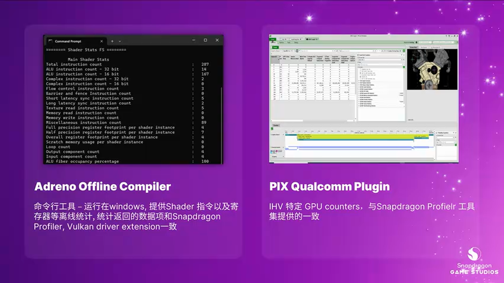
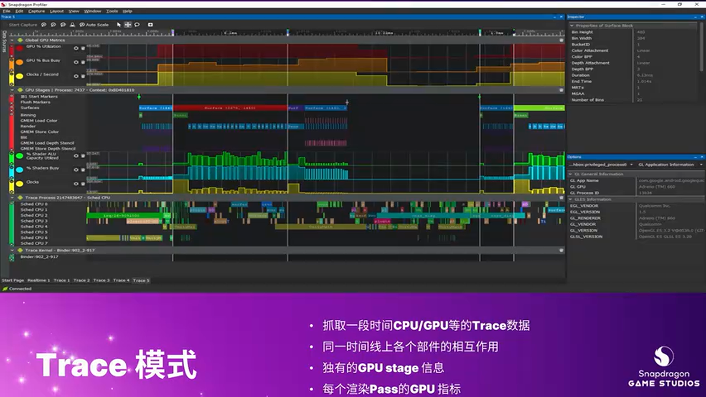
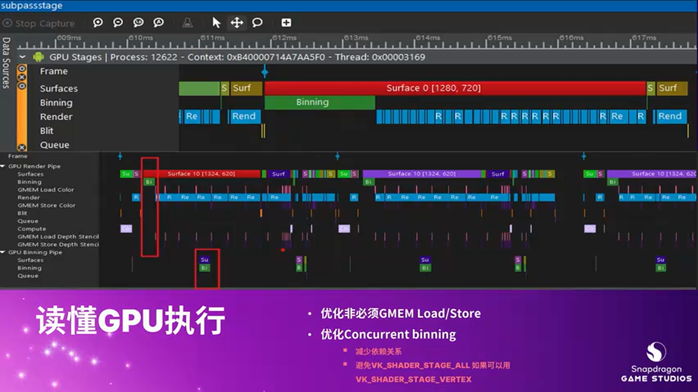
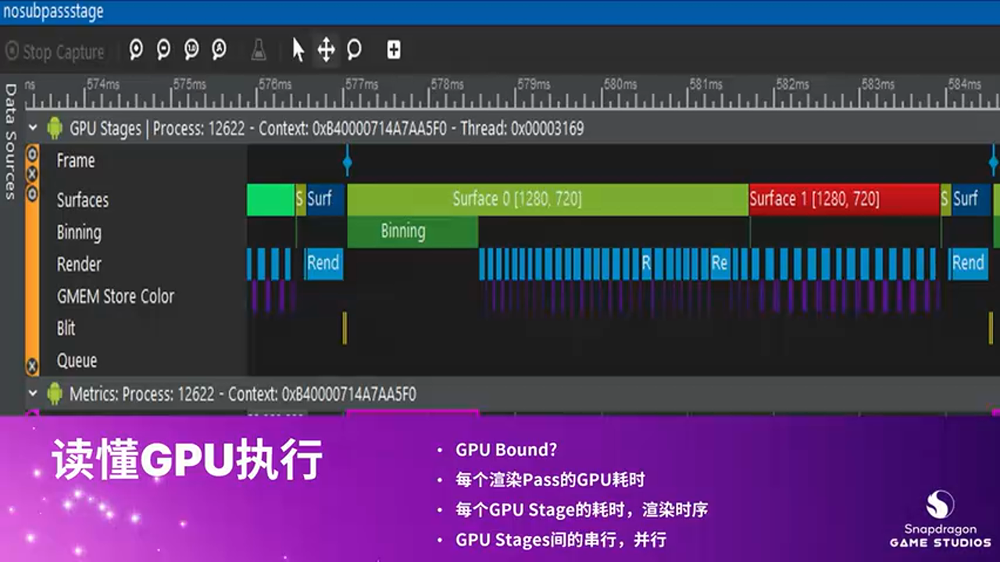
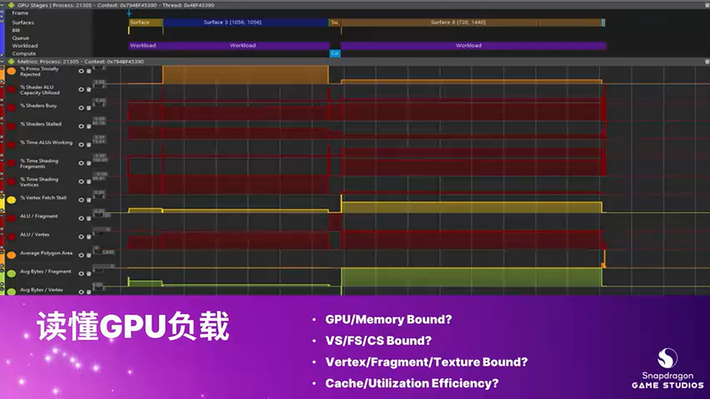
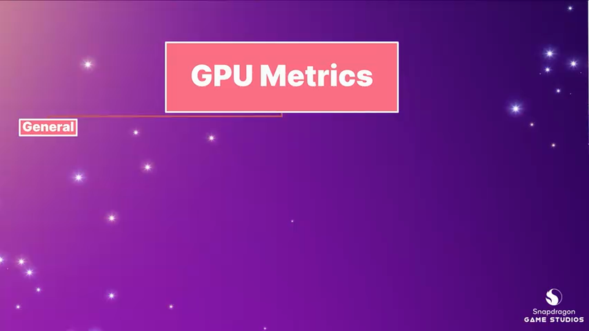

# 深度剖析 Snapdragon Profiler：移动游戏性能与功耗优化实战指南

---


## 加入 UE5 技术交流群

如果您对虚幻引擎5的图形渲染技术感兴趣,欢迎加入我们的 **UE5 技术交流群**!

扫描上方二维码添加个人微信 **wlxklyh**,备注"UE5技术交流",我会拉您进群。

在技术交流群中,您可以:
- 与其他UE开发者交流渲染技术经验
- 获取最新的GDC技术分享和解读
- 讨论图形编程、性能优化、构建工具流、动画系统等话题
- 分享引擎架构、基建工具等项目经验和技术难题

---

> **视频来源**: [UFSH2025]利用Snapdragon Profiler, 助力游戏性能功耗优化 | 李娟 高通中国 游戏开发者关系和技术组工程师
>
> **视频链接**: https://www.bilibili.com/video/BV1i2sNzXEBU
>
> **内容说明**: 本文基于视频内容,由 AI 辅助整理生成,旨在帮助开发者系统掌握 Snapdragon Profiler 工具的使用方法与性能优化技巧。

---

## 导读

> **核心观点**:
> 1. 性能优化不只是"减法",更应该是通过"增效"提高硬件利用率和并行性
> 2. Snapdragon Profiler 提供了从 API 调用到 GPU 硬件级别的完整性能分析链路
> 3. 理解 GPU 执行流程(Binning-Rendering)和负载特征是优化的关键

**前置知识**: 本文假设读者具备基本的图形 API (Vulkan/OpenGL ES) 知识,了解移动端 GPU 的 Tile-Based Rendering 架构。

---

## 一、移动游戏性能优化的两大方向

### 1.1 减法优化 vs 增效优化

在移动游戏开发中,性能优化通常有两种思路:

**减法优化(Reduction)**:
- 降低画质(减少粒子数、关闭特效)
- 简化场景复杂度
- 降低分辨率

这是一种"防守型"策略,通过牺牲视觉质量换取性能。

**增效优化(Efficiency)**:
- **提高硬件利用率**:让 GPU/CPU 更充分地工作
- **增强并行性**:合理安排任务,减少等待时间
- **优化执行路径**:减少不必要的 Load/Store 操作


> **设计决策**: 增效优化能在保持画质的前提下,通过更智能的资源调度实现性能提升,是更高级的优化策略。

---

## 二、高通游戏开发工具生态

### 2.1 工具全家桶概览

高通为移动游戏开发者提供了完整的性能分析工具链:


**五大工具类别**:

1. **性能分析与调优工具**
   - **Snapdragon Profiler (SDP)**: GUI 工具,支持实时监控和帧捕获分析
   - **SDP Command Line**: 轻量级命令行工具,可集成到自动化测试流程
   - **Profiling Library (Pill)**: 可嵌入游戏内部的性能监控库

2. **着色器优化工具**
   - **Adreno Offline Compiler**: 离线分析 Shader 复杂度,提供指令数、寄存器占用等统计信息

3. **Vulkan Debug Layer**
   - 提供性能相关的验证和提示信息

4. **平台插件**
   - **Windows on Snapdragon Plugin**: 支持在 ARM 架构 Windows 设备上开发

5. **开源资源**
   - GitHub 上的示例代码和插件


> **获取方式**: 访问高通开发者中心官网 (developer.qualcomm.com) 可下载所有工具、文档和示例代码。

### 2.2 Adreno Offline Compiler 简介



这是一个运行在 Windows 上的离线工具,主要用于 Shader 性能预分析:

**输入**: GLSL/SPIR-V Shader 源码

**输出**:
- 指令条数统计
- 寄存器占用 (Register Footprint)
- ALU/Texture 指令比例

**应用场景**:
- 在发布前评估 Shader 复杂度
- 对比不同 Shader 实现方案的性能

### 2.3 SDP Command Line 工具


**特点**:
- 轻量级,运行在设备端
- 易于集成到 CI/CD 流程
- 可自动化采集性能数据

**输出数据**:
1. **实时 GPU 指标** (GPU Frequency, Utilization 等)
2. **Render Pass 级别数据**
   - 每个 Pass 的 GPU 时间
   - Surface 属性 (Attachment 数量、尺寸、格式等)

### 2.4 Profiling Library (Pill)

相比 SDP,Pill 库更加轻量:
- 直接集成到游戏代码中
- 支持实时在屏幕上显示 GPU 指标
- 数据丰富度低于 SDP,但性能开销更小


**使用案例**:
```cpp
// [示例代码] 集成 Pill 库实时显示 GPU 利用率
#include <profiling_lib.h>

void GameLoop() {
    ProfilingLib::BeginFrame();

    // 游戏逻辑...

    float gpuUtil = ProfilingLib::GetGPUUtilization();
    DrawDebugText("GPU: %.1f%%", gpuUtil * 100);

    ProfilingLib::EndFrame();
}
```

---

## 三、Snapdragon Profiler 核心功能详解

### 3.1 工具架构


Snapdragon Profiler 由三部分组成:

1. **Profiler (主机端)**: 运行在 Windows/Linux/macOS 上的 GUI 程序
2. **Server (设备端)**: 在 Android 设备上采集数据的守护进程
3. **驱动支持**: 提供硬件级别的性能计数器

**更新频率**: 约每月更新一次,持续支持最新的 Adreno GPU 型号。

### 3.2 四种工作模式


**1. Realtime Mode (实时模式)**

连续监控游戏运行状态,提供:
- CPU/GPU 利用率曲线
- 功耗数据 (GPU、CPU 大核/小核功耗分解)
- 内存占用、温度等系统指标


**回答的核心问题**:
- 我的游戏是 CPU Bound 还是 GPU Bound?
- 各个硬件模块的负载分布如何?
- 功耗热点在哪里?

> **重要更新**: SDP 2025.7 版本新增了 **功耗 Breakdown** 功能,可以单独查看 GPU、CPU 大核、CPU 小核的功耗占比,采样率为 50ms。

**2. Sampling Mode (采样模式)**

基于 CPU 端的函数调用采样 (Callstack Sampling):
- 捕获一段时间内的 CPU 函数执行热点
- 结合系统事件 (线程调度、中断等)
- 提供火焰图 (Flame Graph) 视图

**3. Snapshot Mode (快照模式)**


这是最强大的调试模式,支持:
- **API Trace**: 捕获所有 Vulkan/OpenGL ES API 调用
- **Shader 调试**: 查看每个 Draw Call 使用的 Shader 代码
- **GPU 指标关联**: 将每个 API 调用与对应的 GPU 硬件指标绑定


**回答的核心问题**:
- 哪个 Render Pass 最耗时?
- 某个 Draw Call 的 GPU 瓶颈在哪里 (FS/VS/Memory)?
- 为什么会出现 GPU Idle?

**4. Frame Debugger Mode (帧调试模式)**

逐 Draw Call 分析,可查看:
- 每个 Draw Call 渲染的中间结果
- Shader 输入/输出数据
- 纹理、Framebuffer 内容

---

## 四、理解 GPU 执行流程:Binning 与 Rendering

### 4.1 移动 GPU 的 Tile-Based Rendering

Adreno GPU 采用 **Tile-Based Deferred Rendering (TBDR)** 架构:


**执行流程**:

1. **Binning Pass (分块阶段)**
   - 运行 Vertex Shader
   - 将几何体划分到屏幕的各个 Tile 中
   - 生成每个 Tile 的绘制列表

2. **Rendering Pass (渲染阶段)**
   - 逐 Tile 执行 Fragment Shader
   - 所有中间数据存储在片上内存 (On-Chip Memory)
   - 最终结果写回系统内存

**性能影响因素**:

> **Binning 时间过长的原因**:
> - Vertex Shader 复杂度过高
> - 几何体数量过多
> - 过多的 Draw Call

> **Rendering 时间过长的原因**:
> - Fragment Shader 计算量大
> - 过度绘制 (Overdraw) 严重
> - 纹理采样开销高

### 4.2 Render Pass 属性分析

在 SDP 的 Snapshot 模式中,可以查看每个 Render Pass 的详细属性:


**关键属性**:

- **Render Mode**: Binning (分块模式) 还是 Direct (直接渲染模式)
- **Attachment Count**: 该 Pass 使用的 Color/Depth 附件数量
- **Surface Size**: Framebuffer 的分辨率
- **Load/Store Operations**: 决定是否需要从系统内存读取/写回数据

**优化建议**:

```cpp
// [AI补充] 优化 Vulkan Render Pass Load/Store 操作
VkRenderPassBeginInfo renderPassInfo{};
renderPassInfo.sType = VK_STRUCTURE_TYPE_RENDER_PASS_BEGIN_INFO;

// 关键优化点1: 如果不需要保留上一帧的数据,使用 DONT_CARE
VkAttachmentDescription colorAttachment{};
colorAttachment.loadOp = VK_ATTACHMENT_LOAD_OP_CLEAR;  // 或 DONT_CARE
colorAttachment.storeOp = VK_ATTACHMENT_STORE_OP_STORE;

// 关键优化点2: Depth/Stencil 如果不需要保留,避免 Store
VkAttachmentDescription depthAttachment{};
depthAttachment.loadOp = VK_ATTACHMENT_LOAD_OP_CLEAR;
depthAttachment.storeOp = VK_ATTACHMENT_STORE_OP_DONT_CARE;  // 不写回系统内存!
```

> **性能陷阱**: 不必要的 Load Color/Store Depth 操作会导致大量带宽浪费,在 SDP 中会显示为 "Load Color" 或 "Store Depth" 阶段耗时。

### 4.3 Tile 数量的影响



Render Pass 的 Tile 数量可通过 **Render Target Count** 推断:

- Tile 越多,GPU 需要在多个 Tile 之间切换
- 每次切换都可能涉及 GMEM (On-Chip Memory) 的写出 (Resolve)

**计算公式** (基于上下文推断):
```
Tile Count ≈ (Framebuffer Width / Tile Width) × (Framebuffer Height / Tile Height)
```

**优化策略**:
- 降低 Framebuffer 分辨率
- 减少 Attachment 数量 (特别是 MRT 多目标渲染)

---

## 五、Snapshot 模式深度实战

### 5.1 捕获单帧数据


**操作步骤**:
1. 在 SDP 中选择 "Snapshot" 模式
2. 运行游戏到目标场景
3. 点击 "Capture Frame" 捕获一帧
4. 同时勾选需要采集的 GPU 指标 (如 GPU Clocks)

**数据分析流程**:

1. **按 GPU 时间排序**
   - 找出最耗时的 Render Pass
   - 查看是 Binning 还是 Rendering 阶段占主导

2. **结合 GPU 指标定位瓶颈**
   - 如果 Fragment Shading 占比高 → FS Bound
   - 如果 Vertex Shading 占比高 → VS Bound
   - 如果 Memory Read 占比高 → Memory Bound

### 5.2 Shader 统计信息


SDP 会显示每个 Shader 的编译后统计数据 (类似 Adreno Offline Compiler):

**关键指标**:

- **Instruction Count**: 指令总数
- **Full ALU / Half ALU**: 全精度/半精度 ALU 指令数
- **Memory Fetch**: 内存读取指令 (Texture Sampling、Uniform Buffer 读取等)
- **Register Footprint**: 每个 Thread 使用的寄存器数量

**性能影响**:

> **寄存器占用过高的后果**:
> - GPU 的寄存器文件大小是固定的
> - 每个 Thread 占用的寄存器越多,能并行运行的 Thread 数量就越少
> - 降低了 GPU 的并行度 (Occupancy)

**优化建议**:
- 减少 Shader 中的临时变量
- 使用 `mediump` (半精度) 代替 `highp`
- 拆分复杂的 Shader 为多个简单的 Pass

### 5.3 Override Shader 功能


SDP 支持在运行时替换 Shader:

**使用场景**:
1. 修改 Shader 代码
2. 在 SDP 中点击 "Override Shader"
3. 实时 Apply 到游戏中,立即看到效果

**典型应用**:
- 快速验证 Shader 优化效果
- A/B 测试不同的 Shader 实现

---

## 六、GPU 架构深度剖析

### 6.1 Adreno 7 系列的 Binning Pipeline 分离



从 Adreno 7 系列开始,GPU 硬件支持 **Binning Pipeline 和 Rendering Pipeline 分离**:

**传统架构** (Adreno 6 及更早):
```
[Binning Pass] → [等待] → [Rendering Pass] → [等待] → [下一个 Render Pass]
```

**Adreno 7 优化架构**:
```
[Binning Pass 1] → [Binning Pass 2] → ...
                ↓
         [Rendering Pass 1] → [Rendering Pass 2] → ...
```

**优势**:
- Binning 和 Rendering 可以并行执行
- 隐藏 Binning 的延迟 (特别是 Vertex Shader 复杂的场景)

**应用建议**:
- 在支持的设备上,可以适当增加 Vertex Shader 复杂度
- 利用 Binning Pipeline 的提前执行特性

### 6.2 Load/Store 操作的硬件成本



每个 Render Pass 可能包含以下阶段 (SDP 会单独统计时间):

- **Binning**: Vertex Shader 执行 + Tile 列表生成
- **Rendering**: Fragment Shader 执行
- **Store Color**: 将 Color Attachment 写回系统内存
- **Store Depth**: 将 Depth Attachment 写回系统内存
- **Load Color**: 从系统内存读取 Color Attachment (用于 Blending)
- **Load Depth**: 从系统内存读取 Depth Attachment


**带宽开销对比**:

> **Store Color/Depth**:
> - 涉及 GMEM → System Memory 的写操作
> - 带宽开销 = Framebuffer Size × Pixel Format Size × MSAA Sample Count
>
> **Load Color/Depth**:
> - 涉及 System Memory → GMEM 的读操作
> - 如果上一个 Pass 已经 Store,这一次又 Load,属于双倍带宽浪费

**Vulkan API 优化示例**:

```cpp
// [AI补充] 正确设置 Load/Store Operation
VkAttachmentDescription attachments[2] = {};

// Color Attachment
attachments[0].loadOp = VK_ATTACHMENT_LOAD_OP_CLEAR;     // 第一个 Pass 使用 CLEAR
attachments[0].storeOp = VK_ATTACHMENT_STORE_OP_STORE;   // 需要后续使用,必须 STORE

// Depth Attachment (仅在当前 Pass 使用)
attachments[1].loadOp = VK_ATTACHMENT_LOAD_OP_CLEAR;
attachments[1].storeOp = VK_ATTACHMENT_STORE_OP_DONT_CARE;  // 不需要保留,避免 Store

// 在中间 Pass 中,如果需要继续使用上一个 Pass 的结果
attachments[0].loadOp = VK_ATTACHMENT_LOAD_OP_LOAD;      // 从系统内存 Load
attachments[0].storeOp = VK_ATTACHMENT_STORE_OP_STORE;
```

> **避坑指南**:
> - 默认情况下,很多引擎/框架会将所有 Attachment 设置为 `LOAD + STORE`
> - 这会导致每个 Render Pass 都产生大量不必要的内存读写
> - 在 SDP 中表现为 "Load Color" 和 "Store Depth" 阶段占据大量时间

---

## 七、GPU 负载分析与指标解读

### 7.1 GPU 指标体系



Snapdragon Profiler 提供了 **50+ 个 GPU 硬件指标**,主要分为以下类别:

**1. 着色器负载指标**
- **% Vertex Shading**: Vertex Shader 执行时间占比
- **% Fragment Shading**: Fragment Shader 执行时间占比
- **% Compute Shading**: Compute Shader 执行时间占比

**2. 内存与带宽指标**
- **SP Memory Read**: Shader Processor 从系统内存读取的数据量
- **Texture Bandwidth**: 纹理采样带宽
- **GMEM Store/Load**: On-Chip Memory 读写次数

**3. 硬件利用率指标**
- **GPU Busy %**: GPU 整体忙碌百分比
- **ALU Utilization**: 算术逻辑单元利用率
- **Texture Unit Utilization**: 纹理单元利用率

### 7.2 瓶颈定位方法论

**步骤1: 确定是否 GPU Bound**


观察实时模式下的 GPU Busy %:
- 如果接近 100%,且 CPU 有大量 Idle 时间 → **GPU Bound**
- 如果 GPU Busy < 70%,且 CPU 持续满载 → **CPU Bound**

**步骤2: 分析 Shader 负载分布**


查看 **% Fragment Shading** vs **% Vertex Shading**:

> **Fragment Shading 占比高 (>60%)**:
> - Fragment Shader 复杂度过高
> - 过度绘制 (Overdraw) 严重
> - 优化方向: 简化 FS、启用 Early-Z、减少透明物体

> **Vertex Shading 占比高 (>40%)**:
> - Vertex Shader 计算量大
> - 几何体顶点数过多
> - 优化方向: LOD、顶点合并、简化 VS 计算

**步骤3: 检查内存瓶颈**


关注 **SP Memory Read** 指标:

- **高 SP Memory Read** 通常意味着:
  - Uniform Buffer 读取频繁
  - 纹理 Cache Miss 率高
  - On-Chip Cache 不足,数据溢出到系统内存

**常见原因**:
1. Uniform Buffer 超过硬件 Cache 大小
2. 纹理采样模式导致 Cache 不友好 (如随机访问)
3. 寄存器占用过高,导致 Spill 到内存

**优化案例**:

```glsl
// [优化前] 大量 Uniform 读取
uniform mat4 boneMatrices[100];  // 可能导致 Cache Miss

void main() {
    // 每个顶点读取多个矩阵
    vec4 pos = boneMatrices[boneIndex0] * position * boneWeight0
             + boneMatrices[boneIndex1] * position * boneWeight1
             + boneMatrices[boneIndex2] * position * boneWeight2;
}

// [优化后] 使用 Texture 存储 Bone Matrices (更大的 Texture Cache)
uniform sampler2D boneTexture;

void main() {
    mat4 bone0 = fetchBoneMatrix(boneTexture, boneIndex0);
    // 利用 Texture Cache 减少系统内存访问
}
```

### 7.3 关键指标详解

**1. GPU Cycles (GPU 时钟周期)**



- **定义**: GPU 实际执行的时钟周期数
- **计算**: 基于硬件计数器,约等于 GPU Frequency (但通常略低)
- **用途**: 在 GPU Frequency 不可读的设备上,用作性能基准

> **为什么不直接用 GPU Frequency?**
> - 在很多 Android 设备上,GPU Frequency 受到安全限制,无法通过 API 读取
> - GPU Cycles 通过硬件性能计数器获得,更加可靠

**2. Overdraw (过度绘制)**

- **定义**: 平均每个像素被绘制的次数
- **计算**: Total Fragment Shading Invocations / Screen Pixel Count
- **理想值**: < 2.0 (每个像素平均绘制不超过 2 次)

**优化方法**:
- 启用 Early-Z / Depth Pre-Pass
- 从前往后排序不透明物体
- 减少透明效果的使用

**3. ALU Instruction / Memory Instruction 比例**

- **ALU Bound**: 大量数学计算 (dot、normalize、pow 等)
- **Memory Bound**: 大量纹理采样、Uniform 读取

**典型场景**:
- **PBR 材质**: 通常是 ALU Bound (复杂的光照计算)
- **后处理效果**: 通常是 Memory Bound (多次纹理采样)

---

## 八、实战案例:优化一个性能问题

### 8.1 问题描述

某游戏在高端场景下出现帧率下降,通过 SDP Realtime 模式发现:
- GPU Busy 达到 95%
- CPU Idle 时间较多
- → **确认为 GPU Bound**

### 8.2 Snapshot 分析


捕获一帧后,发现:
1. **Binning 时间异常长** (占总 GPU 时间 40%)
2. 某个 Shadow Map Render Pass 的 Vertex Shader 非常复杂

### 8.3 Shader 统计分析

查看该 Vertex Shader 的 Stats:
- Instruction Count: 450 条
- Register Footprint: 64 个 (非常高!)
- Full ALU: 320 条

**问题定位**:
- Vertex Shader 中包含了复杂的蒙皮动画计算
- 每个顶点需要混合 4 个骨骼矩阵
- 大量的矩阵乘法导致寄存器占用过高

### 8.4 优化方案

**方案 A: 预计算骨骼变换**
> - 🟢 优势: 减少 Vertex Shader 计算量
> - 🔴 劣势: 增加 CPU 负担,不适合大量角色
> - 🎯 适用场景: 主角等关键角色

**方案 B: 使用 Compute Shader 预处理顶点**
> - 🟢 优势: 利用 GPU 并行性,减轻 Vertex Shader 压力
> - 🔴 劣势: 需要额外的 Compute Pass,增加 API 开销
> - 🎯 适用场景: 顶点数量非常大的情况

**方案 C: 降低骨骼影响数量**
> - 🟢 优势: 简单直接,效果明显
> - 🔴 劣势: 可能影响动画质量
> - 🎯 适用场景: 远景角色、次要 NPC

**最终选择**: 采用方案 C,将骨骼影响从 4 个降低到 2 个

**优化效果**:
- Instruction Count: 450 → 210 条 (-53%)
- Register Footprint: 64 → 32 个 (-50%)
- Binning 时间: 8.2ms → 4.5ms (-45%)
- 整体帧率: 40 FPS → 55 FPS (+37%)

---

## 九、最佳实践总结

### 9.1 性能优化流程

1. **使用 Realtime Mode 确定瓶颈类型**
   - CPU Bound → 优化游戏逻辑、减少 Draw Call
   - GPU Bound → 进入下一步

2. **Snapshot 捕获关键帧**
   - 找出最耗时的 Render Pass
   - 分析 Binning vs Rendering 时间占比

3. **查看 Shader Stats**
   - 检查指令数、寄存器占用
   - 对比优化前后的差异

4. **结合 GPU 指标定位细节**
   - Fragment Shading % → 优化 FS 或减少 Overdraw
   - Memory Read → 优化纹理采样、Uniform 使用

### 9.2 常见性能陷阱

**陷阱 1: 过度使用 Load/Store**
- ❌ **错误**: 所有 Render Pass 都使用 `LOAD_OP_LOAD + STORE_OP_STORE`
- ✅ **正确**: 根据实际需求设置,中间结果使用 `DONT_CARE`

**陷阱 2: 寄存器 Spill**
- ❌ **错误**: Shader 中使用大量临时变量,导致寄存器不足
- ✅ **正确**: 优化 Shader 代码,使用半精度,拆分复杂计算

**陷阱 3: Uniform Buffer 过大**
- ❌ **错误**: 单个 Uniform Buffer 超过硬件 Cache 大小
- ✅ **正确**: 拆分 Uniform Buffer,或使用 SSBO/Texture 存储大数据

**陷阱 4: 忽略 Tile 数量**
- ❌ **错误**: 使用过高的 Framebuffer 分辨率和多个 Attachment
- ✅ **正确**: 在保证画质的前提下,降低分辨率或减少 MRT

### 9.3 工具组合使用建议

| 场景 | 推荐工具 | 理由 |
|------|---------|------|
| 快速定位 CPU/GPU 瓶颈 | Realtime Mode | 实时监控,开销小 |
| 分析某一帧的详细性能 | Snapshot Mode | 提供 API Trace 和 GPU 指标 |
| 自动化性能测试 | SDP CLI | 可集成到 CI 流程 |
| 嵌入游戏内部监控 | Profiling Library | 轻量级,无需外部连接 |
| 预分析 Shader 性能 | Adreno Offline Compiler | 提前发现复杂 Shader |

---

## 十、总结与展望

Snapdragon Profiler 为移动游戏开发者提供了从高层 API 调用到底层 GPU 硬件的完整性能分析能力。通过本文的深度剖析,我们可以总结出以下关键要点:

> **核心要点**:
> 1. **理解硬件架构**: 移动 GPU 的 Tile-Based Rendering 与桌面 GPU 有本质差异,必须针对性优化
> 2. **数据驱动优化**: 借助 SDP 的硬件级指标,避免"盲目优化"
> 3. **关注带宽**: Load/Store 操作是移动平台的重要性能瓶颈,合理使用 Vulkan API 可显著减少带宽浪费
> 4. **Shader 优化**: 寄存器占用直接影响 GPU 并行度,是提升性能的关键

**未来展望**:

随着 Adreno 7 系列及更新架构的普及,移动 GPU 的性能将持续提升。开发者需要:
- 持续关注高通开发者中心的工具更新
- 学习新架构的特性 (如 Binning/Rendering Pipeline 分离)
- 结合 AI 辅助工具 (如自动 Shader 优化) 提升开发效率

**参考资源**:
- 高通开发者中心: https://developer.qualcomm.com
- Snapdragon Profiler 文档: https://developer.qualcomm.com/software/snapdragon-profiler
- Adreno GPU 架构白皮书: https://developer.qualcomm.com/hardware/adreno-gpu

---

**致谢**: 感谢高通公司李娟工程师的精彩分享,以及 UFSH2025 组委会提供的学习机会。

**免责声明**: 本文内容基于公开视频整理,部分代码示例为 AI 辅助补充,仅供学习参考。实际应用中请根据项目需求调整。

---

## 附录:Snapdragon Profiler 快速上手指南

### A.1 环境配置

1. **下载工具**:访问 https://developer.qualcomm.com/software/snapdragon-profiler
2. **安装依赖**:
   - Windows: 需要 Visual C++ Redistributable 2019+
   - Linux: 需要 libGL、libX11 等
3. **设备准备**:
   - Android 设备开启 USB 调试
   - 安装 SDP Server APK (工具包自带)

### A.2 第一次抓取

```bash
# 1. 连接设备
adb devices

# 2. 启动 Snapdragon Profiler
./SnapdragonProfiler

# 3. 在 GUI 中选择设备和目标应用

# 4. 选择 "Realtime" 模式,点击 "Start"

# 5. 运行游戏,观察性能曲线

# 6. 切换到 "Snapshot" 模式,点击 "Capture Frame"
```

### A.3 常见问题

**Q: 设备连接不上?**
- 检查 USB 调试是否开启
- 确认 SDP Server APK 已安装并运行

**Q: GPU 指标显示为 0?**
- 部分设备需要 Root 权限才能读取硬件计数器
- 尝试在开发者选项中开启 "GPU 调试层"

**Q: Snapshot 捕获失败?**
- 确保游戏使用的是 Vulkan 或 OpenGL ES API
- 检查设备存储空间是否充足 (捕获数据可能较大)

---

