# UE5对象池架构实战：从内存预分配到异步创建的完整优化方案

---

## 加入 UE5 技术交流群

如果您对虚幻引擎5的图形渲染技术感兴趣，欢迎加入我们的 **UE5 技术交流群**！

扫描上方二维码添加个人微信 **wlxklyh**，备注"UE5技术交流"，我会拉您进群。

在技术交流群中，您可以：
- 与其他UE开发者交流渲染技术经验
- 获取最新的GDC技术分享和解读
- 讨论图形编程、性能优化、构建工具流、动画系统等话题
- 分享引擎架构、基建工具等项目经验和技术难题

---

**源视频信息：**
- 标题：[UFSH2025]UE5通用对象池解决方案 | 邱子鉴 萨罗斯网络科技 Gameplay客户端开发
- 视频链接：https://www.bilibili.com/video/BV14RU7BJEUk
- 时长：23分20秒

**说明：** 本文由 AI 基于视频内容生成，结合了技术分析和实战经验总结。

---

> **核心观点**
> - **内存预分配与对象创建分离**：通过异步线程预分配连续内存空间，大幅降低主线程创建对象的卡顿
> - **三种回收机制适配不同场景**：默认回收、主动清理（Purge）、主动复用（Reuse）满足从低频到高频的各类业务需求
> - **聚合 Tick 优化加持**：同类对象物理内存连续排布，CPU 缓存命中率提升显著，测试显示糟糕度因子降低 33%

**前置知识：**
- UE5 对象系统与 NewObject 流程
- 垃圾回收（GC）机制基础
- 多线程编程与内存管理

---

## 背景与痛点

在大规模射击类游戏开发中，性能优化始终是核心挑战。以**命运班机**项目为例，这是一款由萨罗斯网络科技打造的二次元大世界英雄射击类游戏，支持 PC、主机和移动平台互通。在这类游戏中，决胜圈内多人同时开火、释放技能的场景对帧率要求极高，任何卡顿都会严重影响玩家体验。

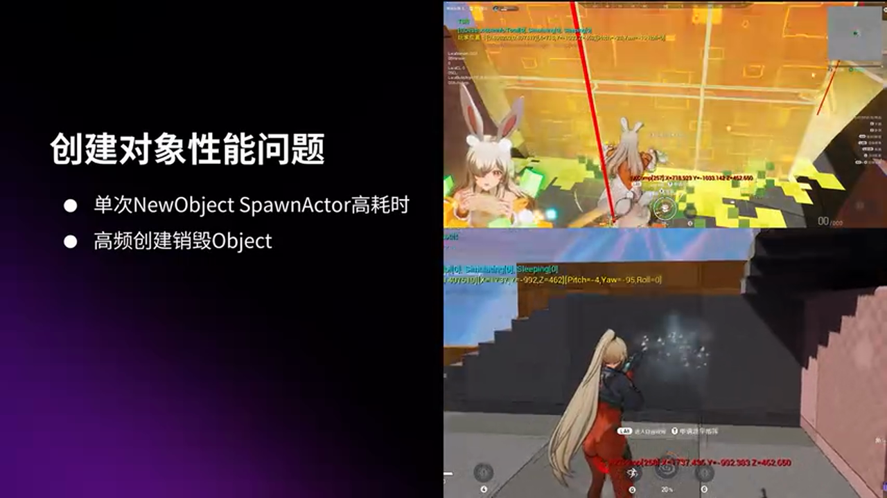

在项目优化阶段，团队发现创建对象的性能问题主要分为两类：

**第一类：单个对象创建卡顿**
- 创建角色、释放技能等操作可能导致明显的帧率下降
- 复杂的蓝图 Actor（如含有多个组件的建筑技能）创建耗时可达 52 毫秒

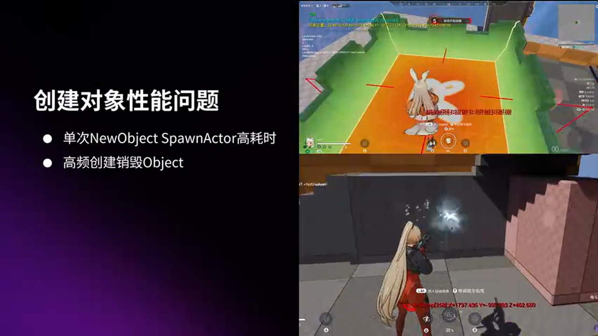

**第二类：高频创建销毁对象**
- 武器开火等高频操作在短时间内大量创建销毁对象
- 导致内存频繁变化，在一个 GC 周期内产生大量垃圾对象
- 既浪费内存，又严重影响 GC 性能

传统的对象池方案虽然能缓解这些问题，但在实践中暴露出新的痛点。

---

## 传统对象池的局限性

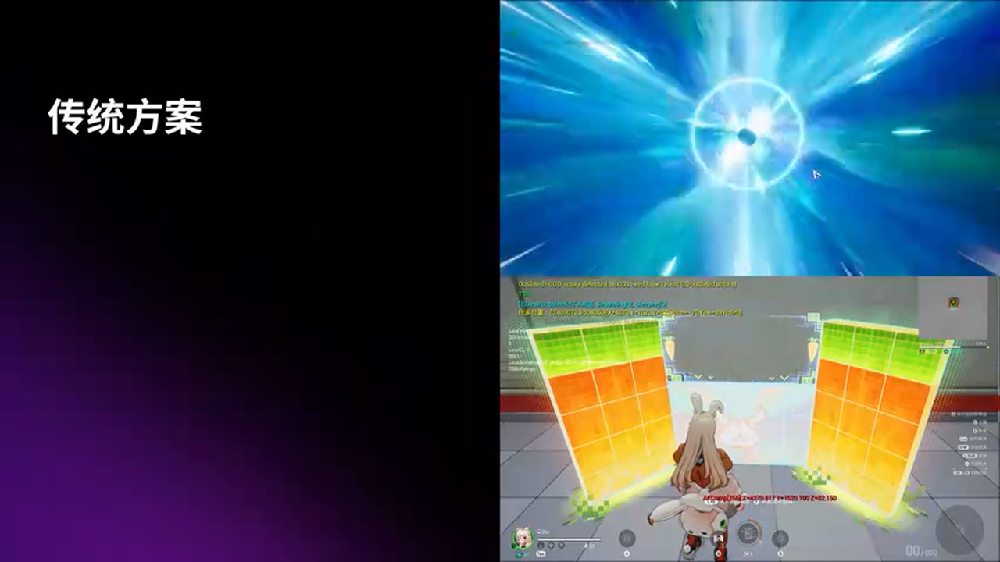

传统对象池的设计思路是预创建一批对象，在游戏运行中循环使用而不销毁。具体做法分为两步：

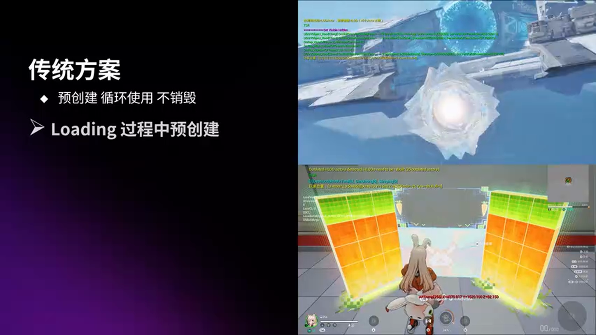

1. **预创建转移**：将预创建过程转移到用户不敏感的地方，比如 Loading 阶段
2. **回收复用**：回收时立即隐藏对象，不执行销毁流程；下次使用时只需控制显影即可

然而这种方案存在三个主要问题：

**问题一：Loading 时间越来越长**

随着对象池中配置的对象类型和数量增加，Loading 阶段的耗时不断增长。对于命运班机这样的项目，Loading 过程包含过场动画，明显的卡顿会严重影响用户体验。

**问题二：回收策略单一**

对于接入对象池的业务开发者，必须强制处理回收逻辑，比如清理缓存数据。这增加了额外的开发负担，且容易出错。

**问题三：依赖人力清理引擎缓存**

复用对象时需要依赖人力去清理网络模块或引擎其他模块的缓存数据。一旦引擎升级，对象池就容易出现 Bug，维护成本高昂。

---

## 通用对象池解决方案

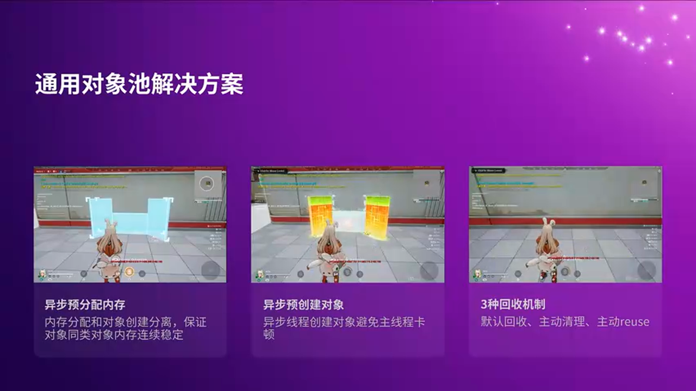

为了解决上述问题，团队提出了通用对象池解决方案，核心分为三部分：

1. **异步预分配内存**：在异步线程中预分配内存，保证同类对象在物理空间上的连续性
2. **异步预创建对象**：在另一个异步线程中进行预创建对象，避免主线程卡顿
3. **三种回收机制**：提供默认回收、主动清理、主动复用三种策略，根据不同业务需求灵活配置

---

### 核心原理一：异步预分配内存

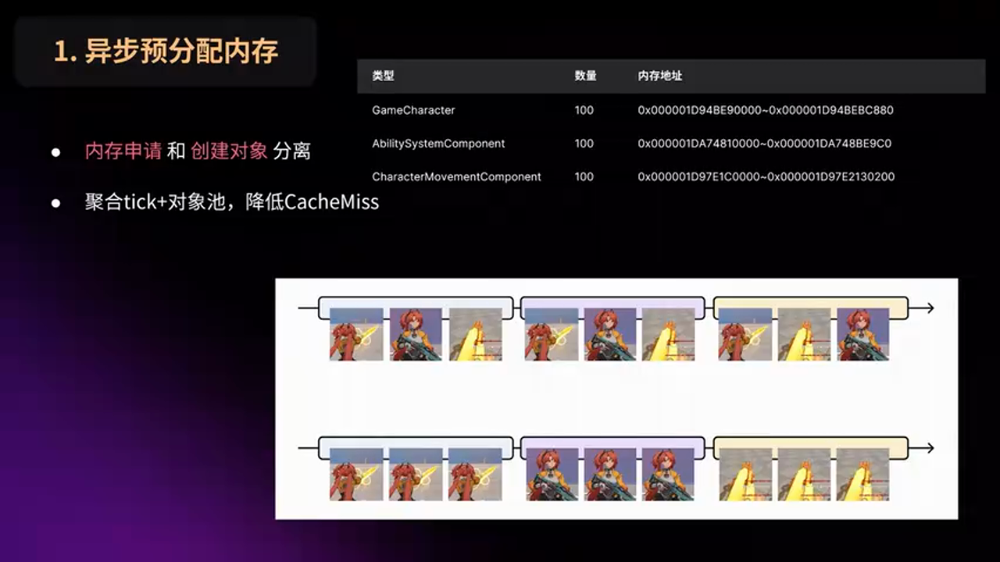

**设计思路：内存申请与对象创建分离**

在传统 NewObject 流程中，内存申请和对象创建是耦合的。新方案采取分离策略：在异步线程中根据配置的类型和数量预先申请连续的内存空间。当需要创建对象时，优先从预分配的内存区间内选取空闲地址使用。

这一设计借鉴了 2019 年《堡垒之夜》项目提出的**聚合 Tick 方案**。关键在于让同类型对象的内存地址在物理上保持连续。

**性能提升：结合聚合 Tick 技术**

当同类型对象内存连续排布时，遍历这些对象的 Tick 逻辑可以显著提升 CPU 缓存命中率。团队在命运班机项目中实现了类似机制，测试数据验证了这一优化效果。

**测试案例：游戏角色**

在一般人通玩的情况下，团队开启了角色下的多个组件的聚合开关，包括武器、技能、移动、皮肤等。经过测试，这些组件的性能都有 **10% 到 30%** 的提升。

**验证工具：CPU 缓存测量**

为了进一步验证性能提升来自于缓存命中率的提高，团队使用了一个开源的 CPU 缓存测量工具。该工具由育碧旗下工作室于 2017 年开源，已集成到 UE5 项目中。该工具可以在 Windows 端实时测量某个代码区间内的缓存命中率，最后通过**糟糕度因子**来衡量命中率的好坏。

测试结果显示：在一般人通玩场景下，记录单次 Tick 的数据，糟糕度因子从 **34% 降到 22%**，降低了 **33%**。

**结论：**

当有大量聚合组件的对象时，优先配置到对象池中能带来显著的性能收益。

---

### 核心原理二：异步预创建对象

**引擎原生 NewObject 流程分析**

原生 NewObject 流程主要分为三部分逻辑：

1. **申请内存**：从 UClass 中获取对象大小，向内存分配器申请内存空间

2. **注册对象**：将新申请的对象注册到全局对象数据和 Hash 表中。该数据表包含了全部的 UObject，可以根据索引从数据中检索到该对象的全部信息，以及根据名字从 Hash 表中快速查找对象。

3. **数据初始化**：这是创建对象卡顿的主要耗时阶段。初始化分为内部和外部两部分：
   - **内部初始化**：构造函数中的逻辑
   - **外部初始化**：配置文件和蓝图中配置的数据

如果有 SubObject 需要创建，这里会递归执行 NewObject 流程。因此构造函数逻辑越复杂、SubObject 越多，创建对象就会越卡顿。

**特殊情况：InstancedComponent**

需要注意的是 InstancedComponent 的初始化流程比较特殊。例如，一个 Actor 下的组件就是一个 InstancedComponent。编辑器中配置的组件 Widget 信息记录在 Actor 中，所以单独预创建组件是无法读取 Actor 中的 Widget 数据的。

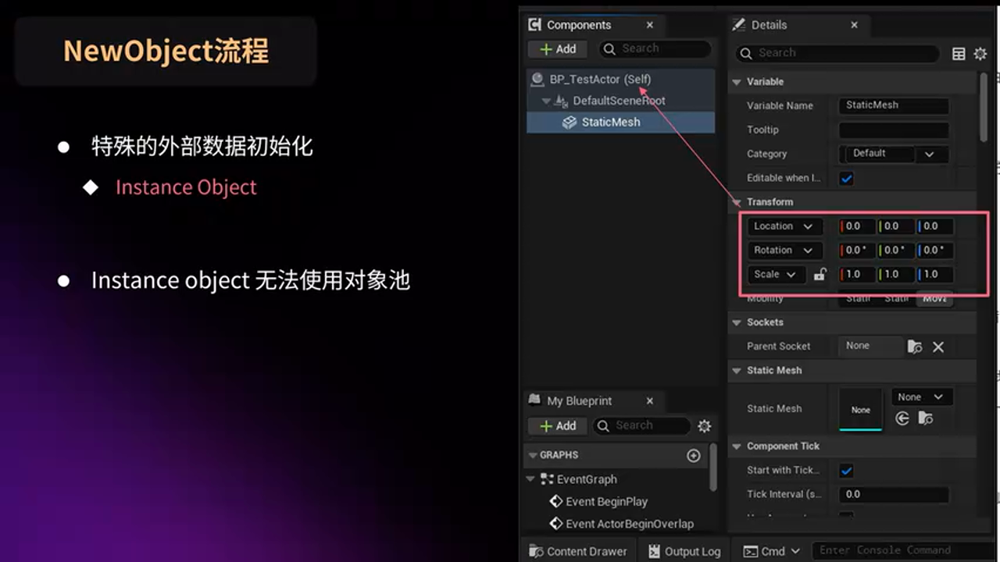

通俗地讲，Actor 下的组件是无法使用对象池的。解决方法也非常简单：当发现某个 Actor 下的组件创建比较耗时时，直接预创建这些 Actor 即可。

**异步创建方案**

找到了问题的症结，接下来要做的就是将这些耗时的逻辑都转移到异步线程来处理。

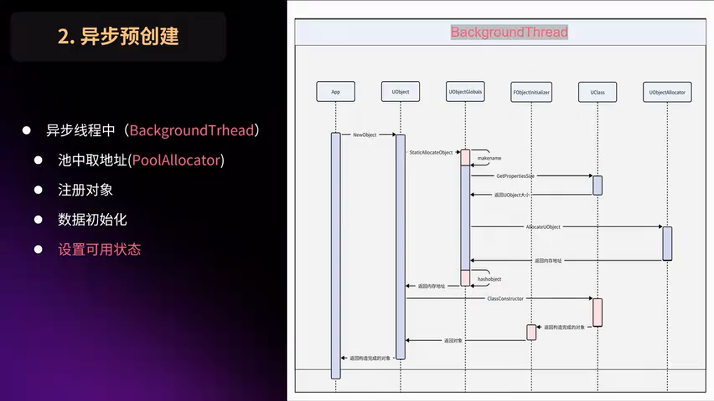

在异步线程中：
1. 首先从池中获取可用的内存
2. 然后进行注册对象和数据初始化的工作
3. 结束后将这段内存标记为可用状态

在游戏线程中：
- 调用 NewObject 的时候，只需要从池中检索可用对象，外加 Rename 即可

**关键注意事项**

1. **GC 锁定**：异步线程 NewObject 需要加上 GC 锁，避免在刚创建出来的时候就被 GC 标记为垃圾，还没使用就直接被回收掉

2. **清除 Async 标签**：因为在非游戏线程创建的 Object 默认都会加上 Async 标签。如果不清除的话，会导致无法 GC 造成内存泄漏

**优化效果：武器实例蓝图测试**

以武器实例蓝图为例，该蓝图中配置了武器的所有参数，包括动画、配件、弹道等。

- **原生 NewObject 耗时**：12.7 毫秒，其中 90% 以上都是数据初始化的耗时
- **配置对象池后**：在未改动任何代码的情况下，创建耗时从 12.7 毫秒降到 **88.8 微秒**，降幅达到 **99%**

优化效果显著！

优化后 NewObject 的消耗仅由以下 4 部分组成：
1. MarkName（标记名称）
2. 检索可用对象
3. 重命名
4. 对象标记使用状态

---

### 深度优化：进一步压榨性能

为了进一步压榨性能，团队从以下两部分入手：

**优化一：跳过命名流程**

如果业务层不关注对象的名字，可以直接使用对象池中默认的名字。这里可以节省掉起名字的 **14 微秒**的耗时。

**优化二：优化重命名逻辑**

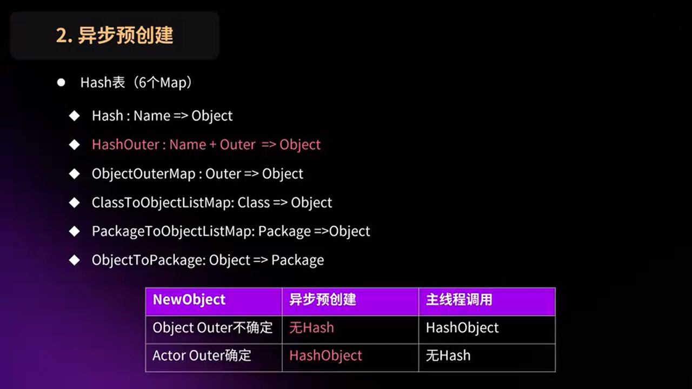

重命名操作包括卸载 Hash 和加载 Hash 两部分：
- **卸载**：解除 OuterClass 的映射关系，方便快速检索
- **加载**：Hash 表中已经提供了 6 个索引存储对象的映射关系，包括名字、Outer、Class 和 Package 等

由于在对象池中已经注册过 Hash 表了，所以在使用的时候需要考虑对象的名字和 Outer 有没有发生变化：
- **如果变化**：需要进行 Rename 操作，重新进行注册
- **如果没变**：可以省略重命名的消耗

因此在对象池预创建阶段：
- 如果无法确定 Outer 是什么，就不要去注册，等在游戏线程创建对象的时候再去执行 Hash 注册，这样就可以节省掉卸载 Hash 的成本

对于 Actor 的预创建：
- 由于它的 Outer 大概率是 World，所以可以执行注册
- 当游戏线程创建 Actor 的时候，由于名字和 Outer 都没有变，所以这里就节省了 Rename 的开销

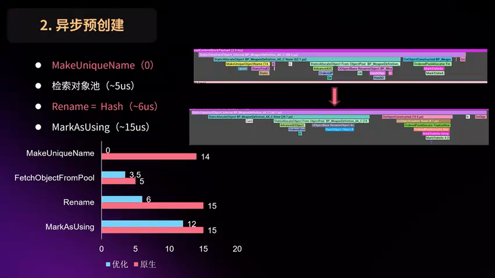

**优化效果**

优化后从性能文件中可以看到，NewObject 流程可以节省起名字和卸载 Hash 的成本，耗时从 88 微秒进一步降到了 **44 微秒**，性能提升了 **50%**。

---

### Actor 创建优化：组件创建与注册分离

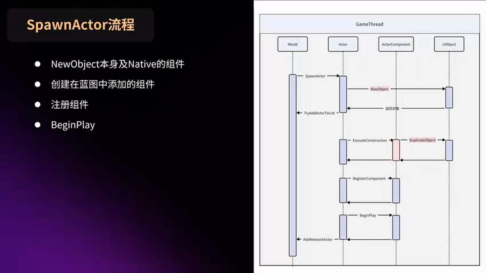

但是在 SpawnActor 的时候，还是有高耗时的情况。原因在于 SpawnActor 内部调用的 NewObject 仅仅是创建它的本身和 Native 的组件。

在蓝图中添加的组件是通过**复制**的方式来创建的：
1. 复制出来的实例再去执行组件的注册和 BeginPlay
2. 所以蓝图中添加的组件越多，创建的耗时就越久

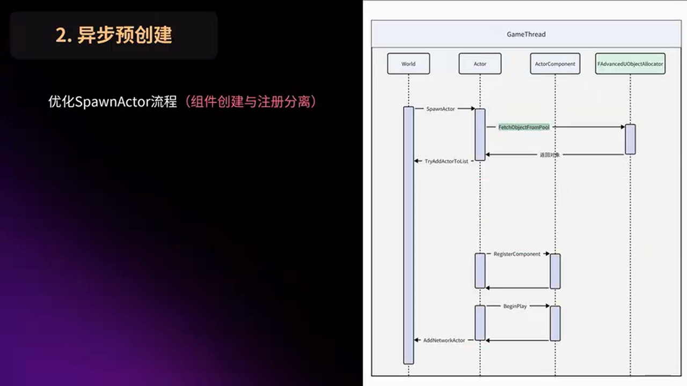

**优化方案：组件创建与注册分离**

因此团队采用组件的创建和注册分离的策略：

- **在异步线程中**：预创建对象以及它所有的组件，包括蓝图中添加的组件
- **在游戏线程中**：调用 SpawnActor 的时候，从对象池中获得的 Actor 就已经包含了所有的组件实例，不会再有复制组件的操作。接下来依次执行组件的注册和 BeginPlay

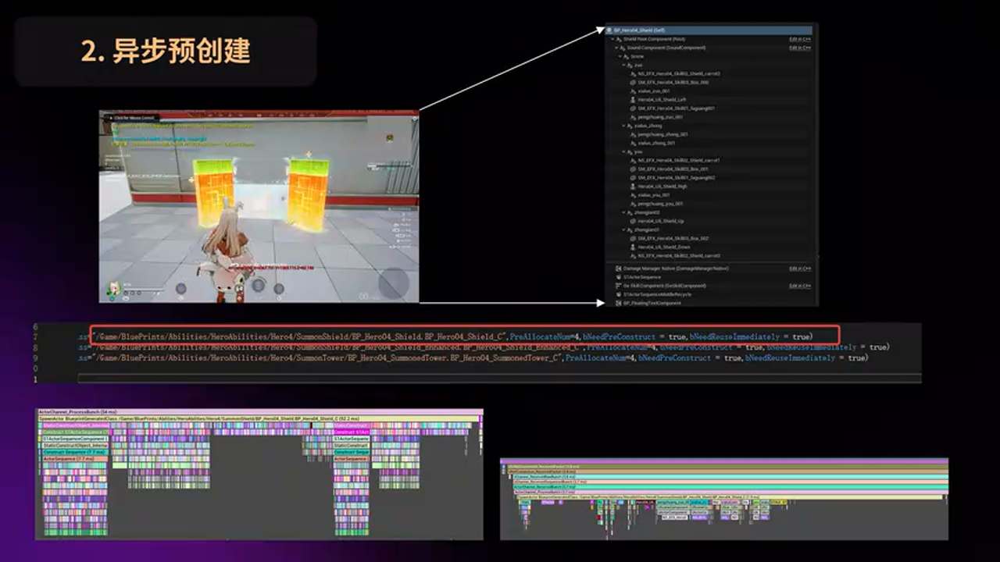

**测试案例：建筑师技能**

以建筑师技能为例，防御塔的 Actor 比较复杂，本身有 31 个组件，包括多个骨骼组件、动画组件和特效组件。

- **默认创建耗时**：52 毫秒
- **配置到对象池后**：创建耗时降到了 **1.9 毫秒**，优化了 **96%**

从性能文件中可以看到，剩余大部分的耗时都是在组件的注册上。如果想继续优化的话，可以考虑使用**分帧注册组件**。

---

## 三种回收机制的设计与实现

团队提供了三种回收方案，适配不同的业务场景：

1. **默认回收**：兼容当前 GC 流程，业务层无感知
2. **主动清理（Purge）**：跳过 GC 标记阶段，立刻执行清理流程
3. **主动复用（Reuse）**：不执行 GC 流程，清理完数据后可以立刻复用

---

### 回收机制一：默认回收

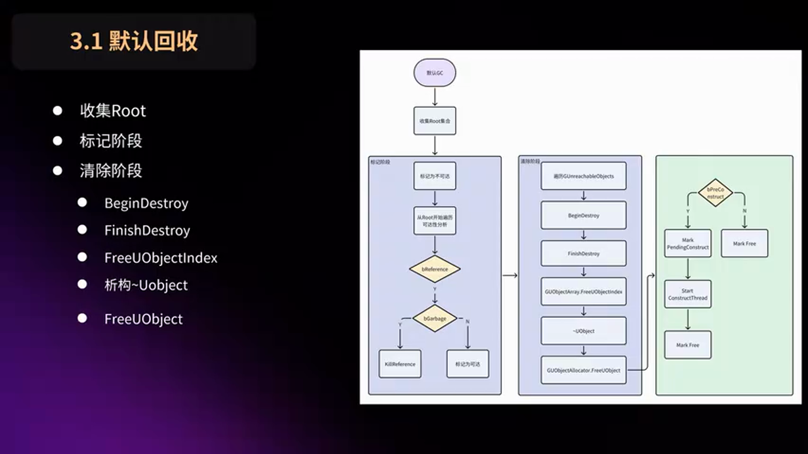

**引擎 GC 流程回顾**

引擎的 GC 流程可以分为三个阶段：

1. **标记阶段**：收集所有的根集对象，从根集对象开始遍历，将有引用关系的、并且未标记为 GARBAGE 的对象设置为可达。有 GARBAGE 标签的话，会将该变量置空，切断引用。

2. **清理阶段**：遍历不可达对象数组，在组件层进行分帧执行销毁流程。

3. **释放内存**：最后通过 FreeUObject 释放内存。

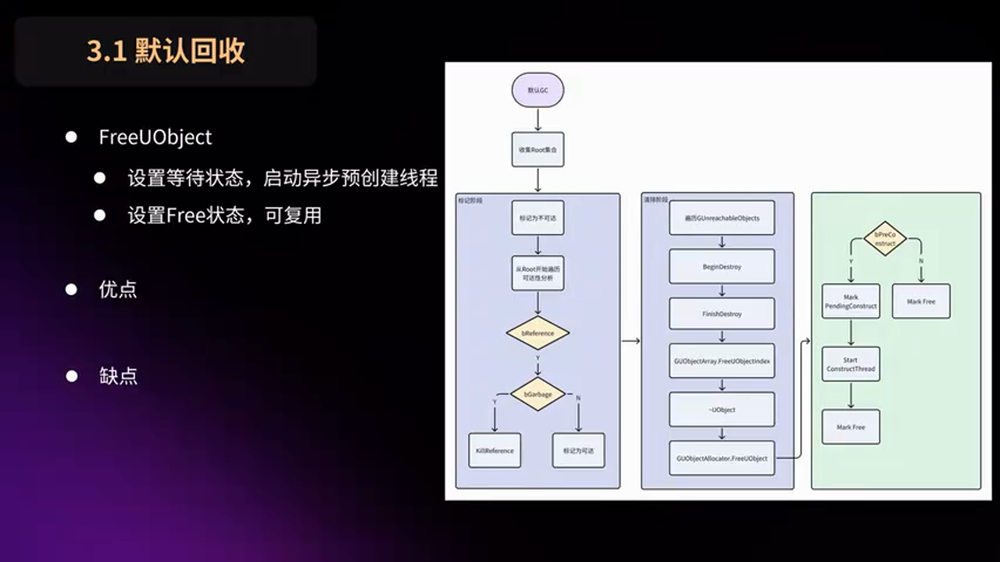

**对象池的接入点**

团队在最后释放内存的函数中去判断对象是否来源于对象池：
- **如果不是**：直接释放掉内存
- **如果来源于对象池**：后续会开启一个异步线程，重新基于这段内存去预创建对象

**优缺点分析**

> **优点**
> - 业务层无需任何改动
> - 加入到配置文件中即可生效

> **缺点**
> - 需要等待一个 GC 周期才会回收
> - 不适合于高频创建销毁的对象

---

### 回收机制二：主动清理（Purge）

为了解决高频创建销毁对象不能及时回收的问题，团队设计了 Purge 策略。

当对象被标记为 GARBAGE 的时候，说明业务层已经结束对象的使用，等待 GC 回收该对象。

**工作流程**

使用 Purge 方案的话，会跳过 GC 标记阶段，将自身和 SubObject 都加入到不可达列表中，执行销毁流程。当执行到释放内存的时候，后面再接入预创建流程，重新异步创建对象。

**优缺点分析**

> **优点**
> - 业务层无感知，配置 Purge 开关即可生效
> - 解决了高频创建销毁对象需要等待 GC 周期才会被回收的问题

> **缺点**
> - 由于没有执行 GC 的可达性分析流程，导致外部引用未被置空
> - 如果有外部引用的话，一定要使用**弱指针**来进行存储，否则会有逻辑错误

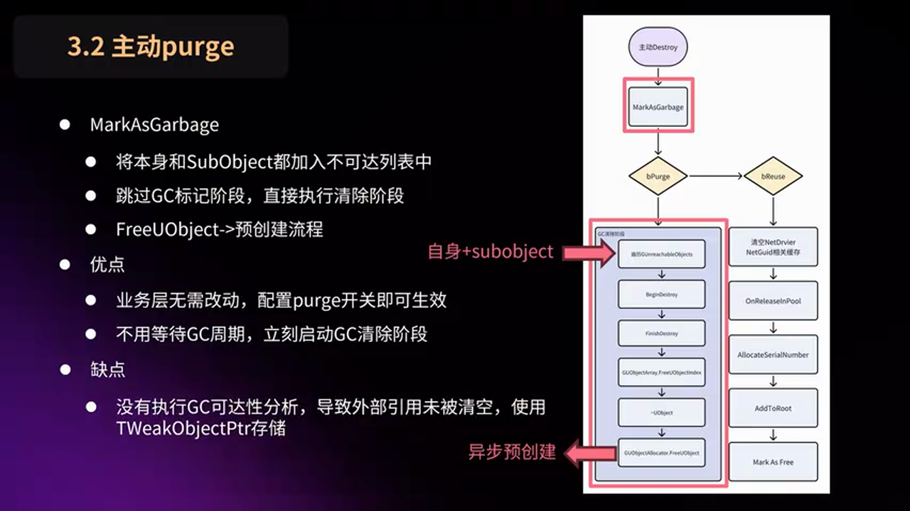

---

### 回收机制三：主动复用（Reuse）

如果使用 Reuse 方案的话，被标记为 GARBAGE 之后，整个 GC 流程都不会执行。需要手动清理缓存数据，最后清理完毕后立刻设置为可用状态，等待复用。

**网络同步对象的特殊处理**

需要特别注意的是，如果这个对象是支持网络同步的，需要对象池清理网络层相关的数据。

1. **清理映射关系**：首先是 NetGUID 和 UObject 的映射关系，需要清理这两个映射表。如果不清楚的话，客户端会认为已经创建过，不会再次执行生成 Actor 的流程。

2. **重置状态标记**：其次需要重置两个状态标记，否则复用后它的 SubObject 将无法同步属性。

**外部引用问题与弱指针解决方案**

Reuse 方案需要解决外部引用的问题。假设这样一个情况：

1. 从对象池中申请一个对象 A，并且有一个外部变量缓存该对象
2. 当对象 A 被回收之后，对象池中相同的位置又被对象 B 复用

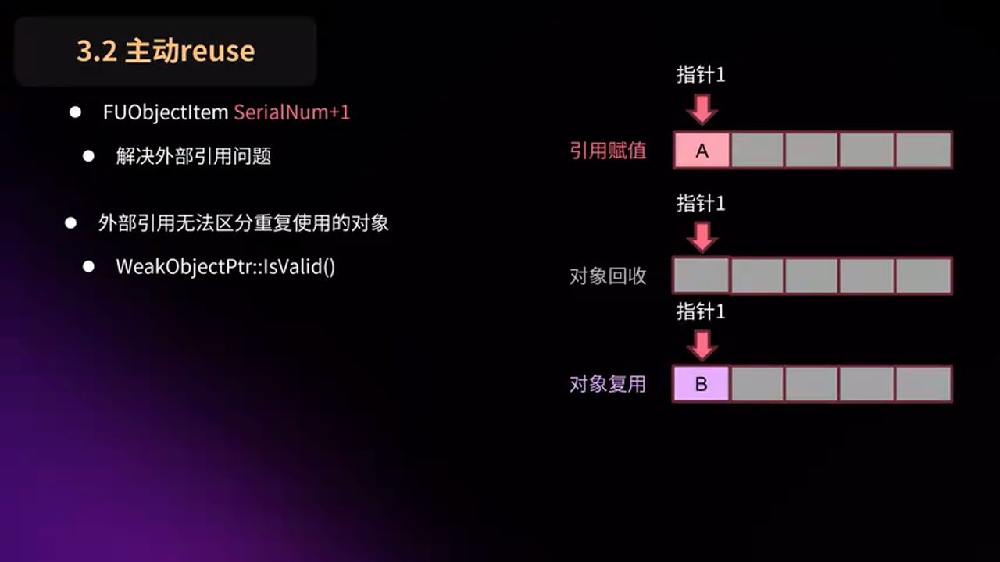

这种情况下，外部指针是没有办法区分出这个缓存的对象是否有变动的。因此需要一个**弱指针**来解决这个问题。

弱指针判断这个对象是否可用会经过以下几个步骤：
1. 首先判断指针地址是否为空
2. 其次判断 SerialNumber 是否一致
3. 最后判断 ObjectFlags 是否有 GARBAGE 和 PendingKill 标记

团队为对象池中的对象增加了一个额外的状态：**InPool**（在池中）。每次对象被回收到池中时，会将 InPool 标记置为 true。当弱指针判断对象是否可用时，会额外检查 InPool 标记，如果为 true 则认为对象不可用。

---

## 工具链支持：从发现问题到解决问题

团队开发了一套完整的工具链来支撑对象池的使用和优化。

### 工具一：UE Insights 性能分析

使用 UE 自带的 Insights 工具进行性能分析，快速定位创建对象的性能瓶颈。通过 Trace 数据可以清晰地看到 NewObject 的各个阶段耗时分布。

### 工具二：对象池配置验证

开发了配置验证工具，自动检测对象池配置的合理性：
- 检测是否存在 InstancedComponent 配置错误
- 验证预分配内存大小是否合适
- 统计对象池使用情况和命中率

### 工具三：内存布局可视化

开发了内存布局可视化工具，帮助开发者理解对象在内存中的排布情况，验证聚合 Tick 优化的效果。

---

## 实战总结与最佳实践

### 配置建议

基于项目经验，团队给出以下配置建议：

**1. 多平台配置策略**

由于不同平台下对象池的类型和数量会有差异（比如服务端可能配置 100 个角色，客户端可能只需要 50 个），建议使用引擎的配置文件多平台功能：
- 将通用的配置写到 Default.ini 当中
- 特定差异的配置写到不同平台下的 ini 当中

**2. 聚合 Tick 对象优先配置**

对于聚合 Tick 的对象，数量超过 100 的话，就直接配置到对象池中即可。这类对象能够充分发挥内存连续排布带来的缓存优化效果。

**3. 创建卡顿对象的策略选择**

对于创建卡顿的对象：
- 如果属于长生命周期，或者实例数量不是特别多，仅需要开启预创建即可，回收由 GC 默认控制
- 如果是短生命周期且高频创建，需要配合业务同学选择合适的回收策略（Purge 或 Reuse）

**4. 高频创建销毁对象的处理**

对于高频创建销毁的对象，需要和调用的业务同学来配合，去选择合适的回收策略：
- **Purge 方案**：适合外部引用较少或可以改为弱指针的场景
- **Reuse 方案**：适合完全由对象池管理生命周期的场景，需要业务层配合清理缓存

---

### 方案对比

> **方案 A：默认回收（GC 驱动）**
> - 🟢 优势：业务层零改动，配置即生效
> - 🔴 劣势：需要等待 GC 周期，不适合高频场景
> - 🎯 适用场景：长生命周期对象、创建卡顿但销毁不频繁的对象

> **方案 B：主动清理（Purge）**
> - 🟢 优势：立即回收，无需等待 GC 周期
> - 🔴 劣势：需要使用弱指针管理外部引用
> - 🎯 适用场景：高频创建销毁、生命周期短、外部引用可控的对象

> **方案 C：主动复用（Reuse）**
> - 🟢 优势：最快的复用速度，完全跳过 GC 流程
> - 🔴 劣势：需要手动清理缓存，网络同步对象需要特殊处理
> - 🎯 适用场景：极高频创建销毁、生命周期极短、业务层可配合清理的对象

---

### 避坑指南

**陷阱 1：InstancedComponent 无法单独配置**

如果发现某个 Actor 下的组件创建耗时，不要尝试单独配置组件到对象池，而是应该配置整个 Actor。

**陷阱 2：外部引用未使用弱指针**

使用 Purge 或 Reuse 方案时，所有外部引用必须使用弱指针，否则会导致逻辑错误（访问到已回收或被复用的对象）。

**陷阱 3：网络同步对象的数据残留**

对于网络同步的对象，使用 Reuse 方案时必须清理 NetGUID 映射关系和同步状态标记，否则会导致同步失效。

**陷阱 4：Async 标签未清除**

异步线程创建的对象必须清除 Async 标签，否则会导致 GC 无法回收，造成内存泄漏。

**陷阱 5：对象池数量配置不足**

很难精准把控对象池的数量，因为总会有特殊情况（比如所有玩家都喜欢扔手雷）。建议实现动态扩容方案，当数量不足时自动预创建一批新的对象。

---

## 未来优化方向

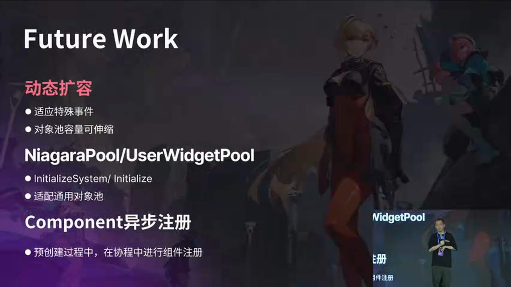

团队规划了以下未来的优化工作：

**1. 动态扩容方案**

在迭代中发现很难精准把控对象池的数量。因为难免会有些特殊情况，比如这一局所有的玩家都喜欢扔手雷，导致手雷配置的数量不足，造成创建的卡顿。因此需要一套动态的扩容方案，当数量不足的时候，再预创建一批新的对象供业务层使用。

**2. 特定类型对象池的集成**

目前默认提供了几个特定类型的对象池，比如 NiagaraParticle 和 Widget 的池。它们有个共同的特点：本身没有复杂的构造函数，也没有太多 SubObject，所以创建本身不会很耗时。

但是创建出来的实例后面一般都会跟着一个初始化函数，这个函数会非常地耗时。比如一个复杂的 UI 界面，它的初始化函数中会复制它的 WidgetTree，这个复制的操作可能会有几百毫秒的耗时。

因此接下来团队将尝试将这种定制的对象池接入到通用对象池中，进一步扩大对象池的适用范围。

**3. 分帧注册组件**

对于组件数量特别多的 Actor，即使使用了对象池，组件注册阶段仍然会有一定耗时。可以考虑将组件注册拆分到多帧执行，进一步降低单帧卡顿。

**4. 内存池的自适应优化**

根据运行时的对象使用情况，动态调整内存池的大小和分配策略，实现更智能的内存管理。

---

## 总结

本文介绍了萨罗斯网络科技在**命运班机**项目中实践的 UE5 通用对象池解决方案。通过**异步预分配内存**、**异步预创建对象**和**三种回收机制**的设计，成功解决了传统对象池的三大痛点：

1. Loading 时间过长 → 异步创建，主线程无感知
2. 回收策略单一 → 三种策略适配不同场景
3. 依赖人力清理 → 框架层统一处理

实测数据显示：
- 武器实例蓝图创建耗时从 12.7 毫秒降到 **88.8 微秒**，优化 **99%**
- 建筑师技能 Actor 创建耗时从 52 毫秒降到 **1.9 毫秒**，优化 **96%**
- 聚合 Tick 优化使 CPU 缓存糟糕度因子降低 **33%**

这套方案不仅适用于射击类游戏，对于任何需要大量创建销毁对象的 UE5 项目都有参考价值。希望本文的分享能够帮助更多开发者优化项目性能，提升玩家体验。

---

**关于作者**

邱子鉴，萨罗斯网络科技 Gameplay 客户端开发，2014 年毕业至今参与过多款西游项目的制作，包括《项目乡战》《APEX Mobile》等。主要负责的模块有 UI、Gameplay、技能、网络和回放系统。目前在命运班机项目组负责模式玩法相关功能的开发以及性能优化的工作。

---

🔗 **相关链接**
- 原视频：https://www.bilibili.com/video/BV14RU7BJEUk
- UE5 官方文档：https://docs.unrealengine.com/5.0/
- 育碧开源 CPU 缓存测量工具：相关资源可在 GitHub 搜索

---

💬 **加入技术交流**

如果您在实践中遇到任何问题，或者有更好的优化方案，欢迎加入我们的 UE5 技术交流群进行讨论！扫描文章开头的二维码添加微信，备注"UE5技术交流"即可。

---

🤖 *本文由 AI 基于 UFSH2025 技术分享视频生成，结合了深度技术解析和实战经验总结。*