# 五年老游戏的引擎新生：UE4.25 深度改造与性能优化实战

---

## 加入 UE5 技术交流群

如果您对虚幻引擎5的图形渲染技术感兴趣，欢迎加入我们的 **UE5 技术交流群**！

扫描上方二维码添加个人微信 **wlxklyh**，备注"UE5技术交流"，我会拉您进群。

在技术交流群中，您可以：
- 与其他UE开发者交流渲染技术经验
- 讨论图形编程、性能优化、构建工具流、动画系统等话题
- 分享引擎架构、基建工具等项目经验和技术难题

---

**源视频信息**
- **视频标题**: [UFSH2025]又老又新：一个上线5年游戏的引擎新突破 | Teng & Lebron 莉莉丝 资深引擎工程师
- **视频链接**: https://www.bilibili.com/video/BV1gSW4zMEXA
- **视频时长**: 约41分钟
- **AI生成说明**: 本文基于AI技术对视频内容进行整理和深度解析，结合截图进行图文并茂的呈现。

---

> **导读摘要**
> 
> - 本文深入解析莉莉丝《远光84》项目如何在 UE4.25 基础上进行深度改造，实现渲染、性能和工具链的全面升级
> - 核心技术路线：Volumetric Lightmap 显存优化 + SSR/SSAO Tile 剔除 + VRS/VRR 可变分辨率 + Streaming 全链路优化
> - 前置知识：UE4 渲染管线基础、GPU 性能分析、移动端图形 API

---

## 一、项目背景与技术挑战

### 1.1 项目概述

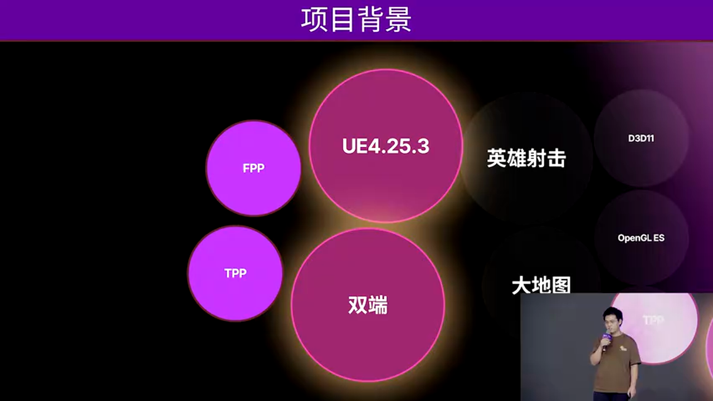

《远光84》是莉莉丝旗下的英雄射击大逃杀游戏，目前面向 PC 和移动端发行，支持 FPP/TPP 双视角切换，主打高机动性和快速节奏的体验。游戏中不仅有多样化的英雄技能和各类载具，还有独特的组合玩法。

**技术栈选型**：
- 引擎版本：**UE 4.25**
- 图形 API：**D3D11 + OpenGL ES + Metal**
- 全局光照：**Volumetric Lightmap (VM)**

由于 UE 4.25 版本的 D3D12 和 Vulkan 支持还不够完备，项目选择了相对成熟的图形 API 组合。

### 1.2 核心挑战

作为一个上线五年的项目，团队面临的核心挑战包括：

1. **引擎版本老旧**：4.25 缺少高版本的诸多优化特性
2. **双端兼容**：PC 和移动端需要共用一套资产和配置
3. **显存压力**：大世界场景下 VM 数据量巨大
4. **性能瓶颈**：SSR、SSAO 等后处理开销过高
5. **烘焙时长**：全场景烘焙需要数小时

团队的策略是：**合并高版本特性 + 自研改造引擎**，实现引擎功能的持续升级。

---

## 二、渲染优化：Volumetric Lightmap 改造

### 2.1 VM 原理简述

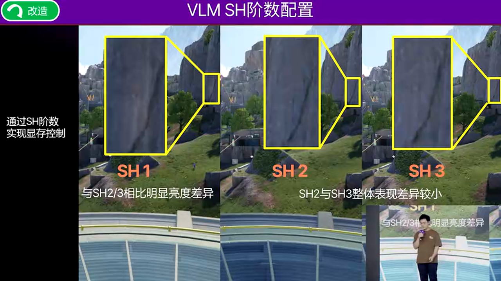

Volumetric Lightmap 的实现方案：
- 在物体周边均匀生成采样点
- 使用**三阶球谐（SH3）**记录光照信息
- 数据记录到关卡的 MapBuildData 中
- 运行时上传到 GPU 的 3D 贴图进行计算

在最新的明日城地图中，采用 **3 米一个采样点** 的密度，使用原版方案时显存占用高达 **2GB**。

### 2.2 显存优化方案

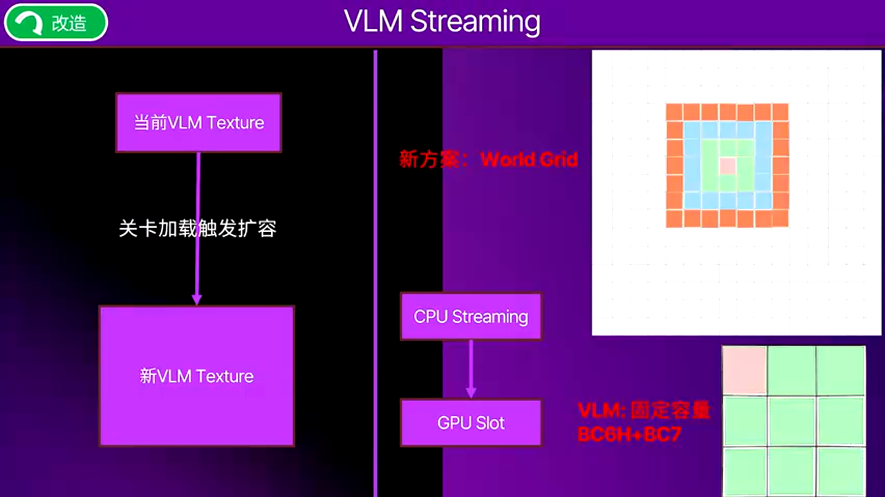

**问题一：SH 阶数过高**

通过对比 SH2 和 SH3 的差异，发现视觉差别较小，可以通过打光调整来弥补。将 SH 阶数改为可配置后：
- **SH3 → SH2**：显存降低约 **1/3**
- **SH1**：只在低端机型使用

**问题二：数据扩容导致卡顿**

当大量关卡触发加载时，VM 会新建更大的 3D 贴图，将旧数据拷贝过来，导致显存峰值翻倍。

**解决方案：基于 Grid 的均面方案**

1. 将整个场景划分为 N×N 的 Grid
2. 烘焙时将 Mip0 数据写入对应的 Grid 块
3. FallbackMip 作为常驻数据一直加载
4. 运行时根据相机位置判断需要加载哪些 Grid
5. 预先创建好 3D 贴图的最大尺寸，避免扩容

**优化效果**：
- 场景划分为 16×16 Grid 时，大多数时候只需加载 3-4 个 Mip0 数据
- 显存占用下降到原来的 **1/5 ~ 1/6**

**BCR 压缩**：
- SH0 使用 **BC6H** 格式
- 其他数据使用 **BC7** 格式
- 整体再降低 **1/4**

### 2.3 漏光问题处理

漏光问题使用传统方案处理：

1. **Bent Normal**：为全局设置一个 Scale，保证大部分物体漏光得到改善
2. **逐物体调节**：对特定物体单独调整
3. **Sky Occlusion with Block**：为结构复杂的物体单独烘焙一张图，记录逐像素的短距离天光可见性，向该方向做偏移

---

## 三、屏幕空间效果优化

### 3.1 SSR 半分辨率优化

**问题**：SSR 的 GPU 开销非常高

**初步尝试**：直接用半分辨率或更低分辨率计算，但效果很差，出现大量噪点。

**问题分析**：SSR 计算后 Alpha 通道的置信度不连续，导致与其他反射信息混合时出现问题。

**解决方案**：对 Alpha 通道做**预滤波**，再进行后续的上采样行为。

优化后效果明显改善，噪点问题得到解决。

### 3.2 Tile-Based 剔除

**核心思想**：根据 GBuffer 中的材质信息，判断每个 Tile（8×8 像素）是否需要计算 SSR。

**实现方式**：
- 判断 Tile 内是否有需要 SSR 的像素
- 黑色区域完全不需要计算
- 在正常视角下可以剔除大量计算

**SSAO 同样适用**：

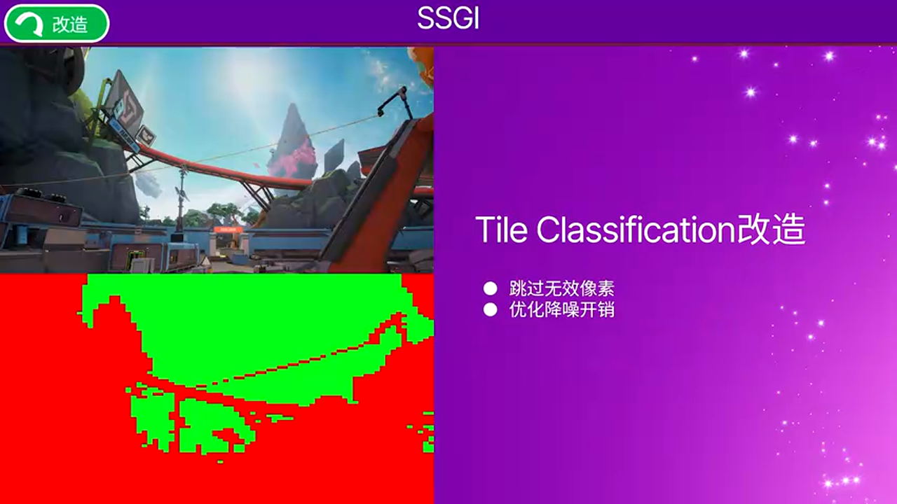

SSAO 也采用相同的 Tile 剔除方案，效果同样显著。

---

## 四、移动端平台优化

### 4.1 iOS VRS 实现

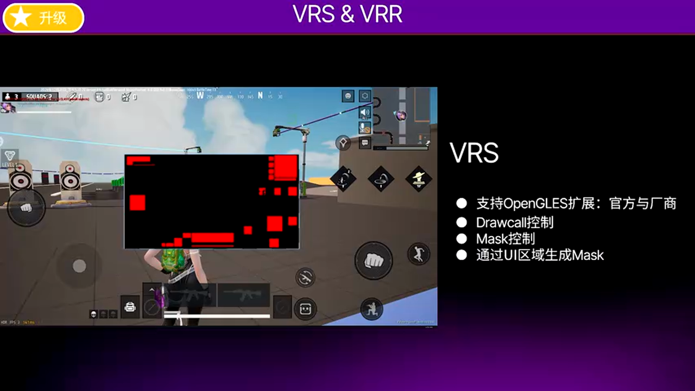

由于项目使用 OpenGL ES，团队实现了一套 VRS（Variable Rate Shading）：

**焦点级别控制**：根据 UI 层标记的着色率设置不同区域

**Pass 级别控制**：
- 生成一张 Mask 贴图
- 标明整个场景各区域的着色率
- 不需要每帧都生成，隔几帧或遮挡区域变化超过阈值才更新

**效果**：开启 2×MSAA 配合适当着色率，UI 遮挡的场景部分没有明显变化。

### 4.2 安卓 VRR 实现

安卓平台没有 VRS，但有**可变光栅化率（VRR）**：

**原理**：
- 根据屏幕不同区域指定光栅化率
- 输出一张扭曲的小分辨率图
- 画面带有一定的挤压和扭曲

**优势**：低带宽
**劣势**：对 Shader 侵入性很强，需要处理所有使用屏幕坐标变换的地方

**实现挑战**：
- UE 使用 MTLPP 库做 C++与 ObjC 的桥梁，需要先给 MTLPP 加 VRR 支持
- SPIRV-Cross 没有 VRR 的 Shader 语法支持，通过文本替换注入

**性能收益**（开启 2×MSAA）：
- 像素着色量下降 **8%**
- 平均指令数下降 **5.36%**
- 纹理采样下降 **4.1%**
- GPU 占用下降 **8%**
- 总功耗下降 **15.36%**

---

## 五、阴影与超分方案

### 5.1 阴影方案

**移动端**：
- 局外同屏使用 **Perspective Shadow Map** 提供高精度阴影
- 局内使用 **CSM + 烘焙阴影**

**PC 端**：
- 室内：CSM + 烘焙阴影
- 室外：CSM + **Far Shadow**，提供远距离高质量表现

**优化手段**：
- CSM 缓存
- 带宽影优化
- 自动化关闭阴影投射流程

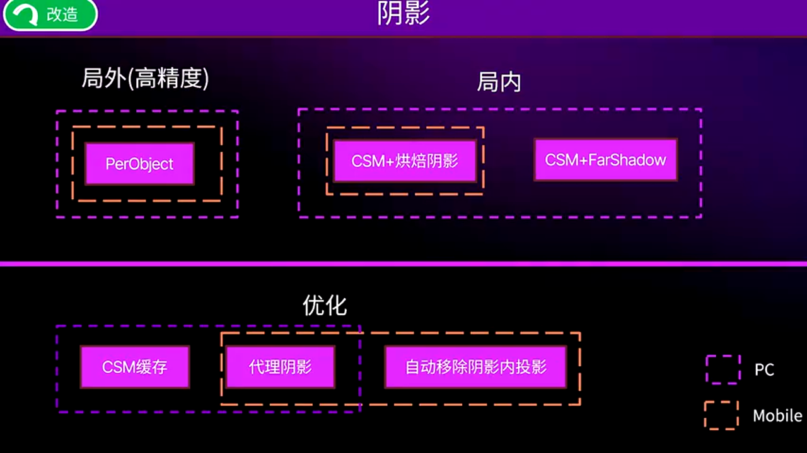

**自动化流程**：
1. 从灯光视角生成 PrimitiveID
2. 选择后知道哪些 Primitive 最终可见
3. 对比知道哪些物体完全处于其他物体阴影内
4. 自动关闭这些物体的阴影投射

### 5.2 超分方案

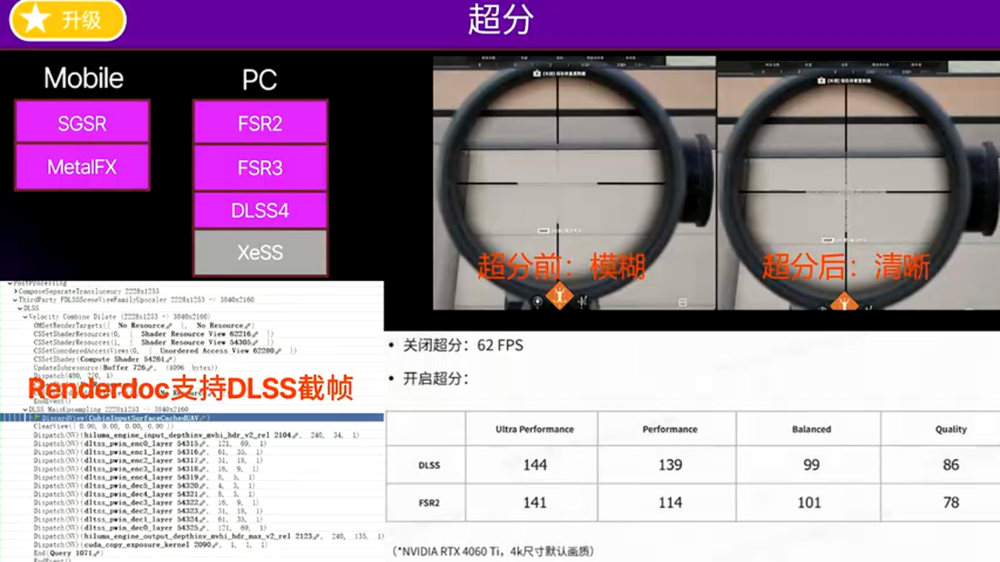

由于 UE 4.25 没有 TSR，主要依赖厂商 SDK：

- **PC**：DLSS、FSR2、FSR3、XeSS（集成中）
- **Mobile**：SJSR、MobileFX

**半透明问题**：D3D11 无法使用 Reactive Mask，导致半透明物体变模糊。

**解决方案**：超分后再用 Mask FX 对半透明区域单独锐化。

**性能效果**：
- 关闭超分：4K 分辨率在 4060Ti 上只能跑 60 帧
- 开启超分：可达 80-144 帧

为了方便调试黑盒的 DLSS，团队还给 RenderDoc 支持了 DLSS 集成，引入了 NVIDIA 的 Streamline 支持。

---

## 六、烘焙优化与双端分离

### 6.1 烘焙时长优化

随着场景密度提升，烘焙面临的问题：
1. 烘焙时长过长
2. Lightmap 和 VM 显存占用大
3. 双端需要尽可能共用资产和配置

**优化措施**：
- 使用 UE 的 **GPU Lightmass** 方案加速
- **Embree 向量化**：在支持 AVX512 的机器上获得 10%-20% 提升
- 根据统计数据调整 Lightmap 分辨率和灯光数量
- PC 场景不烘 Lightmap，使用全动态光方案
- 为 Grass 等纯动态数据定制烘焙方案

**最终效果**：全场景烘焙时间从 **8 小时压缩到 3-4 小时**

### 6.2 草地 Lightmap 处理

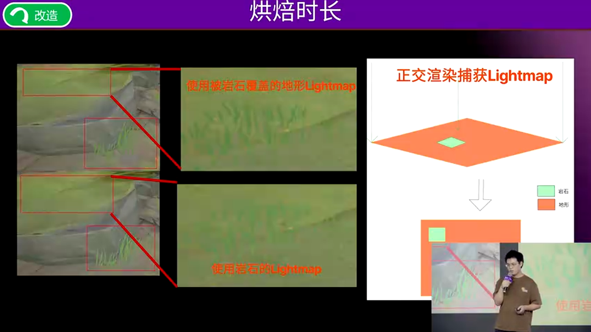

草地的 Lightmap 采用特殊方案：
1. 从顶视图做一次渲染
2. 捕获整个地形及地形上所有物体的 Lightmap 信息
3. 进行回读和重量化
4. 得到专属于草地的 Lightmap

这样还可以解决草地长在岩石上时 Lightmap 信息不对的问题。

### 6.3 Lightmap 显存优化

**移除方向性**：Lightmap 的方向性移除后，显存占用直接减少一半。

**布局优化**：
- 原版布局经常产生大量浪费
- 使用**贪心算法**改造布局方案
- 每次评估是否是更方正的布局
- 允许宽高比放宽到 1:2、1:4

### 6.4 双端资产分离

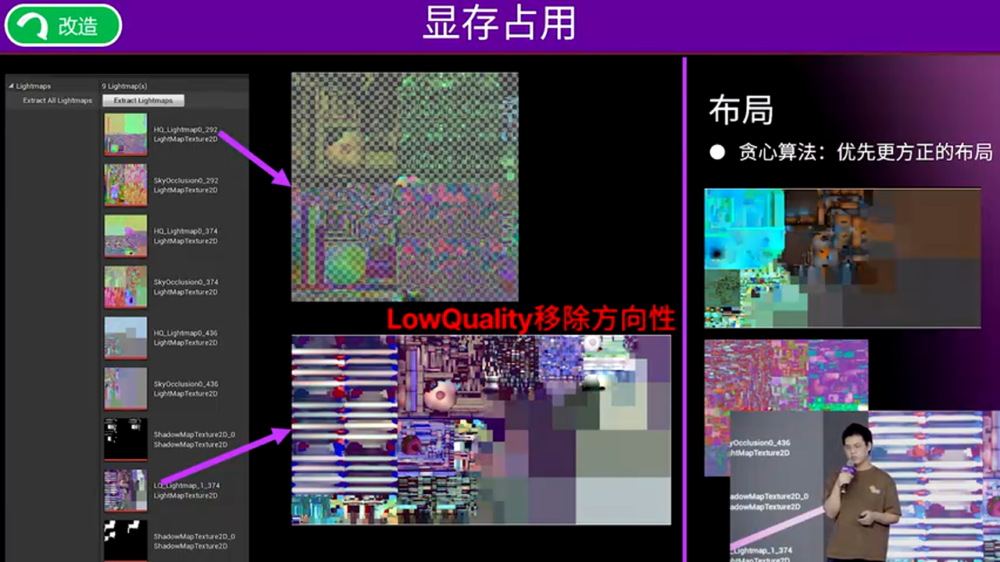

**需求**：
- PC 使用高质量模型和更高的 Lightmap 精度
- 移动端加载更轻量的版本
- 运行时实现 PC 和移动端的渲染结构差异
- 保持双端碰撞和剔除的一致性

**实现方案**：
- 在 Mesh 层面挂载一个 PCMesh
- PCMesh 只用于 PC 平台的渲染和烘焙输入
- 逻辑层完全不需要感知，通过统一接口访问

**配置分离**：
- 烘焙时可指定目标平台
- 使用不同的 Lightmap UV
- 双端使用完全不同的 Lightmap 精度
- MapBuildData 也彻底分离

### 6.5 间接光处理

**移动端**：
- Lightmap 精度不高，直接作为间接光表现会很糊
- 使用**天光**做间接光计算
- Lightmap 用于调制 GI 的亮度和颜色信息

**PC 端**：
- 室内：大量使用高精度 Lightmap 打光
- 室外：完全不烘焙，使用 **VM + 天光** 做间接光计算

---

## 七、Streaming 全链路优化

### 7.1 PVS Streaming

在移动端大量使用 PVS 优化可见性剔除效率，但一次性加载整张大地图的 PVS 数据内存消耗惊人。

**PVS Streaming 机制**：
1. 场景拆分成不同的 Bucket
2. 相机位置变化时触发异步加载
3. 反序列化后传递给 Software Occlusion
4. 更新可见性数据用于剔除
5. 保留当前 Bucket 周边数据避免频繁加载卸载

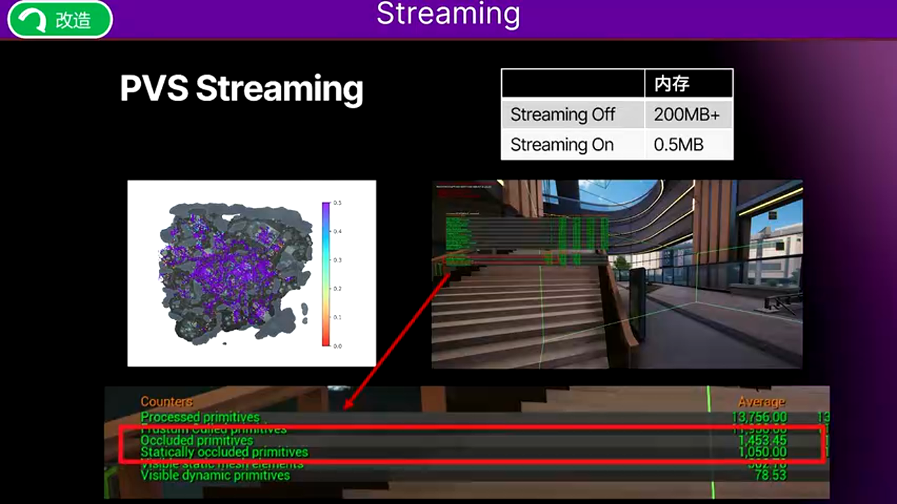

**优化效果**：
- 核心区域剔除率在 **50% 以上**
- PVS 内存占用从常驻 **200MB 压缩到 0.5MB**

### 7.2 关卡 Streaming 优化

最新地图有 **1000+ 个 Streaming 子关卡**，每个子关卡资产量很大。

**全链路优化**：

**遍历阶段**：
- 借鉴 UE5 World Partition 思想，将场景分成不同 Cell
- 只遍历当前 Cell 里的关卡
- 对子关卡分组，每帧只处理一部分

**异步加载阶段**：
- 加入 Level 加载优先级控制
- 限制并发加载的关卡数量
- 确保玩家跳伞快速落地时最重要的关卡优先加载完成

**PostLoad 和 CreateBuffer 阶段**：
- 动态调整 PostLoad 的 TimeBudget
- 单帧统一 TimeBudget 处理
- 针对 StaticMesh、ISM 等资源设置 PostLoad 数量上限
- 砍掉不必要的 Buffer（Reverse Index Buffer、邻接 Buffer 等）
- 通过 BufferPool 管理减少单次 CreateBuffer 耗时

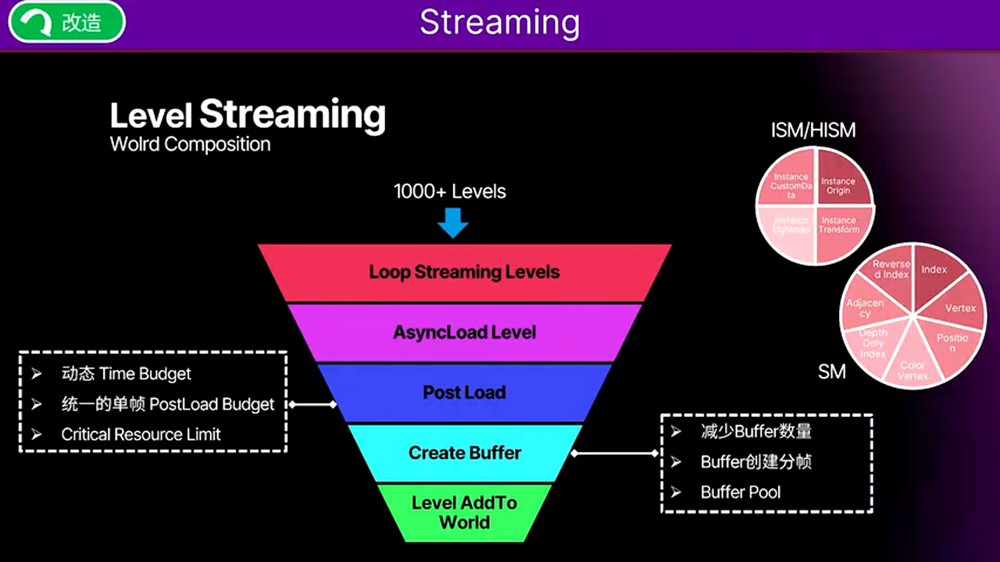

**LevelToWorld 阶段**：
- 加入分状态的 Budget 控制，超时提前结束当帧
- 跳过不必要的流程（如无偏移时跳过 ApplyWorldOffset）
- 新增关卡分帧卸载状态，确保 LevelWorld 卸载充分分帧

### 7.3 Texture Array Streaming

随着场景迭代，逐渐用起了 Texture Array（后续减轻 Draw Call）。

**问题**：
- 多个据点靠近时，内存中可能同时出现多套 Texture Array
- 4.25 版本的 Texture Array 不支持 Streaming

**解决方案**：
- 合并高版本的 Texture Array Streaming 支持
- 控制每帧 Array 单次更新 Texture 的数量，避免卡顿

---

## 八、粒子系统优化

### 8.1 粒子效果概述

粒子效果广泛应用于枪械、技能和道具系统，极大丰富了视觉表现，但也成为性能重灾区。

### 8.2 动态粒子合批

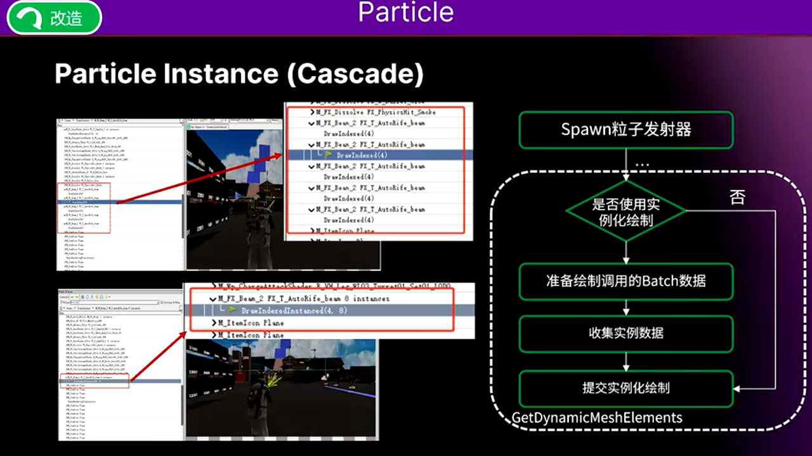

项目使用 Cascade 粒子系统，不同 Emitter 特效没有 Instancing。

**解决方案**：加入动态粒子合批，让同类型同材质的粒子统一走 Instancing 绘制。

**核心实现**：在 `GetDynamicMeshElements` 中，如果设置使用实例化绘制，会取 Setup 的 Batch 数据，收集所有相关实例需要更新的数据，最后提交到材质进行实例化绘制。

### 8.3 Ribbon Trail GPU 化

项目大量使用 Ribbon Particle 做武器弹线、喷气背包尾迹效果。

**原版问题**：各顶点信息（Position、Rotation、Tangent 等）在 CPU 侧插值计算，之后再更新上传顶点数据。

**优化方案**：
- CPU 侧只更新每个 Segment 的 Start 和 End
- 将顶点插值放到 Vertex Shader
- 避免 CPU 端模拟开销
- 更方便做合批

### 8.4 粒子多线程调度优化

**问题**：GameThread 在 SetupFace 阶段发起 Particle 异步任务后，会等待任务结束，形成长达 1ms 的气泡。

**原因**：ParticleManager 要求当前 Tick 发出的异步特效任务必须在 Tick 结束前完成。

**优化方案**：
1. 修改 Particle 系统多线程调度策略，在 RenderFace 调用之前异步特效任务不会阻塞 GameThread
2. 对于挂在 SkeletalMesh 上的特效，只要依赖的 SkeletalMesh Tick 完成就提前触发特效，防止特效堆积在最后的 Tick

---

## 九、UI 优化

### 9.1 Global Invalidation 预案

UI 在游戏里是性能大户，团队做了一系列优化。

**SlowPath vs FastPath**：
- **SlowPath**：无论更新哪些 UI 节点，都会全量更新整个 UI 树
- **FastPath（Global Invalidation）**：只局部更新相关节点，未被影响的节点不产生更新开销

UE 4.25 已有 FastPath 代码但不完善，团队合并了高版本的大量更新。

**切换效果**：UI 性能提升约 **50%**

**代价**：出现 UI 不更新或残留的 Bug，原因包括：
- 局部更新导致外部 UI 层级关系失效
- 更新 UI 没有触发 Dirty 操作
- 部分控件本身有 Bug

**解决方案**：
- 框架层预留足够的 Layer
- 针对性修复问题控件

### 9.2 UI Animation 优化

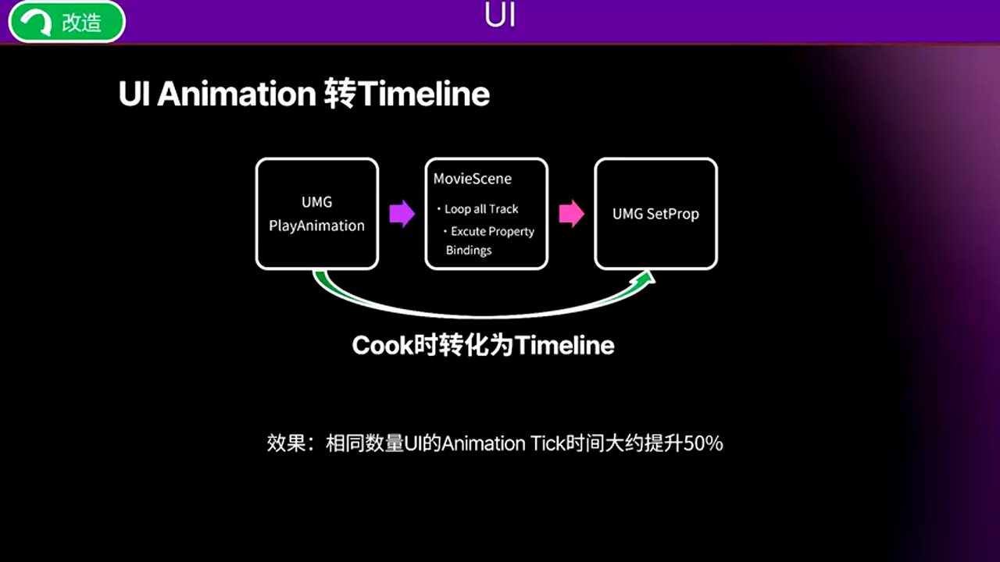

UE 的 UI Animation 相对重度，底层复用了 Sequencer 模块逻辑，会构建大量 Object 对象，运行时 Evaluate 时开销非常重。

**解决方案**：将 UI Animation 转化为 **Timeline**

- Timeline 更轻量，对内存更友好
- 在 Cook 阶段进行转化，对上层使用者完全透明
- 测试案例下性能收益约 **50%**

### 9.3 内存分配器选择

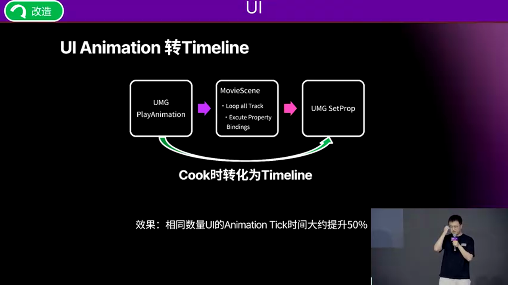

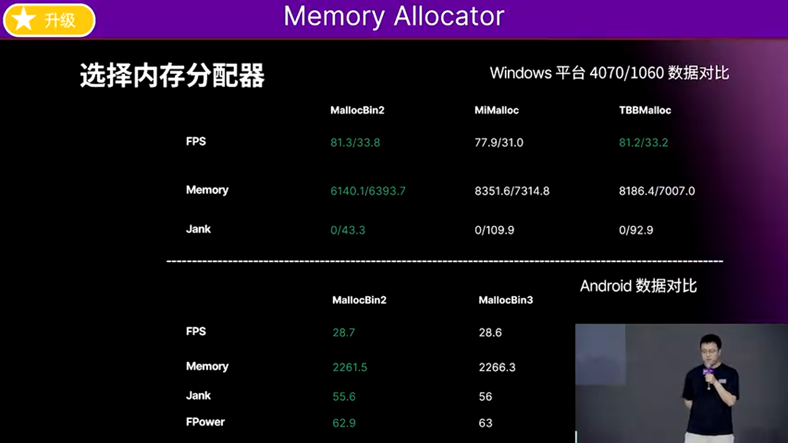

团队咨询过 UE 官方，测试结果：
- **内存**：Binned3 > Binned2 > Mimalloc
- **帧率**：Mimalloc > Binned3 > Binned2

由于更在意帧率表现，PC 上合并了 UE5 升级的 Mimalloc 版本。

**移动端测试**：Binned2 和 Binned3 不分伯仲，甚至 Binned2 略好，因此移动端仍选择 Binned2。

---

## 十、工具与分析优化

### 10.1 PSO Warmup 加速

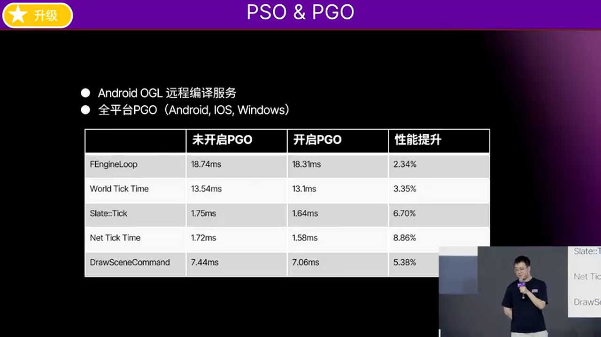

在安卓上 PSO Warmup 非常耗时。

**解决方案**：利用安卓 OpenGL ES 的多线程并发预编译 PSO 能力，最多减少约 **60%** 的时间。

### 10.2 PGO 支持

合并高版本引入的安卓和 Windows 平台 PGO（Profile-Guided Optimization）支持。

**PGO 原理**：通过在代码中生成插桩，实现更激进、更精准的优化，包括分支预测、函数内联、循环展开、寄存器分配等。

**收益**：整体性能提升 **1%-5%**

### 10.3 Insight 工具集成

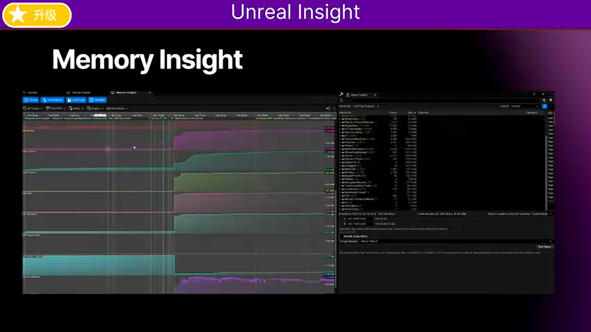

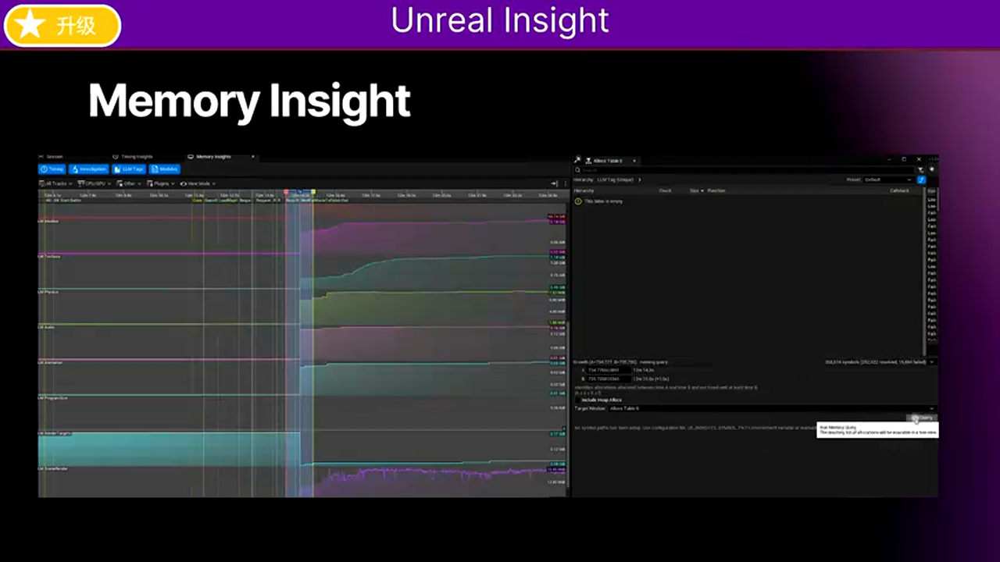

团队集成了多个高版本 Insight 工具：

**Memory Insight**：
- 圈选内存增长异常的时间段
- 查看内存分配的分类和堆栈
- 快速定位内存问题

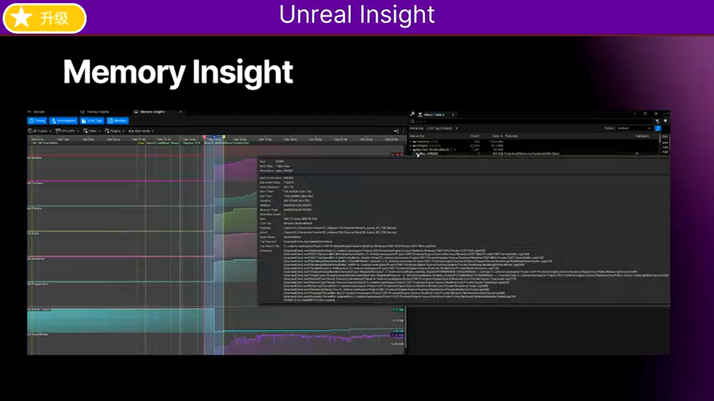

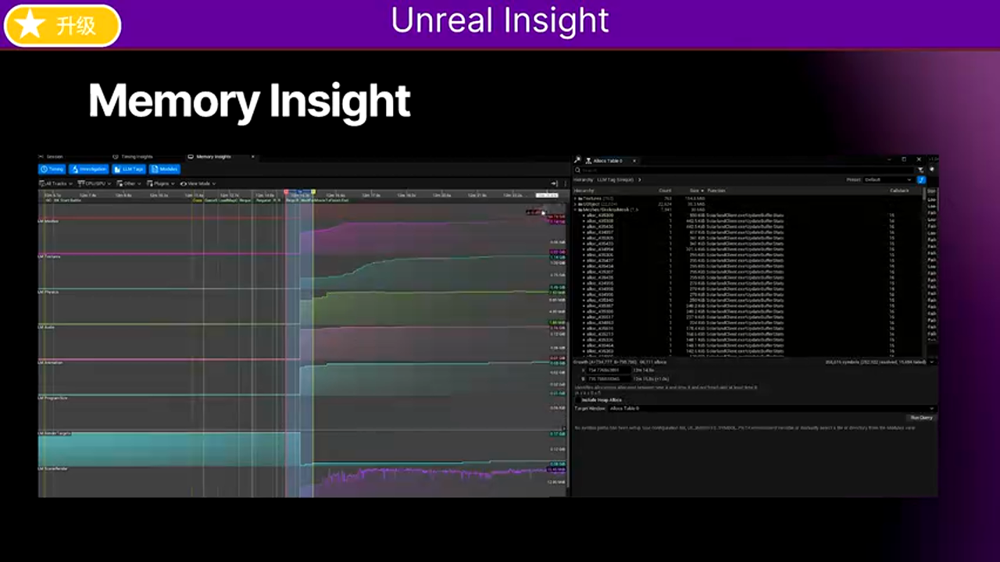

**Task Insight**：
- UE5 新加模块
- 定位多线程问题非常方便
- 可以看到任务发起位置、执行时长、是否阻塞其他线程

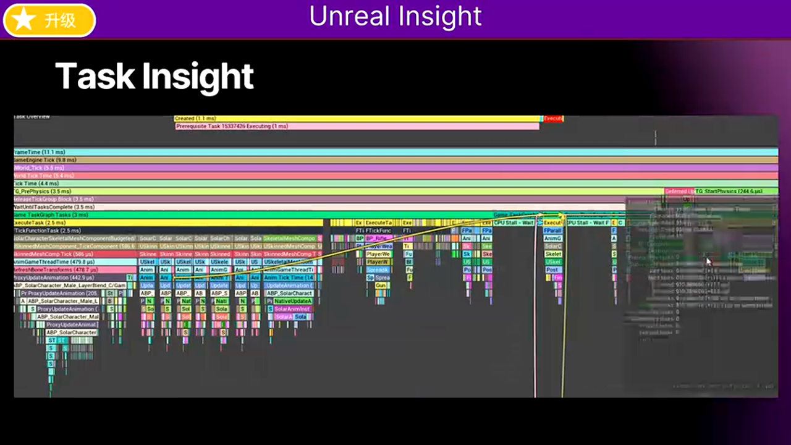

**Slate Insight**：
- 定位 UI 导致的卡顿问题
- 快速定位哪个控件触发了更新

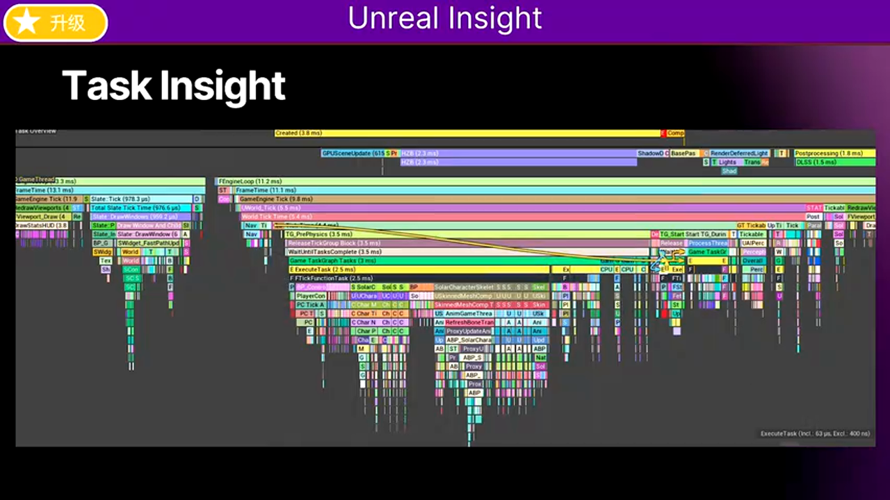

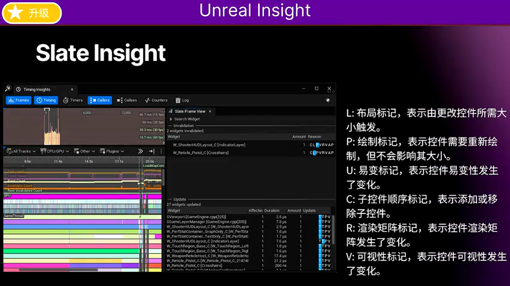

**硬件 Performance Counter**：
- 集成 CPU Clock、CPU Thread、Core 信息
- 新版安卓支持 Profile 细致的 Power 数据
- 可以看到 CPU 大中小核、Display、WiFi 等各模块功耗
- 帮助分析性能问题是否由 CPU 调度或频率问题导致

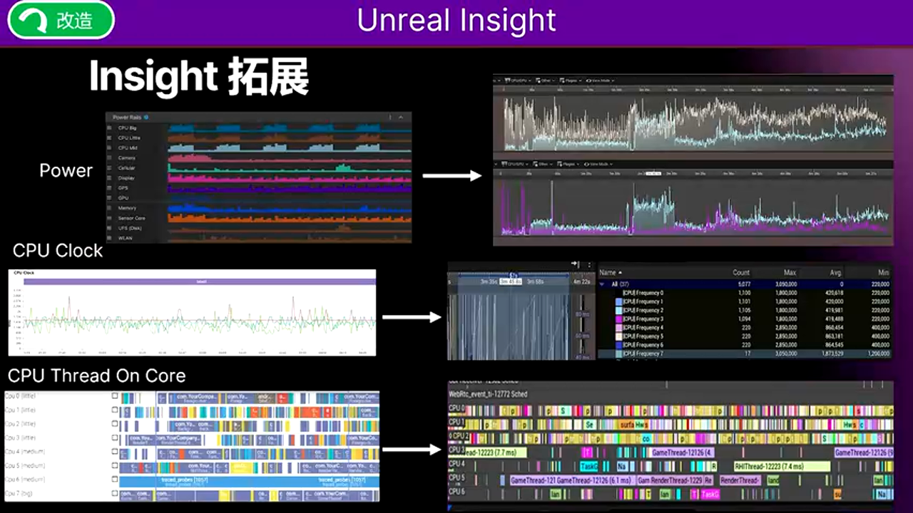

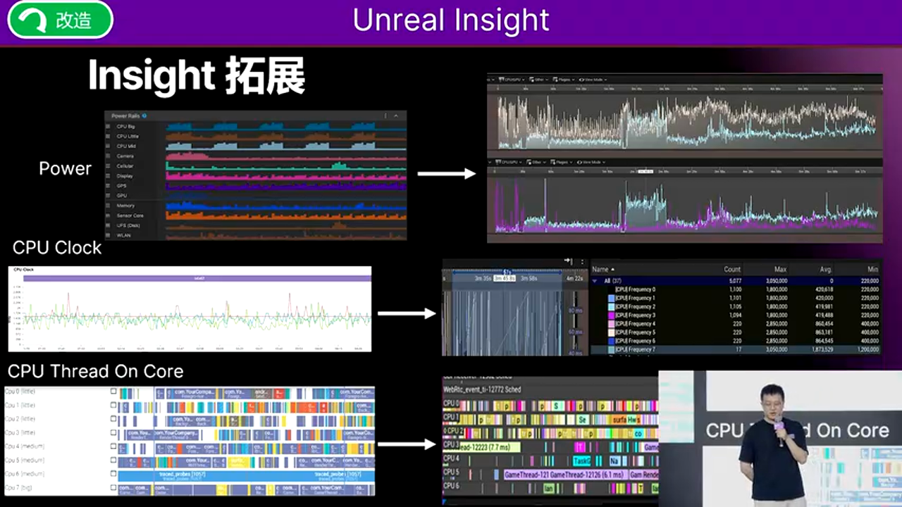

---

## 十一、总结与最佳实践

### 11.1 技术选型建议

**适合参考的场景**：
- 基于 UE4 老版本的长线运营项目
- 需要双端（PC + 移动端）兼容的项目
- 大世界场景下的性能优化需求

**核心经验**：
- 持续关注高版本引擎更新，合并有价值的特性
- 在保持稳定性的前提下进行深度改造
- 建立完善的性能分析工具链

### 11.2 性能优化清单

1. **显存优化**：VM Grid 化 + BCR 压缩 + SH 阶数可配置
2. **GPU 优化**：SSR/SSAO Tile 剔除 + VRS/VRR 可变分辨率
3. **CPU 优化**：Streaming 全链路优化 + 粒子多线程调度
4. **烘焙优化**：GPU Lightmass + Embree 向量化 + 双端分离
5. **UI 优化**：Global Invalidation + Animation 转 Timeline

### 11.3 避坑指南

1. **VRR 侵入性强**：需要处理所有使用屏幕坐标变换的 Shader
2. **FastPath Bug**：切换后需要逐一修复 UI 不更新问题
3. **Streaming 堆积**：需要全链路 Budget 控制防止卡顿
4. **内存分配器选择**：不同平台最优选择可能不同
5. **PGO 收益有限**：1%-5%，但几乎无成本

---

## 参考资源

- **原始视频**：https://www.bilibili.com/video/BV1gSW4zMEXA
- **UE4 官方文档**：Volumetric Lightmap、GPU Lightmass
- **NVIDIA Streamline**：DLSS 集成方案

---

**谢谢大家！**

希望本文的分享能对正在进行引擎优化的团队有所帮助。如有问题欢迎在技术交流群中讨论。

