# 虚幻引擎5程序化生态管线深度解析：《穿越火线-虹》的技术革新之路

---

## 加入 UE5 技术交流群

如果您对虚幻引擎5的图形渲染技术感兴趣,欢迎加入我们的 **UE5 技术交流群**!

扫描上方二维码添加个人微信 **wlxklyh**,备注"UE5技术交流",我会拉您进群。

在技术交流群中,您可以:
- 与其他UE开发者交流渲染技术经验
- 获取最新的GDC技术分享和解读
- 讨论图形编程、性能优化、构建工具流、动画系统等话题
- 分享引擎架构、基建工具等项目经验和技术难题

---

**源视频信息**: [UFSH2025]《穿越火线-虹》:基于虚幻引擎 | 刘陌桑 腾讯天美J3工作室 高级技术美术

**视频链接**: https://www.bilibili.com/video/BV1i2sNzXE9H

**说明**: 本文由AI基于视频内容生成,旨在为技术社区提供便捷的文字参考资料。

---

## 引言:从传统管线到下一代PCG生态系统

在开放世界游戏开发中,生态内容的制作一直是最耗时、最复杂的环节之一。如何在保证视觉质量的同时,提升迭代效率、降低制作成本,是每个大型项目都必须面对的挑战。腾讯天美J3工作室在《穿越火线-虹》的开发过程中,基于虚幻引擎5构建了全新一代的程序化生态管线,实现了迭代速度提升10倍以上的突破性成果。

本文将深入剖析这套管线的技术架构、设计理念和实现细节,探讨如何利用UE5的PCG Framework打造高效、灵活的生态内容生产流程。无论你是技术美术、引擎程序员,还是对程序化内容生成感兴趣的开发者,都能从中获得宝贵的实践经验和技术启发。

## 第一部分:管线演进历程与项目背景

### 1.1 演讲者背景与项目经验

刘陌桑,毕业于加拿大谢尔丹学院游戏设计专业,2020年加入腾讯天美J3工作室担任技术美术。从《使命召唤手游》开始,他就负责程序化生态管线及生态内容产出的全流程工作。随后主导了《无畏契约》、《三角洲行动》等多个开放世界项目的生态管线开发与落地,目前正在打造《穿越火线-虹》的新一代程序化生态管线。

这些项目的积累为团队提供了丰富的实战经验,也让他们深刻理解了传统管线的痛点和改进方向。

### 1.2 三角洲行动:管线能力的验证

在深入新管线之前,让我们先回顾一下团队在《三角洲行动》项目中取得的成果。这个项目充分展示了成熟PCG管线的能力边界:

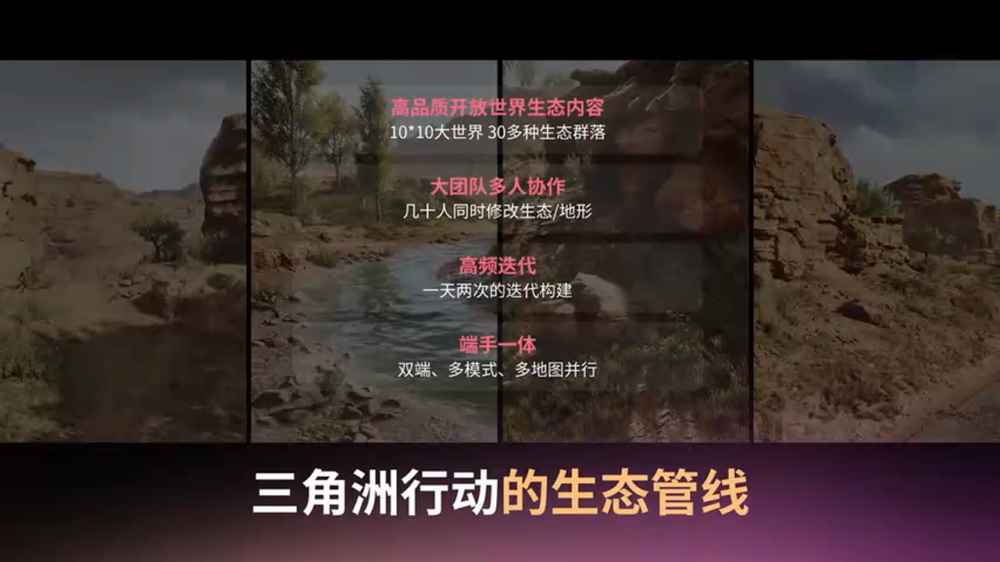

**项目规模与复杂度**:
- **地图规模**: 峰火地带模式设计之初就是一个10公里×10公里的大世界
- **生态多样性**: 目前已有30多种形态各异的生态群落
- **团队协作**: 同时工作的美术人员可能多达几十人
- **迭代频率**: 在高频交付节点,可以做到一天两次的迭代构建
- **跨平台支持**: 实现了端手一体、多种模式、多个地图、多个平台的并行开发

这些数据充分说明了管线的成熟度和稳定性,也为后续基于UE5的革新奠定了坚实基础。

### 1.3 生态内容迭代的三个关键阶段

生态内容的制作从设计开始,主要分为三个步骤:

**阶段一:规划阶段**
- 基本的概念设计和资产规划
- 明确地图的生态构成
- 确定需要哪些资产类型和数量

**阶段二:切片验证**
- 将概念设计中的生态群落逐个做切片验证
- 让项目组对每个生态群落有明确且统一的认识
- 基于切片制作PCG配方

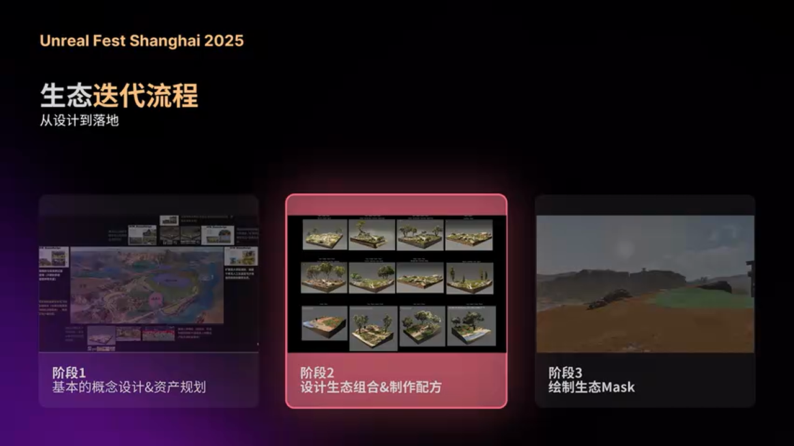

配方代表着生成内容规律的一系列参数和代码,是整个PCG系统的核心。

**阶段三:绘制与构建**
- 通过绘刷工具绘制各个配方生长的范围
- 经过流水线构建,生成编辑器中的生态内容
- 频繁review生成结果并回到之前的某个阶段进行迭代

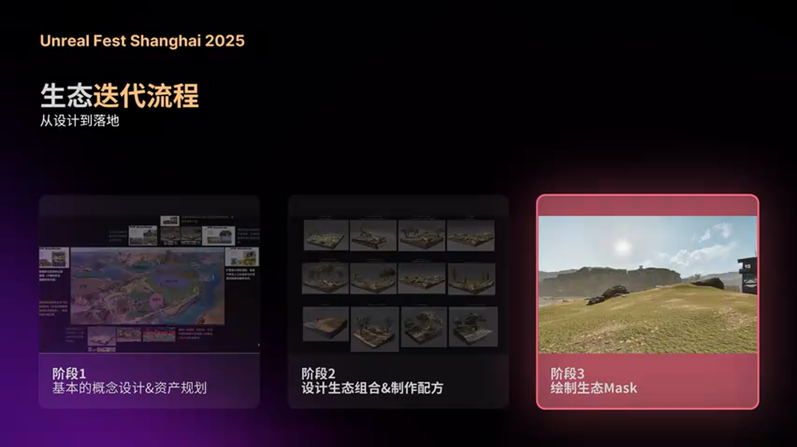

游戏开发是一个不断迭代的过程,这就非常依赖一套完整的开发管线来支撑高效的反馈循环。

## 第二部分:基于Houdini的传统管线架构

### 2.1 YMIR工具集:以北欧神话命名的PCG系统

天美J3工作室围绕虚幻引擎和DCC软件打造了许多管线和工具集。其中,YMIR作为PCG工具集,提供了一套基于Houdini的通用生态管线。

**命名由来**:
YMIR是北欧神话中的一个始祖巨人。传说中:
- 它的血肉创造了土地
- 骨骼创造了山脉
- 血液创造了海洋
- 毛发创造了植被

这个名字代表了团队希望这套管线可以"包容万物"的美好愿景。

### 2.2 Houdini在PCG中的核心作用

Houdini是一个节点式的三维内容制作软件,它擅长PCG生态场景用到的点云和高度场运算。

**Houdini的优势**:
1. **HDA封装**: Houdini允许将一系列节点打包成Houdini Digital Asset (HDA)
2. **引擎集成**: 使用Houdini Engine插件,在虚幻引擎中可以运行HDA工具
3. **点云运算**: 强大的点云处理能力,适合大规模生态分布计算
4. **高度场支持**: 完善的高度场运算系统,支持复杂的地形操作

这种集成方式让团队能够充分利用Houdini的计算能力,同时保持在虚幻引擎内的工作流程。

### 2.3 虚幻引擎4与Houdini的协作流程

让我们详细了解UE4时代管线的数据流:

**完整的数据流程**:

1. **数据输入**: 为了预览的速度与准确性,将一部分数据导出到外部文件作为缓存
2. **Houdini运算**: 数据进入Houdini进行运算,产出代表生态分布的点云
3. **预览导入**: 将点云等数据导入编辑器进行预览
4. **全量构建**: 确认效果后,通过全量流水线进行大世界构建

这个流程在当时已经相当成熟,但随着项目规模的扩大,一些固有的限制开始显现。

### 2.4 输入数据的类型与作用

美术工作流中需要准备多种类型的输入数据:

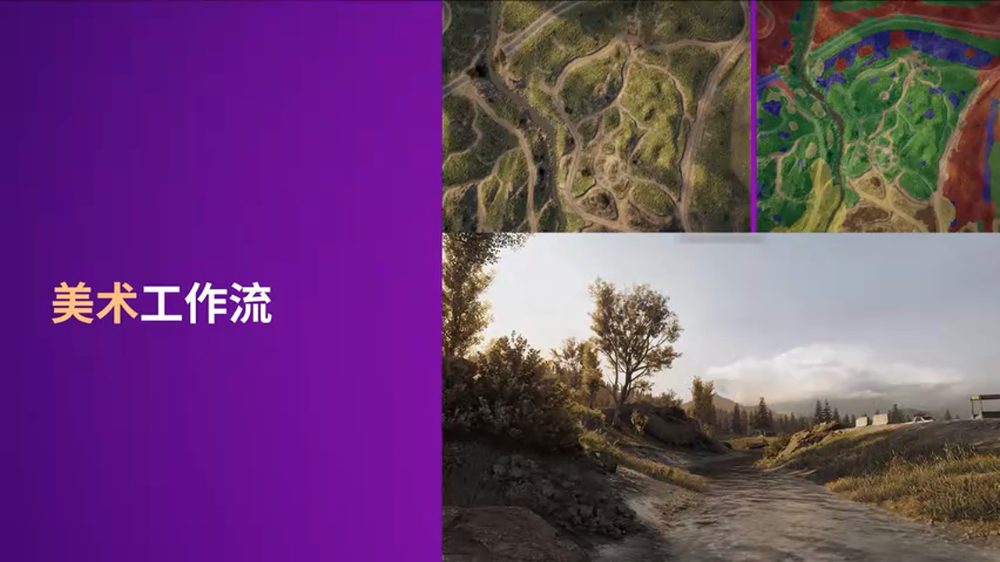

**基础数据:地形高度**
- 合理的地形起伏对生态表现和性能优化都至关重要
- 地形高度直接影响生态分布的合理性

**配方绘刷**:
- 每个颜色的配方绘刷代表一套生态分布的逻辑
- 生态配方绘刷之间是互斥的
- 同一个地形像素只能有一种生态绘刷

**遮挡绘刷**:
- 所有功能性绘刷的合集(如道路)
- 可以与任何绘刷叠加存在于同一个像素

**非生物因素**:

在生态学中,决定一个群落生长状态的环境因素统称为非生物因素。团队抽象出了以下几类:

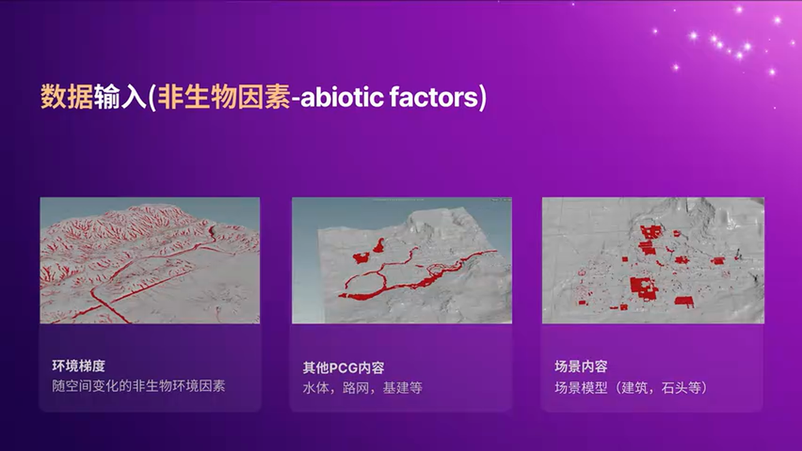

1. **环境梯度**: 包括随空间变化的光照、湿度、坡度等环境信息

2. **场景内容**: 比如其他的PCG内容以及人工摆放的建筑模型

### 2.5 预览工具的重要性

生态工具集需要包含一个能够生成局部内容的预览工具。修改地形与绘制生态绘刷时,需要能够快速看到场景和生态内容的变化,以指导下一步的制作。

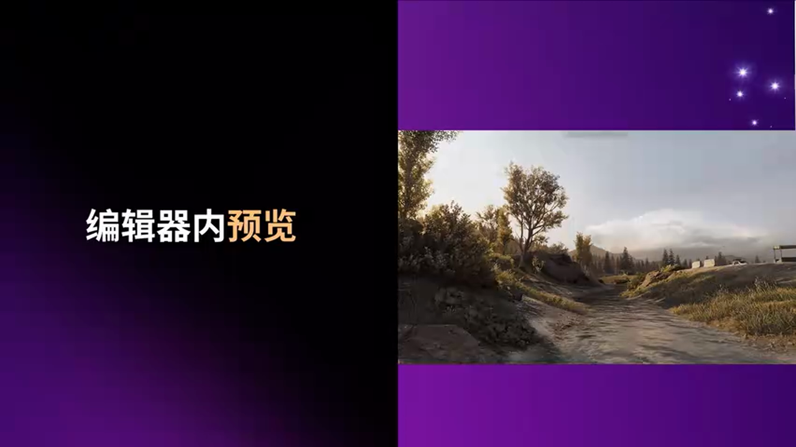

这个看似简单的需求,实际上是整个工作流程中最影响效率的环节之一。

### 2.6 配方结构:从群落到实体

一个地图由许多个生态群落组成,团队把每个生态群落制作成一个HDA,也就是配方。

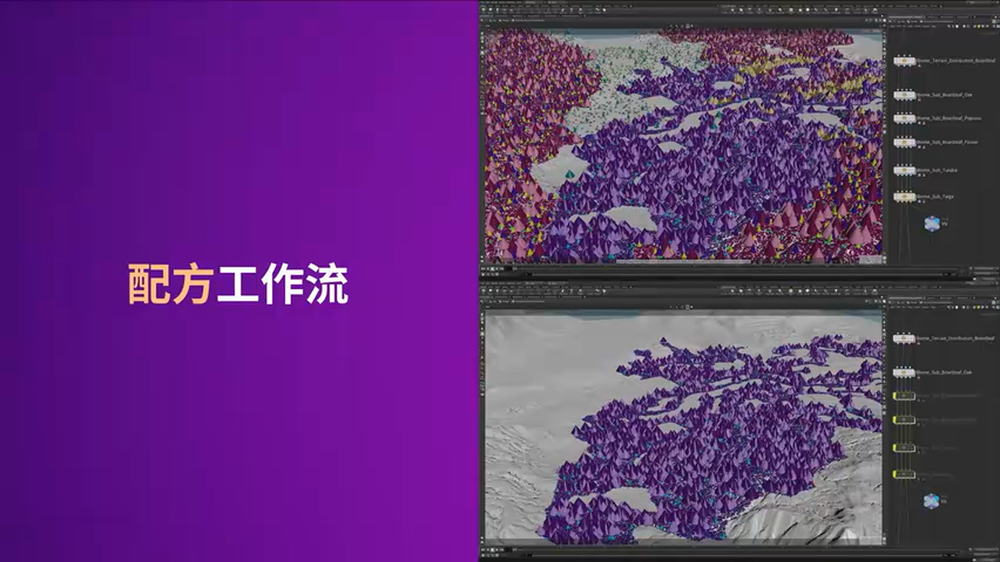

**配方的核心特性**:
- 跟生态群落绘刷一样,生态配方也是互斥的
- 同一个位置只允许存在一套生态生成逻辑
- 配方主要由多个实体生成节点组成

**实体生成节点的含义**:
- 一般来说,每个实体生成节点代表一类生态内容的一次分布
- 例如:大型阔叶树在水边的一个分布状态
- 每次分布的结果共同填满了生态群落

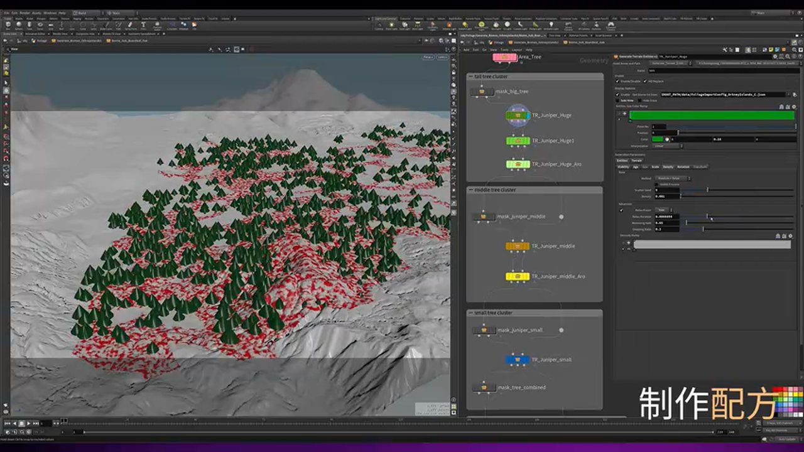

**优先级与剔除机制**:
- 每个实体生成节点都有一个优先级参数
- 当不同的点的占地位置重叠时,优先级更低的就会被剔除掉

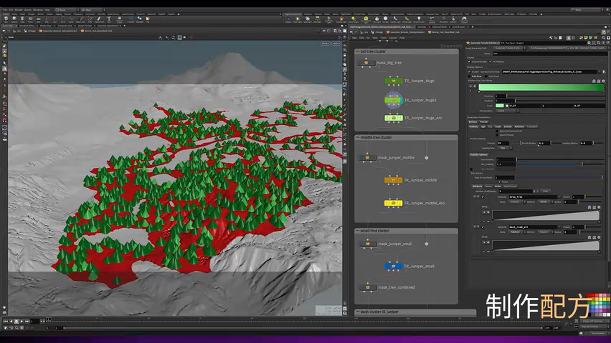

**环境影响计算**:
使用最终的点云数据还可以计算生态对外部环境的影响,例如:
- 改变地形纹理的权重分布
- 改变地形高度
- 改变地形潮湿度分布等

### 2.7 全量构建流程

有了数据和配方,就可以进行日常的全量构建。

这张流程图代表了单张地图的PCG构建流程。除了产出场景内容外,每天还会生成2D的UI地图素材,以便即时观察每天的变化修改。

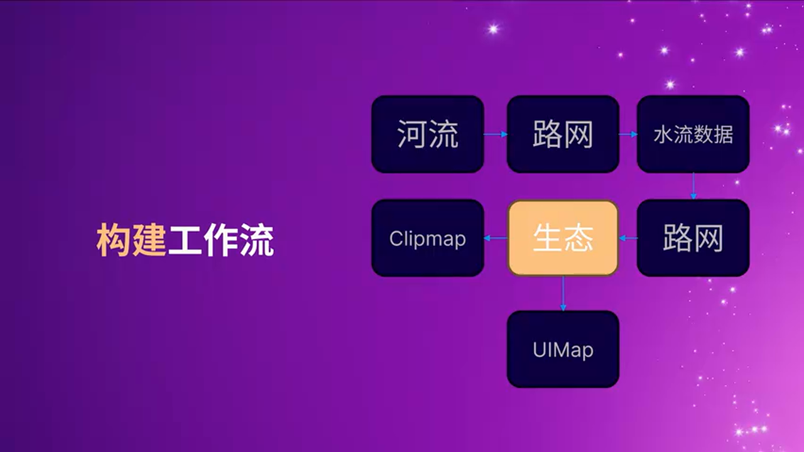

**相关分享推荐**:
对PCG管线感兴趣的小伙伴,也可以回顾一下去年Unreal Fest上李川关于《三角洲行动》开发经验的分享。

### 2.8 分布式构建农场

由于项目的开发节奏很快,经常存在同时五六个地图需要构建的情况,且不同的地图内容差异量很大,所以团队搭建了分布式的构建农场,以更好地利用硬件资源。

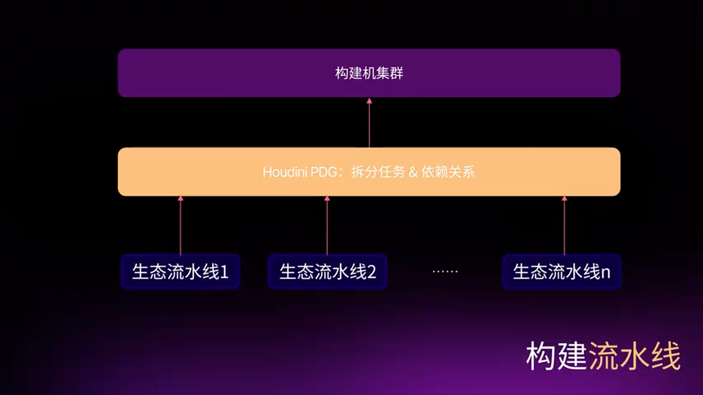

这种架构保证了即使在多地图并行开发的高压环境下,构建系统也能稳定运行。

## 第三部分:迁移到虚幻引擎5的技术决策

### 3.1 技术选型的思考

当接到迁移PCG管线的任务后,团队面临一个重要选择:是迁移之前成熟的管线,还是在一个很短的窗口期去构建新的管线?

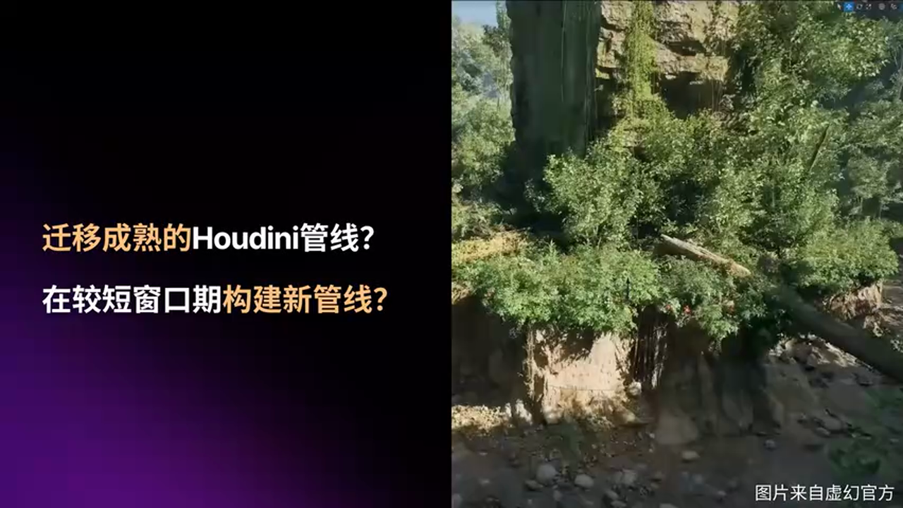

**UE5的吸引力**:
- 自虚幻引擎5推出至今,官方展现出了对程序化管线组件的重视
- 呈现出的内容属实非常诱人
- 基于对Epic团队和自身技术力的信心,团队更倾向于对管线进行一次革新

### 3.2 PCG管线的核心需求分析

在预研阶段,首先需要关注的是:在保持原有工作流优势的前提下,现有引擎能解决哪些问题?

**搭建PCG管线需要哪些特性**:

1. **撒点和采样**: 这是最基础的功能
2. **人工干预和剔除**: 以及物种间的竞争机制
3. **世界分区**: 需要将大世界切分成更小的区块,以进行构建或预览
4. **配方制作**: 需要能够制作配方,并应用到特定的区域,并根据非生物因素进行分布区域的筛选
5. **高度场运算**: 将地形相关的信息存储在高度场中,用以完成对地形的遮挡信息加减运算,或者更加复杂的形变或模拟运算

当前虚幻引擎5版本能够非常好地做到前四点。

### 3.3 UE5 PCG Framework的核心能力

#### 3.3.1 撒点与采样

PCG Framework中的Sampler节点提供了撒点和采样的功能。

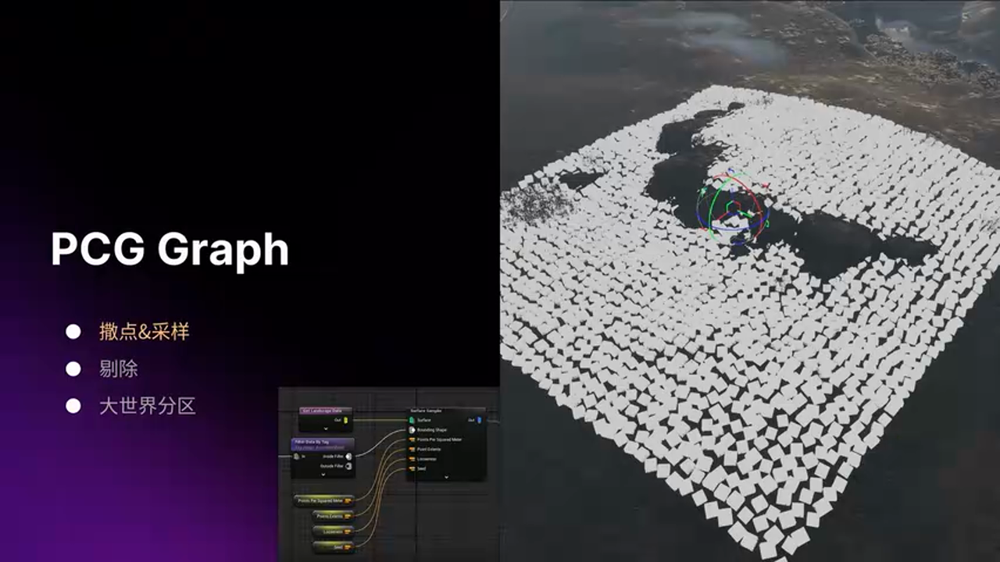

**与Houdini的区别**:
- 区别于Houdini采样高度场的做法
- 可以把采样时的遮挡信息存储到点云中,作为一个Attribute
- 这种方式更加灵活,便于后续处理

#### 3.3.2 剔除机制

PCG Framework提供了多种剔除方式:

**剔除方法**:
1. **Attribute Filter**: 在撒点时采样遮挡信息后,可以用Attribute Filter节点剔除遮挡取值在特定区间的点
2. **Difference节点**: 可以做到点云之间的互相剔除或偏移

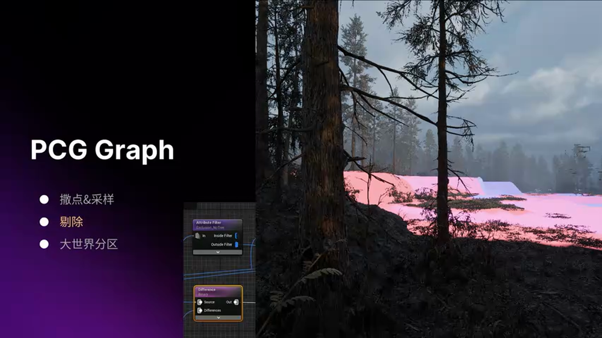

#### 3.3.3 世界分区与网格系统

PCG Framework提供了大世界分区构建的功能。

**分区控制**:
- Graph中的GridSize节点可以灵活控制分区尺寸
- 采样节点提供了BoundsMin/BoundsMax输入,用以限制节点运算的范围

#### 3.3.4 PCG Biome:生态群落配方

除了PCG Framework外,虚幻引擎5还提供了一个叫做PCG Biome的插件。

它为我们提供了基础的生态群落配方功能,这正是团队需要的核心特性之一。

### 3.4 高度场运算的解决方案

至于高度场运算,团队也有解决方案:

**HDA集成方案**:
- PCG Framework提供了调用蓝图的功能
- 在蓝图中可以调用HDA
- 不但能够利用HDA进行高度场运算,还能复用之前积累的大量通用HDA工具库

**性能优化策略**:
- 因为HDA的引擎无法异步计算,为了预览的速度和流畅性
- 将HDA的高度场信息转化成点云,并保存在USD文件里
- 预览时无需调用HDA的引擎,即可获取遮罩和生成非生物因素数据

这种混合方案既保证了功能的完整性,又优化了预览性能。

### 3.5 技术验证结论

既然已经验证过了虚幻引擎5有可靠的基石,团队决定全面拥抱新技术。

接下来让我们看看新管线有哪些收益,以及如何解决旧管线的痛点。

## 第四部分:新管线的核心优势与技术突破

### 4.1 痛点一:配方迭代流程冗长

#### 4.1.1 旧管线的迭代困境

HDA工作流存在配方迭代流程冗长的问题。

**问题描述**:
- 在Houdini中一般使用几种简单的几何模型去查看PCG的分布
- 只能看到大致的分布和密度
- 导致配方制作十分依赖经验
- 当配方复杂度已经很高时,即使是经验丰富的配方师也需要反复预览几次才能做出满意的结果

**时间成本**:
一个简单的迭代,比如只是调整某颗树在某一块分布的密度,可能就需要耗费小时为单位的时间。

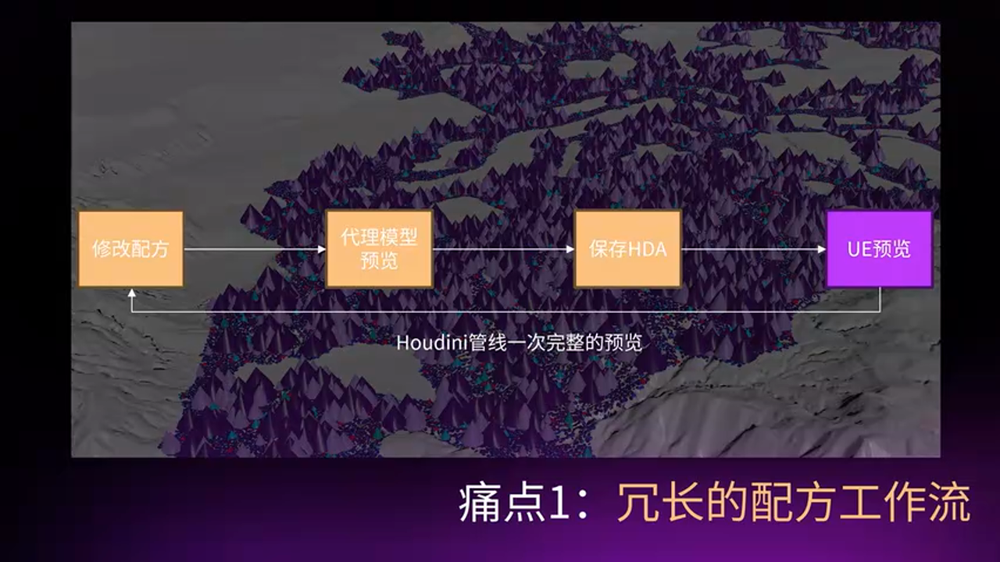

配方迭代不够敏捷,这是项目曾经面临的最大痛点。

#### 4.1.2 新配方结构:数据驱动的设计

新管线采用了全新的配方结构:

**列表式配方**:
- 列表中的每个元素代表希望摆放到关卡里的一个资产

- 展开后可以看到生态配方所需的全部参数
- 每个资产还可以嵌套子资产配方

**Generator概念**:
- 把Generator生成的点称作父资产
- 子配方中就包含围绕父资产摆放的子资产,完成伴生的逻辑

**自定义撒点逻辑**:
- 区别于Houdini管线仅提供有限的几种撒点预设
- 新管线允许配方开发者自行编写撒点逻辑
- 每个资产需要关联一个叫Generator的文件,其中包含了撒点结果需要的全部信息

**抽象化优势**:
这个结构很好地做到了抽象的原则,既鼓励配方者进行复用,对构建速度也很好。

但是从列表式的配方结构里精确地找到某个资产或者某个参数是很痛苦的,没法很快地看懂这个配方有几个Generator、有哪些资产。

#### 4.1.3 图形化界面:可视化的配方编辑

为了解决可读性问题,团队将配方逻辑可视化。

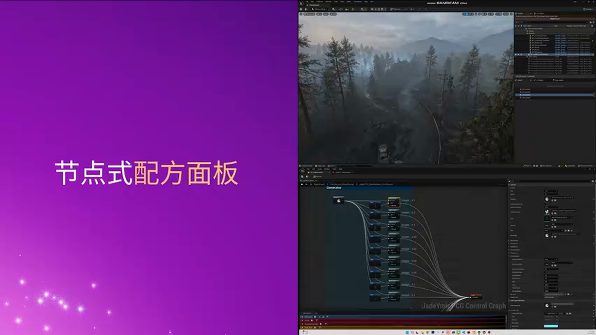

**节点结构**:
- 节点结构与Biome的运作方式一致
- 每个Generator进行自己的撒点

- 接下来所有关联了Generator的资产会根据权重属性进行权重随机
- 以决定哪个点摆放哪个资产

**可读性提升**:
这种结构能帮助做配方的同学更好地理解PCG做了什么,并且配方的构成一目了然。

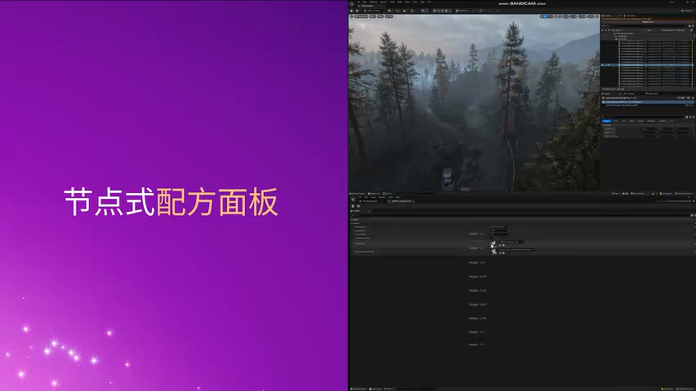

#### 4.1.4 迭代速度的飞跃

在《穿越火线-虹》中,团队使用了:
- 更多种类的资产
- 更多的点云数量
- 更复杂的生长逻辑

却收获了十倍以上的配方迭代速度!

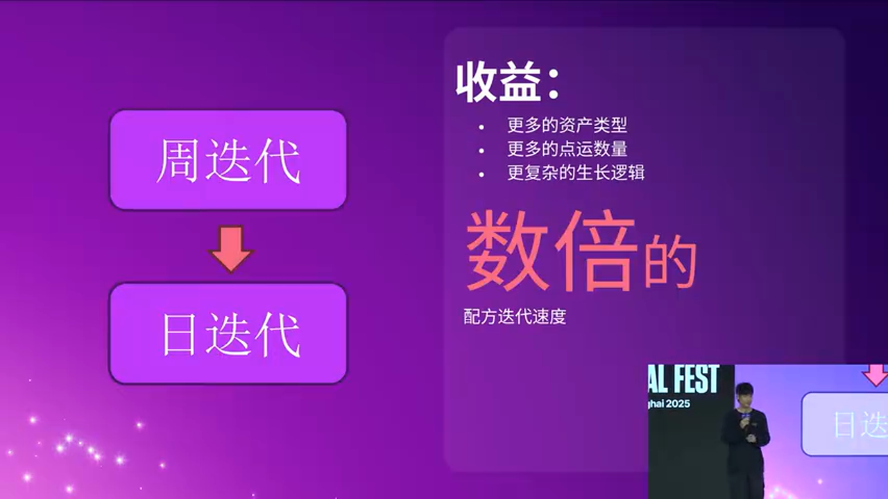

**实际工作流对比**:
- **旧管线**: 以前在DF开发时,节奏一般是每周收集一次需求,每周开一个生态内容的Review会
- **新管线**: 使用新管线之后,在快节奏的开发中可以做到每天一次Review,甚至发现问题后可以拉大家一起当场调参,当场得到想要的结果

这种效率提升彻底改变了团队的工作方式。

### 4.2 痛点二:预览速度慢

#### 4.2.1 性能瓶颈分析

Houdini管线有成的预览速度比较慢,尤其是大型地图生态群落众多时。

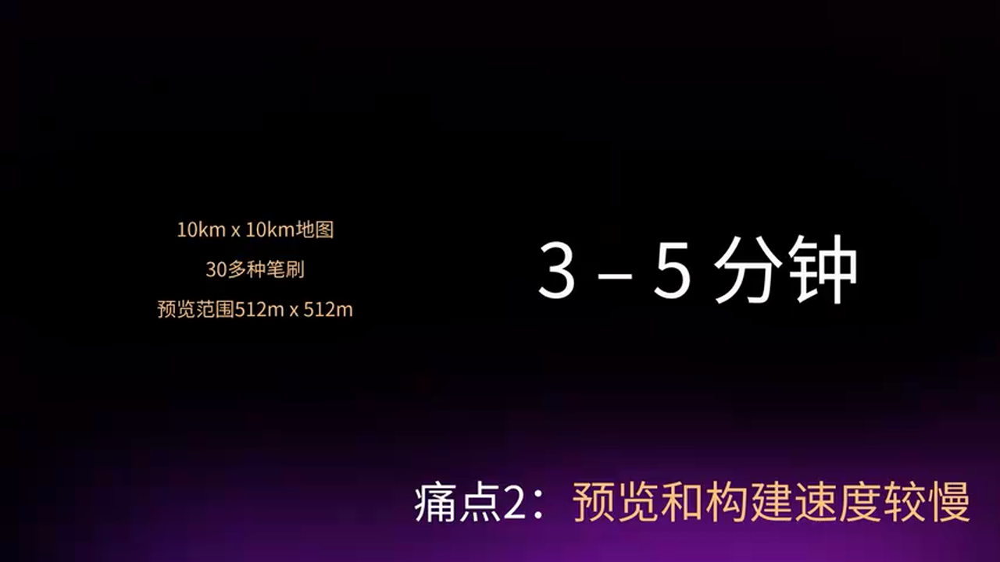

**典型场景**:
- 比如10公里×10公里的地图
- 30多种生态同时预览时
- 烘焙一块500米×500米的区域
- 耗时大概要3到5分钟

这对于美术的日常迭代来说是非常痛苦的,以至于开发的中后期,很多熟悉生态工作流的同学习惯依靠经验去绘制绘刷,而不是频繁的预览以确保内容的准确性。这也导致了生态相关的Bug增多。

#### 4.2.2 数据流的优化

导致速度慢的首要原因就是基于Houdini的管线数据流太长,容易冗长。

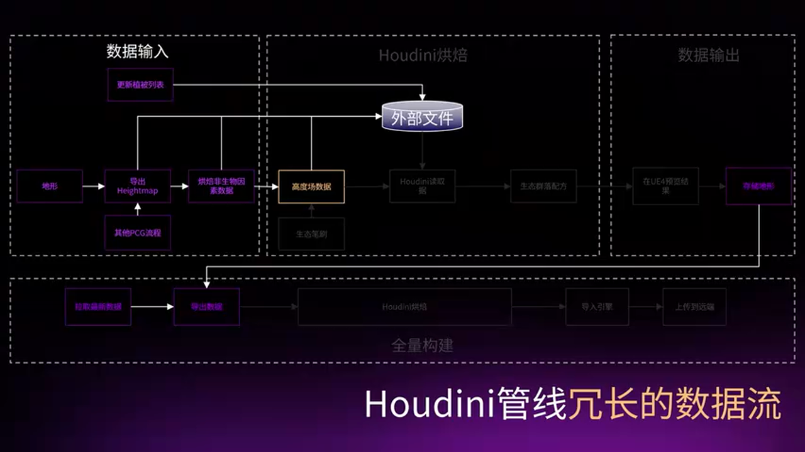

**冗长的数据流**:
- 包含了不少引擎内部数据的导出和外部文件读取的过程
- 这个问题在大世界极大的数据量和更多更复杂的配方逻辑下,显得尤为突出

**举例说明**:
如果场景中的建筑有更新,需要:
1. 导出场景中全部的建筑
2. 烘焙并且影响一次非生物因素
3. 耗时取决于地图的大小
4. 这个过程通常要花10分钟到半个小时

#### 4.2.3 内部化的数据访问

基于虚幻引擎5搭建管线时,全部的配方和观察数据都可以在虚幻编辑器内直接获取。

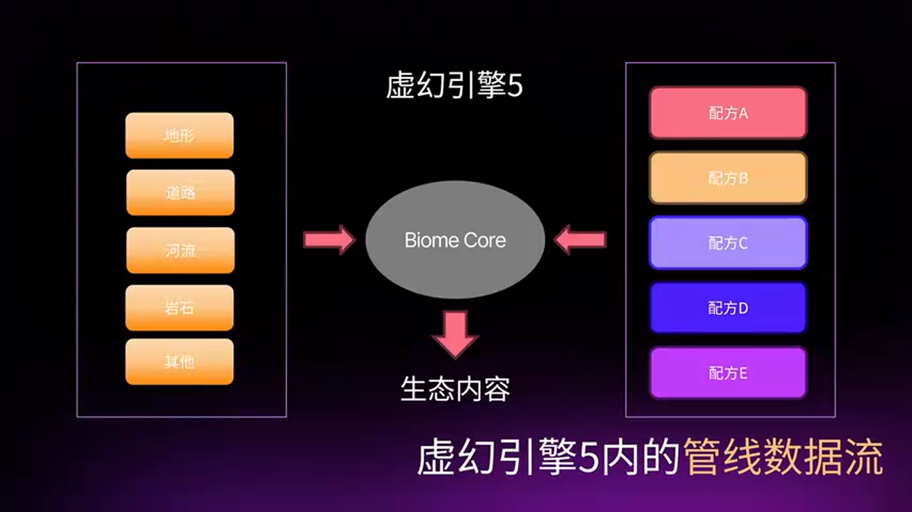

**优势**:
- 在绝大部分情况下,完全避免了数据的导入和导出
- 管线还支持单个高度场数据在本地的快速独立更新
- 比如可以只更新观察中的建筑数据

**性能提升**:
对于2公里×2公里的地图,数百块大小不一的建筑,更新起来可能只需要几十秒的时间。

#### 4.2.4 Houdini工程的性能问题

另外,Houdini工程本身的速度慢是许多Houdini管线难以克服的一些历史遗留问题。

复杂Houdini工程开启需要十分钟以上不是什么新鲜事,这一点非常影响使用体验。

**UE5的优势**:
虚幻引擎5的PCG Framework有很多优秀的设计,决定保留这些好的特性,并在此基础上复刻天美J3工作室经过多个项目验证的工作流。

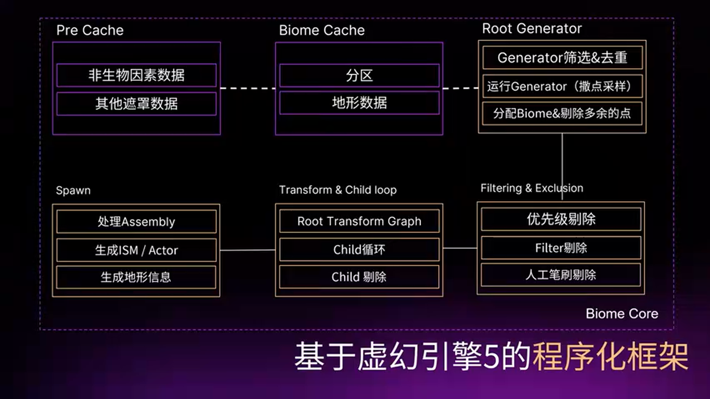

### 4.3 核心实现:数据缓存与分区构建

#### 4.3.1 数据缓存策略

首先是把不常改变的数据存下来随时调用。

**缓存机制**:
- 无论是构建或者预览,每次运算只需要读取部分区域,而不是整个大世界
- 将有效数据缓存下来
- 得益于PCG Framework提供的数据格式

#### 4.3.2 精确的分区控制

构建区域的选择从以前的地形Component大小精确到了密集(Grid)。

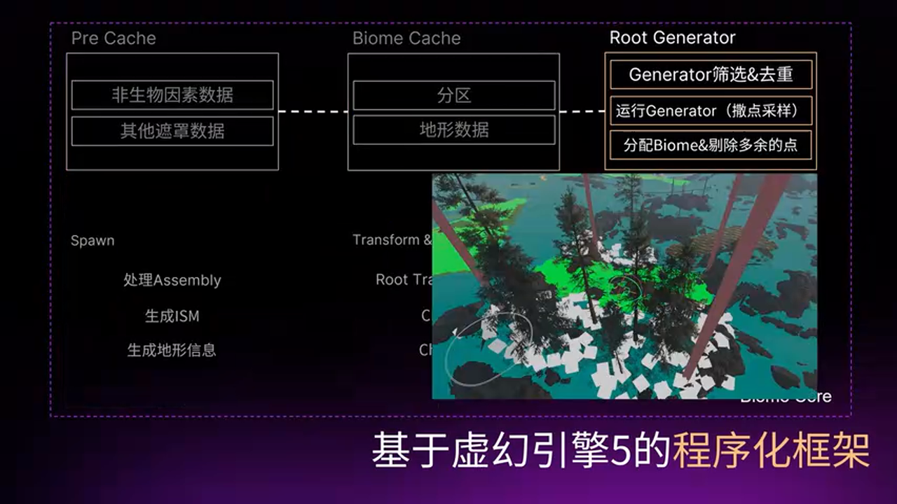

**分区流程**:
1. 筛选当前构建区域内包含的Generator并且去重
2. 确保重复引用的Generator只会进行一次撒点
3. 根据每个生态群落的范围,剔除不属于该生态的点

#### 4.3.3 剔除与筛选流程

撒点完成后,进行多层次的剔除和筛选:

**剔除步骤**:
1. 首先进行一次不同Generator之间的优先级剔除
2. 根据非生物因素信息对撒点进行筛选
3. 根据功能性剔除绘刷对各类资产进行剔除

#### 4.3.4 Transform Graph

做完剔除后,允许在配方中使用Transform Graph去控制这些摆放好的资产的旋转、缩放等属性。

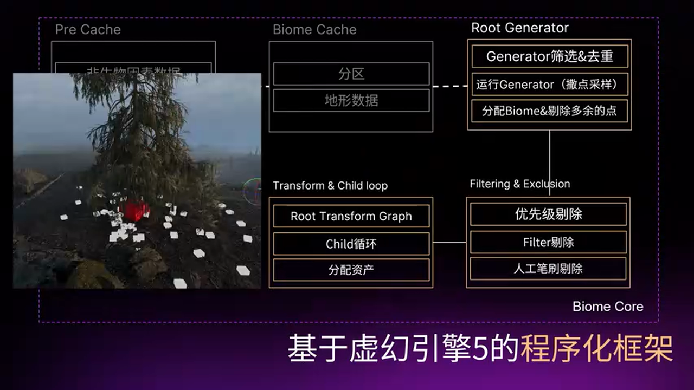

到了这个步骤为止,使用Generator生成的资产就已经尘埃落定。

#### 4.3.5 伴生逻辑的实现

接下来需要计算它们的伴生者。

**伴生计算流程**:
1. 遍历全部Generator生成的点
2. 对其子配方进行多层的嵌套循环
3. 每个子配方都会走一遍从生成点到剔除的全部过程
4. 当子配方循环完毕后,按照权重为每个点分配它的资产

**支持的资产种类**:
- Static Mesh
- Instanced Static Mesh
- Actor

在生成资产时,也会根据最终的点云和地形数据去生成地形纹理分布的权重、潮湿度等信息。

### 4.4 通用Generator模板

虽然虚幻引擎内读取PCG Graph足够快,团队仍然要考虑大型项目非常庞大的容量。

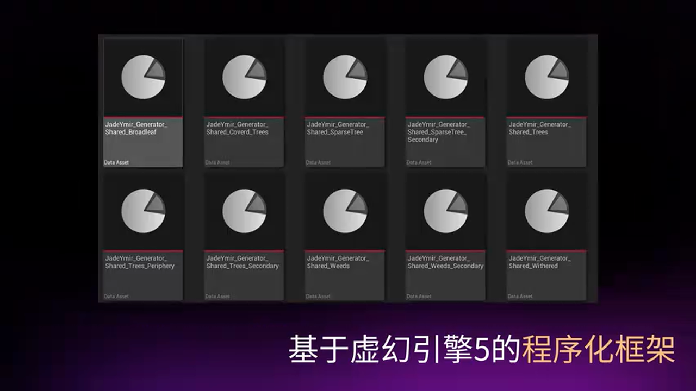

**模板系统**:
- 为了预防不断新增Graph,并且累加到一个非常巨大的数字,影响日常工作
- 提供了一套通用的Generator模板
- 这些模板能够涵盖目前日常开发中80%的使用场景

这种标准化的做法既保证了性能,又提升了开发效率。

### 4.5 全新的PCG控制面板

团队重新设计了一套PCG控制面板,将在未来成为集成所有PCG工具的操作面板。

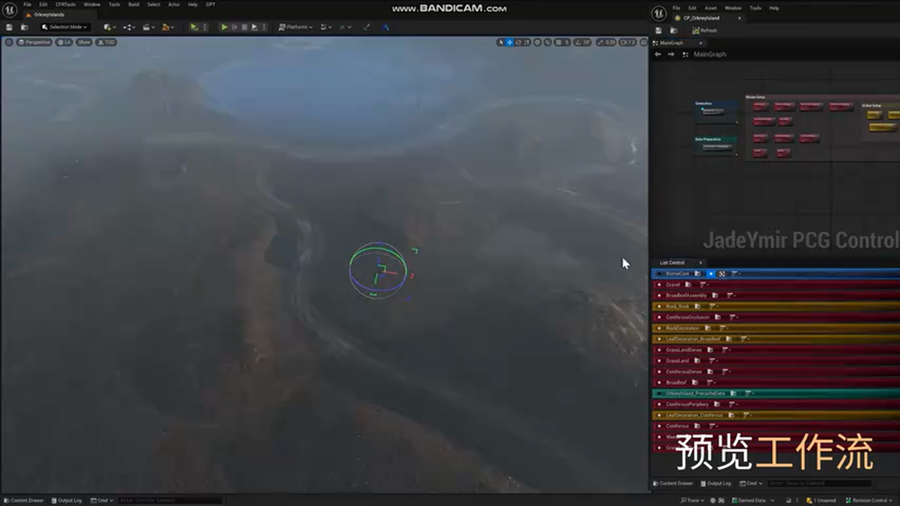

#### 4.5.1 框选预览工作流

基于控制面板,开发了一套更加灵活快速的预览工作流:

**核心特性**:
- 只需要框选区域即可生成任意大小的生态内容
- PCG Graph提供的撒点算法在世界空间里面具有稳定性
- 无论预览区域的大小或位置,其结果都会与构建完全一致

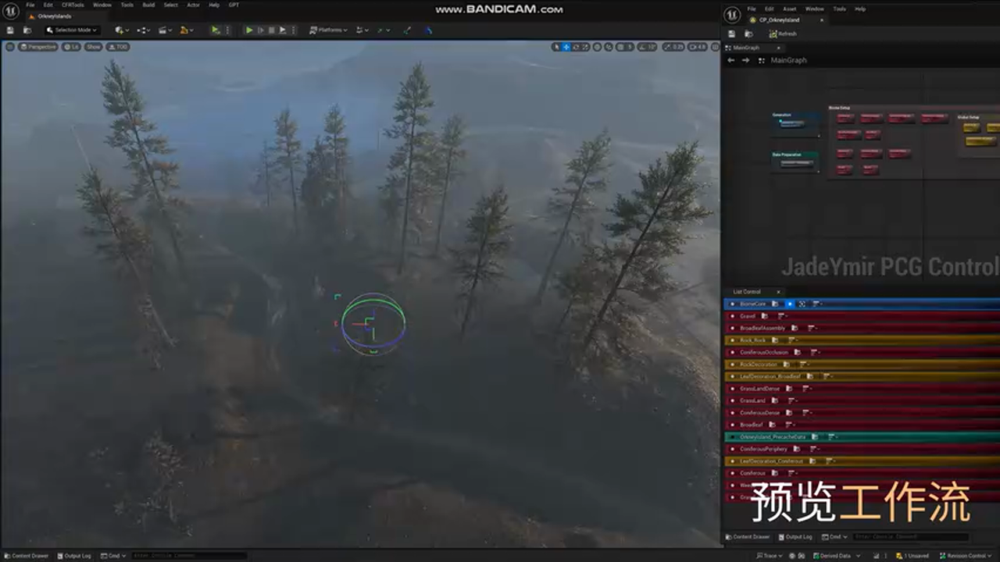

新的预览工作流在简化操作的同时,也为观察制作提供更加灵活准确的指导作用。

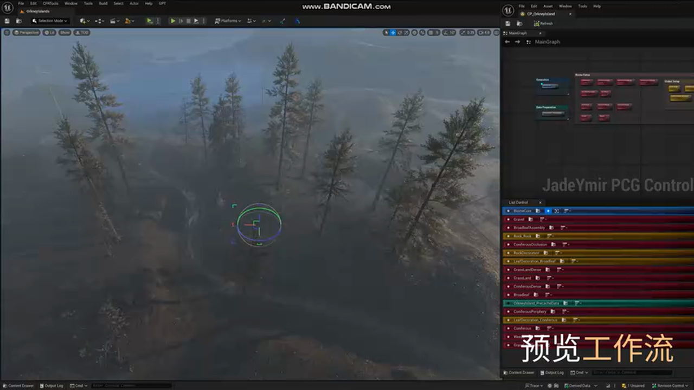

### 4.6 新管线的核心成果总结

到这里我们就了解了新管线的框架。

**新管线的核心优势**:

1. **极致的抽象化**: 带来了更少的运算、更少的Graph节点数量
2. **内部化**: 代表着更快的速度、更好维护的管线内容
3. **图形界面化**: 更加简单直观的生态迭代工作流

**性能提升**:
同样在复杂度比旧管线更高的情况下,获得了十倍以上的预览速度,以及更好的交互体验。

**实际体验**:
在短短的十几秒钟,视频里已经完成了两次框选和烘焙预览的过程。

这在以前开发《三角洲行动》的时候是完全不敢想的。

## 第五部分:精度提升与PCG Assembler

### 5.1 痛点三:输入数据的精度限制

#### 5.1.1 精度问题的本质

输入数据的精度有限是另一个重要痛点。

**地形精度限制**:
- 地形或者高度场,它密集(Grid)的精度限制了创造更多精致的微景观
- 点云这种数据格式仅能够表达生态资产的包围盒或者半径

**适用场景分析**:
- 在植被垂直生长的时候是完全没问题的,可以很好地表达植被的体积
- 但当资产本身形状复杂或者生长歪斜时,包围盒就不好用了

#### 5.1.2 暴力提升精度的不可行性

是否能够暴力地去提高精度?

**方案探讨**:
- 比如直接提高高度场的精度到1厘米
- 或者直接用代理模型去进行资产体积的判断去做剔除

**结论**:
答案是否定的。至少目前的硬件无法承担大型开放世界如此庞大的数据量和计算量。

### 5.2 PCG Assembler:场景实例化的解决方案

虚幻引擎5提供了观察实例化的工作流,也就是Level Instance。

**PCG Data Asset**:
- 并专门为PCG提供了一种快捷读取的文件格式,叫做PCG Data Asset
- 以保存一个观察中全部的Static Mesh实例数据

**核心思路**:
简而言之,可以将手工制作的观察通过PCG摆放到场景中。这允许创造出更加精确的组合。

### 5.3 Assembler的摆放机制

#### 5.3.1 摆放流程解析

当PCG把一个观察摆放到场景中时,占地面积往往比单个Geometry更大。

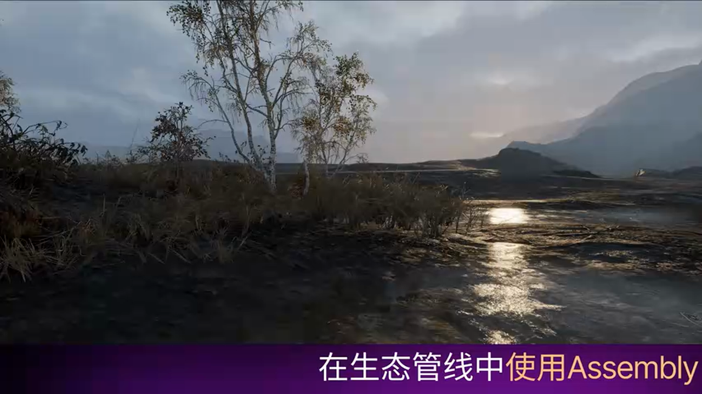

**挑战**:
- 由于是人工制作,很难去进行尺寸的规范
- 过大的尺寸很容易出现穿插或者浮空等问题

解决这个问题就需要了解PCG Graph是如何将整个观察摆放到场景中的。

#### 5.3.2 撒点阶段

首先是撒点阶段。

PCG管线摆放一个观察跟摆放一个Mesh其实没有本质的区别,它们都能够用一个包含属性的点去表示。

#### 5.3.3 Copy Points节点

PCG Graph有一个叫做CopyPoints的节点。

**功能**:
- 可以将观察中的每个Static Mesh实例作为点数据
- 复制到代表观察的点的位置
- 这一步会将一个代表观察的点,转换成多个代表Static Mesh的点数据

基于这些数据,就可以很简单地做到一些贴地、人工剔除等等运算。

#### 5.3.4 Assembler Graph

另外,也允许在配方中使用Assembler Graph,以对预制观察中的实例进行管理。

例如去做一些随机的缩放、旋转等操作。

### 5.4 Assembler的应用价值

PCG Assembler的应用让团队对造型有了更精准的控制。

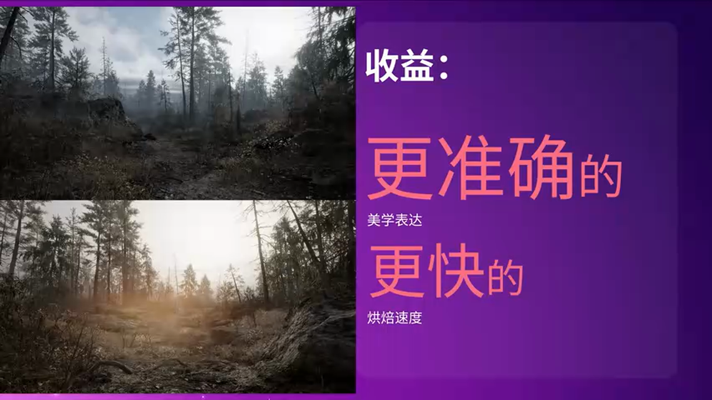

**核心优势**:
1. **丰富的伴生关系**: 可以做出更加丰富的伴生关系
2. **预制组合**: 使用预先制作好的Assembler组合,减少了配方运算的复杂度
3. **性能提升**: 进一步提升了预览和构建的速度

这种混合人工与程序化的方式,在保证艺术品质的同时,也充分发挥了PCG的效率优势。

## 第六部分:生态位理论与组合系统

### 6.1 从竞争到生态位

接下来探讨如何做出更加生动可信的生态内容。

#### 6.1.1 传统竞争机制的局限

在《使命召唤手游》阶段,团队就建立了完善的生态管线。

**竞争机制**:
- 优先级和优先级半径参数代表了不同物种的空间竞争结果
- 但仅仅这样还不足够表达群落中个体的分布规律

#### 6.1.2 生态位的概念

在基础的生态学研究中有一个绕不过的概念,叫做**生态位**(Ecological Niche)。

**形象比喻**:
如果把一个稳定的生态群落比喻成一座神坛,上面有一格一格很多个格位,群落中的每个物种就会放在它对应的格位上。

**科学定义**:
这个概念描述了生物个体或者种群如何对资源和竞争对手的分布做出反应,以及它如何反过来去改变这些因素。

通俗地讲就是:为什么长成这样?为什么长在这里?

#### 6.1.3 生态位的规律性

决定一个物种生态位的成因非常复杂,顶尖的生态学学者们也还没有把任何一个生态群落完全转化成数学模型。

**重要共识**:
但各个流派的学者会有一个有趣的共识:相似环境下相同物种总会落在相似的生态位。

**成因分析**:
- 它们可能面临类似的资源、相似的养分来源
- 相似的光照环境等
- 从而促使它们演化出惊人相似的生长特征和分布规律

这个规律让团队决定在PCG中设立**组合**的概念。

### 6.2 组合系统的设计与实现

#### 6.2.1 组合的美学价值

基于组合的生成方式更加符合游戏开发对美学和玩法的追求。

让团队完成了从左图到右图的蜕变:
- **左图**: 单一资产随机分布,缺乏层次感
- **右图**: 基于组合的分布,更加自然、有层次

#### 6.2.2 组合系统的成果

总结目前的成果:

1. **通用规则**: 建立了一套通用的规则,模拟植被在自然界中竞争自然资源的行为
2. **生态位应用**: 基于生态位的规律建立了组合的概念,使得局部景观更加真实

### 6.3 高密度生态的挑战

#### 6.3.1 密度与复杂度的矛盾

随着硬件和渲染技术不断进化,团队希望生态的表现更上一层。

**核心挑战**:
极高的密度是一个绕不过的课题。当生态很密集、复杂度很高时,仅靠传统的撒点方式:
- 效率很低
- 在涉及精度上受限
- 难以维持组合造型的美感

#### 6.3.2 组合级剔除策略

于是团队尝试把组合的概念带入管线的剔除逻辑中。

**核心思路**:
- 在以往单资产间互相竞争生存优先级的基础上
- 鼓励以组合作为单位计算优先级剔除

**组合定义**:
对于撒点分布的情况来说,将组合定义为Parent和所有围绕它分布的Children。

同时,PCG Assembler也能够完美地契合组合的概念。

#### 6.3.3 组合剔除的效果

来看看使用这种策略分布出的结果:

**适用场景**:
- 不管植被的密度高或低
- 无论独立生长的植被还是精心设计的组合
- 都能够更好地去融入画面

真正做到一步一景。

## 第七部分:总结与展望

### 7.1 新管线的核心成就

接下来做个总结。

**基于虚幻引擎5的生态管线做到了**:

1. **更敏捷的迭代**: 从每周一次Review到每天甚至实时调参
2. **更精准的美术表达**: 通过Assembler和组合系统实现精细控制
3. **更简洁的工作流**: 图形化界面和框选预览大幅简化操作

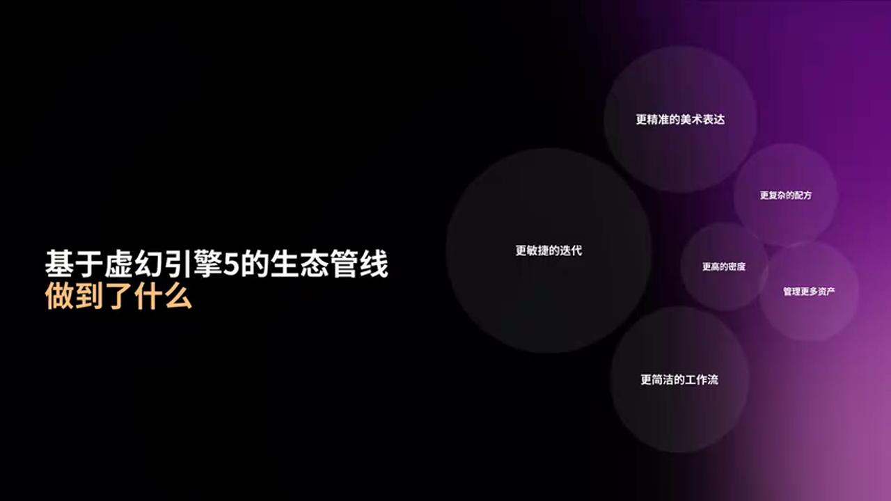

4. **更强的扩展性**: 完美支持更复杂的分布逻辑、更高的密度以及管理更多的资产

### 7.2 未来的发展方向

PCG团队也希望继续迭代管线,做出更多的突破。

**探索方向**:
- 让更多的人工场景更精确地去影响程序化的内容
- 进一步提升人工与程序化内容的融合度
- 探索更多AI辅助的生态生成技术

同时也欢迎小伙伴们在参会之余一起探讨和畅想。

### 7.3 《穿越火线-虹》实机展示

讲了这么多东西,有些同学就好奇《穿越火线-虹》到底做到了什么程度。在结尾,为大家呈现一段实机视频。

(以下为游戏实机演示片段)

从实机演示可以看到,新管线支撑下的《穿越火线-虹》呈现出了极高的生态密度和视觉品质,充分验证了技术方案的可行性。

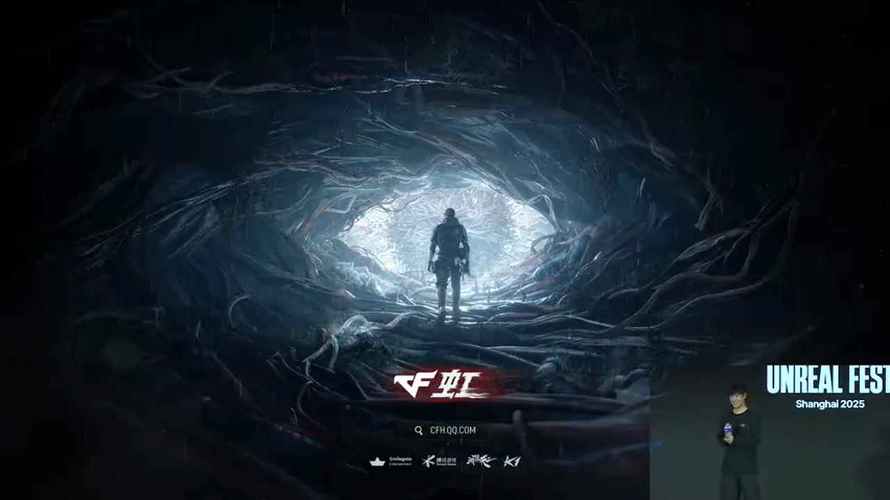

### 7.4 致谢

最后感谢:
- UFSH官方提供的这个平台
- 在座的各位
- 以及对天美J3工作室新生态管线做出卓越贡献的伙伴们

谢谢!

## 技术要点回顾与实践建议

### 核心技术要点

**1. 架构设计**
- 从Houdini HDA迁移到UE5 PCG Framework
- 数据内部化,避免频繁的导入导出
- 模块化的Generator系统
- 分层的剔除和筛选机制

**2. 性能优化**
- 数据缓存策略
- 精确的分区控制
- 通用Generator模板
- 异步计算与预览分离

**3. 工作流创新**
- 图形化配方编辑界面
- 框选预览工作流
- 实时参数调整
- 组合级的资产管理

**4. 精度提升**
- PCG Assembler集成
- Level Instance支持
- 精细的伴生关系
- 混合人工与程序化

**5. 生态学应用**
- 生态位理论的实践
- 组合系统设计
- 竞争与协同机制
- 非生物因素模拟

### 实践建议

**对于技术美术**:
1. 深入学习UE5的PCG Framework和相关插件
2. 理解生态学基础概念,提升配方设计的合理性
3. 掌握图形化思维,设计清晰的节点结构
4. 注重工具易用性,降低团队学习成本

**对于引擎程序员**:
1. 研究PCG Framework的底层实现和扩展机制
2. 优化数据结构和算法,提升大规模场景性能
3. 开发自定义节点和工具,满足项目特殊需求
4. 建立完善的调试和性能分析工具链

**对于项目管理者**:
1. 评估技术迁移的成本和收益
2. 合理安排预研和迭代周期
3. 建立标准化的资产和配方规范
4. 培养复合型人才,促进跨领域协作

### 常见问题与解决方案

**Q1: 如何平衡程序化与艺术控制?**
- 使用Assembler预制精细组合
- 提供丰富的参数调整接口
- 支持人工干预和局部修改
- 建立快速的预览反馈机制

**Q2: 大规模场景的性能如何保证?**
- 分区构建和流式加载
- 数据缓存和增量更新
- LOD和剔除策略
- 分布式构建农场

**Q3: 如何处理跨平台兼容性?**
- 统一的配方和数据格式
- 平台相关的性能配置
- 灵活的密度和质量调整
- 充分的测试和优化

**Q4: 团队协作如何组织?**
- 清晰的模块划分和接口定义
- 版本控制和资产管理
- 定期的Review和技术分享
- 文档和培训体系

## 结语

从Houdini HDA到UE5 PCG Framework,从每周一次迭代到实时调参,从单一资产到精细组合,天美J3工作室在《穿越火线-虹》项目中实现的技术革新,不仅仅是工具和流程的升级,更是对程序化内容生成理念的深刻思考和实践。

这套管线的成功,离不开对底层技术的深入理解,对美学品质的不懈追求,以及对团队协作效率的持续优化。它证明了在虚幻引擎5的强大能力支持下,结合项目实际需求和生态学理论,完全可以构建出既高效又灵活的生产管线。

对于整个游戏行业而言,这个案例提供了宝贵的参考价值。它展示了如何在技术选型时权衡利弊,如何在迁移过程中保持业务连续性,如何在创新中保持务实。更重要的是,它揭示了程序化内容生成的未来方向:不是简单的自动化,而是人工智慧与算法能力的深度融合。

随着硬件性能的提升和AI技术的发展,程序化生态系统必将迎来更多的可能性。我们期待看到更多团队分享他们的探索和实践,共同推动这个领域的进步。

---

**相关资源**:
- 虚幻引擎5 PCG Framework官方文档
- PCG Biome插件文档
- Houdini Engine for Unreal
- 生态学基础理论参考

**技术交流**:
如果您对本文内容有任何疑问或想法,欢迎加入UE5技术交流群与我们讨论。让我们一起探索程序化内容生成的无限可能!

