# 虚幻引擎在数字媒体艺术中的实战应用：从虚拟拍摄到交互装置的完整工作流

---

## 加入 UE5 技术交流群

如果您对虚幻引擎5的图形渲染技术感兴趣，欢迎加入我们的 **UE5 技术交流群**！

扫描上方二维码添加个人微信 **wlxklyh**，备注"UE5技术交流"，我会拉您进群。

在技术交流群中，您可以：
- 与其他UE开发者交流渲染技术经验
- 获取最新的GDC技术分享和解读
- 讨论图形编程、性能优化、构建工具流、动画系统等话题
- 分享引擎架构、基建工具等项目经验和技术难题

---

> **本文源自视频**：[UFSH2025]虚幻引擎在数字媒体艺术中的应用 | Anius GAL数字媒体艺术工作室创始人
> 
> **视频链接**：https://www.bilibili.com/video/BV1JS2PBbE3v
> 
> **时长**：26分21秒 | **AI生成说明**：本文由AI基于视频内容生成，包含原始截图和技术解析

---

## 导读

> **核心观点一**：数字媒体艺术项目需要全栈技能，从硬件编程到三维建模，从UE场景制作到AI辅助，每个环节都需要深入掌握。
>
> **核心观点二**：虚拟拍摄的成功关键在于选择稳定的媒体服务器和追踪系统，Disguise + RenderStream + Vive Mars 的组合是当前行业主流方案。
>
> **核心观点三**：Arduino + UE的交互装置开发成本低、上手快，但现场部署需要充分考虑散热、静电等物理环境因素。

**前置知识**：了解虚幻引擎基础操作、熟悉nDisplay概念、具备基本的硬件编程知识。

---

## 一、背景与痛点：数字媒体艺术的技术挑战

### 1.1 数字媒体艺术的多元化需求

数字媒体艺术工作室的项目类型极其多样化，每个项目都面临不同的技术挑战：

- **今天**：虚拟场景拍摄，需要LED墙、追踪系统、实时渲染
- **明天**：交互灯光装置，需要传感器、Arduino编程、粒子效果
- **后天**：沉浸式品牌展厅，需要多屏融合、裸眼3D、空间音频

这种"啥都做"的现状，要求团队成员必须具备**全栈技能**：

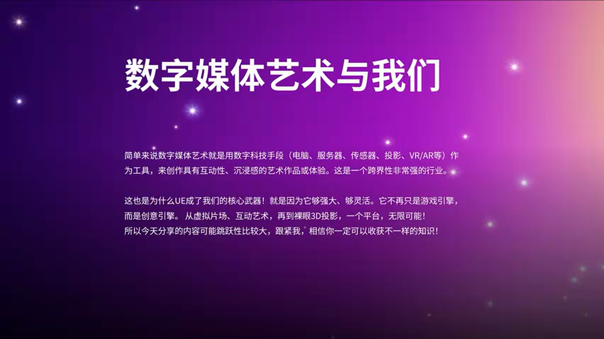

- **硬件层**：C/C++代码、传感器烧录
- **建模层**：三维软件建模、UV拆分
- **引擎层**：UE场景制作、蓝图编程
- **AI层**：后期合成、特效处理
- **执行层**：现场安装、调试、故障排除

正如演讲者所说："踩过的坑比流过的汗多得多"——这是数字媒体艺术从业者的真实写照。

### 1.2 为什么选择虚幻引擎？

虚幻引擎在数字媒体艺术领域的优势体现在三个方面：

**实时渲染能力**：相比传统离线渲染，UE可以在现场即时调整场景、灯光、材质，大幅缩短制作周期。

**生态系统完善**：从虚拟拍摄的nDisplay、到裸眼3D的视锥体计算、再到硬件交互的蓝图节点，UE提供了完整的工具链。

**快速迭代能力**：如演讲者提到的汽车广告项目，从接到brief到现场落地只用了3天时间，这在传统制作流程中几乎不可能实现。

---

## 二、虚拟拍摄工作流：媒体服务器 + UE的最佳实践

### 2.1 什么时候需要媒体服务器？

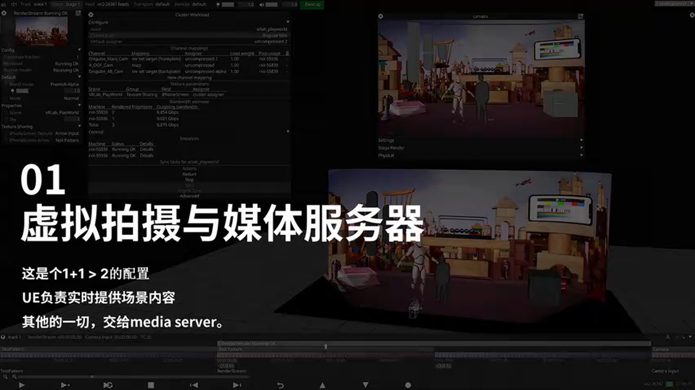

并非所有虚拟拍摄项目都需要媒体服务器。判断标准如下：

**必须使用媒体服务器的场景**：
- 大型LED虚拟制片（如《曼达洛人》）：需要同步LED天幕、LED墙、摄像机追踪
- 演唱会/春晚：需要动态场景切换、视频素材叠加、AR特效
- 高精度影视级拍摄：需要动作捕捉、虚拟场景精准匹配

**可以直接使用nDisplay的场景**：
- 小规模广告片制作
- 单屏或简单多屏输出
- 预算有限的项目

### 2.2 汽车广告虚拟拍摄案例解析

这个项目从接brief到落地仅用3天，中途还更换了vendor，时间极其紧张。项目的成功关键在于：

**快速场景搭建**：

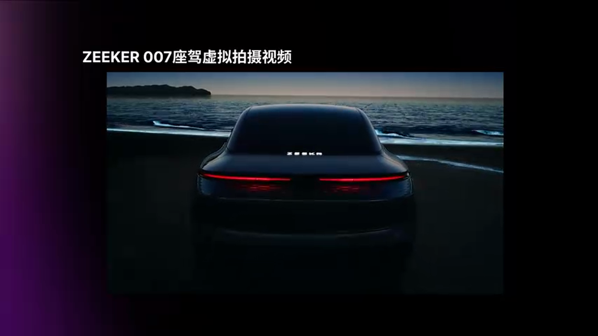

使用Flux的Ocean插件快速生成海洋效果，无需从零开始建模。这类插件库的积累是快速交付的基础。

**虚拟拍摄的天然优势**：

汽车拍摄是虚拟拍摄的最佳应用场景，原因有三：

1. **LED天幕提供真实反射**：车身的反光特性使得LED墙的环境光可以自然地反射在车体上，效果远超绿幕抠像
2. **不受自然光限制**：传统外景拍摄只能在黄昏时段抓拍，而虚拟拍摄可以随时切换日出、日落、夜景
3. **制作周期可控**：不需要等待天气、不需要场地协调，大幅缩短拍摄周期

### 2.3 媒体服务器选型：Disguise vs Green Hippo vs 黑曜石

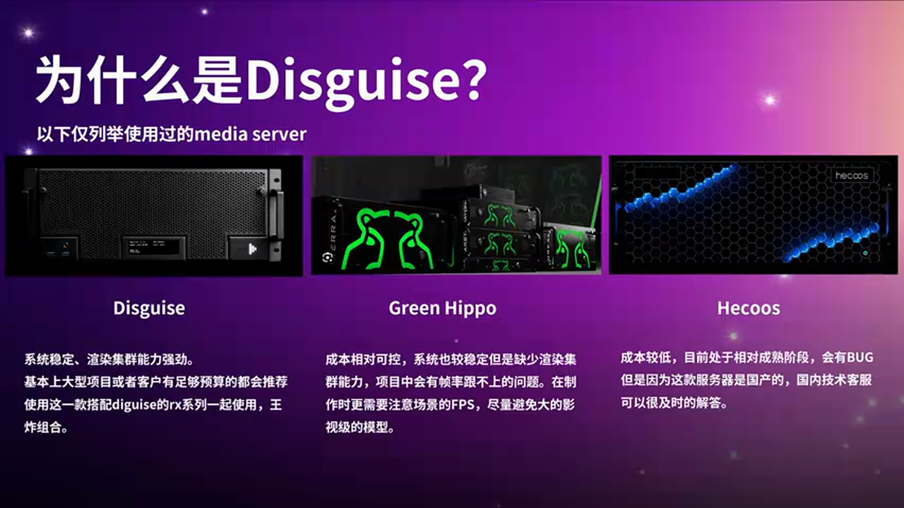

市场上主流的三款媒体服务器各有特点：

> **方案 A：Disguise**
> - 🟢 优势：系统稳定性极高，采用封闭系统架构，专为播控优化
> - 🟢 优势：与UE集成度最好，支持RenderStream集群渲染
> - 🟢 优势：支持GenLock帧同步，Q点切换精准
> - 🔴 劣势：价格昂贵，VFC4机型约等于8-10台自建nDisplay服务器
> - 🎯 适用场景：大型演唱会、央视级别项目、对稳定性要求极高的场合

> **方案 B：Green Hippo**
> - 🟢 优势：价格相对可控，比Disguise便宜
> - 🟢 优势：系统稳定性也不错
> - 🔴 劣势：渲染能力较弱，不能像影视项目那样堆积大量高精度模型
> - 🔴 劣势：需要在制作端就考虑性能优化
> - 🎯 适用场景：预算有限但需要稳定性的项目

> **方案 C：黑曜石（国产）**
> - 🟢 优势：性价比高，国内一线品牌
> - 🟢 优势：技术支持响应快，可以现场派工程师
> - 🔴 劣势：相对不够成熟，可能存在bug
> - 🔴 劣势：需要提前测试，确保大型项目前有技术保障
> - 🎯 适用场景：国内项目、需要本地化支持的场合

**帧率问题的关键性**：

演讲者特别强调：**本地制作端的FPS并不代表最终拍摄帧率**。原因在于：

1. UE文件需要上传到媒体服务器的RenderStream集群
2. 上传过程每个文件需要10-30分钟（取决于文件大小）
3. 必须在选定的媒体服务器中实际测试帧率
4. 低于50帧会出现明显卡顿，影响拍摄质量

**优化策略**：
- 减少高精度模型堆积
- 合理使用LOD
- 提前在媒体服务器中跑帧率测试
- 根据测试结果优化场景

### 2.4 追踪系统选型：Vive Mars vs Mo-Sys

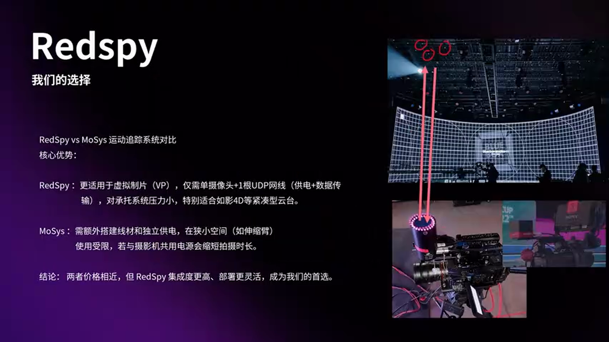

追踪系统是虚拟拍摄的"地基"，演讲者强调："好的开始真的是成功的一半"。

**为什么追踪系统如此重要？**

虚拟拍摄的场地和设备都是限时租赁的，客户也只会在有限时间内定场景。如果追踪丢失，整个团队（20-30人）都会停工等待，压力巨大。

**Vive Mars的优势**：

1. **单接收器设计**：只需一个接收器挂在摄像机上，通过一根UDP网线供电+传输数据
2. **系统压力小**：相比Mo-Sys需要独立供电和多个接收器，Vive Mars的架构更简洁
3. **续航时间长**：Mo-Sys三代需要与摄像机共用电源，导致拍摄时间缩短

**技术原理**：

两者都使用红外信号追踪技术：
- 发射红外信号
- 摄像机上的反光片反射信号
- 计算摄像机在空间中的位置和旋转

这是一项非常成熟的技术，稳定性已经得到验证。

### 2.5 Disguise + UE的工作流优势

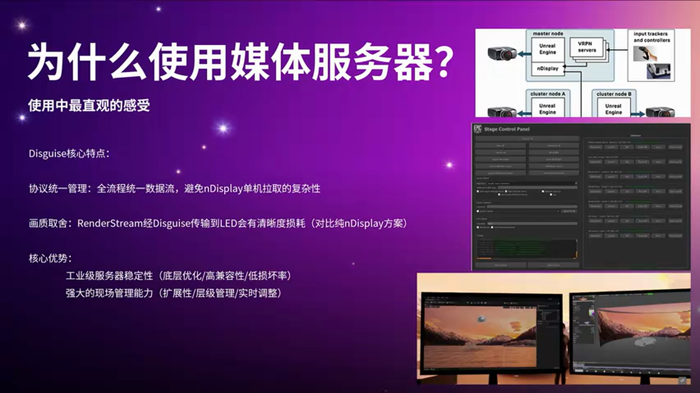

**统一协议管理**：

Disguise与UE的数据流采用同一协议，无需在nDisplay中手动拉NDI输出。这带来三个好处：

1. **避免画面丢失**：自建NDI机器容易出现画面拉不出来或拼接错误的问题
2. **统一管理清晰**：所有输出通过Disguise统一控制，层级关系一目了然
3. **扩展性强**：可以轻松添加新的输出节点

**精准的Q点控制**：

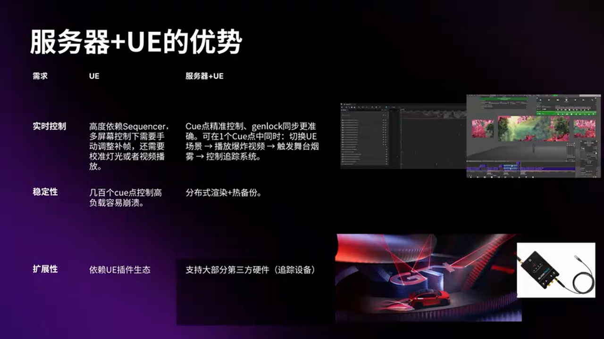

在多屏幕控制下，UE的Sequencer可能需要手动对针，这在影视级TVC拍摄中是致命的。Disguise + UE方案的优势：

- **Q点精准**：可以精确到帧的切换
- **GenLock支持**：统一控制帧率，避免画面撕裂
- **一键切换**：在一个Q点中同时切换UE场景、视频素材、灯光、追踪系统

**稳定性保障**：

大型演唱会和央视项目都要求**热备份**（Hot Backup）：

- 两台Disguise同时运行
- 当一台崩溃时，自动切换到另一台
- 观众无感知，不会意识到切换了时间线

这是UE单机运行无法实现的企业级可靠性。

**硬件扩展性**：

Disguise支持大部分第三方硬件插件，例如：

- **BlackTrax追踪系统**：在ID6全球发布会中，用BlackTrax的位置数据告诉Niagara粒子系统在哪里发射、哪里跟随车辆移动
- **各类传感器**：光敏、温度、压力等传感器都可以通过标准协议接入

BlackTrax + Disguise的工作流已经非常成熟，是行业标准配置。

---

## 三、裸眼3D制作：nDisplay的视锥体计算

### 3.1 裸眼3D案例展示

裸眼3D（Anamorphic 3D）是近年来商业展示的热门技术，常见于商场外墙LED大屏。演讲者展示了两个案例：

- **折角屏**：L型屏幕，利用转角产生立体错觉
- **曲面屏**：弧形屏幕，扩大最佳观看区域

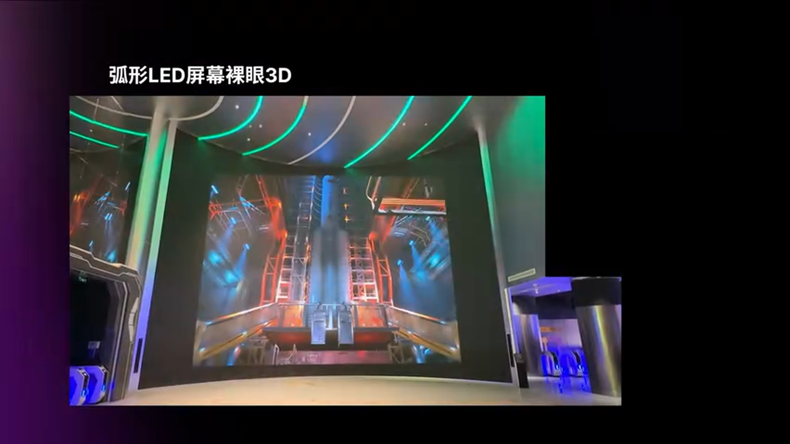

### 3.2 为什么选择UE制作裸眼3D？

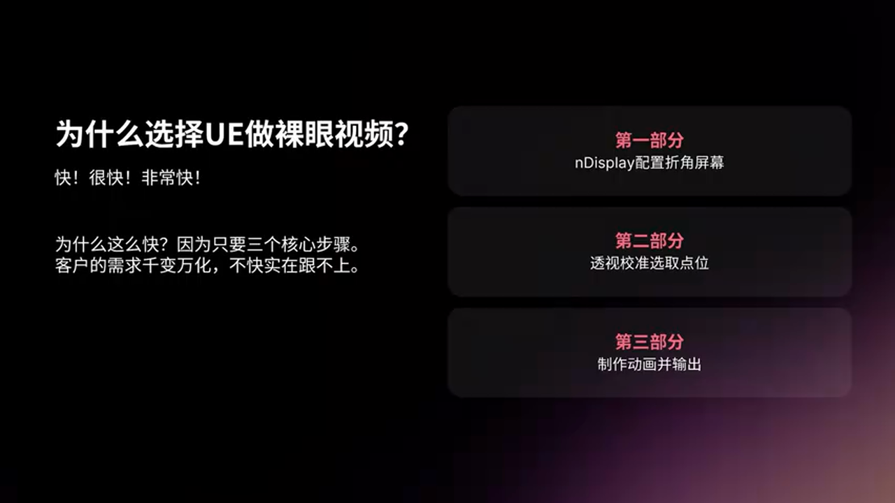

**只需三步，谁能不心动？**

传统裸眼3D制作需要复杂的透视计算、多次渲染测试。而UE + nDisplay的方案将流程简化为：

1. 建立物理精准的LED模型
2. 设置Default View Point
3. 启用nDisplay组件输出

### 3.3 关键技术要点

**物理尺寸精准匹配**：

这是裸眼3D成功的基础，包含三个层面：

1. **三维软件建模**：LED屏的物理尺寸必须与现实一致
2. **UE中的导入**：保持1:1的单位比例（通常是厘米）
3. **弯度精确还原**：如果LED屏是异形（如带弯曲），弯度角度必须精确建模

**为什么物理尺寸如此重要？**

- 视锥体（View Frustum）的计算基于物理距离
- 如果尺寸不匹配，透视关系会错误
- 最终无法确定观众的最佳观看位置

**屏幕越大，效果越好**：

裸眼3D的最佳观看范围与屏幕尺寸成正比。这也是为什么商场外墙屏通常都是10米以上的巨幕——更大的屏幕意味着更大的"甜蜜区"（Sweet Spot）。

### 3.4 nDisplay的Default View Point配置

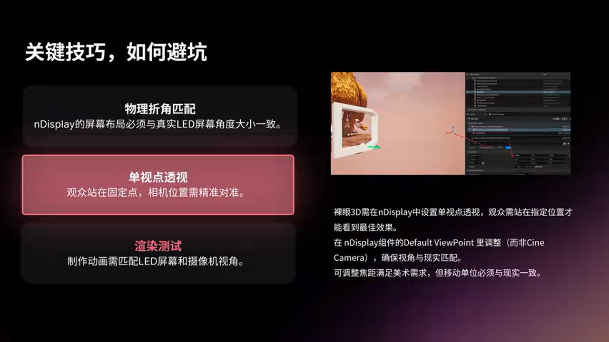

**单点透视的本质**：

裸眼3D是**单点透视**技术，观众需要站在特定位置才能看到最佳效果。这个位置就是通过**Default View Point**组件设定的。

**配置步骤**：

1. 在nDisplay配置中添加Default View Point组件
2. 设置观众的物理位置（相对于LED屏的距离和高度）
3. 移动View Point可以实时预览不同观看位置的效果

左右两张图展示了同样内容在不同View Point下的视角差异——这就是为什么必须提前设定最佳观看位置。

**制作过程中的注意事项**：

- nDisplay组件在场景中是一个平面，会挡住视线
- 制作时可以隐藏，但**最终确认时必须显示**
- 只有显示nDisplay组件，才能看到真实的渲染视角
- 场景中看到的模糊预览不影响最终输出质量

### 3.5 输出配置的关键细节

**与硬件供应商确认分辨率**：

这是最容易出错的环节。必须确认：

- 输出分辨率是**点对点**（Pixel-to-Pixel）
- 如果供应商告诉你是"拉伸"或"缩放"，到现场所有透视都会错误
- 需要重新输出甚至重新制作

**避坑指南**：

1. 提前索要LED屏的物理分辨率（如3840x2160）
2. 在UE中设置完全相同的输出分辨率
3. 现场测试时先用简单几何体验证透视是否正确
4. 确认无误后再进行完整内容的输出

---

## 四、硬件交互装置：Arduino + UE的实战经验

### 4.1 中法文化交流项目案例

这是一个在法国卢浮宫搭建的数字媒体装置，通过Arduino传感器与UE场景交互，展示中华文化。

**项目特点**：

- 使用**光敏传感器**检测手部遮挡
- 触发UE中的Niagara粒子效果
- 三台投影仪360度无缝投影到圆锥形装置

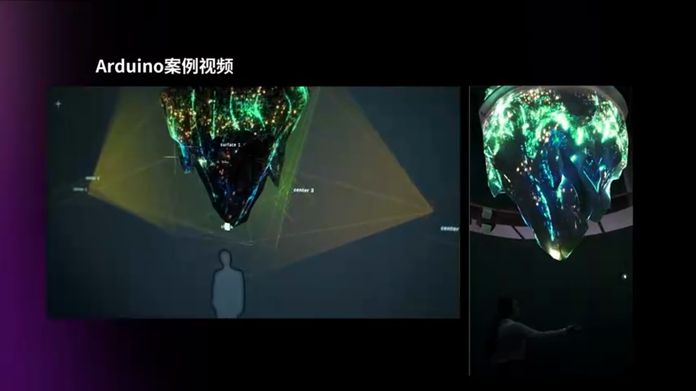

当观众的手遮挡光线时，粒子系统被触发，产生互动效果。

### 4.2 Arduino：数字媒体艺术的硬件基石

**什么是Arduino？**

Arduino是一个开源电子原型平台，由硬件（开发板）和IDE（编程环境）组成，专为快速实现物理世界与数字世界的交互而设计。

**为什么选择Arduino？**

1. **简单易用**：使用类C语言，比底层嵌入式开发简单得多
2. **生态完善**：全球开发者提供海量传感器和示例代码
3. **成本极低**：最便宜的开发板只需几十元
4. **传感器丰富**：光敏、温度、压力、距离、加速度等应有尽有

**与UE的集成**：

Arduino通过串口（Serial）或网络（UDP/TCP）与UE通信，UE蓝图可以直接读取传感器数据。

### 4.3 硬件清单与成本分析

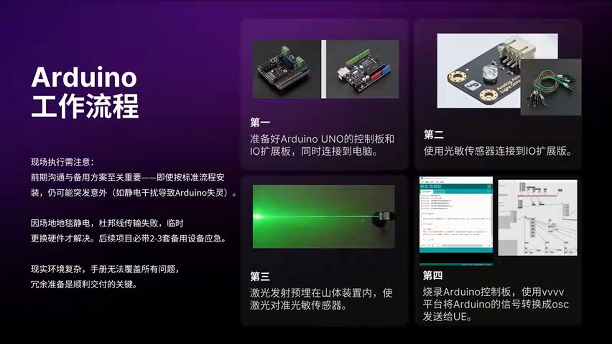

卢浮宫项目使用的硬件包括：

- Arduino开发板（约50-100元）
- 光敏传感器（约10-20元）
- 杜邦线、面包板（约20元）
- 三台投影仪（租赁）
- 圆锥形装置（定制加工）

**总成本分析**：

硬件交互部分的成本极低（不到200元），主要成本在于：
- 投影设备租赁
- 装置定制加工
- 现场人工和差旅

### 4.4 现场部署的血泪教训

**问题一：静电导致短路**

现场铺设的地毯产生静电，导致Arduino的杜邦线短路。

**根本原因**：
- 杜邦线连接不是封闭的，存在缝隙
- 静电通过缝隙击穿，导致传感器失效

**解决方案**：
- 更换所有硬件（Arduino + 传感器 + 线材）
- 使用更可靠的连接方式（如焊接）
- 在装置底部增加绝缘层

**问题二：散热不足导致投影仪过热**

圆锥形装置顶部是封闭的，导致三台投影仪散热不良，频繁过热保护。

**解决方案**：
- 现场要求供应商在顶部开孔
- 形成直通风道，让热空气从顶部排出
- 投影仪恢复正常工作

**问题三：中法文化差异导致的"罢工"**

荷兰工人到达法国现场后，到了下班时间（晚上10点）突然全部停工，即使工作未完成也拒绝继续。

**解决方案**：
- 品牌方现场取现金欧元
- 逐个发"红包"加班费
- 工人继续工作，完成安装

**教训总结**：

1. **硬件连接必须可靠**：杜邦线适合测试，生产环境建议焊接
2. **充分考虑物理环境**：静电、温度、湿度都可能影响设备
3. **提前沟通文化差异**：国际项目需要了解当地劳工法规
4. **预留应急时间和预算**：现场总会有意外，必须有Plan B

---

## 五、Disguise + UE的高级技巧

### 5.1 摄像机设置的关键细节

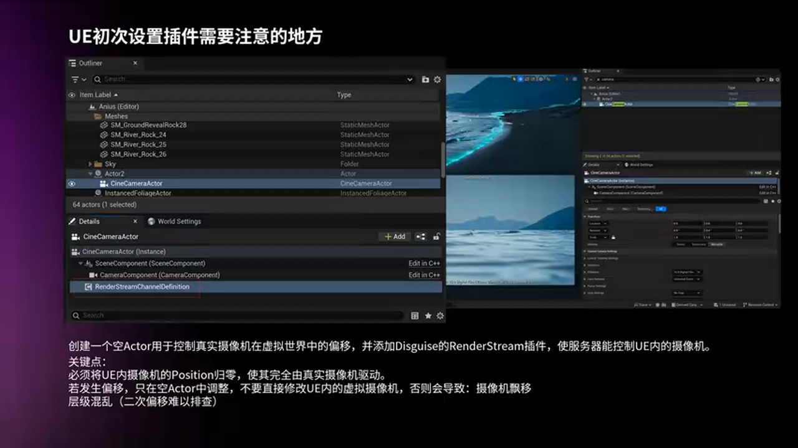

**空Actor的作用**：

在虚拟拍摄中，需要创建一个**空Actor**作为摄像机的父级。原因在于：

- 真实摄像机的追踪原点可能在(0,0,0)
- 但虚拟摄像机在UE场景中可能偏移了1米或2米
- 通过移动父级Actor，可以快速对齐真实与虚拟摄像机的位置

**RenderStream插件**：

这是Disguise官方提供的UE插件，用于：
- 接收真实摄像机的位置和旋转数据
- 传输给UE中的虚拟摄像机
- 可以在Epic Games Launcher中下载

**CineCamera的Location归零**：

这是一个容易被忽略但极其重要的细节：

- CineCamera的Location必须设置为(0,0,0)
- 不要用CineCamera本身来偏移位置
- 所有偏移通过父级Actor控制

**为什么？**

如果CineCamera本身有偏移，当你调整父级Actor时，摄像机会在场景中"飘"，导致画面抖动或位置错误。

### 5.2 MR与AR图层分离技术

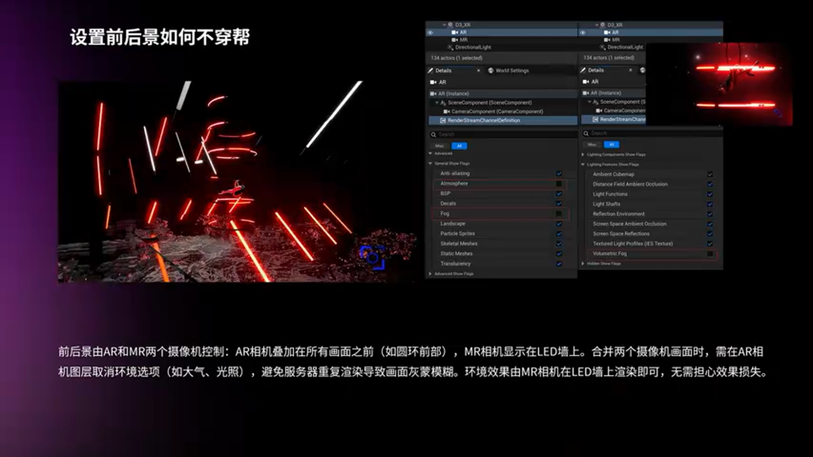

这是一个扩展现实（XR）项目，需要将前景AR元素与背景MR元素分离渲染。

**技术原理**：

1. **两个摄像机**：一个只看AR图层（前景），一个只看MR图层（背景）
2. **图层分离**：通过Render Layer设置，让不同物体只被特定摄像机看到
3. **后期合成**：在Disguise或后期软件中将两个图层叠加

**关键注意事项**：

当两个摄像机合并时，必须关闭前景摄像机的：
- **Atmospheric Fog**（大气雾）
- **Volumetric Fog**（体积雾）

否则画面会非常灰，因为两个摄像机都渲染了雾效，叠加后雾效翻倍。

---

## 六、Disguise + UE的Render Target技巧

### 6.1 360度圆锥装置的UV映射挑战

卢浮宫项目的圆锥形装置需要360度无缝投影，这带来了UV映射的挑战。

**问题分析**：

- 三台投影仪需要融合成一个完整画面
- Disguise负责融合和播控
- 但如何让UE的粒子效果正确映射到圆锥表面？

### 6.2 Render Target的巧妙应用

**解决方案**：

1. **拆分模型UV**：在三维软件中将圆锥模型的UV展开
2. **创建Render Target**：在UE中创建一个Render Target纹理
3. **场景相机渲染**：在场景中创建一个与装置完全相同的虚拟模型
4. **UV映射**：将Render Target作为材质应用到虚拟模型上
5. **NDI输出**：通过NDI将Render Target输出给Disguise

**技术优势**：

- 粒子效果可以360度均匀分布
- 无需手动调整每个投影仪的画面
- Disguise自动处理融合和变形校正

---

## 七、实战总结与避坑指南

### 7.1 虚拟拍摄避坑指南

**硬件选型**：

1. **媒体服务器**：预算充足选Disguise，预算有限选Green Hippo，国内项目可考虑黑曜石
2. **追踪系统**：Vive Mars是当前最佳选择，单接收器设计更稳定
3. **提前测试**：必须在实际媒体服务器中测试帧率，不能只看本地FPS

**现场部署**：

1. **热备份**：大型项目必须准备两套Disguise系统
2. **GenLock**：确保所有设备使用统一的帧同步信号
3. **Q点测试**：提前测试所有场景切换的Q点，确保无缝衔接

### 7.2 裸眼3D避坑指南

**建模阶段**：

1. **物理尺寸精准**：LED屏模型必须与现实1:1匹配
2. **弯度精确还原**：异形屏的弯曲角度必须精确建模
3. **单位统一**：UE和三维软件使用相同的单位系统（通常是厘米）

**渲染配置**：

1. **View Point必须显示**：最终确认时必须显示nDisplay组件
2. **点对点输出**：与硬件供应商确认分辨率是点对点，不是拉伸
3. **现场测试**：先用简单几何体测试透视，再输出完整内容

### 7.3 硬件交互避坑指南

**硬件连接**：

1. **杜邦线仅用于测试**：生产环境建议焊接或使用可靠连接器
2. **考虑静电影响**：地毯、干燥环境可能产生静电，需要绝缘措施
3. **线材长度预留**：现场布线可能需要比预期更长的线材

**散热设计**：

1. **投影仪散热**：封闭空间必须设计通风口
2. **Arduino散热**：高负载运行时也需要考虑散热
3. **提前现场测试**：在类似环境中进行长时间运行测试

**跨文化项目**：

1. **了解当地法规**：欧洲的劳工保护法规非常严格
2. **预留应急预算**：现场加班费、设备损坏等都需要预算
3. **提前沟通时间表**：明确每天的工作时间和加班安排

---

## 八、未来展望

虚幻引擎在数字媒体艺术领域的应用还在不断扩展。演讲者提到，他计划推出：

- **UE基础教程系列**（已在B站免费分享）
- **Niagara粒子系统初级教程**
- 更多实战项目案例分享

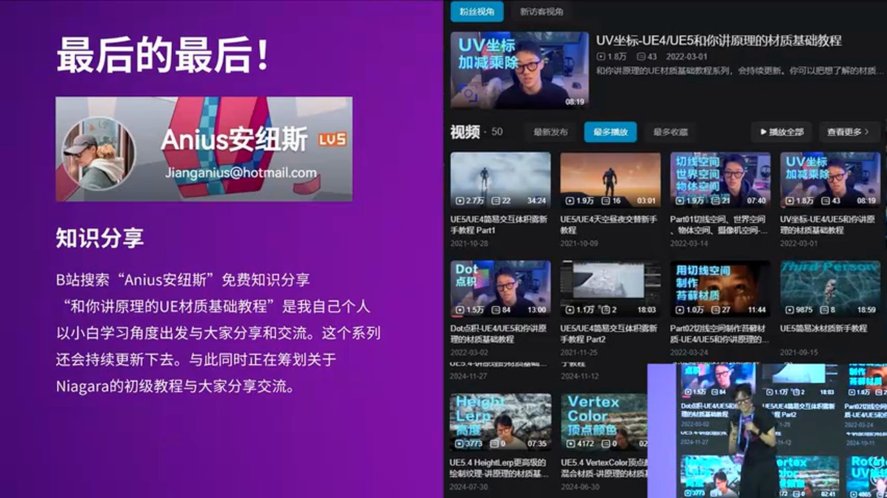

**技术发展趋势**：

1. **虚拟制片普及化**：随着LED墙成本降低，中小型项目也能使用虚拟拍摄
2. **AI辅助创作**：AI生成内容（AIGC）将与UE实时渲染结合
3. **XR融合**：AR/VR/MR技术将与传统展示形式深度融合
4. **硬件生态完善**：更多传感器、追踪设备将与UE无缝集成

---

## 总结

虚幻引擎在数字媒体艺术中的应用已经形成了完整的工作流：

**虚拟拍摄**：Disguise + RenderStream + Vive Mars 是当前行业标准配置，提供企业级稳定性和灵活性。

**裸眼3D**：nDisplay的视锥体计算让"三步出片"成为现实，但物理尺寸精准匹配是成功的基础。

**硬件交互**：Arduino + UE的组合成本低、上手快，但现场部署需要充分考虑物理环境因素。

数字媒体艺术从业者需要具备**全栈技能**——从硬件编程到三维建模，从引擎开发到现场执行。正如演讲者所说："踩过的坑比流过的汗多"，但正是这些实战经验，让我们能够在紧张的3天内完成从brief到落地的完整项目。

让我们一起拥抱虚幻引擎，在数字媒体艺术的道路上不断探索！

---

**相关资源**：

- B站频道：和你讲原理的UE才基础教程
- Epic Games官方文档：nDisplay、RenderStream插件
- Disguise官网：培训资料和案例库
- Arduino官网：传感器库和示例代码

---

*本文由AI基于视频内容生成，包含原始截图和技术解析。如有疑问或需要更多技术细节，欢迎加入UE5技术交流群讨论。*

