# [UFSH2025]从《伊瑟》项目来谈谈中型美术团队如何制作大体量内容 | 朱正奕心动游戏《伊瑟》美术总监
**Video Duration:** 46分16秒
**Subtitles:** 935
**Subtitle Source:** Whisper Transcription
**Generated:** 2026-01-08 02:39:42
---
## Overview
This article is generated from a video presentation with embedded screenshots taken at key moments. Each section includes relevant visual content to illustrate the points discussed.
---
## Section 1 (00:00:00)
**Transcript:**
> 非常开心啊 能说要来参加NRAL的Fanspans
**Visual Reference:**

_Screenshot from 00:00:00_
---
## Section 2 (00:00:06)
**Transcript:**
> 其实我跟徐幻还是挺有远远的
**Visual Reference:**

_Screenshot from 00:00:06_
---
## Section 3 (00:00:10)
**Transcript:**
> 就是从我入行以来
**Visual Reference:**

_Screenshot from 00:00:10_
---
## Section 4 (00:00:12)
**Transcript:**
> 刚进入行业的时候用的是徐幻二疫情
**Visual Reference:**

_Screenshot from 00:00:12_
---
## Section 5 (00:00:16)
**Transcript:**
> 就这么多年 其实徐幻疫情这个迭代也是非常快
**Visual Reference:**

_Screenshot from 00:00:16_
---
## Section 6 (00:00:21)
**Transcript:**
> 从徐幻三当时间开棒 可自定义的这种
**Visual Reference:**

_Screenshot from 00:00:21_
---
## Section 7 (00:00:26)
**Transcript:**
> 面上美术的可自定的一些节点
**Visual Reference:**

_Screenshot from 00:00:26_
---
## Section 8 (00:00:28)
**Transcript:**
> 到徐幻四开放了像这样的蓝图的可实化编辑工具
**Visual Reference:**

_Screenshot from 00:00:28_
---
## Section 9 (00:00:34)
**Transcript:**
> 以及到徐幻五现在有辱闷
**Visual Reference:**

_Screenshot from 00:00:34_
---
## Section 10 (00:00:37)
**Transcript:**
> 还有NANN 甚至像Megalite 甚至像Fillman这种技术
**Visual Reference:**

_Screenshot from 00:00:37_
---
## Section 11 (00:00:43)
**Transcript:**
> 我是觉得就是每一个阶段
**Visual Reference:**

_Screenshot from 00:00:43_
---
## Section 12 (00:00:46)
**Transcript:**
> 就是U1的他整个新的一个技术
**Visual Reference:**

_Screenshot from 00:00:46_
---
## Section 13 (00:00:48)
**Transcript:**
> 就带了一个新的时代的一个根迭
**Visual Reference:**

_Screenshot from 00:00:48_
---
## Section 14 (00:00:50)
**Transcript:**
> 但是从我内心感觉上
**Visual Reference:**

_Screenshot from 00:00:50_
---
## Section 15 (00:00:53)
**Transcript:**
> 他最大的一个变化
**Visual Reference:**

_Screenshot from 00:00:53_
---
## Section 16 (00:00:54)
**Transcript:**
> 就是从U1四开始
**Visual Reference:**

_Screenshot from 00:00:54_
---
## Section 17 (00:00:56)
**Transcript:**
> 他来自Sense的授权
**Visual Reference:**

_Screenshot from 00:00:56_
---
## Section 18 (00:00:58)
**Transcript:**
> 更面向了普通的开发者
**Visual Reference:**

_Screenshot from 00:00:58_
---
## Section 19 (00:01:00)
**Transcript:**
> 因为在这之前
**Visual Reference:**

_Screenshot from 00:01:00_
---
## Section 20 (00:01:01)
**Transcript:**
> 其基本上像NANN 二二三时代的话
**Visual Reference:**

_Screenshot from 00:01:01_
---
## Section 21 (00:01:05)
**Transcript:**
> 只有大场
**Visual Reference:**

_Screenshot from 00:01:05_
---
## Section 22 (00:01:06)
**Transcript:**
> 他才有成本去用引擎开发游戏
**Visual Reference:**

_Screenshot from 00:01:06_
---
## Section 23 (00:01:08)
**Transcript:**
> 从U1四之后
**Visual Reference:**

_Screenshot from 00:01:08_
---
## Section 24 (00:01:10)
**Transcript:**
> 其实像一些特别小的一些这样的一个团队的话
**Visual Reference:**

_Screenshot from 00:01:10_
---
## Section 25 (00:01:14)
**Transcript:**
> 他也可以用U1四去开发游戏
**Visual Reference:**

_Screenshot from 00:01:14_
---
## Section 26 (00:01:17)
**Transcript:**
> 所以就是从U1四开始之后
**Visual Reference:**

_Screenshot from 00:01:17_
---
## Section 27 (00:01:19)
**Transcript:**
> 你们发现有很多的中小型团队去做他们的一些像
**Visual Reference:**

_Screenshot from 00:01:19_
---
## Section 28 (00:01:23)
**Transcript:**
> 也就是能在大家在今天看到
**Visual Reference:**

_Screenshot from 00:01:23_
---
## Section 29 (00:01:26)
**Transcript:**
> 有那么多的用U1开发的一些产品
**Visual Reference:**

_Screenshot from 00:01:26_
---
## Section 30 (00:01:28)
**Transcript:**
> 而不是支属于那些三月大场去做游戏
**Visual Reference:**

_Screenshot from 00:01:28_
---
## Section 31 (00:01:33)
**Transcript:**
> 那回到今天的的话题
**Visual Reference:**

_Screenshot from 00:01:33_
---
## Section 32 (00:01:34)
**Transcript:**
> 今天的话题还是就聊聊我们的项目
**Visual Reference:**

_Screenshot from 00:01:34_
---
## Section 33 (00:01:40)
**Transcript:**
> 标题就是从预测项目来谈谈中型美洲团队
**Visual Reference:**

_Screenshot from 00:01:40_
---
## Section 34 (00:01:44)
**Transcript:**
> 如何制作大体谈内容
**Visual Reference:**

_Screenshot from 00:01:44_
---
## Section 35 (00:01:49)
**Transcript:**
> 今天大概会讲四个点
**Visual Reference:**

_Screenshot from 00:01:49_
---
## Section 36 (00:01:51)
**Transcript:**
> 第一个点主要是聊一下预测是一个什么样的游戏
**Visual Reference:**
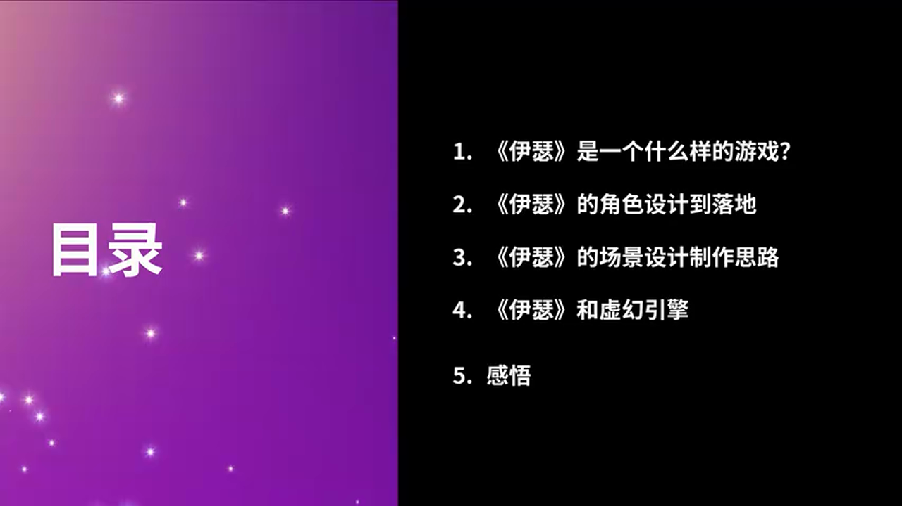
_Screenshot from 00:01:51_
---
## Section 37 (00:01:55)
**Transcript:**
> 然后会聊一下我们在做预测的时候
**Visual Reference:**

_Screenshot from 00:01:55_
---
## Section 38 (00:01:58)
**Transcript:**
> 这个角色的开发管线是怎么做的
**Visual Reference:**

_Screenshot from 00:01:58_
---
## Section 39 (00:02:01)
**Transcript:**
> 然后第三个会聊聊我们做这个就是应该不场景的
**Visual Reference:**

_Screenshot from 00:02:01_
---
## Section 40 (00:02:05)
**Transcript:**
> 这个设计思路
**Visual Reference:**

_Screenshot from 00:02:05_
---
## Section 41 (00:02:06)
**Transcript:**
> 最后会提一下我们在做就是用引擎开发的预测的时候
**Visual Reference:**

_Screenshot from 00:02:06_
---
## Section 42 (00:02:11)
**Transcript:**
> 会有什么考虑
**Visual Reference:**

_Screenshot from 00:02:11_
---
## Section 43 (00:02:16)
**Transcript:**
> 首先预测是一个什么样的游戏
**Visual Reference:**

_Screenshot from 00:02:16_
---
## Section 44 (00:02:20)
**Transcript:**
> 他是一个
**Visual Reference:**

_Screenshot from 00:02:20_
---
## Section 45 (00:02:22)
**Transcript:**
> 有句话说是个艺能英雄养成RPG
**Visual Reference:**

_Screenshot from 00:02:22_
---
## Section 46 (00:02:24)
**Transcript:**
> 那具体来说的话
**Visual Reference:**

_Screenshot from 00:02:24_
---
## Section 47 (00:02:27)
**Transcript:**
> 他是用虚幻思开发
**Visual Reference:**

_Screenshot from 00:02:27_
---
## Section 48 (00:02:28)
**Transcript:**
> 一个客划都是体财
**Visual Reference:**

_Screenshot from 00:02:28_
---
## Section 49 (00:02:30)
**Transcript:**
> 融合了策略回合制战斗
**Visual Reference:**

_Screenshot from 00:02:30_
---
## Section 50 (00:02:32)
**Transcript:**
> 重决色收集养成
**Visual Reference:**

_Screenshot from 00:02:32_
---
## Section 51 (00:02:34)
**Transcript:**
> PVPVPV玩法兼具跨多端的RPG游戏
**Visual Reference:**

_Screenshot from 00:02:34_
---
## Section 52 (00:02:38)
**Transcript:**
> 这个标签有点多
**Visual Reference:**

_Screenshot from 00:02:38_
---
## Section 53 (00:02:40)
**Transcript:**
> 就是好不容易成背下来
**Visual Reference:**

_Screenshot from 00:02:40_
---
## Section 54 (00:02:44)
**Transcript:**
> 目前我们项目其实在海外已经上线了
**Visual Reference:**
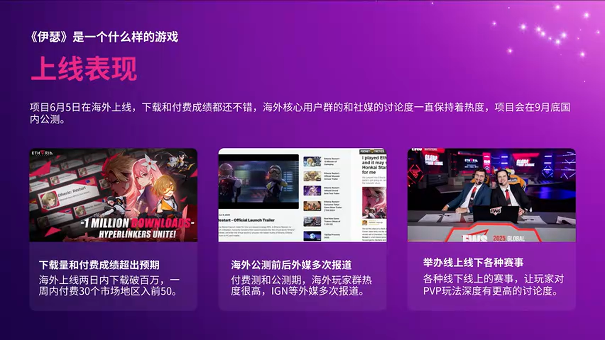
_Screenshot from 00:02:44_
---
## Section 55 (00:02:47)
**Transcript:**
> 就目前整体的一个下载和付费成绩都还算不错
**Visual Reference:**

_Screenshot from 00:02:47_
---
## Section 56 (00:02:52)
**Transcript:**
> 至少就超出我们项目组的预测了
**Visual Reference:**

_Screenshot from 00:02:52_
---
## Section 57 (00:02:55)
**Transcript:**
> 然后我们其实在上线前后
**Visual Reference:**

_Screenshot from 00:02:55_
---
## Section 58 (00:02:58)
**Transcript:**
> 基本上像海外的一些媒体包括IG
**Visual Reference:**

_Screenshot from 00:02:58_
---
## Section 59 (00:03:00)
**Transcript:**
> 但他们也是多spot我们项目
**Visual Reference:**

_Screenshot from 00:03:00_
---
## Section 60 (00:03:03)
**Transcript:**
> 其实在海外一些像油管上面这样的平台
**Visual Reference:**

_Screenshot from 00:03:03_
---
## Section 61 (00:03:05)
**Transcript:**
> 其实热度还是比较高的
**Visual Reference:**

_Screenshot from 00:03:05_
---
## Section 62 (00:03:07)
**Transcript:**
> 然后我们内部其实也去举办了这样的一个线下
**Visual Reference:**

_Screenshot from 00:03:07_
---
## Section 63 (00:03:11)
**Transcript:**
> 线上的一些各种赛事
**Visual Reference:**

_Screenshot from 00:03:11_
---
## Section 64 (00:03:13)
**Transcript:**
> 就是因为我们本身来讲虽然是一个回合制有些
**Visual Reference:**

_Screenshot from 00:03:13_
---
## Section 65 (00:03:16)
**Transcript:**
> 当然我们在PVPVVP玩法上面其实是有比较深度的一个破展的
**Visual Reference:**

_Screenshot from 00:03:16_
---
## Section 66 (00:03:21)
**Transcript:**
> 所以说以这个为契机去阻举办了很多赛事
**Visual Reference:**

_Screenshot from 00:03:21_
---
## Section 67 (00:03:24)
**Transcript:**
> 目前其实在整个一个玩家群里面对于这个赛事
**Visual Reference:**

_Screenshot from 00:03:24_
---
## Section 68 (00:03:28)
**Transcript:**
> 包括一些英雄强度其实讨论度还是比较高的
**Visual Reference:**

_Screenshot from 00:03:28_
---
## Section 69 (00:03:36)
**Transcript:**
> 然后聊下我们游戏的核心玩法
**Visual Reference:**

_Screenshot from 00:03:36_
---
## Section 70 (00:03:40)
**Transcript:**
> 首先其中一个点
**Visual Reference:**

_Screenshot from 00:03:40_
---
## Section 71 (00:03:41)
**Transcript:**
> 我们是一个角色收集和养成以及玩法原型是模拟招换
**Visual Reference:**

_Screenshot from 00:03:41_
---
## Section 72 (00:03:46)
**Transcript:**
> 以及银扬是这样的一个类型的游戏
**Visual Reference:**

_Screenshot from 00:03:46_
---
## Section 73 (00:03:48)
**Transcript:**
> 国内玩家肯定非常熟悉银扬是
**Visual Reference:**

_Screenshot from 00:03:48_
---
## Section 74 (00:03:51)
**Transcript:**
> 目前银扬是大概的一个英雄数量的话大概是150压以上
**Visual Reference:**

_Screenshot from 00:03:51_
---
## Section 75 (00:03:55)
**Transcript:**
> 它整个一个跨度会跨到5个岛位
**Visual Reference:**

_Screenshot from 00:03:55_
---
## Section 76 (00:03:58)
**Transcript:**
> 我们目前项目的一个角色踢肚是在3个
**Visual Reference:**

_Screenshot from 00:03:58_
---
## Section 77 (00:04:02)
**Transcript:**
> 有分就是常规的这种SRSR这种三种就接踢
**Visual Reference:**

_Screenshot from 00:04:02_
---
## Section 78 (00:04:06)
**Transcript:**
> 目前上现在大概有60多个英雄
**Visual Reference:**

_Screenshot from 00:04:06_
---
## Section 79 (00:04:10)
**Transcript:**
> 应该再过段时间可能已经快到70了
**Visual Reference:**

_Screenshot from 00:04:10_
---
## Section 80 (00:04:13)
**Transcript:**
> 就未来我们肯定也是会奔着这个100家的这个英雄数量去的
**Visual Reference:**

_Screenshot from 00:04:13_
---
## Section 81 (00:04:17)
**Transcript:**
> 除了这个英雄数量我们还有大量的装备系统以及制跳
**Visual Reference:**

_Screenshot from 00:04:17_
---
## Section 82 (00:04:21)
**Transcript:**
> 以及会在一些这种深度养成上去做的一些机制的一些创新
**Visual Reference:**

_Screenshot from 00:04:21_
---
## Section 83 (00:04:26)
**Transcript:**
> 所以在最终厚期的话玩家主要追求的还是骗这种角色和装备
**Visual Reference:**

_Screenshot from 00:04:26_
---
## Section 84 (00:04:32)
**Transcript:**
> 以及跟制桥搭配了这样的一个玩法
**Visual Reference:**

_Screenshot from 00:04:32_
---
## Section 85 (00:04:36)
**Transcript:**
> 那相比较同品类的游戏的话
**Visual Reference:**

_Screenshot from 00:04:36_
---
## Section 86 (00:04:38)
**Transcript:**
> 我们其实还是加入了这个相停关卡探索
**Visual Reference:**

_Screenshot from 00:04:38_
---
## Section 87 (00:04:41)
**Transcript:**
> 就相比较像模拟赖客这里玩法的话
**Visual Reference:**

_Screenshot from 00:04:41_
---
## Section 88 (00:04:44)
**Transcript:**
> 其实基本上它不会去用这样的一个方式去呈现剧情的
**Visual Reference:**

_Screenshot from 00:04:44_
---
## Section 89 (00:04:49)
**Transcript:**
> 那我们的目的也是为了能用最直接的方式
**Visual Reference:**

_Screenshot from 00:04:49_
---
## Section 90 (00:04:51)
**Transcript:**
> 让玩家比解角色和故事也让一些我们有一些类似BOSS站
**Visual Reference:**

_Screenshot from 00:04:51_
---
## Section 91 (00:04:57)
**Transcript:**
> 这样的一个世界能在续持高潮上有一个更具权的载体
**Visual Reference:**

_Screenshot from 00:04:57_
---
## Section 92 (00:05:02)
**Transcript:**
> 然后我们虽然是回合只游戏刚刚也说了
**Visual Reference:**

_Screenshot from 00:05:02_
---
## Section 93 (00:05:05)
**Transcript:**
> 但PVP是我们游戏中非常重要的一个体系
**Visual Reference:**

_Screenshot from 00:05:05_
---
## Section 94 (00:05:09)
**Transcript:**
> 我们有同步和意步实施PVP
**Visual Reference:**

_Screenshot from 00:05:09_
---
## Section 95 (00:05:12)
**Transcript:**
> 现实下现场都会办过比赛
**Visual Reference:**

_Screenshot from 00:05:12_
---
## Section 96 (00:05:14)
**Transcript:**
> 所以说我们在整体的一个核心玩法上
**Visual Reference:**

_Screenshot from 00:05:14_
---
## Section 97 (00:05:17)
**Transcript:**
> 对于PVP这一块未来也是会就着重去投入的
**Visual Reference:**

_Screenshot from 00:05:17_
---
## Section 98 (00:05:23)
**Transcript:**
> 那关于美术风格和世界观
**Visual Reference:**
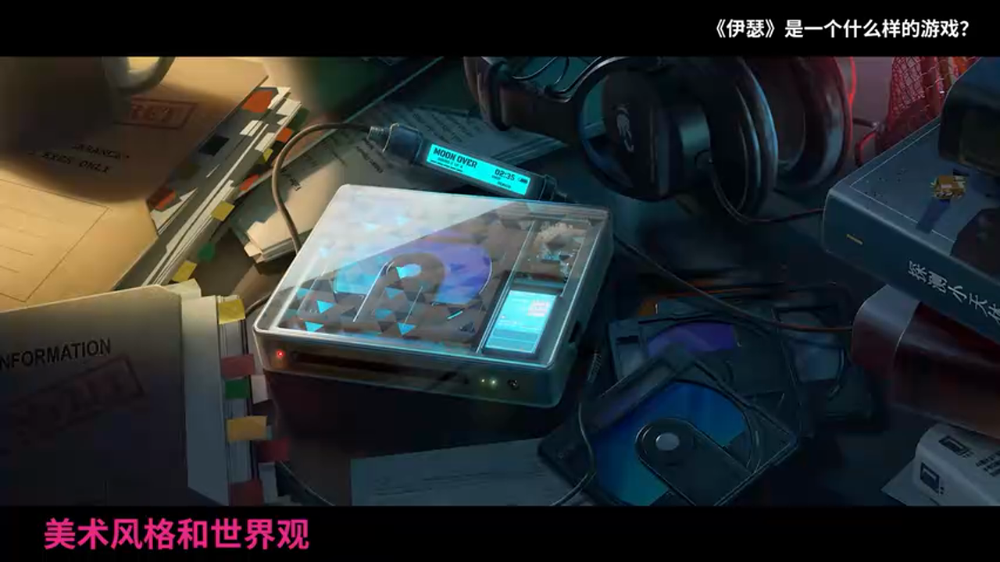
_Screenshot from 00:05:23_
---
## Section 99 (00:05:25)
**Transcript:**
> 我先放了视频吧
**Visual Reference:**

_Screenshot from 00:05:25_
---
## Section 100 (00:05:26)
**Transcript:**
> 会更直观一点
**Visual Reference:**

_Screenshot from 00:05:26_
---
## Section 101 (00:06:41)
**Transcript:**
> 我们的同步是一种重要的一样的
**Visual Reference:**

_Screenshot from 00:06:41_
---
## Section 102 (00:06:44)
**Transcript:**
> 我会在这儿
**Visual Reference:**

_Screenshot from 00:06:44_
---
## Section 103 (00:06:46)
**Transcript:**
> 我会让你放下来
**Visual Reference:**
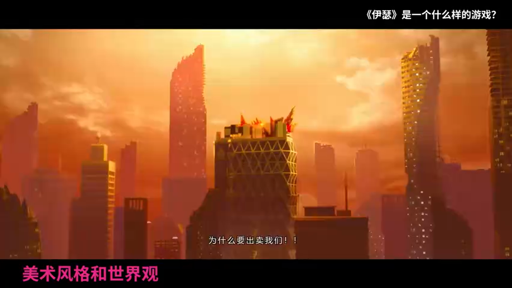
_Screenshot from 00:06:46_
---
## Section 104 (00:06:53)
**Transcript:**
> 谢谢
**Visual Reference:**

_Screenshot from 00:06:53_
---
## Section 105 (00:06:55)
**Transcript:**
> 我们游戏世界观其实主要还是讲述了一个墨式人类世界
**Visual Reference:**

_Screenshot from 00:06:55_
---
## Section 106 (00:07:00)
**Transcript:**
> 通过数据连接进入类似头号玩家这样的一个虚拟世界
**Visual Reference:**

_Screenshot from 00:07:00_
---
## Section 107 (00:07:04)
**Transcript:**
> 和里面各种角色势力进行比较糾约的故事这样的一个展开
**Visual Reference:**

_Screenshot from 00:07:04_
---
## Section 108 (00:07:09)
**Transcript:**
> 故事其实整体还是充值这一些阴谋论和势力糾约的
**Visual Reference:**

_Screenshot from 00:07:09_
---
## Section 109 (00:07:13)
**Transcript:**
> 就有比较复杂的融合关系和一些大事件
**Visual Reference:**

_Screenshot from 00:07:13_
---
## Section 110 (00:07:16)
**Transcript:**
> 所以基调整体还是会黑暗一点
**Visual Reference:**

_Screenshot from 00:07:16_
---
## Section 111 (00:07:18)
**Transcript:**
> 美术方面我们在角色上面选择了用偏写式比例的一些卡通风格
**Visual Reference:**

_Screenshot from 00:07:18_
---
## Section 112 (00:07:24)
**Transcript:**
> 使用了赛路路风格进行二地会治和三地选人
**Visual Reference:**

_Screenshot from 00:07:24_
---
## Section 113 (00:07:27)
**Transcript:**
> 长景的选财会跟偏向写实一点的虚拟都市类型
**Visual Reference:**

_Screenshot from 00:07:27_
---
## Section 114 (00:07:32)
**Transcript:**
> 然后做这样的项目我们其实需要面对一个什么样的内容量
**Visual Reference:**

_Screenshot from 00:07:32_
---
## Section 115 (00:07:39)
**Transcript:**
> 首先我先聊一下我们这个团队
**Visual Reference:**

_Screenshot from 00:07:39_
---
## Section 116 (00:07:43)
**Transcript:**
> 我们前期只能研发团队不足百人
**Visual Reference:**

_Screenshot from 00:07:43_
---
## Section 117 (00:07:46)
**Transcript:**
> 美术团队大概50人
**Visual Reference:**

_Screenshot from 00:07:46_
---
## Section 118 (00:07:47)
**Transcript:**
> 需要做的事情其实覆盖的面是比较广的
**Visual Reference:**

_Screenshot from 00:07:47_
---
## Section 119 (00:07:50)
**Transcript:**
> 就比如像角色设计制作立会动作设计特效
**Visual Reference:**

_Screenshot from 00:07:50_
---
## Section 120 (00:07:54)
**Transcript:**
> 三地场景主线工厂动画包括寄美的一些工作
**Visual Reference:**

_Screenshot from 00:07:54_
---
## Section 121 (00:07:58)
**Transcript:**
> 以及角色故事CG UI平面宣传物料
**Visual Reference:**

_Screenshot from 00:07:58_
---
## Section 122 (00:08:01)
**Transcript:**
> 基本上都会在这样的一个五线的美术团队去完成
**Visual Reference:**

_Screenshot from 00:08:01_
---
## Section 123 (00:08:05)
**Transcript:**
> 那就说最大的三座大山
**Visual Reference:**

_Screenshot from 00:08:05_
---
## Section 124 (00:08:09)
**Transcript:**
> 第一个就是我们的角色体量
**Visual Reference:**

_Screenshot from 00:08:09_
---
## Section 125 (00:08:12)
**Transcript:**
> 刚刚也说了我们目前上线大概60加了这样的一个角色
**Visual Reference:**

_Screenshot from 00:08:12_
---
## Section 126 (00:08:16)
**Transcript:**
> 所有角色都有完整的二地三地动画特效资产
**Visual Reference:**
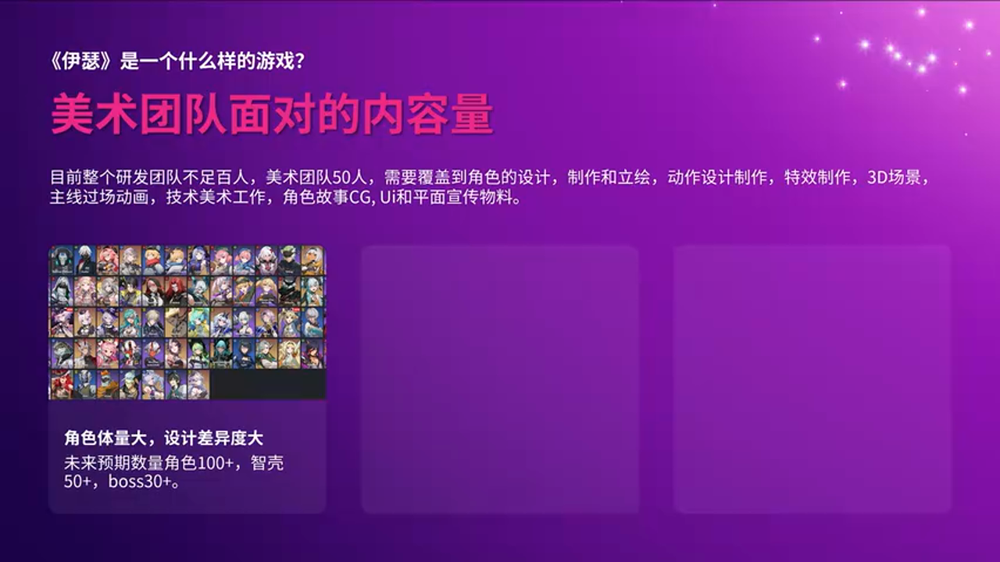
_Screenshot from 00:08:16_
---
## Section 127 (00:08:19)
**Transcript:**
> 除了角色以外还需要制作像这种制跳
**Visual Reference:**

_Screenshot from 00:08:19_
---
## Section 128 (00:08:23)
**Transcript:**
> 包括个中大型BOSS
**Visual Reference:**

_Screenshot from 00:08:23_
---
## Section 129 (00:08:25)
**Transcript:**
> 因为游戏类型的原因
**Visual Reference:**

_Screenshot from 00:08:25_
---
## Section 130 (00:08:26)
**Transcript:**
> 角色设计上我们其实还是会更去追求一些
**Visual Reference:**

_Screenshot from 00:08:26_
---
## Section 131 (00:08:29)
**Transcript:**
> 设计上的艺艳的差异度
**Visual Reference:**

_Screenshot from 00:08:29_
---
## Section 132 (00:08:31)
**Transcript:**
> 不去会像那种传统二有那样
**Visual Reference:**

_Screenshot from 00:08:31_
---
## Section 133 (00:08:33)
**Transcript:**
> 就是亲一色做漂亮小姐姐
**Visual Reference:**

_Screenshot from 00:08:33_
---
## Section 134 (00:08:35)
**Transcript:**
> 就当然这种漂亮小姐我也挺喜欢
**Visual Reference:**

_Screenshot from 00:08:35_
---
## Section 135 (00:08:38)
**Transcript:**
> 但是我们在设计上会去选择
**Visual Reference:**

_Screenshot from 00:08:38_
---
## Section 136 (00:08:41)
**Transcript:**
> 涵盖更多的种节色列型
**Visual Reference:**

_Screenshot from 00:08:41_
---
## Section 137 (00:08:43)
**Transcript:**
> 种情况下就是会面了一个设计的一个统一性不足的问题
**Visual Reference:**

_Screenshot from 00:08:43_
---
## Section 138 (00:08:47)
**Transcript:**
> 这个其实在用户群里面讨论也是比较多的方面
**Visual Reference:**

_Screenshot from 00:08:47_
---
## Section 139 (00:08:52)
**Transcript:**
> 然后我们会去做就没有做大地图这样的一个方式去做场景
**Visual Reference:**

_Screenshot from 00:08:52_
---
## Section 140 (00:08:59)
**Transcript:**
> 选择了相停关卡
**Visual Reference:**
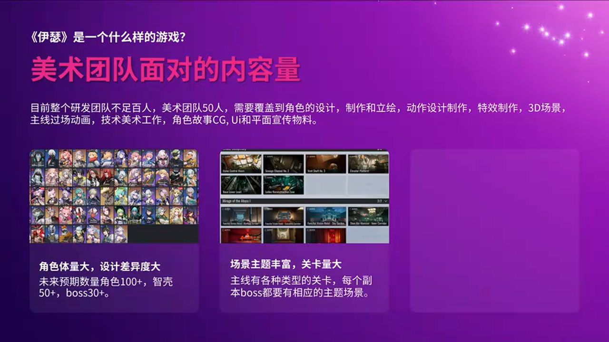
_Screenshot from 00:08:59_
---
## Section 141 (00:09:00)
**Transcript:**
> 当然体量其实依然还是不小的
**Visual Reference:**

_Screenshot from 00:09:00_
---
## Section 142 (00:09:04)
**Transcript:**
> 每一个关卡都是居于一个完整主题去制作的
**Visual Reference:**

_Screenshot from 00:09:04_
---
## Section 143 (00:09:07)
**Transcript:**
> 每一个主题也会现行展开
**Visual Reference:**

_Screenshot from 00:09:07_
---
## Section 144 (00:09:09)
**Transcript:**
> 就设计到的场景资产量是比较多的
**Visual Reference:**

_Screenshot from 00:09:09_
---
## Section 145 (00:09:12)
**Transcript:**
> 就几十个例子
**Visual Reference:**

_Screenshot from 00:09:12_
---
## Section 146 (00:09:13)
**Transcript:**
> 其中有一个主题是在车站
**Visual Reference:**

_Screenshot from 00:09:13_
---
## Section 147 (00:09:15)
**Transcript:**
> 然后故事的开始在站外
**Visual Reference:**

_Screenshot from 00:09:15_
---
## Section 148 (00:09:17)
**Transcript:**
> 主角团印行人会潜入车站
**Visual Reference:**

_Screenshot from 00:09:17_
---
## Section 149 (00:09:20)
**Transcript:**
> 在站台说实力帮达兵
**Visual Reference:**

_Screenshot from 00:09:20_
---
## Section 150 (00:09:23)
**Transcript:**
> 最后会进入一个精英怪的包围
**Visual Reference:**

_Screenshot from 00:09:23_
---
## Section 151 (00:09:26)
**Transcript:**
> 然后进入地下站台跳唱一个行时列车
**Visual Reference:**

_Screenshot from 00:09:26_
---
## Section 152 (00:09:29)
**Transcript:**
> 然后在车箱里面再会进入一个招遇站
**Visual Reference:**

_Screenshot from 00:09:29_
---
## Section 153 (00:09:33)
**Transcript:**
> 然后会下车再到一个新的站台
**Visual Reference:**

_Screenshot from 00:09:33_
---
## Section 154 (00:09:36)
**Transcript:**
> 再遇到一个中型BOSS
**Visual Reference:**

_Screenshot from 00:09:36_
---
## Section 155 (00:09:37)
**Transcript:**
> 解决最后又上了第二辆列车
**Visual Reference:**

_Screenshot from 00:09:37_
---
## Section 156 (00:09:39)
**Transcript:**
> 在最后的话可能在列车上遇到了BOSS
**Visual Reference:**

_Screenshot from 00:09:39_
---
## Section 157 (00:09:42)
**Transcript:**
> 最后进行了一个BOSS变身
**Visual Reference:**

_Screenshot from 00:09:42_
---
## Section 158 (00:09:44)
**Transcript:**
> 最后可能车箱毁了
**Visual Reference:**

_Screenshot from 00:09:44_
---
## Section 159 (00:09:46)
**Transcript:**
> 到了最后一个向BOSS观点这样的一个观点站
**Visual Reference:**

_Screenshot from 00:09:46_
---
## Section 160 (00:09:51)
**Transcript:**
> 就这样的一个完整的一个观察
**Visual Reference:**

_Screenshot from 00:09:51_
---
## Section 161 (00:09:54)
**Transcript:**
> 它就承担了一个主题
**Visual Reference:**

_Screenshot from 00:09:54_
---
## Section 162 (00:09:56)
**Transcript:**
> 我们其实在做的时候
**Visual Reference:**

_Screenshot from 00:09:56_
---
## Section 163 (00:09:58)
**Transcript:**
> 能感受到工作量其实还是不小的
**Visual Reference:**

_Screenshot from 00:09:58_
---
## Section 164 (00:10:00)
**Transcript:**
> 实际上越往后的一些观察
**Visual Reference:**

_Screenshot from 00:10:00_
---
## Section 165 (00:10:02)
**Transcript:**
> 它整个一个跨度会更大
**Visual Reference:**

_Screenshot from 00:10:02_
---
## Section 166 (00:10:04)
**Transcript:**
> 然后因为是回合自由系
**Visual Reference:**

_Screenshot from 00:10:04_
---
## Section 167 (00:10:06)
**Transcript:**
> 我们战斗场景和主线公法场景是不通用的
**Visual Reference:**

_Screenshot from 00:10:06_
---
## Section 168 (00:10:09)
**Transcript:**
> 所以还要为每次预敌战斗专门去做单独的战斗场景
**Visual Reference:**

_Screenshot from 00:10:09_
---
## Section 169 (00:10:13)
**Transcript:**
> 所以说在整个一个制作场景的一个量上
**Visual Reference:**

_Screenshot from 00:10:13_
---
## Section 170 (00:10:17)
**Transcript:**
> 其实还是比传统的卡牌有需要大了多的
**Visual Reference:**

_Screenshot from 00:10:17_
---
## Section 171 (00:10:21)
**Transcript:**
> 然后我们在观卡续持屏面的话
**Visual Reference:**

_Screenshot from 00:10:21_
---
## Section 172 (00:10:26)
**Transcript:**
> 我们用的其实还是非路智的实施过程动画
**Visual Reference:**

_Screenshot from 00:10:26_
---
## Section 173 (00:10:29)
**Transcript:**
> 这样的好处是它最后在游戏里面
**Visual Reference:**

_Screenshot from 00:10:29_
---
## Section 174 (00:10:32)
**Transcript:**
> 整体包体会更小一些
**Visual Reference:**

_Screenshot from 00:10:32_
---
## Section 175 (00:10:34)
**Transcript:**
> 它不是用最后出出视频去作为包体里面的
**Visual Reference:**

_Screenshot from 00:10:34_
---
## Section 176 (00:10:37)
**Transcript:**
> CG的这种占用的
**Visual Reference:**

_Screenshot from 00:10:37_
---
## Section 177 (00:10:39)
**Transcript:**
> 角色如果有修改
**Visual Reference:**

_Screenshot from 00:10:39_
---
## Section 178 (00:10:41)
**Transcript:**
> 我们其实在过程动画里也会同步归径
**Visual Reference:**

_Screenshot from 00:10:41_
---
## Section 179 (00:10:45)
**Transcript:**
> 换一处就是我们可能在做这种工厂动画手艺
**Visual Reference:**

_Screenshot from 00:10:45_
---
## Section 180 (00:10:48)
**Transcript:**
> 而考虑不同设备的这样的一个播放效果
**Visual Reference:**

_Screenshot from 00:10:48_
---
## Section 181 (00:10:51)
**Transcript:**
> 效果其实没办法做足的
**Visual Reference:**

_Screenshot from 00:10:51_
---
## Section 182 (00:10:53)
**Transcript:**
> 然后其实在这些工作层面也是
**Visual Reference:**

_Screenshot from 00:10:53_
---
## Section 183 (00:10:56)
**Transcript:**
> 一方面是我们的动画团队一起去做
**Visual Reference:**

_Screenshot from 00:10:56_
---
## Section 184 (00:10:59)
**Transcript:**
> 然后他们的工作还要再去做角色的整个
**Visual Reference:**

_Screenshot from 00:10:59_
---
## Section 185 (00:11:02)
**Transcript:**
> 一个像一些英雄的CG
**Visual Reference:**

_Screenshot from 00:11:02_
---
## Section 186 (00:11:04)
**Transcript:**
> 所以说这么多的工作
**Visual Reference:**

_Screenshot from 00:11:04_
---
## Section 187 (00:11:06)
**Transcript:**
> 其实都是在我们这样一个50人的美出团队里面去完成的
**Visual Reference:**

_Screenshot from 00:11:06_
---
## Section 188 (00:11:10)
**Transcript:**
> 那就面对这样的体量
**Visual Reference:**

_Screenshot from 00:11:10_
---
## Section 189 (00:11:11)
**Transcript:**
> 我们也做了很长时间的思考和探索
**Visual Reference:**

_Screenshot from 00:11:11_
---
## Section 190 (00:11:13)
**Transcript:**
> 说这个东西到底该怎么做才能做的完
**Visual Reference:**

_Screenshot from 00:11:13_
---
## Section 191 (00:11:18)
**Transcript:**
> 对首先就是想要怎么做
**Visual Reference:**
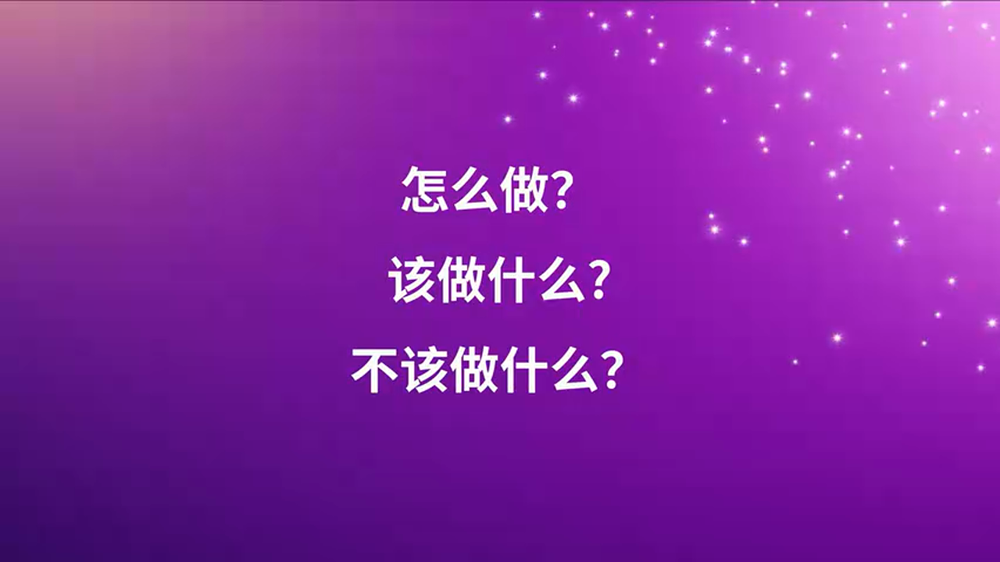
_Screenshot from 00:11:18_
---
## Section 192 (00:11:20)
**Transcript:**
> 然后就是该做什么不该做什么
**Visual Reference:**

_Screenshot from 00:11:20_
---
## Section 193 (00:11:23)
**Transcript:**
> 就把这个思路理清楚之后
**Visual Reference:**

_Screenshot from 00:11:23_
---
## Section 194 (00:11:25)
**Transcript:**
> 可能我们才能知道什么样的事情才是适合我们的
**Visual Reference:**

_Screenshot from 00:11:25_
---
## Section 195 (00:11:31)
**Transcript:**
> 首先我们低谱其实确认的还是
**Visual Reference:**

_Screenshot from 00:11:31_
---
## Section 196 (00:11:35)
**Transcript:**
> 我们要有一个适合团队的这种英雄
**Visual Reference:**

_Screenshot from 00:11:35_
---
## Section 197 (00:11:38)
**Transcript:**
> 开发的管线
**Visual Reference:**

_Screenshot from 00:11:38_
---
## Section 198 (00:11:40)
**Transcript:**
> 然后我们必须找到角色产能和品质之间的平衡点
**Visual Reference:**

_Screenshot from 00:11:40_
---
## Section 199 (00:11:45)
**Transcript:**
> 然后我们需要尽量选择设计体量小的场景类型
**Visual Reference:**

_Screenshot from 00:11:45_
---
## Section 200 (00:11:49)
**Transcript:**
> 所以我们确定需要一个合适的话
**Visual Reference:**
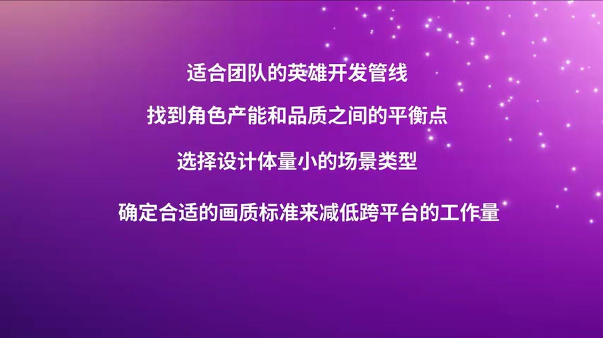
_Screenshot from 00:11:49_
---
## Section 201 (00:11:52)
**Transcript:**
> 就标准来减低我们跨平台的一个工作量
**Visual Reference:**

_Screenshot from 00:11:52_
---
## Section 202 (00:11:56)
**Transcript:**
> 最后就是关于角色批诊我们需要一个高效的长出方案
**Visual Reference:**
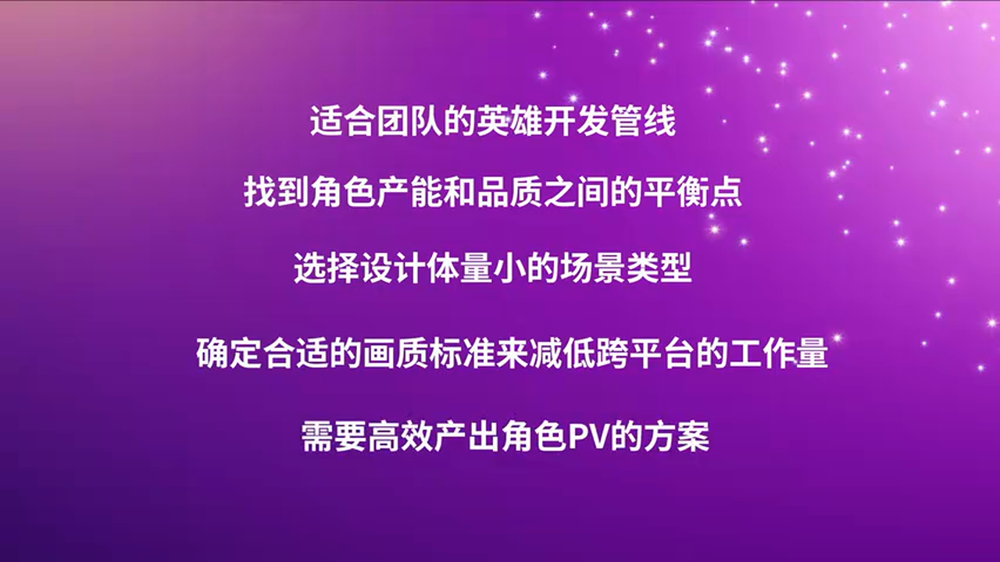
_Screenshot from 00:11:56_
---
## Section 203 (00:12:01)
**Transcript:**
> 那聊到这个英雄制作的管线
**Visual Reference:**
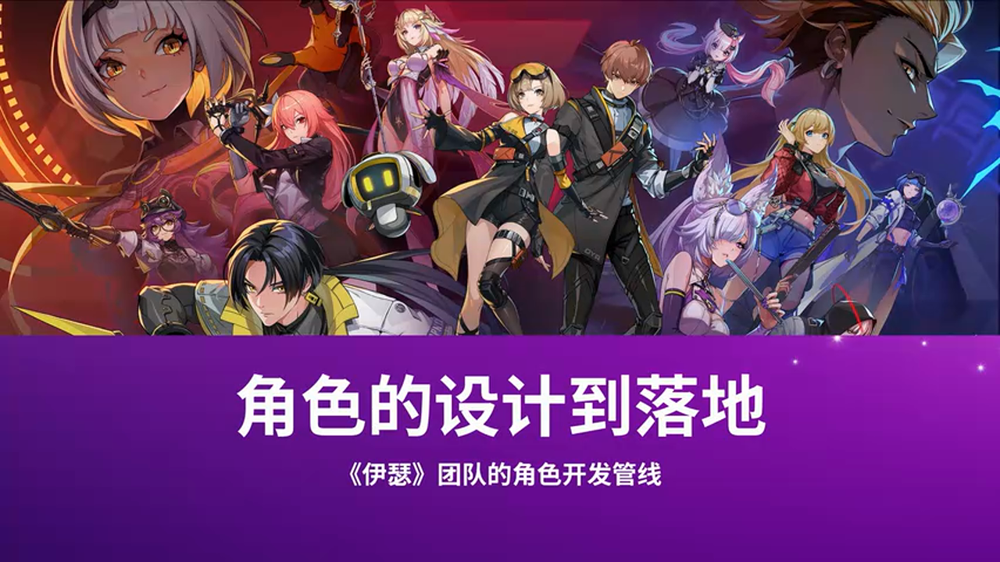
_Screenshot from 00:12:01_
---
## Section 204 (00:12:05)
**Transcript:**
> 就目前来讲我觉得其实像同类游戏的话
**Visual Reference:**

_Screenshot from 00:12:05_
---
## Section 205 (00:12:09)
**Transcript:**
> 大家如果做的比较好的体材都是有自己的一条管线
**Visual Reference:**

_Screenshot from 00:12:09_
---
## Section 206 (00:12:13)
**Transcript:**
> 然后就说是像现在我们在做这种类型的游戏的话
**Visual Reference:**

_Screenshot from 00:12:13_
---
## Section 207 (00:12:17)
**Transcript:**
> 角色其实它不太像十年前我们做游戏
**Visual Reference:**

_Screenshot from 00:12:17_
---
## Section 208 (00:12:19)
**Transcript:**
> 就是一个工具人
**Visual Reference:**

_Screenshot from 00:12:19_
---
## Section 209 (00:12:21)
**Transcript:**
> 我们家其实把角色当作一个有生命力的形象去看待了
**Visual Reference:**

_Screenshot from 00:12:21_
---
## Section 210 (00:12:25)
**Transcript:**
> 他们对于角色的外型声音性格
**Visual Reference:**

_Screenshot from 00:12:25_
---
## Section 211 (00:12:28)
**Transcript:**
> 以及背景故事都有非常强的自主感受
**Visual Reference:**

_Screenshot from 00:12:28_
---
## Section 212 (00:12:31)
**Transcript:**
> 那我们其实需要尽量角色作为游戏功能的需求
**Visual Reference:**

_Screenshot from 00:12:31_
---
## Section 213 (00:12:34)
**Transcript:**
> 同时还要考虑玩家情感需求
**Visual Reference:**

_Screenshot from 00:12:34_
---
## Section 214 (00:12:37)
**Transcript:**
> 反正这两点的话在我们设计角色的层面
**Visual Reference:**

_Screenshot from 00:12:37_
---
## Section 215 (00:12:40)
**Transcript:**
> 我们会去考虑的比较多
**Visual Reference:**

_Screenshot from 00:12:40_
---
## Section 216 (00:12:43)
**Transcript:**
> 然后其实你要满足这些点的话
**Visual Reference:**

_Screenshot from 00:12:43_
---
## Section 217 (00:12:45)
**Transcript:**
> 你会发现你考虑会特别事情会更多
**Visual Reference:**

_Screenshot from 00:12:45_
---
## Section 218 (00:12:48)
**Transcript:**
> 那制作上也会更复杂
**Visual Reference:**

_Screenshot from 00:12:48_
---
## Section 219 (00:12:50)
**Transcript:**
> 我们这就非常考验整个团队
**Visual Reference:**

_Screenshot from 00:12:50_
---
## Section 220 (00:12:52)
**Transcript:**
> 在这条就是管线上面的一个整合力了
**Visual Reference:**
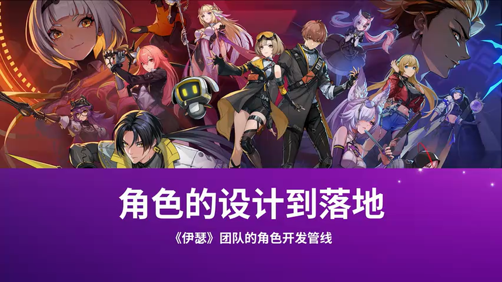
_Screenshot from 00:12:52_
---
## Section 221 (00:12:56)
**Transcript:**
> 那了一下我们这个角色开发管线
**Visual Reference:**

_Screenshot from 00:12:56_
---
## Section 222 (00:13:00)
**Transcript:**
> 它大概设计到以下这些公众
**Visual Reference:**

_Screenshot from 00:13:00_
---
## Section 223 (00:13:04)
**Transcript:**
> 那策划的话其实会更细分成是文案策划和战斗策划
**Visual Reference:**
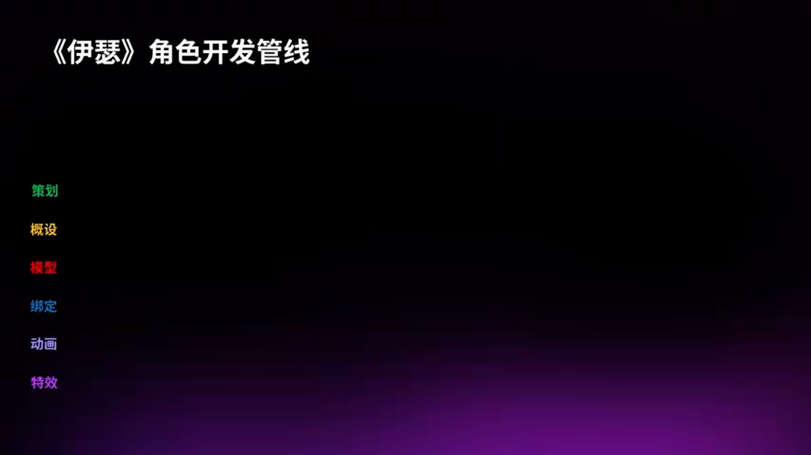
_Screenshot from 00:13:04_
---
## Section 224 (00:13:09)
**Transcript:**
> 然后它会跨越约五阶段
**Visual Reference:**
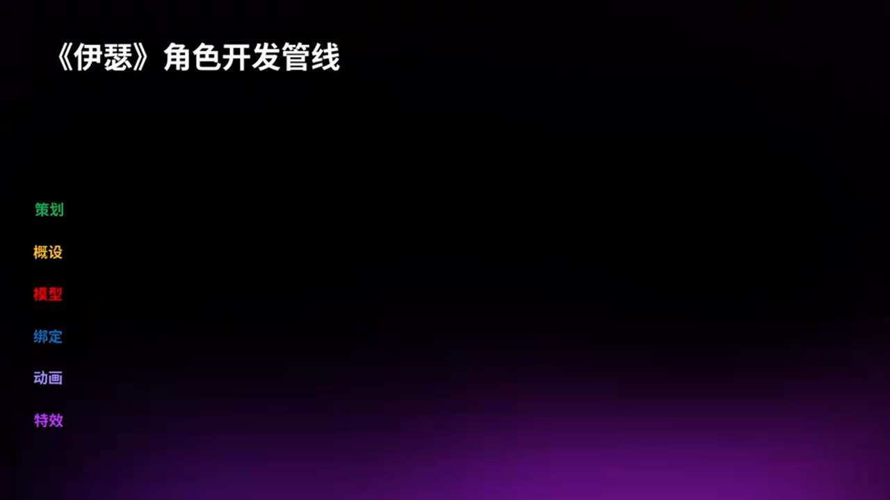
_Screenshot from 00:13:09_
---
## Section 225 (00:13:12)
**Transcript:**
> 我们在做这些事情的时候
**Visual Reference:**

_Screenshot from 00:13:12_
---
## Section 226 (00:13:14)
**Transcript:**
> 第一个角色更多是在做一个信息的思考
**Visual Reference:**

_Screenshot from 00:13:14_
---
## Section 227 (00:13:18)
**Transcript:**
> 第二个角色是做设计验证
**Visual Reference:**

_Screenshot from 00:13:18_
---
## Section 228 (00:13:22)
**Transcript:**
> 第三个角色看过啊
**Visual Reference:**
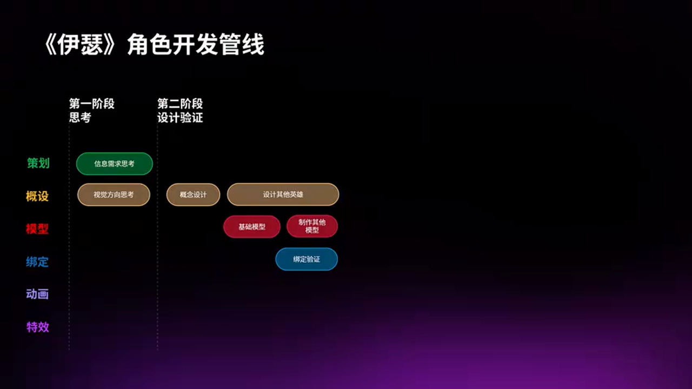
_Screenshot from 00:13:22_
---
## Section 229 (00:13:24)
**Transcript:**
> 是分成由自ault的萁enses
**Visual Reference:**

_Screenshot from 00:13:24_
---
## Section 230 (00:13:27)
**Transcript:**
> 基本的学校不懂又能主持
**Visual Reference:**

_Screenshot from 00:13:27_
---
## Section 231 (00:13:32)
**Transcript:**
> 哪一个角色是乎加上这些卷丘词
**Visual Reference:**
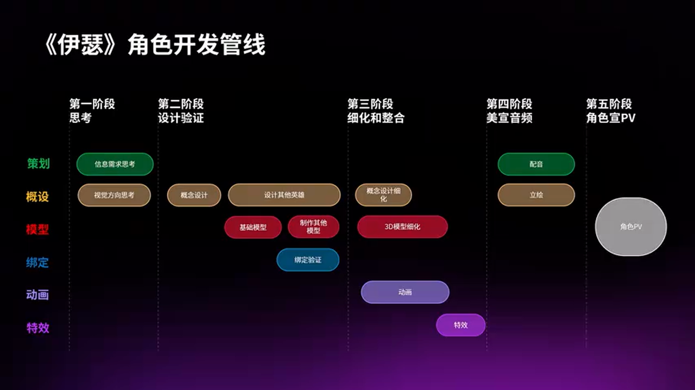
_Screenshot from 00:13:32_
---
## Section 232 (00:13:33)
**Transcript:**
> 什么那个那是实行的
**Visual Reference:**

_Screenshot from 00:13:33_
---
## Section 233 (00:13:36)
**Transcript:**
> 这些角色我都不知道
**Visual Reference:**

_Screenshot from 00:13:36_
---
## Section 234 (00:13:39)
**Transcript:**
> 我不知道它有没有看过
**Visual Reference:**

_Screenshot from 00:13:39_
---
## Section 235 (00:13:40)
**Transcript:**
> 这是为什么只有吗
**Visual Reference:**

_Screenshot from 00:13:40_
---
## Section 236 (00:13:41)
**Transcript:**
> 目前关于那是那些顿面
**Visual Reference:**

_Screenshot from 00:13:41_
---
## Section 237 (00:13:46)
**Transcript:**
> 川普自动房子
**Visual Reference:**
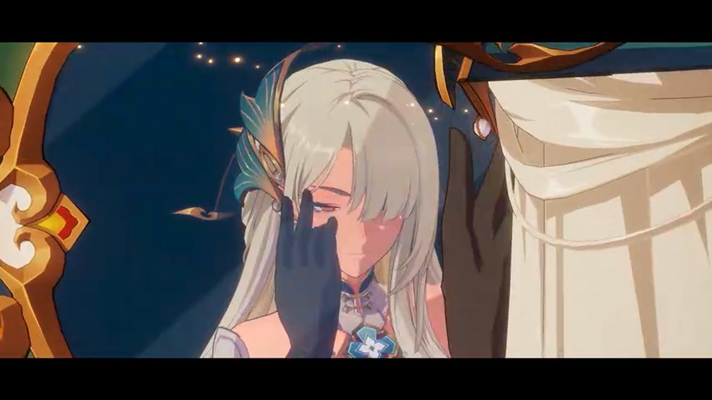
_Screenshot from 00:13:46_
---
## Section 238 (00:13:51)
**Transcript:**
> 我们在第一军战其实会首先跟战斗策划我们去进行一些信息需求上面的会总
**Visual Reference:**
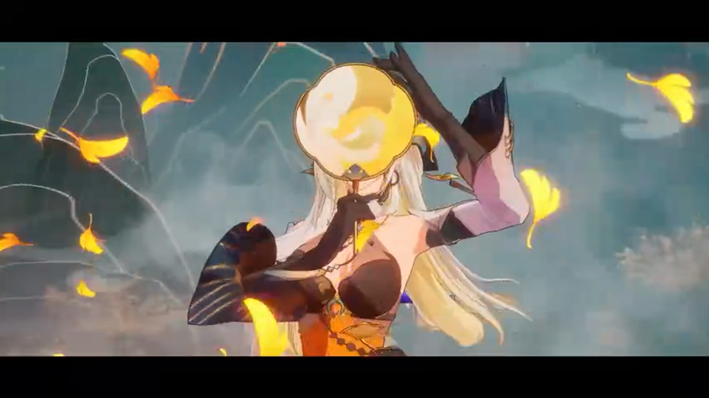
_Screenshot from 00:13:51_
---
## Section 239 (00:14:05)
**Transcript:**
> 就是首先考虑这个角色是一个什么样的战斗类型
**Visual Reference:**
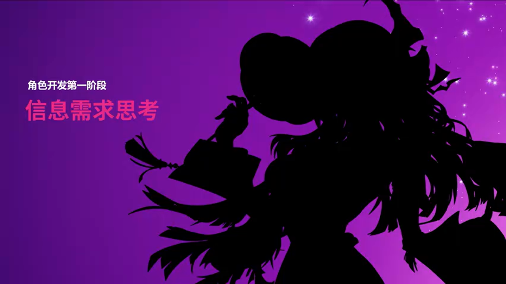
_Screenshot from 00:14:05_
---
## Section 240 (00:14:09)
**Transcript:**
> 以及它是否是当其这个卡池单单
**Visual Reference:**

_Screenshot from 00:14:09_
---
## Section 241 (00:14:12)
**Transcript:**
> 它的属性定位是什么样的
**Visual Reference:**
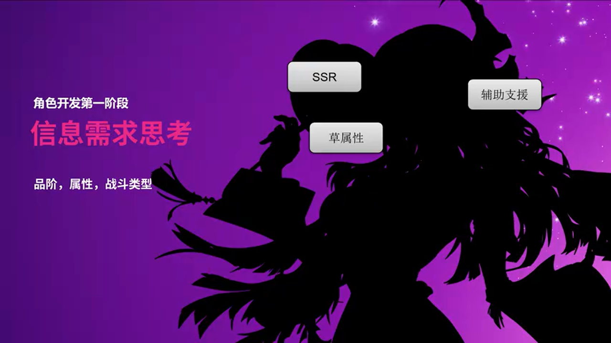
_Screenshot from 00:14:12_
---
## Section 242 (00:14:14)
**Transcript:**
> 这样会引导我们去做设计的时候
**Visual Reference:**

_Screenshot from 00:14:14_
---
## Section 243 (00:14:16)
**Transcript:**
> 更偏向它是一个攻击性强的DPS
**Visual Reference:**

_Screenshot from 00:14:16_
---
## Section 244 (00:14:20)
**Transcript:**
> 或者是一个更有安全感的辅助
**Visual Reference:**

_Screenshot from 00:14:20_
---
## Section 245 (00:14:23)
**Transcript:**
> 那作为限定SSA角色的话
**Visual Reference:**

_Screenshot from 00:14:23_
---
## Section 246 (00:14:26)
**Transcript:**
> 其实角色本身上也更需要吸引用户
**Visual Reference:**

_Screenshot from 00:14:26_
---
## Section 247 (00:14:29)
**Transcript:**
> 那我们在设计上也需要把它跟Aka Saka这样的一个
**Visual Reference:**

_Screenshot from 00:14:29_
---
## Section 248 (00:14:34)
**Transcript:**
> 更廉价的英雄去拉开
**Visual Reference:**

_Screenshot from 00:14:34_
---
## Section 249 (00:14:36)
**Transcript:**
> 从视觉层面设计上会拉开一些
**Visual Reference:**

_Screenshot from 00:14:36_
---
## Section 250 (00:14:39)
**Transcript:**
> 然后我们会需要跟文安讨论故事中
**Visual Reference:**

_Screenshot from 00:14:39_
---
## Section 251 (00:14:42)
**Transcript:**
> 它是一个什么样的一个角色
**Visual Reference:**

_Screenshot from 00:14:42_
---
## Section 252 (00:14:44)
**Transcript:**
> 属于哪个阵营
**Visual Reference:**

_Screenshot from 00:14:44_
---
## Section 253 (00:14:46)
**Transcript:**
> 这个阵营的点形特征有哪些
**Visual Reference:**

_Screenshot from 00:14:46_
---
## Section 254 (00:14:48)
**Transcript:**
> 这也会我们在设计角色的时候
**Visual Reference:**

_Screenshot from 00:14:48_
---
## Section 255 (00:14:50)
**Transcript:**
> 提供一些方向和灵感
**Visual Reference:**

_Screenshot from 00:14:50_
---
## Section 256 (00:14:52)
**Transcript:**
> 我们从测试期到上限之后
**Visual Reference:**
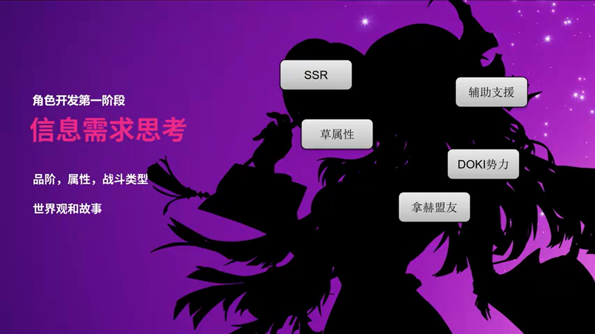
_Screenshot from 00:14:52_
---
## Section 257 (00:14:57)
**Transcript:**
> 一直在轻听玩家的反馈
**Visual Reference:**
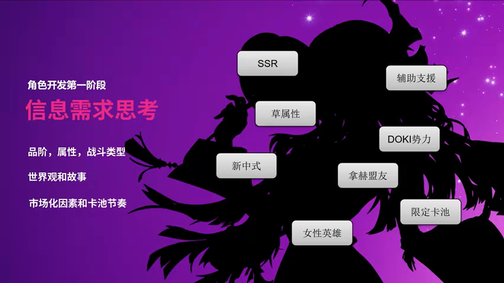
_Screenshot from 00:14:57_
---
## Section 258 (00:14:59)
**Transcript:**
> 会去了解他们的诉求
**Visual Reference:**

_Screenshot from 00:14:59_
---
## Section 259 (00:15:01)
**Transcript:**
> 比如说他们对于这个在游戏里面男女性
**Visual Reference:**

_Screenshot from 00:15:01_
---
## Section 260 (00:15:05)
**Transcript:**
> 别的这个比例
**Visual Reference:**

_Screenshot from 00:15:05_
---
## Section 261 (00:15:06)
**Transcript:**
> 他们会希望开发组去怎么平衡
**Visual Reference:**

_Screenshot from 00:15:06_
---
## Section 262 (00:15:09)
**Transcript:**
> 那还有像比如说这个角色类型
**Visual Reference:**

_Screenshot from 00:15:09_
---
## Section 263 (00:15:11)
**Transcript:**
> 以及从游戏这种搭配上
**Visual Reference:**

_Screenshot from 00:15:11_
---
## Section 264 (00:15:14)
**Transcript:**
> 它更需要什么类型的角色
**Visual Reference:**

_Screenshot from 00:15:14_
---
## Section 265 (00:15:16)
**Transcript:**
> 那我们会在这个阶段去围绕
**Visual Reference:**

_Screenshot from 00:15:16_
---
## Section 266 (00:15:18)
**Transcript:**
> 就说这些信息做会总
**Visual Reference:**

_Screenshot from 00:15:18_
---
## Section 267 (00:15:20)
**Transcript:**
> 让我们对我们要做这个角色的需求会更清晰
**Visual Reference:**

_Screenshot from 00:15:20_
---
## Section 268 (00:15:25)
**Transcript:**
> 那到第二步的话
**Visual Reference:**

_Screenshot from 00:15:25_
---
## Section 269 (00:15:27)
**Transcript:**
> 它跟偏向是美术方面
**Visual Reference:**

_Screenshot from 00:15:27_
---
## Section 270 (00:15:29)
**Transcript:**
> 我们会去做一个视觉设计方向的一个探索
**Visual Reference:**

_Screenshot from 00:15:29_
---
## Section 271 (00:15:32)
**Transcript:**
> 首先会整个美术组在一起去讨论一下
**Visual Reference:**

_Screenshot from 00:15:32_
---
## Section 272 (00:15:36)
**Transcript:**
> 我们这个世界方向会往哪个方向去做
**Visual Reference:**
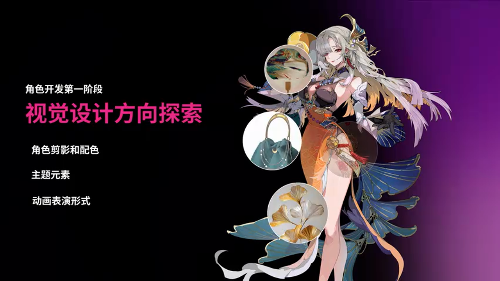
_Screenshot from 00:15:36_
---
## Section 273 (00:15:38)
**Transcript:**
> 会在一定的限制条件下做一些发展思维
**Visual Reference:**

_Screenshot from 00:15:38_
---
## Section 274 (00:15:41)
**Transcript:**
> 首先会考察本身是个什么性格
**Visual Reference:**

_Screenshot from 00:15:41_
---
## Section 275 (00:15:43)
**Transcript:**
> 以及它有什么样的一个日常行为
**Visual Reference:**

_Screenshot from 00:15:43_
---
## Section 276 (00:15:45)
**Transcript:**
> 以及它会有什么样的元素和配色
**Visual Reference:**

_Screenshot from 00:15:45_
---
## Section 277 (00:15:48)
**Transcript:**
> 那至于这些元素去配色的话
**Visual Reference:**

_Screenshot from 00:15:48_
---
## Section 278 (00:15:50)
**Transcript:**
> 就说会考虑出来动画做起来
**Visual Reference:**

_Screenshot from 00:15:50_
---
## Section 279 (00:15:52)
**Transcript:**
> 会不会做得很出彩
**Visual Reference:**

_Screenshot from 00:15:52_
---
## Section 280 (00:15:54)
**Transcript:**
> 那以及用什么样的形式去表现它技能大招的这个张力
**Visual Reference:**

_Screenshot from 00:15:54_
---
## Section 281 (00:15:58)
**Transcript:**
> 其实在做选择元素和配素的时候
**Visual Reference:**

_Screenshot from 00:15:58_
---
## Section 282 (00:16:00)
**Transcript:**
> 也基本上决定了我们在做特效的时候
**Visual Reference:**

_Screenshot from 00:16:00_
---
## Section 283 (00:16:02)
**Transcript:**
> 会用什么样的一个配色方向
**Visual Reference:**

_Screenshot from 00:16:02_
---
## Section 284 (00:16:04)
**Transcript:**
> 以及它的一些表现形式
**Visual Reference:**

_Screenshot from 00:16:04_
---
## Section 285 (00:16:06)
**Transcript:**
> 所以我们在这个阶段更多会去跟设计
**Visual Reference:**

_Screenshot from 00:16:06_
---
## Section 286 (00:16:09)
**Transcript:**
> 跟做动画做特效的同学在一起
**Visual Reference:**

_Screenshot from 00:16:09_
---
## Section 287 (00:16:13)
**Transcript:**
> 去讨论一下
**Visual Reference:**

_Screenshot from 00:16:13_
---
## Section 288 (00:16:14)
**Transcript:**
> 我们先把这个角色最后呈现出一个什么样的感觉
**Visual Reference:**
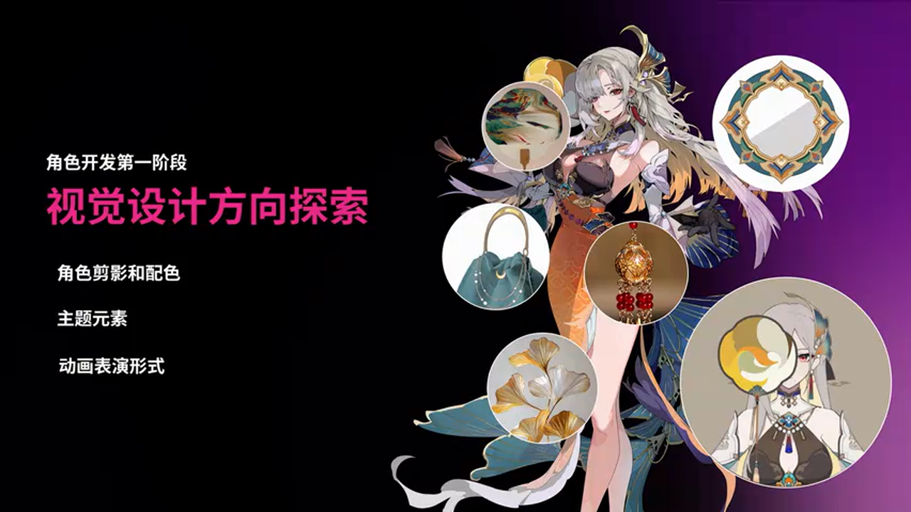
_Screenshot from 00:16:14_
---
## Section 289 (00:16:20)
**Transcript:**
> 首先度过了一个第一阶段
**Visual Reference:**

_Screenshot from 00:16:20_
---
## Section 290 (00:16:23)
**Transcript:**
> 我们到第二阶段的话就会进行一个设计验证
**Visual Reference:**

_Screenshot from 00:16:23_
---
## Section 291 (00:16:26)
**Transcript:**
> 首先我们会做一个概念设计
**Visual Reference:**

_Screenshot from 00:16:26_
---
## Section 292 (00:16:28)
**Transcript:**
> 这个其实大部分游戏在这段演奏都做同样的事情
**Visual Reference:**

_Screenshot from 00:16:28_
---
## Section 293 (00:16:31)
**Transcript:**
> 会出表多的方案去做一些筛选
**Visual Reference:**

_Screenshot from 00:16:31_
---
## Section 294 (00:16:34)
**Transcript:**
> 最后选出一个相对满意的方案
**Visual Reference:**

_Screenshot from 00:16:34_
---
## Section 295 (00:16:37)
**Transcript:**
> 去做一些基础模型的验证
**Visual Reference:**

_Screenshot from 00:16:37_
---
## Section 296 (00:16:40)
**Transcript:**
> 在这个阶段我们不会去特别在意细节
**Visual Reference:**

_Screenshot from 00:16:40_
---
## Section 297 (00:16:43)
**Transcript:**
> 更多是去验证它的一个结影和基础配色
**Visual Reference:**

_Screenshot from 00:16:43_
---
## Section 298 (00:16:47)
**Transcript:**
> 然后会就快速进入这个绑定和动画验证的流程
**Visual Reference:**

_Screenshot from 00:16:47_
---
## Section 299 (00:16:52)
**Transcript:**
> 其实在这个阶段我们主要还是用基础模型去绑定
**Visual Reference:**

_Screenshot from 00:16:52_
---
## Section 300 (00:16:55)
**Transcript:**
> 并尝试一些关键的Pose来验证一下
**Visual Reference:**

_Screenshot from 00:16:55_
---
## Section 301 (00:16:57)
**Transcript:**
> 我们这个角色比例行不行
**Visual Reference:**

_Screenshot from 00:16:57_
---
## Section 302 (00:16:59)
**Transcript:**
> 它的一些动作是不是OK
**Visual Reference:**

_Screenshot from 00:16:59_
---
## Section 303 (00:17:01)
**Transcript:**
> 那制作聪谋验证是为了更及时能够验证设计中
**Visual Reference:**

_Screenshot from 00:17:01_
---
## Section 304 (00:17:04)
**Transcript:**
> 我们是否存在不合理
**Visual Reference:**

_Screenshot from 00:17:04_
---
## Section 305 (00:17:06)
**Transcript:**
> 也可以跟只关的让原话设计了解
**Visual Reference:**

_Screenshot from 00:17:06_
---
## Section 306 (00:17:09)
**Transcript:**
> 这个角色的问题在哪里
**Visual Reference:**

_Screenshot from 00:17:09_
---
## Section 307 (00:17:11)
**Transcript:**
> 其实有时候在做设计的时候我们谈论有些东西
**Visual Reference:**

_Screenshot from 00:17:11_
---
## Section 308 (00:17:13)
**Transcript:**
> 它能不能做这件事情
**Visual Reference:**

_Screenshot from 00:17:13_
---
## Section 309 (00:17:15)
**Transcript:**
> 它比较指上谈兵
**Visual Reference:**

_Screenshot from 00:17:15_
---
## Section 310 (00:17:17)
**Transcript:**
> 它不如直接验证来得有效
**Visual Reference:**

_Screenshot from 00:17:17_
---
## Section 311 (00:17:19)
**Transcript:**
> 那绑定后的迫自己验证
**Visual Reference:**

_Screenshot from 00:17:19_
---
## Section 312 (00:17:21)
**Transcript:**
> 它更多是让设计和三低直观的去了解
**Visual Reference:**

_Screenshot from 00:17:21_
---
## Section 313 (00:17:23)
**Transcript:**
> 这个角色动起来会到的问题
**Visual Reference:**

_Screenshot from 00:17:23_
---
## Section 314 (00:17:25)
**Transcript:**
> 以及就这些不太好动画化的设计
**Visual Reference:**

_Screenshot from 00:17:25_
---
## Section 315 (00:17:27)
**Transcript:**
> 如果一些物件在设计上
**Visual Reference:**

_Screenshot from 00:17:27_
---
## Section 316 (00:17:29)
**Transcript:**
> 如果还需要去动态感增强
**Visual Reference:**

_Screenshot from 00:17:29_
---
## Section 317 (00:17:31)
**Transcript:**
> 那我们会推导到绑定去修改
**Visual Reference:**

_Screenshot from 00:17:31_
---
## Section 318 (00:17:34)
**Transcript:**
> 也会去改设计
**Visual Reference:**

_Screenshot from 00:17:34_
---
## Section 319 (00:17:36)
**Transcript:**
> 这个非常双向的过程
**Visual Reference:**
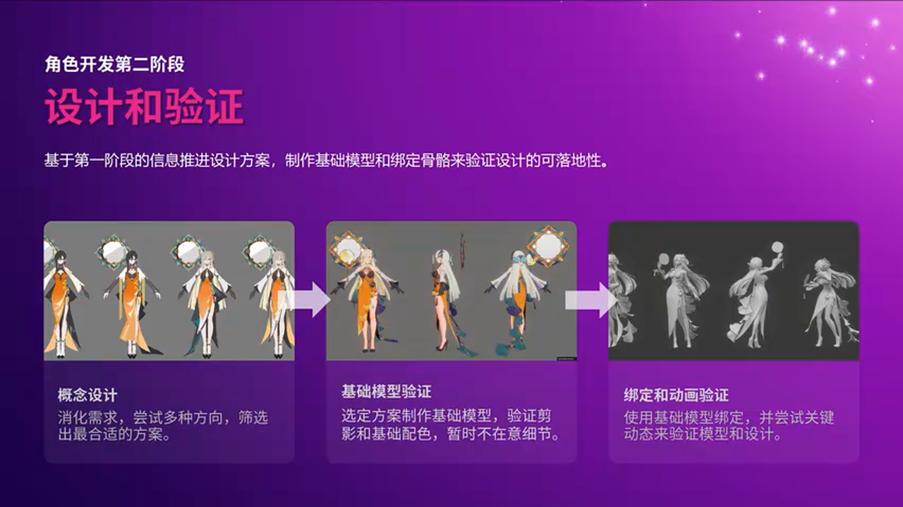
_Screenshot from 00:17:36_
---
## Section 320 (00:17:40)
**Transcript:**
> 对然后我们会在这个阶段做多次循环
**Visual Reference:**

_Screenshot from 00:17:40_
---
## Section 321 (00:17:43)
**Transcript:**
> 就我们会一直在这个概念设计
**Visual Reference:**
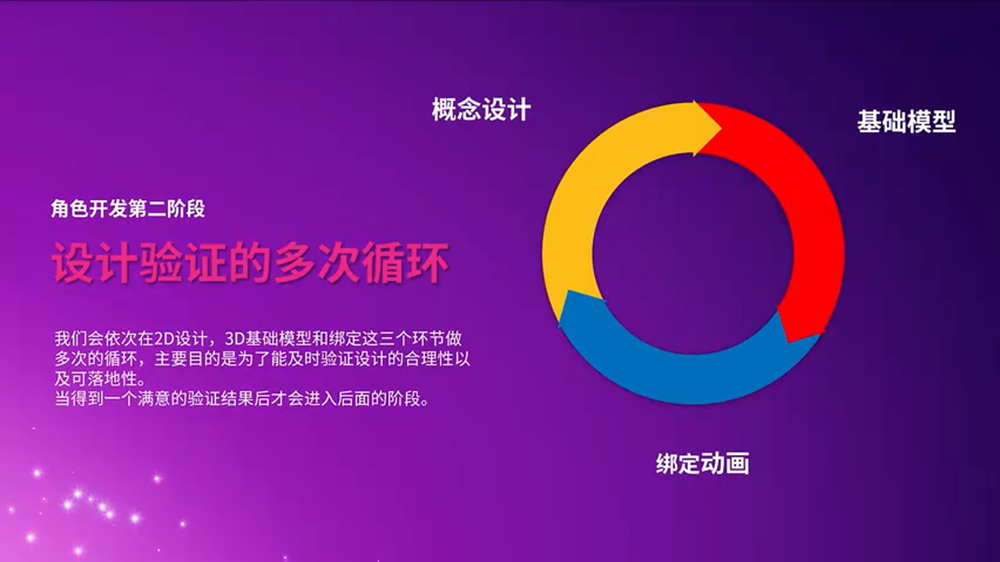
_Screenshot from 00:17:43_
---
## Section 322 (00:17:45)
**Transcript:**
> 基础模型绑定动画
**Visual Reference:**

_Screenshot from 00:17:45_
---
## Section 323 (00:17:47)
**Transcript:**
> 就反复去做三到四次循环
**Visual Reference:**

_Screenshot from 00:17:47_
---
## Section 324 (00:17:49)
**Transcript:**
> 去得出一个最好的一个结果
**Visual Reference:**

_Screenshot from 00:17:49_
---
## Section 325 (00:17:52)
**Transcript:**
> 那我觉得在这过程中
**Visual Reference:**

_Screenshot from 00:17:52_
---
## Section 326 (00:17:55)
**Transcript:**
> 其实最重要是需要概念绑定动画的人
**Visual Reference:**

_Screenshot from 00:17:55_
---
## Section 327 (00:17:58)
**Transcript:**
> 每数员都以设计这个角色
**Visual Reference:**

_Screenshot from 00:17:58_
---
## Section 328 (00:18:01)
**Transcript:**
> 就视角去思考
**Visual Reference:**

_Screenshot from 00:18:01_
---
## Section 329 (00:18:02)
**Transcript:**
> 而不是说按不就班上去完成任务
**Visual Reference:**

_Screenshot from 00:18:02_
---
## Section 330 (00:18:05)
**Transcript:**
> 然后最难克服的一点是什么
**Visual Reference:**

_Screenshot from 00:18:05_
---
## Section 331 (00:18:07)
**Transcript:**
> 就是因为每次概念设计修改
**Visual Reference:**

_Screenshot from 00:18:07_
---
## Section 332 (00:18:09)
**Transcript:**
> 它都会带来模型和绑定的修改
**Visual Reference:**

_Screenshot from 00:18:09_
---
## Section 333 (00:18:11)
**Transcript:**
> 那反复多的其实下游的制作者会非常抱怨
**Visual Reference:**

_Screenshot from 00:18:11_
---
## Section 334 (00:18:14)
**Transcript:**
> 说为什么这次方案其实还是没有过
**Visual Reference:**

_Screenshot from 00:18:14_
---
## Section 335 (00:18:17)
**Transcript:**
> 以及其实概念在设计的时候
**Visual Reference:**

_Screenshot from 00:18:17_
---
## Section 336 (00:18:19)
**Transcript:**
> 它也会想为什么三地的很多模型是在制作上
**Visual Reference:**

_Screenshot from 00:18:19_
---
## Section 337 (00:18:22)
**Transcript:**
> 会跟它的概念设计不一样
**Visual Reference:**

_Screenshot from 00:18:22_
---
## Section 338 (00:18:24)
**Transcript:**
> 要做这样的取捨
**Visual Reference:**

_Screenshot from 00:18:24_
---
## Section 339 (00:18:25)
**Transcript:**
> 那我觉得这是一个非常需要很长
**Visual Reference:**

_Screenshot from 00:18:25_
---
## Section 340 (00:18:27)
**Transcript:**
> 很长一段时间去模合的
**Visual Reference:**

_Screenshot from 00:18:27_
---
## Section 341 (00:18:29)
**Transcript:**
> 如果说这个东西不到一个非常
**Visual Reference:**

_Screenshot from 00:18:29_
---
## Section 342 (00:18:32)
**Transcript:**
> 一个好的一个化学反应的话
**Visual Reference:**

_Screenshot from 00:18:32_
---
## Section 343 (00:18:34)
**Transcript:**
> 其实大家其实很难以这样的一个模式
**Visual Reference:**

_Screenshot from 00:18:34_
---
## Section 344 (00:18:36)
**Transcript:**
> 去产出几量产一个一个角色
**Visual Reference:**

_Screenshot from 00:18:36_
---
## Section 345 (00:18:39)
**Transcript:**
> 那最后其实整个团队也是在一个
**Visual Reference:**

_Screenshot from 00:18:39_
---
## Section 346 (00:18:41)
**Transcript:**
> 看到一个角色社区出来之后
**Visual Reference:**

_Screenshot from 00:18:41_
---
## Section 347 (00:18:43)
**Transcript:**
> 就非常认可这样的一个模式
**Visual Reference:**

_Screenshot from 00:18:43_
---
## Section 348 (00:18:48)
**Transcript:**
> 那我们在第三券段会做什么样的事情
**Visual Reference:**

_Screenshot from 00:18:48_
---
## Section 349 (00:18:51)
**Transcript:**
> 因为基于第二阶段的话
**Visual Reference:**

_Screenshot from 00:18:51_
---
## Section 350 (00:18:52)
**Transcript:**
> 我们其实已经有了一个完全被验证好的
**Visual Reference:**

_Screenshot from 00:18:52_
---
## Section 351 (00:18:55)
**Transcript:**
> 一个充模绑定资产
**Visual Reference:**
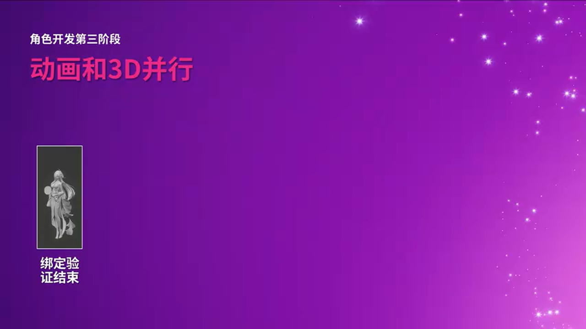
_Screenshot from 00:18:55_
---
## Section 352 (00:18:57)
**Transcript:**
> 那我们就基本上确定了股价
**Visual Reference:**

_Screenshot from 00:18:57_
---
## Section 353 (00:18:59)
**Transcript:**
> 然后就可以平行推进三地的细化
**Visual Reference:**

_Screenshot from 00:18:59_
---
## Section 354 (00:19:01)
**Transcript:**
> 和动画设计两件事情
**Visual Reference:**

_Screenshot from 00:19:01_
---
## Section 355 (00:19:03)
**Transcript:**
> 就这个情可能在别人看来
**Visual Reference:**

_Screenshot from 00:19:03_
---
## Section 356 (00:19:04)
**Transcript:**
> 为什么是这样平行就这样的事情
**Visual Reference:**

_Screenshot from 00:19:04_
---
## Section 357 (00:19:06)
**Transcript:**
> 毕竟这件事情
**Visual Reference:**

_Screenshot from 00:19:06_
---
## Section 358 (00:19:07)
**Transcript:**
> 首先就三地细化过程中
**Visual Reference:**

_Screenshot from 00:19:07_
---
## Section 359 (00:19:09)
**Transcript:**
> 其实我们人有会有很多的细节的设计的补充
**Visual Reference:**
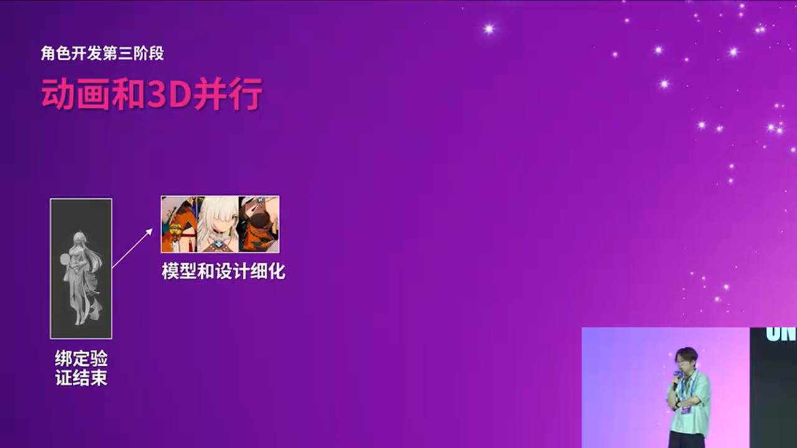
_Screenshot from 00:19:09_
---
## Section 360 (00:19:12)
**Transcript:**
> 但前提是不会去增加谷歌和改变谷歌的设计
**Visual Reference:**

_Screenshot from 00:19:12_
---
## Section 361 (00:19:15)
**Transcript:**
> 直到三地模型细化完成后
**Visual Reference:**

_Screenshot from 00:19:15_
---
## Section 362 (00:19:17)
**Transcript:**
> 其实概念设计同学基本上
**Visual Reference:**

_Screenshot from 00:19:17_
---
## Section 363 (00:19:19)
**Transcript:**
> 就可以开心心去设计下一个角色
**Visual Reference:**

_Screenshot from 00:19:19_
---
## Section 364 (00:19:21)
**Transcript:**
> 那动画此时
**Visual Reference:**

_Screenshot from 00:19:21_
---
## Section 365 (00:19:23)
**Transcript:**
> 它会平行的去拿我们的充模进行
**Visual Reference:**

_Screenshot from 00:19:23_
---
## Section 366 (00:19:25)
**Transcript:**
> 动画的这个特效设计制作
**Visual Reference:**

_Screenshot from 00:19:25_
---
## Section 367 (00:19:27)
**Transcript:**
> 这个阶段只会去做进统
**Visual Reference:**

_Screenshot from 00:19:27_
---
## Section 368 (00:19:29)
**Transcript:**
> 还有动作设计
**Visual Reference:**

_Screenshot from 00:19:29_
---
## Section 369 (00:19:30)
**Transcript:**
> 不会制作类似布料解算这样的一个细节
**Visual Reference:**

_Screenshot from 00:19:30_
---
## Section 370 (00:19:33)
**Transcript:**
> 那在这过程中
**Visual Reference:**

_Screenshot from 00:19:33_
---
## Section 371 (00:19:34)
**Transcript:**
> 其实培训丁进的两件事情
**Visual Reference:**

_Screenshot from 00:19:34_
---
## Section 372 (00:19:35)
**Transcript:**
> 完全是因为我们是想
**Visual Reference:**

_Screenshot from 00:19:35_
---
## Section 373 (00:19:37)
**Transcript:**
> 说断每个角色的制作周期
**Visual Reference:**

_Screenshot from 00:19:37_
---
## Section 374 (00:19:39)
**Transcript:**
> 因为如果我们要到模型细化
**Visual Reference:**

_Screenshot from 00:19:39_
---
## Section 375 (00:19:41)
**Transcript:**
> 之后再去做动画设计的话
**Visual Reference:**

_Screenshot from 00:19:41_
---
## Section 376 (00:19:43)
**Transcript:**
> 那基本上要可能玩一到两个月
**Visual Reference:**

_Screenshot from 00:19:43_
---
## Section 377 (00:19:45)
**Transcript:**
> 那这样的话对于一个角色的一个生产周期来讲
**Visual Reference:**

_Screenshot from 00:19:45_
---
## Section 378 (00:19:49)
**Transcript:**
> 它就远太晚
**Visual Reference:**

_Screenshot from 00:19:49_
---
## Section 379 (00:19:51)
**Transcript:**
> 所以当我们所有的这个动画条目
**Visual Reference:**

_Screenshot from 00:19:51_
---
## Section 380 (00:19:53)
**Transcript:**
> 继续触摩完成了一个地板
**Visual Reference:**

_Screenshot from 00:19:53_
---
## Section 381 (00:19:55)
**Transcript:**
> 通过之后
**Visual Reference:**

_Screenshot from 00:19:55_
---
## Section 382 (00:19:56)
**Transcript:**
> 我们会把谷架和细化后的三地模型进行
**Visual Reference:**

_Screenshot from 00:19:56_
---
## Section 383 (00:19:58)
**Transcript:**
> 是重新门皮
**Visual Reference:**

_Screenshot from 00:19:58_
---
## Section 384 (00:19:59)
**Transcript:**
> 做一次动画支援批量重定下
**Visual Reference:**

_Screenshot from 00:19:59_
---
## Section 385 (00:20:02)
**Transcript:**
> 然后这样就完成了一个两条平心线的一个整合
**Visual Reference:**

_Screenshot from 00:20:02_
---
## Section 386 (00:20:05)
**Transcript:**
> 最后特效同学会在一个最终资产
**Visual Reference:**

_Screenshot from 00:20:05_
---
## Section 387 (00:20:08)
**Transcript:**
> 支援上细化
**Visual Reference:**

_Screenshot from 00:20:08_
---
## Section 388 (00:20:09)
**Transcript:**
> 特效以到最终的一个这样的一个结果
**Visual Reference:**

_Screenshot from 00:20:09_
---
## Section 389 (00:20:13)
**Transcript:**
> 我们可以看一下动画
**Visual Reference:**

_Screenshot from 00:20:13_
---
## Section 390 (00:20:29)
**Transcript:**
> 差不多就是在这样的一个流程中
**Visual Reference:**
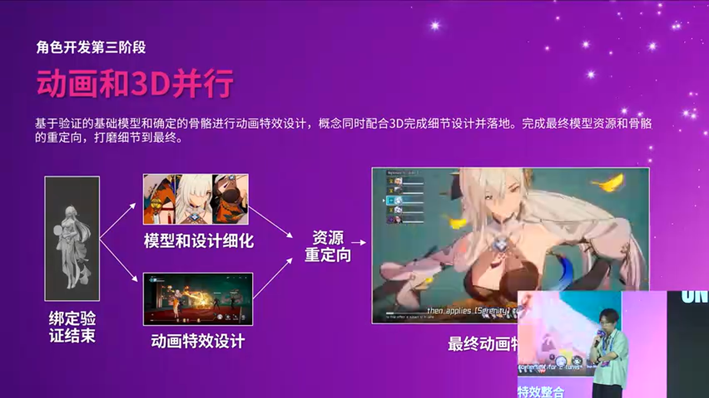
_Screenshot from 00:20:29_
---
## Section 391 (00:20:34)
**Transcript:**
> 我们把一个角色做到了一个特效的一个最终的效果
**Visual Reference:**

_Screenshot from 00:20:34_
---
## Section 392 (00:20:41)
**Transcript:**
> 当我们其实到了这个阶段
**Visual Reference:**
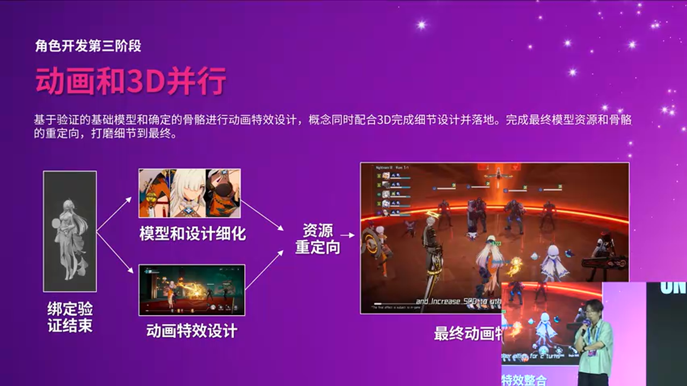
_Screenshot from 00:20:41_
---
## Section 393 (00:20:44)
**Transcript:**
> 第四个阶段时候
**Visual Reference:**
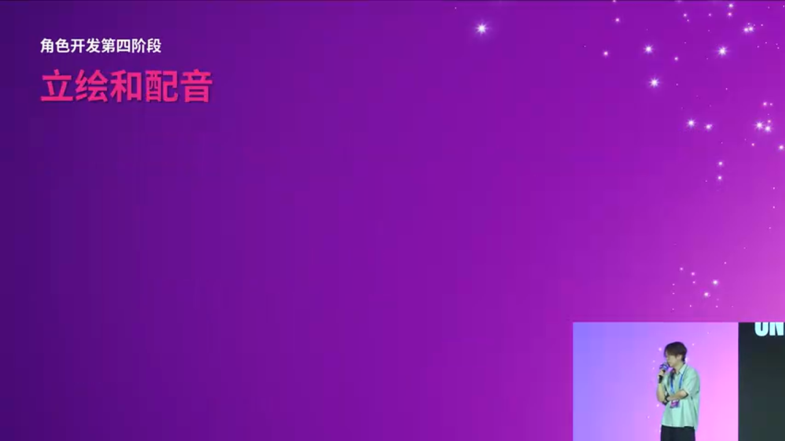
_Screenshot from 00:20:44_
---
## Section 394 (00:20:45)
**Transcript:**
> 我们要做的事情就是立会和配音的工作
**Visual Reference:**

_Screenshot from 00:20:45_
---
## Section 395 (00:20:48)
**Transcript:**
> 因为在上阶段
**Visual Reference:**

_Screenshot from 00:20:48_
---
## Section 396 (00:20:49)
**Transcript:**
> 我们已经有了一个完整的三地的动画资产
**Visual Reference:**

_Screenshot from 00:20:49_
---
## Section 397 (00:20:52)
**Transcript:**
> 也有了特效资产
**Visual Reference:**

_Screenshot from 00:20:52_
---
## Section 398 (00:20:53)
**Transcript:**
> 那么会剧续三地正式图去
**Visual Reference:**

_Screenshot from 00:20:53_
---
## Section 399 (00:20:55)
**Transcript:**
> 会支一个角色小卷的剧情立会
**Visual Reference:**

_Screenshot from 00:20:55_
---
## Section 400 (00:20:58)
**Transcript:**
> 然后这个更利于我们主线去推进一些故事
**Visual Reference:**
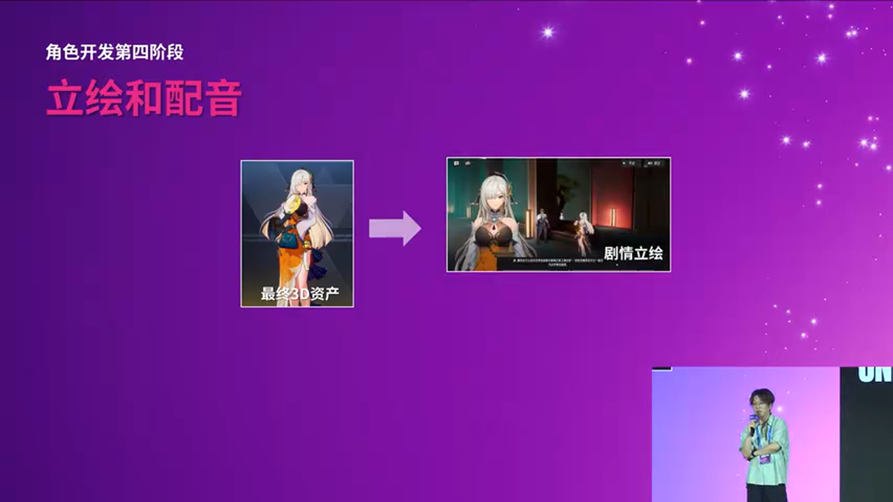
_Screenshot from 00:20:58_
---
## Section 401 (00:21:02)
**Transcript:**
> 它跟我们主线存三地的动画就像不太一样
**Visual Reference:**

_Screenshot from 00:21:02_
---
## Section 402 (00:21:04)
**Transcript:**
> 它会更适合我们按去快速落地每个英雄的二地故事
**Visual Reference:**

_Screenshot from 00:21:04_
---
## Section 403 (00:21:09)
**Transcript:**
> 然后因为全制资产已经非常完整了
**Visual Reference:**
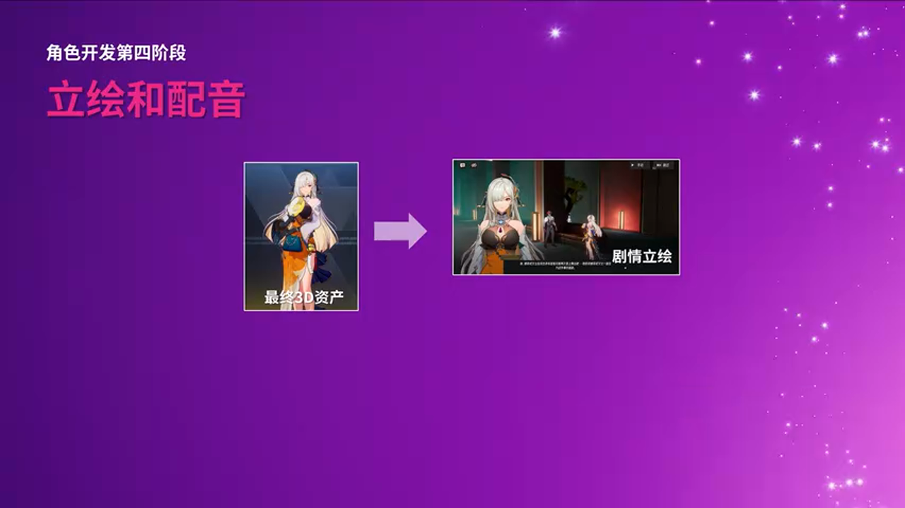
_Screenshot from 00:21:09_
---
## Section 404 (00:21:13)
**Transcript:**
> 我们会在这个阶段开始它的宣传力会的制作
**Visual Reference:**

_Screenshot from 00:21:13_
---
## Section 405 (00:21:17)
**Transcript:**
> 那作为SX角色的话
**Visual Reference:**

_Screenshot from 00:21:17_
---
## Section 406 (00:21:19)
**Transcript:**
> 我们可能还会需要更夸张的一个背景
**Visual Reference:**

_Screenshot from 00:21:19_
---
## Section 407 (00:21:22)
**Transcript:**
> 那在这个阶段其实因为我们的特效
**Visual Reference:**

_Screenshot from 00:21:22_
---
## Section 408 (00:21:25)
**Transcript:**
> 我们的动画以及我们的元素
**Visual Reference:**

_Screenshot from 00:21:25_
---
## Section 409 (00:21:28)
**Transcript:**
> 基本上已经是非常完整了
**Visual Reference:**

_Screenshot from 00:21:28_
---
## Section 410 (00:21:30)
**Transcript:**
> 那去花力会的同学它的信息是非常完整的
**Visual Reference:**

_Screenshot from 00:21:30_
---
## Section 411 (00:21:33)
**Transcript:**
> 所以说它在做这件事情上
**Visual Reference:**

_Screenshot from 00:21:33_
---
## Section 412 (00:21:35)
**Transcript:**
> 其实并不需要有很多的向上的沟通
**Visual Reference:**

_Screenshot from 00:21:35_
---
## Section 413 (00:21:37)
**Transcript:**
> 就能得到一个比较明确的方向
**Visual Reference:**

_Screenshot from 00:21:37_
---
## Section 414 (00:21:40)
**Transcript:**
> 然后我们会再去把力会做动态化
**Visual Reference:**

_Screenshot from 00:21:40_
---
## Section 415 (00:21:43)
**Transcript:**
> 此时角色的配音其实也会有效地展开
**Visual Reference:**

_Screenshot from 00:21:43_
---
## Section 416 (00:21:46)
**Transcript:**
> 外部合作的一个品质
**Visual Reference:**

_Screenshot from 00:21:46_
---
## Section 417 (00:21:48)
**Transcript:**
> 也会很大取决于说我们前置资产的这个确定性和完整性
**Visual Reference:**

_Screenshot from 00:21:48_
---
## Section 418 (00:21:53)
**Transcript:**
> 所以我们也会在把这个资产非常完整情况下
**Visual Reference:**

_Screenshot from 00:21:53_
---
## Section 419 (00:21:56)
**Transcript:**
> 再去做它的配音
**Visual Reference:**

_Screenshot from 00:21:56_
---
## Section 420 (00:22:00)
**Transcript:**
> 对目前我们角色的话
**Visual Reference:**

_Screenshot from 00:22:00_
---
## Section 421 (00:22:02)
**Transcript:**
> 基本上有30加了这样的一个语音
**Visual Reference:**
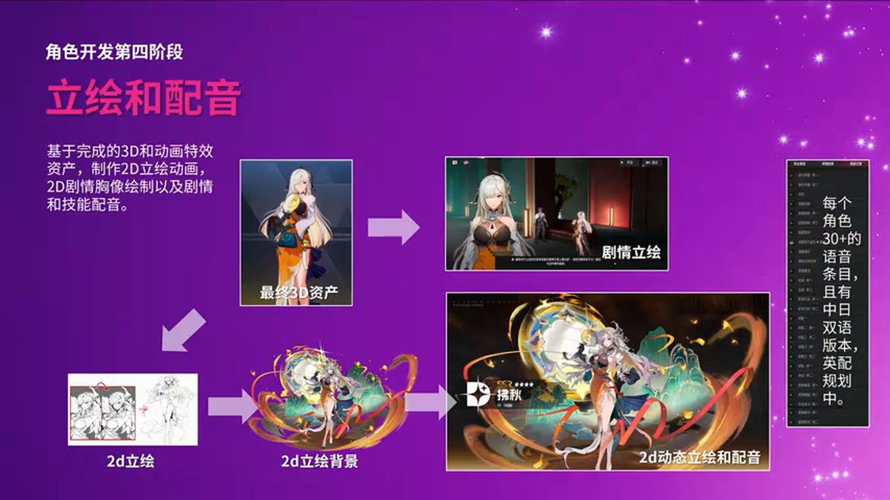
_Screenshot from 00:22:02_
---
## Section 422 (00:22:05)
**Transcript:**
> 而且基本上都有中日双语的版本
**Visual Reference:**

_Screenshot from 00:22:05_
---
## Section 423 (00:22:08)
**Transcript:**
> 未来其实我们也会加入音配
**Visual Reference:**

_Screenshot from 00:22:08_
---
## Section 424 (00:22:11)
**Transcript:**
> 可以看一下这个配音的角色
**Visual Reference:**

_Screenshot from 00:22:11_
---
## Section 425 (00:22:14)
**Transcript:**
> 再给你的信能迷你都都弄一下下来
**Visual Reference:**

_Screenshot from 00:22:14_
---
## Section 426 (00:22:16)
**Transcript:**
> 再动手前请允许我先整理一下以表
**Visual Reference:**

_Screenshot from 00:22:16_
---
## Section 427 (00:22:20)
**Transcript:**
> 原名达国划弹的很明智的选择
**Visual Reference:**

_Screenshot from 00:22:20_
---
## Section 428 (00:22:23)
**Transcript:**
> 可干明你冲着花呢
**Visual Reference:**

_Screenshot from 00:22:23_
---
## Section 429 (00:22:26)
**Transcript:**
> 弥子你冲着吹
**Visual Reference:**

_Screenshot from 00:22:26_
---
## Section 430 (00:22:29)
**Transcript:**
> 静中花 水中越
**Visual Reference:**

_Screenshot from 00:22:29_
---
## Section 431 (00:22:35)
**Transcript:**
> OK
**Visual Reference:**

_Screenshot from 00:22:35_
---
## Section 432 (00:22:36)
**Transcript:**
> 这个就是基本上是我们到目前为止第一次就在所有的内容
**Visual Reference:**

_Screenshot from 00:22:36_
---
## Section 433 (00:22:40)
**Transcript:**
> 最后一步就会利用前面
**Visual Reference:**

_Screenshot from 00:22:40_
---
## Section 434 (00:22:44)
**Transcript:**
> 就累积着所有的资产
**Visual Reference:**
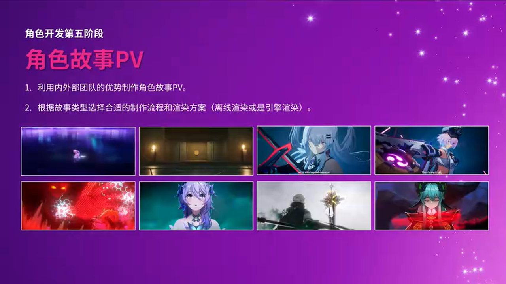
_Screenshot from 00:22:44_
---
## Section 435 (00:22:46)
**Transcript:**
> 去做我们的每一个英雄的PV
**Visual Reference:**

_Screenshot from 00:22:46_
---
## Section 436 (00:22:49)
**Transcript:**
> 目前其实我们遇到的难题就是
**Visual Reference:**

_Screenshot from 00:22:49_
---
## Section 437 (00:22:52)
**Transcript:**
> 我们50个人这样的一个团队
**Visual Reference:**
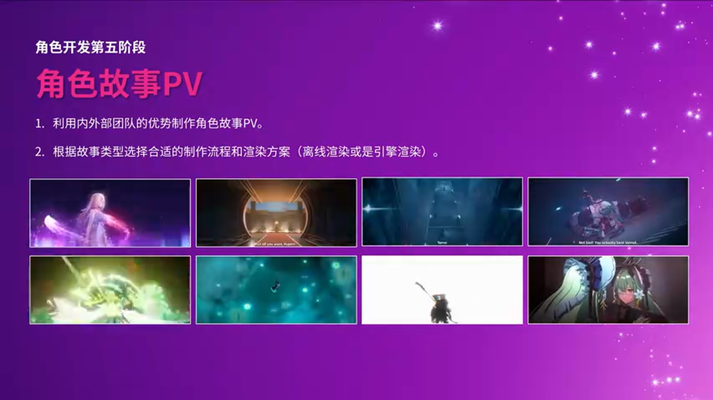
_Screenshot from 00:22:52_
---
## Section 438 (00:22:54)
**Transcript:**
> 要消化所有的应该资产 外宣资产
**Visual Reference:**

_Screenshot from 00:22:54_
---
## Section 439 (00:22:57)
**Transcript:**
> 以及一部分的角色PV故事
**Visual Reference:**

_Screenshot from 00:22:57_
---
## Section 440 (00:23:00)
**Transcript:**
> 我们其实是无法完全消化这些量
**Visual Reference:**
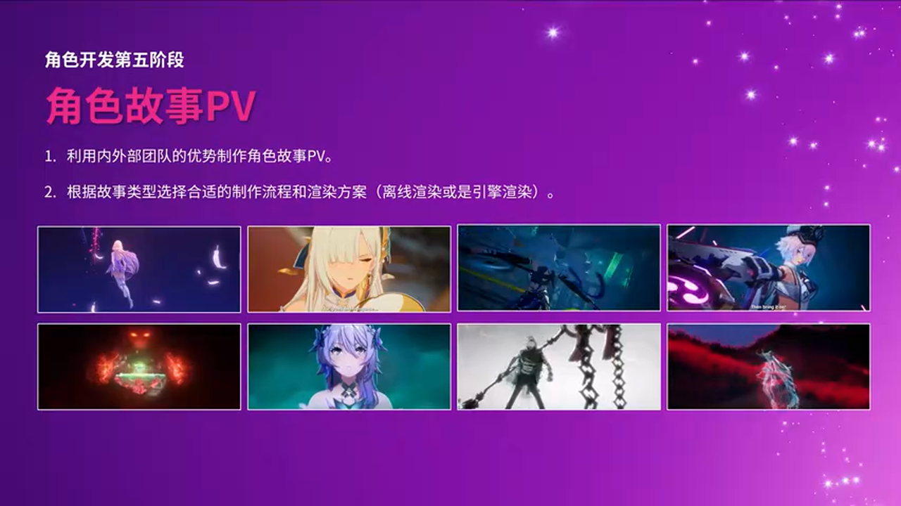
_Screenshot from 00:23:00_
---
## Section 441 (00:23:04)
**Transcript:**
> 所以我们也是跟一些兄弟部门去合作
**Visual Reference:**
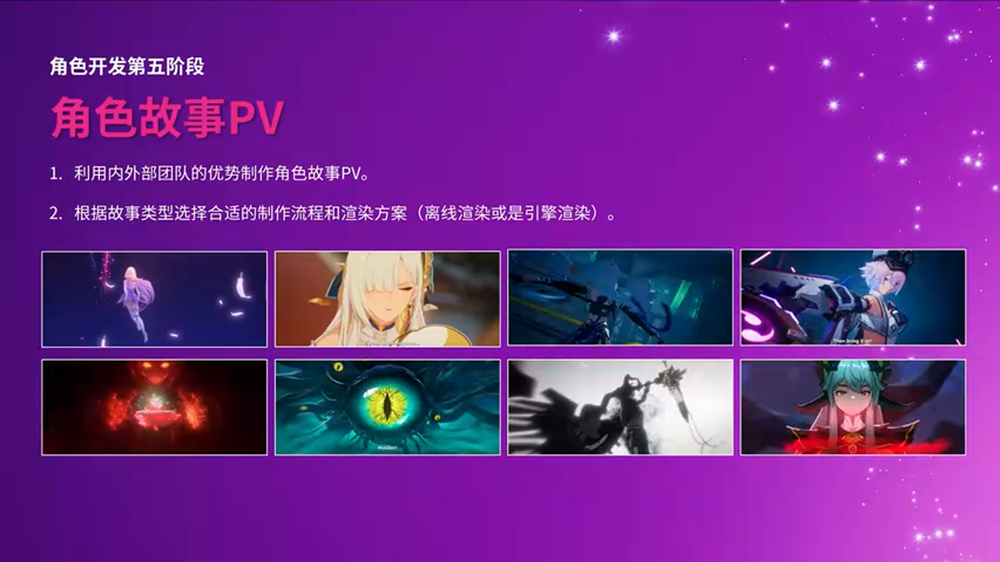
_Screenshot from 00:23:04_
---
## Section 442 (00:23:07)
**Transcript:**
> 也就是继续各自的优势
**Visual Reference:**

_Screenshot from 00:23:07_
---
## Section 443 (00:23:09)
**Transcript:**
> 去做一些不同的偏子
**Visual Reference:**

_Screenshot from 00:23:09_
---
## Section 444 (00:23:11)
**Transcript:**
> 因为赛路渲染风格
**Visual Reference:**

_Screenshot from 00:23:11_
---
## Section 445 (00:23:12)
**Transcript:**
> 其实它还是相比就要PBR写试渲染
**Visual Reference:**

_Screenshot from 00:23:12_
---
## Section 446 (00:23:15)
**Transcript:**
> 它不那么渲染这辆
**Visual Reference:**

_Screenshot from 00:23:15_
---
## Section 447 (00:23:16)
**Transcript:**
> 所以我们最后的结果是发现
**Visual Reference:**

_Screenshot from 00:23:16_
---
## Section 448 (00:23:18)
**Transcript:**
> 用实施渲染和遗陷渲染
**Visual Reference:**

_Screenshot from 00:23:18_
---
## Section 449 (00:23:20)
**Transcript:**
> 它最终落地的话从用户角度来讲
**Visual Reference:**

_Screenshot from 00:23:20_
---
## Section 450 (00:23:23)
**Transcript:**
> 它不会能感觉到很明显的差距
**Visual Reference:**

_Screenshot from 00:23:23_
---
## Section 451 (00:23:25)
**Transcript:**
> 所以我们研发测会考虑的是
**Visual Reference:**

_Screenshot from 00:23:25_
---
## Section 452 (00:23:28)
**Transcript:**
> 把UES和U1-5做数据连通
**Visual Reference:**

_Screenshot from 00:23:28_
---
## Section 453 (00:23:30)
**Transcript:**
> 然后利用U1-5的一些制作特性去做一些
**Visual Reference:**

_Screenshot from 00:23:30_
---
## Section 454 (00:23:33)
**Transcript:**
> 偏动作像的一些影片
**Visual Reference:**

_Screenshot from 00:23:33_
---
## Section 455 (00:23:35)
**Transcript:**
> 那角色在游戏里的动作特效
**Visual Reference:**

_Screenshot from 00:23:35_
---
## Section 456 (00:23:38)
**Transcript:**
> 其实也是做就是这个偏子的同一屁人
**Visual Reference:**

_Screenshot from 00:23:38_
---
## Section 457 (00:23:41)
**Transcript:**
> 那他们其实会更了解角色
**Visual Reference:**

_Screenshot from 00:23:41_
---
## Section 458 (00:23:43)
**Transcript:**
> 所以在做偏子时候会有更多的资产的方式
**Visual Reference:**

_Screenshot from 00:23:43_
---
## Section 459 (00:23:45)
**Transcript:**
> 这样的话效率也会更高
**Visual Reference:**

_Screenshot from 00:23:45_
---
## Section 460 (00:23:47)
**Transcript:**
> 而且就是实施隐形在做影片的话
**Visual Reference:**

_Screenshot from 00:23:47_
---
## Section 461 (00:23:49)
**Transcript:**
> 就是它内于那种镜头和动作的微调
**Visual Reference:**

_Screenshot from 00:23:49_
---
## Section 462 (00:23:51)
**Transcript:**
> 它是效率是远高于迪线渲染流程的
**Visual Reference:**

_Screenshot from 00:23:51_
---
## Section 463 (00:23:55)
**Transcript:**
> 那我们合作部门他们会更擅长
**Visual Reference:**

_Screenshot from 00:23:55_
---
## Section 464 (00:23:58)
**Transcript:**
> 利用迪线的方式去做一些敘事像的
**Visual Reference:**

_Screenshot from 00:23:58_
---
## Section 465 (00:24:01)
**Transcript:**
> 画面上的影片
**Visual Reference:**

_Screenshot from 00:24:01_
---
## Section 466 (00:24:02)
**Transcript:**
> 所以他们会就是跟他们更擅长的
**Visual Reference:**

_Screenshot from 00:24:02_
---
## Section 467 (00:24:04)
**Transcript:**
> 也制作方式
**Visual Reference:**

_Screenshot from 00:24:04_
---
## Section 468 (00:24:05)
**Transcript:**
> 两者结合我们其实产出了比较多的一个角色的PV
**Visual Reference:**

_Screenshot from 00:24:05_
---
## Section 469 (00:24:10)
**Transcript:**
> 这些上面都是一些英雄的一些革命的方式
**Visual Reference:**

_Screenshot from 00:24:10_
---
## Section 470 (00:24:14)
**Transcript:**
> 还有一些英雄的一些PV
**Visual Reference:**

_Screenshot from 00:24:14_
---
## Section 471 (00:24:16)
**Transcript:**
> 还有一些都制作中还没有完全的对外
**Visual Reference:**

_Screenshot from 00:24:16_
---
## Section 472 (00:24:20)
**Transcript:**
> 当然里面就是像上面的四个都是用U-15做的
**Visual Reference:**

_Screenshot from 00:24:20_
---
## Section 473 (00:24:26)
**Transcript:**
> 下面还是用迪线渲染做的
**Visual Reference:**

_Screenshot from 00:24:26_
---
## Section 474 (00:24:29)
**Transcript:**
> 其实大家也不会一眼看出
**Visual Reference:**

_Screenshot from 00:24:29_
---
## Section 475 (00:24:31)
**Transcript:**
> 他们在画面上的一个很大的一个差距
**Visual Reference:**

_Screenshot from 00:24:31_
---
## Section 476 (00:24:38)
**Transcript:**
> 就做这么多事情
**Visual Reference:**

_Screenshot from 00:24:38_
---
## Section 477 (00:24:40)
**Transcript:**
> 我们在整个一个角色管线当中
**Visual Reference:**

_Screenshot from 00:24:40_
---
## Section 478 (00:24:42)
**Transcript:**
> 其实是在思考一个问题
**Visual Reference:**

_Screenshot from 00:24:42_
---
## Section 479 (00:24:44)
**Transcript:**
> 我们也面对的一个非常非常难去解决的一个三角形
**Visual Reference:**

_Screenshot from 00:24:44_
---
## Section 480 (00:24:49)
**Transcript:**
> 就是这个三角形的三个点
**Visual Reference:**

_Screenshot from 00:24:49_
---
## Section 481 (00:24:53)
**Transcript:**
> 第一个就是角色数量
**Visual Reference:**
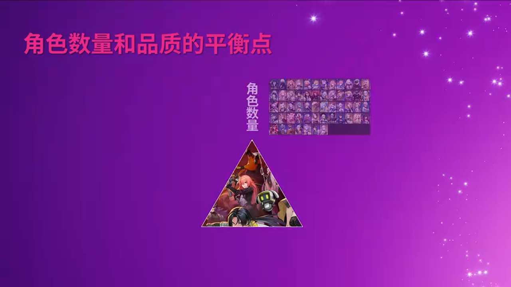
_Screenshot from 00:24:53_
---
## Section 482 (00:24:55)
**Transcript:**
> 第二个就是制作成本
**Visual Reference:**

_Screenshot from 00:24:55_
---
## Section 483 (00:24:58)
**Transcript:**
> 第三个就是角色品质
**Visual Reference:**
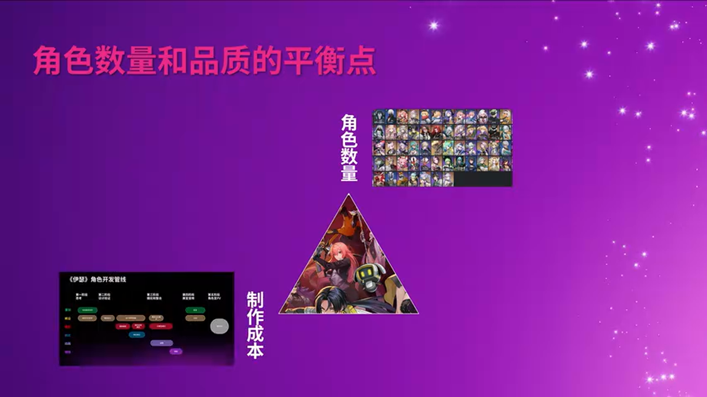
_Screenshot from 00:24:58_
---
## Section 484 (00:25:01)
**Transcript:**
> 数量是居于玩法我们这个东西是无法汉懂的
**Visual Reference:**

_Screenshot from 00:25:01_
---
## Section 485 (00:25:04)
**Transcript:**
> 它只会越来越多
**Visual Reference:**

_Screenshot from 00:25:04_
---
## Section 486 (00:25:06)
**Transcript:**
> 制作成本其实大家刚刚通过走看这个角色的一个制作管线
**Visual Reference:**

_Screenshot from 00:25:06_
---
## Section 487 (00:25:09)
**Transcript:**
> 你会发现一个角色它从0到1制作起来
**Visual Reference:**

_Screenshot from 00:25:09_
---
## Section 488 (00:25:12)
**Transcript:**
> 它其实你再怎么去压缩周期和成本
**Visual Reference:**

_Screenshot from 00:25:12_
---
## Section 489 (00:25:15)
**Transcript:**
> 它都是要走这么长的路的
**Visual Reference:**

_Screenshot from 00:25:15_
---
## Section 490 (00:25:17)
**Transcript:**
> 如果你这样的一个管线
**Visual Reference:**

_Screenshot from 00:25:17_
---
## Section 491 (00:25:19)
**Transcript:**
> 成以60成100
**Visual Reference:**

_Screenshot from 00:25:19_
---
## Section 492 (00:25:20)
**Transcript:**
> 它的成本基本上作为中小团队来讲
**Visual Reference:**

_Screenshot from 00:25:20_
---
## Section 493 (00:25:23)
**Transcript:**
> 它能够压到的一个度是非常有限的
**Visual Reference:**

_Screenshot from 00:25:23_
---
## Section 494 (00:25:26)
**Transcript:**
> 在这个两个辩量
**Visual Reference:**

_Screenshot from 00:25:26_
---
## Section 495 (00:25:28)
**Transcript:**
> 我们无法改变迁迪下
**Visual Reference:**

_Screenshot from 00:25:28_
---
## Section 496 (00:25:29)
**Transcript:**
> 我们需要考虑说
**Visual Reference:**

_Screenshot from 00:25:29_
---
## Section 497 (00:25:30)
**Transcript:**
> 我们这个角色品质做到什么样才适合我们这样的游戏
**Visual Reference:**

_Screenshot from 00:25:30_
---
## Section 498 (00:25:35)
**Transcript:**
> 我翻了一下
**Visual Reference:**

_Screenshot from 00:25:35_
---
## Section 499 (00:25:36)
**Transcript:**
> 跳不上面的很多的一些评论
**Visual Reference:**

_Screenshot from 00:25:36_
---
## Section 500 (00:25:38)
**Transcript:**
> 就玩家最大的一个征一点会拿我们去跟米哈游的分铁区比
**Visual Reference:**

_Screenshot from 00:25:38_
---
## Section 501 (00:25:44)
**Transcript:**
> 大家说
**Visual Reference:**

_Screenshot from 00:25:44_
---
## Section 502 (00:25:49)
**Transcript:**
> 实际演示特效这么拉垮
**Visual Reference:**

_Screenshot from 00:25:49_
---
## Section 503 (00:25:51)
**Transcript:**
> 你们不优化跟分铁一样上线直接串
**Visual Reference:**

_Screenshot from 00:25:51_
---
## Section 504 (00:25:53)
**Transcript:**
> 我听起来稍微评论有点主观
**Visual Reference:**

_Screenshot from 00:25:53_
---
## Section 505 (00:25:58)
**Transcript:**
> 但是像比如说
**Visual Reference:**

_Screenshot from 00:25:58_
---
## Section 506 (00:26:01)
**Transcript:**
> 动画例会建模都不出产
**Visual Reference:**

_Screenshot from 00:26:01_
---
## Section 507 (00:26:03)
**Transcript:**
> 也不是很差
**Visual Reference:**

_Screenshot from 00:26:03_
---
## Section 508 (00:26:04)
**Transcript:**
> 平平无奇
**Visual Reference:**

_Screenshot from 00:26:04_
---
## Section 509 (00:26:05)
**Transcript:**
> 我觉得在现在来看
**Visual Reference:**

_Screenshot from 00:26:05_
---
## Section 510 (00:26:07)
**Transcript:**
> 我觉得这都已经是一个比较保守的评价了
**Visual Reference:**

_Screenshot from 00:26:07_
---
## Section 511 (00:26:10)
**Transcript:**
> 因为在上线的时候可能这个言论都跟激烈
**Visual Reference:**

_Screenshot from 00:26:10_
---
## Section 512 (00:26:14)
**Transcript:**
> 在我们长期保守这样的评论之后
**Visual Reference:**

_Screenshot from 00:26:14_
---
## Section 513 (00:26:16)
**Transcript:**
> 我们觉得现在这个评论我们也非常能接受
**Visual Reference:**

_Screenshot from 00:26:16_
---
## Section 514 (00:26:20)
**Transcript:**
> 所以就是在这样的一个过程中
**Visual Reference:**

_Screenshot from 00:26:20_
---
## Section 515 (00:26:23)
**Transcript:**
> 我们心里想
**Visual Reference:**

_Screenshot from 00:26:23_
---
## Section 516 (00:26:24)
**Transcript:**
> 我们其实
**Visual Reference:**

_Screenshot from 00:26:24_
---
## Section 517 (00:26:26)
**Transcript:**
> 我们不应该去跟这类游戏比
**Visual Reference:**

_Screenshot from 00:26:26_
---
## Section 518 (00:26:28)
**Transcript:**
> 我们还是应该跟我们同品类
**Visual Reference:**

_Screenshot from 00:26:28_
---
## Section 519 (00:26:30)
**Transcript:**
> 比如像魔林烧换这样的评论去比
**Visual Reference:**

_Screenshot from 00:26:30_
---
## Section 520 (00:26:32)
**Transcript:**
> 我们尽量让我们角色品质做到
**Visual Reference:**

_Screenshot from 00:26:32_
---
## Section 521 (00:26:34)
**Transcript:**
> 在这个品类里面
**Visual Reference:**

_Screenshot from 00:26:34_
---
## Section 522 (00:26:35)
**Transcript:**
> 因为这样的渲染风格
**Visual Reference:**

_Screenshot from 00:26:35_
---
## Section 523 (00:26:36)
**Transcript:**
> 以及我们能做到的一个最好的一个点
**Visual Reference:**
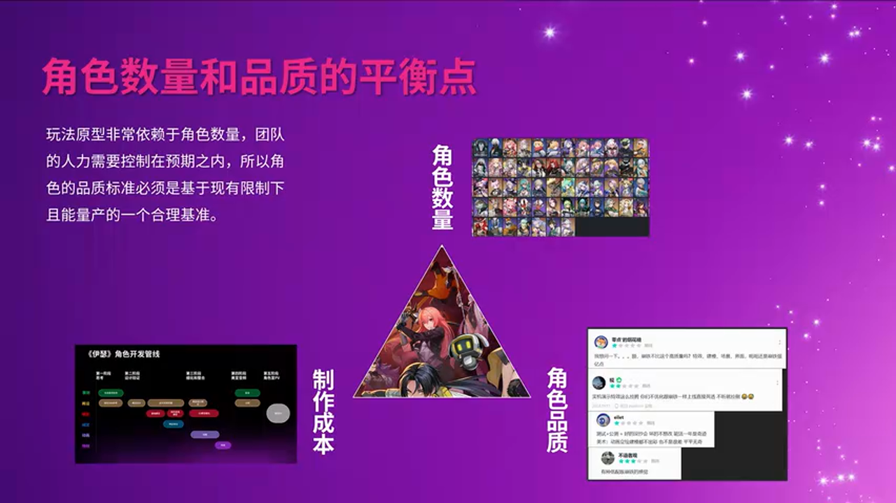
_Screenshot from 00:26:36_
---
## Section 524 (00:26:43)
**Transcript:**
> 目前我们上线的数量的话
**Visual Reference:**

_Screenshot from 00:26:43_
---
## Section 525 (00:26:45)
**Transcript:**
> 英雄对60家
**Visual Reference:**
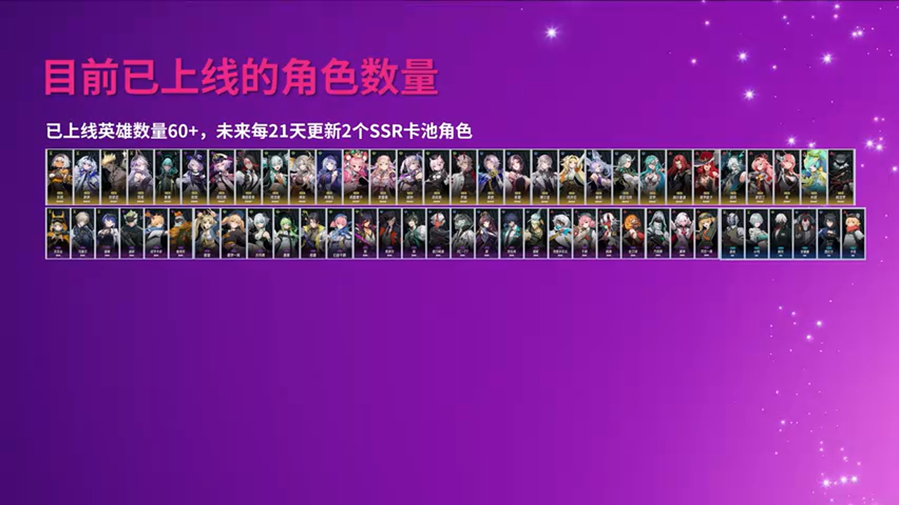
_Screenshot from 00:26:45_
---
## Section 526 (00:26:46)
**Transcript:**
> 就未来我们每21天会跟星两个
**Visual Reference:**

_Screenshot from 00:26:46_
---
## Section 527 (00:26:48)
**Transcript:**
> SX卡制角色
**Visual Reference:**

_Screenshot from 00:26:48_
---
## Section 528 (00:26:51)
**Transcript:**
> 然后有搭配的支销数量有30家
**Visual Reference:**

_Screenshot from 00:26:51_
---
## Section 529 (00:26:54)
**Transcript:**
> 未来也会逐步扩充
**Visual Reference:**

_Screenshot from 00:26:54_
---
## Section 530 (00:26:57)
**Transcript:**
> 最后有大概20家的Boss
**Visual Reference:**

_Screenshot from 00:26:57_
---
## Section 531 (00:26:59)
**Transcript:**
> 金怪数量
**Visual Reference:**
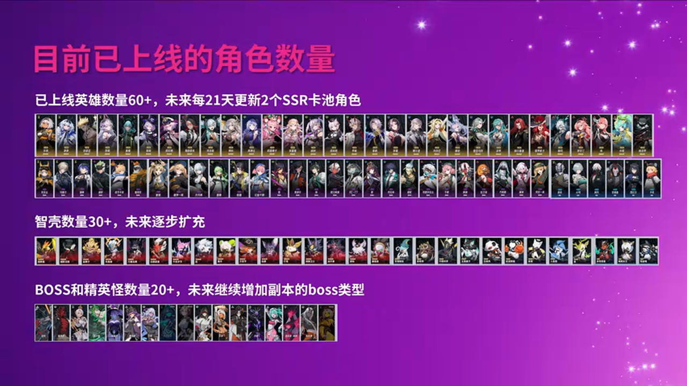
_Screenshot from 00:26:59_
---
## Section 532 (00:27:00)
**Transcript:**
> 目前也还是会去逐步的前冲这个部分
**Visual Reference:**

_Screenshot from 00:27:00_
---
## Section 533 (00:27:03)
**Transcript:**
> 逐步的前冲这个Boss就会提亮
**Visual Reference:**

_Screenshot from 00:27:03_
---
## Section 534 (00:27:09)
**Transcript:**
> 角色的聊完我们可以聊到场景
**Visual Reference:**
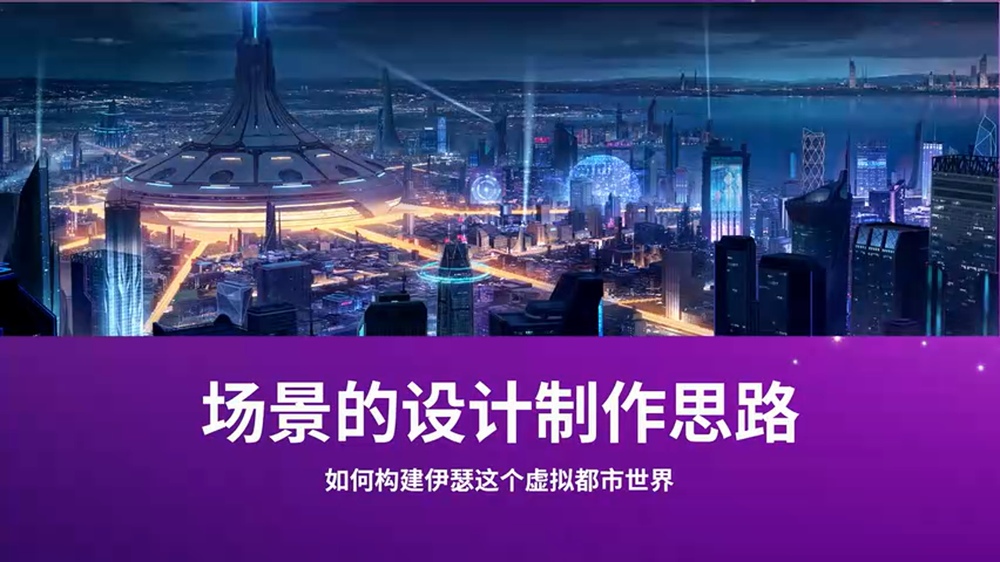
_Screenshot from 00:27:09_
---
## Section 535 (00:27:11)
**Transcript:**
> 就在做预测的时候
**Visual Reference:**

_Screenshot from 00:27:11_
---
## Section 536 (00:27:13)
**Transcript:**
> 我们就在想
**Visual Reference:**

_Screenshot from 00:27:13_
---
## Section 537 (00:27:14)
**Transcript:**
> 我们怎么去购件这样的一个虚拟都市
**Visual Reference:**

_Screenshot from 00:27:14_
---
## Section 538 (00:27:17)
**Transcript:**
> 其实现在每个产品在场景上投入比
**Visual Reference:**

_Screenshot from 00:27:17_
---
## Section 539 (00:27:20)
**Transcript:**
> 之前还是都会大很多的
**Visual Reference:**

_Screenshot from 00:27:20_
---
## Section 540 (00:27:22)
**Transcript:**
> 十年前可能做手游也好
**Visual Reference:**

_Screenshot from 00:27:22_
---
## Section 541 (00:27:23)
**Transcript:**
> 或者做端游也好
**Visual Reference:**

_Screenshot from 00:27:23_
---
## Section 542 (00:27:24)
**Transcript:**
> 只要不是做主席游戏
**Visual Reference:**

_Screenshot from 00:27:24_
---
## Section 543 (00:27:25)
**Transcript:**
> 大家可能对角色可能更在意
**Visual Reference:**

_Screenshot from 00:27:25_
---
## Section 544 (00:27:28)
**Transcript:**
> 场景的话从细节品质上来讲
**Visual Reference:**

_Screenshot from 00:27:28_
---
## Section 545 (00:27:30)
**Transcript:**
> 不会太去追究
**Visual Reference:**

_Screenshot from 00:27:30_
---
## Section 546 (00:27:32)
**Transcript:**
> 但是其实这几年一个风向
**Visual Reference:**

_Screenshot from 00:27:32_
---
## Section 547 (00:27:35)
**Transcript:**
> 有时候大家会投入更多的资产
**Visual Reference:**

_Screenshot from 00:27:35_
---
## Section 548 (00:27:38)
**Transcript:**
> 或一些成本去做大世界地图
**Visual Reference:**

_Screenshot from 00:27:38_
---
## Section 549 (00:27:40)
**Transcript:**
> 来呈现一个游戏庞大的世界观
**Visual Reference:**

_Screenshot from 00:27:40_
---
## Section 550 (00:27:42)
**Transcript:**
> 我们在做的时候其实也是做了比较多的思考
**Visual Reference:**

_Screenshot from 00:27:42_
---
## Section 551 (00:27:46)
**Transcript:**
> 首先就是
**Visual Reference:**

_Screenshot from 00:27:46_
---
## Section 552 (00:27:47)
**Transcript:**
> 因为我们的故事是真实世界
**Visual Reference:**

_Screenshot from 00:27:47_
---
## Section 553 (00:27:49)
**Transcript:**
> 连接虚拟世界
**Visual Reference:**
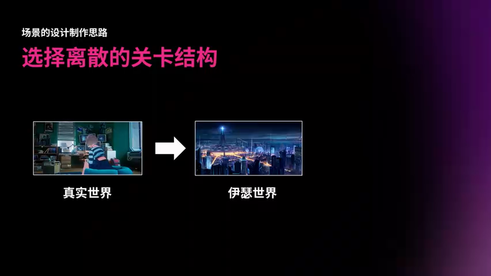
_Screenshot from 00:27:49_
---
## Section 554 (00:27:50)
**Transcript:**
> 那真实世界目前在游戏里面
**Visual Reference:**

_Screenshot from 00:27:50_
---
## Section 555 (00:27:52)
**Transcript:**
> 它主要是一个主要之家
**Visual Reference:**

_Screenshot from 00:27:52_
---
## Section 556 (00:27:55)
**Transcript:**
> 其实一个非常小的一个场景
**Visual Reference:**

_Screenshot from 00:27:55_
---
## Section 557 (00:27:56)
**Transcript:**
> 那重点是我们去怎么去
**Visual Reference:**

_Screenshot from 00:27:56_
---
## Section 558 (00:27:58)
**Transcript:**
> 勾件这个虚拟世界
**Visual Reference:**

_Screenshot from 00:27:58_
---
## Section 559 (00:28:01)
**Transcript:**
> 其实一开始我们也想过
**Visual Reference:**

_Screenshot from 00:28:01_
---
## Section 560 (00:28:02)
**Transcript:**
> 是不要用大世界去做
**Visual Reference:**

_Screenshot from 00:28:02_
---
## Section 561 (00:28:03)
**Transcript:**
> 但这个其实可能没想多久就放弃了
**Visual Reference:**

_Screenshot from 00:28:03_
---
## Section 562 (00:28:07)
**Transcript:**
> 想了一下觉得可能还是
**Visual Reference:**

_Screenshot from 00:28:07_
---
## Section 563 (00:28:09)
**Transcript:**
> 这样迷散的观察其实
**Visual Reference:**
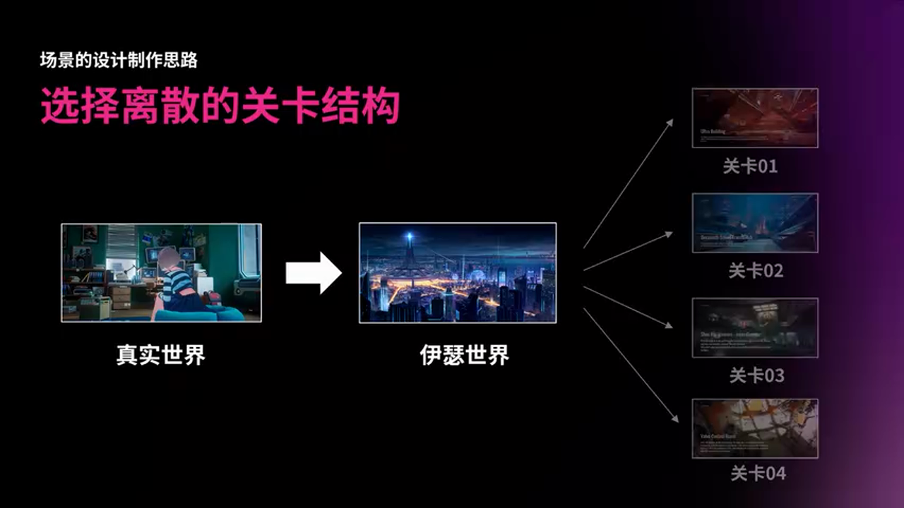
_Screenshot from 00:28:09_
---
## Section 564 (00:28:11)
**Transcript:**
> 更适合我们这样的类型的游戏和团队
**Visual Reference:**

_Screenshot from 00:28:11_
---
## Section 565 (00:28:15)
**Transcript:**
> 因为其实在整个一个
**Visual Reference:**

_Screenshot from 00:28:15_
---
## Section 566 (00:28:17)
**Transcript:**
> 游戏内容的生产过程中
**Visual Reference:**

_Screenshot from 00:28:17_
---
## Section 567 (00:28:19)
**Transcript:**
> 你很难确定比如说
**Visual Reference:**

_Screenshot from 00:28:19_
---
## Section 568 (00:28:20)
**Transcript:**
> 你现在做的一个
**Visual Reference:**

_Screenshot from 00:28:20_
---
## Section 569 (00:28:21)
**Transcript:**
> 编号是第二观的观察
**Visual Reference:**

_Screenshot from 00:28:21_
---
## Section 570 (00:28:23)
**Transcript:**
> 最后是第二观
**Visual Reference:**

_Screenshot from 00:28:23_
---
## Section 571 (00:28:25)
**Transcript:**
> 这个是会可能在制作中
**Visual Reference:**

_Screenshot from 00:28:25_
---
## Section 572 (00:28:27)
**Transcript:**
> 会反复去调整的
**Visual Reference:**

_Screenshot from 00:28:27_
---
## Section 573 (00:28:28)
**Transcript:**
> 如果说它一开始的这种
**Visual Reference:**

_Screenshot from 00:28:28_
---
## Section 574 (00:28:30)
**Transcript:**
> 确定型要求很高的话
**Visual Reference:**

_Screenshot from 00:28:30_
---
## Section 575 (00:28:32)
**Transcript:**
> 在后续它的调整的自由度就会比较差
**Visual Reference:**

_Screenshot from 00:28:32_
---
## Section 576 (00:28:35)
**Transcript:**
> 所以我们也是考虑了
**Visual Reference:**

_Screenshot from 00:28:35_
---
## Section 577 (00:28:37)
**Transcript:**
> 说迷散的观察
**Visual Reference:**

_Screenshot from 00:28:37_
---
## Section 578 (00:28:38)
**Transcript:**
> 它其实未来的一个调整组合
**Visual Reference:**

_Screenshot from 00:28:38_
---
## Section 579 (00:28:40)
**Transcript:**
> 它自由度更高的
**Visual Reference:**

_Screenshot from 00:28:40_
---
## Section 580 (00:28:41)
**Transcript:**
> 而且它会更容易去
**Visual Reference:**

_Screenshot from 00:28:41_
---
## Section 581 (00:28:43)
**Transcript:**
> 平行地去展开工作
**Visual Reference:**

_Screenshot from 00:28:43_
---
## Section 582 (00:28:45)
**Transcript:**
> 因为观察之间它是不是偶合的
**Visual Reference:**

_Screenshot from 00:28:45_
---
## Section 583 (00:28:47)
**Transcript:**
> 然后就是我们在虚拟上的话
**Visual Reference:**

_Screenshot from 00:28:47_
---
## Section 584 (00:28:49)
**Transcript:**
> 也会考虑说
**Visual Reference:**

_Screenshot from 00:28:49_
---
## Section 585 (00:28:50)
**Transcript:**
> 这个其实也更适合我们这样体谅的游戏
**Visual Reference:**

_Screenshot from 00:28:50_
---
## Section 586 (00:28:54)
**Transcript:**
> 再者就是如果要是做大世界
**Visual Reference:**

_Screenshot from 00:28:54_
---
## Section 587 (00:28:56)
**Transcript:**
> 其实像我们这样团队要去面临
**Visual Reference:**

_Screenshot from 00:28:56_
---
## Section 588 (00:28:58)
**Transcript:**
> 这样的一个优化
**Visual Reference:**

_Screenshot from 00:28:58_
---
## Section 589 (00:28:59)
**Transcript:**
> 其实压力是非常大的
**Visual Reference:**

_Screenshot from 00:28:59_
---
## Section 590 (00:29:01)
**Transcript:**
> 可能就没有那么多时间
**Visual Reference:**

_Screenshot from 00:29:01_
---
## Section 591 (00:29:03)
**Transcript:**
> 去真正去做制产
**Visual Reference:**

_Screenshot from 00:29:03_
---
## Section 592 (00:29:04)
**Transcript:**
> 所以最后我们选择了一个
**Visual Reference:**

_Screenshot from 00:29:04_
---
## Section 593 (00:29:06)
**Transcript:**
> 迷散的观察结构
**Visual Reference:**

_Screenshot from 00:29:06_
---
## Section 594 (00:29:07)
**Transcript:**
> 去做我们的场景
**Visual Reference:**

_Screenshot from 00:29:07_
---
## Section 595 (00:29:12)
**Transcript:**
> 但是就是下一步的问题
**Visual Reference:**
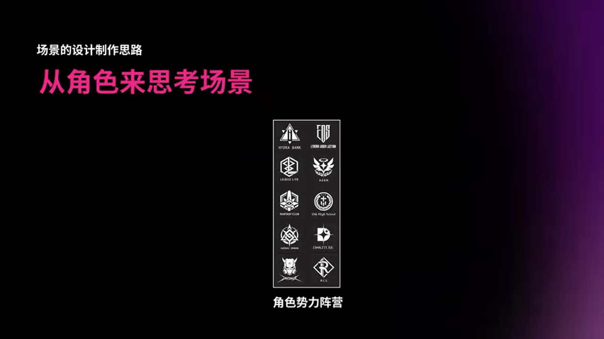
_Screenshot from 00:29:12_
---
## Section 596 (00:29:14)
**Transcript:**
> 我们考虑说我们每个观察体财会怎么定
**Visual Reference:**

_Screenshot from 00:29:14_
---
## Section 597 (00:29:17)
**Transcript:**
> 这个其实还是要回到我们英雄本身
**Visual Reference:**

_Screenshot from 00:29:17_
---
## Section 598 (00:29:20)
**Transcript:**
> 我们会去考虑说角色阵营场景
**Visual Reference:**

_Screenshot from 00:29:20_
---
## Section 599 (00:29:23)
**Transcript:**
> 以及就是世界观整体来思考
**Visual Reference:**

_Screenshot from 00:29:23_
---
## Section 600 (00:29:27)
**Transcript:**
> 游戏中其实我们还是有比较多的阵营
**Visual Reference:**

_Screenshot from 00:29:27_
---
## Section 601 (00:29:30)
**Transcript:**
> 这个是我们就摘取了一部分
**Visual Reference:**

_Screenshot from 00:29:30_
---
## Section 602 (00:29:33)
**Transcript:**
> 我们游戏里面阵营的一个势力投标
**Visual Reference:**

_Screenshot from 00:29:33_
---
## Section 603 (00:29:36)
**Transcript:**
> 每个阵营都有自己的特征
**Visual Reference:**

_Screenshot from 00:29:36_
---
## Section 604 (00:29:38)
**Transcript:**
> 以及他们的一些身份
**Visual Reference:**

_Screenshot from 00:29:38_
---
## Section 605 (00:29:40)
**Transcript:**
> 我们在做场景的时候
**Visual Reference:**

_Screenshot from 00:29:40_
---
## Section 606 (00:29:42)
**Transcript:**
> 尽量去会围绕它的一个指定的这个势力
**Visual Reference:**

_Screenshot from 00:29:42_
---
## Section 607 (00:29:45)
**Transcript:**
> 以及这个角色所在来可能这个场景去思考
**Visual Reference:**

_Screenshot from 00:29:45_
---
## Section 608 (00:29:51)
**Transcript:**
> 举个例子像这个势力是我们游戏里面的这个Doki势力
**Visual Reference:**

_Screenshot from 00:29:51_
---
## Section 609 (00:29:56)
**Transcript:**
> 它是定位是在是一个娱乐公司
**Visual Reference:**

_Screenshot from 00:29:56_
---
## Section 610 (00:29:59)
**Transcript:**
> 那里面有很多的漂亮小姐姐
**Visual Reference:**

_Screenshot from 00:29:59_
---
## Section 611 (00:30:03)
**Transcript:**
> 主打的就是角色的话都是偏女性项的
**Visual Reference:**

_Screenshot from 00:30:03_
---
## Section 612 (00:30:07)
**Transcript:**
> 那它里面也有很多偏中式体财设计的英雄
**Visual Reference:**

_Screenshot from 00:30:07_
---
## Section 613 (00:30:10)
**Transcript:**
> 所以我们就想它最好是出现在一个有心中式风格的
**Visual Reference:**

_Screenshot from 00:30:10_
---
## Section 614 (00:30:15)
**Transcript:**
> 然后有一点贵气感的场景
**Visual Reference:**

_Screenshot from 00:30:15_
---
## Section 615 (00:30:17)
**Transcript:**
> 所以继续这个我们做了一个这样的身材会馆
**Visual Reference:**

_Screenshot from 00:30:17_
---
## Section 616 (00:30:20)
**Transcript:**
> 那我们的一个一张结就是在这个场景里面进行不开的
**Visual Reference:**
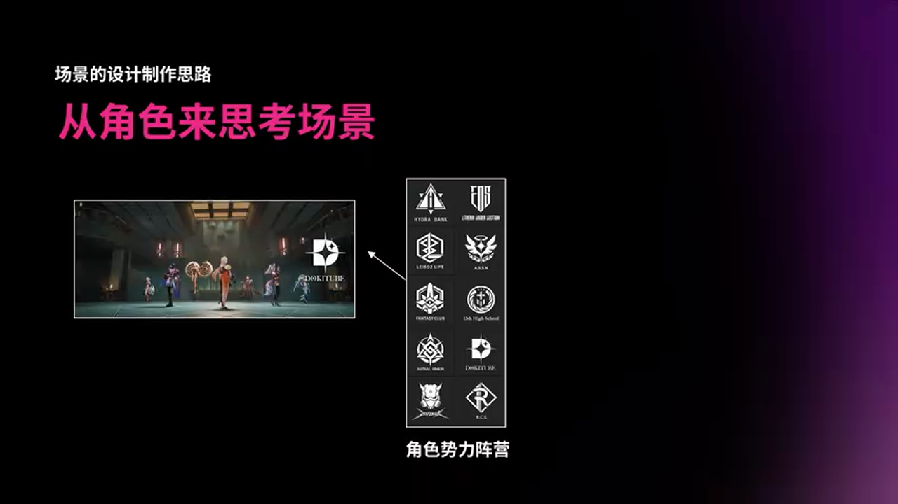
_Screenshot from 00:30:20_
---
## Section 617 (00:30:25)
**Transcript:**
> 那然后我们还会有一个势力是高校势力
**Visual Reference:**

_Screenshot from 00:30:25_
---
## Section 618 (00:30:30)
**Transcript:**
> 它是一个校园的势力
**Visual Reference:**

_Screenshot from 00:30:30_
---
## Section 619 (00:30:32)
**Transcript:**
> 我们考一个是一般学生除了学校会在哪里
**Visual Reference:**

_Screenshot from 00:30:32_
---
## Section 620 (00:30:36)
**Transcript:**
> 那这场行为会做什么
**Visual Reference:**

_Screenshot from 00:30:36_
---
## Section 621 (00:30:38)
**Transcript:**
> 所以我们做了一个这样的车站
**Visual Reference:**

_Screenshot from 00:30:38_
---
## Section 622 (00:30:40)
**Transcript:**
> 里面有一些年轻的元素
**Visual Reference:**
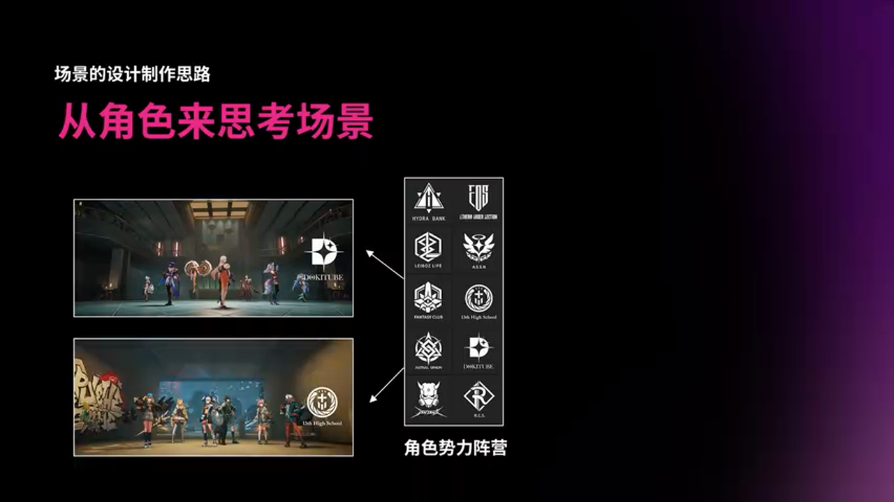
_Screenshot from 00:30:40_
---
## Section 623 (00:30:43)
**Transcript:**
> 包括会有一些图压
**Visual Reference:**

_Screenshot from 00:30:43_
---
## Section 624 (00:30:44)
**Transcript:**
> 更符合他们的这样的一个身份
**Visual Reference:**

_Screenshot from 00:30:44_
---
## Section 625 (00:30:47)
**Transcript:**
> 那我们游戏里面有主角团这样的一个设定
**Visual Reference:**

_Screenshot from 00:30:47_
---
## Section 626 (00:30:52)
**Transcript:**
> 它在游戏内和故事内
**Visual Reference:**

_Screenshot from 00:30:52_
---
## Section 627 (00:30:55)
**Transcript:**
> 它其实都有接任务的这样的一个包装
**Visual Reference:**

_Screenshot from 00:30:55_
---
## Section 628 (00:31:01)
**Transcript:**
> 它游戏里的话其实就是我们的超恋协会
**Visual Reference:**

_Screenshot from 00:31:01_
---
## Section 629 (00:31:05)
**Transcript:**
> 那在那个我们的游戏里的话就是我们的工会
**Visual Reference:**

_Screenshot from 00:31:05_
---
## Section 630 (00:31:09)
**Transcript:**
> 在我们世界观里面还是我们的超恋协会
**Visual Reference:**

_Screenshot from 00:31:09_
---
## Section 631 (00:31:12)
**Transcript:**
> 那我们在做这件事情上就想来
**Visual Reference:**

_Screenshot from 00:31:12_
---
## Section 632 (00:31:14)
**Transcript:**
> 它这应该是在一个可以接任我的大厅
**Visual Reference:**

_Screenshot from 00:31:14_
---
## Section 633 (00:31:16)
**Transcript:**
> 所以为了这个主角团我们设计了一个这样的一个超恋协会
**Visual Reference:**

_Screenshot from 00:31:16_
---
## Section 634 (00:31:19)
**Transcript:**
> 然后还有一个势力是支援接
**Visual Reference:**

_Screenshot from 00:31:19_
---
## Section 635 (00:31:23)
**Transcript:**
> 那它的整个一个感觉是会更黑暗一点
**Visual Reference:**
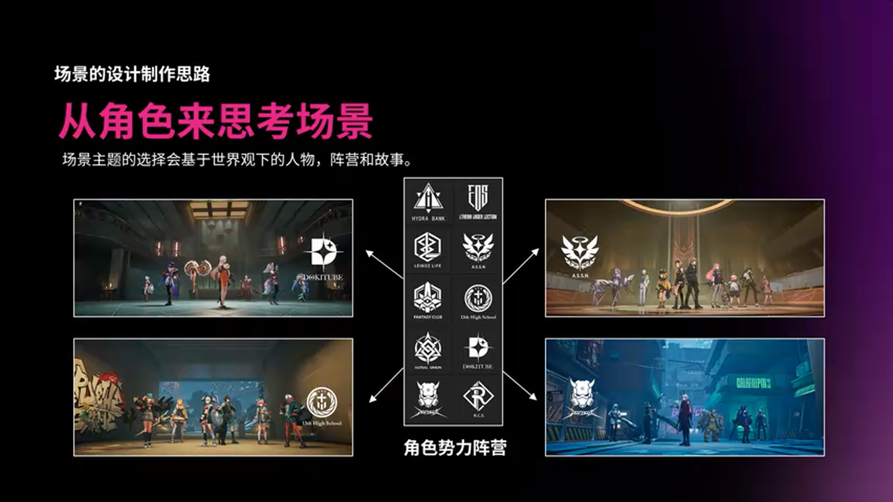
_Screenshot from 00:31:23_
---
## Section 636 (00:31:26)
**Transcript:**
> 这里面的人群会跟偏向是一些流轨黑包
**Visual Reference:**

_Screenshot from 00:31:26_
---
## Section 637 (00:31:30)
**Transcript:**
> 所以我们想到它必须是一个秩序相对混乱危险的街道
**Visual Reference:**

_Screenshot from 00:31:30_
---
## Section 638 (00:31:34)
**Transcript:**
> 所以我们整体在设计场景的时候
**Visual Reference:**

_Screenshot from 00:31:34_
---
## Section 639 (00:31:37)
**Transcript:**
> 会去考虑说我们这个阵营角色场景它们的联系
**Visual Reference:**

_Screenshot from 00:31:37_
---
## Section 640 (00:31:42)
**Transcript:**
> 一旦说就建立这种联系之后我们后续都故事也好
**Visual Reference:**

_Screenshot from 00:31:42_
---
## Section 641 (00:31:45)
**Transcript:**
> 做宣发也好其实都可以围绕这些来做
**Visual Reference:**

_Screenshot from 00:31:45_
---
## Section 642 (00:31:48)
**Transcript:**
> 而且会很好地展开
**Visual Reference:**

_Screenshot from 00:31:48_
---
## Section 643 (00:31:52)
**Transcript:**
> 那我们在训织上会去遵循哪些点
**Visual Reference:**
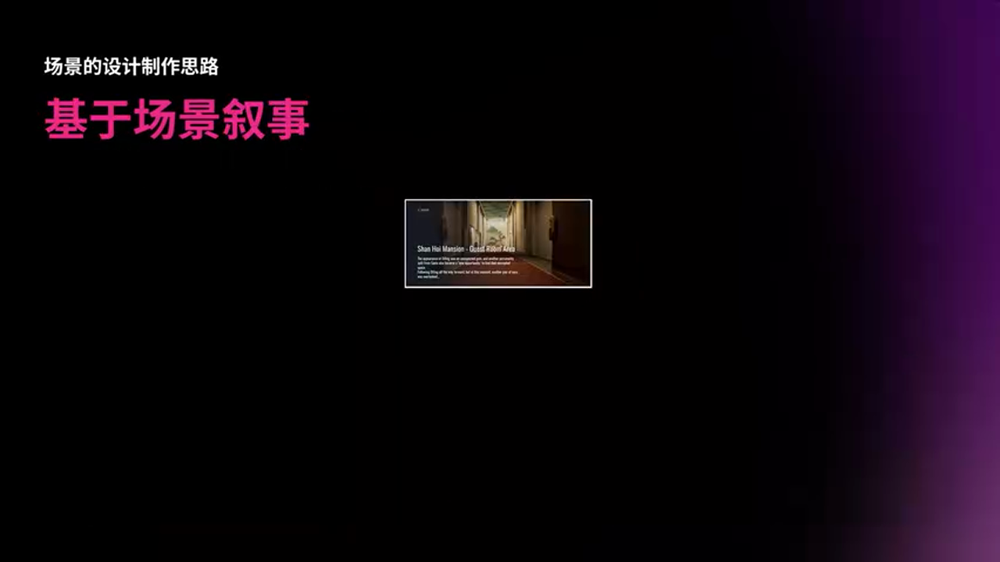
_Screenshot from 00:31:52_
---
## Section 644 (00:31:55)
**Transcript:**
> 就是我们会围绕定下的主题去做
**Visual Reference:**

_Screenshot from 00:31:55_
---
## Section 645 (00:31:57)
**Transcript:**
> 不会去做发散
**Visual Reference:**

_Screenshot from 00:31:57_
---
## Section 646 (00:31:58)
**Transcript:**
> 就如果我们拖立这个限制去写故事的话
**Visual Reference:**

_Screenshot from 00:31:58_
---
## Section 647 (00:32:01)
**Transcript:**
> 很可能会出现什么样的情况
**Visual Reference:**

_Screenshot from 00:32:01_
---
## Section 648 (00:32:02)
**Transcript:**
> 我们会在一个游戏观察里面
**Visual Reference:**

_Screenshot from 00:32:02_
---
## Section 649 (00:32:05)
**Transcript:**
> 去就说有这样的一个需求就很跨多个类型场景
**Visual Reference:**

_Screenshot from 00:32:05_
---
## Section 650 (00:32:09)
**Transcript:**
> 这样其实做场景的同学可能会苦不堪衣
**Visual Reference:**

_Screenshot from 00:32:09_
---
## Section 651 (00:32:12)
**Transcript:**
> 我们俊量要去避免
**Visual Reference:**

_Screenshot from 00:32:12_
---
## Section 652 (00:32:14)
**Transcript:**
> 就会一分钟的故事去新作一个场景这样的情况
**Visual Reference:**

_Screenshot from 00:32:14_
---
## Section 653 (00:32:18)
**Transcript:**
> 所以我们在做的时候
**Visual Reference:**

_Screenshot from 00:32:18_
---
## Section 654 (00:32:19)
**Transcript:**
> 经济上会去围绕我们已经定下的主题去去世
**Visual Reference:**

_Screenshot from 00:32:19_
---
## Section 655 (00:32:23)
**Transcript:**
> 然后场景在设计时候也会去考虑说
**Visual Reference:**

_Screenshot from 00:32:23_
---
## Section 656 (00:32:26)
**Transcript:**
> 我们需要监固各方面的需求
**Visual Reference:**

_Screenshot from 00:32:26_
---
## Section 657 (00:32:28)
**Transcript:**
> 需要有更好的扩展性
**Visual Reference:**

_Screenshot from 00:32:28_
---
## Section 658 (00:32:29)
**Transcript:**
> 以及它可以去体验游戏也可以讲故事
**Visual Reference:**

_Screenshot from 00:32:29_
---
## Section 659 (00:32:33)
**Transcript:**
> 所以这样的话我们可以保证后去一个主题
**Visual Reference:**

_Screenshot from 00:32:33_
---
## Section 660 (00:32:36)
**Transcript:**
> 在游戏里面或者在许使它的复用度是非常高的
**Visual Reference:**

_Screenshot from 00:32:36_
---
## Section 661 (00:32:41)
**Transcript:**
> 可以看比如说以我们做这个圣海会馆场景来讲的话
**Visual Reference:**

_Screenshot from 00:32:41_
---
## Section 662 (00:32:46)
**Transcript:**
> 其实我们的观察体验我们的实施剧情动化
**Visual Reference:**

_Screenshot from 00:32:46_
---
## Section 663 (00:32:49)
**Transcript:**
> 我们的剧情对话
**Visual Reference:**

_Screenshot from 00:32:49_
---
## Section 664 (00:32:52)
**Transcript:**
> 我们的角色故事PV以及我们的英雄展示
**Visual Reference:**
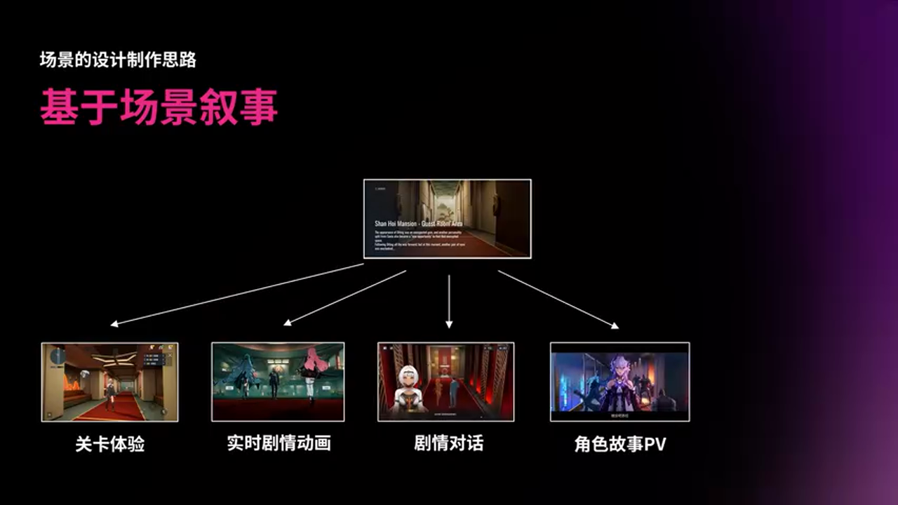
_Screenshot from 00:32:52_
---
## Section 665 (00:32:56)
**Transcript:**
> 都是围绕这个主题去做的
**Visual Reference:**
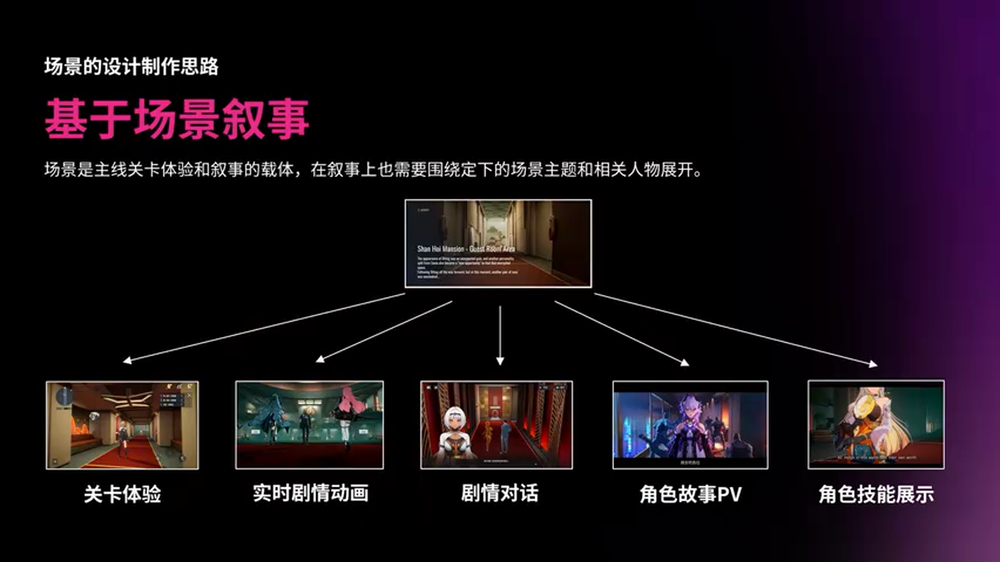
_Screenshot from 00:32:56_
---
## Section 666 (00:32:59)
**Transcript:**
> 我们可以重点说一下我们这个角色故事PV
**Visual Reference:**

_Screenshot from 00:32:59_
---
## Section 667 (00:33:01)
**Transcript:**
> 虽然它是一个理线选手帮案的一个案例
**Visual Reference:**

_Screenshot from 00:33:01_
---
## Section 668 (00:33:05)
**Transcript:**
> 它是在外部的一些合作伙伴一起做的
**Visual Reference:**

_Screenshot from 00:33:05_
---
## Section 669 (00:33:08)
**Transcript:**
> 但是当它跟我们去沟通的时候它也会问
**Visual Reference:**

_Screenshot from 00:33:08_
---
## Section 670 (00:33:12)
**Transcript:**
> 这样的故事发生在哪里
**Visual Reference:**

_Screenshot from 00:33:12_
---
## Section 671 (00:33:14)
**Transcript:**
> 如果你完全没有的话
**Visual Reference:**

_Screenshot from 00:33:14_
---
## Section 672 (00:33:16)
**Transcript:**
> 它人要从领导一设计
**Visual Reference:**

_Screenshot from 00:33:16_
---
## Section 673 (00:33:18)
**Transcript:**
> 那如果你已经是一个非常具体
**Visual Reference:**

_Screenshot from 00:33:18_
---
## Section 674 (00:33:20)
**Transcript:**
> 非常清晰的一个训示的一个基础的话
**Visual Reference:**

_Screenshot from 00:33:20_
---
## Section 675 (00:33:23)
**Transcript:**
> 有这样一个场景
**Visual Reference:**

_Screenshot from 00:33:23_
---
## Section 676 (00:33:25)
**Transcript:**
> 他们来讲他们也可以更高小的开始工作
**Visual Reference:**

_Screenshot from 00:33:25_
---
## Section 677 (00:33:32)
**Transcript:**
> 嗯
**Visual Reference:**

_Screenshot from 00:33:32_
---
## Section 678 (00:33:34)
**Transcript:**
> 在场景上我们在制作的时候
**Visual Reference:**

_Screenshot from 00:33:34_
---
## Section 679 (00:33:36)
**Transcript:**
> 其实会需要考虑说怎么去有效分配设计量
**Visual Reference:**

_Screenshot from 00:33:36_
---
## Section 680 (00:33:40)
**Transcript:**
> 这也是我们在提效以及我们这样小团队
**Visual Reference:**

_Screenshot from 00:33:40_
---
## Section 681 (00:33:43)
**Transcript:**
> 去做这么多资源量的时候最多去考虑的问题
**Visual Reference:**

_Screenshot from 00:33:43_
---
## Section 682 (00:33:47)
**Transcript:**
> 那在整个过程中
**Visual Reference:**
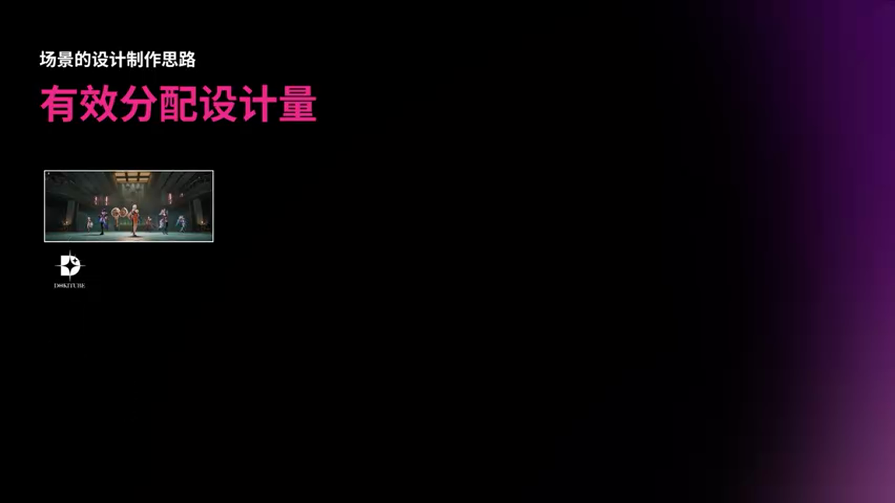
_Screenshot from 00:33:47_
---
## Section 683 (00:33:49)
**Transcript:**
> LA会在制作的这个过程承担更多的一个工作
**Visual Reference:**

_Screenshot from 00:33:49_
---
## Section 684 (00:33:54)
**Transcript:**
> 我们首先会去跟策划定下这个观卡纸面员型
**Visual Reference:**

_Screenshot from 00:33:54_
---
## Section 685 (00:33:58)
**Transcript:**
> 以及跟文案也好或者跟整个一个制作组织也好
**Visual Reference:**

_Screenshot from 00:33:58_
---
## Section 686 (00:34:01)
**Transcript:**
> 去定下我们会要做什么样的一个场景
**Visual Reference:**

_Screenshot from 00:34:01_
---
## Section 687 (00:34:04)
**Transcript:**
> 然后首先它并不是策划进去续去搭建
**Visual Reference:**

_Screenshot from 00:34:04_
---
## Section 688 (00:34:07)
**Transcript:**
> 而是LA去搭建白河
**Visual Reference:**

_Screenshot from 00:34:07_
---
## Section 689 (00:34:09)
**Transcript:**
> 这样的好处是什么
**Visual Reference:**

_Screenshot from 00:34:09_
---
## Section 690 (00:34:10)
**Transcript:**
> 就说LA搭建白河的话
**Visual Reference:**

_Screenshot from 00:34:10_
---
## Section 691 (00:34:12)
**Transcript:**
> 它可以避免很多视觉的不合理性
**Visual Reference:**

_Screenshot from 00:34:12_
---
## Section 692 (00:34:14)
**Transcript:**
> 缩短的观察
**Visual Reference:**

_Screenshot from 00:34:14_
---
## Section 693 (00:34:16)
**Transcript:**
> 观察白河到美术白河的一个整个一个验证周期
**Visual Reference:**

_Screenshot from 00:34:16_
---
## Section 694 (00:34:20)
**Transcript:**
> 所以并且我们在做前期的时候可以做一些灯光布纸
**Visual Reference:**

_Screenshot from 00:34:20_
---
## Section 695 (00:34:24)
**Transcript:**
> 让这个空间感以及我们想要去做的一些
**Visual Reference:**

_Screenshot from 00:34:24_
---
## Section 696 (00:34:27)
**Transcript:**
> 标志性建筑在一开始它就有一个比较高的一个落地的一个视觉呈现
**Visual Reference:**

_Screenshot from 00:34:27_
---
## Section 697 (00:34:34)
**Transcript:**
> 还有就是我们在做这个项目的时候
**Visual Reference:**

_Screenshot from 00:34:34_
---
## Section 698 (00:34:37)
**Transcript:**
> 其实我们的观察它并不是一个对于游戏性
**Visual Reference:**

_Screenshot from 00:34:37_
---
## Section 699 (00:34:41)
**Transcript:**
> 就观察在游戏性下面是容错率是一个比较低的一个观察
**Visual Reference:**

_Screenshot from 00:34:41_
---
## Section 700 (00:34:45)
**Transcript:**
> 就更多是观察承担续势
**Visual Reference:**

_Screenshot from 00:34:45_
---
## Section 701 (00:34:47)
**Transcript:**
> 所以美术来做这件事情可能比LED的话
**Visual Reference:**

_Screenshot from 00:34:47_
---
## Section 702 (00:34:50)
**Transcript:**
> 它可能会更直接一些
**Visual Reference:**

_Screenshot from 00:34:50_
---
## Section 703 (00:34:52)
**Transcript:**
> 所以我们会去采用这样的流程
**Visual Reference:**

_Screenshot from 00:34:52_
---
## Section 704 (00:34:55)
**Transcript:**
> 进行这样的一个观察搭建
**Visual Reference:**

_Screenshot from 00:34:55_
---
## Section 705 (00:34:58)
**Transcript:**
> 然后一个观察它的大大小有资产数量是很多的
**Visual Reference:**
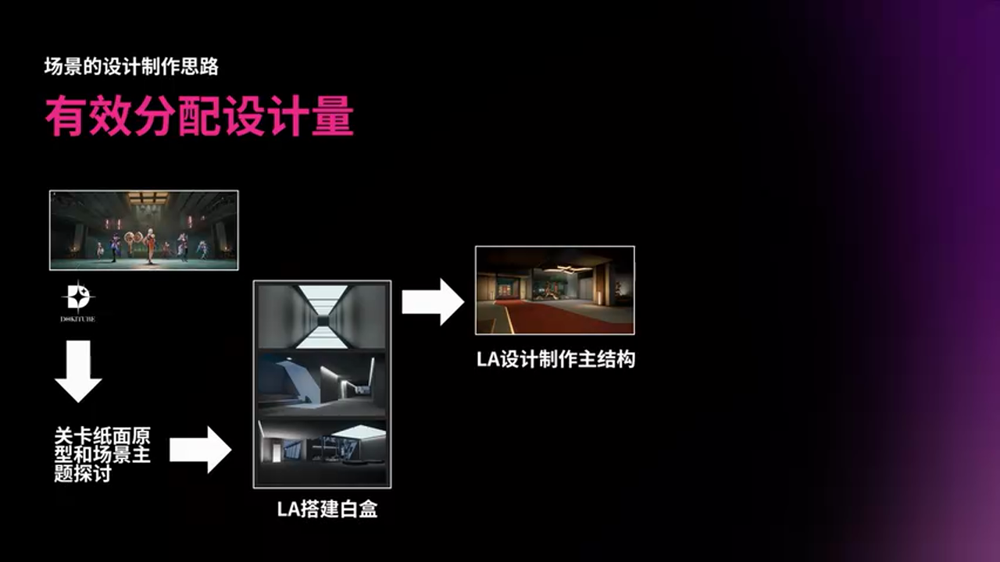
_Screenshot from 00:34:58_
---
## Section 706 (00:35:02)
**Transcript:**
> 所以我们需要把主体观察和通用资产特殊资产进行采分
**Visual Reference:**

_Screenshot from 00:35:02_
---
## Section 707 (00:35:09)
**Transcript:**
> 其实什么也好的LED的话
**Visual Reference:**
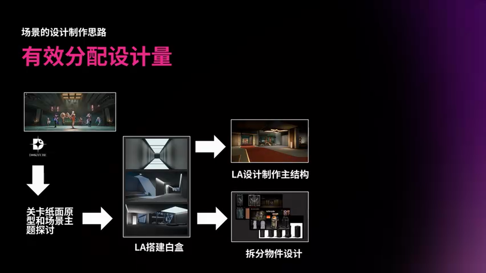
_Screenshot from 00:35:09_
---
## Section 708 (00:35:11)
**Transcript:**
> 它的整个一个视觉会更有格局会更大一些
**Visual Reference:**

_Screenshot from 00:35:11_
---
## Section 709 (00:35:15)
**Transcript:**
> 就视觉格局会更大一些
**Visual Reference:**

_Screenshot from 00:35:15_
---
## Section 710 (00:35:17)
**Transcript:**
> 它会看到很整体的东西
**Visual Reference:**

_Screenshot from 00:35:17_
---
## Section 711 (00:35:18)
**Transcript:**
> 那比如说像一些整体配色、灯光设计
**Visual Reference:**

_Screenshot from 00:35:18_
---
## Section 712 (00:35:22)
**Transcript:**
> 如果说要是它变成一个资源成绩的这样的一个体量去设计的话
**Visual Reference:**

_Screenshot from 00:35:22_
---
## Section 713 (00:35:27)
**Transcript:**
> 那到最后整合出来它就会变成一个非常灵散
**Visual Reference:**

_Screenshot from 00:35:27_
---
## Section 714 (00:35:31)
**Transcript:**
> 然后统一感不足
**Visual Reference:**

_Screenshot from 00:35:31_
---
## Section 715 (00:35:32)
**Transcript:**
> 而且它的设计量也比较大
**Visual Reference:**

_Screenshot from 00:35:32_
---
## Section 716 (00:35:35)
**Transcript:**
> 所以我们会专门让LH领导设计
**Visual Reference:**

_Screenshot from 00:35:35_
---
## Section 717 (00:35:38)
**Transcript:**
> 去做这个主体观察它的一个光影也好
**Visual Reference:**

_Screenshot from 00:35:38_
---
## Section 718 (00:35:42)
**Transcript:**
> 它的一个配色也好
**Visual Reference:**

_Screenshot from 00:35:42_
---
## Section 719 (00:35:43)
**Transcript:**
> 以及它可以实施去搭简三迹去验证
**Visual Reference:**

_Screenshot from 00:35:43_
---
## Section 720 (00:35:46)
**Transcript:**
> 这样的观察是不是能落地
**Visual Reference:**

_Screenshot from 00:35:46_
---
## Section 721 (00:35:49)
**Transcript:**
> 然后物件会去考虑说也把一些特殊的或者是同用的资产
**Visual Reference:**

_Screenshot from 00:35:49_
---
## Section 722 (00:35:54)
**Transcript:**
> 采分出来进行独立的设计
**Visual Reference:**

_Screenshot from 00:35:54_
---
## Section 723 (00:35:56)
**Transcript:**
> 这样的话可以有效的就是说减少我们在主体观察上面的设计量
**Visual Reference:**

_Screenshot from 00:35:56_
---
## Section 724 (00:36:02)
**Transcript:**
> 因为设计有一个问题就是并不是所有的设计它都能落地的
**Visual Reference:**

_Screenshot from 00:36:02_
---
## Section 725 (00:36:06)
**Transcript:**
> 如果在这个阶段如果有太多反复的话
**Visual Reference:**

_Screenshot from 00:36:06_
---
## Section 726 (00:36:09)
**Transcript:**
> 它最终影响的还是周期和成本
**Visual Reference:**

_Screenshot from 00:36:09_
---
## Section 727 (00:36:12)
**Transcript:**
> 那最后的话我们会把这两类主体资产和物件进行一个整合
**Visual Reference:**

_Screenshot from 00:36:12_
---
## Section 728 (00:36:18)
**Transcript:**
> 其实这个在整个过程中
**Visual Reference:**
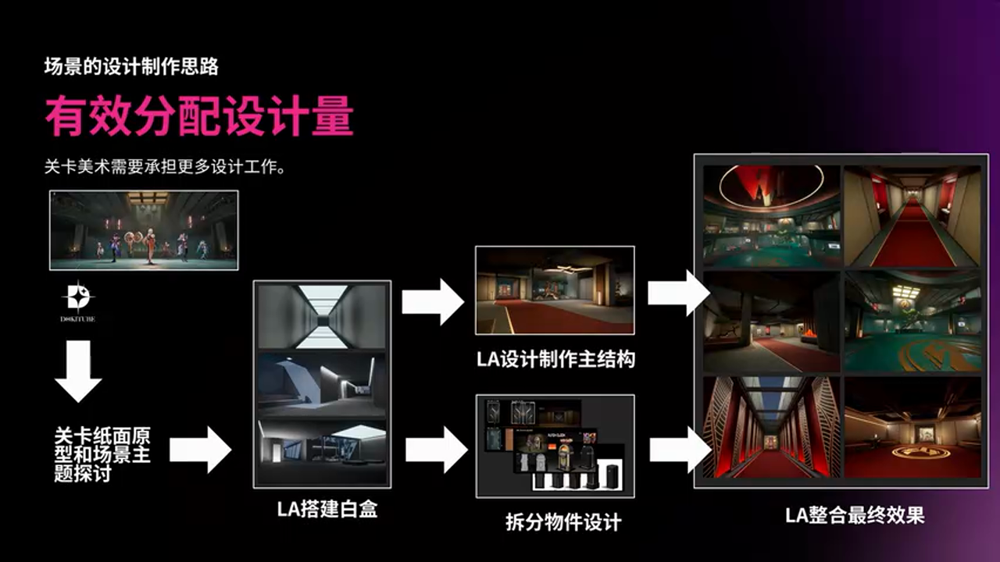
_Screenshot from 00:36:18_
---
## Section 729 (00:36:20)
**Transcript:**
> LA还是承担非常大的一个压力的
**Visual Reference:**

_Screenshot from 00:36:20_
---
## Section 730 (00:36:23)
**Transcript:**
> 从前期的设计到最后的整合
**Visual Reference:**

_Screenshot from 00:36:23_
---
## Section 731 (00:36:26)
**Transcript:**
> 我其实不只一次听到LA同学跟我说
**Visual Reference:**

_Screenshot from 00:36:26_
---
## Section 732 (00:36:29)
**Transcript:**
> 这活太难了 干不下去了
**Visual Reference:**

_Screenshot from 00:36:29_
---
## Section 733 (00:36:31)
**Transcript:**
> 但是不是也干起来
**Visual Reference:**

_Screenshot from 00:36:31_
---
## Section 734 (00:36:34)
**Transcript:**
> 所以就是我觉得在整个一个小团队里面
**Visual Reference:**

_Screenshot from 00:36:34_
---
## Section 735 (00:36:38)
**Transcript:**
> 有时候还是得逼一下
**Visual Reference:**

_Screenshot from 00:36:38_
---
## Section 736 (00:36:47)
**Transcript:**
> 还有就是一个思路
**Visual Reference:**

_Screenshot from 00:36:47_
---
## Section 737 (00:36:49)
**Transcript:**
> 思路的我觉得大家去做场景
**Visual Reference:**
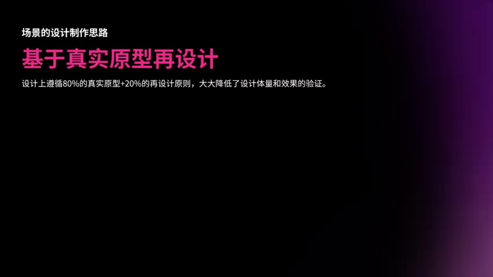
_Screenshot from 00:36:49_
---
## Section 738 (00:36:52)
**Transcript:**
> 其实可以考虑更多的一个点
**Visual Reference:**

_Screenshot from 00:36:52_
---
## Section 739 (00:36:53)
**Transcript:**
> 就是说现在我们在做这种大体量的场景
**Visual Reference:**

_Screenshot from 00:36:53_
---
## Section 740 (00:36:56)
**Transcript:**
> 它会进入一个我们的原型是取自哪里的问题
**Visual Reference:**

_Screenshot from 00:36:56_
---
## Section 741 (00:37:00)
**Transcript:**
> 我们在做设计的时候基本上设计上会遵循80%的真实原型家
**Visual Reference:**

_Screenshot from 00:37:00_
---
## Section 742 (00:37:04)
**Transcript:**
> 在设计原则
**Visual Reference:**
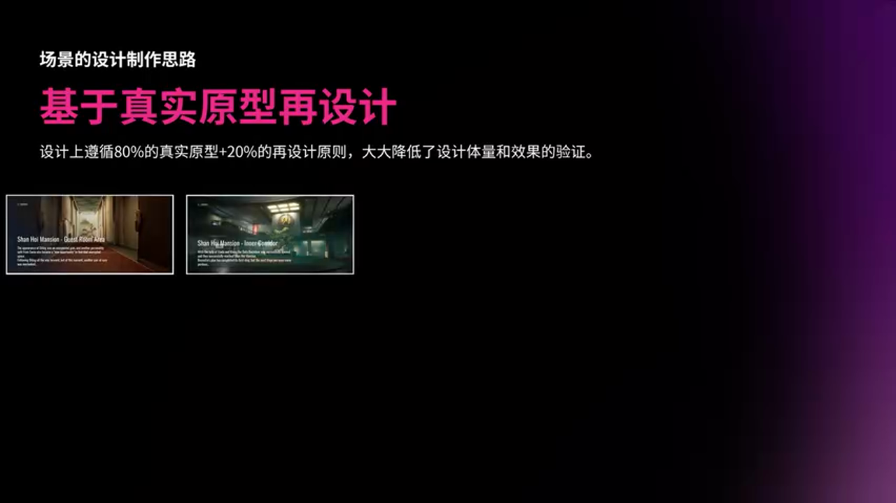
_Screenshot from 00:37:04_
---
## Section 743 (00:37:06)
**Transcript:**
> 这样也大大设计了一个我们的设计体量和效果的验证
**Visual Reference:**

_Screenshot from 00:37:06_
---
## Section 744 (00:37:10)
**Transcript:**
> 那我们在做主体原型上基本上会去选一些
**Visual Reference:**

_Screenshot from 00:37:10_
---
## Section 745 (00:37:13)
**Transcript:**
> 像现在都是这样的一个原型的体材去做
**Visual Reference:**

_Screenshot from 00:37:13_
---
## Section 746 (00:37:16)
**Transcript:**
> 这样的话就是我们前期对验证也好
**Visual Reference:**

_Screenshot from 00:37:16_
---
## Section 747 (00:37:19)
**Transcript:**
> 或者在讨论也好
**Visual Reference:**

_Screenshot from 00:37:19_
---
## Section 748 (00:37:20)
**Transcript:**
> 就不会花大量时间绕很远
**Visual Reference:**

_Screenshot from 00:37:20_
---
## Section 749 (00:37:22)
**Transcript:**
> 去做一些设计层面的一些探讨
**Visual Reference:**

_Screenshot from 00:37:22_
---
## Section 750 (00:37:25)
**Transcript:**
> 那我们继续这样的思路其实做了这个圣海会馆
**Visual Reference:**

_Screenshot from 00:37:25_
---
## Section 751 (00:37:28)
**Transcript:**
> 这是我们在游戏开始的时候做了第一个场景
**Visual Reference:**

_Screenshot from 00:37:28_
---
## Section 752 (00:37:32)
**Transcript:**
> 然后我们正式开始做的时候我们有许章
**Visual Reference:**

_Screenshot from 00:37:32_
---
## Section 753 (00:37:35)
**Transcript:**
> 然后它故事是在一个博物馆里面去到取一个芯片
**Visual Reference:**
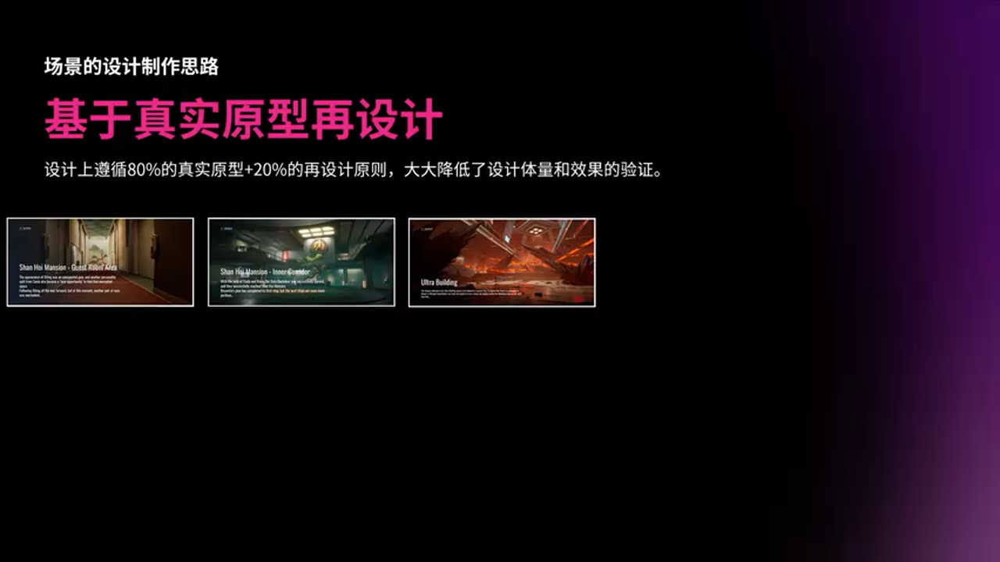
_Screenshot from 00:37:35_
---
## Section 754 (00:37:39)
**Transcript:**
> 那我们继续这样的需求去做了一个融断之后的一个这样的一个博物馆场景
**Visual Reference:**

_Screenshot from 00:37:39_
---
## Section 755 (00:37:45)
**Transcript:**
> 然后用这样的一个思路去做我们的第二关
**Visual Reference:**

_Screenshot from 00:37:45_
---
## Section 756 (00:37:48)
**Transcript:**
> 第二关因为刚也说过它是在一个车站是13去高小尸里发生的故事
**Visual Reference:**
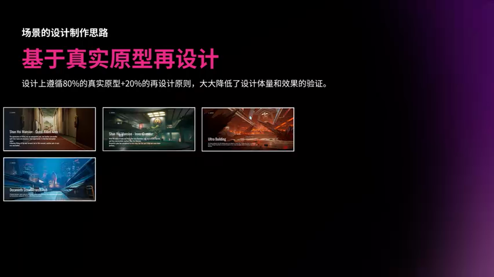
_Screenshot from 00:37:48_
---
## Section 757 (00:37:54)
**Transcript:**
> 所以我们首先想的是一个这样的一个车站会什么样
**Visual Reference:**

_Screenshot from 00:37:54_
---
## Section 758 (00:37:58)
**Transcript:**
> 然后继续这个我们去做了车站内以及站台
**Visual Reference:**

_Screenshot from 00:37:58_
---
## Section 759 (00:38:05)
**Transcript:**
> 最后的话可能需要一场Boss站
**Visual Reference:**

_Screenshot from 00:38:05_
---
## Section 760 (00:38:07)
**Transcript:**
> 那我们考虑说最好是有一些毁坏感
**Visual Reference:**

_Screenshot from 00:38:07_
---
## Section 761 (00:38:11)
**Transcript:**
> 所以继续这样我们去做了一个列车脱轨
**Visual Reference:**

_Screenshot from 00:38:11_
---
## Section 762 (00:38:14)
**Transcript:**
> 然后装在车站上这样的一个场景
**Visual Reference:**

_Screenshot from 00:38:14_
---
## Section 763 (00:38:16)
**Transcript:**
> 继续做了一个Boss站场景
**Visual Reference:**

_Screenshot from 00:38:16_
---
## Section 764 (00:38:18)
**Transcript:**
> 我们用这样的一个思路最后做了很多的场景
**Visual Reference:**

_Screenshot from 00:38:18_
---
## Section 765 (00:38:25)
**Transcript:**
> 这个就是一部分
**Visual Reference:**
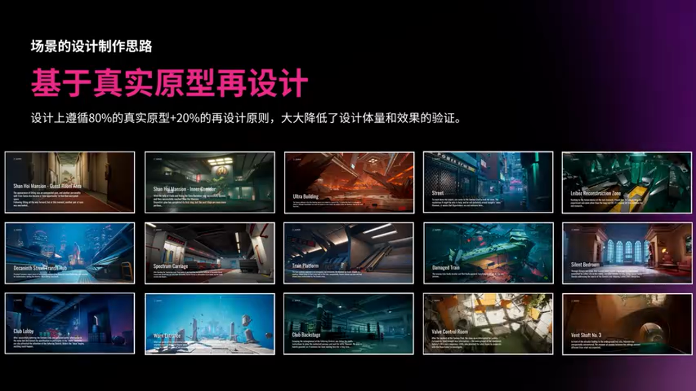
_Screenshot from 00:38:25_
---
## Section 766 (00:38:32)
**Transcript:**
> 最后聊聊一色
**Visual Reference:**
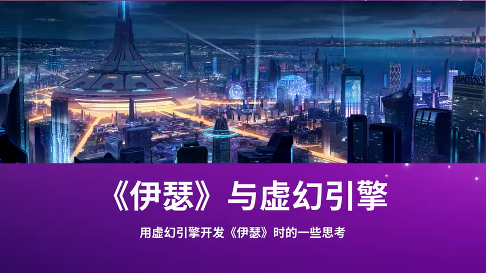
_Screenshot from 00:38:32_
---
## Section 767 (00:38:35)
**Transcript:**
> 就是我们在做一色的时候对于隐情层面的思考
**Visual Reference:**

_Screenshot from 00:38:35_
---
## Section 768 (00:38:40)
**Transcript:**
> 首先我们为什么会使用虚幻4不是虚幻5
**Visual Reference:**
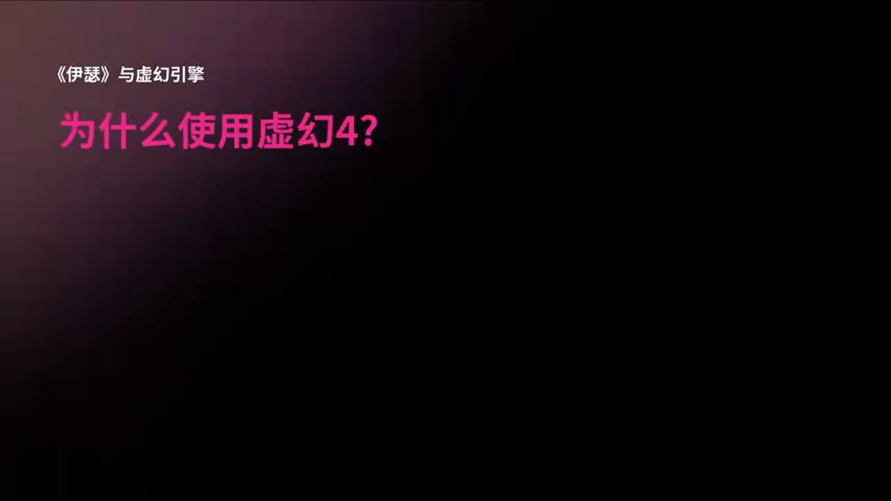
_Screenshot from 00:38:40_
---
## Section 769 (00:38:43)
**Transcript:**
> 甚至不是其他的隐情
**Visual Reference:**

_Screenshot from 00:38:43_
---
## Section 770 (00:38:45)
**Transcript:**
> 这个其实还是由比较多的因素的
**Visual Reference:**

_Screenshot from 00:38:45_
---
## Section 771 (00:38:49)
**Transcript:**
> 首先作为我们团队来讲它是一个比较复杂团队
**Visual Reference:**

_Screenshot from 00:38:49_
---
## Section 772 (00:38:54)
**Transcript:**
> 它是核心团队比较少的一部分人以前是有长期使用虚幻隐情的这样的一个经验
**Visual Reference:**

_Screenshot from 00:38:54_
---
## Section 773 (00:39:01)
**Transcript:**
> 然后80%的人可能之前做的是二地游戏
**Visual Reference:**

_Screenshot from 00:39:01_
---
## Section 774 (00:39:05)
**Transcript:**
> 在这样的基础上我们觉得就是首先我们还是希望团队十未来是可以做更高贵国的产品
**Visual Reference:**

_Screenshot from 00:39:05_
---
## Section 775 (00:39:12)
**Transcript:**
> 所以最后选择了喜欢死
**Visual Reference:**

_Screenshot from 00:39:12_
---
## Section 776 (00:39:14)
**Transcript:**
> 然后从虚幻4的工具链来讲的话它其实还是比较完整的
**Visual Reference:**

_Screenshot from 00:39:14_
---
## Section 777 (00:39:20)
**Transcript:**
> 想比一些其他的隐情需要开发更多的工具来满足一些研发测试求
**Visual Reference:**

_Screenshot from 00:39:20_
---
## Section 778 (00:39:27)
**Transcript:**
> 如果不用开发这个工具链
**Visual Reference:**

_Screenshot from 00:39:27_
---
## Section 779 (00:39:29)
**Transcript:**
> 它也就降低了我们在工作产面的开发工作
**Visual Reference:**

_Screenshot from 00:39:29_
---
## Section 780 (00:39:32)
**Transcript:**
> 然后就是大家在做这个项目的时候其实有时候会想
**Visual Reference:**

_Screenshot from 00:39:32_
---
## Section 781 (00:39:37)
**Transcript:**
> 我具这些feature做到什么样才能够它是一个效果的上限
**Visual Reference:**

_Screenshot from 00:39:37_
---
## Section 782 (00:39:42)
**Transcript:**
> 那唯一的话其实有大量的优秀的项目案例和一些自然案例
**Visual Reference:**

_Screenshot from 00:39:42_
---
## Section 783 (00:39:46)
**Transcript:**
> 让大家可以去学习就是一个比较接近的方式
**Visual Reference:**

_Screenshot from 00:39:46_
---
## Section 784 (00:39:51)
**Transcript:**
> 然后我们项目中其实还是有比较多的这些复合性人产
**Visual Reference:**

_Screenshot from 00:39:51_
---
## Section 785 (00:39:55)
**Transcript:**
> 他们会跟擅长用蓝图这样的工具去做一些原型的验证
**Visual Reference:**

_Screenshot from 00:39:55_
---
## Section 786 (00:40:01)
**Transcript:**
> 最后就是因为刚刚我们是也说过我们游戏里面
**Visual Reference:**

_Screenshot from 00:40:01_
---
## Section 787 (00:40:04)
**Transcript:**
> 其实有大量的这个动画过长以及输出的这种就是英雄的这种CG
**Visual Reference:**

_Screenshot from 00:40:04_
---
## Section 788 (00:40:10)
**Transcript:**
> 那如果用我们这样的就是一个项目的话
**Visual Reference:**

_Screenshot from 00:40:10_
---
## Section 789 (00:40:13)
**Transcript:**
> 用这种有意思这样的一个动画编辑工具它其实更适合
**Visual Reference:**

_Screenshot from 00:40:13_
---
## Section 790 (00:40:18)
**Transcript:**
> 其实我们做游戏内的动画和隐私化的动画之间转换
**Visual Reference:**

_Screenshot from 00:40:18_
---
## Section 791 (00:40:22)
**Transcript:**
> 而且它输出的这个品质也能达到我们这里风格的需求
**Visual Reference:**

_Screenshot from 00:40:22_
---
## Section 792 (00:40:27)
**Transcript:**
> 关于续换舞就是我们立向时候其实续换舞其实刚发布
**Visual Reference:**

_Screenshot from 00:40:27_
---
## Section 793 (00:40:31)
**Transcript:**
> 我们一方面的考虑我们其实是一个移动端的游戏
**Visual Reference:**

_Screenshot from 00:40:31_
---
## Section 794 (00:40:34)
**Transcript:**
> 续换丝完全够用了
**Visual Reference:**

_Screenshot from 00:40:34_
---
## Section 795 (00:40:36)
**Transcript:**
> 续换舞的这些新的P-QI其实就是用的话
**Visual Reference:**

_Screenshot from 00:40:36_
---
## Section 796 (00:40:38)
**Transcript:**
> 它可能也不太能在移动端去实现
**Visual Reference:**

_Screenshot from 00:40:38_
---
## Section 797 (00:40:40)
**Transcript:**
> 还有就是因为它的验证的项目案例还比较少
**Visual Reference:**

_Screenshot from 00:40:40_
---
## Section 798 (00:40:45)
**Transcript:**
> 所以团队来讲不想冒这个风险
**Visual Reference:**

_Screenshot from 00:40:45_
---
## Section 799 (00:40:49)
**Transcript:**
> 对这一点是我们考虑的也是一个工作量层面的一个问题
**Visual Reference:**

_Screenshot from 00:40:49_
---
## Section 800 (00:40:56)
**Transcript:**
> 就是我们到底什么样的平台去做开发
**Visual Reference:**

_Screenshot from 00:40:56_
---
## Section 801 (00:41:01)
**Transcript:**
> 就作为画质标准
**Visual Reference:**

_Screenshot from 00:41:01_
---
## Section 802 (00:41:03)
**Transcript:**
> 首先市面上有很多案例
**Visual Reference:**

_Screenshot from 00:41:03_
---
## Section 803 (00:41:05)
**Transcript:**
> 首先他们可能会用PC端的血染管线去做一套
**Visual Reference:**

_Screenshot from 00:41:05_
---
## Section 804 (00:41:09)
**Transcript:**
> 在PC上比较顶的话质
**Visual Reference:**

_Screenshot from 00:41:09_
---
## Section 805 (00:41:11)
**Transcript:**
> 然后移动端去做移动端的血染管线
**Visual Reference:**

_Screenshot from 00:41:11_
---
## Section 806 (00:41:14)
**Transcript:**
> 但是这样有一个问题
**Visual Reference:**

_Screenshot from 00:41:14_
---
## Section 807 (00:41:16)
**Transcript:**
> 就是其实手机端跟PC端它的画质会差异非常的大
**Visual Reference:**

_Screenshot from 00:41:16_
---
## Section 808 (00:41:20)
**Transcript:**
> 比如说你像如果你有U-5
**Visual Reference:**

_Screenshot from 00:41:20_
---
## Section 809 (00:41:22)
**Transcript:**
> 你PC上的炉梦也好或者像它的一些Turin也好
**Visual Reference:**

_Screenshot from 00:41:22_
---
## Section 810 (00:41:28)
**Transcript:**
> 就是在移动端你都会面临巨大的一个优化压力
**Visual Reference:**

_Screenshot from 00:41:28_
---
## Section 811 (00:41:32)
**Transcript:**
> 那你把这些都阴割之后
**Visual Reference:**

_Screenshot from 00:41:32_
---
## Section 812 (00:41:34)
**Transcript:**
> 其实手机端能看到这个画面基本上
**Visual Reference:**

_Screenshot from 00:41:34_
---
## Section 813 (00:41:36)
**Transcript:**
> 跟你一开始想承讯的画面风格
**Visual Reference:**

_Screenshot from 00:41:36_
---
## Section 814 (00:41:38)
**Transcript:**
> 其实偏差是比较大的
**Visual Reference:**

_Screenshot from 00:41:38_
---
## Section 815 (00:41:39)
**Transcript:**
> 还有一种思路就是
**Visual Reference:**

_Screenshot from 00:41:39_
---
## Section 816 (00:41:41)
**Transcript:**
> 基于移动端去做一个画质标准
**Visual Reference:**

_Screenshot from 00:41:41_
---
## Section 817 (00:41:46)
**Transcript:**
> 然后在PC端去可能做一些提升
**Visual Reference:**

_Screenshot from 00:41:46_
---
## Section 818 (00:41:50)
**Transcript:**
> 反向波厅
**Visual Reference:**

_Screenshot from 00:41:50_
---
## Section 819 (00:41:51)
**Transcript:**
> 这样的话就说它有个好处
**Visual Reference:**

_Screenshot from 00:41:51_
---
## Section 820 (00:41:54)
**Transcript:**
> 它至少保证了就是这个画质的下血
**Visual Reference:**

_Screenshot from 00:41:54_
---
## Section 821 (00:41:57)
**Transcript:**
> 它不会说你移动端的时候
**Visual Reference:**

_Screenshot from 00:41:57_
---
## Section 822 (00:42:00)
**Transcript:**
> 你发现很多的必须你没法用
**Visual Reference:**

_Screenshot from 00:42:00_
---
## Section 823 (00:42:02)
**Transcript:**
> 很多的效果你没法做
**Visual Reference:**

_Screenshot from 00:42:02_
---
## Section 824 (00:42:04)
**Transcript:**
> 最后你只能接受一个很妥协的这样的效果
**Visual Reference:**

_Screenshot from 00:42:04_
---
## Section 825 (00:42:07)
**Transcript:**
> 其实我们目前现在很多的产品
**Visual Reference:**

_Screenshot from 00:42:07_
---
## Section 826 (00:42:10)
**Transcript:**
> 它可能在这个阶段
**Visual Reference:**

_Screenshot from 00:42:10_
---
## Section 827 (00:42:13)
**Transcript:**
> 它更注重的是PC画质的开发
**Visual Reference:**

_Screenshot from 00:42:13_
---
## Section 828 (00:42:15)
**Transcript:**
> 无论是
**Visual Reference:**

_Screenshot from 00:42:15_
---
## Section 829 (00:42:16)
**Transcript:**
> 我就不具体说一些有效的项目了
**Visual Reference:**

_Screenshot from 00:42:16_
---
## Section 830 (00:42:19)
**Transcript:**
> 就大家去玩的时候就发现手机端那个画面
**Visual Reference:**

_Screenshot from 00:42:19_
---
## Section 831 (00:42:21)
**Transcript:**
> 无论是真数也好
**Visual Reference:**

_Screenshot from 00:42:21_
---
## Section 832 (00:42:22)
**Transcript:**
> 画质也好
**Visual Reference:**

_Screenshot from 00:42:22_
---
## Section 833 (00:42:23)
**Transcript:**
> 包括它的一些灯光也好
**Visual Reference:**

_Screenshot from 00:42:23_
---
## Section 834 (00:42:25)
**Transcript:**
> 就阴割的完全不行
**Visual Reference:**

_Screenshot from 00:42:25_
---
## Section 835 (00:42:27)
**Transcript:**
> 那对于我们项目来讲
**Visual Reference:**

_Screenshot from 00:42:27_
---
## Section 836 (00:42:28)
**Transcript:**
> 我们的手机的是我们的主要用户平台
**Visual Reference:**

_Screenshot from 00:42:28_
---
## Section 837 (00:42:31)
**Transcript:**
> 所以我们不希望用户玩到的是一个阴割后的效果
**Visual Reference:**

_Screenshot from 00:42:31_
---
## Section 838 (00:42:34)
**Transcript:**
> 所以最后选择了
**Visual Reference:**

_Screenshot from 00:42:34_
---
## Section 839 (00:42:36)
**Transcript:**
> 居于移动端开发
**Visual Reference:**

_Screenshot from 00:42:36_
---
## Section 840 (00:42:39)
**Transcript:**
> 然后PC上会去做一些效果提升这样的方式
**Visual Reference:**

_Screenshot from 00:42:39_
---
## Section 841 (00:42:42)
**Transcript:**
> 这样的话就说也大大降低了
**Visual Reference:**

_Screenshot from 00:42:42_
---
## Section 842 (00:42:45)
**Transcript:**
> 我们再后期的一个开发量
**Visual Reference:**

_Screenshot from 00:42:45_
---
## Section 843 (00:42:50)
**Transcript:**
> 我们每数遇到了挑战
**Visual Reference:**

_Screenshot from 00:42:50_
---
## Section 844 (00:42:51)
**Transcript:**
> 其实这个我今天感觉时间一点紧张
**Visual Reference:**

_Screenshot from 00:42:51_
---
## Section 845 (00:42:53)
**Transcript:**
> 就没法展开说了
**Visual Reference:**

_Screenshot from 00:42:53_
---
## Section 846 (00:42:55)
**Transcript:**
> 其实主要就是
**Visual Reference:**

_Screenshot from 00:42:55_
---
## Section 847 (00:42:57)
**Transcript:**
> 赛路谁的层面的一些挑战
**Visual Reference:**

_Screenshot from 00:42:57_
---
## Section 848 (00:42:59)
**Transcript:**
> 我们基本上这个在做开发的时候
**Visual Reference:**

_Screenshot from 00:42:59_
---
## Section 849 (00:43:02)
**Transcript:**
> 开发的时候发现我们整个一个项目
**Visual Reference:**

_Screenshot from 00:43:02_
---
## Section 850 (00:43:05)
**Transcript:**
> 在做案例参考的时候
**Visual Reference:**

_Screenshot from 00:43:05_
---
## Section 851 (00:43:08)
**Transcript:**
> 因为虚幻似的一个赛路做的比较好
**Visual Reference:**

_Screenshot from 00:43:08_
---
## Section 852 (00:43:11)
**Transcript:**
> 当时间只有装备和蓝色协议
**Visual Reference:**

_Screenshot from 00:43:11_
---
## Section 853 (00:43:13)
**Transcript:**
> 那居于这个标准我们去发现
**Visual Reference:**

_Screenshot from 00:43:13_
---
## Section 854 (00:43:15)
**Transcript:**
> 其实移动端基本上没有好的案例
**Visual Reference:**

_Screenshot from 00:43:15_
---
## Section 855 (00:43:18)
**Transcript:**
> 好的案例都是另外一家厂商的引擎做的
**Visual Reference:**

_Screenshot from 00:43:18_
---
## Section 856 (00:43:21)
**Transcript:**
> 那我们只能说我们去拆解他们的一些实现方案
**Visual Reference:**

_Screenshot from 00:43:21_
---
## Section 857 (00:43:25)
**Transcript:**
> 然后再U14去做一些还原
**Visual Reference:**

_Screenshot from 00:43:25_
---
## Section 858 (00:43:28)
**Transcript:**
> 但是其实虽然4路是一样
**Visual Reference:**

_Screenshot from 00:43:28_
---
## Section 859 (00:43:30)
**Transcript:**
> 但是有时候U14在做的时候
**Visual Reference:**

_Screenshot from 00:43:30_
---
## Section 860 (00:43:32)
**Transcript:**
> 其实做法是不太一样的
**Visual Reference:**

_Screenshot from 00:43:32_
---
## Section 861 (00:43:34)
**Transcript:**
> 甚至有些效果其实做起来会更难
**Visual Reference:**

_Screenshot from 00:43:34_
---
## Section 862 (00:43:37)
**Transcript:**
> 那我们在这个里面
**Visual Reference:**

_Screenshot from 00:43:37_
---
## Section 863 (00:43:39)
**Transcript:**
> 大概来来会会验证的大概有1、2年这样时间
**Visual Reference:**

_Screenshot from 00:43:39_
---
## Section 864 (00:43:43)
**Transcript:**
> 最后也是倒闭了选择一个现有的方案
**Visual Reference:**

_Screenshot from 00:43:43_
---
## Section 865 (00:43:46)
**Transcript:**
> 但好处就是我们在这个过程中
**Visual Reference:**

_Screenshot from 00:43:46_
---
## Section 866 (00:43:48)
**Transcript:**
> 我们也了解到了一些可能之前开发中
**Visual Reference:**

_Screenshot from 00:43:48_
---
## Section 867 (00:43:51)
**Transcript:**
> 没有遇到的点
**Visual Reference:**

_Screenshot from 00:43:51_
---
## Section 868 (00:43:52)
**Transcript:**
> 而且我们也用了一个比较确切的方式
**Visual Reference:**

_Screenshot from 00:43:52_
---
## Section 869 (00:43:56)
**Transcript:**
> 我们去做了一个
**Visual Reference:**

_Screenshot from 00:43:56_
---
## Section 870 (00:43:59)
**Transcript:**
> 怎么说呢
**Visual Reference:**

_Screenshot from 00:43:59_
---
## Section 871 (00:44:00)
**Transcript:**
> 就是其实是用色块的做法去做一些
**Visual Reference:**

_Screenshot from 00:44:00_
---
## Section 872 (00:44:03)
**Transcript:**
> Depth Color
**Visual Reference:**

_Screenshot from 00:44:03_
---
## Section 873 (00:44:04)
**Transcript:**
> 然后结合图案去做这样的好处
**Visual Reference:**

_Screenshot from 00:44:04_
---
## Section 874 (00:44:06)
**Transcript:**
> 就是我们可以用非常低的一个精度
**Visual Reference:**

_Screenshot from 00:44:06_
---
## Section 875 (00:44:09)
**Transcript:**
> 去达到一个因为赛路风格原因
**Visual Reference:**

_Screenshot from 00:44:09_
---
## Section 876 (00:44:11)
**Transcript:**
> 它其实它并不像传统是UV展开去画
**Visual Reference:**

_Screenshot from 00:44:11_
---
## Section 877 (00:44:14)
**Transcript:**
> 画贴图这样的这种模式
**Visual Reference:**

_Screenshot from 00:44:14_
---
## Section 878 (00:44:16)
**Transcript:**
> 它更多是色块和一些图案的拼接
**Visual Reference:**

_Screenshot from 00:44:16_
---
## Section 879 (00:44:18)
**Transcript:**
> 以及和二分光影的结合
**Visual Reference:**

_Screenshot from 00:44:18_
---
## Section 880 (00:44:20)
**Transcript:**
> 那我们这样做的话
**Visual Reference:**

_Screenshot from 00:44:20_
---
## Section 881 (00:44:21)
**Transcript:**
> 其实我们只要一张256的贴图
**Visual Reference:**

_Screenshot from 00:44:21_
---
## Section 882 (00:44:23)
**Transcript:**
> 就可以把我们基本上绝色所有色块的做完
**Visual Reference:**

_Screenshot from 00:44:23_
---
## Section 883 (00:44:26)
**Transcript:**
> 这样有好处就是
**Visual Reference:**

_Screenshot from 00:44:26_
---
## Section 884 (00:44:27)
**Transcript:**
> 因为我们是多英雄绝色
**Visual Reference:**

_Screenshot from 00:44:27_
---
## Section 885 (00:44:29)
**Transcript:**
> 它在绝色和绝色之间切换的时候
**Visual Reference:**

_Screenshot from 00:44:29_
---
## Section 886 (00:44:31)
**Transcript:**
> 它会需要有一个家载的问题
**Visual Reference:**

_Screenshot from 00:44:31_
---
## Section 887 (00:44:34)
**Transcript:**
> 那 Streaming 如果是常规的比如说
**Visual Reference:**

_Screenshot from 00:44:34_
---
## Section 888 (00:44:36)
**Transcript:**
> CK或者8K Streaming
**Visual Reference:**

_Screenshot from 00:44:36_
---
## Section 889 (00:44:38)
**Transcript:**
> 那它如果做到一个
**Visual Reference:**

_Screenshot from 00:44:38_
---
## Section 890 (00:44:40)
**Transcript:**
> Bus Streaming 强制加的
**Visual Reference:**

_Screenshot from 00:44:40_
---
## Section 891 (00:44:42)
**Transcript:**
> 它肯定会首先一动当然做不了的
**Visual Reference:**

_Screenshot from 00:44:42_
---
## Section 892 (00:44:45)
**Transcript:**
> 那如果要做这种的话
**Visual Reference:**

_Screenshot from 00:44:45_
---
## Section 893 (00:44:47)
**Transcript:**
> 就是觉得多的话就会可能低眼
**Visual Reference:**

_Screenshot from 00:44:47_
---
## Section 894 (00:44:49)
**Transcript:**
> 突然间它进来它就糊的
**Visual Reference:**

_Screenshot from 00:44:49_
---
## Section 895 (00:44:50)
**Transcript:**
> 那这种情况
**Visual Reference:**

_Screenshot from 00:44:50_
---
## Section 896 (00:44:51)
**Transcript:**
> 你绝色多了之后
**Visual Reference:**

_Screenshot from 00:44:51_
---
## Section 897 (00:44:52)
**Transcript:**
> 这种其实世界体验是比较差
**Visual Reference:**

_Screenshot from 00:44:52_
---
## Section 898 (00:44:53)
**Transcript:**
> 那像我们这样的方式
**Visual Reference:**

_Screenshot from 00:44:53_
---
## Section 899 (00:44:54)
**Transcript:**
> 它在切换的时候
**Visual Reference:**

_Screenshot from 00:44:54_
---
## Section 900 (00:44:55)
**Transcript:**
> 完全没有这样的问题
**Visual Reference:**

_Screenshot from 00:44:55_
---
## Section 901 (00:44:56)
**Transcript:**
> 但是它整个一个做法是比较公讲
**Visual Reference:**

_Screenshot from 00:44:56_
---
## Section 902 (00:44:59)
**Transcript:**
> 我觉得就说可能在
**Visual Reference:**

_Screenshot from 00:44:59_
---
## Section 903 (00:45:01)
**Transcript:**
> 把这个流程能跑通的情况下
**Visual Reference:**

_Screenshot from 00:45:01_
---
## Section 904 (00:45:03)
**Transcript:**
> 大部分以前的传统的这些团队
**Visual Reference:**

_Screenshot from 00:45:03_
---
## Section 905 (00:45:05)
**Transcript:**
> 做起来就比较累了
**Visual Reference:**

_Screenshot from 00:45:05_
---
## Section 906 (00:45:10)
**Transcript:**
> 基本上都讲完了
**Visual Reference:**
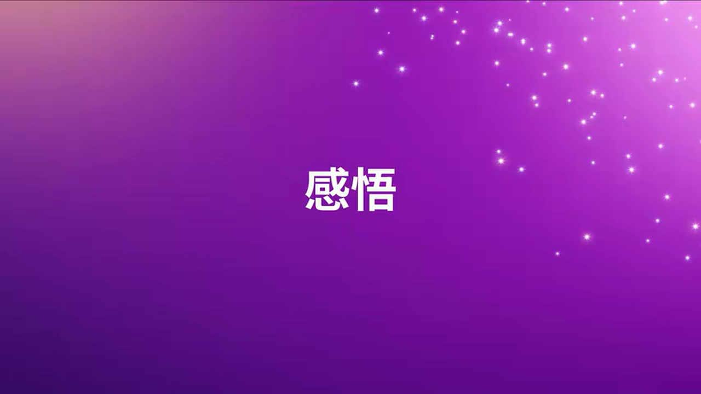
_Screenshot from 00:45:10_
---
## Section 907 (00:45:12)
**Transcript:**
> 主要是讲一下
**Visual Reference:**
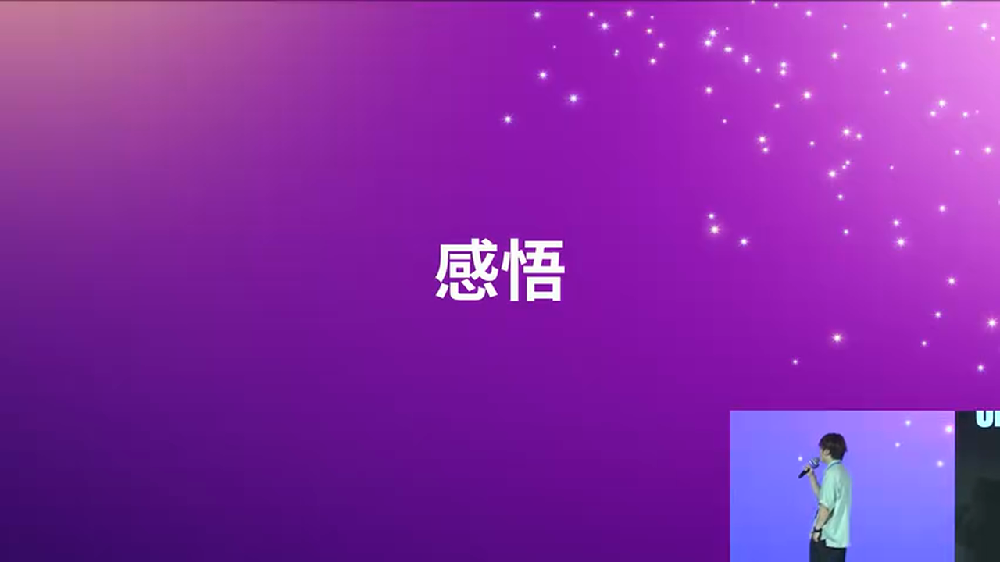
_Screenshot from 00:45:12_
---
## Section 908 (00:45:13)
**Transcript:**
> 做完这个产品的感悟
**Visual Reference:**

_Screenshot from 00:45:13_
---
## Section 909 (00:45:15)
**Transcript:**
> 我觉得现在产品美术太卷了
**Visual Reference:**

_Screenshot from 00:45:15_
---
## Section 910 (00:45:17)
**Transcript:**
> 其实我们刚开始做的时候
**Visual Reference:**

_Screenshot from 00:45:17_
---
## Section 911 (00:45:19)
**Transcript:**
> 我们觉得我们做得还挺好的
**Visual Reference:**

_Screenshot from 00:45:19_
---
## Section 912 (00:45:20)
**Transcript:**
> 但是可能做太久
**Visual Reference:**

_Screenshot from 00:45:20_
---
## Section 913 (00:45:21)
**Transcript:**
> 上的时候发现已经没有那么好的竞争力了
**Visual Reference:**

_Screenshot from 00:45:21_
---
## Section 914 (00:45:25)
**Transcript:**
> 然后就是技术也叠达得很快
**Visual Reference:**

_Screenshot from 00:45:25_
---
## Section 915 (00:45:28)
**Transcript:**
> 刚看的时候
**Visual Reference:**

_Screenshot from 00:45:28_
---
## Section 916 (00:45:30)
**Transcript:**
> 刚来是会场发现
**Visual Reference:**

_Screenshot from 00:45:30_
---
## Section 917 (00:45:31)
**Transcript:**
> 虚幻六这大大的logo在那里
**Visual Reference:**

_Screenshot from 00:45:31_
---
## Section 918 (00:45:33)
**Transcript:**
> 我都没有反应过来
**Visual Reference:**

_Screenshot from 00:45:33_
---
## Section 919 (00:45:35)
**Transcript:**
> 然后就是玩家层面其实越来越高了
**Visual Reference:**

_Screenshot from 00:45:35_
---
## Section 920 (00:45:38)
**Transcript:**
> 其实大家对于游戏和技术理解会越来越深
**Visual Reference:**

_Screenshot from 00:45:38_
---
## Section 921 (00:45:41)
**Transcript:**
> 以前可能玩家对于游戏它可能
**Visual Reference:**

_Screenshot from 00:45:41_
---
## Section 922 (00:45:43)
**Transcript:**
> 更多指挥说好玩不好玩
**Visual Reference:**

_Screenshot from 00:45:43_
---
## Section 923 (00:45:45)
**Transcript:**
> 现在你在各种论坛上面都发现
**Visual Reference:**

_Screenshot from 00:45:45_
---
## Section 924 (00:45:47)
**Transcript:**
> 玩家它的评论也好
**Visual Reference:**

_Screenshot from 00:45:47_
---
## Section 925 (00:45:49)
**Transcript:**
> 它的一些对你的一些批评也好
**Visual Reference:**

_Screenshot from 00:45:49_
---
## Section 926 (00:45:51)
**Transcript:**
> 挺专业的
**Visual Reference:**

_Screenshot from 00:45:51_
---
## Section 927 (00:45:52)
**Transcript:**
> 就是对于用户来讲
**Visual Reference:**

_Screenshot from 00:45:52_
---
## Section 928 (00:45:54)
**Transcript:**
> 它已经是一个不像以前那么小白了
**Visual Reference:**

_Screenshot from 00:45:54_
---
## Section 929 (00:45:56)
**Transcript:**
> 对我们开发的角来讲可能更多需要提升自己
**Visual Reference:**

_Screenshot from 00:45:56_
---
## Section 930 (00:45:59)
**Transcript:**
> 但是这么多的一些就说变化的话
**Visual Reference:**

_Screenshot from 00:45:59_
---
## Section 931 (00:46:02)
**Transcript:**
> 我觉得其实最重要的需要卷完法
**Visual Reference:**

_Screenshot from 00:46:02_
---
## Section 932 (00:46:05)
**Transcript:**
> 因为只有好的玩法才能成展更好的技术
**Visual Reference:**

_Screenshot from 00:46:05_
---
## Section 933 (00:46:08)
**Transcript:**
> 和更好的美术
**Visual Reference:**

_Screenshot from 00:46:08_
---
## Section 934 (00:46:09)
**Transcript:**
> 留住玩家
**Visual Reference:**

_Screenshot from 00:46:09_
---
## Section 935 (00:46:11)
**Transcript:**
> 我的分享结束了
**Visual Reference:**

_Screenshot from 00:46:11_
---
## Summary
This article contains 935 sections of content extracted from the original video, each accompanied by visual references. The combination of transcript and screenshots provides a comprehensive reference for the video content.
---
**Note:** This is an auto-generated article. For the full video experience, refer to the original source.
```
现在请直接生成完整的中文文章，按照上述要求一次性生成全部内容，不要分段生成，不要使用代码块，直接输出完整的 Markdown 格式文章：