# 《漫威争锋》战斗系统架构实战：从GAS框架到客户端预测的完整落地方案

---

## 加入 UE5 技术交流群
如果您对虚幻引擎5的图形渲染技术感兴趣,欢迎加入我们的 **UE5 技术交流群**！
扫描上方二维码添加个人微信 **wlxklyh**,备注"UE5技术交流",我会拉您进群。
在技术交流群中,您可以:
- 与其他UE开发者交流渲染技术经验
- 获取最新的GDC技术分享和解读
- 讨论图形编程、性能优化、构建工具流、动画系统等话题
- 分享引擎架构、基建工具等项目经验和技术难题
---

**源视频信息:** [UFSH2025]《漫威争锋》基于GAS的多人战斗框架开发分享 | 钟志华网易游戏 技术专家

**视频链接:** https://www.bilibili.com/video/BV1VgWJzDEM8

**本文由AI辅助生成,内容来源于视频演讲**

---

> **核心要点**
> - 《漫威争锋》是一款6v6超级英雄团队对战游戏,基于UE5和GAS框架构建了完整的多人战斗系统
> - 通过模块化设计实现了传送门、万磁王磁场、美队盾牌反弹等复杂技能机制
> - 采用分层检测管线、生成管线和战斗数据管线等设计模式,支持多样化的玩法模式
> - 实现了完整的客户端预测系统,在200ms延迟下仍能保持流畅的战斗手感

**阅读本文需要的前置知识:** 虚幻引擎5基础、Gameplay Ability System (GAS)、多人游戏网络同步

## 一、《漫威争锋》游戏特性与技术挑战

### 1.1 游戏核心定位

《漫威争锋》是网易游戏开发的一款6v6第三人称超级英雄团队对战游戏,其核心设计理念聚焦于以下几个方面:


- **超级英雄体验还原**: 游戏的首要目标是还原漫威IP中超级英雄的独特能力和战斗风格
- **团队协作机制**: 强调英雄之间的配合与联动,而非单纯的个人表现
- **丰富的战斗机制**: 包含复杂的技能系统、环境交互和战场动态变化
- **快节奏高对抗**: 游戏节奏快,竞技性强,对技术实现提出了极高要求

### 1.2 典型技术挑战案例

在《漫威争锋》的开发过程中,团队面临了多个极具挑战性的技能机制实现,以下三个案例最具代表性:

#### **案例一: 奇异博士传送门**

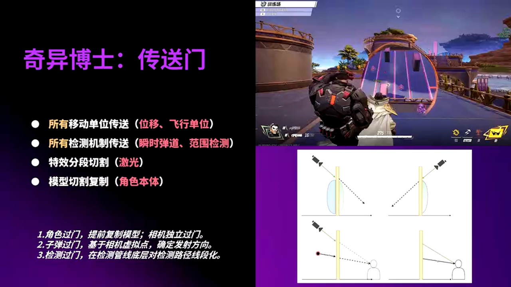

传送门是游戏中最复杂的技能之一,可以称之为"一套方案"。从核心功能来看,传送门需要涵盖整个战斗框架的方方面面:

- **角色传送**: 所有玩家角色都可以通过传送门进行位置转移
- **角色复制**: 在传送过程中需要处理角色的视觉呈现
- **相机处理**: 相机穿过传送门时需要特殊的视角转换逻辑
- **弹道系统**: 子弹、技能弹道都需要能够穿过传送门
- **检测管线**: 所有战斗检测(即时和延迟)都要支持传送门穿越
- **特效表现**: 激光类特效和普通特效都需要正确地通过传送门呈现

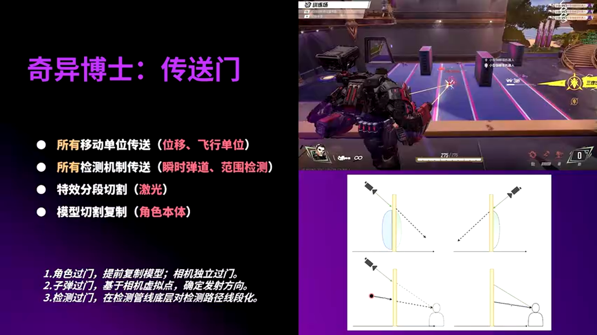

从技术实现角度,传送门系统贯穿了整个战斗框架,涉及的关键技术点包括:

- 角色过门的位置计算和状态同步
- 相机穿越时的视角变换矩阵
- 射线检测的分段化处理
- 检测管线的全面改造以支持空间扭曲

这套系统不仅要在技术上可行,更要在玩家体验上提供"真正穿越时空"的沉浸感,这也是《漫威争锋》游戏的核心主题之一。

#### **案例二: 万磁王磁场吸收**


万磁王在漫威IP中以掌控金属元素而闻名,在游戏中需要还原其吸收战场所有飞行弹道和瞬时弹道的能力。从视频演示可以看到,即使是惩罚者这样的枪械角色,其所有子弹都会被万磁王的磁场吸收。

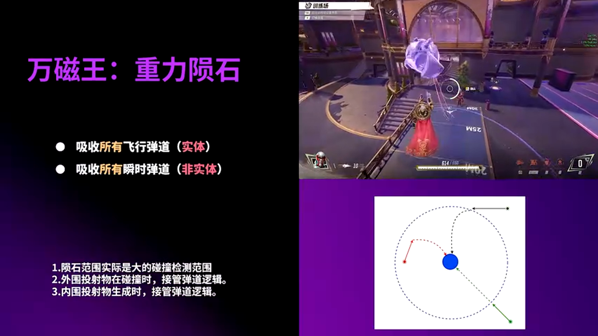

从实现角度,这个技能机制需要考虑:

- **内圈逻辑**: 从框架层面接管所有弹道逻辑的生命周期
- **外圈逻辑**: 在碰撞检测层面进行拦截处理
- **弹道重定向**: 吸收后的弹道需要重新计算运动轨迹

这个技能在战场上能够实现极强的控场效果,对团队战术有重大影响。

#### **案例三: 美国队长盾牌反弹**

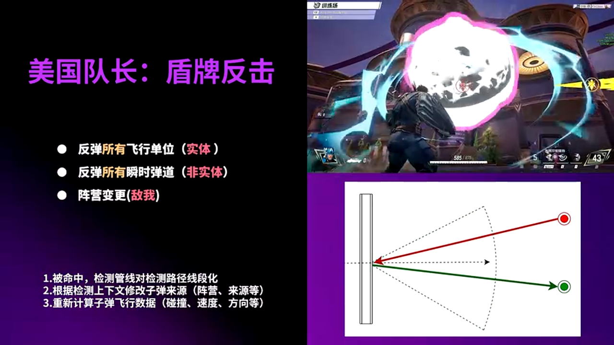

美国队长的标志性盾牌在游戏中需要能够反弹所有飞行单位和弹道。从视频中可以看到,盾牌甚至能够反弹钢铁侠的大招,实现对战控制。


盾牌反弹的核心实现依赖于:

- **检测管线处理**: 对底层检测管线进行分段化改造
- **线段分割**: 将检测的简单线段进行分段处理
- **数据重计算**: 重新计算弹道的飞行数据、碰撞信息以及阵营归属

在反弹过程中,最关键的技术点是**阵营转换** —— 被反弹的弹道需要改变其所属阵营,从敌方变为友方,这涉及到战斗系统中阵营判定逻辑的全面改造。

### 1.3 更多技术实现案例


除了上述三个典型案例,《漫威争锋》还实现了众多复杂的英雄机制:

- **变身系统**: 浩克、魔形女等角色拥有完整的变身体系,需要完美还原漫威角色的个性和风格
- **移动系统**: 蜘蛛侠的飞檐走壁、爬墙等独特移动方式
- **多段技能**: 二段跳、飞行等复杂的移动控制


这些丰富多样的技能机制,都需要一套强大且灵活的战斗框架作为支撑。

## 二、基于GAS的战斗框架核心架构

### 2.1 GAS四大核心模块

《漫威争锋》的战斗框架基于虚幻引擎的 **Gameplay Ability System (GAS)** 构建,充分利用了GAS提供的四个核心模块:

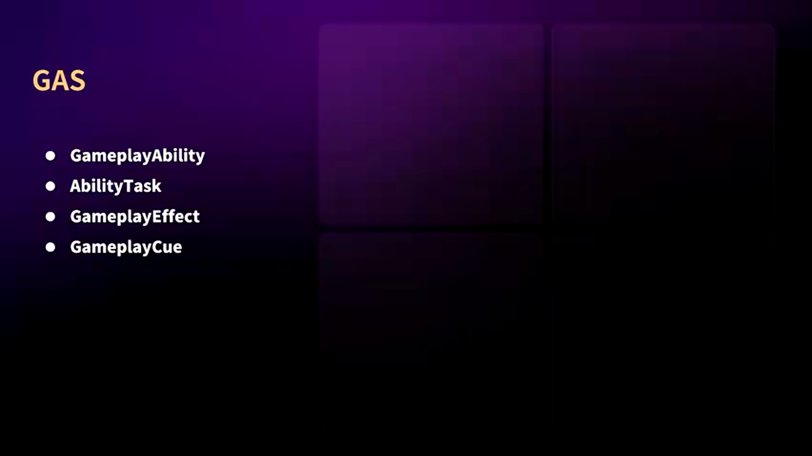

从结构上看,这四个模块贯穿了整个游戏机制的全流程:

**1. Ability (技能逻辑)**

Ability模块负责处理技能的核心逻辑,包括:
- 技能冷却 (Cooldown)
- 技能激活条件判断
- 技能执行流程控制

**2. Task (技能行为)**

Task更多的是战场技能的具体行为表现,定义了技能在执行过程中的各种动作和状态变化。

**3. Effect (Buff/属性修改)**


Effect类似于传统竞技游戏中的Buff系统,主要负责:
- 属性修改 (加减乘除运算)
- 状态关系管理
- 持续性效果控制

**4. Cue (视听表现)**

Cue代表了整个技能的视听表现,包括:
- 特效播放
- 材质变化
- 音效呈现

### 2.2 技能执行流程示例

以刀锋的一个简单技能为例,展示完整的GAS执行流程:


1. **技能激活** (Ability层): 判断技能是否可以使用
2. **播放动作** (Task层): 执行技能的动画表现
3. **检测目标** (Task层): 进行命中检测
4. **作用伤害** (Effect层): 通过Effect对目标造成伤害
5. **播放表现** (Cue层): 在Cue模块播放命中特效

这个流程与UE的四个模块完全对应,形成了清晰的技术分层。

### 2.3 GAS之外的拓展系统

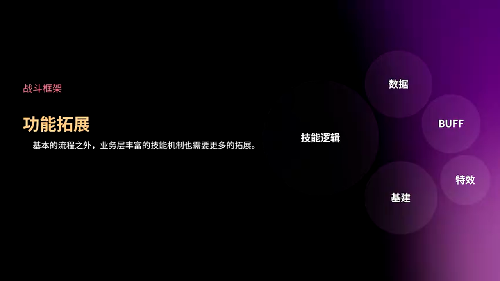

虽然GAS提供了强大的基础能力,但要支撑《漫威争锋》复杂的技能需求,还需要大量的业务层拓展。团队在以下几个方面进行了深度定制:

- 数据配置系统
- 技能逻辑扩展
- 表现系统优化
- 基建模块开发

接下来将详细介绍这些拓展模块的设计思路和实现细节。

## 三、数据配置系统的分层设计

### 3.1 技能配置的三态拆分

在传统游戏开发中,技能配置通常采用"一张技能表"的方式。但在《漫威争锋》中,由于每个英雄的技能差异极大,传统的表格配置无法满足需求。

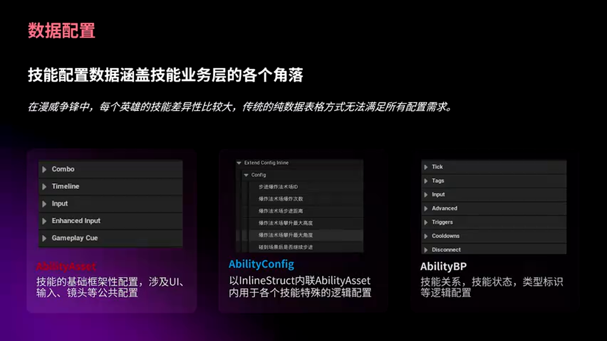

团队将一个技能拆分为**三个配置态**,充分利用了UE提供的资源类型系统:

**配置态一: AbilitySet (基础框架配置)**

负责技能的框架性配置,包括:
- UI相关配置
- 技能镜头表现
- 通用框架参数

**配置态二: AbilityConfig (技能特殊配置)**

每个技能都有自己独特的配置需求。例如:
- 钢铁侠的飞行系统配置
- 刀锋的普通攻击配置

这两者的差异极大,因此需要独立的配置结构来承载。

**配置态三: AbilityPriority (技能关系配置)**

由于技能之间存在大量交互关系,需要专门的配置来管理:
- 打断关系
- CD(冷却时间)关系
- 优先级设定

这种三态拆分的设计,使得配置既保持了一致性,又提供了足够的灵活性来应对复杂的业务需求。

### 3.2 AbilityTask的深度扩展

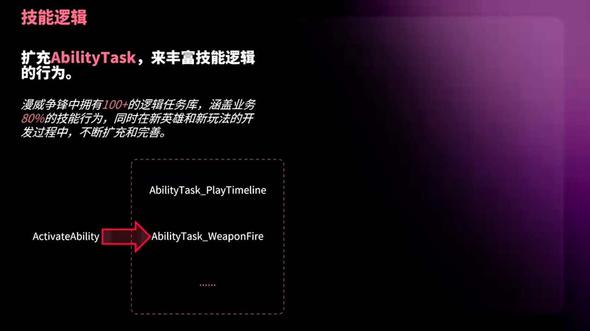

UE的GAS提供了AbilityTask这个强大的概念,《漫威争锋》团队充分利用了这一机制来扩展技能行为。

从技能执行流程来看:

1. **技能激活**
2. **播放行为** (这个行为可能非常复杂)

技能行为可能包括:
- Timeline时间轴动画
- 枪线射击逻辑
- 冲刺移动
- 各种技能机制


团队通过不断扩充AbilityTask库,使得技能开发变得更加模块化和可复用。所有战斗机制都尽可能地使用AbilityTask来实现,保持了代码的一致性和可维护性。

### 3.3 技能模板系统


当游戏拥有几十个英雄、几百个技能时,如果每个技能都通过Task组装来实现,开发效率会非常低下。因此团队在AbilityTask之上又构建了**技能模板系统**。

核心目标是对一些共性的技能流程进行**标准化**。例如:

**枪线类技能模板**

游戏中有多个英雄使用枪械,其标准化流程包括:
1. 播放时间轴动画
2. 发射弹道
3. 命中判定


其他标准化的技能模板还包括:
- 二段跳模板
- 飞行模板
- 变身模板

通过模板系统,未来新英雄的开发可以快速复用已有的技能流程,大幅提升开发效率。

> **方案对比: 逐个配置 vs 模板系统**
>
> **方案A: 逐个配置Task**
> - 🟢 优势: 灵活性高,每个技能都可以完全定制
> - 🔴 劣势: 开发效率低,维护成本高,容易出现不一致
> - 🎯 适用场景: 完全独特的技能,如传送门、磁场吸收
>
> **方案B: 技能模板系统**
> - 🟢 优势: 开发效率高,代码复用性强,一致性好
> - 🔴 劣势: 灵活性受限,需要良好的模板设计
> - 🎯 适用场景: 有共性的技能类型,如枪械、移动、变身

## 四、技能时间轴系统 (Timeline)

### 4.1 Timeline与动画蒙太奇的区别


在《漫威争锋》中,团队实现了一个专门的**Timeline系统**来描述技能的执行过程。虽然它看起来和UE的动画蒙太奇 (Animation Montage) 很相似,但它们实际上是**配合使用**的不同系统。

Timeline的核心职责:

- 描述技能的阶段划分 (前摇、生效、后摇)
- 控制技能的时间流
- 触发关键帧事件

在技能执行过程中,Timeline会同步地配合动画系统一起工作,但它们承担的是不同的职责:

- **Timeline**: 控制**逻辑流程**和**时间节点**
- **Animation Montage**: 控制**动画播放**和**骨骼动画混合**

这种分离设计使得技能逻辑和表现层能够独立开发和调试,同时也为后续的网络同步和客户端预测提供了便利。

### 4.2 Timeline在技能中的应用

Timeline系统为技能设计师提供了直观的时间轴编辑能力,可以精确控制:

- 技能各阶段的持续时间
- 伤害判定的精确时机
- 特效播放的时间点
- 音效触发的节点

这套系统在后续的预测系统中也发挥了重要作用,因为它提供了清晰的技能状态节点,便于客户端进行预测和回滚。

## 五、Buff系统的三层架构

### 5.1 为什么需要三层结构

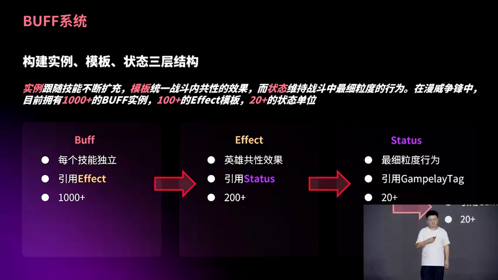

在竞技游戏中,Buff系统是不可或缺的核心机制。《漫威争锋》基于GAS的Effect系统,构建了一个**三层架构**的Buff体系。

为什么需要这样的设计?主要是因为:

1. 每个英雄的技能都不一样,很多独特状态都需要用Buff来表达
2. 如果所有东西都用Effect,Effect的数量会爆炸性增长
3. Effect的配置非常复杂,不适合作为最细粒度的状态管理单元

因此团队设计了这样的三层结构:

**第一层: Effect (战场共性元素)**

Effect更多地表达战场的共性元素,例如:
- 正面状态类型 / 负面状态类型
- 属性修改方式 (加、减、乘、除)
- 状态之间的互斥关系

**第二层: Buff (实体状态)**

Buff作为实体,引用Effect的共性元素。例如女巫的"虚无"状态:


- Effect定义了"虚无"这个共性效果
- "虚无"背后有很多系统行为,如"不可选取"
- 具体的英雄技能通过Buff来实例化这些效果

**第三层: CDR (细粒度状态)**

CDR (Condition, Disable, Restrict) 代表了最细粒度的行为限制,例如:
- 不能移动
- 不能跳跃
- 特殊状态的具体实现

### 5.2 三层架构的优势

通过这样的分层设计:

- **结构清晰**: 每一层职责明确,便于理解和维护
- **扩展性强**: 新增Buff类型时可以复用大量底层逻辑
- **配置简化**: 策划只需关注Buff层的配置,不需要深入Effect的复杂细节

这种设计很好地满足了《漫威争锋》中Buff数量快速增长的需求,同时保持了系统的可维护性。

## 六、表现系统与Gameplay Cue的扩展

### 6.1 Gameplay Cue的中间层设计


表现系统是游戏体验的重要组成部分。《漫威争锋》使用了GAS的Gameplay Cue系统,但由于技能表现的差异性较大,团队在Gameplay Cue和Niagara特效系统之间增加了一个**中间层结构**,称为TypedCue。


**为什么需要中间层?**

在做技能表现时,很多技能都有一些共性行为:
- 控制特效的激活和结束时机
- 传递参数到Niagara
- 管理生命周期

如果每个技能都自己实现这些逻辑,代码会高度重复。通过TypedCue中间层,可以将这些共性行为抽象出来,在Gameplay Cue层面直接配置即可。

**架构分层:**

```
业务逻辑层 (Ability/Task)
    ↓ 触发
TypedCue中间层 (共性行为抽象)
    ↓ 传递
Niagara/SkeletalMesh (底层表现)
```

这样的设计既保持了Gameplay Cue的灵活性,又避免了重复代码,提升了开发效率。

### 6.2 Data Interface: Niagara反向调用Game逻辑

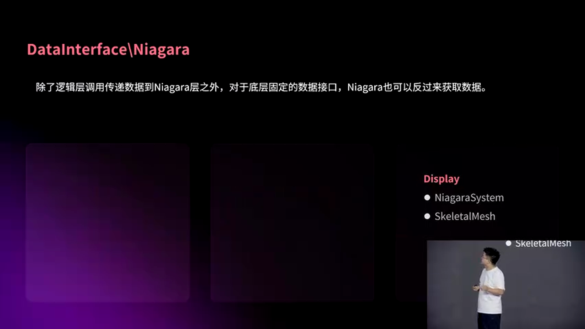

除了逻辑层调用表现层,《漫威争锋》还实现了表现层调用逻辑层的机制,即通过**Data Interface**让Niagara可以直接获取Gameplay数据。

**为什么需要这个机制?**

在战场中有很多共性元素需要在特效中呈现:
- 角色血量
- 护盾值
- 角色关键状态
- 角色阵营


如果按照传统流程,每次都需要从Gameplay Cue层传参给Niagara,这会导致:
- 大量重复的传参代码
- 限制了美术同学的自由发挥空间

通过Data Interface,Niagara可以直接调用底层数据,使得:
- 美术同学可以在Niagara中自由获取游戏数据
- 减少了程序和美术之间的沟通成本
- 提升了特效开发的灵活性

### 6.3 实际应用案例

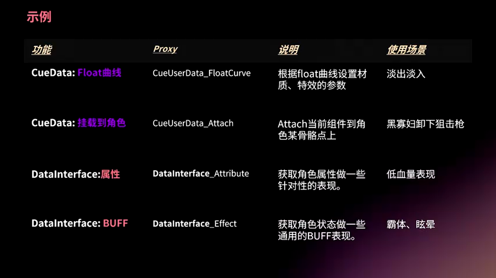

**Cue Data (标准传参)**

- 传递曲线数据到Niagara
- 实现弹道弹出效果
- 特效挂载到角色特定部位

这些是Gameplay Cue的基础能力,在《漫威争锋》中被广泛使用。

**Data Interface (反向调用)**

- 低血量特效: Niagara直接读取角色血量,根据阈值自动切换特效
- 霸体表现: Niagara直接查询角色是否处于霸体状态
- 平台状态: 动态读取平台相关信息

这些能力使得美术同学能够在Niagara中自由创作,而不需要每次都请求程序传递新的参数。

## 七、战斗框架的三大管线系统

### 7.1 检测管线 (Detection Pipeline)

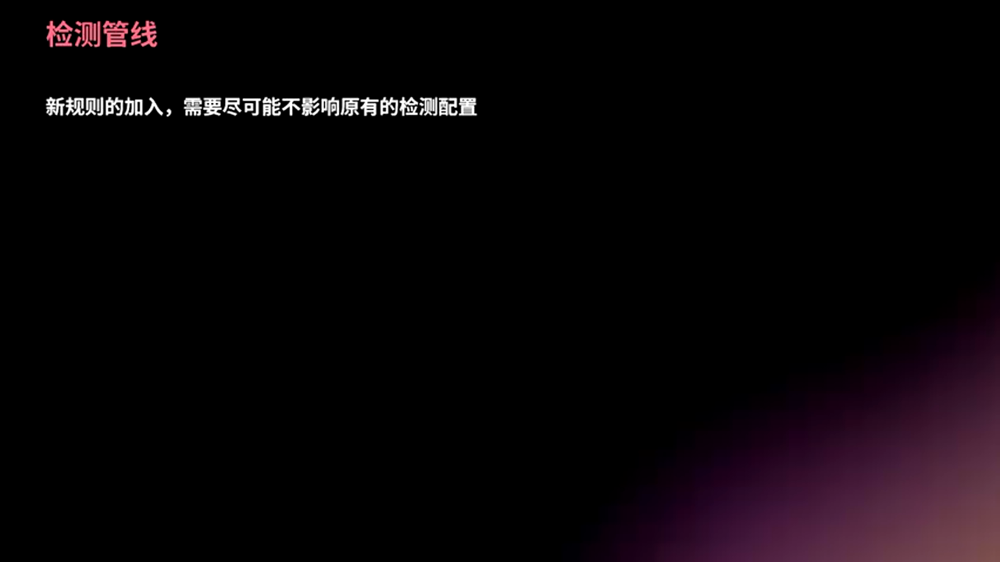

在《漫威争锋》的开发过程中,团队发现一个普遍问题:**新英雄的引入经常会带来新的检测机制和检测配置**。如果每次都修改原有技能的检测逻辑,会带来极高的测试成本和风险。

**问题场景示例:**

初期开发时,法阵可能只是简单的地面范围检测:

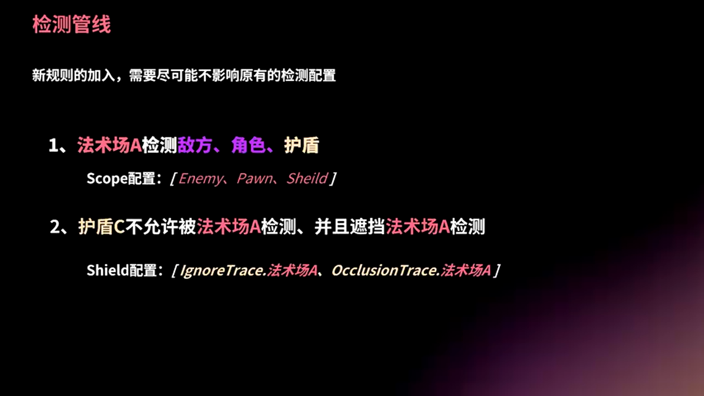

只需要配置三个基本参数:
- 检测范围
- 检测频率
- 目标筛选

但随着开发深入,新需求不断出现:
- 某些角色想要自定义对法阵的响应行为
- 某些角色希望屏蔽特定类型的法阵检测
- 某些角色想要反弹特定法阵的检测

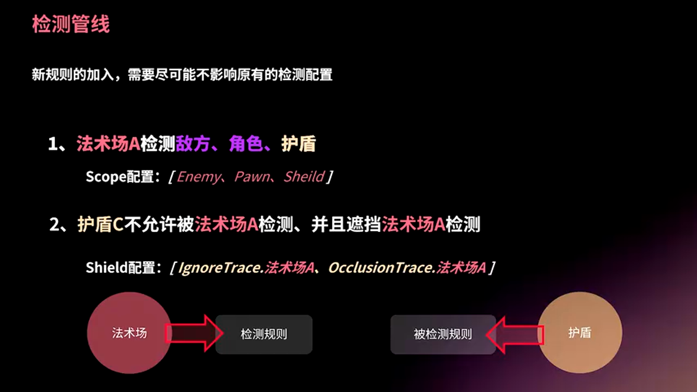

如果将这些配置都放在法阵侧,会发现配置无法完全表达需求,因为:
- 法阵需要定义"检测什么"
- 目标也需要定义"被如何检测"

这是一个**M对N的关系** —— 法阵类型很多,角色类型也很多,如果不做系统化设计,配置会爆炸性增长。

**检测管线的分层设计:**

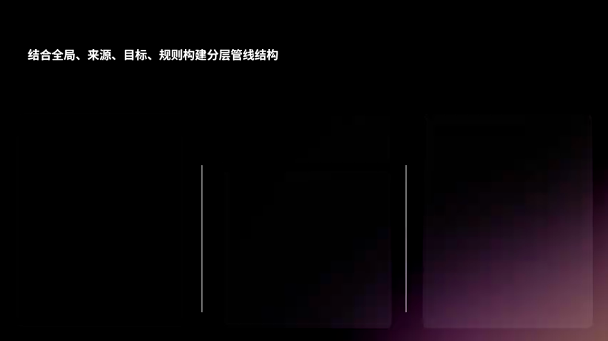

团队构建了一个分层的检测管线结构:

**层级一: 全局配置**

游戏可能有多种模式 (如标准模式、克隆模式),不同模式的检测规则可能完全不同。全局配置层用于:
- 定义玩法模式的检测开关 (如是否允许队伤)
- 提供模式级的检测规则覆盖

**层级二: 来源 (Source) 配置**

定义检测的发起方,包括:
- 投射物
- 法阵
- 枪线
- 其他检测源

每个来源可以配置自己的检测类型和规则。

**层级三: 目标 (Target) 配置**

定义被检测方,包括:
- 角色
- 召唤物
- 场景元素

目标可以配置自己的"被检测规则",如"我不希望被某类法阵检测到"。

**层级四: 检测规则**

充分定义各种检测类型:
- 法阵检测类型标签
- 弹道检测类型标签
- 检测规则的优先级和互斥关系

**检测管线的四个执行步骤:**

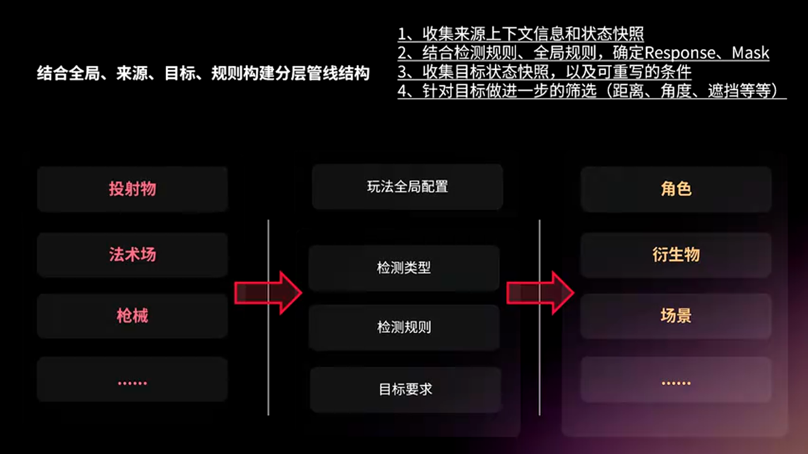

1. **收集来源信息**: 来源身上的状态、检测类型、阵营等
2. **确定检测规则**: 结合全局规则和来源配置,确定collision和mask
3. **收集目标状态**: 目标的阵营、状态、特殊配置
4. **应用通用规则**: 角度、距离、遮挡等最终判定

通过这样的管线化设计,无论引入多少新的检测类型或新的英雄,整个框架和流程都不需要改变,**只需要通过配置来解决**。

**检测管线的核心优势:**

- **扩展性**: 新增检测类型不影响现有逻辑
- **可维护性**: 配置集中管理,不会散落在各个技能中
- **灵活性**: 支持来源和目标双向定制
- **安全性**: 避免了修改原有技能带来的风险

### 7.2 生成管线 (Spawn Pipeline)


看到"管线"这个词,可能会觉得有些抽象。在《漫威争锋》中,团队将所有需要贯穿基建的逻辑都称为"管线"。

生成管线的核心问题是:**如何生成一个英雄?**

表面上看,这只是调用UE的Spawn函数,两三行代码就能解决。但实际上,生成英雄涉及大量的定制化逻辑。

**为什么需要生成管线?**

《漫威争锋》有多种游戏模式:
- 标准模式
- 克隆模式
- 各种限时活动


不同模式下,英雄的生成逻辑可能完全不同:
- 克隆模式下血量不同
- 某些技能不能使用
- 属性需要调整

如果每个模式都硬编码生成逻辑,维护成本会极高。

**生成管线的设计:**


团队增加了一个"生成管线"层,核心是:**重建整个战斗英雄的信息**。

通过管线化设计:
- 任何玩法、模式、活动都可以自定义英雄生成流程
- 核心逻辑通过配置驱动,而非硬编码
- 支持对英雄的血量、技能、属性进行全方位定制

这样的设计使得《漫威争锋》能够快速支持各种创新玩法,而不需要每次都修改核心代码。

### 7.3 战斗数据管线 (Combat Data Pipeline)

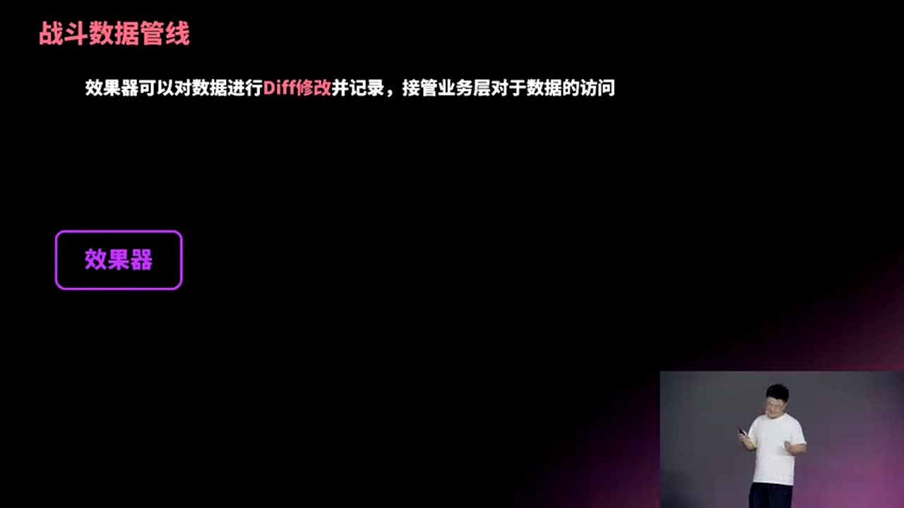

战斗数据管线解决的是一个更加精细的问题:**如何在不同模式下调整战斗数据?**

**核心概念: 效果器 (Effector)**

效果器的主要功能是:**对数据进行拦截、修改并记录**。

核心目的是:**接管业务层对所有数据的访问**。

**为什么需要效果器?**

前面提到,不同玩法和模式对英雄生成有定制需求。同样,不同模式对战斗数据也有定制需求:


- 技能CD调整
- 技能持续时间修改
- Buff效果变化

如果为每个模式创建一套新的配置,维护成本会非常高。

**效果器的工作原理:**


1. **模式定义效果器**: 每个模式可以为特定英雄配置效果器
2. **策划配置数据覆盖**: 在效果器中配置需要修改的数据
3. **拦截底层访问**: 当程序访问战斗数据时,效果器拦截并返回修改后的值

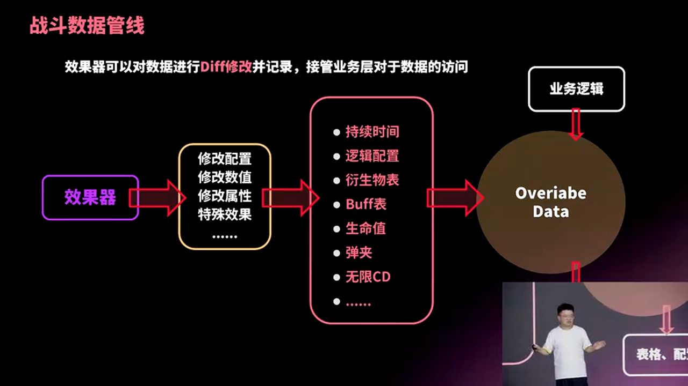

这样的设计带来了巨大的灵活性:
- 程序不需要为不同玩法写不同的代码
- 不需要创建新的技能实例
- 策划可以自主配置数据差异

**效果器的优势:**

- **灵活性**: 支持任意数据的运行时覆盖
- **安全性**: 不修改原始配置,所有修改都是局部的
- **可追溯性**: 所有数据修改都有记录,便于调试

## 八、战斗实体系统 (Combat Entities)

### 8.1 三大战斗实体类型


战场中的元素不仅仅是玩家角色,还包括大量的战斗实体。在《漫威争锋》中,主要有三种类型:

**投射物 (Projectile)**

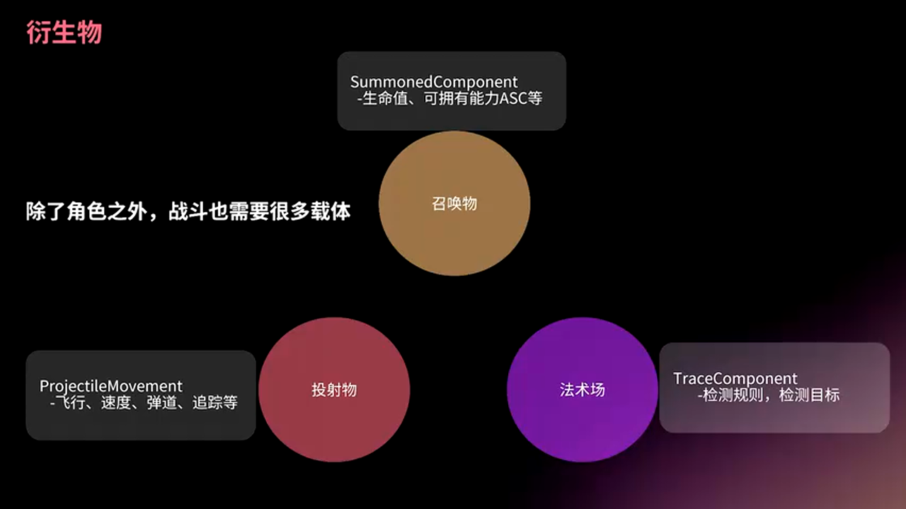

投射物的主要特点:
- 延迟弹道
- 飞行轨迹计算
- 碰撞检测

**法阵 (Field)**

法阵的特点:
- 大范围检测
- 持续性效果
- 区域控制

**召唤物 (Summon)**

召唤物相当于小型角色:
- 拥有生命值
- 可以释放技能
- 有独立的AI

**实体之间的相互引用:**

这三种实体之间可以相互引用,形成复杂的组合:
- 投射物携带法阵
- 投射物携带召唤物
- 召唤物释放投射物

这种灵活的组合机制为技能设计提供了巨大的创作空间。

### 8.2 实体管理系统

所有战斗实体都需要统一的管理机制:

- 生命周期管理
- 网络同步
- 碰撞检测
- 性能优化 (对象池、LOD等)

这套实体系统为《漫威争锋》的丰富战斗体验提供了坚实的基础。

## 九、技能编辑器与一站式开发

### 9.1 技能编辑器的设计理念

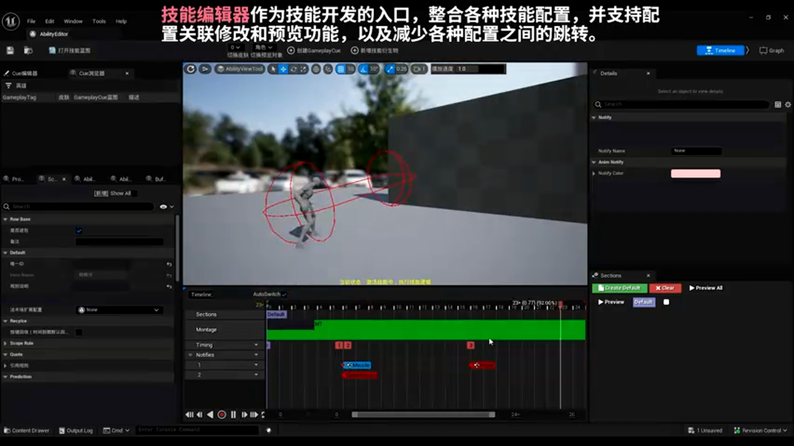

前面介绍了大量的模块化设计,但如果这些模块分散在各处,开发门槛会非常高。因此,团队开发了一个**技能编辑器**,作为统一的开发入口。

**设计灵感: 参考UE的Montage编辑器**

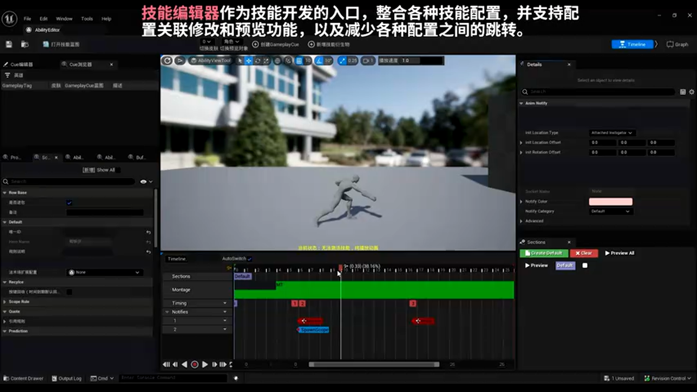

团队在设计技能编辑器时,参考了UE动画蒙太奇编辑器的布局方式,因为:
- 布局合理,符合用户习惯
- 界面友好,学习曲线平缓
- 时间轴的表现方式与技能流程天然契合

团队对这种编辑方式的接受度很高,因为大家对UE的编辑器已经很熟悉了。

### 9.2 整合所有配置模块

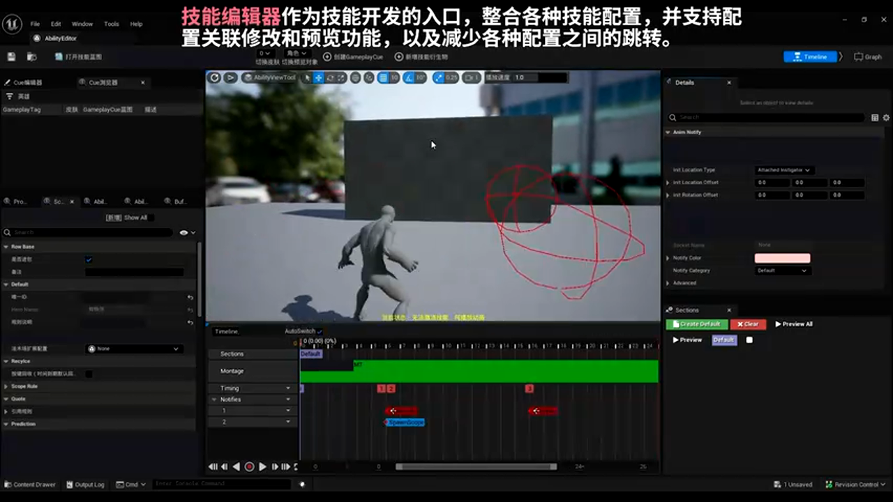

技能编辑器作为技能开发的统一入口,整合了各个模块的配置:

- 检测配置
- 效果器配置
- 投射物配置
- 法阵配置
- Timeline配置
- Cue配置


**核心目标: 一站式完成所有配置**

通过技能编辑器,开发同学可以在一个界面中完成所有技能相关的配置和调试,大幅提升了开发效率。

## 十、客户端预测系统深度解析

### 10.1 为什么需要预测系统


预测系统在竞技游戏中是不可或缺的核心机制。它的核心作用是:**解决网络延迟问题,保证游戏手感**。

在网络游戏中,手感是竞技游戏的生命线,而网络延迟是手感的天敌。

### 10.2 问题分析: CS架构的天然延迟


目前的网络游戏普遍采用**Client-Server架构**,有一个核心特点:**很多逻辑需要相信服务器**。

从时序上看,客户端执行某些请求或逻辑时,需要等待服务器执行结果。这个过程**天然存在延迟**。

以技能释放为例:

```
客户端按下技能键
    → 发送请求到服务器
    → 服务器处理逻辑
    → 服务器返回结果
    → 客户端播放动画
```

无论网络多好,这个过程都存在延迟。对于竞技游戏来说,这个延迟会严重影响手感。

### 10.3 解决方案: 客户端先行


核心思路:**客户端不能什么都等服务器**。

如果客户端认为某件事情一定可以成功,**就应该先做**,这样才能抵消网络延迟,提高手感。

优化后的流程:

```
客户端按下技能键
    → 客户端立即播放动画 (先行)
    → 同时发送请求到服务器
    → 服务器确认 (在后台进行)
```

从玩家的角度看,按下技能到播放动画之间**没有任何延迟**。

### 10.4 预测失败的处理: UE的预测窗口机制

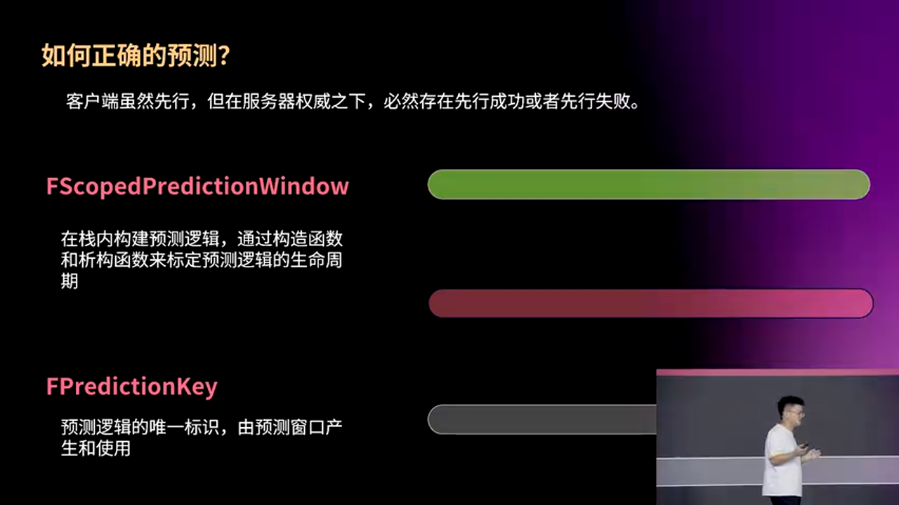

客户端先行当然有风险:**预测可能错误**。

- 预测成功: 皆大欢喜,手感很好
- 预测失败: 怎么办?

UE提供了一套解决方案,核心是两个重要模块:

**1. 预测窗口 (Prediction Window)**

核心逻辑:**在战场构建预测逻辑,通过Scope的创建和销毁来决定预测的生命周期**。

**2. 预测器 (Prediction Key)**

预测器是**这段预测逻辑的唯一标识**,用于客户端和服务器之间的对应关系。

### 10.5 预测流程详解


以技能激活为例,完整的预测流程:

**客户端侧:**

1. 创建预测窗口
2. 使用技能 (扣除资源,如CD、能量)
3. 直接播放动画
4. 将预测Key发送给服务器

**服务器侧:**

1. 接收到预测Key
2. 尝试使用技能
3. 创建预测窗口并激活
4. 播放动画 (虽然客户端已经播过了)


**两种可能的结果:**

**情况A: 服务器激活成功**

预测成功,流程正常完成。

**情况B: 服务器激活失败**

可能的原因:
- 网络延迟期间,角色被眩晕了
- CD不足 (客户端判断有误)
- 其他条件不满足

服务器会将预测Key发回客户端,告知:**你的预测被拒绝了,需要回滚**。

### 10.6 预测窗口的回滚机制


窗口是一个**战场内的指针**,它会在创建时记录一系列操作,当预测失败时,这些操作需要被**回滚**。

**回滚示例:**

假设一个技能有三个阶段:

```
准备阶段 → 生效阶段 → 结束阶段
```

如果在生效阶段预测失败,客户端需要:

1. 停止当前阶段的执行
2. 回滚已经发生的效果
3. 恢复到预测前的状态

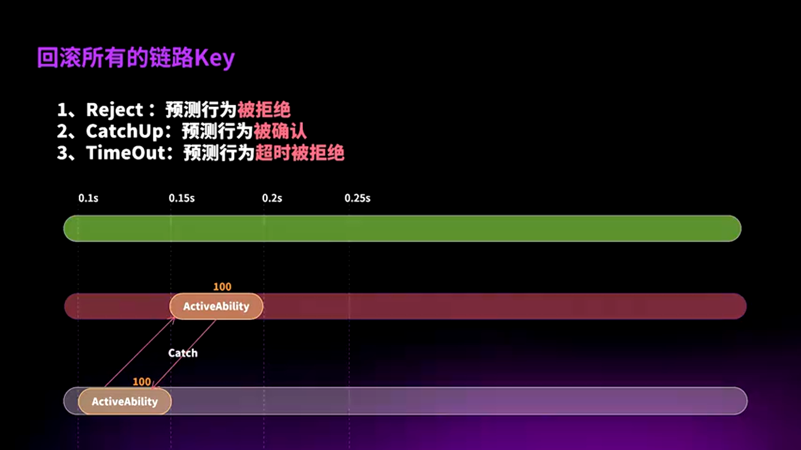

当服务器进入技能生效状态时,发现这个状态在服务器跑不通,就会将率jack发给客户端,客户端收到后知道整个生效端被拒绝,需要把后面的逻辑全部拒绝掉。

**为什么必须回滚?**

客户端先行是有副作用的,如果做了错误的事情还让它错误下去,会导致:
- 游戏状态不一致
- 作弊可能性
- 公平性问题

所以必须正确处理预测失败的情况。

### 10.7 可预测行为与不可预测行为


**不是所有东西都应该预测**。团队需要区分哪些行为可以预测,哪些不能。

**判断标准: 是否影响手感?**

**可预测行为 (必须预测):**

- 技能激活
- 位移
- 消耗 (CD、能量)

这些东西直接响应玩家输入,必须立即反馈,所以一定要预测。


**不可预测行为 (相信服务器):**

- Buff对目标的控制效果 (冰冻、眩晕等)
- 关键伤害和血量修改
- 变身

**为什么这些不能预测?**

因为回滚成本太高或根本无法回滚:

- 变身失败了,难道倒着播动画吗?
- 伤害预测错了,难道把血加回来吗?

这些效果如果预测失败,回滚的视觉表现会非常糟糕,甚至让玩家完全困惑。

**可以不回滚的行为:**

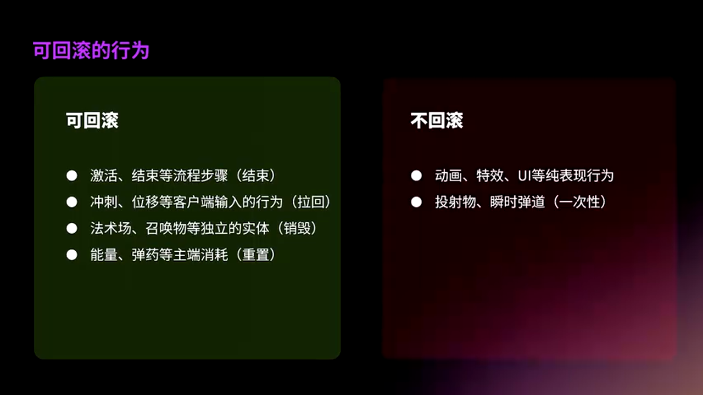

- 基础动画表现 (时间很短,播完就结束了)
- 一次性特效
- 发射的投射物 (已经飞出去了,不可能收回来)
- 瞬时弹道

这些东西的生命周期很短,或者已成既定事实,没有必要回滚。

### 10.8 需要回滚的关键逻辑

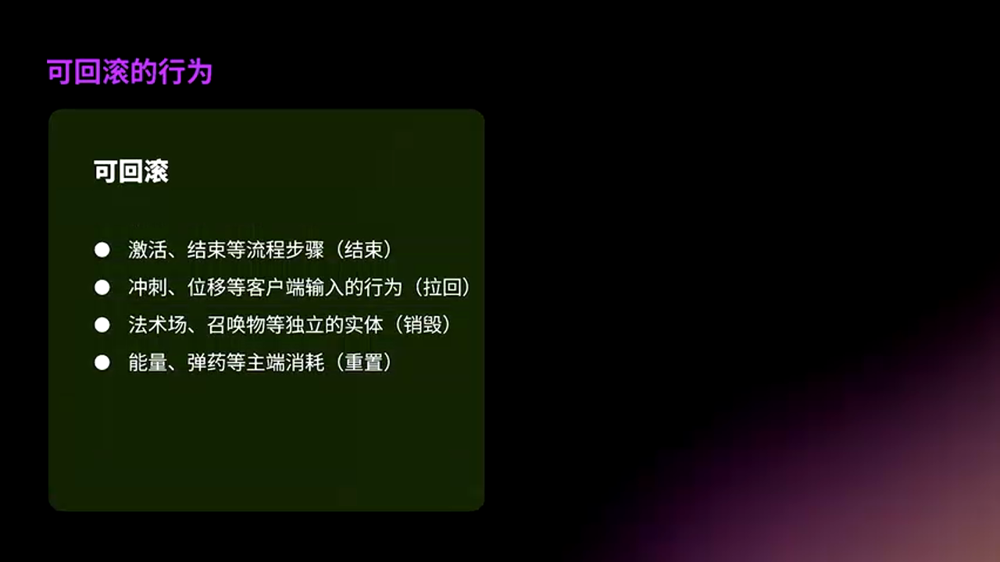

**必须回滚的行为:**

- 技能激活 (服务器不允许,必须取消)
- 冲刺和位移 (预测错了要拉回来)

位移的回滚表现就是"拉回",玩家会看到角色瞬间回到原位。虽然体验不好,但这是预测失败的必然结果,也是保证游戏公平性的必要代价。

### 10.9 预测系统的实际效果


团队对比了200ms延迟和10ms延迟下的游戏表现,可以看到:

**技能激活流程在两种延迟下完全一致**,因为动画和冲次都是预测的。


对于快速位移攻击这种技能,如果没有预测,在高延迟下几乎无法使用。但通过预测系统,即使在200ms延迟下,整个连续技能的表现也与10ms延迟几乎没有差异。

### 10.10 预测失败的真实案例

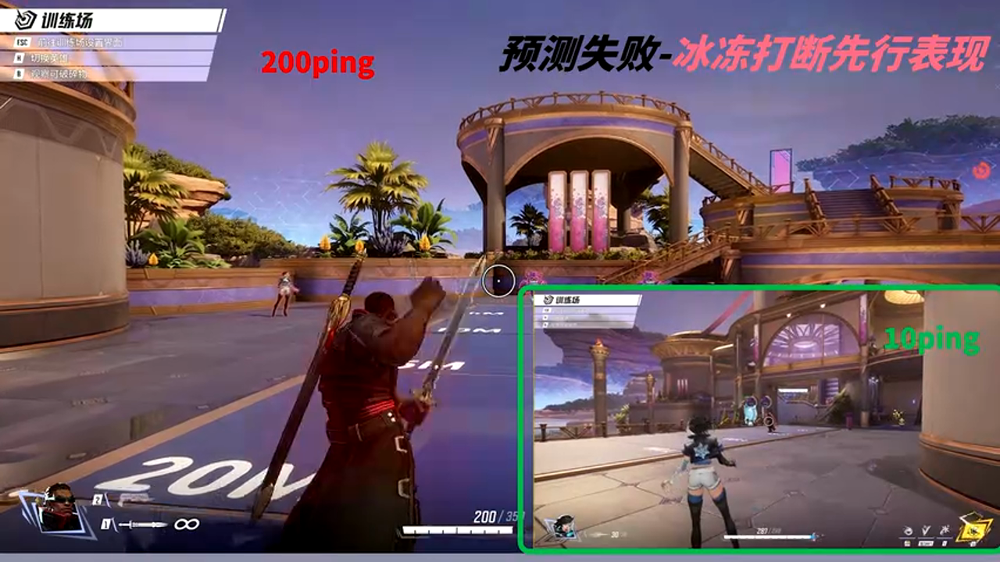

当然,预测系统也会有失败的情况。视频中展示了一个经典案例:

刀锋开大招冲刺,但在冲刺过程中被冰霜女巫的冰冻打断。


从冰霜女巫的视角来看,她并没有看到刀锋开大招。


刀锋预测了冲刺行为,但到了服务器时,服务器判定冰冻生效,应该打断大招。这是完全正确的游戏逻辑。

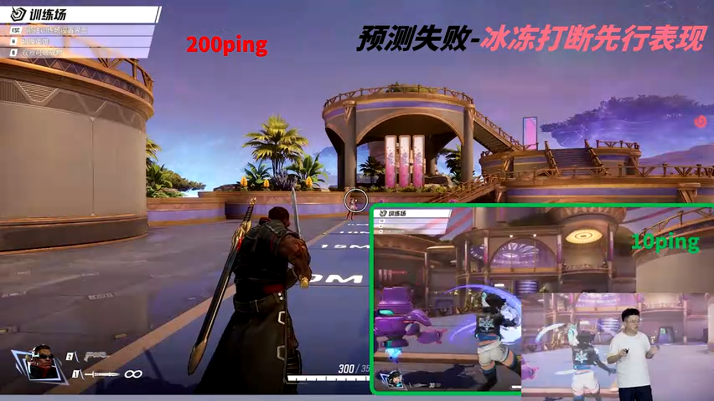

**预测失败不代表错误**,它在游戏中是一个**正常的公平性规则**。因为冰霜女巫的冰冻就应该打断刀锋的大招,所以预测失败是合理的结果。

这种设计保证了游戏的公平性,即使有时会让玩家感到挫败,但这是网络游戏在保证公平性前提下的最优解。

## 十一、总结与技术启示

### 11.1 架构设计的核心原则

通过对《漫威争锋》战斗框架的深入分析,我们可以提炼出几个关键的架构设计原则:

**1. 模块化与可扩展性**

无论是技能系统、Buff系统还是检测管线,都采用了高度模块化的设计,使得系统能够灵活应对不断变化的需求。

**2. 配置驱动**

通过三态技能配置、效果器、技能模板等机制,将大量逻辑转化为配置,降低了开发成本,提升了迭代效率。

**3. 分层抽象**

从Buff的三层架构到Cue的中间层设计,通过合理的分层抽象,在保持灵活性的同时避免了复杂度爆炸。

**4. 管线化思维**

检测管线、生成管线、战斗数据管线,通过管线化设计将复杂的业务流程标准化,提升了系统的可维护性。

### 11.2 客户端预测的最佳实践

> **预测系统的黄金法则**
> - ✅ 预测影响手感的操作 (激活、位移、消耗)
> - ❌ 不预测难以回滚的操作 (变身、伤害、控制)
> - 🔄 对于可回滚的操作,提供流畅的回滚表现
> - ⚖️ 预测失败是保证公平性的必要代价,而非BUG

### 11.3 避坑指南

基于《漫威争锋》的开发经验,以下是一些关键的避坑建议:

**配置系统避坑:**

- 避免使用单一配置表承载所有技能数据,会导致维护困难
- 不要在技能配置中硬编码检测逻辑,应该通过管线系统统一管理
- 效果器配置应该有明确的优先级和覆盖规则,避免配置冲突

**预测系统避坑:**

- 预测失败的回滚必须彻底,不能有任何遗留状态
- 不要预测有副作用且难以回滚的操作
- 预测Key的生成和匹配逻辑必须严格,避免错误匹配

**性能优化避坑:**

- 检测管线要注意性能优化,避免过度的碰撞检测
- 特效系统要考虑对象池和LOD机制
- 预测系统的窗口要及时清理,避免内存泄漏

### 11.4 技术展望

《漫威争锋》的战斗框架展示了现代竞技游戏的技术深度。未来的发展方向可能包括:

- 更智能的预测算法,基于机器学习优化预测准确率
- 更精细的网络同步策略,进一步降低带宽消耗
- 更强大的可视化编辑工具,进一步降低开发门槛

---

**参考资料:**

- Unreal Engine 5 Documentation - Gameplay Ability System
- 《漫威争锋》官方技术博客
- UFSH2025 技术分享会

---

> **写在最后**
>
> 《漫威争锋》的战斗框架开发是一个系统工程,涉及游戏设计、网络架构、性能优化等多个领域。这篇文章仅仅是对核心技术点的概括,每一个模块都值得深入研究。
>
> 希望这篇文章能够为正在开发或计划开发多人竞技游戏的团队提供一些参考和启发。
>
> 感谢网易游戏《漫威争锋》团队的分享,感谢钟志华老师的精彩演讲。
