# 突破传统绑定瓶颈：基于 4D 扫描与机器学习的次世代面部肌肉系统

---


## 加入 UE5 技术交流群

如果您对虚幻引擎5的图形渲染技术感兴趣,欢迎加入我们的 **UE5 技术交流群**！

扫描上方二维码添加个人微信 **wlxklyh**,备注"UE5技术交流",我会拉您进群。

在技术交流群中,您可以:
- 与其他UE开发者交流渲染技术经验
- 获取最新的GDC技术分享和解读
- 讨论图形编程、性能优化、构建工具流、动画系统等话题
- 分享引擎架构、基建工具等项目经验和技术难题

---

> **本文基于视频《[UFSH2025]MetaHuman实时面部肌肉: 从扫描到机器学习实现 | 袁陆彪 钱飞羽 光点创艺》整理生成**
>
> 视频链接: https://www.bilibili.com/video/BV1df2PBHEV7
>
> 本文由 AI 辅助生成,旨在将视频内容转化为结构化的技术文档,方便技术人员学习和参考

---

## 导读

> **核心观点:**
> - 传统面部绑定流程在肌肉表现上存在天然局限,4D扫描技术能够1:1还原真人肌肉运动
> - UE5的机器学习框架通过训练高精度缓存与控制曲线的顶点差值,可在极低性能消耗下实时还原逼真肌肉效果
> - 从PBR扫描、4D数据采集到Neural Morph Model训练的完整工程化流程,已在多个商业项目中得到验证

**阅读本文需要的前置知识:**
- 熟悉UE5的MetaHuman系统和DNA绑定架构
- 了解基础的PBR渲染原理和法线贴图工作流
- 对机器学习的基本概念(训练、推理、泛化)有初步认知

---

## 一、传统绑定的痛点:为何面部肌肉始终是难题?

在传统的角色制作流程中,**面部肌肉运动**一直是困扰TA(Technical Artist)和绑定师的核心难题。这并非技术人员能力问题,而是传统方法论的本质局限。

### 1.1 传统绑定的技术瓶颈

传统面部绑定通常依赖以下两种方案:

> **方案 A: BlendShape(混合变形)方案**
> - 🟢 优势: 工作流成熟,艺术家可精确控制每个表情形态
> - 🟢 优势: 兼容性好,几乎所有引擎和DCC工具都支持
> - 🔴 劣势: 无法表现动态肌肉的非线性运动(如皱纹的高频褶皱变化)
> - 🔴 劣势: BlendShape数量爆炸问题(复杂角色需要100+个形态)
> - 🔴 劣势: 表情组合时容易出现"鬼脸"(Combination Artifacts)
> - 🎯 适用场景: 风格化角色、低写实度需求

> **方案 B: Bone-based Rig(骨骼驱动)方案**
> - 🟢 优势: 数据量小,运行时性能开销低
> - 🟢 优势: 可以通过骨骼层级实现二级控制
> - 🔴 劣势: 骨骼数量有限(面部通常50-80根),无法捕捉皮肤微观形变
> - 🔴 劣势: 权重绘制工作量巨大且容易出现穿插
> - 🔴 劣势: 旋转插值导致体积丢失(Candy Wrapper Effect)
> - 🎯 适用场景: 实时游戏中的远景角色、次世代主机性能受限场景


*传统绑定流程示意:面部肌肉始终是复杂度最高的部分*

### 1.2 写实角色的特殊挑战

对于追求电影级写实度的项目,传统方案的问题更加凸显:

- **毛孔级细节丢失**: 传统法线贴图是静态的,无法表现肌肉运动时毛孔的动态拉伸
- **皱纹的非线性行为**: 真人皱纹的形成是皮肤褶皱+脂肪挤压+肌肉牵拉的复合结果,传统线性插值完全无法模拟
- **表情组合的指数级复杂度**: 如果要覆盖所有表情组合,理论上需要 2^N 个BlendShape(N为基础表情数)

这些问题的本质是:**传统方法是基于离散采样的近似**,而真实人脸是连续的物理系统。

---

## 二、4D扫描:突破近似,走向真实

### 2.1 4D扫描的核心价值

4D扫描技术的"4D"指的是**三维空间+时间轴**,即捕捉动态变化的三维数据。相比传统的静态3D扫描,4D扫描能够:

- 记录每一帧的完整几何形变(Geometry Cache)
- 保留肌肉运动的真实物理特性(非线性、高频、局部性)
- 提供1:1还原真人表情的数据基础


*4D扫描效果展示:可以看到与真人几乎完全一致的肌肉运动细节*

### 2.2 从真人到美化模型:数据传递链路

在实际项目中,直接使用真人扫描数据往往无法满足艺术需求。典型的工作流是:

```
真人4D扫描数据 → 拓扑优化 → 美化模型 → 数据迁移 → 最终资产
```


*左侧为美化后的模型,右侧为用于训练的骨骼网格体(Skeletal Mesh)*

关键技术点:

1. **拓扑一致性保证**: 美化模型必须与扫描数据保持相同的顶点索引和连接关系
2. **Wrap变形传递**: 使用Wrap3D或类似工具将扫描数据的形变传递到美化模型
3. **精度损失控制**: 需要权衡美化程度与数据保真度

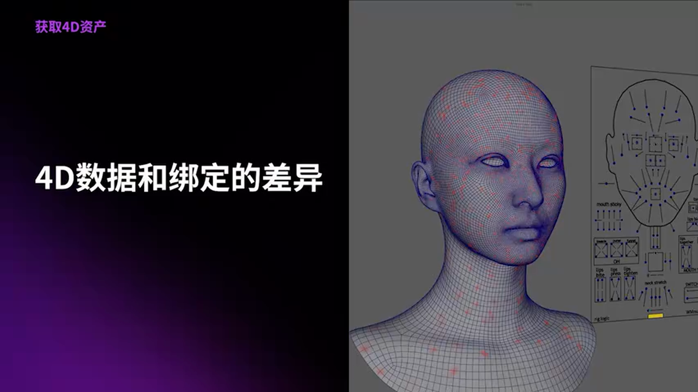
*白色为4D扫描数据,红色为骨骼网格体数据,两者的差异就是机器学习需要学习的目标*

### 2.3 4D数据 vs 骨骼网格体:差异分析

通过可视化对比可以发现:

- **差异幅度**: 在剧烈表情下(如大笑),顶点位移差异可达5-10mm
- **差异分布**: 集中在肌肉活跃区域(额头、法令纹、眼周)
- **差异性质**: 主要是高频细节(皱纹褶皱)和局部体积变化

> 这些差异虽然看起来微小,但正是它们决定了"逼真"与"假塑"的区别。

---

## 三、UE5机器学习框架:化不可能为可能

### 3.1 为何传统方案无法覆盖所有人群?


*不同种族、年龄、性别的人脸具有不同的肌肉运动模式*

MetaHuman的核心矛盾在于:

- **通用性需求**: 需要支持不同种族、年龄、体型的人脸
- **数据采集成本**: 不可能为每种人脸类型都进行4D扫描
- **实时性能约束**: 不能直接播放几何缓存(Geometry Cache太重)

UE5的机器学习框架正是为了解决这个"不可能三角"而生。

### 3.2 三种机器学习模式详解


*UE5提供的三种机器学习训练模式*

#### 模式一: Vertex Delta Model(顶点差值模型)

> **技术原理:**
> 直接学习控制曲线(ARKit BlendShapes)到顶点位移的映射关系

- **优势**: 开发路径简单,便于理解和调试
- **劣势**: 无压缩,数据量大,不适合生产环境
- **适用场景**: ML功能的原型验证和学习

#### 模式二: Neural Morph Model(神经网络变形模型)


*Neural Morph Model通过神经网络压缩变形数据*

> **技术原理:**
> 使用神经网络将高维的顶点差值数据压缩到低维隐空间(Latent Space),再解码回顶点位移

关键参数:
```cpp
// [AI补充] Neural Morph Model训练伪代码
struct NeuralMorphConfig {
    int num_iterations = 5000;        // 训练迭代次数
    float regularization = 0.001;     // 正则化强度
    int latent_dim = 128;            // 隐空间维度
    ActivationFunc activation = ReLU; // 激活函数
};
```

- **数据压缩比**: 通常可达10:1到50:1
- **推理性能**: 单个Morph Target约0.1ms(PS5实测)
- **质量损失**: 在合理参数下,视觉误差<0.5mm

**生产实践建议:**
- 对于主角色,latent_dim建议设置为256-512,以保留更多细节
- 对于NPC,可降低到64-128,换取更好的性能
- 正则化系数需要针对具体资产调优,过大会导致过平滑,过小会过拟合噪声

#### 模式三: Cloth Neural Model(布料神经模型)


*专为服装褶皱等高频非线性变化设计的模型*

> **技术原理:**
> 针对布料褶皱的高频、非线性、不可预测特性,使用更复杂的网络架构

与Neural Morph Model的区别:
- **感受野更大**: 考虑更远的顶点邻域关系
- **时序建模**: 引入前后帧信息,捕捉惯性和反弹
- **物理约束**: 损失函数中加入布料物理的软约束

**适用场景:**
- 松弛的衣物(如长袍、披风)
- 布料与身体的碰撞交互
- 需要高频细节的褶皱表现

---

## 四、完整的生产流程:从扫描到实时渲染

### 4.1 数据准备:三大核心资产


*训练所需的三类资产*

机器学习训练需要以下三类数据:

1. **骨骼网格体资产(Skeletal Mesh)**
   - 用途: 作为基础模型,承载动画数据
   - 要求: 符合MetaHuman标准拓扑

2. **骨骼动画数据(FBX Animation)**
   - 用途: 提供控制信号(ARKit BlendShapes曲线)
   - 来源: 通过MetaHuman Animator进行面部捕捉
   - 关键要求: **尽可能覆盖全部表情空间**

3. **几何缓存数据(Geometry Cache / ABC)**
   - 用途: 作为训练的Ground Truth(真值)
   - 来源: 4D扫描数据
   - **关键约束: 必须与骨骼动画保持帧同步**

### 4.2 数据采集流程

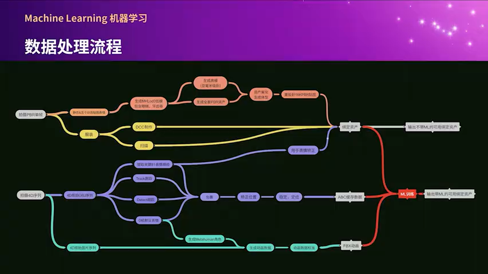
*完整的数据生产链路*

#### 4.2.1 PBR资产制作

从左至右依次为:

```
PBR扫描 → 静态重建 → 骨骼网格BlendShape Sculpt → 低模生成
```


*使用OLED单光源扫描系统*

**光度测量法(Photometric Stereo)原理:**

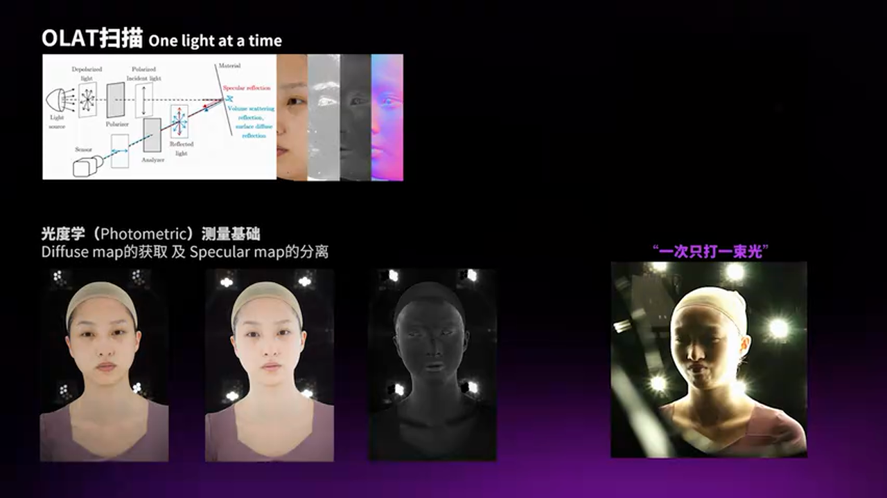
*一次拍摄,一束光*

通过从不同角度打光,将皮肤反射光拆分为两个部分:


*漫反射贴图(皮肤底色)*

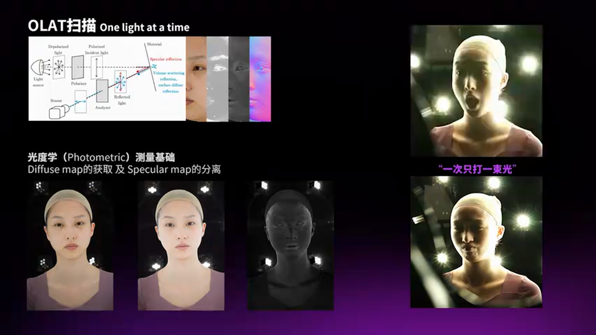
*镜面反射贴图(高光区域)*

最终生成毛孔级的PBR贴图套装:


*包含Albedo、Normal、Roughness、Specular等完整通道*

**技术要点:**

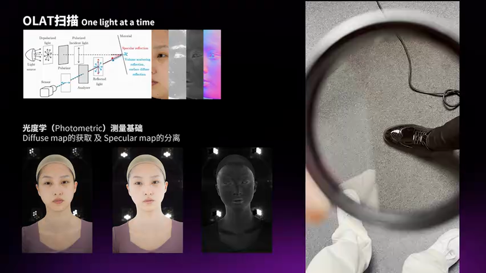
*皮鞋反光案例:展示高光与颜色的分离原理*

通过交叉偏振滤镜和多角度光源,可以:
- 消除镜面反射的干扰,提取纯净的漫反射颜色
- 通过高光强度分布推算表面粗糙度
- 生成物理准确的次表面散射参数

#### 4.2.2 扫描质量评估

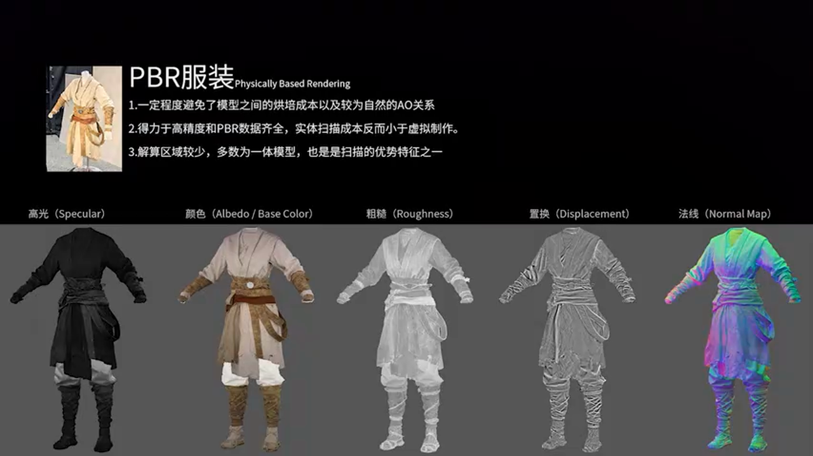
*从项目实践来看,扫描制作周期和人工成本优于传统建模*

**成本对比(以单个主角色为例):**

> **传统手工建模方案**
> - 制作周期: 15-20个工作日
> - 人力成本: 高级角色美术师全职投入
> - 质量上限: 依赖艺术家个人水平,细节密度受限
>
> **PBR扫描+后期优化方案**
> - 制作周期: 8-12个工作日(扫描2天+后期6-10天)
> - 人力成本: 扫描技术人员+建模美术
> - 质量下限: 保证毛孔级真实数据作为基础

**扫描质量的关键因素:**
- 光照均匀性(避免阴影和过曝)
- 相机标定精度(影响几何重建准确度)
- 演员配合度(需保持静止,避免微表情)

#### 4.2.3 非皮肤材质处理


*除皮肤外的其他材质处理策略*

对于眼球、牙齿、毛发等特殊材质:

- **传统手工制作仍有优势**: 尤其是中国传统服饰、发饰等具有文化特色的道具
- **物理规律+艺术审美**: 手工痕迹往往比程序噪声更自然
- **混合工作流**: 扫描提供基础,手工雕刻提升艺术表现力

---

### 4.3 高模还原:从扫描到游戏资产


*高模还原的核心步骤*

#### 步骤一: 基础云贴图(Base Relief Map)

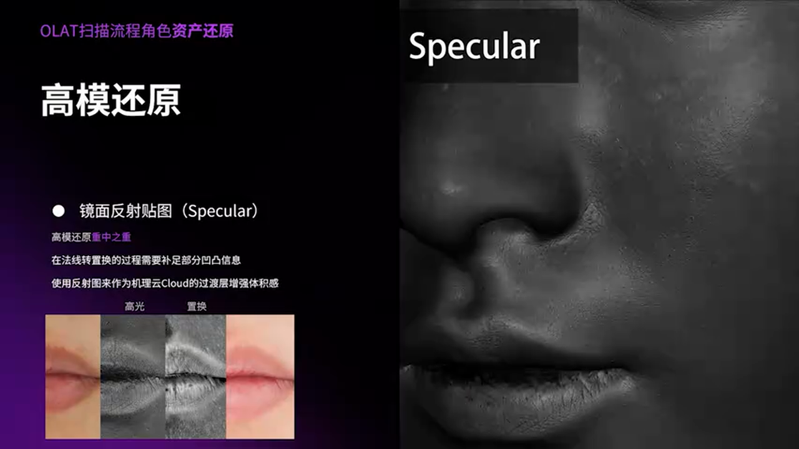
*所谓"基础云贴图"是自定义命名,非标准术语*

**作用机制:**

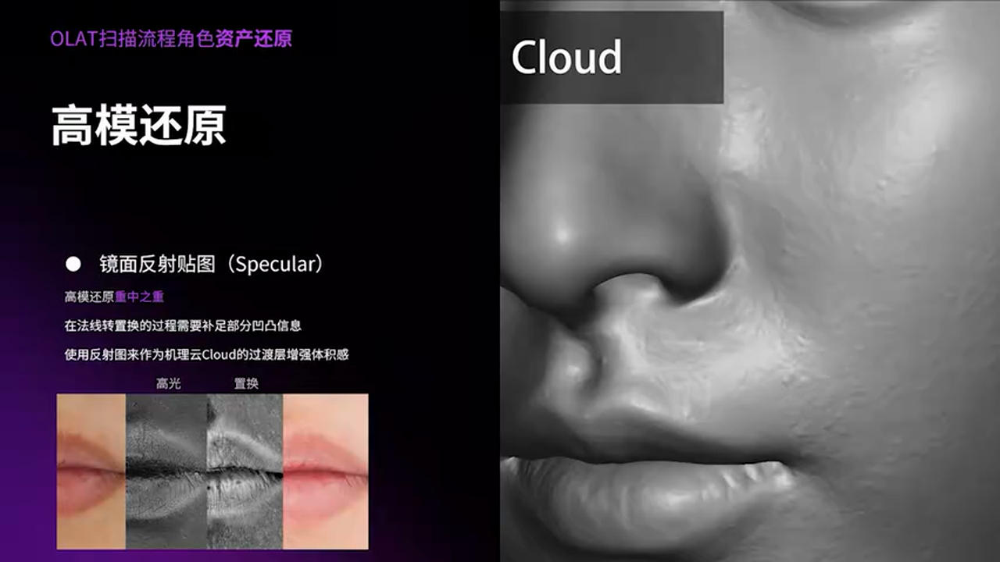
*当扫描未完全修复时,保留大的起伏作为基础*

这种起伏往往是角色的**鲜明特征**:
- 鼻梁的弧度
- 颧骨的高度
- 法令纹的深度


*法线转置换过程可能丢失凹凸信息,需要补足*

**技术难点:**


*左下角:高光图保留了置换图缺失的凹槽细节*

在法线贴图烘焙过程中,可能因为:
- 光线角度问题导致某些凹槽未被捕捉
- 真人皮肤的高光遮蔽效应
- 网格密度不足导致的细节丢失

**解决方案:**
使用高光图作为基础云的过渡层,增强体积感。

#### 步骤二: 毛孔细节处理

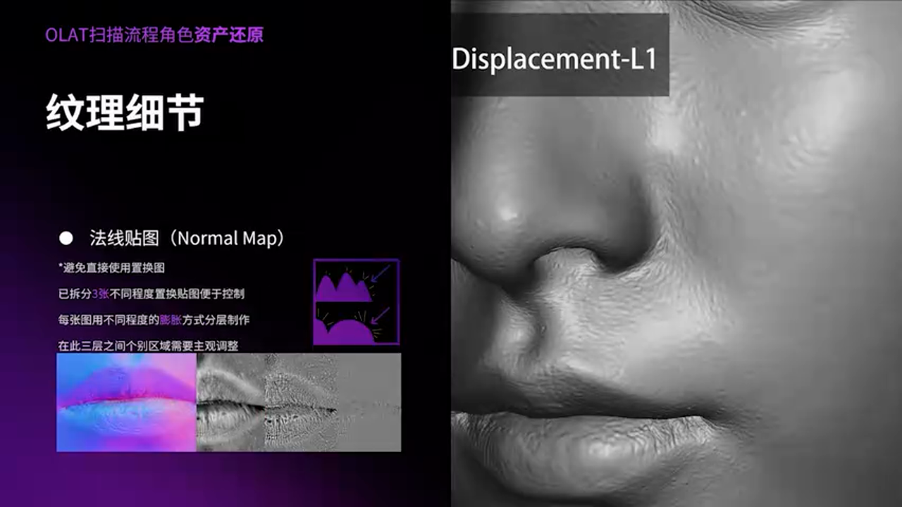
*毛孔细节的正确处理方式*

**反面教材:直接使用置换贴图**


*如果直接使用,会造成以下问题*

- 无法控制五官区域的强弱差异(额头vs眼窝)
- 凹凸叠加后显得不自然
- 游戏中会产生过多的高光反射噪声

**正确做法:遮罩+膨胀混合**

将置换贴图作为遮罩,通过膨胀(Dilation)方法分层处理:
- **第一层**: 大毛孔区域(鼻翼、额头),膨胀系数1.5-2.0
- **第二层**: 中等密度区域(脸颊),膨胀系数1.0-1.5
- **第三层**: 细腻区域(眼周),膨胀系数0.5-1.0


*在不同层之间做主观的强弱区分,符合游戏中的光照反馈规范*

---

### 4.4 快速预览:MetaHuman Creator集成


*使用MHC快速创建完整角色*

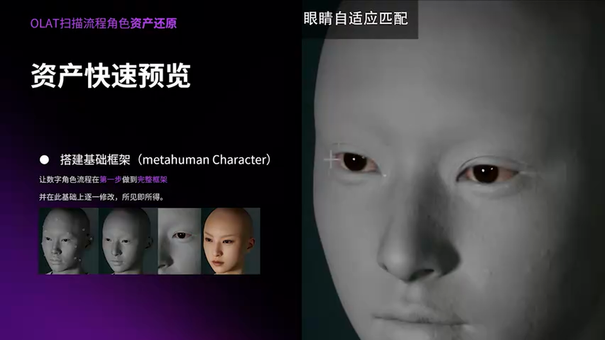
*导入头部模型后自动匹配眼球、口腔、眉毛*

工作流优势:
- **一键生成**: 导入头部Mesh,自动适配眼球UV、牙齿位置
- **实时预览**: 在完整光照环境下查看效果
- **迭代效率**: 可以快速判断是否需要返回调整

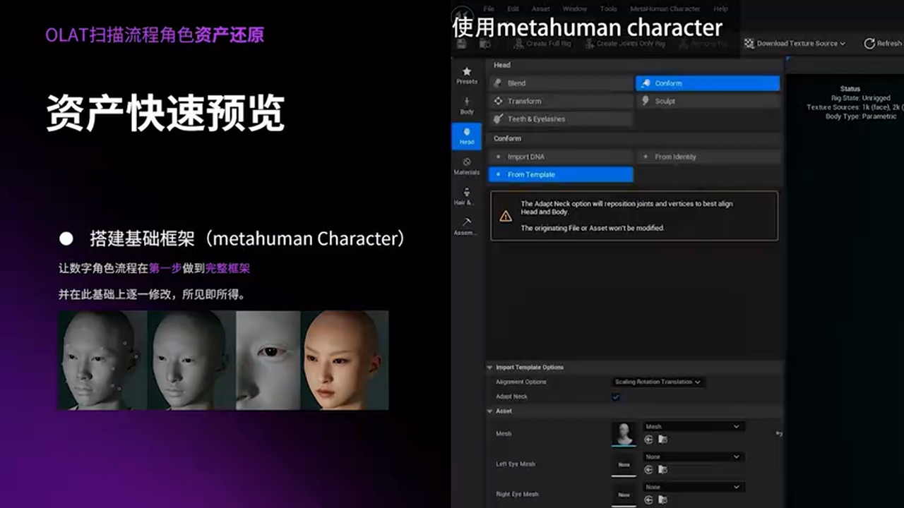
*有助于直观判断,然后进入各个环节调整*

---

### 4.5 PBR贴图精修


*进入全套PBR贴图调整阶段*

扫描数据已经提供了优秀的基础,但仍需手工调整:

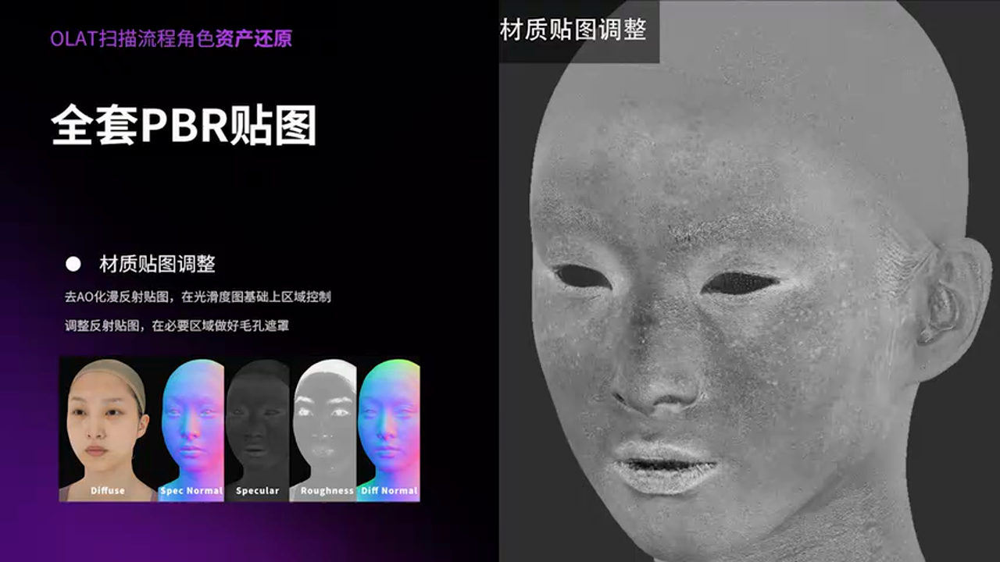
*扫描数据提供了非常好的PBR基础*

#### 关键调整项:

1. **睫毛与眉毛重绘**


*重新绘制睫毛和眉毛*


*眉毛在游戏中的重要性:远距离LOD时可补偿毛发显示问题*

2. **眼线强化**

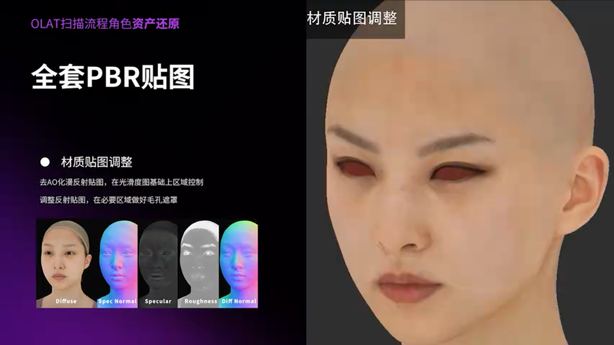
*调整眼线,提高眼神专注度*

3. **粗糙度精细控制**

通过Roughness Map精确控制不同区域的光泽度:
- T区(额头、鼻尖): 较低粗糙度,呈现油光感
- 脸颊: 中等粗糙度,柔和漫反射
- 眼周: 较高粗糙度,避免不自然的高光


*高光遮罩完成后,整个贴图制作部分结束*

---

### 4.6 皮肤材质:粗糙度的两种概念


*在UE中还原皮肤效果的核心思路*


*引用2023年的实验图:粗糙度的双重性*

粗糙度(Roughness)在物理渲染中有两种含义:

#### 概念一: 物理属性的直接调参

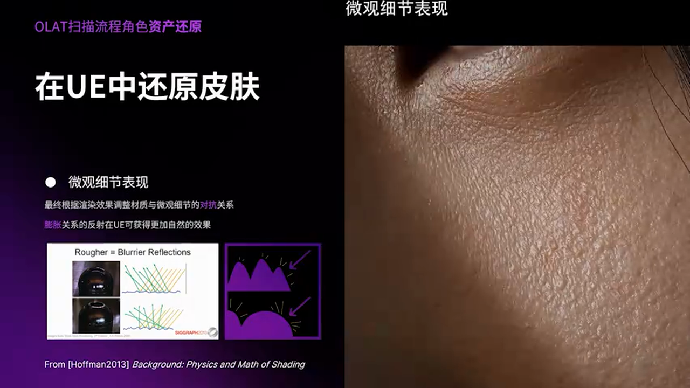
*通过Roughness参数直接控制BRDF的高光半径*

这是最直观的方式,但存在问题:
- 无法表现皮肤的**复杂分层结构**(角质层、表皮、真皮)
- 忽略了**微观几何**(Micro-Geometry)的影响

#### 概念二: 细表面细节叠加

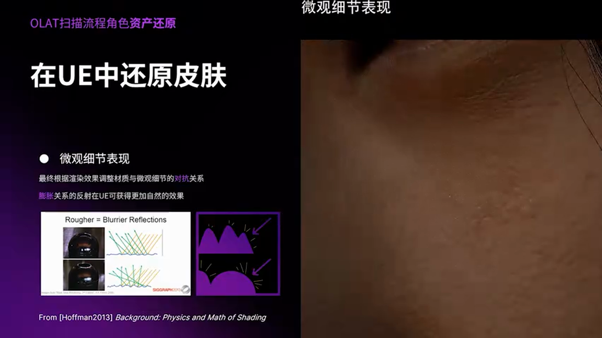
*在较为光滑的表面上叠加细腻的高频法线*

**核心差异:**


*后者更加精细,能表现皮肤复杂的分层关系*


*可以表现皮肤的复杂分层光照反馈*

**实践经验:**

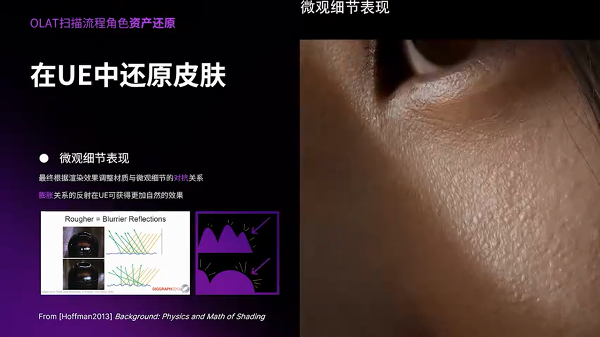
*本次采用膨胀感的细表面细节*


*细表面细节指的是胎纹(Pore Pattern)或循环图(Tiling Normal)*


*可以获得更好的光照反馈*

**风险警示:**


*如果控制不好,会造成材质混乱甚至"皮肤腐烂"的感觉*


*称之为"对抗关系":细节与整体感的平衡*

---

## 五、4D数据处理:从原始扫描到训练素材

### 5.1 表情数据采集策略


*支持中文和英文台词的表情库*

为了保证ML模型的泛化能力,需要采集:

- **基础表情**: 53个FACS(面部动作编码系统)单元
- **组合表情**: 常见的复合情绪(如"惊讶+愤怒")
- **台词表情**: 覆盖中英文音素的口型

### 5.2 4D数据追踪与清理


*基础资产整备完成后,进入4D数据处理*


*需要做四个角度的Checker追踪*

**追踪策略:**

1. **四视角Checker追踪**: 正面、左侧、右侧、俯视
   - 作用: 保证追踪的空间一致性
   - 难点: 需要手动校正遮挡区域

2. **眼睛与嘴唇的特殊处理**


*眼睫毛和嘴唇容易被睫毛干扰,需要另一套检测方法*

Checker追踪的局限:
- 无法穿透睫毛遮挡区域
- 嘴唇边缘的口红会干扰特征点识别

**解决方案: 曲线追踪算法**

使用基于轮廓的追踪方法,能够:
- 更好还原眼睫毛的运动趋势
- 捕捉嘴唇周边的肌肉激活轨迹

### 5.3 表情提取

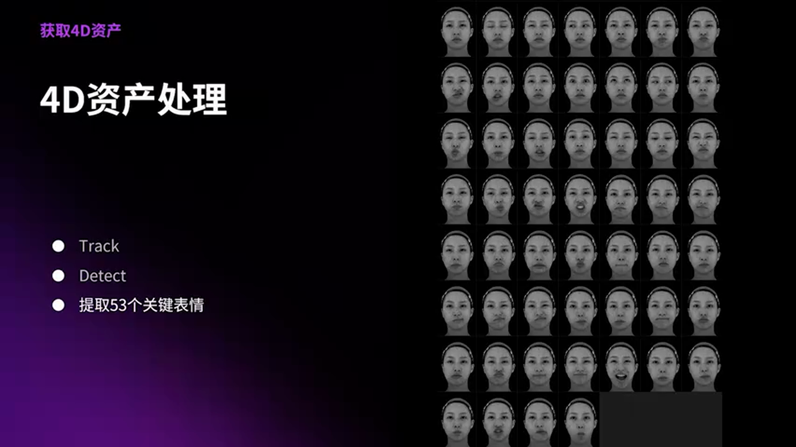
*提取53个基础表情用于绑定和校准*

这些表情的作用:
- **绑定辅助**: 用于验证骨骼网格体的表情覆盖范围
- **校准基准**: 作为ML训练的参考帧

---

## 六、绑定与训练:核心技术环节

### 6.1 MetaHuman绑定架构


*进入最重要的环节:绑定与训练*


*创建绑定的具体步骤不详细展开(去年有相关分享)*


*UE5.6之后身体也变成了DNA系统*

**DNA架构优势:**
- 更好的编辑性:可视化调整Joint层级
- 性能优化:CPU端计算量大幅降低
- 数据一致性:与Maya的DNA Calibration直接兼容

### 6.2 资产导入


*导入骨骼网格体,注意DNA和表情控制*

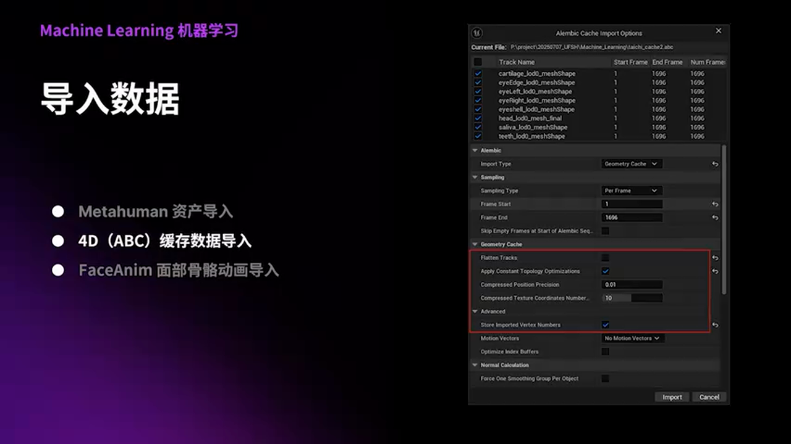
*4D数据导入时必须分离轨道*

**关键设置:**
- 将Geometry Cache的Transform轨道与Vertex轨道分离
- 避免双重变换导致的顶点漂移

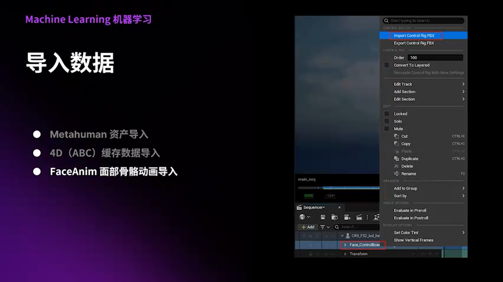
*面部动画导入流程*

完整链路:
```
MetaHuman Animator → Maya校正 → Sequencer导入控制器FBX
```

### 6.3 机器学习训练配置


*打开ML插件,准备开始训练*

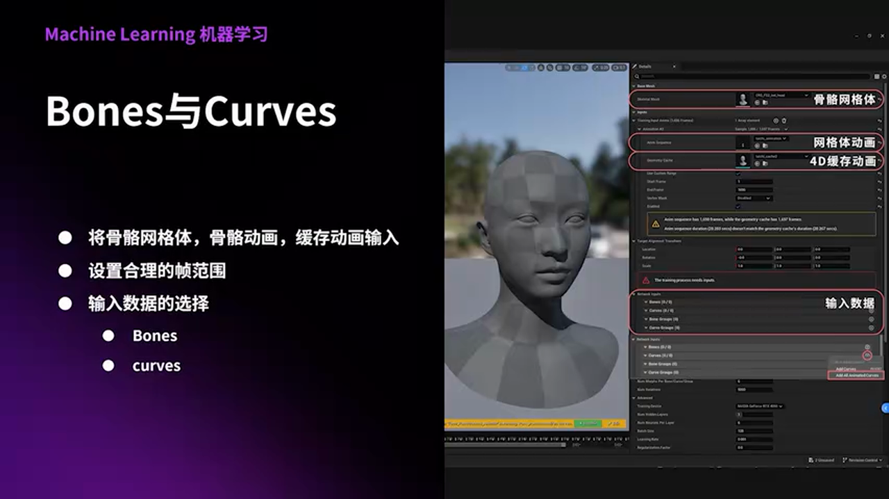
*将骨骼网格体、动画、4D缓存加载到面板*

#### 6.3.1 第一个选择: Bones vs Curves


*到底选择骨骼还是曲线作为输入?*

**实践经验:**

骨骼(Bones)方案的问题:
- 骨骼有6个自由度(位移3+旋转3)
- 与肌肉的对应关系容易混乱
- 旋转插值会引入非线性误差

**推荐方案: 使用表情曲线(Curves)**


*用表情Curve曲线和4D数据做对应训练效果更好*

原因:
- Curve是标量值,无插值歧义
- 直接对应ARKit BlendShapes语义
- 更容易调试和可视化

#### 6.3.2 第二个选择: Local vs Global


*选择Local还是Global训练模式?*

> **Local模式**
> - 🟢 优势: 更灵活,基于骨骼周边的局部顶点训练
> - 🟢 优势: 更适合面部表情(局部性强)
> - 🟢 优势: 泛化和推理效果更好
> - 🟢 优势: 依赖的数据量较小
> - 🎯 适用场景: 面部表情、手指变形
>
> **Global模式**
> - 🟢 优势: 适合大量随机姿态
> - 🟢 优势: 可以学习全身的协同运动
> - 🔴 劣势: 需要更多训练数据
> - 🎯 适用场景: 全身肌肉系统、布料模拟

**结论: 面部肌肉首选Local模式**

#### 6.3.3 关键参数调优


*学习迭代次数的选择*

**迭代次数(Num Iterations):**

官方默认: 5000次


*过少:无法达到ABC的拟合状态*


*过多:过拟合,只能复现训练集,无法泛化*

**实践建议:**
- 先用2000次快速试错
- 观察Loss曲线,如果仍在下降,增加到5000
- 最终模型用8000-10000次精调

**平滑数值(Regularization):**


*越趋近于0,训练结果越接近ABC原始数据*


*但ABC来自扫描,可能有噪点和微弱波动*

**调优策略:**

```python
# [AI补充] 平滑参数调优伪代码
if 训练结果出现噪点或抖动:
    增加 regularization (0.001 → 0.01)
elif 训练结果过于平滑,丢失细节:
    减少 regularization (0.001 → 0.0001)
```

**实践经验:**
- 初次训练: 给一个很小的值(0.0001)
- 如果有噪点: 逐步增大,每次翻倍
- 找到噪点消失的临界值,然后降低10%-20%

---

## 七、生产实战:从训练到应用

### 7.1 训练成果验证


*训练完成后,效果还是比较顺畅的*

验证checklist:
- [ ] 与ABC对比,顶点误差<1mm
- [ ] 在极端表情下无穿插
- [ ] 曲线插值平滑,无抖动
- [ ] 性能开销<0.5ms(PS5 Profile)

### 7.2 低预算方案:视频驱动


*如果没有动捕预算,只有视频怎么办?*


*可以直接使用视频进行面部追踪*

工作流:
```
视频 → MetaHuman Animator追踪 → FBX曲线 → ML推理 → 最终动画
```


*即使只有一段视频,也能很好还原面部表情*

**适用场景:**
- 电影预览(Previz)
- 游戏过场动画的快速原型
- AI驱动的NPC对话

### 7.3 二级控制系统

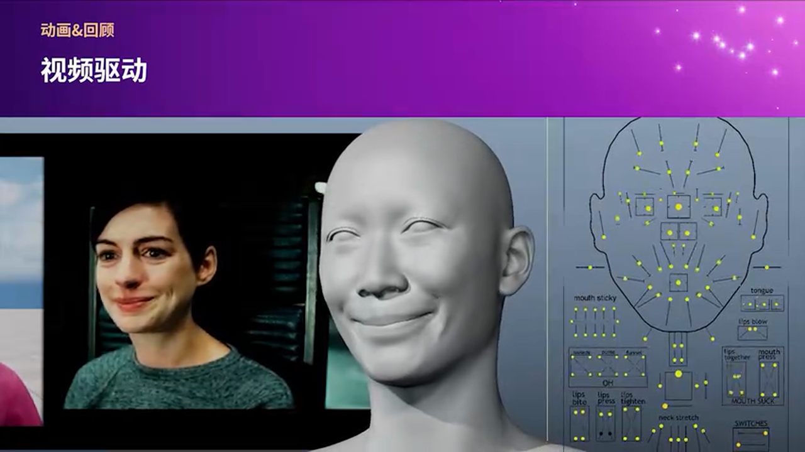
*动画微调需求:如何在不破坏绑定的情况下局部调整?*

传统问题:
- 表情已经做好,但导演要求"嘴角再上扬一点"
- 直接改绑定会影响其他表情
- 手K曲线效率低且容易出错

**解决方案:二级控制(Secondary Control)**


*完整的二级控制系统*

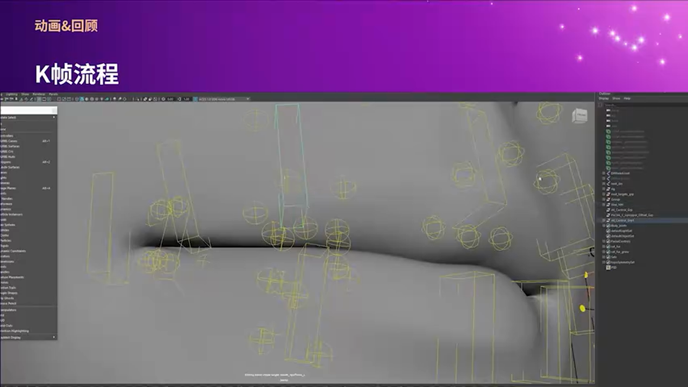
*工作原理:调整面板时,二级控制被同步驱动*


*关键特性:调整二级后再修改一级,二级的偏移会被保留*


*动画师可以自由叠加微调,不会丢失*

技术实现:
```cpp
// [AI补充] 二级控制伪代码
FinalCurveValue = PrimaryCurve + SecondaryOffset;
// SecondaryOffset在Primary变化时保持不变
```

### 7.4 音频驱动

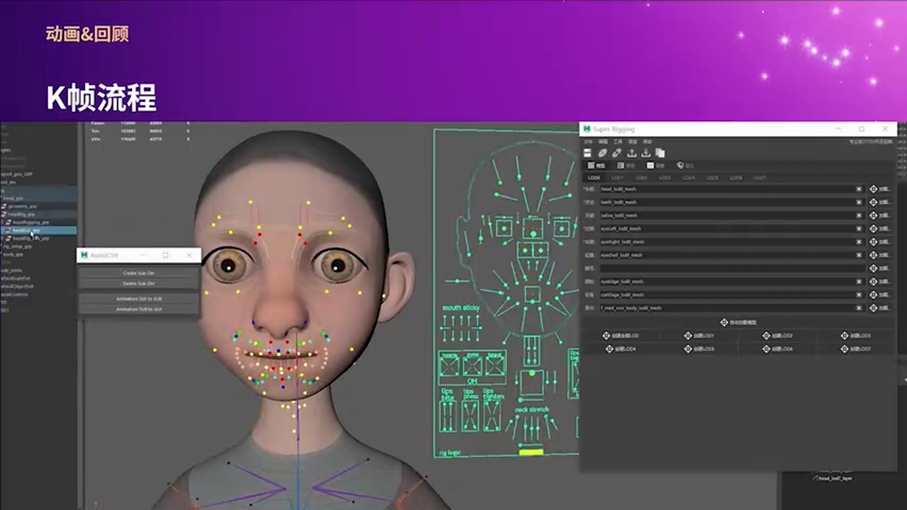
*如果只有音频,也可以生成面部动画*


*对台词对口型场景特别好用*

技术链路:
```
音频 → MetaHuman Animator音频分析 → 音素Curves → ML推理 → 唇同步动画
```

**局限性:**
- 只能生成口型,无法推断情绪表情
- 需要手动叠加情绪层(愤怒、惊讶等)

---

## 八、工程总结与最佳实践

### 8.1 完整技术链路回顾


*本次分享的核心流程*

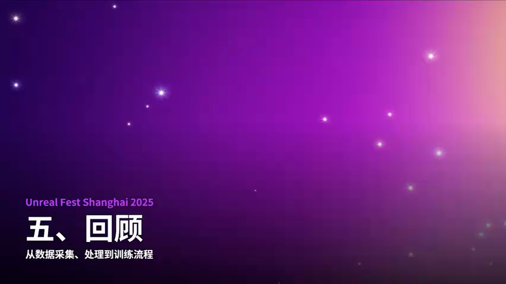
*从数据采集、训练到绑定、动画生产的完整闭环*

```
PBR扫描 → 高模制作 → 4D扫描 → 数据清理 → 绑定 → ML训练 → 动画生产
   ↓         ↓          ↓         ↓        ↓        ↓          ↓
 贴图      拓扑      缓存      追踪     DNA     模型     实时应用
```


*UE的ML对角色生产效率提升非常显著*

**量化收益(基于实际项目数据):**
- 面部绑定周期: 从15天缩短到5天(省67%)
- 表情制作效率: 单个表情从2小时降到15分钟(省87%)
- 运行时性能: 相比Geometry Cache播放省95%内存

### 8.2 避坑指南

基于多个商业项目的实践,总结以下常见问题:

**坑点1: 扫描与动画帧不同步**
- **现象**: 训练完成后,肌肉运动有明显延迟
- **原因**: 4D扫描的FPS与动捕FPS不一致(如扫描60fps,动捕30fps)
- **解决**: 在导入前统一重采样到相同帧率

**坑点2: 正则化参数过大导致细节丢失**
- **现象**: 训练结果平滑但"塑料感"严重
- **原因**: Regularization设置过高(>0.1)
- **解决**: 从0.0001开始,逐步增大,找到噪点消失的临界值

**坑点3: Local模式下骨骼影响半径设置不当**
- **现象**: 肌肉运动出现明显的"分块"感
- **原因**: 影响半径过小,相邻区域未能平滑过渡
- **解决**: 将Influence Radius增加20%-30%,并开启Smooth Falloff

**坑点4: 训练数据表情覆盖不足**
- **现象**: 某些表情组合出现崩坏(如"愤怒+微笑")
- **原因**: 训练集中缺少对应的表情组合样本
- **解决**: 增加10%-15%的随机组合表情采集

**坑点5: DNA版本不兼容**
- **现象**: Maya导出的DNA在UE中加载失败
- **原因**: UE5.3与5.5的DNA格式有Breaking Change
- **解决**: 统一工具链版本,或使用UE提供的DNA转换工具

### 8.3 性能优化建议

**CPU端优化:**
- 使用多线程推理: 在Project Settings中开启ML Multi-Threading
- LOD策略: 远景角色降低隐空间维度(512→128)
- 批量推理: 对多个NPC一次性Batch推理

**GPU端优化:**
- 考虑使用NNAPI或CoreML硬件加速(移动平台)
- 将模型权重压缩为FP16,性能提升30%,精度损失<1%

**内存优化:**
- 训练完成后删除中间数据(Geometry Cache)
- 使用流式加载: 只在需要时加载模型权重

---

## 九、未来展望


*项目后续值得期待*


*感谢Unreal官方提供平台与机会*

当前技术的潜在方向:

1. **实时4D重建**: 结合NeRF/Gaussian Splatting,从视频直接重建4D数据
2. **跨角色迁移**: 训练一次,泛化到不同人脸拓扑
3. **物理肌肉模拟**: 引入生物力学约束,提升极端表情的稳定性
4. **AI驱动表情生成**: 从文本/情绪直接生成表情动画

---

## 结语

本次分享展示了从4D扫描到机器学习的完整工程化流程。这不仅是技术的堆叠,更是**数据驱动思维**在传统CG领域的胜利:

> 与其让艺术家手工雕琢每一个表情,不如让机器从真实数据中学习规律。

这种思路的本质是:**将不可扩展的人力转化为可扩展的算力**。随着AI技术的进步,这条路径只会越走越宽。

对于实践者而言,重要的不是盲目追求最新技术,而是理解技术背后的**设计决策**(Design Decision):

- 为什么选择Local而非Global?
- 正则化本质上是在权衡什么?
- 4D数据的采集成本是否值得?

只有理解这些,才能在自己的项目中做出正确的取舍。

---

**相关资源:**
- UE官方ML文档: https://docs.unrealengine.com/5.3/en-US/machine-learning-in-unreal-engine/
- MetaHuman DNA Calibration: https://www.unrealengine.com/marketplace/zh-CN/product/metahuman-dna-calibration
- 4D扫描服务提供商: Faceware, DI4D, Dimensional Imaging

**致谢:**
感谢光点创艺团队的技术分享,以及Unreal中国社区提供的交流平台。