---

## 加入 UE5 技术交流群

如果您对虚幻引擎5的图形渲染技术感兴趣，欢迎加入我们的 **UE5 技术交流群**！

扫描上方二维码添加个人微信 **wlxklyh**，备注"UE5技术交流"，我会拉您进群。

在技术交流群中，您可以：
- 与其他UE开发者交流渲染技术经验
- 获取最新的GDC技术分享和解读
- 讨论图形编程、性能优化、构建工具流、动画系统等话题
- 分享引擎架构、基建工具等项目经验和技术难题

---

## 源视频信息

- **标题**: [UFSH2025]MetaHuman: 高保真数字角色生产管线 | Uros Sikimic Epic Games MetaHuman 解决方案总监
- **时长**: 19分33秒（1173秒）
- **内容**: 英文技术演讲/教程
- **视频链接**: https://www.bilibili.com/video/BV1eF2NBDEfG
- **本文说明**: 本文基于AI自动转录生成，可能存在翻译和理解误差，建议结合原视频观看

---

# MetaHuman 完整生产管线深度解析：从创建到市场的全流程实践

> MetaHuman 是一个不断演进的产品套件，Epic Games 正在持续投资并开发这项技术。在 Unreal Engine 5.6 中，MetaHuman 已经走出早期访问阶段，计划与 UE 版本同步发布定期更新。

> MetaHuman 产品套件覆盖完整的角色生产管线，从高保真、令人信服的角色创建，到定制化和艺术编辑，再到动画解决方案，最终到市场平台，形成了一套完整的生产工具链。

> 通过 MetaHuman，团队可以实现统一的角色管线（uniform character pipeline），所有角色（英雄、NPC）都运行在同一套 MetaHuman 资产标准上，避免了保真度不匹配问题，并实现了统一的工作流。

## 导读

MetaHuman 作为 Epic Games 在数字角色领域的核心产品，不仅仅是一个角色创建工具，更是一套完整的生产管线解决方案。本文将从架构师的视角，深入解析 MetaHuman 的技术架构、工作流程、工具生态，以及在生产环境中的最佳实践。

**阅读本文需要的前置知识**：
- 熟悉 Unreal Engine 的基本概念和工作流
- 了解数字角色生产的传统管线（建模、绑定、动画）
- 对 DCC 工具（Maya、Houdini）有基本认知
- 理解实时渲染与线性媒体的区别

## 背景与痛点

### 传统角色生产的挑战

在 MetaHuman 出现之前，游戏和影视制作中的数字角色生产面临着多重挑战：

**技术碎片化**：不同项目、不同角色的制作流程和工具链各不相同，导致：
- 英雄角色与 NPC 的保真度不匹配
- 工作流无法统一，难以共享动画资源
- 不同 DCC 环境之间的数据转换成本高昂

**生产效率瓶颈**：传统的手工制作流程：
- 角色建模、绑定、纹理制作需要数周甚至数月
- 表情和姿态编辑需要专业的技术美术
- 角色资产在不同平台间的适配工作量大

**质量标准化难题**：缺乏统一的资产标准，导致：
- 角色间的视觉质量不一致
- 动画系统无法跨角色复用
- 性能优化需要针对每个角色单独处理

### MetaHuman 的解决方案

MetaHuman 通过引入新的资产标准（Asset Standards），从根本上解决了这些问题：

**统一资产标准**：所有 MetaHuman 角色遵循相同的技术规范，包括：
- 标准化的面部和身体绑定系统（Facial and Body Rig）
- 8 个级别的 LOD（Level of Details），支持从 PC/主机到移动端/Switch 的全平台部署
- 统一的动画系统，支持跨角色动画共享

**完整工具链覆盖**：从创建、定制、动画到市场，提供端到端的解决方案

**跨平台兼容性**：UEFN 优化的 MetaHuman 资产可直接应用于 Unreal Engine，将移动端优化经验应用到桌面端

如上图所示，MetaHuman 产品套件横跨整个角色生产管线，形成了从创作到分发的完整闭环。

## 核心原理解析

### 资产标准与架构设计

MetaHuman 的核心创新在于引入了全新的资产标准。这种标准化的设计哲学体现在多个层面：

#### 统一的绑定系统

MetaHuman 角色包含标准化的面部和身体绑定系统，这个绑定系统可以在交互式游戏内容和线性影视内容中使用。这种设计使得：

**运行时特性统一**：所有 MetaHuman 角色共享相同的控制界面（Control GUI），这意味着：
- 动画师可以在不同角色间共享动画资源
- 开发团队可以建立统一的动画库
- 跨项目的资产复用成为可能

**平台适配灵活**：8 个 LOD 级别的设计支持：
- PC/主机游戏的高保真渲染
- 移动游戏的性能优化
- Switch 等低功耗平台的特殊适配

从图中可以看到，MetaHuman 引入了统一的资产标准，确保所有角色在同一技术框架下运行。

#### UEFN 优化经验的回流

一个重要的技术趋势是 UEFN 优化的 MetaHuman 资产现在可以直接应用于 Unreal Engine。这意味着：

**优化经验共享**：为 UEFN（Unreal Editor for Fortnite）开发的经验和优化技术可以回流到主引擎
- 移动端性能优化策略
- 资源压缩和加载优化
- 渲染管线简化技术

**生产流程统一**：希望利用 MetaHuman 制作移动端内容的团队，现在可以直接受益于 UEFN 的优化成果

### 角色创建工作流

MetaHuman 提供了两种主要的角色创建工作流，满足不同场景的需求：

#### 参数化创建（Parametric Creation）

参数化工作流允许用户通过调整面部标记点（markers）来创建角色：

**工作流程**：
1. 选择面部标记点
2. 在中性表情状态下调整面部解剖结构
3. 系统自动生成完整的 MetaHuman 绑定，包含所有运行时特性

**技术优势**：
- 快速迭代，无需手工建模
- 结果可控，符合 MetaHuman 资产标准
- 自动生成绑定，减少技术债务

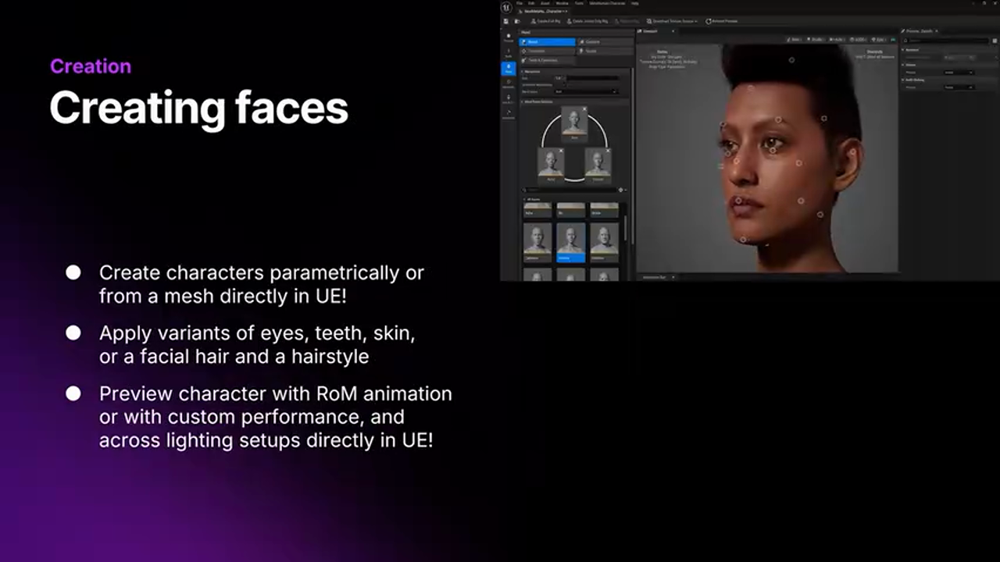
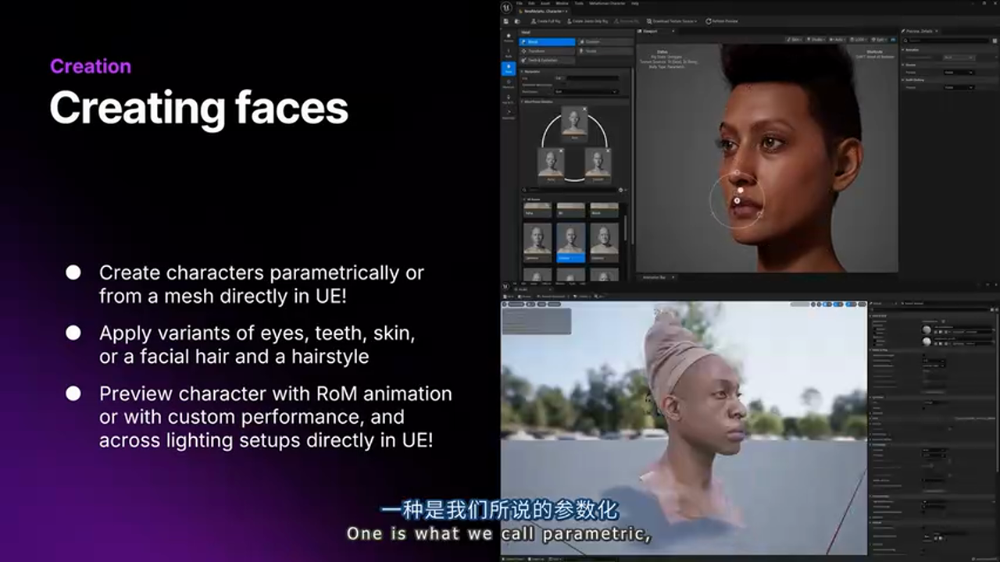

参数化工具提供了直观的面部标记点调整界面，允许艺术家快速塑造角色外观。

#### 网格到 MetaHuman（Mesh to MetaHuman）

对于需要更高定制性的场景，MetaHuman 支持基于现有网格的创建：

**工作流程**：
1. 上传扫描网格或现有模型
2. 在 Unreal Engine 的 MetaHuman 插件中重新拓扑几何体
3. 使用 Mesh to MetaHuman 功能自动生成绑定

**技术实现**：Mesh to MetaHuman 使用机器学习技术：
- 自动识别面部特征点
- 生成符合 MetaHuman 标准的绑定结构
- 保持原始网格的视觉特征

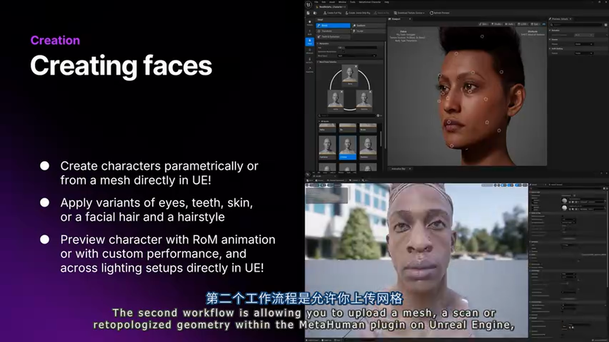

Mesh to MetaHuman 功能允许导入扫描数据或手工制作的网格，自动转换为 MetaHuman 角色。

#### 引擎内预览与实时编辑

Unreal Engine 5.6 的一个重要改进是 MetaHuman 现在完全集成到引擎中：

**实时预览能力**：
- 在引擎内直接创建角色
- 实时预览不同光照条件下的效果
- 加载运动范围动画（Range of Motion）查看角色运动

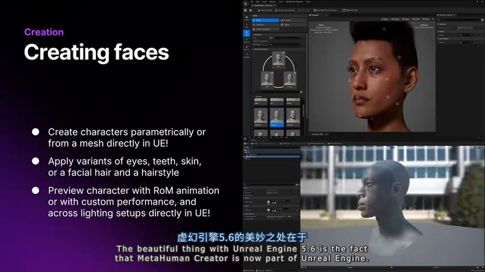
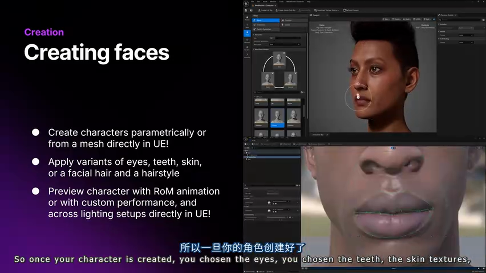

引擎集成为创作者提供了即时的视觉反馈，无需在外部工具和引擎间切换。

**资源选择与预览**：
- 选择眼睛、牙齿、皮肤纹理等资源
- 在不同光照样本下预览效果
- 实时调整角色外观

### 参数化身体系统

在 Unreal Engine 5.6 中，MetaHuman 引入了参数化身体系统，这是一个重大升级：

**身体比例控制**：
- 调整手臂长度
- 调整腿部长度
- 调整肩宽和腰宽
- 系统自动生成对应的身体绑定

**设计理念**：这种参数化设计使得：
- 快速创建不同体型的角色
- 保持绑定系统的一致性
- 自动适配服装和配件

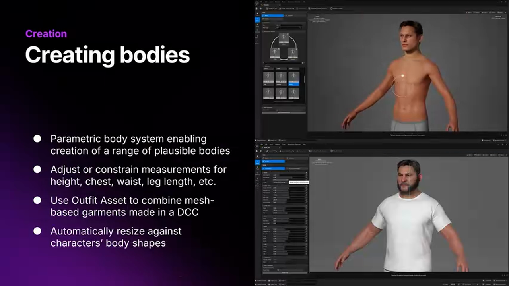

参数化身体系统提供了直观的控制界面，允许快速调整身体比例。

#### 服装系统（Outfit Asset）

MetaHuman 的服装系统支持将 DCC 中制作的基于网格的服装应用到角色上：

**核心功能**：
- 处理复杂的服装组合（衬衫、夹克、裤子等）
- 确保服装之间的正确交互
- 支持 Chaos 布料物理系统

**自动适配机制**：
- 当导入服装时，系统自动适配到 MetaHuman 身体比例
- 当调整身体比例时，服装自动调整适配
- 双向同步确保服装始终贴合身体

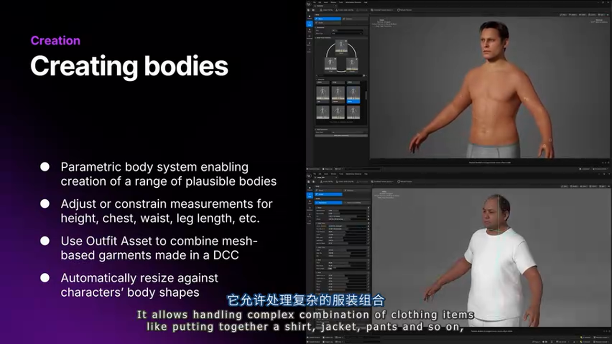

服装系统支持复杂的多层服装组合，并自动处理服装间的物理交互。

### 高级定制工具

当基础角色创建完成后，艺术家往往需要进一步的艺术化修改。MetaHuman 提供了两种专业的 DCC 工具：

#### MetaHuman for Maya 插件

MetaHuman for Maya 是专为行业专业人士设计的工具，面向角色绑定师、建模师和技术美术：

**Character Assembler（角色组装器）**：
- 从 Unreal Engine 导出 DNA 文件
- 在 Maya 环境中加载 DNA
- 完整重建面部和身体绑定、纹理等资源

**技术实现**：Character Assembler 确保：
- 从引擎导出的角色在 Maya 中完全重建
- 保持绑定结构的完整性
- 支持双向工作流（引擎 ↔ Maya）

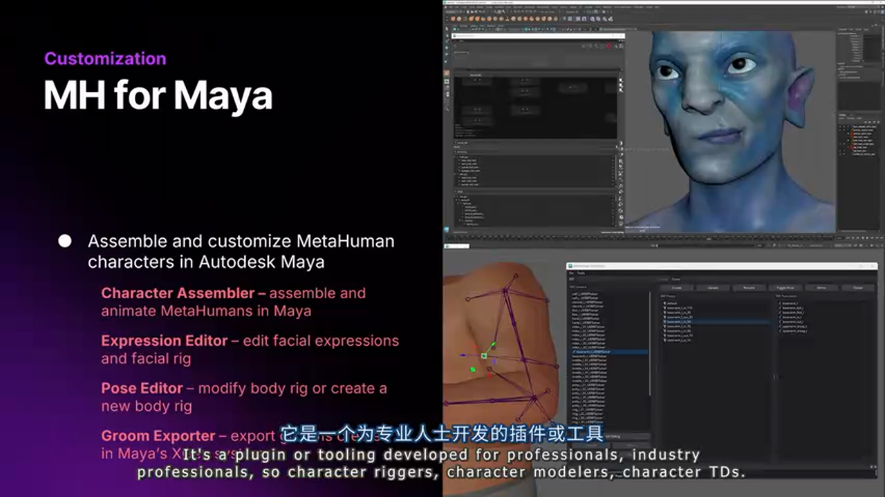

Character Assembler 确保角色在 Maya 中的重建与引擎中完全一致。

**Expression Editor（表情编辑器）**：
这是备受期待的功能，允许用户编辑角色的面部表情：

**应用场景**：
- 修改微笑表情，创建不同的表情风格
- 导入扫描数据，推进角色相似度
- 创建轻微风格化的角色外观

**技术优势**：Expression Editor 提供了：
- 细粒度的表情控制
- 保持绑定结构的完整性
- 与引擎的双向同步

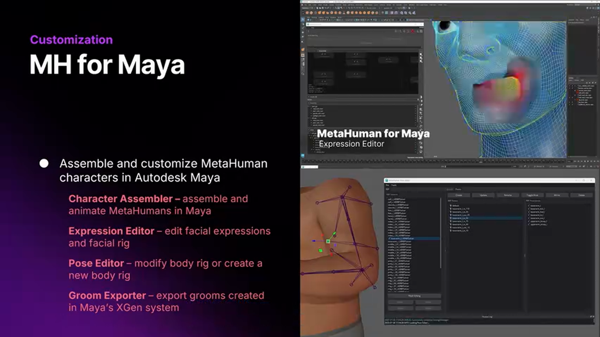

Expression Editor 允许艺术家精细调整角色的面部表情，这是实现高质量角色表现的关键工具。

**Pose Editor（姿态编辑器）**：
这是最近两周才发布的新功能，用于定制 MetaHuman 身体绑定：

**功能特性**：
- 自定义身体绑定结构
- 为不同角色构建不同类型的身体绑定
- 支持高度定制化的身体形态

Pose Editor 是 MetaHuman for Maya 的最新功能，为身体绑定提供了更大的灵活性。

**Groom Exporter（毛发导出器）**：
支持将 XGen 制作的毛发从 Maya 导出到 Unreal Engine

#### MetaHuman for Houdini 插件

随着 Houdini 21 的发布，MetaHuman 也提供了 Houdini 插件支持：

**Character Rig HDA**：
- 在引擎中创建角色并导出 DNA
- 在 Houdini 中导入 DNA
- 使用 MetaHuman for Houdini 插件重建面部、身体绑定和纹理

**应用场景**：
- 在 Houdini 中进行模拟
- 在 Houdini 中进行动画
- 在 Houdini 中进行渲染和光照

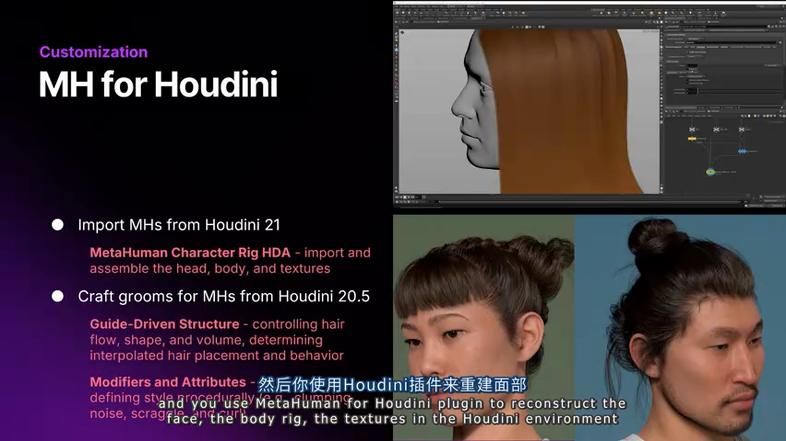

Houdini 插件使得 MetaHuman 角色可以在程序化环境中使用，支持复杂的特效和模拟工作。

**高保真毛发创建工具**：
MetaHuman for Houdini 插件包含强大的毛发创建工具：

**两种创建方式**：
1. **基于引导驱动**（Guide-Driven）：
   - 通过引导结构控制发型形状
   - 控制方向
   - 控制发丝在发型中的插值

2. **基于修饰器和属性**（Modifiers and Attributes）：
   - 使用程序化节点进行聚集（clumping）
   - 制作卷发效果
   - 制作凌乱效果，使头发看起来更自然

Houdini 的毛发工具提供了程序化的毛发创建能力，支持复杂且自然的发型制作。

### 动画解决方案

#### MetaHuman Animator 概述

MetaHuman Animator 是面部动画解决方案，被业界认为是**最先进的面部动画解决方案**：

**核心能力**：
- 导出高保真面部动画
- 支持多种输入源
- 动画可应用于任何 MetaHuman 角色
- 动画是可编辑的、语义可读的

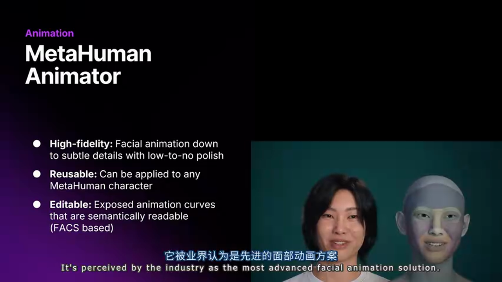

MetaHuman Animator 提供了专业的面部动画工具，支持多种输入源和实时处理。

#### 生产验证结果

通过与 AAA 项目的合作，MetaHuman 团队发现：

> 如果性能捕捉指导得当（performance capture is directed properly），即演员被指导与摄像机互动、与环境互动、与其他演员正确互动，那么 MetaHuman Animator 导出的动画**几乎不需要或只需要最少的抛光（polish）工作**。

这是一个重要的发现，说明 MetaHuman Animator 的输出质量已经达到生产级别。

#### 动画通用性与可编辑性

**跨角色应用**：
- 从 MetaHuman Animator 导出的动画可以应用于任何 MetaHuman 角色
- 这使得团队可以建立动画库
- 支持动画的复用和重新用途

**可编辑性**：
- 所有动画都是语义可读的（semantically readable）
- 可以进一步手动抛光或关键帧编辑
- 使用 MetaHuman Control GUI 进行精细调整

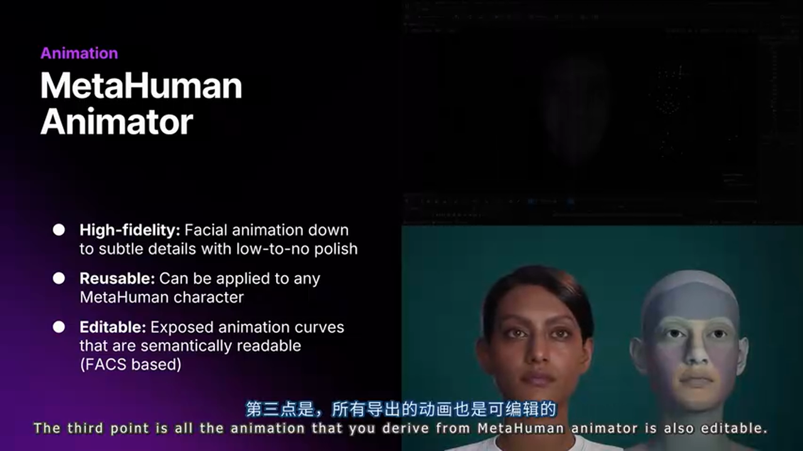

MetaHuman 的控制界面允许艺术家对自动生成的动画进行精细调整。

#### 输入源支持

MetaHuman Animator 支持多种输入源，这使得工作流非常灵活：

**深度数据（Depth Data）**：
- iPhone 12 或更新型号
- 立体相机设置（双相机系统）
- 专业的动作捕捉设备

**视频数据**（Unreal Engine 5.6 新增）：
- 任何视频数据源
- Web 摄像头
- 专业摄像机
- 手机摄像头

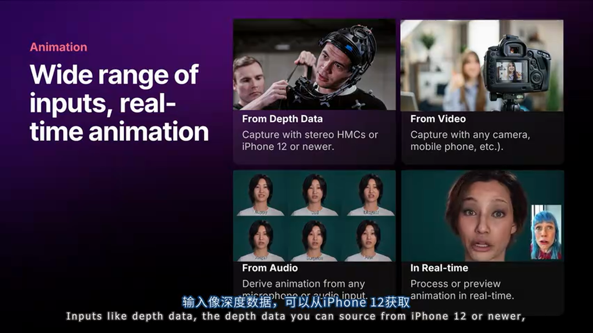

MetaHuman Animator 支持多种输入设备，从消费级到专业级都有支持。

**音频数据**（重大特性）：
- 加载任何音频文件
- 自动提取唇形同步（lip sync）
- 自动提取头部运动
- 自动提取眨眼动作

> 音频驱动的面部动画是一个重大突破，它使得动画制作流程更加高效，特别适合快速预览和迭代。

#### 实时功能

从 Unreal Engine 5.6 开始，MetaHuman Animator 提供了实时功能：

**实时音频处理**：
- 快速预览动画
- 快速处理动画
- 甚至可以让玩家通过音频或视频数据来动画化角色

**应用场景**：
- 游戏中的实时对话系统
- 虚拟主播和虚拟形象
- 实时演示和原型制作

实时功能使得 MetaHuman Animator 可以用于交互式应用，而不仅仅是离线渲染。

### 市场平台

#### MetaHuman on Fab

从 2024 年 6 月开始，Epic Games 发布了 MetaHuman on Fab，这是一个专门的市场平台：

**平台功能**：
- 发现 MetaHuman 角色
- 分享角色资产
- 购买和销售角色
- 购买和销售 MetaHuman 兼容的配件和物品

MetaHuman on Fab 为创作者提供了一个完整的市场生态系统。

**资产验证机制**：
- 所有上传到 Fab 的 MetaHuman 资产都经过验证
- 确保所有内容都是 MetaHuman 兼容的
- 保证资产质量和一致性

**使用场景**：
- 为角色寻找服装，去 Fab
- 寻找特定的角色（如海盗角色），去 Fab
- 如果对角色不满意（如鼻子），可以在引擎中调整

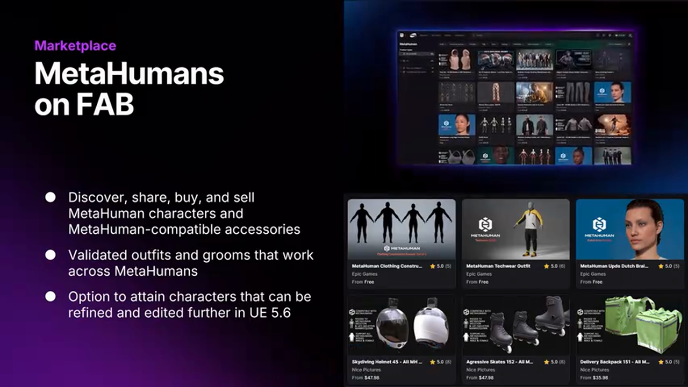

Fab 平台上的资产可以直接导入到 Unreal Engine 中使用，并且可以在引擎中进行进一步调整。

#### 插件下载

MetaHuman on Fab 也是 MetaHuman 插件的下载中心：
- MetaHuman 插件（引擎内）
- MetaHuman for Maya
- MetaHuman for Houdini

所有插件都是**免费使用、免费下载**。

## 深度进阶

### 技术架构分析

#### DNA 文件系统

MetaHuman 的核心是 DNA 文件系统，这是一个强大的数据格式：

**DNA 文件的作用**：
- 存储角色的所有参数（面部、身体、纹理等）
- 可以在引擎和 DCC 工具间无损传输
- 支持版本控制和增量更新

**技术优势**：
- 数据紧凑，传输高效
- 格式稳定，向后兼容
- 支持部分更新，无需重新导出整个角色

#### Rig Logic 系统

MetaHuman 的绑定系统基于 Rig Logic，这是一个运行时系统：

**工作原理**：
- Rig Logic 在运行时计算绑定参数
- 支持实时动画和编辑
- 保持绑定结构的一致性

**性能考虑**：
- 计算高效，适合实时渲染
- 支持多线程处理
- 针对不同平台优化

### 生产流程优化

#### 统一管线（Uniform Pipeline）的价值

通过使用 MetaHuman 资产标准，团队可以实现：

**工作流统一**：
- 所有角色使用相同的导入流程
- 所有角色使用相同的动画流程
- 动画可以在角色间共享

**资源管理简化**：
- 统一的资源命名规范
- 统一的版本控制策略
- 统一的性能优化方法

#### 平台适配策略

MetaHuman 的 8 级 LOD 系统提供了灵活的平台适配：

**LOD 分配策略**：
- LOD 0-2：PC/主机高保真
- LOD 3-5：移动端平衡模式
- LOD 6-7：低功耗设备优化模式

**性能优化建议**：
- 根据目标平台选择合适的 LOD 级别
- 使用 UEFN 优化的资产可以获得更好的移动端性能
- 考虑动态 LOD 切换以平衡质量和性能

## 实战总结与建议

### 方案对比

> **方案 A：传统手工制作流程**
> 
> - 🟢 优势：
>   - 完全控制每个细节
>   - 可以实现高度风格化的外观
>   - 不受工具限制
> 
> - 🔴 劣势：
>   - 制作周期长（数周至数月）
>   - 需要大量专业技能
>   - 难以实现角色间的统一性
>   - 动画无法跨角色复用
> 
> - 🎯 适用场景：
>   - 高度风格化的独立项目
>   - 需要独特外观的主角
>   - 对制作时间不敏感的项目

> **方案 B：MetaHuman 完整管线**
> 
> - 🟢 优势：
>   - 快速迭代（数小时至数天）
>   - 统一的资产标准和工作流
>   - 动画可跨角色复用
>   - 自动化的绑定和优化
>   - 支持多种输入源（扫描、视频、音频）
>   - 完整的工具链支持
> 
> - 🔴 劣势：
>   - 受限于 MetaHuman 的技术规范
>   - 高度风格化的外观需要额外工作
>   - 依赖 Epic Games 的工具更新
> 
> - 🎯 适用场景：
>   - 需要大量角色的项目（游戏、影视）
>   - 需要快速迭代的项目
>   - 需要跨平台部署的项目
>   - 需要统一视觉风格的项目

> **方案 C：混合方案（MetaHuman + 手工定制）**
> 
> - 🟢 优势：
>   - 结合快速迭代和精细控制
>   - 基础角色使用 MetaHuman，关键角色进行手工定制
>   - 利用 MetaHuman 的工具链进行优化
> 
> - 🔴 劣势：
>   - 需要维护两套工作流
>   - 成本相对较高
> 
> - 🎯 适用场景：
>   - 大型项目（主角使用 MetaHuman 基础+定制，NPC 使用纯 MetaHuman）
>   - 对质量要求高但对时间敏感的项目

### 避坑指南

**1. DNA 文件版本管理**

**问题**：DNA 文件在不同版本的工具间可能不兼容

**解决方案**：
- 在项目中统一工具版本
- 保存 DNA 文件时记录版本信息
- 使用版本控制系统管理 DNA 文件
- 定期备份 DNA 文件

**2. 性能优化陷阱**

**问题**：使用高 LOD 级别导致移动端性能问题

**解决方案**：
- 根据目标平台选择合适的 LOD
- 使用 UEFN 优化的资产
- 实施动态 LOD 系统
- 进行性能分析和测试

**3. 动画复用限制**

**问题**：不同身体比例的 MetaHuman 角色，动画复用可能出现问题

**解决方案**：
- 使用参数化身体系统创建标准体型
- 在动画制作时考虑身体比例的差异
- 使用 Pose Editor 进行微调
- 建立角色分类系统（标准、瘦、胖等）

**4. DCC 工具集成问题**

**问题**：Maya/Houdini 插件更新后，旧项目的 DNA 文件可能无法正确加载

**解决方案**：
- 保持插件版本与引擎版本同步
- 测试环境先行验证
- 建立项目工具版本清单
- 保留旧版本插件作为备份

**5. 市场资产质量差异**

**问题**：Fab 平台上的资产质量参差不齐

**解决方案**：
- 仔细审查资产预览
- 查看资产评分和评论
- 在项目环境中测试资产
- 建立内部资产库和质量标准

**6. 实时动画性能**

**问题**：使用 MetaHuman Animator 的实时功能时，性能可能成为瓶颈

**解决方案**：
- 优化视频输入分辨率
- 使用硬件加速
- 限制同时处理的角色数量
- 考虑使用离线处理模式

### 最佳实践

**1. 建立标准工作流**

- 定义清晰的角色创建流程
- 建立命名规范（角色、动画、资产）
- 使用版本控制系统
- 文档化工作流程

**2. 资产库管理**

- 建立内部 MetaHuman 角色库
- 建立动画库和表情库
- 定期审查和清理资产
- 建立资产使用统计

**3. 性能监控**

- 建立性能基准测试
- 监控不同平台的性能表现
- 建立性能预警机制
- 定期优化资产

**4. 团队培训**

- 培训团队使用 MetaHuman 工具
- 分享最佳实践和技巧
- 建立内部知识库
- 定期技术分享

**5. 工具链集成**

- 将 MetaHuman 集成到现有工具链
- 自动化常用操作（导出、导入、转换）
- 建立 CI/CD 流程
- 监控工具更新

## 项目案例与行业应用

MetaHuman 已经被广泛应用于各种项目：

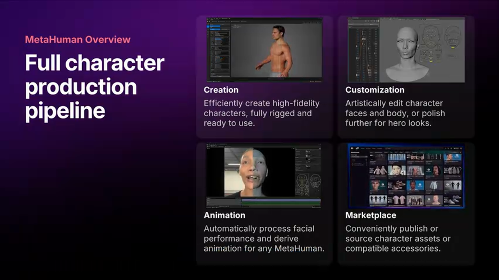
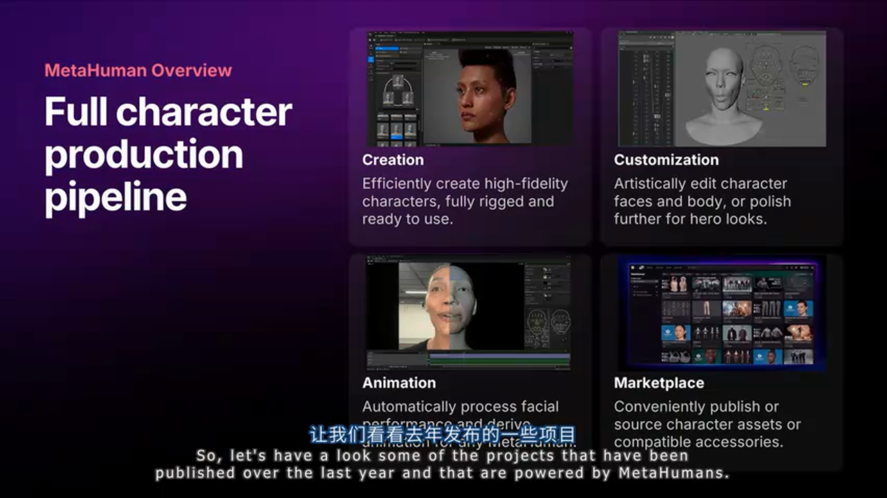
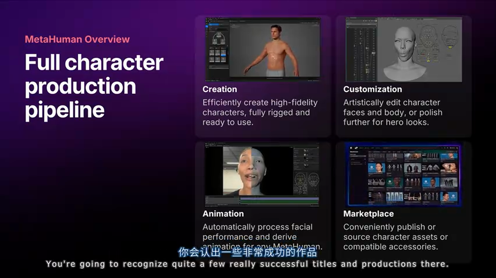

从图中可以看到，MetaHuman 已经被用于多个成功的游戏和影视项目，包括《我们的战争还未结束》、《欢迎，进入》等。

这些项目证明了 MetaHuman 在生产环境中的实用性和可靠性。无论是游戏还是线性媒体，MetaHuman 都能够提供高质量的解决方案。

## 学习资源

Epic Games 提供了丰富的学习资源，帮助开发者深入理解 MetaHuman：

**1. 自定义和风格化角色创建**
- 在 Unreal Fast Orlando 上的演讲
- 由 MetaHuman 团队的角色艺术家讲解
- 涵盖如何在引擎内的 MetaHuman Creator 中创建定制和风格化角色

**2. MetaHuman for Maya 插件应用**
- 解释如何使用 MetaHuman for Maya 插件
- 详细讲解 Expression Editor 的使用
- 展示如何进行角色的进一步编辑

**3. MetaHuman 绑定和资产类概述**
- 来自去年 Unreal Fast 的演讲
- 提供 MetaHuman 绑定的概述
- 解释 Rig Logic、DNA 文件等核心概念
- 说明 MetaHuman 绑定如何在运行时工作

## 总结与展望

MetaHuman 作为 Epic Games 在数字角色领域的核心产品，正在持续演进。从 Unreal Engine 5.6 开始，MetaHuman 已经走出早期访问阶段，计划与 UE 版本同步发布定期更新。

**核心价值**：
- 统一的资产标准和工作流
- 完整的工具链支持
- 跨平台部署能力
- 生产效率的显著提升

**技术趋势**：
- 引擎内集成度不断提升
- 实时处理能力增强
- DCC 工具集成更加完善
- 市场生态逐渐成熟

**未来展望**：
Epic Games 鼓励开发团队开始测试和实验 MetaHuman，开始将 MetaHuman 集成到角色管线中。MetaHuman 是强大的工具，会继续演进和进步，被认为是角色的行业标准和质量基准，适用于交互式和线性媒体。

同时，Epic Games 也希望通过与开发者的合作，了解什么对角色生产是重要的，以便进一步优化 MetaHuman，支持开发者的创意愿景。

---

**参考资料**：
- MetaHuman 官方文档：https://docs.unrealengine.com/en-US/metahuman/
- MetaHuman on Fab：https://www.unrealengine.com/marketplace/en-US/profile/MetaHuman
- 视频源：https://www.bilibili.com/video/BV1eF2NBDEfG

**本文基于 AI 自动转录生成，可能存在翻译和理解误差，建议结合原视频观看以获得最准确的信息。**

