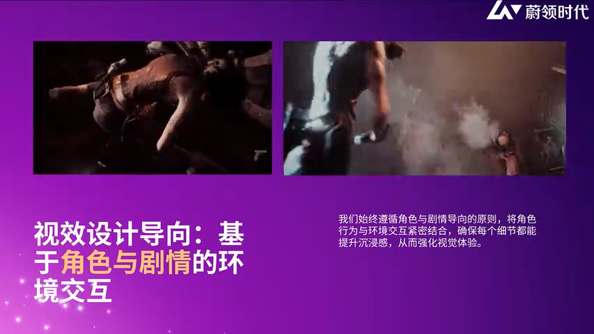
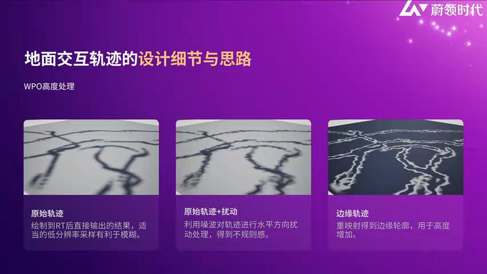
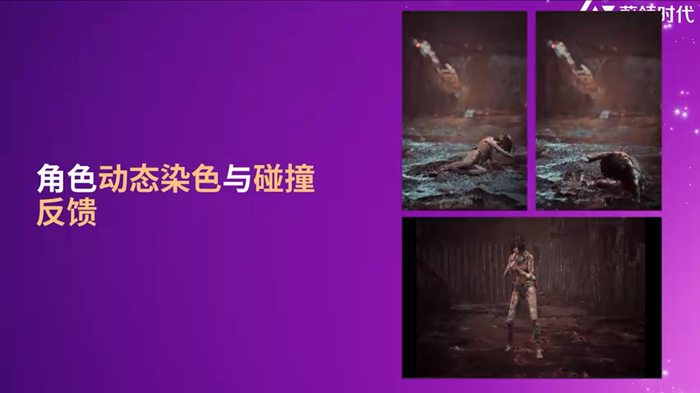
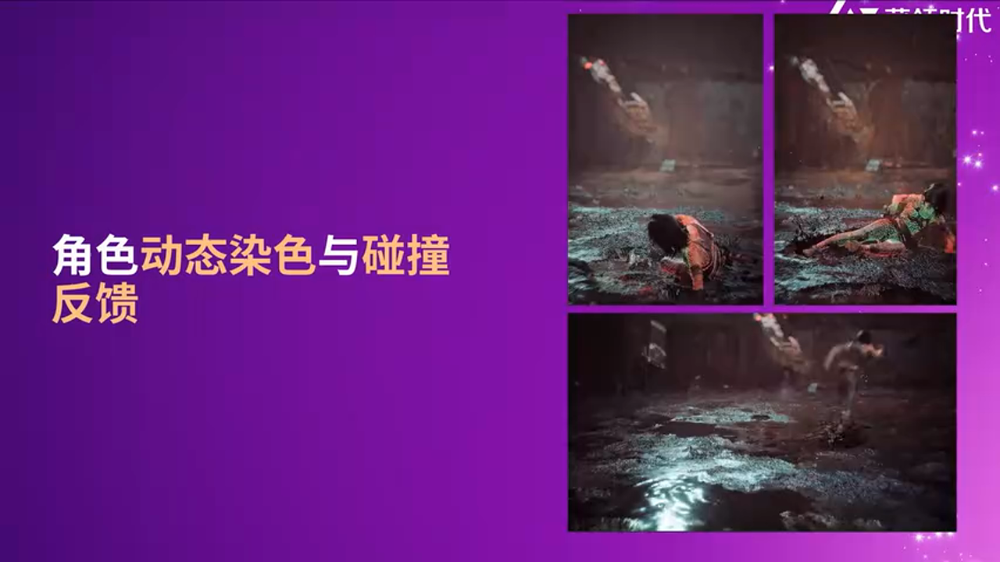
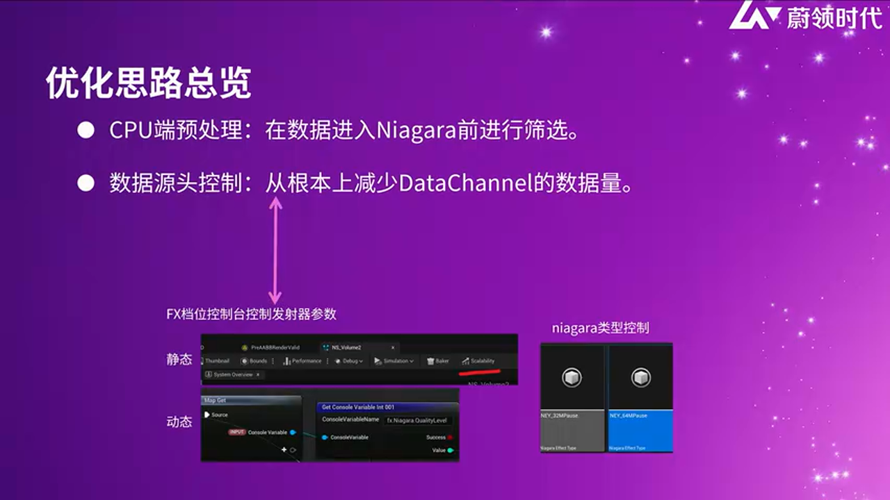
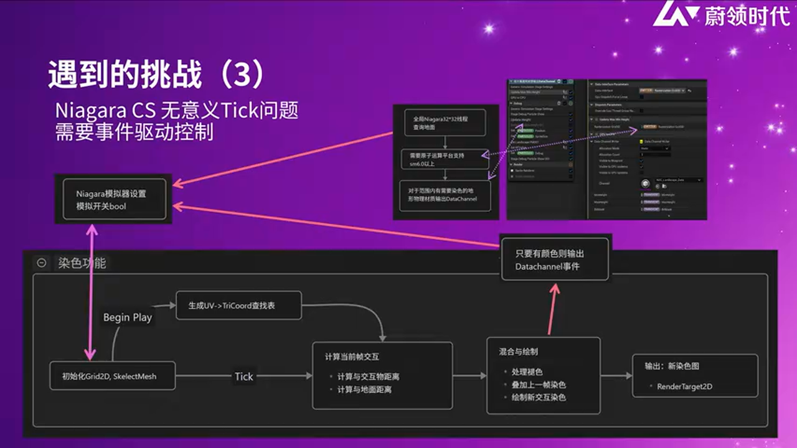
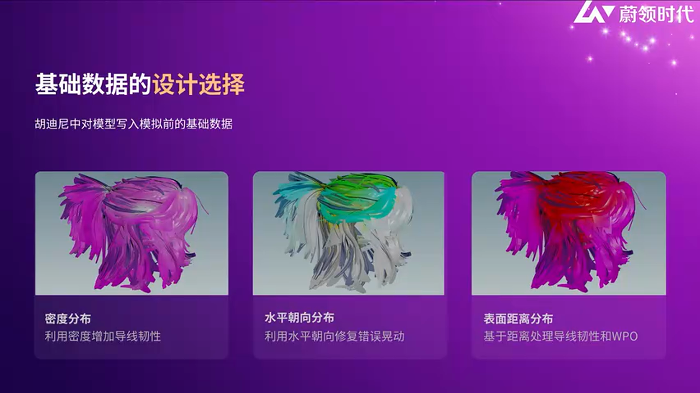
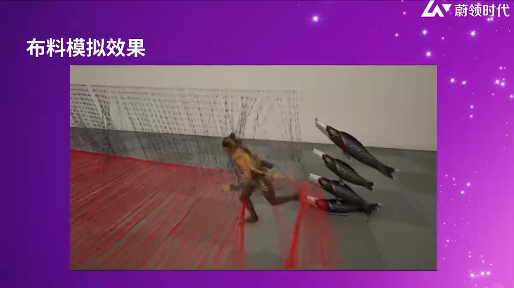
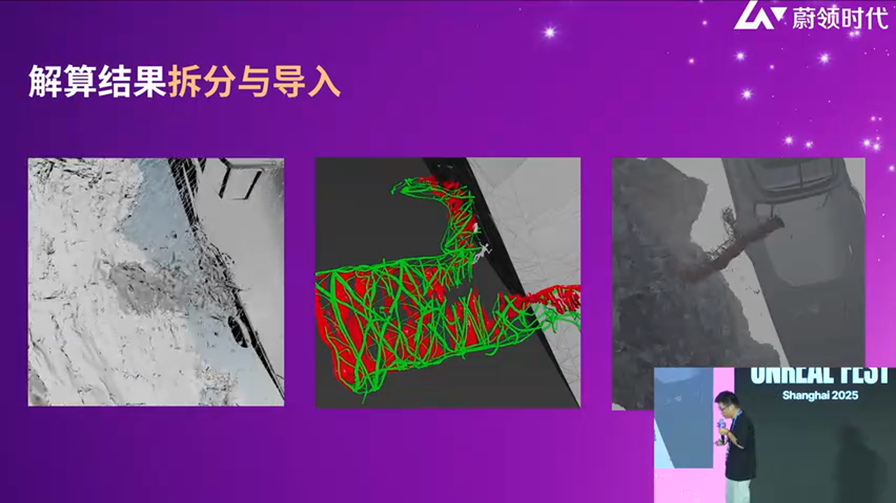

# 实时渲染中的视效工业化实践：从角色交互到物理模拟的深度解析

---


## 加入 UE5 技术交流群

如果您对虚幻引擎5的图形渲染技术感兴趣,欢迎加入我们的 **UE5 技术交流群**！

扫描上方二维码添加个人微信 **wlxklyh**，备注"UE5技术交流"，我会拉您进群。

在技术交流群中，您可以：
- 与其他UE开发者交流渲染技术经验
- 获取最新的GDC技术分享和解读
- 讨论图形编程、性能优化、构建工具流、动画系统等话题
- 分享引擎架构、基建工具等项目经验和技术难题

---

**本文基于 UFSH2025 峰会的技术分享整理而成**，由 AI 辅助生成。
**源视频**：[《木兰2125》中的视效落地挑战与表现力优化](https://www.bilibili.com/video/BV1fD2PBoE8B)
**主讲人**：李仕林、杨瑞（蔚领时代方舟工作室）

---

## 导读

> **核心观点**：
> - 视效设计的本质是服务于角色塑造和情绪表达，而非单纯的环境装饰
> - 实时物理交互系统需要在性能与真实感之间找到精确平衡点
> - VR 影视制作对物理模拟的确定性和可重复性提出了更高要求

**前置知识**：本文假设读者熟悉 Unreal Engine 5 的基础渲染管线、Niagara 粒子系统、以及基本的材质编辑流程。文章将深入探讨地形交互、角色染色、头发物理模拟以及大规模破坏效果的工程化实现方案。

---

## 一、视效设计理念：技术服务于叙事

### 从环境到角色：设计哲学的转变

在传统的游戏或影视制作中，视效往往被视为"环境的一部分"。但在《木兰2125》这样的 VR 电影项目中，团队重新定义了视效的核心价值：**视效是角色情绪和动作的延伸**。


_视效设计理念：服务于角色与剧情_

这种设计哲学的转变源于一个关键认知：单纯追求技术炫耀很容易陷入"为了制作而制作"的陷阱，最终产出的内容会与角色、故事、世界观产生脱节。在项目初期，团队就明确了一个原则：

> **天气系统、交互效果、特效元素都必须呼应角色的动作和情绪状态。**

以战斗场景为例，主角不仅在与敌人交战，环境本身（水花飞溅、泥泞痕迹、落地冲击）也在实时响应角色的情绪和动作强度。这种设计让观众能够更直观地感受到角色在恶劣环境下作战的沉重感和厚重感。


_环境交互响应角色战斗状态_

---

## 二、地形交互系统：从脚印到物理反馈的工程化实现

### 2.1 技术方案选型

针对地形交互需求，团队评估了多种方案，最终选择了 **虚拟高度场（Virtual Heightfield）** 作为核心技术路线。

> **方案 A：Virtual Heightfield**
> - 🟢 优势：性能开销适中，支持实时修改，易于与现有地形系统集成
> - 🔴 劣势：缺乏原生阴影支持，需要额外处理光照反馈
> - 🎯 适用场景：中小规模场景，需要频繁地形交互的实时渲染场景

> **方案 B：Runtime Virtual Texture (RVT)**
> - 🟢 优势：高精度，支持复杂材质混合
> - 🔴 劣势：内存占用高，不适合大规模动态交互
> - 🎯 适用场景：静态或半静态的高精度地形细节

对于水体部分，团队采用了官方的 **Water 内容示例** 中的浅水方程 Niagara 系统，并将其与地形材质进行深度集成。这套方案经过性能优化后，能够确保水面与不规则水坑边缘产生精确碰撞。


_水体系统与地形交互的集成方案_

---

### 2.2 脚印轨迹的细节设计

脚印轨迹系统看似简单，实则包含了大量物理细节的模拟。团队在原始 RT 方案基础上，针对以下三个维度进行了深度优化：

#### **优化点 1：低分辨率 + 柔和处理**

低分辨率的 RT 方案在性能上更友好，但会导致轨迹边缘过于锐利。团队采用了 **自适应模糊 + 边缘平滑** 策略：

- 对轨迹进行柔和处理，消除像素化边缘
- 使用噪声贴图对边缘进行不规则扰动，模拟真实的泥土散开效果


_脚印轨迹的低分辨率优化方案_

#### **优化点 2：不规则扰动模拟物理散开**

在现实世界中，踩踏泥地或沙土时，材质的散开效果取决于：
- 踩踏力度
- 接触面积
- 材质的物理特性（粘度、密度等）

为了模拟这种物理真实感，团队使用 **不规则噪声扰动** 对轨迹进行逐帧扰动：

```hlsl
// [基于视频上下文的逻辑补全]
// 使用 Perlin Noise 对轨迹边缘进行扰动
float NoiseValue = PerlinNoise(UV * NoiseScale + Time * NoiseSpeed);
float DistortedMask = FootprintMask * (1.0 + NoiseValue * DistortionStrength);
```

这种扰动让每一个脚印都具有独特的不规则性，避免了重复感。

#### **优化点 3：边缘隆起效果（基于距离场的二次 AO）**

在真实的踩踏场景中，脚印中心会被压低，而边缘会因为挤压而向上隆起。团队通过 **基于距离场的重染色** 实现了这一细节：

1. 计算每个像素到脚印中心的距离
2. 根据距离生成边缘遮罩
3. 将边缘遮罩叠加到高度场上，形成隆起效果


_脚印的挤压感与厚度感优化_

这种处理让脚印不再是简单的"压痕"，而是具有真实物理厚度的交互效果。

---

### 2.3 动态光照响应：主光源方向的二次 AO 计算

常规的轨迹渲染通常只做颜色处理，但团队在此基础上又进了一步：**使用主光源方向对轨迹进行二次 AO 计算**。

这种技术的核心思想是：
- 根据主光源方向计算轨迹的受光面和背光面
- 在背光面增强 AO 强度，模拟自阴影效果
- 让轨迹的明暗关系能够随光源变化而动态调整

```hlsl
// [基于视频上下文的逻辑补全]
float3 LightDir = GetMainLightDirection();
float3 TrackNormal = CalculateTrackNormal(HeightFieldGradient);
float LightingAO = saturate(dot(TrackNormal, LightDir));
FinalColor = BaseColor * (1.0 - AO_Intensity * (1.0 - LightingAO));
```

这种处理让轨迹的 **立体感** 和 **力气感** 得到了显著提升，与场景光照形成了有机联动。


_加入光照响应后的最终效果_

---

## 三、角色染色系统：精准的物理材质交互

### 3.1 设计需求：从全身开关到逐像素精度

在泥泞场景中战斗时，角色身上沾染污渍是增强沉浸感的重要手段。传统方案通常使用 **动画通知（AnimNotify）** 来全局开关染色效果，但这种方案存在明显问题：

- 即使加了渐变，也是全身统一变化
- 缺乏细节感，无法根据接触部位精准染色

团队的目标是：**实现基于真实几何体高度的逐像素染色判定**。


_传统全身染色方案的局限性_

---

### 3.2 技术实现：UV 展开 + 骨骼位置反向变换

核心技术路径如下：

1. **准备平展 UV**：使用 UE5 的模型编辑器（Modeling Mode）中的 UV 编辑器，对角色 Mesh 进行自动展开（Auto Unwrap）
2. **通过 UV 查询三角面信息**：每个 UV 坐标对应一个三角面，包含该三角面的本地坐标和骨骼索引
3. **骨骼位置反向变换**：通过骨骼位置将本地坐标转换为世界坐标
4. **高度判定**：在世界空间中查询地形高度，判断该顶点是否应该被染色


_基于 UV 展开的精准染色蒙版_

### 3.3 性能优化：数据通道 + CPU 预过滤

Niagara 的数据通道（Data Channel）支持场景查询，但存在 **大量 GPU 迭代开销**。为了优化性能，团队采用了以下策略：

#### **优化 1：CPU 粒子预过滤**

在 Niagara 中使用 **CPU Particles** 进行第一轮过滤，只有通过初步判定的粒子才会进入 GPU 计算阶段。


_CPU 粒子预过滤减少 GPU 开销_

#### **优化 2：静态与动态粒子分离控制**

官方提供了两种粒子控制模式：
- **静态控制**：粒子开关由层级切换决定
- **动态控制**：通过粒子系统的控制台动态调整参数

团队建议在染色系统中使用 **动态控制**，以便在运行时根据角色状态实时调整染色强度和范围。

#### **优化 3：物理材质回读**

由于粒子系统的 VM 虚拟机限制，无法直接写入动态循环数据。团队采用了 **GPU Readback + CPU 接收** 的迂回方案：

1. 从地形材质中读取物理材质信息（泥土、沙子、水等）
2. 通过 GPU 回读将数据传回 CPU
3. CPU 根据物理材质类型控制粒子数量和行为


_物理材质回读流程_

虽然这种方案增加了一定的延迟，但在影视制作的离线渲染场景中可以接受。

---

### 3.4 避坑指南：Data Channel 的性能陷阱

> **关键建议**：
> - 避免在 Niagara VM 中写入大量循环数据，优先使用 CPU Scratch Pad
> - 如果项目对性能要求极高，建议使用 **Compute Shader + ADG（Async Dispatch GPU）** 方案
> - 注意：截至 UE 5.6，ADG 的粒子间 GPU 直接调度功能仍未完全实现

官方推荐的 ADG 方案理论上可以实现 **GPU 直接触发粒子执行 CS（Compute Shader）**，完全绕过 CPU 回读，但目前仍处于实验阶段。团队建议在正式项目中谨慎使用。

---

## 四、头发物理模拟：从 Groom 到 Strand-based PBD 的稳定性优化

### 4.1 Groom 方案的确定性问题

UE5 的 **Groom 系统** 提供了强大的头发物理模拟能力，但在 VR 影视制作中暴露了一个致命问题：**物理结果的不确定性**。


_Groom 物理模拟的不确定性问题_

由于 Groom 是基于实时物理模拟的，每次运行的结果都会有微小差异。在需要多次渲染和合成的影视项目中，这会导致：
- 不同 Take 之间头发状态不一致
- 后期合成时出现闪烁或跳跃

### 4.2 解决方案：GroomCache + 权重蒙版优化

团队的解决方案分为两步：

#### **第一步：烘焙 GroomCache**

将 Groom 的物理模拟结果烘焙为 **GroomCache**，确保每次播放都使用完全相同的数据。这保证了渲染结果的 **100% 可重复性**。


_GroomCache 确保物理模拟的确定性_

#### **第二步：权重蒙版优化物理效果**

Groom 的物理模拟是全局计算的，这导致一个问题：**头顶的头发也会受到剧烈晃动影响**，这在物理上是不合理的。

团队通过 **权重蒙版（Weight Map）** 对不同区域的头发施加不同的物理强度：
- **头顶区域**：低权重，几乎不受物理影响，保持稳定
- **发尾区域**：高权重，充分响应物理力，保持动态感


_权重蒙版优化前后对比_

这种处理让头发的物理效果既真实又可控，避免了过度夸张的晃动。

---

### 4.3 Strand-based PBD 算法详解

Groom 的物理模拟基于 **Position Based Dynamics (PBD)** 算法。团队的技术讲解中提到了核心流程：

1. **位置预测**：根据当前速度和重力预测下一帧位置
2. **速度更新**：更新粒子速度
3. **约束求解**（核心环节）：
   - **距离约束**：保持相邻粒子间的距离
   - **弯曲约束**：限制发丝的弯曲角度
   - **旋转约束（Twist Constraint）**：防止发丝扭曲
4. **碰撞处理**：
   - 外部碰撞：与场景物体的碰撞
   - 自碰撞：发丝之间的碰撞


_Strand-based PBD 算法流程_

#### **性能优化：Shared Group 技术**

团队特别推荐了 Niagara 的 **Shared Group（共享群组）** 技术：

> **Shared Group 的优势**：
> - 基于 GPU 缓冲的 LDS（Local Data Share）
> - 多个粒子系统可以共享同一组数据，减少重复计算
> - 更快的读写速度（比普通缓冲快数倍）
> - 更快的同步速度


_Shared Group 技术优化性能_

要启用 Shared Group，需要在插件的 `Shaders` 文件夹中添加特定的 HLSL 路径，并在 Niagara 的 **虚拟引用路径（Virtual Include Path）** 中注册。

---

### 4.4 稳定性方案：Alembic 缓存 + 动态力场

为了进一步增强稳定性，团队还采用了 **Alembic 缓存** 方案，并结合 **动态力场（Force Field）** 实现二次控制：

- **Alembic 缓存**：将头发动画导出为 Alembic 文件，在引擎中播放
- **动态力场**：在 Alembic 基础上，通过 **Local Space Force Field** 添加上升力或其他动态效果


_动态力场增强表现力_

这种方案的优势在于：
- 可以绑定到动态物体上，实现更复杂的交互
- 既保持了物理真实感，又提供了艺术控制空间

---

## 五、大规模破坏效果：从 Houdini 到 UE5 的工业化导入方案

### 5.1 三种导入方案对比

在影视级别的大规模破坏效果中，UE5 的实时粒子系统虽然强大，但在某些场景下仍需借助 Houdini 等 DCC 工具的离线模拟。团队评估了三种导入方案：

> **方案 A：Alembic (ABC)**
> - 🟢 优势：高精度，完整保留顶点和法线信息，支持自定义属性
> - 🔴 劣势：磁盘和运行时内存占用极高
> - 🎯 适用场景：中小规模、高精度破坏效果

> **方案 B：Vertex Animation Texture (VAT)**
> - 🟢 优势：性能极佳（4080 显卡可达 4K60fps，500 万面碎片同时播放）
> - 🔴 劣势：受纹理分辨率限制，超过上限会出现精度损失
> - 🎯 适用场景：**首选方案**，适合大规模破坏效果

> **方案 C：骨骼动画（Skeletal Animation）**
> - 🟢 优势：易于在引擎中二次调整（FK/IK），支持时间轴编辑
> - 🔴 劣势：受骨骼数量限制，不适合碎片化效果
> - 🎯 适用场景：需要后期调整的刚体动画


_三种破坏效果导入方案_

---

### 5.2 VAT 方案深度解析

**VAT（Vertex Animation Texture）** 将动画数据编码到纹理中，通过 Shader 解码并驱动顶点位置。其核心优势在于：
- 所有计算在 GPU 完成，几乎零 CPU 开销
- 可以通过多个采样器或嵌套纹理突破单张纹理的分辨率限制

团队在实际项目中使用 VAT 实现了：
- 500 万面碎片的实时播放
- 4K 60fps 的渲染性能（RTX 4080）


_VAT 方案在大规模破坏中的表现_

---

### 5.3 解算分层策略：流体 vs 刚体 vs 位移

在导出 Houdini 模拟结果时，团队强调了 **解算分层** 的重要性：

1. **流体解算**：需要高精度顶点动画，推荐 ABC 或高分辨率 VAT
2. **刚体形变**：需要保留形变信息，推荐 VAT + 法线贴图
3. **纯位移数据**：只需要旋转和位移，可使用低精度 VAT 或骨骼动画


_解算分层策略示例_

以广告牌破坏场景为例：
- **绿色部分（钢架）**：产生大量形变，使用高精度 VAT
- **红色部分（广告牌碎片）**：只有旋转和位移，使用低精度方案


_分层导出优化资源占用_

这种分层策略在保证效果的同时，显著降低了磁盘和内存占用。

---

## 六、实战总结与最佳实践

### 6.1 性能优化建议

> **核心原则**：
> - 在满足视觉需求的前提下，优先选择低开销方案
> - 利用 LOD 和距离剔除减少粒子系统负担
> - 善用 Shared Group、GPU Readback 等新特性

### 6.2 避坑指南

1. **Niagara Data Channel**：避免在 VM 中写入大量循环数据，优先使用 CPU Scratch Pad
2. **Groom 物理**：影视项目必须使用 GroomCache，避免不确定性问题
3. **VAT 分辨率**：超过纹理上限时使用多采样器或嵌套纹理
4. **解算分层**：不要将所有破坏效果一股脑导出，根据物理类型分层处理

### 6.3 未来展望

团队提到了 UE 5.6+ 的 **ADG (Async Dispatch GPU)** 技术，理论上可以实现完全的 GPU-to-GPU 粒子调度，但目前仍在实验阶段。建议开发者关注官方的 GitHub 更新，谨慎在正式项目中使用。

---

## 结语

《木兰2125》的视效实践展示了实时渲染技术在影视工业化中的巨大潜力。从精准的角色染色系统，到稳定的头发物理模拟，再到大规模破坏效果的工程化导入，每一个技术点都体现了 **在性能与质量之间寻找最优解** 的工程师思维。

对于希望在 UE5 中实现影视级视效的团队，本文提供的技术路径和避坑指南具有重要的参考价值。记住核心原则：**技术永远服务于叙事，细节决定沉浸感。**

---

**参考资源**：
- [Unreal Engine 5 官方文档 - Niagara](https://docs.unrealengine.com/5.0/en-US/niagara-visual-effects-in-unreal-engine/)
- [Groom 系统官方教程](https://docs.unrealengine.com/5.0/en-US/groom-in-unreal-engine/)
- [VAT 技术详解](https://www.sidefx.com/tutorials/vertex-animation-textures/)