# 虚幻引擎驱动的交互式艺术空间：从软控制美学到多感官叙事实践

---


## 加入 UE5 技术交流群

如果您对虚幻引擎5的图形渲染技术感兴趣，欢迎加入我们的 **UE5 技术交流群**！

扫描上方二维码添加个人微信 **wlxklyh**，备注"UE5技术交流"，我会拉您进群。

在技术交流群中，您可以：
- 与其他UE开发者交流渲染技术经验
- 获取最新的GDC技术分享和解读
- 讨论图形编程、性能优化、构建工具流、动画系统等话题
- 分享引擎架构、基建工具等项目经验和技术难题

---

> **源视频信息**
>
> 本文基于 B 站视频《[UFSH2025]基于虚幻引擎的多感官影像创作 与"软控制"美学实验》生成
>
> 视频链接：https://www.bilibili.com/video/BV1ED2PBZEe6
>
> 本文由 AI 辅助生成，结合视频字幕与截图进行深度技术解析

---

## 导读

> **核心观点**
>
> 1. 虚幻引擎不仅是渲染工具，更是一种全新的数字艺术语言，能够重组声音、画面、空间与交互多种媒介
> 2. "软控制"交互机制通过规则、节奏和环境暗示引导观众主动参与，而非强制性硬件交互
> 3. 实时音视频数据驱动的粒子系统与虚拟摄像机调度，可构建观众行为与系统响应的闭环反馈

**前置知识要求**：了解虚幻引擎基础操作、蓝图编程、Niagara 粒子系统、串口通信基础

---

## 背景与痛点：数字艺术展览中的观众参与困境


在当前的沉浸式数字影像展览空间中，存在一个普遍性问题：观众往往习惯于站在原地全程观看视觉内容，这导致他们容易忽略作品中的动态细节与空间层次。如何引导观众在空间中自由移动，并让其行为成为作品的一部分，成为互动艺术创作的核心挑战。

独立数字开发者与艺术家周子凌（莫菲奈）基于虚幻引擎创作了一件沉浸式空间作品，探索了一种名为"软控制"的美学实验：不通过物理硬件强制交互，而是利用自然语言、视觉节奏、声音氛围等元素，引导观众主动进入预设的情感轨道。

### 为什么是虚幻引擎？


虚幻引擎在艺术创作领域已经不只是工具，而是一种**全新的数字语言**。它能够快速整合多种媒介（声音、画面、空间、互动），并在以下领域提供强大支持：

- **演绎游戏**（Narrative Games）
- **引擎电影**（Engine-Driven Cinema）
- **交互艺术装置**（Interactive Art Installations）
- **沉浸式体验空间**（Immersive Experience Venues）


游戏引擎作为艺术叙事工具，具备以下核心优势：

> **虚幻引擎的三大艺术优势**
>
> - 🟢 **低门槛创造高质感世界**：内置的高质量渲染管线与资产库，让非技术背景的艺术家也能快速构建视觉效果
> - 🟢 **灵活的叙事结构**：支持非线性叙事、分支剧情、动态相机调度
> - 🟢 **实时创作迭代**：所见即所得的编辑模式，大幅缩短从概念到实现的周期

---

## 作品案例：环形沉浸式空间《无标题》


### 空间设计与硬件架构

该作品于 2024 年 5 月在上海某美术馆展出，空间设计为直径 15 米、高 6 米的环形屏幕（类似油罐空间）。虚幻引擎通过多通道输出将实时渲染画面投射到 360° 环形屏幕上，观众站在中央区域，被视觉内容完全包围。

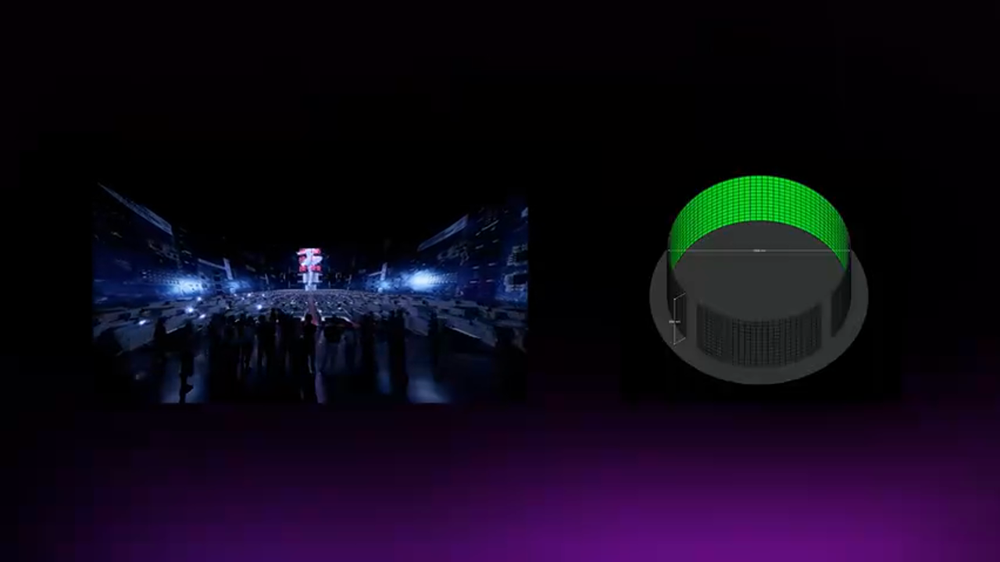

**硬件配置**：
- 环形投影屏幕：直径 15m，高度 6m
- 外部摄像头：用于采集观众位置与动作
- 实时音频系统：Ableton Live 音频工作站
- 渲染工作站：运行虚幻引擎 5 的高性能 PC

### 作品概念：软控制美学


作品探讨了一种"软控制"（Soft Control）概念——在技术官僚主义社会中，算法如何通过规则、节奏和环境暗示，精准捕捉我们的动作、注意力与欲望。

> **软控制 vs 硬控制**
>
> - **硬控制**：通过物理硬件（按钮、手柄、触摸屏）强制观众进行特定操作
> - **软控制**：通过视觉引导、声音暗示、空间氛围等非强制性手段，让观众"自愿"进入预设的情感与行为轨道

视觉内容采用抽象的办公场景风格，营造一种"控制中心"的氛围。观众在空间中走动，其行为被传感器捕捉并实时影响屏幕画面，形成"观众影响系统，系统引导观众"的闭环。

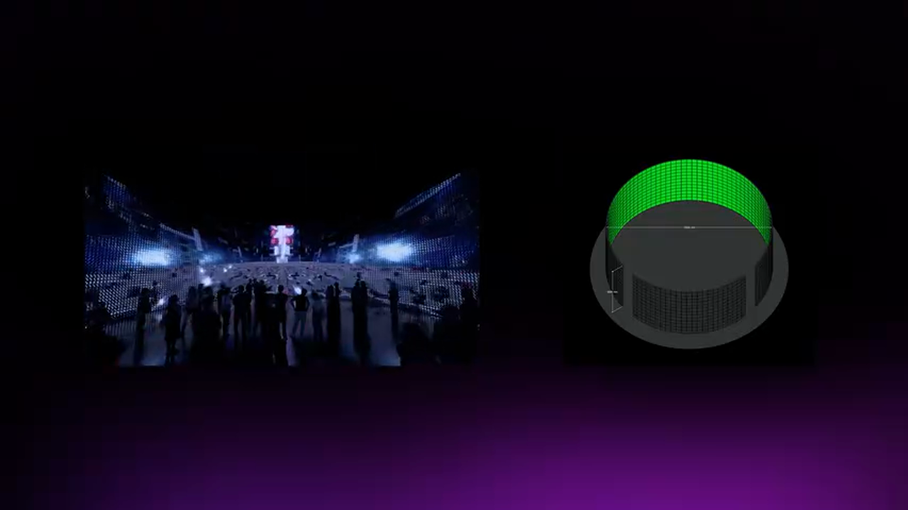

配合噪音、闪烁、复杂的节奏、深沉的音乐与时间操控，整个空间显得荒诞又陌生，让观众直观感受到算法对人类行为的监控与引导。

---

## 核心技术解析：实时交互的三层架构

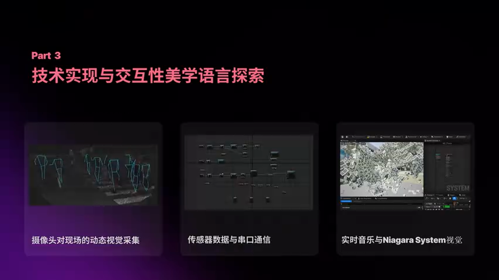

作品的技术实现主要由三个模块构成：

1. **外部传感器数据采集**：通过摄像头捕捉观众位置与动态
2. **串口通信与数据处理**：将传感器数据打包并发送到虚幻引擎
3. **虚幻引擎实时渲染**：根据数据驱动虚拟摄像机调度与粒子效果

### 第一层：传感器数据采集与处理


使用外部摄像头对现场观众的动态进行视觉采集，通过算法提取以下参数：

- **观众密度**：场域内观众数量
- **观众方位**：观众在空间中的分布位置
- **动作幅度变化**：大幅度的移动或手势

这些数据被转换为简单的信号字符串（例如 `MOVE_LEFT`、`DENSE_HIGH` 等特定字符），通过串口通信发送到虚幻引擎。

**关键设计决策**：

> **为什么使用简单字符串而非复杂 JSON 数据？**
>
> - 🟢 降低网络传输延迟，确保实时性
> - 🟢 简化蓝图解析逻辑，提高稳定性
> - 🔴 牺牲了数据的丰富性，无法传输精细的骨骼追踪数据
> - 🎯 适用场景：对精度要求不高的氛围式交互

### 第二层：虚拟摄像机的随机调度


在虚幻引擎关卡中，预设了 **12 个不断移动的虚拟摄像机**。每当传感器检测到观众行为变化时，系统会从摄像机数组中**随机抽取**一个镜头进行切换。

**蓝图实现逻辑**：

```cpp
// [AI补充] 基于上下文逻辑补全的伪代码示例

// 1. 接收串口信号
FString ReceivedSignal = SerialPort->ReadData();

// 2. 解析信号类型
if (ReceivedSignal == "MOVE_DETECTED")
{
    // 3. 从摄像机数组中随机选择一个
    int32 RandomIndex = FMath::RandRange(0, CameraArray.Num() - 1);
    ACameraActor* SelectedCamera = CameraArray[RandomIndex];

    // 4. 触发摄像机切换（带平滑过渡）
    PlayerController->SetViewTargetWithBlend(SelectedCamera, BlendTime);
}
```


**随机化的设计意图**：

- 避免每次互动产生相同的视觉反馈，保证**独一无二的体验**
- 打破线性叙事，让观众成为"导演"，但又无法完全预测系统响应


**信号处理流程**：

```
传感器采集 → 信号解析 → 随机数生成 → 摄像机切换 → 屏幕输出
```

### 第三层：实时音频驱动的 Niagara 粒子系统

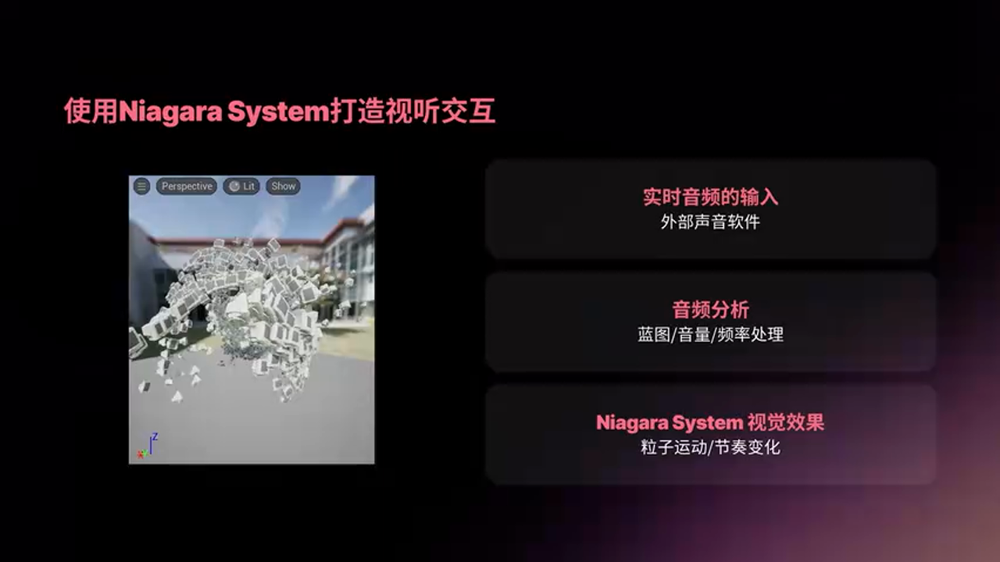

作品的视觉核心是**随音乐闪烁的粒子效果**。这部分通过以下技术路径实现：

1. **外部音频输入**：使用 Ableton Live 进行实时音频创作
2. **音频分析**：在虚幻引擎中使用音频分析节点（Audio Analyzer）解析音量、频率等参数
3. **数据绑定**：将音频参数映射到 Niagara 粒子系统的 Spawn Rate、Size、Velocity 等属性


**技术实现细节**：

```cpp
// [AI补充] Niagara 粒子系统音频绑定逻辑（C++ 伪代码）

// 1. 获取实时音频分析数据
float AudioVolume = AudioAnalyzer->GetVolume();
float AudioFrequency = AudioAnalyzer->GetFrequency();

// 2. 映射到粒子参数（使用曲线平滑过渡）
float ParticleSpawnRate = FMath::InterpEaseInOut(0.0f, 1000.0f, AudioVolume, 2.0f);
float ParticleSize = FrequencyCurve->GetFloatValue(AudioFrequency);

// 3. 应用到 Niagara 系统
NiagaraComponent->SetFloatParameter("SpawnRate", ParticleSpawnRate);
NiagaraComponent->SetFloatParameter("ParticleSize", ParticleSize);
```


**灵感来源**：

创作者参考了技术社区 Blogger **EVMAN** 的工作，他通过 Ableton Live 创造强烈的视听音乐现场，使用低中高频音色与鼓点去控制粒子系统的世界效果。

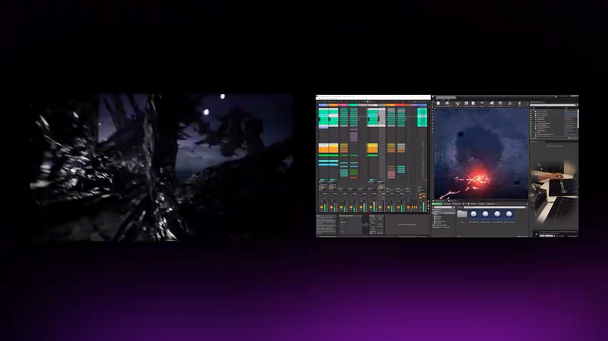

---

## 深度进阶：技术难点与优化策略

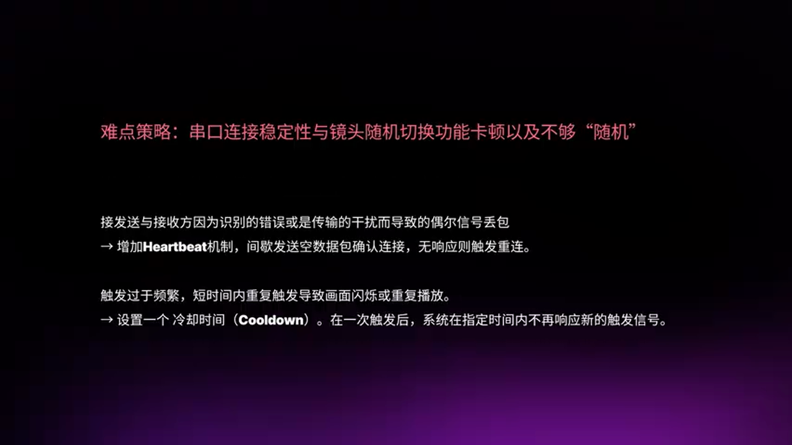

### 难点 1：外部传感器连接稳定性

**问题描述**：

- 串口通信在美术馆空间（电磁干扰多、布线复杂）容易出现短暂失连
- 发送方与接收方都可能因环境因素导致数据丢失

**解决方案**：

> **容错机制设计**
>
> - 在蓝图中增加**心跳检测**（Heartbeat Check），每秒发送一次状态信号
> - 如果超过 3 秒未收到信号，系统自动进入**自主播放模式**（播放预设的摄像机动画）
> - 连接恢复后，无缝切换回交互模式

### 难点 2：观众过度互动导致画面闪烁

**问题描述**：

- 如果观众在传感器前不停晃动，系统会不断触发镜头切换
- 导致画面闪烁不停，严重影响观众体验

**解决方案**：


在蓝图中添加**冷却时间**（Cooldown Timer）机制：

```cpp
// [AI补充] 冷却机制伪代码

bool bIsCooldown = false;
float CooldownDuration = 3.0f; // 3秒冷却时间

void OnSensorTrigger()
{
    if (!bIsCooldown)
    {
        // 执行摄像机切换
        TriggerCameraSwitch();

        // 进入冷却状态
        bIsCooldown = true;
        GetWorld()->GetTimerManager().SetTimer(
            CooldownTimer,
            [this]() { bIsCooldown = false; },
            CooldownDuration,
            false
        );
    }
}
```

### 难点 3：音视频同步延迟

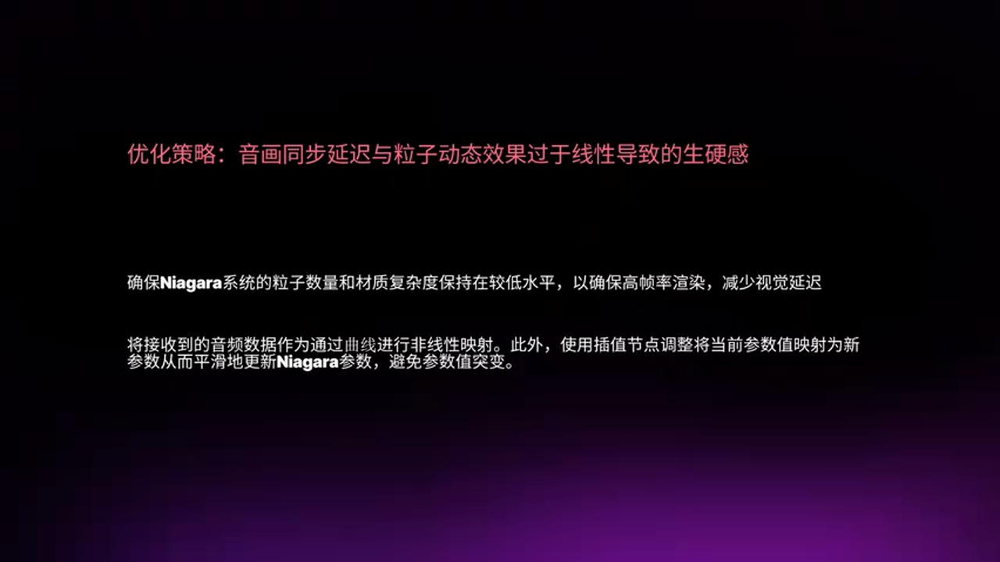

**问题描述**：

- 音频数据从 Ableton Live 传输到虚幻引擎存在网络延迟
- 虚幻引擎的渲染管线也有延迟
- 两者叠加导致视觉效果总是比音乐慢半拍

**优化策略**：

> **从源头进行优化**
>
> 1. **减少粒子数量**：将粒子 Spawn Rate 从 10000/s 降至 3000/s
> 2. **优化材质**：使用 Unlit 材质，关闭不必要的光照计算
> 3. **预加载资源**：将所有粒子系统在关卡加载时预先实例化，避免运行时创建


**美学优化**：

初始版本中，音量增大时粒子直接放大，音量减小时粒子直接缩小，交互感觉生硬。

改进方案：

- 使用**曲线节点**（Curve Float）调整音量与粒子大小的映射关系，形成非线性响应
- 添加**插值节点**（Lerp）让粒子参数缓慢变化，而非突变

```cpp
// [AI补充] 平滑过渡逻辑

// 使用 FInterp 实现平滑过渡
float CurrentSize = NiagaraComponent->GetFloatParameter("ParticleSize");
float TargetSize = AudioVolumeCurve->GetFloatValue(AudioVolume);

float SmoothedSize = FMath::FInterpTo(
    CurrentSize,
    TargetSize,
    DeltaTime,
    5.0f // 插值速度
);

NiagaraComponent->SetFloatParameter("ParticleSize", SmoothedSize);
```


这样实现的效果更加自然与丰富，粒子仿佛在"呼吸"，与音乐共舞。

---

## 实战总结与建议

### Niagara 粒子系统的高级玩法


在创作过程中发现 Niagara 系统的一些强大特性：

- **随机生成多种网格体**：可以让粒子随机选择不同的 Static Mesh，营造丰富的视觉层次
- **材质参数动态绑定**：粒子的材质参数（如颜色、透明度、自发光强度）都可以与实时数据绑定
- **物理模拟集成**：粒子可以受到场景中的力场（Force Field）、碰撞体（Collision）影响

### 方案对比：传感器方案选择

> **方案 A：基于摄像头的视觉识别**
>
> - 🟢 优势：无需观众佩戴设备，体验自然
> - 🟢 优势：可以同时追踪多人
> - 🔴 劣势：受光照条件影响，识别精度有限
> - 🔴 劣势：无法获取精细的肢体动作数据
> - 🎯 适用场景：公共展览空间、氛围式交互

> **方案 B：基于 Kinect / Leap Motion 的骨骼追踪**
>
> - 🟢 优势：可以获取精细的骨骼数据，支持手势识别
> - 🟢 优势：识别精度高，延迟低
> - 🔴 劣势：设备成本较高
> - 🔴 劣势：Kinect 已停产，生态不活跃
> - 🎯 适用场景：小型互动装置、需要精细手势控制的场景

> **方案 C：基于 VR 头显的沉浸式体验**
>
> - 🟢 优势：完全沉浸，可以获取头部与手柄 6DOF 数据
> - 🟢 优势：支持空间定位，可以构建虚拟空间导航
> - 🔴 劣势：观众需要佩戴设备，体验门槛高
> - 🔴 劣势：同时体验人数受限于 VR 设备数量
> - 🎯 适用场景：VR 游戏、虚拟博物馆

### 避坑指南

> **生产环境落地注意事项**
>
> 1. **网络稳定性**：如果使用 OSC / WebSocket 通信，务必在局域网内部署，避免公网延迟
> 2. **电源管理**：长时间运行的装置需要考虑 PC 的散热与电源稳定性，建议使用工业级 PC
> 3. **内容备份**：在展览现场准备备用的**非交互版本**，一旦传感器失效可以快速切换
> 4. **观众引导**：在展览现场放置引导标识，告知观众"走动可以改变画面"，否则许多观众不会主动尝试交互
> 5. **数据隐私**：如果使用摄像头采集观众画面,需要在入口处明确告知并获得同意

### 最佳实践

**配置建议**：

- 虚幻引擎版本：UE 5.1 或更高（Niagara 系统持续优化）
- 渲染分辨率：根据投影屏幕分辨率设置，建议使用多 GPU 方案支持超高分辨率输出
- 音频采样率：48kHz（与 Ableton Live 保持一致，避免重采样导致延迟）

**性能调优参数**：

- Niagara 粒子最大数量：根据硬件性能调整，建议不超过 50000
- 摄像机切换混合时间：1.5-2 秒（太快会导致眩晕，太慢会失去动态感）
- 冷却时间：2-3 秒（平衡互动频率与视觉稳定性）

---

## 反思：技术与艺术的交叉


在这个作品中，技术不是中立的工具，而是**签入叙事的媒介**。虚拟摄像机作为一种情绪引导，系统化地引导节奏变化，而环境又反过来引导观众的情绪，形成双向反馈。

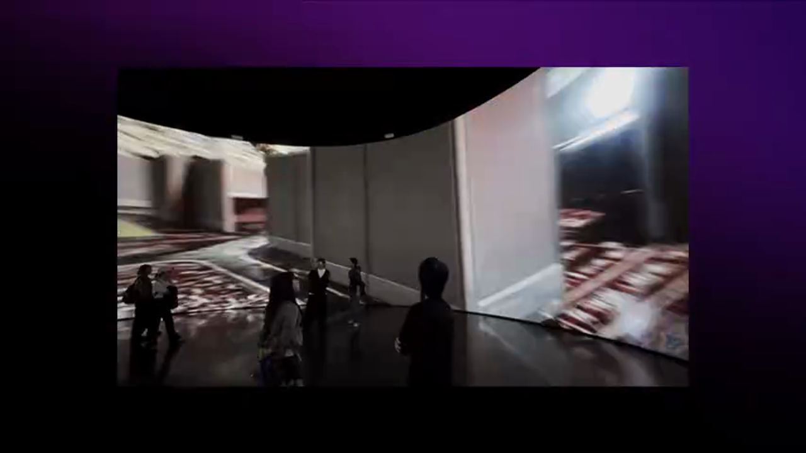

虚幻引擎作为艺术创作平台，提供了前所未有的可能性：

> **虚幻引擎驱动互动艺术创新的三大维度**
>
> 1. **实时控制**：艺术家可以实时控制视觉、声音和空间
> 2. **观众反馈**：捕捉观众行为，通过反馈机制创造动态体验
> 3. **叙事自由**：观众在自由参与中形成个性化的叙事路径

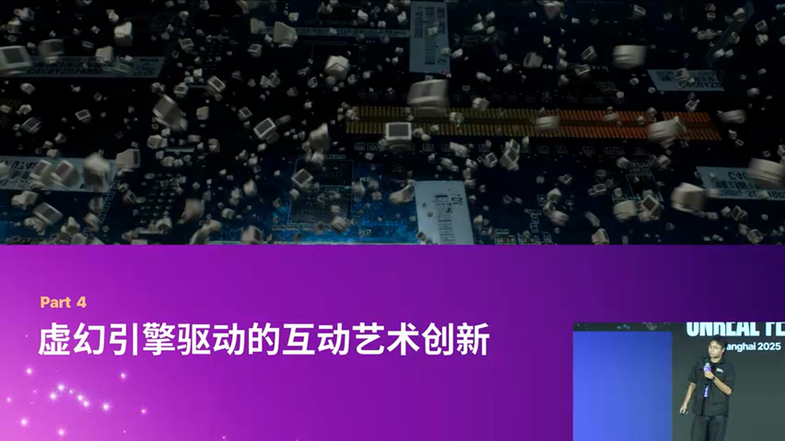

### 游戏引擎作为艺术叙事的无限可能

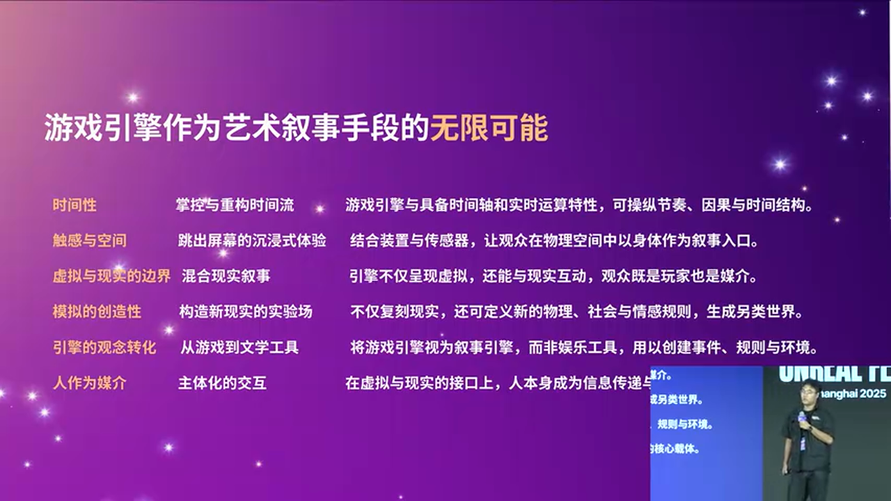

对于艺术创作者而言，游戏引擎不仅是生产率工具，更是一种**重构时间、空间与现实规则的虚实机器**。

引擎的总动特性（Real-Time Interactivity）不仅提供了实时运算和可视化环境，更让艺术家能够**认识创造全新的物理、社会与情感规则**。

它扩展了叙事手段，让观众在虚拟与现实交界处参与、感受、影响——这正是互动艺术的无限潜力。

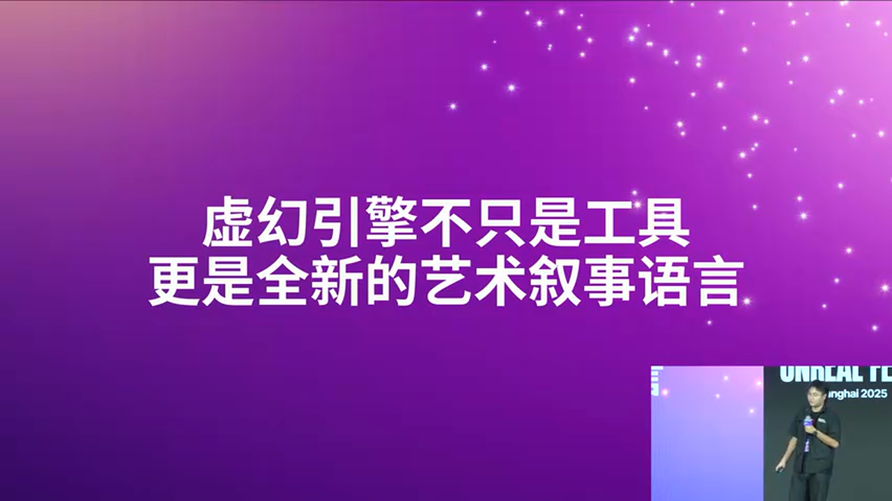

### 结语

虚幻引擎不只是工具，更是**全新的艺术叙事语言**。在这个平台上，艺术和技术融合，观众、空间与时间都可以被重新想象与重塑。

"软控制"美学实验证明：技术可以成为叙事的一部分，而非仅仅服务于叙事。当算法开始引导情绪，当粒子随音乐起舞，当摄像机成为观众的"眼睛"——我们正在见证一种新的艺术形式的诞生。

---

**致谢**：感谢 EVMAN 在音视频同步技术路径上的启发，感谢虚幻引擎社区的技术支持。

**参考资料**：
- Ableton Live 官方文档：音频分析与 OSC 通信
- Unreal Engine Niagara 系统官方教程
- 交互艺术理论：《软控制：数字时代的情感设计》
