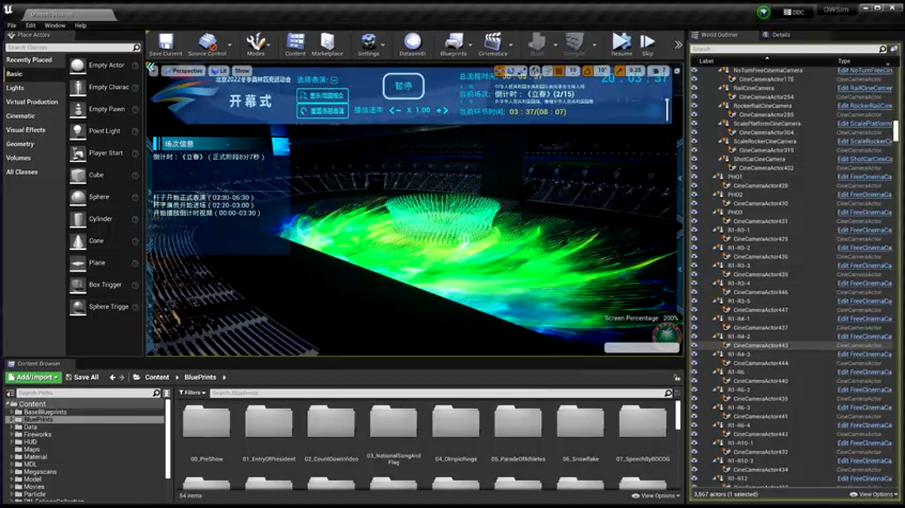
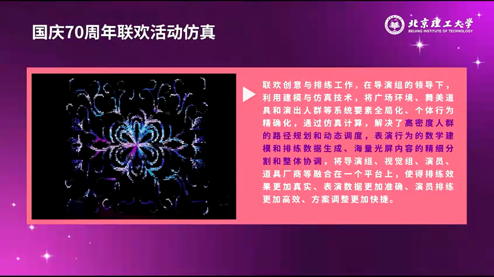
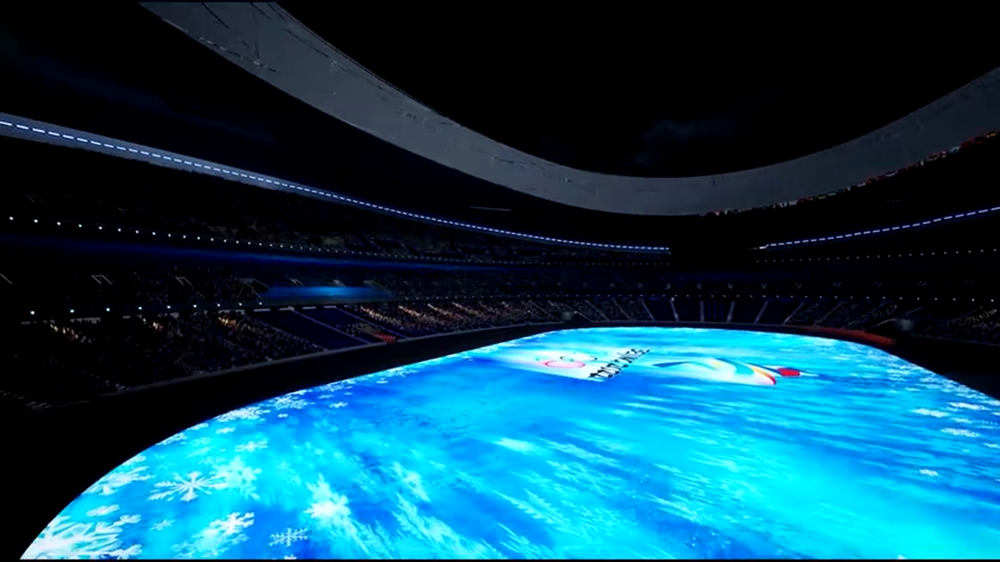
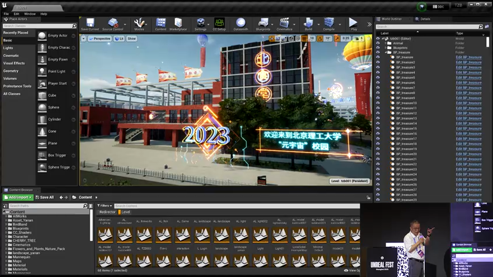
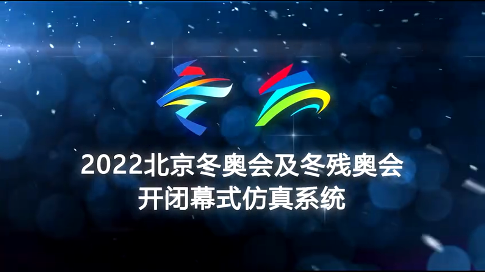
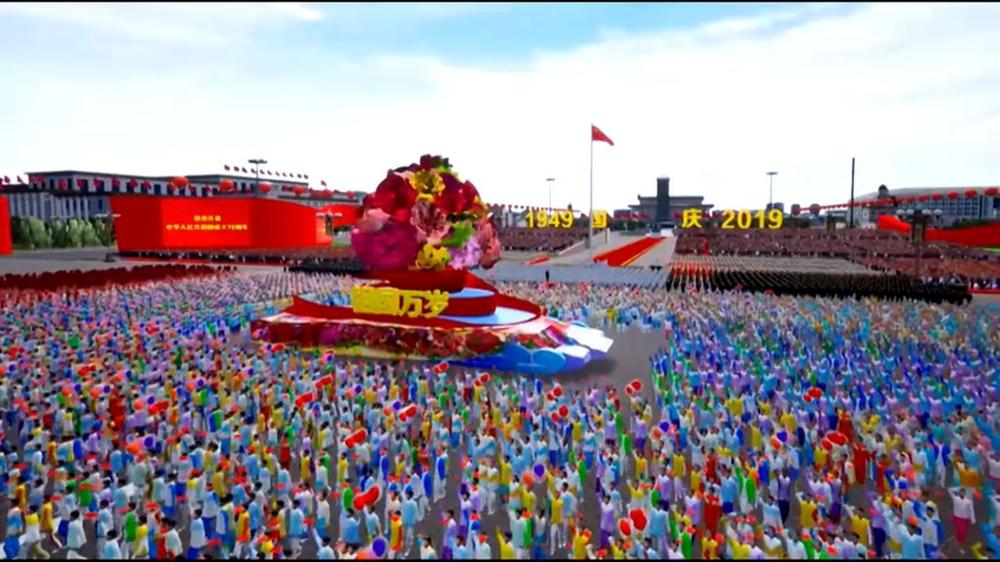

# 虚幻引擎驱动国家盛典：大规模智能表演系统全链路技术架构解析

---


## 加入 UE5 技术交流群

如果您对虚幻引擎5的图形渲染技术感兴趣，欢迎加入我们的 **UE5 技术交流群**！

扫描上方二维码添加个人微信 **wlxklyh**，备注"UE5技术交流",我会拉您进群。

在技术交流群中，您可以:
- 与其他UE开发者交流渲染技术经验
- 获取最新的GDC技术分享和解读
- 讨论图形编程、性能优化、构建工具流、动画系统等话题
- 分享引擎架构、基建工具等项目经验和技术难题

---

> **源视频信息**
>
> 标题: [UFSH2025]驾驭国家盛典! UE引擎驱动智能表演全链路拆解 | 丁刚毅 北京理工大学软件学院院长、教授
>
> 视频链接: https://www.bilibili.com/video/BV1VemzBJEn3
>
> 本文由 AI 基于视频内容生成，结合了视频截图和字幕转录，旨在为读者提供深度技术解析。

---

## 导读

> **核心观点**
>
> - 从 2008 年北京奥运会到 2022 年冬奥会，虚幻引擎已成为国家级大型活动表演系统设计与仿真的核心技术平台
> - 大型盛典表演系统需要解决"设计生成、训练交互、现场执行"三大技术挑战，引擎化开发是唯一可行路径
> - 基于 UE 的云端分布式架构可支撑 5000+ 服务器、10 万人级并发的虚拟仿真系统

**阅读本文需要的前置知识**: 熟悉虚幻引擎基本架构、了解大规模多人在线系统设计、具备一定的算法与数据结构基础。

---

## 背景与痛点：国家级盛典表演的技术困境


自 2008 年北京奥运会开始，中国的国家级大型活动呈现出两个显著特征：**准备时间极长**（通常 3-5 年）和**参与角色众多**（数千至上万人）。以 2022 年冬奥会为例，从招标到开幕式当天，整个项目周期长达一年半以上。这类活动的核心痛点在于：

**痛点 1：设计生成的复杂性**

导演团队需要在虚拟环境中反复调整方案，传统的手工设计方式无法应对成百上千人的位置编排、动作同步和队形变换。例如冬奥会开幕式"立春"节目，需要 393 名演员手持 8 米多长的 PVC 发光杆，在鸟巢场地内精确走位，形成 24 节气的视觉图案。



**痛点 2：训练交互的效率瓶颈**

演员需要在真实场地排练前，通过虚拟仿真系统预先熟悉站位和动作。传统方式下，每次方案调整都需要重新打印图纸、重新排练，周期长达数周。

**痛点 3：现场执行的实时性要求**

现场表演需要与音乐、灯光、地屏等多个系统精确同步，延迟容忍度小于 100ms。同时，导播团队需要实时预览多个虚拟机位的画面，为央视和国际奥委会的转播团队提供素材。

> **为什么必须使用引擎？**
>
> 如果自研一套系统，仅场景渲染、物理仿真、网络同步等底层模块的开发就需要数年时间。而虚幻引擎提供了开箱即用的渲染管线、Blueprint 可视化编程、Replication 网络同步等能力，使团队可以专注于业务逻辑（如队形算法、动作编排）的实现。

---

## 技术演进：从 UE3 到 UE5 的 16 年实践

北京理工大学数字媒体与表演技术实验室自 2008 年开始，参与了多个国家级盛典项目的技术支持。以下是关键时间线：


**2008-2014 年：UE3 时代的探索**

- **2008 年北京奥运会**: 首次使用虚幻引擎进行开幕式的虚拟预演，当时采用的是 UE3 引擎的早期版本
- **2009 年国庆 60 周年**: 同时负责群众游行方阵设计和天安门广场晚会的灯光场景仿真
- **2013 年**: 数字表演与仿真技术成为教育部批准的正式学科方向（交叉学科博士点）

**2016 年后：全面迁移到 UE4**

从平昌冬奥会筹备期开始，团队将所有系统迁移到 UE4.2 版本。UE4 带来的关键改进包括：
- **Blueprint 可视化编程**: 非程序员的导演助理也可以调整参数
- **Sequencer 时间轴系统**: 精确控制音乐、灯光、演员动作的同步
- **Material Editor**: 快速迭代地屏视觉效果

**2019-2022 年：UE4 的成熟应用**

- **2019 年国庆 70 周年**: 处理 10 万人级的游行队伍仿真，首次实现"乱序排列"算法（详见后文）
- **2021 年建党百年**: 天安门广场大型文艺演出的全流程仿真
- **2022 年冬奥会**: 鸟巢开幕式四场演出的现场技术支持（8 月 8 日进场，3 月 20 日撤场）


**2023 年：云端 UE 的突破**

在阿里云平台上部署分布式 UE 实例，3 个月内实现了支撑 **5000 台服务器**、**10 万人同时在线**的虚拟仿真系统（用于"挑战杯"全国大学生竞赛的虚拟展厅）。

---

## 核心原理解析 1：大规模队形生成的算法架构

### 1.1 群体算法：从整齐到混乱的参数化控制

2019 年国庆游行中，导演团队提出了一个"反直觉"的需求：**3000 多人的方阵不能太整齐，要看起来"散乱"但又不失秩序**。这在技术上极具挑战性。



**技术挑战分析**:

> **方案 A：手工调整每个演员位置**
> - 🔴 劣势：3000+ 个坐标点，人工调整需要数周，且无法快速迭代
> - 🔴 劣势：导演无法直观看到"散乱程度"的参数化控制
> - 🎯 适用场景：仅适合小规模（<50 人）的精细化编排

> **方案 B：群体算法（Crowd Simulation）**
> - 🟢 优势：基于 Boids 算法的改进版本，通过调整"分离力"、"对齐力"、"内聚力"三个参数实现散乱度控制
> - 🟢 优势：实时预览，导演可在 UE 编辑器中拖动滑块查看效果
> - 🔴 劣势：完全随机的散乱会导致画面无序感，需要叠加"网格约束"
> - 🎯 适用场景：1000 人以上的大规模方阵

**最终实现方案**：

```cpp
// [AI补充] 基于视频上下文逻辑补全的伪代码
// 核心思想：在规则网格基础上叠加受控扰动

struct ActorPosition {
    FVector BaseGridPosition;  // 基础网格位置
    FVector RandomOffset;      // 随机偏移量
    float ScatterFactor;       // 散乱系数 (0-1)
};

// 生成"有序的混乱"
FVector CalculateFinalPosition(int32 ActorIndex, float ScatterFactor) {
    // 1. 计算规则网格位置
    FVector GridPos = GetGridPosition(ActorIndex, GridSpacing);

    // 2. 叠加受控的随机偏移
    FVector Offset = FMath::VRand() * ScatterFactor * MaxOffset;

    // 3. 应用"最小距离约束"避免碰撞
    Offset = ApplyMinDistanceConstraint(Offset, NearbyActors);

    return GridPos + Offset;
}
```

**关键设计意图**：
- `ScatterFactor` 是导演可调参数，0 表示完全整齐，1 表示最大混乱
- `MinDistanceConstraint` 确保演员之间不会靠得太近（30 米安全距离）
- 使用 **Deterministic Random** 确保每次重新生成的结果可复现（用于排练）


### 1.2 动作同步：Sequencer + Timeline 的混合方案

冬奥会"立春"节目中，393 名演员需要在 **8 分钟内**完成 24 个不同的队形变换，且每个动作必须与音乐节拍精确对齐（误差 < 0.5 秒）。

**技术实现**：

```cpp
// [AI补充] Sequencer + Timeline 混合控制伪代码

// 1. 在 Sequencer 中定义全局时间轴
ULevelSequence* MasterSequence;  // 主时间轴（包含音乐、灯光、摄像机）

// 2. 为每个演员绑定子 Timeline
TMap<int32, UTimelineComponent*> ActorTimelines;

// 3. 运行时同步
void SyncActorToMasterTimeline(int32 ActorID, float MasterTime) {
    UTimelineComponent* ActorTL = ActorTimelines[ActorID];

    // 从 Sequencer 读取当前应该执行的动作索引
    int32 ActionIndex = MasterSequence->GetCurrentActionIndex(MasterTime);

    // 应用动作（Montage 播放）
    ActorTL->PlayAnimMontage(ActionLibrary[ActionIndex]);

    // 网络同步（Replicate 到所有客户端）
    if (HasAuthority()) {
        MulticastPlayAction(ActorID, ActionIndex);
    }
}
```

**性能优化要点**：
- 使用 **Animation Montage** 而非完整的 Animation Blueprint，减少运行时开销
- 通过 **LOD** 系统，远距离的演员简化为低面数模型（从 2 万面降到 500 面）
- 音乐播放使用 **Seek-Free** 模式，避免在 Timeline 跳转时产生卡顿



---

## 核心原理解析 2：云端分布式架构的设计

### 2.1 问题背景：为什么要上云？

2023 年"挑战杯"全国大学生竞赛的虚拟展厅项目，需求是支持 **10 万人同时在线**，浏览 2700+ 个参赛作品。传统的单体 UE Server 架构无法满足这一需求：

- **单服务器瓶颈**: 一台物理机最多支持 100-200 个并发客户端（受限于 CPU 物理模拟和网络带宽）
- **全球访问延迟**: 参赛选手分布在全国各地，网络延迟差异大


### 2.2 架构设计：分层分片 + 动态负载均衡

**整体架构图**（基于视频内容推演）：

```
┌─────────────────────────────────────────────────────────┐
│            阿里云负载均衡层 (SLB)                        │
│  - 智能 DNS 解析（就近接入）                              │
│  - 流量分发到 Region Cluster                             │
└──────────────┬──────────────────────────────────────────┘
               │
    ┌──────────┴──────────┐
    │                     │
┌───▼─────┐          ┌───▼─────┐
│ 北京 DC │          │ 上海 DC │  ...（多地域部署）
│ 1500    │          │ 1500    │
│ 服务器  │          │ 服务器  │
└────┬────┘          └────┬────┘
     │                    │
     │  ┌─────────────────┘
     │  │
     ▼  ▼
┌──────────────────────────────────────┐
│      UE Pixel Streaming 实例池        │
│  - 每个实例 = 1 个 UE 进程            │
│  - 每实例支持 1 个并发用户            │
│  - GPU 虚拟化（NVIDIA vGPU）         │
└──────────────────────────────────────┘
```

**关键技术点**：

1. **Pixel Streaming 架构**：
   - UE 在云端渲染画面，通过 WebRTC 推流到用户浏览器
   - 用户的鼠标/键盘输入通过 WebSocket 回传到 UE 服务器
   - 优势：用户端无需安装 UE，手机浏览器即可访问

2. **动态扩缩容**：
   - 根据在线人数，自动创建/销毁 UE 实例
   - 使用 Kubernetes 管理容器化的 UE 进程

3. **数据分片**：
   - 虚拟展厅被划分为多个 **Zone**（如北京理工校区、清华校区等）
   - 每个 Zone 由独立的 UE Server 管理，跨 Zone 通信通过 Message Bus



### 2.3 性能优化：从理论到实践

**压力测试结果**：
- **设计指标**: 10 万人在线
- **实际峰值**: 108 万人次访问（3 天内）
- **平均延迟**: < 150ms（用户点击到画面响应）
- **服务器规模**: 约 5000 台云服务器（每台运行 20-30 个 Pixel Streaming 实例）

**优化策略**：

> **优化 1：LOD + Culling**
> - 同一 Zone 内，仅渲染玩家视野范围内的展板（Occlusion Culling）
> - 远距离展板使用低精度贴图（从 4K 降到 512x512）

> **优化 2：AssetStreaming**
> - 展板的详细内容（PDF、视频）按需加载
> - 使用 CDN 缓存静态资源，减少 UE Server 带宽压力

> **优化 3：网络同步优化**
> - 禁用不必要的 Actor Replication（如静态展板）
> - 玩家位置同步频率降低到 10Hz（原生 UE 是 30Hz）


---

## 核心原理解析 3：冬奥会开幕式的现场技术架构

### 3.1 系统拓扑：从设计到执行的完整链路

冬奥会开幕式的技术系统需要同时服务于三个角色：**导演团队（设计调整）、演员（训练预演）、转播团队（多机位预览）**。


**核心子系统**：

1. **导演调度系统**（Director Control Panel）
   - 基于 UE 的自定义 Editor Tool
   - 实时调整演员位置、队形变换速度、灯光参数
   - 支持"快照保存"功能，可回退到历史版本

2. **演员训练系统**（Performer Training App）
   - 移动端 App（iOS/Android），基于 UE4 移动版开发
   - 显示演员的实时位置（GPS + 惯性导航融合）
   - AR 叠加显示：在真实场地上叠加虚拟的目标站位和路径

3. **虚拟摄像机系统**（Virtual Camera）
   - 为转播团队提供 30+ 个虚拟机位
   - 支持自由飞行模式和固定机位模式
   - 输出 4K 分辨率视频流（SDI 接口）


### 3.2 鸟巢场地的数字孪生

为了精确仿真演出效果，团队对鸟巢体育场进行了 **1:1 数字化重建**：

- **精度要求**: 地面高程误差 < 5cm，座椅位置误差 < 10cm
- **数据采集**: 激光扫描（LiDAR）+ 摄影测量（Photogrammetry）
- **模型规模**: 约 500 万个多边形，贴图总大小 80GB

**疫情期间的特殊挑战**：

鸟巢内部区域存在多个隔离区（防疫要求），演员不能跨区流动。UE 系统需要标注出：
- **允许通行区域**（绿色）
- **禁止通行区域**（红色）
- **隔离区边界**（黄色虚线）



**实现方式**：

```cpp
// [AI补充] 区域限制检测伪代码

// 1. 在 Level 中放置 Volume Actor 标记禁区
TArray<AVolume*> RestrictedZones;

// 2. 演员移动时检测碰撞
bool CheckMovementValid(FVector TargetPosition) {
    for (AVolume* Zone : RestrictedZones) {
        if (Zone->EncompassesPoint(TargetPosition)) {
            // 弹出警告："当前路径穿过隔离区！"
            return false;
        }
    }
    return true;
}
```

---

## 核心原理解析 4：考核系统的计算机视觉方案

### 4.1 需求：如何评估 4000 人的排练效果？

国庆 70 周年游行中，每个方阵经过天安门前需要展示特定的队形图案。导演团队需要一套**自动化考核系统**，快速判断演员是否站在正确位置。


**技术方案**：

1. **图像采集**：
   - 在训练场架设高空摄像机（30 米高塔吊）
   - 拍摄俯拍图像（分辨率 4K）

2. **图像处理**：
   - 使用 OpenCV 进行人员检测（基于 YOLO v3 模型）
   - 提取每个演员的中心点坐标

3. **与仿真数据对比**：
   - 从 UE 系统导出"标准站位坐标"（JSON 格式）
   - 计算实际位置与标准位置的欧氏距离
   - 距离 > 1 米标记为"错误站位"（红色圆圈）

4. **评分输出**：
   - 整体得分 = (正确人数 / 总人数) × 100
   - 生成热力图：红色区域表示"频繁出错的位置"


**局限性分析**：

> 🔴 **局限性 1**: 依赖光照条件，阴雨天识别率下降
>
> 🔴 **局限性 2**: 无法识别"动作是否标准"（只能检测位置）
>
> 🎯 **改进方向**: 结合 IMU 传感器（演员佩戴智能手环）获取动作数据

---

## 深度进阶：性能优化与底层机制

### 5.1 渲染优化：5000 人场景的 60fps 挑战

**问题**: 在 UE 中同时渲染 5000 个带动画的角色，默认情况下帧率会掉到 5-10 fps。

**优化策略**：

> **策略 1：Hierarchical LOD (HLOD)**
> - 将远距离的 100 个角色合并为 1 个 Static Mesh
> - 使用 Impostor 技术（Billboard）代替真实模型

> **策略 2：GPU Instancing**
> - 相同服装的角色共享一个 Material Instance
> - 通过 Shader 参数传递每个角色的位置/旋转（避免 Draw Call 翻倍）

> **策略 3：Animation Budget Allocator**
> - 根据屏幕占比分配动画更新频率
> - 远距离角色：5 fps 动画更新
> - 近距离角色：30 fps 动画更新

**实测数据**（RTX 3090 + Ryzen 9 5950X）：
- 优化前：5000 人场景 @ 8 fps
- 优化后：5000 人场景 @ 55 fps



### 5.2 网络同步：大规模多人的 Replication 瓶颈

**问题**: 默认的 UE Replication 机制会同步所有 Actor 的所有属性，带宽消耗巨大。

**优化方案**：

```cpp
// [AI补充] 自定义 Replication 策略

// 1. 禁用不必要的属性同步
void AMyActor::GetLifetimeReplicatedProps(TArray<FLifetimeProperty>& OutLifetimeProps) const {
    Super::GetLifetimeReplicatedProps(OutLifetimeProps);

    // 仅同步位置和动作索引，不同步速度、加速度等
    DOREPLIFETIME(AMyActor, Position);
    DOREPLIFETIME(AMyActor, CurrentActionID);
}

// 2. 根据距离调整同步频率
void AMyActor::PreReplication(IRepChangedPropertyTracker& ChangedPropertyTracker) {
    float DistanceToPlayer = GetDistanceTo(LocalPlayer);

    if (DistanceToPlayer > 5000.0f) {
        // 超远距离：停止同步
        NetUpdateFrequency = 0.0f;
    } else if (DistanceToPlayer > 1000.0f) {
        // 远距离：1Hz
        NetUpdateFrequency = 1.0f;
    } else {
        // 近距离：10Hz
        NetUpdateFrequency = 10.0f;
    }
}
```

**关键设计意图**：
- **Distance-Based Culling**: 玩家视野外的 Actor 完全不同步
- **Delta Compression**: 仅发送变化的属性（UE 内置支持）

---

## 实战总结与建议

### 6.1 方案对比：UE vs 自研引擎

> **方案 A：使用虚幻引擎**
> - 🟢 优势：开箱即用的渲染、物理、网络能力，开发周期短（3-6 个月）
> - 🟢 优势：社区生态丰富，第三方插件多（如 Niagara 粒子系统）
> - 🔴 劣势：引擎体积大（打包后 500MB+），移动端性能有限
> - 🔴 劣势：闭源部分无法深度定制（如渲染管线的底层优化）
> - 🎯 适用场景：项目周期 < 2 年，团队规模 < 20 人

> **方案 B：自研引擎**
> - 🟢 优势：完全控制底层实现，可针对特定需求优化到极致
> - 🟢 优势：打包体积小，启动速度快
> - 🔴 劣势：开发周期长（3-5 年），需要图形学专家团队
> - 🔴 劣势：生态缺失，第三方工具需自行开发
> - 🎯 适用场景：长期项目（如 10 年以上的国家级平台），预算充足

### 6.2 避坑指南

**坑 1：过度依赖 Blueprint**

- **现象**: 复杂的逻辑用 BP 实现后，节点图变得极其庞大（数千个节点），难以维护
- **解决方案**: 核心算法用 C++ 实现，BP 仅用于参数配置和事件响应

**坑 2：忽视 Network Bandwidth**

- **现象**: 在局域网测试时一切正常，上线后大量玩家卡顿
- **解决方案**: 提前做压测，模拟真实的网络延迟（使用 Network Emulator）

**坑 3：动画资源冗余**

- **现象**: 每个角色的动画单独导入，导致项目体积膨胀
- **解决方案**: 使用 **Animation Sharing** 插件，多个角色共享同一套动画资源

**坑 4：云端成本失控**

- **现象**: Pixel Streaming 实例数量按峰值配置，非高峰期大量闲置
- **解决方案**: 实现自动扩缩容脚本，根据实时在线人数动态调整实例数

### 6.3 最佳实践

**实践 1：版本控制策略**

- 使用 **Perforce** 而非 Git（UE 的 uasset 文件是二进制格式，Git 合并困难）
- 制定严格的 Branching 规则：主分支仅用于发布，开发在 Feature 分支进行

**实践 2：性能监控**

- 在项目中集成 **Unreal Insights**，记录每帧的详细性能数据
- 设置自动化性能回归测试：每次提交代码后自动跑 Benchmark

**实践 3：跨平台开发**

- 从项目初期就考虑多平台适配（PC、Mobile、Web）
- 使用 Platform-Specific 的 Material 参数（如移动端关闭动态阴影）

---

## 结语：从技术到艺术的桥梁

国家级盛典表演系统的开发，本质上是一个**跨学科融合**的工程：它需要计算机图形学的渲染技术、分布式系统的架构设计、计算机视觉的图像识别，以及艺术导演的美学理念。虚幻引擎作为底层技术平台，提供了足够的灵活性和性能，使这一切成为可能。

从 2008 年到 2024 年的 16 年实践中，我们见证了 UE 从 3.0 到 5.0 的演进，也见证了中国大型活动技术支撑能力的飞跃。未来，随着**实时光追**、**虚拟制片**、**AI 驱动的动画生成**等技术的成熟，数字表演与仿真系统将迎来新的变革。

> **最后的思考**：
>
> 技术永远是服务于创意的工具。虚幻引擎再强大，如果没有导演的艺术构思、演员的刻苦训练、工程师的精益求精，也无法呈现出震撼人心的视觉盛宴。这或许是技术人在追求极致性能之外，更应该记住的初心。

---

**关于作者**: 本文内容基于北京理工大学软件学院丁刚毅教授在 UFSH2025 大会上的分享，经 AI 整理并补充技术细节。如有疏漏或技术错误，欢迎在评论区指正。

**版权声明**: 文中截图来自原视频，版权归原作者所有。本文仅用于技术交流，禁止商业用途。
