# ACT 游戏的工业化实践:《航海王》高频迭代的技术支撑体系

---


## 加入 UE5 技术交流群

如果您对虚幻引擎5的图形渲染技术感兴趣,欢迎加入我们的 **UE5 技术交流群**!

扫描上方二维码添加个人微信 **wlxklyh**,备注"UE5技术交流",我会拉您进群。

在技术交流群中,您可以:
- 与其他UE开发者交流渲染技术经验
- 获取最新的GDC技术分享和解读
- 讨论图形编程、性能优化、构建工具流、动画系统等话题
- 分享引擎架构、基建工具等项目经验和技术难题

---

> **源视频信息**
>
> 标题:[UFSH2025]《航海王》壮志雄心-研效提升 | 刘超俊 腾讯互娱魔方工作室群《航海王》客户端主程序
>
> 链接:https://www.bilibili.com/video/BV1i1sNzWEQ8
>
> 本文基于视频内容,由 AI 辅助生成图文技术文章

---

> **核心观点**
>
> - 通过配置化与模块化开发管线,实现策划自主产出内容,每周稳定交付 19 个版本需求
> - 基于 Clang AST 构建静态分析工具链,在编译期杜绝逻辑与表现层耦合导致的同步问题
> - 采用 Lua 热更新方案,配合增量式 Patch 优化,实现 5-10 分钟线上紧急修复能力

---

## 一、背景与挑战:高速增长下的产能危机

腾讯互娱魔方工作室群的《航海王》是一款 ACT(动作) 类型的多人对战游戏,对稳定性、同步一致性和防作弊有着极高的要求。为了保证流畅的游戏体验,团队采用了 **帧同步 + 状态同步** 的混合方案,这意味着任何逻辑层面的 Bug 都可能导致严重的不同步问题。

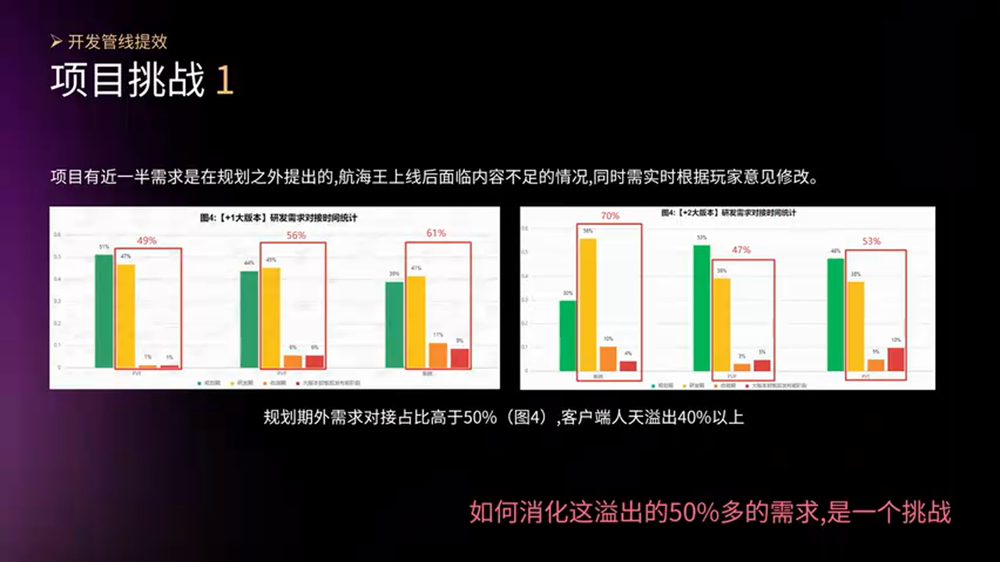

在游戏上线后,为了维持玩家活跃度,团队需要快速补充大量新玩法和新角色。然而现实情况是:

- 团队规模短期内无法大规模扩张
- 需要应对频繁的运营需求
- 在加一、加二版本时,**实际需求量超出规划期 50% 以上**

如何在人力有限的情况下,应对这超出 50% 的需求缺口?这是《航海王》团队面临的核心挑战。


---

## 二、研发效率提升:配置驱动的内容生产体系

### 2.1 开发管线重构:程序与策划的职责分离

《航海王》作为内容向游戏,高度依赖新角色和新关卡的持续产出。团队重新梳理了开发管线,实现了一个核心理念:**程序提供基础框架和组件化能力,策划通过配置自主产出内容**。


具体来说:

- **程序职责**:提供游戏基础框架、原子化组件和编辑器工具
- **策划职责**:通过自由配置和模块化组合,产生新玩法并自我验收
- **迭代模式**:快速迭代,策划可独立完成从设计到验收的闭环

这种模式的关键问题是:**程序不关心具体玩法,如何保证质量和性能?**

### 2.2 资源同步流水线:前置质量门禁

团队采用了 **双工程架构**:

- **美术工程**:策划和美术在此工作
- **程序工程**:程序在此工作,以此为准进入包体


所有策划配置和美术资源必须先 **同步到美术工程** 才能进包。在同步过程中,会对资源进行多维度的 **预处理和检查**:

**资源预处理**:
- 逻辑资源合并
- 特效分级处理
- 贴图格式自动转换

**合规性检查**:
- 模型面数检测
- 贴图尺寸校验
- 动画指标扫描

**战斗规则扫描**:
- 动作完整性检查
- 攻击判定框大小验证
- 技能配置合法性检测

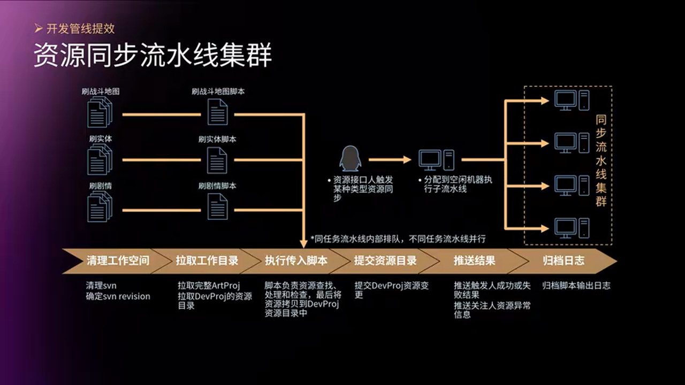

每种资源类型都有对应的流水线任务,一旦执行出错,会自动通知到对应的责任群组或个人。这种机制将质量检查 **前置到资源提交阶段**,避免了问题流入程序工程。

### 2.3 编辑器深度定制:地图与流程编辑

由于玩法全部通过配置实现,编辑器成为了生产力的核心载体。团队重点强化了两大编辑能力:

**地图编辑器**:


- 配置行走区域和交互块
- 设置刷怪点和触发器
- 管理房间信息和关卡结构

**流程编辑器**(基于节点图):

通过可视化流程图编辑器,策划可以:

- 检测各种条件(玩家状态、怪物数量、时间等)
- 触发丰富的脚本效果(播放动画、生成道具、改变AI行为等)
- 组合不同的模块实现复杂玩法逻辑

不同的玩法都可以通过这套配置体系实现,极大降低了对程序的依赖。

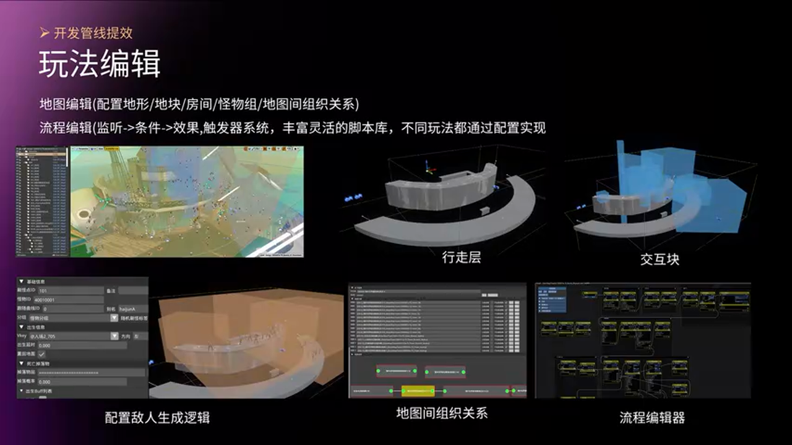

### 2.4 Sequencer 扩展:剧情与过场动画制作

游戏中剧情和过场动画是重要组成部分。团队对 UE4 的 Sequencer 系统进行了深度扩展:

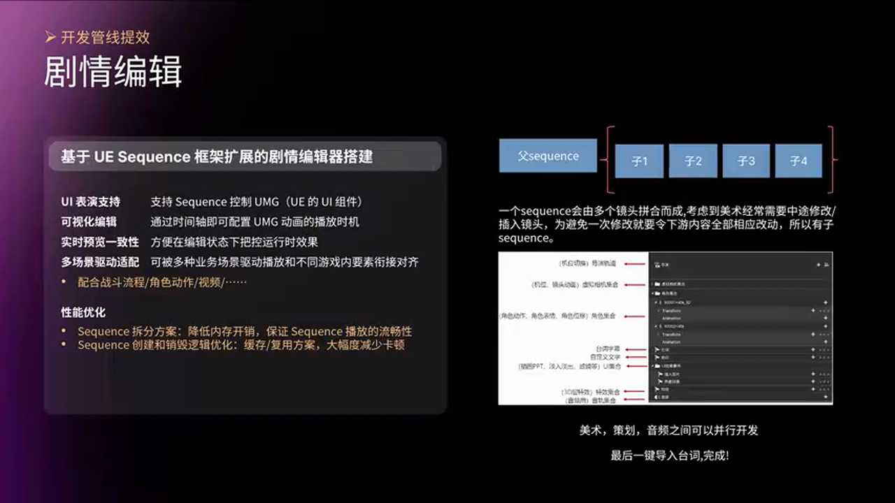

**核心扩展能力**:

1. **UMG 支持**:原生 Sequencer 仅支持 Actor 编辑,扩展后可直接在时间轴上控制 UMG 控件,实现 UI 动画的可视化编辑

2. **多场景驱动**:Sequencer 可在不同场景下驱动播放(战斗、角色展示、视频等),通过统一的驱动接口实现对齐和衔接

3. **分镜头管理**:一个 Sequencer 由多个镜头组合而成,支持插入、修改而不影响下游工作

4. **多工种并行**:每个镜头可由不同工种独立编辑,提升协作效率

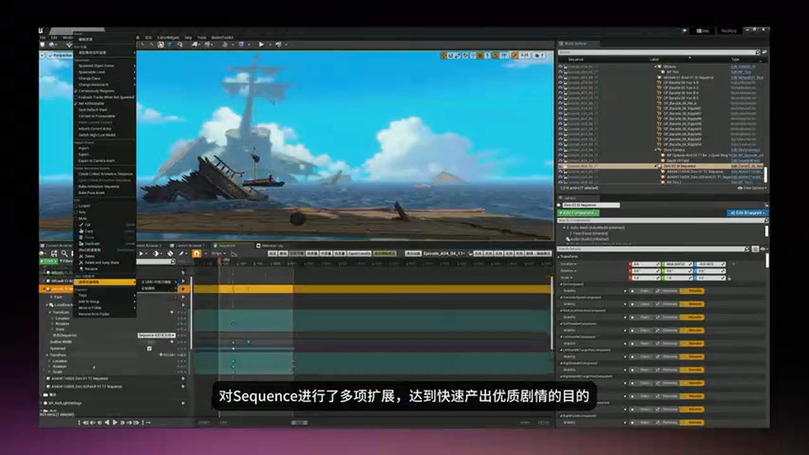

通过这些扩展,策划和动画师可以快速产出高质量的剧情内容,大幅提升了过场动画的制作效率。

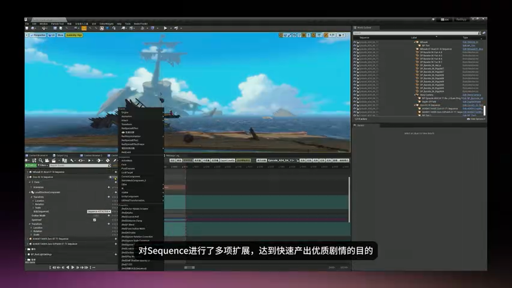

实际效果演示中可以看到,整个剧情衔接非常流畅,包含对话、战斗、过场等多种元素无缝切换。

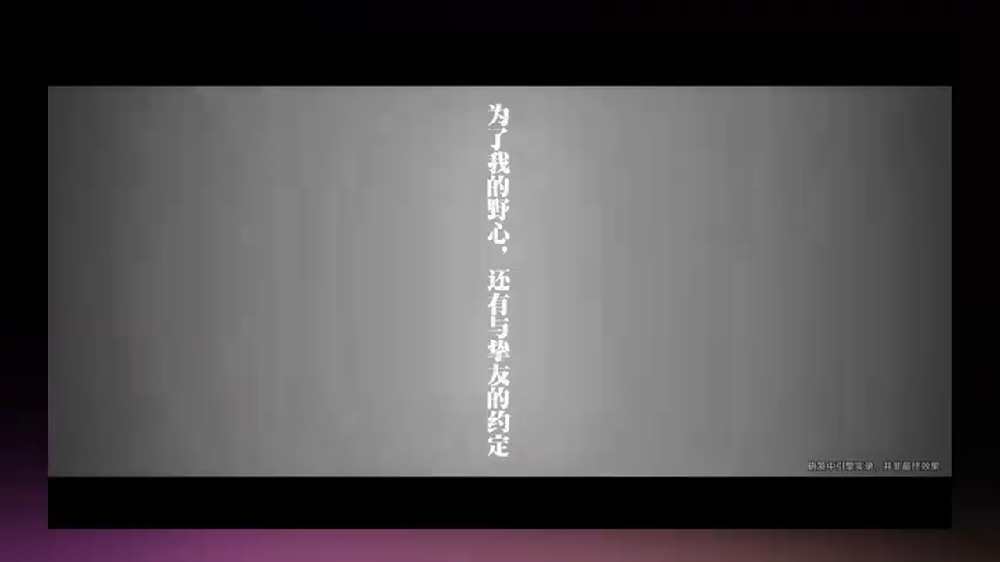

### 2.5 多版本并行:体验模式与性能分支

为了不同角色和需求,团队提供了多样化的版本策略:


- **性能版本**:专注性能优化,适用于性能测试和低端机适配
- **快速体验模式**:无需下包,快速启动完整游戏进行验证,加速测试迭代

这些策略保障了不同分支的流畅运作,提高了整体研发和验证效率。

### 2.6 成果:每周 19 个版本的高产能

通过上述一系列优化措施,团队实现了惊人的生产力:

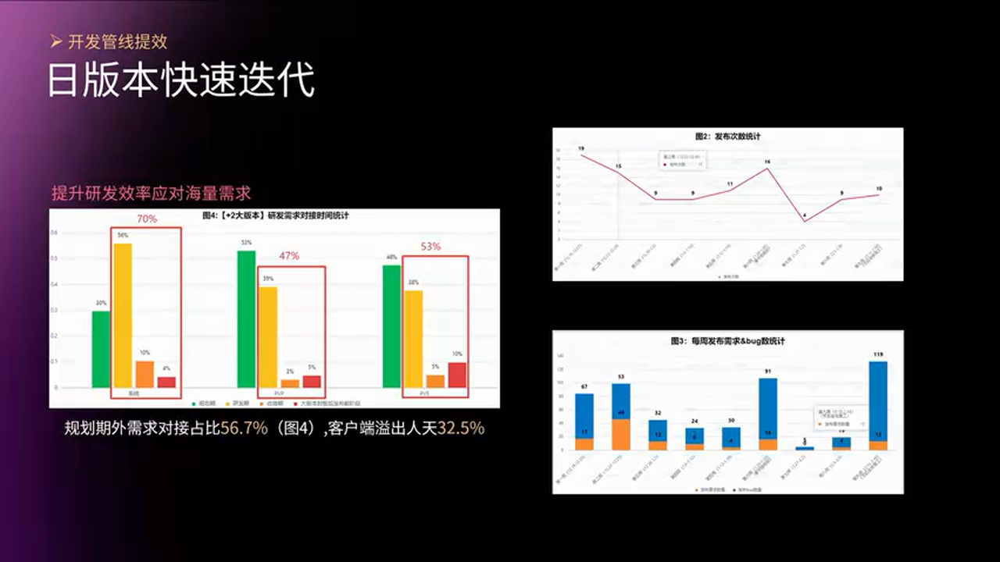

- **每周外发 19 个版本需求**
- **超出规划 50% 以上的需求依然按时完成**
- **一周一个新角色、一周数个新玩法**
- **质量稳定,不出致命问题**

这种高效的开发机制使得《航海王》被外部玩家评价为"卷王"级别的游戏,内容更新速度极快。

---

## 三、质量保障:代码级的同步问题预防

### 3.1 同步问题的根源分析

《航海王》是一款 ACT 游戏,对稳定性、同步一致性和防作弊有极高要求。采用帧同步方案后,任何逻辑不一致都会导致不同步。


造成不同步的原因很多:

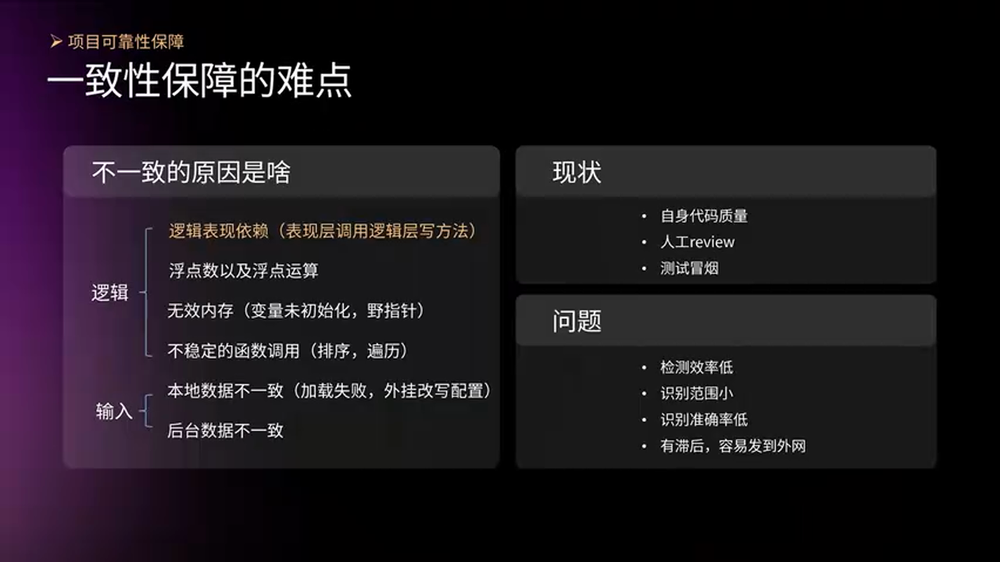

**输入层问题**:输入序列不一致

**逻辑层问题**:
- **表现层与逻辑层依赖**:表现层代码调用了逻辑层的写方法,导致不同客户端状态不一致
- 浮点数运算误差
- 野指针和无效内存访问
- 不稳定的函数调用(如随机数、时间戳等)

传统的应对方式:
- 代码评审(Code Review)
- 人工测试和冒烟测试

**问题**:检测效率低,覆盖范围小,容易漏到线上,导致对局失败。

### 3.2 Clang AST 静态分析:构建工具框架

为了从根本上解决逻辑层依赖问题,团队借助 **Clang** 进行静态分析。


**技术选型**:

Clang 对应 LLVM 的编译前端,可以构建 **抽象语法树(AST)**,提供强大的代码分析能力。

**方案优势**:
- 扩展性强,适用于各种定制的代码扫描需求
- 可集成到构建和开发环境中,自动化执行
- 支持多文件间的依赖分析

**工具框架设计**:

团队建设了一套基于 Clang 的工具框架,由一系列实现框架接口的类组成:

- **环境配置接口**:设置头文件搜索路径、预宏定义等编译环境
- **语法树生成接口**:基于 Clang 的 AST 进行语法分析
- **分析工具接口**:实现具体的代码检测逻辑

**应用场景**:
- 代码导出工具
- 逻辑层模块指针使用分析工具
- 其他定制化的静态分析需求

工具集成在构建流程中,如果检测出错,可以:
- 抛出异常,中断构建流程
- 打印报告,警告开发者

### 3.3 表现层与逻辑层隔离检测

为了避免表现层错误调用逻辑层的写方法导致不同步,必须保证 **逻辑层的确定性**。


**核心思路**:利用 Clang 分析出的 AST,在抽象语法树结构中进行模式匹配。

**读方法 vs 写方法的判断**:

一个写操作节点无非包含:
- 一元运算符(如 `++`, `--`)
- 二元运算符(如 `=`, `+=`, `-=`)
- 复合赋值运算

判断一个方法是否为写方法:
- **直接检查**:方法体内是否直接包含修改成员变量的操作节点
- **间接检查**:方法体内是否调用了其他修改成员变量的方法(递归检测)

**检测逻辑**:

```cpp
// [AI补充] 基于上下文逻辑补全
bool IsWriteMethod(FunctionDecl* func) {
    // 检查方法体内是否有赋值、自增等写操作
    for (auto* stmt : func->body()) {
        if (isa<BinaryOperator>(stmt) && IsAssignmentOp(stmt)) {
            return true; // 直接修改成员变量
        }
        if (auto* callExpr = dyn_cast<CallExpr>(stmt)) {
            // 递归检查调用的方法是否为写方法
            if (IsWriteMethod(callExpr->getDirectCallee())) {
                return true; // 间接修改成员变量
            }
        }
    }
    return false;
}
```

**保障效果**:

以上判断保证表现层 **没有调用逻辑层的写方法**,完全杜绝了这类不同步风险,同时省去了人工检查,大幅提升效率。

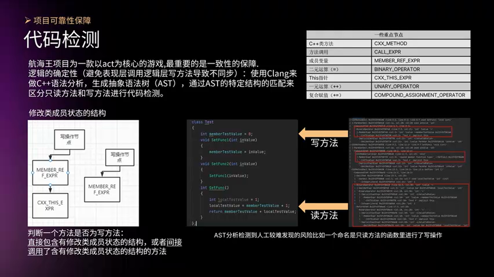

### 3.4 逻辑与表现分离:虚基类与依赖注入

《航海王》项目有一个 **动态类型转换系统**,支持:

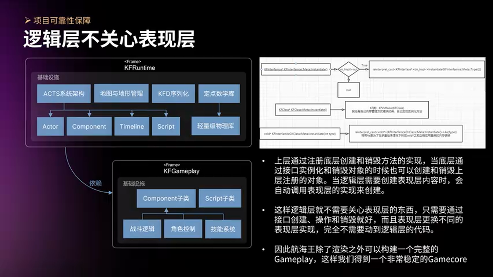

- 安全的向上/向下转型
- **虚基类的实例化**:上层可通过注入底层接口的实现,在创建和销毁对象时控制表现层对象的生命周期

**设计优势**:

- 逻辑层不需要关心表现层细节,只通过接口创建和销毁对象
- 表现层可以替换不同的实现,无需修改底层代码
- 支持在 **纯逻辑环境**(无表现层) 下构建完整的 Gameplay

**应用价值**:

构建完整的纯逻辑 Gameplay 后,可以实现:

- **AI 对手的胜率预测**
- **强化学习模型训练**
- **内存问题排查**
- **逻辑正确性验证**

这些能力极大提升了游戏的稳定性和安全性。

### 3.5 验证服同步部署:客户端与服务端一致性

在构建客户端包体时,团队会同时对应构建和部署 **验证服**。

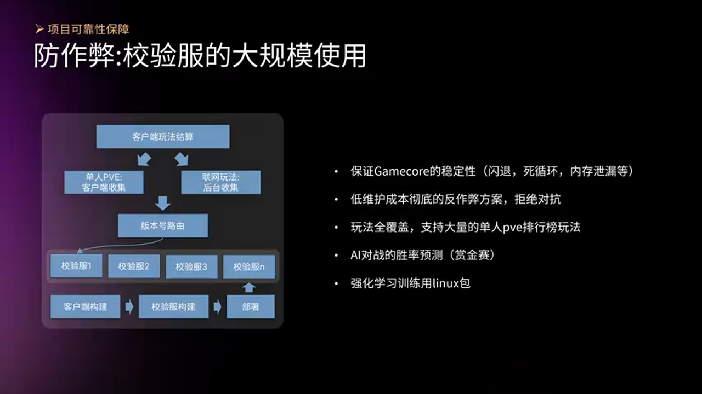

**工作流程**:

- 客户端需要验证玩法时,通过版本号索引到对应的验证服
- 验证服与客户端运行 **相同的逻辑代码**
- 维护验证服稳定性的同时,也保障了客户端的稳定性

**收益**:

- 很多问题可以在验证服中提前发现和定位
- 防作弊措施更加彻底,降低维护成本
- 减少投入对抗作弊的精力

### 3.6 日常巡检与全流程预防

除了代码级别的检查,团队还会进行 **日常巡检**,将问题推送到专门的处理群。


这种 **全流程预防机制** 保障了开发的可靠性,形成了完整的质量闭环。

---

## 四、快速修复:C++ 热更新技术实践

### 4.1 热更新需求的由来

上半年《航海王》推出了大量新角色和新机制,几乎每周都有新内容上线。


由于整个玩法都是用 C++ 开发的,如果要更新新机制,**就需要 C++ 具备热更新能力**,这是一个挑战。

在多变的市场环境下,团队希望:
- 快速试错
- 快速采纳玩家意见
- 及时修复线上紧急问题

这些需求都指向一个关键能力:**热更新**。

### 4.2 热更新方案选型:Lua vs 虚拟机字节码

团队对比了 **Lua** 和 **虚拟机字节码**(如 HotReload、动态链接库替换) 两种方案。


**方案对比**:

> **方案 A:虚拟机字节码方案**
> - 优势:运行效率接近原生 C++
> - 劣势:纯解释型虚拟机下,函数指针指向中间代码而非可执行代码,返回 Native 后调用会出错;iOS 不支持 JIT 和动态库加载
> - 适用场景:Android 平台

> **方案 B:Lua 脚本方案**
> - 优势:语言成熟稳定,跨平台支持好,Android 和 iOS 可统一方案
> - 劣势:运行效率略低于 C++,需要完整的类型导出
> - 适用场景:跨平台热更新

**最终选择**:团队选择了 **Lua** 方案,原因是:
- iOS 无法使用虚拟机字节码和动态库
- 希望 Android 和 iOS 的热更新方式一致,降低维护成本

### 4.3 C++ 类型导出:完整的反射描述

热更新的核心难点在于:**Lua 需要调用 C++ 的函数和访问 C++ 的变量**,这要求对 C++ 进行 **完整的类型描述和导出**。


**类型映射关系**:

C++ 类型与热更新系统的描述之间需要建立对应关系:

- **基础类型**:int, float, bool, string 等
- **类类型**:用户自定义的 class 和 struct
- **函数指针**:普通函数指针、成员函数指针
- **成员指针**:成员变量指针
- **模板类**:需要特殊处理,只在使用时才实例化描述

**模板类特殊处理**:

模板类在解析后 **不会立即存储**,只有在导出使用该模板实例时,才会生成一个描述实例。这种延迟实例化策略减少了内存开销和导出复杂度。

**导出策略**:

团队利用前面提到的 **Clang AST 工具链**,自动化分析和导出 C++ 类型信息。

```cpp
// [AI补充] 基于上下文逻辑补全示例
// 导出类类型
ExportClass("AActor", {
    {"Location", "FVector"},
    {"Rotation", "FRotator"},
    {"GetActorLocation", &AActor::GetActorLocation},
    {"SetActorLocation", &AActor::SetActorLocation}
});

// 导出模板类实例
ExportTemplateInstance("TArray<AActor*>");
```

这种自动化导出机制大幅降低了热更新的实施成本。

### 4.4 热更新机制:拦截与跳转

热更新的基本原理:


1. **拦截点**:在原 C++ 函数的入口插入拦截代码
2. **跳转判断**:检查是否有热更新的 Lua 函数
3. **执行热更新**:如果有,跳转到 Lua 函数执行;否则执行原 C++ 函数

**复杂点**:

热更新函数是用 Lua 编写的,不可避免会调用 C++ 函数和访问 C++ 变量,这就需要前面提到的 **完整类型导出** 支撑。

### 4.5 差异化热更新记录:快速定位

为了方便调试和问题追踪,团队建立了 **差异化热更新记录**。

在每次热更新时,系统会记录:
- 哪些函数被热更新替换了
- 热更新的版本号和时间
- 热更新代码的 Hash 值

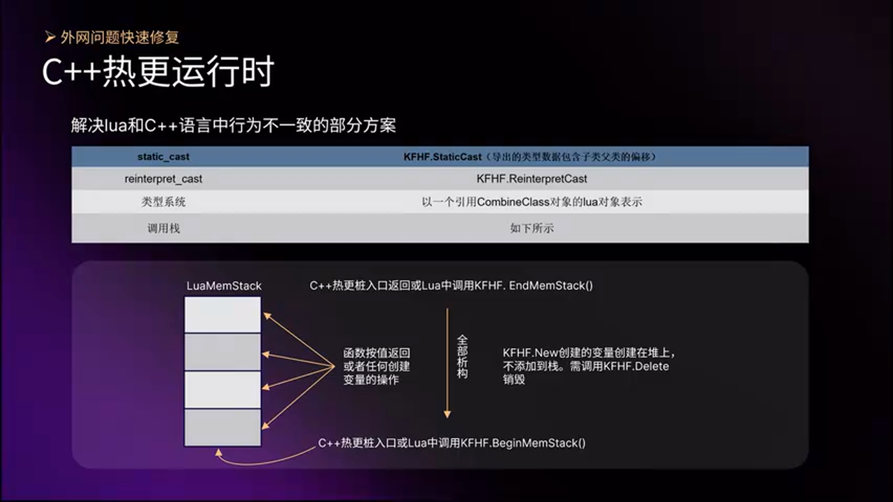

这些记录可以帮助快速定位线上问题,加速修复效率。

### 4.6 增量式 Patch 优化:5-10 分钟修复

原生的 Patch 模式流程:先 Cook 资源,再对比差异,效率较低。

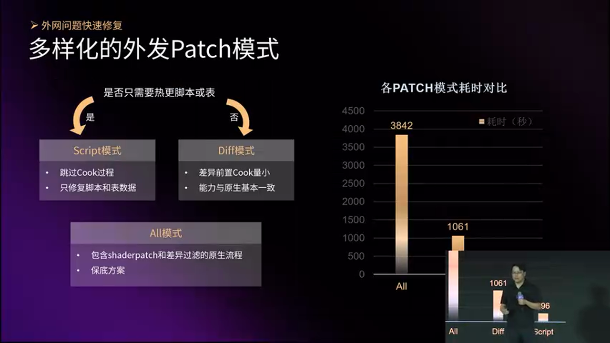

**优化后的流程**:

1. **先对比差异**:自己实现对比逻辑,找出新增和修改的文件
2. **再 Cook 新增文件**:只 Cook 必要的资源,大幅缩短 Patch 时间
3. **跳过 Cook**:如果 Patch 仅包含脚本或配置,直接跳过 Cook 过程

**修复速度**:


通过这些优化,线上紧急问题可以在 **5-10 分钟内快速修复并发布**。

### 4.7 成果:低崩溃率与低不同步率

有了 C++ 热更新能力后,团队可以随时更新游戏的新机制,加快运营迭代,同时具备对抗风险的能力。


**数据表现**:

- **崩溃率**:非常低
- **不同步率**:大约在十万分之一以下

这些数据证明了技术方案的可靠性和稳定性。

---

## 五、总结与最佳实践

### 5.1 核心技术回顾

《航海王》项目的研效提升主要围绕三个维度展开:

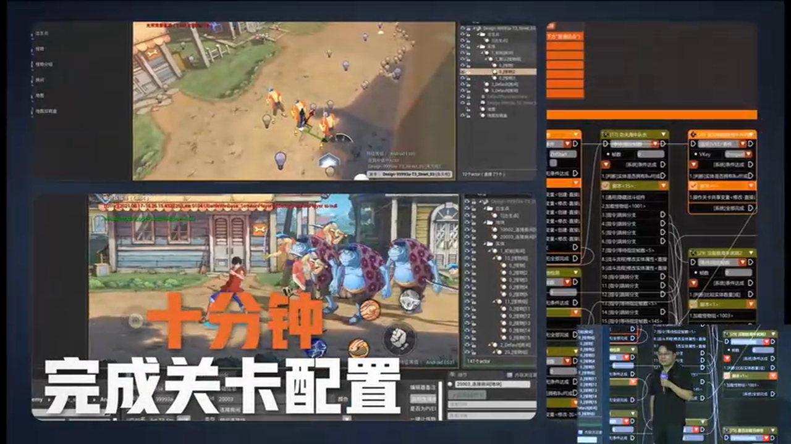

**1. 研发效率提升**

- **配置化开发管线**:程序提供框架,策划通过配置自主产出内容
- **资源同步流水线**:前置质量门禁,多维度预处理和检查
- **编辑器深度定制**:地图编辑、流程编辑、Sequencer 扩展
- **成果**:每周 19 个版本,超出规划 50% 依然按时完成

**2. 质量保障**

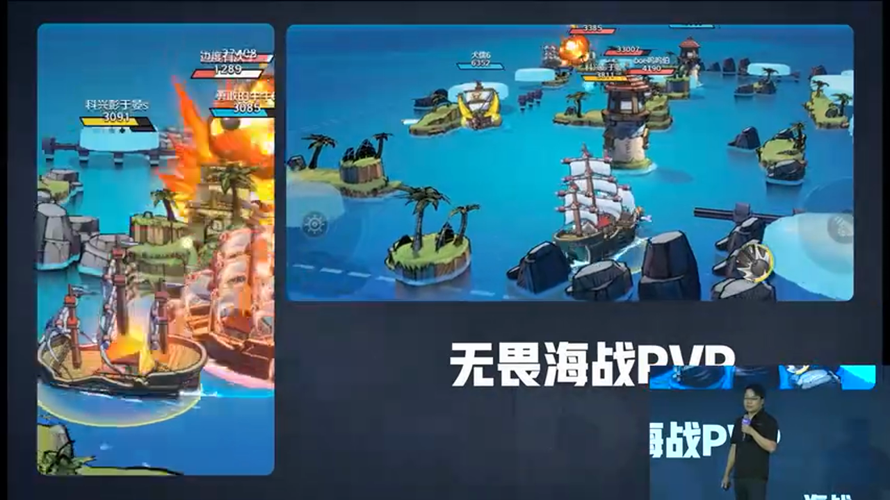

- **Clang AST 静态分析**:代码级的不同步预防,在编译期杜绝逻辑与表现层耦合
- **逻辑与表现分离**:虚基类与依赖注入,支持纯逻辑环境运行
- **验证服同步部署**:客户端与服务端运行相同逻辑,保证稳定性和防作弊

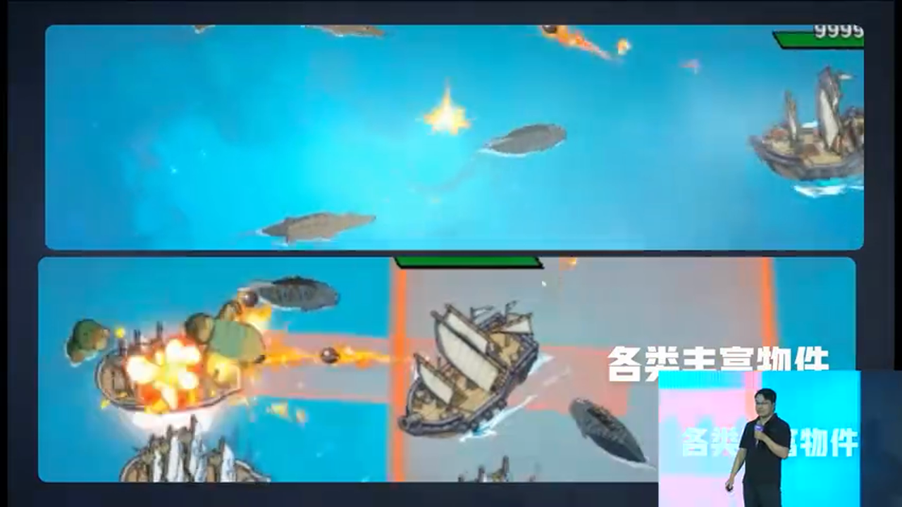

- **成果**:防止了崩溃、野指针、内存泄漏等问题

**3. 快速修复**


- **C++ 热更新**:完整的类型导出,Lua 与 C++ 互调
- **增量式 Patch**:5-10 分钟快速修复线上问题
- **成果**:提升了运营能力,可在任何时候更新新机制


### 5.2 架构设计的关键决策

**逻辑与表现分离**


这种架构使得 Gameplay 可以独立运行在服务器上,用于:
- 战斗验证
- AI 训练
- 防作弊检测

减少了防作弊成本,提高了安全性。

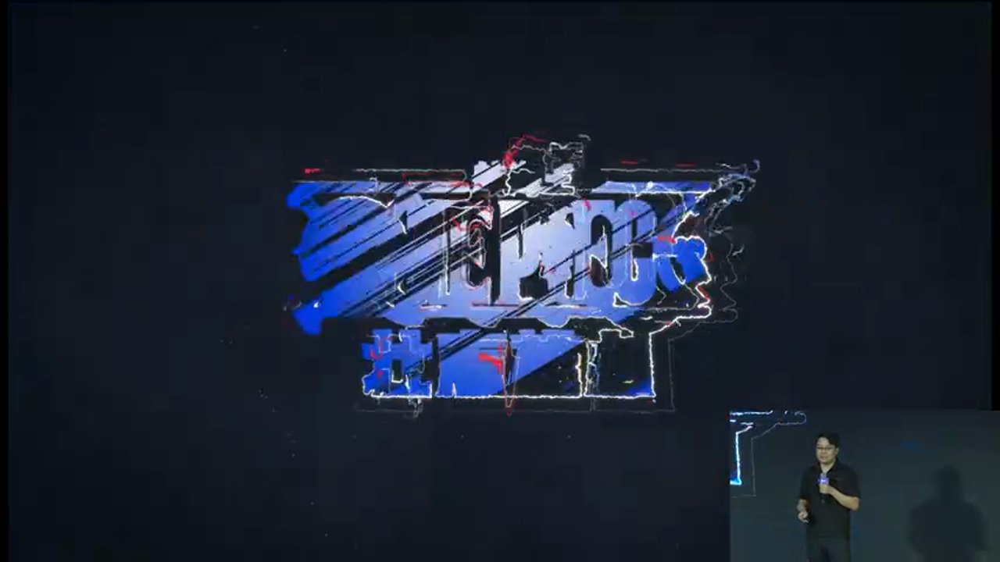

### 5.3 避坑指南

**静态分析工具的局限性**

- **问题**:静态分析无法覆盖运行时动态行为(如反射、虚函数调用)
- **建议**:静态分析 + 动态测试相结合,不能完全依赖静态工具

**热更新的性能开销**

- **问题**:Lua 与 C++ 频繁互调会带来性能开销
- **建议**:热点代码路径保持 C++ 实现,只对非关键路径热更新

**配置化开发的复杂度**

- **问题**:配置系统过于复杂会导致学习成本高,反而降低效率
- **建议**:配置系统设计要简洁直观,提供丰富的编辑器支持和文档

**代码自动导出的维护**

- **问题**:随着项目演进,C++ 接口变化频繁,导出代码需要及时更新
- **建议**:建立自动化导出流程,集成到 CI/CD 中,每次构建自动更新

### 5.4 最佳实践建议

> **方案选型要结合团队实际情况**
>
> 《航海王》选择了配置驱动 + Lua 热更新的方案,但并不是所有项目都适用。选型时需要考虑:
> - 团队技术栈和经验
> - 项目规模和复杂度
> - 平台限制(如 iOS 不支持 JIT)
> - 性能要求和热更新频率

> **工具链建设要持续投入**
>
> 静态分析工具、编辑器扩展、自动化流水线都需要持续维护和优化。建议:
> - 设立专门的工具组或基础设施团队
> - 定期收集一线开发者反馈,迭代工具
> - 将工具能力沉淀为平台能力,支撑多个项目

> **质量门禁要尽早建立**
>
> 问题发现得越早,修复成本越低。建议:
> - 在资源同步阶段就进行多维度检查
> - 在代码提交阶段进行静态分析
> - 在构建阶段进行自动化测试
> - 建立问题追踪和通知机制

---

## 六、技术展望

《航海王》项目的技术实践为 ACT 游戏的工业化开发提供了宝贵经验。未来可以探索的方向包括:

**AI 辅助内容生成**

基于策划配置的历史数据,训练 AI 模型辅助生成新玩法配置,进一步提升生产效率。

**更强大的静态分析能力**

扩展 Clang 工具链,支持更多定制化的代码检查规则,如:
- 性能热点检测
- 内存泄漏预警
- 并发安全性分析

**跨平台热更新优化**

探索更高效的跨平台热更新方案,如:
- WebAssembly 作为热更新载体
- LLVM IR 级别的热更新

**云端验证服的智能化**

将 AI 对手训练、自动化测试、性能分析等能力集成到云端验证服,形成完整的质量保障体系。

---

通过配置化开发、静态分析、热更新等一系列技术手段,《航海王》团队在高频迭代的压力下,实现了每周 19 个版本的稳定交付,同时保持了极低的崩溃率和不同步率。这套技术体系不仅适用于 ACT 游戏,对其他类型的在线游戏也有重要的参考价值。

> **关键takeaway**
>
> - 配置化不是银弹,需要强大的工具链支撑
> - 静态分析在编译期杜绝问题,是质量保障的利器
> - 热更新能力是快速响应市场的关键,但要平衡性能和复杂度
> - 逻辑与表现分离是架构设计的核心原则,带来多重收益
