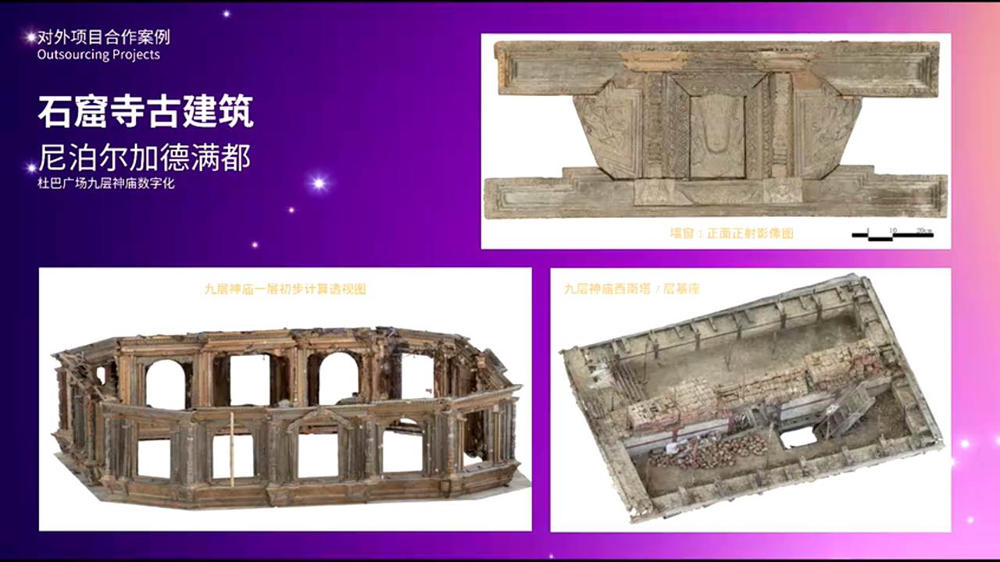
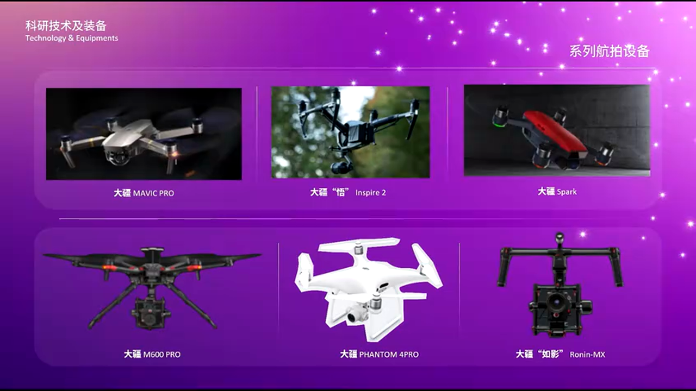
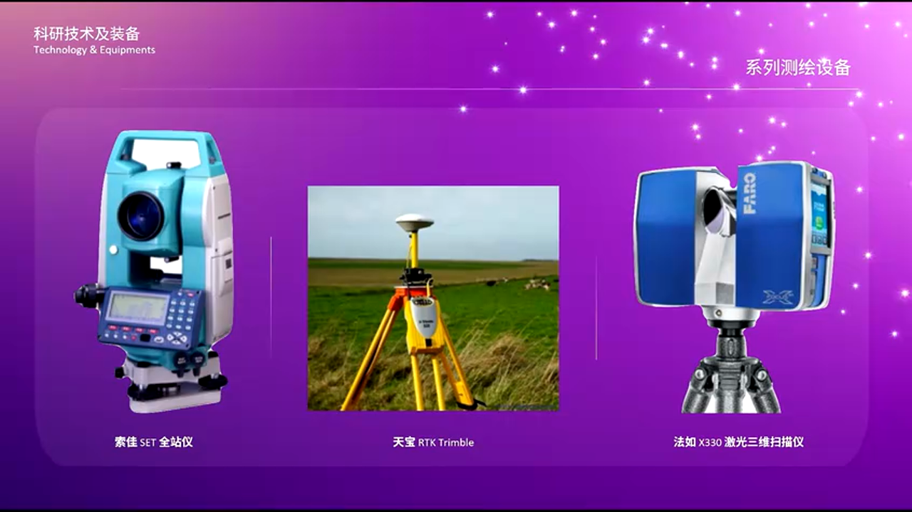
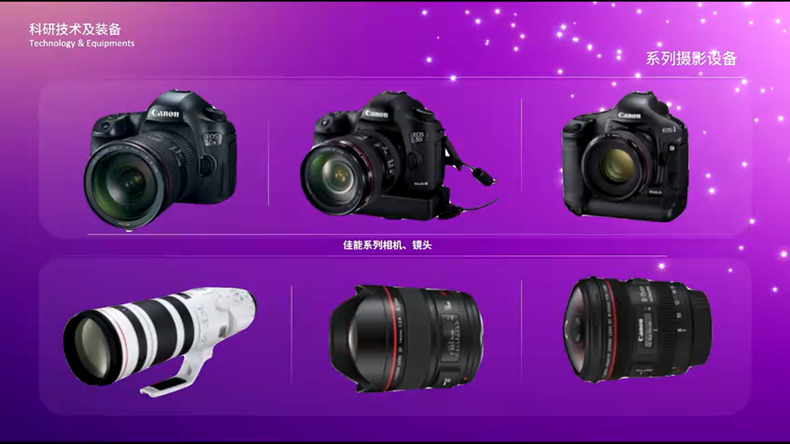
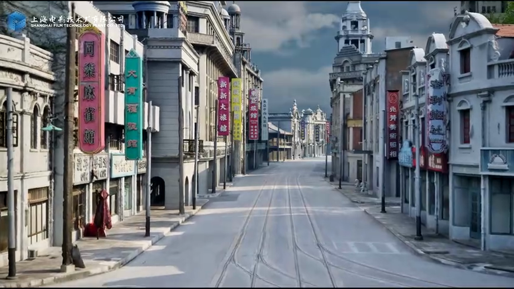
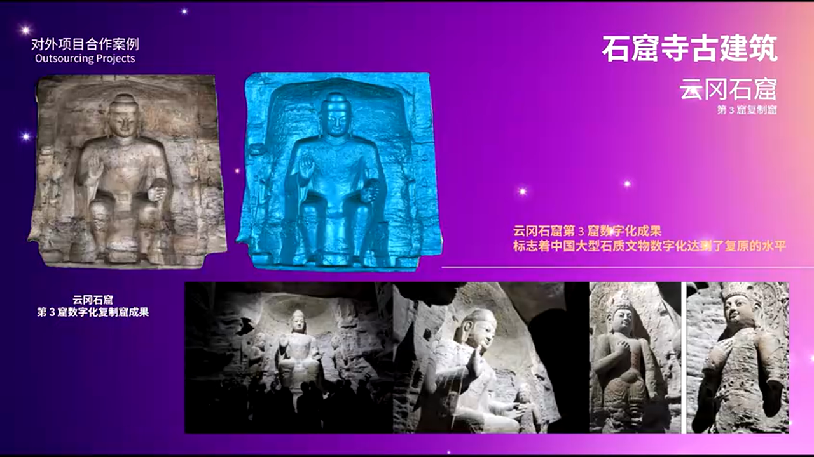
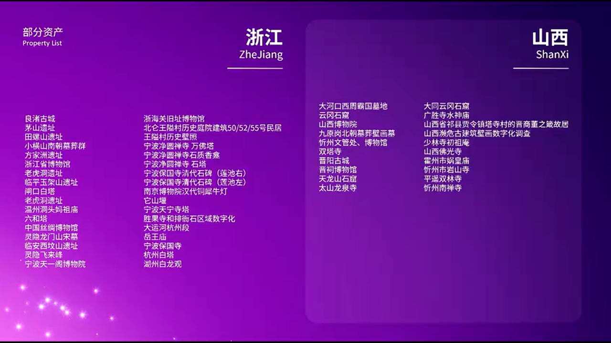

# RealityCapture 在文化遗产数字化中的实战探索：从摄影测量到高保真三维重建

---


## 加入 UE5 技术交流群

如果您对虚幻引擎5的图形渲染技术感兴趣,欢迎加入我们的 **UE5 技术交流群**!

扫描上方二维码添加个人微信 **wlxklyh**,备注"UE5技术交流",我会拉您进群。

在技术交流群中,您可以:
- 与其他UE开发者交流渲染技术经验
- 获取最新的GDC技术分享和解读
- 讨论图形编程、性能优化、构建工具流、动画系统等话题
- 分享引擎架构、基建工具等项目经验和技术难题

---

## 源视频信息和AI生成说明

- **原视频标题**: [UFSH2025]RS在文化遗产中的应用 | 刁常宇 吴铮
- **视频链接**: https://www.bilibili.com/video/BV1itmzBWEzw
- **视频时长**: 21分27秒
- **本文由AI辅助生成**: 本文基于视频内容,经过AI分析和结构化整理而成,旨在为读者提供更易于阅读和理解的技术内容。

---

## 导读

> **核心观点提炼**:
> 1. RealityCapture(Ready Scan)结合 UE5 生态,为文化遗产数字化提供了高效、高精度的工程化解决方案,将大型遗址数字化效率提升40%以上。
> 2. 多模态数据融合(照片+激光点云+视频抽帧)是应对复杂材质文物的关键技术路径,单一采集手段难以满足高保真要求。
> 3. 从数据采集到三维重建、再到跨地域展览,完整工作流的标准化是推动文物数字化从学术走向产业的必要条件。

**前置知识要求**:
- 摄影测量(Photogrammetry)基本原理
- 三维重建技术概览
- UE5 基础操作经验(可选,有助于理解后期应用)

---

## 背景与痛点:文化遗产数字化的现实困境

### 国家战略下的迫切需求

自2020年起,中国文化和旅游部、国家文物局多次发布政策文件,将**文物数字化**列为国家数字化转型的核心组成部分。2022年中办国办联合发布的文件中,明确将数据采集、智慧博物馆建设作为专项部署。这些政策背后,反映出文化遗产保护面临的三大核心痛点:


**痛点1:不可移动文物的永久保存需求**
敦煌莫高窟、龙门石窟、云冈石窟等世界级文化遗产,面临着自然风化、人为破坏、不可抗力灾害等多重威胁。数字化是实现"永久保存"的唯一技术路径。

**痛点2:跨地域展览的技术瓶颈**
传统文物展览受限于物理空间和文物保护要求,无法实现大规模跨地域传播。三维数字化+3D打印技术,可以让"佛光寺东大殿"从山西"搬到"任何博物馆。

**痛点3:技术门槛与工程化能力的鸿沟**
摄影测量技术在学术界已成熟多年,但在文物领域推广时,面临"拍照容易、建模难、处理慢"的工程化困境。传统软件(如PhotoScan、ContextCapture)在处理大型场景时,效率和精度难以兼顾。

---

## 核心技术架构:多模态数据融合的工程化实践

### 技术路线概览

浙江大学文化遗产研究院与技术团队的合作方案,核心在于构建了一套**混合式采集+自动化处理**的工作流:


该方案的技术栈包括:
1. **数据采集层**: 无人机航拍 + 地面激光扫描 + 高精度相机
2. **数据处理层**: RealityCapture(RS)多元数据兼融
3. **应用输出层**: UE5 实时渲染 + 三维打印复制

**为什么选择 RealityCapture?**

在2018年之前,浙江大学团队使用自研代码进行摄影测量。2018年在哈佛大学访学期间,团队首次接触到 RealityCapture,其核心优势在于:

> **性能优势**: 相比 PhotoScan、ContextCapture 等同类软件,处理速度提升 **10倍以上**(基于 SIGGRAPH 报告数据)。这在处理动辄数万张照片的大型遗址项目中,意味着从"数周计算"缩短到"数天交付"。

> **多模态融合能力**: 原生支持彩色激光点云与照片数据的融合建模,解决了单一数据源的精度瓶颈问题。



### 采集设备矩阵:针对不同场景的硬件选择

文物数字化不是"一台相机走天下"的简单任务。根据采集对象的**尺度、材质、环境复杂度**,需要选择不同的设备组合:



**大型遗址(如整座山体+分布式石窟)**:
- **测绘级 GPS/RTK 设备**: 提供厘米级精度的空间基准
- **长距离激光扫描仪**: 覆盖数百米范围的山体轮廓
- **大疆 Matrice 系列无人机**: 搭载全画幅相机,完成航拍正射影像



**中小型文物(如石窟内佛像、古建筑构件)**:
- **手持式激光扫描仪**: 捕捉复杂几何细节
- **关节臂式三维扫描仪**: 用于高反光、透明材质的特殊对象
- **数码后背相机(如飞思 IQ4)**: 1.5亿像素分辨率,保证纹理质量



**特殊需求场景**:
- **高光谱相机**: 用于壁画颜料成分分析
- **全景相机**: 快速采集石窟内部360°环境


> **避坑指南**: 不要盲目追求设备参数的"最高配"。例如,在狭窄石窟内,1亿像素相机可能因机位受限而无法充分发挥优势,此时手持激光扫描仪+5000万像素相机的组合更高效。

---

## 案例深度解析:从采集到交付的完整流程

### 案例1:电视剧《繁花》场景的快速数字化



**项目背景**:
电视剧《繁花》在上影集团搭建了1:1复原的上海南京路和黄河路街景。剧组拍摄结束后,景棚即将拆除。团队需要在**3天内完成现场采集**,并在**1个月内交付高精度三维模型**,以备后续项目重用。


**技术流程**:

**阶段1:现场采集(3天)**
- **设备配置**: 2台大疆无人机(航拍) + 4名摄影师(地面照片) + 手持激光扫描仪(建筑细节)
- **数据量**: 约15,000张照片 + 2GB激光点云数据
- **采集策略**: 无人机按网格化路径完成街道俯拍,地面摄影师负责店铺招牌、门窗等近景特写


**阶段2:数据处理(25天)**
- **导入 RealityCapture**: 利用其**多线程GPU加速**能力,照片对齐耗时约8小时(传统软件需72小时)
- **点云与照片融合**: 激光点云作为几何约束,照片提供高分辨率纹理
- **模型优化**: 在 UE5 中进行 Nanite 优化,生成实时可交互的街景场景


**成果输出**:
- **虚拟漫游系统**: 支持在 UE5 中以第一人称视角漫游街道,用于导演前期勘景
- **资产库**: 提取单体建筑模型,供后续影视项目调用

**经验总结**:
> 该项目的效率提升关键在于**前期规划**。采集前通过无人机预飞,生成低分辨率快速预览模型,提前发现盲区,避免二次返场。

---

### 案例2:云冈石窟第三窟——10米高佛像的毫米级重建



**项目背景**:
云冈石窟第三窟的主佛高达10米,需要实现**毫米级精度**的数字化,并完成1:1实体复制,以便在山东青岛博物馆展览。

**技术挑战**:
1. **高度落差**: 佛像从基座到头部跨越10米,地面拍摄视角受限
2. **光照不均**: 石窟内自然光与人工光混合,造成色彩不一致
3. **材质复杂**: 砂岩表面既有风化粗糙区域,也有平滑雕刻细节

**解决方案**:


**采集设备组合**:
- **电动云台+全画幅相机**: 分5层扫描佛像(每层2米高),相机通过程控云台实现精确俯仰角控制
- **LED 补光灯阵**: 12组可调色温的LED灯,消除石窟内光照死角
- **色卡校准**: 每层拍摄前放置 X-Rite ColorChecker,确保色彩一致性

**数据处理关键步骤**:

```python
# [AI补充] 基于上下文逻辑补全的伪代码示例
# RealityCapture 批处理脚本核心逻辑

import realitycapture_api as rc

# 1. 分层导入照片(避免单次处理内存溢出)
project = rc.create_project()
for layer in range(1, 6):
    photos = load_photos(f"layer_{layer}/*.jpg")
    project.add_images(photos)
    project.align_images(
        accuracy="highest",  # 最高精度对齐
        feature_density=8000  # 每张图提取8000个特征点
    )

# 2. 激光点云约束(提供真实尺度)
laser_scan = rc.import_pointcloud("laser_scan.e57")
project.set_control_points(laser_scan, tolerance=0.5)  # 0.5mm约束误差

# 3. 生成超高密度网格
mesh = project.reconstruct_mesh(
    target_polygons=100_000_000,  # 1亿面片
    texture_resolution=16384  # 16K纹理贴图
)

# 4. 导出为 FBX 供 UE5 使用
mesh.export("buddha_model.fbx", include_textures=True)
```

**三维打印复制流程**:
1. **模型分块**: 将10米模型按1米×1米×0.5米切分为200个子块
2. **3D打印**: 使用工业级FDM打印机(材料:尼龙+玻璃纤维),单块耗时约48小时
3. **拼接上色**: 人工拼接后,由专业工匠按原始照片进行仿古上色


**项目成果**:
- **精度验证**: 通过三坐标测量仪抽检,复制品与原件的平均偏差为 **0.8mm**
- **首创意义**: 这是全球首个10米级文物的摄影测量+3D打印全流程项目

> **批判性思考**: 该项目的精度虽达到毫米级,但在佛像衣纹等浅浮雕区域仍有细节丢失。这是摄影测量的固有局限——对于深度变化小于5mm的特征,单纯依靠照片难以准确重建。未来可引入**结构光扫描仪**作为补充。

---

### 案例3:尼泊尔地震后的古建筑抢救性数字化


**项目背景**:
2015年尼泊尔发生7.8级大地震,加德满都谷地多处古建筑倒塌。中国援助团队前往现场,进行抢救性数字化,为后续修复提供数据支持。

**极限环境下的技术适配**:
- **设备精简化**: 仅携带1台大疆 Phantom 4 Pro + 2台索尼 A7R III,总重量不超过10kg
- **快速建模策略**: 现场采集后,利用 RealityCapture 的**云端处理能力**,在酒店通过笔记本电脑+远程服务器完成建模
- **点云与照片分离处理**: 由于网络带宽受限,先处理照片生成低模,回国后再融合激光点云数据提升精度


**成果应用**:
- **修复方案对比**: 通过数字模型模拟不同修复方案(如"修旧如旧"vs"加固补强"),为当地文保部门提供决策依据
- **国际合作**: 数据贡献给联合国教科文组织的 **Open Heritage** 项目,供全球研究者下载使用

---

## 深度进阶:RealityCapture 的核心技术原理

### 为什么它比其他软件快10倍?

RealityCapture 的性能优势源于其**GPU-first**的架构设计:

**传统软件(如 PhotoScan)的流程**:
1. CPU 提取 SIFT 特征点
2. CPU 进行特征匹配
3. GPU 参与稠密重建(仅此阶段)

**RealityCapture 的流程**:
1. **GPU 并行提取特征**: 使用 CUDA 核心,同时处理数百张照片
2. **GPU 加速匹配**: 利用 Tensor Core(RTX 系列显卡)进行矩阵运算
3. **全流程 GPU Pipeline**: 从特征提取到网格生成,无需频繁 CPU-GPU 数据传输

> **性能数据对比**(基于团队测试):
> - **数据集**: 5000张 4200万像素照片
> - **PhotoScan**: 处理时间 72小时(双路 Xeon + RTX 3090)
> - **RealityCapture**: 处理时间 6.5小时(同配置)

### 多模态数据融合的数学原理

RealityCapture 支持**激光点云+照片**的融合建模,其核心是**非线性最小二乘优化**:

**优化目标函数**:

```
E = w₁ · E_photo + w₂ · E_lidar + w₃ · E_constraint
```

其中:
- `E_photo`: 照片重投影误差(Reprojection Error)
- `E_lidar`: 点云配准误差(ICP误差)
- `E_constraint`: 控制点约束误差
- `w₁, w₂, w₃`: 权重系数(需根据数据质量调整)

**实战经验**:
> 在云冈石窟项目中,激光点云的密度远低于照片生成的点云(1:100)。我们将 `w₂` 设置为 `w₁` 的5倍,强制模型在几何上向激光数据靠拢,同时保留照片的纹理细节。这种"**几何约束+纹理优化**"的策略,是应对复杂场景的关键。

---

## 实战总结与最佳实践

### 技术方案对比

> **方案 A:纯摄影测量(仅照片)**
> - 🟢 优势:设备成本低(单反相机+三脚架即可)、采集速度快
> - 🔴 劣势:对弱纹理表面(如抛光石材)无能为力、尺度漂移风险高
> - 🎯 适用场景:建筑外观、雕塑、壁画等纹理丰富的对象

> **方案 B:纯激光扫描**
> - 🟢 优势:几何精度高(亚毫米级)、不受光照影响
> - 🔴 劣势:设备昂贵(工业级扫描仪单价50万+)、纹理质量差
> - 🎯 适用场景:工业测量、变形监测等高精度需求

> **方案 C:多模态融合(照片+激光)**
> - 🟢 优势:兼顾几何精度与纹理质量、适应复杂材质
> - 🔴 劣势:数据处理复杂度高、需要专业软件支持
> - 🎯 适用场景:**文化遗产数字化的首选方案**

### 避坑指南

**坑1:照片数量不是越多越好**
很多新手认为"拍10000张总比5000张好"。实际上,冗余照片会拖慢计算速度,且不会显著提升精度。**最佳实践**:
- 确保相邻照片的**重叠率在70%-80%**
- 避免拍摄完全重复视角(如连拍10张同一角度)
- 使用 RealityCapture 的**照片质量检测工具**,剔除模糊、曝光不足的图片

**坑2:忽视色彩管理**
不同时间段拍摄的照片,色温差异会导致纹理贴图出现明显接缝。**解决方案**:
- 使用 RAW 格式拍摄,后期统一白平衡
- 每组照片拍摄前放置色卡,在 Photoshop 中批量校色

**坑3:控制点布置不合理**
在大型场景中,如果不设置控制点,模型可能出现"香蕉弯曲"现象(Banana Effect)。**最佳实践**:
- 每50米设置1个GPS控制点
- 控制点应分布在场景的边缘和中心,形成三角网

---

## 未来展望:从档案保存到 AI 训练

浙江大学团队目前已累积**500TB**的文物数字化数据,覆盖全国25个省份、220多个遗址。这些数据的价值不仅在于"永久保存",更在于**数据驱动的创新应用**:


### 与腾讯混元大模型的合作

团队已获得浙江省、山西省文物局的授权,将部分数据用于**多模态大模型训练**:
- **目标**: 训练能够"理解"文物形态、材质、历史信息的 AI 模型
- **应用场景**: 自动化文物病害检测、虚拟修复建议生成、智能导览解说



### 数据开放与行业标准化

当前文物数字化领域面临的最大问题是**数据孤岛**——每个机构的数据格式、精度标准各异。团队正在推动:
- 制定**文物三维数据交换标准**(基于 glTF 2.0 扩展)
- 建立**开放数据集**(脱敏后的公开数据,供高校科研使用)

---

## 结语

文化遗产数字化不是简单的"拍照建模",而是涉及光学、计算几何、色彩科学、文物保护等多学科交叉的系统工程。RealityCapture 结合 UE5 生态,为这一领域提供了工程化的解决方案,但技术工具只是手段,**如何将数据转化为可传播、可应用的文化资产**,才是真正的挑战。

> **致谢**: 感谢 Epic Games 和 RealityCapture 团队为文物保护领域提供的技术支持和免费授权。正是这些来自产业界的力量,让公益性的文化遗产保护工作能够持续推进。

如果你对文物数字化技术感兴趣,欢迎在评论区分享你的经验或疑问。让我们一起用技术守护人类文明的记忆。

---

## 参考资料

1. 浙江大学文化遗产研究院项目案例库
2. Epic Games - RealityCapture 官方文档
3. SIGGRAPH 2023 - Photogrammetry in Cultural Heritage
4. 中国国家文物局 - 文物数字化技术规范(2022版)

---

**关于作者**:
本文内容整理自 UFSH2025 技术分享会,演讲嘉宾为浙江大学文化遗产研究院刁常宇教授和合作团队吴铮。更多技术细节可观看原视频。
