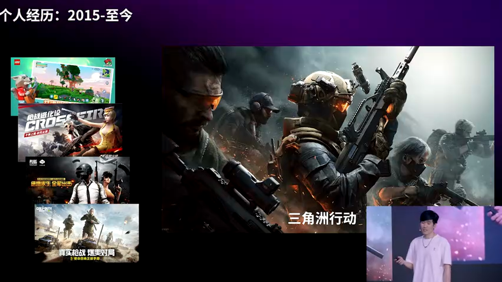
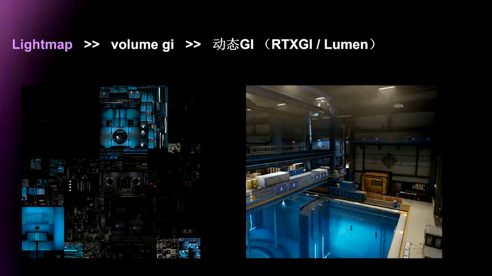
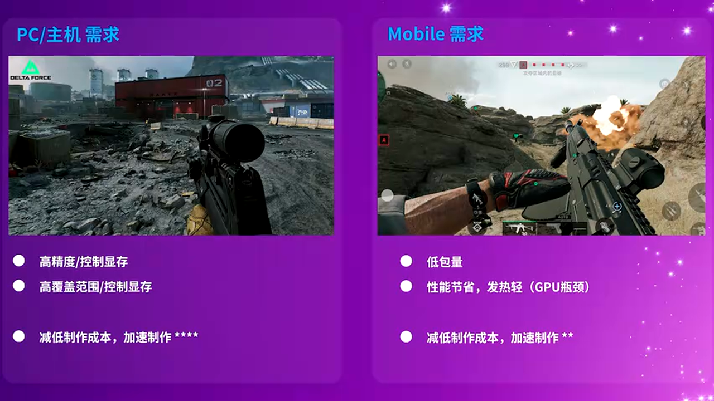
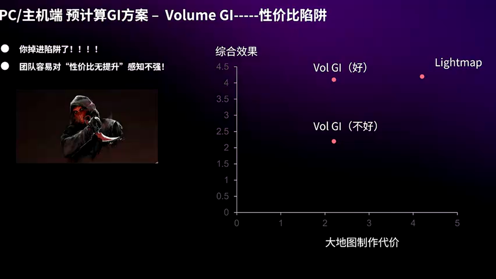
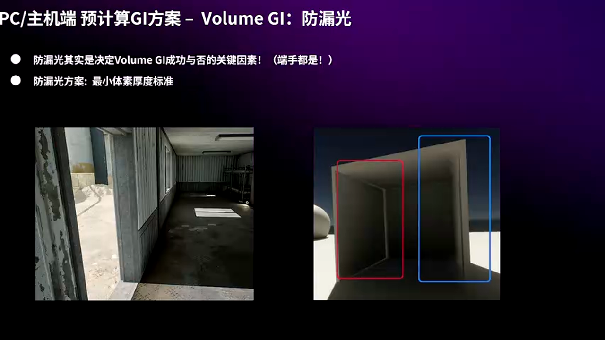
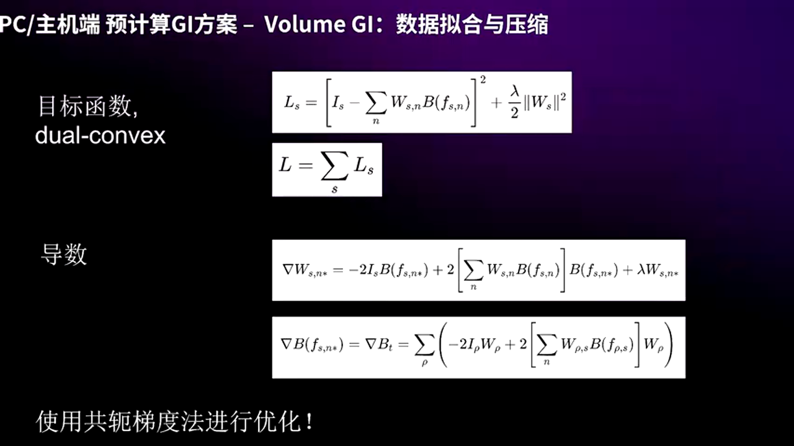
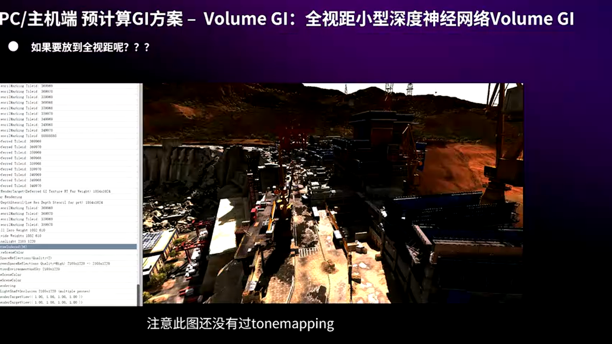
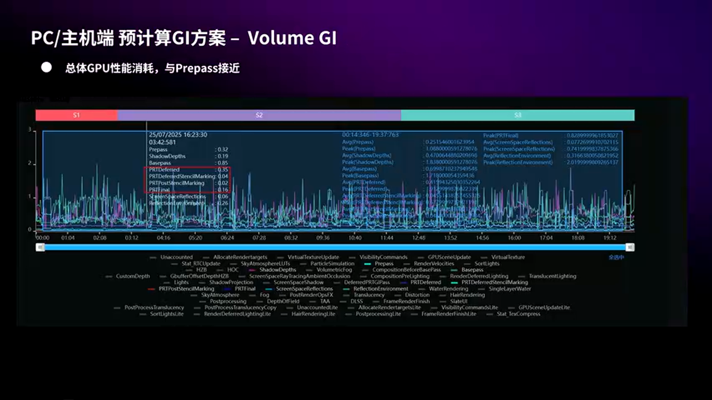
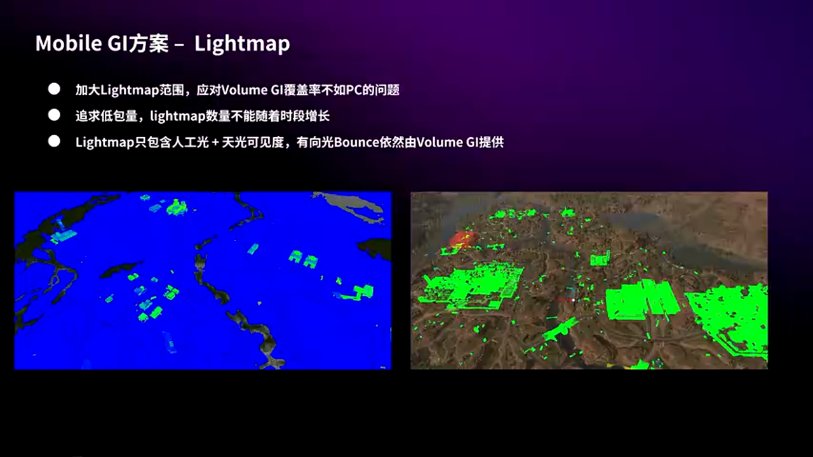
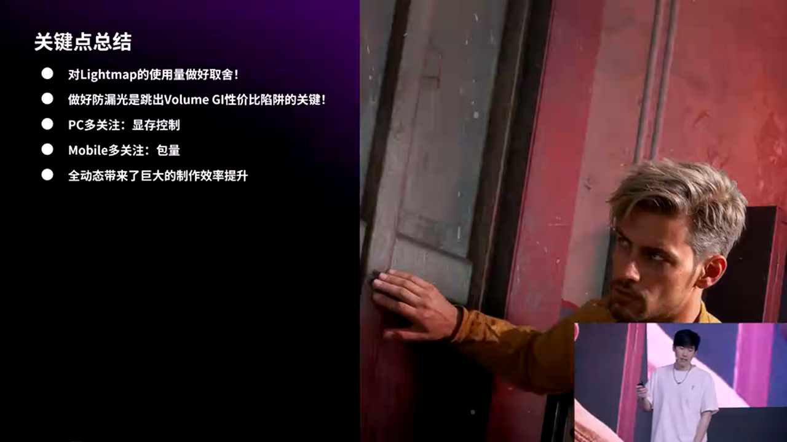

# 《三角洲行动》全局光照技术深度剖析：从理论到实践的跨平台GI方案

---

## 加入 UE5 技术交流群
如果您对虚幻引擎5的图形渲染技术感兴趣，欢迎加入我们的 **UE5 技术交流群**！
扫描上方二维码添加个人微信 **wlxklyh**，备注"UE5技术交流"，我会拉您进群。
在技术交流群中，您可以：
- 与其他UE开发者交流渲染技术经验
- 获取最新的GDC技术分享和解读
- 讨论图形编程、性能优化、构建工具流、动画系统等话题
- 分享引擎架构、基建工具等项目经验和技术难题
---

## 视频信息

**原视频标题**: [UFSH2025]《三角洲行动》中的全局光照方案 | 蔚东辰 腾讯天美J3工作室 引擎开发工程师

**视频时长**: 31分6秒

**演讲者**: 蔚东辰，腾讯天美J3工作室引擎技术组

**视频链接**: https://www.bilibili.com/video/BV1C62PBeEha

**AI生成说明**: 本文由AI根据视频内容自动生成，结合了视频字幕和关键截图，力求准确传达技术要点。

---

## 开篇：跨平台全局光照的挑战与机遇

在现代游戏开发中，全局光照（Global Illumination, GI）系统是实现真实感画面的核心技术之一。《三角洲行动》作为一款多人射击游戏，面临着独特的技术挑战：如何在PC和移动端两个性能差异巨大的平台上，实现高质量、高性能且易于制作的全局光照方案？


*《三角洲行动》项目背景*

腾讯天美J3工作室的蔚东辰工程师在UFSH2025上分享了他们的解决方案。这个方案不仅要满足技术性能要求，更要在项目制作成本、迭代效率和最终画面质量之间找到最佳平衡点。本文将深入剖析这套跨平台GI系统的设计思路、技术细节和实践经验。

---

## 第一部分：全局光照方案的技术选型

### 1.1 主流GI技术方案对比

在开始技术选型之前，让我们先回顾一下业界主流的全局光照方案：


*主流全局光照技术方案*

**Lightmap（光照贴图）**：
- 最传统、最成熟的方案
- 运行时性能极高，只需简单的纹理采样
- 可以通过增加lightmap密度获得高精度
- 缺点：制作成本高，需要UV展开和烘焙

**Volume GI（体积全局光照）**：
- 在3D空间中以体素形式存储光照信息
- 无需UV，制作效率高
- 适合大范围场景
- 缺点：需要权衡精度和显存占用

**Lumen（全动态GI）**：
- UE5的实时全局光照解决方案
- 迭代效率极高，所见即所得
- 缺点：性能开销大，需要高端硬件支持

### 1.2 性能与制作成本的权衡


*不同GI方案的性能特点*

从性能角度看，Lightmap无疑是最优选择。它通过离线烘焙，将复杂的光照计算预先完成，运行时只需简单的纹理查询。但这种高性能是有代价的：

**Lightmap的制作挑战**：
1. 需要精心设计UV布局
2. 光照烘焙耗时长
3. 迭代周期长，调整困难
4. 大地图的lightmap数据量巨大


*制作成本的考量*

相比之下，Volume GI在制作效率上有明显优势：
- 无需UV展开
- 自动化流水线可以持续烘焙
- 美术可以快速看到效果
- 适合大范围场景

而Lumen则将制作成本降到了极致：
- 完全实时，无需等待
- 所见即所得
- 但性能消耗是前两者的数量级差异

### 1.3 《三角洲行动》的技术需求分析


*双端平台的不同需求*

《三角洲行动》面临的核心挑战：

**PC端需求**：
- 追求高画质效果
- 需要控制显存占用（Volume GI精度提高会导致显存几何级增长）
- 地图复杂度高，如果全用Lightmap制作成本会非常大
- 期望Volume GI能发挥制作效率优势

**移动端需求**：
- 包体大小是首要约束
- GPU性能有限
- 大多数手游GI效果不佳
- 如果使用Volume GI，性能开销不能比Lightmap增长太多

**共同需求**：
- 所有地图端手同步
- 支持TOD（Time of Day）系统
- 玩家可见区域全覆盖GI
- 多人竞技需要保证高帧率

### 1.4 最终技术选型：混合方案


*最终的技术选型策略*

基于以上分析，《三角洲行动》采用了混合方案：

**多人对战模式**：
- 主要使用Lightmap + Volume GI组合
- Volume GI使用范围更广
- 优先保证运行效率（120-144fps）
- 在此基础上提升制作速度

**单人战役模式**：
- PC端直接使用Lumen
- 没有多人竞技的帧率压力
- 可以追求更高的画面品质
- 迭代效率最优

这种"因地制宜"的策略，充分考虑了不同游戏模式的特点和需求。

---

## 第二部分：PC端Volume GI深度解析

### 2.1 防漏光：Volume GI成功的关键


*Volume GI的性价比陷阱*

在深入技术细节之前，必须强调一个至关重要的问题：**防漏光**。

这是一个经过多个项目血泪教训总结出的经验。让我们看这张图：

- **理想的Volume GI**：大幅降低制作成本，综合效果略有下降
- **陷阱中的Volume GI**：制作成本下降了，但画面质量或性能也大幅下降

最常见的问题是：
1. 程序觉得自己做了很厉害的系统
2. 美术工作负担确实下降了
3. 但测试反馈效果不好或性能不佳
4. 为了修复问题，反复调整，最终把低成本优势抵消了


*漏光是Volume GI的固有问题*

**漏光产生的原因**：
当体素的宽度比墙厚度大时，光照就可能"穿透"墙体，从亮的一侧漏到暗的一侧。

**解决方案的核心思想**：
从项目第一天就明确告诉美术团队：**所有墙体厚度必须超过体素精度**。

在《三角洲行动》中，体素精度是0.25米。因此规则是：
- 所有墙体厚度必须≥0.25米
- 对于必须小于0.25米的特殊情况（如铁皮），再想其他办法

这个简单明确的标准，从制作层面规避了绝大多数漏光问题，避免了运行时昂贵的漏光修复算法。

### 2.2 稀疏化存储：OpenVDB启发的数据结构


*0.25米的高精度体素需要稀疏存储*

0.25米的体素精度虽然能保证不漏光，但如果用规整的3D网格存储，显存会轻松达到8GB、16GB，这是不可接受的。

解决方案是参考Houdini核心组件OpenVDB的稀疏化存储方案：


*分层稀疏存储结构*

**数据组织方式**：
1. 将整个场景分成64m×64m的数据块
2. 每个数据块内部，按4米精度存储粗糙体素
3. 对每个4米体素，向外扩展并细分为1米体素
4. 只保留距离表面3米以内的1米体素
5. 再次细分为0.25米体素，只保留距离表面0.3米的部分

这样形成一个逻辑上的八叉树结构（实际是64叉树），高精度数据只贴着表面分布。

### 2.3 快速访问：Bit Mask索引技术


*使用Bit Mask快速定位体素*

稀疏存储带来了新问题：给定一个世界坐标Position，如何快速找到对应的体素数据？

**解决方案**：
1. 将体素树按广度优先遍历，形成一维数组
2. 每个节点存储一个64-bit的Exist Mask
3. Mask中每个bit表示对应的子节点是否存在

**查询过程**：
1. 根据Position计算出在父节点中的局部坐标
2. 确定对应Mask中的哪一个bit
3. 使用GPU的CountBit指令，统计该bit之前有多少个1
4. 父节点的首个子节点索引 + CountBit结果 = 目标子节点索引

这个算法利用了广度优先遍历的特性：一个节点的所有子节点在数组中连续存储。最多重复3次这个过程就能定位到叶子节点。

### 2.4 数据压缩：基于Probe的线性组合


*通过Probe压缩体素数据*

即使有了稀疏存储，每个体素48bit（6个方向的Irradiance）的数据量仍然很大，特别是支持TOD时需要存储多个时段的数据。

**压缩策略**：
1. 沿着网格表面生成稀疏的Probe点
2. 每个Probe存储完整的48bit MN Cube数据
3. 每个体素只存储4个Probe索引和4个权重（共16字节）
4. 运行时通过线性组合还原体素的光照数据


*全局优化求解权重*

**优化目标**：
最小化所有体素的还原误差平方和：
```
minimize Σ(reconstructed - original)²
```

这是一个可导的凸优化问题，使用共轭梯度法求解。由于问题规模较小且结构良好，单个64m数据块的优化只需几秒钟。

**压缩效果**：
- 体素数据从48bit降到16bit（3倍压缩）
- 相邻体素的Probe索引相同，可以进一步用游程编码压缩
- 支持多时段TOD，但体素数据量不随时段数增长

### 2.5 全场景覆盖：神经网络驱动的远景GI


*需要全地图覆盖的GI视距*

前面的高精度Volume GI只能覆盖玩家周围有限范围（受显存限制）。但我们希望整个地图都有GI覆盖，特别是太阳光的间接光。


*小型神经网络表达光照函数*

**解决方案**：使用8米精度的巨型体素，每个体素内部用一个小型神经网络表达光照函数。

**网络结构**：
- 输入：XYZ局部坐标（3个值）
- 隐藏层：2层，每层宽度4
- 激活函数：Leaky ReLU
- 输出：单一Luminance值（而非RGB，提高精度）

**训练过程**：
1. 用光线追踪器密集采样体素内部的光照
2. 使用这些样本训练神经网络
3. 手动推导梯度，用共轭梯度法优化
4. 单个体素训练只需几秒


*神经网络拟合的天光遮蔽效果*

**效果特点**：
- 从外部看，建筑的天光遮蔽非常准确
- 从内部看会有漏光，但作为远景这是可接受的
- 网络很小（几十个参数），推理只需2次矩阵乘法
- 显存占用极低（每个地图10-20MB）


*完整GI系统的性能表现*

**性能表现**（3080显卡）：
- Base Pass: 0.85ms
- 完整GI（近景+远景+天光）: 0.35ms
- 接近Depth Pre-Pass的开销（0.32ms）

---

## 第三部分：移动端GI优化策略

### 3.1 移动端的特殊约束


*移动端的技术选型*

移动端面临完全不同的技术约束：

**性能特点**：
- GPU性能有限，不能用复杂的体素遍历算法
- CPU相对充裕（8核，4大核+4小核）
- 可以利用CPU做预处理，GPU只做简单采样

**存储约束**：
- 包体大小是首要限制
- 不能像PC那样使用大量显存
- 需要更激进的压缩策略

### 3.2 CPU驱动的3D纹理方案


*移动端的CPU+GPU混合架构*

**核心思路**：
1. 离线数据仍然用分块稀疏存储（节省包体）
2. 运行时CPU组装包围相机的3D纹理
3. GPU只需简单的3D纹理采样


*数据块内部的分段连续存储*

**数据组织**：
- 每个数据块内部分段存储
- 每段是一个规整的小型3D网格
- 段与段之间不连续，但段内部连续

**组装过程**：
1. CPU确定相机周围需要哪些数据块和段
2. 将这些段对齐拷贝到3D纹理对应位置
3. 使用SIMD指令加速拷贝过程
4. 分帧上传到GPU

**优势**：
- GPU端极其简单，只需3D纹理采样
- CPU的Cache友好性好
- 可以利用移动端的异构计算优势

### 3.3 防漏光：Tier Volume方案


*Tier Volume防漏光示意*

移动端的体素精度是1米，无法通过制作规避漏光。必须有运行时的防漏光方案。

**Tier Volume（IV）定义**：
- 随建筑一起制作的简化碰撞体
- 表达建筑的大致形状
- 必须是凸多面体
- 一个建筑可以有多个IV组合


*IV的运行时应用*

**防漏光原理**：
1. 离线阶段，计算每个IV面片可能导致漏光的体素列表
2. 运行时判断相机在面片的哪一侧
3. 如果相机在墙的一侧，将墙另一侧的体素数据清零

**代价**：
- 需要美术制作IV（但比制作Lightmap简单得多）
- 会有延迟更新（因为3D纹理分帧上传）
- 实际使用中玩家并不在意这个延迟

### 3.4 移动端性能与包体数据


*移动端的包体控制*

**包体数据**（最大地图）：
- GI数据：334MB
- 如果全用Lightmap：至少1.5GB以上
- 包体节省效果显著

**性能表现**：
- 防漏光没有造成明显性能问题
- 太阳光Bounce相比Lightmap确实有性能开销
- 但覆盖范围只有眼前64米
- 配合远景的Lightmap天光遮蔽，整体效果可接受

---

## 第四部分：单人战役的Lumen方案

### 4.1 为什么单人战役选择Lumen


*Lumen在单人战役中的优势*

单人战役的开发时间很短，但画面品质要求高。Lumen的优势在这里得到充分发挥：

**制作效率**：
- 完全实时，无需等待烘焙
- 美术可以立即看到光照效果
- 迭代速度极快

**画面品质**：
- 全动态GI，效果最真实
- 支持动态物体的光照交互
- 没有漏光等人工痕迹

**性能考虑**：
- 单人模式没有多人竞技的高帧率要求
- 可以接受更高的性能开销
- 目标玩家群体显卡性能较好

### 4.2 软光追 vs 硬件光追


*软件光追的性能考虑*

有趣的是，《三角洲行动》的单人战役使用的是**软件光追**而非硬件光追。

**原因**：
- 测试发现，3080级别以上显卡，硬件光追才会比软件光追快
- 为了照顾中低端显卡用户
- 软件光追在这个场景下性能足够好

这个选择体现了"以玩家为中心"的技术决策思路。

---

## 第五部分：工程实践与经验总结

### 5.1 SIMD优化的重要性


*大量使用SIMD加速*

整个系统大量使用了SIMD（Single Instruction Multiple Data）优化：

**应用场景**：
- 体素数据的压缩和解压
- 神经网络的推理
- 移动端3D纹理的组装
- 各种优化算法的矩阵运算

**工程实践**：
- 虚幻引擎对SIMD的封装非常完善
- 直接使用函数名，不需要写复杂的intrinsics
- 跨平台支持良好

### 5.2 技术选型的思维框架


*技术选型的核心原则*

通过《三角洲行动》的案例，我们可以总结出技术选型的思维框架：

**1. 优先考虑项目约束**：
- 不是技术越先进越好
- 要考虑目标平台、目标用户、项目周期
- 《三角洲行动》的核心约束是跨平台和制作效率

**2. 从约束推导技术需求**：
- PC端：高画质 + 控制显存 → 稀疏Volume GI
- 移动端：低包体 + 低性能开销 → CPU驱动方案
- 单人战役：快速迭代 → Lumen

**3. 防患于未然**：
- 防漏光必须从第一天就考虑
- 不要等问题出现再修复
- 制作规范比运行时算法更重要

**4. 性能与效果的平衡**：
- 0.25米体素精度是经过权衡的结果
- 远景用神经网络是性价比选择
- 移动端1米精度+IV是妥协方案

### 5.3 避免的技术陷阱

基于项目经验，有几个重要的陷阱需要避免：

**陷阱1：过度追求技术先进性**
- 不要为了用新技术而用新技术
- Lumen很好，但不适合多人竞技
- 要根据实际需求选择

**陷阱2：忽视制作成本**
- 技术方案的性价比不只看运行时性能
- 制作成本、迭代效率同样重要
- Volume GI的价值在于降低制作成本

**陷阱3：运行时修复制作问题**
- 防漏光应该在制作阶段解决
- 不要指望运行时算法修复所有问题
- 制作规范 > 运行时算法

**陷阱4：一刀切的解决方案**
- 不同平台、不同模式可以用不同方案
- 混合方案往往是最优解
- 灵活性很重要

---

## 第六部分：未来展望

### 6.1 Volume GI的发展趋势


*Lumen代表的未来方向*

演讲者认为，随着硬件性能的提升，Lumen这样的全动态GI方案会越来越普及：

**理由**：
- 制作效率的提升是巨大的
- 硬件性能每年都在进步
- 几年后，3080可能成为"最低配置"
- 那时Lumen会成为主流方案

但在此之前，Volume GI仍然是高性价比的选择。

### 6.2 技术融合的趋势

从《三角洲行动》的方案可以看出，未来的趋势是**技术融合**：

- Lightmap + Volume GI + Lumen 混合使用
- 不同场景、不同平台用不同方案
- 没有"银弹"，只有最合适的组合

这也是为什么演讲者提到，很多3A游戏（如《使命召唤》、《战地》）都在使用混合方案。

### 6.3 AI在图形渲染中的应用

《三角洲行动》用神经网络压缩远景GI数据，是AI在图形渲染中应用的一个例子。

**未来可能的方向**：
- 更复杂的神经网络表达光照
- AI辅助的光照烘焙
- 实时的AI降噪
- 神经辐射场（NeRF）在游戏中的应用

但要注意，AI不是万能的。在《三角洲行动》中，神经网络很小、很简单，这是经过权衡的结果。

---

## 总结：技术为项目服务

《三角洲行动》的全局光照方案是一个优秀的工程实践案例。它告诉我们：

**核心理念**：
1. **技术为项目服务**：不是技术越先进越好，而是最适合项目的最好
2. **性价比思维**：综合考虑性能、效果、制作成本、迭代效率
3. **防患于未然**：从第一天就考虑关键问题（如防漏光）
4. **灵活组合**：不同场景用不同方案，混合是常态

**技术亮点**：
1. **稀疏化存储**：参考OpenVDB，实现高精度低显存
2. **Bit Mask索引**：利用硬件指令，实现快速访问
3. **Probe压缩**：全局优化，大幅降低数据量
4. **神经网络远景**：小网络大效果，性价比极高
5. **CPU驱动移动端**：发挥平台优势，规避劣势
6. **IV防漏光**：简单有效的移动端方案

**工程经验**：
1. 制作规范比运行时算法更重要
2. SIMD优化是必须的
3. 不要过度优化，够用就好
4. 测试和迭代很重要

希望这篇深度解析能帮助你理解现代游戏引擎中全局光照系统的设计思路和实现细节。技术永远在进步，但工程思维和方法论是永恒的。

---

**致谢**：感谢蔚东辰工程师的精彩分享，感谢腾讯天美J3工作室的技术开放精神。

**参考资料**：
- UFSH2025演讲视频
- OpenVDB官方文档
- Unreal Engine 5 Lumen技术文档

---

*本文由AI基于视频内容生成，如有错误或遗漏，欢迎指正。*


